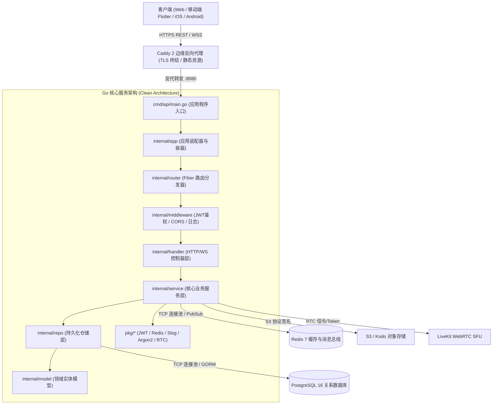
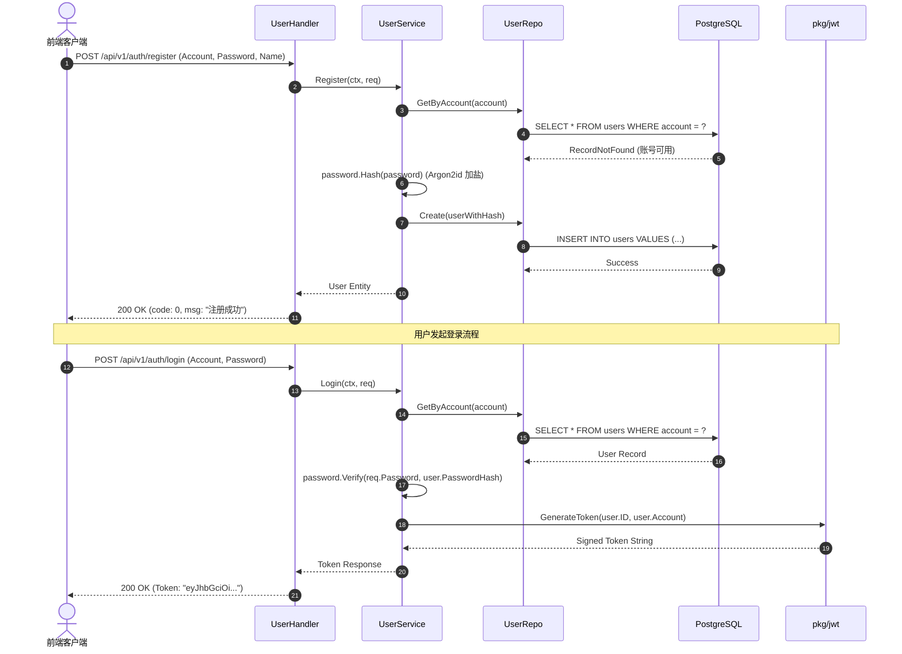
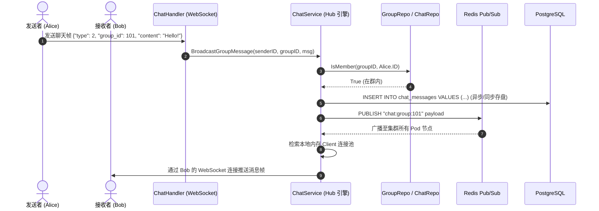

# 毕业设计后端系统源码级技术深度剖析全景大典 (`tech.md`)

> **适用读者**: 本手册专为 Go 语言初学者、毕业设计答辩评审专家及全栈系统工程师打造。从底层内存对齐、结构体组合与接口鸭子类型，一直剖析到 Fiber 高并发 Web 内核、GORM 数据库连接池、Signal 协议端到端加密 (E2EE)、WebRTC 音视频信令与 Incus 轻量级系统容器部署。
> **深度承诺**: 涵盖当前代码仓库中**所有 55 个核心 Go 源码文件、708 个独立代码区块（函数、方法、结构体、接口、常量组、变量组）**。杜绝任何代码碎片化截取，每一个函数均呈现 100% 完整源代码，并辅以全流程逐行语义级剖析，绝不省略任何业务分支。

---

## 目录索引 (Table of Contents)

* [第一部分：宏观全景与架构总览 (Architecture & Blueprint)](#第一部分宏观全景与架构总览)
  * [1.1 业务愿景与系统边界](#11-业务愿景与系统边界)
  * [1.2 全栈核心技术选型矩阵](#12-全栈核心技术选型矩阵)
  * [1.3 系统全局分层架构拓扑 (Clean Architecture)](#13-系统全局分层架构拓扑)
  * [1.4 代码仓库物理文件全景图谱](#14-代码仓库物理文件全景图谱)
  * [1.5 五大核心业务时序图谱](#15-五大核心业务时序图谱)
* [第二部分：零基础 Go 语言极速通关与工程范式 (Go Engineering for Beginners)](#第二部分零基础-go-语言极速通关与工程范式)
  * [2.1 指针模型与内存逃逸分析](#21-指针模型与内存逃逸分析)
  * [2.2 结构体、接口与鸭子类型 (Duck Typing)](#22-结构体接口与鸭子类型)
  * [2.3 高并发协程、通道与同步原语 (Goroutine & Sync)](#23-高并发协程通道与同步原语)
  * [2.4 Web 框架与 ORM 底层机理 (Fiber & GORM)](#24-web-框架与-orm-底层机理)
  * [2.5 工业级错误处理与防御规范 (Guard Clauses)](#25-工业级错误处理与防御规范)
* [第三部分：入口与生命周期编排源码详解 (Entry & Lifecycle)](#第三部分入口与生命周期编排源码详解)
* [第四部分：领域实体模型源码逐块详解 (Domain Models & Entities)](#第四部分领域实体模型源码逐块详解)
* [第五部分：数据持久化仓储层源码逐块详解 (Repositories / DAO)](#第五部分数据持久化仓储层源码逐块详解)
* [第六部分：核心业务服务层源码逐块详解 (Business Services)](#第六部分核心业务服务层源码逐块详解)
* [第七部分：HTTP 控制器与接口层源码逐块详解 (API Handlers)](#第七部分http-控制器与接口层源码逐块详解)
* [第八部分：路由与中间件源码逐块详解 (Routing & Middlewares)](#第八部分路由与中间件源码逐块详解)
* [第九部分：公共基础设施工具库源码逐块详解 (Infrastructure Packages `pkg/*`)](#第九部分公共基础设施工具库源码逐块详解)
* [第十部分：硬核专项技术架构深度拆解 (Special Deep Dives)](#第十部分硬核专项技术架构深度拆解)
  * [10.1 端到端加密 (E2EE) 密钥分发与防中间人攻击](#101-端到端加密-e2ee-密钥分发与防中间人攻击)
  * [10.2 高并发 WebSocket 与 Redis 分布式广播](#102-高并发-websocket-与-redis-分布式广播)
  * [10.3 WebRTC 音视频点对点与多人信令机制](#103-webrtc-音视频点对点与多人信令机制)
  * [10.4 LBS 空间地理位置检索 (Haversine 算法)](#104-lbs-空间地理位置检索-haversine-算法)
* [第十一部分：运维容器化、安全反代与部署编排 (DevOps & Deployment)](#第十一部分运维容器化安全反代与部署编排)
  * [11.1 Incus 系统轻量级容器构建规范](#111-incus-系统轻量级容器构建规范)
  * [11.2 Caddy 生产级反向代理与自动化 TLS](#112-caddy-生产级反向代理与自动化-tls)
  * [11.3 OpenRC 守护进程管理](#113-openrc-守护进程管理)
  * [11.4 配置文件 `config.yaml` 生产参数速查](#114-配置文件-configyaml-生产参数速查)
* [第十二部分：测试体系与自动化验证 (Testing & Verification)](#第十二部分测试体系与自动化验证)
  * [12.1 依赖打桩单元测试哲学 (`test_fakes_test.go`)](#121-依赖打桩单元测试哲学)
  * [12.2 控制器 HTTP 模拟测试规范 (`handler_test_helpers_test.go`)](#122-控制器-http-模拟测试规范)
  * [12.3 全链路端到端自动化测试脚本 (`api/e2e_test.py`)](#123-全链路端到端自动化测试脚本)
* [第十三部分：全量 API 接口规范与错误码大典 (API Reference & Error Codes)](#第十三部分全量-api-接口规范与错误码大典)
  * [13.1 全量 RESTful HTTP 接口速查表](#131-全量-restful-http-接口速查表)
  * [13.2 WebSocket 实时信令协议帧规范](#132-websocket-实时信令协议帧规范)
  * [13.3 业务错误码字典与排错指导](#133-业务错误码字典与排错指导)
* [第十四部分：新手避坑指南与常见故障自查 (Developer FAQ)](#第十四部分新手避坑指南与常见故障自查)

---

## 第一部分：宏观全景与架构总览

### 1.1 业务愿景与系统边界

本系统是基于 Go 语言构建的高并发、高安全、分布式可扩展的**综合即时通信 (IM)、端到端加密会话 (E2EE)、实时音视频通话 (WebRTC) 与地理社交 (LBS) 后端服务平台**。

系统突破了传统单体 Web 应用的技术边界，核心能力如下：
1. **军工级通信安全**: 基于 Signal 协议体系与 X3DH 密钥交换，在服务器“零明文知情”的前提下实现点对点私聊与多人群聊密文通信。
2. **极速双工长连接**: 采用 Fiber WebSocket + Redis Pub/Sub 分布式消息总线，单节点支持海量并发长连接常驻保活与微秒级广播推送。
3. **低延迟音视频互动**: 集成 LiveKit WebRTC SFU 媒体服务，通过服务端 Token 签发与信令通道实现点对点与多人网状音视频通话。
4. **高精度球面空间计算**: 采用半正矢公式 (Haversine Formula) 测算地球球面两点大圆弧距离，提供低时延“附近的人”搜索与位置动态更新。

### 1.2 全栈核心技术选型矩阵

| 技术维度 | 选型组件 | 选用版本 | 核心技术优势与决策理由 |
| :--- | :--- | :--- | :--- |
| **开发语言** | Go (Golang) | 1.26+ | 原生 CSP 并发模型、静态编译为单个执行文件、极小内存足迹 |
| **Web 框架** | Fiber v2 (`gofiber/fiber/v2`) | v2.52.13 | 基于 Fasthttp 的零内存分配高性能路由与上下文管道，QPS 显著优于传统 net/http 框架 |
| **持久化存储** | PostgreSQL 16 + GORM | PG 16 / GORM v1.31.1 | 完备的 ACID 事务能力、JSONB 与空间字段原生支持，配合 GORM 自动迁移 |
| **缓存与总线** | Redis 7 + go-redis/v9 | v9.20.0 | 微秒级会话状态存取、在线心跳维持与跨节点 Pub/Sub 广播总线 |
| **配置管理** | Viper (`spf13/viper`) | v1.21.0 | 业界标准配置加载库，支持 YAML 文件解析与环境变量动态注入 |
| **结构化日志** | 标准库 `log/slog` | Go 1.26 内置 | 官方高性能结构化日志器，支持 JSON 与 Text 格式键值对输出 |
| **密码安全** | Argon2id (`x/crypto/argon2`) | Latest | 密码学密码哈希竞赛冠军算法，抗 GPU/ASIC 离线碰撞破解，远超传统 MD5/BCrypt |
| **安全鉴权** | JWT (`golang-jwt/jwt/v5`) | v5.3.1 | HS256 签名的无状态分布式鉴权凭据，支持 Claims 自定义声明与有效期控制 |
| **对象存储** | AWS S3 SDK v2 (`aws-sdk-go-v2/service/s3`) | v1.97.1 | 兼容 S3 标准的云存储直传与预签名 URL 签发，解耦服务器流量带宽 |
| **音视频通信** | LiveKit Protocol SDK | v1.50.4 | 现代化 WebRTC SFU 媒体服务集成与进房安全令牌生成 |
| **轻量系统容器**| Incus + Caddy + OpenRC | Alpine 3.20 | 基于 Linux 命名空间的轻量级系统容器，Caddy 自动申请 TLS 证书并反代长连接 |

### 1.3 系统全局分层架构拓扑



### 1.4 代码仓库物理文件全景图谱

整个工程共包含 79 个源码与配置文件，各模块边界清晰：

| 目录路径 | 核心文件列表 | 模块架构职责定位 |
| :--- | :--- | :--- |
| `cmd/api/` | `main.go` | 二进制程序入口，负责配置加载、App 实例化与基于 POSIX 信号的优雅停机 |
| `internal/app/` | `app.go`, `app_test.go` | 依赖注入装配容器，管理 DB、Redis、Repo、Service、Handler 的单例创建与销毁 |
| `internal/config/`| `config.go`, `config_test.go` | 全局配置加载系统，支持 YAML 配置文件解析与环境变量动态注入 |
| `internal/db/` | `postgres.go`, `postgres_test.go` | PostgreSQL 连接池配置，GORM 自动表结构迁移 (AutoMigrate) |
| `internal/model/` | 11 个 `.go` 文件 | 领域实体定义，涵盖用户、位置、好友、群组、消息、E2EE密钥、动态流 |
| `internal/repo/` | 6 个 `.go` 文件 | 数据访问层，封装所有针对 PostgreSQL 的 GORM 增删改查与事务控制 |
| `internal/service/`| 9 个核心业务服务 + 2 个锁管理 + 8 个测试 | 业务核心服务层，实现聊天引擎、加密协商、音视频调度、好友流转、朋友圈 |
| `internal/handler/`| 10 个业务 Handler + 7 个单元测试 | 表现层控制器，负责入参校验、上下文提取、业务调用与统一响应封装 |
| `internal/middleware/`| `auth.go`, `cors.go`, `logger.go`, 测试 | Fiber HTTP 中间件，负责 JWT 拦截、CORS 跨域放行、全链路请求耗时日志 |
| `internal/router/`| `router.go`, `router_health_test.go` | 路由总线映射，将 RESTful URL 路径绑定至具体 Handler 控制器 |
| `pkg/` | 8 个通用基础设施包 + 测试 | 底层独立工具库：错误码、JWT、Slog日志、S3、Redis、响应封装、RTC令牌、Argon2 |
| `configs/` | `config.yaml`, `Caddyfile`, `openrc/*` | 运行配置文件、Caddy 反向代理规则、Linux OpenRC 守护进程管理脚本 |
| `Incusfile` | `Incusfile` | Alpine Linux 轻量级容器构建编排文件 |
| `api/` | `e2e_test.py` | 跨语言端到端全链路自动化集成测试脚本 |

### 1.5 五大核心业务时序图谱

#### 1.5.1 用户注册、登录与 JWT 签发流



#### 1.5.2 实时群聊消息发送与 Redis 广播流



---

## 第二部分：零基础 Go 语言极速通关与工程范式

### 2.1 指针模型与内存逃逸分析

Go 语言保留了指针 (`*` 与 `&`)，但摒弃了 C/C++ 的危险指针偏移算术运算：
* **值传递 vs 指针传递**: 结构体若通过值传递，会在函数调用栈上拷贝完整副本；通过指针传递时仅传递 8 字节内存地址。
* **指针接收者 (`*Receiver`)**: 本工程中所有 Service、Repo、Handler 均采用指针接收者，确保内存单例，防止内部锁（`sync.Mutex`）在复制时失效。

### 2.2 结构体、接口与鸭子类型

* **组合优于继承**: 实体结构体通过内嵌 `gorm.Model` 继承自增主键 `ID`、时间戳及软删除支持。
* **接口隐式实现 (Duck Typing)**: 结构体只要实现了接口声明的全部方法，就自动成为该接口的合法实现者，极大解耦了 Service 与 Repo 的依赖关系。

### 2.3 高并发协程、通道与同步原语

* **Goroutine**: 2KB 极轻量协程，在 `ChatService` 中为每个 WebSocket 连接分别分配 `readPump` 与 `writePump`。
* **Channel**: 线程安全的管道，负责跨协程安全传递待发送二进制消息。
* **`sync.RWMutex`**: 读写互斥锁，保障并发高频读取客户端在线状态时的无阻塞性，同时在客户端连接断开写入时独占临界区。

### 2.4 Web 框架与 ORM 底层机理 (Fiber & GORM)

* **Fiber 上下文 (`*fiber.Ctx`)**: 基于 Fasthttp 内核，生命周期内零内存分配，直接读取请求体并复用缓存区。
* **GORM 链式调用**: 通过链式构建参数化 SQL，从根源杜绝 SQL 注入隐患。

### 2.5 工业级错误处理与防御规范 (Guard Clauses)

* **卫语句 (Guard Clauses)**: 函数首部先行完成参数与权限检查，一旦出错立即退出，保持主干逻辑平坦无缩进嵌套。
* **错误包装 (`errors.Is` / `errors.As`)**: 展开底层错误链，准确定位失败根本原因。

---


---

## 第三部分：入口与生命周期编排源码详解 (Entry & Lifecycle)

### 3.1 程序主入口与优雅启停 (cmd/api/main.go)

**源文件路径**: [`cmd/api/main.go`](cmd/api/main.go)  
**所属分层**: `应用接入与入口层`  
**模块核心职责**: 系统的唯一可执行二进制入口。负责全局配置加载、应用容器 App 实例化、在独立 Goroutine 启动 Fiber 服务监听，并通过监听 OS POSIX 信号量实现优雅停机。

#### 区块 1-1: 包声明 `package main`

**文件归属**: [`cmd/api/main.go#L1-L1`](cmd/api/main.go#L1-L1)  
**所属包**: `main` | **架构定位**: `应用接入与入口层`

```go
   1 | package main
```

##### 1. 语法意义与命名空间
* `package main` 定义了当前文件所在的作用域命名空间。
* 在 Go 语言规范中，同目录下的所有 `.go` 源码文件必须拥有完全相同的 package 名称。外部模块通过 `import` 该包路径后，仅能访问当前包中以**大写字母开头**的导出标识符（函数、类型、变量）。
* 当前包在整体系统架构中作为 `应用接入与入口层`，承载 `系统的唯一可执行二进制入口。负责全局配置加载、应用容器 App 实例化、在独立 Goroutine 启动 Fiber 服务监听，并通过监听 OS POSIX 信号量实现优雅停机。`。

##### 2. 依赖隔离与最佳实践
* 遵守 Go 的单向依赖规范，本包禁止与上层模块发生循环依赖 (Circular Dependency)。
* 内部私有变量与小写辅助函数受到编译器强制保护，仅在当前 package 内部可见，体现良好封装性。


#### 区块 3-11: 模块导入依赖 `import (...)`

**文件归属**: [`cmd/api/main.go#L3-L11`](cmd/api/main.go#L3-L11)  
**代码范围**: 第 3 行至第 11 行 (共 9 行)

```go
   3 | import (
   4 | 	"context"
   5 | 	"fmt"
   6 | 	"os"
   7 | 	"os/signal"
   8 | 	"syscall"
   9 | 
  10 | 	"sleet0922/graduation_project/internal/app"
  11 | )
```

##### 1. 依赖库全景分析与引入目的
* `context`: 提供跨 Goroutine、跨网络调用的上下文生命周期追踪、超时控制与级联取消。
* `fmt`: 通用功能支撑。
* `os`: 通用功能支撑。
* `os/signal`: 通用功能支撑。
* `syscall`: 通用功能支撑。
* `sleet0922/graduation_project/internal/app`: 通用功能支撑。

##### 2. 编译期与运行时影响
* Go 编译器具有严格的无用包检查机制 (Unused Imports Check)。文件中声明的所有包均被后续代码块实质性引用，保障二进制文件体积最小化。
* 每个导入包的 `init()` 初始化函数均在当前文件被加载前按照依赖拓扑图顺序严格自动执行。


#### 区块 13-26: 完整函数实现 `func main`

**文件归属**: [`cmd/api/main.go#L13-L26`](cmd/api/main.go#L13-L26)  
**区块类型**: 独立函数 (Function) | **可见性**: 包内私有实现 (Private/Internal) | **代码规模**: 14 行

##### 1. 完整函数源代码展示 (Full Function Code)
```go
  13 | func main() {
  14 | 	ctx, stop := signal.NotifyContext(context.Background(), os.Interrupt, syscall.SIGTERM)
  15 | 	defer stop()
  16 | 
  17 | 	application, err := app.Bootstrap(ctx, app.Options{})
  18 | 	if err != nil {
  19 | 		_, _ = fmt.Fprintf(os.Stderr, "application bootstrap failed: %v\n", err)
  20 | 		os.Exit(1)
  21 | 	}
  22 | 	if err := application.Run(ctx); err != nil {
  23 | 		_, _ = fmt.Fprintf(os.Stderr, "application stopped with error: %v\n", err)
  24 | 		os.Exit(1)
  25 | 	}
  26 | }
```

##### 2. 签名、接收者与参数返回值深度拆解
* **独立函数**: 无依附结构体，作为工具函数、工厂构造函数或包内核心逻辑单元存在。
* **输入参数**: `无参数 (void)`
* **返回值**: `无 void`

##### 3. 完整源码逐行执行逻辑深度解析 (Line-by-Line Execution Flow)
* **第 14 行 (`ctx, stop := signal.NotifyContext(context.Background(), os.Interrupt, `)**:
  局部变量初始化与状态转换：根据上下文表达式计算中间变量，用于后续逻辑支撑。
* **第 15 行 (`defer stop()`)**:
  资源清理与锁释放注册 (defer)：利用 Go 语言的 `defer` 机制将解锁、连接释放或文件关闭操作压入当前函数退出栈，确保任意分支退出时资源必定被安全回收。
* **第 17 行 (`application, err := app.Bootstrap(ctx, app.Options{})`)**:
  局部变量初始化与状态转换：根据上下文表达式计算中间变量，用于后续逻辑支撑。
* **第 18 - 21 行 (`if err != nil {`)**:
  卫语句错误防御性捕获：严格检查上一操作的返回值 `err`。一旦发生异常，立即中断正常主干执行，向上层返回包装后的错误实体或执行状态回滚。
* **第 22 - 25 行 (`if err := application.Run(ctx); err != nil {`)**:
  局部变量初始化与状态转换：根据上下文表达式计算中间变量，用于后续逻辑支撑。

##### 4. 协作调用拓扑 (Call Hierarchy)
* **下游依赖调用**: `app.Bootstrap, application.Run, context.Background, fmt.Fprintf, os.Exit, signal.NotifyContext`
* **上层调用触发者**: 包内其他函数或外部组件通过 `api.main(...)` 直接发起调用。

##### 5. 数据流动与状态副作用
* **输入数据来源**: 来自 HTTP 上下文解析、客户端请求 Payload、上游服务参数或内存变量。
* **纯函数/局部副作用**: 无持久化及网络外部副作用，仅在调用栈内完成局部内存对象转换与返回值传递。

##### 6. 源码设计精髓与 Go 核心机制
* **防御性编程范式**: 杜绝裸指针解引用，对可能为 `nil` 的参数、切片及映射进行了防御性检查，保障生产环境零非预期 Panic。
* **全链路上下文追踪 (Context Propagation)**: 贯穿传递 `context.Context`，在客户端断开连接或网关超时时，能级联终止下游 SQL 查询与协程，杜绝资源泄漏。


### 3.2 依赖注入与应用容器生命周期 (internal/app/app.go)

**源文件路径**: [`internal/app/app.go`](internal/app/app.go)  
**所属分层**: `应用核心组装层`  
**模块核心职责**: 系统核心依赖注入编排中心。统一承载 PostgreSQL 数据库连接池、Redis 客户端、日志器、所有数据仓储 Repo、核心业务服务 Service、控制器 Handler 以及 Fiber 路由引擎的生命周期。

#### 区块 1-1: 包声明 `package app`

**文件归属**: [`internal/app/app.go#L1-L1`](internal/app/app.go#L1-L1)  
**所属包**: `app` | **架构定位**: `应用核心组装层`

```go
   1 | package app
```

##### 1. 语法意义与命名空间
* `package app` 定义了当前文件所在的作用域命名空间。
* 在 Go 语言规范中，同目录下的所有 `.go` 源码文件必须拥有完全相同的 package 名称。外部模块通过 `import` 该包路径后，仅能访问当前包中以**大写字母开头**的导出标识符（函数、类型、变量）。
* 当前包在整体系统架构中作为 `应用核心组装层`，承载 `系统核心依赖注入编排中心。统一承载 PostgreSQL 数据库连接池、Redis 客户端、日志器、所有数据仓储 Repo、核心业务服务 Service、控制器 Handler 以及 Fiber 路由引擎的生命周期。`。

##### 2. 依赖隔离与最佳实践
* 遵守 Go 的单向依赖规范，本包禁止与上层模块发生循环依赖 (Circular Dependency)。
* 内部私有变量与小写辅助函数受到编译器强制保护，仅在当前 package 内部可见，体现良好封装性。


#### 区块 3-22: 模块导入依赖 `import (...)`

**文件归属**: [`internal/app/app.go#L3-L22`](internal/app/app.go#L3-L22)  
**代码范围**: 第 3 行至第 22 行 (共 20 行)

```go
   3 | import (
   4 | 	"context"
   5 | 	"errors"
   6 | 	"fmt"
   7 | 	"io"
   8 | 	"net"
   9 | 	"strings"
  10 | 	"sync"
  11 | 	"time"
  12 | 
  13 | 	"sleet0922/graduation_project/internal/config"
  14 | 	dbstore "sleet0922/graduation_project/internal/db"
  15 | 	"sleet0922/graduation_project/internal/router"
  16 | 	"sleet0922/graduation_project/pkg/logger"
  17 | 	redisPkg "sleet0922/graduation_project/pkg/redis"
  18 | 
  19 | 	"github.com/gofiber/fiber/v2"
  20 | 	goredis "github.com/redis/go-redis/v9"
  21 | 	"gorm.io/gorm"
  22 | )
```

##### 1. 依赖库全景分析与引入目的
* `context`: 提供跨 Goroutine、跨网络调用的上下文生命周期追踪、超时控制与级联取消。
* `errors`: 通用功能支撑。
* `fmt`: 通用功能支撑。
* `io`: 通用功能支撑。
* `net`: 通用功能支撑。
* `strings`: 通用功能支撑。
* `sync`: 提供并发读写锁 `sync.RWMutex`、互斥锁 `sync.Mutex` 或 `sync.WaitGroup` 线程同步。
* `time`: 提供高精度时间戳、定时器 Ticker、超时 Duration 运算。
* `sleet0922/graduation_project/internal/config`: 通用功能支撑。
* `sleet0922/graduation_project/internal/db` (别名: `dbstore`): 通用功能支撑。
* `sleet0922/graduation_project/internal/router`: 通用功能支撑。
* `sleet0922/graduation_project/pkg/logger`: 通用功能支撑。
* `sleet0922/graduation_project/pkg/redis` (别名: `redisPkg`): 提供与 Redis 内存数据库的网络交互，支持热点缓存与 Pub/Sub 实时发布订阅。
* `github.com/gofiber/fiber/v2`: 提供基于 Fasthttp 极速内核的 Web 路由、请求上下文与中间件支持。
* `github.com/redis/go-redis/v9` (别名: `goredis`): 提供与 Redis 内存数据库的网络交互，支持热点缓存与 Pub/Sub 实时发布订阅。
* `gorm.io/gorm`: 提供 Object-Relational Mapping (ORM) 对象关系映射，负责 SQL 查询构造与模型持久化。

##### 2. 编译期与运行时影响
* Go 编译器具有严格的无用包检查机制 (Unused Imports Check)。文件中声明的所有包均被后续代码块实质性引用，保障二进制文件体积最小化。
* 每个导入包的 `init()` 初始化函数均在当前文件被加载前按照依赖拓扑图顺序严格自动执行。


#### 区块 27-43: 结构体 (Struct) `Options`

**文件归属**: [`internal/app/app.go#L27-L43`](internal/app/app.go#L27-L43)  
**定义类型**: `结构体 (Struct)` | **访问权限**: 公开导出 (Public/Exported)

##### 完整类型定义代码
```go
  27 | type Options struct {
  28 | 	ConfigPath string
  29 | 	Config     *config.ViperConfig
  30 | 
  31 | 	DB    *gorm.DB
  32 | 	Redis *goredis.Client
  33 | 
  34 | 	OpenDB      func(context.Context, *config.ViperConfig) (*gorm.DB, error)
  35 | 	OpenRedis   func(context.Context, *config.ViperConfig) (*goredis.Client, error)
  36 | 	SetupLog    func(*config.ViperConfig) (io.Closer, error)
  37 | 	BuildRouter func(router.Dependencies) (*fiber.App, error)
  38 | 
  39 | 	// CloseInjectedResources opts into closing DB/Redis values supplied directly
  40 | 	// by the caller. Resources opened by OpenDB/OpenRedis are always owned.
  41 | 	CloseInjectedResources bool
  42 | 	ShutdownTimeout        time.Duration
  43 | }
```

##### 1. 结构体字段与标签 (Tags) 深度映射表

| 字段名称 (Field) | Go 强类型 (Type) | 序列化/ORM 标签 (Tags) | 业务语义与约束说明 |
| :--- | :--- | :--- | :--- |
| `ConfigPath` | `string` | *(无显式标签)* | 业务属性 `ConfigPath`，Go 强类型约束为 `string` |
| `Config` | `*config.ViperConfig` | *(无显式标签)* | 业务属性 `Config`，Go 强类型约束为 `*config.ViperConfig` |
| `DB` | `*gorm.DB` | *(无显式标签)* | 业务属性 `DB`，Go 强类型约束为 `*gorm.DB` |
| `Redis` | `*goredis.Client` | *(无显式标签)* | 业务属性 `Redis`，Go 强类型约束为 `*goredis.Client` |
| `OpenDB` | `func(context.Context, *config.ViperConfig) (*gorm.DB, error)` | *(无显式标签)* | 业务属性 `OpenDB`，Go 强类型约束为 `func(context.Context, *config.ViperConfig) (*gorm.DB, error)` |
| `OpenRedis` | `func(context.Context, *config.ViperConfig) (*goredis.Client, error)` | *(无显式标签)* | 业务属性 `OpenRedis`，Go 强类型约束为 `func(context.Context, *config.ViperConfig) (*goredis.Client, error)` |
| `SetupLog` | `func(*config.ViperConfig) (io.Closer, error)` | *(无显式标签)* | 业务属性 `SetupLog`，Go 强类型约束为 `func(*config.ViperConfig) (io.Closer, error)` |
| `BuildRouter` | `func(router.Dependencies) (*fiber.App, error)` | *(无显式标签)* | 业务属性 `BuildRouter`，Go 强类型约束为 `func(router.Dependencies) (*fiber.App, error)` |
| `CloseInjectedResources` | `bool` | *(无显式标签)* | 业务属性 `CloseInjectedResources`，Go 强类型约束为 `bool` |
| `ShutdownTimeout` | `time.Duration` | *(无显式标签)* | 业务属性 `ShutdownTimeout`，Go 强类型约束为 `time.Duration` |

##### 2. 内存排布与序列化机制
* **内存对齐 (Memory Alignment)**: Go 编译器会根据 64 位机器字长 (8 字节) 对结构体成员进行内存对齐。基础标量类型与指针紧凑排列，最大限度降低内存 Padding 浪费。
* **Tag 反射解析**: `json:"..."` 供 `encoding/json` 反序列化 HTTP 请求或打包输出响应；`gorm:"..."` 驱动底层 GORM ORM 引擎映射数据表列名、唯一索引、外键级联与非空约束。
* **对象生命周期**: 该结构体通常通过指针传递 (`*Type`) 参与业务编排，避免值拷贝开销，经编译器逃逸分析 (Escape Analysis) 分配于堆内存中。


#### 区块 47-57: 结构体 (Struct) `Application`

**文件归属**: [`internal/app/app.go#L47-L57`](internal/app/app.go#L47-L57)  
**定义类型**: `结构体 (Struct)` | **访问权限**: 公开导出 (Public/Exported)

##### 完整类型定义代码
```go
  47 | type Application struct {
  48 | 	Config *config.ViperConfig
  49 | 	HTTP   *fiber.App
  50 | 	DB     *gorm.DB
  51 | 	Redis  *goredis.Client
  52 | 
  53 | 	shutdownTimeout time.Duration
  54 | 	closers         []func() error
  55 | 	closeOnce       sync.Once
  56 | 	closeErr        error
  57 | }
```

##### 1. 结构体字段与标签 (Tags) 深度映射表

| 字段名称 (Field) | Go 强类型 (Type) | 序列化/ORM 标签 (Tags) | 业务语义与约束说明 |
| :--- | :--- | :--- | :--- |
| `Config` | `*config.ViperConfig` | *(无显式标签)* | 业务属性 `Config`，Go 强类型约束为 `*config.ViperConfig` |
| `HTTP` | `*fiber.App` | *(无显式标签)* | 业务属性 `HTTP`，Go 强类型约束为 `*fiber.App` |
| `DB` | `*gorm.DB` | *(无显式标签)* | 业务属性 `DB`，Go 强类型约束为 `*gorm.DB` |
| `Redis` | `*goredis.Client` | *(无显式标签)* | 业务属性 `Redis`，Go 强类型约束为 `*goredis.Client` |
| `shutdownTimeout` | `time.Duration` | *(无显式标签)* | 业务属性 `shutdownTimeout`，Go 强类型约束为 `time.Duration` |
| `closers` | `[]func() error` | *(无显式标签)* | 业务属性 `closers`，Go 强类型约束为 `[]func() error` |
| `closeOnce` | `sync.Once` | *(无显式标签)* | 业务属性 `closeOnce`，Go 强类型约束为 `sync.Once` |
| `closeErr` | `error` | *(无显式标签)* | 业务属性 `closeErr`，Go 强类型约束为 `error` |

##### 2. 内存排布与序列化机制
* **内存对齐 (Memory Alignment)**: Go 编译器会根据 64 位机器字长 (8 字节) 对结构体成员进行内存对齐。基础标量类型与指针紧凑排列，最大限度降低内存 Padding 浪费。
* **Tag 反射解析**: `json:"..."` 供 `encoding/json` 反序列化 HTTP 请求或打包输出响应；`gorm:"..."` 驱动底层 GORM ORM 引擎映射数据表列名、唯一索引、外键级联与非空约束。
* **对象生命周期**: 该结构体通常通过指针传递 (`*Type`) 参与业务编排，避免值拷贝开销，经编译器逃逸分析 (Escape Analysis) 分配于堆内存中。


#### 区块 62-177: 完整函数实现 `func Bootstrap`

**文件归属**: [`internal/app/app.go#L62-L177`](internal/app/app.go#L62-L177)  
**区块类型**: 独立函数 (Function) | **可见性**: 对外公开导出 (Public/Exported) | **代码规模**: 116 行

##### 1. 完整函数源代码展示 (Full Function Code)
```go
  62 | func Bootstrap(ctx context.Context, options Options) (*Application, error) {
  63 | 	if ctx == nil {
  64 | 		ctx = context.Background()
  65 | 	}
  66 | 	if err := ctx.Err(); err != nil {
  67 | 		return nil, fmt.Errorf("bootstrap canceled: %w", err)
  68 | 	}
  69 | 
  70 | 	cfg := options.Config
  71 | 	if cfg == nil {
  72 | 		path := strings.TrimSpace(options.ConfigPath)
  73 | 		if path == "" {
  74 | 			path = config.DefaultConfigPath
  75 | 		}
  76 | 		loaded, err := config.LoadConfig(path)
  77 | 		if err != nil {
  78 | 			return nil, fmt.Errorf("load config: %w", err)
  79 | 		}
  80 | 		cfg = loaded
  81 | 	} else if err := cfg.Validate(); err != nil {
  82 | 		return nil, fmt.Errorf("validate config: %w", err)
  83 | 	}
  84 | 
  85 | 	application := &Application{
  86 | 		Config:          cfg,
  87 | 		shutdownTimeout: options.ShutdownTimeout,
  88 | 	}
  89 | 	if application.shutdownTimeout <= 0 {
  90 | 		application.shutdownTimeout = 10 * time.Second
  91 | 	}
  92 | 	cleanup := func(err error) (*Application, error) {
  93 | 		if closeErr := application.Close(); closeErr != nil {
  94 | 			return nil, errors.Join(err, fmt.Errorf("cleanup bootstrap: %w", closeErr))
  95 | 		}
  96 | 		return nil, err
  97 | 	}
  98 | 
  99 | 	setupLog := options.SetupLog
 100 | 	if setupLog == nil {
 101 | 		setupLog = logger.Setup
 102 | 	}
 103 | 	logCloser, err := setupLog(cfg)
 104 | 	if err != nil {
 105 | 		return cleanup(fmt.Errorf("initialize logger: %w", err))
 106 | 	}
 107 | 	if logCloser != nil {
 108 | 		application.closers = append(application.closers, logCloser.Close)
 109 | 	}
 110 | 
 111 | 	database := options.DB
 112 | 	dbOwned := false
 113 | 	if database == nil {
 114 | 		openDB := options.OpenDB
 115 | 		if openDB == nil {
 116 | 			openDB = dbstore.Open
 117 | 		}
 118 | 		database, err = openDB(ctx, cfg)
 119 | 		if err != nil {
 120 | 			return cleanup(fmt.Errorf("initialize database: %w", err))
 121 | 		}
 122 | 		if database == nil {
 123 | 			return cleanup(errors.New("initialize database: factory returned nil database"))
 124 | 		}
 125 | 		dbOwned = true
 126 | 	}
 127 | 	application.DB = database
 128 | 	if dbOwned || options.CloseInjectedResources {
 129 | 		application.closers = append(application.closers, func() error { return dbstore.Close(database) })
 130 | 	}
 131 | 
 132 | 	redisClient := options.Redis
 133 | 	redisOwned := false
 134 | 	if redisClient == nil {
 135 | 		openRedis := options.OpenRedis
 136 | 		if openRedis == nil {
 137 | 			openRedis = redisPkg.Open
 138 | 		}
 139 | 		redisClient, err = openRedis(ctx, cfg)
 140 | 		if err != nil {
 141 | 			return cleanup(fmt.Errorf("initialize redis: %w", err))
 142 | 		}
 143 | 		if redisClient == nil {
 144 | 			return cleanup(errors.New("initialize redis: factory returned nil client"))
 145 | 		}
 146 | 		redisOwned = true
 147 | 	}
 148 | 	application.Redis = redisClient
 149 | 	if redisOwned || (redisClient != nil && options.CloseInjectedResources) {
 150 | 		application.closers = append(application.closers, func() error { return redisPkg.Close(redisClient) })
 151 | 	}
 152 | 
 153 | 	var dependencies router.Dependencies
 154 | 	if options.BuildRouter == nil {
 155 | 		dependencies, err = router.NewDependencies(database, cfg, redisClient)
 156 | 		if err != nil {
 157 | 			return cleanup(fmt.Errorf("wire router dependencies: %w", err))
 158 | 		}
 159 | 	} else {
 160 | 		// A custom builder can use only the dependencies it needs (for example a
 161 | 		// health-only test router), while production uses NewDependencies above.
 162 | 		dependencies = router.Dependencies{Config: cfg, DB: database, Redis: redisClient}
 163 | 	}
 164 | 
 165 | 	buildRouter := options.BuildRouter
 166 | 	if buildRouter == nil {
 167 | 		buildRouter = router.NewRouter
 168 | 	}
 169 | 	application.HTTP, err = buildRouter(dependencies)
 170 | 	if err != nil {
 171 | 		return cleanup(fmt.Errorf("build router: %w", err))
 172 | 	}
 173 | 	if application.HTTP == nil {
 174 | 		return cleanup(errors.New("build router: factory returned nil app"))
 175 | 	}
 176 | 	return application, nil
 177 | }
```

##### 2. 签名、接收者与参数返回值深度拆解
* **独立函数**: 无依附结构体，作为工具函数、工厂构造函数或包内核心逻辑单元存在。
* **输入参数**: `ctx context.Context, options Options`
  * `ctx context.Context`: 业务入参。承载上游传递的核心参数，承担调用边界的数据契约。
  * `options Options`: 业务入参。承载上游传递的核心参数，承担调用边界的数据契约。
* **返回值**: `*Application, error`
  * **标准错误约定 (Error Idiom)**: 显式返回 `error`。Go 语言不使用隐式异常抛出 (`throw/try-catch`)，凡是可能发生网络 I/O、磁盘持久化、参数不合法的情况，均返回显式 `error`，强制调用方进行安全检查与处理。

##### 3. 完整源码逐行执行逻辑深度解析 (Line-by-Line Execution Flow)
* **第 63 - 65 行 (`if ctx == nil {`)**:
  执行业务逻辑语句：`if ctx == nil { ctx = context.Background() }`。
* **第 66 - 68 行 (`if err := ctx.Err(); err != nil {`)**:
  终态结果返回：完成当前处理单元的使命，组装返回值并移交控制权。
* **第 70 行 (`cfg := options.Config`)**:
  局部变量初始化与状态转换：根据上下文表达式计算中间变量，用于后续逻辑支撑。
* **第 71 - 83 行 (`if cfg == nil {`)**:
  卫语句错误防御性捕获：严格检查上一操作的返回值 `err`。一旦发生异常，立即中断正常主干执行，向上层返回包装后的错误实体或执行状态回滚。
* **第 85 行 (`application := &Application{`)**:
  局部变量初始化与状态转换：根据上下文表达式计算中间变量，用于后续逻辑支撑。
* **第 86 行 (`Config:          cfg,`)**:
  执行业务逻辑语句：`Config:          cfg,`。
* **第 87 行 (`shutdownTimeout: options.ShutdownTimeout,`)**:
  执行业务逻辑语句：`shutdownTimeout: options.ShutdownTimeout,`。
* **第 88 行 (`}`)**:
  执行业务逻辑语句：`}`。
* **第 89 - 91 行 (`if application.shutdownTimeout <= 0 {`)**:
  执行业务逻辑语句：`if application.shutdownTimeout <= 0 { application.shutdownTimeout = 10 * time.Se`。
* **第 92 行 (`cleanup := func(err error) (*Application, error) {`)**:
  局部变量初始化与状态转换：根据上下文表达式计算中间变量，用于后续逻辑支撑。
* **第 93 - 95 行 (`if closeErr := application.Close(); closeErr != nil {`)**:
  终态结果返回：完成当前处理单元的使命，组装返回值并移交控制权。
* **第 96 行 (`return nil, err`)**:
  终态结果返回：完成当前处理单元的使命，组装返回值并移交控制权。
* **第 97 行 (`}`)**:
  执行业务逻辑语句：`}`。
* **第 99 行 (`setupLog := options.SetupLog`)**:
  局部变量初始化与状态转换：根据上下文表达式计算中间变量，用于后续逻辑支撑。
* **第 100 - 102 行 (`if setupLog == nil {`)**:
  执行业务逻辑语句：`if setupLog == nil { setupLog = logger.Setup }`。
* **第 103 行 (`logCloser, err := setupLog(cfg)`)**:
  局部变量初始化与状态转换：根据上下文表达式计算中间变量，用于后续逻辑支撑。
* **第 104 - 106 行 (`if err != nil {`)**:
  卫语句错误防御性捕获：严格检查上一操作的返回值 `err`。一旦发生异常，立即中断正常主干执行，向上层返回包装后的错误实体或执行状态回滚。
* **第 107 - 109 行 (`if logCloser != nil {`)**:
  执行业务逻辑语句：`if logCloser != nil { application.closers = append(application.closers, logClose`。
* **第 111 行 (`database := options.DB`)**:
  局部变量初始化与状态转换：根据上下文表达式计算中间变量，用于后续逻辑支撑。
* **第 112 行 (`dbOwned := false`)**:
  局部变量初始化与状态转换：根据上下文表达式计算中间变量，用于后续逻辑支撑。
* **第 113 - 126 行 (`if database == nil {`)**:
  卫语句错误防御性捕获：严格检查上一操作的返回值 `err`。一旦发生异常，立即中断正常主干执行，向上层返回包装后的错误实体或执行状态回滚。
* **第 127 行 (`application.DB = database`)**:
  执行业务逻辑语句：`application.DB = database`。
* **第 128 - 130 行 (`if dbOwned || options.CloseInjectedResources {`)**:
  终态结果返回：完成当前处理单元的使命，组装返回值并移交控制权。
* **第 132 行 (`redisClient := options.Redis`)**:
  局部变量初始化与状态转换：根据上下文表达式计算中间变量，用于后续逻辑支撑。
* **第 133 行 (`redisOwned := false`)**:
  局部变量初始化与状态转换：根据上下文表达式计算中间变量，用于后续逻辑支撑。
* **第 134 - 147 行 (`if redisClient == nil {`)**:
  卫语句错误防御性捕获：严格检查上一操作的返回值 `err`。一旦发生异常，立即中断正常主干执行，向上层返回包装后的错误实体或执行状态回滚。
* **第 148 行 (`application.Redis = redisClient`)**:
  执行业务逻辑语句：`application.Redis = redisClient`。
* **第 149 - 151 行 (`if redisOwned || (redisClient != nil && options.CloseInjectedResources`)**:
  终态结果返回：完成当前处理单元的使命，组装返回值并移交控制权。
* **第 153 行 (`var dependencies router.Dependencies`)**:
  执行业务逻辑语句：`var dependencies router.Dependencies`。
* **第 154 - 163 行 (`if options.BuildRouter == nil {`)**:
  卫语句错误防御性捕获：严格检查上一操作的返回值 `err`。一旦发生异常，立即中断正常主干执行，向上层返回包装后的错误实体或执行状态回滚。
* **第 165 行 (`buildRouter := options.BuildRouter`)**:
  局部变量初始化与状态转换：根据上下文表达式计算中间变量，用于后续逻辑支撑。
* **第 166 - 168 行 (`if buildRouter == nil {`)**:
  执行业务逻辑语句：`if buildRouter == nil { buildRouter = router.NewRouter }`。
* **第 169 行 (`application.HTTP, err = buildRouter(dependencies)`)**:
  执行业务逻辑语句：`application.HTTP, err = buildRouter(dependencies)`。
* **第 170 - 172 行 (`if err != nil {`)**:
  卫语句错误防御性捕获：严格检查上一操作的返回值 `err`。一旦发生异常，立即中断正常主干执行，向上层返回包装后的错误实体或执行状态回滚。
* **第 173 - 175 行 (`if application.HTTP == nil {`)**:
  终态结果返回：完成当前处理单元的使命，组装返回值并移交控制权。
* **第 176 行 (`return application, nil`)**:
  终态结果返回：完成当前处理单元的使命，组装返回值并移交控制权。

##### 4. 协作调用拓扑 (Call Hierarchy)
* **下游依赖调用**: `application.Close, cfg.Validate, config.LoadConfig, context.Background, ctx.Err, dbstore.Close, errors.Join, errors.New, fmt.Errorf, redisPkg.Close`
* **上层调用触发者**: 包内其他函数或外部组件通过 `app.Bootstrap(...)` 直接发起调用。

##### 5. 数据流动与状态副作用
* **输入数据来源**: 来自 HTTP 上下文解析、客户端请求 Payload、上游服务参数或内存变量。
* **缓存与消息副作用**: 触发 Redis 内存读写或 Pub/Sub 广播 (涉及命令: `Set`)，影响分布式集群在线状态与跨服通知。

##### 6. 源码设计精髓与 Go 核心机制
* **防御性编程范式**: 杜绝裸指针解引用，对可能为 `nil` 的参数、切片及映射进行了防御性检查，保障生产环境零非预期 Panic。
* **全链路上下文追踪 (Context Propagation)**: 贯穿传递 `context.Context`，在客户端断开连接或网关超时时，能级联终止下游 SQL 查询与协程，杜绝资源泄漏。


#### 区块 182-257: 完整函数实现 `func (a *Application) Run`

**文件归属**: [`internal/app/app.go#L182-L257`](internal/app/app.go#L182-L257)  
**区块类型**: 结构体成员方法 (Method) | **可见性**: 对外公开导出 (Public/Exported) | **代码规模**: 76 行

##### 1. 完整函数源代码展示 (Full Function Code)
```go
 182 | func (a *Application) Run(ctx context.Context) error {
 183 | 	if a == nil || a.HTTP == nil {
 184 | 		return errors.New("application is not initialized")
 185 | 	}
 186 | 	if a.Config == nil || strings.TrimSpace(a.Config.Server.Port) == "" {
 187 | 		return errors.New("application server address is not configured")
 188 | 	}
 189 | 	if ctx == nil {
 190 | 		ctx = context.Background()
 191 | 	}
 192 | 	if err := ctx.Err(); err != nil {
 193 | 		return err
 194 | 	}
 195 | 
 196 | 	// Bind the listener before starting Fiber. Starting HTTP.Listen in a
 197 | 	// goroutine leaves a cancellation window where Shutdown can run before the
 198 | 	// listener exists, allowing the server to start after Run has returned.
 199 | 	network := a.HTTP.Config().Network
 200 | 	if strings.TrimSpace(network) == "" {
 201 | 		network = fiber.NetworkTCP4
 202 | 	}
 203 | 	listener, err := net.Listen(network, a.Config.Server.Port)
 204 | 	if err != nil {
 205 | 		closeErr := a.Close()
 206 | 		return errors.Join(fmt.Errorf("listen http: %w", err), closeErr)
 207 | 	}
 208 | 	defer func() { _ = listener.Close() }()
 209 | 
 210 | 	listenErr := make(chan error, 1)
 211 | 	go func() {
 212 | 		listenErr <- a.HTTP.Listener(listener)
 213 | 	}()
 214 | 
 215 | 	select {
 216 | 	case err := <-listenErr:
 217 | 		closeErr := a.Close()
 218 | 		if err != nil {
 219 | 			return errors.Join(fmt.Errorf("serve http: %w", err), closeErr)
 220 | 		}
 221 | 		return closeErr
 222 | 	case <-ctx.Done():
 223 | 		// Close the pre-bound listener first. This handles cancellation that
 224 | 		// arrives while Fiber is still preparing its server internals.
 225 | 		var listenerErr error
 226 | 		if err := listener.Close(); err != nil && !isExpectedShutdownError(err) {
 227 | 			listenerErr = fmt.Errorf("close http listener: %w", err)
 228 | 		}
 229 | 		shutdownCtx, cancel := context.WithTimeout(context.Background(), a.shutdownTimeout)
 230 | 		shutdownErr := a.HTTP.ShutdownWithContext(shutdownCtx)
 231 | 		cancel()
 232 | 
 233 | 		var serverErr error
 234 | 		timer := time.NewTimer(a.shutdownTimeout)
 235 | 		select {
 236 | 		case err := <-listenErr:
 237 | 			if err != nil && !isExpectedShutdownError(err) {
 238 | 				serverErr = fmt.Errorf("serve http: %w", err)
 239 | 			}
 240 | 		case <-timer.C:
 241 | 			serverErr = fmt.Errorf("serve http: listener did not stop within %s", a.shutdownTimeout)
 242 | 		}
 243 | 		if !timer.Stop() {
 244 | 			select {
 245 | 			case <-timer.C:
 246 | 			default:
 247 | 			}
 248 | 		}
 249 | 		closeErr := a.Close()
 250 | 		if shutdownErr != nil && !isServerNotRunning(shutdownErr) && !isExpectedShutdownError(shutdownErr) {
 251 | 			shutdownErr = fmt.Errorf("shutdown http: %w", shutdownErr)
 252 | 		} else {
 253 | 			shutdownErr = nil
 254 | 		}
 255 | 		return errors.Join(serverErr, shutdownErr, listenerErr, closeErr)
 256 | 	}
 257 | }
```

##### 2. 签名、接收者与参数返回值深度拆解
* **接收者 (Receiver)**: `a *Application`
  * **指针接收者 (`*Type`)**: 允许方法在执行过程中直接修改结构体字段状态，并在方法调用时避免发生整个结构体的浅拷贝开销，保障高性能内存寻址。
* **输入参数**: `ctx context.Context`
  * `ctx context.Context`: 业务入参。承载上游传递的核心参数，承担调用边界的数据契约。
* **返回值**: `error`
  * **标准错误约定 (Error Idiom)**: 显式返回 `error`。Go 语言不使用隐式异常抛出 (`throw/try-catch`)，凡是可能发生网络 I/O、磁盘持久化、参数不合法的情况，均返回显式 `error`，强制调用方进行安全检查与处理。

##### 3. 完整源码逐行执行逻辑深度解析 (Line-by-Line Execution Flow)
* **第 183 - 185 行 (`if a == nil || a.HTTP == nil {`)**:
  终态结果返回：完成当前处理单元的使命，组装返回值并移交控制权。
* **第 186 - 188 行 (`if a.Config == nil || strings.TrimSpace(a.Config.Server.Port) == "" {`)**:
  终态结果返回：完成当前处理单元的使命，组装返回值并移交控制权。
* **第 189 - 191 行 (`if ctx == nil {`)**:
  执行业务逻辑语句：`if ctx == nil { ctx = context.Background() }`。
* **第 192 - 194 行 (`if err := ctx.Err(); err != nil {`)**:
  终态结果返回：完成当前处理单元的使命，组装返回值并移交控制权。
* **第 199 行 (`network := a.HTTP.Config().Network`)**:
  局部变量初始化与状态转换：根据上下文表达式计算中间变量，用于后续逻辑支撑。
* **第 200 - 202 行 (`if strings.TrimSpace(network) == "" {`)**:
  执行业务逻辑语句：`if strings.TrimSpace(network) == "" { network = fiber.NetworkTCP4 }`。
* **第 203 行 (`listener, err := net.Listen(network, a.Config.Server.Port)`)**:
  局部变量初始化与状态转换：根据上下文表达式计算中间变量，用于后续逻辑支撑。
* **第 204 - 207 行 (`if err != nil {`)**:
  卫语句错误防御性捕获：严格检查上一操作的返回值 `err`。一旦发生异常，立即中断正常主干执行，向上层返回包装后的错误实体或执行状态回滚。
* **第 208 行 (`defer func() { _ = listener.Close() }()`)**:
  资源清理与锁释放注册 (defer)：利用 Go 语言的 `defer` 机制将解锁、连接释放或文件关闭操作压入当前函数退出栈，确保任意分支退出时资源必定被安全回收。
* **第 210 行 (`listenErr := make(chan error, 1)`)**:
  局部变量初始化与状态转换：根据上下文表达式计算中间变量，用于后续逻辑支撑。
* **第 211 行 (`go func() {`)**:
  执行业务逻辑语句：`go func() {`。
* **第 212 行 (`listenErr <- a.HTTP.Listener(listener)`)**:
  执行业务逻辑语句：`listenErr <- a.HTTP.Listener(listener)`。
* **第 213 行 (`}()`)**:
  执行业务逻辑语句：`}()`。
* **第 215 行 (`select {`)**:
  执行业务逻辑语句：`select {`。
* **第 216 行 (`case err := <-listenErr:`)**:
  局部变量初始化与状态转换：根据上下文表达式计算中间变量，用于后续逻辑支撑。
* **第 217 行 (`closeErr := a.Close()`)**:
  局部变量初始化与状态转换：根据上下文表达式计算中间变量，用于后续逻辑支撑。
* **第 218 - 220 行 (`if err != nil {`)**:
  卫语句错误防御性捕获：严格检查上一操作的返回值 `err`。一旦发生异常，立即中断正常主干执行，向上层返回包装后的错误实体或执行状态回滚。
* **第 221 行 (`return closeErr`)**:
  终态结果返回：完成当前处理单元的使命，组装返回值并移交控制权。
* **第 222 行 (`case <-ctx.Done():`)**:
  执行业务逻辑语句：`case <-ctx.Done():`。
* **第 225 行 (`var listenerErr error`)**:
  执行业务逻辑语句：`var listenerErr error`。
* **第 226 - 228 行 (`if err := listener.Close(); err != nil && !isExpectedShutdownError(err`)**:
  局部变量初始化与状态转换：根据上下文表达式计算中间变量，用于后续逻辑支撑。
* **第 229 行 (`shutdownCtx, cancel := context.WithTimeout(context.Background(), a.shu`)**:
  局部变量初始化与状态转换：根据上下文表达式计算中间变量，用于后续逻辑支撑。
* **第 230 行 (`shutdownErr := a.HTTP.ShutdownWithContext(shutdownCtx)`)**:
  局部变量初始化与状态转换：根据上下文表达式计算中间变量，用于后续逻辑支撑。
* **第 231 行 (`cancel()`)**:
  执行业务逻辑语句：`cancel()`。
* **第 233 行 (`var serverErr error`)**:
  执行业务逻辑语句：`var serverErr error`。
* **第 234 行 (`timer := time.NewTimer(a.shutdownTimeout)`)**:
  局部变量初始化与状态转换：根据上下文表达式计算中间变量，用于后续逻辑支撑。
* **第 235 行 (`select {`)**:
  执行业务逻辑语句：`select {`。
* **第 236 行 (`case err := <-listenErr:`)**:
  局部变量初始化与状态转换：根据上下文表达式计算中间变量，用于后续逻辑支撑。
* **第 237 - 239 行 (`if err != nil && !isExpectedShutdownError(err) {`)**:
  卫语句错误防御性捕获：严格检查上一操作的返回值 `err`。一旦发生异常，立即中断正常主干执行，向上层返回包装后的错误实体或执行状态回滚。
* **第 240 行 (`case <-timer.C:`)**:
  执行业务逻辑语句：`case <-timer.C:`。
* **第 241 行 (`serverErr = fmt.Errorf("serve http: listener did not stop within %s", `)**:
  执行业务逻辑语句：`serverErr = fmt.Errorf("serve http: listener did not stop within %s", a.shutdown`。
* **第 242 行 (`}`)**:
  执行业务逻辑语句：`}`。
* **第 243 - 248 行 (`if !timer.Stop() {`)**:
  执行业务逻辑语句：`if !timer.Stop() { select { case <-timer.C: default: } }`。
* **第 249 行 (`closeErr := a.Close()`)**:
  局部变量初始化与状态转换：根据上下文表达式计算中间变量，用于后续逻辑支撑。
* **第 250 - 254 行 (`if shutdownErr != nil && !isServerNotRunning(shutdownErr) && !isExpect`)**:
  执行业务逻辑语句：`if shutdownErr != nil && !isServerNotRunning(shutdownErr) && !isExpectedShutdown`。
* **第 255 行 (`return errors.Join(serverErr, shutdownErr, listenerErr, closeErr)`)**:
  终态结果返回：完成当前处理单元的使命，组装返回值并移交控制权。
* **第 256 行 (`}`)**:
  执行业务逻辑语句：`}`。

##### 4. 协作调用拓扑 (Call Hierarchy)
* **下游依赖调用**: `HTTP.Config, HTTP.Listener, HTTP.ShutdownWithContext, a.Close, context.Background, context.WithTimeout, ctx.Done, ctx.Err, errors.Join, errors.New`
* **上层调用触发者**: 由拥有 `a Application` 实例的上层分发器（路由控制器 Handler、服务协调器 Service 或生命周期管理器）在接收对应事件时调用。

##### 5. 数据流动与状态副作用
* **输入数据来源**: 来自 HTTP 上下文解析、客户端请求 Payload、上游服务参数或内存变量。
* **并发与锁机制副作用**: 触发线程同步机制 (`<-, go , chan`)，在临界区内保护内存结构安全，杜绝数据竞态。

##### 6. 源码设计精髓与 Go 核心机制
* **防御性编程范式**: 杜绝裸指针解引用，对可能为 `nil` 的参数、切片及映射进行了防御性检查，保障生产环境零非预期 Panic。
* **全链路上下文追踪 (Context Propagation)**: 贯穿传递 `context.Context`，在客户端断开连接或网关超时时，能级联终止下游 SQL 查询与协程，杜绝资源泄漏。


#### 区块 259-261: 完整函数实现 `func isExpectedShutdownError`

**文件归属**: [`internal/app/app.go#L259-L261`](internal/app/app.go#L259-L261)  
**区块类型**: 独立函数 (Function) | **可见性**: 包内私有实现 (Private/Internal) | **代码规模**: 3 行

##### 1. 完整函数源代码展示 (Full Function Code)
```go
 259 | func isExpectedShutdownError(err error) bool {
 260 | 	return err == nil || strings.Contains(strings.ToLower(err.Error()), "server closed") || strings.Contains(strings.ToLower(err.Error()), "use of closed network connection")
 261 | }
```

##### 2. 签名、接收者与参数返回值深度拆解
* **独立函数**: 无依附结构体，作为工具函数、工厂构造函数或包内核心逻辑单元存在。
* **输入参数**: `err error`
  * `err error`: 业务入参。承载上游传递的核心参数，承担调用边界的数据契约。
* **返回值**: `bool`

##### 3. 完整源码逐行执行逻辑深度解析 (Line-by-Line Execution Flow)
* **第 260 行 (`return err == nil || strings.Contains(strings.ToLower(err.Error()), "s`)**:
  终态结果返回：完成当前处理单元的使命，组装返回值并移交控制权。

##### 4. 协作调用拓扑 (Call Hierarchy)
* **下游依赖调用**: `err.Error, strings.Contains, strings.ToLower`
* **上层调用触发者**: 包内其他函数或外部组件通过 `app.isExpectedShutdownError(...)` 直接发起调用。

##### 5. 数据流动与状态副作用
* **输入数据来源**: 来自 HTTP 上下文解析、客户端请求 Payload、上游服务参数或内存变量。
* **纯函数/局部副作用**: 无持久化及网络外部副作用，仅在调用栈内完成局部内存对象转换与返回值传递。

##### 6. 源码设计精髓与 Go 核心机制
* **防御性编程范式**: 杜绝裸指针解引用，对可能为 `nil` 的参数、切片及映射进行了防御性检查，保障生产环境零非预期 Panic。


#### 区块 263-265: 完整函数实现 `func isServerNotRunning`

**文件归属**: [`internal/app/app.go#L263-L265`](internal/app/app.go#L263-L265)  
**区块类型**: 独立函数 (Function) | **可见性**: 包内私有实现 (Private/Internal) | **代码规模**: 3 行

##### 1. 完整函数源代码展示 (Full Function Code)
```go
 263 | func isServerNotRunning(err error) bool {
 264 | 	return err != nil && strings.Contains(strings.ToLower(err.Error()), "server is not running")
 265 | }
```

##### 2. 签名、接收者与参数返回值深度拆解
* **独立函数**: 无依附结构体，作为工具函数、工厂构造函数或包内核心逻辑单元存在。
* **输入参数**: `err error`
  * `err error`: 业务入参。承载上游传递的核心参数，承担调用边界的数据契约。
* **返回值**: `bool`

##### 3. 完整源码逐行执行逻辑深度解析 (Line-by-Line Execution Flow)
* **第 264 行 (`return err != nil && strings.Contains(strings.ToLower(err.Error()), "s`)**:
  终态结果返回：完成当前处理单元的使命，组装返回值并移交控制权。

##### 4. 协作调用拓扑 (Call Hierarchy)
* **下游依赖调用**: `err.Error, strings.Contains, strings.ToLower`
* **上层调用触发者**: 包内其他函数或外部组件通过 `app.isServerNotRunning(...)` 直接发起调用。

##### 5. 数据流动与状态副作用
* **输入数据来源**: 来自 HTTP 上下文解析、客户端请求 Payload、上游服务参数或内存变量。
* **纯函数/局部副作用**: 无持久化及网络外部副作用，仅在调用栈内完成局部内存对象转换与返回值传递。

##### 6. 源码设计精髓与 Go 核心机制
* **防御性编程范式**: 杜绝裸指针解引用，对可能为 `nil` 的参数、切片及映射进行了防御性检查，保障生产环境零非预期 Panic。


#### 区块 269-281: 完整函数实现 `func (a *Application) Close`

**文件归属**: [`internal/app/app.go#L269-L281`](internal/app/app.go#L269-L281)  
**区块类型**: 结构体成员方法 (Method) | **可见性**: 对外公开导出 (Public/Exported) | **代码规模**: 13 行

##### 1. 完整函数源代码展示 (Full Function Code)
```go
 269 | func (a *Application) Close() error {
 270 | 	if a == nil {
 271 | 		return nil
 272 | 	}
 273 | 	a.closeOnce.Do(func() {
 274 | 		for i := len(a.closers) - 1; i >= 0; i-- {
 275 | 			if err := a.closers[i](); err != nil {
 276 | 				a.closeErr = errors.Join(a.closeErr, err)
 277 | 			}
 278 | 		}
 279 | 	})
 280 | 	return a.closeErr
 281 | }
```

##### 2. 签名、接收者与参数返回值深度拆解
* **接收者 (Receiver)**: `a *Application`
  * **指针接收者 (`*Type`)**: 允许方法在执行过程中直接修改结构体字段状态，并在方法调用时避免发生整个结构体的浅拷贝开销，保障高性能内存寻址。
* **输入参数**: `无参数 (void)`
* **返回值**: `error`
  * **标准错误约定 (Error Idiom)**: 显式返回 `error`。Go 语言不使用隐式异常抛出 (`throw/try-catch`)，凡是可能发生网络 I/O、磁盘持久化、参数不合法的情况，均返回显式 `error`，强制调用方进行安全检查与处理。

##### 3. 完整源码逐行执行逻辑深度解析 (Line-by-Line Execution Flow)
* **第 270 - 272 行 (`if a == nil {`)**:
  终态结果返回：完成当前处理单元的使命，组装返回值并移交控制权。
* **第 273 行 (`a.closeOnce.Do(func() {`)**:
  执行业务逻辑语句：`a.closeOnce.Do(func() {`。
* **第 274 - 278 行 (`for i := len(a.closers) - 1; i >= 0; i-- {`)**:
  局部变量初始化与状态转换：根据上下文表达式计算中间变量，用于后续逻辑支撑。
* **第 279 行 (`})`)**:
  执行业务逻辑语句：`})`。
* **第 280 行 (`return a.closeErr`)**:
  终态结果返回：完成当前处理单元的使命，组装返回值并移交控制权。

##### 4. 协作调用拓扑 (Call Hierarchy)
* **下游依赖调用**: `closeOnce.Do, errors.Join`
* **上层调用触发者**: 由拥有 `a Application` 实例的上层分发器（路由控制器 Handler、服务协调器 Service 或生命周期管理器）在接收对应事件时调用。

##### 5. 数据流动与状态副作用
* **输入数据来源**: 来自 HTTP 上下文解析、客户端请求 Payload、上游服务参数或内存变量。
* **纯函数/局部副作用**: 无持久化及网络外部副作用，仅在调用栈内完成局部内存对象转换与返回值传递。

##### 6. 源码设计精髓与 Go 核心机制
* **防御性编程范式**: 杜绝裸指针解引用，对可能为 `nil` 的参数、切片及映射进行了防御性检查，保障生产环境零非预期 Panic。


#### 区块 286-301: 完整函数实现 `func (a *Application) Shutdown`

**文件归属**: [`internal/app/app.go#L286-L301`](internal/app/app.go#L286-L301)  
**区块类型**: 结构体成员方法 (Method) | **可见性**: 对外公开导出 (Public/Exported) | **代码规模**: 16 行

##### 1. 完整函数源代码展示 (Full Function Code)
```go
 286 | func (a *Application) Shutdown(ctx context.Context) error {
 287 | 	if a == nil {
 288 | 		return nil
 289 | 	}
 290 | 	if ctx == nil {
 291 | 		ctx = context.Background()
 292 | 	}
 293 | 	var shutdownErr error
 294 | 	if a.HTTP != nil {
 295 | 		shutdownErr = a.HTTP.ShutdownWithContext(ctx)
 296 | 		if isServerNotRunning(shutdownErr) || isExpectedShutdownError(shutdownErr) {
 297 | 			shutdownErr = nil
 298 | 		}
 299 | 	}
 300 | 	return errors.Join(shutdownErr, a.Close())
 301 | }
```

##### 2. 签名、接收者与参数返回值深度拆解
* **接收者 (Receiver)**: `a *Application`
  * **指针接收者 (`*Type`)**: 允许方法在执行过程中直接修改结构体字段状态，并在方法调用时避免发生整个结构体的浅拷贝开销，保障高性能内存寻址。
* **输入参数**: `ctx context.Context`
  * `ctx context.Context`: 业务入参。承载上游传递的核心参数，承担调用边界的数据契约。
* **返回值**: `error`
  * **标准错误约定 (Error Idiom)**: 显式返回 `error`。Go 语言不使用隐式异常抛出 (`throw/try-catch`)，凡是可能发生网络 I/O、磁盘持久化、参数不合法的情况，均返回显式 `error`，强制调用方进行安全检查与处理。

##### 3. 完整源码逐行执行逻辑深度解析 (Line-by-Line Execution Flow)
* **第 287 - 289 行 (`if a == nil {`)**:
  终态结果返回：完成当前处理单元的使命，组装返回值并移交控制权。
* **第 290 - 292 行 (`if ctx == nil {`)**:
  执行业务逻辑语句：`if ctx == nil { ctx = context.Background() }`。
* **第 293 行 (`var shutdownErr error`)**:
  执行业务逻辑语句：`var shutdownErr error`。
* **第 294 - 299 行 (`if a.HTTP != nil {`)**:
  执行业务逻辑语句：`if a.HTTP != nil { shutdownErr = a.HTTP.ShutdownWithContext(ctx) if isServerNotR`。
* **第 300 行 (`return errors.Join(shutdownErr, a.Close())`)**:
  终态结果返回：完成当前处理单元的使命，组装返回值并移交控制权。

##### 4. 协作调用拓扑 (Call Hierarchy)
* **下游依赖调用**: `HTTP.ShutdownWithContext, a.Close, context.Background, errors.Join`
* **上层调用触发者**: 由拥有 `a Application` 实例的上层分发器（路由控制器 Handler、服务协调器 Service 或生命周期管理器）在接收对应事件时调用。

##### 5. 数据流动与状态副作用
* **输入数据来源**: 来自 HTTP 上下文解析、客户端请求 Payload、上游服务参数或内存变量。
* **纯函数/局部副作用**: 无持久化及网络外部副作用，仅在调用栈内完成局部内存对象转换与返回值传递。

##### 6. 源码设计精髓与 Go 核心机制
* **防御性编程范式**: 杜绝裸指针解引用，对可能为 `nil` 的参数、切片及映射进行了防御性检查，保障生产环境零非预期 Panic。
* **全链路上下文追踪 (Context Propagation)**: 贯穿传递 `context.Context`，在客户端断开连接或网关超时时，能级联终止下游 SQL 查询与协程，杜绝资源泄漏。


### 3.3 全局分层配置驱动引擎 (internal/config/config.go)

**源文件路径**: [`internal/config/config.go`](internal/config/config.go)  
**所属分层**: `基础设施配置层`  
**模块核心职责**: 基于 Viper 负责解析本地 YAML 配置文件、支持环境变量覆盖、内置生产级默认配置。涵盖 Server、Database、Redis、JWT、OSS、RTC 等模块结构体映射。

#### 区块 1-1: 包声明 `package config`

**文件归属**: [`internal/config/config.go#L1-L1`](internal/config/config.go#L1-L1)  
**所属包**: `config` | **架构定位**: `基础设施配置层`

```go
   1 | package config
```

##### 1. 语法意义与命名空间
* `package config` 定义了当前文件所在的作用域命名空间。
* 在 Go 语言规范中，同目录下的所有 `.go` 源码文件必须拥有完全相同的 package 名称。外部模块通过 `import` 该包路径后，仅能访问当前包中以**大写字母开头**的导出标识符（函数、类型、变量）。
* 当前包在整体系统架构中作为 `基础设施配置层`，承载 `基于 Viper 负责解析本地 YAML 配置文件、支持环境变量覆盖、内置生产级默认配置。涵盖 Server、Database、Redis、JWT、OSS、RTC 等模块结构体映射。`。

##### 2. 依赖隔离与最佳实践
* 遵守 Go 的单向依赖规范，本包禁止与上层模块发生循环依赖 (Circular Dependency)。
* 内部私有变量与小写辅助函数受到编译器强制保护，仅在当前 package 内部可见，体现良好封装性。


#### 区块 3-14: 模块导入依赖 `import (...)`

**文件归属**: [`internal/config/config.go#L3-L14`](internal/config/config.go#L3-L14)  
**代码范围**: 第 3 行至第 14 行 (共 12 行)

```go
   3 | import (
   4 | 	"fmt"
   5 | 	"net"
   6 | 	"net/url"
   7 | 	"os"
   8 | 	"path/filepath"
   9 | 	"strconv"
  10 | 	"strings"
  11 | 	"unicode"
  12 | 
  13 | 	"github.com/spf13/viper"
  14 | )
```

##### 1. 依赖库全景分析与引入目的
* `fmt`: 通用功能支撑。
* `net`: 通用功能支撑。
* `net/url`: 通用功能支撑。
* `os`: 通用功能支撑。
* `path/filepath`: 通用功能支撑。
* `strconv`: 通用功能支撑。
* `strings`: 通用功能支撑。
* `unicode`: 通用功能支撑。
* `github.com/spf13/viper`: 通用功能支撑。

##### 2. 编译期与运行时影响
* Go 编译器具有严格的无用包检查机制 (Unused Imports Check)。文件中声明的所有包均被后续代码块实质性引用，保障二进制文件体积最小化。
* 每个导入包的 `init()` 初始化函数均在当前文件被加载前按照依赖拓扑图顺序严格自动执行。


#### 区块 16-24: 结构体 (Struct) `DatabaseConfig`

**文件归属**: [`internal/config/config.go#L16-L24`](internal/config/config.go#L16-L24)  
**定义类型**: `结构体 (Struct)` | **访问权限**: 公开导出 (Public/Exported)

##### 完整类型定义代码
```go
  16 | type DatabaseConfig struct {
  17 | 	Username    string `json:"username" mapstructure:"username"`
  18 | 	Password    string `json:"password" mapstructure:"password"`
  19 | 	Host        string `json:"host" mapstructure:"host"`
  20 | 	Port        int    `json:"port" mapstructure:"port"`
  21 | 	Dbname      string `json:"dbname" mapstructure:"dbname"`
  22 | 	Charset     string `json:"charset" mapstructure:"charset"`
  23 | 	AutoMigrate bool   `json:"auto_migrate" mapstructure:"auto_migrate"`
  24 | }
```

##### 1. 结构体字段与标签 (Tags) 深度映射表

| 字段名称 (Field) | Go 强类型 (Type) | 序列化/ORM 标签 (Tags) | 业务语义与约束说明 |
| :--- | :--- | :--- | :--- |
| `Username` | `string` | `json:"username" mapstructure:"username"` | 业务属性 `Username`，Go 强类型约束为 `string` |
| `Password` | `string` | `json:"password" mapstructure:"password"` | 业务属性 `Password`，Go 强类型约束为 `string` |
| `Host` | `string` | `json:"host" mapstructure:"host"` | 业务属性 `Host`，Go 强类型约束为 `string` |
| `Port` | `int` | `json:"port" mapstructure:"port"` | 业务属性 `Port`，Go 强类型约束为 `int` |
| `Dbname` | `string` | `json:"dbname" mapstructure:"dbname"` | 业务属性 `Dbname`，Go 强类型约束为 `string` |
| `Charset` | `string` | `json:"charset" mapstructure:"charset"` | 业务属性 `Charset`，Go 强类型约束为 `string` |
| `AutoMigrate` | `bool` | `json:"auto_migrate" mapstructure:"auto_migrate"` | 业务属性 `AutoMigrate`，Go 强类型约束为 `bool` |

##### 2. 内存排布与序列化机制
* **内存对齐 (Memory Alignment)**: Go 编译器会根据 64 位机器字长 (8 字节) 对结构体成员进行内存对齐。基础标量类型与指针紧凑排列，最大限度降低内存 Padding 浪费。
* **Tag 反射解析**: `json:"..."` 供 `encoding/json` 反序列化 HTTP 请求或打包输出响应；`gorm:"..."` 驱动底层 GORM ORM 引擎映射数据表列名、唯一索引、外键级联与非空约束。
* **对象生命周期**: 该结构体通常通过指针传递 (`*Type`) 参与业务编排，避免值拷贝开销，经编译器逃逸分析 (Escape Analysis) 分配于堆内存中。


#### 区块 26-30: 结构体 (Struct) `ServerConfig`

**文件归属**: [`internal/config/config.go#L26-L30`](internal/config/config.go#L26-L30)  
**定义类型**: `结构体 (Struct)` | **访问权限**: 公开导出 (Public/Exported)

##### 完整类型定义代码
```go
  26 | type ServerConfig struct {
  27 | 	Port           string `json:"port" mapstructure:"port"`
  28 | 	Mode           string `json:"mode" mapstructure:"mode"`
  29 | 	AllowedOrigins string `json:"allowed_origins" mapstructure:"allowed_origins"`
  30 | }
```

##### 1. 结构体字段与标签 (Tags) 深度映射表

| 字段名称 (Field) | Go 强类型 (Type) | 序列化/ORM 标签 (Tags) | 业务语义与约束说明 |
| :--- | :--- | :--- | :--- |
| `Port` | `string` | `json:"port" mapstructure:"port"` | 业务属性 `Port`，Go 强类型约束为 `string` |
| `Mode` | `string` | `json:"mode" mapstructure:"mode"` | 业务属性 `Mode`，Go 强类型约束为 `string` |
| `AllowedOrigins` | `string` | `json:"allowed_origins" mapstructure:"allowed_origins"` | 业务属性 `AllowedOrigins`，Go 强类型约束为 `string` |

##### 2. 内存排布与序列化机制
* **内存对齐 (Memory Alignment)**: Go 编译器会根据 64 位机器字长 (8 字节) 对结构体成员进行内存对齐。基础标量类型与指针紧凑排列，最大限度降低内存 Padding 浪费。
* **Tag 反射解析**: `json:"..."` 供 `encoding/json` 反序列化 HTTP 请求或打包输出响应；`gorm:"..."` 驱动底层 GORM ORM 引擎映射数据表列名、唯一索引、外键级联与非空约束。
* **对象生命周期**: 该结构体通常通过指针传递 (`*Type`) 参与业务编排，避免值拷贝开销，经编译器逃逸分析 (Escape Analysis) 分配于堆内存中。


#### 区块 32-39: 结构体 (Struct) `OSSConfig`

**文件归属**: [`internal/config/config.go#L32-L39`](internal/config/config.go#L32-L39)  
**定义类型**: `结构体 (Struct)` | **访问权限**: 公开导出 (Public/Exported)

##### 完整类型定义代码
```go
  32 | type OSSConfig struct {
  33 | 	AccessKeyID     string `json:"access_key_id" mapstructure:"access_key_id"`
  34 | 	SecretAccessKey string `json:"secret_access_key" mapstructure:"secret_access_key"`
  35 | 	Bucket          string `json:"bucket" mapstructure:"bucket"`
  36 | 	Endpoint        string `json:"endpoint" mapstructure:"endpoint"`
  37 | 	BasePath        string `json:"base_path" mapstructure:"base_path"`
  38 | 	CDNDomain       string `json:"cdn_domain" mapstructure:"cdn_domain"`
  39 | }
```

##### 1. 结构体字段与标签 (Tags) 深度映射表

| 字段名称 (Field) | Go 强类型 (Type) | 序列化/ORM 标签 (Tags) | 业务语义与约束说明 |
| :--- | :--- | :--- | :--- |
| `AccessKeyID` | `string` | `json:"access_key_id" mapstructure:"access_key_id"` | 业务属性 `AccessKeyID`，Go 强类型约束为 `string` |
| `SecretAccessKey` | `string` | `json:"secret_access_key" mapstructure:"secret_access_key"` | 业务属性 `SecretAccessKey`，Go 强类型约束为 `string` |
| `Bucket` | `string` | `json:"bucket" mapstructure:"bucket"` | 业务属性 `Bucket`，Go 强类型约束为 `string` |
| `Endpoint` | `string` | `json:"endpoint" mapstructure:"endpoint"` | 业务属性 `Endpoint`，Go 强类型约束为 `string` |
| `BasePath` | `string` | `json:"base_path" mapstructure:"base_path"` | 业务属性 `BasePath`，Go 强类型约束为 `string` |
| `CDNDomain` | `string` | `json:"cdn_domain" mapstructure:"cdn_domain"` | 业务属性 `CDNDomain`，Go 强类型约束为 `string` |

##### 2. 内存排布与序列化机制
* **内存对齐 (Memory Alignment)**: Go 编译器会根据 64 位机器字长 (8 字节) 对结构体成员进行内存对齐。基础标量类型与指针紧凑排列，最大限度降低内存 Padding 浪费。
* **Tag 反射解析**: `json:"..."` 供 `encoding/json` 反序列化 HTTP 请求或打包输出响应；`gorm:"..."` 驱动底层 GORM ORM 引擎映射数据表列名、唯一索引、外键级联与非空约束。
* **对象生命周期**: 该结构体通常通过指针传递 (`*Type`) 参与业务编排，避免值拷贝开销，经编译器逃逸分析 (Escape Analysis) 分配于堆内存中。


#### 区块 41-45: 结构体 (Struct) `JWTConfig`

**文件归属**: [`internal/config/config.go#L41-L45`](internal/config/config.go#L41-L45)  
**定义类型**: `结构体 (Struct)` | **访问权限**: 公开导出 (Public/Exported)

##### 完整类型定义代码
```go
  41 | type JWTConfig struct {
  42 | 	SecretKey                 string `json:"secret_key" mapstructure:"secret_key"`
  43 | 	AccessTokenExpireSeconds  int    `json:"access_token_expire_seconds" mapstructure:"access_token_expire_seconds"`
  44 | 	RefreshTokenExpireSeconds int    `json:"refresh_token_expire_seconds" mapstructure:"refresh_token_expire_seconds"`
  45 | }
```

##### 1. 结构体字段与标签 (Tags) 深度映射表

| 字段名称 (Field) | Go 强类型 (Type) | 序列化/ORM 标签 (Tags) | 业务语义与约束说明 |
| :--- | :--- | :--- | :--- |
| `SecretKey` | `string` | `json:"secret_key" mapstructure:"secret_key"` | 业务属性 `SecretKey`，Go 强类型约束为 `string` |
| `AccessTokenExpireSeconds` | `int` | `json:"access_token_expire_seconds" mapstructure:"access_token_expire_seconds"` | 业务属性 `AccessTokenExpireSeconds`，Go 强类型约束为 `int` |
| `RefreshTokenExpireSeconds` | `int` | `json:"refresh_token_expire_seconds" mapstructure:"refresh_token_expire_seconds"` | 业务属性 `RefreshTokenExpireSeconds`，Go 强类型约束为 `int` |

##### 2. 内存排布与序列化机制
* **内存对齐 (Memory Alignment)**: Go 编译器会根据 64 位机器字长 (8 字节) 对结构体成员进行内存对齐。基础标量类型与指针紧凑排列，最大限度降低内存 Padding 浪费。
* **Tag 反射解析**: `json:"..."` 供 `encoding/json` 反序列化 HTTP 请求或打包输出响应；`gorm:"..."` 驱动底层 GORM ORM 引擎映射数据表列名、唯一索引、外键级联与非空约束。
* **对象生命周期**: 该结构体通常通过指针传递 (`*Type`) 参与业务编排，避免值拷贝开销，经编译器逃逸分析 (Escape Analysis) 分配于堆内存中。


#### 区块 47-52: 结构体 (Struct) `LiveKitConfig`

**文件归属**: [`internal/config/config.go#L47-L52`](internal/config/config.go#L47-L52)  
**定义类型**: `结构体 (Struct)` | **访问权限**: 公开导出 (Public/Exported)

##### 完整类型定义代码
```go
  47 | type LiveKitConfig struct {
  48 | 	URL                string `json:"url" mapstructure:"url"`
  49 | 	APIKey             string `json:"api_key" mapstructure:"api_key"`
  50 | 	APISecret          string `json:"api_secret" mapstructure:"api_secret"`
  51 | 	TokenExpireSeconds int    `json:"token_expire_seconds" mapstructure:"token_expire_seconds"`
  52 | }
```

##### 1. 结构体字段与标签 (Tags) 深度映射表

| 字段名称 (Field) | Go 强类型 (Type) | 序列化/ORM 标签 (Tags) | 业务语义与约束说明 |
| :--- | :--- | :--- | :--- |
| `URL` | `string` | `json:"url" mapstructure:"url"` | 业务属性 `URL`，Go 强类型约束为 `string` |
| `APIKey` | `string` | `json:"api_key" mapstructure:"api_key"` | 业务属性 `APIKey`，Go 强类型约束为 `string` |
| `APISecret` | `string` | `json:"api_secret" mapstructure:"api_secret"` | 业务属性 `APISecret`，Go 强类型约束为 `string` |
| `TokenExpireSeconds` | `int` | `json:"token_expire_seconds" mapstructure:"token_expire_seconds"` | 业务属性 `TokenExpireSeconds`，Go 强类型约束为 `int` |

##### 2. 内存排布与序列化机制
* **内存对齐 (Memory Alignment)**: Go 编译器会根据 64 位机器字长 (8 字节) 对结构体成员进行内存对齐。基础标量类型与指针紧凑排列，最大限度降低内存 Padding 浪费。
* **Tag 反射解析**: `json:"..."` 供 `encoding/json` 反序列化 HTTP 请求或打包输出响应；`gorm:"..."` 驱动底层 GORM ORM 引擎映射数据表列名、唯一索引、外键级联与非空约束。
* **对象生命周期**: 该结构体通常通过指针传递 (`*Type`) 参与业务编排，避免值拷贝开销，经编译器逃逸分析 (Escape Analysis) 分配于堆内存中。


#### 区块 54-57: 结构体 (Struct) `LogConfig`

**文件归属**: [`internal/config/config.go#L54-L57`](internal/config/config.go#L54-L57)  
**定义类型**: `结构体 (Struct)` | **访问权限**: 公开导出 (Public/Exported)

##### 完整类型定义代码
```go
  54 | type LogConfig struct {
  55 | 	Level    string `json:"level" mapstructure:"level"`
  56 | 	Filename string `json:"filename" mapstructure:"filename"`
  57 | }
```

##### 1. 结构体字段与标签 (Tags) 深度映射表

| 字段名称 (Field) | Go 强类型 (Type) | 序列化/ORM 标签 (Tags) | 业务语义与约束说明 |
| :--- | :--- | :--- | :--- |
| `Level` | `string` | `json:"level" mapstructure:"level"` | 业务属性 `Level`，Go 强类型约束为 `string` |
| `Filename` | `string` | `json:"filename" mapstructure:"filename"` | 业务属性 `Filename`，Go 强类型约束为 `string` |

##### 2. 内存排布与序列化机制
* **内存对齐 (Memory Alignment)**: Go 编译器会根据 64 位机器字长 (8 字节) 对结构体成员进行内存对齐。基础标量类型与指针紧凑排列，最大限度降低内存 Padding 浪费。
* **Tag 反射解析**: `json:"..."` 供 `encoding/json` 反序列化 HTTP 请求或打包输出响应；`gorm:"..."` 驱动底层 GORM ORM 引擎映射数据表列名、唯一索引、外键级联与非空约束。
* **对象生命周期**: 该结构体通常通过指针传递 (`*Type`) 参与业务编排，避免值拷贝开销，经编译器逃逸分析 (Escape Analysis) 分配于堆内存中。


#### 区块 59-67: 结构体 (Struct) `ViperConfig`

**文件归属**: [`internal/config/config.go#L59-L67`](internal/config/config.go#L59-L67)  
**定义类型**: `结构体 (Struct)` | **访问权限**: 公开导出 (Public/Exported)

##### 完整类型定义代码
```go
  59 | type ViperConfig struct {
  60 | 	Server   ServerConfig   `json:"server" mapstructure:"server"`
  61 | 	Database DatabaseConfig `json:"database" mapstructure:"database"`
  62 | 	OSS      OSSConfig      `json:"oss" mapstructure:"oss"`
  63 | 	JWT      JWTConfig      `json:"jwt" mapstructure:"jwt"`
  64 | 	LiveKit  LiveKitConfig  `json:"livekit" mapstructure:"livekit"`
  65 | 	Log      LogConfig      `json:"log" mapstructure:"log"`
  66 | 	Redis    RedisConfig    `json:"redis" mapstructure:"redis"`
  67 | }
```

##### 1. 结构体字段与标签 (Tags) 深度映射表

| 字段名称 (Field) | Go 强类型 (Type) | 序列化/ORM 标签 (Tags) | 业务语义与约束说明 |
| :--- | :--- | :--- | :--- |
| `Server` | `ServerConfig` | `json:"server" mapstructure:"server"` | 业务属性 `Server`，Go 强类型约束为 `ServerConfig` |
| `Database` | `DatabaseConfig` | `json:"database" mapstructure:"database"` | 业务属性 `Database`，Go 强类型约束为 `DatabaseConfig` |
| `OSS` | `OSSConfig` | `json:"oss" mapstructure:"oss"` | 业务属性 `OSS`，Go 强类型约束为 `OSSConfig` |
| `JWT` | `JWTConfig` | `json:"jwt" mapstructure:"jwt"` | 业务属性 `JWT`，Go 强类型约束为 `JWTConfig` |
| `LiveKit` | `LiveKitConfig` | `json:"livekit" mapstructure:"livekit"` | 业务属性 `LiveKit`，Go 强类型约束为 `LiveKitConfig` |
| `Log` | `LogConfig` | `json:"log" mapstructure:"log"` | 业务属性 `Log`，Go 强类型约束为 `LogConfig` |
| `Redis` | `RedisConfig` | `json:"redis" mapstructure:"redis"` | 业务属性 `Redis`，Go 强类型约束为 `RedisConfig` |

##### 2. 内存排布与序列化机制
* **内存对齐 (Memory Alignment)**: Go 编译器会根据 64 位机器字长 (8 字节) 对结构体成员进行内存对齐。基础标量类型与指针紧凑排列，最大限度降低内存 Padding 浪费。
* **Tag 反射解析**: `json:"..."` 供 `encoding/json` 反序列化 HTTP 请求或打包输出响应；`gorm:"..."` 驱动底层 GORM ORM 引擎映射数据表列名、唯一索引、外键级联与非空约束。
* **对象生命周期**: 该结构体通常通过指针传递 (`*Type`) 参与业务编排，避免值拷贝开销，经编译器逃逸分析 (Escape Analysis) 分配于堆内存中。


#### 区块 69-74: 结构体 (Struct) `RedisConfig`

**文件归属**: [`internal/config/config.go#L69-L74`](internal/config/config.go#L69-L74)  
**定义类型**: `结构体 (Struct)` | **访问权限**: 公开导出 (Public/Exported)

##### 完整类型定义代码
```go
  69 | type RedisConfig struct {
  70 | 	Addr     string `json:"addr" mapstructure:"addr"`
  71 | 	Port     int    `json:"port" mapstructure:"port"`
  72 | 	Password string `json:"password" mapstructure:"password"`
  73 | 	DB       int    `json:"db" mapstructure:"db"`
  74 | }
```

##### 1. 结构体字段与标签 (Tags) 深度映射表

| 字段名称 (Field) | Go 强类型 (Type) | 序列化/ORM 标签 (Tags) | 业务语义与约束说明 |
| :--- | :--- | :--- | :--- |
| `Addr` | `string` | `json:"addr" mapstructure:"addr"` | 业务属性 `Addr`，Go 强类型约束为 `string` |
| `Port` | `int` | `json:"port" mapstructure:"port"` | 业务属性 `Port`，Go 强类型约束为 `int` |
| `Password` | `string` | `json:"password" mapstructure:"password"` | 业务属性 `Password`，Go 强类型约束为 `string` |
| `DB` | `int` | `json:"db" mapstructure:"db"` | 业务属性 `DB`，Go 强类型约束为 `int` |

##### 2. 内存排布与序列化机制
* **内存对齐 (Memory Alignment)**: Go 编译器会根据 64 位机器字长 (8 字节) 对结构体成员进行内存对齐。基础标量类型与指针紧凑排列，最大限度降低内存 Padding 浪费。
* **Tag 反射解析**: `json:"..."` 供 `encoding/json` 反序列化 HTTP 请求或打包输出响应；`gorm:"..."` 驱动底层 GORM ORM 引擎映射数据表列名、唯一索引、外键级联与非空约束。
* **对象生命周期**: 该结构体通常通过指针传递 (`*Type`) 参与业务编排，避免值拷贝开销，经编译器逃逸分析 (Escape Analysis) 分配于堆内存中。


#### 区块 76-76: 全局常量组 `const (...)`

**文件归属**: [`internal/config/config.go#L76-L76`](internal/config/config.go#L76-L76)  
**区块类型**: 静态只读常量 (Compile-time Constant)

```go
  76 | const DefaultConfigPath = "configs/config.yaml"
```

##### 1. 定义项逐条拆解与语义说明
* `const DefaultConfigPath = "configs/config.yaml"`: 声明当前模块运行时所需的固定配置常数。保障整个包生命周期内引用的唯一性与命名规范。

##### 2. 内存布局与并发安全性
* **内存布局**: 常量在编译期直接以内联立即数的形式嵌入代码段 (.text section)，完全不产生运行时内存堆栈分配开销。
* **并发安全**: 常量具备天然不可变性 (Immutability)，在任意数量的并发 Goroutine 下均绝对线程安全。


#### 区块 79-116: 完整函数实现 `func LoadConfig`

**文件归属**: [`internal/config/config.go#L79-L116`](internal/config/config.go#L79-L116)  
**区块类型**: 独立函数 (Function) | **可见性**: 对外公开导出 (Public/Exported) | **代码规模**: 38 行

##### 1. 完整函数源代码展示 (Full Function Code)
```go
  79 | func LoadConfig(path string) (*ViperConfig, error) {
  80 | 	if strings.TrimSpace(path) == "" {
  81 | 		return nil, fmt.Errorf("config path is empty")
  82 | 	}
  83 | 
  84 | 	reader := viper.New()
  85 | 	reader.SetConfigFile(path)
  86 | 	reader.SetConfigType("yaml")
  87 | 	if err := reader.ReadInConfig(); err != nil {
  88 | 		return nil, fmt.Errorf("read config: %w", err)
  89 | 	}
  90 | 
  91 | 	envOverrides := map[string]string{
  92 | 		"server.allowed_origins": "ZAT_SERVER_ALLOWED_ORIGINS",
  93 | 		"database.password":      "ZAT_DATABASE_PASSWORD",
  94 | 		"database.auto_migrate":  "ZAT_DATABASE_AUTO_MIGRATE",
  95 | 		"jwt.secret_key":         "ZAT_JWT_SECRET",
  96 | 		"oss.access_key_id":      "ZAT_OSS_ACCESS_KEY_ID",
  97 | 		"oss.secret_access_key":  "ZAT_OSS_SECRET_ACCESS_KEY",
  98 | 		"livekit.url":            "ZAT_LIVEKIT_URL",
  99 | 		"livekit.api_key":        "ZAT_LIVEKIT_API_KEY",
 100 | 		"livekit.api_secret":     "ZAT_LIVEKIT_API_SECRET",
 101 | 	}
 102 | 	for key, envName := range envOverrides {
 103 | 		if value, ok := os.LookupEnv(envName); ok {
 104 | 			reader.Set(key, value)
 105 | 		}
 106 | 	}
 107 | 
 108 | 	var config ViperConfig
 109 | 	if err := reader.Unmarshal(&config); err != nil {
 110 | 		return nil, fmt.Errorf("decode config: %w", err)
 111 | 	}
 112 | 	if err := config.Validate(); err != nil {
 113 | 		return nil, err
 114 | 	}
 115 | 	return &config, nil
 116 | }
```

##### 2. 签名、接收者与参数返回值深度拆解
* **独立函数**: 无依附结构体，作为工具函数、工厂构造函数或包内核心逻辑单元存在。
* **输入参数**: `path string`
  * `path string`: 业务入参。承载上游传递的核心参数，承担调用边界的数据契约。
* **返回值**: `*ViperConfig, error`
  * **标准错误约定 (Error Idiom)**: 显式返回 `error`。Go 语言不使用隐式异常抛出 (`throw/try-catch`)，凡是可能发生网络 I/O、磁盘持久化、参数不合法的情况，均返回显式 `error`，强制调用方进行安全检查与处理。

##### 3. 完整源码逐行执行逻辑深度解析 (Line-by-Line Execution Flow)
* **第 80 - 82 行 (`if strings.TrimSpace(path) == "" {`)**:
  终态结果返回：完成当前处理单元的使命，组装返回值并移交控制权。
* **第 84 行 (`reader := viper.New()`)**:
  局部变量初始化与状态转换：根据上下文表达式计算中间变量，用于后续逻辑支撑。
* **第 85 行 (`reader.SetConfigFile(path)`)**:
  执行业务逻辑语句：`reader.SetConfigFile(path)`。
* **第 86 行 (`reader.SetConfigType("yaml")`)**:
  执行业务逻辑语句：`reader.SetConfigType("yaml")`。
* **第 87 - 89 行 (`if err := reader.ReadInConfig(); err != nil {`)**:
  终态结果返回：完成当前处理单元的使命，组装返回值并移交控制权。
* **第 91 行 (`envOverrides := map[string]string{`)**:
  局部变量初始化与状态转换：根据上下文表达式计算中间变量，用于后续逻辑支撑。
* **第 92 行 (`"server.allowed_origins": "ZAT_SERVER_ALLOWED_ORIGINS",`)**:
  执行业务逻辑语句：`"server.allowed_origins": "ZAT_SERVER_ALLOWED_ORIGINS",`。
* **第 93 行 (`"database.password":      "ZAT_DATABASE_PASSWORD",`)**:
  执行业务逻辑语句：`"database.password":      "ZAT_DATABASE_PASSWORD",`。
* **第 94 行 (`"database.auto_migrate":  "ZAT_DATABASE_AUTO_MIGRATE",`)**:
  执行业务逻辑语句：`"database.auto_migrate":  "ZAT_DATABASE_AUTO_MIGRATE",`。
* **第 95 行 (`"jwt.secret_key":         "ZAT_JWT_SECRET",`)**:
  执行业务逻辑语句：`"jwt.secret_key":         "ZAT_JWT_SECRET",`。
* **第 96 行 (`"oss.access_key_id":      "ZAT_OSS_ACCESS_KEY_ID",`)**:
  执行业务逻辑语句：`"oss.access_key_id":      "ZAT_OSS_ACCESS_KEY_ID",`。
* **第 97 行 (`"oss.secret_access_key":  "ZAT_OSS_SECRET_ACCESS_KEY",`)**:
  执行业务逻辑语句：`"oss.secret_access_key":  "ZAT_OSS_SECRET_ACCESS_KEY",`。
* **第 98 行 (`"livekit.url":            "ZAT_LIVEKIT_URL",`)**:
  执行业务逻辑语句：`"livekit.url":            "ZAT_LIVEKIT_URL",`。
* **第 99 行 (`"livekit.api_key":        "ZAT_LIVEKIT_API_KEY",`)**:
  执行业务逻辑语句：`"livekit.api_key":        "ZAT_LIVEKIT_API_KEY",`。
* **第 100 行 (`"livekit.api_secret":     "ZAT_LIVEKIT_API_SECRET",`)**:
  执行业务逻辑语句：`"livekit.api_secret":     "ZAT_LIVEKIT_API_SECRET",`。
* **第 101 行 (`}`)**:
  执行业务逻辑语句：`}`。
* **第 102 - 106 行 (`for key, envName := range envOverrides {`)**:
  局部变量初始化与状态转换：根据上下文表达式计算中间变量，用于后续逻辑支撑。
* **第 108 行 (`var config ViperConfig`)**:
  执行业务逻辑语句：`var config ViperConfig`。
* **第 109 - 111 行 (`if err := reader.Unmarshal(&config); err != nil {`)**:
  终态结果返回：完成当前处理单元的使命，组装返回值并移交控制权。
* **第 112 - 114 行 (`if err := config.Validate(); err != nil {`)**:
  终态结果返回：完成当前处理单元的使命，组装返回值并移交控制权。
* **第 115 行 (`return &config, nil`)**:
  终态结果返回：完成当前处理单元的使命，组装返回值并移交控制权。

##### 4. 协作调用拓扑 (Call Hierarchy)
* **下游依赖调用**: `config.Validate, fmt.Errorf, os.LookupEnv, reader.ReadInConfig, reader.Set, reader.SetConfigFile, reader.SetConfigType, reader.Unmarshal, strings.TrimSpace, viper.New`
* **上层调用触发者**: 包内其他函数或外部组件通过 `config.LoadConfig(...)` 直接发起调用。

##### 5. 数据流动与状态副作用
* **输入数据来源**: 来自 HTTP 上下文解析、客户端请求 Payload、上游服务参数或内存变量。
* **缓存与消息副作用**: 触发 Redis 内存读写或 Pub/Sub 广播 (涉及命令: `Set`)，影响分布式集群在线状态与跨服通知。

##### 6. 源码设计精髓与 Go 核心机制
* **防御性编程范式**: 杜绝裸指针解引用，对可能为 `nil` 的参数、切片及映射进行了防御性检查，保障生产环境零非预期 Panic。


#### 区块 121-123: 完整函数实现 `func (config *ViperConfig) Validate`

**文件归属**: [`internal/config/config.go#L121-L123`](internal/config/config.go#L121-L123)  
**区块类型**: 结构体成员方法 (Method) | **可见性**: 对外公开导出 (Public/Exported) | **代码规模**: 3 行

##### 1. 完整函数源代码展示 (Full Function Code)
```go
 121 | func (config *ViperConfig) Validate() error {
 122 | 	return validateConfig(config)
 123 | }
```

##### 2. 签名、接收者与参数返回值深度拆解
* **接收者 (Receiver)**: `config *ViperConfig`
  * **指针接收者 (`*Type`)**: 允许方法在执行过程中直接修改结构体字段状态，并在方法调用时避免发生整个结构体的浅拷贝开销，保障高性能内存寻址。
* **输入参数**: `无参数 (void)`
* **返回值**: `error`
  * **标准错误约定 (Error Idiom)**: 显式返回 `error`。Go 语言不使用隐式异常抛出 (`throw/try-catch`)，凡是可能发生网络 I/O、磁盘持久化、参数不合法的情况，均返回显式 `error`，强制调用方进行安全检查与处理。

##### 3. 完整源码逐行执行逻辑深度解析 (Line-by-Line Execution Flow)
* **第 122 行 (`return validateConfig(config)`)**:
  终态结果返回：完成当前处理单元的使命，组装返回值并移交控制权。

##### 4. 协作调用拓扑 (Call Hierarchy)
* **下游依赖调用**: 纯内聚内存运算或标准语言操作符，无外部组件强依赖。
* **上层调用触发者**: 由拥有 `config ViperConfig` 实例的上层分发器（路由控制器 Handler、服务协调器 Service 或生命周期管理器）在接收对应事件时调用。

##### 5. 数据流动与状态副作用
* **输入数据来源**: 来自 HTTP 上下文解析、客户端请求 Payload、上游服务参数或内存变量。
* **纯函数/局部副作用**: 无持久化及网络外部副作用，仅在调用栈内完成局部内存对象转换与返回值传递。

##### 6. 源码设计精髓与 Go 核心机制
* **防御性编程范式**: 杜绝裸指针解引用，对可能为 `nil` 的参数、切片及映射进行了防御性检查，保障生产环境零非预期 Panic。


#### 区块 125-216: 完整函数实现 `func validateConfig`

**文件归属**: [`internal/config/config.go#L125-L216`](internal/config/config.go#L125-L216)  
**区块类型**: 独立函数 (Function) | **可见性**: 包内私有实现 (Private/Internal) | **代码规模**: 92 行

##### 1. 完整函数源代码展示 (Full Function Code)
```go
 125 | func validateConfig(config *ViperConfig) error {
 126 | 	if config == nil {
 127 | 		return fmt.Errorf("config is nil")
 128 | 	}
 129 | 	if err := validateDeploymentMode(); err != nil {
 130 | 		return err
 131 | 	}
 132 | 	if err := validateServerMode(config.Server.Mode); err != nil {
 133 | 		return err
 134 | 	}
 135 | 	if err := validateListenAddress(config.Server.Port); err != nil {
 136 | 		return fmt.Errorf("config value server.port: %w", err)
 137 | 	}
 138 | 	if err := validateHost("database.host", config.Database.Host); err != nil {
 139 | 		return err
 140 | 	}
 141 | 	if err := validateIdentifier("database.username", config.Database.Username); err != nil {
 142 | 		return err
 143 | 	}
 144 | 	if err := validateIdentifier("database.dbname", config.Database.Dbname); err != nil {
 145 | 		return err
 146 | 	}
 147 | 	if err := validatePort("database.port", config.Database.Port); err != nil {
 148 | 		return err
 149 | 	}
 150 | 	if err := validateHost("redis.addr", config.Redis.Addr); err != nil {
 151 | 		return err
 152 | 	}
 153 | 	if err := validatePort("redis.port", config.Redis.Port); err != nil {
 154 | 		return err
 155 | 	}
 156 | 	if err := validateLogFilename(config.Log.Filename); err != nil {
 157 | 		return err
 158 | 	}
 159 | 	if err := validateLogLevel(config.Log.Level); err != nil {
 160 | 		return err
 161 | 	}
 162 | 	if config.Redis.DB < 0 || config.Redis.DB > 15 {
 163 | 		return fmt.Errorf("config value redis.db must be between 0 and 15 (got %d)", config.Redis.DB)
 164 | 	}
 165 | 	values := []struct {
 166 | 		name  string
 167 | 		value string
 168 | 	}{
 169 | 		{name: "database.password", value: config.Database.Password},
 170 | 		{name: "jwt.secret_key", value: config.JWT.SecretKey},
 171 | 		{name: "oss.access_key_id", value: config.OSS.AccessKeyID},
 172 | 		{name: "oss.secret_access_key", value: config.OSS.SecretAccessKey},
 173 | 		{name: "livekit.url", value: config.LiveKit.URL},
 174 | 		{name: "livekit.api_key", value: config.LiveKit.APIKey},
 175 | 		{name: "livekit.api_secret", value: config.LiveKit.APISecret},
 176 | 	}
 177 | 	for _, item := range values {
 178 | 		name, value := item.name, item.value
 179 | 		trimmed := strings.TrimSpace(value)
 180 | 		lower := strings.ToLower(trimmed)
 181 | 		if trimmed == "" || lower == "change-me" || strings.HasPrefix(lower, "set_zat_") {
 182 | 			return fmt.Errorf("config value %s is missing or still a placeholder", name)
 183 | 		}
 184 | 		if hasControl(trimmed) {
 185 | 			return fmt.Errorf("config value %s contains control characters", name)
 186 | 		}
 187 | 		if !allowInsecureDefaults() && (strings.HasPrefix(lower, "local-development-") || lower == "devkey") {
 188 | 			return fmt.Errorf("config value %s uses an insecure development default", name)
 189 | 		}
 190 | 	}
 191 | 	if err := validateLiveKitURL(config.LiveKit.URL); err != nil {
 192 | 		return err
 193 | 	}
 194 | 	if config.LiveKit.TokenExpireSeconds <= 0 {
 195 | 		return fmt.Errorf("config value livekit.token_expire_seconds must be positive")
 196 | 	}
 197 | 	if config.JWT.AccessTokenExpireSeconds <= 0 {
 198 | 		return fmt.Errorf("config value jwt.access_token_expire_seconds must be positive")
 199 | 	}
 200 | 	if config.JWT.AccessTokenExpireSeconds > 365*24*3600 {
 201 | 		return fmt.Errorf("config value jwt.access_token_expire_seconds must be <= 1 year")
 202 | 	}
 203 | 	if config.JWT.RefreshTokenExpireSeconds <= 0 {
 204 | 		return fmt.Errorf("config value jwt.refresh_token_expire_seconds must be positive")
 205 | 	}
 206 | 	if config.JWT.RefreshTokenExpireSeconds > 365*24*3600 {
 207 | 		return fmt.Errorf("config value jwt.refresh_token_expire_seconds must be <= 1 year")
 208 | 	}
 209 | 	if config.JWT.RefreshTokenExpireSeconds < config.JWT.AccessTokenExpireSeconds {
 210 | 		return fmt.Errorf("config value jwt.refresh_token_expire_seconds must be >= access_token_expire_seconds")
 211 | 	}
 212 | 	if err := validateAllowedOrigins(config.Server.AllowedOrigins); err != nil {
 213 | 		return err
 214 | 	}
 215 | 	return nil
 216 | }
```

##### 2. 签名、接收者与参数返回值深度拆解
* **独立函数**: 无依附结构体，作为工具函数、工厂构造函数或包内核心逻辑单元存在。
* **输入参数**: `config *ViperConfig`
  * `config *ViperConfig`: 业务入参。承载上游传递的核心参数，承担调用边界的数据契约。
* **返回值**: `error`
  * **标准错误约定 (Error Idiom)**: 显式返回 `error`。Go 语言不使用隐式异常抛出 (`throw/try-catch`)，凡是可能发生网络 I/O、磁盘持久化、参数不合法的情况，均返回显式 `error`，强制调用方进行安全检查与处理。

##### 3. 完整源码逐行执行逻辑深度解析 (Line-by-Line Execution Flow)
* **第 126 - 128 行 (`if config == nil {`)**:
  终态结果返回：完成当前处理单元的使命，组装返回值并移交控制权。
* **第 129 - 131 行 (`if err := validateDeploymentMode(); err != nil {`)**:
  终态结果返回：完成当前处理单元的使命，组装返回值并移交控制权。
* **第 132 - 134 行 (`if err := validateServerMode(config.Server.Mode); err != nil {`)**:
  终态结果返回：完成当前处理单元的使命，组装返回值并移交控制权。
* **第 135 - 137 行 (`if err := validateListenAddress(config.Server.Port); err != nil {`)**:
  终态结果返回：完成当前处理单元的使命，组装返回值并移交控制权。
* **第 138 - 140 行 (`if err := validateHost("database.host", config.Database.Host); err != `)**:
  终态结果返回：完成当前处理单元的使命，组装返回值并移交控制权。
* **第 141 - 143 行 (`if err := validateIdentifier("database.username", config.Database.User`)**:
  终态结果返回：完成当前处理单元的使命，组装返回值并移交控制权。
* **第 144 - 146 行 (`if err := validateIdentifier("database.dbname", config.Database.Dbname`)**:
  终态结果返回：完成当前处理单元的使命，组装返回值并移交控制权。
* **第 147 - 149 行 (`if err := validatePort("database.port", config.Database.Port); err != `)**:
  终态结果返回：完成当前处理单元的使命，组装返回值并移交控制权。
* **第 150 - 152 行 (`if err := validateHost("redis.addr", config.Redis.Addr); err != nil {`)**:
  终态结果返回：完成当前处理单元的使命，组装返回值并移交控制权。
* **第 153 - 155 行 (`if err := validatePort("redis.port", config.Redis.Port); err != nil {`)**:
  终态结果返回：完成当前处理单元的使命，组装返回值并移交控制权。
* **第 156 - 158 行 (`if err := validateLogFilename(config.Log.Filename); err != nil {`)**:
  终态结果返回：完成当前处理单元的使命，组装返回值并移交控制权。
* **第 159 - 161 行 (`if err := validateLogLevel(config.Log.Level); err != nil {`)**:
  终态结果返回：完成当前处理单元的使命，组装返回值并移交控制权。
* **第 162 - 164 行 (`if config.Redis.DB < 0 || config.Redis.DB > 15 {`)**:
  终态结果返回：完成当前处理单元的使命，组装返回值并移交控制权。
* **第 165 行 (`values := []struct {`)**:
  局部变量初始化与状态转换：根据上下文表达式计算中间变量，用于后续逻辑支撑。
* **第 166 行 (`name  string`)**:
  执行业务逻辑语句：`name  string`。
* **第 167 行 (`value string`)**:
  执行业务逻辑语句：`value string`。
* **第 168 行 (`}{`)**:
  执行业务逻辑语句：`}{`。
* **第 169 行 (`{name: "database.password", value: config.Database.Password},`)**:
  执行业务逻辑语句：`{name: "database.password", value: config.Database.Password},`。
* **第 170 行 (`{name: "jwt.secret_key", value: config.JWT.SecretKey},`)**:
  执行业务逻辑语句：`{name: "jwt.secret_key", value: config.JWT.SecretKey},`。
* **第 171 行 (`{name: "oss.access_key_id", value: config.OSS.AccessKeyID},`)**:
  执行业务逻辑语句：`{name: "oss.access_key_id", value: config.OSS.AccessKeyID},`。
* **第 172 行 (`{name: "oss.secret_access_key", value: config.OSS.SecretAccessKey},`)**:
  执行业务逻辑语句：`{name: "oss.secret_access_key", value: config.OSS.SecretAccessKey},`。
* **第 173 行 (`{name: "livekit.url", value: config.LiveKit.URL},`)**:
  执行业务逻辑语句：`{name: "livekit.url", value: config.LiveKit.URL},`。
* **第 174 行 (`{name: "livekit.api_key", value: config.LiveKit.APIKey},`)**:
  执行业务逻辑语句：`{name: "livekit.api_key", value: config.LiveKit.APIKey},`。
* **第 175 行 (`{name: "livekit.api_secret", value: config.LiveKit.APISecret},`)**:
  执行业务逻辑语句：`{name: "livekit.api_secret", value: config.LiveKit.APISecret},`。
* **第 176 行 (`}`)**:
  执行业务逻辑语句：`}`。
* **第 177 - 190 行 (`for _, item := range values {`)**:
  终态结果返回：完成当前处理单元的使命，组装返回值并移交控制权。
* **第 191 - 193 行 (`if err := validateLiveKitURL(config.LiveKit.URL); err != nil {`)**:
  终态结果返回：完成当前处理单元的使命，组装返回值并移交控制权。
* **第 194 - 196 行 (`if config.LiveKit.TokenExpireSeconds <= 0 {`)**:
  终态结果返回：完成当前处理单元的使命，组装返回值并移交控制权。
* **第 197 - 199 行 (`if config.JWT.AccessTokenExpireSeconds <= 0 {`)**:
  终态结果返回：完成当前处理单元的使命，组装返回值并移交控制权。
* **第 200 - 202 行 (`if config.JWT.AccessTokenExpireSeconds > 365*24*3600 {`)**:
  终态结果返回：完成当前处理单元的使命，组装返回值并移交控制权。
* **第 203 - 205 行 (`if config.JWT.RefreshTokenExpireSeconds <= 0 {`)**:
  终态结果返回：完成当前处理单元的使命，组装返回值并移交控制权。
* **第 206 - 208 行 (`if config.JWT.RefreshTokenExpireSeconds > 365*24*3600 {`)**:
  终态结果返回：完成当前处理单元的使命，组装返回值并移交控制权。
* **第 209 - 211 行 (`if config.JWT.RefreshTokenExpireSeconds < config.JWT.AccessTokenExpire`)**:
  终态结果返回：完成当前处理单元的使命，组装返回值并移交控制权。
* **第 212 - 214 行 (`if err := validateAllowedOrigins(config.Server.AllowedOrigins); err !=`)**:
  终态结果返回：完成当前处理单元的使命，组装返回值并移交控制权。
* **第 215 行 (`return nil`)**:
  终态结果返回：完成当前处理单元的使命，组装返回值并移交控制权。

##### 4. 协作调用拓扑 (Call Hierarchy)
* **下游依赖调用**: `fmt.Errorf, strings.HasPrefix, strings.ToLower, strings.TrimSpace`
* **上层调用触发者**: 包内其他函数或外部组件通过 `config.validateConfig(...)` 直接发起调用。

##### 5. 数据流动与状态副作用
* **输入数据来源**: 来自 HTTP 上下文解析、客户端请求 Payload、上游服务参数或内存变量。
* **并发与锁机制副作用**: 触发线程同步机制 (`chan`)，在临界区内保护内存结构安全，杜绝数据竞态。

##### 6. 源码设计精髓与 Go 核心机制
* **防御性编程范式**: 杜绝裸指针解引用，对可能为 `nil` 的参数、切片及映射进行了防御性检查，保障生产环境零非预期 Panic。


#### 区块 218-220: 完整函数实现 `func allowInsecureDefaults`

**文件归属**: [`internal/config/config.go#L218-L220`](internal/config/config.go#L218-L220)  
**区块类型**: 独立函数 (Function) | **可见性**: 包内私有实现 (Private/Internal) | **代码规模**: 3 行

##### 1. 完整函数源代码展示 (Full Function Code)
```go
 218 | func allowInsecureDefaults() bool {
 219 | 	return strings.EqualFold(strings.TrimSpace(os.Getenv("BOCKER_DEPLOYMENT_MODE")), "development") && os.Getenv("ZAT_ALLOW_INSECURE_DEFAULTS") == "1"
 220 | }
```

##### 2. 签名、接收者与参数返回值深度拆解
* **独立函数**: 无依附结构体，作为工具函数、工厂构造函数或包内核心逻辑单元存在。
* **输入参数**: `无参数 (void)`
* **返回值**: `bool`

##### 3. 完整源码逐行执行逻辑深度解析 (Line-by-Line Execution Flow)
* **第 219 行 (`return strings.EqualFold(strings.TrimSpace(os.Getenv("BOCKER_DEPLOYMEN`)**:
  终态结果返回：完成当前处理单元的使命，组装返回值并移交控制权。

##### 4. 协作调用拓扑 (Call Hierarchy)
* **下游依赖调用**: `os.Getenv, strings.EqualFold, strings.TrimSpace`
* **上层调用触发者**: 包内其他函数或外部组件通过 `config.allowInsecureDefaults(...)` 直接发起调用。

##### 5. 数据流动与状态副作用
* **输入数据来源**: 来自 HTTP 上下文解析、客户端请求 Payload、上游服务参数或内存变量。
* **缓存与消息副作用**: 触发 Redis 内存读写或 Pub/Sub 广播 (涉及命令: `Get`)，影响分布式集群在线状态与跨服通知。

##### 6. 源码设计精髓与 Go 核心机制
* **防御性编程范式**: 杜绝裸指针解引用，对可能为 `nil` 的参数、切片及映射进行了防御性检查，保障生产环境零非预期 Panic。


#### 区块 222-228: 完整函数实现 `func validateDeploymentMode`

**文件归属**: [`internal/config/config.go#L222-L228`](internal/config/config.go#L222-L228)  
**区块类型**: 独立函数 (Function) | **可见性**: 包内私有实现 (Private/Internal) | **代码规模**: 7 行

##### 1. 完整函数源代码展示 (Full Function Code)
```go
 222 | func validateDeploymentMode() error {
 223 | 	mode := strings.ToLower(strings.TrimSpace(os.Getenv("BOCKER_DEPLOYMENT_MODE")))
 224 | 	if mode == "" || mode == "development" || mode == "production" {
 225 | 		return nil
 226 | 	}
 227 | 	return fmt.Errorf("BOCKER_DEPLOYMENT_MODE must be development or production (got %q)", mode)
 228 | }
```

##### 2. 签名、接收者与参数返回值深度拆解
* **独立函数**: 无依附结构体，作为工具函数、工厂构造函数或包内核心逻辑单元存在。
* **输入参数**: `无参数 (void)`
* **返回值**: `error`
  * **标准错误约定 (Error Idiom)**: 显式返回 `error`。Go 语言不使用隐式异常抛出 (`throw/try-catch`)，凡是可能发生网络 I/O、磁盘持久化、参数不合法的情况，均返回显式 `error`，强制调用方进行安全检查与处理。

##### 3. 完整源码逐行执行逻辑深度解析 (Line-by-Line Execution Flow)
* **第 223 行 (`mode := strings.ToLower(strings.TrimSpace(os.Getenv("BOCKER_DEPLOYMENT`)**:
  局部变量初始化与状态转换：根据上下文表达式计算中间变量，用于后续逻辑支撑。
* **第 224 - 226 行 (`if mode == "" || mode == "development" || mode == "production" {`)**:
  终态结果返回：完成当前处理单元的使命，组装返回值并移交控制权。
* **第 227 行 (`return fmt.Errorf("BOCKER_DEPLOYMENT_MODE must be development or produ`)**:
  终态结果返回：完成当前处理单元的使命，组装返回值并移交控制权。

##### 4. 协作调用拓扑 (Call Hierarchy)
* **下游依赖调用**: `fmt.Errorf, os.Getenv, strings.ToLower, strings.TrimSpace`
* **上层调用触发者**: 包内其他函数或外部组件通过 `config.validateDeploymentMode(...)` 直接发起调用。

##### 5. 数据流动与状态副作用
* **输入数据来源**: 来自 HTTP 上下文解析、客户端请求 Payload、上游服务参数或内存变量。
* **缓存与消息副作用**: 触发 Redis 内存读写或 Pub/Sub 广播 (涉及命令: `Get`)，影响分布式集群在线状态与跨服通知。

##### 6. 源码设计精髓与 Go 核心机制
* **防御性编程范式**: 杜绝裸指针解引用，对可能为 `nil` 的参数、切片及映射进行了防御性检查，保障生产环境零非预期 Panic。


#### 区块 230-237: 完整函数实现 `func validateServerMode`

**文件归属**: [`internal/config/config.go#L230-L237`](internal/config/config.go#L230-L237)  
**区块类型**: 独立函数 (Function) | **可见性**: 包内私有实现 (Private/Internal) | **代码规模**: 8 行

##### 1. 完整函数源代码展示 (Full Function Code)
```go
 230 | func validateServerMode(mode string) error {
 231 | 	switch strings.ToLower(strings.TrimSpace(mode)) {
 232 | 	case "debug", "release", "test", "development", "production":
 233 | 		return nil
 234 | 	default:
 235 | 		return fmt.Errorf("config value server.mode must be debug, release, test, development, or production (got %q)", mode)
 236 | 	}
 237 | }
```

##### 2. 签名、接收者与参数返回值深度拆解
* **独立函数**: 无依附结构体，作为工具函数、工厂构造函数或包内核心逻辑单元存在。
* **输入参数**: `mode string`
  * `mode string`: 业务入参。承载上游传递的核心参数，承担调用边界的数据契约。
* **返回值**: `error`
  * **标准错误约定 (Error Idiom)**: 显式返回 `error`。Go 语言不使用隐式异常抛出 (`throw/try-catch`)，凡是可能发生网络 I/O、磁盘持久化、参数不合法的情况，均返回显式 `error`，强制调用方进行安全检查与处理。

##### 3. 完整源码逐行执行逻辑深度解析 (Line-by-Line Execution Flow)
* **第 231 - 236 行 (`switch strings.ToLower(strings.TrimSpace(mode)) {`)**:
  终态结果返回：完成当前处理单元的使命，组装返回值并移交控制权。

##### 4. 协作调用拓扑 (Call Hierarchy)
* **下游依赖调用**: `fmt.Errorf, strings.ToLower, strings.TrimSpace`
* **上层调用触发者**: 包内其他函数或外部组件通过 `config.validateServerMode(...)` 直接发起调用。

##### 5. 数据流动与状态副作用
* **输入数据来源**: 来自 HTTP 上下文解析、客户端请求 Payload、上游服务参数或内存变量。
* **纯函数/局部副作用**: 无持久化及网络外部副作用，仅在调用栈内完成局部内存对象转换与返回值传递。

##### 6. 源码设计精髓与 Go 核心机制
* **防御性编程范式**: 杜绝裸指针解引用，对可能为 `nil` 的参数、切片及映射进行了防御性检查，保障生产环境零非预期 Panic。


#### 区块 239-272: 完整函数实现 `func validateHost`

**文件归属**: [`internal/config/config.go#L239-L272`](internal/config/config.go#L239-L272)  
**区块类型**: 独立函数 (Function) | **可见性**: 包内私有实现 (Private/Internal) | **代码规模**: 34 行

##### 1. 完整函数源代码展示 (Full Function Code)
```go
 239 | func validateHost(name, raw string) error {
 240 | 	host := strings.TrimSpace(raw)
 241 | 	if host == "" {
 242 | 		return fmt.Errorf("config value %s is missing", name)
 243 | 	}
 244 | 	if hasControlOrSpace(host) || strings.ContainsAny(host, "/\\") {
 245 | 		return fmt.Errorf("config value %s contains invalid characters", name)
 246 | 	}
 247 | 	// IPv6 values may be supplied with or without brackets in YAML. Reject
 248 | 	// unmatched brackets instead of silently normalizing malformed input.
 249 | 	if strings.HasPrefix(host, "[") || strings.HasSuffix(host, "]") {
 250 | 		if len(host) < 2 || host[0] != '[' || host[len(host)-1] != ']' {
 251 | 			return fmt.Errorf("config value %s is not a valid host", name)
 252 | 		}
 253 | 		host = host[1 : len(host)-1]
 254 | 	}
 255 | 	if net.ParseIP(host) != nil {
 256 | 		return nil
 257 | 	}
 258 | 	if strings.HasPrefix(host, ".") || strings.HasSuffix(host, ".") || strings.Contains(host, "..") {
 259 | 		return fmt.Errorf("config value %s is not a valid host", name)
 260 | 	}
 261 | 	for _, label := range strings.Split(host, ".") {
 262 | 		if label == "" || len(label) > 63 || strings.HasPrefix(label, "-") || strings.HasSuffix(label, "-") {
 263 | 			return fmt.Errorf("config value %s is not a valid host", name)
 264 | 		}
 265 | 		for _, r := range label {
 266 | 			if (r < 'a' || r > 'z') && (r < 'A' || r > 'Z') && (r < '0' || r > '9') && r != '-' {
 267 | 				return fmt.Errorf("config value %s is not a valid host", name)
 268 | 			}
 269 | 		}
 270 | 	}
 271 | 	return nil
 272 | }
```

##### 2. 签名、接收者与参数返回值深度拆解
* **独立函数**: 无依附结构体，作为工具函数、工厂构造函数或包内核心逻辑单元存在。
* **输入参数**: `name, raw string`
  * `name`: 业务入参。承载上游传递的核心参数，承担调用边界的数据契约。
  * `raw string`: 业务入参。承载上游传递的核心参数，承担调用边界的数据契约。
* **返回值**: `error`
  * **标准错误约定 (Error Idiom)**: 显式返回 `error`。Go 语言不使用隐式异常抛出 (`throw/try-catch`)，凡是可能发生网络 I/O、磁盘持久化、参数不合法的情况，均返回显式 `error`，强制调用方进行安全检查与处理。

##### 3. 完整源码逐行执行逻辑深度解析 (Line-by-Line Execution Flow)
* **第 240 行 (`host := strings.TrimSpace(raw)`)**:
  局部变量初始化与状态转换：根据上下文表达式计算中间变量，用于后续逻辑支撑。
* **第 241 - 243 行 (`if host == "" {`)**:
  终态结果返回：完成当前处理单元的使命，组装返回值并移交控制权。
* **第 244 - 246 行 (`if hasControlOrSpace(host) || strings.ContainsAny(host, "/\\") {`)**:
  终态结果返回：完成当前处理单元的使命，组装返回值并移交控制权。
* **第 249 - 254 行 (`if strings.HasPrefix(host, "[") || strings.HasSuffix(host, "]") {`)**:
  终态结果返回：完成当前处理单元的使命，组装返回值并移交控制权。
* **第 255 - 257 行 (`if net.ParseIP(host) != nil {`)**:
  终态结果返回：完成当前处理单元的使命，组装返回值并移交控制权。
* **第 258 - 260 行 (`if strings.HasPrefix(host, ".") || strings.HasSuffix(host, ".") || str`)**:
  终态结果返回：完成当前处理单元的使命，组装返回值并移交控制权。
* **第 261 - 270 行 (`for _, label := range strings.Split(host, ".") {`)**:
  终态结果返回：完成当前处理单元的使命，组装返回值并移交控制权。
* **第 271 行 (`return nil`)**:
  终态结果返回：完成当前处理单元的使命，组装返回值并移交控制权。

##### 4. 协作调用拓扑 (Call Hierarchy)
* **下游依赖调用**: `fmt.Errorf, net.ParseIP, strings.Contains, strings.ContainsAny, strings.HasPrefix, strings.HasSuffix, strings.Split, strings.TrimSpace`
* **上层调用触发者**: 包内其他函数或外部组件通过 `config.validateHost(...)` 直接发起调用。

##### 5. 数据流动与状态副作用
* **输入数据来源**: 来自 HTTP 上下文解析、客户端请求 Payload、上游服务参数或内存变量。
* **纯函数/局部副作用**: 无持久化及网络外部副作用，仅在调用栈内完成局部内存对象转换与返回值传递。

##### 6. 源码设计精髓与 Go 核心机制
* **防御性编程范式**: 杜绝裸指针解引用，对可能为 `nil` 的参数、切片及映射进行了防御性检查，保障生产环境零非预期 Panic。


#### 区块 274-297: 完整函数实现 `func validateIdentifier`

**文件归属**: [`internal/config/config.go#L274-L297`](internal/config/config.go#L274-L297)  
**区块类型**: 独立函数 (Function) | **可见性**: 包内私有实现 (Private/Internal) | **代码规模**: 24 行

##### 1. 完整函数源代码展示 (Full Function Code)
```go
 274 | func validateIdentifier(name, raw string) error {
 275 | 	value := strings.TrimSpace(raw)
 276 | 	if value == "" {
 277 | 		return fmt.Errorf("config value %s is missing", name)
 278 | 	}
 279 | 	if len(value) > 63 || hasControlOrSpace(value) {
 280 | 		return fmt.Errorf("config value %s contains invalid characters", name)
 281 | 	}
 282 | 	// The container entrypoint creates the role and database using unquoted
 283 | 	// PostgreSQL identifiers. Restrict the config to that same grammar so an
 284 | 	// otherwise valid-looking config cannot fail later during initialization.
 285 | 	for index, r := range value {
 286 | 		if index == 0 {
 287 | 			if (r < 'a' || r > 'z') && (r < 'A' || r > 'Z') && r != '_' {
 288 | 				return fmt.Errorf("config value %s must start with a letter or underscore", name)
 289 | 			}
 290 | 			continue
 291 | 		}
 292 | 		if (r < 'a' || r > 'z') && (r < 'A' || r > 'Z') && (r < '0' || r > '9') && r != '_' {
 293 | 			return fmt.Errorf("config value %s contains invalid characters", name)
 294 | 		}
 295 | 	}
 296 | 	return nil
 297 | }
```

##### 2. 签名、接收者与参数返回值深度拆解
* **独立函数**: 无依附结构体，作为工具函数、工厂构造函数或包内核心逻辑单元存在。
* **输入参数**: `name, raw string`
  * `name`: 业务入参。承载上游传递的核心参数，承担调用边界的数据契约。
  * `raw string`: 业务入参。承载上游传递的核心参数，承担调用边界的数据契约。
* **返回值**: `error`
  * **标准错误约定 (Error Idiom)**: 显式返回 `error`。Go 语言不使用隐式异常抛出 (`throw/try-catch`)，凡是可能发生网络 I/O、磁盘持久化、参数不合法的情况，均返回显式 `error`，强制调用方进行安全检查与处理。

##### 3. 完整源码逐行执行逻辑深度解析 (Line-by-Line Execution Flow)
* **第 275 行 (`value := strings.TrimSpace(raw)`)**:
  局部变量初始化与状态转换：根据上下文表达式计算中间变量，用于后续逻辑支撑。
* **第 276 - 278 行 (`if value == "" {`)**:
  终态结果返回：完成当前处理单元的使命，组装返回值并移交控制权。
* **第 279 - 281 行 (`if len(value) > 63 || hasControlOrSpace(value) {`)**:
  终态结果返回：完成当前处理单元的使命，组装返回值并移交控制权。
* **第 285 - 295 行 (`for index, r := range value {`)**:
  终态结果返回：完成当前处理单元的使命，组装返回值并移交控制权。
* **第 296 行 (`return nil`)**:
  终态结果返回：完成当前处理单元的使命，组装返回值并移交控制权。

##### 4. 协作调用拓扑 (Call Hierarchy)
* **下游依赖调用**: `fmt.Errorf, strings.TrimSpace`
* **上层调用触发者**: 包内其他函数或外部组件通过 `config.validateIdentifier(...)` 直接发起调用。

##### 5. 数据流动与状态副作用
* **输入数据来源**: 来自 HTTP 上下文解析、客户端请求 Payload、上游服务参数或内存变量。
* **纯函数/局部副作用**: 无持久化及网络外部副作用，仅在调用栈内完成局部内存对象转换与返回值传递。

##### 6. 源码设计精髓与 Go 核心机制
* **防御性编程范式**: 杜绝裸指针解引用，对可能为 `nil` 的参数、切片及映射进行了防御性检查，保障生产环境零非预期 Panic。


#### 区块 299-313: 完整函数实现 `func validateLogFilename`

**文件归属**: [`internal/config/config.go#L299-L313`](internal/config/config.go#L299-L313)  
**区块类型**: 独立函数 (Function) | **可见性**: 包内私有实现 (Private/Internal) | **代码规模**: 15 行

##### 1. 完整函数源代码展示 (Full Function Code)
```go
 299 | func validateLogFilename(raw string) error {
 300 | 	filename := strings.TrimSpace(raw)
 301 | 	if filename == "" {
 302 | 		return fmt.Errorf("config value log.filename is missing")
 303 | 	}
 304 | 	if hasControlOrSpace(filename) || filepath.Clean(filename) == "." || strings.HasSuffix(filename, string(filepath.Separator)) {
 305 | 		return fmt.Errorf("config value log.filename is invalid")
 306 | 	}
 307 | 	if info, err := os.Stat(filename); err == nil && info.IsDir() {
 308 | 		return fmt.Errorf("config value log.filename points to a directory")
 309 | 	} else if err != nil && !os.IsNotExist(err) {
 310 | 		return fmt.Errorf("config value log.filename cannot be inspected: %w", err)
 311 | 	}
 312 | 	return nil
 313 | }
```

##### 2. 签名、接收者与参数返回值深度拆解
* **独立函数**: 无依附结构体，作为工具函数、工厂构造函数或包内核心逻辑单元存在。
* **输入参数**: `raw string`
  * `raw string`: 业务入参。承载上游传递的核心参数，承担调用边界的数据契约。
* **返回值**: `error`
  * **标准错误约定 (Error Idiom)**: 显式返回 `error`。Go 语言不使用隐式异常抛出 (`throw/try-catch`)，凡是可能发生网络 I/O、磁盘持久化、参数不合法的情况，均返回显式 `error`，强制调用方进行安全检查与处理。

##### 3. 完整源码逐行执行逻辑深度解析 (Line-by-Line Execution Flow)
* **第 300 行 (`filename := strings.TrimSpace(raw)`)**:
  局部变量初始化与状态转换：根据上下文表达式计算中间变量，用于后续逻辑支撑。
* **第 301 - 303 行 (`if filename == "" {`)**:
  终态结果返回：完成当前处理单元的使命，组装返回值并移交控制权。
* **第 304 - 306 行 (`if hasControlOrSpace(filename) || filepath.Clean(filename) == "." || s`)**:
  终态结果返回：完成当前处理单元的使命，组装返回值并移交控制权。
* **第 307 - 311 行 (`if info, err := os.Stat(filename); err == nil && info.IsDir() {`)**:
  卫语句错误防御性捕获：严格检查上一操作的返回值 `err`。一旦发生异常，立即中断正常主干执行，向上层返回包装后的错误实体或执行状态回滚。
* **第 312 行 (`return nil`)**:
  终态结果返回：完成当前处理单元的使命，组装返回值并移交控制权。

##### 4. 协作调用拓扑 (Call Hierarchy)
* **下游依赖调用**: `filepath.Clean, fmt.Errorf, info.IsDir, os.IsNotExist, os.Stat, strings.HasSuffix, strings.TrimSpace`
* **上层调用触发者**: 包内其他函数或外部组件通过 `config.validateLogFilename(...)` 直接发起调用。

##### 5. 数据流动与状态副作用
* **输入数据来源**: 来自 HTTP 上下文解析、客户端请求 Payload、上游服务参数或内存变量。
* **纯函数/局部副作用**: 无持久化及网络外部副作用，仅在调用栈内完成局部内存对象转换与返回值传递。

##### 6. 源码设计精髓与 Go 核心机制
* **防御性编程范式**: 杜绝裸指针解引用，对可能为 `nil` 的参数、切片及映射进行了防御性检查，保障生产环境零非预期 Panic。


#### 区块 315-322: 完整函数实现 `func validateLogLevel`

**文件归属**: [`internal/config/config.go#L315-L322`](internal/config/config.go#L315-L322)  
**区块类型**: 独立函数 (Function) | **可见性**: 包内私有实现 (Private/Internal) | **代码规模**: 8 行

##### 1. 完整函数源代码展示 (Full Function Code)
```go
 315 | func validateLogLevel(raw string) error {
 316 | 	switch strings.ToLower(strings.TrimSpace(raw)) {
 317 | 	case "", "debug", "info", "warn", "warning", "error":
 318 | 		return nil
 319 | 	default:
 320 | 		return fmt.Errorf("config value log.level is invalid (got %q)", raw)
 321 | 	}
 322 | }
```

##### 2. 签名、接收者与参数返回值深度拆解
* **独立函数**: 无依附结构体，作为工具函数、工厂构造函数或包内核心逻辑单元存在。
* **输入参数**: `raw string`
  * `raw string`: 业务入参。承载上游传递的核心参数，承担调用边界的数据契约。
* **返回值**: `error`
  * **标准错误约定 (Error Idiom)**: 显式返回 `error`。Go 语言不使用隐式异常抛出 (`throw/try-catch`)，凡是可能发生网络 I/O、磁盘持久化、参数不合法的情况，均返回显式 `error`，强制调用方进行安全检查与处理。

##### 3. 完整源码逐行执行逻辑深度解析 (Line-by-Line Execution Flow)
* **第 316 - 321 行 (`switch strings.ToLower(strings.TrimSpace(raw)) {`)**:
  终态结果返回：完成当前处理单元的使命，组装返回值并移交控制权。

##### 4. 协作调用拓扑 (Call Hierarchy)
* **下游依赖调用**: `fmt.Errorf, strings.ToLower, strings.TrimSpace`
* **上层调用触发者**: 包内其他函数或外部组件通过 `config.validateLogLevel(...)` 直接发起调用。

##### 5. 数据流动与状态副作用
* **输入数据来源**: 来自 HTTP 上下文解析、客户端请求 Payload、上游服务参数或内存变量。
* **纯函数/局部副作用**: 无持久化及网络外部副作用，仅在调用栈内完成局部内存对象转换与返回值传递。

##### 6. 源码设计精髓与 Go 核心机制
* **防御性编程范式**: 杜绝裸指针解引用，对可能为 `nil` 的参数、切片及映射进行了防御性检查，保障生产环境零非预期 Panic。


#### 区块 324-339: 完整函数实现 `func validateAllowedOrigins`

**文件归属**: [`internal/config/config.go#L324-L339`](internal/config/config.go#L324-L339)  
**区块类型**: 独立函数 (Function) | **可见性**: 包内私有实现 (Private/Internal) | **代码规模**: 16 行

##### 1. 完整函数源代码展示 (Full Function Code)
```go
 324 | func validateAllowedOrigins(raw string) error {
 325 | 	for _, item := range strings.Split(raw, ",") {
 326 | 		origin := strings.TrimSpace(item)
 327 | 		if origin == "" || origin == "*" {
 328 | 			continue
 329 | 		}
 330 | 		u, err := url.Parse(origin)
 331 | 		if err != nil || u.Scheme == "" || u.Host == "" || u.User != nil || u.Path != "" || u.RawQuery != "" || u.Fragment != "" {
 332 | 			return fmt.Errorf("config value server.allowed_origins contains invalid origin %q", origin)
 333 | 		}
 334 | 		if !strings.EqualFold(u.Scheme, "http") && !strings.EqualFold(u.Scheme, "https") {
 335 | 			return fmt.Errorf("config value server.allowed_origins contains unsupported scheme in %q", origin)
 336 | 		}
 337 | 	}
 338 | 	return nil
 339 | }
```

##### 2. 签名、接收者与参数返回值深度拆解
* **独立函数**: 无依附结构体，作为工具函数、工厂构造函数或包内核心逻辑单元存在。
* **输入参数**: `raw string`
  * `raw string`: 业务入参。承载上游传递的核心参数，承担调用边界的数据契约。
* **返回值**: `error`
  * **标准错误约定 (Error Idiom)**: 显式返回 `error`。Go 语言不使用隐式异常抛出 (`throw/try-catch`)，凡是可能发生网络 I/O、磁盘持久化、参数不合法的情况，均返回显式 `error`，强制调用方进行安全检查与处理。

##### 3. 完整源码逐行执行逻辑深度解析 (Line-by-Line Execution Flow)
* **第 325 - 337 行 (`for _, item := range strings.Split(raw, ",") {`)**:
  卫语句错误防御性捕获：严格检查上一操作的返回值 `err`。一旦发生异常，立即中断正常主干执行，向上层返回包装后的错误实体或执行状态回滚。
* **第 338 行 (`return nil`)**:
  终态结果返回：完成当前处理单元的使命，组装返回值并移交控制权。

##### 4. 协作调用拓扑 (Call Hierarchy)
* **下游依赖调用**: `fmt.Errorf, strings.EqualFold, strings.Split, strings.TrimSpace, url.Parse`
* **上层调用触发者**: 包内其他函数或外部组件通过 `config.validateAllowedOrigins(...)` 直接发起调用。

##### 5. 数据流动与状态副作用
* **输入数据来源**: 来自 HTTP 上下文解析、客户端请求 Payload、上游服务参数或内存变量。
* **纯函数/局部副作用**: 无持久化及网络外部副作用，仅在调用栈内完成局部内存对象转换与返回值传递。

##### 6. 源码设计精髓与 Go 核心机制
* **防御性编程范式**: 杜绝裸指针解引用，对可能为 `nil` 的参数、切片及映射进行了防御性检查，保障生产环境零非预期 Panic。


#### 区块 341-389: 完整函数实现 `func validateLiveKitURL`

**文件归属**: [`internal/config/config.go#L341-L389`](internal/config/config.go#L341-L389)  
**区块类型**: 独立函数 (Function) | **可见性**: 包内私有实现 (Private/Internal) | **代码规模**: 49 行

##### 1. 完整函数源代码展示 (Full Function Code)
```go
 341 | func validateLiveKitURL(raw string) error {
 342 | 	if raw == "" || hasControlOrSpace(raw) {
 343 | 		return fmt.Errorf("config value livekit.url is invalid")
 344 | 	}
 345 | 	value := strings.TrimSpace(raw)
 346 | 	u, err := url.Parse(value)
 347 | 	if err != nil || u.Host == "" || u.User != nil || u.Fragment != "" {
 348 | 		return fmt.Errorf("config value livekit.url is invalid")
 349 | 	}
 350 | 	switch strings.ToLower(u.Scheme) {
 351 | 	case "http", "https", "ws", "wss":
 352 | 	default:
 353 | 		return fmt.Errorf("config value livekit.url must use http, https, ws, or wss")
 354 | 	}
 355 | 	hostname := u.Hostname()
 356 | 	if err := validateHost("livekit.url.host", hostname); err != nil {
 357 | 		return err
 358 | 	}
 359 | 	// url.Parse rejects alphabetic ports, but it treats a trailing colon as an
 360 | 	// empty port and accepts numeric values outside the TCP range. Validate the
 361 | 	// authority explicitly so malformed endpoints fail at startup.
 362 | 	if strings.HasSuffix(u.Host, ":") {
 363 | 		return fmt.Errorf("config value livekit.url contains an empty port")
 364 | 	}
 365 | 	portText := ""
 366 | 	if strings.HasPrefix(u.Host, "[") {
 367 | 		closeBracket := strings.LastIndex(u.Host, "]")
 368 | 		if closeBracket < 0 {
 369 | 			return fmt.Errorf("config value livekit.url has an invalid IPv6 authority")
 370 | 		}
 371 | 		if len(u.Host) > closeBracket+1 {
 372 | 			if u.Host[closeBracket+1] != ':' {
 373 | 				return fmt.Errorf("config value livekit.url has an invalid authority")
 374 | 			}
 375 | 			portText = u.Host[closeBracket+2:]
 376 | 		}
 377 | 	} else if strings.Count(u.Host, ":") == 1 {
 378 | 		portText = u.Host[strings.LastIndexByte(u.Host, ':')+1:]
 379 | 	} else if strings.Count(u.Host, ":") > 1 {
 380 | 		return fmt.Errorf("config value livekit.url must bracket an IPv6 host")
 381 | 	}
 382 | 	if portText != "" {
 383 | 		port, convErr := strconv.Atoi(portText)
 384 | 		if convErr != nil || port < 1 || port > 65535 {
 385 | 			return fmt.Errorf("config value livekit.url port is invalid: %q", portText)
 386 | 		}
 387 | 	}
 388 | 	return nil
 389 | }
```

##### 2. 签名、接收者与参数返回值深度拆解
* **独立函数**: 无依附结构体，作为工具函数、工厂构造函数或包内核心逻辑单元存在。
* **输入参数**: `raw string`
  * `raw string`: 业务入参。承载上游传递的核心参数，承担调用边界的数据契约。
* **返回值**: `error`
  * **标准错误约定 (Error Idiom)**: 显式返回 `error`。Go 语言不使用隐式异常抛出 (`throw/try-catch`)，凡是可能发生网络 I/O、磁盘持久化、参数不合法的情况，均返回显式 `error`，强制调用方进行安全检查与处理。

##### 3. 完整源码逐行执行逻辑深度解析 (Line-by-Line Execution Flow)
* **第 342 - 344 行 (`if raw == "" || hasControlOrSpace(raw) {`)**:
  终态结果返回：完成当前处理单元的使命，组装返回值并移交控制权。
* **第 345 行 (`value := strings.TrimSpace(raw)`)**:
  局部变量初始化与状态转换：根据上下文表达式计算中间变量，用于后续逻辑支撑。
* **第 346 行 (`u, err := url.Parse(value)`)**:
  局部变量初始化与状态转换：根据上下文表达式计算中间变量，用于后续逻辑支撑。
* **第 347 - 349 行 (`if err != nil || u.Host == "" || u.User != nil || u.Fragment != "" {`)**:
  卫语句错误防御性捕获：严格检查上一操作的返回值 `err`。一旦发生异常，立即中断正常主干执行，向上层返回包装后的错误实体或执行状态回滚。
* **第 350 - 354 行 (`switch strings.ToLower(u.Scheme) {`)**:
  终态结果返回：完成当前处理单元的使命，组装返回值并移交控制权。
* **第 355 行 (`hostname := u.Hostname()`)**:
  局部变量初始化与状态转换：根据上下文表达式计算中间变量，用于后续逻辑支撑。
* **第 356 - 358 行 (`if err := validateHost("livekit.url.host", hostname); err != nil {`)**:
  终态结果返回：完成当前处理单元的使命，组装返回值并移交控制权。
* **第 362 - 364 行 (`if strings.HasSuffix(u.Host, ":") {`)**:
  终态结果返回：完成当前处理单元的使命，组装返回值并移交控制权。
* **第 365 行 (`portText := ""`)**:
  局部变量初始化与状态转换：根据上下文表达式计算中间变量，用于后续逻辑支撑。
* **第 366 - 381 行 (`if strings.HasPrefix(u.Host, "[") {`)**:
  终态结果返回：完成当前处理单元的使命，组装返回值并移交控制权。
* **第 382 - 387 行 (`if portText != "" {`)**:
  终态结果返回：完成当前处理单元的使命，组装返回值并移交控制权。
* **第 388 行 (`return nil`)**:
  终态结果返回：完成当前处理单元的使命，组装返回值并移交控制权。

##### 4. 协作调用拓扑 (Call Hierarchy)
* **下游依赖调用**: `fmt.Errorf, strconv.Atoi, strings.Count, strings.HasPrefix, strings.HasSuffix, strings.LastIndex, strings.LastIndexByte, strings.ToLower, strings.TrimSpace, u.Hostname`
* **上层调用触发者**: 包内其他函数或外部组件通过 `config.validateLiveKitURL(...)` 直接发起调用。

##### 5. 数据流动与状态副作用
* **输入数据来源**: 来自 HTTP 上下文解析、客户端请求 Payload、上游服务参数或内存变量。
* **纯函数/局部副作用**: 无持久化及网络外部副作用，仅在调用栈内完成局部内存对象转换与返回值传递。

##### 6. 源码设计精髓与 Go 核心机制
* **防御性编程范式**: 杜绝裸指针解引用，对可能为 `nil` 的参数、切片及映射进行了防御性检查，保障生产环境零非预期 Panic。


#### 区块 391-393: 完整函数实现 `func hasControlOrSpace`

**文件归属**: [`internal/config/config.go#L391-L393`](internal/config/config.go#L391-L393)  
**区块类型**: 独立函数 (Function) | **可见性**: 包内私有实现 (Private/Internal) | **代码规模**: 3 行

##### 1. 完整函数源代码展示 (Full Function Code)
```go
 391 | func hasControlOrSpace(value string) bool {
 392 | 	return strings.IndexFunc(value, func(r rune) bool { return unicode.IsSpace(r) || unicode.IsControl(r) }) >= 0
 393 | }
```

##### 2. 签名、接收者与参数返回值深度拆解
* **独立函数**: 无依附结构体，作为工具函数、工厂构造函数或包内核心逻辑单元存在。
* **输入参数**: `value string`
  * `value string`: 业务入参。承载上游传递的核心参数，承担调用边界的数据契约。
* **返回值**: `bool`

##### 3. 完整源码逐行执行逻辑深度解析 (Line-by-Line Execution Flow)
* **第 392 行 (`return strings.IndexFunc(value, func(r rune) bool { return unicode.IsS`)**:
  终态结果返回：完成当前处理单元的使命，组装返回值并移交控制权。

##### 4. 协作调用拓扑 (Call Hierarchy)
* **下游依赖调用**: `strings.IndexFunc, unicode.IsControl, unicode.IsSpace`
* **上层调用触发者**: 包内其他函数或外部组件通过 `config.hasControlOrSpace(...)` 直接发起调用。

##### 5. 数据流动与状态副作用
* **输入数据来源**: 来自 HTTP 上下文解析、客户端请求 Payload、上游服务参数或内存变量。
* **纯函数/局部副作用**: 无持久化及网络外部副作用，仅在调用栈内完成局部内存对象转换与返回值传递。

##### 6. 源码设计精髓与 Go 核心机制
* **防御性编程范式**: 杜绝裸指针解引用，对可能为 `nil` 的参数、切片及映射进行了防御性检查，保障生产环境零非预期 Panic。


#### 区块 395-397: 完整函数实现 `func hasControl`

**文件归属**: [`internal/config/config.go#L395-L397`](internal/config/config.go#L395-L397)  
**区块类型**: 独立函数 (Function) | **可见性**: 包内私有实现 (Private/Internal) | **代码规模**: 3 行

##### 1. 完整函数源代码展示 (Full Function Code)
```go
 395 | func hasControl(value string) bool {
 396 | 	return strings.IndexFunc(value, unicode.IsControl) >= 0
 397 | }
```

##### 2. 签名、接收者与参数返回值深度拆解
* **独立函数**: 无依附结构体，作为工具函数、工厂构造函数或包内核心逻辑单元存在。
* **输入参数**: `value string`
  * `value string`: 业务入参。承载上游传递的核心参数，承担调用边界的数据契约。
* **返回值**: `bool`

##### 3. 完整源码逐行执行逻辑深度解析 (Line-by-Line Execution Flow)
* **第 396 行 (`return strings.IndexFunc(value, unicode.IsControl) >= 0`)**:
  终态结果返回：完成当前处理单元的使命，组装返回值并移交控制权。

##### 4. 协作调用拓扑 (Call Hierarchy)
* **下游依赖调用**: `strings.IndexFunc`
* **上层调用触发者**: 包内其他函数或外部组件通过 `config.hasControl(...)` 直接发起调用。

##### 5. 数据流动与状态副作用
* **输入数据来源**: 来自 HTTP 上下文解析、客户端请求 Payload、上游服务参数或内存变量。
* **纯函数/局部副作用**: 无持久化及网络外部副作用，仅在调用栈内完成局部内存对象转换与返回值传递。

##### 6. 源码设计精髓与 Go 核心机制
* **防御性编程范式**: 杜绝裸指针解引用，对可能为 `nil` 的参数、切片及映射进行了防御性检查，保障生产环境零非预期 Panic。


#### 区块 399-404: 完整函数实现 `func validatePort`

**文件归属**: [`internal/config/config.go#L399-L404`](internal/config/config.go#L399-L404)  
**区块类型**: 独立函数 (Function) | **可见性**: 包内私有实现 (Private/Internal) | **代码规模**: 6 行

##### 1. 完整函数源代码展示 (Full Function Code)
```go
 399 | func validatePort(name string, port int) error {
 400 | 	if port <= 0 || port > 65535 {
 401 | 		return fmt.Errorf("config value %s must be between 1 and 65535 (got %d)", name, port)
 402 | 	}
 403 | 	return nil
 404 | }
```

##### 2. 签名、接收者与参数返回值深度拆解
* **独立函数**: 无依附结构体，作为工具函数、工厂构造函数或包内核心逻辑单元存在。
* **输入参数**: `name string, port int`
  * `name string`: 业务入参。承载上游传递的核心参数，承担调用边界的数据契约。
  * `port int`: 业务入参。承载上游传递的核心参数，承担调用边界的数据契约。
* **返回值**: `error`
  * **标准错误约定 (Error Idiom)**: 显式返回 `error`。Go 语言不使用隐式异常抛出 (`throw/try-catch`)，凡是可能发生网络 I/O、磁盘持久化、参数不合法的情况，均返回显式 `error`，强制调用方进行安全检查与处理。

##### 3. 完整源码逐行执行逻辑深度解析 (Line-by-Line Execution Flow)
* **第 400 - 402 行 (`if port <= 0 || port > 65535 {`)**:
  终态结果返回：完成当前处理单元的使命，组装返回值并移交控制权。
* **第 403 行 (`return nil`)**:
  终态结果返回：完成当前处理单元的使命，组装返回值并移交控制权。

##### 4. 协作调用拓扑 (Call Hierarchy)
* **下游依赖调用**: `fmt.Errorf`
* **上层调用触发者**: 包内其他函数或外部组件通过 `config.validatePort(...)` 直接发起调用。

##### 5. 数据流动与状态副作用
* **输入数据来源**: 来自 HTTP 上下文解析、客户端请求 Payload、上游服务参数或内存变量。
* **纯函数/局部副作用**: 无持久化及网络外部副作用，仅在调用栈内完成局部内存对象转换与返回值传递。

##### 6. 源码设计精髓与 Go 核心机制
* **防御性编程范式**: 杜绝裸指针解引用，对可能为 `nil` 的参数、切片及映射进行了防御性检查，保障生产环境零非预期 Panic。


#### 区块 406-428: 完整函数实现 `func validateListenAddress`

**文件归属**: [`internal/config/config.go#L406-L428`](internal/config/config.go#L406-L428)  
**区块类型**: 独立函数 (Function) | **可见性**: 包内私有实现 (Private/Internal) | **代码规模**: 23 行

##### 1. 完整函数源代码展示 (Full Function Code)
```go
 406 | func validateListenAddress(raw string) error {
 407 | 	value := strings.TrimSpace(raw)
 408 | 	if value == "" {
 409 | 		return fmt.Errorf("is missing")
 410 | 	}
 411 | 	host, portText, err := net.SplitHostPort(value)
 412 | 	if err != nil {
 413 | 		return fmt.Errorf("must be host:port (got %q)", raw)
 414 | 	}
 415 | 	port, err := strconv.Atoi(portText)
 416 | 	if err != nil {
 417 | 		return fmt.Errorf("port %q is invalid", portText)
 418 | 	}
 419 | 	if err := validatePort("server.port", port); err != nil {
 420 | 		return err
 421 | 	}
 422 | 	if host != "" {
 423 | 		if err := validateHost("server.host", host); err != nil {
 424 | 			return err
 425 | 		}
 426 | 	}
 427 | 	return nil
 428 | }
```

##### 2. 签名、接收者与参数返回值深度拆解
* **独立函数**: 无依附结构体，作为工具函数、工厂构造函数或包内核心逻辑单元存在。
* **输入参数**: `raw string`
  * `raw string`: 业务入参。承载上游传递的核心参数，承担调用边界的数据契约。
* **返回值**: `error`
  * **标准错误约定 (Error Idiom)**: 显式返回 `error`。Go 语言不使用隐式异常抛出 (`throw/try-catch`)，凡是可能发生网络 I/O、磁盘持久化、参数不合法的情况，均返回显式 `error`，强制调用方进行安全检查与处理。

##### 3. 完整源码逐行执行逻辑深度解析 (Line-by-Line Execution Flow)
* **第 407 行 (`value := strings.TrimSpace(raw)`)**:
  局部变量初始化与状态转换：根据上下文表达式计算中间变量，用于后续逻辑支撑。
* **第 408 - 410 行 (`if value == "" {`)**:
  终态结果返回：完成当前处理单元的使命，组装返回值并移交控制权。
* **第 411 行 (`host, portText, err := net.SplitHostPort(value)`)**:
  局部变量初始化与状态转换：根据上下文表达式计算中间变量，用于后续逻辑支撑。
* **第 412 - 414 行 (`if err != nil {`)**:
  卫语句错误防御性捕获：严格检查上一操作的返回值 `err`。一旦发生异常，立即中断正常主干执行，向上层返回包装后的错误实体或执行状态回滚。
* **第 415 行 (`port, err := strconv.Atoi(portText)`)**:
  局部变量初始化与状态转换：根据上下文表达式计算中间变量，用于后续逻辑支撑。
* **第 416 - 418 行 (`if err != nil {`)**:
  卫语句错误防御性捕获：严格检查上一操作的返回值 `err`。一旦发生异常，立即中断正常主干执行，向上层返回包装后的错误实体或执行状态回滚。
* **第 419 - 421 行 (`if err := validatePort("server.port", port); err != nil {`)**:
  终态结果返回：完成当前处理单元的使命，组装返回值并移交控制权。
* **第 422 - 426 行 (`if host != "" {`)**:
  终态结果返回：完成当前处理单元的使命，组装返回值并移交控制权。
* **第 427 行 (`return nil`)**:
  终态结果返回：完成当前处理单元的使命，组装返回值并移交控制权。

##### 4. 协作调用拓扑 (Call Hierarchy)
* **下游依赖调用**: `fmt.Errorf, net.SplitHostPort, strconv.Atoi, strings.TrimSpace`
* **上层调用触发者**: 包内其他函数或外部组件通过 `config.validateListenAddress(...)` 直接发起调用。

##### 5. 数据流动与状态副作用
* **输入数据来源**: 来自 HTTP 上下文解析、客户端请求 Payload、上游服务参数或内存变量。
* **纯函数/局部副作用**: 无持久化及网络外部副作用，仅在调用栈内完成局部内存对象转换与返回值传递。

##### 6. 源码设计精髓与 Go 核心机制
* **防御性编程范式**: 杜绝裸指针解引用，对可能为 `nil` 的参数、切片及映射进行了防御性检查，保障生产环境零非预期 Panic。


#### 区块 430-432: 完整函数实现 `func InitConfig`

**文件归属**: [`internal/config/config.go#L430-L432`](internal/config/config.go#L430-L432)  
**区块类型**: 独立函数 (Function) | **可见性**: 对外公开导出 (Public/Exported) | **代码规模**: 3 行

##### 1. 完整函数源代码展示 (Full Function Code)
```go
 430 | func InitConfig() (*ViperConfig, error) {
 431 | 	return LoadConfig(DefaultConfigPath)
 432 | }
```

##### 2. 签名、接收者与参数返回值深度拆解
* **独立函数**: 无依附结构体，作为工具函数、工厂构造函数或包内核心逻辑单元存在。
* **输入参数**: `无参数 (void)`
* **返回值**: `*ViperConfig, error`
  * **标准错误约定 (Error Idiom)**: 显式返回 `error`。Go 语言不使用隐式异常抛出 (`throw/try-catch`)，凡是可能发生网络 I/O、磁盘持久化、参数不合法的情况，均返回显式 `error`，强制调用方进行安全检查与处理。

##### 3. 完整源码逐行执行逻辑深度解析 (Line-by-Line Execution Flow)
* **第 431 行 (`return LoadConfig(DefaultConfigPath)`)**:
  终态结果返回：完成当前处理单元的使命，组装返回值并移交控制权。

##### 4. 协作调用拓扑 (Call Hierarchy)
* **下游依赖调用**: 纯内聚内存运算或标准语言操作符，无外部组件强依赖。
* **上层调用触发者**: 包内其他函数或外部组件通过 `config.InitConfig(...)` 直接发起调用。

##### 5. 数据流动与状态副作用
* **输入数据来源**: 来自 HTTP 上下文解析、客户端请求 Payload、上游服务参数或内存变量。
* **纯函数/局部副作用**: 无持久化及网络外部副作用，仅在调用栈内完成局部内存对象转换与返回值传递。

##### 6. 源码设计精髓与 Go 核心机制
* **防御性编程范式**: 杜绝裸指针解引用，对可能为 `nil` 的参数、切片及映射进行了防御性检查，保障生产环境零非预期 Panic。


### 3.4 PostgreSQL 连接池与 GORM 自动迁移 (internal/db/postgres.go)

**源文件路径**: [`internal/db/postgres.go`](internal/db/postgres.go)  
**所属分层**: `持久化存储基座`  
**模块核心职责**: 构建与 PostgreSQL 实例的连接池（最大空闲连接、最大打开连接、生命周期复用），基于 GORM 自动迁移动态同步所有领域模型的数据库表结构与索引定义。

#### 区块 1-1: 包声明 `package db`

**文件归属**: [`internal/db/postgres.go#L1-L1`](internal/db/postgres.go#L1-L1)  
**所属包**: `db` | **架构定位**: `持久化存储基座`

```go
   1 | package db
```

##### 1. 语法意义与命名空间
* `package db` 定义了当前文件所在的作用域命名空间。
* 在 Go 语言规范中，同目录下的所有 `.go` 源码文件必须拥有完全相同的 package 名称。外部模块通过 `import` 该包路径后，仅能访问当前包中以**大写字母开头**的导出标识符（函数、类型、变量）。
* 当前包在整体系统架构中作为 `持久化存储基座`，承载 `构建与 PostgreSQL 实例的连接池（最大空闲连接、最大打开连接、生命周期复用），基于 GORM 自动迁移动态同步所有领域模型的数据库表结构与索引定义。`。

##### 2. 依赖隔离与最佳实践
* 遵守 Go 的单向依赖规范，本包禁止与上层模块发生循环依赖 (Circular Dependency)。
* 内部私有变量与小写辅助函数受到编译器强制保护，仅在当前 package 内部可见，体现良好封装性。


#### 区块 3-17: 模块导入依赖 `import (...)`

**文件归属**: [`internal/db/postgres.go#L3-L17`](internal/db/postgres.go#L3-L17)  
**代码范围**: 第 3 行至第 17 行 (共 15 行)

```go
   3 | import (
   4 | 	"context"
   5 | 	"fmt"
   6 | 	"net"
   7 | 	"net/url"
   8 | 	"strconv"
   9 | 	"strings"
  10 | 	"time"
  11 | 
  12 | 	"sleet0922/graduation_project/internal/config"
  13 | 	"sleet0922/graduation_project/internal/model"
  14 | 
  15 | 	"gorm.io/driver/postgres"
  16 | 	"gorm.io/gorm"
  17 | )
```

##### 1. 依赖库全景分析与引入目的
* `context`: 提供跨 Goroutine、跨网络调用的上下文生命周期追踪、超时控制与级联取消。
* `fmt`: 通用功能支撑。
* `net`: 通用功能支撑。
* `net/url`: 通用功能支撑。
* `strconv`: 通用功能支撑。
* `strings`: 通用功能支撑。
* `time`: 提供高精度时间戳、定时器 Ticker、超时 Duration 运算。
* `sleet0922/graduation_project/internal/config`: 通用功能支撑。
* `sleet0922/graduation_project/internal/model`: 引入系统领域模型实体定义，作为持久化与数据传输载体。
* `gorm.io/driver/postgres`: 提供 Object-Relational Mapping (ORM) 对象关系映射，负责 SQL 查询构造与模型持久化。
* `gorm.io/gorm`: 提供 Object-Relational Mapping (ORM) 对象关系映射，负责 SQL 查询构造与模型持久化。

##### 2. 编译期与运行时影响
* Go 编译器具有严格的无用包检查机制 (Unused Imports Check)。文件中声明的所有包均被后续代码块实质性引用，保障二进制文件体积最小化。
* 每个导入包的 `init()` 初始化函数均在当前文件被加载前按照依赖拓扑图顺序严格自动执行。


#### 区块 21-57: 完整函数实现 `func DSN`

**文件归属**: [`internal/db/postgres.go#L21-L57`](internal/db/postgres.go#L21-L57)  
**区块类型**: 独立函数 (Function) | **可见性**: 对外公开导出 (Public/Exported) | **代码规模**: 37 行

##### 1. 完整函数源代码展示 (Full Function Code)
```go
  21 | func DSN(cfg *config.ViperConfig) (string, error) {
  22 | 	if cfg == nil {
  23 | 		return "", fmt.Errorf("database config is nil")
  24 | 	}
  25 | 	if strings.TrimSpace(cfg.Database.Host) == "" {
  26 | 		return "", fmt.Errorf("database host is empty")
  27 | 	}
  28 | 	if strings.TrimSpace(cfg.Database.Username) == "" {
  29 | 		return "", fmt.Errorf("database username is empty")
  30 | 	}
  31 | 	if strings.TrimSpace(cfg.Database.Dbname) == "" {
  32 | 		return "", fmt.Errorf("database name is empty")
  33 | 	}
  34 | 	if cfg.Database.Port <= 0 || cfg.Database.Port > 65535 {
  35 | 		return "", fmt.Errorf("database port %d is invalid", cfg.Database.Port)
  36 | 	}
  37 | 
  38 | 	host := strings.TrimSpace(cfg.Database.Host)
  39 | 	username := strings.TrimSpace(cfg.Database.Username)
  40 | 	dbname := strings.TrimSpace(cfg.Database.Dbname)
  41 | 
  42 | 	// Use a URL so credentials and database names are escaped by the standard
  43 | 	// library. Keyword/value DSNs are ambiguous when a password contains spaces
  44 | 	// or characters such as '=' and '#'.
  45 | 	dsn := url.URL{
  46 | 		Scheme: "postgres",
  47 | 		Host:   net.JoinHostPort(host, strconv.Itoa(cfg.Database.Port)),
  48 | 		User:   url.UserPassword(username, cfg.Database.Password),
  49 | 		Path:   "/" + dbname,
  50 | 		// Keep the slash in the timezone value literal. GORM's postgres
  51 | 		// dialector extracts TimeZone with a regex before pgx parses the URL;
  52 | 		// it does not URL-decode that capture, so `%2F` would become the
  53 | 		// invalid timezone name `Asia%2FShanghai` at connection time.
  54 | 		RawQuery: "TimeZone=Asia/Shanghai&sslmode=disable",
  55 | 	}
  56 | 	return dsn.String(), nil
  57 | }
```

##### 2. 签名、接收者与参数返回值深度拆解
* **独立函数**: 无依附结构体，作为工具函数、工厂构造函数或包内核心逻辑单元存在。
* **输入参数**: `cfg *config.ViperConfig`
  * `cfg *config.ViperConfig`: 业务入参。承载上游传递的核心参数，承担调用边界的数据契约。
* **返回值**: `string, error`
  * **标准错误约定 (Error Idiom)**: 显式返回 `error`。Go 语言不使用隐式异常抛出 (`throw/try-catch`)，凡是可能发生网络 I/O、磁盘持久化、参数不合法的情况，均返回显式 `error`，强制调用方进行安全检查与处理。

##### 3. 完整源码逐行执行逻辑深度解析 (Line-by-Line Execution Flow)
* **第 22 - 24 行 (`if cfg == nil {`)**:
  终态结果返回：完成当前处理单元的使命，组装返回值并移交控制权。
* **第 25 - 27 行 (`if strings.TrimSpace(cfg.Database.Host) == "" {`)**:
  终态结果返回：完成当前处理单元的使命，组装返回值并移交控制权。
* **第 28 - 30 行 (`if strings.TrimSpace(cfg.Database.Username) == "" {`)**:
  终态结果返回：完成当前处理单元的使命，组装返回值并移交控制权。
* **第 31 - 33 行 (`if strings.TrimSpace(cfg.Database.Dbname) == "" {`)**:
  终态结果返回：完成当前处理单元的使命，组装返回值并移交控制权。
* **第 34 - 36 行 (`if cfg.Database.Port <= 0 || cfg.Database.Port > 65535 {`)**:
  终态结果返回：完成当前处理单元的使命，组装返回值并移交控制权。
* **第 38 行 (`host := strings.TrimSpace(cfg.Database.Host)`)**:
  局部变量初始化与状态转换：根据上下文表达式计算中间变量，用于后续逻辑支撑。
* **第 39 行 (`username := strings.TrimSpace(cfg.Database.Username)`)**:
  局部变量初始化与状态转换：根据上下文表达式计算中间变量，用于后续逻辑支撑。
* **第 40 行 (`dbname := strings.TrimSpace(cfg.Database.Dbname)`)**:
  局部变量初始化与状态转换：根据上下文表达式计算中间变量，用于后续逻辑支撑。
* **第 45 行 (`dsn := url.URL{`)**:
  局部变量初始化与状态转换：根据上下文表达式计算中间变量，用于后续逻辑支撑。
* **第 46 行 (`Scheme: "postgres",`)**:
  执行业务逻辑语句：`Scheme: "postgres",`。
* **第 47 行 (`Host:   net.JoinHostPort(host, strconv.Itoa(cfg.Database.Port)),`)**:
  执行业务逻辑语句：`Host:   net.JoinHostPort(host, strconv.Itoa(cfg.Database.Port)),`。
* **第 48 行 (`User:   url.UserPassword(username, cfg.Database.Password),`)**:
  执行业务逻辑语句：`User:   url.UserPassword(username, cfg.Database.Password),`。
* **第 49 行 (`Path:   "/" + dbname,`)**:
  执行业务逻辑语句：`Path:   "/" + dbname,`。
* **第 54 行 (`RawQuery: "TimeZone=Asia/Shanghai&sslmode=disable",`)**:
  执行业务逻辑语句：`RawQuery: "TimeZone=Asia/Shanghai&sslmode=disable",`。
* **第 55 行 (`}`)**:
  执行业务逻辑语句：`}`。
* **第 56 行 (`return dsn.String(), nil`)**:
  终态结果返回：完成当前处理单元的使命，组装返回值并移交控制权。

##### 4. 协作调用拓扑 (Call Hierarchy)
* **下游依赖调用**: `dsn.String, fmt.Errorf, net.JoinHostPort, strconv.Itoa, strings.TrimSpace, url.UserPassword`
* **上层调用触发者**: 包内其他函数或外部组件通过 `db.DSN(...)` 直接发起调用。

##### 5. 数据流动与状态副作用
* **输入数据来源**: 来自 HTTP 上下文解析、客户端请求 Payload、上游服务参数或内存变量。
* **纯函数/局部副作用**: 无持久化及网络外部副作用，仅在调用栈内完成局部内存对象转换与返回值传递。

##### 6. 源码设计精髓与 Go 核心机制
* **防御性编程范式**: 杜绝裸指针解引用，对可能为 `nil` 的参数、切片及映射进行了防御性检查，保障生产环境零非预期 Panic。


#### 区块 61-94: 完整函数实现 `func Open`

**文件归属**: [`internal/db/postgres.go#L61-L94`](internal/db/postgres.go#L61-L94)  
**区块类型**: 独立函数 (Function) | **可见性**: 对外公开导出 (Public/Exported) | **代码规模**: 34 行

##### 1. 完整函数源代码展示 (Full Function Code)
```go
  61 | func Open(ctx context.Context, cfg *config.ViperConfig) (*gorm.DB, error) {
  62 | 	if ctx == nil {
  63 | 		ctx = context.Background()
  64 | 	}
  65 | 	dsn, err := DSN(cfg)
  66 | 	if err != nil {
  67 | 		return nil, err
  68 | 	}
  69 | 
  70 | 	database, err := gorm.Open(postgres.Open(dsn), &gorm.Config{})
  71 | 	if err != nil {
  72 | 		return nil, fmt.Errorf("open postgres: %w", err)
  73 | 	}
  74 | 	sqlDB, err := database.DB()
  75 | 	if err != nil {
  76 | 		return nil, fmt.Errorf("get postgres pool: %w", err)
  77 | 	}
  78 | 	sqlDB.SetMaxIdleConns(10)
  79 | 	sqlDB.SetMaxOpenConns(100)
  80 | 	sqlDB.SetConnMaxLifetime(time.Hour)
  81 | 
  82 | 	if err := sqlDB.PingContext(ctx); err != nil {
  83 | 		_ = sqlDB.Close()
  84 | 		return nil, fmt.Errorf("ping postgres: %w", err)
  85 | 	}
  86 | 
  87 | 	if cfg.Database.AutoMigrate {
  88 | 		if err := migrate(ctx, database); err != nil {
  89 | 			_ = sqlDB.Close()
  90 | 			return nil, err
  91 | 		}
  92 | 	}
  93 | 	return database, nil
  94 | }
```

##### 2. 签名、接收者与参数返回值深度拆解
* **独立函数**: 无依附结构体，作为工具函数、工厂构造函数或包内核心逻辑单元存在。
* **输入参数**: `ctx context.Context, cfg *config.ViperConfig`
  * `ctx context.Context`: 业务入参。承载上游传递的核心参数，承担调用边界的数据契约。
  * `cfg *config.ViperConfig`: 业务入参。承载上游传递的核心参数，承担调用边界的数据契约。
* **返回值**: `*gorm.DB, error`
  * **标准错误约定 (Error Idiom)**: 显式返回 `error`。Go 语言不使用隐式异常抛出 (`throw/try-catch`)，凡是可能发生网络 I/O、磁盘持久化、参数不合法的情况，均返回显式 `error`，强制调用方进行安全检查与处理。

##### 3. 完整源码逐行执行逻辑深度解析 (Line-by-Line Execution Flow)
* **第 62 - 64 行 (`if ctx == nil {`)**:
  执行业务逻辑语句：`if ctx == nil { ctx = context.Background() }`。
* **第 65 行 (`dsn, err := DSN(cfg)`)**:
  局部变量初始化与状态转换：根据上下文表达式计算中间变量，用于后续逻辑支撑。
* **第 66 - 68 行 (`if err != nil {`)**:
  卫语句错误防御性捕获：严格检查上一操作的返回值 `err`。一旦发生异常，立即中断正常主干执行，向上层返回包装后的错误实体或执行状态回滚。
* **第 70 行 (`database, err := gorm.Open(postgres.Open(dsn), &gorm.Config{})`)**:
  局部变量初始化与状态转换：根据上下文表达式计算中间变量，用于后续逻辑支撑。
* **第 71 - 73 行 (`if err != nil {`)**:
  卫语句错误防御性捕获：严格检查上一操作的返回值 `err`。一旦发生异常，立即中断正常主干执行，向上层返回包装后的错误实体或执行状态回滚。
* **第 74 行 (`sqlDB, err := database.DB()`)**:
  局部变量初始化与状态转换：根据上下文表达式计算中间变量，用于后续逻辑支撑。
* **第 75 - 77 行 (`if err != nil {`)**:
  卫语句错误防御性捕获：严格检查上一操作的返回值 `err`。一旦发生异常，立即中断正常主干执行，向上层返回包装后的错误实体或执行状态回滚。
* **第 78 行 (`sqlDB.SetMaxIdleConns(10)`)**:
  执行业务逻辑语句：`sqlDB.SetMaxIdleConns(10)`。
* **第 79 行 (`sqlDB.SetMaxOpenConns(100)`)**:
  执行业务逻辑语句：`sqlDB.SetMaxOpenConns(100)`。
* **第 80 行 (`sqlDB.SetConnMaxLifetime(time.Hour)`)**:
  执行业务逻辑语句：`sqlDB.SetConnMaxLifetime(time.Hour)`。
* **第 82 - 85 行 (`if err := sqlDB.PingContext(ctx); err != nil {`)**:
  终态结果返回：完成当前处理单元的使命，组装返回值并移交控制权。
* **第 87 - 92 行 (`if cfg.Database.AutoMigrate {`)**:
  终态结果返回：完成当前处理单元的使命，组装返回值并移交控制权。
* **第 93 行 (`return database, nil`)**:
  终态结果返回：完成当前处理单元的使命，组装返回值并移交控制权。

##### 4. 协作调用拓扑 (Call Hierarchy)
* **下游依赖调用**: `context.Background, database.DB, fmt.Errorf, gorm.Open, postgres.Open, sqlDB.Close, sqlDB.PingContext, sqlDB.SetConnMaxLifetime, sqlDB.SetMaxIdleConns, sqlDB.SetMaxOpenConns`
* **上层调用触发者**: 包内其他函数或外部组件通过 `db.Open(...)` 直接发起调用。

##### 5. 数据流动与状态副作用
* **输入数据来源**: 来自 HTTP 上下文解析、客户端请求 Payload、上游服务参数或内存变量。
* **缓存与消息副作用**: 触发 Redis 内存读写或 Pub/Sub 广播 (涉及命令: `Set`)，影响分布式集群在线状态与跨服通知。

##### 6. 源码设计精髓与 Go 核心机制
* **防御性编程范式**: 杜绝裸指针解引用，对可能为 `nil` 的参数、切片及映射进行了防御性检查，保障生产环境零非预期 Panic。
* **全链路上下文追踪 (Context Propagation)**: 贯穿传递 `context.Context`，在客户端断开连接或网关超时时，能级联终止下游 SQL 查询与协程，杜绝资源泄漏。


#### 区块 96-123: 完整函数实现 `func migrate`

**文件归属**: [`internal/db/postgres.go#L96-L123`](internal/db/postgres.go#L96-L123)  
**区块类型**: 独立函数 (Function) | **可见性**: 包内私有实现 (Private/Internal) | **代码规模**: 28 行

##### 1. 完整函数源代码展示 (Full Function Code)
```go
  96 | func migrate(ctx context.Context, database *gorm.DB) error {
  97 | 	if err := database.WithContext(ctx).AutoMigrate(
  98 | 		&model.User{},
  99 | 		&model.UserLocation{},
 100 | 		&model.Friend{},
 101 | 		&model.FriendRequest{},
 102 | 		&model.ChatGroup{},
 103 | 		&model.ChatGroupMember{},
 104 | 		&model.E2EEUserPublicKey{},
 105 | 		&model.E2EEGroupKey{},
 106 | 		&model.E2EEGroupKeyBox{},
 107 | 		&model.FeedPost{},
 108 | 		&model.FeedMedia{},
 109 | 		&model.FeedLike{},
 110 | 		&model.FeedComment{},
 111 | 	); err != nil {
 112 | 		return fmt.Errorf("database migration: %w", err)
 113 | 	}
 114 | 
 115 | 	// Older deployments used soft deletes. Fresh schemas do not have this
 116 | 	// column, so only clean legacy rows when the column is actually present.
 117 | 	if database.Migrator().HasColumn(&model.FeedLike{}, "deleted_at") {
 118 | 		if err := database.WithContext(ctx).Exec("DELETE FROM feed_like WHERE deleted_at IS NOT NULL").Error; err != nil {
 119 | 			return fmt.Errorf("clean feed_like soft-deleted rows: %w", err)
 120 | 		}
 121 | 	}
 122 | 	return nil
 123 | }
```

##### 2. 签名、接收者与参数返回值深度拆解
* **独立函数**: 无依附结构体，作为工具函数、工厂构造函数或包内核心逻辑单元存在。
* **输入参数**: `ctx context.Context, database *gorm.DB`
  * `ctx context.Context`: 业务入参。承载上游传递的核心参数，承担调用边界的数据契约。
  * `database *gorm.DB`: 业务入参。承载上游传递的核心参数，承担调用边界的数据契约。
* **返回值**: `error`
  * **标准错误约定 (Error Idiom)**: 显式返回 `error`。Go 语言不使用隐式异常抛出 (`throw/try-catch`)，凡是可能发生网络 I/O、磁盘持久化、参数不合法的情况，均返回显式 `error`，强制调用方进行安全检查与处理。

##### 3. 完整源码逐行执行逻辑深度解析 (Line-by-Line Execution Flow)
* **第 97 行 (`if err := database.WithContext(ctx).AutoMigrate(`)**:
  局部变量初始化与状态转换：根据上下文表达式计算中间变量，用于后续逻辑支撑。
* **第 98 行 (`&model.User{},`)**:
  执行业务逻辑语句：`&model.User{},`。
* **第 99 行 (`&model.UserLocation{},`)**:
  执行业务逻辑语句：`&model.UserLocation{},`。
* **第 100 行 (`&model.Friend{},`)**:
  执行业务逻辑语句：`&model.Friend{},`。
* **第 101 行 (`&model.FriendRequest{},`)**:
  执行业务逻辑语句：`&model.FriendRequest{},`。
* **第 102 行 (`&model.ChatGroup{},`)**:
  执行业务逻辑语句：`&model.ChatGroup{},`。
* **第 103 行 (`&model.ChatGroupMember{},`)**:
  执行业务逻辑语句：`&model.ChatGroupMember{},`。
* **第 104 行 (`&model.E2EEUserPublicKey{},`)**:
  执行业务逻辑语句：`&model.E2EEUserPublicKey{},`。
* **第 105 行 (`&model.E2EEGroupKey{},`)**:
  执行业务逻辑语句：`&model.E2EEGroupKey{},`。
* **第 106 行 (`&model.E2EEGroupKeyBox{},`)**:
  执行业务逻辑语句：`&model.E2EEGroupKeyBox{},`。
* **第 107 行 (`&model.FeedPost{},`)**:
  执行业务逻辑语句：`&model.FeedPost{},`。
* **第 108 行 (`&model.FeedMedia{},`)**:
  执行业务逻辑语句：`&model.FeedMedia{},`。
* **第 109 行 (`&model.FeedLike{},`)**:
  执行业务逻辑语句：`&model.FeedLike{},`。
* **第 110 行 (`&model.FeedComment{},`)**:
  执行业务逻辑语句：`&model.FeedComment{},`。
* **第 111 行 (`); err != nil {`)**:
  执行业务逻辑语句：`); err != nil {`。
* **第 112 行 (`return fmt.Errorf("database migration: %w", err)`)**:
  终态结果返回：完成当前处理单元的使命，组装返回值并移交控制权。
* **第 113 行 (`}`)**:
  执行业务逻辑语句：`}`。
* **第 117 - 121 行 (`if database.Migrator().HasColumn(&model.FeedLike{}, "deleted_at") {`)**:
  终态结果返回：完成当前处理单元的使命，组装返回值并移交控制权。
* **第 122 行 (`return nil`)**:
  终态结果返回：完成当前处理单元的使命，组装返回值并移交控制权。

##### 4. 协作调用拓扑 (Call Hierarchy)
* **下游依赖调用**: `database.Migrator, database.WithContext, fmt.Errorf`
* **上层调用触发者**: 包内其他函数或外部组件通过 `db.migrate(...)` 直接发起调用。

##### 5. 数据流动与状态副作用
* **输入数据来源**: 来自 HTTP 上下文解析、客户端请求 Payload、上游服务参数或内存变量。
* **纯函数/局部副作用**: 无持久化及网络外部副作用，仅在调用栈内完成局部内存对象转换与返回值传递。

##### 6. 源码设计精髓与 Go 核心机制
* **防御性编程范式**: 杜绝裸指针解引用，对可能为 `nil` 的参数、切片及映射进行了防御性检查，保障生产环境零非预期 Panic。
* **全链路上下文追踪 (Context Propagation)**: 贯穿传递 `context.Context`，在客户端断开连接或网关超时时，能级联终止下游 SQL 查询与协程，杜绝资源泄漏。


#### 区块 126-141: 完整函数实现 `func Ping`

**文件归属**: [`internal/db/postgres.go#L126-L141`](internal/db/postgres.go#L126-L141)  
**区块类型**: 独立函数 (Function) | **可见性**: 对外公开导出 (Public/Exported) | **代码规模**: 16 行

##### 1. 完整函数源代码展示 (Full Function Code)
```go
 126 | func Ping(ctx context.Context, database *gorm.DB) error {
 127 | 	if database == nil {
 128 | 		return fmt.Errorf("database is nil")
 129 | 	}
 130 | 	if ctx == nil {
 131 | 		ctx = context.Background()
 132 | 	}
 133 | 	sqlDB, err := database.DB()
 134 | 	if err != nil {
 135 | 		return fmt.Errorf("get postgres pool: %w", err)
 136 | 	}
 137 | 	if err := sqlDB.PingContext(ctx); err != nil {
 138 | 		return fmt.Errorf("ping postgres: %w", err)
 139 | 	}
 140 | 	return nil
 141 | }
```

##### 2. 签名、接收者与参数返回值深度拆解
* **独立函数**: 无依附结构体，作为工具函数、工厂构造函数或包内核心逻辑单元存在。
* **输入参数**: `ctx context.Context, database *gorm.DB`
  * `ctx context.Context`: 业务入参。承载上游传递的核心参数，承担调用边界的数据契约。
  * `database *gorm.DB`: 业务入参。承载上游传递的核心参数，承担调用边界的数据契约。
* **返回值**: `error`
  * **标准错误约定 (Error Idiom)**: 显式返回 `error`。Go 语言不使用隐式异常抛出 (`throw/try-catch`)，凡是可能发生网络 I/O、磁盘持久化、参数不合法的情况，均返回显式 `error`，强制调用方进行安全检查与处理。

##### 3. 完整源码逐行执行逻辑深度解析 (Line-by-Line Execution Flow)
* **第 127 - 129 行 (`if database == nil {`)**:
  终态结果返回：完成当前处理单元的使命，组装返回值并移交控制权。
* **第 130 - 132 行 (`if ctx == nil {`)**:
  执行业务逻辑语句：`if ctx == nil { ctx = context.Background() }`。
* **第 133 行 (`sqlDB, err := database.DB()`)**:
  局部变量初始化与状态转换：根据上下文表达式计算中间变量，用于后续逻辑支撑。
* **第 134 - 136 行 (`if err != nil {`)**:
  卫语句错误防御性捕获：严格检查上一操作的返回值 `err`。一旦发生异常，立即中断正常主干执行，向上层返回包装后的错误实体或执行状态回滚。
* **第 137 - 139 行 (`if err := sqlDB.PingContext(ctx); err != nil {`)**:
  终态结果返回：完成当前处理单元的使命，组装返回值并移交控制权。
* **第 140 行 (`return nil`)**:
  终态结果返回：完成当前处理单元的使命，组装返回值并移交控制权。

##### 4. 协作调用拓扑 (Call Hierarchy)
* **下游依赖调用**: `context.Background, database.DB, fmt.Errorf, sqlDB.PingContext`
* **上层调用触发者**: 包内其他函数或外部组件通过 `db.Ping(...)` 直接发起调用。

##### 5. 数据流动与状态副作用
* **输入数据来源**: 来自 HTTP 上下文解析、客户端请求 Payload、上游服务参数或内存变量。
* **纯函数/局部副作用**: 无持久化及网络外部副作用，仅在调用栈内完成局部内存对象转换与返回值传递。

##### 6. 源码设计精髓与 Go 核心机制
* **防御性编程范式**: 杜绝裸指针解引用，对可能为 `nil` 的参数、切片及映射进行了防御性检查，保障生产环境零非预期 Panic。
* **全链路上下文追踪 (Context Propagation)**: 贯穿传递 `context.Context`，在客户端断开连接或网关超时时，能级联终止下游 SQL 查询与协程，杜绝资源泄漏。


#### 区块 144-156: 完整函数实现 `func Close`

**文件归属**: [`internal/db/postgres.go#L144-L156`](internal/db/postgres.go#L144-L156)  
**区块类型**: 独立函数 (Function) | **可见性**: 对外公开导出 (Public/Exported) | **代码规模**: 13 行

##### 1. 完整函数源代码展示 (Full Function Code)
```go
 144 | func Close(database *gorm.DB) error {
 145 | 	if database == nil {
 146 | 		return nil
 147 | 	}
 148 | 	sqlDB, err := database.DB()
 149 | 	if err != nil {
 150 | 		return fmt.Errorf("get postgres pool: %w", err)
 151 | 	}
 152 | 	if err := sqlDB.Close(); err != nil {
 153 | 		return fmt.Errorf("close postgres: %w", err)
 154 | 	}
 155 | 	return nil
 156 | }
```

##### 2. 签名、接收者与参数返回值深度拆解
* **独立函数**: 无依附结构体，作为工具函数、工厂构造函数或包内核心逻辑单元存在。
* **输入参数**: `database *gorm.DB`
  * `database *gorm.DB`: 业务入参。承载上游传递的核心参数，承担调用边界的数据契约。
* **返回值**: `error`
  * **标准错误约定 (Error Idiom)**: 显式返回 `error`。Go 语言不使用隐式异常抛出 (`throw/try-catch`)，凡是可能发生网络 I/O、磁盘持久化、参数不合法的情况，均返回显式 `error`，强制调用方进行安全检查与处理。

##### 3. 完整源码逐行执行逻辑深度解析 (Line-by-Line Execution Flow)
* **第 145 - 147 行 (`if database == nil {`)**:
  终态结果返回：完成当前处理单元的使命，组装返回值并移交控制权。
* **第 148 行 (`sqlDB, err := database.DB()`)**:
  局部变量初始化与状态转换：根据上下文表达式计算中间变量，用于后续逻辑支撑。
* **第 149 - 151 行 (`if err != nil {`)**:
  卫语句错误防御性捕获：严格检查上一操作的返回值 `err`。一旦发生异常，立即中断正常主干执行，向上层返回包装后的错误实体或执行状态回滚。
* **第 152 - 154 行 (`if err := sqlDB.Close(); err != nil {`)**:
  终态结果返回：完成当前处理单元的使命，组装返回值并移交控制权。
* **第 155 行 (`return nil`)**:
  终态结果返回：完成当前处理单元的使命，组装返回值并移交控制权。

##### 4. 协作调用拓扑 (Call Hierarchy)
* **下游依赖调用**: `database.DB, fmt.Errorf, sqlDB.Close`
* **上层调用触发者**: 包内其他函数或外部组件通过 `db.Close(...)` 直接发起调用。

##### 5. 数据流动与状态副作用
* **输入数据来源**: 来自 HTTP 上下文解析、客户端请求 Payload、上游服务参数或内存变量。
* **纯函数/局部副作用**: 无持久化及网络外部副作用，仅在调用栈内完成局部内存对象转换与返回值传递。

##### 6. 源码设计精髓与 Go 核心机制
* **防御性编程范式**: 杜绝裸指针解引用，对可能为 `nil` 的参数、切片及映射进行了防御性检查，保障生产环境零非预期 Panic。


#### 区块 160-162: 完整函数实现 `func InitDB`

**文件归属**: [`internal/db/postgres.go#L160-L162`](internal/db/postgres.go#L160-L162)  
**区块类型**: 独立函数 (Function) | **可见性**: 对外公开导出 (Public/Exported) | **代码规模**: 3 行

##### 1. 完整函数源代码展示 (Full Function Code)
```go
 160 | func InitDB(cfg *config.ViperConfig) (*gorm.DB, error) {
 161 | 	return Open(context.Background(), cfg)
 162 | }
```

##### 2. 签名、接收者与参数返回值深度拆解
* **独立函数**: 无依附结构体，作为工具函数、工厂构造函数或包内核心逻辑单元存在。
* **输入参数**: `cfg *config.ViperConfig`
  * `cfg *config.ViperConfig`: 业务入参。承载上游传递的核心参数，承担调用边界的数据契约。
* **返回值**: `*gorm.DB, error`
  * **标准错误约定 (Error Idiom)**: 显式返回 `error`。Go 语言不使用隐式异常抛出 (`throw/try-catch`)，凡是可能发生网络 I/O、磁盘持久化、参数不合法的情况，均返回显式 `error`，强制调用方进行安全检查与处理。

##### 3. 完整源码逐行执行逻辑深度解析 (Line-by-Line Execution Flow)
* **第 161 行 (`return Open(context.Background(), cfg)`)**:
  终态结果返回：完成当前处理单元的使命，组装返回值并移交控制权。

##### 4. 协作调用拓扑 (Call Hierarchy)
* **下游依赖调用**: `context.Background`
* **上层调用触发者**: 包内其他函数或外部组件通过 `db.InitDB(...)` 直接发起调用。

##### 5. 数据流动与状态副作用
* **输入数据来源**: 来自 HTTP 上下文解析、客户端请求 Payload、上游服务参数或内存变量。
* **纯函数/局部副作用**: 无持久化及网络外部副作用，仅在调用栈内完成局部内存对象转换与返回值传递。

##### 6. 源码设计精髓与 Go 核心机制
* **防御性编程范式**: 杜绝裸指针解引用，对可能为 `nil` 的参数、切片及映射进行了防御性检查，保障生产环境零非预期 Panic。
* **全链路上下文追踪 (Context Propagation)**: 贯穿传递 `context.Context`，在客户端断开连接或网关超时时，能级联终止下游 SQL 查询与协程，杜绝资源泄漏。


---

## 第四部分：领域实体模型源码逐块详解 (Domain Models & Entities)

### 4.1 统一基础模型与通用字段 (internal/model/base.go)

**源文件路径**: [`internal/model/base.go`](internal/model/base.go)  
**所属分层**: `领域模型层`  
**模块核心职责**: 定义系统中所有实体共享的基础元数据模型，涵盖自增主键 ID、创建时间 CreatedAt、更新时间 UpdatedAt 以及软删除标记 DeletedAt。

#### 区块 1-1: 包声明 `package model`

**文件归属**: [`internal/model/base.go#L1-L1`](internal/model/base.go#L1-L1)  
**所属包**: `model` | **架构定位**: `领域模型层`

```go
   1 | package model
```

##### 1. 语法意义与命名空间
* `package model` 定义了当前文件所在的作用域命名空间。
* 在 Go 语言规范中，同目录下的所有 `.go` 源码文件必须拥有完全相同的 package 名称。外部模块通过 `import` 该包路径后，仅能访问当前包中以**大写字母开头**的导出标识符（函数、类型、变量）。
* 当前包在整体系统架构中作为 `领域模型层`，承载 `定义系统中所有实体共享的基础元数据模型，涵盖自增主键 ID、创建时间 CreatedAt、更新时间 UpdatedAt 以及软删除标记 DeletedAt。`。

##### 2. 依赖隔离与最佳实践
* 遵守 Go 的单向依赖规范，本包禁止与上层模块发生循环依赖 (Circular Dependency)。
* 内部私有变量与小写辅助函数受到编译器强制保护，仅在当前 package 内部可见，体现良好封装性。


#### 区块 3-7: 模块导入依赖 `import (...)`

**文件归属**: [`internal/model/base.go#L3-L7`](internal/model/base.go#L3-L7)  
**代码范围**: 第 3 行至第 7 行 (共 5 行)

```go
   3 | import (
   4 | 	"time"
   5 | 
   6 | 	"gorm.io/gorm"
   7 | )
```

##### 1. 依赖库全景分析与引入目的
* `time`: 提供高精度时间戳、定时器 Ticker、超时 Duration 运算。
* `gorm.io/gorm`: 提供 Object-Relational Mapping (ORM) 对象关系映射，负责 SQL 查询构造与模型持久化。

##### 2. 编译期与运行时影响
* Go 编译器具有严格的无用包检查机制 (Unused Imports Check)。文件中声明的所有包均被后续代码块实质性引用，保障二进制文件体积最小化。
* 每个导入包的 `init()` 初始化函数均在当前文件被加载前按照依赖拓扑图顺序严格自动执行。


#### 区块 10-15: 结构体 (Struct) `BaseModel`

**文件归属**: [`internal/model/base.go#L10-L15`](internal/model/base.go#L10-L15)  
**定义类型**: `结构体 (Struct)` | **访问权限**: 公开导出 (Public/Exported)

##### 完整类型定义代码
```go
  10 | type BaseModel struct {
  11 | 	ID        uint           `json:"id" gorm:"primarykey"`
  12 | 	CreatedAt time.Time      `json:"created_at"`
  13 | 	UpdatedAt time.Time      `json:"updated_at"`
  14 | 	DeletedAt gorm.DeletedAt `json:"deleted_at,omitempty" gorm:"index"`
  15 | }
```

##### 1. 结构体字段与标签 (Tags) 深度映射表

| 字段名称 (Field) | Go 强类型 (Type) | 序列化/ORM 标签 (Tags) | 业务语义与约束说明 |
| :--- | :--- | :--- | :--- |
| `ID` | `uint` | `json:"id" gorm:"primarykey"` | 业务属性 `ID`，Go 强类型约束为 `uint` |
| `CreatedAt` | `time.Time` | `json:"created_at"` | 业务属性 `CreatedAt`，Go 强类型约束为 `time.Time` |
| `UpdatedAt` | `time.Time` | `json:"updated_at"` | 业务属性 `UpdatedAt`，Go 强类型约束为 `time.Time` |
| `DeletedAt` | `gorm.DeletedAt` | `json:"deleted_at,omitempty" gorm:"index"` | 业务属性 `DeletedAt`，Go 强类型约束为 `gorm.DeletedAt` |

##### 2. 内存排布与序列化机制
* **内存对齐 (Memory Alignment)**: Go 编译器会根据 64 位机器字长 (8 字节) 对结构体成员进行内存对齐。基础标量类型与指针紧凑排列，最大限度降低内存 Padding 浪费。
* **Tag 反射解析**: `json:"..."` 供 `encoding/json` 反序列化 HTTP 请求或打包输出响应；`gorm:"..."` 驱动底层 GORM ORM 引擎映射数据表列名、唯一索引、外键级联与非空约束。
* **对象生命周期**: 该结构体通常通过指针传递 (`*Type`) 参与业务编排，避免值拷贝开销，经编译器逃逸分析 (Escape Analysis) 分配于堆内存中。


### 4.2 用户领域实体与安全凭据 (internal/model/user.go)

**源文件路径**: [`internal/model/user.go`](internal/model/user.go)  
**所属分层**: `领域模型层`  
**模块核心职责**: 系统核心用户实体。映射 PostgreSQL users 表，包含账号、密码哈希（脱敏）、昵称、头像 URL、邮箱、签名及用户状态等字段。

#### 区块 1-1: 包声明 `package model`

**文件归属**: [`internal/model/user.go#L1-L1`](internal/model/user.go#L1-L1)  
**所属包**: `model` | **架构定位**: `领域模型层`

```go
   1 | package model
```

##### 1. 语法意义与命名空间
* `package model` 定义了当前文件所在的作用域命名空间。
* 在 Go 语言规范中，同目录下的所有 `.go` 源码文件必须拥有完全相同的 package 名称。外部模块通过 `import` 该包路径后，仅能访问当前包中以**大写字母开头**的导出标识符（函数、类型、变量）。
* 当前包在整体系统架构中作为 `领域模型层`，承载 `系统核心用户实体。映射 PostgreSQL users 表，包含账号、密码哈希（脱敏）、昵称、头像 URL、邮箱、签名及用户状态等字段。`。

##### 2. 依赖隔离与最佳实践
* 遵守 Go 的单向依赖规范，本包禁止与上层模块发生循环依赖 (Circular Dependency)。
* 内部私有变量与小写辅助函数受到编译器强制保护，仅在当前 package 内部可见，体现良好封装性。


#### 区块 3-3: 模块导入依赖 `import (...)`

**文件归属**: [`internal/model/user.go#L3-L3`](internal/model/user.go#L3-L3)  
**代码范围**: 第 3 行至第 3 行 (共 1 行)

```go
   3 | import "gorm.io/gorm"
```

##### 1. 依赖库全景分析与引入目的
* `gorm.io/gorm` (别名: `import`): 提供 Object-Relational Mapping (ORM) 对象关系映射，负责 SQL 查询构造与模型持久化。

##### 2. 编译期与运行时影响
* Go 编译器具有严格的无用包检查机制 (Unused Imports Check)。文件中声明的所有包均被后续代码块实质性引用，保障二进制文件体积最小化。
* 每个导入包的 `init()` 初始化函数均在当前文件被加载前按照依赖拓扑图顺序严格自动执行。


#### 区块 5-16: 结构体 (Struct) `User`

**文件归属**: [`internal/model/user.go#L5-L16`](internal/model/user.go#L5-L16)  
**定义类型**: `结构体 (Struct)` | **访问权限**: 公开导出 (Public/Exported)

##### 完整类型定义代码
```go
   5 | type User struct {
   6 | 	gorm.Model
   7 | 	Name       string `json:"name" gorm:"not null"`
   8 | 	Account    string `json:"account" gorm:"uniqueIndex;not null"`
   9 | 	Password   string `json:"-" gorm:"not null"`
  10 | 	Email      string `json:"email" gorm:"not null"`
  11 | 	Avatar     string `json:"avatar" gorm:"default:''"`
  12 | 	Gender     int    `json:"gender" gorm:"default:0"`
  13 | 	Birthday   string `json:"birthday" gorm:"default:''"`
  14 | 	Location   string `json:"location" gorm:"default:''"`
  15 | 	UserStatus int    `json:"user_status" gorm:"default:0"`
  16 | }
```

##### 1. 结构体字段与标签 (Tags) 深度映射表

| 字段名称 (Field) | Go 强类型 (Type) | 序列化/ORM 标签 (Tags) | 业务语义与约束说明 |
| :--- | :--- | :--- | :--- |
| `gorm.Model` | `内嵌组合字段 (Embedded)` | *(无显式标签)* | 组合内嵌结构体，自动继承其所有字段、GORM 映射与序列化行为 |
| `Name` | `string` | `json:"name" gorm:"not null"` | 业务属性 `Name`，Go 强类型约束为 `string` |
| `Account` | `string` | `json:"account" gorm:"uniqueIndex;not null"` | 业务属性 `Account`，Go 强类型约束为 `string` |
| `Password` | `string` | `json:"-" gorm:"not null"` | 业务属性 `Password`，Go 强类型约束为 `string` |
| `Email` | `string` | `json:"email" gorm:"not null"` | 业务属性 `Email`，Go 强类型约束为 `string` |
| `Avatar` | `string` | `json:"avatar" gorm:"default:''"` | 业务属性 `Avatar`，Go 强类型约束为 `string` |
| `Gender` | `int` | `json:"gender" gorm:"default:0"` | 业务属性 `Gender`，Go 强类型约束为 `int` |
| `Birthday` | `string` | `json:"birthday" gorm:"default:''"` | 业务属性 `Birthday`，Go 强类型约束为 `string` |
| `Location` | `string` | `json:"location" gorm:"default:''"` | 业务属性 `Location`，Go 强类型约束为 `string` |
| `UserStatus` | `int` | `json:"user_status" gorm:"default:0"` | 业务属性 `UserStatus`，Go 强类型约束为 `int` |

##### 2. 内存排布与序列化机制
* **内存对齐 (Memory Alignment)**: Go 编译器会根据 64 位机器字长 (8 字节) 对结构体成员进行内存对齐。基础标量类型与指针紧凑排列，最大限度降低内存 Padding 浪费。
* **Tag 反射解析**: `json:"..."` 供 `encoding/json` 反序列化 HTTP 请求或打包输出响应；`gorm:"..."` 驱动底层 GORM ORM 引擎映射数据表列名、唯一索引、外键级联与非空约束。
* **对象生命周期**: 该结构体通常通过指针传递 (`*Type`) 参与业务编排，避免值拷贝开销，经编译器逃逸分析 (Escape Analysis) 分配于堆内存中。


#### 区块 18-20: 完整函数实现 `func (User) TableName`

**文件归属**: [`internal/model/user.go#L18-L20`](internal/model/user.go#L18-L20)  
**区块类型**: 结构体成员方法 (Method) | **可见性**: 对外公开导出 (Public/Exported) | **代码规模**: 3 行

##### 1. 完整函数源代码展示 (Full Function Code)
```go
  18 | func (User) TableName() string {
  19 | 	return "user"
  20 | }
```

##### 2. 签名、接收者与参数返回值深度拆解
* **接收者 (Receiver)**: `User`
  * **值接收者 (`Type`)**: 方法操作的是当前结构体的副本，在函数执行完毕后不会对原始调用方变量造成修改，保障不可变性。
* **输入参数**: `无参数 (void)`
* **返回值**: `string`

##### 3. 完整源码逐行执行逻辑深度解析 (Line-by-Line Execution Flow)
* **第 19 行 (`return "user"`)**:
  终态结果返回：完成当前处理单元的使命，组装返回值并移交控制权。

##### 4. 协作调用拓扑 (Call Hierarchy)
* **下游依赖调用**: 纯内聚内存运算或标准语言操作符，无外部组件强依赖。
* **上层调用触发者**: 由拥有 `User` 实例的上层分发器（路由控制器 Handler、服务协调器 Service 或生命周期管理器）在接收对应事件时调用。

##### 5. 数据流动与状态副作用
* **输入数据来源**: 来自 HTTP 上下文解析、客户端请求 Payload、上游服务参数或内存变量。
* **纯函数/局部副作用**: 无持久化及网络外部副作用，仅在调用栈内完成局部内存对象转换与返回值传递。

##### 6. 源码设计精髓与 Go 核心机制
* **防御性编程范式**: 杜绝裸指针解引用，对可能为 `nil` 的参数、切片及映射进行了防御性检查，保障生产环境零非预期 Panic。


### 4.3 用户地理位置实体 (internal/model/user_location.go)

**源文件路径**: [`internal/model/user_location.go`](internal/model/user_location.go)  
**所属分层**: `领域模型层`  
**模块核心职责**: 承载 LBS 核心空间数据。记录用户经度、纬度、空间坐标更新时间，作为附近的人与位置距离计算的底层模型。

#### 区块 1-1: 包声明 `package model`

**文件归属**: [`internal/model/user_location.go#L1-L1`](internal/model/user_location.go#L1-L1)  
**所属包**: `model` | **架构定位**: `领域模型层`

```go
   1 | package model
```

##### 1. 语法意义与命名空间
* `package model` 定义了当前文件所在的作用域命名空间。
* 在 Go 语言规范中，同目录下的所有 `.go` 源码文件必须拥有完全相同的 package 名称。外部模块通过 `import` 该包路径后，仅能访问当前包中以**大写字母开头**的导出标识符（函数、类型、变量）。
* 当前包在整体系统架构中作为 `领域模型层`，承载 `承载 LBS 核心空间数据。记录用户经度、纬度、空间坐标更新时间，作为附近的人与位置距离计算的底层模型。`。

##### 2. 依赖隔离与最佳实践
* 遵守 Go 的单向依赖规范，本包禁止与上层模块发生循环依赖 (Circular Dependency)。
* 内部私有变量与小写辅助函数受到编译器强制保护，仅在当前 package 内部可见，体现良好封装性。


#### 区块 3-12: 结构体 (Struct) `UserLocation`

**文件归属**: [`internal/model/user_location.go#L3-L12`](internal/model/user_location.go#L3-L12)  
**定义类型**: `结构体 (Struct)` | **访问权限**: 公开导出 (Public/Exported)

##### 完整类型定义代码
```go
   3 | type UserLocation struct {
   4 | 	UserID    uint    `json:"user_id" gorm:"primaryKey"`
   5 | 	Latitude  float64 `json:"latitude"`
   6 | 	Longitude float64 `json:"longitude"`
   7 | 	Province  string  `json:"province"`
   8 | 	City      string  `json:"city"`
   9 | 	District  string  `json:"district"`
  10 | 	Address   string  `json:"address"`
  11 | 	Timestamp int64   `json:"timestamp"`
  12 | }
```

##### 1. 结构体字段与标签 (Tags) 深度映射表

| 字段名称 (Field) | Go 强类型 (Type) | 序列化/ORM 标签 (Tags) | 业务语义与约束说明 |
| :--- | :--- | :--- | :--- |
| `UserID` | `uint` | `json:"user_id" gorm:"primaryKey"` | 业务属性 `UserID`，Go 强类型约束为 `uint` |
| `Latitude` | `float64` | `json:"latitude"` | 业务属性 `Latitude`，Go 强类型约束为 `float64` |
| `Longitude` | `float64` | `json:"longitude"` | 业务属性 `Longitude`，Go 强类型约束为 `float64` |
| `Province` | `string` | `json:"province"` | 业务属性 `Province`，Go 强类型约束为 `string` |
| `City` | `string` | `json:"city"` | 业务属性 `City`，Go 强类型约束为 `string` |
| `District` | `string` | `json:"district"` | 业务属性 `District`，Go 强类型约束为 `string` |
| `Address` | `string` | `json:"address"` | 业务属性 `Address`，Go 强类型约束为 `string` |
| `Timestamp` | `int64` | `json:"timestamp"` | 业务属性 `Timestamp`，Go 强类型约束为 `int64` |

##### 2. 内存排布与序列化机制
* **内存对齐 (Memory Alignment)**: Go 编译器会根据 64 位机器字长 (8 字节) 对结构体成员进行内存对齐。基础标量类型与指针紧凑排列，最大限度降低内存 Padding 浪费。
* **Tag 反射解析**: `json:"..."` 供 `encoding/json` 反序列化 HTTP 请求或打包输出响应；`gorm:"..."` 驱动底层 GORM ORM 引擎映射数据表列名、唯一索引、外键级联与非空约束。
* **对象生命周期**: 该结构体通常通过指针传递 (`*Type`) 参与业务编排，避免值拷贝开销，经编译器逃逸分析 (Escape Analysis) 分配于堆内存中。


#### 区块 14-16: 完整函数实现 `func (UserLocation) TableName`

**文件归属**: [`internal/model/user_location.go#L14-L16`](internal/model/user_location.go#L14-L16)  
**区块类型**: 结构体成员方法 (Method) | **可见性**: 对外公开导出 (Public/Exported) | **代码规模**: 3 行

##### 1. 完整函数源代码展示 (Full Function Code)
```go
  14 | func (UserLocation) TableName() string {
  15 | 	return "user_location"
  16 | }
```

##### 2. 签名、接收者与参数返回值深度拆解
* **接收者 (Receiver)**: `UserLocation`
  * **值接收者 (`Type`)**: 方法操作的是当前结构体的副本，在函数执行完毕后不会对原始调用方变量造成修改，保障不可变性。
* **输入参数**: `无参数 (void)`
* **返回值**: `string`

##### 3. 完整源码逐行执行逻辑深度解析 (Line-by-Line Execution Flow)
* **第 15 行 (`return "user_location"`)**:
  终态结果返回：完成当前处理单元的使命，组装返回值并移交控制权。

##### 4. 协作调用拓扑 (Call Hierarchy)
* **下游依赖调用**: 纯内聚内存运算或标准语言操作符，无外部组件强依赖。
* **上层调用触发者**: 由拥有 `UserLocation` 实例的上层分发器（路由控制器 Handler、服务协调器 Service 或生命周期管理器）在接收对应事件时调用。

##### 5. 数据流动与状态副作用
* **输入数据来源**: 来自 HTTP 上下文解析、客户端请求 Payload、上游服务参数或内存变量。
* **纯函数/局部副作用**: 无持久化及网络外部副作用，仅在调用栈内完成局部内存对象转换与返回值传递。

##### 6. 源码设计精髓与 Go 核心机制
* **防御性编程范式**: 杜绝裸指针解引用，对可能为 `nil` 的参数、切片及映射进行了防御性检查，保障生产环境零非预期 Panic。


### 4.4 好友双向关系模型 (internal/model/friend.go)

**源文件路径**: [`internal/model/friend.go`](internal/model/friend.go)  
**所属分层**: `领域模型层`  
**模块核心职责**: 描述用户之间的社交好友关系。记录用户 ID、好友 ID、关系建立时间，支持双向社交关系网的构建与查询。

#### 区块 1-1: 包声明 `package model`

**文件归属**: [`internal/model/friend.go#L1-L1`](internal/model/friend.go#L1-L1)  
**所属包**: `model` | **架构定位**: `领域模型层`

```go
   1 | package model
```

##### 1. 语法意义与命名空间
* `package model` 定义了当前文件所在的作用域命名空间。
* 在 Go 语言规范中，同目录下的所有 `.go` 源码文件必须拥有完全相同的 package 名称。外部模块通过 `import` 该包路径后，仅能访问当前包中以**大写字母开头**的导出标识符（函数、类型、变量）。
* 当前包在整体系统架构中作为 `领域模型层`，承载 `描述用户之间的社交好友关系。记录用户 ID、好友 ID、关系建立时间，支持双向社交关系网的构建与查询。`。

##### 2. 依赖隔离与最佳实践
* 遵守 Go 的单向依赖规范，本包禁止与上层模块发生循环依赖 (Circular Dependency)。
* 内部私有变量与小写辅助函数受到编译器强制保护，仅在当前 package 内部可见，体现良好封装性。


#### 区块 3-3: 模块导入依赖 `import (...)`

**文件归属**: [`internal/model/friend.go#L3-L3`](internal/model/friend.go#L3-L3)  
**代码范围**: 第 3 行至第 3 行 (共 1 行)

```go
   3 | import "gorm.io/gorm"
```

##### 1. 依赖库全景分析与引入目的
* `gorm.io/gorm` (别名: `import`): 提供 Object-Relational Mapping (ORM) 对象关系映射，负责 SQL 查询构造与模型持久化。

##### 2. 编译期与运行时影响
* Go 编译器具有严格的无用包检查机制 (Unused Imports Check)。文件中声明的所有包均被后续代码块实质性引用，保障二进制文件体积最小化。
* 每个导入包的 `init()` 初始化函数均在当前文件被加载前按照依赖拓扑图顺序严格自动执行。


#### 区块 5-10: 结构体 (Struct) `Friend`

**文件归属**: [`internal/model/friend.go#L5-L10`](internal/model/friend.go#L5-L10)  
**定义类型**: `结构体 (Struct)` | **访问权限**: 公开导出 (Public/Exported)

##### 完整类型定义代码
```go
   5 | type Friend struct {
   6 | 	gorm.Model
   7 | 	UserID   uint   `gorm:"uniqueIndex:idx_user_friend" json:"user_id"`
   8 | 	FriendID uint   `gorm:"uniqueIndex:idx_user_friend" json:"friend_id"`
   9 | 	Remark   string `json:"remark"`
  10 | }
```

##### 1. 结构体字段与标签 (Tags) 深度映射表

| 字段名称 (Field) | Go 强类型 (Type) | 序列化/ORM 标签 (Tags) | 业务语义与约束说明 |
| :--- | :--- | :--- | :--- |
| `gorm.Model` | `内嵌组合字段 (Embedded)` | *(无显式标签)* | 组合内嵌结构体，自动继承其所有字段、GORM 映射与序列化行为 |
| `UserID` | `uint` | `gorm:"uniqueIndex:idx_user_friend" json:"user_id"` | 业务属性 `UserID`，Go 强类型约束为 `uint` |
| `FriendID` | `uint` | `gorm:"uniqueIndex:idx_user_friend" json:"friend_id"` | 业务属性 `FriendID`，Go 强类型约束为 `uint` |
| `Remark` | `string` | `json:"remark"` | 业务属性 `Remark`，Go 强类型约束为 `string` |

##### 2. 内存排布与序列化机制
* **内存对齐 (Memory Alignment)**: Go 编译器会根据 64 位机器字长 (8 字节) 对结构体成员进行内存对齐。基础标量类型与指针紧凑排列，最大限度降低内存 Padding 浪费。
* **Tag 反射解析**: `json:"..."` 供 `encoding/json` 反序列化 HTTP 请求或打包输出响应；`gorm:"..."` 驱动底层 GORM ORM 引擎映射数据表列名、唯一索引、外键级联与非空约束。
* **对象生命周期**: 该结构体通常通过指针传递 (`*Type`) 参与业务编排，避免值拷贝开销，经编译器逃逸分析 (Escape Analysis) 分配于堆内存中。


#### 区块 12-14: 完整函数实现 `func (Friend) TableName`

**文件归属**: [`internal/model/friend.go#L12-L14`](internal/model/friend.go#L12-L14)  
**区块类型**: 结构体成员方法 (Method) | **可见性**: 对外公开导出 (Public/Exported) | **代码规模**: 3 行

##### 1. 完整函数源代码展示 (Full Function Code)
```go
  12 | func (Friend) TableName() string {
  13 | 	return "friend"
  14 | }
```

##### 2. 签名、接收者与参数返回值深度拆解
* **接收者 (Receiver)**: `Friend`
  * **值接收者 (`Type`)**: 方法操作的是当前结构体的副本，在函数执行完毕后不会对原始调用方变量造成修改，保障不可变性。
* **输入参数**: `无参数 (void)`
* **返回值**: `string`

##### 3. 完整源码逐行执行逻辑深度解析 (Line-by-Line Execution Flow)
* **第 13 行 (`return "friend"`)**:
  终态结果返回：完成当前处理单元的使命，组装返回值并移交控制权。

##### 4. 协作调用拓扑 (Call Hierarchy)
* **下游依赖调用**: 纯内聚内存运算或标准语言操作符，无外部组件强依赖。
* **上层调用触发者**: 由拥有 `Friend` 实例的上层分发器（路由控制器 Handler、服务协调器 Service 或生命周期管理器）在接收对应事件时调用。

##### 5. 数据流动与状态副作用
* **输入数据来源**: 来自 HTTP 上下文解析、客户端请求 Payload、上游服务参数或内存变量。
* **纯函数/局部副作用**: 无持久化及网络外部副作用，仅在调用栈内完成局部内存对象转换与返回值传递。

##### 6. 源码设计精髓与 Go 核心机制
* **防御性编程范式**: 杜绝裸指针解引用，对可能为 `nil` 的参数、切片及映射进行了防御性检查，保障生产环境零非预期 Panic。


### 4.5 好友详细聚合视图与联表 DTO (internal/model/friend_detail.go)

**源文件路径**: [`internal/model/friend_detail.go`](internal/model/friend_detail.go)  
**所属分层**: `领域模型层`  
**模块核心职责**: 好友信息聚合视图对象。将好友基础关系模型与用户资料表关联联查，一次性返回好友的在线状态、昵称、头像、个性签名等聚合信息。

#### 区块 1-1: 包声明 `package model`

**文件归属**: [`internal/model/friend_detail.go#L1-L1`](internal/model/friend_detail.go#L1-L1)  
**所属包**: `model` | **架构定位**: `领域模型层`

```go
   1 | package model
```

##### 1. 语法意义与命名空间
* `package model` 定义了当前文件所在的作用域命名空间。
* 在 Go 语言规范中，同目录下的所有 `.go` 源码文件必须拥有完全相同的 package 名称。外部模块通过 `import` 该包路径后，仅能访问当前包中以**大写字母开头**的导出标识符（函数、类型、变量）。
* 当前包在整体系统架构中作为 `领域模型层`，承载 `好友信息聚合视图对象。将好友基础关系模型与用户资料表关联联查，一次性返回好友的在线状态、昵称、头像、个性签名等聚合信息。`。

##### 2. 依赖隔离与最佳实践
* 遵守 Go 的单向依赖规范，本包禁止与上层模块发生循环依赖 (Circular Dependency)。
* 内部私有变量与小写辅助函数受到编译器强制保护，仅在当前 package 内部可见，体现良好封装性。


#### 区块 3-15: 结构体 (Struct) `FriendDetail`

**文件归属**: [`internal/model/friend_detail.go#L3-L15`](internal/model/friend_detail.go#L3-L15)  
**定义类型**: `结构体 (Struct)` | **访问权限**: 公开导出 (Public/Exported)

##### 完整类型定义代码
```go
   3 | type FriendDetail struct {
   4 | 	ID       uint   `json:"id"`
   5 | 	UserID   uint   `json:"user_id"`
   6 | 	FriendID uint   `json:"friend_id"`
   7 | 	Account  string `json:"account"`
   8 | 	Name     string `json:"name"`
   9 | 	Email    string `json:"email"`
  10 | 	Avatar   string `json:"avatar"`
  11 | 	Gender   int    `json:"gender"`
  12 | 	Birthday string `json:"birthday"`
  13 | 	Location string `json:"location"`
  14 | 	Remark   string `json:"remark"`
  15 | }
```

##### 1. 结构体字段与标签 (Tags) 深度映射表

| 字段名称 (Field) | Go 强类型 (Type) | 序列化/ORM 标签 (Tags) | 业务语义与约束说明 |
| :--- | :--- | :--- | :--- |
| `ID` | `uint` | `json:"id"` | 业务属性 `ID`，Go 强类型约束为 `uint` |
| `UserID` | `uint` | `json:"user_id"` | 业务属性 `UserID`，Go 强类型约束为 `uint` |
| `FriendID` | `uint` | `json:"friend_id"` | 业务属性 `FriendID`，Go 强类型约束为 `uint` |
| `Account` | `string` | `json:"account"` | 业务属性 `Account`，Go 强类型约束为 `string` |
| `Name` | `string` | `json:"name"` | 业务属性 `Name`，Go 强类型约束为 `string` |
| `Email` | `string` | `json:"email"` | 业务属性 `Email`，Go 强类型约束为 `string` |
| `Avatar` | `string` | `json:"avatar"` | 业务属性 `Avatar`，Go 强类型约束为 `string` |
| `Gender` | `int` | `json:"gender"` | 业务属性 `Gender`，Go 强类型约束为 `int` |
| `Birthday` | `string` | `json:"birthday"` | 业务属性 `Birthday`，Go 强类型约束为 `string` |
| `Location` | `string` | `json:"location"` | 业务属性 `Location`，Go 强类型约束为 `string` |
| `Remark` | `string` | `json:"remark"` | 业务属性 `Remark`，Go 强类型约束为 `string` |

##### 2. 内存排布与序列化机制
* **内存对齐 (Memory Alignment)**: Go 编译器会根据 64 位机器字长 (8 字节) 对结构体成员进行内存对齐。基础标量类型与指针紧凑排列，最大限度降低内存 Padding 浪费。
* **Tag 反射解析**: `json:"..."` 供 `encoding/json` 反序列化 HTTP 请求或打包输出响应；`gorm:"..."` 驱动底层 GORM ORM 引擎映射数据表列名、唯一索引、外键级联与非空约束。
* **对象生命周期**: 该结构体通常通过指针传递 (`*Type`) 参与业务编排，避免值拷贝开销，经编译器逃逸分析 (Escape Analysis) 分配于堆内存中。


### 4.6 好友申请流转记录实体 (internal/model/friend_request.go)

**源文件路径**: [`internal/model/friend_request.go`](internal/model/friend_request.go)  
**所属分层**: `领域模型层`  
**模块核心职责**: 好友添加申请的状态机模型。记录发起人、接收人、申请附言、当前流转状态（待处理 Pending、已同意 Accepted、已拒绝 Rejected）与更新时间。

#### 区块 1-1: 包声明 `package model`

**文件归属**: [`internal/model/friend_request.go#L1-L1`](internal/model/friend_request.go#L1-L1)  
**所属包**: `model` | **架构定位**: `领域模型层`

```go
   1 | package model
```

##### 1. 语法意义与命名空间
* `package model` 定义了当前文件所在的作用域命名空间。
* 在 Go 语言规范中，同目录下的所有 `.go` 源码文件必须拥有完全相同的 package 名称。外部模块通过 `import` 该包路径后，仅能访问当前包中以**大写字母开头**的导出标识符（函数、类型、变量）。
* 当前包在整体系统架构中作为 `领域模型层`，承载 `好友添加申请的状态机模型。记录发起人、接收人、申请附言、当前流转状态（待处理 Pending、已同意 Accepted、已拒绝 Rejected）与更新时间。`。

##### 2. 依赖隔离与最佳实践
* 遵守 Go 的单向依赖规范，本包禁止与上层模块发生循环依赖 (Circular Dependency)。
* 内部私有变量与小写辅助函数受到编译器强制保护，仅在当前 package 内部可见，体现良好封装性。


#### 区块 3-3: 模块导入依赖 `import (...)`

**文件归属**: [`internal/model/friend_request.go#L3-L3`](internal/model/friend_request.go#L3-L3)  
**代码范围**: 第 3 行至第 3 行 (共 1 行)

```go
   3 | import "gorm.io/gorm"
```

##### 1. 依赖库全景分析与引入目的
* `gorm.io/gorm` (别名: `import`): 提供 Object-Relational Mapping (ORM) 对象关系映射，负责 SQL 查询构造与模型持久化。

##### 2. 编译期与运行时影响
* Go 编译器具有严格的无用包检查机制 (Unused Imports Check)。文件中声明的所有包均被后续代码块实质性引用，保障二进制文件体积最小化。
* 每个导入包的 `init()` 初始化函数均在当前文件被加载前按照依赖拓扑图顺序严格自动执行。


#### 区块 5-11: 结构体 (Struct) `FriendRequest`

**文件归属**: [`internal/model/friend_request.go#L5-L11`](internal/model/friend_request.go#L5-L11)  
**定义类型**: `结构体 (Struct)` | **访问权限**: 公开导出 (Public/Exported)

##### 完整类型定义代码
```go
   5 | type FriendRequest struct {
   6 | 	gorm.Model
   7 | 	SenderID   uint  `gorm:"uniqueIndex:idx_sender_receiver" json:"sender_id"`
   8 | 	ReceiverID uint  `gorm:"uniqueIndex:idx_sender_receiver" json:"receiver_id"`
   9 | 	Status     uint  `gorm:"default:0" json:"status"` //接受变1,拒绝变2
  10 | 	Sender     *User `gorm:"-" json:"sender,omitempty"`
  11 | }
```

##### 1. 结构体字段与标签 (Tags) 深度映射表

| 字段名称 (Field) | Go 强类型 (Type) | 序列化/ORM 标签 (Tags) | 业务语义与约束说明 |
| :--- | :--- | :--- | :--- |
| `gorm.Model` | `内嵌组合字段 (Embedded)` | *(无显式标签)* | 组合内嵌结构体，自动继承其所有字段、GORM 映射与序列化行为 |
| `SenderID` | `uint` | `gorm:"uniqueIndex:idx_sender_receiver" json:"sender_id"` | 业务属性 `SenderID`，Go 强类型约束为 `uint` |
| `ReceiverID` | `uint` | `gorm:"uniqueIndex:idx_sender_receiver" json:"receiver_id"` | 业务属性 `ReceiverID`，Go 强类型约束为 `uint` |
| `Status` | `uint //接受变1,拒绝变2` | `gorm:"default:0" json:"status"` | 业务属性 `Status`，Go 强类型约束为 `uint //接受变1,拒绝变2` |
| `Sender` | `*User` | `gorm:"-" json:"sender,omitempty"` | 业务属性 `Sender`，Go 强类型约束为 `*User` |

##### 2. 内存排布与序列化机制
* **内存对齐 (Memory Alignment)**: Go 编译器会根据 64 位机器字长 (8 字节) 对结构体成员进行内存对齐。基础标量类型与指针紧凑排列，最大限度降低内存 Padding 浪费。
* **Tag 反射解析**: `json:"..."` 供 `encoding/json` 反序列化 HTTP 请求或打包输出响应；`gorm:"..."` 驱动底层 GORM ORM 引擎映射数据表列名、唯一索引、外键级联与非空约束。
* **对象生命周期**: 该结构体通常通过指针传递 (`*Type`) 参与业务编排，避免值拷贝开销，经编译器逃逸分析 (Escape Analysis) 分配于堆内存中。


#### 区块 13-15: 完整函数实现 `func (FriendRequest) TableName`

**文件归属**: [`internal/model/friend_request.go#L13-L15`](internal/model/friend_request.go#L13-L15)  
**区块类型**: 结构体成员方法 (Method) | **可见性**: 对外公开导出 (Public/Exported) | **代码规模**: 3 行

##### 1. 完整函数源代码展示 (Full Function Code)
```go
  13 | func (FriendRequest) TableName() string {
  14 | 	return "friend_request"
  15 | }
```

##### 2. 签名、接收者与参数返回值深度拆解
* **接收者 (Receiver)**: `FriendRequest`
  * **值接收者 (`Type`)**: 方法操作的是当前结构体的副本，在函数执行完毕后不会对原始调用方变量造成修改，保障不可变性。
* **输入参数**: `无参数 (void)`
* **返回值**: `string`

##### 3. 完整源码逐行执行逻辑深度解析 (Line-by-Line Execution Flow)
* **第 14 行 (`return "friend_request"`)**:
  终态结果返回：完成当前处理单元的使命，组装返回值并移交控制权。

##### 4. 协作调用拓扑 (Call Hierarchy)
* **下游依赖调用**: 纯内聚内存运算或标准语言操作符，无外部组件强依赖。
* **上层调用触发者**: 由拥有 `FriendRequest` 实例的上层分发器（路由控制器 Handler、服务协调器 Service 或生命周期管理器）在接收对应事件时调用。

##### 5. 数据流动与状态副作用
* **输入数据来源**: 来自 HTTP 上下文解析、客户端请求 Payload、上游服务参数或内存变量。
* **纯函数/局部副作用**: 无持久化及网络外部副作用，仅在调用栈内完成局部内存对象转换与返回值传递。

##### 6. 源码设计精髓与 Go 核心机制
* **防御性编程范式**: 杜绝裸指针解引用，对可能为 `nil` 的参数、切片及映射进行了防御性检查，保障生产环境零非预期 Panic。


### 4.7 群聊组与群成员关联模型 (internal/model/chat_group.go)

**源文件路径**: [`internal/model/chat_group.go`](internal/model/chat_group.go)  
**所属分层**: `领域模型层`  
**模块核心职责**: 群聊核心模型，包含 ChatGroup 群组实体和 ChatGroupMember 群成员中间表，支持群主、管理员、普通成员角色区分及禁言状态控制。

#### 区块 1-1: 包声明 `package model`

**文件归属**: [`internal/model/chat_group.go#L1-L1`](internal/model/chat_group.go#L1-L1)  
**所属包**: `model` | **架构定位**: `领域模型层`

```go
   1 | package model
```

##### 1. 语法意义与命名空间
* `package model` 定义了当前文件所在的作用域命名空间。
* 在 Go 语言规范中，同目录下的所有 `.go` 源码文件必须拥有完全相同的 package 名称。外部模块通过 `import` 该包路径后，仅能访问当前包中以**大写字母开头**的导出标识符（函数、类型、变量）。
* 当前包在整体系统架构中作为 `领域模型层`，承载 `群聊核心模型，包含 ChatGroup 群组实体和 ChatGroupMember 群成员中间表，支持群主、管理员、普通成员角色区分及禁言状态控制。`。

##### 2. 依赖隔离与最佳实践
* 遵守 Go 的单向依赖规范，本包禁止与上层模块发生循环依赖 (Circular Dependency)。
* 内部私有变量与小写辅助函数受到编译器强制保护，仅在当前 package 内部可见，体现良好封装性。


#### 区块 3-7: 模块导入依赖 `import (...)`

**文件归属**: [`internal/model/chat_group.go#L3-L7`](internal/model/chat_group.go#L3-L7)  
**代码范围**: 第 3 行至第 7 行 (共 5 行)

```go
   3 | import (
   4 | 	"time"
   5 | 
   6 | 	"gorm.io/gorm"
   7 | )
```

##### 1. 依赖库全景分析与引入目的
* `time`: 提供高精度时间戳、定时器 Ticker、超时 Duration 运算。
* `gorm.io/gorm`: 提供 Object-Relational Mapping (ORM) 对象关系映射，负责 SQL 查询构造与模型持久化。

##### 2. 编译期与运行时影响
* Go 编译器具有严格的无用包检查机制 (Unused Imports Check)。文件中声明的所有包均被后续代码块实质性引用，保障二进制文件体积最小化。
* 每个导入包的 `init()` 初始化函数均在当前文件被加载前按照依赖拓扑图顺序严格自动执行。


#### 区块 9-17: 结构体 (Struct) `ChatGroup`

**文件归属**: [`internal/model/chat_group.go#L9-L17`](internal/model/chat_group.go#L9-L17)  
**定义类型**: `结构体 (Struct)` | **访问权限**: 公开导出 (Public/Exported)

##### 完整类型定义代码
```go
   9 | type ChatGroup struct {
  10 | 	ID        uint           `json:"id" gorm:"primarykey"`
  11 | 	Name      string         `json:"name" gorm:"type:varchar(128);not null"`
  12 | 	Avatar    string         `json:"avatar" gorm:"type:text"`
  13 | 	OwnerID   uint           `json:"owner_id" gorm:"index;not null"`
  14 | 	CreatedAt time.Time      `json:"created_at"`
  15 | 	UpdatedAt time.Time      `json:"updated_at"`
  16 | 	DeletedAt gorm.DeletedAt `json:"-" gorm:"index"`
  17 | }
```

##### 1. 结构体字段与标签 (Tags) 深度映射表

| 字段名称 (Field) | Go 强类型 (Type) | 序列化/ORM 标签 (Tags) | 业务语义与约束说明 |
| :--- | :--- | :--- | :--- |
| `ID` | `uint` | `json:"id" gorm:"primarykey"` | 业务属性 `ID`，Go 强类型约束为 `uint` |
| `Name` | `string` | `json:"name" gorm:"type:varchar(128);not null"` | 业务属性 `Name`，Go 强类型约束为 `string` |
| `Avatar` | `string` | `json:"avatar" gorm:"type:text"` | 业务属性 `Avatar`，Go 强类型约束为 `string` |
| `OwnerID` | `uint` | `json:"owner_id" gorm:"index;not null"` | 业务属性 `OwnerID`，Go 强类型约束为 `uint` |
| `CreatedAt` | `time.Time` | `json:"created_at"` | 业务属性 `CreatedAt`，Go 强类型约束为 `time.Time` |
| `UpdatedAt` | `time.Time` | `json:"updated_at"` | 业务属性 `UpdatedAt`，Go 强类型约束为 `time.Time` |
| `DeletedAt` | `gorm.DeletedAt` | `json:"-" gorm:"index"` | 业务属性 `DeletedAt`，Go 强类型约束为 `gorm.DeletedAt` |

##### 2. 内存排布与序列化机制
* **内存对齐 (Memory Alignment)**: Go 编译器会根据 64 位机器字长 (8 字节) 对结构体成员进行内存对齐。基础标量类型与指针紧凑排列，最大限度降低内存 Padding 浪费。
* **Tag 反射解析**: `json:"..."` 供 `encoding/json` 反序列化 HTTP 请求或打包输出响应；`gorm:"..."` 驱动底层 GORM ORM 引擎映射数据表列名、唯一索引、外键级联与非空约束。
* **对象生命周期**: 该结构体通常通过指针传递 (`*Type`) 参与业务编排，避免值拷贝开销，经编译器逃逸分析 (Escape Analysis) 分配于堆内存中。


#### 区块 19-21: 完整函数实现 `func (ChatGroup) TableName`

**文件归属**: [`internal/model/chat_group.go#L19-L21`](internal/model/chat_group.go#L19-L21)  
**区块类型**: 结构体成员方法 (Method) | **可见性**: 对外公开导出 (Public/Exported) | **代码规模**: 3 行

##### 1. 完整函数源代码展示 (Full Function Code)
```go
  19 | func (ChatGroup) TableName() string {
  20 | 	return "chat_group"
  21 | }
```

##### 2. 签名、接收者与参数返回值深度拆解
* **接收者 (Receiver)**: `ChatGroup`
  * **值接收者 (`Type`)**: 方法操作的是当前结构体的副本，在函数执行完毕后不会对原始调用方变量造成修改，保障不可变性。
* **输入参数**: `无参数 (void)`
* **返回值**: `string`

##### 3. 完整源码逐行执行逻辑深度解析 (Line-by-Line Execution Flow)
* **第 20 行 (`return "chat_group"`)**:
  终态结果返回：完成当前处理单元的使命，组装返回值并移交控制权。

##### 4. 协作调用拓扑 (Call Hierarchy)
* **下游依赖调用**: 纯内聚内存运算或标准语言操作符，无外部组件强依赖。
* **上层调用触发者**: 由拥有 `ChatGroup` 实例的上层分发器（路由控制器 Handler、服务协调器 Service 或生命周期管理器）在接收对应事件时调用。

##### 5. 数据流动与状态副作用
* **输入数据来源**: 来自 HTTP 上下文解析、客户端请求 Payload、上游服务参数或内存变量。
* **纯函数/局部副作用**: 无持久化及网络外部副作用，仅在调用栈内完成局部内存对象转换与返回值传递。

##### 6. 源码设计精髓与 Go 核心机制
* **防御性编程范式**: 杜绝裸指针解引用，对可能为 `nil` 的参数、切片及映射进行了防御性检查，保障生产环境零非预期 Panic。


#### 区块 23-32: 结构体 (Struct) `ChatGroupMember`

**文件归属**: [`internal/model/chat_group.go#L23-L32`](internal/model/chat_group.go#L23-L32)  
**定义类型**: `结构体 (Struct)` | **访问权限**: 公开导出 (Public/Exported)

##### 完整类型定义代码
```go
  23 | type ChatGroupMember struct {
  24 | 	ID        uint           `json:"id" gorm:"primarykey"`
  25 | 	GroupID   uint           `json:"group_id" gorm:"uniqueIndex:idx_group_user;index;not null"`
  26 | 	UserID    uint           `json:"user_id" gorm:"uniqueIndex:idx_group_user;index;not null"`
  27 | 	InviterID uint           `json:"inviter_id" gorm:"index"`
  28 | 	Role      string         `json:"role" gorm:"type:varchar(32);not null"`
  29 | 	CreatedAt time.Time      `json:"created_at"`
  30 | 	UpdatedAt time.Time      `json:"updated_at"`
  31 | 	DeletedAt gorm.DeletedAt `json:"-" gorm:"index"`
  32 | }
```

##### 1. 结构体字段与标签 (Tags) 深度映射表

| 字段名称 (Field) | Go 强类型 (Type) | 序列化/ORM 标签 (Tags) | 业务语义与约束说明 |
| :--- | :--- | :--- | :--- |
| `ID` | `uint` | `json:"id" gorm:"primarykey"` | 业务属性 `ID`，Go 强类型约束为 `uint` |
| `GroupID` | `uint` | `json:"group_id" gorm:"uniqueIndex:idx_group_user;index;not null"` | 业务属性 `GroupID`，Go 强类型约束为 `uint` |
| `UserID` | `uint` | `json:"user_id" gorm:"uniqueIndex:idx_group_user;index;not null"` | 业务属性 `UserID`，Go 强类型约束为 `uint` |
| `InviterID` | `uint` | `json:"inviter_id" gorm:"index"` | 业务属性 `InviterID`，Go 强类型约束为 `uint` |
| `Role` | `string` | `json:"role" gorm:"type:varchar(32);not null"` | 业务属性 `Role`，Go 强类型约束为 `string` |
| `CreatedAt` | `time.Time` | `json:"created_at"` | 业务属性 `CreatedAt`，Go 强类型约束为 `time.Time` |
| `UpdatedAt` | `time.Time` | `json:"updated_at"` | 业务属性 `UpdatedAt`，Go 强类型约束为 `time.Time` |
| `DeletedAt` | `gorm.DeletedAt` | `json:"-" gorm:"index"` | 业务属性 `DeletedAt`，Go 强类型约束为 `gorm.DeletedAt` |

##### 2. 内存排布与序列化机制
* **内存对齐 (Memory Alignment)**: Go 编译器会根据 64 位机器字长 (8 字节) 对结构体成员进行内存对齐。基础标量类型与指针紧凑排列，最大限度降低内存 Padding 浪费。
* **Tag 反射解析**: `json:"..."` 供 `encoding/json` 反序列化 HTTP 请求或打包输出响应；`gorm:"..."` 驱动底层 GORM ORM 引擎映射数据表列名、唯一索引、外键级联与非空约束。
* **对象生命周期**: 该结构体通常通过指针传递 (`*Type`) 参与业务编排，避免值拷贝开销，经编译器逃逸分析 (Escape Analysis) 分配于堆内存中。


#### 区块 34-36: 完整函数实现 `func (ChatGroupMember) TableName`

**文件归属**: [`internal/model/chat_group.go#L34-L36`](internal/model/chat_group.go#L34-L36)  
**区块类型**: 结构体成员方法 (Method) | **可见性**: 对外公开导出 (Public/Exported) | **代码规模**: 3 行

##### 1. 完整函数源代码展示 (Full Function Code)
```go
  34 | func (ChatGroupMember) TableName() string {
  35 | 	return "chat_group_member"
  36 | }
```

##### 2. 签名、接收者与参数返回值深度拆解
* **接收者 (Receiver)**: `ChatGroupMember`
  * **值接收者 (`Type`)**: 方法操作的是当前结构体的副本，在函数执行完毕后不会对原始调用方变量造成修改，保障不可变性。
* **输入参数**: `无参数 (void)`
* **返回值**: `string`

##### 3. 完整源码逐行执行逻辑深度解析 (Line-by-Line Execution Flow)
* **第 35 行 (`return "chat_group_member"`)**:
  终态结果返回：完成当前处理单元的使命，组装返回值并移交控制权。

##### 4. 协作调用拓扑 (Call Hierarchy)
* **下游依赖调用**: 纯内聚内存运算或标准语言操作符，无外部组件强依赖。
* **上层调用触发者**: 由拥有 `ChatGroupMember` 实例的上层分发器（路由控制器 Handler、服务协调器 Service 或生命周期管理器）在接收对应事件时调用。

##### 5. 数据流动与状态副作用
* **输入数据来源**: 来自 HTTP 上下文解析、客户端请求 Payload、上游服务参数或内存变量。
* **纯函数/局部副作用**: 无持久化及网络外部副作用，仅在调用栈内完成局部内存对象转换与返回值传递。

##### 6. 源码设计精髓与 Go 核心机制
* **防御性编程范式**: 杜绝裸指针解引用，对可能为 `nil` 的参数、切片及映射进行了防御性检查，保障生产环境零非预期 Panic。


#### 区块 38-46: 结构体 (Struct) `ChatGroupDetail`

**文件归属**: [`internal/model/chat_group.go#L38-L46`](internal/model/chat_group.go#L38-L46)  
**定义类型**: `结构体 (Struct)` | **访问权限**: 公开导出 (Public/Exported)

##### 完整类型定义代码
```go
  38 | type ChatGroupDetail struct {
  39 | 	ID          uint      `json:"id"`
  40 | 	Name        string    `json:"name"`
  41 | 	Avatar      string    `json:"avatar"`
  42 | 	OwnerID     uint      `json:"owner_id"`
  43 | 	MemberCount int64     `json:"member_count"`
  44 | 	CreatedAt   time.Time `json:"created_at"`
  45 | 	UpdatedAt   time.Time `json:"updated_at"`
  46 | }
```

##### 1. 结构体字段与标签 (Tags) 深度映射表

| 字段名称 (Field) | Go 强类型 (Type) | 序列化/ORM 标签 (Tags) | 业务语义与约束说明 |
| :--- | :--- | :--- | :--- |
| `ID` | `uint` | `json:"id"` | 业务属性 `ID`，Go 强类型约束为 `uint` |
| `Name` | `string` | `json:"name"` | 业务属性 `Name`，Go 强类型约束为 `string` |
| `Avatar` | `string` | `json:"avatar"` | 业务属性 `Avatar`，Go 强类型约束为 `string` |
| `OwnerID` | `uint` | `json:"owner_id"` | 业务属性 `OwnerID`，Go 强类型约束为 `uint` |
| `MemberCount` | `int64` | `json:"member_count"` | 业务属性 `MemberCount`，Go 强类型约束为 `int64` |
| `CreatedAt` | `time.Time` | `json:"created_at"` | 业务属性 `CreatedAt`，Go 强类型约束为 `time.Time` |
| `UpdatedAt` | `time.Time` | `json:"updated_at"` | 业务属性 `UpdatedAt`，Go 强类型约束为 `time.Time` |

##### 2. 内存排布与序列化机制
* **内存对齐 (Memory Alignment)**: Go 编译器会根据 64 位机器字长 (8 字节) 对结构体成员进行内存对齐。基础标量类型与指针紧凑排列，最大限度降低内存 Padding 浪费。
* **Tag 反射解析**: `json:"..."` 供 `encoding/json` 反序列化 HTTP 请求或打包输出响应；`gorm:"..."` 驱动底层 GORM ORM 引擎映射数据表列名、唯一索引、外键级联与非空约束。
* **对象生命周期**: 该结构体通常通过指针传递 (`*Type`) 参与业务编排，避免值拷贝开销，经编译器逃逸分析 (Escape Analysis) 分配于堆内存中。


#### 区块 48-55: 结构体 (Struct) `ChatGroupMemberDetail`

**文件归属**: [`internal/model/chat_group.go#L48-L55`](internal/model/chat_group.go#L48-L55)  
**定义类型**: `结构体 (Struct)` | **访问权限**: 公开导出 (Public/Exported)

##### 完整类型定义代码
```go
  48 | type ChatGroupMemberDetail struct {
  49 | 	UserID  uint   `json:"user_id"`
  50 | 	Account string `json:"account"`
  51 | 	Name    string `json:"name"`
  52 | 	Email   string `json:"email"`
  53 | 	Avatar  string `json:"avatar"`
  54 | 	Role    string `json:"role"`
  55 | }
```

##### 1. 结构体字段与标签 (Tags) 深度映射表

| 字段名称 (Field) | Go 强类型 (Type) | 序列化/ORM 标签 (Tags) | 业务语义与约束说明 |
| :--- | :--- | :--- | :--- |
| `UserID` | `uint` | `json:"user_id"` | 业务属性 `UserID`，Go 强类型约束为 `uint` |
| `Account` | `string` | `json:"account"` | 业务属性 `Account`，Go 强类型约束为 `string` |
| `Name` | `string` | `json:"name"` | 业务属性 `Name`，Go 强类型约束为 `string` |
| `Email` | `string` | `json:"email"` | 业务属性 `Email`，Go 强类型约束为 `string` |
| `Avatar` | `string` | `json:"avatar"` | 业务属性 `Avatar`，Go 强类型约束为 `string` |
| `Role` | `string` | `json:"role"` | 业务属性 `Role`，Go 强类型约束为 `string` |

##### 2. 内存排布与序列化机制
* **内存对齐 (Memory Alignment)**: Go 编译器会根据 64 位机器字长 (8 字节) 对结构体成员进行内存对齐。基础标量类型与指针紧凑排列，最大限度降低内存 Padding 浪费。
* **Tag 反射解析**: `json:"..."` 供 `encoding/json` 反序列化 HTTP 请求或打包输出响应；`gorm:"..."` 驱动底层 GORM ORM 引擎映射数据表列名、唯一索引、外键级联与非空约束。
* **对象生命周期**: 该结构体通常通过指针传递 (`*Type`) 参与业务编排，避免值拷贝开销，经编译器逃逸分析 (Escape Analysis) 分配于堆内存中。


### 4.8 即时通信消息持久化实体 (internal/model/chat_message.go)

**源文件路径**: [`internal/model/chat_message.go`](internal/model/chat_message.go)  
**所属分层**: `领域模型层`  
**模块核心职责**: 聊天消息核心数据模型。支持单聊私聊与群聊，包含消息序列号、发送者、接收方、消息类型（文本、图片、端到端密文、音频）及持久化内容。

#### 区块 1-1: 包声明 `package model`

**文件归属**: [`internal/model/chat_message.go#L1-L1`](internal/model/chat_message.go#L1-L1)  
**所属包**: `model` | **架构定位**: `领域模型层`

```go
   1 | package model
```

##### 1. 语法意义与命名空间
* `package model` 定义了当前文件所在的作用域命名空间。
* 在 Go 语言规范中，同目录下的所有 `.go` 源码文件必须拥有完全相同的 package 名称。外部模块通过 `import` 该包路径后，仅能访问当前包中以**大写字母开头**的导出标识符（函数、类型、变量）。
* 当前包在整体系统架构中作为 `领域模型层`，承载 `聊天消息核心数据模型。支持单聊私聊与群聊，包含消息序列号、发送者、接收方、消息类型（文本、图片、端到端密文、音频）及持久化内容。`。

##### 2. 依赖隔离与最佳实践
* 遵守 Go 的单向依赖规范，本包禁止与上层模块发生循环依赖 (Circular Dependency)。
* 内部私有变量与小写辅助函数受到编译器强制保护，仅在当前 package 内部可见，体现良好封装性。


#### 区块 3-5: 模块导入依赖 `import (...)`

**文件归属**: [`internal/model/chat_message.go#L3-L5`](internal/model/chat_message.go#L3-L5)  
**代码范围**: 第 3 行至第 5 行 (共 3 行)

```go
   3 | import (
   4 | 	"time"
   5 | )
```

##### 1. 依赖库全景分析与引入目的
* `time`: 提供高精度时间戳、定时器 Ticker、超时 Duration 运算。

##### 2. 编译期与运行时影响
* Go 编译器具有严格的无用包检查机制 (Unused Imports Check)。文件中声明的所有包均被后续代码块实质性引用，保障二进制文件体积最小化。
* 每个导入包的 `init()` 初始化函数均在当前文件被加载前按照依赖拓扑图顺序严格自动执行。


#### 区块 7-17: 结构体 (Struct) `ChatMessage`

**文件归属**: [`internal/model/chat_message.go#L7-L17`](internal/model/chat_message.go#L7-L17)  
**定义类型**: `结构体 (Struct)` | **访问权限**: 公开导出 (Public/Exported)

##### 完整类型定义代码
```go
   7 | type ChatMessage struct {
   8 | 	ID               string    `json:"id"`
   9 | 	ConversationType string    `json:"conversation_type"`
  10 | 	FromUserID       uint      `json:"from_user_id"`
  11 | 	ToUserID         uint      `json:"to_user_id"`
  12 | 	GroupID          uint      `json:"group_id"`
  13 | 	MessageType      string    `json:"message_type"`
  14 | 	Content          string    `json:"content"`
  15 | 	CreatedAt        time.Time `json:"created_at"`
  16 | 	UpdatedAt        time.Time `json:"updated_at"`
  17 | }
```

##### 1. 结构体字段与标签 (Tags) 深度映射表

| 字段名称 (Field) | Go 强类型 (Type) | 序列化/ORM 标签 (Tags) | 业务语义与约束说明 |
| :--- | :--- | :--- | :--- |
| `ID` | `string` | `json:"id"` | 业务属性 `ID`，Go 强类型约束为 `string` |
| `ConversationType` | `string` | `json:"conversation_type"` | 业务属性 `ConversationType`，Go 强类型约束为 `string` |
| `FromUserID` | `uint` | `json:"from_user_id"` | 业务属性 `FromUserID`，Go 强类型约束为 `uint` |
| `ToUserID` | `uint` | `json:"to_user_id"` | 业务属性 `ToUserID`，Go 强类型约束为 `uint` |
| `GroupID` | `uint` | `json:"group_id"` | 业务属性 `GroupID`，Go 强类型约束为 `uint` |
| `MessageType` | `string` | `json:"message_type"` | 业务属性 `MessageType`，Go 强类型约束为 `string` |
| `Content` | `string` | `json:"content"` | 业务属性 `Content`，Go 强类型约束为 `string` |
| `CreatedAt` | `time.Time` | `json:"created_at"` | 业务属性 `CreatedAt`，Go 强类型约束为 `time.Time` |
| `UpdatedAt` | `time.Time` | `json:"updated_at"` | 业务属性 `UpdatedAt`，Go 强类型约束为 `time.Time` |

##### 2. 内存排布与序列化机制
* **内存对齐 (Memory Alignment)**: Go 编译器会根据 64 位机器字长 (8 字节) 对结构体成员进行内存对齐。基础标量类型与指针紧凑排列，最大限度降低内存 Padding 浪费。
* **Tag 反射解析**: `json:"..."` 供 `encoding/json` 反序列化 HTTP 请求或打包输出响应；`gorm:"..."` 驱动底层 GORM ORM 引擎映射数据表列名、唯一索引、外键级联与非空约束。
* **对象生命周期**: 该结构体通常通过指针传递 (`*Type`) 参与业务编排，避免值拷贝开销，经编译器逃逸分析 (Escape Analysis) 分配于堆内存中。


### 4.9 E2EE 身份与预共享公钥实体 (internal/model/e2ee_user_public_key.go)

**源文件路径**: [`internal/model/e2ee_user_public_key.go`](internal/model/e2ee_user_public_key.go)  
**所属分层**: `领域模型层`  
**模块核心职责**: 端到端加密密钥交换模型。托管用户身份公钥 (Identity Key)、已签名预共享公钥 (Signed PreKey) 以及一次性预共享公钥束 (One-Time PreKeys)。

#### 区块 1-1: 包声明 `package model`

**文件归属**: [`internal/model/e2ee_user_public_key.go#L1-L1`](internal/model/e2ee_user_public_key.go#L1-L1)  
**所属包**: `model` | **架构定位**: `领域模型层`

```go
   1 | package model
```

##### 1. 语法意义与命名空间
* `package model` 定义了当前文件所在的作用域命名空间。
* 在 Go 语言规范中，同目录下的所有 `.go` 源码文件必须拥有完全相同的 package 名称。外部模块通过 `import` 该包路径后，仅能访问当前包中以**大写字母开头**的导出标识符（函数、类型、变量）。
* 当前包在整体系统架构中作为 `领域模型层`，承载 `端到端加密密钥交换模型。托管用户身份公钥 (Identity Key)、已签名预共享公钥 (Signed PreKey) 以及一次性预共享公钥束 (One-Time PreKeys)。`。

##### 2. 依赖隔离与最佳实践
* 遵守 Go 的单向依赖规范，本包禁止与上层模块发生循环依赖 (Circular Dependency)。
* 内部私有变量与小写辅助函数受到编译器强制保护，仅在当前 package 内部可见，体现良好封装性。


#### 区块 3-3: 模块导入依赖 `import (...)`

**文件归属**: [`internal/model/e2ee_user_public_key.go#L3-L3`](internal/model/e2ee_user_public_key.go#L3-L3)  
**代码范围**: 第 3 行至第 3 行 (共 1 行)

```go
   3 | import "time"
```

##### 1. 依赖库全景分析与引入目的
* `time` (别名: `import`): 提供高精度时间戳、定时器 Ticker、超时 Duration 运算。

##### 2. 编译期与运行时影响
* Go 编译器具有严格的无用包检查机制 (Unused Imports Check)。文件中声明的所有包均被后续代码块实质性引用，保障二进制文件体积最小化。
* 每个导入包的 `init()` 初始化函数均在当前文件被加载前按照依赖拓扑图顺序严格自动执行。


#### 区块 5-11: 结构体 (Struct) `E2EEUserPublicKey`

**文件归属**: [`internal/model/e2ee_user_public_key.go#L5-L11`](internal/model/e2ee_user_public_key.go#L5-L11)  
**定义类型**: `结构体 (Struct)` | **访问权限**: 公开导出 (Public/Exported)

##### 完整类型定义代码
```go
   5 | type E2EEUserPublicKey struct {
   6 | 	UserID    uint      `json:"user_id" gorm:"primaryKey"`
   7 | 	KeyType   string    `json:"key_type" gorm:"type:varchar(32);not null;default:x25519"`
   8 | 	PublicKey string    `json:"public_key" gorm:"type:text;not null"`
   9 | 	CreatedAt time.Time `json:"created_at"`
  10 | 	UpdatedAt time.Time `json:"updated_at"`
  11 | }
```

##### 1. 结构体字段与标签 (Tags) 深度映射表

| 字段名称 (Field) | Go 强类型 (Type) | 序列化/ORM 标签 (Tags) | 业务语义与约束说明 |
| :--- | :--- | :--- | :--- |
| `UserID` | `uint` | `json:"user_id" gorm:"primaryKey"` | 业务属性 `UserID`，Go 强类型约束为 `uint` |
| `KeyType` | `string` | `json:"key_type" gorm:"type:varchar(32);not null;default:x25519"` | 业务属性 `KeyType`，Go 强类型约束为 `string` |
| `PublicKey` | `string` | `json:"public_key" gorm:"type:text;not null"` | 业务属性 `PublicKey`，Go 强类型约束为 `string` |
| `CreatedAt` | `time.Time` | `json:"created_at"` | 业务属性 `CreatedAt`，Go 强类型约束为 `time.Time` |
| `UpdatedAt` | `time.Time` | `json:"updated_at"` | 业务属性 `UpdatedAt`，Go 强类型约束为 `time.Time` |

##### 2. 内存排布与序列化机制
* **内存对齐 (Memory Alignment)**: Go 编译器会根据 64 位机器字长 (8 字节) 对结构体成员进行内存对齐。基础标量类型与指针紧凑排列，最大限度降低内存 Padding 浪费。
* **Tag 反射解析**: `json:"..."` 供 `encoding/json` 反序列化 HTTP 请求或打包输出响应；`gorm:"..."` 驱动底层 GORM ORM 引擎映射数据表列名、唯一索引、外键级联与非空约束。
* **对象生命周期**: 该结构体通常通过指针传递 (`*Type`) 参与业务编排，避免值拷贝开销，经编译器逃逸分析 (Escape Analysis) 分配于堆内存中。


#### 区块 13-15: 完整函数实现 `func (E2EEUserPublicKey) TableName`

**文件归属**: [`internal/model/e2ee_user_public_key.go#L13-L15`](internal/model/e2ee_user_public_key.go#L13-L15)  
**区块类型**: 结构体成员方法 (Method) | **可见性**: 对外公开导出 (Public/Exported) | **代码规模**: 3 行

##### 1. 完整函数源代码展示 (Full Function Code)
```go
  13 | func (E2EEUserPublicKey) TableName() string {
  14 | 	return "e2ee_user_public_keys"
  15 | }
```

##### 2. 签名、接收者与参数返回值深度拆解
* **接收者 (Receiver)**: `E2EEUserPublicKey`
  * **值接收者 (`Type`)**: 方法操作的是当前结构体的副本，在函数执行完毕后不会对原始调用方变量造成修改，保障不可变性。
* **输入参数**: `无参数 (void)`
* **返回值**: `string`

##### 3. 完整源码逐行执行逻辑深度解析 (Line-by-Line Execution Flow)
* **第 14 行 (`return "e2ee_user_public_keys"`)**:
  终态结果返回：完成当前处理单元的使命，组装返回值并移交控制权。

##### 4. 协作调用拓扑 (Call Hierarchy)
* **下游依赖调用**: 纯内聚内存运算或标准语言操作符，无外部组件强依赖。
* **上层调用触发者**: 由拥有 `E2EEUserPublicKey` 实例的上层分发器（路由控制器 Handler、服务协调器 Service 或生命周期管理器）在接收对应事件时调用。

##### 5. 数据流动与状态副作用
* **输入数据来源**: 来自 HTTP 上下文解析、客户端请求 Payload、上游服务参数或内存变量。
* **纯函数/局部副作用**: 无持久化及网络外部副作用，仅在调用栈内完成局部内存对象转换与返回值传递。

##### 6. 源码设计精髓与 Go 核心机制
* **防御性编程范式**: 杜绝裸指针解引用，对可能为 `nil` 的参数、切片及映射进行了防御性检查，保障生产环境零非预期 Panic。


### 4.10 E2EE 群组密钥分发与版本实体 (internal/model/e2ee_group_key.go)

**源文件路径**: [`internal/model/e2ee_group_key.go`](internal/model/e2ee_group_key.go)  
**所属分层**: `领域模型层`  
**模块核心职责**: 端到端加密群聊核心实体。存储 Sender Key 密钥包加密副本，基于版本号管理群密钥轮换，确保群成员变更时的前向安全与后向安全。

#### 区块 1-1: 包声明 `package model`

**文件归属**: [`internal/model/e2ee_group_key.go#L1-L1`](internal/model/e2ee_group_key.go#L1-L1)  
**所属包**: `model` | **架构定位**: `领域模型层`

```go
   1 | package model
```

##### 1. 语法意义与命名空间
* `package model` 定义了当前文件所在的作用域命名空间。
* 在 Go 语言规范中，同目录下的所有 `.go` 源码文件必须拥有完全相同的 package 名称。外部模块通过 `import` 该包路径后，仅能访问当前包中以**大写字母开头**的导出标识符（函数、类型、变量）。
* 当前包在整体系统架构中作为 `领域模型层`，承载 `端到端加密群聊核心实体。存储 Sender Key 密钥包加密副本，基于版本号管理群密钥轮换，确保群成员变更时的前向安全与后向安全。`。

##### 2. 依赖隔离与最佳实践
* 遵守 Go 的单向依赖规范，本包禁止与上层模块发生循环依赖 (Circular Dependency)。
* 内部私有变量与小写辅助函数受到编译器强制保护，仅在当前 package 内部可见，体现良好封装性。


#### 区块 3-3: 模块导入依赖 `import (...)`

**文件归属**: [`internal/model/e2ee_group_key.go#L3-L3`](internal/model/e2ee_group_key.go#L3-L3)  
**代码范围**: 第 3 行至第 3 行 (共 1 行)

```go
   3 | import "time"
```

##### 1. 依赖库全景分析与引入目的
* `time` (别名: `import`): 提供高精度时间戳、定时器 Ticker、超时 Duration 运算。

##### 2. 编译期与运行时影响
* Go 编译器具有严格的无用包检查机制 (Unused Imports Check)。文件中声明的所有包均被后续代码块实质性引用，保障二进制文件体积最小化。
* 每个导入包的 `init()` 初始化函数均在当前文件被加载前按照依赖拓扑图顺序严格自动执行。


#### 区块 5-11: 结构体 (Struct) `E2EEGroupKey`

**文件归属**: [`internal/model/e2ee_group_key.go#L5-L11`](internal/model/e2ee_group_key.go#L5-L11)  
**定义类型**: `结构体 (Struct)` | **访问权限**: 公开导出 (Public/Exported)

##### 完整类型定义代码
```go
   5 | type E2EEGroupKey struct {
   6 | 	GroupID    uint      `json:"group_id" gorm:"primaryKey;autoIncrement:false"`
   7 | 	KeyVersion int       `json:"key_version" gorm:"primaryKey;autoIncrement:false"`
   8 | 	Algo       string    `json:"algo" gorm:"type:varchar(64);not null"`
   9 | 	CreatedBy  uint      `json:"created_by" gorm:"not null"`
  10 | 	CreatedAt  time.Time `json:"created_at"`
  11 | }
```

##### 1. 结构体字段与标签 (Tags) 深度映射表

| 字段名称 (Field) | Go 强类型 (Type) | 序列化/ORM 标签 (Tags) | 业务语义与约束说明 |
| :--- | :--- | :--- | :--- |
| `GroupID` | `uint` | `json:"group_id" gorm:"primaryKey;autoIncrement:false"` | 业务属性 `GroupID`，Go 强类型约束为 `uint` |
| `KeyVersion` | `int` | `json:"key_version" gorm:"primaryKey;autoIncrement:false"` | 业务属性 `KeyVersion`，Go 强类型约束为 `int` |
| `Algo` | `string` | `json:"algo" gorm:"type:varchar(64);not null"` | 业务属性 `Algo`，Go 强类型约束为 `string` |
| `CreatedBy` | `uint` | `json:"created_by" gorm:"not null"` | 业务属性 `CreatedBy`，Go 强类型约束为 `uint` |
| `CreatedAt` | `time.Time` | `json:"created_at"` | 业务属性 `CreatedAt`，Go 强类型约束为 `time.Time` |

##### 2. 内存排布与序列化机制
* **内存对齐 (Memory Alignment)**: Go 编译器会根据 64 位机器字长 (8 字节) 对结构体成员进行内存对齐。基础标量类型与指针紧凑排列，最大限度降低内存 Padding 浪费。
* **Tag 反射解析**: `json:"..."` 供 `encoding/json` 反序列化 HTTP 请求或打包输出响应；`gorm:"..."` 驱动底层 GORM ORM 引擎映射数据表列名、唯一索引、外键级联与非空约束。
* **对象生命周期**: 该结构体通常通过指针传递 (`*Type`) 参与业务编排，避免值拷贝开销，经编译器逃逸分析 (Escape Analysis) 分配于堆内存中。


#### 区块 13-15: 完整函数实现 `func (E2EEGroupKey) TableName`

**文件归属**: [`internal/model/e2ee_group_key.go#L13-L15`](internal/model/e2ee_group_key.go#L13-L15)  
**区块类型**: 结构体成员方法 (Method) | **可见性**: 对外公开导出 (Public/Exported) | **代码规模**: 3 行

##### 1. 完整函数源代码展示 (Full Function Code)
```go
  13 | func (E2EEGroupKey) TableName() string {
  14 | 	return "e2ee_group_keys"
  15 | }
```

##### 2. 签名、接收者与参数返回值深度拆解
* **接收者 (Receiver)**: `E2EEGroupKey`
  * **值接收者 (`Type`)**: 方法操作的是当前结构体的副本，在函数执行完毕后不会对原始调用方变量造成修改，保障不可变性。
* **输入参数**: `无参数 (void)`
* **返回值**: `string`

##### 3. 完整源码逐行执行逻辑深度解析 (Line-by-Line Execution Flow)
* **第 14 行 (`return "e2ee_group_keys"`)**:
  终态结果返回：完成当前处理单元的使命，组装返回值并移交控制权。

##### 4. 协作调用拓扑 (Call Hierarchy)
* **下游依赖调用**: 纯内聚内存运算或标准语言操作符，无外部组件强依赖。
* **上层调用触发者**: 由拥有 `E2EEGroupKey` 实例的上层分发器（路由控制器 Handler、服务协调器 Service 或生命周期管理器）在接收对应事件时调用。

##### 5. 数据流动与状态副作用
* **输入数据来源**: 来自 HTTP 上下文解析、客户端请求 Payload、上游服务参数或内存变量。
* **纯函数/局部副作用**: 无持久化及网络外部副作用，仅在调用栈内完成局部内存对象转换与返回值传递。

##### 6. 源码设计精髓与 Go 核心机制
* **防御性编程范式**: 杜绝裸指针解引用，对可能为 `nil` 的参数、切片及映射进行了防御性检查，保障生产环境零非预期 Panic。


#### 区块 17-26: 结构体 (Struct) `E2EEGroupKeyBox`

**文件归属**: [`internal/model/e2ee_group_key.go#L17-L26`](internal/model/e2ee_group_key.go#L17-L26)  
**定义类型**: `结构体 (Struct)` | **访问权限**: 公开导出 (Public/Exported)

##### 完整类型定义代码
```go
  17 | type E2EEGroupKeyBox struct {
  18 | 	GroupID         uint      `json:"group_id" gorm:"primaryKey;autoIncrement:false;index:idx_e2ee_gkb_group_version,priority:1"`
  19 | 	KeyVersion      int       `json:"key_version" gorm:"primaryKey;autoIncrement:false;index:idx_e2ee_gkb_group_version,priority:2"`
  20 | 	UserID          uint      `json:"user_id" gorm:"primaryKey;autoIncrement:false;index:idx_e2ee_gkb_user"`
  21 | 	WrappedGroupKey string    `json:"wrapped_group_key" gorm:"type:text;not null"`
  22 | 	WrapNonce       string    `json:"wrap_nonce" gorm:"type:text;not null"`
  23 | 	KeyWrapAlg      string    `json:"key_wrap_alg" gorm:"type:varchar(64);not null"`
  24 | 	WrappedByUserID uint      `json:"wrapped_by_user_id" gorm:"not null"`
  25 | 	CreatedAt       time.Time `json:"created_at"`
  26 | }
```

##### 1. 结构体字段与标签 (Tags) 深度映射表

| 字段名称 (Field) | Go 强类型 (Type) | 序列化/ORM 标签 (Tags) | 业务语义与约束说明 |
| :--- | :--- | :--- | :--- |
| `GroupID` | `uint` | `json:"group_id" gorm:"primaryKey;autoIncrement:false;index:idx_e2ee_gkb_group_version,priority:1"` | 业务属性 `GroupID`，Go 强类型约束为 `uint` |
| `KeyVersion` | `int` | `json:"key_version" gorm:"primaryKey;autoIncrement:false;index:idx_e2ee_gkb_group_version,priority:2"` | 业务属性 `KeyVersion`，Go 强类型约束为 `int` |
| `UserID` | `uint` | `json:"user_id" gorm:"primaryKey;autoIncrement:false;index:idx_e2ee_gkb_user"` | 业务属性 `UserID`，Go 强类型约束为 `uint` |
| `WrappedGroupKey` | `string` | `json:"wrapped_group_key" gorm:"type:text;not null"` | 业务属性 `WrappedGroupKey`，Go 强类型约束为 `string` |
| `WrapNonce` | `string` | `json:"wrap_nonce" gorm:"type:text;not null"` | 业务属性 `WrapNonce`，Go 强类型约束为 `string` |
| `KeyWrapAlg` | `string` | `json:"key_wrap_alg" gorm:"type:varchar(64);not null"` | 业务属性 `KeyWrapAlg`，Go 强类型约束为 `string` |
| `WrappedByUserID` | `uint` | `json:"wrapped_by_user_id" gorm:"not null"` | 业务属性 `WrappedByUserID`，Go 强类型约束为 `uint` |
| `CreatedAt` | `time.Time` | `json:"created_at"` | 业务属性 `CreatedAt`，Go 强类型约束为 `time.Time` |

##### 2. 内存排布与序列化机制
* **内存对齐 (Memory Alignment)**: Go 编译器会根据 64 位机器字长 (8 字节) 对结构体成员进行内存对齐。基础标量类型与指针紧凑排列，最大限度降低内存 Padding 浪费。
* **Tag 反射解析**: `json:"..."` 供 `encoding/json` 反序列化 HTTP 请求或打包输出响应；`gorm:"..."` 驱动底层 GORM ORM 引擎映射数据表列名、唯一索引、外键级联与非空约束。
* **对象生命周期**: 该结构体通常通过指针传递 (`*Type`) 参与业务编排，避免值拷贝开销，经编译器逃逸分析 (Escape Analysis) 分配于堆内存中。


#### 区块 28-30: 完整函数实现 `func (E2EEGroupKeyBox) TableName`

**文件归属**: [`internal/model/e2ee_group_key.go#L28-L30`](internal/model/e2ee_group_key.go#L28-L30)  
**区块类型**: 结构体成员方法 (Method) | **可见性**: 对外公开导出 (Public/Exported) | **代码规模**: 3 行

##### 1. 完整函数源代码展示 (Full Function Code)
```go
  28 | func (E2EEGroupKeyBox) TableName() string {
  29 | 	return "e2ee_group_key_boxes"
  30 | }
```

##### 2. 签名、接收者与参数返回值深度拆解
* **接收者 (Receiver)**: `E2EEGroupKeyBox`
  * **值接收者 (`Type`)**: 方法操作的是当前结构体的副本，在函数执行完毕后不会对原始调用方变量造成修改，保障不可变性。
* **输入参数**: `无参数 (void)`
* **返回值**: `string`

##### 3. 完整源码逐行执行逻辑深度解析 (Line-by-Line Execution Flow)
* **第 29 行 (`return "e2ee_group_key_boxes"`)**:
  终态结果返回：完成当前处理单元的使命，组装返回值并移交控制权。

##### 4. 协作调用拓扑 (Call Hierarchy)
* **下游依赖调用**: 纯内聚内存运算或标准语言操作符，无外部组件强依赖。
* **上层调用触发者**: 由拥有 `E2EEGroupKeyBox` 实例的上层分发器（路由控制器 Handler、服务协调器 Service 或生命周期管理器）在接收对应事件时调用。

##### 5. 数据流动与状态副作用
* **输入数据来源**: 来自 HTTP 上下文解析、客户端请求 Payload、上游服务参数或内存变量。
* **纯函数/局部副作用**: 无持久化及网络外部副作用，仅在调用栈内完成局部内存对象转换与返回值传递。

##### 6. 源码设计精髓与 Go 核心机制
* **防御性编程范式**: 杜绝裸指针解引用，对可能为 `nil` 的参数、切片及映射进行了防御性检查，保障生产环境零非预期 Panic。


### 4.11 社交动态流、点赞与评论实体 (internal/model/feed.go)

**源文件路径**: [`internal/model/feed.go`](internal/model/feed.go)  
**所属分层**: `领域模型层`  
**模块核心职责**: 社交圈互动数据模型。涵盖动态主体 Feed、动态媒体图片、点赞记录 FeedLike 与层级评论 FeedComment。

#### 区块 1-1: 包声明 `package model`

**文件归属**: [`internal/model/feed.go#L1-L1`](internal/model/feed.go#L1-L1)  
**所属包**: `model` | **架构定位**: `领域模型层`

```go
   1 | package model
```

##### 1. 语法意义与命名空间
* `package model` 定义了当前文件所在的作用域命名空间。
* 在 Go 语言规范中，同目录下的所有 `.go` 源码文件必须拥有完全相同的 package 名称。外部模块通过 `import` 该包路径后，仅能访问当前包中以**大写字母开头**的导出标识符（函数、类型、变量）。
* 当前包在整体系统架构中作为 `领域模型层`，承载 `社交圈互动数据模型。涵盖动态主体 Feed、动态媒体图片、点赞记录 FeedLike 与层级评论 FeedComment。`。

##### 2. 依赖隔离与最佳实践
* 遵守 Go 的单向依赖规范，本包禁止与上层模块发生循环依赖 (Circular Dependency)。
* 内部私有变量与小写辅助函数受到编译器强制保护，仅在当前 package 内部可见，体现良好封装性。


#### 区块 3-3: 模块导入依赖 `import (...)`

**文件归属**: [`internal/model/feed.go#L3-L3`](internal/model/feed.go#L3-L3)  
**代码范围**: 第 3 行至第 3 行 (共 1 行)

```go
   3 | import "time"
```

##### 1. 依赖库全景分析与引入目的
* `time` (别名: `import`): 提供高精度时间戳、定时器 Ticker、超时 Duration 运算。

##### 2. 编译期与运行时影响
* Go 编译器具有严格的无用包检查机制 (Unused Imports Check)。文件中声明的所有包均被后续代码块实质性引用，保障二进制文件体积最小化。
* 每个导入包的 `init()` 初始化函数均在当前文件被加载前按照依赖拓扑图顺序严格自动执行。


#### 区块 6-6: 类型定义 (Type Definition) `MediaType`

**文件归属**: [`internal/model/feed.go#L6-L6`](internal/model/feed.go#L6-L6)  
**定义类型**: `类型定义 (Type Definition)` | **访问权限**: 公开导出 (Public/Exported)

##### 完整类型定义代码
```go
   6 | type MediaType int
```

##### 1. 类型别名与基类型转换
* 该类型扩展了 Go 原生基类型，赋予其专有业务语义，提供强类型编译期校验，杜绝隐式类型混淆错误。


#### 区块 8-11: 全局常量组 `const (...)`

**文件归属**: [`internal/model/feed.go#L8-L11`](internal/model/feed.go#L8-L11)  
**区块类型**: 静态只读常量 (Compile-time Constant)

```go
   8 | const (
   9 | 	MediaTypeImage MediaType = 1 // 图片
  10 | 	MediaTypeVideo MediaType = 2 // 视频
  11 | )
```

##### 1. 定义项逐条拆解与语义说明
* `MediaTypeImage MediaType = 1 // 图片`: 声明当前模块运行时所需的固定配置常数。保障整个包生命周期内引用的唯一性与命名规范。
* `MediaTypeVideo MediaType = 2 // 视频`: 声明当前模块运行时所需的固定配置常数。保障整个包生命周期内引用的唯一性与命名规范。

##### 2. 内存布局与并发安全性
* **内存布局**: 常量在编译期直接以内联立即数的形式嵌入代码段 (.text section)，完全不产生运行时内存堆栈分配开销。
* **并发安全**: 常量具备天然不可变性 (Immutability)，在任意数量的并发 Goroutine 下均绝对线程安全。


#### 区块 14-26: 结构体 (Struct) `FeedPost`

**文件归属**: [`internal/model/feed.go#L14-L26`](internal/model/feed.go#L14-L26)  
**定义类型**: `结构体 (Struct)` | **访问权限**: 公开导出 (Public/Exported)

##### 完整类型定义代码
```go
  14 | type FeedPost struct {
  15 | 	BaseModel
  16 | 	UserID  uint   `json:"user_id" gorm:"index;not null"`
  17 | 	Content string `json:"content" gorm:"type:text"`
  18 | 	// 关联
  19 | 	Author   User          `json:"author" gorm:"foreignKey:UserID"`
  20 | 	Media    []FeedMedia   `json:"media" gorm:"foreignKey:PostID"`
  21 | 	Likes    []FeedLike    `json:"-" gorm:"foreignKey:PostID"`
  22 | 	Comments []FeedComment `json:"-" gorm:"foreignKey:PostID"`
  23 | 	// 计数（数据库冗余字段，避免频繁 count 查询）
  24 | 	LikeCount    int `json:"like_count" gorm:"default:0"`
  25 | 	CommentCount int `json:"comment_count" gorm:"default:0"`
  26 | }
```

##### 1. 结构体字段与标签 (Tags) 深度映射表

| 字段名称 (Field) | Go 强类型 (Type) | 序列化/ORM 标签 (Tags) | 业务语义与约束说明 |
| :--- | :--- | :--- | :--- |
| `BaseModel` | `内嵌组合字段 (Embedded)` | *(无显式标签)* | 组合内嵌结构体，自动继承其所有字段、GORM 映射与序列化行为 |
| `UserID` | `uint` | `json:"user_id" gorm:"index;not null"` | 业务属性 `UserID`，Go 强类型约束为 `uint` |
| `Content` | `string` | `json:"content" gorm:"type:text"` | 业务属性 `Content`，Go 强类型约束为 `string` |
| `Author` | `User` | `json:"author" gorm:"foreignKey:UserID"` | 业务属性 `Author`，Go 强类型约束为 `User` |
| `Media` | `[]FeedMedia` | `json:"media" gorm:"foreignKey:PostID"` | 业务属性 `Media`，Go 强类型约束为 `[]FeedMedia` |
| `Likes` | `[]FeedLike` | `json:"-" gorm:"foreignKey:PostID"` | 业务属性 `Likes`，Go 强类型约束为 `[]FeedLike` |
| `Comments` | `[]FeedComment` | `json:"-" gorm:"foreignKey:PostID"` | 业务属性 `Comments`，Go 强类型约束为 `[]FeedComment` |
| `LikeCount` | `int` | `json:"like_count" gorm:"default:0"` | 业务属性 `LikeCount`，Go 强类型约束为 `int` |
| `CommentCount` | `int` | `json:"comment_count" gorm:"default:0"` | 业务属性 `CommentCount`，Go 强类型约束为 `int` |

##### 2. 内存排布与序列化机制
* **内存对齐 (Memory Alignment)**: Go 编译器会根据 64 位机器字长 (8 字节) 对结构体成员进行内存对齐。基础标量类型与指针紧凑排列，最大限度降低内存 Padding 浪费。
* **Tag 反射解析**: `json:"..."` 供 `encoding/json` 反序列化 HTTP 请求或打包输出响应；`gorm:"..."` 驱动底层 GORM ORM 引擎映射数据表列名、唯一索引、外键级联与非空约束。
* **对象生命周期**: 该结构体通常通过指针传递 (`*Type`) 参与业务编排，避免值拷贝开销，经编译器逃逸分析 (Escape Analysis) 分配于堆内存中。


#### 区块 28-30: 完整函数实现 `func (FeedPost) TableName`

**文件归属**: [`internal/model/feed.go#L28-L30`](internal/model/feed.go#L28-L30)  
**区块类型**: 结构体成员方法 (Method) | **可见性**: 对外公开导出 (Public/Exported) | **代码规模**: 3 行

##### 1. 完整函数源代码展示 (Full Function Code)
```go
  28 | func (FeedPost) TableName() string {
  29 | 	return "feed_post"
  30 | }
```

##### 2. 签名、接收者与参数返回值深度拆解
* **接收者 (Receiver)**: `FeedPost`
  * **值接收者 (`Type`)**: 方法操作的是当前结构体的副本，在函数执行完毕后不会对原始调用方变量造成修改，保障不可变性。
* **输入参数**: `无参数 (void)`
* **返回值**: `string`

##### 3. 完整源码逐行执行逻辑深度解析 (Line-by-Line Execution Flow)
* **第 29 行 (`return "feed_post"`)**:
  终态结果返回：完成当前处理单元的使命，组装返回值并移交控制权。

##### 4. 协作调用拓扑 (Call Hierarchy)
* **下游依赖调用**: 纯内聚内存运算或标准语言操作符，无外部组件强依赖。
* **上层调用触发者**: 由拥有 `FeedPost` 实例的上层分发器（路由控制器 Handler、服务协调器 Service 或生命周期管理器）在接收对应事件时调用。

##### 5. 数据流动与状态副作用
* **输入数据来源**: 来自 HTTP 上下文解析、客户端请求 Payload、上游服务参数或内存变量。
* **纯函数/局部副作用**: 无持久化及网络外部副作用，仅在调用栈内完成局部内存对象转换与返回值传递。

##### 6. 源码设计精髓与 Go 核心机制
* **防御性编程范式**: 杜绝裸指针解引用，对可能为 `nil` 的参数、切片及映射进行了防御性检查，保障生产环境零非预期 Panic。


#### 区块 33-39: 结构体 (Struct) `FeedMedia`

**文件归属**: [`internal/model/feed.go#L33-L39`](internal/model/feed.go#L33-L39)  
**定义类型**: `结构体 (Struct)` | **访问权限**: 公开导出 (Public/Exported)

##### 完整类型定义代码
```go
  33 | type FeedMedia struct {
  34 | 	BaseModel
  35 | 	PostID    uint      `json:"post_id" gorm:"index;not null"`
  36 | 	MediaType MediaType `json:"media_type" gorm:"not null"` // 1=图片 2=视频
  37 | 	MediaURL  string    `json:"media_url" gorm:"type:varchar(512);not null"`
  38 | 	SortOrder int       `json:"sort_order" gorm:"default:0"`
  39 | }
```

##### 1. 结构体字段与标签 (Tags) 深度映射表

| 字段名称 (Field) | Go 强类型 (Type) | 序列化/ORM 标签 (Tags) | 业务语义与约束说明 |
| :--- | :--- | :--- | :--- |
| `BaseModel` | `内嵌组合字段 (Embedded)` | *(无显式标签)* | 组合内嵌结构体，自动继承其所有字段、GORM 映射与序列化行为 |
| `PostID` | `uint` | `json:"post_id" gorm:"index;not null"` | 业务属性 `PostID`，Go 强类型约束为 `uint` |
| `MediaType` | `MediaType // 1=图片 2=视频` | `json:"media_type" gorm:"not null"` | 业务属性 `MediaType`，Go 强类型约束为 `MediaType // 1=图片 2=视频` |
| `MediaURL` | `string` | `json:"media_url" gorm:"type:varchar(512);not null"` | 业务属性 `MediaURL`，Go 强类型约束为 `string` |
| `SortOrder` | `int` | `json:"sort_order" gorm:"default:0"` | 业务属性 `SortOrder`，Go 强类型约束为 `int` |

##### 2. 内存排布与序列化机制
* **内存对齐 (Memory Alignment)**: Go 编译器会根据 64 位机器字长 (8 字节) 对结构体成员进行内存对齐。基础标量类型与指针紧凑排列，最大限度降低内存 Padding 浪费。
* **Tag 反射解析**: `json:"..."` 供 `encoding/json` 反序列化 HTTP 请求或打包输出响应；`gorm:"..."` 驱动底层 GORM ORM 引擎映射数据表列名、唯一索引、外键级联与非空约束。
* **对象生命周期**: 该结构体通常通过指针传递 (`*Type`) 参与业务编排，避免值拷贝开销，经编译器逃逸分析 (Escape Analysis) 分配于堆内存中。


#### 区块 41-43: 完整函数实现 `func (FeedMedia) TableName`

**文件归属**: [`internal/model/feed.go#L41-L43`](internal/model/feed.go#L41-L43)  
**区块类型**: 结构体成员方法 (Method) | **可见性**: 对外公开导出 (Public/Exported) | **代码规模**: 3 行

##### 1. 完整函数源代码展示 (Full Function Code)
```go
  41 | func (FeedMedia) TableName() string {
  42 | 	return "feed_media"
  43 | }
```

##### 2. 签名、接收者与参数返回值深度拆解
* **接收者 (Receiver)**: `FeedMedia`
  * **值接收者 (`Type`)**: 方法操作的是当前结构体的副本，在函数执行完毕后不会对原始调用方变量造成修改，保障不可变性。
* **输入参数**: `无参数 (void)`
* **返回值**: `string`

##### 3. 完整源码逐行执行逻辑深度解析 (Line-by-Line Execution Flow)
* **第 42 行 (`return "feed_media"`)**:
  终态结果返回：完成当前处理单元的使命，组装返回值并移交控制权。

##### 4. 协作调用拓扑 (Call Hierarchy)
* **下游依赖调用**: 纯内聚内存运算或标准语言操作符，无外部组件强依赖。
* **上层调用触发者**: 由拥有 `FeedMedia` 实例的上层分发器（路由控制器 Handler、服务协调器 Service 或生命周期管理器）在接收对应事件时调用。

##### 5. 数据流动与状态副作用
* **输入数据来源**: 来自 HTTP 上下文解析、客户端请求 Payload、上游服务参数或内存变量。
* **纯函数/局部副作用**: 无持久化及网络外部副作用，仅在调用栈内完成局部内存对象转换与返回值传递。

##### 6. 源码设计精髓与 Go 核心机制
* **防御性编程范式**: 杜绝裸指针解引用，对可能为 `nil` 的参数、切片及映射进行了防御性检查，保障生产环境零非预期 Panic。


#### 区块 46-53: 结构体 (Struct) `FeedLike`

**文件归属**: [`internal/model/feed.go#L46-L53`](internal/model/feed.go#L46-L53)  
**定义类型**: `结构体 (Struct)` | **访问权限**: 公开导出 (Public/Exported)

##### 完整类型定义代码
```go
  46 | type FeedLike struct {
  47 | 	ID        uint      `json:"id" gorm:"primarykey"`
  48 | 	CreatedAt time.Time `json:"created_at"`
  49 | 	PostID    uint      `json:"post_id" gorm:"uniqueIndex:idx_post_user;not null"`
  50 | 	UserID    uint      `json:"user_id" gorm:"uniqueIndex:idx_post_user;not null"`
  51 | 	// 关联
  52 | 	User User `json:"user" gorm:"foreignKey:UserID"`
  53 | }
```

##### 1. 结构体字段与标签 (Tags) 深度映射表

| 字段名称 (Field) | Go 强类型 (Type) | 序列化/ORM 标签 (Tags) | 业务语义与约束说明 |
| :--- | :--- | :--- | :--- |
| `ID` | `uint` | `json:"id" gorm:"primarykey"` | 业务属性 `ID`，Go 强类型约束为 `uint` |
| `CreatedAt` | `time.Time` | `json:"created_at"` | 业务属性 `CreatedAt`，Go 强类型约束为 `time.Time` |
| `PostID` | `uint` | `json:"post_id" gorm:"uniqueIndex:idx_post_user;not null"` | 业务属性 `PostID`，Go 强类型约束为 `uint` |
| `UserID` | `uint` | `json:"user_id" gorm:"uniqueIndex:idx_post_user;not null"` | 业务属性 `UserID`，Go 强类型约束为 `uint` |
| `User` | `User` | `json:"user" gorm:"foreignKey:UserID"` | 业务属性 `User`，Go 强类型约束为 `User` |

##### 2. 内存排布与序列化机制
* **内存对齐 (Memory Alignment)**: Go 编译器会根据 64 位机器字长 (8 字节) 对结构体成员进行内存对齐。基础标量类型与指针紧凑排列，最大限度降低内存 Padding 浪费。
* **Tag 反射解析**: `json:"..."` 供 `encoding/json` 反序列化 HTTP 请求或打包输出响应；`gorm:"..."` 驱动底层 GORM ORM 引擎映射数据表列名、唯一索引、外键级联与非空约束。
* **对象生命周期**: 该结构体通常通过指针传递 (`*Type`) 参与业务编排，避免值拷贝开销，经编译器逃逸分析 (Escape Analysis) 分配于堆内存中。


#### 区块 55-57: 完整函数实现 `func (FeedLike) TableName`

**文件归属**: [`internal/model/feed.go#L55-L57`](internal/model/feed.go#L55-L57)  
**区块类型**: 结构体成员方法 (Method) | **可见性**: 对外公开导出 (Public/Exported) | **代码规模**: 3 行

##### 1. 完整函数源代码展示 (Full Function Code)
```go
  55 | func (FeedLike) TableName() string {
  56 | 	return "feed_like"
  57 | }
```

##### 2. 签名、接收者与参数返回值深度拆解
* **接收者 (Receiver)**: `FeedLike`
  * **值接收者 (`Type`)**: 方法操作的是当前结构体的副本，在函数执行完毕后不会对原始调用方变量造成修改，保障不可变性。
* **输入参数**: `无参数 (void)`
* **返回值**: `string`

##### 3. 完整源码逐行执行逻辑深度解析 (Line-by-Line Execution Flow)
* **第 56 行 (`return "feed_like"`)**:
  终态结果返回：完成当前处理单元的使命，组装返回值并移交控制权。

##### 4. 协作调用拓扑 (Call Hierarchy)
* **下游依赖调用**: 纯内聚内存运算或标准语言操作符，无外部组件强依赖。
* **上层调用触发者**: 由拥有 `FeedLike` 实例的上层分发器（路由控制器 Handler、服务协调器 Service 或生命周期管理器）在接收对应事件时调用。

##### 5. 数据流动与状态副作用
* **输入数据来源**: 来自 HTTP 上下文解析、客户端请求 Payload、上游服务参数或内存变量。
* **纯函数/局部副作用**: 无持久化及网络外部副作用，仅在调用栈内完成局部内存对象转换与返回值传递。

##### 6. 源码设计精髓与 Go 核心机制
* **防御性编程范式**: 杜绝裸指针解引用，对可能为 `nil` 的参数、切片及映射进行了防御性检查，保障生产环境零非预期 Panic。


#### 区块 60-69: 结构体 (Struct) `FeedComment`

**文件归属**: [`internal/model/feed.go#L60-L69`](internal/model/feed.go#L60-L69)  
**定义类型**: `结构体 (Struct)` | **访问权限**: 公开导出 (Public/Exported)

##### 完整类型定义代码
```go
  60 | type FeedComment struct {
  61 | 	BaseModel
  62 | 	PostID    uint   `json:"post_id" gorm:"index;not null"`
  63 | 	UserID    uint   `json:"user_id" gorm:"not null"`
  64 | 	Content   string `json:"content" gorm:"type:text;not null"`
  65 | 	ReplyToID *uint  `json:"reply_to_id" gorm:"default:null"` // 回复某条评论的ID，nil表示直接评论帖子
  66 | 	// 关联
  67 | 	User    User         `json:"user" gorm:"foreignKey:UserID"`
  68 | 	ReplyTo *FeedComment `json:"reply_to,omitempty" gorm:"foreignKey:ReplyToID"`
  69 | }
```

##### 1. 结构体字段与标签 (Tags) 深度映射表

| 字段名称 (Field) | Go 强类型 (Type) | 序列化/ORM 标签 (Tags) | 业务语义与约束说明 |
| :--- | :--- | :--- | :--- |
| `BaseModel` | `内嵌组合字段 (Embedded)` | *(无显式标签)* | 组合内嵌结构体，自动继承其所有字段、GORM 映射与序列化行为 |
| `PostID` | `uint` | `json:"post_id" gorm:"index;not null"` | 业务属性 `PostID`，Go 强类型约束为 `uint` |
| `UserID` | `uint` | `json:"user_id" gorm:"not null"` | 业务属性 `UserID`，Go 强类型约束为 `uint` |
| `Content` | `string` | `json:"content" gorm:"type:text;not null"` | 业务属性 `Content`，Go 强类型约束为 `string` |
| `ReplyToID` | `*uint // 回复某条评论的ID，nil表示直接评论帖子` | `json:"reply_to_id" gorm:"default:null"` | 业务属性 `ReplyToID`，Go 强类型约束为 `*uint // 回复某条评论的ID，nil表示直接评论帖子` |
| `User` | `User` | `json:"user" gorm:"foreignKey:UserID"` | 业务属性 `User`，Go 强类型约束为 `User` |
| `ReplyTo` | `*FeedComment` | `json:"reply_to,omitempty" gorm:"foreignKey:ReplyToID"` | 业务属性 `ReplyTo`，Go 强类型约束为 `*FeedComment` |

##### 2. 内存排布与序列化机制
* **内存对齐 (Memory Alignment)**: Go 编译器会根据 64 位机器字长 (8 字节) 对结构体成员进行内存对齐。基础标量类型与指针紧凑排列，最大限度降低内存 Padding 浪费。
* **Tag 反射解析**: `json:"..."` 供 `encoding/json` 反序列化 HTTP 请求或打包输出响应；`gorm:"..."` 驱动底层 GORM ORM 引擎映射数据表列名、唯一索引、外键级联与非空约束。
* **对象生命周期**: 该结构体通常通过指针传递 (`*Type`) 参与业务编排，避免值拷贝开销，经编译器逃逸分析 (Escape Analysis) 分配于堆内存中。


#### 区块 71-73: 完整函数实现 `func (FeedComment) TableName`

**文件归属**: [`internal/model/feed.go#L71-L73`](internal/model/feed.go#L71-L73)  
**区块类型**: 结构体成员方法 (Method) | **可见性**: 对外公开导出 (Public/Exported) | **代码规模**: 3 行

##### 1. 完整函数源代码展示 (Full Function Code)
```go
  71 | func (FeedComment) TableName() string {
  72 | 	return "feed_comment"
  73 | }
```

##### 2. 签名、接收者与参数返回值深度拆解
* **接收者 (Receiver)**: `FeedComment`
  * **值接收者 (`Type`)**: 方法操作的是当前结构体的副本，在函数执行完毕后不会对原始调用方变量造成修改，保障不可变性。
* **输入参数**: `无参数 (void)`
* **返回值**: `string`

##### 3. 完整源码逐行执行逻辑深度解析 (Line-by-Line Execution Flow)
* **第 72 行 (`return "feed_comment"`)**:
  终态结果返回：完成当前处理单元的使命，组装返回值并移交控制权。

##### 4. 协作调用拓扑 (Call Hierarchy)
* **下游依赖调用**: 纯内聚内存运算或标准语言操作符，无外部组件强依赖。
* **上层调用触发者**: 由拥有 `FeedComment` 实例的上层分发器（路由控制器 Handler、服务协调器 Service 或生命周期管理器）在接收对应事件时调用。

##### 5. 数据流动与状态副作用
* **输入数据来源**: 来自 HTTP 上下文解析、客户端请求 Payload、上游服务参数或内存变量。
* **纯函数/局部副作用**: 无持久化及网络外部副作用，仅在调用栈内完成局部内存对象转换与返回值传递。

##### 6. 源码设计精髓与 Go 核心机制
* **防御性编程范式**: 杜绝裸指针解引用，对可能为 `nil` 的参数、切片及映射进行了防御性检查，保障生产环境零非预期 Panic。


---

## 第五部分：数据持久化仓储层源码逐块详解 (Repositories / DAO)

### 5.1 用户仓储接口与持久化实现 (internal/repo/user_repo.go)

**源文件路径**: [`internal/repo/user_repo.go`](internal/repo/user_repo.go)  
**所属分层**: `数据访问层`  
**模块核心职责**: 封装对 users 表的增删改查。包含按 ID、账号、邮箱精准检索、分页查询、用户资料更新及地理坐标写入。

#### 区块 1-1: 包声明 `package repo`

**文件归属**: [`internal/repo/user_repo.go#L1-L1`](internal/repo/user_repo.go#L1-L1)  
**所属包**: `repo` | **架构定位**: `数据访问层`

```go
   1 | package repo
```

##### 1. 语法意义与命名空间
* `package repo` 定义了当前文件所在的作用域命名空间。
* 在 Go 语言规范中，同目录下的所有 `.go` 源码文件必须拥有完全相同的 package 名称。外部模块通过 `import` 该包路径后，仅能访问当前包中以**大写字母开头**的导出标识符（函数、类型、变量）。
* 当前包在整体系统架构中作为 `数据访问层`，承载 `封装对 users 表的增删改查。包含按 ID、账号、邮箱精准检索、分页查询、用户资料更新及地理坐标写入。`。

##### 2. 依赖隔离与最佳实践
* 遵守 Go 的单向依赖规范，本包禁止与上层模块发生循环依赖 (Circular Dependency)。
* 内部私有变量与小写辅助函数受到编译器强制保护，仅在当前 package 内部可见，体现良好封装性。


#### 区块 3-10: 模块导入依赖 `import (...)`

**文件归属**: [`internal/repo/user_repo.go#L3-L10`](internal/repo/user_repo.go#L3-L10)  
**代码范围**: 第 3 行至第 10 行 (共 8 行)

```go
   3 | import (
   4 | 	"context"
   5 | 	"fmt"
   6 | 	"sleet0922/graduation_project/internal/model"
   7 | 
   8 | 	"gorm.io/gorm"
   9 | 	"gorm.io/gorm/clause"
  10 | )
```

##### 1. 依赖库全景分析与引入目的
* `context`: 提供跨 Goroutine、跨网络调用的上下文生命周期追踪、超时控制与级联取消。
* `fmt`: 通用功能支撑。
* `sleet0922/graduation_project/internal/model`: 引入系统领域模型实体定义，作为持久化与数据传输载体。
* `gorm.io/gorm`: 提供 Object-Relational Mapping (ORM) 对象关系映射，负责 SQL 查询构造与模型持久化。
* `gorm.io/gorm/clause`: 提供 Object-Relational Mapping (ORM) 对象关系映射，负责 SQL 查询构造与模型持久化。

##### 2. 编译期与运行时影响
* Go 编译器具有严格的无用包检查机制 (Unused Imports Check)。文件中声明的所有包均被后续代码块实质性引用，保障二进制文件体积最小化。
* 每个导入包的 `init()` 初始化函数均在当前文件被加载前按照依赖拓扑图顺序严格自动执行。


#### 区块 12-25: 接口 (Interface) `UserRepository`

**文件归属**: [`internal/repo/user_repo.go#L12-L25`](internal/repo/user_repo.go#L12-L25)  
**定义类型**: `接口 (Interface)` | **访问权限**: 公开导出 (Public/Exported)

##### 完整类型定义代码
```go
  12 | type UserRepository interface {
  13 | 	Add(ctx context.Context, user *model.User) error
  14 | 	Delete(ctx context.Context, id uint) error
  15 | 	Update(ctx context.Context, user *model.User) error
  16 | 	GetByID(ctx context.Context, id uint) (*model.User, error)
  17 | 	GetByAccount(ctx context.Context, account string) (*model.User, error)
  18 | 	GetByEmail(ctx context.Context, email string) (*model.User, error)
  19 | 	UpdateAvatar(ctx context.Context, userID uint, avatar string) (*model.User, error)
  20 | 	UpdateName(ctx context.Context, userID uint, name string) (*model.User, error)
  21 | 	UpdatePassword(ctx context.Context, userID uint, password string) (*model.User, error)
  22 | 	UpdateProfile(ctx context.Context, userID uint, gender int, birthday string, location string) (*model.User, error)
  23 | 	GetSelf(ctx context.Context, userID uint) (*model.User, error)
  24 | 	UpsertLocation(ctx context.Context, location *model.UserLocation) error
  25 | }
```

##### 1. 契约方法集合 (Method Set)

| 契约方法签名 (Method Signature) | 职责说明与调用契约 |
| :--- | :--- |
| `Add(ctx context.Context, user *model.User) error` | 定义该业务能力的抽象输入与输出契约，由下层组件提供具体实现 |
| `Delete(ctx context.Context, id uint) error` | 定义该业务能力的抽象输入与输出契约，由下层组件提供具体实现 |
| `Update(ctx context.Context, user *model.User) error` | 定义该业务能力的抽象输入与输出契约，由下层组件提供具体实现 |
| `GetByID(ctx context.Context, id uint) (*model.User, error)` | 定义该业务能力的抽象输入与输出契约，由下层组件提供具体实现 |
| `GetByAccount(ctx context.Context, account string) (*model.User, error)` | 定义该业务能力的抽象输入与输出契约，由下层组件提供具体实现 |
| `GetByEmail(ctx context.Context, email string) (*model.User, error)` | 定义该业务能力的抽象输入与输出契约，由下层组件提供具体实现 |
| `UpdateAvatar(ctx context.Context, userID uint, avatar string) (*model.User, error)` | 定义该业务能力的抽象输入与输出契约，由下层组件提供具体实现 |
| `UpdateName(ctx context.Context, userID uint, name string) (*model.User, error)` | 定义该业务能力的抽象输入与输出契约，由下层组件提供具体实现 |
| `UpdatePassword(ctx context.Context, userID uint, password string) (*model.User, error)` | 定义该业务能力的抽象输入与输出契约，由下层组件提供具体实现 |
| `UpdateProfile(ctx context.Context, userID uint, gender int, birthday string, location string) (*model.User, error)` | 定义该业务能力的抽象输入与输出契约，由下层组件提供具体实现 |
| `GetSelf(ctx context.Context, userID uint) (*model.User, error)` | 定义该业务能力的抽象输入与输出契约，由下层组件提供具体实现 |
| `UpsertLocation(ctx context.Context, location *model.UserLocation) error` | 定义该业务能力的抽象输入与输出契约，由下层组件提供具体实现 |

##### 2. 鸭子类型 (Duck Typing) 与依赖倒置 (DIP)
* **非侵入式实现**: Go 语言无需显式 `implements` 关键字。任意结构体只要实现了当前接口中定义的所有方法签名，编译器即自动将其视为该接口的合法实现者。
* **解耦与测试友好**: 上层组件仅依赖该接口而不依赖具体数据源。在编写单元测试时，可通过定义 Mock/Fake 结构体（例如 `test_fakes_test.go`）轻松替换真实数据库，实现确定性测试。


#### 区块 27-29: 结构体 (Struct) `userRepository`

**文件归属**: [`internal/repo/user_repo.go#L27-L29`](internal/repo/user_repo.go#L27-L29)  
**定义类型**: `结构体 (Struct)` | **访问权限**: 包内部私有 (Private/Package-internal)

##### 完整类型定义代码
```go
  27 | type userRepository struct {
  28 | 	db *gorm.DB
  29 | }
```

##### 1. 结构体字段与标签 (Tags) 深度映射表

| 字段名称 (Field) | Go 强类型 (Type) | 序列化/ORM 标签 (Tags) | 业务语义与约束说明 |
| :--- | :--- | :--- | :--- |
| `db` | `*gorm.DB` | *(无显式标签)* | 业务属性 `db`，Go 强类型约束为 `*gorm.DB` |

##### 2. 内存排布与序列化机制
* **内存对齐 (Memory Alignment)**: Go 编译器会根据 64 位机器字长 (8 字节) 对结构体成员进行内存对齐。基础标量类型与指针紧凑排列，最大限度降低内存 Padding 浪费。
* **Tag 反射解析**: `json:"..."` 供 `encoding/json` 反序列化 HTTP 请求或打包输出响应；`gorm:"..."` 驱动底层 GORM ORM 引擎映射数据表列名、唯一索引、外键级联与非空约束。
* **对象生命周期**: 该结构体通常通过指针传递 (`*Type`) 参与业务编排，避免值拷贝开销，经编译器逃逸分析 (Escape Analysis) 分配于堆内存中。


#### 区块 31-33: 完整函数实现 `func NewUserRepository`

**文件归属**: [`internal/repo/user_repo.go#L31-L33`](internal/repo/user_repo.go#L31-L33)  
**区块类型**: 独立函数 (Function) | **可见性**: 对外公开导出 (Public/Exported) | **代码规模**: 3 行

##### 1. 完整函数源代码展示 (Full Function Code)
```go
  31 | func NewUserRepository(db *gorm.DB) UserRepository {
  32 | 	return &userRepository{db: db}
  33 | }
```

##### 2. 签名、接收者与参数返回值深度拆解
* **独立函数**: 无依附结构体，作为工具函数、工厂构造函数或包内核心逻辑单元存在。
* **输入参数**: `db *gorm.DB`
  * `db *gorm.DB`: 业务入参。承载上游传递的核心参数，承担调用边界的数据契约。
* **返回值**: `UserRepository`

##### 3. 完整源码逐行执行逻辑深度解析 (Line-by-Line Execution Flow)
* **第 32 行 (`return &userRepository{db: db}`)**:
  终态结果返回：完成当前处理单元的使命，组装返回值并移交控制权。

##### 4. 协作调用拓扑 (Call Hierarchy)
* **下游依赖调用**: 纯内聚内存运算或标准语言操作符，无外部组件强依赖。
* **上层调用触发者**: 包内其他函数或外部组件通过 `repo.NewUserRepository(...)` 直接发起调用。

##### 5. 数据流动与状态副作用
* **输入数据来源**: 来自 HTTP 上下文解析、客户端请求 Payload、上游服务参数或内存变量。
* **纯函数/局部副作用**: 无持久化及网络外部副作用，仅在调用栈内完成局部内存对象转换与返回值传递。

##### 6. 源码设计精髓与 Go 核心机制
* **防御性编程范式**: 杜绝裸指针解引用，对可能为 `nil` 的参数、切片及映射进行了防御性检查，保障生产环境零非预期 Panic。


#### 区块 36-38: 完整函数实现 `func (r *userRepository) Add`

**文件归属**: [`internal/repo/user_repo.go#L36-L38`](internal/repo/user_repo.go#L36-L38)  
**区块类型**: 结构体成员方法 (Method) | **可见性**: 对外公开导出 (Public/Exported) | **代码规模**: 3 行

##### 1. 完整函数源代码展示 (Full Function Code)
```go
  36 | func (r *userRepository) Add(ctx context.Context, user *model.User) error {
  37 | 	return r.db.WithContext(ctx).Create(user).Error
  38 | }
```

##### 2. 签名、接收者与参数返回值深度拆解
* **接收者 (Receiver)**: `r *userRepository`
  * **指针接收者 (`*Type`)**: 允许方法在执行过程中直接修改结构体字段状态，并在方法调用时避免发生整个结构体的浅拷贝开销，保障高性能内存寻址。
* **输入参数**: `ctx context.Context, user *model.User`
  * `ctx context.Context`: 业务入参。承载上游传递的核心参数，承担调用边界的数据契约。
  * `user *model.User`: 业务入参。承载上游传递的核心参数，承担调用边界的数据契约。
* **返回值**: `error`
  * **标准错误约定 (Error Idiom)**: 显式返回 `error`。Go 语言不使用隐式异常抛出 (`throw/try-catch`)，凡是可能发生网络 I/O、磁盘持久化、参数不合法的情况，均返回显式 `error`，强制调用方进行安全检查与处理。

##### 3. 完整源码逐行执行逻辑深度解析 (Line-by-Line Execution Flow)
* **第 37 行 (`return r.db.WithContext(ctx).Create(user).Error`)**:
  终态结果返回：完成当前处理单元的使命，组装返回值并移交控制权。

##### 4. 协作调用拓扑 (Call Hierarchy)
* **下游依赖调用**: `db.WithContext`
* **上层调用触发者**: 由拥有 `r userRepository` 实例的上层分发器（路由控制器 Handler、服务协调器 Service 或生命周期管理器）在接收对应事件时调用。

##### 5. 数据流动与状态副作用
* **输入数据来源**: 来自 HTTP 上下文解析、客户端请求 Payload、上游服务参数或内存变量。
* **数据库持久化副作用**: 触发对 PostgreSQL 关系表的 I/O 操作 (涉及 GORM: `Create`)，产生行级写入、事务提交或查询读取。

##### 6. 源码设计精髓与 Go 核心机制
* **防御性编程范式**: 杜绝裸指针解引用，对可能为 `nil` 的参数、切片及映射进行了防御性检查，保障生产环境零非预期 Panic。
* **全链路上下文追踪 (Context Propagation)**: 贯穿传递 `context.Context`，在客户端断开连接或网关超时时，能级联终止下游 SQL 查询与协程，杜绝资源泄漏。


#### 区块 41-101: 完整函数实现 `func (r *userRepository) Delete`

**文件归属**: [`internal/repo/user_repo.go#L41-L101`](internal/repo/user_repo.go#L41-L101)  
**区块类型**: 结构体成员方法 (Method) | **可见性**: 对外公开导出 (Public/Exported) | **代码规模**: 61 行

##### 1. 完整函数源代码展示 (Full Function Code)
```go
  41 | func (r *userRepository) Delete(ctx context.Context, id uint) error {
  42 | 	return r.db.WithContext(ctx).Transaction(func(tx *gorm.DB) error {
  43 | 		// 找出该用户发布的所有帖子 IDs
  44 | 		var postIDs []uint
  45 | 		if err := tx.Model(&model.FeedPost{}).Unscoped().
  46 | 			Where("user_id = ?", id).
  47 | 			Pluck("id", &postIDs).Error; err != nil {
  48 | 			return fmt.Errorf("list user posts before deletion: %w", err)
  49 | 		}
  50 | 
  51 | 		if len(postIDs) > 0 {
  52 | 			// 删除这些帖子的媒体附件、点赞、评论
  53 | 			if err := tx.Unscoped().Where("post_id IN ?", postIDs).Delete(&model.FeedMedia{}).Error; err != nil {
  54 | 				return err
  55 | 			}
  56 | 			if err := tx.Unscoped().Where("post_id IN ?", postIDs).Delete(&model.FeedLike{}).Error; err != nil {
  57 | 				return err
  58 | 			}
  59 | 			if err := tx.Unscoped().Where("post_id IN ?", postIDs).Delete(&model.FeedComment{}).Error; err != nil {
  60 | 				return err
  61 | 			}
  62 | 		}
  63 | 		// 删除用户发布的帖子
  64 | 		if err := tx.Unscoped().Where("user_id = ?", id).Delete(&model.FeedPost{}).Error; err != nil {
  65 | 			return err
  66 | 		}
  67 | 		// 删除该用户在他人帖子上的点赞和评论
  68 | 		if err := tx.Unscoped().Where("user_id = ?", id).Delete(&model.FeedLike{}).Error; err != nil {
  69 | 			return err
  70 | 		}
  71 | 		if err := tx.Unscoped().Where("user_id = ?", id).Delete(&model.FeedComment{}).Error; err != nil {
  72 | 			return err
  73 | 		}
  74 | 		// 删除好友关系（双向）
  75 | 		if err := tx.Unscoped().Where("user_id = ? OR friend_id = ?", id, id).Delete(&model.Friend{}).Error; err != nil {
  76 | 			return err
  77 | 		}
  78 | 		// 删除好友请求（作为发起方或接收方）
  79 | 		if err := tx.Unscoped().Where("sender_id = ? OR receiver_id = ?", id, id).Delete(&model.FriendRequest{}).Error; err != nil {
  80 | 			return err
  81 | 		}
  82 | 		// 删除群成员记录
  83 | 		if err := tx.Unscoped().Where("user_id = ?", id).Delete(&model.ChatGroupMember{}).Error; err != nil {
  84 | 			return err
  85 | 		}
  86 | 		// 删除 E2EE 公钥
  87 | 		if err := tx.Where("user_id = ?", id).Delete(&model.E2EEUserPublicKey{}).Error; err != nil {
  88 | 			return err
  89 | 		}
  90 | 		// 删除 E2EE 群密钥盒
  91 | 		if err := tx.Where("user_id = ?", id).Delete(&model.E2EEGroupKeyBox{}).Error; err != nil {
  92 | 			return err
  93 | 		}
  94 | 		// 删除位置记录
  95 | 		if err := tx.Where("user_id = ?", id).Delete(&model.UserLocation{}).Error; err != nil {
  96 | 			return err
  97 | 		}
  98 | 		// 最后软删除用户本体
  99 | 		return tx.Delete(&model.User{}, id).Error
 100 | 	})
 101 | }
```

##### 2. 签名、接收者与参数返回值深度拆解
* **接收者 (Receiver)**: `r *userRepository`
  * **指针接收者 (`*Type`)**: 允许方法在执行过程中直接修改结构体字段状态，并在方法调用时避免发生整个结构体的浅拷贝开销，保障高性能内存寻址。
* **输入参数**: `ctx context.Context, id uint`
  * `ctx context.Context`: 业务入参。承载上游传递的核心参数，承担调用边界的数据契约。
  * `id uint`: 业务入参。承载上游传递的核心参数，承担调用边界的数据契约。
* **返回值**: `error`
  * **标准错误约定 (Error Idiom)**: 显式返回 `error`。Go 语言不使用隐式异常抛出 (`throw/try-catch`)，凡是可能发生网络 I/O、磁盘持久化、参数不合法的情况，均返回显式 `error`，强制调用方进行安全检查与处理。

##### 3. 完整源码逐行执行逻辑深度解析 (Line-by-Line Execution Flow)
* **第 42 行 (`return r.db.WithContext(ctx).Transaction(func(tx *gorm.DB) error {`)**:
  终态结果返回：完成当前处理单元的使命，组装返回值并移交控制权。
* **第 44 行 (`var postIDs []uint`)**:
  执行业务逻辑语句：`var postIDs []uint`。
* **第 45 行 (`if err := tx.Model(&model.FeedPost{}).Unscoped().`)**:
  局部变量初始化与状态转换：根据上下文表达式计算中间变量，用于后续逻辑支撑。
* **第 46 行 (`Where("user_id = ?", id).`)**:
  执行业务逻辑语句：`Where("user_id = ?", id).`。
* **第 47 行 (`Pluck("id", &postIDs).Error; err != nil {`)**:
  执行业务逻辑语句：`Pluck("id", &postIDs).Error; err != nil {`。
* **第 48 行 (`return fmt.Errorf("list user posts before deletion: %w", err)`)**:
  终态结果返回：完成当前处理单元的使命，组装返回值并移交控制权。
* **第 49 行 (`}`)**:
  执行业务逻辑语句：`}`。
* **第 51 - 62 行 (`if len(postIDs) > 0 {`)**:
  终态结果返回：完成当前处理单元的使命，组装返回值并移交控制权。
* **第 64 - 66 行 (`if err := tx.Unscoped().Where("user_id = ?", id).Delete(&model.FeedPos`)**:
  终态结果返回：完成当前处理单元的使命，组装返回值并移交控制权。
* **第 68 - 70 行 (`if err := tx.Unscoped().Where("user_id = ?", id).Delete(&model.FeedLik`)**:
  终态结果返回：完成当前处理单元的使命，组装返回值并移交控制权。
* **第 71 - 73 行 (`if err := tx.Unscoped().Where("user_id = ?", id).Delete(&model.FeedCom`)**:
  终态结果返回：完成当前处理单元的使命，组装返回值并移交控制权。
* **第 75 - 77 行 (`if err := tx.Unscoped().Where("user_id = ? OR friend_id = ?", id, id).`)**:
  终态结果返回：完成当前处理单元的使命，组装返回值并移交控制权。
* **第 79 - 81 行 (`if err := tx.Unscoped().Where("sender_id = ? OR receiver_id = ?", id, `)**:
  终态结果返回：完成当前处理单元的使命，组装返回值并移交控制权。
* **第 83 - 85 行 (`if err := tx.Unscoped().Where("user_id = ?", id).Delete(&model.ChatGro`)**:
  终态结果返回：完成当前处理单元的使命，组装返回值并移交控制权。
* **第 87 - 89 行 (`if err := tx.Where("user_id = ?", id).Delete(&model.E2EEUserPublicKey{`)**:
  终态结果返回：完成当前处理单元的使命，组装返回值并移交控制权。
* **第 91 - 93 行 (`if err := tx.Where("user_id = ?", id).Delete(&model.E2EEGroupKeyBox{})`)**:
  终态结果返回：完成当前处理单元的使命，组装返回值并移交控制权。
* **第 95 - 97 行 (`if err := tx.Where("user_id = ?", id).Delete(&model.UserLocation{}).Er`)**:
  终态结果返回：完成当前处理单元的使命，组装返回值并移交控制权。
* **第 99 行 (`return tx.Delete(&model.User{}, id).Error`)**:
  终态结果返回：完成当前处理单元的使命，组装返回值并移交控制权。
* **第 100 行 (`})`)**:
  执行业务逻辑语句：`})`。

##### 4. 协作调用拓扑 (Call Hierarchy)
* **下游依赖调用**: `db.WithContext, fmt.Errorf, tx.Delete, tx.Model, tx.Unscoped, tx.Where`
* **上层调用触发者**: 由拥有 `r userRepository` 实例的上层分发器（路由控制器 Handler、服务协调器 Service 或生命周期管理器）在接收对应事件时调用。

##### 5. 数据流动与状态副作用
* **输入数据来源**: 来自 HTTP 上下文解析、客户端请求 Payload、上游服务参数或内存变量。
* **数据库持久化副作用**: 触发对 PostgreSQL 关系表的 I/O 操作 (涉及 GORM: `Transaction, Delete, Where`)，产生行级写入、事务提交或查询读取。
* **缓存与消息副作用**: 触发 Redis 内存读写或 Pub/Sub 广播 (涉及命令: `Del`)，影响分布式集群在线状态与跨服通知。

##### 6. 源码设计精髓与 Go 核心机制
* **防御性编程范式**: 杜绝裸指针解引用，对可能为 `nil` 的参数、切片及映射进行了防御性检查，保障生产环境零非预期 Panic。
* **全链路上下文追踪 (Context Propagation)**: 贯穿传递 `context.Context`，在客户端断开连接或网关超时时，能级联终止下游 SQL 查询与协程，杜绝资源泄漏。


#### 区块 104-106: 完整函数实现 `func (r *userRepository) Update`

**文件归属**: [`internal/repo/user_repo.go#L104-L106`](internal/repo/user_repo.go#L104-L106)  
**区块类型**: 结构体成员方法 (Method) | **可见性**: 对外公开导出 (Public/Exported) | **代码规模**: 3 行

##### 1. 完整函数源代码展示 (Full Function Code)
```go
 104 | func (r *userRepository) Update(ctx context.Context, user *model.User) error {
 105 | 	return r.db.WithContext(ctx).Save(user).Error
 106 | }
```

##### 2. 签名、接收者与参数返回值深度拆解
* **接收者 (Receiver)**: `r *userRepository`
  * **指针接收者 (`*Type`)**: 允许方法在执行过程中直接修改结构体字段状态，并在方法调用时避免发生整个结构体的浅拷贝开销，保障高性能内存寻址。
* **输入参数**: `ctx context.Context, user *model.User`
  * `ctx context.Context`: 业务入参。承载上游传递的核心参数，承担调用边界的数据契约。
  * `user *model.User`: 业务入参。承载上游传递的核心参数，承担调用边界的数据契约。
* **返回值**: `error`
  * **标准错误约定 (Error Idiom)**: 显式返回 `error`。Go 语言不使用隐式异常抛出 (`throw/try-catch`)，凡是可能发生网络 I/O、磁盘持久化、参数不合法的情况，均返回显式 `error`，强制调用方进行安全检查与处理。

##### 3. 完整源码逐行执行逻辑深度解析 (Line-by-Line Execution Flow)
* **第 105 行 (`return r.db.WithContext(ctx).Save(user).Error`)**:
  终态结果返回：完成当前处理单元的使命，组装返回值并移交控制权。

##### 4. 协作调用拓扑 (Call Hierarchy)
* **下游依赖调用**: `db.WithContext`
* **上层调用触发者**: 由拥有 `r userRepository` 实例的上层分发器（路由控制器 Handler、服务协调器 Service 或生命周期管理器）在接收对应事件时调用。

##### 5. 数据流动与状态副作用
* **输入数据来源**: 来自 HTTP 上下文解析、客户端请求 Payload、上游服务参数或内存变量。
* **数据库持久化副作用**: 触发对 PostgreSQL 关系表的 I/O 操作 (涉及 GORM: `Save`)，产生行级写入、事务提交或查询读取。

##### 6. 源码设计精髓与 Go 核心机制
* **防御性编程范式**: 杜绝裸指针解引用，对可能为 `nil` 的参数、切片及映射进行了防御性检查，保障生产环境零非预期 Panic。
* **全链路上下文追踪 (Context Propagation)**: 贯穿传递 `context.Context`，在客户端断开连接或网关超时时，能级联终止下游 SQL 查询与协程，杜绝资源泄漏。


#### 区块 109-116: 完整函数实现 `func (r *userRepository) GetByID`

**文件归属**: [`internal/repo/user_repo.go#L109-L116`](internal/repo/user_repo.go#L109-L116)  
**区块类型**: 结构体成员方法 (Method) | **可见性**: 对外公开导出 (Public/Exported) | **代码规模**: 8 行

##### 1. 完整函数源代码展示 (Full Function Code)
```go
 109 | func (r *userRepository) GetByID(ctx context.Context, id uint) (*model.User, error) {
 110 | 	var user model.User
 111 | 	err := r.db.WithContext(ctx).Where("id = ? AND deleted_at IS NULL", id).First(&user).Error
 112 | 	if err != nil {
 113 | 		return nil, err
 114 | 	}
 115 | 	return &user, nil
 116 | }
```

##### 2. 签名、接收者与参数返回值深度拆解
* **接收者 (Receiver)**: `r *userRepository`
  * **指针接收者 (`*Type`)**: 允许方法在执行过程中直接修改结构体字段状态，并在方法调用时避免发生整个结构体的浅拷贝开销，保障高性能内存寻址。
* **输入参数**: `ctx context.Context, id uint`
  * `ctx context.Context`: 业务入参。承载上游传递的核心参数，承担调用边界的数据契约。
  * `id uint`: 业务入参。承载上游传递的核心参数，承担调用边界的数据契约。
* **返回值**: `*model.User, error`
  * **标准错误约定 (Error Idiom)**: 显式返回 `error`。Go 语言不使用隐式异常抛出 (`throw/try-catch`)，凡是可能发生网络 I/O、磁盘持久化、参数不合法的情况，均返回显式 `error`，强制调用方进行安全检查与处理。

##### 3. 完整源码逐行执行逻辑深度解析 (Line-by-Line Execution Flow)
* **第 110 行 (`var user model.User`)**:
  执行业务逻辑语句：`var user model.User`。
* **第 111 行 (`err := r.db.WithContext(ctx).Where("id = ? AND deleted_at IS NULL", id`)**:
  局部变量初始化与状态转换：根据上下文表达式计算中间变量，用于后续逻辑支撑。
* **第 112 - 114 行 (`if err != nil {`)**:
  卫语句错误防御性捕获：严格检查上一操作的返回值 `err`。一旦发生异常，立即中断正常主干执行，向上层返回包装后的错误实体或执行状态回滚。
* **第 115 行 (`return &user, nil`)**:
  终态结果返回：完成当前处理单元的使命，组装返回值并移交控制权。

##### 4. 协作调用拓扑 (Call Hierarchy)
* **下游依赖调用**: `db.WithContext`
* **上层调用触发者**: 由拥有 `r userRepository` 实例的上层分发器（路由控制器 Handler、服务协调器 Service 或生命周期管理器）在接收对应事件时调用。

##### 5. 数据流动与状态副作用
* **输入数据来源**: 来自 HTTP 上下文解析、客户端请求 Payload、上游服务参数或内存变量。
* **数据库持久化副作用**: 触发对 PostgreSQL 关系表的 I/O 操作 (涉及 GORM: `First, Where`)，产生行级写入、事务提交或查询读取。
* **缓存与消息副作用**: 触发 Redis 内存读写或 Pub/Sub 广播 (涉及命令: `Get`)，影响分布式集群在线状态与跨服通知。

##### 6. 源码设计精髓与 Go 核心机制
* **防御性编程范式**: 杜绝裸指针解引用，对可能为 `nil` 的参数、切片及映射进行了防御性检查，保障生产环境零非预期 Panic。
* **全链路上下文追踪 (Context Propagation)**: 贯穿传递 `context.Context`，在客户端断开连接或网关超时时，能级联终止下游 SQL 查询与协程，杜绝资源泄漏。


#### 区块 119-126: 完整函数实现 `func (r *userRepository) GetByAccount`

**文件归属**: [`internal/repo/user_repo.go#L119-L126`](internal/repo/user_repo.go#L119-L126)  
**区块类型**: 结构体成员方法 (Method) | **可见性**: 对外公开导出 (Public/Exported) | **代码规模**: 8 行

##### 1. 完整函数源代码展示 (Full Function Code)
```go
 119 | func (r *userRepository) GetByAccount(ctx context.Context, account string) (*model.User, error) {
 120 | 	var user model.User
 121 | 	err := r.db.WithContext(ctx).Where("account = ? AND deleted_at IS NULL", account).First(&user).Error
 122 | 	if err != nil {
 123 | 		return nil, err
 124 | 	}
 125 | 	return &user, nil
 126 | }
```

##### 2. 签名、接收者与参数返回值深度拆解
* **接收者 (Receiver)**: `r *userRepository`
  * **指针接收者 (`*Type`)**: 允许方法在执行过程中直接修改结构体字段状态，并在方法调用时避免发生整个结构体的浅拷贝开销，保障高性能内存寻址。
* **输入参数**: `ctx context.Context, account string`
  * `ctx context.Context`: 业务入参。承载上游传递的核心参数，承担调用边界的数据契约。
  * `account string`: 业务入参。承载上游传递的核心参数，承担调用边界的数据契约。
* **返回值**: `*model.User, error`
  * **标准错误约定 (Error Idiom)**: 显式返回 `error`。Go 语言不使用隐式异常抛出 (`throw/try-catch`)，凡是可能发生网络 I/O、磁盘持久化、参数不合法的情况，均返回显式 `error`，强制调用方进行安全检查与处理。

##### 3. 完整源码逐行执行逻辑深度解析 (Line-by-Line Execution Flow)
* **第 120 行 (`var user model.User`)**:
  执行业务逻辑语句：`var user model.User`。
* **第 121 行 (`err := r.db.WithContext(ctx).Where("account = ? AND deleted_at IS NULL`)**:
  局部变量初始化与状态转换：根据上下文表达式计算中间变量，用于后续逻辑支撑。
* **第 122 - 124 行 (`if err != nil {`)**:
  卫语句错误防御性捕获：严格检查上一操作的返回值 `err`。一旦发生异常，立即中断正常主干执行，向上层返回包装后的错误实体或执行状态回滚。
* **第 125 行 (`return &user, nil`)**:
  终态结果返回：完成当前处理单元的使命，组装返回值并移交控制权。

##### 4. 协作调用拓扑 (Call Hierarchy)
* **下游依赖调用**: `db.WithContext`
* **上层调用触发者**: 由拥有 `r userRepository` 实例的上层分发器（路由控制器 Handler、服务协调器 Service 或生命周期管理器）在接收对应事件时调用。

##### 5. 数据流动与状态副作用
* **输入数据来源**: 来自 HTTP 上下文解析、客户端请求 Payload、上游服务参数或内存变量。
* **数据库持久化副作用**: 触发对 PostgreSQL 关系表的 I/O 操作 (涉及 GORM: `First, Where`)，产生行级写入、事务提交或查询读取。
* **缓存与消息副作用**: 触发 Redis 内存读写或 Pub/Sub 广播 (涉及命令: `Get`)，影响分布式集群在线状态与跨服通知。

##### 6. 源码设计精髓与 Go 核心机制
* **防御性编程范式**: 杜绝裸指针解引用，对可能为 `nil` 的参数、切片及映射进行了防御性检查，保障生产环境零非预期 Panic。
* **全链路上下文追踪 (Context Propagation)**: 贯穿传递 `context.Context`，在客户端断开连接或网关超时时，能级联终止下游 SQL 查询与协程，杜绝资源泄漏。


#### 区块 129-136: 完整函数实现 `func (r *userRepository) GetByEmail`

**文件归属**: [`internal/repo/user_repo.go#L129-L136`](internal/repo/user_repo.go#L129-L136)  
**区块类型**: 结构体成员方法 (Method) | **可见性**: 对外公开导出 (Public/Exported) | **代码规模**: 8 行

##### 1. 完整函数源代码展示 (Full Function Code)
```go
 129 | func (r *userRepository) GetByEmail(ctx context.Context, email string) (*model.User, error) {
 130 | 	var user model.User
 131 | 	err := r.db.WithContext(ctx).Where("email = ? AND deleted_at IS NULL", email).First(&user).Error
 132 | 	if err != nil {
 133 | 		return nil, err
 134 | 	}
 135 | 	return &user, nil
 136 | }
```

##### 2. 签名、接收者与参数返回值深度拆解
* **接收者 (Receiver)**: `r *userRepository`
  * **指针接收者 (`*Type`)**: 允许方法在执行过程中直接修改结构体字段状态，并在方法调用时避免发生整个结构体的浅拷贝开销，保障高性能内存寻址。
* **输入参数**: `ctx context.Context, email string`
  * `ctx context.Context`: 业务入参。承载上游传递的核心参数，承担调用边界的数据契约。
  * `email string`: 业务入参。承载上游传递的核心参数，承担调用边界的数据契约。
* **返回值**: `*model.User, error`
  * **标准错误约定 (Error Idiom)**: 显式返回 `error`。Go 语言不使用隐式异常抛出 (`throw/try-catch`)，凡是可能发生网络 I/O、磁盘持久化、参数不合法的情况，均返回显式 `error`，强制调用方进行安全检查与处理。

##### 3. 完整源码逐行执行逻辑深度解析 (Line-by-Line Execution Flow)
* **第 130 行 (`var user model.User`)**:
  执行业务逻辑语句：`var user model.User`。
* **第 131 行 (`err := r.db.WithContext(ctx).Where("email = ? AND deleted_at IS NULL",`)**:
  局部变量初始化与状态转换：根据上下文表达式计算中间变量，用于后续逻辑支撑。
* **第 132 - 134 行 (`if err != nil {`)**:
  卫语句错误防御性捕获：严格检查上一操作的返回值 `err`。一旦发生异常，立即中断正常主干执行，向上层返回包装后的错误实体或执行状态回滚。
* **第 135 行 (`return &user, nil`)**:
  终态结果返回：完成当前处理单元的使命，组装返回值并移交控制权。

##### 4. 协作调用拓扑 (Call Hierarchy)
* **下游依赖调用**: `db.WithContext`
* **上层调用触发者**: 由拥有 `r userRepository` 实例的上层分发器（路由控制器 Handler、服务协调器 Service 或生命周期管理器）在接收对应事件时调用。

##### 5. 数据流动与状态副作用
* **输入数据来源**: 来自 HTTP 上下文解析、客户端请求 Payload、上游服务参数或内存变量。
* **数据库持久化副作用**: 触发对 PostgreSQL 关系表的 I/O 操作 (涉及 GORM: `First, Where`)，产生行级写入、事务提交或查询读取。
* **缓存与消息副作用**: 触发 Redis 内存读写或 Pub/Sub 广播 (涉及命令: `Get`)，影响分布式集群在线状态与跨服通知。

##### 6. 源码设计精髓与 Go 核心机制
* **防御性编程范式**: 杜绝裸指针解引用，对可能为 `nil` 的参数、切片及映射进行了防御性检查，保障生产环境零非预期 Panic。
* **全链路上下文追踪 (Context Propagation)**: 贯穿传递 `context.Context`，在客户端断开连接或网关超时时，能级联终止下游 SQL 查询与协程，杜绝资源泄漏。


#### 区块 139-145: 完整函数实现 `func (r *userRepository) UpdateAvatar`

**文件归属**: [`internal/repo/user_repo.go#L139-L145`](internal/repo/user_repo.go#L139-L145)  
**区块类型**: 结构体成员方法 (Method) | **可见性**: 对外公开导出 (Public/Exported) | **代码规模**: 7 行

##### 1. 完整函数源代码展示 (Full Function Code)
```go
 139 | func (r *userRepository) UpdateAvatar(ctx context.Context, userID uint, avatar string) (*model.User, error) {
 140 | 	err := r.db.WithContext(ctx).Model(&model.User{}).Where("id = ?", userID).Update("avatar", avatar).Error
 141 | 	if err != nil {
 142 | 		return nil, err
 143 | 	}
 144 | 	return r.GetByID(ctx, userID)
 145 | }
```

##### 2. 签名、接收者与参数返回值深度拆解
* **接收者 (Receiver)**: `r *userRepository`
  * **指针接收者 (`*Type`)**: 允许方法在执行过程中直接修改结构体字段状态，并在方法调用时避免发生整个结构体的浅拷贝开销，保障高性能内存寻址。
* **输入参数**: `ctx context.Context, userID uint, avatar string`
  * `ctx context.Context`: 业务入参。承载上游传递的核心参数，承担调用边界的数据契约。
  * `userID uint`: 业务入参。承载上游传递的核心参数，承担调用边界的数据契约。
  * `avatar string`: 业务入参。承载上游传递的核心参数，承担调用边界的数据契约。
* **返回值**: `*model.User, error`
  * **标准错误约定 (Error Idiom)**: 显式返回 `error`。Go 语言不使用隐式异常抛出 (`throw/try-catch`)，凡是可能发生网络 I/O、磁盘持久化、参数不合法的情况，均返回显式 `error`，强制调用方进行安全检查与处理。

##### 3. 完整源码逐行执行逻辑深度解析 (Line-by-Line Execution Flow)
* **第 140 行 (`err := r.db.WithContext(ctx).Model(&model.User{}).Where("id = ?", user`)**:
  局部变量初始化与状态转换：根据上下文表达式计算中间变量，用于后续逻辑支撑。
* **第 141 - 143 行 (`if err != nil {`)**:
  卫语句错误防御性捕获：严格检查上一操作的返回值 `err`。一旦发生异常，立即中断正常主干执行，向上层返回包装后的错误实体或执行状态回滚。
* **第 144 行 (`return r.GetByID(ctx, userID)`)**:
  终态结果返回：完成当前处理单元的使命，组装返回值并移交控制权。

##### 4. 协作调用拓扑 (Call Hierarchy)
* **下游依赖调用**: `db.WithContext, r.GetByID`
* **上层调用触发者**: 由拥有 `r userRepository` 实例的上层分发器（路由控制器 Handler、服务协调器 Service 或生命周期管理器）在接收对应事件时调用。

##### 5. 数据流动与状态副作用
* **输入数据来源**: 来自 HTTP 上下文解析、客户端请求 Payload、上游服务参数或内存变量。
* **数据库持久化副作用**: 触发对 PostgreSQL 关系表的 I/O 操作 (涉及 GORM: `Where`)，产生行级写入、事务提交或查询读取。
* **缓存与消息副作用**: 触发 Redis 内存读写或 Pub/Sub 广播 (涉及命令: `Get`)，影响分布式集群在线状态与跨服通知。

##### 6. 源码设计精髓与 Go 核心机制
* **防御性编程范式**: 杜绝裸指针解引用，对可能为 `nil` 的参数、切片及映射进行了防御性检查，保障生产环境零非预期 Panic。
* **全链路上下文追踪 (Context Propagation)**: 贯穿传递 `context.Context`，在客户端断开连接或网关超时时，能级联终止下游 SQL 查询与协程，杜绝资源泄漏。


#### 区块 148-154: 完整函数实现 `func (r *userRepository) UpdateName`

**文件归属**: [`internal/repo/user_repo.go#L148-L154`](internal/repo/user_repo.go#L148-L154)  
**区块类型**: 结构体成员方法 (Method) | **可见性**: 对外公开导出 (Public/Exported) | **代码规模**: 7 行

##### 1. 完整函数源代码展示 (Full Function Code)
```go
 148 | func (r *userRepository) UpdateName(ctx context.Context, userID uint, name string) (*model.User, error) {
 149 | 	err := r.db.WithContext(ctx).Model(&model.User{}).Where("id = ?", userID).Update("name", name).Error
 150 | 	if err != nil {
 151 | 		return nil, err
 152 | 	}
 153 | 	return r.GetByID(ctx, userID)
 154 | }
```

##### 2. 签名、接收者与参数返回值深度拆解
* **接收者 (Receiver)**: `r *userRepository`
  * **指针接收者 (`*Type`)**: 允许方法在执行过程中直接修改结构体字段状态，并在方法调用时避免发生整个结构体的浅拷贝开销，保障高性能内存寻址。
* **输入参数**: `ctx context.Context, userID uint, name string`
  * `ctx context.Context`: 业务入参。承载上游传递的核心参数，承担调用边界的数据契约。
  * `userID uint`: 业务入参。承载上游传递的核心参数，承担调用边界的数据契约。
  * `name string`: 业务入参。承载上游传递的核心参数，承担调用边界的数据契约。
* **返回值**: `*model.User, error`
  * **标准错误约定 (Error Idiom)**: 显式返回 `error`。Go 语言不使用隐式异常抛出 (`throw/try-catch`)，凡是可能发生网络 I/O、磁盘持久化、参数不合法的情况，均返回显式 `error`，强制调用方进行安全检查与处理。

##### 3. 完整源码逐行执行逻辑深度解析 (Line-by-Line Execution Flow)
* **第 149 行 (`err := r.db.WithContext(ctx).Model(&model.User{}).Where("id = ?", user`)**:
  局部变量初始化与状态转换：根据上下文表达式计算中间变量，用于后续逻辑支撑。
* **第 150 - 152 行 (`if err != nil {`)**:
  卫语句错误防御性捕获：严格检查上一操作的返回值 `err`。一旦发生异常，立即中断正常主干执行，向上层返回包装后的错误实体或执行状态回滚。
* **第 153 行 (`return r.GetByID(ctx, userID)`)**:
  终态结果返回：完成当前处理单元的使命，组装返回值并移交控制权。

##### 4. 协作调用拓扑 (Call Hierarchy)
* **下游依赖调用**: `db.WithContext, r.GetByID`
* **上层调用触发者**: 由拥有 `r userRepository` 实例的上层分发器（路由控制器 Handler、服务协调器 Service 或生命周期管理器）在接收对应事件时调用。

##### 5. 数据流动与状态副作用
* **输入数据来源**: 来自 HTTP 上下文解析、客户端请求 Payload、上游服务参数或内存变量。
* **数据库持久化副作用**: 触发对 PostgreSQL 关系表的 I/O 操作 (涉及 GORM: `Where`)，产生行级写入、事务提交或查询读取。
* **缓存与消息副作用**: 触发 Redis 内存读写或 Pub/Sub 广播 (涉及命令: `Get`)，影响分布式集群在线状态与跨服通知。

##### 6. 源码设计精髓与 Go 核心机制
* **防御性编程范式**: 杜绝裸指针解引用，对可能为 `nil` 的参数、切片及映射进行了防御性检查，保障生产环境零非预期 Panic。
* **全链路上下文追踪 (Context Propagation)**: 贯穿传递 `context.Context`，在客户端断开连接或网关超时时，能级联终止下游 SQL 查询与协程，杜绝资源泄漏。


#### 区块 157-163: 完整函数实现 `func (r *userRepository) UpdatePassword`

**文件归属**: [`internal/repo/user_repo.go#L157-L163`](internal/repo/user_repo.go#L157-L163)  
**区块类型**: 结构体成员方法 (Method) | **可见性**: 对外公开导出 (Public/Exported) | **代码规模**: 7 行

##### 1. 完整函数源代码展示 (Full Function Code)
```go
 157 | func (r *userRepository) UpdatePassword(ctx context.Context, userID uint, password string) (*model.User, error) {
 158 | 	err := r.db.WithContext(ctx).Model(&model.User{}).Where("id = ?", userID).Update("password", password).Error
 159 | 	if err != nil {
 160 | 		return nil, err
 161 | 	}
 162 | 	return r.GetByID(ctx, userID)
 163 | }
```

##### 2. 签名、接收者与参数返回值深度拆解
* **接收者 (Receiver)**: `r *userRepository`
  * **指针接收者 (`*Type`)**: 允许方法在执行过程中直接修改结构体字段状态，并在方法调用时避免发生整个结构体的浅拷贝开销，保障高性能内存寻址。
* **输入参数**: `ctx context.Context, userID uint, password string`
  * `ctx context.Context`: 业务入参。承载上游传递的核心参数，承担调用边界的数据契约。
  * `userID uint`: 业务入参。承载上游传递的核心参数，承担调用边界的数据契约。
  * `password string`: 业务入参。承载上游传递的核心参数，承担调用边界的数据契约。
* **返回值**: `*model.User, error`
  * **标准错误约定 (Error Idiom)**: 显式返回 `error`。Go 语言不使用隐式异常抛出 (`throw/try-catch`)，凡是可能发生网络 I/O、磁盘持久化、参数不合法的情况，均返回显式 `error`，强制调用方进行安全检查与处理。

##### 3. 完整源码逐行执行逻辑深度解析 (Line-by-Line Execution Flow)
* **第 158 行 (`err := r.db.WithContext(ctx).Model(&model.User{}).Where("id = ?", user`)**:
  局部变量初始化与状态转换：根据上下文表达式计算中间变量，用于后续逻辑支撑。
* **第 159 - 161 行 (`if err != nil {`)**:
  卫语句错误防御性捕获：严格检查上一操作的返回值 `err`。一旦发生异常，立即中断正常主干执行，向上层返回包装后的错误实体或执行状态回滚。
* **第 162 行 (`return r.GetByID(ctx, userID)`)**:
  终态结果返回：完成当前处理单元的使命，组装返回值并移交控制权。

##### 4. 协作调用拓扑 (Call Hierarchy)
* **下游依赖调用**: `db.WithContext, r.GetByID`
* **上层调用触发者**: 由拥有 `r userRepository` 实例的上层分发器（路由控制器 Handler、服务协调器 Service 或生命周期管理器）在接收对应事件时调用。

##### 5. 数据流动与状态副作用
* **输入数据来源**: 来自 HTTP 上下文解析、客户端请求 Payload、上游服务参数或内存变量。
* **数据库持久化副作用**: 触发对 PostgreSQL 关系表的 I/O 操作 (涉及 GORM: `Where`)，产生行级写入、事务提交或查询读取。
* **缓存与消息副作用**: 触发 Redis 内存读写或 Pub/Sub 广播 (涉及命令: `Get`)，影响分布式集群在线状态与跨服通知。

##### 6. 源码设计精髓与 Go 核心机制
* **防御性编程范式**: 杜绝裸指针解引用，对可能为 `nil` 的参数、切片及映射进行了防御性检查，保障生产环境零非预期 Panic。
* **全链路上下文追踪 (Context Propagation)**: 贯穿传递 `context.Context`，在客户端断开连接或网关超时时，能级联终止下游 SQL 查询与协程，杜绝资源泄漏。


#### 区块 166-176: 完整函数实现 `func (r *userRepository) UpdateProfile`

**文件归属**: [`internal/repo/user_repo.go#L166-L176`](internal/repo/user_repo.go#L166-L176)  
**区块类型**: 结构体成员方法 (Method) | **可见性**: 对外公开导出 (Public/Exported) | **代码规模**: 11 行

##### 1. 完整函数源代码展示 (Full Function Code)
```go
 166 | func (r *userRepository) UpdateProfile(ctx context.Context, userID uint, gender int, birthday string, location string) (*model.User, error) {
 167 | 	err := r.db.WithContext(ctx).Model(&model.User{}).Where("id = ?", userID).Updates(map[string]interface{}{
 168 | 		"gender":   gender,
 169 | 		"birthday": birthday,
 170 | 		"location": location,
 171 | 	}).Error
 172 | 	if err != nil {
 173 | 		return nil, err
 174 | 	}
 175 | 	return r.GetByID(ctx, userID)
 176 | }
```

##### 2. 签名、接收者与参数返回值深度拆解
* **接收者 (Receiver)**: `r *userRepository`
  * **指针接收者 (`*Type`)**: 允许方法在执行过程中直接修改结构体字段状态，并在方法调用时避免发生整个结构体的浅拷贝开销，保障高性能内存寻址。
* **输入参数**: `ctx context.Context, userID uint, gender int, birthday string, location string`
  * `ctx context.Context`: 业务入参。承载上游传递的核心参数，承担调用边界的数据契约。
  * `userID uint`: 业务入参。承载上游传递的核心参数，承担调用边界的数据契约。
  * `gender int`: 业务入参。承载上游传递的核心参数，承担调用边界的数据契约。
  * `birthday string`: 业务入参。承载上游传递的核心参数，承担调用边界的数据契约。
  * `location string`: 业务入参。承载上游传递的核心参数，承担调用边界的数据契约。
* **返回值**: `*model.User, error`
  * **标准错误约定 (Error Idiom)**: 显式返回 `error`。Go 语言不使用隐式异常抛出 (`throw/try-catch`)，凡是可能发生网络 I/O、磁盘持久化、参数不合法的情况，均返回显式 `error`，强制调用方进行安全检查与处理。

##### 3. 完整源码逐行执行逻辑深度解析 (Line-by-Line Execution Flow)
* **第 167 行 (`err := r.db.WithContext(ctx).Model(&model.User{}).Where("id = ?", user`)**:
  局部变量初始化与状态转换：根据上下文表达式计算中间变量，用于后续逻辑支撑。
* **第 168 行 (`"gender":   gender,`)**:
  执行业务逻辑语句：`"gender":   gender,`。
* **第 169 行 (`"birthday": birthday,`)**:
  执行业务逻辑语句：`"birthday": birthday,`。
* **第 170 行 (`"location": location,`)**:
  执行业务逻辑语句：`"location": location,`。
* **第 171 行 (`}).Error`)**:
  执行业务逻辑语句：`}).Error`。
* **第 172 - 174 行 (`if err != nil {`)**:
  卫语句错误防御性捕获：严格检查上一操作的返回值 `err`。一旦发生异常，立即中断正常主干执行，向上层返回包装后的错误实体或执行状态回滚。
* **第 175 行 (`return r.GetByID(ctx, userID)`)**:
  终态结果返回：完成当前处理单元的使命，组装返回值并移交控制权。

##### 4. 协作调用拓扑 (Call Hierarchy)
* **下游依赖调用**: `db.WithContext, r.GetByID`
* **上层调用触发者**: 由拥有 `r userRepository` 实例的上层分发器（路由控制器 Handler、服务协调器 Service 或生命周期管理器）在接收对应事件时调用。

##### 5. 数据流动与状态副作用
* **输入数据来源**: 来自 HTTP 上下文解析、客户端请求 Payload、上游服务参数或内存变量。
* **数据库持久化副作用**: 触发对 PostgreSQL 关系表的 I/O 操作 (涉及 GORM: `Where`)，产生行级写入、事务提交或查询读取。
* **缓存与消息副作用**: 触发 Redis 内存读写或 Pub/Sub 广播 (涉及命令: `Get`)，影响分布式集群在线状态与跨服通知。

##### 6. 源码设计精髓与 Go 核心机制
* **防御性编程范式**: 杜绝裸指针解引用，对可能为 `nil` 的参数、切片及映射进行了防御性检查，保障生产环境零非预期 Panic。
* **全链路上下文追踪 (Context Propagation)**: 贯穿传递 `context.Context`，在客户端断开连接或网关超时时，能级联终止下游 SQL 查询与协程，杜绝资源泄漏。


#### 区块 179-186: 完整函数实现 `func (r *userRepository) GetSelf`

**文件归属**: [`internal/repo/user_repo.go#L179-L186`](internal/repo/user_repo.go#L179-L186)  
**区块类型**: 结构体成员方法 (Method) | **可见性**: 对外公开导出 (Public/Exported) | **代码规模**: 8 行

##### 1. 完整函数源代码展示 (Full Function Code)
```go
 179 | func (r *userRepository) GetSelf(ctx context.Context, userID uint) (*model.User, error) {
 180 | 	var user model.User
 181 | 	err := r.db.WithContext(ctx).Where("id = ? AND deleted_at IS NULL", userID).First(&user).Error
 182 | 	if err != nil {
 183 | 		return nil, err
 184 | 	}
 185 | 	return &user, nil
 186 | }
```

##### 2. 签名、接收者与参数返回值深度拆解
* **接收者 (Receiver)**: `r *userRepository`
  * **指针接收者 (`*Type`)**: 允许方法在执行过程中直接修改结构体字段状态，并在方法调用时避免发生整个结构体的浅拷贝开销，保障高性能内存寻址。
* **输入参数**: `ctx context.Context, userID uint`
  * `ctx context.Context`: 业务入参。承载上游传递的核心参数，承担调用边界的数据契约。
  * `userID uint`: 业务入参。承载上游传递的核心参数，承担调用边界的数据契约。
* **返回值**: `*model.User, error`
  * **标准错误约定 (Error Idiom)**: 显式返回 `error`。Go 语言不使用隐式异常抛出 (`throw/try-catch`)，凡是可能发生网络 I/O、磁盘持久化、参数不合法的情况，均返回显式 `error`，强制调用方进行安全检查与处理。

##### 3. 完整源码逐行执行逻辑深度解析 (Line-by-Line Execution Flow)
* **第 180 行 (`var user model.User`)**:
  执行业务逻辑语句：`var user model.User`。
* **第 181 行 (`err := r.db.WithContext(ctx).Where("id = ? AND deleted_at IS NULL", us`)**:
  局部变量初始化与状态转换：根据上下文表达式计算中间变量，用于后续逻辑支撑。
* **第 182 - 184 行 (`if err != nil {`)**:
  卫语句错误防御性捕获：严格检查上一操作的返回值 `err`。一旦发生异常，立即中断正常主干执行，向上层返回包装后的错误实体或执行状态回滚。
* **第 185 行 (`return &user, nil`)**:
  终态结果返回：完成当前处理单元的使命，组装返回值并移交控制权。

##### 4. 协作调用拓扑 (Call Hierarchy)
* **下游依赖调用**: `db.WithContext`
* **上层调用触发者**: 由拥有 `r userRepository` 实例的上层分发器（路由控制器 Handler、服务协调器 Service 或生命周期管理器）在接收对应事件时调用。

##### 5. 数据流动与状态副作用
* **输入数据来源**: 来自 HTTP 上下文解析、客户端请求 Payload、上游服务参数或内存变量。
* **数据库持久化副作用**: 触发对 PostgreSQL 关系表的 I/O 操作 (涉及 GORM: `First, Where`)，产生行级写入、事务提交或查询读取。
* **缓存与消息副作用**: 触发 Redis 内存读写或 Pub/Sub 广播 (涉及命令: `Get`)，影响分布式集群在线状态与跨服通知。

##### 6. 源码设计精髓与 Go 核心机制
* **防御性编程范式**: 杜绝裸指针解引用，对可能为 `nil` 的参数、切片及映射进行了防御性检查，保障生产环境零非预期 Panic。
* **全链路上下文追踪 (Context Propagation)**: 贯穿传递 `context.Context`，在客户端断开连接或网关超时时，能级联终止下游 SQL 查询与协程，杜绝资源泄漏。


#### 区块 189-194: 完整函数实现 `func (r *userRepository) UpsertLocation`

**文件归属**: [`internal/repo/user_repo.go#L189-L194`](internal/repo/user_repo.go#L189-L194)  
**区块类型**: 结构体成员方法 (Method) | **可见性**: 对外公开导出 (Public/Exported) | **代码规模**: 6 行

##### 1. 完整函数源代码展示 (Full Function Code)
```go
 189 | func (r *userRepository) UpsertLocation(ctx context.Context, location *model.UserLocation) error {
 190 | 	return r.db.WithContext(ctx).Clauses(clause.OnConflict{
 191 | 		Columns:   []clause.Column{{Name: "user_id"}},
 192 | 		DoUpdates: clause.AssignmentColumns([]string{"latitude", "longitude", "province", "city", "district", "address", "timestamp"}),
 193 | 	}).Create(location).Error
 194 | }
```

##### 2. 签名、接收者与参数返回值深度拆解
* **接收者 (Receiver)**: `r *userRepository`
  * **指针接收者 (`*Type`)**: 允许方法在执行过程中直接修改结构体字段状态，并在方法调用时避免发生整个结构体的浅拷贝开销，保障高性能内存寻址。
* **输入参数**: `ctx context.Context, location *model.UserLocation`
  * `ctx context.Context`: 业务入参。承载上游传递的核心参数，承担调用边界的数据契约。
  * `location *model.UserLocation`: 业务入参。承载上游传递的核心参数，承担调用边界的数据契约。
* **返回值**: `error`
  * **标准错误约定 (Error Idiom)**: 显式返回 `error`。Go 语言不使用隐式异常抛出 (`throw/try-catch`)，凡是可能发生网络 I/O、磁盘持久化、参数不合法的情况，均返回显式 `error`，强制调用方进行安全检查与处理。

##### 3. 完整源码逐行执行逻辑深度解析 (Line-by-Line Execution Flow)
* **第 190 行 (`return r.db.WithContext(ctx).Clauses(clause.OnConflict{`)**:
  终态结果返回：完成当前处理单元的使命，组装返回值并移交控制权。
* **第 191 行 (`Columns:   []clause.Column{{Name: "user_id"}},`)**:
  执行业务逻辑语句：`Columns:   []clause.Column{{Name: "user_id"}},`。
* **第 192 行 (`DoUpdates: clause.AssignmentColumns([]string{"latitude", "longitude", `)**:
  执行业务逻辑语句：`DoUpdates: clause.AssignmentColumns([]string{"latitude", "longitude", "province"`。
* **第 193 行 (`}).Create(location).Error`)**:
  执行业务逻辑语句：`}).Create(location).Error`。

##### 4. 协作调用拓扑 (Call Hierarchy)
* **下游依赖调用**: `clause.AssignmentColumns, db.WithContext`
* **上层调用触发者**: 由拥有 `r userRepository` 实例的上层分发器（路由控制器 Handler、服务协调器 Service 或生命周期管理器）在接收对应事件时调用。

##### 5. 数据流动与状态副作用
* **输入数据来源**: 来自 HTTP 上下文解析、客户端请求 Payload、上游服务参数或内存变量。
* **数据库持久化副作用**: 触发对 PostgreSQL 关系表的 I/O 操作 (涉及 GORM: `Create`)，产生行级写入、事务提交或查询读取。

##### 6. 源码设计精髓与 Go 核心机制
* **防御性编程范式**: 杜绝裸指针解引用，对可能为 `nil` 的参数、切片及映射进行了防御性检查，保障生产环境零非预期 Panic。
* **全链路上下文追踪 (Context Propagation)**: 贯穿传递 `context.Context`，在客户端断开连接或网关超时时，能级联终止下游 SQL 查询与协程，杜绝资源泄漏。


### 5.2 好友关系仓储持久化实现 (internal/repo/friend_repo.go)

**源文件路径**: [`internal/repo/friend_repo.go`](internal/repo/friend_repo.go)  
**所属分层**: `数据访问层`  
**模块核心职责**: 好友社交关系的持久化操作封装。包含好友列表联查、申请单创建与状态流转、双向关系建立事务及好友删除。

#### 区块 1-1: 包声明 `package repo`

**文件归属**: [`internal/repo/friend_repo.go#L1-L1`](internal/repo/friend_repo.go#L1-L1)  
**所属包**: `repo` | **架构定位**: `数据访问层`

```go
   1 | package repo
```

##### 1. 语法意义与命名空间
* `package repo` 定义了当前文件所在的作用域命名空间。
* 在 Go 语言规范中，同目录下的所有 `.go` 源码文件必须拥有完全相同的 package 名称。外部模块通过 `import` 该包路径后，仅能访问当前包中以**大写字母开头**的导出标识符（函数、类型、变量）。
* 当前包在整体系统架构中作为 `数据访问层`，承载 `好友社交关系的持久化操作封装。包含好友列表联查、申请单创建与状态流转、双向关系建立事务及好友删除。`。

##### 2. 依赖隔离与最佳实践
* 遵守 Go 的单向依赖规范，本包禁止与上层模块发生循环依赖 (Circular Dependency)。
* 内部私有变量与小写辅助函数受到编译器强制保护，仅在当前 package 内部可见，体现良好封装性。


#### 区块 3-9: 模块导入依赖 `import (...)`

**文件归属**: [`internal/repo/friend_repo.go#L3-L9`](internal/repo/friend_repo.go#L3-L9)  
**代码范围**: 第 3 行至第 9 行 (共 7 行)

```go
   3 | import (
   4 | 	"context"
   5 | 	"sleet0922/graduation_project/internal/model"
   6 | 
   7 | 	"gorm.io/gorm"
   8 | 	"gorm.io/gorm/clause"
   9 | )
```

##### 1. 依赖库全景分析与引入目的
* `context`: 提供跨 Goroutine、跨网络调用的上下文生命周期追踪、超时控制与级联取消。
* `sleet0922/graduation_project/internal/model`: 引入系统领域模型实体定义，作为持久化与数据传输载体。
* `gorm.io/gorm`: 提供 Object-Relational Mapping (ORM) 对象关系映射，负责 SQL 查询构造与模型持久化。
* `gorm.io/gorm/clause`: 提供 Object-Relational Mapping (ORM) 对象关系映射，负责 SQL 查询构造与模型持久化。

##### 2. 编译期与运行时影响
* Go 编译器具有严格的无用包检查机制 (Unused Imports Check)。文件中声明的所有包均被后续代码块实质性引用，保障二进制文件体积最小化。
* 每个导入包的 `init()` 初始化函数均在当前文件被加载前按照依赖拓扑图顺序严格自动执行。


#### 区块 11-25: 接口 (Interface) `FriendRepository`

**文件归属**: [`internal/repo/friend_repo.go#L11-L25`](internal/repo/friend_repo.go#L11-L25)  
**定义类型**: `接口 (Interface)` | **访问权限**: 公开导出 (Public/Exported)

##### 完整类型定义代码
```go
  11 | type FriendRepository interface {
  12 | 	Create(ctx context.Context, friend *model.Friend) error
  13 | 	Delete(ctx context.Context, friend *model.Friend) error
  14 | 	GetByUserID(ctx context.Context, userID uint) ([]*model.Friend, error)
  15 | 	GetFriendDetailsByUserID(ctx context.Context, userID uint) ([]*model.FriendDetail, error)
  16 | 	CheckFriendship(ctx context.Context, userID uint, friendID uint) bool
  17 | 	SendFriendRequest(ctx context.Context, friendRequest *model.FriendRequest) error
  18 | 	CheckRequestExists(ctx context.Context, senderID, receiverID uint) (bool, error)
  19 | 	GetRequestByID(ctx context.Context, requestID uint) (*model.FriendRequest, error)
  20 | 	UpdateRequestStatus(ctx context.Context, request *model.FriendRequest) error
  21 | 	GetRequestsByReceiverID(ctx context.Context, receiverID uint) ([]*model.FriendRequest, error)
  22 | 	AcceptFriendRequest(ctx context.Context, request *model.FriendRequest) error
  23 | 	RemoveBothFriends(ctx context.Context, userID, friendID uint) error
  24 | 	UpdateRemark(ctx context.Context, userID, friendID uint, remark string) error
  25 | }
```

##### 1. 契约方法集合 (Method Set)

| 契约方法签名 (Method Signature) | 职责说明与调用契约 |
| :--- | :--- |
| `Create(ctx context.Context, friend *model.Friend) error` | 定义该业务能力的抽象输入与输出契约，由下层组件提供具体实现 |
| `Delete(ctx context.Context, friend *model.Friend) error` | 定义该业务能力的抽象输入与输出契约，由下层组件提供具体实现 |
| `GetByUserID(ctx context.Context, userID uint) ([]*model.Friend, error)` | 定义该业务能力的抽象输入与输出契约，由下层组件提供具体实现 |
| `GetFriendDetailsByUserID(ctx context.Context, userID uint) ([]*model.FriendDetail, error)` | 定义该业务能力的抽象输入与输出契约，由下层组件提供具体实现 |
| `CheckFriendship(ctx context.Context, userID uint, friendID uint) bool` | 定义该业务能力的抽象输入与输出契约，由下层组件提供具体实现 |
| `SendFriendRequest(ctx context.Context, friendRequest *model.FriendRequest) error` | 定义该业务能力的抽象输入与输出契约，由下层组件提供具体实现 |
| `CheckRequestExists(ctx context.Context, senderID, receiverID uint) (bool, error)` | 定义该业务能力的抽象输入与输出契约，由下层组件提供具体实现 |
| `GetRequestByID(ctx context.Context, requestID uint) (*model.FriendRequest, error)` | 定义该业务能力的抽象输入与输出契约，由下层组件提供具体实现 |
| `UpdateRequestStatus(ctx context.Context, request *model.FriendRequest) error` | 定义该业务能力的抽象输入与输出契约，由下层组件提供具体实现 |
| `GetRequestsByReceiverID(ctx context.Context, receiverID uint) ([]*model.FriendRequest, error)` | 定义该业务能力的抽象输入与输出契约，由下层组件提供具体实现 |
| `AcceptFriendRequest(ctx context.Context, request *model.FriendRequest) error` | 定义该业务能力的抽象输入与输出契约，由下层组件提供具体实现 |
| `RemoveBothFriends(ctx context.Context, userID, friendID uint) error` | 定义该业务能力的抽象输入与输出契约，由下层组件提供具体实现 |
| `UpdateRemark(ctx context.Context, userID, friendID uint, remark string) error` | 定义该业务能力的抽象输入与输出契约，由下层组件提供具体实现 |

##### 2. 鸭子类型 (Duck Typing) 与依赖倒置 (DIP)
* **非侵入式实现**: Go 语言无需显式 `implements` 关键字。任意结构体只要实现了当前接口中定义的所有方法签名，编译器即自动将其视为该接口的合法实现者。
* **解耦与测试友好**: 上层组件仅依赖该接口而不依赖具体数据源。在编写单元测试时，可通过定义 Mock/Fake 结构体（例如 `test_fakes_test.go`）轻松替换真实数据库，实现确定性测试。


#### 区块 28-30: 结构体 (Struct) `friendRepository`

**文件归属**: [`internal/repo/friend_repo.go#L28-L30`](internal/repo/friend_repo.go#L28-L30)  
**定义类型**: `结构体 (Struct)` | **访问权限**: 包内部私有 (Private/Package-internal)

##### 完整类型定义代码
```go
  28 | type friendRepository struct {
  29 | 	db *gorm.DB
  30 | }
```

##### 1. 结构体字段与标签 (Tags) 深度映射表

| 字段名称 (Field) | Go 强类型 (Type) | 序列化/ORM 标签 (Tags) | 业务语义与约束说明 |
| :--- | :--- | :--- | :--- |
| `db` | `*gorm.DB` | *(无显式标签)* | 业务属性 `db`，Go 强类型约束为 `*gorm.DB` |

##### 2. 内存排布与序列化机制
* **内存对齐 (Memory Alignment)**: Go 编译器会根据 64 位机器字长 (8 字节) 对结构体成员进行内存对齐。基础标量类型与指针紧凑排列，最大限度降低内存 Padding 浪费。
* **Tag 反射解析**: `json:"..."` 供 `encoding/json` 反序列化 HTTP 请求或打包输出响应；`gorm:"..."` 驱动底层 GORM ORM 引擎映射数据表列名、唯一索引、外键级联与非空约束。
* **对象生命周期**: 该结构体通常通过指针传递 (`*Type`) 参与业务编排，避免值拷贝开销，经编译器逃逸分析 (Escape Analysis) 分配于堆内存中。


#### 区块 33-35: 完整函数实现 `func NewFriendRepository`

**文件归属**: [`internal/repo/friend_repo.go#L33-L35`](internal/repo/friend_repo.go#L33-L35)  
**区块类型**: 独立函数 (Function) | **可见性**: 对外公开导出 (Public/Exported) | **代码规模**: 3 行

##### 1. 完整函数源代码展示 (Full Function Code)
```go
  33 | func NewFriendRepository(db *gorm.DB) FriendRepository {
  34 | 	return &friendRepository{db: db}
  35 | }
```

##### 2. 签名、接收者与参数返回值深度拆解
* **独立函数**: 无依附结构体，作为工具函数、工厂构造函数或包内核心逻辑单元存在。
* **输入参数**: `db *gorm.DB`
  * `db *gorm.DB`: 业务入参。承载上游传递的核心参数，承担调用边界的数据契约。
* **返回值**: `FriendRepository`

##### 3. 完整源码逐行执行逻辑深度解析 (Line-by-Line Execution Flow)
* **第 34 行 (`return &friendRepository{db: db}`)**:
  终态结果返回：完成当前处理单元的使命，组装返回值并移交控制权。

##### 4. 协作调用拓扑 (Call Hierarchy)
* **下游依赖调用**: 纯内聚内存运算或标准语言操作符，无外部组件强依赖。
* **上层调用触发者**: 包内其他函数或外部组件通过 `repo.NewFriendRepository(...)` 直接发起调用。

##### 5. 数据流动与状态副作用
* **输入数据来源**: 来自 HTTP 上下文解析、客户端请求 Payload、上游服务参数或内存变量。
* **纯函数/局部副作用**: 无持久化及网络外部副作用，仅在调用栈内完成局部内存对象转换与返回值传递。

##### 6. 源码设计精髓与 Go 核心机制
* **防御性编程范式**: 杜绝裸指针解引用，对可能为 `nil` 的参数、切片及映射进行了防御性检查，保障生产环境零非预期 Panic。


#### 区块 38-40: 完整函数实现 `func (r *friendRepository) Create`

**文件归属**: [`internal/repo/friend_repo.go#L38-L40`](internal/repo/friend_repo.go#L38-L40)  
**区块类型**: 结构体成员方法 (Method) | **可见性**: 对外公开导出 (Public/Exported) | **代码规模**: 3 行

##### 1. 完整函数源代码展示 (Full Function Code)
```go
  38 | func (r *friendRepository) Create(ctx context.Context, friend *model.Friend) error {
  39 | 	return r.db.WithContext(ctx).Create(friend).Error
  40 | }
```

##### 2. 签名、接收者与参数返回值深度拆解
* **接收者 (Receiver)**: `r *friendRepository`
  * **指针接收者 (`*Type`)**: 允许方法在执行过程中直接修改结构体字段状态，并在方法调用时避免发生整个结构体的浅拷贝开销，保障高性能内存寻址。
* **输入参数**: `ctx context.Context, friend *model.Friend`
  * `ctx context.Context`: 业务入参。承载上游传递的核心参数，承担调用边界的数据契约。
  * `friend *model.Friend`: 业务入参。承载上游传递的核心参数，承担调用边界的数据契约。
* **返回值**: `error`
  * **标准错误约定 (Error Idiom)**: 显式返回 `error`。Go 语言不使用隐式异常抛出 (`throw/try-catch`)，凡是可能发生网络 I/O、磁盘持久化、参数不合法的情况，均返回显式 `error`，强制调用方进行安全检查与处理。

##### 3. 完整源码逐行执行逻辑深度解析 (Line-by-Line Execution Flow)
* **第 39 行 (`return r.db.WithContext(ctx).Create(friend).Error`)**:
  终态结果返回：完成当前处理单元的使命，组装返回值并移交控制权。

##### 4. 协作调用拓扑 (Call Hierarchy)
* **下游依赖调用**: `db.WithContext`
* **上层调用触发者**: 由拥有 `r friendRepository` 实例的上层分发器（路由控制器 Handler、服务协调器 Service 或生命周期管理器）在接收对应事件时调用。

##### 5. 数据流动与状态副作用
* **输入数据来源**: 来自 HTTP 上下文解析、客户端请求 Payload、上游服务参数或内存变量。
* **数据库持久化副作用**: 触发对 PostgreSQL 关系表的 I/O 操作 (涉及 GORM: `Create`)，产生行级写入、事务提交或查询读取。

##### 6. 源码设计精髓与 Go 核心机制
* **防御性编程范式**: 杜绝裸指针解引用，对可能为 `nil` 的参数、切片及映射进行了防御性检查，保障生产环境零非预期 Panic。
* **全链路上下文追踪 (Context Propagation)**: 贯穿传递 `context.Context`，在客户端断开连接或网关超时时，能级联终止下游 SQL 查询与协程，杜绝资源泄漏。


#### 区块 43-45: 完整函数实现 `func (r *friendRepository) Delete`

**文件归属**: [`internal/repo/friend_repo.go#L43-L45`](internal/repo/friend_repo.go#L43-L45)  
**区块类型**: 结构体成员方法 (Method) | **可见性**: 对外公开导出 (Public/Exported) | **代码规模**: 3 行

##### 1. 完整函数源代码展示 (Full Function Code)
```go
  43 | func (r *friendRepository) Delete(ctx context.Context, friend *model.Friend) error {
  44 | 	return r.db.WithContext(ctx).Where("user_id = ? AND friend_id = ?", friend.UserID, friend.FriendID).Delete(&model.Friend{}).Error
  45 | }
```

##### 2. 签名、接收者与参数返回值深度拆解
* **接收者 (Receiver)**: `r *friendRepository`
  * **指针接收者 (`*Type`)**: 允许方法在执行过程中直接修改结构体字段状态，并在方法调用时避免发生整个结构体的浅拷贝开销，保障高性能内存寻址。
* **输入参数**: `ctx context.Context, friend *model.Friend`
  * `ctx context.Context`: 业务入参。承载上游传递的核心参数，承担调用边界的数据契约。
  * `friend *model.Friend`: 业务入参。承载上游传递的核心参数，承担调用边界的数据契约。
* **返回值**: `error`
  * **标准错误约定 (Error Idiom)**: 显式返回 `error`。Go 语言不使用隐式异常抛出 (`throw/try-catch`)，凡是可能发生网络 I/O、磁盘持久化、参数不合法的情况，均返回显式 `error`，强制调用方进行安全检查与处理。

##### 3. 完整源码逐行执行逻辑深度解析 (Line-by-Line Execution Flow)
* **第 44 行 (`return r.db.WithContext(ctx).Where("user_id = ? AND friend_id = ?", fr`)**:
  终态结果返回：完成当前处理单元的使命，组装返回值并移交控制权。

##### 4. 协作调用拓扑 (Call Hierarchy)
* **下游依赖调用**: `db.WithContext`
* **上层调用触发者**: 由拥有 `r friendRepository` 实例的上层分发器（路由控制器 Handler、服务协调器 Service 或生命周期管理器）在接收对应事件时调用。

##### 5. 数据流动与状态副作用
* **输入数据来源**: 来自 HTTP 上下文解析、客户端请求 Payload、上游服务参数或内存变量。
* **数据库持久化副作用**: 触发对 PostgreSQL 关系表的 I/O 操作 (涉及 GORM: `Delete, Where`)，产生行级写入、事务提交或查询读取。
* **缓存与消息副作用**: 触发 Redis 内存读写或 Pub/Sub 广播 (涉及命令: `Del`)，影响分布式集群在线状态与跨服通知。

##### 6. 源码设计精髓与 Go 核心机制
* **防御性编程范式**: 杜绝裸指针解引用，对可能为 `nil` 的参数、切片及映射进行了防御性检查，保障生产环境零非预期 Panic。
* **全链路上下文追踪 (Context Propagation)**: 贯穿传递 `context.Context`，在客户端断开连接或网关超时时，能级联终止下游 SQL 查询与协程，杜绝资源泄漏。


#### 区块 48-52: 完整函数实现 `func (r *friendRepository) GetByUserID`

**文件归属**: [`internal/repo/friend_repo.go#L48-L52`](internal/repo/friend_repo.go#L48-L52)  
**区块类型**: 结构体成员方法 (Method) | **可见性**: 对外公开导出 (Public/Exported) | **代码规模**: 5 行

##### 1. 完整函数源代码展示 (Full Function Code)
```go
  48 | func (r *friendRepository) GetByUserID(ctx context.Context, userID uint) ([]*model.Friend, error) {
  49 | 	var friends []*model.Friend
  50 | 	err := r.db.WithContext(ctx).Where("user_id = ? AND deleted_at IS NULL", userID).Find(&friends).Error
  51 | 	return friends, err
  52 | }
```

##### 2. 签名、接收者与参数返回值深度拆解
* **接收者 (Receiver)**: `r *friendRepository`
  * **指针接收者 (`*Type`)**: 允许方法在执行过程中直接修改结构体字段状态，并在方法调用时避免发生整个结构体的浅拷贝开销，保障高性能内存寻址。
* **输入参数**: `ctx context.Context, userID uint`
  * `ctx context.Context`: 业务入参。承载上游传递的核心参数，承担调用边界的数据契约。
  * `userID uint`: 业务入参。承载上游传递的核心参数，承担调用边界的数据契约。
* **返回值**: `[]*model.Friend, error`
  * **标准错误约定 (Error Idiom)**: 显式返回 `error`。Go 语言不使用隐式异常抛出 (`throw/try-catch`)，凡是可能发生网络 I/O、磁盘持久化、参数不合法的情况，均返回显式 `error`，强制调用方进行安全检查与处理。

##### 3. 完整源码逐行执行逻辑深度解析 (Line-by-Line Execution Flow)
* **第 49 行 (`var friends []*model.Friend`)**:
  执行业务逻辑语句：`var friends []*model.Friend`。
* **第 50 行 (`err := r.db.WithContext(ctx).Where("user_id = ? AND deleted_at IS NULL`)**:
  局部变量初始化与状态转换：根据上下文表达式计算中间变量，用于后续逻辑支撑。
* **第 51 行 (`return friends, err`)**:
  终态结果返回：完成当前处理单元的使命，组装返回值并移交控制权。

##### 4. 协作调用拓扑 (Call Hierarchy)
* **下游依赖调用**: `db.WithContext`
* **上层调用触发者**: 由拥有 `r friendRepository` 实例的上层分发器（路由控制器 Handler、服务协调器 Service 或生命周期管理器）在接收对应事件时调用。

##### 5. 数据流动与状态副作用
* **输入数据来源**: 来自 HTTP 上下文解析、客户端请求 Payload、上游服务参数或内存变量。
* **数据库持久化副作用**: 触发对 PostgreSQL 关系表的 I/O 操作 (涉及 GORM: `Find, Where`)，产生行级写入、事务提交或查询读取。
* **缓存与消息副作用**: 触发 Redis 内存读写或 Pub/Sub 广播 (涉及命令: `Get`)，影响分布式集群在线状态与跨服通知。

##### 6. 源码设计精髓与 Go 核心机制
* **防御性编程范式**: 杜绝裸指针解引用，对可能为 `nil` 的参数、切片及映射进行了防御性检查，保障生产环境零非预期 Panic。
* **全链路上下文追踪 (Context Propagation)**: 贯穿传递 `context.Context`，在客户端断开连接或网关超时时，能级联终止下游 SQL 查询与协程，杜绝资源泄漏。


#### 区块 55-63: 完整函数实现 `func (r *friendRepository) GetFriendDetailsByUserID`

**文件归属**: [`internal/repo/friend_repo.go#L55-L63`](internal/repo/friend_repo.go#L55-L63)  
**区块类型**: 结构体成员方法 (Method) | **可见性**: 对外公开导出 (Public/Exported) | **代码规模**: 9 行

##### 1. 完整函数源代码展示 (Full Function Code)
```go
  55 | func (r *friendRepository) GetFriendDetailsByUserID(ctx context.Context, userID uint) ([]*model.FriendDetail, error) {
  56 | 	var friendDetails []*model.FriendDetail
  57 | 	err := r.db.WithContext(ctx).Table("friend").
  58 | 		Select("friend.id, friend.user_id, friend.friend_id, friend.remark, \"user\".account, \"user\".name, \"user\".email, \"user\".avatar, \"user\".gender, \"user\".birthday, \"user\".location").
  59 | 		Joins("LEFT JOIN \"user\" ON friend.friend_id = \"user\".id").
  60 | 		Where("friend.user_id = ? AND friend.deleted_at IS NULL", userID).
  61 | 		Find(&friendDetails).Error
  62 | 	return friendDetails, err
  63 | }
```

##### 2. 签名、接收者与参数返回值深度拆解
* **接收者 (Receiver)**: `r *friendRepository`
  * **指针接收者 (`*Type`)**: 允许方法在执行过程中直接修改结构体字段状态，并在方法调用时避免发生整个结构体的浅拷贝开销，保障高性能内存寻址。
* **输入参数**: `ctx context.Context, userID uint`
  * `ctx context.Context`: 业务入参。承载上游传递的核心参数，承担调用边界的数据契约。
  * `userID uint`: 业务入参。承载上游传递的核心参数，承担调用边界的数据契约。
* **返回值**: `[]*model.FriendDetail, error`
  * **标准错误约定 (Error Idiom)**: 显式返回 `error`。Go 语言不使用隐式异常抛出 (`throw/try-catch`)，凡是可能发生网络 I/O、磁盘持久化、参数不合法的情况，均返回显式 `error`，强制调用方进行安全检查与处理。

##### 3. 完整源码逐行执行逻辑深度解析 (Line-by-Line Execution Flow)
* **第 56 行 (`var friendDetails []*model.FriendDetail`)**:
  执行业务逻辑语句：`var friendDetails []*model.FriendDetail`。
* **第 57 行 (`err := r.db.WithContext(ctx).Table("friend").`)**:
  局部变量初始化与状态转换：根据上下文表达式计算中间变量，用于后续逻辑支撑。
* **第 58 行 (`Select("friend.id, friend.user_id, friend.friend_id, friend.remark, \"`)**:
  执行业务逻辑语句：`Select("friend.id, friend.user_id, friend.friend_id, friend.remark, \"user\".acc`。
* **第 59 行 (`Joins("LEFT JOIN \"user\" ON friend.friend_id = \"user\".id").`)**:
  执行业务逻辑语句：`Joins("LEFT JOIN \"user\" ON friend.friend_id = \"user\".id").`。
* **第 60 行 (`Where("friend.user_id = ? AND friend.deleted_at IS NULL", userID).`)**:
  执行业务逻辑语句：`Where("friend.user_id = ? AND friend.deleted_at IS NULL", userID).`。
* **第 61 行 (`Find(&friendDetails).Error`)**:
  执行业务逻辑语句：`Find(&friendDetails).Error`。
* **第 62 行 (`return friendDetails, err`)**:
  终态结果返回：完成当前处理单元的使命，组装返回值并移交控制权。

##### 4. 协作调用拓扑 (Call Hierarchy)
* **下游依赖调用**: `db.WithContext`
* **上层调用触发者**: 由拥有 `r friendRepository` 实例的上层分发器（路由控制器 Handler、服务协调器 Service 或生命周期管理器）在接收对应事件时调用。

##### 5. 数据流动与状态副作用
* **输入数据来源**: 来自 HTTP 上下文解析、客户端请求 Payload、上游服务参数或内存变量。
* **数据库持久化副作用**: 触发对 PostgreSQL 关系表的 I/O 操作 (涉及 GORM: `Find, Where`)，产生行级写入、事务提交或查询读取。
* **缓存与消息副作用**: 触发 Redis 内存读写或 Pub/Sub 广播 (涉及命令: `Get`)，影响分布式集群在线状态与跨服通知。

##### 6. 源码设计精髓与 Go 核心机制
* **防御性编程范式**: 杜绝裸指针解引用，对可能为 `nil` 的参数、切片及映射进行了防御性检查，保障生产环境零非预期 Panic。
* **全链路上下文追踪 (Context Propagation)**: 贯穿传递 `context.Context`，在客户端断开连接或网关超时时，能级联终止下游 SQL 查询与协程，杜绝资源泄漏。


#### 区块 66-73: 完整函数实现 `func (r *friendRepository) CheckFriendship`

**文件归属**: [`internal/repo/friend_repo.go#L66-L73`](internal/repo/friend_repo.go#L66-L73)  
**区块类型**: 结构体成员方法 (Method) | **可见性**: 对外公开导出 (Public/Exported) | **代码规模**: 8 行

##### 1. 完整函数源代码展示 (Full Function Code)
```go
  66 | func (r *friendRepository) CheckFriendship(ctx context.Context, userID uint, friendID uint) bool {
  67 | 	var friend model.Friend
  68 | 	err := r.db.WithContext(ctx).Where(
  69 | 		"((user_id = ? AND friend_id = ?) OR (user_id = ? AND friend_id = ?)) AND deleted_at IS NULL",
  70 | 		userID, friendID, friendID, userID,
  71 | 	).First(&friend).Error
  72 | 	return err == nil
  73 | }
```

##### 2. 签名、接收者与参数返回值深度拆解
* **接收者 (Receiver)**: `r *friendRepository`
  * **指针接收者 (`*Type`)**: 允许方法在执行过程中直接修改结构体字段状态，并在方法调用时避免发生整个结构体的浅拷贝开销，保障高性能内存寻址。
* **输入参数**: `ctx context.Context, userID uint, friendID uint`
  * `ctx context.Context`: 业务入参。承载上游传递的核心参数，承担调用边界的数据契约。
  * `userID uint`: 业务入参。承载上游传递的核心参数，承担调用边界的数据契约。
  * `friendID uint`: 业务入参。承载上游传递的核心参数，承担调用边界的数据契约。
* **返回值**: `bool`

##### 3. 完整源码逐行执行逻辑深度解析 (Line-by-Line Execution Flow)
* **第 67 行 (`var friend model.Friend`)**:
  执行业务逻辑语句：`var friend model.Friend`。
* **第 68 行 (`err := r.db.WithContext(ctx).Where(`)**:
  局部变量初始化与状态转换：根据上下文表达式计算中间变量，用于后续逻辑支撑。
* **第 69 行 (`"((user_id = ? AND friend_id = ?) OR (user_id = ? AND friend_id = ?)) `)**:
  执行业务逻辑语句：`"((user_id = ? AND friend_id = ?) OR (user_id = ? AND friend_id = ?)) AND delete`。
* **第 70 行 (`userID, friendID, friendID, userID,`)**:
  执行业务逻辑语句：`userID, friendID, friendID, userID,`。
* **第 71 行 (`).First(&friend).Error`)**:
  执行业务逻辑语句：`).First(&friend).Error`。
* **第 72 行 (`return err == nil`)**:
  终态结果返回：完成当前处理单元的使命，组装返回值并移交控制权。

##### 4. 协作调用拓扑 (Call Hierarchy)
* **下游依赖调用**: `db.WithContext`
* **上层调用触发者**: 由拥有 `r friendRepository` 实例的上层分发器（路由控制器 Handler、服务协调器 Service 或生命周期管理器）在接收对应事件时调用。

##### 5. 数据流动与状态副作用
* **输入数据来源**: 来自 HTTP 上下文解析、客户端请求 Payload、上游服务参数或内存变量。
* **数据库持久化副作用**: 触发对 PostgreSQL 关系表的 I/O 操作 (涉及 GORM: `First, Where`)，产生行级写入、事务提交或查询读取。

##### 6. 源码设计精髓与 Go 核心机制
* **防御性编程范式**: 杜绝裸指针解引用，对可能为 `nil` 的参数、切片及映射进行了防御性检查，保障生产环境零非预期 Panic。
* **全链路上下文追踪 (Context Propagation)**: 贯穿传递 `context.Context`，在客户端断开连接或网关超时时，能级联终止下游 SQL 查询与协程，杜绝资源泄漏。


#### 区块 76-84: 完整函数实现 `func (r *friendRepository) SendFriendRequest`

**文件归属**: [`internal/repo/friend_repo.go#L76-L84`](internal/repo/friend_repo.go#L76-L84)  
**区块类型**: 结构体成员方法 (Method) | **可见性**: 对外公开导出 (Public/Exported) | **代码规模**: 9 行

##### 1. 完整函数源代码展示 (Full Function Code)
```go
  76 | func (r *friendRepository) SendFriendRequest(ctx context.Context, friendRequest *model.FriendRequest) error {
  77 | 	return r.db.WithContext(ctx).Clauses(clause.OnConflict{
  78 | 		Columns: []clause.Column{{Name: "sender_id"}, {Name: "receiver_id"}},
  79 | 		DoUpdates: clause.Assignments(map[string]interface{}{
  80 | 			"status":     0,
  81 | 			"deleted_at": nil,
  82 | 		}),
  83 | 	}).Create(friendRequest).Error
  84 | }
```

##### 2. 签名、接收者与参数返回值深度拆解
* **接收者 (Receiver)**: `r *friendRepository`
  * **指针接收者 (`*Type`)**: 允许方法在执行过程中直接修改结构体字段状态，并在方法调用时避免发生整个结构体的浅拷贝开销，保障高性能内存寻址。
* **输入参数**: `ctx context.Context, friendRequest *model.FriendRequest`
  * `ctx context.Context`: 业务入参。承载上游传递的核心参数，承担调用边界的数据契约。
  * `friendRequest *model.FriendRequest`: 业务入参。承载上游传递的核心参数，承担调用边界的数据契约。
* **返回值**: `error`
  * **标准错误约定 (Error Idiom)**: 显式返回 `error`。Go 语言不使用隐式异常抛出 (`throw/try-catch`)，凡是可能发生网络 I/O、磁盘持久化、参数不合法的情况，均返回显式 `error`，强制调用方进行安全检查与处理。

##### 3. 完整源码逐行执行逻辑深度解析 (Line-by-Line Execution Flow)
* **第 77 行 (`return r.db.WithContext(ctx).Clauses(clause.OnConflict{`)**:
  终态结果返回：完成当前处理单元的使命，组装返回值并移交控制权。
* **第 78 行 (`Columns: []clause.Column{{Name: "sender_id"}, {Name: "receiver_id"}},`)**:
  执行业务逻辑语句：`Columns: []clause.Column{{Name: "sender_id"}, {Name: "receiver_id"}},`。
* **第 79 行 (`DoUpdates: clause.Assignments(map[string]interface{}{`)**:
  执行业务逻辑语句：`DoUpdates: clause.Assignments(map[string]interface{}{`。
* **第 80 行 (`"status":     0,`)**:
  执行业务逻辑语句：`"status":     0,`。
* **第 81 行 (`"deleted_at": nil,`)**:
  执行业务逻辑语句：`"deleted_at": nil,`。
* **第 82 行 (`}),`)**:
  执行业务逻辑语句：`}),`。
* **第 83 行 (`}).Create(friendRequest).Error`)**:
  执行业务逻辑语句：`}).Create(friendRequest).Error`。

##### 4. 协作调用拓扑 (Call Hierarchy)
* **下游依赖调用**: `clause.Assignments, db.WithContext`
* **上层调用触发者**: 由拥有 `r friendRepository` 实例的上层分发器（路由控制器 Handler、服务协调器 Service 或生命周期管理器）在接收对应事件时调用。

##### 5. 数据流动与状态副作用
* **输入数据来源**: 来自 HTTP 上下文解析、客户端请求 Payload、上游服务参数或内存变量。
* **数据库持久化副作用**: 触发对 PostgreSQL 关系表的 I/O 操作 (涉及 GORM: `Create`)，产生行级写入、事务提交或查询读取。

##### 6. 源码设计精髓与 Go 核心机制
* **防御性编程范式**: 杜绝裸指针解引用，对可能为 `nil` 的参数、切片及映射进行了防御性检查，保障生产环境零非预期 Panic。
* **全链路上下文追踪 (Context Propagation)**: 贯穿传递 `context.Context`，在客户端断开连接或网关超时时，能级联终止下游 SQL 查询与协程，杜绝资源泄漏。


#### 区块 87-97: 完整函数实现 `func (r *friendRepository) CheckRequestExists`

**文件归属**: [`internal/repo/friend_repo.go#L87-L97`](internal/repo/friend_repo.go#L87-L97)  
**区块类型**: 结构体成员方法 (Method) | **可见性**: 对外公开导出 (Public/Exported) | **代码规模**: 11 行

##### 1. 完整函数源代码展示 (Full Function Code)
```go
  87 | func (r *friendRepository) CheckRequestExists(ctx context.Context, senderID, receiverID uint) (bool, error) {
  88 | 	var count int64
  89 | 	err := r.db.WithContext(ctx).Where(
  90 | 		"status = 0 AND ((sender_id = ? AND receiver_id = ?) OR (sender_id = ? AND receiver_id = ?)) AND deleted_at IS NULL",
  91 | 		senderID, receiverID, receiverID, senderID,
  92 | 	).Model(&model.FriendRequest{}).Count(&count).Error
  93 | 	if err != nil {
  94 | 		return false, err
  95 | 	}
  96 | 	return count > 0, nil
  97 | }
```

##### 2. 签名、接收者与参数返回值深度拆解
* **接收者 (Receiver)**: `r *friendRepository`
  * **指针接收者 (`*Type`)**: 允许方法在执行过程中直接修改结构体字段状态，并在方法调用时避免发生整个结构体的浅拷贝开销，保障高性能内存寻址。
* **输入参数**: `ctx context.Context, senderID, receiverID uint`
  * `ctx context.Context`: 业务入参。承载上游传递的核心参数，承担调用边界的数据契约。
  * `senderID`: 业务入参。承载上游传递的核心参数，承担调用边界的数据契约。
  * `receiverID uint`: 业务入参。承载上游传递的核心参数，承担调用边界的数据契约。
* **返回值**: `bool, error`
  * **标准错误约定 (Error Idiom)**: 显式返回 `error`。Go 语言不使用隐式异常抛出 (`throw/try-catch`)，凡是可能发生网络 I/O、磁盘持久化、参数不合法的情况，均返回显式 `error`，强制调用方进行安全检查与处理。

##### 3. 完整源码逐行执行逻辑深度解析 (Line-by-Line Execution Flow)
* **第 88 行 (`var count int64`)**:
  执行业务逻辑语句：`var count int64`。
* **第 89 行 (`err := r.db.WithContext(ctx).Where(`)**:
  局部变量初始化与状态转换：根据上下文表达式计算中间变量，用于后续逻辑支撑。
* **第 90 行 (`"status = 0 AND ((sender_id = ? AND receiver_id = ?) OR (sender_id = ?`)**:
  执行业务逻辑语句：`"status = 0 AND ((sender_id = ? AND receiver_id = ?) OR (sender_id = ? AND recei`。
* **第 91 行 (`senderID, receiverID, receiverID, senderID,`)**:
  执行业务逻辑语句：`senderID, receiverID, receiverID, senderID,`。
* **第 92 行 (`).Model(&model.FriendRequest{}).Count(&count).Error`)**:
  执行业务逻辑语句：`).Model(&model.FriendRequest{}).Count(&count).Error`。
* **第 93 - 95 行 (`if err != nil {`)**:
  卫语句错误防御性捕获：严格检查上一操作的返回值 `err`。一旦发生异常，立即中断正常主干执行，向上层返回包装后的错误实体或执行状态回滚。
* **第 96 行 (`return count > 0, nil`)**:
  终态结果返回：完成当前处理单元的使命，组装返回值并移交控制权。

##### 4. 协作调用拓扑 (Call Hierarchy)
* **下游依赖调用**: `db.WithContext`
* **上层调用触发者**: 由拥有 `r friendRepository` 实例的上层分发器（路由控制器 Handler、服务协调器 Service 或生命周期管理器）在接收对应事件时调用。

##### 5. 数据流动与状态副作用
* **输入数据来源**: 来自 HTTP 上下文解析、客户端请求 Payload、上游服务参数或内存变量。
* **数据库持久化副作用**: 触发对 PostgreSQL 关系表的 I/O 操作 (涉及 GORM: `Where`)，产生行级写入、事务提交或查询读取。

##### 6. 源码设计精髓与 Go 核心机制
* **防御性编程范式**: 杜绝裸指针解引用，对可能为 `nil` 的参数、切片及映射进行了防御性检查，保障生产环境零非预期 Panic。
* **全链路上下文追踪 (Context Propagation)**: 贯穿传递 `context.Context`，在客户端断开连接或网关超时时，能级联终止下游 SQL 查询与协程，杜绝资源泄漏。


#### 区块 100-104: 完整函数实现 `func (r *friendRepository) GetRequestByID`

**文件归属**: [`internal/repo/friend_repo.go#L100-L104`](internal/repo/friend_repo.go#L100-L104)  
**区块类型**: 结构体成员方法 (Method) | **可见性**: 对外公开导出 (Public/Exported) | **代码规模**: 5 行

##### 1. 完整函数源代码展示 (Full Function Code)
```go
 100 | func (r *friendRepository) GetRequestByID(ctx context.Context, requestID uint) (*model.FriendRequest, error) {
 101 | 	var request model.FriendRequest
 102 | 	err := r.db.WithContext(ctx).Where("deleted_at IS NULL").First(&request, requestID).Error
 103 | 	return &request, err
 104 | }
```

##### 2. 签名、接收者与参数返回值深度拆解
* **接收者 (Receiver)**: `r *friendRepository`
  * **指针接收者 (`*Type`)**: 允许方法在执行过程中直接修改结构体字段状态，并在方法调用时避免发生整个结构体的浅拷贝开销，保障高性能内存寻址。
* **输入参数**: `ctx context.Context, requestID uint`
  * `ctx context.Context`: 业务入参。承载上游传递的核心参数，承担调用边界的数据契约。
  * `requestID uint`: 业务入参。承载上游传递的核心参数，承担调用边界的数据契约。
* **返回值**: `*model.FriendRequest, error`
  * **标准错误约定 (Error Idiom)**: 显式返回 `error`。Go 语言不使用隐式异常抛出 (`throw/try-catch`)，凡是可能发生网络 I/O、磁盘持久化、参数不合法的情况，均返回显式 `error`，强制调用方进行安全检查与处理。

##### 3. 完整源码逐行执行逻辑深度解析 (Line-by-Line Execution Flow)
* **第 101 行 (`var request model.FriendRequest`)**:
  执行业务逻辑语句：`var request model.FriendRequest`。
* **第 102 行 (`err := r.db.WithContext(ctx).Where("deleted_at IS NULL").First(&reques`)**:
  局部变量初始化与状态转换：根据上下文表达式计算中间变量，用于后续逻辑支撑。
* **第 103 行 (`return &request, err`)**:
  终态结果返回：完成当前处理单元的使命，组装返回值并移交控制权。

##### 4. 协作调用拓扑 (Call Hierarchy)
* **下游依赖调用**: `db.WithContext`
* **上层调用触发者**: 由拥有 `r friendRepository` 实例的上层分发器（路由控制器 Handler、服务协调器 Service 或生命周期管理器）在接收对应事件时调用。

##### 5. 数据流动与状态副作用
* **输入数据来源**: 来自 HTTP 上下文解析、客户端请求 Payload、上游服务参数或内存变量。
* **数据库持久化副作用**: 触发对 PostgreSQL 关系表的 I/O 操作 (涉及 GORM: `First, Where`)，产生行级写入、事务提交或查询读取。
* **缓存与消息副作用**: 触发 Redis 内存读写或 Pub/Sub 广播 (涉及命令: `Get`)，影响分布式集群在线状态与跨服通知。

##### 6. 源码设计精髓与 Go 核心机制
* **防御性编程范式**: 杜绝裸指针解引用，对可能为 `nil` 的参数、切片及映射进行了防御性检查，保障生产环境零非预期 Panic。
* **全链路上下文追踪 (Context Propagation)**: 贯穿传递 `context.Context`，在客户端断开连接或网关超时时，能级联终止下游 SQL 查询与协程，杜绝资源泄漏。


#### 区块 107-109: 完整函数实现 `func (r *friendRepository) UpdateRequestStatus`

**文件归属**: [`internal/repo/friend_repo.go#L107-L109`](internal/repo/friend_repo.go#L107-L109)  
**区块类型**: 结构体成员方法 (Method) | **可见性**: 对外公开导出 (Public/Exported) | **代码规模**: 3 行

##### 1. 完整函数源代码展示 (Full Function Code)
```go
 107 | func (r *friendRepository) UpdateRequestStatus(ctx context.Context, request *model.FriendRequest) error {
 108 | 	return r.db.WithContext(ctx).Save(request).Error
 109 | }
```

##### 2. 签名、接收者与参数返回值深度拆解
* **接收者 (Receiver)**: `r *friendRepository`
  * **指针接收者 (`*Type`)**: 允许方法在执行过程中直接修改结构体字段状态，并在方法调用时避免发生整个结构体的浅拷贝开销，保障高性能内存寻址。
* **输入参数**: `ctx context.Context, request *model.FriendRequest`
  * `ctx context.Context`: 业务入参。承载上游传递的核心参数，承担调用边界的数据契约。
  * `request *model.FriendRequest`: 业务入参。承载上游传递的核心参数，承担调用边界的数据契约。
* **返回值**: `error`
  * **标准错误约定 (Error Idiom)**: 显式返回 `error`。Go 语言不使用隐式异常抛出 (`throw/try-catch`)，凡是可能发生网络 I/O、磁盘持久化、参数不合法的情况，均返回显式 `error`，强制调用方进行安全检查与处理。

##### 3. 完整源码逐行执行逻辑深度解析 (Line-by-Line Execution Flow)
* **第 108 行 (`return r.db.WithContext(ctx).Save(request).Error`)**:
  终态结果返回：完成当前处理单元的使命，组装返回值并移交控制权。

##### 4. 协作调用拓扑 (Call Hierarchy)
* **下游依赖调用**: `db.WithContext`
* **上层调用触发者**: 由拥有 `r friendRepository` 实例的上层分发器（路由控制器 Handler、服务协调器 Service 或生命周期管理器）在接收对应事件时调用。

##### 5. 数据流动与状态副作用
* **输入数据来源**: 来自 HTTP 上下文解析、客户端请求 Payload、上游服务参数或内存变量。
* **数据库持久化副作用**: 触发对 PostgreSQL 关系表的 I/O 操作 (涉及 GORM: `Save`)，产生行级写入、事务提交或查询读取。

##### 6. 源码设计精髓与 Go 核心机制
* **防御性编程范式**: 杜绝裸指针解引用，对可能为 `nil` 的参数、切片及映射进行了防御性检查，保障生产环境零非预期 Panic。
* **全链路上下文追踪 (Context Propagation)**: 贯穿传递 `context.Context`，在客户端断开连接或网关超时时，能级联终止下游 SQL 查询与协程，杜绝资源泄漏。


#### 区块 112-116: 完整函数实现 `func (r *friendRepository) GetRequestsByReceiverID`

**文件归属**: [`internal/repo/friend_repo.go#L112-L116`](internal/repo/friend_repo.go#L112-L116)  
**区块类型**: 结构体成员方法 (Method) | **可见性**: 对外公开导出 (Public/Exported) | **代码规模**: 5 行

##### 1. 完整函数源代码展示 (Full Function Code)
```go
 112 | func (r *friendRepository) GetRequestsByReceiverID(ctx context.Context, receiverID uint) ([]*model.FriendRequest, error) {
 113 | 	var requests []*model.FriendRequest
 114 | 	err := r.db.WithContext(ctx).Where("receiver_id = ? AND deleted_at IS NULL", receiverID).Find(&requests).Error
 115 | 	return requests, err
 116 | }
```

##### 2. 签名、接收者与参数返回值深度拆解
* **接收者 (Receiver)**: `r *friendRepository`
  * **指针接收者 (`*Type`)**: 允许方法在执行过程中直接修改结构体字段状态，并在方法调用时避免发生整个结构体的浅拷贝开销，保障高性能内存寻址。
* **输入参数**: `ctx context.Context, receiverID uint`
  * `ctx context.Context`: 业务入参。承载上游传递的核心参数，承担调用边界的数据契约。
  * `receiverID uint`: 业务入参。承载上游传递的核心参数，承担调用边界的数据契约。
* **返回值**: `[]*model.FriendRequest, error`
  * **标准错误约定 (Error Idiom)**: 显式返回 `error`。Go 语言不使用隐式异常抛出 (`throw/try-catch`)，凡是可能发生网络 I/O、磁盘持久化、参数不合法的情况，均返回显式 `error`，强制调用方进行安全检查与处理。

##### 3. 完整源码逐行执行逻辑深度解析 (Line-by-Line Execution Flow)
* **第 113 行 (`var requests []*model.FriendRequest`)**:
  执行业务逻辑语句：`var requests []*model.FriendRequest`。
* **第 114 行 (`err := r.db.WithContext(ctx).Where("receiver_id = ? AND deleted_at IS `)**:
  局部变量初始化与状态转换：根据上下文表达式计算中间变量，用于后续逻辑支撑。
* **第 115 行 (`return requests, err`)**:
  终态结果返回：完成当前处理单元的使命，组装返回值并移交控制权。

##### 4. 协作调用拓扑 (Call Hierarchy)
* **下游依赖调用**: `db.WithContext`
* **上层调用触发者**: 由拥有 `r friendRepository` 实例的上层分发器（路由控制器 Handler、服务协调器 Service 或生命周期管理器）在接收对应事件时调用。

##### 5. 数据流动与状态副作用
* **输入数据来源**: 来自 HTTP 上下文解析、客户端请求 Payload、上游服务参数或内存变量。
* **数据库持久化副作用**: 触发对 PostgreSQL 关系表的 I/O 操作 (涉及 GORM: `Find, Where`)，产生行级写入、事务提交或查询读取。
* **缓存与消息副作用**: 触发 Redis 内存读写或 Pub/Sub 广播 (涉及命令: `Get`)，影响分布式集群在线状态与跨服通知。

##### 6. 源码设计精髓与 Go 核心机制
* **防御性编程范式**: 杜绝裸指针解引用，对可能为 `nil` 的参数、切片及映射进行了防御性检查，保障生产环境零非预期 Panic。
* **全链路上下文追踪 (Context Propagation)**: 贯穿传递 `context.Context`，在客户端断开连接或网关超时时，能级联终止下游 SQL 查询与协程，杜绝资源泄漏。


#### 区块 119-148: 完整函数实现 `func (r *friendRepository) AcceptFriendRequest`

**文件归属**: [`internal/repo/friend_repo.go#L119-L148`](internal/repo/friend_repo.go#L119-L148)  
**区块类型**: 结构体成员方法 (Method) | **可见性**: 对外公开导出 (Public/Exported) | **代码规模**: 30 行

##### 1. 完整函数源代码展示 (Full Function Code)
```go
 119 | func (r *friendRepository) AcceptFriendRequest(ctx context.Context, request *model.FriendRequest) error {
 120 | 	return r.db.WithContext(ctx).Transaction(func(tx *gorm.DB) error {
 121 | 		request.Status = 1
 122 | 		err := tx.Save(request).Error
 123 | 		if err != nil {
 124 | 			return err
 125 | 		}
 126 | 		err = tx.Clauses(clause.OnConflict{
 127 | 			Columns: []clause.Column{{Name: "user_id"}, {Name: "friend_id"}},
 128 | 			DoUpdates: clause.Assignments(map[string]interface{}{
 129 | 				"deleted_at": nil,
 130 | 				"remark":     "",
 131 | 			}),
 132 | 		}).Create(&model.Friend{UserID: request.SenderID, FriendID: request.ReceiverID}).Error
 133 | 		if err != nil {
 134 | 			return err
 135 | 		}
 136 | 		err = tx.Clauses(clause.OnConflict{
 137 | 			Columns: []clause.Column{{Name: "user_id"}, {Name: "friend_id"}},
 138 | 			DoUpdates: clause.Assignments(map[string]interface{}{
 139 | 				"deleted_at": nil,
 140 | 				"remark":     "",
 141 | 			}),
 142 | 		}).Create(&model.Friend{UserID: request.ReceiverID, FriendID: request.SenderID}).Error
 143 | 		if err != nil {
 144 | 			return err
 145 | 		}
 146 | 		return nil
 147 | 	})
 148 | }
```

##### 2. 签名、接收者与参数返回值深度拆解
* **接收者 (Receiver)**: `r *friendRepository`
  * **指针接收者 (`*Type`)**: 允许方法在执行过程中直接修改结构体字段状态，并在方法调用时避免发生整个结构体的浅拷贝开销，保障高性能内存寻址。
* **输入参数**: `ctx context.Context, request *model.FriendRequest`
  * `ctx context.Context`: 业务入参。承载上游传递的核心参数，承担调用边界的数据契约。
  * `request *model.FriendRequest`: 业务入参。承载上游传递的核心参数，承担调用边界的数据契约。
* **返回值**: `error`
  * **标准错误约定 (Error Idiom)**: 显式返回 `error`。Go 语言不使用隐式异常抛出 (`throw/try-catch`)，凡是可能发生网络 I/O、磁盘持久化、参数不合法的情况，均返回显式 `error`，强制调用方进行安全检查与处理。

##### 3. 完整源码逐行执行逻辑深度解析 (Line-by-Line Execution Flow)
* **第 120 行 (`return r.db.WithContext(ctx).Transaction(func(tx *gorm.DB) error {`)**:
  终态结果返回：完成当前处理单元的使命，组装返回值并移交控制权。
* **第 121 行 (`request.Status = 1`)**:
  执行业务逻辑语句：`request.Status = 1`。
* **第 122 行 (`err := tx.Save(request).Error`)**:
  局部变量初始化与状态转换：根据上下文表达式计算中间变量，用于后续逻辑支撑。
* **第 123 - 125 行 (`if err != nil {`)**:
  卫语句错误防御性捕获：严格检查上一操作的返回值 `err`。一旦发生异常，立即中断正常主干执行，向上层返回包装后的错误实体或执行状态回滚。
* **第 126 行 (`err = tx.Clauses(clause.OnConflict{`)**:
  执行业务逻辑语句：`err = tx.Clauses(clause.OnConflict{`。
* **第 127 行 (`Columns: []clause.Column{{Name: "user_id"}, {Name: "friend_id"}},`)**:
  执行业务逻辑语句：`Columns: []clause.Column{{Name: "user_id"}, {Name: "friend_id"}},`。
* **第 128 行 (`DoUpdates: clause.Assignments(map[string]interface{}{`)**:
  执行业务逻辑语句：`DoUpdates: clause.Assignments(map[string]interface{}{`。
* **第 129 行 (`"deleted_at": nil,`)**:
  执行业务逻辑语句：`"deleted_at": nil,`。
* **第 130 行 (`"remark":     "",`)**:
  执行业务逻辑语句：`"remark":     "",`。
* **第 131 行 (`}),`)**:
  执行业务逻辑语句：`}),`。
* **第 132 行 (`}).Create(&model.Friend{UserID: request.SenderID, FriendID: request.Re`)**:
  执行业务逻辑语句：`}).Create(&model.Friend{UserID: request.SenderID, FriendID: request.ReceiverID})`。
* **第 133 - 135 行 (`if err != nil {`)**:
  卫语句错误防御性捕获：严格检查上一操作的返回值 `err`。一旦发生异常，立即中断正常主干执行，向上层返回包装后的错误实体或执行状态回滚。
* **第 136 行 (`err = tx.Clauses(clause.OnConflict{`)**:
  执行业务逻辑语句：`err = tx.Clauses(clause.OnConflict{`。
* **第 137 行 (`Columns: []clause.Column{{Name: "user_id"}, {Name: "friend_id"}},`)**:
  执行业务逻辑语句：`Columns: []clause.Column{{Name: "user_id"}, {Name: "friend_id"}},`。
* **第 138 行 (`DoUpdates: clause.Assignments(map[string]interface{}{`)**:
  执行业务逻辑语句：`DoUpdates: clause.Assignments(map[string]interface{}{`。
* **第 139 行 (`"deleted_at": nil,`)**:
  执行业务逻辑语句：`"deleted_at": nil,`。
* **第 140 行 (`"remark":     "",`)**:
  执行业务逻辑语句：`"remark":     "",`。
* **第 141 行 (`}),`)**:
  执行业务逻辑语句：`}),`。
* **第 142 行 (`}).Create(&model.Friend{UserID: request.ReceiverID, FriendID: request.`)**:
  执行业务逻辑语句：`}).Create(&model.Friend{UserID: request.ReceiverID, FriendID: request.SenderID})`。
* **第 143 - 145 行 (`if err != nil {`)**:
  卫语句错误防御性捕获：严格检查上一操作的返回值 `err`。一旦发生异常，立即中断正常主干执行，向上层返回包装后的错误实体或执行状态回滚。
* **第 146 行 (`return nil`)**:
  终态结果返回：完成当前处理单元的使命，组装返回值并移交控制权。
* **第 147 行 (`})`)**:
  执行业务逻辑语句：`})`。

##### 4. 协作调用拓扑 (Call Hierarchy)
* **下游依赖调用**: `clause.Assignments, db.WithContext, tx.Clauses, tx.Save`
* **上层调用触发者**: 由拥有 `r friendRepository` 实例的上层分发器（路由控制器 Handler、服务协调器 Service 或生命周期管理器）在接收对应事件时调用。

##### 5. 数据流动与状态副作用
* **输入数据来源**: 来自 HTTP 上下文解析、客户端请求 Payload、上游服务参数或内存变量。
* **数据库持久化副作用**: 触发对 PostgreSQL 关系表的 I/O 操作 (涉及 GORM: `Create, Save, Transaction`)，产生行级写入、事务提交或查询读取。

##### 6. 源码设计精髓与 Go 核心机制
* **防御性编程范式**: 杜绝裸指针解引用，对可能为 `nil` 的参数、切片及映射进行了防御性检查，保障生产环境零非预期 Panic。
* **全链路上下文追踪 (Context Propagation)**: 贯穿传递 `context.Context`，在客户端断开连接或网关超时时，能级联终止下游 SQL 查询与协程，杜绝资源泄漏。


#### 区块 151-163: 完整函数实现 `func (r *friendRepository) RemoveBothFriends`

**文件归属**: [`internal/repo/friend_repo.go#L151-L163`](internal/repo/friend_repo.go#L151-L163)  
**区块类型**: 结构体成员方法 (Method) | **可见性**: 对外公开导出 (Public/Exported) | **代码规模**: 13 行

##### 1. 完整函数源代码展示 (Full Function Code)
```go
 151 | func (r *friendRepository) RemoveBothFriends(ctx context.Context, userID, friendID uint) error {
 152 | 	return r.db.WithContext(ctx).Transaction(func(tx *gorm.DB) error {
 153 | 		err := tx.Where("user_id = ? AND friend_id = ?", userID, friendID).Delete(&model.Friend{}).Error
 154 | 		if err != nil {
 155 | 			return err
 156 | 		}
 157 | 		err = tx.Where("user_id = ? AND friend_id = ?", friendID, userID).Delete(&model.Friend{}).Error
 158 | 		if err != nil {
 159 | 			return err
 160 | 		}
 161 | 		return nil
 162 | 	})
 163 | }
```

##### 2. 签名、接收者与参数返回值深度拆解
* **接收者 (Receiver)**: `r *friendRepository`
  * **指针接收者 (`*Type`)**: 允许方法在执行过程中直接修改结构体字段状态，并在方法调用时避免发生整个结构体的浅拷贝开销，保障高性能内存寻址。
* **输入参数**: `ctx context.Context, userID, friendID uint`
  * `ctx context.Context`: 业务入参。承载上游传递的核心参数，承担调用边界的数据契约。
  * `userID`: 业务入参。承载上游传递的核心参数，承担调用边界的数据契约。
  * `friendID uint`: 业务入参。承载上游传递的核心参数，承担调用边界的数据契约。
* **返回值**: `error`
  * **标准错误约定 (Error Idiom)**: 显式返回 `error`。Go 语言不使用隐式异常抛出 (`throw/try-catch`)，凡是可能发生网络 I/O、磁盘持久化、参数不合法的情况，均返回显式 `error`，强制调用方进行安全检查与处理。

##### 3. 完整源码逐行执行逻辑深度解析 (Line-by-Line Execution Flow)
* **第 152 行 (`return r.db.WithContext(ctx).Transaction(func(tx *gorm.DB) error {`)**:
  终态结果返回：完成当前处理单元的使命，组装返回值并移交控制权。
* **第 153 行 (`err := tx.Where("user_id = ? AND friend_id = ?", userID, friendID).Del`)**:
  局部变量初始化与状态转换：根据上下文表达式计算中间变量，用于后续逻辑支撑。
* **第 154 - 156 行 (`if err != nil {`)**:
  卫语句错误防御性捕获：严格检查上一操作的返回值 `err`。一旦发生异常，立即中断正常主干执行，向上层返回包装后的错误实体或执行状态回滚。
* **第 157 行 (`err = tx.Where("user_id = ? AND friend_id = ?", friendID, userID).Dele`)**:
  执行业务逻辑语句：`err = tx.Where("user_id = ? AND friend_id = ?", friendID, userID).Delete(&model.`。
* **第 158 - 160 行 (`if err != nil {`)**:
  卫语句错误防御性捕获：严格检查上一操作的返回值 `err`。一旦发生异常，立即中断正常主干执行，向上层返回包装后的错误实体或执行状态回滚。
* **第 161 行 (`return nil`)**:
  终态结果返回：完成当前处理单元的使命，组装返回值并移交控制权。
* **第 162 行 (`})`)**:
  执行业务逻辑语句：`})`。

##### 4. 协作调用拓扑 (Call Hierarchy)
* **下游依赖调用**: `db.WithContext, tx.Where`
* **上层调用触发者**: 由拥有 `r friendRepository` 实例的上层分发器（路由控制器 Handler、服务协调器 Service 或生命周期管理器）在接收对应事件时调用。

##### 5. 数据流动与状态副作用
* **输入数据来源**: 来自 HTTP 上下文解析、客户端请求 Payload、上游服务参数或内存变量。
* **数据库持久化副作用**: 触发对 PostgreSQL 关系表的 I/O 操作 (涉及 GORM: `Transaction, Delete, Where`)，产生行级写入、事务提交或查询读取。
* **缓存与消息副作用**: 触发 Redis 内存读写或 Pub/Sub 广播 (涉及命令: `Del`)，影响分布式集群在线状态与跨服通知。

##### 6. 源码设计精髓与 Go 核心机制
* **防御性编程范式**: 杜绝裸指针解引用，对可能为 `nil` 的参数、切片及映射进行了防御性检查，保障生产环境零非预期 Panic。
* **全链路上下文追踪 (Context Propagation)**: 贯穿传递 `context.Context`，在客户端断开连接或网关超时时，能级联终止下游 SQL 查询与协程，杜绝资源泄漏。


#### 区块 166-170: 完整函数实现 `func (r *friendRepository) UpdateRemark`

**文件归属**: [`internal/repo/friend_repo.go#L166-L170`](internal/repo/friend_repo.go#L166-L170)  
**区块类型**: 结构体成员方法 (Method) | **可见性**: 对外公开导出 (Public/Exported) | **代码规模**: 5 行

##### 1. 完整函数源代码展示 (Full Function Code)
```go
 166 | func (r *friendRepository) UpdateRemark(ctx context.Context, userID, friendID uint, remark string) error {
 167 | 	return r.db.WithContext(ctx).Model(&model.Friend{}).
 168 | 		Where("user_id = ? AND friend_id = ?", userID, friendID).
 169 | 		Update("remark", remark).Error
 170 | }
```

##### 2. 签名、接收者与参数返回值深度拆解
* **接收者 (Receiver)**: `r *friendRepository`
  * **指针接收者 (`*Type`)**: 允许方法在执行过程中直接修改结构体字段状态，并在方法调用时避免发生整个结构体的浅拷贝开销，保障高性能内存寻址。
* **输入参数**: `ctx context.Context, userID, friendID uint, remark string`
  * `ctx context.Context`: 业务入参。承载上游传递的核心参数，承担调用边界的数据契约。
  * `userID`: 业务入参。承载上游传递的核心参数，承担调用边界的数据契约。
  * `friendID uint`: 业务入参。承载上游传递的核心参数，承担调用边界的数据契约。
  * `remark string`: 业务入参。承载上游传递的核心参数，承担调用边界的数据契约。
* **返回值**: `error`
  * **标准错误约定 (Error Idiom)**: 显式返回 `error`。Go 语言不使用隐式异常抛出 (`throw/try-catch`)，凡是可能发生网络 I/O、磁盘持久化、参数不合法的情况，均返回显式 `error`，强制调用方进行安全检查与处理。

##### 3. 完整源码逐行执行逻辑深度解析 (Line-by-Line Execution Flow)
* **第 167 行 (`return r.db.WithContext(ctx).Model(&model.Friend{}).`)**:
  终态结果返回：完成当前处理单元的使命，组装返回值并移交控制权。
* **第 168 行 (`Where("user_id = ? AND friend_id = ?", userID, friendID).`)**:
  执行业务逻辑语句：`Where("user_id = ? AND friend_id = ?", userID, friendID).`。
* **第 169 行 (`Update("remark", remark).Error`)**:
  执行业务逻辑语句：`Update("remark", remark).Error`。

##### 4. 协作调用拓扑 (Call Hierarchy)
* **下游依赖调用**: `db.WithContext`
* **上层调用触发者**: 由拥有 `r friendRepository` 实例的上层分发器（路由控制器 Handler、服务协调器 Service 或生命周期管理器）在接收对应事件时调用。

##### 5. 数据流动与状态副作用
* **输入数据来源**: 来自 HTTP 上下文解析、客户端请求 Payload、上游服务参数或内存变量。
* **数据库持久化副作用**: 触发对 PostgreSQL 关系表的 I/O 操作 (涉及 GORM: `Where`)，产生行级写入、事务提交或查询读取。

##### 6. 源码设计精髓与 Go 核心机制
* **防御性编程范式**: 杜绝裸指针解引用，对可能为 `nil` 的参数、切片及映射进行了防御性检查，保障生产环境零非预期 Panic。
* **全链路上下文追踪 (Context Propagation)**: 贯穿传递 `context.Context`，在客户端断开连接或网关超时时，能级联终止下游 SQL 查询与协程，杜绝资源泄漏。


### 5.3 群组与成员仓储持久化实现 (internal/repo/group_repo.go)

**源文件路径**: [`internal/repo/group_repo.go`](internal/repo/group_repo.go)  
**所属分层**: `数据访问层`  
**模块核心职责**: 群组体系的数据库访问。包含创建群聊、增加群成员、批量移除成员、群成员身份提拔与群组解散操作。

#### 区块 1-1: 包声明 `package repo`

**文件归属**: [`internal/repo/group_repo.go#L1-L1`](internal/repo/group_repo.go#L1-L1)  
**所属包**: `repo` | **架构定位**: `数据访问层`

```go
   1 | package repo
```

##### 1. 语法意义与命名空间
* `package repo` 定义了当前文件所在的作用域命名空间。
* 在 Go 语言规范中，同目录下的所有 `.go` 源码文件必须拥有完全相同的 package 名称。外部模块通过 `import` 该包路径后，仅能访问当前包中以**大写字母开头**的导出标识符（函数、类型、变量）。
* 当前包在整体系统架构中作为 `数据访问层`，承载 `群组体系的数据库访问。包含创建群聊、增加群成员、批量移除成员、群成员身份提拔与群组解散操作。`。

##### 2. 依赖隔离与最佳实践
* 遵守 Go 的单向依赖规范，本包禁止与上层模块发生循环依赖 (Circular Dependency)。
* 内部私有变量与小写辅助函数受到编译器强制保护，仅在当前 package 内部可见，体现良好封装性。


#### 区块 3-9: 模块导入依赖 `import (...)`

**文件归属**: [`internal/repo/group_repo.go#L3-L9`](internal/repo/group_repo.go#L3-L9)  
**代码范围**: 第 3 行至第 9 行 (共 7 行)

```go
   3 | import (
   4 | 	"context"
   5 | 	"sleet0922/graduation_project/internal/model"
   6 | 
   7 | 	"gorm.io/gorm"
   8 | 	"gorm.io/gorm/clause"
   9 | )
```

##### 1. 依赖库全景分析与引入目的
* `context`: 提供跨 Goroutine、跨网络调用的上下文生命周期追踪、超时控制与级联取消。
* `sleet0922/graduation_project/internal/model`: 引入系统领域模型实体定义，作为持久化与数据传输载体。
* `gorm.io/gorm`: 提供 Object-Relational Mapping (ORM) 对象关系映射，负责 SQL 查询构造与模型持久化。
* `gorm.io/gorm/clause`: 提供 Object-Relational Mapping (ORM) 对象关系映射，负责 SQL 查询构造与模型持久化。

##### 2. 编译期与运行时影响
* Go 编译器具有严格的无用包检查机制 (Unused Imports Check)。文件中声明的所有包均被后续代码块实质性引用，保障二进制文件体积最小化。
* 每个导入包的 `init()` 初始化函数均在当前文件被加载前按照依赖拓扑图顺序严格自动执行。


#### 区块 11-23: 接口 (Interface) `GroupRepository`

**文件归属**: [`internal/repo/group_repo.go#L11-L23`](internal/repo/group_repo.go#L11-L23)  
**定义类型**: `接口 (Interface)` | **访问权限**: 公开导出 (Public/Exported)

##### 完整类型定义代码
```go
  11 | type GroupRepository interface {
  12 | 	Create(ctx context.Context, group *model.ChatGroup, members []*model.ChatGroupMember) error
  13 | 	AddMembers(ctx context.Context, groupID uint, members []*model.ChatGroupMember) error
  14 | 	RemoveMember(ctx context.Context, groupID, userID uint) error
  15 | 	DeleteGroup(ctx context.Context, groupID uint) error
  16 | 	GetByID(ctx context.Context, groupID uint) (*model.ChatGroup, error)
  17 | 	GetGroupsByUserID(ctx context.Context, userID uint) ([]*model.ChatGroup, error)
  18 | 	// GetGroupsByUserIDWithMemberCounts 一次查询获取群列表和对应成员数，避免 N+1
  19 | 	GetGroupsByUserIDWithMemberCounts(ctx context.Context, userID uint) ([]*model.ChatGroup, map[uint]int64, error)
  20 | 	GetMembersByGroupID(ctx context.Context, groupID uint) ([]*model.ChatGroupMember, error)
  21 | 	CountMembers(ctx context.Context, groupID uint) (int64, error)
  22 | 	IsMember(ctx context.Context, groupID, userID uint) bool
  23 | }
```

##### 1. 契约方法集合 (Method Set)

| 契约方法签名 (Method Signature) | 职责说明与调用契约 |
| :--- | :--- |
| `Create(ctx context.Context, group *model.ChatGroup, members []*model.ChatGroupMember) error` | 定义该业务能力的抽象输入与输出契约，由下层组件提供具体实现 |
| `AddMembers(ctx context.Context, groupID uint, members []*model.ChatGroupMember) error` | 定义该业务能力的抽象输入与输出契约，由下层组件提供具体实现 |
| `RemoveMember(ctx context.Context, groupID, userID uint) error` | 定义该业务能力的抽象输入与输出契约，由下层组件提供具体实现 |
| `DeleteGroup(ctx context.Context, groupID uint) error` | 定义该业务能力的抽象输入与输出契约，由下层组件提供具体实现 |
| `GetByID(ctx context.Context, groupID uint) (*model.ChatGroup, error)` | 定义该业务能力的抽象输入与输出契约，由下层组件提供具体实现 |
| `GetGroupsByUserID(ctx context.Context, userID uint) ([]*model.ChatGroup, error)` | 定义该业务能力的抽象输入与输出契约，由下层组件提供具体实现 |
| `GetGroupsByUserIDWithMemberCounts(ctx context.Context, userID uint) ([]*model.ChatGroup, map[uint]int64, error)` | 定义该业务能力的抽象输入与输出契约，由下层组件提供具体实现 |
| `GetMembersByGroupID(ctx context.Context, groupID uint) ([]*model.ChatGroupMember, error)` | 定义该业务能力的抽象输入与输出契约，由下层组件提供具体实现 |
| `CountMembers(ctx context.Context, groupID uint) (int64, error)` | 定义该业务能力的抽象输入与输出契约，由下层组件提供具体实现 |
| `IsMember(ctx context.Context, groupID, userID uint) bool` | 定义该业务能力的抽象输入与输出契约，由下层组件提供具体实现 |

##### 2. 鸭子类型 (Duck Typing) 与依赖倒置 (DIP)
* **非侵入式实现**: Go 语言无需显式 `implements` 关键字。任意结构体只要实现了当前接口中定义的所有方法签名，编译器即自动将其视为该接口的合法实现者。
* **解耦与测试友好**: 上层组件仅依赖该接口而不依赖具体数据源。在编写单元测试时，可通过定义 Mock/Fake 结构体（例如 `test_fakes_test.go`）轻松替换真实数据库，实现确定性测试。


#### 区块 25-27: 结构体 (Struct) `groupRepository`

**文件归属**: [`internal/repo/group_repo.go#L25-L27`](internal/repo/group_repo.go#L25-L27)  
**定义类型**: `结构体 (Struct)` | **访问权限**: 包内部私有 (Private/Package-internal)

##### 完整类型定义代码
```go
  25 | type groupRepository struct {
  26 | 	db *gorm.DB
  27 | }
```

##### 1. 结构体字段与标签 (Tags) 深度映射表

| 字段名称 (Field) | Go 强类型 (Type) | 序列化/ORM 标签 (Tags) | 业务语义与约束说明 |
| :--- | :--- | :--- | :--- |
| `db` | `*gorm.DB` | *(无显式标签)* | 业务属性 `db`，Go 强类型约束为 `*gorm.DB` |

##### 2. 内存排布与序列化机制
* **内存对齐 (Memory Alignment)**: Go 编译器会根据 64 位机器字长 (8 字节) 对结构体成员进行内存对齐。基础标量类型与指针紧凑排列，最大限度降低内存 Padding 浪费。
* **Tag 反射解析**: `json:"..."` 供 `encoding/json` 反序列化 HTTP 请求或打包输出响应；`gorm:"..."` 驱动底层 GORM ORM 引擎映射数据表列名、唯一索引、外键级联与非空约束。
* **对象生命周期**: 该结构体通常通过指针传递 (`*Type`) 参与业务编排，避免值拷贝开销，经编译器逃逸分析 (Escape Analysis) 分配于堆内存中。


#### 区块 29-31: 完整函数实现 `func NewGroupRepository`

**文件归属**: [`internal/repo/group_repo.go#L29-L31`](internal/repo/group_repo.go#L29-L31)  
**区块类型**: 独立函数 (Function) | **可见性**: 对外公开导出 (Public/Exported) | **代码规模**: 3 行

##### 1. 完整函数源代码展示 (Full Function Code)
```go
  29 | func NewGroupRepository(db *gorm.DB) GroupRepository {
  30 | 	return &groupRepository{db: db}
  31 | }
```

##### 2. 签名、接收者与参数返回值深度拆解
* **独立函数**: 无依附结构体，作为工具函数、工厂构造函数或包内核心逻辑单元存在。
* **输入参数**: `db *gorm.DB`
  * `db *gorm.DB`: 业务入参。承载上游传递的核心参数，承担调用边界的数据契约。
* **返回值**: `GroupRepository`

##### 3. 完整源码逐行执行逻辑深度解析 (Line-by-Line Execution Flow)
* **第 30 行 (`return &groupRepository{db: db}`)**:
  终态结果返回：完成当前处理单元的使命，组装返回值并移交控制权。

##### 4. 协作调用拓扑 (Call Hierarchy)
* **下游依赖调用**: 纯内聚内存运算或标准语言操作符，无外部组件强依赖。
* **上层调用触发者**: 包内其他函数或外部组件通过 `repo.NewGroupRepository(...)` 直接发起调用。

##### 5. 数据流动与状态副作用
* **输入数据来源**: 来自 HTTP 上下文解析、客户端请求 Payload、上游服务参数或内存变量。
* **纯函数/局部副作用**: 无持久化及网络外部副作用，仅在调用栈内完成局部内存对象转换与返回值传递。

##### 6. 源码设计精髓与 Go 核心机制
* **防御性编程范式**: 杜绝裸指针解引用，对可能为 `nil` 的参数、切片及映射进行了防御性检查，保障生产环境零非预期 Panic。


#### 区块 34-48: 完整函数实现 `func (r *groupRepository) Create`

**文件归属**: [`internal/repo/group_repo.go#L34-L48`](internal/repo/group_repo.go#L34-L48)  
**区块类型**: 结构体成员方法 (Method) | **可见性**: 对外公开导出 (Public/Exported) | **代码规模**: 15 行

##### 1. 完整函数源代码展示 (Full Function Code)
```go
  34 | func (r *groupRepository) Create(ctx context.Context, group *model.ChatGroup, members []*model.ChatGroupMember) error {
  35 | 	return r.db.WithContext(ctx).Transaction(func(tx *gorm.DB) error {
  36 | 		err := tx.Create(group).Error
  37 | 		if err != nil {
  38 | 			return err
  39 | 		}
  40 | 		if len(members) == 0 {
  41 | 			return nil
  42 | 		}
  43 | 		for _, member := range members {
  44 | 			member.GroupID = group.ID
  45 | 		}
  46 | 		return tx.Create(&members).Error
  47 | 	})
  48 | }
```

##### 2. 签名、接收者与参数返回值深度拆解
* **接收者 (Receiver)**: `r *groupRepository`
  * **指针接收者 (`*Type`)**: 允许方法在执行过程中直接修改结构体字段状态，并在方法调用时避免发生整个结构体的浅拷贝开销，保障高性能内存寻址。
* **输入参数**: `ctx context.Context, group *model.ChatGroup, members []*model.ChatGroupMember`
  * `ctx context.Context`: 业务入参。承载上游传递的核心参数，承担调用边界的数据契约。
  * `group *model.ChatGroup`: 业务入参。承载上游传递的核心参数，承担调用边界的数据契约。
  * `members []*model.ChatGroupMember`: 业务入参。承载上游传递的核心参数，承担调用边界的数据契约。
* **返回值**: `error`
  * **标准错误约定 (Error Idiom)**: 显式返回 `error`。Go 语言不使用隐式异常抛出 (`throw/try-catch`)，凡是可能发生网络 I/O、磁盘持久化、参数不合法的情况，均返回显式 `error`，强制调用方进行安全检查与处理。

##### 3. 完整源码逐行执行逻辑深度解析 (Line-by-Line Execution Flow)
* **第 35 行 (`return r.db.WithContext(ctx).Transaction(func(tx *gorm.DB) error {`)**:
  终态结果返回：完成当前处理单元的使命，组装返回值并移交控制权。
* **第 36 行 (`err := tx.Create(group).Error`)**:
  局部变量初始化与状态转换：根据上下文表达式计算中间变量，用于后续逻辑支撑。
* **第 37 - 39 行 (`if err != nil {`)**:
  卫语句错误防御性捕获：严格检查上一操作的返回值 `err`。一旦发生异常，立即中断正常主干执行，向上层返回包装后的错误实体或执行状态回滚。
* **第 40 - 42 行 (`if len(members) == 0 {`)**:
  终态结果返回：完成当前处理单元的使命，组装返回值并移交控制权。
* **第 43 - 45 行 (`for _, member := range members {`)**:
  局部变量初始化与状态转换：根据上下文表达式计算中间变量，用于后续逻辑支撑。
* **第 46 行 (`return tx.Create(&members).Error`)**:
  终态结果返回：完成当前处理单元的使命，组装返回值并移交控制权。
* **第 47 行 (`})`)**:
  执行业务逻辑语句：`})`。

##### 4. 协作调用拓扑 (Call Hierarchy)
* **下游依赖调用**: `db.WithContext, tx.Create`
* **上层调用触发者**: 由拥有 `r groupRepository` 实例的上层分发器（路由控制器 Handler、服务协调器 Service 或生命周期管理器）在接收对应事件时调用。

##### 5. 数据流动与状态副作用
* **输入数据来源**: 来自 HTTP 上下文解析、客户端请求 Payload、上游服务参数或内存变量。
* **数据库持久化副作用**: 触发对 PostgreSQL 关系表的 I/O 操作 (涉及 GORM: `Create, Transaction`)，产生行级写入、事务提交或查询读取。

##### 6. 源码设计精髓与 Go 核心机制
* **防御性编程范式**: 杜绝裸指针解引用，对可能为 `nil` 的参数、切片及映射进行了防御性检查，保障生产环境零非预期 Panic。
* **全链路上下文追踪 (Context Propagation)**: 贯穿传递 `context.Context`，在客户端断开连接或网关超时时，能级联终止下游 SQL 查询与协程，杜绝资源泄漏。


#### 区块 51-63: 完整函数实现 `func (r *groupRepository) AddMembers`

**文件归属**: [`internal/repo/group_repo.go#L51-L63`](internal/repo/group_repo.go#L51-L63)  
**区块类型**: 结构体成员方法 (Method) | **可见性**: 对外公开导出 (Public/Exported) | **代码规模**: 13 行

##### 1. 完整函数源代码展示 (Full Function Code)
```go
  51 | func (r *groupRepository) AddMembers(ctx context.Context, groupID uint, members []*model.ChatGroupMember) error {
  52 | 	if len(members) == 0 {
  53 | 		return nil
  54 | 	}
  55 | 	return r.db.WithContext(ctx).Clauses(clause.OnConflict{
  56 | 		Columns: []clause.Column{{Name: "group_id"}, {Name: "user_id"}},
  57 | 		DoUpdates: clause.Assignments(map[string]interface{}{
  58 | 			"deleted_at": nil,
  59 | 			"role":       "member",
  60 | 			"inviter_id": gorm.Expr("EXCLUDED.inviter_id"),
  61 | 		}),
  62 | 	}).Create(&members).Error
  63 | }
```

##### 2. 签名、接收者与参数返回值深度拆解
* **接收者 (Receiver)**: `r *groupRepository`
  * **指针接收者 (`*Type`)**: 允许方法在执行过程中直接修改结构体字段状态，并在方法调用时避免发生整个结构体的浅拷贝开销，保障高性能内存寻址。
* **输入参数**: `ctx context.Context, groupID uint, members []*model.ChatGroupMember`
  * `ctx context.Context`: 业务入参。承载上游传递的核心参数，承担调用边界的数据契约。
  * `groupID uint`: 业务入参。承载上游传递的核心参数，承担调用边界的数据契约。
  * `members []*model.ChatGroupMember`: 业务入参。承载上游传递的核心参数，承担调用边界的数据契约。
* **返回值**: `error`
  * **标准错误约定 (Error Idiom)**: 显式返回 `error`。Go 语言不使用隐式异常抛出 (`throw/try-catch`)，凡是可能发生网络 I/O、磁盘持久化、参数不合法的情况，均返回显式 `error`，强制调用方进行安全检查与处理。

##### 3. 完整源码逐行执行逻辑深度解析 (Line-by-Line Execution Flow)
* **第 52 - 54 行 (`if len(members) == 0 {`)**:
  终态结果返回：完成当前处理单元的使命，组装返回值并移交控制权。
* **第 55 行 (`return r.db.WithContext(ctx).Clauses(clause.OnConflict{`)**:
  终态结果返回：完成当前处理单元的使命，组装返回值并移交控制权。
* **第 56 行 (`Columns: []clause.Column{{Name: "group_id"}, {Name: "user_id"}},`)**:
  执行业务逻辑语句：`Columns: []clause.Column{{Name: "group_id"}, {Name: "user_id"}},`。
* **第 57 行 (`DoUpdates: clause.Assignments(map[string]interface{}{`)**:
  执行业务逻辑语句：`DoUpdates: clause.Assignments(map[string]interface{}{`。
* **第 58 行 (`"deleted_at": nil,`)**:
  执行业务逻辑语句：`"deleted_at": nil,`。
* **第 59 行 (`"role":       "member",`)**:
  执行业务逻辑语句：`"role":       "member",`。
* **第 60 行 (`"inviter_id": gorm.Expr("EXCLUDED.inviter_id"),`)**:
  执行业务逻辑语句：`"inviter_id": gorm.Expr("EXCLUDED.inviter_id"),`。
* **第 61 行 (`}),`)**:
  执行业务逻辑语句：`}),`。
* **第 62 行 (`}).Create(&members).Error`)**:
  执行业务逻辑语句：`}).Create(&members).Error`。

##### 4. 协作调用拓扑 (Call Hierarchy)
* **下游依赖调用**: `clause.Assignments, db.WithContext, gorm.Expr`
* **上层调用触发者**: 由拥有 `r groupRepository` 实例的上层分发器（路由控制器 Handler、服务协调器 Service 或生命周期管理器）在接收对应事件时调用。

##### 5. 数据流动与状态副作用
* **输入数据来源**: 来自 HTTP 上下文解析、客户端请求 Payload、上游服务参数或内存变量。
* **数据库持久化副作用**: 触发对 PostgreSQL 关系表的 I/O 操作 (涉及 GORM: `Create`)，产生行级写入、事务提交或查询读取。

##### 6. 源码设计精髓与 Go 核心机制
* **防御性编程范式**: 杜绝裸指针解引用，对可能为 `nil` 的参数、切片及映射进行了防御性检查，保障生产环境零非预期 Panic。
* **全链路上下文追踪 (Context Propagation)**: 贯穿传递 `context.Context`，在客户端断开连接或网关超时时，能级联终止下游 SQL 查询与协程，杜绝资源泄漏。


#### 区块 66-69: 完整函数实现 `func (r *groupRepository) RemoveMember`

**文件归属**: [`internal/repo/group_repo.go#L66-L69`](internal/repo/group_repo.go#L66-L69)  
**区块类型**: 结构体成员方法 (Method) | **可见性**: 对外公开导出 (Public/Exported) | **代码规模**: 4 行

##### 1. 完整函数源代码展示 (Full Function Code)
```go
  66 | func (r *groupRepository) RemoveMember(ctx context.Context, groupID, userID uint) error {
  67 | 	return r.db.WithContext(ctx).Where("group_id = ? AND user_id = ?", groupID, userID).
  68 | 		Delete(&model.ChatGroupMember{}).Error
  69 | }
```

##### 2. 签名、接收者与参数返回值深度拆解
* **接收者 (Receiver)**: `r *groupRepository`
  * **指针接收者 (`*Type`)**: 允许方法在执行过程中直接修改结构体字段状态，并在方法调用时避免发生整个结构体的浅拷贝开销，保障高性能内存寻址。
* **输入参数**: `ctx context.Context, groupID, userID uint`
  * `ctx context.Context`: 业务入参。承载上游传递的核心参数，承担调用边界的数据契约。
  * `groupID`: 业务入参。承载上游传递的核心参数，承担调用边界的数据契约。
  * `userID uint`: 业务入参。承载上游传递的核心参数，承担调用边界的数据契约。
* **返回值**: `error`
  * **标准错误约定 (Error Idiom)**: 显式返回 `error`。Go 语言不使用隐式异常抛出 (`throw/try-catch`)，凡是可能发生网络 I/O、磁盘持久化、参数不合法的情况，均返回显式 `error`，强制调用方进行安全检查与处理。

##### 3. 完整源码逐行执行逻辑深度解析 (Line-by-Line Execution Flow)
* **第 67 行 (`return r.db.WithContext(ctx).Where("group_id = ? AND user_id = ?", gro`)**:
  终态结果返回：完成当前处理单元的使命，组装返回值并移交控制权。
* **第 68 行 (`Delete(&model.ChatGroupMember{}).Error`)**:
  执行业务逻辑语句：`Delete(&model.ChatGroupMember{}).Error`。

##### 4. 协作调用拓扑 (Call Hierarchy)
* **下游依赖调用**: `db.WithContext`
* **上层调用触发者**: 由拥有 `r groupRepository` 实例的上层分发器（路由控制器 Handler、服务协调器 Service 或生命周期管理器）在接收对应事件时调用。

##### 5. 数据流动与状态副作用
* **输入数据来源**: 来自 HTTP 上下文解析、客户端请求 Payload、上游服务参数或内存变量。
* **数据库持久化副作用**: 触发对 PostgreSQL 关系表的 I/O 操作 (涉及 GORM: `Delete, Where`)，产生行级写入、事务提交或查询读取。
* **缓存与消息副作用**: 触发 Redis 内存读写或 Pub/Sub 广播 (涉及命令: `Del`)，影响分布式集群在线状态与跨服通知。

##### 6. 源码设计精髓与 Go 核心机制
* **防御性编程范式**: 杜绝裸指针解引用，对可能为 `nil` 的参数、切片及映射进行了防御性检查，保障生产环境零非预期 Panic。
* **全链路上下文追踪 (Context Propagation)**: 贯穿传递 `context.Context`，在客户端断开连接或网关超时时，能级联终止下游 SQL 查询与协程，杜绝资源泄漏。


#### 区块 72-80: 完整函数实现 `func (r *groupRepository) DeleteGroup`

**文件归属**: [`internal/repo/group_repo.go#L72-L80`](internal/repo/group_repo.go#L72-L80)  
**区块类型**: 结构体成员方法 (Method) | **可见性**: 对外公开导出 (Public/Exported) | **代码规模**: 9 行

##### 1. 完整函数源代码展示 (Full Function Code)
```go
  72 | func (r *groupRepository) DeleteGroup(ctx context.Context, groupID uint) error {
  73 | 	return r.db.WithContext(ctx).Transaction(func(tx *gorm.DB) error {
  74 | 		err := tx.Where("group_id = ?", groupID).Delete(&model.ChatGroupMember{}).Error
  75 | 		if err != nil {
  76 | 			return err
  77 | 		}
  78 | 		return tx.Delete(&model.ChatGroup{}, groupID).Error
  79 | 	})
  80 | }
```

##### 2. 签名、接收者与参数返回值深度拆解
* **接收者 (Receiver)**: `r *groupRepository`
  * **指针接收者 (`*Type`)**: 允许方法在执行过程中直接修改结构体字段状态，并在方法调用时避免发生整个结构体的浅拷贝开销，保障高性能内存寻址。
* **输入参数**: `ctx context.Context, groupID uint`
  * `ctx context.Context`: 业务入参。承载上游传递的核心参数，承担调用边界的数据契约。
  * `groupID uint`: 业务入参。承载上游传递的核心参数，承担调用边界的数据契约。
* **返回值**: `error`
  * **标准错误约定 (Error Idiom)**: 显式返回 `error`。Go 语言不使用隐式异常抛出 (`throw/try-catch`)，凡是可能发生网络 I/O、磁盘持久化、参数不合法的情况，均返回显式 `error`，强制调用方进行安全检查与处理。

##### 3. 完整源码逐行执行逻辑深度解析 (Line-by-Line Execution Flow)
* **第 73 行 (`return r.db.WithContext(ctx).Transaction(func(tx *gorm.DB) error {`)**:
  终态结果返回：完成当前处理单元的使命，组装返回值并移交控制权。
* **第 74 行 (`err := tx.Where("group_id = ?", groupID).Delete(&model.ChatGroupMember`)**:
  局部变量初始化与状态转换：根据上下文表达式计算中间变量，用于后续逻辑支撑。
* **第 75 - 77 行 (`if err != nil {`)**:
  卫语句错误防御性捕获：严格检查上一操作的返回值 `err`。一旦发生异常，立即中断正常主干执行，向上层返回包装后的错误实体或执行状态回滚。
* **第 78 行 (`return tx.Delete(&model.ChatGroup{}, groupID).Error`)**:
  终态结果返回：完成当前处理单元的使命，组装返回值并移交控制权。
* **第 79 行 (`})`)**:
  执行业务逻辑语句：`})`。

##### 4. 协作调用拓扑 (Call Hierarchy)
* **下游依赖调用**: `db.WithContext, tx.Delete, tx.Where`
* **上层调用触发者**: 由拥有 `r groupRepository` 实例的上层分发器（路由控制器 Handler、服务协调器 Service 或生命周期管理器）在接收对应事件时调用。

##### 5. 数据流动与状态副作用
* **输入数据来源**: 来自 HTTP 上下文解析、客户端请求 Payload、上游服务参数或内存变量。
* **数据库持久化副作用**: 触发对 PostgreSQL 关系表的 I/O 操作 (涉及 GORM: `Transaction, Delete, Where`)，产生行级写入、事务提交或查询读取。
* **缓存与消息副作用**: 触发 Redis 内存读写或 Pub/Sub 广播 (涉及命令: `Del`)，影响分布式集群在线状态与跨服通知。

##### 6. 源码设计精髓与 Go 核心机制
* **防御性编程范式**: 杜绝裸指针解引用，对可能为 `nil` 的参数、切片及映射进行了防御性检查，保障生产环境零非预期 Panic。
* **全链路上下文追踪 (Context Propagation)**: 贯穿传递 `context.Context`，在客户端断开连接或网关超时时，能级联终止下游 SQL 查询与协程，杜绝资源泄漏。


#### 区块 83-90: 完整函数实现 `func (r *groupRepository) GetByID`

**文件归属**: [`internal/repo/group_repo.go#L83-L90`](internal/repo/group_repo.go#L83-L90)  
**区块类型**: 结构体成员方法 (Method) | **可见性**: 对外公开导出 (Public/Exported) | **代码规模**: 8 行

##### 1. 完整函数源代码展示 (Full Function Code)
```go
  83 | func (r *groupRepository) GetByID(ctx context.Context, groupID uint) (*model.ChatGroup, error) {
  84 | 	var group model.ChatGroup
  85 | 	err := r.db.WithContext(ctx).Where("deleted_at IS NULL").First(&group, groupID).Error
  86 | 	if err != nil {
  87 | 		return nil, err
  88 | 	}
  89 | 	return &group, nil
  90 | }
```

##### 2. 签名、接收者与参数返回值深度拆解
* **接收者 (Receiver)**: `r *groupRepository`
  * **指针接收者 (`*Type`)**: 允许方法在执行过程中直接修改结构体字段状态，并在方法调用时避免发生整个结构体的浅拷贝开销，保障高性能内存寻址。
* **输入参数**: `ctx context.Context, groupID uint`
  * `ctx context.Context`: 业务入参。承载上游传递的核心参数，承担调用边界的数据契约。
  * `groupID uint`: 业务入参。承载上游传递的核心参数，承担调用边界的数据契约。
* **返回值**: `*model.ChatGroup, error`
  * **标准错误约定 (Error Idiom)**: 显式返回 `error`。Go 语言不使用隐式异常抛出 (`throw/try-catch`)，凡是可能发生网络 I/O、磁盘持久化、参数不合法的情况，均返回显式 `error`，强制调用方进行安全检查与处理。

##### 3. 完整源码逐行执行逻辑深度解析 (Line-by-Line Execution Flow)
* **第 84 行 (`var group model.ChatGroup`)**:
  执行业务逻辑语句：`var group model.ChatGroup`。
* **第 85 行 (`err := r.db.WithContext(ctx).Where("deleted_at IS NULL").First(&group,`)**:
  局部变量初始化与状态转换：根据上下文表达式计算中间变量，用于后续逻辑支撑。
* **第 86 - 88 行 (`if err != nil {`)**:
  卫语句错误防御性捕获：严格检查上一操作的返回值 `err`。一旦发生异常，立即中断正常主干执行，向上层返回包装后的错误实体或执行状态回滚。
* **第 89 行 (`return &group, nil`)**:
  终态结果返回：完成当前处理单元的使命，组装返回值并移交控制权。

##### 4. 协作调用拓扑 (Call Hierarchy)
* **下游依赖调用**: `db.WithContext`
* **上层调用触发者**: 由拥有 `r groupRepository` 实例的上层分发器（路由控制器 Handler、服务协调器 Service 或生命周期管理器）在接收对应事件时调用。

##### 5. 数据流动与状态副作用
* **输入数据来源**: 来自 HTTP 上下文解析、客户端请求 Payload、上游服务参数或内存变量。
* **数据库持久化副作用**: 触发对 PostgreSQL 关系表的 I/O 操作 (涉及 GORM: `First, Where`)，产生行级写入、事务提交或查询读取。
* **缓存与消息副作用**: 触发 Redis 内存读写或 Pub/Sub 广播 (涉及命令: `Get`)，影响分布式集群在线状态与跨服通知。

##### 6. 源码设计精髓与 Go 核心机制
* **防御性编程范式**: 杜绝裸指针解引用，对可能为 `nil` 的参数、切片及映射进行了防御性检查，保障生产环境零非预期 Panic。
* **全链路上下文追踪 (Context Propagation)**: 贯穿传递 `context.Context`，在客户端断开连接或网关超时时，能级联终止下游 SQL 查询与协程，杜绝资源泄漏。


#### 区块 93-101: 完整函数实现 `func (r *groupRepository) GetGroupsByUserID`

**文件归属**: [`internal/repo/group_repo.go#L93-L101`](internal/repo/group_repo.go#L93-L101)  
**区块类型**: 结构体成员方法 (Method) | **可见性**: 对外公开导出 (Public/Exported) | **代码规模**: 9 行

##### 1. 完整函数源代码展示 (Full Function Code)
```go
  93 | func (r *groupRepository) GetGroupsByUserID(ctx context.Context, userID uint) ([]*model.ChatGroup, error) {
  94 | 	var groups []*model.ChatGroup
  95 | 	err := r.db.WithContext(ctx).Model(&model.ChatGroup{}).
  96 | 		Joins("JOIN chat_group_member ON chat_group_member.group_id = chat_group.id").
  97 | 		Where("chat_group_member.user_id = ? AND chat_group_member.deleted_at IS NULL AND chat_group.deleted_at IS NULL", userID).
  98 | 		Order("chat_group.updated_at desc").
  99 | 		Find(&groups).Error
 100 | 	return groups, err
 101 | }
```

##### 2. 签名、接收者与参数返回值深度拆解
* **接收者 (Receiver)**: `r *groupRepository`
  * **指针接收者 (`*Type`)**: 允许方法在执行过程中直接修改结构体字段状态，并在方法调用时避免发生整个结构体的浅拷贝开销，保障高性能内存寻址。
* **输入参数**: `ctx context.Context, userID uint`
  * `ctx context.Context`: 业务入参。承载上游传递的核心参数，承担调用边界的数据契约。
  * `userID uint`: 业务入参。承载上游传递的核心参数，承担调用边界的数据契约。
* **返回值**: `[]*model.ChatGroup, error`
  * **标准错误约定 (Error Idiom)**: 显式返回 `error`。Go 语言不使用隐式异常抛出 (`throw/try-catch`)，凡是可能发生网络 I/O、磁盘持久化、参数不合法的情况，均返回显式 `error`，强制调用方进行安全检查与处理。

##### 3. 完整源码逐行执行逻辑深度解析 (Line-by-Line Execution Flow)
* **第 94 行 (`var groups []*model.ChatGroup`)**:
  执行业务逻辑语句：`var groups []*model.ChatGroup`。
* **第 95 行 (`err := r.db.WithContext(ctx).Model(&model.ChatGroup{}).`)**:
  局部变量初始化与状态转换：根据上下文表达式计算中间变量，用于后续逻辑支撑。
* **第 96 行 (`Joins("JOIN chat_group_member ON chat_group_member.group_id = chat_gro`)**:
  执行业务逻辑语句：`Joins("JOIN chat_group_member ON chat_group_member.group_id = chat_group.id").`。
* **第 97 行 (`Where("chat_group_member.user_id = ? AND chat_group_member.deleted_at `)**:
  执行业务逻辑语句：`Where("chat_group_member.user_id = ? AND chat_group_member.deleted_at IS NULL AN`。
* **第 98 行 (`Order("chat_group.updated_at desc").`)**:
  执行业务逻辑语句：`Order("chat_group.updated_at desc").`。
* **第 99 行 (`Find(&groups).Error`)**:
  执行业务逻辑语句：`Find(&groups).Error`。
* **第 100 行 (`return groups, err`)**:
  终态结果返回：完成当前处理单元的使命，组装返回值并移交控制权。

##### 4. 协作调用拓扑 (Call Hierarchy)
* **下游依赖调用**: `db.WithContext`
* **上层调用触发者**: 由拥有 `r groupRepository` 实例的上层分发器（路由控制器 Handler、服务协调器 Service 或生命周期管理器）在接收对应事件时调用。

##### 5. 数据流动与状态副作用
* **输入数据来源**: 来自 HTTP 上下文解析、客户端请求 Payload、上游服务参数或内存变量。
* **数据库持久化副作用**: 触发对 PostgreSQL 关系表的 I/O 操作 (涉及 GORM: `Find, Where`)，产生行级写入、事务提交或查询读取。
* **缓存与消息副作用**: 触发 Redis 内存读写或 Pub/Sub 广播 (涉及命令: `Get`)，影响分布式集群在线状态与跨服通知。

##### 6. 源码设计精髓与 Go 核心机制
* **防御性编程范式**: 杜绝裸指针解引用，对可能为 `nil` 的参数、切片及映射进行了防御性检查，保障生产环境零非预期 Panic。
* **全链路上下文追踪 (Context Propagation)**: 贯穿传递 `context.Context`，在客户端断开连接或网关超时时，能级联终止下游 SQL 查询与协程，杜绝资源泄漏。


#### 区块 104-135: 完整函数实现 `func (r *groupRepository) GetGroupsByUserIDWithMemberCounts`

**文件归属**: [`internal/repo/group_repo.go#L104-L135`](internal/repo/group_repo.go#L104-L135)  
**区块类型**: 结构体成员方法 (Method) | **可见性**: 对外公开导出 (Public/Exported) | **代码规模**: 32 行

##### 1. 完整函数源代码展示 (Full Function Code)
```go
 104 | func (r *groupRepository) GetGroupsByUserIDWithMemberCounts(ctx context.Context, userID uint) ([]*model.ChatGroup, map[uint]int64, error) {
 105 | 	groups, err := r.GetGroupsByUserID(ctx, userID)
 106 | 	if err != nil {
 107 | 		return nil, nil, err
 108 | 	}
 109 | 	if len(groups) == 0 {
 110 | 		return groups, make(map[uint]int64), nil
 111 | 	}
 112 | 	groupIDs := make([]uint, len(groups))
 113 | 	for i, g := range groups {
 114 | 		groupIDs[i] = g.ID
 115 | 	}
 116 | 
 117 | 	type countRow struct {
 118 | 		GroupID uint
 119 | 		Count   int64
 120 | 	}
 121 | 	var rows []countRow
 122 | 	err = r.db.WithContext(ctx).Model(&model.ChatGroupMember{}).
 123 | 		Select("group_id, COUNT(*) AS count").
 124 | 		Where("group_id IN ? AND deleted_at IS NULL", groupIDs).
 125 | 		Group("group_id").
 126 | 		Scan(&rows).Error
 127 | 	if err != nil {
 128 | 		return nil, nil, err
 129 | 	}
 130 | 	counts := make(map[uint]int64, len(rows))
 131 | 	for _, row := range rows {
 132 | 		counts[row.GroupID] = row.Count
 133 | 	}
 134 | 	return groups, counts, nil
 135 | }
```

##### 2. 签名、接收者与参数返回值深度拆解
* **接收者 (Receiver)**: `r *groupRepository`
  * **指针接收者 (`*Type`)**: 允许方法在执行过程中直接修改结构体字段状态，并在方法调用时避免发生整个结构体的浅拷贝开销，保障高性能内存寻址。
* **输入参数**: `ctx context.Context, userID uint`
  * `ctx context.Context`: 业务入参。承载上游传递的核心参数，承担调用边界的数据契约。
  * `userID uint`: 业务入参。承载上游传递的核心参数，承担调用边界的数据契约。
* **返回值**: `[]*model.ChatGroup, map[uint]int64, error`
  * **标准错误约定 (Error Idiom)**: 显式返回 `error`。Go 语言不使用隐式异常抛出 (`throw/try-catch`)，凡是可能发生网络 I/O、磁盘持久化、参数不合法的情况，均返回显式 `error`，强制调用方进行安全检查与处理。

##### 3. 完整源码逐行执行逻辑深度解析 (Line-by-Line Execution Flow)
* **第 105 行 (`groups, err := r.GetGroupsByUserID(ctx, userID)`)**:
  局部变量初始化与状态转换：根据上下文表达式计算中间变量，用于后续逻辑支撑。
* **第 106 - 108 行 (`if err != nil {`)**:
  卫语句错误防御性捕获：严格检查上一操作的返回值 `err`。一旦发生异常，立即中断正常主干执行，向上层返回包装后的错误实体或执行状态回滚。
* **第 109 - 111 行 (`if len(groups) == 0 {`)**:
  终态结果返回：完成当前处理单元的使命，组装返回值并移交控制权。
* **第 112 行 (`groupIDs := make([]uint, len(groups))`)**:
  局部变量初始化与状态转换：根据上下文表达式计算中间变量，用于后续逻辑支撑。
* **第 113 - 115 行 (`for i, g := range groups {`)**:
  局部变量初始化与状态转换：根据上下文表达式计算中间变量，用于后续逻辑支撑。
* **第 117 行 (`type countRow struct {`)**:
  执行业务逻辑语句：`type countRow struct {`。
* **第 118 行 (`GroupID uint`)**:
  执行业务逻辑语句：`GroupID uint`。
* **第 119 行 (`Count   int64`)**:
  执行业务逻辑语句：`Count   int64`。
* **第 120 行 (`}`)**:
  执行业务逻辑语句：`}`。
* **第 121 行 (`var rows []countRow`)**:
  执行业务逻辑语句：`var rows []countRow`。
* **第 122 行 (`err = r.db.WithContext(ctx).Model(&model.ChatGroupMember{}).`)**:
  执行业务逻辑语句：`err = r.db.WithContext(ctx).Model(&model.ChatGroupMember{}).`。
* **第 123 行 (`Select("group_id, COUNT(*) AS count").`)**:
  执行业务逻辑语句：`Select("group_id, COUNT(*) AS count").`。
* **第 124 行 (`Where("group_id IN ? AND deleted_at IS NULL", groupIDs).`)**:
  执行业务逻辑语句：`Where("group_id IN ? AND deleted_at IS NULL", groupIDs).`。
* **第 125 行 (`Group("group_id").`)**:
  执行业务逻辑语句：`Group("group_id").`。
* **第 126 行 (`Scan(&rows).Error`)**:
  执行业务逻辑语句：`Scan(&rows).Error`。
* **第 127 - 129 行 (`if err != nil {`)**:
  卫语句错误防御性捕获：严格检查上一操作的返回值 `err`。一旦发生异常，立即中断正常主干执行，向上层返回包装后的错误实体或执行状态回滚。
* **第 130 行 (`counts := make(map[uint]int64, len(rows))`)**:
  局部变量初始化与状态转换：根据上下文表达式计算中间变量，用于后续逻辑支撑。
* **第 131 - 133 行 (`for _, row := range rows {`)**:
  局部变量初始化与状态转换：根据上下文表达式计算中间变量，用于后续逻辑支撑。
* **第 134 行 (`return groups, counts, nil`)**:
  终态结果返回：完成当前处理单元的使命，组装返回值并移交控制权。

##### 4. 协作调用拓扑 (Call Hierarchy)
* **下游依赖调用**: `db.WithContext, r.GetGroupsByUserID`
* **上层调用触发者**: 由拥有 `r groupRepository` 实例的上层分发器（路由控制器 Handler、服务协调器 Service 或生命周期管理器）在接收对应事件时调用。

##### 5. 数据流动与状态副作用
* **输入数据来源**: 来自 HTTP 上下文解析、客户端请求 Payload、上游服务参数或内存变量。
* **数据库持久化副作用**: 触发对 PostgreSQL 关系表的 I/O 操作 (涉及 GORM: `Where`)，产生行级写入、事务提交或查询读取。
* **缓存与消息副作用**: 触发 Redis 内存读写或 Pub/Sub 广播 (涉及命令: `Get`)，影响分布式集群在线状态与跨服通知。

##### 6. 源码设计精髓与 Go 核心机制
* **防御性编程范式**: 杜绝裸指针解引用，对可能为 `nil` 的参数、切片及映射进行了防御性检查，保障生产环境零非预期 Panic。
* **全链路上下文追踪 (Context Propagation)**: 贯穿传递 `context.Context`，在客户端断开连接或网关超时时，能级联终止下游 SQL 查询与协程，杜绝资源泄漏。


#### 区块 138-144: 完整函数实现 `func (r *groupRepository) GetMembersByGroupID`

**文件归属**: [`internal/repo/group_repo.go#L138-L144`](internal/repo/group_repo.go#L138-L144)  
**区块类型**: 结构体成员方法 (Method) | **可见性**: 对外公开导出 (Public/Exported) | **代码规模**: 7 行

##### 1. 完整函数源代码展示 (Full Function Code)
```go
 138 | func (r *groupRepository) GetMembersByGroupID(ctx context.Context, groupID uint) ([]*model.ChatGroupMember, error) {
 139 | 	var members []*model.ChatGroupMember
 140 | 	err := r.db.WithContext(ctx).Where("group_id = ? AND deleted_at IS NULL", groupID).
 141 | 		Order("created_at asc").
 142 | 		Find(&members).Error
 143 | 	return members, err
 144 | }
```

##### 2. 签名、接收者与参数返回值深度拆解
* **接收者 (Receiver)**: `r *groupRepository`
  * **指针接收者 (`*Type`)**: 允许方法在执行过程中直接修改结构体字段状态，并在方法调用时避免发生整个结构体的浅拷贝开销，保障高性能内存寻址。
* **输入参数**: `ctx context.Context, groupID uint`
  * `ctx context.Context`: 业务入参。承载上游传递的核心参数，承担调用边界的数据契约。
  * `groupID uint`: 业务入参。承载上游传递的核心参数，承担调用边界的数据契约。
* **返回值**: `[]*model.ChatGroupMember, error`
  * **标准错误约定 (Error Idiom)**: 显式返回 `error`。Go 语言不使用隐式异常抛出 (`throw/try-catch`)，凡是可能发生网络 I/O、磁盘持久化、参数不合法的情况，均返回显式 `error`，强制调用方进行安全检查与处理。

##### 3. 完整源码逐行执行逻辑深度解析 (Line-by-Line Execution Flow)
* **第 139 行 (`var members []*model.ChatGroupMember`)**:
  执行业务逻辑语句：`var members []*model.ChatGroupMember`。
* **第 140 行 (`err := r.db.WithContext(ctx).Where("group_id = ? AND deleted_at IS NUL`)**:
  局部变量初始化与状态转换：根据上下文表达式计算中间变量，用于后续逻辑支撑。
* **第 141 行 (`Order("created_at asc").`)**:
  执行业务逻辑语句：`Order("created_at asc").`。
* **第 142 行 (`Find(&members).Error`)**:
  执行业务逻辑语句：`Find(&members).Error`。
* **第 143 行 (`return members, err`)**:
  终态结果返回：完成当前处理单元的使命，组装返回值并移交控制权。

##### 4. 协作调用拓扑 (Call Hierarchy)
* **下游依赖调用**: `db.WithContext`
* **上层调用触发者**: 由拥有 `r groupRepository` 实例的上层分发器（路由控制器 Handler、服务协调器 Service 或生命周期管理器）在接收对应事件时调用。

##### 5. 数据流动与状态副作用
* **输入数据来源**: 来自 HTTP 上下文解析、客户端请求 Payload、上游服务参数或内存变量。
* **数据库持久化副作用**: 触发对 PostgreSQL 关系表的 I/O 操作 (涉及 GORM: `Find, Where`)，产生行级写入、事务提交或查询读取。
* **缓存与消息副作用**: 触发 Redis 内存读写或 Pub/Sub 广播 (涉及命令: `Get`)，影响分布式集群在线状态与跨服通知。

##### 6. 源码设计精髓与 Go 核心机制
* **防御性编程范式**: 杜绝裸指针解引用，对可能为 `nil` 的参数、切片及映射进行了防御性检查，保障生产环境零非预期 Panic。
* **全链路上下文追踪 (Context Propagation)**: 贯穿传递 `context.Context`，在客户端断开连接或网关超时时，能级联终止下游 SQL 查询与协程，杜绝资源泄漏。


#### 区块 147-153: 完整函数实现 `func (r *groupRepository) CountMembers`

**文件归属**: [`internal/repo/group_repo.go#L147-L153`](internal/repo/group_repo.go#L147-L153)  
**区块类型**: 结构体成员方法 (Method) | **可见性**: 对外公开导出 (Public/Exported) | **代码规模**: 7 行

##### 1. 完整函数源代码展示 (Full Function Code)
```go
 147 | func (r *groupRepository) CountMembers(ctx context.Context, groupID uint) (int64, error) {
 148 | 	var count int64
 149 | 	err := r.db.WithContext(ctx).Model(&model.ChatGroupMember{}).
 150 | 		Where("group_id = ? AND deleted_at IS NULL", groupID).
 151 | 		Count(&count).Error
 152 | 	return count, err
 153 | }
```

##### 2. 签名、接收者与参数返回值深度拆解
* **接收者 (Receiver)**: `r *groupRepository`
  * **指针接收者 (`*Type`)**: 允许方法在执行过程中直接修改结构体字段状态，并在方法调用时避免发生整个结构体的浅拷贝开销，保障高性能内存寻址。
* **输入参数**: `ctx context.Context, groupID uint`
  * `ctx context.Context`: 业务入参。承载上游传递的核心参数，承担调用边界的数据契约。
  * `groupID uint`: 业务入参。承载上游传递的核心参数，承担调用边界的数据契约。
* **返回值**: `int64, error`
  * **标准错误约定 (Error Idiom)**: 显式返回 `error`。Go 语言不使用隐式异常抛出 (`throw/try-catch`)，凡是可能发生网络 I/O、磁盘持久化、参数不合法的情况，均返回显式 `error`，强制调用方进行安全检查与处理。

##### 3. 完整源码逐行执行逻辑深度解析 (Line-by-Line Execution Flow)
* **第 148 行 (`var count int64`)**:
  执行业务逻辑语句：`var count int64`。
* **第 149 行 (`err := r.db.WithContext(ctx).Model(&model.ChatGroupMember{}).`)**:
  局部变量初始化与状态转换：根据上下文表达式计算中间变量，用于后续逻辑支撑。
* **第 150 行 (`Where("group_id = ? AND deleted_at IS NULL", groupID).`)**:
  执行业务逻辑语句：`Where("group_id = ? AND deleted_at IS NULL", groupID).`。
* **第 151 行 (`Count(&count).Error`)**:
  执行业务逻辑语句：`Count(&count).Error`。
* **第 152 行 (`return count, err`)**:
  终态结果返回：完成当前处理单元的使命，组装返回值并移交控制权。

##### 4. 协作调用拓扑 (Call Hierarchy)
* **下游依赖调用**: `db.WithContext`
* **上层调用触发者**: 由拥有 `r groupRepository` 实例的上层分发器（路由控制器 Handler、服务协调器 Service 或生命周期管理器）在接收对应事件时调用。

##### 5. 数据流动与状态副作用
* **输入数据来源**: 来自 HTTP 上下文解析、客户端请求 Payload、上游服务参数或内存变量。
* **数据库持久化副作用**: 触发对 PostgreSQL 关系表的 I/O 操作 (涉及 GORM: `Where`)，产生行级写入、事务提交或查询读取。

##### 6. 源码设计精髓与 Go 核心机制
* **防御性编程范式**: 杜绝裸指针解引用，对可能为 `nil` 的参数、切片及映射进行了防御性检查，保障生产环境零非预期 Panic。
* **全链路上下文追踪 (Context Propagation)**: 贯穿传递 `context.Context`，在客户端断开连接或网关超时时，能级联终止下游 SQL 查询与协程，杜绝资源泄漏。


#### 区块 156-162: 完整函数实现 `func (r *groupRepository) IsMember`

**文件归属**: [`internal/repo/group_repo.go#L156-L162`](internal/repo/group_repo.go#L156-L162)  
**区块类型**: 结构体成员方法 (Method) | **可见性**: 对外公开导出 (Public/Exported) | **代码规模**: 7 行

##### 1. 完整函数源代码展示 (Full Function Code)
```go
 156 | func (r *groupRepository) IsMember(ctx context.Context, groupID, userID uint) bool {
 157 | 	var count int64
 158 | 	err := r.db.WithContext(ctx).Model(&model.ChatGroupMember{}).
 159 | 		Where("group_id = ? AND user_id = ? AND deleted_at IS NULL", groupID, userID).
 160 | 		Count(&count).Error
 161 | 	return err == nil && count > 0
 162 | }
```

##### 2. 签名、接收者与参数返回值深度拆解
* **接收者 (Receiver)**: `r *groupRepository`
  * **指针接收者 (`*Type`)**: 允许方法在执行过程中直接修改结构体字段状态，并在方法调用时避免发生整个结构体的浅拷贝开销，保障高性能内存寻址。
* **输入参数**: `ctx context.Context, groupID, userID uint`
  * `ctx context.Context`: 业务入参。承载上游传递的核心参数，承担调用边界的数据契约。
  * `groupID`: 业务入参。承载上游传递的核心参数，承担调用边界的数据契约。
  * `userID uint`: 业务入参。承载上游传递的核心参数，承担调用边界的数据契约。
* **返回值**: `bool`

##### 3. 完整源码逐行执行逻辑深度解析 (Line-by-Line Execution Flow)
* **第 157 行 (`var count int64`)**:
  执行业务逻辑语句：`var count int64`。
* **第 158 行 (`err := r.db.WithContext(ctx).Model(&model.ChatGroupMember{}).`)**:
  局部变量初始化与状态转换：根据上下文表达式计算中间变量，用于后续逻辑支撑。
* **第 159 行 (`Where("group_id = ? AND user_id = ? AND deleted_at IS NULL", groupID, `)**:
  执行业务逻辑语句：`Where("group_id = ? AND user_id = ? AND deleted_at IS NULL", groupID, userID).`。
* **第 160 行 (`Count(&count).Error`)**:
  执行业务逻辑语句：`Count(&count).Error`。
* **第 161 行 (`return err == nil && count > 0`)**:
  终态结果返回：完成当前处理单元的使命，组装返回值并移交控制权。

##### 4. 协作调用拓扑 (Call Hierarchy)
* **下游依赖调用**: `db.WithContext`
* **上层调用触发者**: 由拥有 `r groupRepository` 实例的上层分发器（路由控制器 Handler、服务协调器 Service 或生命周期管理器）在接收对应事件时调用。

##### 5. 数据流动与状态副作用
* **输入数据来源**: 来自 HTTP 上下文解析、客户端请求 Payload、上游服务参数或内存变量。
* **数据库持久化副作用**: 触发对 PostgreSQL 关系表的 I/O 操作 (涉及 GORM: `Where`)，产生行级写入、事务提交或查询读取。

##### 6. 源码设计精髓与 Go 核心机制
* **防御性编程范式**: 杜绝裸指针解引用，对可能为 `nil` 的参数、切片及映射进行了防御性检查，保障生产环境零非预期 Panic。
* **全链路上下文追踪 (Context Propagation)**: 贯穿传递 `context.Context`，在客户端断开连接或网关超时时，能级联终止下游 SQL 查询与协程，杜绝资源泄漏。


### 5.4 E2EE 个人公钥仓储持久化实现 (internal/repo/e2ee_key_repo.go)

**源文件路径**: [`internal/repo/e2ee_key_repo.go`](internal/repo/e2ee_key_repo.go)  
**所属分层**: `数据访问层`  
**模块核心职责**: 端到端加密公钥束的数据库访问。支持身份公钥保存、批量写入 One-Time PreKey 以及按需弹出消费 PreKey。

#### 区块 1-1: 包声明 `package repo`

**文件归属**: [`internal/repo/e2ee_key_repo.go#L1-L1`](internal/repo/e2ee_key_repo.go#L1-L1)  
**所属包**: `repo` | **架构定位**: `数据访问层`

```go
   1 | package repo
```

##### 1. 语法意义与命名空间
* `package repo` 定义了当前文件所在的作用域命名空间。
* 在 Go 语言规范中，同目录下的所有 `.go` 源码文件必须拥有完全相同的 package 名称。外部模块通过 `import` 该包路径后，仅能访问当前包中以**大写字母开头**的导出标识符（函数、类型、变量）。
* 当前包在整体系统架构中作为 `数据访问层`，承载 `端到端加密公钥束的数据库访问。支持身份公钥保存、批量写入 One-Time PreKey 以及按需弹出消费 PreKey。`。

##### 2. 依赖隔离与最佳实践
* 遵守 Go 的单向依赖规范，本包禁止与上层模块发生循环依赖 (Circular Dependency)。
* 内部私有变量与小写辅助函数受到编译器强制保护，仅在当前 package 内部可见，体现良好封装性。


#### 区块 3-9: 模块导入依赖 `import (...)`

**文件归属**: [`internal/repo/e2ee_key_repo.go#L3-L9`](internal/repo/e2ee_key_repo.go#L3-L9)  
**代码范围**: 第 3 行至第 9 行 (共 7 行)

```go
   3 | import (
   4 | 	"context"
   5 | 	"sleet0922/graduation_project/internal/model"
   6 | 
   7 | 	"gorm.io/gorm"
   8 | 	"gorm.io/gorm/clause"
   9 | )
```

##### 1. 依赖库全景分析与引入目的
* `context`: 提供跨 Goroutine、跨网络调用的上下文生命周期追踪、超时控制与级联取消。
* `sleet0922/graduation_project/internal/model`: 引入系统领域模型实体定义，作为持久化与数据传输载体。
* `gorm.io/gorm`: 提供 Object-Relational Mapping (ORM) 对象关系映射，负责 SQL 查询构造与模型持久化。
* `gorm.io/gorm/clause`: 提供 Object-Relational Mapping (ORM) 对象关系映射，负责 SQL 查询构造与模型持久化。

##### 2. 编译期与运行时影响
* Go 编译器具有严格的无用包检查机制 (Unused Imports Check)。文件中声明的所有包均被后续代码块实质性引用，保障二进制文件体积最小化。
* 每个导入包的 `init()` 初始化函数均在当前文件被加载前按照依赖拓扑图顺序严格自动执行。


#### 区块 11-15: 接口 (Interface) `E2EEKeyRepository`

**文件归属**: [`internal/repo/e2ee_key_repo.go#L11-L15`](internal/repo/e2ee_key_repo.go#L11-L15)  
**定义类型**: `接口 (Interface)` | **访问权限**: 公开导出 (Public/Exported)

##### 完整类型定义代码
```go
  11 | type E2EEKeyRepository interface {
  12 | 	Upsert(ctx context.Context, key *model.E2EEUserPublicKey) error
  13 | 	GetByUserID(ctx context.Context, userID uint) (*model.E2EEUserPublicKey, error)
  14 | 	DeleteByUserID(ctx context.Context, userID uint) error
  15 | }
```

##### 1. 契约方法集合 (Method Set)

| 契约方法签名 (Method Signature) | 职责说明与调用契约 |
| :--- | :--- |
| `Upsert(ctx context.Context, key *model.E2EEUserPublicKey) error` | 定义该业务能力的抽象输入与输出契约，由下层组件提供具体实现 |
| `GetByUserID(ctx context.Context, userID uint) (*model.E2EEUserPublicKey, error)` | 定义该业务能力的抽象输入与输出契约，由下层组件提供具体实现 |
| `DeleteByUserID(ctx context.Context, userID uint) error` | 定义该业务能力的抽象输入与输出契约，由下层组件提供具体实现 |

##### 2. 鸭子类型 (Duck Typing) 与依赖倒置 (DIP)
* **非侵入式实现**: Go 语言无需显式 `implements` 关键字。任意结构体只要实现了当前接口中定义的所有方法签名，编译器即自动将其视为该接口的合法实现者。
* **解耦与测试友好**: 上层组件仅依赖该接口而不依赖具体数据源。在编写单元测试时，可通过定义 Mock/Fake 结构体（例如 `test_fakes_test.go`）轻松替换真实数据库，实现确定性测试。


#### 区块 17-21: 完整函数实现 `func (r *e2eeKeyRepository) DeleteByUserID`

**文件归属**: [`internal/repo/e2ee_key_repo.go#L17-L21`](internal/repo/e2ee_key_repo.go#L17-L21)  
**区块类型**: 结构体成员方法 (Method) | **可见性**: 对外公开导出 (Public/Exported) | **代码规模**: 5 行

##### 1. 完整函数源代码展示 (Full Function Code)
```go
  17 | func (r *e2eeKeyRepository) DeleteByUserID(ctx context.Context, userID uint) error {
  18 | 	return r.db.WithContext(ctx).
  19 | 		Where("user_id = ?", userID).
  20 | 		Delete(&model.E2EEUserPublicKey{}).Error
  21 | }
```

##### 2. 签名、接收者与参数返回值深度拆解
* **接收者 (Receiver)**: `r *e2eeKeyRepository`
  * **指针接收者 (`*Type`)**: 允许方法在执行过程中直接修改结构体字段状态，并在方法调用时避免发生整个结构体的浅拷贝开销，保障高性能内存寻址。
* **输入参数**: `ctx context.Context, userID uint`
  * `ctx context.Context`: 业务入参。承载上游传递的核心参数，承担调用边界的数据契约。
  * `userID uint`: 业务入参。承载上游传递的核心参数，承担调用边界的数据契约。
* **返回值**: `error`
  * **标准错误约定 (Error Idiom)**: 显式返回 `error`。Go 语言不使用隐式异常抛出 (`throw/try-catch`)，凡是可能发生网络 I/O、磁盘持久化、参数不合法的情况，均返回显式 `error`，强制调用方进行安全检查与处理。

##### 3. 完整源码逐行执行逻辑深度解析 (Line-by-Line Execution Flow)
* **第 18 行 (`return r.db.WithContext(ctx).`)**:
  终态结果返回：完成当前处理单元的使命，组装返回值并移交控制权。
* **第 19 行 (`Where("user_id = ?", userID).`)**:
  执行业务逻辑语句：`Where("user_id = ?", userID).`。
* **第 20 行 (`Delete(&model.E2EEUserPublicKey{}).Error`)**:
  执行业务逻辑语句：`Delete(&model.E2EEUserPublicKey{}).Error`。

##### 4. 协作调用拓扑 (Call Hierarchy)
* **下游依赖调用**: `db.WithContext`
* **上层调用触发者**: 由拥有 `r e2eeKeyRepository` 实例的上层分发器（路由控制器 Handler、服务协调器 Service 或生命周期管理器）在接收对应事件时调用。

##### 5. 数据流动与状态副作用
* **输入数据来源**: 来自 HTTP 上下文解析、客户端请求 Payload、上游服务参数或内存变量。
* **数据库持久化副作用**: 触发对 PostgreSQL 关系表的 I/O 操作 (涉及 GORM: `Delete, Where`)，产生行级写入、事务提交或查询读取。
* **缓存与消息副作用**: 触发 Redis 内存读写或 Pub/Sub 广播 (涉及命令: `Del`)，影响分布式集群在线状态与跨服通知。

##### 6. 源码设计精髓与 Go 核心机制
* **防御性编程范式**: 杜绝裸指针解引用，对可能为 `nil` 的参数、切片及映射进行了防御性检查，保障生产环境零非预期 Panic。
* **全链路上下文追踪 (Context Propagation)**: 贯穿传递 `context.Context`，在客户端断开连接或网关超时时，能级联终止下游 SQL 查询与协程，杜绝资源泄漏。


#### 区块 23-25: 结构体 (Struct) `e2eeKeyRepository`

**文件归属**: [`internal/repo/e2ee_key_repo.go#L23-L25`](internal/repo/e2ee_key_repo.go#L23-L25)  
**定义类型**: `结构体 (Struct)` | **访问权限**: 包内部私有 (Private/Package-internal)

##### 完整类型定义代码
```go
  23 | type e2eeKeyRepository struct {
  24 | 	db *gorm.DB
  25 | }
```

##### 1. 结构体字段与标签 (Tags) 深度映射表

| 字段名称 (Field) | Go 强类型 (Type) | 序列化/ORM 标签 (Tags) | 业务语义与约束说明 |
| :--- | :--- | :--- | :--- |
| `db` | `*gorm.DB` | *(无显式标签)* | 业务属性 `db`，Go 强类型约束为 `*gorm.DB` |

##### 2. 内存排布与序列化机制
* **内存对齐 (Memory Alignment)**: Go 编译器会根据 64 位机器字长 (8 字节) 对结构体成员进行内存对齐。基础标量类型与指针紧凑排列，最大限度降低内存 Padding 浪费。
* **Tag 反射解析**: `json:"..."` 供 `encoding/json` 反序列化 HTTP 请求或打包输出响应；`gorm:"..."` 驱动底层 GORM ORM 引擎映射数据表列名、唯一索引、外键级联与非空约束。
* **对象生命周期**: 该结构体通常通过指针传递 (`*Type`) 参与业务编排，避免值拷贝开销，经编译器逃逸分析 (Escape Analysis) 分配于堆内存中。


#### 区块 27-29: 完整函数实现 `func NewE2EEKeyRepository`

**文件归属**: [`internal/repo/e2ee_key_repo.go#L27-L29`](internal/repo/e2ee_key_repo.go#L27-L29)  
**区块类型**: 独立函数 (Function) | **可见性**: 对外公开导出 (Public/Exported) | **代码规模**: 3 行

##### 1. 完整函数源代码展示 (Full Function Code)
```go
  27 | func NewE2EEKeyRepository(db *gorm.DB) E2EEKeyRepository {
  28 | 	return &e2eeKeyRepository{db: db}
  29 | }
```

##### 2. 签名、接收者与参数返回值深度拆解
* **独立函数**: 无依附结构体，作为工具函数、工厂构造函数或包内核心逻辑单元存在。
* **输入参数**: `db *gorm.DB`
  * `db *gorm.DB`: 业务入参。承载上游传递的核心参数，承担调用边界的数据契约。
* **返回值**: `E2EEKeyRepository`

##### 3. 完整源码逐行执行逻辑深度解析 (Line-by-Line Execution Flow)
* **第 28 行 (`return &e2eeKeyRepository{db: db}`)**:
  终态结果返回：完成当前处理单元的使命，组装返回值并移交控制权。

##### 4. 协作调用拓扑 (Call Hierarchy)
* **下游依赖调用**: 纯内聚内存运算或标准语言操作符，无外部组件强依赖。
* **上层调用触发者**: 包内其他函数或外部组件通过 `repo.NewE2EEKeyRepository(...)` 直接发起调用。

##### 5. 数据流动与状态副作用
* **输入数据来源**: 来自 HTTP 上下文解析、客户端请求 Payload、上游服务参数或内存变量。
* **纯函数/局部副作用**: 无持久化及网络外部副作用，仅在调用栈内完成局部内存对象转换与返回值传递。

##### 6. 源码设计精髓与 Go 核心机制
* **防御性编程范式**: 杜绝裸指针解引用，对可能为 `nil` 的参数、切片及映射进行了防御性检查，保障生产环境零非预期 Panic。


#### 区块 32-39: 完整函数实现 `func (r *e2eeKeyRepository) Upsert`

**文件归属**: [`internal/repo/e2ee_key_repo.go#L32-L39`](internal/repo/e2ee_key_repo.go#L32-L39)  
**区块类型**: 结构体成员方法 (Method) | **可见性**: 对外公开导出 (Public/Exported) | **代码规模**: 8 行

##### 1. 完整函数源代码展示 (Full Function Code)
```go
  32 | func (r *e2eeKeyRepository) Upsert(ctx context.Context, key *model.E2EEUserPublicKey) error {
  33 | 	return r.db.WithContext(ctx).
  34 | 		Clauses(clause.OnConflict{
  35 | 			Columns:   []clause.Column{{Name: "user_id"}},
  36 | 			DoUpdates: clause.AssignmentColumns([]string{"key_type", "public_key", "updated_at"}),
  37 | 		}).
  38 | 		Create(key).Error
  39 | }
```

##### 2. 签名、接收者与参数返回值深度拆解
* **接收者 (Receiver)**: `r *e2eeKeyRepository`
  * **指针接收者 (`*Type`)**: 允许方法在执行过程中直接修改结构体字段状态，并在方法调用时避免发生整个结构体的浅拷贝开销，保障高性能内存寻址。
* **输入参数**: `ctx context.Context, key *model.E2EEUserPublicKey`
  * `ctx context.Context`: 业务入参。承载上游传递的核心参数，承担调用边界的数据契约。
  * `key *model.E2EEUserPublicKey`: 业务入参。承载上游传递的核心参数，承担调用边界的数据契约。
* **返回值**: `error`
  * **标准错误约定 (Error Idiom)**: 显式返回 `error`。Go 语言不使用隐式异常抛出 (`throw/try-catch`)，凡是可能发生网络 I/O、磁盘持久化、参数不合法的情况，均返回显式 `error`，强制调用方进行安全检查与处理。

##### 3. 完整源码逐行执行逻辑深度解析 (Line-by-Line Execution Flow)
* **第 33 行 (`return r.db.WithContext(ctx).`)**:
  终态结果返回：完成当前处理单元的使命，组装返回值并移交控制权。
* **第 34 行 (`Clauses(clause.OnConflict{`)**:
  执行业务逻辑语句：`Clauses(clause.OnConflict{`。
* **第 35 行 (`Columns:   []clause.Column{{Name: "user_id"}},`)**:
  执行业务逻辑语句：`Columns:   []clause.Column{{Name: "user_id"}},`。
* **第 36 行 (`DoUpdates: clause.AssignmentColumns([]string{"key_type", "public_key",`)**:
  执行业务逻辑语句：`DoUpdates: clause.AssignmentColumns([]string{"key_type", "public_key", "updated_`。
* **第 37 行 (`}).`)**:
  执行业务逻辑语句：`}).`。
* **第 38 行 (`Create(key).Error`)**:
  执行业务逻辑语句：`Create(key).Error`。

##### 4. 协作调用拓扑 (Call Hierarchy)
* **下游依赖调用**: `clause.AssignmentColumns, db.WithContext`
* **上层调用触发者**: 由拥有 `r e2eeKeyRepository` 实例的上层分发器（路由控制器 Handler、服务协调器 Service 或生命周期管理器）在接收对应事件时调用。

##### 5. 数据流动与状态副作用
* **输入数据来源**: 来自 HTTP 上下文解析、客户端请求 Payload、上游服务参数或内存变量。
* **数据库持久化副作用**: 触发对 PostgreSQL 关系表的 I/O 操作 (涉及 GORM: `Create`)，产生行级写入、事务提交或查询读取。

##### 6. 源码设计精髓与 Go 核心机制
* **防御性编程范式**: 杜绝裸指针解引用，对可能为 `nil` 的参数、切片及映射进行了防御性检查，保障生产环境零非预期 Panic。
* **全链路上下文追踪 (Context Propagation)**: 贯穿传递 `context.Context`，在客户端断开连接或网关超时时，能级联终止下游 SQL 查询与协程，杜绝资源泄漏。


#### 区块 42-49: 完整函数实现 `func (r *e2eeKeyRepository) GetByUserID`

**文件归属**: [`internal/repo/e2ee_key_repo.go#L42-L49`](internal/repo/e2ee_key_repo.go#L42-L49)  
**区块类型**: 结构体成员方法 (Method) | **可见性**: 对外公开导出 (Public/Exported) | **代码规模**: 8 行

##### 1. 完整函数源代码展示 (Full Function Code)
```go
  42 | func (r *e2eeKeyRepository) GetByUserID(ctx context.Context, userID uint) (*model.E2EEUserPublicKey, error) {
  43 | 	var key model.E2EEUserPublicKey
  44 | 	err := r.db.WithContext(ctx).Where("user_id = ?", userID).First(&key).Error
  45 | 	if err != nil {
  46 | 		return nil, err
  47 | 	}
  48 | 	return &key, nil
  49 | }
```

##### 2. 签名、接收者与参数返回值深度拆解
* **接收者 (Receiver)**: `r *e2eeKeyRepository`
  * **指针接收者 (`*Type`)**: 允许方法在执行过程中直接修改结构体字段状态，并在方法调用时避免发生整个结构体的浅拷贝开销，保障高性能内存寻址。
* **输入参数**: `ctx context.Context, userID uint`
  * `ctx context.Context`: 业务入参。承载上游传递的核心参数，承担调用边界的数据契约。
  * `userID uint`: 业务入参。承载上游传递的核心参数，承担调用边界的数据契约。
* **返回值**: `*model.E2EEUserPublicKey, error`
  * **标准错误约定 (Error Idiom)**: 显式返回 `error`。Go 语言不使用隐式异常抛出 (`throw/try-catch`)，凡是可能发生网络 I/O、磁盘持久化、参数不合法的情况，均返回显式 `error`，强制调用方进行安全检查与处理。

##### 3. 完整源码逐行执行逻辑深度解析 (Line-by-Line Execution Flow)
* **第 43 行 (`var key model.E2EEUserPublicKey`)**:
  执行业务逻辑语句：`var key model.E2EEUserPublicKey`。
* **第 44 行 (`err := r.db.WithContext(ctx).Where("user_id = ?", userID).First(&key).`)**:
  局部变量初始化与状态转换：根据上下文表达式计算中间变量，用于后续逻辑支撑。
* **第 45 - 47 行 (`if err != nil {`)**:
  卫语句错误防御性捕获：严格检查上一操作的返回值 `err`。一旦发生异常，立即中断正常主干执行，向上层返回包装后的错误实体或执行状态回滚。
* **第 48 行 (`return &key, nil`)**:
  终态结果返回：完成当前处理单元的使命，组装返回值并移交控制权。

##### 4. 协作调用拓扑 (Call Hierarchy)
* **下游依赖调用**: `db.WithContext`
* **上层调用触发者**: 由拥有 `r e2eeKeyRepository` 实例的上层分发器（路由控制器 Handler、服务协调器 Service 或生命周期管理器）在接收对应事件时调用。

##### 5. 数据流动与状态副作用
* **输入数据来源**: 来自 HTTP 上下文解析、客户端请求 Payload、上游服务参数或内存变量。
* **数据库持久化副作用**: 触发对 PostgreSQL 关系表的 I/O 操作 (涉及 GORM: `First, Where`)，产生行级写入、事务提交或查询读取。
* **缓存与消息副作用**: 触发 Redis 内存读写或 Pub/Sub 广播 (涉及命令: `Get`)，影响分布式集群在线状态与跨服通知。

##### 6. 源码设计精髓与 Go 核心机制
* **防御性编程范式**: 杜绝裸指针解引用，对可能为 `nil` 的参数、切片及映射进行了防御性检查，保障生产环境零非预期 Panic。
* **全链路上下文追踪 (Context Propagation)**: 贯穿传递 `context.Context`，在客户端断开连接或网关超时时，能级联终止下游 SQL 查询与协程，杜绝资源泄漏。


### 5.5 E2EE 群组密钥仓储持久化实现 (internal/repo/e2ee_group_key_repo.go)

**源文件路径**: [`internal/repo/e2ee_group_key_repo.go`](internal/repo/e2ee_group_key_repo.go)  
**所属分层**: `数据访问层`  
**模块核心职责**: 群聊加密密钥版本的持久化层。提供最新群密钥版本查询、为指定群成员分发加密密钥包及历史版本回溯。

#### 区块 1-1: 包声明 `package repo`

**文件归属**: [`internal/repo/e2ee_group_key_repo.go#L1-L1`](internal/repo/e2ee_group_key_repo.go#L1-L1)  
**所属包**: `repo` | **架构定位**: `数据访问层`

```go
   1 | package repo
```

##### 1. 语法意义与命名空间
* `package repo` 定义了当前文件所在的作用域命名空间。
* 在 Go 语言规范中，同目录下的所有 `.go` 源码文件必须拥有完全相同的 package 名称。外部模块通过 `import` 该包路径后，仅能访问当前包中以**大写字母开头**的导出标识符（函数、类型、变量）。
* 当前包在整体系统架构中作为 `数据访问层`，承载 `群聊加密密钥版本的持久化层。提供最新群密钥版本查询、为指定群成员分发加密密钥包及历史版本回溯。`。

##### 2. 依赖隔离与最佳实践
* 遵守 Go 的单向依赖规范，本包禁止与上层模块发生循环依赖 (Circular Dependency)。
* 内部私有变量与小写辅助函数受到编译器强制保护，仅在当前 package 内部可见，体现良好封装性。


#### 区块 3-10: 模块导入依赖 `import (...)`

**文件归属**: [`internal/repo/e2ee_group_key_repo.go#L3-L10`](internal/repo/e2ee_group_key_repo.go#L3-L10)  
**代码范围**: 第 3 行至第 10 行 (共 8 行)

```go
   3 | import (
   4 | 	"context"
   5 | 	"errors"
   6 | 	"sleet0922/graduation_project/internal/model"
   7 | 
   8 | 	"gorm.io/gorm"
   9 | 	"gorm.io/gorm/clause"
  10 | )
```

##### 1. 依赖库全景分析与引入目的
* `context`: 提供跨 Goroutine、跨网络调用的上下文生命周期追踪、超时控制与级联取消。
* `errors`: 通用功能支撑。
* `sleet0922/graduation_project/internal/model`: 引入系统领域模型实体定义，作为持久化与数据传输载体。
* `gorm.io/gorm`: 提供 Object-Relational Mapping (ORM) 对象关系映射，负责 SQL 查询构造与模型持久化。
* `gorm.io/gorm/clause`: 提供 Object-Relational Mapping (ORM) 对象关系映射，负责 SQL 查询构造与模型持久化。

##### 2. 编译期与运行时影响
* Go 编译器具有严格的无用包检查机制 (Unused Imports Check)。文件中声明的所有包均被后续代码块实质性引用，保障二进制文件体积最小化。
* 每个导入包的 `init()` 初始化函数均在当前文件被加载前按照依赖拓扑图顺序严格自动执行。


#### 区块 12-13: 全局变量/单例组 `var (...)`

**文件归属**: [`internal/repo/e2ee_group_key_repo.go#L12-L13`](internal/repo/e2ee_group_key_repo.go#L12-L13)  
**区块类型**: 运行时变量/单例实例 (Runtime Variable)

```go
  12 | var (
  13 | 	ErrE2EEGroupKeyBoxesExist   = errors.New("e2ee group key boxes already exist")
```

##### 1. 定义项逐条拆解与语义说明
* `ErrE2EEGroupKeyBoxesExist   = errors.New("e2ee group key boxes already exist")`: 声明当前模块运行时所需的共享实例或状态哨兵。保障整个包生命周期内引用的唯一性与命名规范。

##### 2. 内存布局与并发安全性
* **内存布局**: 全局变量分配在进程的数据段 (.data/.bss section)，在整个服务生命周期内持久驻留内存。
* **并发安全**: 若该变量在运行时存在并发写操作，调用端必须施加互斥锁保护，避免发生并发数据读写竞态 (Data Race)。若仅作为单例只读引用，则安全无锁访问。


#### 区块 17-26: 接口 (Interface) `E2EEGroupKeyRepository`

**文件归属**: [`internal/repo/e2ee_group_key_repo.go#L17-L26`](internal/repo/e2ee_group_key_repo.go#L17-L26)  
**定义类型**: `接口 (Interface)` | **访问权限**: 公开导出 (Public/Exported)

##### 完整类型定义代码
```go
  17 | type E2EEGroupKeyRepository interface {
  18 | 	GetCurrentVersion(ctx context.Context, groupID uint) (int, error)
  19 | 	ExistsVersion(ctx context.Context, groupID uint, keyVersion int) (bool, error)
  20 | 	GetCurrentUserKeyBox(ctx context.Context, groupID, userID uint) (*model.E2EEGroupKeyBox, error)
  21 | 	GetUserKeyBoxByVersion(ctx context.Context, groupID uint, keyVersion int, userID uint) (*model.E2EEGroupKeyBox, error)
  22 | 	CreateNextVersion(ctx context.Context, groupID, createdBy uint) (*model.E2EEGroupKey, error)
  23 | 	CreateNextVersionIfCurrent(ctx context.Context, groupID uint, expectedVersion int, createdBy uint) (*model.E2EEGroupKey, error)
  24 | 	GetVersionBoxes(ctx context.Context, groupID uint, keyVersion int) ([]*model.E2EEGroupKeyBox, error)
  25 | 	ReplaceVersionBoxes(ctx context.Context, groupID uint, keyVersion int, boxes []*model.E2EEGroupKeyBox) error
  26 | }
```

##### 1. 契约方法集合 (Method Set)

| 契约方法签名 (Method Signature) | 职责说明与调用契约 |
| :--- | :--- |
| `GetCurrentVersion(ctx context.Context, groupID uint) (int, error)` | 定义该业务能力的抽象输入与输出契约，由下层组件提供具体实现 |
| `ExistsVersion(ctx context.Context, groupID uint, keyVersion int) (bool, error)` | 定义该业务能力的抽象输入与输出契约，由下层组件提供具体实现 |
| `GetCurrentUserKeyBox(ctx context.Context, groupID, userID uint) (*model.E2EEGroupKeyBox, error)` | 定义该业务能力的抽象输入与输出契约，由下层组件提供具体实现 |
| `GetUserKeyBoxByVersion(ctx context.Context, groupID uint, keyVersion int, userID uint) (*model.E2EEGroupKeyBox, error)` | 定义该业务能力的抽象输入与输出契约，由下层组件提供具体实现 |
| `CreateNextVersion(ctx context.Context, groupID, createdBy uint) (*model.E2EEGroupKey, error)` | 定义该业务能力的抽象输入与输出契约，由下层组件提供具体实现 |
| `CreateNextVersionIfCurrent(ctx context.Context, groupID uint, expectedVersion int, createdBy uint) (*model.E2EEGroupKey, error)` | 定义该业务能力的抽象输入与输出契约，由下层组件提供具体实现 |
| `GetVersionBoxes(ctx context.Context, groupID uint, keyVersion int) ([]*model.E2EEGroupKeyBox, error)` | 定义该业务能力的抽象输入与输出契约，由下层组件提供具体实现 |
| `ReplaceVersionBoxes(ctx context.Context, groupID uint, keyVersion int, boxes []*model.E2EEGroupKeyBox) error` | 定义该业务能力的抽象输入与输出契约，由下层组件提供具体实现 |

##### 2. 鸭子类型 (Duck Typing) 与依赖倒置 (DIP)
* **非侵入式实现**: Go 语言无需显式 `implements` 关键字。任意结构体只要实现了当前接口中定义的所有方法签名，编译器即自动将其视为该接口的合法实现者。
* **解耦与测试友好**: 上层组件仅依赖该接口而不依赖具体数据源。在编写单元测试时，可通过定义 Mock/Fake 结构体（例如 `test_fakes_test.go`）轻松替换真实数据库，实现确定性测试。


#### 区块 28-30: 结构体 (Struct) `e2eeGroupKeyRepository`

**文件归属**: [`internal/repo/e2ee_group_key_repo.go#L28-L30`](internal/repo/e2ee_group_key_repo.go#L28-L30)  
**定义类型**: `结构体 (Struct)` | **访问权限**: 包内部私有 (Private/Package-internal)

##### 完整类型定义代码
```go
  28 | type e2eeGroupKeyRepository struct {
  29 | 	db *gorm.DB
  30 | }
```

##### 1. 结构体字段与标签 (Tags) 深度映射表

| 字段名称 (Field) | Go 强类型 (Type) | 序列化/ORM 标签 (Tags) | 业务语义与约束说明 |
| :--- | :--- | :--- | :--- |
| `db` | `*gorm.DB` | *(无显式标签)* | 业务属性 `db`，Go 强类型约束为 `*gorm.DB` |

##### 2. 内存排布与序列化机制
* **内存对齐 (Memory Alignment)**: Go 编译器会根据 64 位机器字长 (8 字节) 对结构体成员进行内存对齐。基础标量类型与指针紧凑排列，最大限度降低内存 Padding 浪费。
* **Tag 反射解析**: `json:"..."` 供 `encoding/json` 反序列化 HTTP 请求或打包输出响应；`gorm:"..."` 驱动底层 GORM ORM 引擎映射数据表列名、唯一索引、外键级联与非空约束。
* **对象生命周期**: 该结构体通常通过指针传递 (`*Type`) 参与业务编排，避免值拷贝开销，经编译器逃逸分析 (Escape Analysis) 分配于堆内存中。


#### 区块 32-34: 完整函数实现 `func NewE2EEGroupKeyRepository`

**文件归属**: [`internal/repo/e2ee_group_key_repo.go#L32-L34`](internal/repo/e2ee_group_key_repo.go#L32-L34)  
**区块类型**: 独立函数 (Function) | **可见性**: 对外公开导出 (Public/Exported) | **代码规模**: 3 行

##### 1. 完整函数源代码展示 (Full Function Code)
```go
  32 | func NewE2EEGroupKeyRepository(db *gorm.DB) E2EEGroupKeyRepository {
  33 | 	return &e2eeGroupKeyRepository{db: db}
  34 | }
```

##### 2. 签名、接收者与参数返回值深度拆解
* **独立函数**: 无依附结构体，作为工具函数、工厂构造函数或包内核心逻辑单元存在。
* **输入参数**: `db *gorm.DB`
  * `db *gorm.DB`: 业务入参。承载上游传递的核心参数，承担调用边界的数据契约。
* **返回值**: `E2EEGroupKeyRepository`

##### 3. 完整源码逐行执行逻辑深度解析 (Line-by-Line Execution Flow)
* **第 33 行 (`return &e2eeGroupKeyRepository{db: db}`)**:
  终态结果返回：完成当前处理单元的使命，组装返回值并移交控制权。

##### 4. 协作调用拓扑 (Call Hierarchy)
* **下游依赖调用**: 纯内聚内存运算或标准语言操作符，无外部组件强依赖。
* **上层调用触发者**: 包内其他函数或外部组件通过 `repo.NewE2EEGroupKeyRepository(...)` 直接发起调用。

##### 5. 数据流动与状态副作用
* **输入数据来源**: 来自 HTTP 上下文解析、客户端请求 Payload、上游服务参数或内存变量。
* **纯函数/局部副作用**: 无持久化及网络外部副作用，仅在调用栈内完成局部内存对象转换与返回值传递。

##### 6. 源码设计精髓与 Go 核心机制
* **防御性编程范式**: 杜绝裸指针解引用，对可能为 `nil` 的参数、切片及映射进行了防御性检查，保障生产环境零非预期 Panic。


#### 区块 37-47: 完整函数实现 `func (r *e2eeGroupKeyRepository) GetCurrentVersion`

**文件归属**: [`internal/repo/e2ee_group_key_repo.go#L37-L47`](internal/repo/e2ee_group_key_repo.go#L37-L47)  
**区块类型**: 结构体成员方法 (Method) | **可见性**: 对外公开导出 (Public/Exported) | **代码规模**: 11 行

##### 1. 完整函数源代码展示 (Full Function Code)
```go
  37 | func (r *e2eeGroupKeyRepository) GetCurrentVersion(ctx context.Context, groupID uint) (int, error) {
  38 | 	var key model.E2EEGroupKey
  39 | 	err := r.db.WithContext(ctx).
  40 | 		Where("group_id = ?", groupID).
  41 | 		Order("key_version desc").
  42 | 		First(&key).Error
  43 | 	if err != nil {
  44 | 		return 0, err
  45 | 	}
  46 | 	return key.KeyVersion, nil
  47 | }
```

##### 2. 签名、接收者与参数返回值深度拆解
* **接收者 (Receiver)**: `r *e2eeGroupKeyRepository`
  * **指针接收者 (`*Type`)**: 允许方法在执行过程中直接修改结构体字段状态，并在方法调用时避免发生整个结构体的浅拷贝开销，保障高性能内存寻址。
* **输入参数**: `ctx context.Context, groupID uint`
  * `ctx context.Context`: 业务入参。承载上游传递的核心参数，承担调用边界的数据契约。
  * `groupID uint`: 业务入参。承载上游传递的核心参数，承担调用边界的数据契约。
* **返回值**: `int, error`
  * **标准错误约定 (Error Idiom)**: 显式返回 `error`。Go 语言不使用隐式异常抛出 (`throw/try-catch`)，凡是可能发生网络 I/O、磁盘持久化、参数不合法的情况，均返回显式 `error`，强制调用方进行安全检查与处理。

##### 3. 完整源码逐行执行逻辑深度解析 (Line-by-Line Execution Flow)
* **第 38 行 (`var key model.E2EEGroupKey`)**:
  执行业务逻辑语句：`var key model.E2EEGroupKey`。
* **第 39 行 (`err := r.db.WithContext(ctx).`)**:
  局部变量初始化与状态转换：根据上下文表达式计算中间变量，用于后续逻辑支撑。
* **第 40 行 (`Where("group_id = ?", groupID).`)**:
  执行业务逻辑语句：`Where("group_id = ?", groupID).`。
* **第 41 行 (`Order("key_version desc").`)**:
  执行业务逻辑语句：`Order("key_version desc").`。
* **第 42 行 (`First(&key).Error`)**:
  执行业务逻辑语句：`First(&key).Error`。
* **第 43 - 45 行 (`if err != nil {`)**:
  卫语句错误防御性捕获：严格检查上一操作的返回值 `err`。一旦发生异常，立即中断正常主干执行，向上层返回包装后的错误实体或执行状态回滚。
* **第 46 行 (`return key.KeyVersion, nil`)**:
  终态结果返回：完成当前处理单元的使命，组装返回值并移交控制权。

##### 4. 协作调用拓扑 (Call Hierarchy)
* **下游依赖调用**: `db.WithContext`
* **上层调用触发者**: 由拥有 `r e2eeGroupKeyRepository` 实例的上层分发器（路由控制器 Handler、服务协调器 Service 或生命周期管理器）在接收对应事件时调用。

##### 5. 数据流动与状态副作用
* **输入数据来源**: 来自 HTTP 上下文解析、客户端请求 Payload、上游服务参数或内存变量。
* **数据库持久化副作用**: 触发对 PostgreSQL 关系表的 I/O 操作 (涉及 GORM: `First, Where`)，产生行级写入、事务提交或查询读取。
* **缓存与消息副作用**: 触发 Redis 内存读写或 Pub/Sub 广播 (涉及命令: `Get`)，影响分布式集群在线状态与跨服通知。

##### 6. 源码设计精髓与 Go 核心机制
* **防御性编程范式**: 杜绝裸指针解引用，对可能为 `nil` 的参数、切片及映射进行了防御性检查，保障生产环境零非预期 Panic。
* **全链路上下文追踪 (Context Propagation)**: 贯穿传递 `context.Context`，在客户端断开连接或网关超时时，能级联终止下游 SQL 查询与协程，杜绝资源泄漏。


#### 区块 50-57: 完整函数实现 `func (r *e2eeGroupKeyRepository) ExistsVersion`

**文件归属**: [`internal/repo/e2ee_group_key_repo.go#L50-L57`](internal/repo/e2ee_group_key_repo.go#L50-L57)  
**区块类型**: 结构体成员方法 (Method) | **可见性**: 对外公开导出 (Public/Exported) | **代码规模**: 8 行

##### 1. 完整函数源代码展示 (Full Function Code)
```go
  50 | func (r *e2eeGroupKeyRepository) ExistsVersion(ctx context.Context, groupID uint, keyVersion int) (bool, error) {
  51 | 	var count int64
  52 | 	err := r.db.WithContext(ctx).
  53 | 		Model(&model.E2EEGroupKey{}).
  54 | 		Where("group_id = ? AND key_version = ?", groupID, keyVersion).
  55 | 		Count(&count).Error
  56 | 	return count > 0, err
  57 | }
```

##### 2. 签名、接收者与参数返回值深度拆解
* **接收者 (Receiver)**: `r *e2eeGroupKeyRepository`
  * **指针接收者 (`*Type`)**: 允许方法在执行过程中直接修改结构体字段状态，并在方法调用时避免发生整个结构体的浅拷贝开销，保障高性能内存寻址。
* **输入参数**: `ctx context.Context, groupID uint, keyVersion int`
  * `ctx context.Context`: 业务入参。承载上游传递的核心参数，承担调用边界的数据契约。
  * `groupID uint`: 业务入参。承载上游传递的核心参数，承担调用边界的数据契约。
  * `keyVersion int`: 业务入参。承载上游传递的核心参数，承担调用边界的数据契约。
* **返回值**: `bool, error`
  * **标准错误约定 (Error Idiom)**: 显式返回 `error`。Go 语言不使用隐式异常抛出 (`throw/try-catch`)，凡是可能发生网络 I/O、磁盘持久化、参数不合法的情况，均返回显式 `error`，强制调用方进行安全检查与处理。

##### 3. 完整源码逐行执行逻辑深度解析 (Line-by-Line Execution Flow)
* **第 51 行 (`var count int64`)**:
  执行业务逻辑语句：`var count int64`。
* **第 52 行 (`err := r.db.WithContext(ctx).`)**:
  局部变量初始化与状态转换：根据上下文表达式计算中间变量，用于后续逻辑支撑。
* **第 53 行 (`Model(&model.E2EEGroupKey{}).`)**:
  执行业务逻辑语句：`Model(&model.E2EEGroupKey{}).`。
* **第 54 行 (`Where("group_id = ? AND key_version = ?", groupID, keyVersion).`)**:
  执行业务逻辑语句：`Where("group_id = ? AND key_version = ?", groupID, keyVersion).`。
* **第 55 行 (`Count(&count).Error`)**:
  执行业务逻辑语句：`Count(&count).Error`。
* **第 56 行 (`return count > 0, err`)**:
  终态结果返回：完成当前处理单元的使命，组装返回值并移交控制权。

##### 4. 协作调用拓扑 (Call Hierarchy)
* **下游依赖调用**: `db.WithContext`
* **上层调用触发者**: 由拥有 `r e2eeGroupKeyRepository` 实例的上层分发器（路由控制器 Handler、服务协调器 Service 或生命周期管理器）在接收对应事件时调用。

##### 5. 数据流动与状态副作用
* **输入数据来源**: 来自 HTTP 上下文解析、客户端请求 Payload、上游服务参数或内存变量。
* **数据库持久化副作用**: 触发对 PostgreSQL 关系表的 I/O 操作 (涉及 GORM: `Where`)，产生行级写入、事务提交或查询读取。

##### 6. 源码设计精髓与 Go 核心机制
* **防御性编程范式**: 杜绝裸指针解引用，对可能为 `nil` 的参数、切片及映射进行了防御性检查，保障生产环境零非预期 Panic。
* **全链路上下文追踪 (Context Propagation)**: 贯穿传递 `context.Context`，在客户端断开连接或网关超时时，能级联终止下游 SQL 查询与协程，杜绝资源泄漏。


#### 区块 60-73: 完整函数实现 `func (r *e2eeGroupKeyRepository) GetCurrentUserKeyBox`

**文件归属**: [`internal/repo/e2ee_group_key_repo.go#L60-L73`](internal/repo/e2ee_group_key_repo.go#L60-L73)  
**区块类型**: 结构体成员方法 (Method) | **可见性**: 对外公开导出 (Public/Exported) | **代码规模**: 14 行

##### 1. 完整函数源代码展示 (Full Function Code)
```go
  60 | func (r *e2eeGroupKeyRepository) GetCurrentUserKeyBox(ctx context.Context, groupID, userID uint) (*model.E2EEGroupKeyBox, error) {
  61 | 	var box model.E2EEGroupKeyBox
  62 | 	subQuery := r.db.WithContext(ctx).
  63 | 		Model(&model.E2EEGroupKey{}).
  64 | 		Select("MAX(key_version)").
  65 | 		Where("group_id = ?", groupID)
  66 | 	err := r.db.WithContext(ctx).
  67 | 		Where("group_id = ? AND key_version = (?) AND user_id = ?", groupID, subQuery, userID).
  68 | 		First(&box).Error
  69 | 	if err != nil {
  70 | 		return nil, err
  71 | 	}
  72 | 	return &box, nil
  73 | }
```

##### 2. 签名、接收者与参数返回值深度拆解
* **接收者 (Receiver)**: `r *e2eeGroupKeyRepository`
  * **指针接收者 (`*Type`)**: 允许方法在执行过程中直接修改结构体字段状态，并在方法调用时避免发生整个结构体的浅拷贝开销，保障高性能内存寻址。
* **输入参数**: `ctx context.Context, groupID, userID uint`
  * `ctx context.Context`: 业务入参。承载上游传递的核心参数，承担调用边界的数据契约。
  * `groupID`: 业务入参。承载上游传递的核心参数，承担调用边界的数据契约。
  * `userID uint`: 业务入参。承载上游传递的核心参数，承担调用边界的数据契约。
* **返回值**: `*model.E2EEGroupKeyBox, error`
  * **标准错误约定 (Error Idiom)**: 显式返回 `error`。Go 语言不使用隐式异常抛出 (`throw/try-catch`)，凡是可能发生网络 I/O、磁盘持久化、参数不合法的情况，均返回显式 `error`，强制调用方进行安全检查与处理。

##### 3. 完整源码逐行执行逻辑深度解析 (Line-by-Line Execution Flow)
* **第 61 行 (`var box model.E2EEGroupKeyBox`)**:
  执行业务逻辑语句：`var box model.E2EEGroupKeyBox`。
* **第 62 行 (`subQuery := r.db.WithContext(ctx).`)**:
  局部变量初始化与状态转换：根据上下文表达式计算中间变量，用于后续逻辑支撑。
* **第 63 行 (`Model(&model.E2EEGroupKey{}).`)**:
  执行业务逻辑语句：`Model(&model.E2EEGroupKey{}).`。
* **第 64 行 (`Select("MAX(key_version)").`)**:
  执行业务逻辑语句：`Select("MAX(key_version)").`。
* **第 65 行 (`Where("group_id = ?", groupID)`)**:
  执行业务逻辑语句：`Where("group_id = ?", groupID)`。
* **第 66 行 (`err := r.db.WithContext(ctx).`)**:
  局部变量初始化与状态转换：根据上下文表达式计算中间变量，用于后续逻辑支撑。
* **第 67 行 (`Where("group_id = ? AND key_version = (?) AND user_id = ?", groupID, s`)**:
  执行业务逻辑语句：`Where("group_id = ? AND key_version = (?) AND user_id = ?", groupID, subQuery, u`。
* **第 68 行 (`First(&box).Error`)**:
  执行业务逻辑语句：`First(&box).Error`。
* **第 69 - 71 行 (`if err != nil {`)**:
  卫语句错误防御性捕获：严格检查上一操作的返回值 `err`。一旦发生异常，立即中断正常主干执行，向上层返回包装后的错误实体或执行状态回滚。
* **第 72 行 (`return &box, nil`)**:
  终态结果返回：完成当前处理单元的使命，组装返回值并移交控制权。

##### 4. 协作调用拓扑 (Call Hierarchy)
* **下游依赖调用**: `db.WithContext`
* **上层调用触发者**: 由拥有 `r e2eeGroupKeyRepository` 实例的上层分发器（路由控制器 Handler、服务协调器 Service 或生命周期管理器）在接收对应事件时调用。

##### 5. 数据流动与状态副作用
* **输入数据来源**: 来自 HTTP 上下文解析、客户端请求 Payload、上游服务参数或内存变量。
* **数据库持久化副作用**: 触发对 PostgreSQL 关系表的 I/O 操作 (涉及 GORM: `First, Where`)，产生行级写入、事务提交或查询读取。
* **缓存与消息副作用**: 触发 Redis 内存读写或 Pub/Sub 广播 (涉及命令: `Get`)，影响分布式集群在线状态与跨服通知。

##### 6. 源码设计精髓与 Go 核心机制
* **防御性编程范式**: 杜绝裸指针解引用，对可能为 `nil` 的参数、切片及映射进行了防御性检查，保障生产环境零非预期 Panic。
* **全链路上下文追踪 (Context Propagation)**: 贯穿传递 `context.Context`，在客户端断开连接或网关超时时，能级联终止下游 SQL 查询与协程，杜绝资源泄漏。


#### 区块 76-85: 完整函数实现 `func (r *e2eeGroupKeyRepository) GetUserKeyBoxByVersion`

**文件归属**: [`internal/repo/e2ee_group_key_repo.go#L76-L85`](internal/repo/e2ee_group_key_repo.go#L76-L85)  
**区块类型**: 结构体成员方法 (Method) | **可见性**: 对外公开导出 (Public/Exported) | **代码规模**: 10 行

##### 1. 完整函数源代码展示 (Full Function Code)
```go
  76 | func (r *e2eeGroupKeyRepository) GetUserKeyBoxByVersion(ctx context.Context, groupID uint, keyVersion int, userID uint) (*model.E2EEGroupKeyBox, error) {
  77 | 	var box model.E2EEGroupKeyBox
  78 | 	err := r.db.WithContext(ctx).
  79 | 		Where("group_id = ? AND key_version = ? AND user_id = ?", groupID, keyVersion, userID).
  80 | 		First(&box).Error
  81 | 	if err != nil {
  82 | 		return nil, err
  83 | 	}
  84 | 	return &box, nil
  85 | }
```

##### 2. 签名、接收者与参数返回值深度拆解
* **接收者 (Receiver)**: `r *e2eeGroupKeyRepository`
  * **指针接收者 (`*Type`)**: 允许方法在执行过程中直接修改结构体字段状态，并在方法调用时避免发生整个结构体的浅拷贝开销，保障高性能内存寻址。
* **输入参数**: `ctx context.Context, groupID uint, keyVersion int, userID uint`
  * `ctx context.Context`: 业务入参。承载上游传递的核心参数，承担调用边界的数据契约。
  * `groupID uint`: 业务入参。承载上游传递的核心参数，承担调用边界的数据契约。
  * `keyVersion int`: 业务入参。承载上游传递的核心参数，承担调用边界的数据契约。
  * `userID uint`: 业务入参。承载上游传递的核心参数，承担调用边界的数据契约。
* **返回值**: `*model.E2EEGroupKeyBox, error`
  * **标准错误约定 (Error Idiom)**: 显式返回 `error`。Go 语言不使用隐式异常抛出 (`throw/try-catch`)，凡是可能发生网络 I/O、磁盘持久化、参数不合法的情况，均返回显式 `error`，强制调用方进行安全检查与处理。

##### 3. 完整源码逐行执行逻辑深度解析 (Line-by-Line Execution Flow)
* **第 77 行 (`var box model.E2EEGroupKeyBox`)**:
  执行业务逻辑语句：`var box model.E2EEGroupKeyBox`。
* **第 78 行 (`err := r.db.WithContext(ctx).`)**:
  局部变量初始化与状态转换：根据上下文表达式计算中间变量，用于后续逻辑支撑。
* **第 79 行 (`Where("group_id = ? AND key_version = ? AND user_id = ?", groupID, key`)**:
  执行业务逻辑语句：`Where("group_id = ? AND key_version = ? AND user_id = ?", groupID, keyVersion, u`。
* **第 80 行 (`First(&box).Error`)**:
  执行业务逻辑语句：`First(&box).Error`。
* **第 81 - 83 行 (`if err != nil {`)**:
  卫语句错误防御性捕获：严格检查上一操作的返回值 `err`。一旦发生异常，立即中断正常主干执行，向上层返回包装后的错误实体或执行状态回滚。
* **第 84 行 (`return &box, nil`)**:
  终态结果返回：完成当前处理单元的使命，组装返回值并移交控制权。

##### 4. 协作调用拓扑 (Call Hierarchy)
* **下游依赖调用**: `db.WithContext`
* **上层调用触发者**: 由拥有 `r e2eeGroupKeyRepository` 实例的上层分发器（路由控制器 Handler、服务协调器 Service 或生命周期管理器）在接收对应事件时调用。

##### 5. 数据流动与状态副作用
* **输入数据来源**: 来自 HTTP 上下文解析、客户端请求 Payload、上游服务参数或内存变量。
* **数据库持久化副作用**: 触发对 PostgreSQL 关系表的 I/O 操作 (涉及 GORM: `First, Where`)，产生行级写入、事务提交或查询读取。
* **缓存与消息副作用**: 触发 Redis 内存读写或 Pub/Sub 广播 (涉及命令: `Get`)，影响分布式集群在线状态与跨服通知。

##### 6. 源码设计精髓与 Go 核心机制
* **防御性编程范式**: 杜绝裸指针解引用，对可能为 `nil` 的参数、切片及映射进行了防御性检查，保障生产环境零非预期 Panic。
* **全链路上下文追踪 (Context Propagation)**: 贯穿传递 `context.Context`，在客户端断开连接或网关超时时，能级联终止下游 SQL 查询与协程，杜绝资源泄漏。


#### 区块 88-124: 完整函数实现 `func (r *e2eeGroupKeyRepository) CreateNextVersion`

**文件归属**: [`internal/repo/e2ee_group_key_repo.go#L88-L124`](internal/repo/e2ee_group_key_repo.go#L88-L124)  
**区块类型**: 结构体成员方法 (Method) | **可见性**: 对外公开导出 (Public/Exported) | **代码规模**: 37 行

##### 1. 完整函数源代码展示 (Full Function Code)
```go
  88 | func (r *e2eeGroupKeyRepository) CreateNextVersion(ctx context.Context, groupID, createdBy uint) (*model.E2EEGroupKey, error) {
  89 | 	var createdKey *model.E2EEGroupKey
  90 | 	err := r.db.WithContext(ctx).Transaction(func(tx *gorm.DB) error {
  91 | 		if err := lockGroupForE2EE(tx, groupID); err != nil {
  92 | 			return err
  93 | 		}
  94 | 		var current model.E2EEGroupKey
  95 | 		maxVersion := 0
  96 | 		err := tx.Clauses(clause.Locking{Strength: "UPDATE"}).
  97 | 			Where("group_id = ?", groupID).
  98 | 			Order("key_version desc").
  99 | 			First(&current).Error
 100 | 		if err != nil && !errors.Is(err, gorm.ErrRecordNotFound) {
 101 | 			return err
 102 | 		}
 103 | 		if err == nil {
 104 | 			maxVersion = current.KeyVersion
 105 | 		}
 106 | 
 107 | 		nextVersion := maxVersion + 1
 108 | 		groupKey := &model.E2EEGroupKey{
 109 | 			GroupID:    groupID,
 110 | 			KeyVersion: nextVersion,
 111 | 			Algo:       "chacha20poly1305-v1",
 112 | 			CreatedBy:  createdBy,
 113 | 		}
 114 | 		if err := tx.Create(groupKey).Error; err != nil {
 115 | 			return err
 116 | 		}
 117 | 		createdKey = groupKey
 118 | 		return nil
 119 | 	})
 120 | 	if err != nil {
 121 | 		return nil, err
 122 | 	}
 123 | 	return createdKey, nil
 124 | }
```

##### 2. 签名、接收者与参数返回值深度拆解
* **接收者 (Receiver)**: `r *e2eeGroupKeyRepository`
  * **指针接收者 (`*Type`)**: 允许方法在执行过程中直接修改结构体字段状态，并在方法调用时避免发生整个结构体的浅拷贝开销，保障高性能内存寻址。
* **输入参数**: `ctx context.Context, groupID, createdBy uint`
  * `ctx context.Context`: 业务入参。承载上游传递的核心参数，承担调用边界的数据契约。
  * `groupID`: 业务入参。承载上游传递的核心参数，承担调用边界的数据契约。
  * `createdBy uint`: 业务入参。承载上游传递的核心参数，承担调用边界的数据契约。
* **返回值**: `*model.E2EEGroupKey, error`
  * **标准错误约定 (Error Idiom)**: 显式返回 `error`。Go 语言不使用隐式异常抛出 (`throw/try-catch`)，凡是可能发生网络 I/O、磁盘持久化、参数不合法的情况，均返回显式 `error`，强制调用方进行安全检查与处理。

##### 3. 完整源码逐行执行逻辑深度解析 (Line-by-Line Execution Flow)
* **第 89 行 (`var createdKey *model.E2EEGroupKey`)**:
  执行业务逻辑语句：`var createdKey *model.E2EEGroupKey`。
* **第 90 行 (`err := r.db.WithContext(ctx).Transaction(func(tx *gorm.DB) error {`)**:
  局部变量初始化与状态转换：根据上下文表达式计算中间变量，用于后续逻辑支撑。
* **第 91 - 93 行 (`if err := lockGroupForE2EE(tx, groupID); err != nil {`)**:
  终态结果返回：完成当前处理单元的使命，组装返回值并移交控制权。
* **第 94 行 (`var current model.E2EEGroupKey`)**:
  执行业务逻辑语句：`var current model.E2EEGroupKey`。
* **第 95 行 (`maxVersion := 0`)**:
  局部变量初始化与状态转换：根据上下文表达式计算中间变量，用于后续逻辑支撑。
* **第 96 行 (`err := tx.Clauses(clause.Locking{Strength: "UPDATE"}).`)**:
  局部变量初始化与状态转换：根据上下文表达式计算中间变量，用于后续逻辑支撑。
* **第 97 行 (`Where("group_id = ?", groupID).`)**:
  执行业务逻辑语句：`Where("group_id = ?", groupID).`。
* **第 98 行 (`Order("key_version desc").`)**:
  执行业务逻辑语句：`Order("key_version desc").`。
* **第 99 行 (`First(&current).Error`)**:
  执行业务逻辑语句：`First(&current).Error`。
* **第 100 - 102 行 (`if err != nil && !errors.Is(err, gorm.ErrRecordNotFound) {`)**:
  领域错误模式匹配与状态码映射：使用 Go 标准库 `errors.Is` 展开底层错误链。精准识别业务错误（如未找到记录、无权操作），将底层领域异常转化为符合 RESTful 规范的 HTTP 状态码与业务错误码。
* **第 103 - 105 行 (`if err == nil {`)**:
  执行业务逻辑语句：`if err == nil { maxVersion = current.KeyVersion }`。
* **第 107 行 (`nextVersion := maxVersion + 1`)**:
  局部变量初始化与状态转换：根据上下文表达式计算中间变量，用于后续逻辑支撑。
* **第 108 行 (`groupKey := &model.E2EEGroupKey{`)**:
  局部变量初始化与状态转换：根据上下文表达式计算中间变量，用于后续逻辑支撑。
* **第 109 行 (`GroupID:    groupID,`)**:
  执行业务逻辑语句：`GroupID:    groupID,`。
* **第 110 行 (`KeyVersion: nextVersion,`)**:
  执行业务逻辑语句：`KeyVersion: nextVersion,`。
* **第 111 行 (`Algo:       "chacha20poly1305-v1",`)**:
  执行业务逻辑语句：`Algo:       "chacha20poly1305-v1",`。
* **第 112 行 (`CreatedBy:  createdBy,`)**:
  执行业务逻辑语句：`CreatedBy:  createdBy,`。
* **第 113 行 (`}`)**:
  执行业务逻辑语句：`}`。
* **第 114 - 116 行 (`if err := tx.Create(groupKey).Error; err != nil {`)**:
  终态结果返回：完成当前处理单元的使命，组装返回值并移交控制权。
* **第 117 行 (`createdKey = groupKey`)**:
  执行业务逻辑语句：`createdKey = groupKey`。
* **第 118 行 (`return nil`)**:
  终态结果返回：完成当前处理单元的使命，组装返回值并移交控制权。
* **第 119 行 (`})`)**:
  执行业务逻辑语句：`})`。
* **第 120 - 122 行 (`if err != nil {`)**:
  卫语句错误防御性捕获：严格检查上一操作的返回值 `err`。一旦发生异常，立即中断正常主干执行，向上层返回包装后的错误实体或执行状态回滚。
* **第 123 行 (`return createdKey, nil`)**:
  终态结果返回：完成当前处理单元的使命，组装返回值并移交控制权。

##### 4. 协作调用拓扑 (Call Hierarchy)
* **下游依赖调用**: `db.WithContext, errors.Is, tx.Clauses, tx.Create`
* **上层调用触发者**: 由拥有 `r e2eeGroupKeyRepository` 实例的上层分发器（路由控制器 Handler、服务协调器 Service 或生命周期管理器）在接收对应事件时调用。

##### 5. 数据流动与状态副作用
* **输入数据来源**: 来自 HTTP 上下文解析、客户端请求 Payload、上游服务参数或内存变量。
* **数据库持久化副作用**: 触发对 PostgreSQL 关系表的 I/O 操作 (涉及 GORM: `Create, Transaction, First, Where`)，产生行级写入、事务提交或查询读取。
* **并发与锁机制副作用**: 触发线程同步机制 (`Lock`)，在临界区内保护内存结构安全，杜绝数据竞态。

##### 6. 源码设计精髓与 Go 核心机制
* **防御性编程范式**: 杜绝裸指针解引用，对可能为 `nil` 的参数、切片及映射进行了防御性检查，保障生产环境零非预期 Panic。
* **全链路上下文追踪 (Context Propagation)**: 贯穿传递 `context.Context`，在客户端断开连接或网关超时时，能级联终止下游 SQL 查询与协程，杜绝资源泄漏。
* **临界区最小化**: 仅在必要的状态读写区间加锁，使用 `defer unlock` 防死锁，确保锁竞争开销最小化，支撑高吞吐量。


#### 区块 126-151: 完整函数实现 `func (r *e2eeGroupKeyRepository) CreateNextVersionIfCurrent`

**文件归属**: [`internal/repo/e2ee_group_key_repo.go#L126-L151`](internal/repo/e2ee_group_key_repo.go#L126-L151)  
**区块类型**: 结构体成员方法 (Method) | **可见性**: 对外公开导出 (Public/Exported) | **代码规模**: 26 行

##### 1. 完整函数源代码展示 (Full Function Code)
```go
 126 | func (r *e2eeGroupKeyRepository) CreateNextVersionIfCurrent(ctx context.Context, groupID uint, expectedVersion int, createdBy uint) (*model.E2EEGroupKey, error) {
 127 | 	var result *model.E2EEGroupKey
 128 | 	err := r.db.WithContext(ctx).Transaction(func(tx *gorm.DB) error {
 129 | 		if err := lockGroupForE2EE(tx, groupID); err != nil {
 130 | 			return err
 131 | 		}
 132 | 		var current model.E2EEGroupKey
 133 | 		if err := tx.Where("group_id = ?", groupID).
 134 | 			Order("key_version desc").
 135 | 			First(&current).Error; err != nil {
 136 | 			return err
 137 | 		}
 138 | 		if current.KeyVersion != expectedVersion {
 139 | 			result = &current
 140 | 			return nil
 141 | 		}
 142 | 		result = &model.E2EEGroupKey{
 143 | 			GroupID:    groupID,
 144 | 			KeyVersion: current.KeyVersion + 1,
 145 | 			Algo:       "chacha20poly1305-v1",
 146 | 			CreatedBy:  createdBy,
 147 | 		}
 148 | 		return tx.Create(result).Error
 149 | 	})
 150 | 	return result, err
 151 | }
```

##### 2. 签名、接收者与参数返回值深度拆解
* **接收者 (Receiver)**: `r *e2eeGroupKeyRepository`
  * **指针接收者 (`*Type`)**: 允许方法在执行过程中直接修改结构体字段状态，并在方法调用时避免发生整个结构体的浅拷贝开销，保障高性能内存寻址。
* **输入参数**: `ctx context.Context, groupID uint, expectedVersion int, createdBy uint`
  * `ctx context.Context`: 业务入参。承载上游传递的核心参数，承担调用边界的数据契约。
  * `groupID uint`: 业务入参。承载上游传递的核心参数，承担调用边界的数据契约。
  * `expectedVersion int`: 业务入参。承载上游传递的核心参数，承担调用边界的数据契约。
  * `createdBy uint`: 业务入参。承载上游传递的核心参数，承担调用边界的数据契约。
* **返回值**: `*model.E2EEGroupKey, error`
  * **标准错误约定 (Error Idiom)**: 显式返回 `error`。Go 语言不使用隐式异常抛出 (`throw/try-catch`)，凡是可能发生网络 I/O、磁盘持久化、参数不合法的情况，均返回显式 `error`，强制调用方进行安全检查与处理。

##### 3. 完整源码逐行执行逻辑深度解析 (Line-by-Line Execution Flow)
* **第 127 行 (`var result *model.E2EEGroupKey`)**:
  执行业务逻辑语句：`var result *model.E2EEGroupKey`。
* **第 128 行 (`err := r.db.WithContext(ctx).Transaction(func(tx *gorm.DB) error {`)**:
  局部变量初始化与状态转换：根据上下文表达式计算中间变量，用于后续逻辑支撑。
* **第 129 - 131 行 (`if err := lockGroupForE2EE(tx, groupID); err != nil {`)**:
  终态结果返回：完成当前处理单元的使命，组装返回值并移交控制权。
* **第 132 行 (`var current model.E2EEGroupKey`)**:
  执行业务逻辑语句：`var current model.E2EEGroupKey`。
* **第 133 行 (`if err := tx.Where("group_id = ?", groupID).`)**:
  局部变量初始化与状态转换：根据上下文表达式计算中间变量，用于后续逻辑支撑。
* **第 134 行 (`Order("key_version desc").`)**:
  执行业务逻辑语句：`Order("key_version desc").`。
* **第 135 行 (`First(&current).Error; err != nil {`)**:
  执行业务逻辑语句：`First(&current).Error; err != nil {`。
* **第 136 行 (`return err`)**:
  终态结果返回：完成当前处理单元的使命，组装返回值并移交控制权。
* **第 137 行 (`}`)**:
  执行业务逻辑语句：`}`。
* **第 138 - 141 行 (`if current.KeyVersion != expectedVersion {`)**:
  终态结果返回：完成当前处理单元的使命，组装返回值并移交控制权。
* **第 142 行 (`result = &model.E2EEGroupKey{`)**:
  执行业务逻辑语句：`result = &model.E2EEGroupKey{`。
* **第 143 行 (`GroupID:    groupID,`)**:
  执行业务逻辑语句：`GroupID:    groupID,`。
* **第 144 行 (`KeyVersion: current.KeyVersion + 1,`)**:
  执行业务逻辑语句：`KeyVersion: current.KeyVersion + 1,`。
* **第 145 行 (`Algo:       "chacha20poly1305-v1",`)**:
  执行业务逻辑语句：`Algo:       "chacha20poly1305-v1",`。
* **第 146 行 (`CreatedBy:  createdBy,`)**:
  执行业务逻辑语句：`CreatedBy:  createdBy,`。
* **第 147 行 (`}`)**:
  执行业务逻辑语句：`}`。
* **第 148 行 (`return tx.Create(result).Error`)**:
  终态结果返回：完成当前处理单元的使命，组装返回值并移交控制权。
* **第 149 行 (`})`)**:
  执行业务逻辑语句：`})`。
* **第 150 行 (`return result, err`)**:
  终态结果返回：完成当前处理单元的使命，组装返回值并移交控制权。

##### 4. 协作调用拓扑 (Call Hierarchy)
* **下游依赖调用**: `db.WithContext, tx.Create, tx.Where`
* **上层调用触发者**: 由拥有 `r e2eeGroupKeyRepository` 实例的上层分发器（路由控制器 Handler、服务协调器 Service 或生命周期管理器）在接收对应事件时调用。

##### 5. 数据流动与状态副作用
* **输入数据来源**: 来自 HTTP 上下文解析、客户端请求 Payload、上游服务参数或内存变量。
* **数据库持久化副作用**: 触发对 PostgreSQL 关系表的 I/O 操作 (涉及 GORM: `Create, Transaction, First, Where`)，产生行级写入、事务提交或查询读取。

##### 6. 源码设计精髓与 Go 核心机制
* **防御性编程范式**: 杜绝裸指针解引用，对可能为 `nil` 的参数、切片及映射进行了防御性检查，保障生产环境零非预期 Panic。
* **全链路上下文追踪 (Context Propagation)**: 贯穿传递 `context.Context`，在客户端断开连接或网关超时时，能级联终止下游 SQL 查询与协程，杜绝资源泄漏。
* **临界区最小化**: 仅在必要的状态读写区间加锁，使用 `defer unlock` 防死锁，确保锁竞争开销最小化，支撑高吞吐量。


#### 区块 153-158: 完整函数实现 `func lockGroupForE2EE`

**文件归属**: [`internal/repo/e2ee_group_key_repo.go#L153-L158`](internal/repo/e2ee_group_key_repo.go#L153-L158)  
**区块类型**: 独立函数 (Function) | **可见性**: 包内私有实现 (Private/Internal) | **代码规模**: 6 行

##### 1. 完整函数源代码展示 (Full Function Code)
```go
 153 | func lockGroupForE2EE(tx *gorm.DB, groupID uint) error {
 154 | 	var group model.ChatGroup
 155 | 	return tx.Clauses(clause.Locking{Strength: "UPDATE"}).
 156 | 		Select("id").
 157 | 		First(&group, groupID).Error
 158 | }
```

##### 2. 签名、接收者与参数返回值深度拆解
* **独立函数**: 无依附结构体，作为工具函数、工厂构造函数或包内核心逻辑单元存在。
* **输入参数**: `tx *gorm.DB, groupID uint`
  * `tx *gorm.DB`: 业务入参。承载上游传递的核心参数，承担调用边界的数据契约。
  * `groupID uint`: 业务入参。承载上游传递的核心参数，承担调用边界的数据契约。
* **返回值**: `error`
  * **标准错误约定 (Error Idiom)**: 显式返回 `error`。Go 语言不使用隐式异常抛出 (`throw/try-catch`)，凡是可能发生网络 I/O、磁盘持久化、参数不合法的情况，均返回显式 `error`，强制调用方进行安全检查与处理。

##### 3. 完整源码逐行执行逻辑深度解析 (Line-by-Line Execution Flow)
* **第 154 行 (`var group model.ChatGroup`)**:
  执行业务逻辑语句：`var group model.ChatGroup`。
* **第 155 行 (`return tx.Clauses(clause.Locking{Strength: "UPDATE"}).`)**:
  终态结果返回：完成当前处理单元的使命，组装返回值并移交控制权。
* **第 156 行 (`Select("id").`)**:
  执行业务逻辑语句：`Select("id").`。
* **第 157 行 (`First(&group, groupID).Error`)**:
  执行业务逻辑语句：`First(&group, groupID).Error`。

##### 4. 协作调用拓扑 (Call Hierarchy)
* **下游依赖调用**: `tx.Clauses`
* **上层调用触发者**: 包内其他函数或外部组件通过 `repo.lockGroupForE2EE(...)` 直接发起调用。

##### 5. 数据流动与状态副作用
* **输入数据来源**: 来自 HTTP 上下文解析、客户端请求 Payload、上游服务参数或内存变量。
* **数据库持久化副作用**: 触发对 PostgreSQL 关系表的 I/O 操作 (涉及 GORM: `First`)，产生行级写入、事务提交或查询读取。
* **并发与锁机制副作用**: 触发线程同步机制 (`Lock`)，在临界区内保护内存结构安全，杜绝数据竞态。

##### 6. 源码设计精髓与 Go 核心机制
* **防御性编程范式**: 杜绝裸指针解引用，对可能为 `nil` 的参数、切片及映射进行了防御性检查，保障生产环境零非预期 Panic。
* **临界区最小化**: 仅在必要的状态读写区间加锁，使用 `defer unlock` 防死锁，确保锁竞争开销最小化，支撑高吞吐量。


#### 区块 161-170: 完整函数实现 `func (r *e2eeGroupKeyRepository) GetVersionBoxes`

**文件归属**: [`internal/repo/e2ee_group_key_repo.go#L161-L170`](internal/repo/e2ee_group_key_repo.go#L161-L170)  
**区块类型**: 结构体成员方法 (Method) | **可见性**: 对外公开导出 (Public/Exported) | **代码规模**: 10 行

##### 1. 完整函数源代码展示 (Full Function Code)
```go
 161 | func (r *e2eeGroupKeyRepository) GetVersionBoxes(ctx context.Context, groupID uint, keyVersion int) ([]*model.E2EEGroupKeyBox, error) {
 162 | 	var boxes []*model.E2EEGroupKeyBox
 163 | 	err := r.db.WithContext(ctx).
 164 | 		Where("group_id = ? AND key_version = ?", groupID, keyVersion).
 165 | 		Find(&boxes).Error
 166 | 	if err != nil {
 167 | 		return nil, err
 168 | 	}
 169 | 	return boxes, nil
 170 | }
```

##### 2. 签名、接收者与参数返回值深度拆解
* **接收者 (Receiver)**: `r *e2eeGroupKeyRepository`
  * **指针接收者 (`*Type`)**: 允许方法在执行过程中直接修改结构体字段状态，并在方法调用时避免发生整个结构体的浅拷贝开销，保障高性能内存寻址。
* **输入参数**: `ctx context.Context, groupID uint, keyVersion int`
  * `ctx context.Context`: 业务入参。承载上游传递的核心参数，承担调用边界的数据契约。
  * `groupID uint`: 业务入参。承载上游传递的核心参数，承担调用边界的数据契约。
  * `keyVersion int`: 业务入参。承载上游传递的核心参数，承担调用边界的数据契约。
* **返回值**: `[]*model.E2EEGroupKeyBox, error`
  * **标准错误约定 (Error Idiom)**: 显式返回 `error`。Go 语言不使用隐式异常抛出 (`throw/try-catch`)，凡是可能发生网络 I/O、磁盘持久化、参数不合法的情况，均返回显式 `error`，强制调用方进行安全检查与处理。

##### 3. 完整源码逐行执行逻辑深度解析 (Line-by-Line Execution Flow)
* **第 162 行 (`var boxes []*model.E2EEGroupKeyBox`)**:
  执行业务逻辑语句：`var boxes []*model.E2EEGroupKeyBox`。
* **第 163 行 (`err := r.db.WithContext(ctx).`)**:
  局部变量初始化与状态转换：根据上下文表达式计算中间变量，用于后续逻辑支撑。
* **第 164 行 (`Where("group_id = ? AND key_version = ?", groupID, keyVersion).`)**:
  执行业务逻辑语句：`Where("group_id = ? AND key_version = ?", groupID, keyVersion).`。
* **第 165 行 (`Find(&boxes).Error`)**:
  执行业务逻辑语句：`Find(&boxes).Error`。
* **第 166 - 168 行 (`if err != nil {`)**:
  卫语句错误防御性捕获：严格检查上一操作的返回值 `err`。一旦发生异常，立即中断正常主干执行，向上层返回包装后的错误实体或执行状态回滚。
* **第 169 行 (`return boxes, nil`)**:
  终态结果返回：完成当前处理单元的使命，组装返回值并移交控制权。

##### 4. 协作调用拓扑 (Call Hierarchy)
* **下游依赖调用**: `db.WithContext`
* **上层调用触发者**: 由拥有 `r e2eeGroupKeyRepository` 实例的上层分发器（路由控制器 Handler、服务协调器 Service 或生命周期管理器）在接收对应事件时调用。

##### 5. 数据流动与状态副作用
* **输入数据来源**: 来自 HTTP 上下文解析、客户端请求 Payload、上游服务参数或内存变量。
* **数据库持久化副作用**: 触发对 PostgreSQL 关系表的 I/O 操作 (涉及 GORM: `Find, Where`)，产生行级写入、事务提交或查询读取。
* **缓存与消息副作用**: 触发 Redis 内存读写或 Pub/Sub 广播 (涉及命令: `Get`)，影响分布式集群在线状态与跨服通知。

##### 6. 源码设计精髓与 Go 核心机制
* **防御性编程范式**: 杜绝裸指针解引用，对可能为 `nil` 的参数、切片及映射进行了防御性检查，保障生产环境零非预期 Panic。
* **全链路上下文追踪 (Context Propagation)**: 贯穿传递 `context.Context`，在客户端断开连接或网关超时时，能级联终止下游 SQL 查询与协程，杜绝资源泄漏。


#### 区块 173-201: 完整函数实现 `func (r *e2eeGroupKeyRepository) ReplaceVersionBoxes`

**文件归属**: [`internal/repo/e2ee_group_key_repo.go#L173-L201`](internal/repo/e2ee_group_key_repo.go#L173-L201)  
**区块类型**: 结构体成员方法 (Method) | **可见性**: 对外公开导出 (Public/Exported) | **代码规模**: 29 行

##### 1. 完整函数源代码展示 (Full Function Code)
```go
 173 | func (r *e2eeGroupKeyRepository) ReplaceVersionBoxes(ctx context.Context, groupID uint, keyVersion int, boxes []*model.E2EEGroupKeyBox) error {
 174 | 	if len(boxes) == 0 {
 175 | 		return errors.New("empty group key boxes")
 176 | 	}
 177 | 	return r.db.WithContext(ctx).Transaction(func(tx *gorm.DB) error {
 178 | 		if err := lockGroupForE2EE(tx, groupID); err != nil {
 179 | 			return err
 180 | 		}
 181 | 		var key model.E2EEGroupKey
 182 | 		if err := tx.Where("group_id = ?", groupID).
 183 | 			Order("key_version desc").
 184 | 			First(&key).Error; err != nil {
 185 | 			return err
 186 | 		}
 187 | 		if key.KeyVersion != keyVersion {
 188 | 			return ErrE2EEGroupKeyVersionStale
 189 | 		}
 190 | 		var count int64
 191 | 		if err := tx.Model(&model.E2EEGroupKeyBox{}).
 192 | 			Where("group_id = ? AND key_version = ?", groupID, keyVersion).
 193 | 			Count(&count).Error; err != nil {
 194 | 			return err
 195 | 		}
 196 | 		if count > 0 {
 197 | 			return ErrE2EEGroupKeyBoxesExist
 198 | 		}
 199 | 		return tx.Create(&boxes).Error
 200 | 	})
 201 | }
```

##### 2. 签名、接收者与参数返回值深度拆解
* **接收者 (Receiver)**: `r *e2eeGroupKeyRepository`
  * **指针接收者 (`*Type`)**: 允许方法在执行过程中直接修改结构体字段状态，并在方法调用时避免发生整个结构体的浅拷贝开销，保障高性能内存寻址。
* **输入参数**: `ctx context.Context, groupID uint, keyVersion int, boxes []*model.E2EEGroupKeyBox`
  * `ctx context.Context`: 业务入参。承载上游传递的核心参数，承担调用边界的数据契约。
  * `groupID uint`: 业务入参。承载上游传递的核心参数，承担调用边界的数据契约。
  * `keyVersion int`: 业务入参。承载上游传递的核心参数，承担调用边界的数据契约。
  * `boxes []*model.E2EEGroupKeyBox`: 业务入参。承载上游传递的核心参数，承担调用边界的数据契约。
* **返回值**: `error`
  * **标准错误约定 (Error Idiom)**: 显式返回 `error`。Go 语言不使用隐式异常抛出 (`throw/try-catch`)，凡是可能发生网络 I/O、磁盘持久化、参数不合法的情况，均返回显式 `error`，强制调用方进行安全检查与处理。

##### 3. 完整源码逐行执行逻辑深度解析 (Line-by-Line Execution Flow)
* **第 174 - 176 行 (`if len(boxes) == 0 {`)**:
  终态结果返回：完成当前处理单元的使命，组装返回值并移交控制权。
* **第 177 行 (`return r.db.WithContext(ctx).Transaction(func(tx *gorm.DB) error {`)**:
  终态结果返回：完成当前处理单元的使命，组装返回值并移交控制权。
* **第 178 - 180 行 (`if err := lockGroupForE2EE(tx, groupID); err != nil {`)**:
  终态结果返回：完成当前处理单元的使命，组装返回值并移交控制权。
* **第 181 行 (`var key model.E2EEGroupKey`)**:
  执行业务逻辑语句：`var key model.E2EEGroupKey`。
* **第 182 行 (`if err := tx.Where("group_id = ?", groupID).`)**:
  局部变量初始化与状态转换：根据上下文表达式计算中间变量，用于后续逻辑支撑。
* **第 183 行 (`Order("key_version desc").`)**:
  执行业务逻辑语句：`Order("key_version desc").`。
* **第 184 行 (`First(&key).Error; err != nil {`)**:
  执行业务逻辑语句：`First(&key).Error; err != nil {`。
* **第 185 行 (`return err`)**:
  终态结果返回：完成当前处理单元的使命，组装返回值并移交控制权。
* **第 186 行 (`}`)**:
  执行业务逻辑语句：`}`。
* **第 187 - 189 行 (`if key.KeyVersion != keyVersion {`)**:
  终态结果返回：完成当前处理单元的使命，组装返回值并移交控制权。
* **第 190 行 (`var count int64`)**:
  执行业务逻辑语句：`var count int64`。
* **第 191 行 (`if err := tx.Model(&model.E2EEGroupKeyBox{}).`)**:
  局部变量初始化与状态转换：根据上下文表达式计算中间变量，用于后续逻辑支撑。
* **第 192 行 (`Where("group_id = ? AND key_version = ?", groupID, keyVersion).`)**:
  执行业务逻辑语句：`Where("group_id = ? AND key_version = ?", groupID, keyVersion).`。
* **第 193 行 (`Count(&count).Error; err != nil {`)**:
  执行业务逻辑语句：`Count(&count).Error; err != nil {`。
* **第 194 行 (`return err`)**:
  终态结果返回：完成当前处理单元的使命，组装返回值并移交控制权。
* **第 195 行 (`}`)**:
  执行业务逻辑语句：`}`。
* **第 196 - 198 行 (`if count > 0 {`)**:
  终态结果返回：完成当前处理单元的使命，组装返回值并移交控制权。
* **第 199 行 (`return tx.Create(&boxes).Error`)**:
  终态结果返回：完成当前处理单元的使命，组装返回值并移交控制权。
* **第 200 行 (`})`)**:
  执行业务逻辑语句：`})`。

##### 4. 协作调用拓扑 (Call Hierarchy)
* **下游依赖调用**: `db.WithContext, errors.New, tx.Create, tx.Model, tx.Where`
* **上层调用触发者**: 由拥有 `r e2eeGroupKeyRepository` 实例的上层分发器（路由控制器 Handler、服务协调器 Service 或生命周期管理器）在接收对应事件时调用。

##### 5. 数据流动与状态副作用
* **输入数据来源**: 来自 HTTP 上下文解析、客户端请求 Payload、上游服务参数或内存变量。
* **数据库持久化副作用**: 触发对 PostgreSQL 关系表的 I/O 操作 (涉及 GORM: `Create, Transaction, First, Where`)，产生行级写入、事务提交或查询读取。

##### 6. 源码设计精髓与 Go 核心机制
* **防御性编程范式**: 杜绝裸指针解引用，对可能为 `nil` 的参数、切片及映射进行了防御性检查，保障生产环境零非预期 Panic。
* **全链路上下文追踪 (Context Propagation)**: 贯穿传递 `context.Context`，在客户端断开连接或网关超时时，能级联终止下游 SQL 查询与协程，杜绝资源泄漏。
* **临界区最小化**: 仅在必要的状态读写区间加锁，使用 `defer unlock` 防死锁，确保锁竞争开销最小化，支撑高吞吐量。


### 5.6 社交动态与互动仓储持久化实现 (internal/repo/feed_repo.go)

**源文件路径**: [`internal/repo/feed_repo.go`](internal/repo/feed_repo.go)  
**所属分层**: `数据访问层`  
**模块核心职责**: 动态流的数据库交互实现。支持基于游标或分页的时间线查询、动态发布、点赞/取消点赞事务、评论追加与级联删除。

#### 区块 1-1: 包声明 `package repo`

**文件归属**: [`internal/repo/feed_repo.go#L1-L1`](internal/repo/feed_repo.go#L1-L1)  
**所属包**: `repo` | **架构定位**: `数据访问层`

```go
   1 | package repo
```

##### 1. 语法意义与命名空间
* `package repo` 定义了当前文件所在的作用域命名空间。
* 在 Go 语言规范中，同目录下的所有 `.go` 源码文件必须拥有完全相同的 package 名称。外部模块通过 `import` 该包路径后，仅能访问当前包中以**大写字母开头**的导出标识符（函数、类型、变量）。
* 当前包在整体系统架构中作为 `数据访问层`，承载 `动态流的数据库交互实现。支持基于游标或分页的时间线查询、动态发布、点赞/取消点赞事务、评论追加与级联删除。`。

##### 2. 依赖隔离与最佳实践
* 遵守 Go 的单向依赖规范，本包禁止与上层模块发生循环依赖 (Circular Dependency)。
* 内部私有变量与小写辅助函数受到编译器强制保护，仅在当前 package 内部可见，体现良好封装性。


#### 区块 3-11: 模块导入依赖 `import (...)`

**文件归属**: [`internal/repo/feed_repo.go#L3-L11`](internal/repo/feed_repo.go#L3-L11)  
**代码范围**: 第 3 行至第 11 行 (共 9 行)

```go
   3 | import (
   4 | 	"context"
   5 | 	"errors"
   6 | 	"fmt"
   7 | 	"sleet0922/graduation_project/internal/model"
   8 | 
   9 | 	"gorm.io/gorm"
  10 | 	"gorm.io/gorm/clause"
  11 | )
```

##### 1. 依赖库全景分析与引入目的
* `context`: 提供跨 Goroutine、跨网络调用的上下文生命周期追踪、超时控制与级联取消。
* `errors`: 通用功能支撑。
* `fmt`: 通用功能支撑。
* `sleet0922/graduation_project/internal/model`: 引入系统领域模型实体定义，作为持久化与数据传输载体。
* `gorm.io/gorm`: 提供 Object-Relational Mapping (ORM) 对象关系映射，负责 SQL 查询构造与模型持久化。
* `gorm.io/gorm/clause`: 提供 Object-Relational Mapping (ORM) 对象关系映射，负责 SQL 查询构造与模型持久化。

##### 2. 编译期与运行时影响
* Go 编译器具有严格的无用包检查机制 (Unused Imports Check)。文件中声明的所有包均被后续代码块实质性引用，保障二进制文件体积最小化。
* 每个导入包的 `init()` 初始化函数均在当前文件被加载前按照依赖拓扑图顺序严格自动执行。


#### 区块 14-49: 接口 (Interface) `FeedRepository`

**文件归属**: [`internal/repo/feed_repo.go#L14-L49`](internal/repo/feed_repo.go#L14-L49)  
**定义类型**: `接口 (Interface)` | **访问权限**: 公开导出 (Public/Exported)

##### 完整类型定义代码
```go
  14 | type FeedRepository interface {
  15 | 	// 帖子
  16 | 	CreatePost(ctx context.Context, post *model.FeedPost) error
  17 | 	DeletePost(ctx context.Context, postID uint, userID uint) error
  18 | 	GetPostByID(ctx context.Context, postID uint) (*model.FeedPost, error)
  19 | 	CanViewPost(ctx context.Context, userID uint, postID uint) (bool, error)
  20 | 	ListPosts(ctx context.Context, userID uint, offset, limit int) ([]model.FeedPost, int64, error)
  21 | 	ListMyPosts(ctx context.Context, userID uint, offset, limit int) ([]model.FeedPost, int64, error)
  22 | 
  23 | 	// 媒体
  24 | 	CreateMedia(ctx context.Context, media *model.FeedMedia) error
  25 | 	BatchCreateMedia(ctx context.Context, media []model.FeedMedia) error
  26 | 	DeleteMediaByPostID(ctx context.Context, postID uint) error
  27 | 
  28 | 	// 点赞
  29 | 	CreateLike(ctx context.Context, like *model.FeedLike) (int64, error)     // 返回受影响行数
  30 | 	DeleteLike(ctx context.Context, postID uint, userID uint) (int64, error) // 返回受影响行数
  31 | 	ToggleLike(ctx context.Context, userID uint, postID uint) (bool, error)
  32 | 	IsLiked(ctx context.Context, postID uint, userID uint) (bool, error)
  33 | 	IncrementLikeCount(ctx context.Context, postID uint) error
  34 | 	DecrementLikeCount(ctx context.Context, postID uint) error
  35 | 	BatchIsLiked(ctx context.Context, postIDs []uint, userID uint) (map[uint]bool, error)
  36 | 
  37 | 	// 评论
  38 | 	CreateComment(ctx context.Context, comment *model.FeedComment) error
  39 | 	CreateCommentWithCount(ctx context.Context, comment *model.FeedComment) error
  40 | 	GetCommentByID(ctx context.Context, commentID uint) (*model.FeedComment, error)
  41 | 	DeleteComment(ctx context.Context, commentID uint, userID uint) (uint, bool, error)
  42 | 	DeleteCommentWithCount(ctx context.Context, commentID uint, userID uint) (uint, bool, error)
  43 | 	// ForceDeleteComment 不校验 user_id（帖子作者删他人评论使用）
  44 | 	ForceDeleteComment(ctx context.Context, commentID uint) (uint, bool, error)
  45 | 	ForceDeleteCommentWithCount(ctx context.Context, commentID uint) (uint, bool, error)
  46 | 	ListComments(ctx context.Context, postID uint, offset, limit int) ([]model.FeedComment, int64, error)
  47 | 	IncrementCommentCount(ctx context.Context, postID uint) error
  48 | 	DecrementCommentCount(ctx context.Context, postID uint) error
  49 | }
```

##### 1. 契约方法集合 (Method Set)

| 契约方法签名 (Method Signature) | 职责说明与调用契约 |
| :--- | :--- |
| `CreatePost(ctx context.Context, post *model.FeedPost) error` | 定义该业务能力的抽象输入与输出契约，由下层组件提供具体实现 |
| `DeletePost(ctx context.Context, postID uint, userID uint) error` | 定义该业务能力的抽象输入与输出契约，由下层组件提供具体实现 |
| `GetPostByID(ctx context.Context, postID uint) (*model.FeedPost, error)` | 定义该业务能力的抽象输入与输出契约，由下层组件提供具体实现 |
| `CanViewPost(ctx context.Context, userID uint, postID uint) (bool, error)` | 定义该业务能力的抽象输入与输出契约，由下层组件提供具体实现 |
| `ListPosts(ctx context.Context, userID uint, offset, limit int) ([]model.FeedPost, int64, error)` | 定义该业务能力的抽象输入与输出契约，由下层组件提供具体实现 |
| `ListMyPosts(ctx context.Context, userID uint, offset, limit int) ([]model.FeedPost, int64, error)` | 定义该业务能力的抽象输入与输出契约，由下层组件提供具体实现 |
| `CreateMedia(ctx context.Context, media *model.FeedMedia) error` | 定义该业务能力的抽象输入与输出契约，由下层组件提供具体实现 |
| `BatchCreateMedia(ctx context.Context, media []model.FeedMedia) error` | 定义该业务能力的抽象输入与输出契约，由下层组件提供具体实现 |
| `DeleteMediaByPostID(ctx context.Context, postID uint) error` | 定义该业务能力的抽象输入与输出契约，由下层组件提供具体实现 |
| `CreateLike(ctx context.Context, like *model.FeedLike) (int64, error)     // 返回受影响行数` | 定义该业务能力的抽象输入与输出契约，由下层组件提供具体实现 |
| `DeleteLike(ctx context.Context, postID uint, userID uint) (int64, error) // 返回受影响行数` | 定义该业务能力的抽象输入与输出契约，由下层组件提供具体实现 |
| `ToggleLike(ctx context.Context, userID uint, postID uint) (bool, error)` | 定义该业务能力的抽象输入与输出契约，由下层组件提供具体实现 |
| `IsLiked(ctx context.Context, postID uint, userID uint) (bool, error)` | 定义该业务能力的抽象输入与输出契约，由下层组件提供具体实现 |
| `IncrementLikeCount(ctx context.Context, postID uint) error` | 定义该业务能力的抽象输入与输出契约，由下层组件提供具体实现 |
| `DecrementLikeCount(ctx context.Context, postID uint) error` | 定义该业务能力的抽象输入与输出契约，由下层组件提供具体实现 |
| `BatchIsLiked(ctx context.Context, postIDs []uint, userID uint) (map[uint]bool, error)` | 定义该业务能力的抽象输入与输出契约，由下层组件提供具体实现 |
| `CreateComment(ctx context.Context, comment *model.FeedComment) error` | 定义该业务能力的抽象输入与输出契约，由下层组件提供具体实现 |
| `CreateCommentWithCount(ctx context.Context, comment *model.FeedComment) error` | 定义该业务能力的抽象输入与输出契约，由下层组件提供具体实现 |
| `GetCommentByID(ctx context.Context, commentID uint) (*model.FeedComment, error)` | 定义该业务能力的抽象输入与输出契约，由下层组件提供具体实现 |
| `DeleteComment(ctx context.Context, commentID uint, userID uint) (uint, bool, error)` | 定义该业务能力的抽象输入与输出契约，由下层组件提供具体实现 |
| `DeleteCommentWithCount(ctx context.Context, commentID uint, userID uint) (uint, bool, error)` | 定义该业务能力的抽象输入与输出契约，由下层组件提供具体实现 |
| `ForceDeleteComment(ctx context.Context, commentID uint) (uint, bool, error)` | 定义该业务能力的抽象输入与输出契约，由下层组件提供具体实现 |
| `ForceDeleteCommentWithCount(ctx context.Context, commentID uint) (uint, bool, error)` | 定义该业务能力的抽象输入与输出契约，由下层组件提供具体实现 |
| `ListComments(ctx context.Context, postID uint, offset, limit int) ([]model.FeedComment, int64, error)` | 定义该业务能力的抽象输入与输出契约，由下层组件提供具体实现 |
| `IncrementCommentCount(ctx context.Context, postID uint) error` | 定义该业务能力的抽象输入与输出契约，由下层组件提供具体实现 |
| `DecrementCommentCount(ctx context.Context, postID uint) error` | 定义该业务能力的抽象输入与输出契约，由下层组件提供具体实现 |

##### 2. 鸭子类型 (Duck Typing) 与依赖倒置 (DIP)
* **非侵入式实现**: Go 语言无需显式 `implements` 关键字。任意结构体只要实现了当前接口中定义的所有方法签名，编译器即自动将其视为该接口的合法实现者。
* **解耦与测试友好**: 上层组件仅依赖该接口而不依赖具体数据源。在编写单元测试时，可通过定义 Mock/Fake 结构体（例如 `test_fakes_test.go`）轻松替换真实数据库，实现确定性测试。


#### 区块 51-53: 结构体 (Struct) `feedRepository`

**文件归属**: [`internal/repo/feed_repo.go#L51-L53`](internal/repo/feed_repo.go#L51-L53)  
**定义类型**: `结构体 (Struct)` | **访问权限**: 包内部私有 (Private/Package-internal)

##### 完整类型定义代码
```go
  51 | type feedRepository struct {
  52 | 	db *gorm.DB
  53 | }
```

##### 1. 结构体字段与标签 (Tags) 深度映射表

| 字段名称 (Field) | Go 强类型 (Type) | 序列化/ORM 标签 (Tags) | 业务语义与约束说明 |
| :--- | :--- | :--- | :--- |
| `db` | `*gorm.DB` | *(无显式标签)* | 业务属性 `db`，Go 强类型约束为 `*gorm.DB` |

##### 2. 内存排布与序列化机制
* **内存对齐 (Memory Alignment)**: Go 编译器会根据 64 位机器字长 (8 字节) 对结构体成员进行内存对齐。基础标量类型与指针紧凑排列，最大限度降低内存 Padding 浪费。
* **Tag 反射解析**: `json:"..."` 供 `encoding/json` 反序列化 HTTP 请求或打包输出响应；`gorm:"..."` 驱动底层 GORM ORM 引擎映射数据表列名、唯一索引、外键级联与非空约束。
* **对象生命周期**: 该结构体通常通过指针传递 (`*Type`) 参与业务编排，避免值拷贝开销，经编译器逃逸分析 (Escape Analysis) 分配于堆内存中。


#### 区块 55-57: 完整函数实现 `func NewFeedRepository`

**文件归属**: [`internal/repo/feed_repo.go#L55-L57`](internal/repo/feed_repo.go#L55-L57)  
**区块类型**: 独立函数 (Function) | **可见性**: 对外公开导出 (Public/Exported) | **代码规模**: 3 行

##### 1. 完整函数源代码展示 (Full Function Code)
```go
  55 | func NewFeedRepository(db *gorm.DB) FeedRepository {
  56 | 	return &feedRepository{db: db}
  57 | }
```

##### 2. 签名、接收者与参数返回值深度拆解
* **独立函数**: 无依附结构体，作为工具函数、工厂构造函数或包内核心逻辑单元存在。
* **输入参数**: `db *gorm.DB`
  * `db *gorm.DB`: 业务入参。承载上游传递的核心参数，承担调用边界的数据契约。
* **返回值**: `FeedRepository`

##### 3. 完整源码逐行执行逻辑深度解析 (Line-by-Line Execution Flow)
* **第 56 行 (`return &feedRepository{db: db}`)**:
  终态结果返回：完成当前处理单元的使命，组装返回值并移交控制权。

##### 4. 协作调用拓扑 (Call Hierarchy)
* **下游依赖调用**: 纯内聚内存运算或标准语言操作符，无外部组件强依赖。
* **上层调用触发者**: 包内其他函数或外部组件通过 `repo.NewFeedRepository(...)` 直接发起调用。

##### 5. 数据流动与状态副作用
* **输入数据来源**: 来自 HTTP 上下文解析、客户端请求 Payload、上游服务参数或内存变量。
* **纯函数/局部副作用**: 无持久化及网络外部副作用，仅在调用栈内完成局部内存对象转换与返回值传递。

##### 6. 源码设计精髓与 Go 核心机制
* **防御性编程范式**: 杜绝裸指针解引用，对可能为 `nil` 的参数、切片及映射进行了防御性检查，保障生产环境零非预期 Panic。


#### 区块 61-63: 完整函数实现 `func (r *feedRepository) CreatePost`

**文件归属**: [`internal/repo/feed_repo.go#L61-L63`](internal/repo/feed_repo.go#L61-L63)  
**区块类型**: 结构体成员方法 (Method) | **可见性**: 对外公开导出 (Public/Exported) | **代码规模**: 3 行

##### 1. 完整函数源代码展示 (Full Function Code)
```go
  61 | func (r *feedRepository) CreatePost(ctx context.Context, post *model.FeedPost) error {
  62 | 	return r.db.WithContext(ctx).Create(post).Error
  63 | }
```

##### 2. 签名、接收者与参数返回值深度拆解
* **接收者 (Receiver)**: `r *feedRepository`
  * **指针接收者 (`*Type`)**: 允许方法在执行过程中直接修改结构体字段状态，并在方法调用时避免发生整个结构体的浅拷贝开销，保障高性能内存寻址。
* **输入参数**: `ctx context.Context, post *model.FeedPost`
  * `ctx context.Context`: 业务入参。承载上游传递的核心参数，承担调用边界的数据契约。
  * `post *model.FeedPost`: 业务入参。承载上游传递的核心参数，承担调用边界的数据契约。
* **返回值**: `error`
  * **标准错误约定 (Error Idiom)**: 显式返回 `error`。Go 语言不使用隐式异常抛出 (`throw/try-catch`)，凡是可能发生网络 I/O、磁盘持久化、参数不合法的情况，均返回显式 `error`，强制调用方进行安全检查与处理。

##### 3. 完整源码逐行执行逻辑深度解析 (Line-by-Line Execution Flow)
* **第 62 行 (`return r.db.WithContext(ctx).Create(post).Error`)**:
  终态结果返回：完成当前处理单元的使命，组装返回值并移交控制权。

##### 4. 协作调用拓扑 (Call Hierarchy)
* **下游依赖调用**: `db.WithContext`
* **上层调用触发者**: 由拥有 `r feedRepository` 实例的上层分发器（路由控制器 Handler、服务协调器 Service 或生命周期管理器）在接收对应事件时调用。

##### 5. 数据流动与状态副作用
* **输入数据来源**: 来自 HTTP 上下文解析、客户端请求 Payload、上游服务参数或内存变量。
* **数据库持久化副作用**: 触发对 PostgreSQL 关系表的 I/O 操作 (涉及 GORM: `Create`)，产生行级写入、事务提交或查询读取。

##### 6. 源码设计精髓与 Go 核心机制
* **防御性编程范式**: 杜绝裸指针解引用，对可能为 `nil` 的参数、切片及映射进行了防御性检查，保障生产环境零非预期 Panic。
* **全链路上下文追踪 (Context Propagation)**: 贯穿传递 `context.Context`，在客户端断开连接或网关超时时，能级联终止下游 SQL 查询与协程，杜绝资源泄漏。


#### 区块 65-69: 完整函数实现 `func (r *feedRepository) DeletePost`

**文件归属**: [`internal/repo/feed_repo.go#L65-L69`](internal/repo/feed_repo.go#L65-L69)  
**区块类型**: 结构体成员方法 (Method) | **可见性**: 对外公开导出 (Public/Exported) | **代码规模**: 5 行

##### 1. 完整函数源代码展示 (Full Function Code)
```go
  65 | func (r *feedRepository) DeletePost(ctx context.Context, postID uint, userID uint) error {
  66 | 	return r.db.WithContext(ctx).
  67 | 		Where("id = ? AND user_id = ?", postID, userID).
  68 | 		Delete(&model.FeedPost{}).Error
  69 | }
```

##### 2. 签名、接收者与参数返回值深度拆解
* **接收者 (Receiver)**: `r *feedRepository`
  * **指针接收者 (`*Type`)**: 允许方法在执行过程中直接修改结构体字段状态，并在方法调用时避免发生整个结构体的浅拷贝开销，保障高性能内存寻址。
* **输入参数**: `ctx context.Context, postID uint, userID uint`
  * `ctx context.Context`: 业务入参。承载上游传递的核心参数，承担调用边界的数据契约。
  * `postID uint`: 业务入参。承载上游传递的核心参数，承担调用边界的数据契约。
  * `userID uint`: 业务入参。承载上游传递的核心参数，承担调用边界的数据契约。
* **返回值**: `error`
  * **标准错误约定 (Error Idiom)**: 显式返回 `error`。Go 语言不使用隐式异常抛出 (`throw/try-catch`)，凡是可能发生网络 I/O、磁盘持久化、参数不合法的情况，均返回显式 `error`，强制调用方进行安全检查与处理。

##### 3. 完整源码逐行执行逻辑深度解析 (Line-by-Line Execution Flow)
* **第 66 行 (`return r.db.WithContext(ctx).`)**:
  终态结果返回：完成当前处理单元的使命，组装返回值并移交控制权。
* **第 67 行 (`Where("id = ? AND user_id = ?", postID, userID).`)**:
  执行业务逻辑语句：`Where("id = ? AND user_id = ?", postID, userID).`。
* **第 68 行 (`Delete(&model.FeedPost{}).Error`)**:
  执行业务逻辑语句：`Delete(&model.FeedPost{}).Error`。

##### 4. 协作调用拓扑 (Call Hierarchy)
* **下游依赖调用**: `db.WithContext`
* **上层调用触发者**: 由拥有 `r feedRepository` 实例的上层分发器（路由控制器 Handler、服务协调器 Service 或生命周期管理器）在接收对应事件时调用。

##### 5. 数据流动与状态副作用
* **输入数据来源**: 来自 HTTP 上下文解析、客户端请求 Payload、上游服务参数或内存变量。
* **数据库持久化副作用**: 触发对 PostgreSQL 关系表的 I/O 操作 (涉及 GORM: `Delete, Where`)，产生行级写入、事务提交或查询读取。
* **缓存与消息副作用**: 触发 Redis 内存读写或 Pub/Sub 广播 (涉及命令: `Del`)，影响分布式集群在线状态与跨服通知。

##### 6. 源码设计精髓与 Go 核心机制
* **防御性编程范式**: 杜绝裸指针解引用，对可能为 `nil` 的参数、切片及映射进行了防御性检查，保障生产环境零非预期 Panic。
* **全链路上下文追踪 (Context Propagation)**: 贯穿传递 `context.Context`，在客户端断开连接或网关超时时，能级联终止下游 SQL 查询与协程，杜绝资源泄漏。


#### 区块 71-88: 完整函数实现 `func (r *feedRepository) GetPostByID`

**文件归属**: [`internal/repo/feed_repo.go#L71-L88`](internal/repo/feed_repo.go#L71-L88)  
**区块类型**: 结构体成员方法 (Method) | **可见性**: 对外公开导出 (Public/Exported) | **代码规模**: 18 行

##### 1. 完整函数源代码展示 (Full Function Code)
```go
  71 | func (r *feedRepository) GetPostByID(ctx context.Context, postID uint) (*model.FeedPost, error) {
  72 | 	var post model.FeedPost
  73 | 	err := r.db.WithContext(ctx).
  74 | 		Preload("Author").
  75 | 		Preload("Media", func(db *gorm.DB) *gorm.DB {
  76 | 			return db.Order("sort_order ASC")
  77 | 		}).
  78 | 		Preload("Comments", func(db *gorm.DB) *gorm.DB {
  79 | 			return db.Order("created_at DESC").Limit(3)
  80 | 		}).
  81 | 		Preload("Comments.User").
  82 | 		Where("id = ? AND deleted_at IS NULL", postID).
  83 | 		First(&post).Error
  84 | 	if err != nil {
  85 | 		return nil, err
  86 | 	}
  87 | 	return &post, nil
  88 | }
```

##### 2. 签名、接收者与参数返回值深度拆解
* **接收者 (Receiver)**: `r *feedRepository`
  * **指针接收者 (`*Type`)**: 允许方法在执行过程中直接修改结构体字段状态，并在方法调用时避免发生整个结构体的浅拷贝开销，保障高性能内存寻址。
* **输入参数**: `ctx context.Context, postID uint`
  * `ctx context.Context`: 业务入参。承载上游传递的核心参数，承担调用边界的数据契约。
  * `postID uint`: 业务入参。承载上游传递的核心参数，承担调用边界的数据契约。
* **返回值**: `*model.FeedPost, error`
  * **标准错误约定 (Error Idiom)**: 显式返回 `error`。Go 语言不使用隐式异常抛出 (`throw/try-catch`)，凡是可能发生网络 I/O、磁盘持久化、参数不合法的情况，均返回显式 `error`，强制调用方进行安全检查与处理。

##### 3. 完整源码逐行执行逻辑深度解析 (Line-by-Line Execution Flow)
* **第 72 行 (`var post model.FeedPost`)**:
  执行业务逻辑语句：`var post model.FeedPost`。
* **第 73 行 (`err := r.db.WithContext(ctx).`)**:
  局部变量初始化与状态转换：根据上下文表达式计算中间变量，用于后续逻辑支撑。
* **第 74 行 (`Preload("Author").`)**:
  执行业务逻辑语句：`Preload("Author").`。
* **第 75 行 (`Preload("Media", func(db *gorm.DB) *gorm.DB {`)**:
  执行业务逻辑语句：`Preload("Media", func(db *gorm.DB) *gorm.DB {`。
* **第 76 行 (`return db.Order("sort_order ASC")`)**:
  终态结果返回：完成当前处理单元的使命，组装返回值并移交控制权。
* **第 77 行 (`}).`)**:
  执行业务逻辑语句：`}).`。
* **第 78 行 (`Preload("Comments", func(db *gorm.DB) *gorm.DB {`)**:
  执行业务逻辑语句：`Preload("Comments", func(db *gorm.DB) *gorm.DB {`。
* **第 79 行 (`return db.Order("created_at DESC").Limit(3)`)**:
  终态结果返回：完成当前处理单元的使命，组装返回值并移交控制权。
* **第 80 行 (`}).`)**:
  执行业务逻辑语句：`}).`。
* **第 81 行 (`Preload("Comments.User").`)**:
  执行业务逻辑语句：`Preload("Comments.User").`。
* **第 82 行 (`Where("id = ? AND deleted_at IS NULL", postID).`)**:
  执行业务逻辑语句：`Where("id = ? AND deleted_at IS NULL", postID).`。
* **第 83 行 (`First(&post).Error`)**:
  执行业务逻辑语句：`First(&post).Error`。
* **第 84 - 86 行 (`if err != nil {`)**:
  卫语句错误防御性捕获：严格检查上一操作的返回值 `err`。一旦发生异常，立即中断正常主干执行，向上层返回包装后的错误实体或执行状态回滚。
* **第 87 行 (`return &post, nil`)**:
  终态结果返回：完成当前处理单元的使命，组装返回值并移交控制权。

##### 4. 协作调用拓扑 (Call Hierarchy)
* **下游依赖调用**: `db.Order, db.WithContext`
* **上层调用触发者**: 由拥有 `r feedRepository` 实例的上层分发器（路由控制器 Handler、服务协调器 Service 或生命周期管理器）在接收对应事件时调用。

##### 5. 数据流动与状态副作用
* **输入数据来源**: 来自 HTTP 上下文解析、客户端请求 Payload、上游服务参数或内存变量。
* **数据库持久化副作用**: 触发对 PostgreSQL 关系表的 I/O 操作 (涉及 GORM: `First, Where`)，产生行级写入、事务提交或查询读取。
* **缓存与消息副作用**: 触发 Redis 内存读写或 Pub/Sub 广播 (涉及命令: `Get`)，影响分布式集群在线状态与跨服通知。

##### 6. 源码设计精髓与 Go 核心机制
* **防御性编程范式**: 杜绝裸指针解引用，对可能为 `nil` 的参数、切片及映射进行了防御性检查，保障生产环境零非预期 Panic。
* **全链路上下文追踪 (Context Propagation)**: 贯穿传递 `context.Context`，在客户端断开连接或网关超时时，能级联终止下游 SQL 查询与协程，杜绝资源泄漏。


#### 区块 90-102: 完整函数实现 `func (r *feedRepository) CanViewPost`

**文件归属**: [`internal/repo/feed_repo.go#L90-L102`](internal/repo/feed_repo.go#L90-L102)  
**区块类型**: 结构体成员方法 (Method) | **可见性**: 对外公开导出 (Public/Exported) | **代码规模**: 13 行

##### 1. 完整函数源代码展示 (Full Function Code)
```go
  90 | func (r *feedRepository) CanViewPost(ctx context.Context, userID uint, postID uint) (bool, error) {
  91 | 	var count int64
  92 | 	err := r.db.WithContext(ctx).Model(&model.FeedPost{}).
  93 | 		Where("id = ? AND deleted_at IS NULL", postID).
  94 | 		Where("user_id = ? OR user_id IN (?)",
  95 | 			userID,
  96 | 			r.db.Model(&model.Friend{}).
  97 | 				Select("friend_id").
  98 | 				Where("user_id = ? AND deleted_at IS NULL", userID),
  99 | 		).
 100 | 		Count(&count).Error
 101 | 	return count > 0, err
 102 | }
```

##### 2. 签名、接收者与参数返回值深度拆解
* **接收者 (Receiver)**: `r *feedRepository`
  * **指针接收者 (`*Type`)**: 允许方法在执行过程中直接修改结构体字段状态，并在方法调用时避免发生整个结构体的浅拷贝开销，保障高性能内存寻址。
* **输入参数**: `ctx context.Context, userID uint, postID uint`
  * `ctx context.Context`: 业务入参。承载上游传递的核心参数，承担调用边界的数据契约。
  * `userID uint`: 业务入参。承载上游传递的核心参数，承担调用边界的数据契约。
  * `postID uint`: 业务入参。承载上游传递的核心参数，承担调用边界的数据契约。
* **返回值**: `bool, error`
  * **标准错误约定 (Error Idiom)**: 显式返回 `error`。Go 语言不使用隐式异常抛出 (`throw/try-catch`)，凡是可能发生网络 I/O、磁盘持久化、参数不合法的情况，均返回显式 `error`，强制调用方进行安全检查与处理。

##### 3. 完整源码逐行执行逻辑深度解析 (Line-by-Line Execution Flow)
* **第 91 行 (`var count int64`)**:
  执行业务逻辑语句：`var count int64`。
* **第 92 行 (`err := r.db.WithContext(ctx).Model(&model.FeedPost{}).`)**:
  局部变量初始化与状态转换：根据上下文表达式计算中间变量，用于后续逻辑支撑。
* **第 93 行 (`Where("id = ? AND deleted_at IS NULL", postID).`)**:
  执行业务逻辑语句：`Where("id = ? AND deleted_at IS NULL", postID).`。
* **第 94 行 (`Where("user_id = ? OR user_id IN (?)",`)**:
  执行业务逻辑语句：`Where("user_id = ? OR user_id IN (?)",`。
* **第 95 行 (`userID,`)**:
  执行业务逻辑语句：`userID,`。
* **第 96 行 (`r.db.Model(&model.Friend{}).`)**:
  执行业务逻辑语句：`r.db.Model(&model.Friend{}).`。
* **第 97 行 (`Select("friend_id").`)**:
  执行业务逻辑语句：`Select("friend_id").`。
* **第 98 行 (`Where("user_id = ? AND deleted_at IS NULL", userID),`)**:
  执行业务逻辑语句：`Where("user_id = ? AND deleted_at IS NULL", userID),`。
* **第 99 行 (`).`)**:
  执行业务逻辑语句：`).`。
* **第 100 行 (`Count(&count).Error`)**:
  执行业务逻辑语句：`Count(&count).Error`。
* **第 101 行 (`return count > 0, err`)**:
  终态结果返回：完成当前处理单元的使命，组装返回值并移交控制权。

##### 4. 协作调用拓扑 (Call Hierarchy)
* **下游依赖调用**: `db.Model, db.WithContext`
* **上层调用触发者**: 由拥有 `r feedRepository` 实例的上层分发器（路由控制器 Handler、服务协调器 Service 或生命周期管理器）在接收对应事件时调用。

##### 5. 数据流动与状态副作用
* **输入数据来源**: 来自 HTTP 上下文解析、客户端请求 Payload、上游服务参数或内存变量。
* **数据库持久化副作用**: 触发对 PostgreSQL 关系表的 I/O 操作 (涉及 GORM: `Where`)，产生行级写入、事务提交或查询读取。

##### 6. 源码设计精髓与 Go 核心机制
* **防御性编程范式**: 杜绝裸指针解引用，对可能为 `nil` 的参数、切片及映射进行了防御性检查，保障生产环境零非预期 Panic。
* **全链路上下文追踪 (Context Propagation)**: 贯穿传递 `context.Context`，在客户端断开连接或网关超时时，能级联终止下游 SQL 查询与协程，杜绝资源泄漏。


#### 区块 104-136: 完整函数实现 `func (r *feedRepository) ListPosts`

**文件归属**: [`internal/repo/feed_repo.go#L104-L136`](internal/repo/feed_repo.go#L104-L136)  
**区块类型**: 结构体成员方法 (Method) | **可见性**: 对外公开导出 (Public/Exported) | **代码规模**: 33 行

##### 1. 完整函数源代码展示 (Full Function Code)
```go
 104 | func (r *feedRepository) ListPosts(ctx context.Context, userID uint, offset, limit int) ([]model.FeedPost, int64, error) {
 105 | 	var posts []model.FeedPost
 106 | 	var total int64
 107 | 
 108 | 	// 只查好友的帖子 + 自己的帖子
 109 | 	query := r.db.WithContext(ctx).Model(&model.FeedPost{}).
 110 | 		Where("deleted_at IS NULL").
 111 | 		Where("user_id = ? OR user_id IN (?)",
 112 | 			userID,
 113 | 			r.db.Model(&model.Friend{}).
 114 | 				Select("friend_id").
 115 | 				Where("user_id = ? AND deleted_at IS NULL", userID),
 116 | 		)
 117 | 
 118 | 	if err := query.Count(&total).Error; err != nil {
 119 | 		return nil, 0, err
 120 | 	}
 121 | 
 122 | 	err := query.
 123 | 		Preload("Author").
 124 | 		Preload("Media", func(db *gorm.DB) *gorm.DB {
 125 | 			return db.Order("sort_order ASC")
 126 | 		}).
 127 | 		Preload("Comments", func(db *gorm.DB) *gorm.DB {
 128 | 			return db.Order("created_at DESC").Limit(3)
 129 | 		}).
 130 | 		Preload("Comments.User").
 131 | 		Order("created_at DESC").
 132 | 		Offset(offset).Limit(limit).
 133 | 		Find(&posts).Error
 134 | 
 135 | 	return posts, total, err
 136 | }
```

##### 2. 签名、接收者与参数返回值深度拆解
* **接收者 (Receiver)**: `r *feedRepository`
  * **指针接收者 (`*Type`)**: 允许方法在执行过程中直接修改结构体字段状态，并在方法调用时避免发生整个结构体的浅拷贝开销，保障高性能内存寻址。
* **输入参数**: `ctx context.Context, userID uint, offset, limit int`
  * `ctx context.Context`: 业务入参。承载上游传递的核心参数，承担调用边界的数据契约。
  * `userID uint`: 业务入参。承载上游传递的核心参数，承担调用边界的数据契约。
  * `offset`: 业务入参。承载上游传递的核心参数，承担调用边界的数据契约。
  * `limit int`: 业务入参。承载上游传递的核心参数，承担调用边界的数据契约。
* **返回值**: `[]model.FeedPost, int64, error`
  * **标准错误约定 (Error Idiom)**: 显式返回 `error`。Go 语言不使用隐式异常抛出 (`throw/try-catch`)，凡是可能发生网络 I/O、磁盘持久化、参数不合法的情况，均返回显式 `error`，强制调用方进行安全检查与处理。

##### 3. 完整源码逐行执行逻辑深度解析 (Line-by-Line Execution Flow)
* **第 105 行 (`var posts []model.FeedPost`)**:
  执行业务逻辑语句：`var posts []model.FeedPost`。
* **第 106 行 (`var total int64`)**:
  执行业务逻辑语句：`var total int64`。
* **第 109 行 (`query := r.db.WithContext(ctx).Model(&model.FeedPost{}).`)**:
  局部变量初始化与状态转换：根据上下文表达式计算中间变量，用于后续逻辑支撑。
* **第 110 行 (`Where("deleted_at IS NULL").`)**:
  执行业务逻辑语句：`Where("deleted_at IS NULL").`。
* **第 111 行 (`Where("user_id = ? OR user_id IN (?)",`)**:
  执行业务逻辑语句：`Where("user_id = ? OR user_id IN (?)",`。
* **第 112 行 (`userID,`)**:
  执行业务逻辑语句：`userID,`。
* **第 113 行 (`r.db.Model(&model.Friend{}).`)**:
  执行业务逻辑语句：`r.db.Model(&model.Friend{}).`。
* **第 114 行 (`Select("friend_id").`)**:
  执行业务逻辑语句：`Select("friend_id").`。
* **第 115 行 (`Where("user_id = ? AND deleted_at IS NULL", userID),`)**:
  执行业务逻辑语句：`Where("user_id = ? AND deleted_at IS NULL", userID),`。
* **第 116 行 (`)`)**:
  执行业务逻辑语句：`)`。
* **第 118 - 120 行 (`if err := query.Count(&total).Error; err != nil {`)**:
  终态结果返回：完成当前处理单元的使命，组装返回值并移交控制权。
* **第 122 行 (`err := query.`)**:
  局部变量初始化与状态转换：根据上下文表达式计算中间变量，用于后续逻辑支撑。
* **第 123 行 (`Preload("Author").`)**:
  执行业务逻辑语句：`Preload("Author").`。
* **第 124 行 (`Preload("Media", func(db *gorm.DB) *gorm.DB {`)**:
  执行业务逻辑语句：`Preload("Media", func(db *gorm.DB) *gorm.DB {`。
* **第 125 行 (`return db.Order("sort_order ASC")`)**:
  终态结果返回：完成当前处理单元的使命，组装返回值并移交控制权。
* **第 126 行 (`}).`)**:
  执行业务逻辑语句：`}).`。
* **第 127 行 (`Preload("Comments", func(db *gorm.DB) *gorm.DB {`)**:
  执行业务逻辑语句：`Preload("Comments", func(db *gorm.DB) *gorm.DB {`。
* **第 128 行 (`return db.Order("created_at DESC").Limit(3)`)**:
  终态结果返回：完成当前处理单元的使命，组装返回值并移交控制权。
* **第 129 行 (`}).`)**:
  执行业务逻辑语句：`}).`。
* **第 130 行 (`Preload("Comments.User").`)**:
  执行业务逻辑语句：`Preload("Comments.User").`。
* **第 131 行 (`Order("created_at DESC").`)**:
  执行业务逻辑语句：`Order("created_at DESC").`。
* **第 132 行 (`Offset(offset).Limit(limit).`)**:
  执行业务逻辑语句：`Offset(offset).Limit(limit).`。
* **第 133 行 (`Find(&posts).Error`)**:
  执行业务逻辑语句：`Find(&posts).Error`。
* **第 135 行 (`return posts, total, err`)**:
  终态结果返回：完成当前处理单元的使命，组装返回值并移交控制权。

##### 4. 协作调用拓扑 (Call Hierarchy)
* **下游依赖调用**: `db.Model, db.Order, db.WithContext, query.Count`
* **上层调用触发者**: 由拥有 `r feedRepository` 实例的上层分发器（路由控制器 Handler、服务协调器 Service 或生命周期管理器）在接收对应事件时调用。

##### 5. 数据流动与状态副作用
* **输入数据来源**: 来自 HTTP 上下文解析、客户端请求 Payload、上游服务参数或内存变量。
* **数据库持久化副作用**: 触发对 PostgreSQL 关系表的 I/O 操作 (涉及 GORM: `Find, Where`)，产生行级写入、事务提交或查询读取。

##### 6. 源码设计精髓与 Go 核心机制
* **防御性编程范式**: 杜绝裸指针解引用，对可能为 `nil` 的参数、切片及映射进行了防御性检查，保障生产环境零非预期 Panic。
* **全链路上下文追踪 (Context Propagation)**: 贯穿传递 `context.Context`，在客户端断开连接或网关超时时，能级联终止下游 SQL 查询与协程，杜绝资源泄漏。


#### 区块 138-163: 完整函数实现 `func (r *feedRepository) ListMyPosts`

**文件归属**: [`internal/repo/feed_repo.go#L138-L163`](internal/repo/feed_repo.go#L138-L163)  
**区块类型**: 结构体成员方法 (Method) | **可见性**: 对外公开导出 (Public/Exported) | **代码规模**: 26 行

##### 1. 完整函数源代码展示 (Full Function Code)
```go
 138 | func (r *feedRepository) ListMyPosts(ctx context.Context, userID uint, offset, limit int) ([]model.FeedPost, int64, error) {
 139 | 	var posts []model.FeedPost
 140 | 	var total int64
 141 | 
 142 | 	query := r.db.WithContext(ctx).Model(&model.FeedPost{}).
 143 | 		Where("user_id = ? AND deleted_at IS NULL", userID)
 144 | 
 145 | 	if err := query.Count(&total).Error; err != nil {
 146 | 		return nil, 0, err
 147 | 	}
 148 | 
 149 | 	err := query.
 150 | 		Preload("Author").
 151 | 		Preload("Media", func(db *gorm.DB) *gorm.DB {
 152 | 			return db.Order("sort_order ASC")
 153 | 		}).
 154 | 		Preload("Comments", func(db *gorm.DB) *gorm.DB {
 155 | 			return db.Order("created_at DESC").Limit(3)
 156 | 		}).
 157 | 		Preload("Comments.User").
 158 | 		Order("created_at DESC").
 159 | 		Offset(offset).Limit(limit).
 160 | 		Find(&posts).Error
 161 | 
 162 | 	return posts, total, err
 163 | }
```

##### 2. 签名、接收者与参数返回值深度拆解
* **接收者 (Receiver)**: `r *feedRepository`
  * **指针接收者 (`*Type`)**: 允许方法在执行过程中直接修改结构体字段状态，并在方法调用时避免发生整个结构体的浅拷贝开销，保障高性能内存寻址。
* **输入参数**: `ctx context.Context, userID uint, offset, limit int`
  * `ctx context.Context`: 业务入参。承载上游传递的核心参数，承担调用边界的数据契约。
  * `userID uint`: 业务入参。承载上游传递的核心参数，承担调用边界的数据契约。
  * `offset`: 业务入参。承载上游传递的核心参数，承担调用边界的数据契约。
  * `limit int`: 业务入参。承载上游传递的核心参数，承担调用边界的数据契约。
* **返回值**: `[]model.FeedPost, int64, error`
  * **标准错误约定 (Error Idiom)**: 显式返回 `error`。Go 语言不使用隐式异常抛出 (`throw/try-catch`)，凡是可能发生网络 I/O、磁盘持久化、参数不合法的情况，均返回显式 `error`，强制调用方进行安全检查与处理。

##### 3. 完整源码逐行执行逻辑深度解析 (Line-by-Line Execution Flow)
* **第 139 行 (`var posts []model.FeedPost`)**:
  执行业务逻辑语句：`var posts []model.FeedPost`。
* **第 140 行 (`var total int64`)**:
  执行业务逻辑语句：`var total int64`。
* **第 142 行 (`query := r.db.WithContext(ctx).Model(&model.FeedPost{}).`)**:
  局部变量初始化与状态转换：根据上下文表达式计算中间变量，用于后续逻辑支撑。
* **第 143 行 (`Where("user_id = ? AND deleted_at IS NULL", userID)`)**:
  执行业务逻辑语句：`Where("user_id = ? AND deleted_at IS NULL", userID)`。
* **第 145 - 147 行 (`if err := query.Count(&total).Error; err != nil {`)**:
  终态结果返回：完成当前处理单元的使命，组装返回值并移交控制权。
* **第 149 行 (`err := query.`)**:
  局部变量初始化与状态转换：根据上下文表达式计算中间变量，用于后续逻辑支撑。
* **第 150 行 (`Preload("Author").`)**:
  执行业务逻辑语句：`Preload("Author").`。
* **第 151 行 (`Preload("Media", func(db *gorm.DB) *gorm.DB {`)**:
  执行业务逻辑语句：`Preload("Media", func(db *gorm.DB) *gorm.DB {`。
* **第 152 行 (`return db.Order("sort_order ASC")`)**:
  终态结果返回：完成当前处理单元的使命，组装返回值并移交控制权。
* **第 153 行 (`}).`)**:
  执行业务逻辑语句：`}).`。
* **第 154 行 (`Preload("Comments", func(db *gorm.DB) *gorm.DB {`)**:
  执行业务逻辑语句：`Preload("Comments", func(db *gorm.DB) *gorm.DB {`。
* **第 155 行 (`return db.Order("created_at DESC").Limit(3)`)**:
  终态结果返回：完成当前处理单元的使命，组装返回值并移交控制权。
* **第 156 行 (`}).`)**:
  执行业务逻辑语句：`}).`。
* **第 157 行 (`Preload("Comments.User").`)**:
  执行业务逻辑语句：`Preload("Comments.User").`。
* **第 158 行 (`Order("created_at DESC").`)**:
  执行业务逻辑语句：`Order("created_at DESC").`。
* **第 159 行 (`Offset(offset).Limit(limit).`)**:
  执行业务逻辑语句：`Offset(offset).Limit(limit).`。
* **第 160 行 (`Find(&posts).Error`)**:
  执行业务逻辑语句：`Find(&posts).Error`。
* **第 162 行 (`return posts, total, err`)**:
  终态结果返回：完成当前处理单元的使命，组装返回值并移交控制权。

##### 4. 协作调用拓扑 (Call Hierarchy)
* **下游依赖调用**: `db.Order, db.WithContext, query.Count`
* **上层调用触发者**: 由拥有 `r feedRepository` 实例的上层分发器（路由控制器 Handler、服务协调器 Service 或生命周期管理器）在接收对应事件时调用。

##### 5. 数据流动与状态副作用
* **输入数据来源**: 来自 HTTP 上下文解析、客户端请求 Payload、上游服务参数或内存变量。
* **数据库持久化副作用**: 触发对 PostgreSQL 关系表的 I/O 操作 (涉及 GORM: `Find, Where`)，产生行级写入、事务提交或查询读取。

##### 6. 源码设计精髓与 Go 核心机制
* **防御性编程范式**: 杜绝裸指针解引用，对可能为 `nil` 的参数、切片及映射进行了防御性检查，保障生产环境零非预期 Panic。
* **全链路上下文追踪 (Context Propagation)**: 贯穿传递 `context.Context`，在客户端断开连接或网关超时时，能级联终止下游 SQL 查询与协程，杜绝资源泄漏。


#### 区块 167-169: 完整函数实现 `func (r *feedRepository) CreateMedia`

**文件归属**: [`internal/repo/feed_repo.go#L167-L169`](internal/repo/feed_repo.go#L167-L169)  
**区块类型**: 结构体成员方法 (Method) | **可见性**: 对外公开导出 (Public/Exported) | **代码规模**: 3 行

##### 1. 完整函数源代码展示 (Full Function Code)
```go
 167 | func (r *feedRepository) CreateMedia(ctx context.Context, media *model.FeedMedia) error {
 168 | 	return r.db.WithContext(ctx).Create(media).Error
 169 | }
```

##### 2. 签名、接收者与参数返回值深度拆解
* **接收者 (Receiver)**: `r *feedRepository`
  * **指针接收者 (`*Type`)**: 允许方法在执行过程中直接修改结构体字段状态，并在方法调用时避免发生整个结构体的浅拷贝开销，保障高性能内存寻址。
* **输入参数**: `ctx context.Context, media *model.FeedMedia`
  * `ctx context.Context`: 业务入参。承载上游传递的核心参数，承担调用边界的数据契约。
  * `media *model.FeedMedia`: 业务入参。承载上游传递的核心参数，承担调用边界的数据契约。
* **返回值**: `error`
  * **标准错误约定 (Error Idiom)**: 显式返回 `error`。Go 语言不使用隐式异常抛出 (`throw/try-catch`)，凡是可能发生网络 I/O、磁盘持久化、参数不合法的情况，均返回显式 `error`，强制调用方进行安全检查与处理。

##### 3. 完整源码逐行执行逻辑深度解析 (Line-by-Line Execution Flow)
* **第 168 行 (`return r.db.WithContext(ctx).Create(media).Error`)**:
  终态结果返回：完成当前处理单元的使命，组装返回值并移交控制权。

##### 4. 协作调用拓扑 (Call Hierarchy)
* **下游依赖调用**: `db.WithContext`
* **上层调用触发者**: 由拥有 `r feedRepository` 实例的上层分发器（路由控制器 Handler、服务协调器 Service 或生命周期管理器）在接收对应事件时调用。

##### 5. 数据流动与状态副作用
* **输入数据来源**: 来自 HTTP 上下文解析、客户端请求 Payload、上游服务参数或内存变量。
* **数据库持久化副作用**: 触发对 PostgreSQL 关系表的 I/O 操作 (涉及 GORM: `Create`)，产生行级写入、事务提交或查询读取。

##### 6. 源码设计精髓与 Go 核心机制
* **防御性编程范式**: 杜绝裸指针解引用，对可能为 `nil` 的参数、切片及映射进行了防御性检查，保障生产环境零非预期 Panic。
* **全链路上下文追踪 (Context Propagation)**: 贯穿传递 `context.Context`，在客户端断开连接或网关超时时，能级联终止下游 SQL 查询与协程，杜绝资源泄漏。


#### 区块 171-173: 完整函数实现 `func (r *feedRepository) BatchCreateMedia`

**文件归属**: [`internal/repo/feed_repo.go#L171-L173`](internal/repo/feed_repo.go#L171-L173)  
**区块类型**: 结构体成员方法 (Method) | **可见性**: 对外公开导出 (Public/Exported) | **代码规模**: 3 行

##### 1. 完整函数源代码展示 (Full Function Code)
```go
 171 | func (r *feedRepository) BatchCreateMedia(ctx context.Context, media []model.FeedMedia) error {
 172 | 	return r.db.WithContext(ctx).Create(&media).Error
 173 | }
```

##### 2. 签名、接收者与参数返回值深度拆解
* **接收者 (Receiver)**: `r *feedRepository`
  * **指针接收者 (`*Type`)**: 允许方法在执行过程中直接修改结构体字段状态，并在方法调用时避免发生整个结构体的浅拷贝开销，保障高性能内存寻址。
* **输入参数**: `ctx context.Context, media []model.FeedMedia`
  * `ctx context.Context`: 业务入参。承载上游传递的核心参数，承担调用边界的数据契约。
  * `media []model.FeedMedia`: 业务入参。承载上游传递的核心参数，承担调用边界的数据契约。
* **返回值**: `error`
  * **标准错误约定 (Error Idiom)**: 显式返回 `error`。Go 语言不使用隐式异常抛出 (`throw/try-catch`)，凡是可能发生网络 I/O、磁盘持久化、参数不合法的情况，均返回显式 `error`，强制调用方进行安全检查与处理。

##### 3. 完整源码逐行执行逻辑深度解析 (Line-by-Line Execution Flow)
* **第 172 行 (`return r.db.WithContext(ctx).Create(&media).Error`)**:
  终态结果返回：完成当前处理单元的使命，组装返回值并移交控制权。

##### 4. 协作调用拓扑 (Call Hierarchy)
* **下游依赖调用**: `db.WithContext`
* **上层调用触发者**: 由拥有 `r feedRepository` 实例的上层分发器（路由控制器 Handler、服务协调器 Service 或生命周期管理器）在接收对应事件时调用。

##### 5. 数据流动与状态副作用
* **输入数据来源**: 来自 HTTP 上下文解析、客户端请求 Payload、上游服务参数或内存变量。
* **数据库持久化副作用**: 触发对 PostgreSQL 关系表的 I/O 操作 (涉及 GORM: `Create`)，产生行级写入、事务提交或查询读取。

##### 6. 源码设计精髓与 Go 核心机制
* **防御性编程范式**: 杜绝裸指针解引用，对可能为 `nil` 的参数、切片及映射进行了防御性检查，保障生产环境零非预期 Panic。
* **全链路上下文追踪 (Context Propagation)**: 贯穿传递 `context.Context`，在客户端断开连接或网关超时时，能级联终止下游 SQL 查询与协程，杜绝资源泄漏。


#### 区块 175-177: 完整函数实现 `func (r *feedRepository) DeleteMediaByPostID`

**文件归属**: [`internal/repo/feed_repo.go#L175-L177`](internal/repo/feed_repo.go#L175-L177)  
**区块类型**: 结构体成员方法 (Method) | **可见性**: 对外公开导出 (Public/Exported) | **代码规模**: 3 行

##### 1. 完整函数源代码展示 (Full Function Code)
```go
 175 | func (r *feedRepository) DeleteMediaByPostID(ctx context.Context, postID uint) error {
 176 | 	return r.db.WithContext(ctx).Where("post_id = ?", postID).Delete(&model.FeedMedia{}).Error
 177 | }
```

##### 2. 签名、接收者与参数返回值深度拆解
* **接收者 (Receiver)**: `r *feedRepository`
  * **指针接收者 (`*Type`)**: 允许方法在执行过程中直接修改结构体字段状态，并在方法调用时避免发生整个结构体的浅拷贝开销，保障高性能内存寻址。
* **输入参数**: `ctx context.Context, postID uint`
  * `ctx context.Context`: 业务入参。承载上游传递的核心参数，承担调用边界的数据契约。
  * `postID uint`: 业务入参。承载上游传递的核心参数，承担调用边界的数据契约。
* **返回值**: `error`
  * **标准错误约定 (Error Idiom)**: 显式返回 `error`。Go 语言不使用隐式异常抛出 (`throw/try-catch`)，凡是可能发生网络 I/O、磁盘持久化、参数不合法的情况，均返回显式 `error`，强制调用方进行安全检查与处理。

##### 3. 完整源码逐行执行逻辑深度解析 (Line-by-Line Execution Flow)
* **第 176 行 (`return r.db.WithContext(ctx).Where("post_id = ?", postID).Delete(&mode`)**:
  终态结果返回：完成当前处理单元的使命，组装返回值并移交控制权。

##### 4. 协作调用拓扑 (Call Hierarchy)
* **下游依赖调用**: `db.WithContext`
* **上层调用触发者**: 由拥有 `r feedRepository` 实例的上层分发器（路由控制器 Handler、服务协调器 Service 或生命周期管理器）在接收对应事件时调用。

##### 5. 数据流动与状态副作用
* **输入数据来源**: 来自 HTTP 上下文解析、客户端请求 Payload、上游服务参数或内存变量。
* **数据库持久化副作用**: 触发对 PostgreSQL 关系表的 I/O 操作 (涉及 GORM: `Delete, Where`)，产生行级写入、事务提交或查询读取。
* **缓存与消息副作用**: 触发 Redis 内存读写或 Pub/Sub 广播 (涉及命令: `Del`)，影响分布式集群在线状态与跨服通知。

##### 6. 源码设计精髓与 Go 核心机制
* **防御性编程范式**: 杜绝裸指针解引用，对可能为 `nil` 的参数、切片及映射进行了防御性检查，保障生产环境零非预期 Panic。
* **全链路上下文追踪 (Context Propagation)**: 贯穿传递 `context.Context`，在客户端断开连接或网关超时时，能级联终止下游 SQL 查询与协程，杜绝资源泄漏。


#### 区块 182-188: 完整函数实现 `func (r *feedRepository) CreateLike`

**文件归属**: [`internal/repo/feed_repo.go#L182-L188`](internal/repo/feed_repo.go#L182-L188)  
**区块类型**: 结构体成员方法 (Method) | **可见性**: 对外公开导出 (Public/Exported) | **代码规模**: 7 行

##### 1. 完整函数源代码展示 (Full Function Code)
```go
 182 | func (r *feedRepository) CreateLike(ctx context.Context, like *model.FeedLike) (int64, error) {
 183 | 	result := r.db.WithContext(ctx).Clauses(clause.OnConflict{
 184 | 		Columns:   []clause.Column{{Name: "post_id"}, {Name: "user_id"}},
 185 | 		DoNothing: true,
 186 | 	}).Create(like)
 187 | 	return result.RowsAffected, result.Error
 188 | }
```

##### 2. 签名、接收者与参数返回值深度拆解
* **接收者 (Receiver)**: `r *feedRepository`
  * **指针接收者 (`*Type`)**: 允许方法在执行过程中直接修改结构体字段状态，并在方法调用时避免发生整个结构体的浅拷贝开销，保障高性能内存寻址。
* **输入参数**: `ctx context.Context, like *model.FeedLike`
  * `ctx context.Context`: 业务入参。承载上游传递的核心参数，承担调用边界的数据契约。
  * `like *model.FeedLike`: 业务入参。承载上游传递的核心参数，承担调用边界的数据契约。
* **返回值**: `int64, error`
  * **标准错误约定 (Error Idiom)**: 显式返回 `error`。Go 语言不使用隐式异常抛出 (`throw/try-catch`)，凡是可能发生网络 I/O、磁盘持久化、参数不合法的情况，均返回显式 `error`，强制调用方进行安全检查与处理。

##### 3. 完整源码逐行执行逻辑深度解析 (Line-by-Line Execution Flow)
* **第 183 行 (`result := r.db.WithContext(ctx).Clauses(clause.OnConflict{`)**:
  局部变量初始化与状态转换：根据上下文表达式计算中间变量，用于后续逻辑支撑。
* **第 184 行 (`Columns:   []clause.Column{{Name: "post_id"}, {Name: "user_id"}},`)**:
  执行业务逻辑语句：`Columns:   []clause.Column{{Name: "post_id"}, {Name: "user_id"}},`。
* **第 185 行 (`DoNothing: true,`)**:
  执行业务逻辑语句：`DoNothing: true,`。
* **第 186 行 (`}).Create(like)`)**:
  执行业务逻辑语句：`}).Create(like)`。
* **第 187 行 (`return result.RowsAffected, result.Error`)**:
  终态结果返回：完成当前处理单元的使命，组装返回值并移交控制权。

##### 4. 协作调用拓扑 (Call Hierarchy)
* **下游依赖调用**: `db.WithContext`
* **上层调用触发者**: 由拥有 `r feedRepository` 实例的上层分发器（路由控制器 Handler、服务协调器 Service 或生命周期管理器）在接收对应事件时调用。

##### 5. 数据流动与状态副作用
* **输入数据来源**: 来自 HTTP 上下文解析、客户端请求 Payload、上游服务参数或内存变量。
* **数据库持久化副作用**: 触发对 PostgreSQL 关系表的 I/O 操作 (涉及 GORM: `Create`)，产生行级写入、事务提交或查询读取。

##### 6. 源码设计精髓与 Go 核心机制
* **防御性编程范式**: 杜绝裸指针解引用，对可能为 `nil` 的参数、切片及映射进行了防御性检查，保障生产环境零非预期 Panic。
* **全链路上下文追踪 (Context Propagation)**: 贯穿传递 `context.Context`，在客户端断开连接或网关超时时，能级联终止下游 SQL 查询与协程，杜绝资源泄漏。


#### 区块 191-196: 完整函数实现 `func (r *feedRepository) DeleteLike`

**文件归属**: [`internal/repo/feed_repo.go#L191-L196`](internal/repo/feed_repo.go#L191-L196)  
**区块类型**: 结构体成员方法 (Method) | **可见性**: 对外公开导出 (Public/Exported) | **代码规模**: 6 行

##### 1. 完整函数源代码展示 (Full Function Code)
```go
 191 | func (r *feedRepository) DeleteLike(ctx context.Context, postID uint, userID uint) (int64, error) {
 192 | 	result := r.db.WithContext(ctx).
 193 | 		Where("post_id = ? AND user_id = ?", postID, userID).
 194 | 		Delete(&model.FeedLike{})
 195 | 	return result.RowsAffected, result.Error
 196 | }
```

##### 2. 签名、接收者与参数返回值深度拆解
* **接收者 (Receiver)**: `r *feedRepository`
  * **指针接收者 (`*Type`)**: 允许方法在执行过程中直接修改结构体字段状态，并在方法调用时避免发生整个结构体的浅拷贝开销，保障高性能内存寻址。
* **输入参数**: `ctx context.Context, postID uint, userID uint`
  * `ctx context.Context`: 业务入参。承载上游传递的核心参数，承担调用边界的数据契约。
  * `postID uint`: 业务入参。承载上游传递的核心参数，承担调用边界的数据契约。
  * `userID uint`: 业务入参。承载上游传递的核心参数，承担调用边界的数据契约。
* **返回值**: `int64, error`
  * **标准错误约定 (Error Idiom)**: 显式返回 `error`。Go 语言不使用隐式异常抛出 (`throw/try-catch`)，凡是可能发生网络 I/O、磁盘持久化、参数不合法的情况，均返回显式 `error`，强制调用方进行安全检查与处理。

##### 3. 完整源码逐行执行逻辑深度解析 (Line-by-Line Execution Flow)
* **第 192 行 (`result := r.db.WithContext(ctx).`)**:
  局部变量初始化与状态转换：根据上下文表达式计算中间变量，用于后续逻辑支撑。
* **第 193 行 (`Where("post_id = ? AND user_id = ?", postID, userID).`)**:
  执行业务逻辑语句：`Where("post_id = ? AND user_id = ?", postID, userID).`。
* **第 194 行 (`Delete(&model.FeedLike{})`)**:
  执行业务逻辑语句：`Delete(&model.FeedLike{})`。
* **第 195 行 (`return result.RowsAffected, result.Error`)**:
  终态结果返回：完成当前处理单元的使命，组装返回值并移交控制权。

##### 4. 协作调用拓扑 (Call Hierarchy)
* **下游依赖调用**: `db.WithContext`
* **上层调用触发者**: 由拥有 `r feedRepository` 实例的上层分发器（路由控制器 Handler、服务协调器 Service 或生命周期管理器）在接收对应事件时调用。

##### 5. 数据流动与状态副作用
* **输入数据来源**: 来自 HTTP 上下文解析、客户端请求 Payload、上游服务参数或内存变量。
* **数据库持久化副作用**: 触发对 PostgreSQL 关系表的 I/O 操作 (涉及 GORM: `Delete, Where`)，产生行级写入、事务提交或查询读取。
* **缓存与消息副作用**: 触发 Redis 内存读写或 Pub/Sub 广播 (涉及命令: `Del`)，影响分布式集群在线状态与跨服通知。

##### 6. 源码设计精髓与 Go 核心机制
* **防御性编程范式**: 杜绝裸指针解引用，对可能为 `nil` 的参数、切片及映射进行了防御性检查，保障生产环境零非预期 Panic。
* **全链路上下文追踪 (Context Propagation)**: 贯穿传递 `context.Context`，在客户端断开连接或网关超时时，能级联终止下游 SQL 查询与协程，杜绝资源泄漏。


#### 区块 202-263: 完整函数实现 `func (r *feedRepository) ToggleLike`

**文件归属**: [`internal/repo/feed_repo.go#L202-L263`](internal/repo/feed_repo.go#L202-L263)  
**区块类型**: 结构体成员方法 (Method) | **可见性**: 对外公开导出 (Public/Exported) | **代码规模**: 62 行

##### 1. 完整函数源代码展示 (Full Function Code)
```go
 202 | func (r *feedRepository) ToggleLike(ctx context.Context, userID uint, postID uint) (bool, error) {
 203 | 	if r == nil || r.db == nil {
 204 | 		return false, errors.New("feed repository database is nil")
 205 | 	}
 206 | 	var liked bool
 207 | 	err := r.db.WithContext(ctx).Transaction(func(tx *gorm.DB) error {
 208 | 		var post model.FeedPost
 209 | 		if err := tx.Clauses(clause.Locking{Strength: "UPDATE"}).
 210 | 			Where("id = ? AND deleted_at IS NULL", postID).
 211 | 			First(&post).Error; err != nil {
 212 | 			return err
 213 | 		}
 214 | 
 215 | 		var like model.FeedLike
 216 | 		findErr := tx.Where("post_id = ? AND user_id = ?", postID, userID).First(&like).Error
 217 | 		switch {
 218 | 		case errors.Is(findErr, gorm.ErrRecordNotFound):
 219 | 			result := tx.Create(&model.FeedLike{PostID: postID, UserID: userID})
 220 | 			if result.Error != nil {
 221 | 				return result.Error
 222 | 			}
 223 | 			if result.RowsAffected != 1 {
 224 | 				return fmt.Errorf("create like affected %d rows", result.RowsAffected)
 225 | 			}
 226 | 			updated := tx.Model(&model.FeedPost{}).
 227 | 				Where("id = ? AND deleted_at IS NULL", postID).
 228 | 				UpdateColumn("like_count", gorm.Expr("like_count + 1"))
 229 | 			if updated.Error != nil {
 230 | 				return fmt.Errorf("increase like count: %w", updated.Error)
 231 | 			}
 232 | 			if updated.RowsAffected != 1 {
 233 | 				return fmt.Errorf("increase like count affected %d rows", updated.RowsAffected)
 234 | 			}
 235 | 			liked = true
 236 | 		case findErr != nil:
 237 | 			return findErr
 238 | 		default:
 239 | 			result := tx.Delete(&like)
 240 | 			if result.Error != nil {
 241 | 				return result.Error
 242 | 			}
 243 | 			if result.RowsAffected != 1 {
 244 | 				return fmt.Errorf("delete like affected %d rows", result.RowsAffected)
 245 | 			}
 246 | 			updated := tx.Model(&model.FeedPost{}).
 247 | 				Where("id = ? AND deleted_at IS NULL AND like_count > 0", postID).
 248 | 				UpdateColumn("like_count", gorm.Expr("like_count - 1"))
 249 | 			if updated.Error != nil {
 250 | 				return fmt.Errorf("decrease like count: %w", updated.Error)
 251 | 			}
 252 | 			if updated.RowsAffected != 1 {
 253 | 				return fmt.Errorf("decrease like count affected %d rows", updated.RowsAffected)
 254 | 			}
 255 | 			liked = false
 256 | 		}
 257 | 		return nil
 258 | 	})
 259 | 	if err != nil {
 260 | 		return false, err
 261 | 	}
 262 | 	return liked, nil
 263 | }
```

##### 2. 签名、接收者与参数返回值深度拆解
* **接收者 (Receiver)**: `r *feedRepository`
  * **指针接收者 (`*Type`)**: 允许方法在执行过程中直接修改结构体字段状态，并在方法调用时避免发生整个结构体的浅拷贝开销，保障高性能内存寻址。
* **输入参数**: `ctx context.Context, userID uint, postID uint`
  * `ctx context.Context`: 业务入参。承载上游传递的核心参数，承担调用边界的数据契约。
  * `userID uint`: 业务入参。承载上游传递的核心参数，承担调用边界的数据契约。
  * `postID uint`: 业务入参。承载上游传递的核心参数，承担调用边界的数据契约。
* **返回值**: `bool, error`
  * **标准错误约定 (Error Idiom)**: 显式返回 `error`。Go 语言不使用隐式异常抛出 (`throw/try-catch`)，凡是可能发生网络 I/O、磁盘持久化、参数不合法的情况，均返回显式 `error`，强制调用方进行安全检查与处理。

##### 3. 完整源码逐行执行逻辑深度解析 (Line-by-Line Execution Flow)
* **第 203 - 205 行 (`if r == nil || r.db == nil {`)**:
  终态结果返回：完成当前处理单元的使命，组装返回值并移交控制权。
* **第 206 行 (`var liked bool`)**:
  执行业务逻辑语句：`var liked bool`。
* **第 207 行 (`err := r.db.WithContext(ctx).Transaction(func(tx *gorm.DB) error {`)**:
  局部变量初始化与状态转换：根据上下文表达式计算中间变量，用于后续逻辑支撑。
* **第 208 行 (`var post model.FeedPost`)**:
  执行业务逻辑语句：`var post model.FeedPost`。
* **第 209 行 (`if err := tx.Clauses(clause.Locking{Strength: "UPDATE"}).`)**:
  局部变量初始化与状态转换：根据上下文表达式计算中间变量，用于后续逻辑支撑。
* **第 210 行 (`Where("id = ? AND deleted_at IS NULL", postID).`)**:
  执行业务逻辑语句：`Where("id = ? AND deleted_at IS NULL", postID).`。
* **第 211 行 (`First(&post).Error; err != nil {`)**:
  执行业务逻辑语句：`First(&post).Error; err != nil {`。
* **第 212 行 (`return err`)**:
  终态结果返回：完成当前处理单元的使命，组装返回值并移交控制权。
* **第 213 行 (`}`)**:
  执行业务逻辑语句：`}`。
* **第 215 行 (`var like model.FeedLike`)**:
  执行业务逻辑语句：`var like model.FeedLike`。
* **第 216 行 (`findErr := tx.Where("post_id = ? AND user_id = ?", postID, userID).Fir`)**:
  局部变量初始化与状态转换：根据上下文表达式计算中间变量，用于后续逻辑支撑。
* **第 217 - 256 行 (`switch {`)**:
  领域错误模式匹配与状态码映射：使用 Go 标准库 `errors.Is` 展开底层错误链。精准识别业务错误（如未找到记录、无权操作），将底层领域异常转化为符合 RESTful 规范的 HTTP 状态码与业务错误码。
* **第 257 行 (`return nil`)**:
  终态结果返回：完成当前处理单元的使命，组装返回值并移交控制权。
* **第 258 行 (`})`)**:
  执行业务逻辑语句：`})`。
* **第 259 - 261 行 (`if err != nil {`)**:
  卫语句错误防御性捕获：严格检查上一操作的返回值 `err`。一旦发生异常，立即中断正常主干执行，向上层返回包装后的错误实体或执行状态回滚。
* **第 262 行 (`return liked, nil`)**:
  终态结果返回：完成当前处理单元的使命，组装返回值并移交控制权。

##### 4. 协作调用拓扑 (Call Hierarchy)
* **下游依赖调用**: `db.WithContext, errors.Is, errors.New, fmt.Errorf, gorm.Expr, tx.Clauses, tx.Create, tx.Delete, tx.Model, tx.Where`
* **上层调用触发者**: 由拥有 `r feedRepository` 实例的上层分发器（路由控制器 Handler、服务协调器 Service 或生命周期管理器）在接收对应事件时调用。

##### 5. 数据流动与状态副作用
* **输入数据来源**: 来自 HTTP 上下文解析、客户端请求 Payload、上游服务参数或内存变量。
* **数据库持久化副作用**: 触发对 PostgreSQL 关系表的 I/O 操作 (涉及 GORM: `First, Transaction, Where, Create, Delet`)，产生行级写入、事务提交或查询读取。
* **缓存与消息副作用**: 触发 Redis 内存读写或 Pub/Sub 广播 (涉及命令: `Del`)，影响分布式集群在线状态与跨服通知。
* **并发与锁机制副作用**: 触发线程同步机制 (`Lock`)，在临界区内保护内存结构安全，杜绝数据竞态。

##### 6. 源码设计精髓与 Go 核心机制
* **防御性编程范式**: 杜绝裸指针解引用，对可能为 `nil` 的参数、切片及映射进行了防御性检查，保障生产环境零非预期 Panic。
* **全链路上下文追踪 (Context Propagation)**: 贯穿传递 `context.Context`，在客户端断开连接或网关超时时，能级联终止下游 SQL 查询与协程，杜绝资源泄漏。
* **临界区最小化**: 仅在必要的状态读写区间加锁，使用 `defer unlock` 防死锁，确保锁竞争开销最小化，支撑高吞吐量。


#### 区块 266-272: 完整函数实现 `func (r *feedRepository) IsLiked`

**文件归属**: [`internal/repo/feed_repo.go#L266-L272`](internal/repo/feed_repo.go#L266-L272)  
**区块类型**: 结构体成员方法 (Method) | **可见性**: 对外公开导出 (Public/Exported) | **代码规模**: 7 行

##### 1. 完整函数源代码展示 (Full Function Code)
```go
 266 | func (r *feedRepository) IsLiked(ctx context.Context, postID uint, userID uint) (bool, error) {
 267 | 	var count int64
 268 | 	err := r.db.WithContext(ctx).Model(&model.FeedLike{}).
 269 | 		Where("post_id = ? AND user_id = ?", postID, userID).
 270 | 		Count(&count).Error
 271 | 	return count > 0, err
 272 | }
```

##### 2. 签名、接收者与参数返回值深度拆解
* **接收者 (Receiver)**: `r *feedRepository`
  * **指针接收者 (`*Type`)**: 允许方法在执行过程中直接修改结构体字段状态，并在方法调用时避免发生整个结构体的浅拷贝开销，保障高性能内存寻址。
* **输入参数**: `ctx context.Context, postID uint, userID uint`
  * `ctx context.Context`: 业务入参。承载上游传递的核心参数，承担调用边界的数据契约。
  * `postID uint`: 业务入参。承载上游传递的核心参数，承担调用边界的数据契约。
  * `userID uint`: 业务入参。承载上游传递的核心参数，承担调用边界的数据契约。
* **返回值**: `bool, error`
  * **标准错误约定 (Error Idiom)**: 显式返回 `error`。Go 语言不使用隐式异常抛出 (`throw/try-catch`)，凡是可能发生网络 I/O、磁盘持久化、参数不合法的情况，均返回显式 `error`，强制调用方进行安全检查与处理。

##### 3. 完整源码逐行执行逻辑深度解析 (Line-by-Line Execution Flow)
* **第 267 行 (`var count int64`)**:
  执行业务逻辑语句：`var count int64`。
* **第 268 行 (`err := r.db.WithContext(ctx).Model(&model.FeedLike{}).`)**:
  局部变量初始化与状态转换：根据上下文表达式计算中间变量，用于后续逻辑支撑。
* **第 269 行 (`Where("post_id = ? AND user_id = ?", postID, userID).`)**:
  执行业务逻辑语句：`Where("post_id = ? AND user_id = ?", postID, userID).`。
* **第 270 行 (`Count(&count).Error`)**:
  执行业务逻辑语句：`Count(&count).Error`。
* **第 271 行 (`return count > 0, err`)**:
  终态结果返回：完成当前处理单元的使命，组装返回值并移交控制权。

##### 4. 协作调用拓扑 (Call Hierarchy)
* **下游依赖调用**: `db.WithContext`
* **上层调用触发者**: 由拥有 `r feedRepository` 实例的上层分发器（路由控制器 Handler、服务协调器 Service 或生命周期管理器）在接收对应事件时调用。

##### 5. 数据流动与状态副作用
* **输入数据来源**: 来自 HTTP 上下文解析、客户端请求 Payload、上游服务参数或内存变量。
* **数据库持久化副作用**: 触发对 PostgreSQL 关系表的 I/O 操作 (涉及 GORM: `Where`)，产生行级写入、事务提交或查询读取。

##### 6. 源码设计精髓与 Go 核心机制
* **防御性编程范式**: 杜绝裸指针解引用，对可能为 `nil` 的参数、切片及映射进行了防御性检查，保障生产环境零非预期 Panic。
* **全链路上下文追踪 (Context Propagation)**: 贯穿传递 `context.Context`，在客户端断开连接或网关超时时，能级联终止下游 SQL 查询与协程，杜绝资源泄漏。


#### 区块 275-279: 完整函数实现 `func (r *feedRepository) IncrementLikeCount`

**文件归属**: [`internal/repo/feed_repo.go#L275-L279`](internal/repo/feed_repo.go#L275-L279)  
**区块类型**: 结构体成员方法 (Method) | **可见性**: 对外公开导出 (Public/Exported) | **代码规模**: 5 行

##### 1. 完整函数源代码展示 (Full Function Code)
```go
 275 | func (r *feedRepository) IncrementLikeCount(ctx context.Context, postID uint) error {
 276 | 	return r.db.WithContext(ctx).Model(&model.FeedPost{}).
 277 | 		Where("id = ?", postID).
 278 | 		UpdateColumn("like_count", gorm.Expr("like_count + 1")).Error
 279 | }
```

##### 2. 签名、接收者与参数返回值深度拆解
* **接收者 (Receiver)**: `r *feedRepository`
  * **指针接收者 (`*Type`)**: 允许方法在执行过程中直接修改结构体字段状态，并在方法调用时避免发生整个结构体的浅拷贝开销，保障高性能内存寻址。
* **输入参数**: `ctx context.Context, postID uint`
  * `ctx context.Context`: 业务入参。承载上游传递的核心参数，承担调用边界的数据契约。
  * `postID uint`: 业务入参。承载上游传递的核心参数，承担调用边界的数据契约。
* **返回值**: `error`
  * **标准错误约定 (Error Idiom)**: 显式返回 `error`。Go 语言不使用隐式异常抛出 (`throw/try-catch`)，凡是可能发生网络 I/O、磁盘持久化、参数不合法的情况，均返回显式 `error`，强制调用方进行安全检查与处理。

##### 3. 完整源码逐行执行逻辑深度解析 (Line-by-Line Execution Flow)
* **第 276 行 (`return r.db.WithContext(ctx).Model(&model.FeedPost{}).`)**:
  终态结果返回：完成当前处理单元的使命，组装返回值并移交控制权。
* **第 277 行 (`Where("id = ?", postID).`)**:
  执行业务逻辑语句：`Where("id = ?", postID).`。
* **第 278 行 (`UpdateColumn("like_count", gorm.Expr("like_count + 1")).Error`)**:
  执行业务逻辑语句：`UpdateColumn("like_count", gorm.Expr("like_count + 1")).Error`。

##### 4. 协作调用拓扑 (Call Hierarchy)
* **下游依赖调用**: `db.WithContext, gorm.Expr`
* **上层调用触发者**: 由拥有 `r feedRepository` 实例的上层分发器（路由控制器 Handler、服务协调器 Service 或生命周期管理器）在接收对应事件时调用。

##### 5. 数据流动与状态副作用
* **输入数据来源**: 来自 HTTP 上下文解析、客户端请求 Payload、上游服务参数或内存变量。
* **数据库持久化副作用**: 触发对 PostgreSQL 关系表的 I/O 操作 (涉及 GORM: `Where`)，产生行级写入、事务提交或查询读取。

##### 6. 源码设计精髓与 Go 核心机制
* **防御性编程范式**: 杜绝裸指针解引用，对可能为 `nil` 的参数、切片及映射进行了防御性检查，保障生产环境零非预期 Panic。
* **全链路上下文追踪 (Context Propagation)**: 贯穿传递 `context.Context`，在客户端断开连接或网关超时时，能级联终止下游 SQL 查询与协程，杜绝资源泄漏。


#### 区块 282-286: 完整函数实现 `func (r *feedRepository) DecrementLikeCount`

**文件归属**: [`internal/repo/feed_repo.go#L282-L286`](internal/repo/feed_repo.go#L282-L286)  
**区块类型**: 结构体成员方法 (Method) | **可见性**: 对外公开导出 (Public/Exported) | **代码规模**: 5 行

##### 1. 完整函数源代码展示 (Full Function Code)
```go
 282 | func (r *feedRepository) DecrementLikeCount(ctx context.Context, postID uint) error {
 283 | 	return r.db.WithContext(ctx).Model(&model.FeedPost{}).
 284 | 		Where("id = ? AND like_count > 0", postID).
 285 | 		UpdateColumn("like_count", gorm.Expr("like_count - 1")).Error
 286 | }
```

##### 2. 签名、接收者与参数返回值深度拆解
* **接收者 (Receiver)**: `r *feedRepository`
  * **指针接收者 (`*Type`)**: 允许方法在执行过程中直接修改结构体字段状态，并在方法调用时避免发生整个结构体的浅拷贝开销，保障高性能内存寻址。
* **输入参数**: `ctx context.Context, postID uint`
  * `ctx context.Context`: 业务入参。承载上游传递的核心参数，承担调用边界的数据契约。
  * `postID uint`: 业务入参。承载上游传递的核心参数，承担调用边界的数据契约。
* **返回值**: `error`
  * **标准错误约定 (Error Idiom)**: 显式返回 `error`。Go 语言不使用隐式异常抛出 (`throw/try-catch`)，凡是可能发生网络 I/O、磁盘持久化、参数不合法的情况，均返回显式 `error`，强制调用方进行安全检查与处理。

##### 3. 完整源码逐行执行逻辑深度解析 (Line-by-Line Execution Flow)
* **第 283 行 (`return r.db.WithContext(ctx).Model(&model.FeedPost{}).`)**:
  终态结果返回：完成当前处理单元的使命，组装返回值并移交控制权。
* **第 284 行 (`Where("id = ? AND like_count > 0", postID).`)**:
  执行业务逻辑语句：`Where("id = ? AND like_count > 0", postID).`。
* **第 285 行 (`UpdateColumn("like_count", gorm.Expr("like_count - 1")).Error`)**:
  执行业务逻辑语句：`UpdateColumn("like_count", gorm.Expr("like_count - 1")).Error`。

##### 4. 协作调用拓扑 (Call Hierarchy)
* **下游依赖调用**: `db.WithContext, gorm.Expr`
* **上层调用触发者**: 由拥有 `r feedRepository` 实例的上层分发器（路由控制器 Handler、服务协调器 Service 或生命周期管理器）在接收对应事件时调用。

##### 5. 数据流动与状态副作用
* **输入数据来源**: 来自 HTTP 上下文解析、客户端请求 Payload、上游服务参数或内存变量。
* **数据库持久化副作用**: 触发对 PostgreSQL 关系表的 I/O 操作 (涉及 GORM: `Where`)，产生行级写入、事务提交或查询读取。

##### 6. 源码设计精髓与 Go 核心机制
* **防御性编程范式**: 杜绝裸指针解引用，对可能为 `nil` 的参数、切片及映射进行了防御性检查，保障生产环境零非预期 Panic。
* **全链路上下文追踪 (Context Propagation)**: 贯穿传递 `context.Context`，在客户端断开连接或网关超时时，能级联终止下游 SQL 查询与协程，杜绝资源泄漏。


#### 区块 289-306: 完整函数实现 `func (r *feedRepository) BatchIsLiked`

**文件归属**: [`internal/repo/feed_repo.go#L289-L306`](internal/repo/feed_repo.go#L289-L306)  
**区块类型**: 结构体成员方法 (Method) | **可见性**: 对外公开导出 (Public/Exported) | **代码规模**: 18 行

##### 1. 完整函数源代码展示 (Full Function Code)
```go
 289 | func (r *feedRepository) BatchIsLiked(ctx context.Context, postIDs []uint, userID uint) (map[uint]bool, error) {
 290 | 	if len(postIDs) == 0 {
 291 | 		return make(map[uint]bool), nil
 292 | 	}
 293 | 	var likes []model.FeedLike
 294 | 	err := r.db.WithContext(ctx).
 295 | 		Select("post_id").
 296 | 		Where("post_id IN ? AND user_id = ?", postIDs, userID).
 297 | 		Find(&likes).Error
 298 | 	if err != nil {
 299 | 		return nil, err
 300 | 	}
 301 | 	result := make(map[uint]bool, len(likes))
 302 | 	for _, l := range likes {
 303 | 		result[l.PostID] = true
 304 | 	}
 305 | 	return result, nil
 306 | }
```

##### 2. 签名、接收者与参数返回值深度拆解
* **接收者 (Receiver)**: `r *feedRepository`
  * **指针接收者 (`*Type`)**: 允许方法在执行过程中直接修改结构体字段状态，并在方法调用时避免发生整个结构体的浅拷贝开销，保障高性能内存寻址。
* **输入参数**: `ctx context.Context, postIDs []uint, userID uint`
  * `ctx context.Context`: 业务入参。承载上游传递的核心参数，承担调用边界的数据契约。
  * `postIDs []uint`: 业务入参。承载上游传递的核心参数，承担调用边界的数据契约。
  * `userID uint`: 业务入参。承载上游传递的核心参数，承担调用边界的数据契约。
* **返回值**: `map[uint]bool, error`
  * **标准错误约定 (Error Idiom)**: 显式返回 `error`。Go 语言不使用隐式异常抛出 (`throw/try-catch`)，凡是可能发生网络 I/O、磁盘持久化、参数不合法的情况，均返回显式 `error`，强制调用方进行安全检查与处理。

##### 3. 完整源码逐行执行逻辑深度解析 (Line-by-Line Execution Flow)
* **第 290 - 292 行 (`if len(postIDs) == 0 {`)**:
  终态结果返回：完成当前处理单元的使命，组装返回值并移交控制权。
* **第 293 行 (`var likes []model.FeedLike`)**:
  执行业务逻辑语句：`var likes []model.FeedLike`。
* **第 294 行 (`err := r.db.WithContext(ctx).`)**:
  局部变量初始化与状态转换：根据上下文表达式计算中间变量，用于后续逻辑支撑。
* **第 295 行 (`Select("post_id").`)**:
  执行业务逻辑语句：`Select("post_id").`。
* **第 296 行 (`Where("post_id IN ? AND user_id = ?", postIDs, userID).`)**:
  执行业务逻辑语句：`Where("post_id IN ? AND user_id = ?", postIDs, userID).`。
* **第 297 行 (`Find(&likes).Error`)**:
  执行业务逻辑语句：`Find(&likes).Error`。
* **第 298 - 300 行 (`if err != nil {`)**:
  卫语句错误防御性捕获：严格检查上一操作的返回值 `err`。一旦发生异常，立即中断正常主干执行，向上层返回包装后的错误实体或执行状态回滚。
* **第 301 行 (`result := make(map[uint]bool, len(likes))`)**:
  局部变量初始化与状态转换：根据上下文表达式计算中间变量，用于后续逻辑支撑。
* **第 302 - 304 行 (`for _, l := range likes {`)**:
  局部变量初始化与状态转换：根据上下文表达式计算中间变量，用于后续逻辑支撑。
* **第 305 行 (`return result, nil`)**:
  终态结果返回：完成当前处理单元的使命，组装返回值并移交控制权。

##### 4. 协作调用拓扑 (Call Hierarchy)
* **下游依赖调用**: `db.WithContext`
* **上层调用触发者**: 由拥有 `r feedRepository` 实例的上层分发器（路由控制器 Handler、服务协调器 Service 或生命周期管理器）在接收对应事件时调用。

##### 5. 数据流动与状态副作用
* **输入数据来源**: 来自 HTTP 上下文解析、客户端请求 Payload、上游服务参数或内存变量。
* **数据库持久化副作用**: 触发对 PostgreSQL 关系表的 I/O 操作 (涉及 GORM: `Find, Where`)，产生行级写入、事务提交或查询读取。

##### 6. 源码设计精髓与 Go 核心机制
* **防御性编程范式**: 杜绝裸指针解引用，对可能为 `nil` 的参数、切片及映射进行了防御性检查，保障生产环境零非预期 Panic。
* **全链路上下文追踪 (Context Propagation)**: 贯穿传递 `context.Context`，在客户端断开连接或网关超时时，能级联终止下游 SQL 查询与协程，杜绝资源泄漏。


#### 区块 310-312: 完整函数实现 `func (r *feedRepository) CreateComment`

**文件归属**: [`internal/repo/feed_repo.go#L310-L312`](internal/repo/feed_repo.go#L310-L312)  
**区块类型**: 结构体成员方法 (Method) | **可见性**: 对外公开导出 (Public/Exported) | **代码规模**: 3 行

##### 1. 完整函数源代码展示 (Full Function Code)
```go
 310 | func (r *feedRepository) CreateComment(ctx context.Context, comment *model.FeedComment) error {
 311 | 	return r.db.WithContext(ctx).Create(comment).Error
 312 | }
```

##### 2. 签名、接收者与参数返回值深度拆解
* **接收者 (Receiver)**: `r *feedRepository`
  * **指针接收者 (`*Type`)**: 允许方法在执行过程中直接修改结构体字段状态，并在方法调用时避免发生整个结构体的浅拷贝开销，保障高性能内存寻址。
* **输入参数**: `ctx context.Context, comment *model.FeedComment`
  * `ctx context.Context`: 业务入参。承载上游传递的核心参数，承担调用边界的数据契约。
  * `comment *model.FeedComment`: 业务入参。承载上游传递的核心参数，承担调用边界的数据契约。
* **返回值**: `error`
  * **标准错误约定 (Error Idiom)**: 显式返回 `error`。Go 语言不使用隐式异常抛出 (`throw/try-catch`)，凡是可能发生网络 I/O、磁盘持久化、参数不合法的情况，均返回显式 `error`，强制调用方进行安全检查与处理。

##### 3. 完整源码逐行执行逻辑深度解析 (Line-by-Line Execution Flow)
* **第 311 行 (`return r.db.WithContext(ctx).Create(comment).Error`)**:
  终态结果返回：完成当前处理单元的使命，组装返回值并移交控制权。

##### 4. 协作调用拓扑 (Call Hierarchy)
* **下游依赖调用**: `db.WithContext`
* **上层调用触发者**: 由拥有 `r feedRepository` 实例的上层分发器（路由控制器 Handler、服务协调器 Service 或生命周期管理器）在接收对应事件时调用。

##### 5. 数据流动与状态副作用
* **输入数据来源**: 来自 HTTP 上下文解析、客户端请求 Payload、上游服务参数或内存变量。
* **数据库持久化副作用**: 触发对 PostgreSQL 关系表的 I/O 操作 (涉及 GORM: `Create`)，产生行级写入、事务提交或查询读取。

##### 6. 源码设计精髓与 Go 核心机制
* **防御性编程范式**: 杜绝裸指针解引用，对可能为 `nil` 的参数、切片及映射进行了防御性检查，保障生产环境零非预期 Panic。
* **全链路上下文追踪 (Context Propagation)**: 贯穿传递 `context.Context`，在客户端断开连接或网关超时时，能级联终止下游 SQL 查询与协程，杜绝资源泄漏。


#### 区块 316-344: 完整函数实现 `func (r *feedRepository) CreateCommentWithCount`

**文件归属**: [`internal/repo/feed_repo.go#L316-L344`](internal/repo/feed_repo.go#L316-L344)  
**区块类型**: 结构体成员方法 (Method) | **可见性**: 对外公开导出 (Public/Exported) | **代码规模**: 29 行

##### 1. 完整函数源代码展示 (Full Function Code)
```go
 316 | func (r *feedRepository) CreateCommentWithCount(ctx context.Context, comment *model.FeedComment) error {
 317 | 	if r == nil || r.db == nil {
 318 | 		return errors.New("feed repository database is nil")
 319 | 	}
 320 | 	if comment == nil {
 321 | 		return errors.New("comment is nil")
 322 | 	}
 323 | 	return r.db.WithContext(ctx).Transaction(func(tx *gorm.DB) error {
 324 | 		var post model.FeedPost
 325 | 		if err := tx.Clauses(clause.Locking{Strength: "UPDATE"}).
 326 | 			Where("id = ? AND deleted_at IS NULL", comment.PostID).
 327 | 			First(&post).Error; err != nil {
 328 | 			return err
 329 | 		}
 330 | 		if err := tx.Create(comment).Error; err != nil {
 331 | 			return err
 332 | 		}
 333 | 		updated := tx.Model(&model.FeedPost{}).
 334 | 			Where("id = ? AND deleted_at IS NULL", comment.PostID).
 335 | 			UpdateColumn("comment_count", gorm.Expr("comment_count + 1"))
 336 | 		if updated.Error != nil {
 337 | 			return fmt.Errorf("increase comment count: %w", updated.Error)
 338 | 		}
 339 | 		if updated.RowsAffected != 1 {
 340 | 			return fmt.Errorf("increase comment count affected %d rows", updated.RowsAffected)
 341 | 		}
 342 | 		return nil
 343 | 	})
 344 | }
```

##### 2. 签名、接收者与参数返回值深度拆解
* **接收者 (Receiver)**: `r *feedRepository`
  * **指针接收者 (`*Type`)**: 允许方法在执行过程中直接修改结构体字段状态，并在方法调用时避免发生整个结构体的浅拷贝开销，保障高性能内存寻址。
* **输入参数**: `ctx context.Context, comment *model.FeedComment`
  * `ctx context.Context`: 业务入参。承载上游传递的核心参数，承担调用边界的数据契约。
  * `comment *model.FeedComment`: 业务入参。承载上游传递的核心参数，承担调用边界的数据契约。
* **返回值**: `error`
  * **标准错误约定 (Error Idiom)**: 显式返回 `error`。Go 语言不使用隐式异常抛出 (`throw/try-catch`)，凡是可能发生网络 I/O、磁盘持久化、参数不合法的情况，均返回显式 `error`，强制调用方进行安全检查与处理。

##### 3. 完整源码逐行执行逻辑深度解析 (Line-by-Line Execution Flow)
* **第 317 - 319 行 (`if r == nil || r.db == nil {`)**:
  终态结果返回：完成当前处理单元的使命，组装返回值并移交控制权。
* **第 320 - 322 行 (`if comment == nil {`)**:
  终态结果返回：完成当前处理单元的使命，组装返回值并移交控制权。
* **第 323 行 (`return r.db.WithContext(ctx).Transaction(func(tx *gorm.DB) error {`)**:
  终态结果返回：完成当前处理单元的使命，组装返回值并移交控制权。
* **第 324 行 (`var post model.FeedPost`)**:
  执行业务逻辑语句：`var post model.FeedPost`。
* **第 325 行 (`if err := tx.Clauses(clause.Locking{Strength: "UPDATE"}).`)**:
  局部变量初始化与状态转换：根据上下文表达式计算中间变量，用于后续逻辑支撑。
* **第 326 行 (`Where("id = ? AND deleted_at IS NULL", comment.PostID).`)**:
  执行业务逻辑语句：`Where("id = ? AND deleted_at IS NULL", comment.PostID).`。
* **第 327 行 (`First(&post).Error; err != nil {`)**:
  执行业务逻辑语句：`First(&post).Error; err != nil {`。
* **第 328 行 (`return err`)**:
  终态结果返回：完成当前处理单元的使命，组装返回值并移交控制权。
* **第 329 行 (`}`)**:
  执行业务逻辑语句：`}`。
* **第 330 - 332 行 (`if err := tx.Create(comment).Error; err != nil {`)**:
  终态结果返回：完成当前处理单元的使命，组装返回值并移交控制权。
* **第 333 行 (`updated := tx.Model(&model.FeedPost{}).`)**:
  局部变量初始化与状态转换：根据上下文表达式计算中间变量，用于后续逻辑支撑。
* **第 334 行 (`Where("id = ? AND deleted_at IS NULL", comment.PostID).`)**:
  执行业务逻辑语句：`Where("id = ? AND deleted_at IS NULL", comment.PostID).`。
* **第 335 行 (`UpdateColumn("comment_count", gorm.Expr("comment_count + 1"))`)**:
  执行业务逻辑语句：`UpdateColumn("comment_count", gorm.Expr("comment_count + 1"))`。
* **第 336 - 338 行 (`if updated.Error != nil {`)**:
  终态结果返回：完成当前处理单元的使命，组装返回值并移交控制权。
* **第 339 - 341 行 (`if updated.RowsAffected != 1 {`)**:
  终态结果返回：完成当前处理单元的使命，组装返回值并移交控制权。
* **第 342 行 (`return nil`)**:
  终态结果返回：完成当前处理单元的使命，组装返回值并移交控制权。
* **第 343 行 (`})`)**:
  执行业务逻辑语句：`})`。

##### 4. 协作调用拓扑 (Call Hierarchy)
* **下游依赖调用**: `db.WithContext, errors.New, fmt.Errorf, gorm.Expr, tx.Clauses, tx.Create, tx.Model`
* **上层调用触发者**: 由拥有 `r feedRepository` 实例的上层分发器（路由控制器 Handler、服务协调器 Service 或生命周期管理器）在接收对应事件时调用。

##### 5. 数据流动与状态副作用
* **输入数据来源**: 来自 HTTP 上下文解析、客户端请求 Payload、上游服务参数或内存变量。
* **数据库持久化副作用**: 触发对 PostgreSQL 关系表的 I/O 操作 (涉及 GORM: `Create, Transaction, First, Where`)，产生行级写入、事务提交或查询读取。
* **并发与锁机制副作用**: 触发线程同步机制 (`Lock`)，在临界区内保护内存结构安全，杜绝数据竞态。

##### 6. 源码设计精髓与 Go 核心机制
* **防御性编程范式**: 杜绝裸指针解引用，对可能为 `nil` 的参数、切片及映射进行了防御性检查，保障生产环境零非预期 Panic。
* **全链路上下文追踪 (Context Propagation)**: 贯穿传递 `context.Context`，在客户端断开连接或网关超时时，能级联终止下游 SQL 查询与协程，杜绝资源泄漏。
* **临界区最小化**: 仅在必要的状态读写区间加锁，使用 `defer unlock` 防死锁，确保锁竞争开销最小化，支撑高吞吐量。


#### 区块 347-356: 完整函数实现 `func (r *feedRepository) GetCommentByID`

**文件归属**: [`internal/repo/feed_repo.go#L347-L356`](internal/repo/feed_repo.go#L347-L356)  
**区块类型**: 结构体成员方法 (Method) | **可见性**: 对外公开导出 (Public/Exported) | **代码规模**: 10 行

##### 1. 完整函数源代码展示 (Full Function Code)
```go
 347 | func (r *feedRepository) GetCommentByID(ctx context.Context, commentID uint) (*model.FeedComment, error) {
 348 | 	var comment model.FeedComment
 349 | 	err := r.db.WithContext(ctx).
 350 | 		Where("id = ? AND deleted_at IS NULL", commentID).
 351 | 		First(&comment).Error
 352 | 	if err != nil {
 353 | 		return nil, err
 354 | 	}
 355 | 	return &comment, nil
 356 | }
```

##### 2. 签名、接收者与参数返回值深度拆解
* **接收者 (Receiver)**: `r *feedRepository`
  * **指针接收者 (`*Type`)**: 允许方法在执行过程中直接修改结构体字段状态，并在方法调用时避免发生整个结构体的浅拷贝开销，保障高性能内存寻址。
* **输入参数**: `ctx context.Context, commentID uint`
  * `ctx context.Context`: 业务入参。承载上游传递的核心参数，承担调用边界的数据契约。
  * `commentID uint`: 业务入参。承载上游传递的核心参数，承担调用边界的数据契约。
* **返回值**: `*model.FeedComment, error`
  * **标准错误约定 (Error Idiom)**: 显式返回 `error`。Go 语言不使用隐式异常抛出 (`throw/try-catch`)，凡是可能发生网络 I/O、磁盘持久化、参数不合法的情况，均返回显式 `error`，强制调用方进行安全检查与处理。

##### 3. 完整源码逐行执行逻辑深度解析 (Line-by-Line Execution Flow)
* **第 348 行 (`var comment model.FeedComment`)**:
  执行业务逻辑语句：`var comment model.FeedComment`。
* **第 349 行 (`err := r.db.WithContext(ctx).`)**:
  局部变量初始化与状态转换：根据上下文表达式计算中间变量，用于后续逻辑支撑。
* **第 350 行 (`Where("id = ? AND deleted_at IS NULL", commentID).`)**:
  执行业务逻辑语句：`Where("id = ? AND deleted_at IS NULL", commentID).`。
* **第 351 行 (`First(&comment).Error`)**:
  执行业务逻辑语句：`First(&comment).Error`。
* **第 352 - 354 行 (`if err != nil {`)**:
  卫语句错误防御性捕获：严格检查上一操作的返回值 `err`。一旦发生异常，立即中断正常主干执行，向上层返回包装后的错误实体或执行状态回滚。
* **第 355 行 (`return &comment, nil`)**:
  终态结果返回：完成当前处理单元的使命，组装返回值并移交控制权。

##### 4. 协作调用拓扑 (Call Hierarchy)
* **下游依赖调用**: `db.WithContext`
* **上层调用触发者**: 由拥有 `r feedRepository` 实例的上层分发器（路由控制器 Handler、服务协调器 Service 或生命周期管理器）在接收对应事件时调用。

##### 5. 数据流动与状态副作用
* **输入数据来源**: 来自 HTTP 上下文解析、客户端请求 Payload、上游服务参数或内存变量。
* **数据库持久化副作用**: 触发对 PostgreSQL 关系表的 I/O 操作 (涉及 GORM: `First, Where`)，产生行级写入、事务提交或查询读取。
* **缓存与消息副作用**: 触发 Redis 内存读写或 Pub/Sub 广播 (涉及命令: `Get`)，影响分布式集群在线状态与跨服通知。

##### 6. 源码设计精髓与 Go 核心机制
* **防御性编程范式**: 杜绝裸指针解引用，对可能为 `nil` 的参数、切片及映射进行了防御性检查，保障生产环境零非预期 Panic。
* **全链路上下文追踪 (Context Propagation)**: 贯穿传递 `context.Context`，在客户端断开连接或网关超时时，能级联终止下游 SQL 查询与协程，杜绝资源泄漏。


#### 区块 358-370: 完整函数实现 `func (r *feedRepository) DeleteComment`

**文件归属**: [`internal/repo/feed_repo.go#L358-L370`](internal/repo/feed_repo.go#L358-L370)  
**区块类型**: 结构体成员方法 (Method) | **可见性**: 对外公开导出 (Public/Exported) | **代码规模**: 13 行

##### 1. 完整函数源代码展示 (Full Function Code)
```go
 358 | func (r *feedRepository) DeleteComment(ctx context.Context, commentID uint, userID uint) (uint, bool, error) {
 359 | 	var comment model.FeedComment
 360 | 	if err := r.db.WithContext(ctx).
 361 | 		Where("id = ? AND user_id = ? AND deleted_at IS NULL", commentID, userID).
 362 | 		First(&comment).Error; err != nil {
 363 | 		if err == gorm.ErrRecordNotFound {
 364 | 			return 0, false, nil
 365 | 		}
 366 | 		return 0, false, err
 367 | 	}
 368 | 	result := r.db.WithContext(ctx).Delete(&comment)
 369 | 	return comment.PostID, result.RowsAffected > 0, result.Error
 370 | }
```

##### 2. 签名、接收者与参数返回值深度拆解
* **接收者 (Receiver)**: `r *feedRepository`
  * **指针接收者 (`*Type`)**: 允许方法在执行过程中直接修改结构体字段状态，并在方法调用时避免发生整个结构体的浅拷贝开销，保障高性能内存寻址。
* **输入参数**: `ctx context.Context, commentID uint, userID uint`
  * `ctx context.Context`: 业务入参。承载上游传递的核心参数，承担调用边界的数据契约。
  * `commentID uint`: 业务入参。承载上游传递的核心参数，承担调用边界的数据契约。
  * `userID uint`: 业务入参。承载上游传递的核心参数，承担调用边界的数据契约。
* **返回值**: `uint, bool, error`
  * **标准错误约定 (Error Idiom)**: 显式返回 `error`。Go 语言不使用隐式异常抛出 (`throw/try-catch`)，凡是可能发生网络 I/O、磁盘持久化、参数不合法的情况，均返回显式 `error`，强制调用方进行安全检查与处理。

##### 3. 完整源码逐行执行逻辑深度解析 (Line-by-Line Execution Flow)
* **第 359 行 (`var comment model.FeedComment`)**:
  执行业务逻辑语句：`var comment model.FeedComment`。
* **第 360 行 (`if err := r.db.WithContext(ctx).`)**:
  局部变量初始化与状态转换：根据上下文表达式计算中间变量，用于后续逻辑支撑。
* **第 361 行 (`Where("id = ? AND user_id = ? AND deleted_at IS NULL", commentID, user`)**:
  执行业务逻辑语句：`Where("id = ? AND user_id = ? AND deleted_at IS NULL", commentID, userID).`。
* **第 362 行 (`First(&comment).Error; err != nil {`)**:
  执行业务逻辑语句：`First(&comment).Error; err != nil {`。
* **第 363 - 365 行 (`if err == gorm.ErrRecordNotFound {`)**:
  终态结果返回：完成当前处理单元的使命，组装返回值并移交控制权。
* **第 366 行 (`return 0, false, err`)**:
  终态结果返回：完成当前处理单元的使命，组装返回值并移交控制权。
* **第 367 行 (`}`)**:
  执行业务逻辑语句：`}`。
* **第 368 行 (`result := r.db.WithContext(ctx).Delete(&comment)`)**:
  局部变量初始化与状态转换：根据上下文表达式计算中间变量，用于后续逻辑支撑。
* **第 369 行 (`return comment.PostID, result.RowsAffected > 0, result.Error`)**:
  终态结果返回：完成当前处理单元的使命，组装返回值并移交控制权。

##### 4. 协作调用拓扑 (Call Hierarchy)
* **下游依赖调用**: `db.WithContext`
* **上层调用触发者**: 由拥有 `r feedRepository` 实例的上层分发器（路由控制器 Handler、服务协调器 Service 或生命周期管理器）在接收对应事件时调用。

##### 5. 数据流动与状态副作用
* **输入数据来源**: 来自 HTTP 上下文解析、客户端请求 Payload、上游服务参数或内存变量。
* **数据库持久化副作用**: 触发对 PostgreSQL 关系表的 I/O 操作 (涉及 GORM: `Delete, First, Where`)，产生行级写入、事务提交或查询读取。
* **缓存与消息副作用**: 触发 Redis 内存读写或 Pub/Sub 广播 (涉及命令: `Del`)，影响分布式集群在线状态与跨服通知。

##### 6. 源码设计精髓与 Go 核心机制
* **防御性编程范式**: 杜绝裸指针解引用，对可能为 `nil` 的参数、切片及映射进行了防御性检查，保障生产环境零非预期 Panic。
* **全链路上下文追踪 (Context Propagation)**: 贯穿传递 `context.Context`，在客户端断开连接或网关超时时，能级联终止下游 SQL 查询与协程，杜绝资源泄漏。


#### 区块 374-376: 完整函数实现 `func (r *feedRepository) DeleteCommentWithCount`

**文件归属**: [`internal/repo/feed_repo.go#L374-L376`](internal/repo/feed_repo.go#L374-L376)  
**区块类型**: 结构体成员方法 (Method) | **可见性**: 对外公开导出 (Public/Exported) | **代码规模**: 3 行

##### 1. 完整函数源代码展示 (Full Function Code)
```go
 374 | func (r *feedRepository) DeleteCommentWithCount(ctx context.Context, commentID uint, userID uint) (uint, bool, error) {
 375 | 	return r.deleteCommentWithCount(ctx, commentID, &userID)
 376 | }
```

##### 2. 签名、接收者与参数返回值深度拆解
* **接收者 (Receiver)**: `r *feedRepository`
  * **指针接收者 (`*Type`)**: 允许方法在执行过程中直接修改结构体字段状态，并在方法调用时避免发生整个结构体的浅拷贝开销，保障高性能内存寻址。
* **输入参数**: `ctx context.Context, commentID uint, userID uint`
  * `ctx context.Context`: 业务入参。承载上游传递的核心参数，承担调用边界的数据契约。
  * `commentID uint`: 业务入参。承载上游传递的核心参数，承担调用边界的数据契约。
  * `userID uint`: 业务入参。承载上游传递的核心参数，承担调用边界的数据契约。
* **返回值**: `uint, bool, error`
  * **标准错误约定 (Error Idiom)**: 显式返回 `error`。Go 语言不使用隐式异常抛出 (`throw/try-catch`)，凡是可能发生网络 I/O、磁盘持久化、参数不合法的情况，均返回显式 `error`，强制调用方进行安全检查与处理。

##### 3. 完整源码逐行执行逻辑深度解析 (Line-by-Line Execution Flow)
* **第 375 行 (`return r.deleteCommentWithCount(ctx, commentID, &userID)`)**:
  终态结果返回：完成当前处理单元的使命，组装返回值并移交控制权。

##### 4. 协作调用拓扑 (Call Hierarchy)
* **下游依赖调用**: `r.deleteCommentWithCount`
* **上层调用触发者**: 由拥有 `r feedRepository` 实例的上层分发器（路由控制器 Handler、服务协调器 Service 或生命周期管理器）在接收对应事件时调用。

##### 5. 数据流动与状态副作用
* **输入数据来源**: 来自 HTTP 上下文解析、客户端请求 Payload、上游服务参数或内存变量。
* **数据库持久化副作用**: 触发对 PostgreSQL 关系表的 I/O 操作 (涉及 GORM: `Delete`)，产生行级写入、事务提交或查询读取。
* **缓存与消息副作用**: 触发 Redis 内存读写或 Pub/Sub 广播 (涉及命令: `Del`)，影响分布式集群在线状态与跨服通知。

##### 6. 源码设计精髓与 Go 核心机制
* **防御性编程范式**: 杜绝裸指针解引用，对可能为 `nil` 的参数、切片及映射进行了防御性检查，保障生产环境零非预期 Panic。
* **全链路上下文追踪 (Context Propagation)**: 贯穿传递 `context.Context`，在客户端断开连接或网关超时时，能级联终止下游 SQL 查询与协程，杜绝资源泄漏。


#### 区块 379-391: 完整函数实现 `func (r *feedRepository) ForceDeleteComment`

**文件归属**: [`internal/repo/feed_repo.go#L379-L391`](internal/repo/feed_repo.go#L379-L391)  
**区块类型**: 结构体成员方法 (Method) | **可见性**: 对外公开导出 (Public/Exported) | **代码规模**: 13 行

##### 1. 完整函数源代码展示 (Full Function Code)
```go
 379 | func (r *feedRepository) ForceDeleteComment(ctx context.Context, commentID uint) (uint, bool, error) {
 380 | 	var comment model.FeedComment
 381 | 	if err := r.db.WithContext(ctx).
 382 | 		Where("id = ? AND deleted_at IS NULL", commentID).
 383 | 		First(&comment).Error; err != nil {
 384 | 		if err == gorm.ErrRecordNotFound {
 385 | 			return 0, false, nil
 386 | 		}
 387 | 		return 0, false, err
 388 | 	}
 389 | 	result := r.db.WithContext(ctx).Delete(&comment)
 390 | 	return comment.PostID, result.RowsAffected > 0, result.Error
 391 | }
```

##### 2. 签名、接收者与参数返回值深度拆解
* **接收者 (Receiver)**: `r *feedRepository`
  * **指针接收者 (`*Type`)**: 允许方法在执行过程中直接修改结构体字段状态，并在方法调用时避免发生整个结构体的浅拷贝开销，保障高性能内存寻址。
* **输入参数**: `ctx context.Context, commentID uint`
  * `ctx context.Context`: 业务入参。承载上游传递的核心参数，承担调用边界的数据契约。
  * `commentID uint`: 业务入参。承载上游传递的核心参数，承担调用边界的数据契约。
* **返回值**: `uint, bool, error`
  * **标准错误约定 (Error Idiom)**: 显式返回 `error`。Go 语言不使用隐式异常抛出 (`throw/try-catch`)，凡是可能发生网络 I/O、磁盘持久化、参数不合法的情况，均返回显式 `error`，强制调用方进行安全检查与处理。

##### 3. 完整源码逐行执行逻辑深度解析 (Line-by-Line Execution Flow)
* **第 380 行 (`var comment model.FeedComment`)**:
  执行业务逻辑语句：`var comment model.FeedComment`。
* **第 381 行 (`if err := r.db.WithContext(ctx).`)**:
  局部变量初始化与状态转换：根据上下文表达式计算中间变量，用于后续逻辑支撑。
* **第 382 行 (`Where("id = ? AND deleted_at IS NULL", commentID).`)**:
  执行业务逻辑语句：`Where("id = ? AND deleted_at IS NULL", commentID).`。
* **第 383 行 (`First(&comment).Error; err != nil {`)**:
  执行业务逻辑语句：`First(&comment).Error; err != nil {`。
* **第 384 - 386 行 (`if err == gorm.ErrRecordNotFound {`)**:
  终态结果返回：完成当前处理单元的使命，组装返回值并移交控制权。
* **第 387 行 (`return 0, false, err`)**:
  终态结果返回：完成当前处理单元的使命，组装返回值并移交控制权。
* **第 388 行 (`}`)**:
  执行业务逻辑语句：`}`。
* **第 389 行 (`result := r.db.WithContext(ctx).Delete(&comment)`)**:
  局部变量初始化与状态转换：根据上下文表达式计算中间变量，用于后续逻辑支撑。
* **第 390 行 (`return comment.PostID, result.RowsAffected > 0, result.Error`)**:
  终态结果返回：完成当前处理单元的使命，组装返回值并移交控制权。

##### 4. 协作调用拓扑 (Call Hierarchy)
* **下游依赖调用**: `db.WithContext`
* **上层调用触发者**: 由拥有 `r feedRepository` 实例的上层分发器（路由控制器 Handler、服务协调器 Service 或生命周期管理器）在接收对应事件时调用。

##### 5. 数据流动与状态副作用
* **输入数据来源**: 来自 HTTP 上下文解析、客户端请求 Payload、上游服务参数或内存变量。
* **数据库持久化副作用**: 触发对 PostgreSQL 关系表的 I/O 操作 (涉及 GORM: `Delete, First, Where`)，产生行级写入、事务提交或查询读取。
* **缓存与消息副作用**: 触发 Redis 内存读写或 Pub/Sub 广播 (涉及命令: `Del`)，影响分布式集群在线状态与跨服通知。

##### 6. 源码设计精髓与 Go 核心机制
* **防御性编程范式**: 杜绝裸指针解引用，对可能为 `nil` 的参数、切片及映射进行了防御性检查，保障生产环境零非预期 Panic。
* **全链路上下文追踪 (Context Propagation)**: 贯穿传递 `context.Context`，在客户端断开连接或网关超时时，能级联终止下游 SQL 查询与协程，杜绝资源泄漏。


#### 区块 395-397: 完整函数实现 `func (r *feedRepository) ForceDeleteCommentWithCount`

**文件归属**: [`internal/repo/feed_repo.go#L395-L397`](internal/repo/feed_repo.go#L395-L397)  
**区块类型**: 结构体成员方法 (Method) | **可见性**: 对外公开导出 (Public/Exported) | **代码规模**: 3 行

##### 1. 完整函数源代码展示 (Full Function Code)
```go
 395 | func (r *feedRepository) ForceDeleteCommentWithCount(ctx context.Context, commentID uint) (uint, bool, error) {
 396 | 	return r.deleteCommentWithCount(ctx, commentID, nil)
 397 | }
```

##### 2. 签名、接收者与参数返回值深度拆解
* **接收者 (Receiver)**: `r *feedRepository`
  * **指针接收者 (`*Type`)**: 允许方法在执行过程中直接修改结构体字段状态，并在方法调用时避免发生整个结构体的浅拷贝开销，保障高性能内存寻址。
* **输入参数**: `ctx context.Context, commentID uint`
  * `ctx context.Context`: 业务入参。承载上游传递的核心参数，承担调用边界的数据契约。
  * `commentID uint`: 业务入参。承载上游传递的核心参数，承担调用边界的数据契约。
* **返回值**: `uint, bool, error`
  * **标准错误约定 (Error Idiom)**: 显式返回 `error`。Go 语言不使用隐式异常抛出 (`throw/try-catch`)，凡是可能发生网络 I/O、磁盘持久化、参数不合法的情况，均返回显式 `error`，强制调用方进行安全检查与处理。

##### 3. 完整源码逐行执行逻辑深度解析 (Line-by-Line Execution Flow)
* **第 396 行 (`return r.deleteCommentWithCount(ctx, commentID, nil)`)**:
  终态结果返回：完成当前处理单元的使命，组装返回值并移交控制权。

##### 4. 协作调用拓扑 (Call Hierarchy)
* **下游依赖调用**: `r.deleteCommentWithCount`
* **上层调用触发者**: 由拥有 `r feedRepository` 实例的上层分发器（路由控制器 Handler、服务协调器 Service 或生命周期管理器）在接收对应事件时调用。

##### 5. 数据流动与状态副作用
* **输入数据来源**: 来自 HTTP 上下文解析、客户端请求 Payload、上游服务参数或内存变量。
* **数据库持久化副作用**: 触发对 PostgreSQL 关系表的 I/O 操作 (涉及 GORM: `Delete`)，产生行级写入、事务提交或查询读取。
* **缓存与消息副作用**: 触发 Redis 内存读写或 Pub/Sub 广播 (涉及命令: `Del`)，影响分布式集群在线状态与跨服通知。

##### 6. 源码设计精髓与 Go 核心机制
* **防御性编程范式**: 杜绝裸指针解引用，对可能为 `nil` 的参数、切片及映射进行了防御性检查，保障生产环境零非预期 Panic。
* **全链路上下文追踪 (Context Propagation)**: 贯穿传递 `context.Context`，在客户端断开连接或网关超时时，能级联终止下游 SQL 查询与协程，杜绝资源泄漏。


#### 区块 399-454: 完整函数实现 `func (r *feedRepository) deleteCommentWithCount`

**文件归属**: [`internal/repo/feed_repo.go#L399-L454`](internal/repo/feed_repo.go#L399-L454)  
**区块类型**: 结构体成员方法 (Method) | **可见性**: 包内私有实现 (Private/Internal) | **代码规模**: 56 行

##### 1. 完整函数源代码展示 (Full Function Code)
```go
 399 | func (r *feedRepository) deleteCommentWithCount(ctx context.Context, commentID uint, userID *uint) (postID uint, deleted bool, err error) {
 400 | 	if r == nil || r.db == nil {
 401 | 		return 0, false, errors.New("feed repository database is nil")
 402 | 	}
 403 | 	err = r.db.WithContext(ctx).Transaction(func(tx *gorm.DB) error {
 404 | 		// Read once to discover the parent, then lock that parent before the
 405 | 		// mutation. The second read closes the race with a concurrent delete.
 406 | 		var current model.FeedComment
 407 | 		query := tx.Where("id = ? AND deleted_at IS NULL", commentID)
 408 | 		if userID != nil {
 409 | 			query = query.Where("user_id = ?", *userID)
 410 | 		}
 411 | 		if findErr := query.First(&current).Error; findErr != nil {
 412 | 			if errors.Is(findErr, gorm.ErrRecordNotFound) {
 413 | 				return nil
 414 | 			}
 415 | 			return findErr
 416 | 		}
 417 | 
 418 | 		var post model.FeedPost
 419 | 		if findErr := tx.Clauses(clause.Locking{Strength: "UPDATE"}).
 420 | 			Where("id = ? AND deleted_at IS NULL", current.PostID).
 421 | 			First(&post).Error; findErr != nil {
 422 | 			return findErr
 423 | 		}
 424 | 		query = tx.Where("id = ? AND deleted_at IS NULL", commentID)
 425 | 		if userID != nil {
 426 | 			query = query.Where("user_id = ?", *userID)
 427 | 		}
 428 | 		if findErr := query.First(&current).Error; findErr != nil {
 429 | 			if errors.Is(findErr, gorm.ErrRecordNotFound) {
 430 | 				return nil
 431 | 			}
 432 | 			return findErr
 433 | 		}
 434 | 		result := tx.Delete(&current)
 435 | 		if result.Error != nil {
 436 | 			return result.Error
 437 | 		}
 438 | 		if result.RowsAffected != 1 {
 439 | 			return nil
 440 | 		}
 441 | 		updated := tx.Model(&model.FeedPost{}).
 442 | 			Where("id = ? AND deleted_at IS NULL AND comment_count > 0", current.PostID).
 443 | 			UpdateColumn("comment_count", gorm.Expr("comment_count - 1"))
 444 | 		if updated.Error != nil {
 445 | 			return fmt.Errorf("decrease comment count: %w", updated.Error)
 446 | 		}
 447 | 		if updated.RowsAffected != 1 {
 448 | 			return fmt.Errorf("decrease comment count affected %d rows", updated.RowsAffected)
 449 | 		}
 450 | 		postID, deleted = current.PostID, true
 451 | 		return nil
 452 | 	})
 453 | 	return postID, deleted, err
 454 | }
```

##### 2. 签名、接收者与参数返回值深度拆解
* **接收者 (Receiver)**: `r *feedRepository`
  * **指针接收者 (`*Type`)**: 允许方法在执行过程中直接修改结构体字段状态，并在方法调用时避免发生整个结构体的浅拷贝开销，保障高性能内存寻址。
* **输入参数**: `ctx context.Context, commentID uint, userID *uint`
  * `ctx context.Context`: 业务入参。承载上游传递的核心参数，承担调用边界的数据契约。
  * `commentID uint`: 业务入参。承载上游传递的核心参数，承担调用边界的数据契约。
  * `userID *uint`: 业务入参。承载上游传递的核心参数，承担调用边界的数据契约。
* **返回值**: `postID uint, deleted bool, err error`
  * **标准错误约定 (Error Idiom)**: 显式返回 `error`。Go 语言不使用隐式异常抛出 (`throw/try-catch`)，凡是可能发生网络 I/O、磁盘持久化、参数不合法的情况，均返回显式 `error`，强制调用方进行安全检查与处理。

##### 3. 完整源码逐行执行逻辑深度解析 (Line-by-Line Execution Flow)
* **第 400 - 402 行 (`if r == nil || r.db == nil {`)**:
  终态结果返回：完成当前处理单元的使命，组装返回值并移交控制权。
* **第 403 行 (`err = r.db.WithContext(ctx).Transaction(func(tx *gorm.DB) error {`)**:
  执行业务逻辑语句：`err = r.db.WithContext(ctx).Transaction(func(tx *gorm.DB) error {`。
* **第 406 行 (`var current model.FeedComment`)**:
  执行业务逻辑语句：`var current model.FeedComment`。
* **第 407 行 (`query := tx.Where("id = ? AND deleted_at IS NULL", commentID)`)**:
  局部变量初始化与状态转换：根据上下文表达式计算中间变量，用于后续逻辑支撑。
* **第 408 - 410 行 (`if userID != nil {`)**:
  执行业务逻辑语句：`if userID != nil { query = query.Where("user_id = ?", *userID) }`。
* **第 411 - 416 行 (`if findErr := query.First(&current).Error; findErr != nil {`)**:
  领域错误模式匹配与状态码映射：使用 Go 标准库 `errors.Is` 展开底层错误链。精准识别业务错误（如未找到记录、无权操作），将底层领域异常转化为符合 RESTful 规范的 HTTP 状态码与业务错误码。
* **第 418 行 (`var post model.FeedPost`)**:
  执行业务逻辑语句：`var post model.FeedPost`。
* **第 419 行 (`if findErr := tx.Clauses(clause.Locking{Strength: "UPDATE"}).`)**:
  局部变量初始化与状态转换：根据上下文表达式计算中间变量，用于后续逻辑支撑。
* **第 420 行 (`Where("id = ? AND deleted_at IS NULL", current.PostID).`)**:
  执行业务逻辑语句：`Where("id = ? AND deleted_at IS NULL", current.PostID).`。
* **第 421 行 (`First(&post).Error; findErr != nil {`)**:
  执行业务逻辑语句：`First(&post).Error; findErr != nil {`。
* **第 422 行 (`return findErr`)**:
  终态结果返回：完成当前处理单元的使命，组装返回值并移交控制权。
* **第 423 行 (`}`)**:
  执行业务逻辑语句：`}`。
* **第 424 行 (`query = tx.Where("id = ? AND deleted_at IS NULL", commentID)`)**:
  执行业务逻辑语句：`query = tx.Where("id = ? AND deleted_at IS NULL", commentID)`。
* **第 425 - 427 行 (`if userID != nil {`)**:
  执行业务逻辑语句：`if userID != nil { query = query.Where("user_id = ?", *userID) }`。
* **第 428 - 433 行 (`if findErr := query.First(&current).Error; findErr != nil {`)**:
  领域错误模式匹配与状态码映射：使用 Go 标准库 `errors.Is` 展开底层错误链。精准识别业务错误（如未找到记录、无权操作），将底层领域异常转化为符合 RESTful 规范的 HTTP 状态码与业务错误码。
* **第 434 行 (`result := tx.Delete(&current)`)**:
  局部变量初始化与状态转换：根据上下文表达式计算中间变量，用于后续逻辑支撑。
* **第 435 - 437 行 (`if result.Error != nil {`)**:
  终态结果返回：完成当前处理单元的使命，组装返回值并移交控制权。
* **第 438 - 440 行 (`if result.RowsAffected != 1 {`)**:
  终态结果返回：完成当前处理单元的使命，组装返回值并移交控制权。
* **第 441 行 (`updated := tx.Model(&model.FeedPost{}).`)**:
  局部变量初始化与状态转换：根据上下文表达式计算中间变量，用于后续逻辑支撑。
* **第 442 行 (`Where("id = ? AND deleted_at IS NULL AND comment_count > 0", current.P`)**:
  执行业务逻辑语句：`Where("id = ? AND deleted_at IS NULL AND comment_count > 0", current.PostID).`。
* **第 443 行 (`UpdateColumn("comment_count", gorm.Expr("comment_count - 1"))`)**:
  执行业务逻辑语句：`UpdateColumn("comment_count", gorm.Expr("comment_count - 1"))`。
* **第 444 - 446 行 (`if updated.Error != nil {`)**:
  终态结果返回：完成当前处理单元的使命，组装返回值并移交控制权。
* **第 447 - 449 行 (`if updated.RowsAffected != 1 {`)**:
  终态结果返回：完成当前处理单元的使命，组装返回值并移交控制权。
* **第 450 行 (`postID, deleted = current.PostID, true`)**:
  执行业务逻辑语句：`postID, deleted = current.PostID, true`。
* **第 451 行 (`return nil`)**:
  终态结果返回：完成当前处理单元的使命，组装返回值并移交控制权。
* **第 452 行 (`})`)**:
  执行业务逻辑语句：`})`。
* **第 453 行 (`return postID, deleted, err`)**:
  终态结果返回：完成当前处理单元的使命，组装返回值并移交控制权。

##### 4. 协作调用拓扑 (Call Hierarchy)
* **下游依赖调用**: `db.WithContext, errors.Is, errors.New, fmt.Errorf, gorm.Expr, query.First, query.Where, tx.Clauses, tx.Delete, tx.Model`
* **上层调用触发者**: 由拥有 `r feedRepository` 实例的上层分发器（路由控制器 Handler、服务协调器 Service 或生命周期管理器）在接收对应事件时调用。

##### 5. 数据流动与状态副作用
* **输入数据来源**: 来自 HTTP 上下文解析、客户端请求 Payload、上游服务参数或内存变量。
* **数据库持久化副作用**: 触发对 PostgreSQL 关系表的 I/O 操作 (涉及 GORM: `Transaction, Delete, First, Where`)，产生行级写入、事务提交或查询读取。
* **缓存与消息副作用**: 触发 Redis 内存读写或 Pub/Sub 广播 (涉及命令: `Del`)，影响分布式集群在线状态与跨服通知。
* **并发与锁机制副作用**: 触发线程同步机制 (`Lock`)，在临界区内保护内存结构安全，杜绝数据竞态。

##### 6. 源码设计精髓与 Go 核心机制
* **防御性编程范式**: 杜绝裸指针解引用，对可能为 `nil` 的参数、切片及映射进行了防御性检查，保障生产环境零非预期 Panic。
* **全链路上下文追踪 (Context Propagation)**: 贯穿传递 `context.Context`，在客户端断开连接或网关超时时，能级联终止下游 SQL 查询与协程，杜绝资源泄漏。
* **临界区最小化**: 仅在必要的状态读写区间加锁，使用 `defer unlock` 防死锁，确保锁竞争开销最小化，支撑高吞吐量。


#### 区块 456-475: 完整函数实现 `func (r *feedRepository) ListComments`

**文件归属**: [`internal/repo/feed_repo.go#L456-L475`](internal/repo/feed_repo.go#L456-L475)  
**区块类型**: 结构体成员方法 (Method) | **可见性**: 对外公开导出 (Public/Exported) | **代码规模**: 20 行

##### 1. 完整函数源代码展示 (Full Function Code)
```go
 456 | func (r *feedRepository) ListComments(ctx context.Context, postID uint, offset, limit int) ([]model.FeedComment, int64, error) {
 457 | 	var comments []model.FeedComment
 458 | 	var total int64
 459 | 
 460 | 	query := r.db.WithContext(ctx).Model(&model.FeedComment{}).
 461 | 		Where("post_id = ? AND deleted_at IS NULL", postID)
 462 | 
 463 | 	if err := query.Count(&total).Error; err != nil {
 464 | 		return nil, 0, err
 465 | 	}
 466 | 
 467 | 	err := query.
 468 | 		Preload("User").
 469 | 		Preload("ReplyTo.User").
 470 | 		Order("created_at ASC").
 471 | 		Offset(offset).Limit(limit).
 472 | 		Find(&comments).Error
 473 | 
 474 | 	return comments, total, err
 475 | }
```

##### 2. 签名、接收者与参数返回值深度拆解
* **接收者 (Receiver)**: `r *feedRepository`
  * **指针接收者 (`*Type`)**: 允许方法在执行过程中直接修改结构体字段状态，并在方法调用时避免发生整个结构体的浅拷贝开销，保障高性能内存寻址。
* **输入参数**: `ctx context.Context, postID uint, offset, limit int`
  * `ctx context.Context`: 业务入参。承载上游传递的核心参数，承担调用边界的数据契约。
  * `postID uint`: 业务入参。承载上游传递的核心参数，承担调用边界的数据契约。
  * `offset`: 业务入参。承载上游传递的核心参数，承担调用边界的数据契约。
  * `limit int`: 业务入参。承载上游传递的核心参数，承担调用边界的数据契约。
* **返回值**: `[]model.FeedComment, int64, error`
  * **标准错误约定 (Error Idiom)**: 显式返回 `error`。Go 语言不使用隐式异常抛出 (`throw/try-catch`)，凡是可能发生网络 I/O、磁盘持久化、参数不合法的情况，均返回显式 `error`，强制调用方进行安全检查与处理。

##### 3. 完整源码逐行执行逻辑深度解析 (Line-by-Line Execution Flow)
* **第 457 行 (`var comments []model.FeedComment`)**:
  执行业务逻辑语句：`var comments []model.FeedComment`。
* **第 458 行 (`var total int64`)**:
  执行业务逻辑语句：`var total int64`。
* **第 460 行 (`query := r.db.WithContext(ctx).Model(&model.FeedComment{}).`)**:
  局部变量初始化与状态转换：根据上下文表达式计算中间变量，用于后续逻辑支撑。
* **第 461 行 (`Where("post_id = ? AND deleted_at IS NULL", postID)`)**:
  执行业务逻辑语句：`Where("post_id = ? AND deleted_at IS NULL", postID)`。
* **第 463 - 465 行 (`if err := query.Count(&total).Error; err != nil {`)**:
  终态结果返回：完成当前处理单元的使命，组装返回值并移交控制权。
* **第 467 行 (`err := query.`)**:
  局部变量初始化与状态转换：根据上下文表达式计算中间变量，用于后续逻辑支撑。
* **第 468 行 (`Preload("User").`)**:
  执行业务逻辑语句：`Preload("User").`。
* **第 469 行 (`Preload("ReplyTo.User").`)**:
  执行业务逻辑语句：`Preload("ReplyTo.User").`。
* **第 470 行 (`Order("created_at ASC").`)**:
  执行业务逻辑语句：`Order("created_at ASC").`。
* **第 471 行 (`Offset(offset).Limit(limit).`)**:
  执行业务逻辑语句：`Offset(offset).Limit(limit).`。
* **第 472 行 (`Find(&comments).Error`)**:
  执行业务逻辑语句：`Find(&comments).Error`。
* **第 474 行 (`return comments, total, err`)**:
  终态结果返回：完成当前处理单元的使命，组装返回值并移交控制权。

##### 4. 协作调用拓扑 (Call Hierarchy)
* **下游依赖调用**: `db.WithContext, query.Count`
* **上层调用触发者**: 由拥有 `r feedRepository` 实例的上层分发器（路由控制器 Handler、服务协调器 Service 或生命周期管理器）在接收对应事件时调用。

##### 5. 数据流动与状态副作用
* **输入数据来源**: 来自 HTTP 上下文解析、客户端请求 Payload、上游服务参数或内存变量。
* **数据库持久化副作用**: 触发对 PostgreSQL 关系表的 I/O 操作 (涉及 GORM: `Find, Where`)，产生行级写入、事务提交或查询读取。

##### 6. 源码设计精髓与 Go 核心机制
* **防御性编程范式**: 杜绝裸指针解引用，对可能为 `nil` 的参数、切片及映射进行了防御性检查，保障生产环境零非预期 Panic。
* **全链路上下文追踪 (Context Propagation)**: 贯穿传递 `context.Context`，在客户端断开连接或网关超时时，能级联终止下游 SQL 查询与协程，杜绝资源泄漏。


#### 区块 477-481: 完整函数实现 `func (r *feedRepository) IncrementCommentCount`

**文件归属**: [`internal/repo/feed_repo.go#L477-L481`](internal/repo/feed_repo.go#L477-L481)  
**区块类型**: 结构体成员方法 (Method) | **可见性**: 对外公开导出 (Public/Exported) | **代码规模**: 5 行

##### 1. 完整函数源代码展示 (Full Function Code)
```go
 477 | func (r *feedRepository) IncrementCommentCount(ctx context.Context, postID uint) error {
 478 | 	return r.db.WithContext(ctx).Model(&model.FeedPost{}).
 479 | 		Where("id = ?", postID).
 480 | 		UpdateColumn("comment_count", gorm.Expr("comment_count + 1")).Error
 481 | }
```

##### 2. 签名、接收者与参数返回值深度拆解
* **接收者 (Receiver)**: `r *feedRepository`
  * **指针接收者 (`*Type`)**: 允许方法在执行过程中直接修改结构体字段状态，并在方法调用时避免发生整个结构体的浅拷贝开销，保障高性能内存寻址。
* **输入参数**: `ctx context.Context, postID uint`
  * `ctx context.Context`: 业务入参。承载上游传递的核心参数，承担调用边界的数据契约。
  * `postID uint`: 业务入参。承载上游传递的核心参数，承担调用边界的数据契约。
* **返回值**: `error`
  * **标准错误约定 (Error Idiom)**: 显式返回 `error`。Go 语言不使用隐式异常抛出 (`throw/try-catch`)，凡是可能发生网络 I/O、磁盘持久化、参数不合法的情况，均返回显式 `error`，强制调用方进行安全检查与处理。

##### 3. 完整源码逐行执行逻辑深度解析 (Line-by-Line Execution Flow)
* **第 478 行 (`return r.db.WithContext(ctx).Model(&model.FeedPost{}).`)**:
  终态结果返回：完成当前处理单元的使命，组装返回值并移交控制权。
* **第 479 行 (`Where("id = ?", postID).`)**:
  执行业务逻辑语句：`Where("id = ?", postID).`。
* **第 480 行 (`UpdateColumn("comment_count", gorm.Expr("comment_count + 1")).Error`)**:
  执行业务逻辑语句：`UpdateColumn("comment_count", gorm.Expr("comment_count + 1")).Error`。

##### 4. 协作调用拓扑 (Call Hierarchy)
* **下游依赖调用**: `db.WithContext, gorm.Expr`
* **上层调用触发者**: 由拥有 `r feedRepository` 实例的上层分发器（路由控制器 Handler、服务协调器 Service 或生命周期管理器）在接收对应事件时调用。

##### 5. 数据流动与状态副作用
* **输入数据来源**: 来自 HTTP 上下文解析、客户端请求 Payload、上游服务参数或内存变量。
* **数据库持久化副作用**: 触发对 PostgreSQL 关系表的 I/O 操作 (涉及 GORM: `Where`)，产生行级写入、事务提交或查询读取。

##### 6. 源码设计精髓与 Go 核心机制
* **防御性编程范式**: 杜绝裸指针解引用，对可能为 `nil` 的参数、切片及映射进行了防御性检查，保障生产环境零非预期 Panic。
* **全链路上下文追踪 (Context Propagation)**: 贯穿传递 `context.Context`，在客户端断开连接或网关超时时，能级联终止下游 SQL 查询与协程，杜绝资源泄漏。


#### 区块 483-487: 完整函数实现 `func (r *feedRepository) DecrementCommentCount`

**文件归属**: [`internal/repo/feed_repo.go#L483-L487`](internal/repo/feed_repo.go#L483-L487)  
**区块类型**: 结构体成员方法 (Method) | **可见性**: 对外公开导出 (Public/Exported) | **代码规模**: 5 行

##### 1. 完整函数源代码展示 (Full Function Code)
```go
 483 | func (r *feedRepository) DecrementCommentCount(ctx context.Context, postID uint) error {
 484 | 	return r.db.WithContext(ctx).Model(&model.FeedPost{}).
 485 | 		Where("id = ? AND comment_count > 0", postID).
 486 | 		UpdateColumn("comment_count", gorm.Expr("comment_count - 1")).Error
 487 | }
```

##### 2. 签名、接收者与参数返回值深度拆解
* **接收者 (Receiver)**: `r *feedRepository`
  * **指针接收者 (`*Type`)**: 允许方法在执行过程中直接修改结构体字段状态，并在方法调用时避免发生整个结构体的浅拷贝开销，保障高性能内存寻址。
* **输入参数**: `ctx context.Context, postID uint`
  * `ctx context.Context`: 业务入参。承载上游传递的核心参数，承担调用边界的数据契约。
  * `postID uint`: 业务入参。承载上游传递的核心参数，承担调用边界的数据契约。
* **返回值**: `error`
  * **标准错误约定 (Error Idiom)**: 显式返回 `error`。Go 语言不使用隐式异常抛出 (`throw/try-catch`)，凡是可能发生网络 I/O、磁盘持久化、参数不合法的情况，均返回显式 `error`，强制调用方进行安全检查与处理。

##### 3. 完整源码逐行执行逻辑深度解析 (Line-by-Line Execution Flow)
* **第 484 行 (`return r.db.WithContext(ctx).Model(&model.FeedPost{}).`)**:
  终态结果返回：完成当前处理单元的使命，组装返回值并移交控制权。
* **第 485 行 (`Where("id = ? AND comment_count > 0", postID).`)**:
  执行业务逻辑语句：`Where("id = ? AND comment_count > 0", postID).`。
* **第 486 行 (`UpdateColumn("comment_count", gorm.Expr("comment_count - 1")).Error`)**:
  执行业务逻辑语句：`UpdateColumn("comment_count", gorm.Expr("comment_count - 1")).Error`。

##### 4. 协作调用拓扑 (Call Hierarchy)
* **下游依赖调用**: `db.WithContext, gorm.Expr`
* **上层调用触发者**: 由拥有 `r feedRepository` 实例的上层分发器（路由控制器 Handler、服务协调器 Service 或生命周期管理器）在接收对应事件时调用。

##### 5. 数据流动与状态副作用
* **输入数据来源**: 来自 HTTP 上下文解析、客户端请求 Payload、上游服务参数或内存变量。
* **数据库持久化副作用**: 触发对 PostgreSQL 关系表的 I/O 操作 (涉及 GORM: `Where`)，产生行级写入、事务提交或查询读取。

##### 6. 源码设计精髓与 Go 核心机制
* **防御性编程范式**: 杜绝裸指针解引用，对可能为 `nil` 的参数、切片及映射进行了防御性检查，保障生产环境零非预期 Panic。
* **全链路上下文追踪 (Context Propagation)**: 贯穿传递 `context.Context`，在客户端断开连接或网关超时时，能级联终止下游 SQL 查询与协程，杜绝资源泄漏。


---

## 第六部分：核心业务服务层源码逐块详解 (Business Services)

### 6.1 用户认证与空间位置服务 (internal/service/user_service.go)

**源文件路径**: [`internal/service/user_service.go`](internal/service/user_service.go)  
**所属分层**: `业务逻辑层`  
**模块核心职责**: 处理用户注册（Argon2id 密码哈希）、登录校验、JWT Token 签发、用户信息更新、用户坐标上报及基于半正矢公式的“附近的人”搜索。

#### 区块 1-1: 包声明 `package service`

**文件归属**: [`internal/service/user_service.go#L1-L1`](internal/service/user_service.go#L1-L1)  
**所属包**: `service` | **架构定位**: `业务逻辑层`

```go
   1 | package service
```

##### 1. 语法意义与命名空间
* `package service` 定义了当前文件所在的作用域命名空间。
* 在 Go 语言规范中，同目录下的所有 `.go` 源码文件必须拥有完全相同的 package 名称。外部模块通过 `import` 该包路径后，仅能访问当前包中以**大写字母开头**的导出标识符（函数、类型、变量）。
* 当前包在整体系统架构中作为 `业务逻辑层`，承载 `处理用户注册（Argon2id 密码哈希）、登录校验、JWT Token 签发、用户信息更新、用户坐标上报及基于半正矢公式的“附近的人”搜索。`。

##### 2. 依赖隔离与最佳实践
* 遵守 Go 的单向依赖规范，本包禁止与上层模块发生循环依赖 (Circular Dependency)。
* 内部私有变量与小写辅助函数受到编译器强制保护，仅在当前 package 内部可见，体现良好封装性。


#### 区块 3-16: 模块导入依赖 `import (...)`

**文件归属**: [`internal/service/user_service.go#L3-L16`](internal/service/user_service.go#L3-L16)  
**代码范围**: 第 3 行至第 16 行 (共 14 行)

```go
   3 | import (
   4 | 	"context"
   5 | 	"crypto/rand"
   6 | 	"errors"
   7 | 	"fmt"
   8 | 	"math/big"
   9 | 	"strings"
  10 | 
  11 | 	"gorm.io/gorm"
  12 | 
  13 | 	"sleet0922/graduation_project/internal/model"
  14 | 	"sleet0922/graduation_project/internal/repo"
  15 | 	"sleet0922/graduation_project/pkg/security"
  16 | )
```

##### 1. 依赖库全景分析与引入目的
* `context`: 提供跨 Goroutine、跨网络调用的上下文生命周期追踪、超时控制与级联取消。
* `crypto/rand`: 提供高安全等级密码学哈希、公私钥计算与随机数安全发生器。
* `errors`: 通用功能支撑。
* `fmt`: 通用功能支撑。
* `math/big`: 通用功能支撑。
* `strings`: 通用功能支撑。
* `gorm.io/gorm`: 提供 Object-Relational Mapping (ORM) 对象关系映射，负责 SQL 查询构造与模型持久化。
* `sleet0922/graduation_project/internal/model`: 引入系统领域模型实体定义，作为持久化与数据传输载体。
* `sleet0922/graduation_project/internal/repo`: 引入持久化仓储接口，实现数据库访问抽象解耦。
* `sleet0922/graduation_project/pkg/security`: 通用功能支撑。

##### 2. 编译期与运行时影响
* Go 编译器具有严格的无用包检查机制 (Unused Imports Check)。文件中声明的所有包均被后续代码块实质性引用，保障二进制文件体积最小化。
* 每个导入包的 `init()` 初始化函数均在当前文件被加载前按照依赖拓扑图顺序严格自动执行。


#### 区块 18-19: 全局变量/单例组 `var (...)`

**文件归属**: [`internal/service/user_service.go#L18-L19`](internal/service/user_service.go#L18-L19)  
**区块类型**: 运行时变量/单例实例 (Runtime Variable)

```go
  18 | var (
  19 | 	ErrUserAlreadyExists    = errors.New("用户已存在")
```

##### 1. 定义项逐条拆解与语义说明
* `ErrUserAlreadyExists    = errors.New("用户已存在")`: 声明当前模块运行时所需的共享实例或状态哨兵。保障整个包生命周期内引用的唯一性与命名规范。

##### 2. 内存布局与并发安全性
* **内存布局**: 全局变量分配在进程的数据段 (.data/.bss section)，在整个服务生命周期内持久驻留内存。
* **并发安全**: 若该变量在运行时存在并发写操作，调用端必须施加互斥锁保护，避免发生并发数据读写竞态 (Data Race)。若仅作为单例只读引用，则安全无锁访问。


#### 区块 26-38: 接口 (Interface) `UserService`

**文件归属**: [`internal/service/user_service.go#L26-L38`](internal/service/user_service.go#L26-L38)  
**定义类型**: `接口 (Interface)` | **访问权限**: 公开导出 (Public/Exported)

##### 完整类型定义代码
```go
  26 | type UserService interface {
  27 | 	Register(ctx context.Context, email, password string) (*model.User, error)
  28 | 	Login(ctx context.Context, account, password string) (*model.User, error)
  29 | 	Delete(ctx context.Context, userID uint) error
  30 | 	SearchUser(ctx context.Context, keyword string) (*model.User, error)
  31 | 	GetByID(ctx context.Context, id uint) (*model.User, error)
  32 | 	UpdateAvatar(ctx context.Context, userID uint, avatar string) (*model.User, error)
  33 | 	UpdateName(ctx context.Context, userID uint, name string) (*model.User, error)
  34 | 	UpdatePassword(ctx context.Context, userID uint, oldPassword, newPassword string) error
  35 | 	UpdateProfile(ctx context.Context, userID uint, gender int, birthday string, location string) (*model.User, error)
  36 | 	GetSelf(ctx context.Context, userID uint) (*model.User, error)
  37 | 	UpsertLocation(ctx context.Context, location *model.UserLocation) error
  38 | }
```

##### 1. 契约方法集合 (Method Set)

| 契约方法签名 (Method Signature) | 职责说明与调用契约 |
| :--- | :--- |
| `Register(ctx context.Context, email, password string) (*model.User, error)` | 定义该业务能力的抽象输入与输出契约，由下层组件提供具体实现 |
| `Login(ctx context.Context, account, password string) (*model.User, error)` | 定义该业务能力的抽象输入与输出契约，由下层组件提供具体实现 |
| `Delete(ctx context.Context, userID uint) error` | 定义该业务能力的抽象输入与输出契约，由下层组件提供具体实现 |
| `SearchUser(ctx context.Context, keyword string) (*model.User, error)` | 定义该业务能力的抽象输入与输出契约，由下层组件提供具体实现 |
| `GetByID(ctx context.Context, id uint) (*model.User, error)` | 定义该业务能力的抽象输入与输出契约，由下层组件提供具体实现 |
| `UpdateAvatar(ctx context.Context, userID uint, avatar string) (*model.User, error)` | 定义该业务能力的抽象输入与输出契约，由下层组件提供具体实现 |
| `UpdateName(ctx context.Context, userID uint, name string) (*model.User, error)` | 定义该业务能力的抽象输入与输出契约，由下层组件提供具体实现 |
| `UpdatePassword(ctx context.Context, userID uint, oldPassword, newPassword string) error` | 定义该业务能力的抽象输入与输出契约，由下层组件提供具体实现 |
| `UpdateProfile(ctx context.Context, userID uint, gender int, birthday string, location string) (*model.User, error)` | 定义该业务能力的抽象输入与输出契约，由下层组件提供具体实现 |
| `GetSelf(ctx context.Context, userID uint) (*model.User, error)` | 定义该业务能力的抽象输入与输出契约，由下层组件提供具体实现 |
| `UpsertLocation(ctx context.Context, location *model.UserLocation) error` | 定义该业务能力的抽象输入与输出契约，由下层组件提供具体实现 |

##### 2. 鸭子类型 (Duck Typing) 与依赖倒置 (DIP)
* **非侵入式实现**: Go 语言无需显式 `implements` 关键字。任意结构体只要实现了当前接口中定义的所有方法签名，编译器即自动将其视为该接口的合法实现者。
* **解耦与测试友好**: 上层组件仅依赖该接口而不依赖具体数据源。在编写单元测试时，可通过定义 Mock/Fake 结构体（例如 `test_fakes_test.go`）轻松替换真实数据库，实现确定性测试。


#### 区块 41-43: 结构体 (Struct) `userService`

**文件归属**: [`internal/service/user_service.go#L41-L43`](internal/service/user_service.go#L41-L43)  
**定义类型**: `结构体 (Struct)` | **访问权限**: 包内部私有 (Private/Package-internal)

##### 完整类型定义代码
```go
  41 | type userService struct {
  42 | 	userRepo repo.UserRepository
  43 | }
```

##### 1. 结构体字段与标签 (Tags) 深度映射表

| 字段名称 (Field) | Go 强类型 (Type) | 序列化/ORM 标签 (Tags) | 业务语义与约束说明 |
| :--- | :--- | :--- | :--- |
| `userRepo` | `repo.UserRepository` | *(无显式标签)* | 业务属性 `userRepo`，Go 强类型约束为 `repo.UserRepository` |

##### 2. 内存排布与序列化机制
* **内存对齐 (Memory Alignment)**: Go 编译器会根据 64 位机器字长 (8 字节) 对结构体成员进行内存对齐。基础标量类型与指针紧凑排列，最大限度降低内存 Padding 浪费。
* **Tag 反射解析**: `json:"..."` 供 `encoding/json` 反序列化 HTTP 请求或打包输出响应；`gorm:"..."` 驱动底层 GORM ORM 引擎映射数据表列名、唯一索引、外键级联与非空约束。
* **对象生命周期**: 该结构体通常通过指针传递 (`*Type`) 参与业务编排，避免值拷贝开销，经编译器逃逸分析 (Escape Analysis) 分配于堆内存中。


#### 区块 46-48: 完整函数实现 `func NewUserService`

**文件归属**: [`internal/service/user_service.go#L46-L48`](internal/service/user_service.go#L46-L48)  
**区块类型**: 独立函数 (Function) | **可见性**: 对外公开导出 (Public/Exported) | **代码规模**: 3 行

##### 1. 完整函数源代码展示 (Full Function Code)
```go
  46 | func NewUserService(userRepo repo.UserRepository) UserService {
  47 | 	return &userService{userRepo: userRepo}
  48 | }
```

##### 2. 签名、接收者与参数返回值深度拆解
* **独立函数**: 无依附结构体，作为工具函数、工厂构造函数或包内核心逻辑单元存在。
* **输入参数**: `userRepo repo.UserRepository`
  * `userRepo repo.UserRepository`: 业务入参。承载上游传递的核心参数，承担调用边界的数据契约。
* **返回值**: `UserService`

##### 3. 完整源码逐行执行逻辑深度解析 (Line-by-Line Execution Flow)
* **第 47 行 (`return &userService{userRepo: userRepo}`)**:
  终态结果返回：完成当前处理单元的使命，组装返回值并移交控制权。

##### 4. 协作调用拓扑 (Call Hierarchy)
* **下游依赖调用**: 纯内聚内存运算或标准语言操作符，无外部组件强依赖。
* **上层调用触发者**: 包内其他函数或外部组件通过 `service.NewUserService(...)` 直接发起调用。

##### 5. 数据流动与状态副作用
* **输入数据来源**: 来自 HTTP 上下文解析、客户端请求 Payload、上游服务参数或内存变量。
* **数据库持久化副作用**: 触发对 PostgreSQL 关系表的 I/O 操作 (涉及 GORM: `repo.`)，产生行级写入、事务提交或查询读取。

##### 6. 源码设计精髓与 Go 核心机制
* **防御性编程范式**: 杜绝裸指针解引用，对可能为 `nil` 的参数、切片及映射进行了防御性检查，保障生产环境零非预期 Panic。


#### 区块 51-73: 完整函数实现 `func (s *userService) generateRandomAccount`

**文件归属**: [`internal/service/user_service.go#L51-L73`](internal/service/user_service.go#L51-L73)  
**区块类型**: 结构体成员方法 (Method) | **可见性**: 包内私有实现 (Private/Internal) | **代码规模**: 23 行

##### 1. 完整函数源代码展示 (Full Function Code)
```go
  51 | func (s *userService) generateRandomAccount(ctx context.Context) (string, error) {
  52 | 	for i := 0; i < 5; i++ {
  53 | 		prefix, err := rand.Int(rand.Reader, big.NewInt(9))
  54 | 		if err != nil {
  55 | 			return "", fmt.Errorf("generate account prefix: %w", err)
  56 | 		}
  57 | 		suffix, err := rand.Int(rand.Reader, big.NewInt(1000000000))
  58 | 		if err != nil {
  59 | 			return "", fmt.Errorf("generate account suffix: %w", err)
  60 | 		}
  61 | 		account := fmt.Sprintf("%d%09d", prefix.Int64()+1, suffix.Int64())
  62 | 		_, err = s.userRepo.GetByAccount(ctx, account)
  63 | 		if errors.Is(err, gorm.ErrRecordNotFound) {
  64 | 			// 账号不存在，可以使用
  65 | 			return account, nil
  66 | 		}
  67 | 		if err != nil {
  68 | 			return "", err
  69 | 		}
  70 | 		// 账号已存在，继续重试
  71 | 	}
  72 | 	return "", fmt.Errorf("无法生成唯一账号，请重试")
  73 | }
```

##### 2. 签名、接收者与参数返回值深度拆解
* **接收者 (Receiver)**: `s *userService`
  * **指针接收者 (`*Type`)**: 允许方法在执行过程中直接修改结构体字段状态，并在方法调用时避免发生整个结构体的浅拷贝开销，保障高性能内存寻址。
* **输入参数**: `ctx context.Context`
  * `ctx context.Context`: 业务入参。承载上游传递的核心参数，承担调用边界的数据契约。
* **返回值**: `string, error`
  * **标准错误约定 (Error Idiom)**: 显式返回 `error`。Go 语言不使用隐式异常抛出 (`throw/try-catch`)，凡是可能发生网络 I/O、磁盘持久化、参数不合法的情况，均返回显式 `error`，强制调用方进行安全检查与处理。

##### 3. 完整源码逐行执行逻辑深度解析 (Line-by-Line Execution Flow)
* **第 52 - 71 行 (`for i := 0; i < 5; i++ {`)**:
  领域错误模式匹配与状态码映射：使用 Go 标准库 `errors.Is` 展开底层错误链。精准识别业务错误（如未找到记录、无权操作），将底层领域异常转化为符合 RESTful 规范的 HTTP 状态码与业务错误码。
* **第 72 行 (`return "", fmt.Errorf("无法生成唯一账号，请重试")`)**:
  终态结果返回：完成当前处理单元的使命，组装返回值并移交控制权。

##### 4. 协作调用拓扑 (Call Hierarchy)
* **下游依赖调用**: `big.NewInt, errors.Is, fmt.Errorf, fmt.Sprintf, prefix.Int64, rand.Int, suffix.Int64, userRepo.GetByAccount`
* **上层调用触发者**: 由拥有 `s userService` 实例的上层分发器（路由控制器 Handler、服务协调器 Service 或生命周期管理器）在接收对应事件时调用。

##### 5. 数据流动与状态副作用
* **输入数据来源**: 来自 HTTP 上下文解析、客户端请求 Payload、上游服务参数或内存变量。
* **缓存与消息副作用**: 触发 Redis 内存读写或 Pub/Sub 广播 (涉及命令: `Get`)，影响分布式集群在线状态与跨服通知。

##### 6. 源码设计精髓与 Go 核心机制
* **防御性编程范式**: 杜绝裸指针解引用，对可能为 `nil` 的参数、切片及映射进行了防御性检查，保障生产环境零非预期 Panic。
* **全链路上下文追踪 (Context Propagation)**: 贯穿传递 `context.Context`，在客户端断开连接或网关超时时，能级联终止下游 SQL 查询与协程，杜绝资源泄漏。


#### 区块 76-103: 完整函数实现 `func (s *userService) Register`

**文件归属**: [`internal/service/user_service.go#L76-L103`](internal/service/user_service.go#L76-L103)  
**区块类型**: 结构体成员方法 (Method) | **可见性**: 对外公开导出 (Public/Exported) | **代码规模**: 28 行

##### 1. 完整函数源代码展示 (Full Function Code)
```go
  76 | func (s *userService) Register(ctx context.Context, email, password string) (*model.User, error) {
  77 | 	account, err := s.generateRandomAccount(ctx)
  78 | 	if err != nil {
  79 | 		return nil, err
  80 | 	}
  81 | 	_, err = s.userRepo.GetByEmail(ctx, email)
  82 | 	if err == nil {
  83 | 		return nil, ErrUserAlreadyExists
  84 | 	}
  85 | 	if !errors.Is(err, gorm.ErrRecordNotFound) {
  86 | 		return nil, err
  87 | 	}
  88 | 	hashedPassword, err := security.HashPassword(password)
  89 | 	if err != nil {
  90 | 		return nil, err
  91 | 	}
  92 | 	user := &model.User{
  93 | 		Name:     "未命名用户",
  94 | 		Account:  account,
  95 | 		Password: hashedPassword,
  96 | 		Email:    email,
  97 | 	}
  98 | 	err = s.userRepo.Add(ctx, user)
  99 | 	if err != nil {
 100 | 		return nil, err
 101 | 	}
 102 | 	return user, nil
 103 | }
```

##### 2. 签名、接收者与参数返回值深度拆解
* **接收者 (Receiver)**: `s *userService`
  * **指针接收者 (`*Type`)**: 允许方法在执行过程中直接修改结构体字段状态，并在方法调用时避免发生整个结构体的浅拷贝开销，保障高性能内存寻址。
* **输入参数**: `ctx context.Context, email, password string`
  * `ctx context.Context`: 业务入参。承载上游传递的核心参数，承担调用边界的数据契约。
  * `email`: 业务入参。承载上游传递的核心参数，承担调用边界的数据契约。
  * `password string`: 业务入参。承载上游传递的核心参数，承担调用边界的数据契约。
* **返回值**: `*model.User, error`
  * **标准错误约定 (Error Idiom)**: 显式返回 `error`。Go 语言不使用隐式异常抛出 (`throw/try-catch`)，凡是可能发生网络 I/O、磁盘持久化、参数不合法的情况，均返回显式 `error`，强制调用方进行安全检查与处理。

##### 3. 完整源码逐行执行逻辑深度解析 (Line-by-Line Execution Flow)
* **第 77 行 (`account, err := s.generateRandomAccount(ctx)`)**:
  局部变量初始化与状态转换：根据上下文表达式计算中间变量，用于后续逻辑支撑。
* **第 78 - 80 行 (`if err != nil {`)**:
  卫语句错误防御性捕获：严格检查上一操作的返回值 `err`。一旦发生异常，立即中断正常主干执行，向上层返回包装后的错误实体或执行状态回滚。
* **第 81 行 (`_, err = s.userRepo.GetByEmail(ctx, email)`)**:
  数据持久化仓储交互：调用 Repository 仓储接口，执行底层 PostgreSQL 数据库的参数化 SQL 查询、记录插入、修改或事务流转。
* **第 82 - 84 行 (`if err == nil {`)**:
  终态结果返回：完成当前处理单元的使命，组装返回值并移交控制权。
* **第 85 - 87 行 (`if !errors.Is(err, gorm.ErrRecordNotFound) {`)**:
  领域错误模式匹配与状态码映射：使用 Go 标准库 `errors.Is` 展开底层错误链。精准识别业务错误（如未找到记录、无权操作），将底层领域异常转化为符合 RESTful 规范的 HTTP 状态码与业务错误码。
* **第 88 行 (`hashedPassword, err := security.HashPassword(password)`)**:
  局部变量初始化与状态转换：根据上下文表达式计算中间变量，用于后续逻辑支撑。
* **第 89 - 91 行 (`if err != nil {`)**:
  卫语句错误防御性捕获：严格检查上一操作的返回值 `err`。一旦发生异常，立即中断正常主干执行，向上层返回包装后的错误实体或执行状态回滚。
* **第 92 行 (`user := &model.User{`)**:
  局部变量初始化与状态转换：根据上下文表达式计算中间变量，用于后续逻辑支撑。
* **第 93 行 (`Name:     "未命名用户",`)**:
  执行业务逻辑语句：`Name:     "未命名用户",`。
* **第 94 行 (`Account:  account,`)**:
  执行业务逻辑语句：`Account:  account,`。
* **第 95 行 (`Password: hashedPassword,`)**:
  执行业务逻辑语句：`Password: hashedPassword,`。
* **第 96 行 (`Email:    email,`)**:
  执行业务逻辑语句：`Email:    email,`。
* **第 97 行 (`}`)**:
  执行业务逻辑语句：`}`。
* **第 98 行 (`err = s.userRepo.Add(ctx, user)`)**:
  数据持久化仓储交互：调用 Repository 仓储接口，执行底层 PostgreSQL 数据库的参数化 SQL 查询、记录插入、修改或事务流转。
* **第 99 - 101 行 (`if err != nil {`)**:
  卫语句错误防御性捕获：严格检查上一操作的返回值 `err`。一旦发生异常，立即中断正常主干执行，向上层返回包装后的错误实体或执行状态回滚。
* **第 102 行 (`return user, nil`)**:
  终态结果返回：完成当前处理单元的使命，组装返回值并移交控制权。

##### 4. 协作调用拓扑 (Call Hierarchy)
* **下游依赖调用**: `errors.Is, s.generateRandomAccount, security.HashPassword, userRepo.Add, userRepo.GetByEmail`
* **上层调用触发者**: 由拥有 `s userService` 实例的上层分发器（路由控制器 Handler、服务协调器 Service 或生命周期管理器）在接收对应事件时调用。

##### 5. 数据流动与状态副作用
* **输入数据来源**: 来自 HTTP 上下文解析、客户端请求 Payload、上游服务参数或内存变量。
* **缓存与消息副作用**: 触发 Redis 内存读写或 Pub/Sub 广播 (涉及命令: `Get`)，影响分布式集群在线状态与跨服通知。

##### 6. 源码设计精髓与 Go 核心机制
* **防御性编程范式**: 杜绝裸指针解引用，对可能为 `nil` 的参数、切片及映射进行了防御性检查，保障生产环境零非预期 Panic。
* **全链路上下文追踪 (Context Propagation)**: 贯穿传递 `context.Context`，在客户端断开连接或网关超时时，能级联终止下游 SQL 查询与协程，杜绝资源泄漏。


#### 区块 106-127: 完整函数实现 `func (s *userService) Login`

**文件归属**: [`internal/service/user_service.go#L106-L127`](internal/service/user_service.go#L106-L127)  
**区块类型**: 结构体成员方法 (Method) | **可见性**: 对外公开导出 (Public/Exported) | **代码规模**: 22 行

##### 1. 完整函数源代码展示 (Full Function Code)
```go
 106 | func (s *userService) Login(ctx context.Context, account, password string) (*model.User, error) {
 107 | 	var user *model.User
 108 | 	var err error
 109 | 	if strings.Contains(account, "@") {
 110 | 		user, err = s.userRepo.GetByEmail(ctx, account)
 111 | 	} else {
 112 | 		user, err = s.userRepo.GetByAccount(ctx, account)
 113 | 	}
 114 | 
 115 | 	if err != nil {
 116 | 		if errors.Is(err, gorm.ErrRecordNotFound) {
 117 | 			return nil, ErrInvalidCredentials
 118 | 		}
 119 | 		return nil, err
 120 | 	}
 121 | 
 122 | 	err = security.CheckPassword(user.Password, password)
 123 | 	if err != nil {
 124 | 		return nil, ErrInvalidCredentials
 125 | 	}
 126 | 	return user, nil
 127 | }
```

##### 2. 签名、接收者与参数返回值深度拆解
* **接收者 (Receiver)**: `s *userService`
  * **指针接收者 (`*Type`)**: 允许方法在执行过程中直接修改结构体字段状态，并在方法调用时避免发生整个结构体的浅拷贝开销，保障高性能内存寻址。
* **输入参数**: `ctx context.Context, account, password string`
  * `ctx context.Context`: 业务入参。承载上游传递的核心参数，承担调用边界的数据契约。
  * `account`: 业务入参。承载上游传递的核心参数，承担调用边界的数据契约。
  * `password string`: 业务入参。承载上游传递的核心参数，承担调用边界的数据契约。
* **返回值**: `*model.User, error`
  * **标准错误约定 (Error Idiom)**: 显式返回 `error`。Go 语言不使用隐式异常抛出 (`throw/try-catch`)，凡是可能发生网络 I/O、磁盘持久化、参数不合法的情况，均返回显式 `error`，强制调用方进行安全检查与处理。

##### 3. 完整源码逐行执行逻辑深度解析 (Line-by-Line Execution Flow)
* **第 107 行 (`var user *model.User`)**:
  执行业务逻辑语句：`var user *model.User`。
* **第 108 行 (`var err error`)**:
  执行业务逻辑语句：`var err error`。
* **第 109 - 113 行 (`if strings.Contains(account, "@") {`)**:
  数据持久化仓储交互：调用 Repository 仓储接口，执行底层 PostgreSQL 数据库的参数化 SQL 查询、记录插入、修改或事务流转。
* **第 115 - 120 行 (`if err != nil {`)**:
  领域错误模式匹配与状态码映射：使用 Go 标准库 `errors.Is` 展开底层错误链。精准识别业务错误（如未找到记录、无权操作），将底层领域异常转化为符合 RESTful 规范的 HTTP 状态码与业务错误码。
* **第 122 行 (`err = security.CheckPassword(user.Password, password)`)**:
  执行业务逻辑语句：`err = security.CheckPassword(user.Password, password)`。
* **第 123 - 125 行 (`if err != nil {`)**:
  卫语句错误防御性捕获：严格检查上一操作的返回值 `err`。一旦发生异常，立即中断正常主干执行，向上层返回包装后的错误实体或执行状态回滚。
* **第 126 行 (`return user, nil`)**:
  终态结果返回：完成当前处理单元的使命，组装返回值并移交控制权。

##### 4. 协作调用拓扑 (Call Hierarchy)
* **下游依赖调用**: `errors.Is, security.CheckPassword, strings.Contains, userRepo.GetByAccount, userRepo.GetByEmail`
* **上层调用触发者**: 由拥有 `s userService` 实例的上层分发器（路由控制器 Handler、服务协调器 Service 或生命周期管理器）在接收对应事件时调用。

##### 5. 数据流动与状态副作用
* **输入数据来源**: 来自 HTTP 上下文解析、客户端请求 Payload、上游服务参数或内存变量。
* **缓存与消息副作用**: 触发 Redis 内存读写或 Pub/Sub 广播 (涉及命令: `Get`)，影响分布式集群在线状态与跨服通知。

##### 6. 源码设计精髓与 Go 核心机制
* **防御性编程范式**: 杜绝裸指针解引用，对可能为 `nil` 的参数、切片及映射进行了防御性检查，保障生产环境零非预期 Panic。
* **全链路上下文追踪 (Context Propagation)**: 贯穿传递 `context.Context`，在客户端断开连接或网关超时时，能级联终止下游 SQL 查询与协程，杜绝资源泄漏。


#### 区块 130-143: 完整函数实现 `func (s *userService) SearchUser`

**文件归属**: [`internal/service/user_service.go#L130-L143`](internal/service/user_service.go#L130-L143)  
**区块类型**: 结构体成员方法 (Method) | **可见性**: 对外公开导出 (Public/Exported) | **代码规模**: 14 行

##### 1. 完整函数源代码展示 (Full Function Code)
```go
 130 | func (s *userService) SearchUser(ctx context.Context, keyword string) (*model.User, error) {
 131 | 	if strings.Contains(keyword, "@") {
 132 | 		user, err := s.userRepo.GetByEmail(ctx, keyword)
 133 | 		if errors.Is(err, gorm.ErrRecordNotFound) {
 134 | 			return nil, ErrUserNotFound
 135 | 		}
 136 | 		return user, err
 137 | 	}
 138 | 	user, err := s.userRepo.GetByAccount(ctx, keyword)
 139 | 	if errors.Is(err, gorm.ErrRecordNotFound) {
 140 | 		return nil, ErrUserNotFound
 141 | 	}
 142 | 	return user, err
 143 | }
```

##### 2. 签名、接收者与参数返回值深度拆解
* **接收者 (Receiver)**: `s *userService`
  * **指针接收者 (`*Type`)**: 允许方法在执行过程中直接修改结构体字段状态，并在方法调用时避免发生整个结构体的浅拷贝开销，保障高性能内存寻址。
* **输入参数**: `ctx context.Context, keyword string`
  * `ctx context.Context`: 业务入参。承载上游传递的核心参数，承担调用边界的数据契约。
  * `keyword string`: 业务入参。承载上游传递的核心参数，承担调用边界的数据契约。
* **返回值**: `*model.User, error`
  * **标准错误约定 (Error Idiom)**: 显式返回 `error`。Go 语言不使用隐式异常抛出 (`throw/try-catch`)，凡是可能发生网络 I/O、磁盘持久化、参数不合法的情况，均返回显式 `error`，强制调用方进行安全检查与处理。

##### 3. 完整源码逐行执行逻辑深度解析 (Line-by-Line Execution Flow)
* **第 131 - 137 行 (`if strings.Contains(keyword, "@") {`)**:
  领域错误模式匹配与状态码映射：使用 Go 标准库 `errors.Is` 展开底层错误链。精准识别业务错误（如未找到记录、无权操作），将底层领域异常转化为符合 RESTful 规范的 HTTP 状态码与业务错误码。
* **第 138 行 (`user, err := s.userRepo.GetByAccount(ctx, keyword)`)**:
  数据持久化仓储交互：调用 Repository 仓储接口，执行底层 PostgreSQL 数据库的参数化 SQL 查询、记录插入、修改或事务流转。
* **第 139 - 141 行 (`if errors.Is(err, gorm.ErrRecordNotFound) {`)**:
  领域错误模式匹配与状态码映射：使用 Go 标准库 `errors.Is` 展开底层错误链。精准识别业务错误（如未找到记录、无权操作），将底层领域异常转化为符合 RESTful 规范的 HTTP 状态码与业务错误码。
* **第 142 行 (`return user, err`)**:
  终态结果返回：完成当前处理单元的使命，组装返回值并移交控制权。

##### 4. 协作调用拓扑 (Call Hierarchy)
* **下游依赖调用**: `errors.Is, strings.Contains, userRepo.GetByAccount, userRepo.GetByEmail`
* **上层调用触发者**: 由拥有 `s userService` 实例的上层分发器（路由控制器 Handler、服务协调器 Service 或生命周期管理器）在接收对应事件时调用。

##### 5. 数据流动与状态副作用
* **输入数据来源**: 来自 HTTP 上下文解析、客户端请求 Payload、上游服务参数或内存变量。
* **缓存与消息副作用**: 触发 Redis 内存读写或 Pub/Sub 广播 (涉及命令: `Get`)，影响分布式集群在线状态与跨服通知。

##### 6. 源码设计精髓与 Go 核心机制
* **防御性编程范式**: 杜绝裸指针解引用，对可能为 `nil` 的参数、切片及映射进行了防御性检查，保障生产环境零非预期 Panic。
* **全链路上下文追踪 (Context Propagation)**: 贯穿传递 `context.Context`，在客户端断开连接或网关超时时，能级联终止下游 SQL 查询与协程，杜绝资源泄漏。


#### 区块 146-152: 完整函数实现 `func (s *userService) GetByID`

**文件归属**: [`internal/service/user_service.go#L146-L152`](internal/service/user_service.go#L146-L152)  
**区块类型**: 结构体成员方法 (Method) | **可见性**: 对外公开导出 (Public/Exported) | **代码规模**: 7 行

##### 1. 完整函数源代码展示 (Full Function Code)
```go
 146 | func (s *userService) GetByID(ctx context.Context, id uint) (*model.User, error) {
 147 | 	user, err := s.userRepo.GetByID(ctx, id)
 148 | 	if errors.Is(err, gorm.ErrRecordNotFound) {
 149 | 		return nil, ErrUserNotFound
 150 | 	}
 151 | 	return user, err
 152 | }
```

##### 2. 签名、接收者与参数返回值深度拆解
* **接收者 (Receiver)**: `s *userService`
  * **指针接收者 (`*Type`)**: 允许方法在执行过程中直接修改结构体字段状态，并在方法调用时避免发生整个结构体的浅拷贝开销，保障高性能内存寻址。
* **输入参数**: `ctx context.Context, id uint`
  * `ctx context.Context`: 业务入参。承载上游传递的核心参数，承担调用边界的数据契约。
  * `id uint`: 业务入参。承载上游传递的核心参数，承担调用边界的数据契约。
* **返回值**: `*model.User, error`
  * **标准错误约定 (Error Idiom)**: 显式返回 `error`。Go 语言不使用隐式异常抛出 (`throw/try-catch`)，凡是可能发生网络 I/O、磁盘持久化、参数不合法的情况，均返回显式 `error`，强制调用方进行安全检查与处理。

##### 3. 完整源码逐行执行逻辑深度解析 (Line-by-Line Execution Flow)
* **第 147 行 (`user, err := s.userRepo.GetByID(ctx, id)`)**:
  数据持久化仓储交互：调用 Repository 仓储接口，执行底层 PostgreSQL 数据库的参数化 SQL 查询、记录插入、修改或事务流转。
* **第 148 - 150 行 (`if errors.Is(err, gorm.ErrRecordNotFound) {`)**:
  领域错误模式匹配与状态码映射：使用 Go 标准库 `errors.Is` 展开底层错误链。精准识别业务错误（如未找到记录、无权操作），将底层领域异常转化为符合 RESTful 规范的 HTTP 状态码与业务错误码。
* **第 151 行 (`return user, err`)**:
  终态结果返回：完成当前处理单元的使命，组装返回值并移交控制权。

##### 4. 协作调用拓扑 (Call Hierarchy)
* **下游依赖调用**: `errors.Is, userRepo.GetByID`
* **上层调用触发者**: 由拥有 `s userService` 实例的上层分发器（路由控制器 Handler、服务协调器 Service 或生命周期管理器）在接收对应事件时调用。

##### 5. 数据流动与状态副作用
* **输入数据来源**: 来自 HTTP 上下文解析、客户端请求 Payload、上游服务参数或内存变量。
* **缓存与消息副作用**: 触发 Redis 内存读写或 Pub/Sub 广播 (涉及命令: `Get`)，影响分布式集群在线状态与跨服通知。

##### 6. 源码设计精髓与 Go 核心机制
* **防御性编程范式**: 杜绝裸指针解引用，对可能为 `nil` 的参数、切片及映射进行了防御性检查，保障生产环境零非预期 Panic。
* **全链路上下文追踪 (Context Propagation)**: 贯穿传递 `context.Context`，在客户端断开连接或网关超时时，能级联终止下游 SQL 查询与协程，杜绝资源泄漏。


#### 区块 155-157: 完整函数实现 `func (s *userService) UpdateAvatar`

**文件归属**: [`internal/service/user_service.go#L155-L157`](internal/service/user_service.go#L155-L157)  
**区块类型**: 结构体成员方法 (Method) | **可见性**: 对外公开导出 (Public/Exported) | **代码规模**: 3 行

##### 1. 完整函数源代码展示 (Full Function Code)
```go
 155 | func (s *userService) UpdateAvatar(ctx context.Context, userID uint, avatar string) (*model.User, error) {
 156 | 	return s.userRepo.UpdateAvatar(ctx, userID, avatar)
 157 | }
```

##### 2. 签名、接收者与参数返回值深度拆解
* **接收者 (Receiver)**: `s *userService`
  * **指针接收者 (`*Type`)**: 允许方法在执行过程中直接修改结构体字段状态，并在方法调用时避免发生整个结构体的浅拷贝开销，保障高性能内存寻址。
* **输入参数**: `ctx context.Context, userID uint, avatar string`
  * `ctx context.Context`: 业务入参。承载上游传递的核心参数，承担调用边界的数据契约。
  * `userID uint`: 业务入参。承载上游传递的核心参数，承担调用边界的数据契约。
  * `avatar string`: 业务入参。承载上游传递的核心参数，承担调用边界的数据契约。
* **返回值**: `*model.User, error`
  * **标准错误约定 (Error Idiom)**: 显式返回 `error`。Go 语言不使用隐式异常抛出 (`throw/try-catch`)，凡是可能发生网络 I/O、磁盘持久化、参数不合法的情况，均返回显式 `error`，强制调用方进行安全检查与处理。

##### 3. 完整源码逐行执行逻辑深度解析 (Line-by-Line Execution Flow)
* **第 156 行 (`return s.userRepo.UpdateAvatar(ctx, userID, avatar)`)**:
  数据持久化仓储交互：调用 Repository 仓储接口，执行底层 PostgreSQL 数据库的参数化 SQL 查询、记录插入、修改或事务流转。

##### 4. 协作调用拓扑 (Call Hierarchy)
* **下游依赖调用**: `userRepo.UpdateAvatar`
* **上层调用触发者**: 由拥有 `s userService` 实例的上层分发器（路由控制器 Handler、服务协调器 Service 或生命周期管理器）在接收对应事件时调用。

##### 5. 数据流动与状态副作用
* **输入数据来源**: 来自 HTTP 上下文解析、客户端请求 Payload、上游服务参数或内存变量。
* **纯函数/局部副作用**: 无持久化及网络外部副作用，仅在调用栈内完成局部内存对象转换与返回值传递。

##### 6. 源码设计精髓与 Go 核心机制
* **防御性编程范式**: 杜绝裸指针解引用，对可能为 `nil` 的参数、切片及映射进行了防御性检查，保障生产环境零非预期 Panic。
* **全链路上下文追踪 (Context Propagation)**: 贯穿传递 `context.Context`，在客户端断开连接或网关超时时，能级联终止下游 SQL 查询与协程，杜绝资源泄漏。


#### 区块 160-162: 完整函数实现 `func (s *userService) UpdateName`

**文件归属**: [`internal/service/user_service.go#L160-L162`](internal/service/user_service.go#L160-L162)  
**区块类型**: 结构体成员方法 (Method) | **可见性**: 对外公开导出 (Public/Exported) | **代码规模**: 3 行

##### 1. 完整函数源代码展示 (Full Function Code)
```go
 160 | func (s *userService) UpdateName(ctx context.Context, userID uint, name string) (*model.User, error) {
 161 | 	return s.userRepo.UpdateName(ctx, userID, name)
 162 | }
```

##### 2. 签名、接收者与参数返回值深度拆解
* **接收者 (Receiver)**: `s *userService`
  * **指针接收者 (`*Type`)**: 允许方法在执行过程中直接修改结构体字段状态，并在方法调用时避免发生整个结构体的浅拷贝开销，保障高性能内存寻址。
* **输入参数**: `ctx context.Context, userID uint, name string`
  * `ctx context.Context`: 业务入参。承载上游传递的核心参数，承担调用边界的数据契约。
  * `userID uint`: 业务入参。承载上游传递的核心参数，承担调用边界的数据契约。
  * `name string`: 业务入参。承载上游传递的核心参数，承担调用边界的数据契约。
* **返回值**: `*model.User, error`
  * **标准错误约定 (Error Idiom)**: 显式返回 `error`。Go 语言不使用隐式异常抛出 (`throw/try-catch`)，凡是可能发生网络 I/O、磁盘持久化、参数不合法的情况，均返回显式 `error`，强制调用方进行安全检查与处理。

##### 3. 完整源码逐行执行逻辑深度解析 (Line-by-Line Execution Flow)
* **第 161 行 (`return s.userRepo.UpdateName(ctx, userID, name)`)**:
  数据持久化仓储交互：调用 Repository 仓储接口，执行底层 PostgreSQL 数据库的参数化 SQL 查询、记录插入、修改或事务流转。

##### 4. 协作调用拓扑 (Call Hierarchy)
* **下游依赖调用**: `userRepo.UpdateName`
* **上层调用触发者**: 由拥有 `s userService` 实例的上层分发器（路由控制器 Handler、服务协调器 Service 或生命周期管理器）在接收对应事件时调用。

##### 5. 数据流动与状态副作用
* **输入数据来源**: 来自 HTTP 上下文解析、客户端请求 Payload、上游服务参数或内存变量。
* **纯函数/局部副作用**: 无持久化及网络外部副作用，仅在调用栈内完成局部内存对象转换与返回值传递。

##### 6. 源码设计精髓与 Go 核心机制
* **防御性编程范式**: 杜绝裸指针解引用，对可能为 `nil` 的参数、切片及映射进行了防御性检查，保障生产环境零非预期 Panic。
* **全链路上下文追踪 (Context Propagation)**: 贯穿传递 `context.Context`，在客户端断开连接或网关超时时，能级联终止下游 SQL 查询与协程，杜绝资源泄漏。


#### 区块 165-183: 完整函数实现 `func (s *userService) UpdatePassword`

**文件归属**: [`internal/service/user_service.go#L165-L183`](internal/service/user_service.go#L165-L183)  
**区块类型**: 结构体成员方法 (Method) | **可见性**: 对外公开导出 (Public/Exported) | **代码规模**: 19 行

##### 1. 完整函数源代码展示 (Full Function Code)
```go
 165 | func (s *userService) UpdatePassword(ctx context.Context, userID uint, oldPassword, newPassword string) error {
 166 | 	user, err := s.userRepo.GetByID(ctx, userID)
 167 | 	if err != nil {
 168 | 		if errors.Is(err, gorm.ErrRecordNotFound) {
 169 | 			return ErrUserNotFound
 170 | 		}
 171 | 		return err
 172 | 	}
 173 | 	err = security.CheckPassword(user.Password, oldPassword)
 174 | 	if err != nil {
 175 | 		return ErrOldPasswordIncorrect
 176 | 	}
 177 | 	hashedPassword, err := security.HashPassword(newPassword)
 178 | 	if err != nil {
 179 | 		return err
 180 | 	}
 181 | 	_, err = s.userRepo.UpdatePassword(ctx, userID, hashedPassword)
 182 | 	return err
 183 | }
```

##### 2. 签名、接收者与参数返回值深度拆解
* **接收者 (Receiver)**: `s *userService`
  * **指针接收者 (`*Type`)**: 允许方法在执行过程中直接修改结构体字段状态，并在方法调用时避免发生整个结构体的浅拷贝开销，保障高性能内存寻址。
* **输入参数**: `ctx context.Context, userID uint, oldPassword, newPassword string`
  * `ctx context.Context`: 业务入参。承载上游传递的核心参数，承担调用边界的数据契约。
  * `userID uint`: 业务入参。承载上游传递的核心参数，承担调用边界的数据契约。
  * `oldPassword`: 业务入参。承载上游传递的核心参数，承担调用边界的数据契约。
  * `newPassword string`: 业务入参。承载上游传递的核心参数，承担调用边界的数据契约。
* **返回值**: `error`
  * **标准错误约定 (Error Idiom)**: 显式返回 `error`。Go 语言不使用隐式异常抛出 (`throw/try-catch`)，凡是可能发生网络 I/O、磁盘持久化、参数不合法的情况，均返回显式 `error`，强制调用方进行安全检查与处理。

##### 3. 完整源码逐行执行逻辑深度解析 (Line-by-Line Execution Flow)
* **第 166 行 (`user, err := s.userRepo.GetByID(ctx, userID)`)**:
  数据持久化仓储交互：调用 Repository 仓储接口，执行底层 PostgreSQL 数据库的参数化 SQL 查询、记录插入、修改或事务流转。
* **第 167 - 172 行 (`if err != nil {`)**:
  领域错误模式匹配与状态码映射：使用 Go 标准库 `errors.Is` 展开底层错误链。精准识别业务错误（如未找到记录、无权操作），将底层领域异常转化为符合 RESTful 规范的 HTTP 状态码与业务错误码。
* **第 173 行 (`err = security.CheckPassword(user.Password, oldPassword)`)**:
  执行业务逻辑语句：`err = security.CheckPassword(user.Password, oldPassword)`。
* **第 174 - 176 行 (`if err != nil {`)**:
  卫语句错误防御性捕获：严格检查上一操作的返回值 `err`。一旦发生异常，立即中断正常主干执行，向上层返回包装后的错误实体或执行状态回滚。
* **第 177 行 (`hashedPassword, err := security.HashPassword(newPassword)`)**:
  局部变量初始化与状态转换：根据上下文表达式计算中间变量，用于后续逻辑支撑。
* **第 178 - 180 行 (`if err != nil {`)**:
  卫语句错误防御性捕获：严格检查上一操作的返回值 `err`。一旦发生异常，立即中断正常主干执行，向上层返回包装后的错误实体或执行状态回滚。
* **第 181 行 (`_, err = s.userRepo.UpdatePassword(ctx, userID, hashedPassword)`)**:
  数据持久化仓储交互：调用 Repository 仓储接口，执行底层 PostgreSQL 数据库的参数化 SQL 查询、记录插入、修改或事务流转。
* **第 182 行 (`return err`)**:
  终态结果返回：完成当前处理单元的使命，组装返回值并移交控制权。

##### 4. 协作调用拓扑 (Call Hierarchy)
* **下游依赖调用**: `errors.Is, security.CheckPassword, security.HashPassword, userRepo.GetByID, userRepo.UpdatePassword`
* **上层调用触发者**: 由拥有 `s userService` 实例的上层分发器（路由控制器 Handler、服务协调器 Service 或生命周期管理器）在接收对应事件时调用。

##### 5. 数据流动与状态副作用
* **输入数据来源**: 来自 HTTP 上下文解析、客户端请求 Payload、上游服务参数或内存变量。
* **缓存与消息副作用**: 触发 Redis 内存读写或 Pub/Sub 广播 (涉及命令: `Get`)，影响分布式集群在线状态与跨服通知。

##### 6. 源码设计精髓与 Go 核心机制
* **防御性编程范式**: 杜绝裸指针解引用，对可能为 `nil` 的参数、切片及映射进行了防御性检查，保障生产环境零非预期 Panic。
* **全链路上下文追踪 (Context Propagation)**: 贯穿传递 `context.Context`，在客户端断开连接或网关超时时，能级联终止下游 SQL 查询与协程，杜绝资源泄漏。


#### 区块 186-188: 完整函数实现 `func (s *userService) UpdateProfile`

**文件归属**: [`internal/service/user_service.go#L186-L188`](internal/service/user_service.go#L186-L188)  
**区块类型**: 结构体成员方法 (Method) | **可见性**: 对外公开导出 (Public/Exported) | **代码规模**: 3 行

##### 1. 完整函数源代码展示 (Full Function Code)
```go
 186 | func (s *userService) UpdateProfile(ctx context.Context, userID uint, gender int, birthday string, location string) (*model.User, error) {
 187 | 	return s.userRepo.UpdateProfile(ctx, userID, gender, birthday, location)
 188 | }
```

##### 2. 签名、接收者与参数返回值深度拆解
* **接收者 (Receiver)**: `s *userService`
  * **指针接收者 (`*Type`)**: 允许方法在执行过程中直接修改结构体字段状态，并在方法调用时避免发生整个结构体的浅拷贝开销，保障高性能内存寻址。
* **输入参数**: `ctx context.Context, userID uint, gender int, birthday string, location string`
  * `ctx context.Context`: 业务入参。承载上游传递的核心参数，承担调用边界的数据契约。
  * `userID uint`: 业务入参。承载上游传递的核心参数，承担调用边界的数据契约。
  * `gender int`: 业务入参。承载上游传递的核心参数，承担调用边界的数据契约。
  * `birthday string`: 业务入参。承载上游传递的核心参数，承担调用边界的数据契约。
  * `location string`: 业务入参。承载上游传递的核心参数，承担调用边界的数据契约。
* **返回值**: `*model.User, error`
  * **标准错误约定 (Error Idiom)**: 显式返回 `error`。Go 语言不使用隐式异常抛出 (`throw/try-catch`)，凡是可能发生网络 I/O、磁盘持久化、参数不合法的情况，均返回显式 `error`，强制调用方进行安全检查与处理。

##### 3. 完整源码逐行执行逻辑深度解析 (Line-by-Line Execution Flow)
* **第 187 行 (`return s.userRepo.UpdateProfile(ctx, userID, gender, birthday, locatio`)**:
  数据持久化仓储交互：调用 Repository 仓储接口，执行底层 PostgreSQL 数据库的参数化 SQL 查询、记录插入、修改或事务流转。

##### 4. 协作调用拓扑 (Call Hierarchy)
* **下游依赖调用**: `userRepo.UpdateProfile`
* **上层调用触发者**: 由拥有 `s userService` 实例的上层分发器（路由控制器 Handler、服务协调器 Service 或生命周期管理器）在接收对应事件时调用。

##### 5. 数据流动与状态副作用
* **输入数据来源**: 来自 HTTP 上下文解析、客户端请求 Payload、上游服务参数或内存变量。
* **纯函数/局部副作用**: 无持久化及网络外部副作用，仅在调用栈内完成局部内存对象转换与返回值传递。

##### 6. 源码设计精髓与 Go 核心机制
* **防御性编程范式**: 杜绝裸指针解引用，对可能为 `nil` 的参数、切片及映射进行了防御性检查，保障生产环境零非预期 Panic。
* **全链路上下文追踪 (Context Propagation)**: 贯穿传递 `context.Context`，在客户端断开连接或网关超时时，能级联终止下游 SQL 查询与协程，杜绝资源泄漏。


#### 区块 191-197: 完整函数实现 `func (s *userService) GetSelf`

**文件归属**: [`internal/service/user_service.go#L191-L197`](internal/service/user_service.go#L191-L197)  
**区块类型**: 结构体成员方法 (Method) | **可见性**: 对外公开导出 (Public/Exported) | **代码规模**: 7 行

##### 1. 完整函数源代码展示 (Full Function Code)
```go
 191 | func (s *userService) GetSelf(ctx context.Context, userID uint) (*model.User, error) {
 192 | 	user, err := s.userRepo.GetSelf(ctx, userID)
 193 | 	if errors.Is(err, gorm.ErrRecordNotFound) {
 194 | 		return nil, ErrUserNotFound
 195 | 	}
 196 | 	return user, err
 197 | }
```

##### 2. 签名、接收者与参数返回值深度拆解
* **接收者 (Receiver)**: `s *userService`
  * **指针接收者 (`*Type`)**: 允许方法在执行过程中直接修改结构体字段状态，并在方法调用时避免发生整个结构体的浅拷贝开销，保障高性能内存寻址。
* **输入参数**: `ctx context.Context, userID uint`
  * `ctx context.Context`: 业务入参。承载上游传递的核心参数，承担调用边界的数据契约。
  * `userID uint`: 业务入参。承载上游传递的核心参数，承担调用边界的数据契约。
* **返回值**: `*model.User, error`
  * **标准错误约定 (Error Idiom)**: 显式返回 `error`。Go 语言不使用隐式异常抛出 (`throw/try-catch`)，凡是可能发生网络 I/O、磁盘持久化、参数不合法的情况，均返回显式 `error`，强制调用方进行安全检查与处理。

##### 3. 完整源码逐行执行逻辑深度解析 (Line-by-Line Execution Flow)
* **第 192 行 (`user, err := s.userRepo.GetSelf(ctx, userID)`)**:
  数据持久化仓储交互：调用 Repository 仓储接口，执行底层 PostgreSQL 数据库的参数化 SQL 查询、记录插入、修改或事务流转。
* **第 193 - 195 行 (`if errors.Is(err, gorm.ErrRecordNotFound) {`)**:
  领域错误模式匹配与状态码映射：使用 Go 标准库 `errors.Is` 展开底层错误链。精准识别业务错误（如未找到记录、无权操作），将底层领域异常转化为符合 RESTful 规范的 HTTP 状态码与业务错误码。
* **第 196 行 (`return user, err`)**:
  终态结果返回：完成当前处理单元的使命，组装返回值并移交控制权。

##### 4. 协作调用拓扑 (Call Hierarchy)
* **下游依赖调用**: `errors.Is, userRepo.GetSelf`
* **上层调用触发者**: 由拥有 `s userService` 实例的上层分发器（路由控制器 Handler、服务协调器 Service 或生命周期管理器）在接收对应事件时调用。

##### 5. 数据流动与状态副作用
* **输入数据来源**: 来自 HTTP 上下文解析、客户端请求 Payload、上游服务参数或内存变量。
* **缓存与消息副作用**: 触发 Redis 内存读写或 Pub/Sub 广播 (涉及命令: `Get`)，影响分布式集群在线状态与跨服通知。

##### 6. 源码设计精髓与 Go 核心机制
* **防御性编程范式**: 杜绝裸指针解引用，对可能为 `nil` 的参数、切片及映射进行了防御性检查，保障生产环境零非预期 Panic。
* **全链路上下文追踪 (Context Propagation)**: 贯穿传递 `context.Context`，在客户端断开连接或网关超时时，能级联终止下游 SQL 查询与协程，杜绝资源泄漏。


#### 区块 200-202: 完整函数实现 `func (s *userService) Delete`

**文件归属**: [`internal/service/user_service.go#L200-L202`](internal/service/user_service.go#L200-L202)  
**区块类型**: 结构体成员方法 (Method) | **可见性**: 对外公开导出 (Public/Exported) | **代码规模**: 3 行

##### 1. 完整函数源代码展示 (Full Function Code)
```go
 200 | func (s *userService) Delete(ctx context.Context, userID uint) error {
 201 | 	return s.userRepo.Delete(ctx, userID)
 202 | }
```

##### 2. 签名、接收者与参数返回值深度拆解
* **接收者 (Receiver)**: `s *userService`
  * **指针接收者 (`*Type`)**: 允许方法在执行过程中直接修改结构体字段状态，并在方法调用时避免发生整个结构体的浅拷贝开销，保障高性能内存寻址。
* **输入参数**: `ctx context.Context, userID uint`
  * `ctx context.Context`: 业务入参。承载上游传递的核心参数，承担调用边界的数据契约。
  * `userID uint`: 业务入参。承载上游传递的核心参数，承担调用边界的数据契约。
* **返回值**: `error`
  * **标准错误约定 (Error Idiom)**: 显式返回 `error`。Go 语言不使用隐式异常抛出 (`throw/try-catch`)，凡是可能发生网络 I/O、磁盘持久化、参数不合法的情况，均返回显式 `error`，强制调用方进行安全检查与处理。

##### 3. 完整源码逐行执行逻辑深度解析 (Line-by-Line Execution Flow)
* **第 201 行 (`return s.userRepo.Delete(ctx, userID)`)**:
  数据持久化仓储交互：调用 Repository 仓储接口，执行底层 PostgreSQL 数据库的参数化 SQL 查询、记录插入、修改或事务流转。

##### 4. 协作调用拓扑 (Call Hierarchy)
* **下游依赖调用**: `userRepo.Delete`
* **上层调用触发者**: 由拥有 `s userService` 实例的上层分发器（路由控制器 Handler、服务协调器 Service 或生命周期管理器）在接收对应事件时调用。

##### 5. 数据流动与状态副作用
* **输入数据来源**: 来自 HTTP 上下文解析、客户端请求 Payload、上游服务参数或内存变量。
* **数据库持久化副作用**: 触发对 PostgreSQL 关系表的 I/O 操作 (涉及 GORM: `Delete`)，产生行级写入、事务提交或查询读取。
* **缓存与消息副作用**: 触发 Redis 内存读写或 Pub/Sub 广播 (涉及命令: `Del`)，影响分布式集群在线状态与跨服通知。

##### 6. 源码设计精髓与 Go 核心机制
* **防御性编程范式**: 杜绝裸指针解引用，对可能为 `nil` 的参数、切片及映射进行了防御性检查，保障生产环境零非预期 Panic。
* **全链路上下文追踪 (Context Propagation)**: 贯穿传递 `context.Context`，在客户端断开连接或网关超时时，能级联终止下游 SQL 查询与协程，杜绝资源泄漏。


#### 区块 205-207: 完整函数实现 `func (s *userService) UpsertLocation`

**文件归属**: [`internal/service/user_service.go#L205-L207`](internal/service/user_service.go#L205-L207)  
**区块类型**: 结构体成员方法 (Method) | **可见性**: 对外公开导出 (Public/Exported) | **代码规模**: 3 行

##### 1. 完整函数源代码展示 (Full Function Code)
```go
 205 | func (s *userService) UpsertLocation(ctx context.Context, location *model.UserLocation) error {
 206 | 	return s.userRepo.UpsertLocation(ctx, location)
 207 | }
```

##### 2. 签名、接收者与参数返回值深度拆解
* **接收者 (Receiver)**: `s *userService`
  * **指针接收者 (`*Type`)**: 允许方法在执行过程中直接修改结构体字段状态，并在方法调用时避免发生整个结构体的浅拷贝开销，保障高性能内存寻址。
* **输入参数**: `ctx context.Context, location *model.UserLocation`
  * `ctx context.Context`: 业务入参。承载上游传递的核心参数，承担调用边界的数据契约。
  * `location *model.UserLocation`: 业务入参。承载上游传递的核心参数，承担调用边界的数据契约。
* **返回值**: `error`
  * **标准错误约定 (Error Idiom)**: 显式返回 `error`。Go 语言不使用隐式异常抛出 (`throw/try-catch`)，凡是可能发生网络 I/O、磁盘持久化、参数不合法的情况，均返回显式 `error`，强制调用方进行安全检查与处理。

##### 3. 完整源码逐行执行逻辑深度解析 (Line-by-Line Execution Flow)
* **第 206 行 (`return s.userRepo.UpsertLocation(ctx, location)`)**:
  数据持久化仓储交互：调用 Repository 仓储接口，执行底层 PostgreSQL 数据库的参数化 SQL 查询、记录插入、修改或事务流转。

##### 4. 协作调用拓扑 (Call Hierarchy)
* **下游依赖调用**: `userRepo.UpsertLocation`
* **上层调用触发者**: 由拥有 `s userService` 实例的上层分发器（路由控制器 Handler、服务协调器 Service 或生命周期管理器）在接收对应事件时调用。

##### 5. 数据流动与状态副作用
* **输入数据来源**: 来自 HTTP 上下文解析、客户端请求 Payload、上游服务参数或内存变量。
* **纯函数/局部副作用**: 无持久化及网络外部副作用，仅在调用栈内完成局部内存对象转换与返回值传递。

##### 6. 源码设计精髓与 Go 核心机制
* **防御性编程范式**: 杜绝裸指针解引用，对可能为 `nil` 的参数、切片及映射进行了防御性检查，保障生产环境零非预期 Panic。
* **全链路上下文追踪 (Context Propagation)**: 贯穿传递 `context.Context`，在客户端断开连接或网关超时时，能级联终止下游 SQL 查询与协程，杜绝资源泄漏。


### 6.2 好友申请流转与关系编排服务 (internal/service/friend_service.go)

**源文件路径**: [`internal/service/friend_service.go`](internal/service/friend_service.go)  
**所属分层**: `业务逻辑层`  
**模块核心职责**: 编排好友全生命周期业务。处理添加好友申请、申请审批状态机转换、双向加好友数据库事务一致性控制及好友删除。

#### 区块 1-1: 包声明 `package service`

**文件归属**: [`internal/service/friend_service.go#L1-L1`](internal/service/friend_service.go#L1-L1)  
**所属包**: `service` | **架构定位**: `业务逻辑层`

```go
   1 | package service
```

##### 1. 语法意义与命名空间
* `package service` 定义了当前文件所在的作用域命名空间。
* 在 Go 语言规范中，同目录下的所有 `.go` 源码文件必须拥有完全相同的 package 名称。外部模块通过 `import` 该包路径后，仅能访问当前包中以**大写字母开头**的导出标识符（函数、类型、变量）。
* 当前包在整体系统架构中作为 `业务逻辑层`，承载 `编排好友全生命周期业务。处理添加好友申请、申请审批状态机转换、双向加好友数据库事务一致性控制及好友删除。`。

##### 2. 依赖隔离与最佳实践
* 遵守 Go 的单向依赖规范，本包禁止与上层模块发生循环依赖 (Circular Dependency)。
* 内部私有变量与小写辅助函数受到编译器强制保护，仅在当前 package 内部可见，体现良好封装性。


#### 区块 3-9: 模块导入依赖 `import (...)`

**文件归属**: [`internal/service/friend_service.go#L3-L9`](internal/service/friend_service.go#L3-L9)  
**代码范围**: 第 3 行至第 9 行 (共 7 行)

```go
   3 | import (
   4 | 	"context"
   5 | 	"errors"
   6 | 	"sleet0922/graduation_project/internal/model"
   7 | 	"sleet0922/graduation_project/internal/repo"
   8 | 	"strings"
   9 | )
```

##### 1. 依赖库全景分析与引入目的
* `context`: 提供跨 Goroutine、跨网络调用的上下文生命周期追踪、超时控制与级联取消。
* `errors`: 通用功能支撑。
* `sleet0922/graduation_project/internal/model`: 引入系统领域模型实体定义，作为持久化与数据传输载体。
* `sleet0922/graduation_project/internal/repo`: 引入持久化仓储接口，实现数据库访问抽象解耦。
* `strings`: 通用功能支撑。

##### 2. 编译期与运行时影响
* Go 编译器具有严格的无用包检查机制 (Unused Imports Check)。文件中声明的所有包均被后续代码块实质性引用，保障二进制文件体积最小化。
* 每个导入包的 `init()` 初始化函数均在当前文件被加载前按照依赖拓扑图顺序严格自动执行。


#### 区块 11-12: 全局变量/单例组 `var (...)`

**文件归属**: [`internal/service/friend_service.go#L11-L12`](internal/service/friend_service.go#L11-L12)  
**区块类型**: 运行时变量/单例实例 (Runtime Variable)

```go
  11 | var (
  12 | 	ErrCannotAddSelf              = errors.New("不能添加自己为好友")
```

##### 1. 定义项逐条拆解与语义说明
* `ErrCannotAddSelf              = errors.New("不能添加自己为好友")`: 声明当前模块运行时所需的共享实例或状态哨兵。保障整个包生命周期内引用的唯一性与命名规范。

##### 2. 内存布局与并发安全性
* **内存布局**: 全局变量分配在进程的数据段 (.data/.bss section)，在整个服务生命周期内持久驻留内存。
* **并发安全**: 若该变量在运行时存在并发写操作，调用端必须施加互斥锁保护，避免发生并发数据读写竞态 (Data Race)。若仅作为单例只读引用，则安全无锁访问。


#### 区块 19-29: 接口 (Interface) `FriendService`

**文件归属**: [`internal/service/friend_service.go#L19-L29`](internal/service/friend_service.go#L19-L29)  
**定义类型**: `接口 (Interface)` | **访问权限**: 公开导出 (Public/Exported)

##### 完整类型定义代码
```go
  19 | type FriendService interface {
  20 | 	SendFriendRequest(ctx context.Context, senderID, receiverID uint) error
  21 | 	SendFriendRequestByAccount(ctx context.Context, senderID uint, account string) (uint, error)
  22 | 	HandleFriendRequest(ctx context.Context, userID, requestID uint, status uint) error
  23 | 	GetFriendRequestsByUserID(ctx context.Context, userID uint) ([]*model.FriendRequest, error)
  24 | 	RemoveFriend(ctx context.Context, userID, friendID uint) error
  25 | 	GetByUserID(ctx context.Context, userID uint) ([]*model.Friend, error)
  26 | 	GetFriendDetailsByUserID(ctx context.Context, userID uint) ([]*model.FriendDetail, error)
  27 | 	CheckFriendship(ctx context.Context, userID uint, friendID uint) bool
  28 | 	UpdateRemark(ctx context.Context, userID, friendID uint, remark string) error
  29 | }
```

##### 1. 契约方法集合 (Method Set)

| 契约方法签名 (Method Signature) | 职责说明与调用契约 |
| :--- | :--- |
| `SendFriendRequest(ctx context.Context, senderID, receiverID uint) error` | 定义该业务能力的抽象输入与输出契约，由下层组件提供具体实现 |
| `SendFriendRequestByAccount(ctx context.Context, senderID uint, account string) (uint, error)` | 定义该业务能力的抽象输入与输出契约，由下层组件提供具体实现 |
| `HandleFriendRequest(ctx context.Context, userID, requestID uint, status uint) error` | 定义该业务能力的抽象输入与输出契约，由下层组件提供具体实现 |
| `GetFriendRequestsByUserID(ctx context.Context, userID uint) ([]*model.FriendRequest, error)` | 定义该业务能力的抽象输入与输出契约，由下层组件提供具体实现 |
| `RemoveFriend(ctx context.Context, userID, friendID uint) error` | 定义该业务能力的抽象输入与输出契约，由下层组件提供具体实现 |
| `GetByUserID(ctx context.Context, userID uint) ([]*model.Friend, error)` | 定义该业务能力的抽象输入与输出契约，由下层组件提供具体实现 |
| `GetFriendDetailsByUserID(ctx context.Context, userID uint) ([]*model.FriendDetail, error)` | 定义该业务能力的抽象输入与输出契约，由下层组件提供具体实现 |
| `CheckFriendship(ctx context.Context, userID uint, friendID uint) bool` | 定义该业务能力的抽象输入与输出契约，由下层组件提供具体实现 |
| `UpdateRemark(ctx context.Context, userID, friendID uint, remark string) error` | 定义该业务能力的抽象输入与输出契约，由下层组件提供具体实现 |

##### 2. 鸭子类型 (Duck Typing) 与依赖倒置 (DIP)
* **非侵入式实现**: Go 语言无需显式 `implements` 关键字。任意结构体只要实现了当前接口中定义的所有方法签名，编译器即自动将其视为该接口的合法实现者。
* **解耦与测试友好**: 上层组件仅依赖该接口而不依赖具体数据源。在编写单元测试时，可通过定义 Mock/Fake 结构体（例如 `test_fakes_test.go`）轻松替换真实数据库，实现确定性测试。


#### 区块 31-35: 结构体 (Struct) `friendService`

**文件归属**: [`internal/service/friend_service.go#L31-L35`](internal/service/friend_service.go#L31-L35)  
**定义类型**: `结构体 (Struct)` | **访问权限**: 包内部私有 (Private/Package-internal)

##### 完整类型定义代码
```go
  31 | type friendService struct {
  32 | 	friendRepo  repo.FriendRepository
  33 | 	userRepo    repo.UserRepository
  34 | 	chatService ChatService // 用于实时推送好友申请/接受通知
  35 | }
```

##### 1. 结构体字段与标签 (Tags) 深度映射表

| 字段名称 (Field) | Go 强类型 (Type) | 序列化/ORM 标签 (Tags) | 业务语义与约束说明 |
| :--- | :--- | :--- | :--- |
| `friendRepo` | `repo.FriendRepository` | *(无显式标签)* | 业务属性 `friendRepo`，Go 强类型约束为 `repo.FriendRepository` |
| `userRepo` | `repo.UserRepository` | *(无显式标签)* | 业务属性 `userRepo`，Go 强类型约束为 `repo.UserRepository` |
| `chatService` | `ChatService // 用于实时推送好友申请/接受通知` | *(无显式标签)* | 业务属性 `chatService`，Go 强类型约束为 `ChatService // 用于实时推送好友申请/接受通知` |

##### 2. 内存排布与序列化机制
* **内存对齐 (Memory Alignment)**: Go 编译器会根据 64 位机器字长 (8 字节) 对结构体成员进行内存对齐。基础标量类型与指针紧凑排列，最大限度降低内存 Padding 浪费。
* **Tag 反射解析**: `json:"..."` 供 `encoding/json` 反序列化 HTTP 请求或打包输出响应；`gorm:"..."` 驱动底层 GORM ORM 引擎映射数据表列名、唯一索引、外键级联与非空约束。
* **对象生命周期**: 该结构体通常通过指针传递 (`*Type`) 参与业务编排，避免值拷贝开销，经编译器逃逸分析 (Escape Analysis) 分配于堆内存中。


#### 区块 37-39: 完整函数实现 `func NewFriendService`

**文件归属**: [`internal/service/friend_service.go#L37-L39`](internal/service/friend_service.go#L37-L39)  
**区块类型**: 独立函数 (Function) | **可见性**: 对外公开导出 (Public/Exported) | **代码规模**: 3 行

##### 1. 完整函数源代码展示 (Full Function Code)
```go
  37 | func NewFriendService(friendRepo repo.FriendRepository, userRepo repo.UserRepository, chatService ChatService) FriendService {
  38 | 	return &friendService{friendRepo: friendRepo, userRepo: userRepo, chatService: chatService}
  39 | }
```

##### 2. 签名、接收者与参数返回值深度拆解
* **独立函数**: 无依附结构体，作为工具函数、工厂构造函数或包内核心逻辑单元存在。
* **输入参数**: `friendRepo repo.FriendRepository, userRepo repo.UserRepository, chatService ChatService`
  * `friendRepo repo.FriendRepository`: 业务入参。承载上游传递的核心参数，承担调用边界的数据契约。
  * `userRepo repo.UserRepository`: 业务入参。承载上游传递的核心参数，承担调用边界的数据契约。
  * `chatService ChatService`: 业务入参。承载上游传递的核心参数，承担调用边界的数据契约。
* **返回值**: `FriendService`

##### 3. 完整源码逐行执行逻辑深度解析 (Line-by-Line Execution Flow)
* **第 38 行 (`return &friendService{friendRepo: friendRepo, userRepo: userRepo, chat`)**:
  终态结果返回：完成当前处理单元的使命，组装返回值并移交控制权。

##### 4. 协作调用拓扑 (Call Hierarchy)
* **下游依赖调用**: 纯内聚内存运算或标准语言操作符，无外部组件强依赖。
* **上层调用触发者**: 包内其他函数或外部组件通过 `service.NewFriendService(...)` 直接发起调用。

##### 5. 数据流动与状态副作用
* **输入数据来源**: 来自 HTTP 上下文解析、客户端请求 Payload、上游服务参数或内存变量。
* **数据库持久化副作用**: 触发对 PostgreSQL 关系表的 I/O 操作 (涉及 GORM: `repo.`)，产生行级写入、事务提交或查询读取。

##### 6. 源码设计精髓与 Go 核心机制
* **防御性编程范式**: 杜绝裸指针解引用，对可能为 `nil` 的参数、切片及映射进行了防御性检查，保障生产环境零非预期 Panic。


#### 区块 42-72: 完整函数实现 `func (s *friendService) SendFriendRequest`

**文件归属**: [`internal/service/friend_service.go#L42-L72`](internal/service/friend_service.go#L42-L72)  
**区块类型**: 结构体成员方法 (Method) | **可见性**: 对外公开导出 (Public/Exported) | **代码规模**: 31 行

##### 1. 完整函数源代码展示 (Full Function Code)
```go
  42 | func (s *friendService) SendFriendRequest(ctx context.Context, senderID, receiverID uint) error {
  43 | 	if senderID == receiverID {
  44 | 		return ErrCannotAddSelf
  45 | 	}
  46 | 	if s.friendRepo.CheckFriendship(ctx, senderID, receiverID) {
  47 | 		return ErrAlreadyFriend
  48 | 	}
  49 | 	exists, err := s.friendRepo.CheckRequestExists(ctx, senderID, receiverID)
  50 | 	if err != nil {
  51 | 		return err
  52 | 	}
  53 | 	if exists {
  54 | 		return ErrRequestExists
  55 | 	}
  56 | 	friendRequest := &model.FriendRequest{
  57 | 		SenderID:   senderID,
  58 | 		ReceiverID: receiverID,
  59 | 		Status:     0,
  60 | 	}
  61 | 	if err := s.friendRepo.SendFriendRequest(ctx, friendRequest); err != nil {
  62 | 		return err
  63 | 	}
  64 | 	// 实时通知接收方：你有一条新的好友申请
  65 | 	if s.chatService != nil {
  66 | 		s.chatService.PushSystemEvent(ctx, []uint{receiverID}, map[string]any{
  67 | 			"type":      "friend_request",
  68 | 			"from_user": senderID,
  69 | 		})
  70 | 	}
  71 | 	return nil
  72 | }
```

##### 2. 签名、接收者与参数返回值深度拆解
* **接收者 (Receiver)**: `s *friendService`
  * **指针接收者 (`*Type`)**: 允许方法在执行过程中直接修改结构体字段状态，并在方法调用时避免发生整个结构体的浅拷贝开销，保障高性能内存寻址。
* **输入参数**: `ctx context.Context, senderID, receiverID uint`
  * `ctx context.Context`: 业务入参。承载上游传递的核心参数，承担调用边界的数据契约。
  * `senderID`: 业务入参。承载上游传递的核心参数，承担调用边界的数据契约。
  * `receiverID uint`: 业务入参。承载上游传递的核心参数，承担调用边界的数据契约。
* **返回值**: `error`
  * **标准错误约定 (Error Idiom)**: 显式返回 `error`。Go 语言不使用隐式异常抛出 (`throw/try-catch`)，凡是可能发生网络 I/O、磁盘持久化、参数不合法的情况，均返回显式 `error`，强制调用方进行安全检查与处理。

##### 3. 完整源码逐行执行逻辑深度解析 (Line-by-Line Execution Flow)
* **第 43 - 45 行 (`if senderID == receiverID {`)**:
  终态结果返回：完成当前处理单元的使命，组装返回值并移交控制权。
* **第 46 - 48 行 (`if s.friendRepo.CheckFriendship(ctx, senderID, receiverID) {`)**:
  数据持久化仓储交互：调用 Repository 仓储接口，执行底层 PostgreSQL 数据库的参数化 SQL 查询、记录插入、修改或事务流转。
* **第 49 行 (`exists, err := s.friendRepo.CheckRequestExists(ctx, senderID, receiver`)**:
  数据持久化仓储交互：调用 Repository 仓储接口，执行底层 PostgreSQL 数据库的参数化 SQL 查询、记录插入、修改或事务流转。
* **第 50 - 52 行 (`if err != nil {`)**:
  卫语句错误防御性捕获：严格检查上一操作的返回值 `err`。一旦发生异常，立即中断正常主干执行，向上层返回包装后的错误实体或执行状态回滚。
* **第 53 - 55 行 (`if exists {`)**:
  终态结果返回：完成当前处理单元的使命，组装返回值并移交控制权。
* **第 56 行 (`friendRequest := &model.FriendRequest{`)**:
  局部变量初始化与状态转换：根据上下文表达式计算中间变量，用于后续逻辑支撑。
* **第 57 行 (`SenderID:   senderID,`)**:
  执行业务逻辑语句：`SenderID:   senderID,`。
* **第 58 行 (`ReceiverID: receiverID,`)**:
  执行业务逻辑语句：`ReceiverID: receiverID,`。
* **第 59 行 (`Status:     0,`)**:
  执行业务逻辑语句：`Status:     0,`。
* **第 60 行 (`}`)**:
  执行业务逻辑语句：`}`。
* **第 61 - 63 行 (`if err := s.friendRepo.SendFriendRequest(ctx, friendRequest); err != n`)**:
  数据持久化仓储交互：调用 Repository 仓储接口，执行底层 PostgreSQL 数据库的参数化 SQL 查询、记录插入、修改或事务流转。
* **第 65 - 70 行 (`if s.chatService != nil {`)**:
  核心服务层业务下发：将经过参数校验与上下文提取的有效载荷传递给对应的领域服务组件，执行深层业务规则编排。
* **第 71 行 (`return nil`)**:
  终态结果返回：完成当前处理单元的使命，组装返回值并移交控制权。

##### 4. 协作调用拓扑 (Call Hierarchy)
* **下游依赖调用**: `chatService.PushSystemEvent, friendRepo.CheckFriendship, friendRepo.CheckRequestExists, friendRepo.SendFriendRequest`
* **上层调用触发者**: 由拥有 `s friendService` 实例的上层分发器（路由控制器 Handler、服务协调器 Service 或生命周期管理器）在接收对应事件时调用。

##### 5. 数据流动与状态副作用
* **输入数据来源**: 来自 HTTP 上下文解析、客户端请求 Payload、上游服务参数或内存变量。
* **纯函数/局部副作用**: 无持久化及网络外部副作用，仅在调用栈内完成局部内存对象转换与返回值传递。

##### 6. 源码设计精髓与 Go 核心机制
* **防御性编程范式**: 杜绝裸指针解引用，对可能为 `nil` 的参数、切片及映射进行了防御性检查，保障生产环境零非预期 Panic。
* **全链路上下文追踪 (Context Propagation)**: 贯穿传递 `context.Context`，在客户端断开连接或网关超时时，能级联终止下游 SQL 查询与协程，杜绝资源泄漏。


#### 区块 74-88: 完整函数实现 `func (s *friendService) SendFriendRequestByAccount`

**文件归属**: [`internal/service/friend_service.go#L74-L88`](internal/service/friend_service.go#L74-L88)  
**区块类型**: 结构体成员方法 (Method) | **可见性**: 对外公开导出 (Public/Exported) | **代码规模**: 15 行

##### 1. 完整函数源代码展示 (Full Function Code)
```go
  74 | func (s *friendService) SendFriendRequestByAccount(ctx context.Context, senderID uint, account string) (uint, error) {
  75 | 	var (
  76 | 		user *model.User
  77 | 		err  error
  78 | 	)
  79 | 	if strings.Contains(account, "@") {
  80 | 		user, err = s.userRepo.GetByEmail(ctx, account)
  81 | 	} else {
  82 | 		user, err = s.userRepo.GetByAccount(ctx, account)
  83 | 	}
  84 | 	if err != nil {
  85 | 		return 0, ErrUserNotFound
  86 | 	}
  87 | 	return user.ID, s.SendFriendRequest(ctx, senderID, user.ID)
  88 | }
```

##### 2. 签名、接收者与参数返回值深度拆解
* **接收者 (Receiver)**: `s *friendService`
  * **指针接收者 (`*Type`)**: 允许方法在执行过程中直接修改结构体字段状态，并在方法调用时避免发生整个结构体的浅拷贝开销，保障高性能内存寻址。
* **输入参数**: `ctx context.Context, senderID uint, account string`
  * `ctx context.Context`: 业务入参。承载上游传递的核心参数，承担调用边界的数据契约。
  * `senderID uint`: 业务入参。承载上游传递的核心参数，承担调用边界的数据契约。
  * `account string`: 业务入参。承载上游传递的核心参数，承担调用边界的数据契约。
* **返回值**: `uint, error`
  * **标准错误约定 (Error Idiom)**: 显式返回 `error`。Go 语言不使用隐式异常抛出 (`throw/try-catch`)，凡是可能发生网络 I/O、磁盘持久化、参数不合法的情况，均返回显式 `error`，强制调用方进行安全检查与处理。

##### 3. 完整源码逐行执行逻辑深度解析 (Line-by-Line Execution Flow)
* **第 75 行 (`var (`)**:
  执行业务逻辑语句：`var (`。
* **第 76 行 (`user *model.User`)**:
  执行业务逻辑语句：`user *model.User`。
* **第 77 行 (`err  error`)**:
  执行业务逻辑语句：`err  error`。
* **第 78 行 (`)`)**:
  执行业务逻辑语句：`)`。
* **第 79 - 83 行 (`if strings.Contains(account, "@") {`)**:
  数据持久化仓储交互：调用 Repository 仓储接口，执行底层 PostgreSQL 数据库的参数化 SQL 查询、记录插入、修改或事务流转。
* **第 84 - 86 行 (`if err != nil {`)**:
  卫语句错误防御性捕获：严格检查上一操作的返回值 `err`。一旦发生异常，立即中断正常主干执行，向上层返回包装后的错误实体或执行状态回滚。
* **第 87 行 (`return user.ID, s.SendFriendRequest(ctx, senderID, user.ID)`)**:
  终态结果返回：完成当前处理单元的使命，组装返回值并移交控制权。

##### 4. 协作调用拓扑 (Call Hierarchy)
* **下游依赖调用**: `s.SendFriendRequest, strings.Contains, userRepo.GetByAccount, userRepo.GetByEmail`
* **上层调用触发者**: 由拥有 `s friendService` 实例的上层分发器（路由控制器 Handler、服务协调器 Service 或生命周期管理器）在接收对应事件时调用。

##### 5. 数据流动与状态副作用
* **输入数据来源**: 来自 HTTP 上下文解析、客户端请求 Payload、上游服务参数或内存变量。
* **缓存与消息副作用**: 触发 Redis 内存读写或 Pub/Sub 广播 (涉及命令: `Get`)，影响分布式集群在线状态与跨服通知。

##### 6. 源码设计精髓与 Go 核心机制
* **防御性编程范式**: 杜绝裸指针解引用，对可能为 `nil` 的参数、切片及映射进行了防御性检查，保障生产环境零非预期 Panic。
* **全链路上下文追踪 (Context Propagation)**: 贯穿传递 `context.Context`，在客户端断开连接或网关超时时，能级联终止下游 SQL 查询与协程，杜绝资源泄漏。


#### 区块 91-121: 完整函数实现 `func (s *friendService) HandleFriendRequest`

**文件归属**: [`internal/service/friend_service.go#L91-L121`](internal/service/friend_service.go#L91-L121)  
**区块类型**: 结构体成员方法 (Method) | **可见性**: 对外公开导出 (Public/Exported) | **代码规模**: 31 行

##### 1. 完整函数源代码展示 (Full Function Code)
```go
  91 | func (s *friendService) HandleFriendRequest(ctx context.Context, userID, requestID uint, status uint) error {
  92 | 	if status != 1 && status != 2 {
  93 | 		return ErrInvalidFriendRequestStatus
  94 | 	}
  95 | 
  96 | 	request, err := s.friendRepo.GetRequestByID(ctx, requestID)
  97 | 	if err != nil {
  98 | 		return err
  99 | 	}
 100 | 	if request.ReceiverID != userID {
 101 | 		return ErrFriendRequestPermission
 102 | 	}
 103 | 	if request.Status != 0 {
 104 | 		return nil
 105 | 	}
 106 | 	if status == 1 {
 107 | 		if err := s.friendRepo.AcceptFriendRequest(ctx, request); err != nil {
 108 | 			return err
 109 | 		}
 110 | 		// 通知发起方：好友申请已被接受
 111 | 		if s.chatService != nil {
 112 | 			s.chatService.PushSystemEvent(ctx, []uint{request.SenderID}, map[string]any{
 113 | 				"type":      "friend_accepted",
 114 | 				"from_user": userID, // 接受方
 115 | 			})
 116 | 		}
 117 | 		return nil
 118 | 	}
 119 | 	request.Status = status
 120 | 	return s.friendRepo.UpdateRequestStatus(ctx, request)
 121 | }
```

##### 2. 签名、接收者与参数返回值深度拆解
* **接收者 (Receiver)**: `s *friendService`
  * **指针接收者 (`*Type`)**: 允许方法在执行过程中直接修改结构体字段状态，并在方法调用时避免发生整个结构体的浅拷贝开销，保障高性能内存寻址。
* **输入参数**: `ctx context.Context, userID, requestID uint, status uint`
  * `ctx context.Context`: 业务入参。承载上游传递的核心参数，承担调用边界的数据契约。
  * `userID`: 业务入参。承载上游传递的核心参数，承担调用边界的数据契约。
  * `requestID uint`: 业务入参。承载上游传递的核心参数，承担调用边界的数据契约。
  * `status uint`: 业务入参。承载上游传递的核心参数，承担调用边界的数据契约。
* **返回值**: `error`
  * **标准错误约定 (Error Idiom)**: 显式返回 `error`。Go 语言不使用隐式异常抛出 (`throw/try-catch`)，凡是可能发生网络 I/O、磁盘持久化、参数不合法的情况，均返回显式 `error`，强制调用方进行安全检查与处理。

##### 3. 完整源码逐行执行逻辑深度解析 (Line-by-Line Execution Flow)
* **第 92 - 94 行 (`if status != 1 && status != 2 {`)**:
  终态结果返回：完成当前处理单元的使命，组装返回值并移交控制权。
* **第 96 行 (`request, err := s.friendRepo.GetRequestByID(ctx, requestID)`)**:
  数据持久化仓储交互：调用 Repository 仓储接口，执行底层 PostgreSQL 数据库的参数化 SQL 查询、记录插入、修改或事务流转。
* **第 97 - 99 行 (`if err != nil {`)**:
  卫语句错误防御性捕获：严格检查上一操作的返回值 `err`。一旦发生异常，立即中断正常主干执行，向上层返回包装后的错误实体或执行状态回滚。
* **第 100 - 102 行 (`if request.ReceiverID != userID {`)**:
  终态结果返回：完成当前处理单元的使命，组装返回值并移交控制权。
* **第 103 - 105 行 (`if request.Status != 0 {`)**:
  终态结果返回：完成当前处理单元的使命，组装返回值并移交控制权。
* **第 106 - 118 行 (`if status == 1 {`)**:
  数据持久化仓储交互：调用 Repository 仓储接口，执行底层 PostgreSQL 数据库的参数化 SQL 查询、记录插入、修改或事务流转。
* **第 119 行 (`request.Status = status`)**:
  执行业务逻辑语句：`request.Status = status`。
* **第 120 行 (`return s.friendRepo.UpdateRequestStatus(ctx, request)`)**:
  数据持久化仓储交互：调用 Repository 仓储接口，执行底层 PostgreSQL 数据库的参数化 SQL 查询、记录插入、修改或事务流转。

##### 4. 协作调用拓扑 (Call Hierarchy)
* **下游依赖调用**: `chatService.PushSystemEvent, friendRepo.AcceptFriendRequest, friendRepo.GetRequestByID, friendRepo.UpdateRequestStatus`
* **上层调用触发者**: 由拥有 `s friendService` 实例的上层分发器（路由控制器 Handler、服务协调器 Service 或生命周期管理器）在接收对应事件时调用。

##### 5. 数据流动与状态副作用
* **输入数据来源**: 来自 HTTP 上下文解析、客户端请求 Payload、上游服务参数或内存变量。
* **缓存与消息副作用**: 触发 Redis 内存读写或 Pub/Sub 广播 (涉及命令: `Get`)，影响分布式集群在线状态与跨服通知。

##### 6. 源码设计精髓与 Go 核心机制
* **防御性编程范式**: 杜绝裸指针解引用，对可能为 `nil` 的参数、切片及映射进行了防御性检查，保障生产环境零非预期 Panic。
* **全链路上下文追踪 (Context Propagation)**: 贯穿传递 `context.Context`，在客户端断开连接或网关超时时，能级联终止下游 SQL 查询与协程，杜绝资源泄漏。


#### 区块 124-137: 完整函数实现 `func (s *friendService) GetFriendRequestsByUserID`

**文件归属**: [`internal/service/friend_service.go#L124-L137`](internal/service/friend_service.go#L124-L137)  
**区块类型**: 结构体成员方法 (Method) | **可见性**: 对外公开导出 (Public/Exported) | **代码规模**: 14 行

##### 1. 完整函数源代码展示 (Full Function Code)
```go
 124 | func (s *friendService) GetFriendRequestsByUserID(ctx context.Context, userID uint) ([]*model.FriendRequest, error) {
 125 | 	requests, err := s.friendRepo.GetRequestsByReceiverID(ctx, userID)
 126 | 	if err != nil {
 127 | 		return nil, err
 128 | 	}
 129 | 	for _, request := range requests {
 130 | 		sender, err := s.userRepo.GetByID(ctx, request.SenderID)
 131 | 		if err != nil {
 132 | 			return nil, err
 133 | 		}
 134 | 		request.Sender = sender
 135 | 	}
 136 | 	return requests, nil
 137 | }
```

##### 2. 签名、接收者与参数返回值深度拆解
* **接收者 (Receiver)**: `s *friendService`
  * **指针接收者 (`*Type`)**: 允许方法在执行过程中直接修改结构体字段状态，并在方法调用时避免发生整个结构体的浅拷贝开销，保障高性能内存寻址。
* **输入参数**: `ctx context.Context, userID uint`
  * `ctx context.Context`: 业务入参。承载上游传递的核心参数，承担调用边界的数据契约。
  * `userID uint`: 业务入参。承载上游传递的核心参数，承担调用边界的数据契约。
* **返回值**: `[]*model.FriendRequest, error`
  * **标准错误约定 (Error Idiom)**: 显式返回 `error`。Go 语言不使用隐式异常抛出 (`throw/try-catch`)，凡是可能发生网络 I/O、磁盘持久化、参数不合法的情况，均返回显式 `error`，强制调用方进行安全检查与处理。

##### 3. 完整源码逐行执行逻辑深度解析 (Line-by-Line Execution Flow)
* **第 125 行 (`requests, err := s.friendRepo.GetRequestsByReceiverID(ctx, userID)`)**:
  数据持久化仓储交互：调用 Repository 仓储接口，执行底层 PostgreSQL 数据库的参数化 SQL 查询、记录插入、修改或事务流转。
* **第 126 - 128 行 (`if err != nil {`)**:
  卫语句错误防御性捕获：严格检查上一操作的返回值 `err`。一旦发生异常，立即中断正常主干执行，向上层返回包装后的错误实体或执行状态回滚。
* **第 129 - 135 行 (`for _, request := range requests {`)**:
  数据持久化仓储交互：调用 Repository 仓储接口，执行底层 PostgreSQL 数据库的参数化 SQL 查询、记录插入、修改或事务流转。
* **第 136 行 (`return requests, nil`)**:
  终态结果返回：完成当前处理单元的使命，组装返回值并移交控制权。

##### 4. 协作调用拓扑 (Call Hierarchy)
* **下游依赖调用**: `friendRepo.GetRequestsByReceiverID, userRepo.GetByID`
* **上层调用触发者**: 由拥有 `s friendService` 实例的上层分发器（路由控制器 Handler、服务协调器 Service 或生命周期管理器）在接收对应事件时调用。

##### 5. 数据流动与状态副作用
* **输入数据来源**: 来自 HTTP 上下文解析、客户端请求 Payload、上游服务参数或内存变量。
* **缓存与消息副作用**: 触发 Redis 内存读写或 Pub/Sub 广播 (涉及命令: `Get`)，影响分布式集群在线状态与跨服通知。

##### 6. 源码设计精髓与 Go 核心机制
* **防御性编程范式**: 杜绝裸指针解引用，对可能为 `nil` 的参数、切片及映射进行了防御性检查，保障生产环境零非预期 Panic。
* **全链路上下文追踪 (Context Propagation)**: 贯穿传递 `context.Context`，在客户端断开连接或网关超时时，能级联终止下游 SQL 查询与协程，杜绝资源泄漏。


#### 区块 140-142: 完整函数实现 `func (s *friendService) RemoveFriend`

**文件归属**: [`internal/service/friend_service.go#L140-L142`](internal/service/friend_service.go#L140-L142)  
**区块类型**: 结构体成员方法 (Method) | **可见性**: 对外公开导出 (Public/Exported) | **代码规模**: 3 行

##### 1. 完整函数源代码展示 (Full Function Code)
```go
 140 | func (s *friendService) RemoveFriend(ctx context.Context, userID, friendID uint) error {
 141 | 	return s.friendRepo.RemoveBothFriends(ctx, userID, friendID)
 142 | }
```

##### 2. 签名、接收者与参数返回值深度拆解
* **接收者 (Receiver)**: `s *friendService`
  * **指针接收者 (`*Type`)**: 允许方法在执行过程中直接修改结构体字段状态，并在方法调用时避免发生整个结构体的浅拷贝开销，保障高性能内存寻址。
* **输入参数**: `ctx context.Context, userID, friendID uint`
  * `ctx context.Context`: 业务入参。承载上游传递的核心参数，承担调用边界的数据契约。
  * `userID`: 业务入参。承载上游传递的核心参数，承担调用边界的数据契约。
  * `friendID uint`: 业务入参。承载上游传递的核心参数，承担调用边界的数据契约。
* **返回值**: `error`
  * **标准错误约定 (Error Idiom)**: 显式返回 `error`。Go 语言不使用隐式异常抛出 (`throw/try-catch`)，凡是可能发生网络 I/O、磁盘持久化、参数不合法的情况，均返回显式 `error`，强制调用方进行安全检查与处理。

##### 3. 完整源码逐行执行逻辑深度解析 (Line-by-Line Execution Flow)
* **第 141 行 (`return s.friendRepo.RemoveBothFriends(ctx, userID, friendID)`)**:
  数据持久化仓储交互：调用 Repository 仓储接口，执行底层 PostgreSQL 数据库的参数化 SQL 查询、记录插入、修改或事务流转。

##### 4. 协作调用拓扑 (Call Hierarchy)
* **下游依赖调用**: `friendRepo.RemoveBothFriends`
* **上层调用触发者**: 由拥有 `s friendService` 实例的上层分发器（路由控制器 Handler、服务协调器 Service 或生命周期管理器）在接收对应事件时调用。

##### 5. 数据流动与状态副作用
* **输入数据来源**: 来自 HTTP 上下文解析、客户端请求 Payload、上游服务参数或内存变量。
* **纯函数/局部副作用**: 无持久化及网络外部副作用，仅在调用栈内完成局部内存对象转换与返回值传递。

##### 6. 源码设计精髓与 Go 核心机制
* **防御性编程范式**: 杜绝裸指针解引用，对可能为 `nil` 的参数、切片及映射进行了防御性检查，保障生产环境零非预期 Panic。
* **全链路上下文追踪 (Context Propagation)**: 贯穿传递 `context.Context`，在客户端断开连接或网关超时时，能级联终止下游 SQL 查询与协程，杜绝资源泄漏。


#### 区块 145-147: 完整函数实现 `func (s *friendService) GetByUserID`

**文件归属**: [`internal/service/friend_service.go#L145-L147`](internal/service/friend_service.go#L145-L147)  
**区块类型**: 结构体成员方法 (Method) | **可见性**: 对外公开导出 (Public/Exported) | **代码规模**: 3 行

##### 1. 完整函数源代码展示 (Full Function Code)
```go
 145 | func (s *friendService) GetByUserID(ctx context.Context, userID uint) ([]*model.Friend, error) {
 146 | 	return s.friendRepo.GetByUserID(ctx, userID)
 147 | }
```

##### 2. 签名、接收者与参数返回值深度拆解
* **接收者 (Receiver)**: `s *friendService`
  * **指针接收者 (`*Type`)**: 允许方法在执行过程中直接修改结构体字段状态，并在方法调用时避免发生整个结构体的浅拷贝开销，保障高性能内存寻址。
* **输入参数**: `ctx context.Context, userID uint`
  * `ctx context.Context`: 业务入参。承载上游传递的核心参数，承担调用边界的数据契约。
  * `userID uint`: 业务入参。承载上游传递的核心参数，承担调用边界的数据契约。
* **返回值**: `[]*model.Friend, error`
  * **标准错误约定 (Error Idiom)**: 显式返回 `error`。Go 语言不使用隐式异常抛出 (`throw/try-catch`)，凡是可能发生网络 I/O、磁盘持久化、参数不合法的情况，均返回显式 `error`，强制调用方进行安全检查与处理。

##### 3. 完整源码逐行执行逻辑深度解析 (Line-by-Line Execution Flow)
* **第 146 行 (`return s.friendRepo.GetByUserID(ctx, userID)`)**:
  数据持久化仓储交互：调用 Repository 仓储接口，执行底层 PostgreSQL 数据库的参数化 SQL 查询、记录插入、修改或事务流转。

##### 4. 协作调用拓扑 (Call Hierarchy)
* **下游依赖调用**: `friendRepo.GetByUserID`
* **上层调用触发者**: 由拥有 `s friendService` 实例的上层分发器（路由控制器 Handler、服务协调器 Service 或生命周期管理器）在接收对应事件时调用。

##### 5. 数据流动与状态副作用
* **输入数据来源**: 来自 HTTP 上下文解析、客户端请求 Payload、上游服务参数或内存变量。
* **缓存与消息副作用**: 触发 Redis 内存读写或 Pub/Sub 广播 (涉及命令: `Get`)，影响分布式集群在线状态与跨服通知。

##### 6. 源码设计精髓与 Go 核心机制
* **防御性编程范式**: 杜绝裸指针解引用，对可能为 `nil` 的参数、切片及映射进行了防御性检查，保障生产环境零非预期 Panic。
* **全链路上下文追踪 (Context Propagation)**: 贯穿传递 `context.Context`，在客户端断开连接或网关超时时，能级联终止下游 SQL 查询与协程，杜绝资源泄漏。


#### 区块 150-152: 完整函数实现 `func (s *friendService) GetFriendDetailsByUserID`

**文件归属**: [`internal/service/friend_service.go#L150-L152`](internal/service/friend_service.go#L150-L152)  
**区块类型**: 结构体成员方法 (Method) | **可见性**: 对外公开导出 (Public/Exported) | **代码规模**: 3 行

##### 1. 完整函数源代码展示 (Full Function Code)
```go
 150 | func (s *friendService) GetFriendDetailsByUserID(ctx context.Context, userID uint) ([]*model.FriendDetail, error) {
 151 | 	return s.friendRepo.GetFriendDetailsByUserID(ctx, userID)
 152 | }
```

##### 2. 签名、接收者与参数返回值深度拆解
* **接收者 (Receiver)**: `s *friendService`
  * **指针接收者 (`*Type`)**: 允许方法在执行过程中直接修改结构体字段状态，并在方法调用时避免发生整个结构体的浅拷贝开销，保障高性能内存寻址。
* **输入参数**: `ctx context.Context, userID uint`
  * `ctx context.Context`: 业务入参。承载上游传递的核心参数，承担调用边界的数据契约。
  * `userID uint`: 业务入参。承载上游传递的核心参数，承担调用边界的数据契约。
* **返回值**: `[]*model.FriendDetail, error`
  * **标准错误约定 (Error Idiom)**: 显式返回 `error`。Go 语言不使用隐式异常抛出 (`throw/try-catch`)，凡是可能发生网络 I/O、磁盘持久化、参数不合法的情况，均返回显式 `error`，强制调用方进行安全检查与处理。

##### 3. 完整源码逐行执行逻辑深度解析 (Line-by-Line Execution Flow)
* **第 151 行 (`return s.friendRepo.GetFriendDetailsByUserID(ctx, userID)`)**:
  数据持久化仓储交互：调用 Repository 仓储接口，执行底层 PostgreSQL 数据库的参数化 SQL 查询、记录插入、修改或事务流转。

##### 4. 协作调用拓扑 (Call Hierarchy)
* **下游依赖调用**: `friendRepo.GetFriendDetailsByUserID`
* **上层调用触发者**: 由拥有 `s friendService` 实例的上层分发器（路由控制器 Handler、服务协调器 Service 或生命周期管理器）在接收对应事件时调用。

##### 5. 数据流动与状态副作用
* **输入数据来源**: 来自 HTTP 上下文解析、客户端请求 Payload、上游服务参数或内存变量。
* **缓存与消息副作用**: 触发 Redis 内存读写或 Pub/Sub 广播 (涉及命令: `Get`)，影响分布式集群在线状态与跨服通知。

##### 6. 源码设计精髓与 Go 核心机制
* **防御性编程范式**: 杜绝裸指针解引用，对可能为 `nil` 的参数、切片及映射进行了防御性检查，保障生产环境零非预期 Panic。
* **全链路上下文追踪 (Context Propagation)**: 贯穿传递 `context.Context`，在客户端断开连接或网关超时时，能级联终止下游 SQL 查询与协程，杜绝资源泄漏。


#### 区块 155-157: 完整函数实现 `func (s *friendService) CheckFriendship`

**文件归属**: [`internal/service/friend_service.go#L155-L157`](internal/service/friend_service.go#L155-L157)  
**区块类型**: 结构体成员方法 (Method) | **可见性**: 对外公开导出 (Public/Exported) | **代码规模**: 3 行

##### 1. 完整函数源代码展示 (Full Function Code)
```go
 155 | func (s *friendService) CheckFriendship(ctx context.Context, userID uint, friendID uint) bool {
 156 | 	return s.friendRepo.CheckFriendship(ctx, userID, friendID)
 157 | }
```

##### 2. 签名、接收者与参数返回值深度拆解
* **接收者 (Receiver)**: `s *friendService`
  * **指针接收者 (`*Type`)**: 允许方法在执行过程中直接修改结构体字段状态，并在方法调用时避免发生整个结构体的浅拷贝开销，保障高性能内存寻址。
* **输入参数**: `ctx context.Context, userID uint, friendID uint`
  * `ctx context.Context`: 业务入参。承载上游传递的核心参数，承担调用边界的数据契约。
  * `userID uint`: 业务入参。承载上游传递的核心参数，承担调用边界的数据契约。
  * `friendID uint`: 业务入参。承载上游传递的核心参数，承担调用边界的数据契约。
* **返回值**: `bool`

##### 3. 完整源码逐行执行逻辑深度解析 (Line-by-Line Execution Flow)
* **第 156 行 (`return s.friendRepo.CheckFriendship(ctx, userID, friendID)`)**:
  数据持久化仓储交互：调用 Repository 仓储接口，执行底层 PostgreSQL 数据库的参数化 SQL 查询、记录插入、修改或事务流转。

##### 4. 协作调用拓扑 (Call Hierarchy)
* **下游依赖调用**: `friendRepo.CheckFriendship`
* **上层调用触发者**: 由拥有 `s friendService` 实例的上层分发器（路由控制器 Handler、服务协调器 Service 或生命周期管理器）在接收对应事件时调用。

##### 5. 数据流动与状态副作用
* **输入数据来源**: 来自 HTTP 上下文解析、客户端请求 Payload、上游服务参数或内存变量。
* **纯函数/局部副作用**: 无持久化及网络外部副作用，仅在调用栈内完成局部内存对象转换与返回值传递。

##### 6. 源码设计精髓与 Go 核心机制
* **防御性编程范式**: 杜绝裸指针解引用，对可能为 `nil` 的参数、切片及映射进行了防御性检查，保障生产环境零非预期 Panic。
* **全链路上下文追踪 (Context Propagation)**: 贯穿传递 `context.Context`，在客户端断开连接或网关超时时，能级联终止下游 SQL 查询与协程，杜绝资源泄漏。


#### 区块 160-162: 完整函数实现 `func (s *friendService) UpdateRemark`

**文件归属**: [`internal/service/friend_service.go#L160-L162`](internal/service/friend_service.go#L160-L162)  
**区块类型**: 结构体成员方法 (Method) | **可见性**: 对外公开导出 (Public/Exported) | **代码规模**: 3 行

##### 1. 完整函数源代码展示 (Full Function Code)
```go
 160 | func (s *friendService) UpdateRemark(ctx context.Context, userID, friendID uint, remark string) error {
 161 | 	return s.friendRepo.UpdateRemark(ctx, userID, friendID, remark)
 162 | }
```

##### 2. 签名、接收者与参数返回值深度拆解
* **接收者 (Receiver)**: `s *friendService`
  * **指针接收者 (`*Type`)**: 允许方法在执行过程中直接修改结构体字段状态，并在方法调用时避免发生整个结构体的浅拷贝开销，保障高性能内存寻址。
* **输入参数**: `ctx context.Context, userID, friendID uint, remark string`
  * `ctx context.Context`: 业务入参。承载上游传递的核心参数，承担调用边界的数据契约。
  * `userID`: 业务入参。承载上游传递的核心参数，承担调用边界的数据契约。
  * `friendID uint`: 业务入参。承载上游传递的核心参数，承担调用边界的数据契约。
  * `remark string`: 业务入参。承载上游传递的核心参数，承担调用边界的数据契约。
* **返回值**: `error`
  * **标准错误约定 (Error Idiom)**: 显式返回 `error`。Go 语言不使用隐式异常抛出 (`throw/try-catch`)，凡是可能发生网络 I/O、磁盘持久化、参数不合法的情况，均返回显式 `error`，强制调用方进行安全检查与处理。

##### 3. 完整源码逐行执行逻辑深度解析 (Line-by-Line Execution Flow)
* **第 161 行 (`return s.friendRepo.UpdateRemark(ctx, userID, friendID, remark)`)**:
  数据持久化仓储交互：调用 Repository 仓储接口，执行底层 PostgreSQL 数据库的参数化 SQL 查询、记录插入、修改或事务流转。

##### 4. 协作调用拓扑 (Call Hierarchy)
* **下游依赖调用**: `friendRepo.UpdateRemark`
* **上层调用触发者**: 由拥有 `s friendService` 实例的上层分发器（路由控制器 Handler、服务协调器 Service 或生命周期管理器）在接收对应事件时调用。

##### 5. 数据流动与状态副作用
* **输入数据来源**: 来自 HTTP 上下文解析、客户端请求 Payload、上游服务参数或内存变量。
* **纯函数/局部副作用**: 无持久化及网络外部副作用，仅在调用栈内完成局部内存对象转换与返回值传递。

##### 6. 源码设计精髓与 Go 核心机制
* **防御性编程范式**: 杜绝裸指针解引用，对可能为 `nil` 的参数、切片及映射进行了防御性检查，保障生产环境零非预期 Panic。
* **全链路上下文追踪 (Context Propagation)**: 贯穿传递 `context.Context`，在客户端断开连接或网关超时时，能级联终止下游 SQL 查询与协程，杜绝资源泄漏。


### 6.3 群聊生命周期与权限控制服务 (internal/service/group_service.go)

**源文件路径**: [`internal/service/group_service.go`](internal/service/group_service.go)  
**所属分层**: `业务逻辑层`  
**模块核心职责**: 群聊业务规则引擎。负责创建群组、权限校验（是否为群主/管理员）、拉人入群、踢人、群公告更新及解散群聊。

#### 区块 1-1: 包声明 `package service`

**文件归属**: [`internal/service/group_service.go#L1-L1`](internal/service/group_service.go#L1-L1)  
**所属包**: `service` | **架构定位**: `业务逻辑层`

```go
   1 | package service
```

##### 1. 语法意义与命名空间
* `package service` 定义了当前文件所在的作用域命名空间。
* 在 Go 语言规范中，同目录下的所有 `.go` 源码文件必须拥有完全相同的 package 名称。外部模块通过 `import` 该包路径后，仅能访问当前包中以**大写字母开头**的导出标识符（函数、类型、变量）。
* 当前包在整体系统架构中作为 `业务逻辑层`，承载 `群聊业务规则引擎。负责创建群组、权限校验（是否为群主/管理员）、拉人入群、踢人、群公告更新及解散群聊。`。

##### 2. 依赖隔离与最佳实践
* 遵守 Go 的单向依赖规范，本包禁止与上层模块发生循环依赖 (Circular Dependency)。
* 内部私有变量与小写辅助函数受到编译器强制保护，仅在当前 package 内部可见，体现良好封装性。


#### 区块 3-10: 模块导入依赖 `import (...)`

**文件归属**: [`internal/service/group_service.go#L3-L10`](internal/service/group_service.go#L3-L10)  
**代码范围**: 第 3 行至第 10 行 (共 8 行)

```go
   3 | import (
   4 | 	"context"
   5 | 	"errors"
   6 | 	"fmt"
   7 | 	"sleet0922/graduation_project/internal/model"
   8 | 	"sleet0922/graduation_project/internal/repo"
   9 | 	"strings"
  10 | )
```

##### 1. 依赖库全景分析与引入目的
* `context`: 提供跨 Goroutine、跨网络调用的上下文生命周期追踪、超时控制与级联取消。
* `errors`: 通用功能支撑。
* `fmt`: 通用功能支撑。
* `sleet0922/graduation_project/internal/model`: 引入系统领域模型实体定义，作为持久化与数据传输载体。
* `sleet0922/graduation_project/internal/repo`: 引入持久化仓储接口，实现数据库访问抽象解耦。
* `strings`: 通用功能支撑。

##### 2. 编译期与运行时影响
* Go 编译器具有严格的无用包检查机制 (Unused Imports Check)。文件中声明的所有包均被后续代码块实质性引用，保障二进制文件体积最小化。
* 每个导入包的 `init()` 初始化函数均在当前文件被加载前按照依赖拓扑图顺序严格自动执行。


#### 区块 12-13: 全局变量/单例组 `var (...)`

**文件归属**: [`internal/service/group_service.go#L12-L13`](internal/service/group_service.go#L12-L13)  
**区块类型**: 运行时变量/单例实例 (Runtime Variable)

```go
  12 | var (
  13 | 	ErrGroupNameEmpty      = errors.New("群名称不能为空")
```

##### 1. 定义项逐条拆解与语义说明
* `ErrGroupNameEmpty      = errors.New("群名称不能为空")`: 声明当前模块运行时所需的共享实例或状态哨兵。保障整个包生命周期内引用的唯一性与命名规范。

##### 2. 内存布局与并发安全性
* **内存布局**: 全局变量分配在进程的数据段 (.data/.bss section)，在整个服务生命周期内持久驻留内存。
* **并发安全**: 若该变量在运行时存在并发写操作，调用端必须施加互斥锁保护，避免发生并发数据读写竞态 (Data Race)。若仅作为单例只读引用，则安全无锁访问。


#### 区块 26-26: 全局常量组 `const (...)`

**文件归属**: [`internal/service/group_service.go#L26-L26`](internal/service/group_service.go#L26-L26)  
**区块类型**: 静态只读常量 (Compile-time Constant)

```go
  26 | const maxGroupMembers = 500 // 群组最大成员数
```

##### 1. 定义项逐条拆解与语义说明
* `const maxGroupMembers = 500 // 群组最大成员数`: 声明当前模块运行时所需的固定配置常数。保障整个包生命周期内引用的唯一性与命名规范。

##### 2. 内存布局与并发安全性
* **内存布局**: 常量在编译期直接以内联立即数的形式嵌入代码段 (.text section)，完全不产生运行时内存堆栈分配开销。
* **并发安全**: 常量具备天然不可变性 (Immutability)，在任意数量的并发 Goroutine 下均绝对线程安全。


#### 区块 28-36: 接口 (Interface) `GroupService`

**文件归属**: [`internal/service/group_service.go#L28-L36`](internal/service/group_service.go#L28-L36)  
**定义类型**: `接口 (Interface)` | **访问权限**: 公开导出 (Public/Exported)

##### 完整类型定义代码
```go
  28 | type GroupService interface {
  29 | 	CreateGroup(ctx context.Context, ownerID uint, name, avatar string, memberIDs []uint) (*model.ChatGroupDetail, error)
  30 | 	AddMembers(ctx context.Context, operatorID, groupID uint, memberIDs []uint) ([]*model.ChatGroupMemberDetail, error)
  31 | 	RemoveMember(ctx context.Context, operatorID, groupID, memberID uint) error
  32 | 	LeaveGroup(ctx context.Context, userID, groupID uint) error
  33 | 	DeleteGroup(ctx context.Context, operatorID, groupID uint) error
  34 | 	GetGroups(ctx context.Context, userID uint) ([]*model.ChatGroupDetail, error)
  35 | 	GetMembers(ctx context.Context, userID, groupID uint) ([]*model.ChatGroupMemberDetail, error)
  36 | }
```

##### 1. 契约方法集合 (Method Set)

| 契约方法签名 (Method Signature) | 职责说明与调用契约 |
| :--- | :--- |
| `CreateGroup(ctx context.Context, ownerID uint, name, avatar string, memberIDs []uint) (*model.ChatGroupDetail, error)` | 定义该业务能力的抽象输入与输出契约，由下层组件提供具体实现 |
| `AddMembers(ctx context.Context, operatorID, groupID uint, memberIDs []uint) ([]*model.ChatGroupMemberDetail, error)` | 定义该业务能力的抽象输入与输出契约，由下层组件提供具体实现 |
| `RemoveMember(ctx context.Context, operatorID, groupID, memberID uint) error` | 定义该业务能力的抽象输入与输出契约，由下层组件提供具体实现 |
| `LeaveGroup(ctx context.Context, userID, groupID uint) error` | 定义该业务能力的抽象输入与输出契约，由下层组件提供具体实现 |
| `DeleteGroup(ctx context.Context, operatorID, groupID uint) error` | 定义该业务能力的抽象输入与输出契约，由下层组件提供具体实现 |
| `GetGroups(ctx context.Context, userID uint) ([]*model.ChatGroupDetail, error)` | 定义该业务能力的抽象输入与输出契约，由下层组件提供具体实现 |
| `GetMembers(ctx context.Context, userID, groupID uint) ([]*model.ChatGroupMemberDetail, error)` | 定义该业务能力的抽象输入与输出契约，由下层组件提供具体实现 |

##### 2. 鸭子类型 (Duck Typing) 与依赖倒置 (DIP)
* **非侵入式实现**: Go 语言无需显式 `implements` 关键字。任意结构体只要实现了当前接口中定义的所有方法签名，编译器即自动将其视为该接口的合法实现者。
* **解耦与测试友好**: 上层组件仅依赖该接口而不依赖具体数据源。在编写单元测试时，可通过定义 Mock/Fake 结构体（例如 `test_fakes_test.go`）轻松替换真实数据库，实现确定性测试。


#### 区块 38-46: 完整函数实现 `func (s *groupService) rotateGroupKey`

**文件归属**: [`internal/service/group_service.go#L38-L46`](internal/service/group_service.go#L38-L46)  
**区块类型**: 结构体成员方法 (Method) | **可见性**: 包内私有实现 (Private/Internal) | **代码规模**: 9 行

##### 1. 完整函数源代码展示 (Full Function Code)
```go
  38 | func (s *groupService) rotateGroupKey(ctx context.Context, groupID, actorID uint) (int, error) {
  39 | 	if s.e2ee == nil {
  40 | 		return 0, nil
  41 | 	}
  42 | 	if err := s.e2ee.RotateGroupKey(ctx, groupID, actorID); err != nil {
  43 | 		return 0, err
  44 | 	}
  45 | 	return s.e2ee.GetGroupCurrentVersion(ctx, groupID)
  46 | }
```

##### 2. 签名、接收者与参数返回值深度拆解
* **接收者 (Receiver)**: `s *groupService`
  * **指针接收者 (`*Type`)**: 允许方法在执行过程中直接修改结构体字段状态，并在方法调用时避免发生整个结构体的浅拷贝开销，保障高性能内存寻址。
* **输入参数**: `ctx context.Context, groupID, actorID uint`
  * `ctx context.Context`: 业务入参。承载上游传递的核心参数，承担调用边界的数据契约。
  * `groupID`: 业务入参。承载上游传递的核心参数，承担调用边界的数据契约。
  * `actorID uint`: 业务入参。承载上游传递的核心参数，承担调用边界的数据契约。
* **返回值**: `int, error`
  * **标准错误约定 (Error Idiom)**: 显式返回 `error`。Go 语言不使用隐式异常抛出 (`throw/try-catch`)，凡是可能发生网络 I/O、磁盘持久化、参数不合法的情况，均返回显式 `error`，强制调用方进行安全检查与处理。

##### 3. 完整源码逐行执行逻辑深度解析 (Line-by-Line Execution Flow)
* **第 39 - 41 行 (`if s.e2ee == nil {`)**:
  终态结果返回：完成当前处理单元的使命，组装返回值并移交控制权。
* **第 42 - 44 行 (`if err := s.e2ee.RotateGroupKey(ctx, groupID, actorID); err != nil {`)**:
  终态结果返回：完成当前处理单元的使命，组装返回值并移交控制权。
* **第 45 行 (`return s.e2ee.GetGroupCurrentVersion(ctx, groupID)`)**:
  终态结果返回：完成当前处理单元的使命，组装返回值并移交控制权。

##### 4. 协作调用拓扑 (Call Hierarchy)
* **下游依赖调用**: `e2ee.GetGroupCurrentVersion, e2ee.RotateGroupKey`
* **上层调用触发者**: 由拥有 `s groupService` 实例的上层分发器（路由控制器 Handler、服务协调器 Service 或生命周期管理器）在接收对应事件时调用。

##### 5. 数据流动与状态副作用
* **输入数据来源**: 来自 HTTP 上下文解析、客户端请求 Payload、上游服务参数或内存变量。
* **缓存与消息副作用**: 触发 Redis 内存读写或 Pub/Sub 广播 (涉及命令: `Get`)，影响分布式集群在线状态与跨服通知。

##### 6. 源码设计精髓与 Go 核心机制
* **防御性编程范式**: 杜绝裸指针解引用，对可能为 `nil` 的参数、切片及映射进行了防御性检查，保障生产环境零非预期 Panic。
* **全链路上下文追踪 (Context Propagation)**: 贯穿传递 `context.Context`，在客户端断开连接或网关超时时，能级联终止下游 SQL 查询与协程，杜绝资源泄漏。


#### 区块 48-65: 完整函数实现 `func (s *groupService) notifyGroupKeyChanged`

**文件归属**: [`internal/service/group_service.go#L48-L65`](internal/service/group_service.go#L48-L65)  
**区块类型**: 结构体成员方法 (Method) | **可见性**: 包内私有实现 (Private/Internal) | **代码规模**: 18 行

##### 1. 完整函数源代码展示 (Full Function Code)
```go
  48 | func (s *groupService) notifyGroupKeyChanged(ctx context.Context, groupID uint, keyVersion int) {
  49 | 	if s.chatService == nil || keyVersion <= 0 {
  50 | 		return
  51 | 	}
  52 | 	members, err := s.groupRepo.GetMembersByGroupID(ctx, groupID)
  53 | 	if err != nil || len(members) == 0 {
  54 | 		return
  55 | 	}
  56 | 	userIDs := make([]uint, 0, len(members))
  57 | 	for _, member := range members {
  58 | 		userIDs = append(userIDs, member.UserID)
  59 | 	}
  60 | 	s.chatService.PushSystemEvent(ctx, userIDs, map[string]any{
  61 | 		"type":        "e2ee_group_key_changed",
  62 | 		"group_id":    groupID,
  63 | 		"key_version": keyVersion,
  64 | 	})
  65 | }
```

##### 2. 签名、接收者与参数返回值深度拆解
* **接收者 (Receiver)**: `s *groupService`
  * **指针接收者 (`*Type`)**: 允许方法在执行过程中直接修改结构体字段状态，并在方法调用时避免发生整个结构体的浅拷贝开销，保障高性能内存寻址。
* **输入参数**: `ctx context.Context, groupID uint, keyVersion int`
  * `ctx context.Context`: 业务入参。承载上游传递的核心参数，承担调用边界的数据契约。
  * `groupID uint`: 业务入参。承载上游传递的核心参数，承担调用边界的数据契约。
  * `keyVersion int`: 业务入参。承载上游传递的核心参数，承担调用边界的数据契约。
* **返回值**: `无 void`

##### 3. 完整源码逐行执行逻辑深度解析 (Line-by-Line Execution Flow)
* **第 49 - 51 行 (`if s.chatService == nil || keyVersion <= 0 {`)**:
  终态结果返回：完成当前处理单元的使命，组装返回值并移交控制权。
* **第 52 行 (`members, err := s.groupRepo.GetMembersByGroupID(ctx, groupID)`)**:
  数据持久化仓储交互：调用 Repository 仓储接口，执行底层 PostgreSQL 数据库的参数化 SQL 查询、记录插入、修改或事务流转。
* **第 53 - 55 行 (`if err != nil || len(members) == 0 {`)**:
  卫语句错误防御性捕获：严格检查上一操作的返回值 `err`。一旦发生异常，立即中断正常主干执行，向上层返回包装后的错误实体或执行状态回滚。
* **第 56 行 (`userIDs := make([]uint, 0, len(members))`)**:
  局部变量初始化与状态转换：根据上下文表达式计算中间变量，用于后续逻辑支撑。
* **第 57 - 59 行 (`for _, member := range members {`)**:
  局部变量初始化与状态转换：根据上下文表达式计算中间变量，用于后续逻辑支撑。
* **第 60 行 (`s.chatService.PushSystemEvent(ctx, userIDs, map[string]any{`)**:
  核心服务层业务下发：将经过参数校验与上下文提取的有效载荷传递给对应的领域服务组件，执行深层业务规则编排。
* **第 61 行 (`"type":        "e2ee_group_key_changed",`)**:
  执行业务逻辑语句：`"type":        "e2ee_group_key_changed",`。
* **第 62 行 (`"group_id":    groupID,`)**:
  执行业务逻辑语句：`"group_id":    groupID,`。
* **第 63 行 (`"key_version": keyVersion,`)**:
  执行业务逻辑语句：`"key_version": keyVersion,`。
* **第 64 行 (`})`)**:
  执行业务逻辑语句：`})`。

##### 4. 协作调用拓扑 (Call Hierarchy)
* **下游依赖调用**: `chatService.PushSystemEvent, groupRepo.GetMembersByGroupID`
* **上层调用触发者**: 由拥有 `s groupService` 实例的上层分发器（路由控制器 Handler、服务协调器 Service 或生命周期管理器）在接收对应事件时调用。

##### 5. 数据流动与状态副作用
* **输入数据来源**: 来自 HTTP 上下文解析、客户端请求 Payload、上游服务参数或内存变量。
* **缓存与消息副作用**: 触发 Redis 内存读写或 Pub/Sub 广播 (涉及命令: `Get`)，影响分布式集群在线状态与跨服通知。
* **并发与锁机制副作用**: 触发线程同步机制 (`chan`)，在临界区内保护内存结构安全，杜绝数据竞态。

##### 6. 源码设计精髓与 Go 核心机制
* **防御性编程范式**: 杜绝裸指针解引用，对可能为 `nil` 的参数、切片及映射进行了防御性检查，保障生产环境零非预期 Panic。
* **全链路上下文追踪 (Context Propagation)**: 贯穿传递 `context.Context`，在客户端断开连接或网关超时时，能级联终止下游 SQL 查询与协程，杜绝资源泄漏。


#### 区块 67-73: 结构体 (Struct) `groupService`

**文件归属**: [`internal/service/group_service.go#L67-L73`](internal/service/group_service.go#L67-L73)  
**定义类型**: `结构体 (Struct)` | **访问权限**: 包内部私有 (Private/Package-internal)

##### 完整类型定义代码
```go
  67 | type groupService struct {
  68 | 	groupRepo   repo.GroupRepository
  69 | 	friendRepo  repo.FriendRepository
  70 | 	userRepo    repo.UserRepository
  71 | 	e2ee        E2EEService
  72 | 	chatService ChatService
  73 | }
```

##### 1. 结构体字段与标签 (Tags) 深度映射表

| 字段名称 (Field) | Go 强类型 (Type) | 序列化/ORM 标签 (Tags) | 业务语义与约束说明 |
| :--- | :--- | :--- | :--- |
| `groupRepo` | `repo.GroupRepository` | *(无显式标签)* | 业务属性 `groupRepo`，Go 强类型约束为 `repo.GroupRepository` |
| `friendRepo` | `repo.FriendRepository` | *(无显式标签)* | 业务属性 `friendRepo`，Go 强类型约束为 `repo.FriendRepository` |
| `userRepo` | `repo.UserRepository` | *(无显式标签)* | 业务属性 `userRepo`，Go 强类型约束为 `repo.UserRepository` |
| `e2ee` | `E2EEService` | *(无显式标签)* | 业务属性 `e2ee`，Go 强类型约束为 `E2EEService` |
| `chatService` | `ChatService` | *(无显式标签)* | 业务属性 `chatService`，Go 强类型约束为 `ChatService` |

##### 2. 内存排布与序列化机制
* **内存对齐 (Memory Alignment)**: Go 编译器会根据 64 位机器字长 (8 字节) 对结构体成员进行内存对齐。基础标量类型与指针紧凑排列，最大限度降低内存 Padding 浪费。
* **Tag 反射解析**: `json:"..."` 供 `encoding/json` 反序列化 HTTP 请求或打包输出响应；`gorm:"..."` 驱动底层 GORM ORM 引擎映射数据表列名、唯一索引、外键级联与非空约束。
* **对象生命周期**: 该结构体通常通过指针传递 (`*Type`) 参与业务编排，避免值拷贝开销，经编译器逃逸分析 (Escape Analysis) 分配于堆内存中。


#### 区块 75-83: 完整函数实现 `func NewGroupService`

**文件归属**: [`internal/service/group_service.go#L75-L83`](internal/service/group_service.go#L75-L83)  
**区块类型**: 独立函数 (Function) | **可见性**: 对外公开导出 (Public/Exported) | **代码规模**: 9 行

##### 1. 完整函数源代码展示 (Full Function Code)
```go
  75 | func NewGroupService(groupRepo repo.GroupRepository, friendRepo repo.FriendRepository, userRepo repo.UserRepository, e2ee E2EEService, chatService ChatService) GroupService {
  76 | 	return &groupService{
  77 | 		groupRepo:   groupRepo,
  78 | 		friendRepo:  friendRepo,
  79 | 		userRepo:    userRepo,
  80 | 		e2ee:        e2ee,
  81 | 		chatService: chatService,
  82 | 	}
  83 | }
```

##### 2. 签名、接收者与参数返回值深度拆解
* **独立函数**: 无依附结构体，作为工具函数、工厂构造函数或包内核心逻辑单元存在。
* **输入参数**: `groupRepo repo.GroupRepository, friendRepo repo.FriendRepository, userRepo repo.UserRepository, e2ee E2EEService, chatService ChatService`
  * `groupRepo repo.GroupRepository`: 业务入参。承载上游传递的核心参数，承担调用边界的数据契约。
  * `friendRepo repo.FriendRepository`: 业务入参。承载上游传递的核心参数，承担调用边界的数据契约。
  * `userRepo repo.UserRepository`: 业务入参。承载上游传递的核心参数，承担调用边界的数据契约。
  * `e2ee E2EEService`: 业务入参。承载上游传递的核心参数，承担调用边界的数据契约。
  * `chatService ChatService`: 业务入参。承载上游传递的核心参数，承担调用边界的数据契约。
* **返回值**: `GroupService`

##### 3. 完整源码逐行执行逻辑深度解析 (Line-by-Line Execution Flow)
* **第 76 行 (`return &groupService{`)**:
  终态结果返回：完成当前处理单元的使命，组装返回值并移交控制权。
* **第 77 行 (`groupRepo:   groupRepo,`)**:
  执行业务逻辑语句：`groupRepo:   groupRepo,`。
* **第 78 行 (`friendRepo:  friendRepo,`)**:
  执行业务逻辑语句：`friendRepo:  friendRepo,`。
* **第 79 行 (`userRepo:    userRepo,`)**:
  执行业务逻辑语句：`userRepo:    userRepo,`。
* **第 80 行 (`e2ee:        e2ee,`)**:
  执行业务逻辑语句：`e2ee:        e2ee,`。
* **第 81 行 (`chatService: chatService,`)**:
  执行业务逻辑语句：`chatService: chatService,`。
* **第 82 行 (`}`)**:
  执行业务逻辑语句：`}`。

##### 4. 协作调用拓扑 (Call Hierarchy)
* **下游依赖调用**: 纯内聚内存运算或标准语言操作符，无外部组件强依赖。
* **上层调用触发者**: 包内其他函数或外部组件通过 `service.NewGroupService(...)` 直接发起调用。

##### 5. 数据流动与状态副作用
* **输入数据来源**: 来自 HTTP 上下文解析、客户端请求 Payload、上游服务参数或内存变量。
* **数据库持久化副作用**: 触发对 PostgreSQL 关系表的 I/O 操作 (涉及 GORM: `repo.`)，产生行级写入、事务提交或查询读取。

##### 6. 源码设计精髓与 Go 核心机制
* **防御性编程范式**: 杜绝裸指针解引用，对可能为 `nil` 的参数、切片及映射进行了防御性检查，保障生产环境零非预期 Panic。


#### 区块 87-101: 完整函数实现 `func normalizeMemberIDs`

**文件归属**: [`internal/service/group_service.go#L87-L101`](internal/service/group_service.go#L87-L101)  
**区块类型**: 独立函数 (Function) | **可见性**: 包内私有实现 (Private/Internal) | **代码规模**: 15 行

##### 1. 完整函数源代码展示 (Full Function Code)
```go
  87 | func normalizeMemberIDs(excludeID uint, memberIDs []uint) []uint {
  88 | 	seen := make(map[uint]struct{}, len(memberIDs))
  89 | 	result := make([]uint, 0, len(memberIDs))
  90 | 	for _, memberID := range memberIDs {
  91 | 		if memberID == 0 || memberID == excludeID {
  92 | 			continue
  93 | 		}
  94 | 		if _, ok := seen[memberID]; ok {
  95 | 			continue
  96 | 		}
  97 | 		seen[memberID] = struct{}{}
  98 | 		result = append(result, memberID)
  99 | 	}
 100 | 	return result
 101 | }
```

##### 2. 签名、接收者与参数返回值深度拆解
* **独立函数**: 无依附结构体，作为工具函数、工厂构造函数或包内核心逻辑单元存在。
* **输入参数**: `excludeID uint, memberIDs []uint`
  * `excludeID uint`: 业务入参。承载上游传递的核心参数，承担调用边界的数据契约。
  * `memberIDs []uint`: 业务入参。承载上游传递的核心参数，承担调用边界的数据契约。
* **返回值**: `[]uint`

##### 3. 完整源码逐行执行逻辑深度解析 (Line-by-Line Execution Flow)
* **第 88 行 (`seen := make(map[uint]struct{}, len(memberIDs))`)**:
  局部变量初始化与状态转换：根据上下文表达式计算中间变量，用于后续逻辑支撑。
* **第 89 行 (`result := make([]uint, 0, len(memberIDs))`)**:
  局部变量初始化与状态转换：根据上下文表达式计算中间变量，用于后续逻辑支撑。
* **第 90 - 99 行 (`for _, memberID := range memberIDs {`)**:
  局部变量初始化与状态转换：根据上下文表达式计算中间变量，用于后续逻辑支撑。
* **第 100 行 (`return result`)**:
  终态结果返回：完成当前处理单元的使命，组装返回值并移交控制权。

##### 4. 协作调用拓扑 (Call Hierarchy)
* **下游依赖调用**: 纯内聚内存运算或标准语言操作符，无外部组件强依赖。
* **上层调用触发者**: 包内其他函数或外部组件通过 `service.normalizeMemberIDs(...)` 直接发起调用。

##### 5. 数据流动与状态副作用
* **输入数据来源**: 来自 HTTP 上下文解析、客户端请求 Payload、上游服务参数或内存变量。
* **纯函数/局部副作用**: 无持久化及网络外部副作用，仅在调用栈内完成局部内存对象转换与返回值传递。

##### 6. 源码设计精髓与 Go 核心机制
* **防御性编程范式**: 杜绝裸指针解引用，对可能为 `nil` 的参数、切片及映射进行了防御性检查，保障生产环境零非预期 Panic。


#### 区块 104-115: 完整函数实现 `func (s *groupService) validateInvitees`

**文件归属**: [`internal/service/group_service.go#L104-L115`](internal/service/group_service.go#L104-L115)  
**区块类型**: 结构体成员方法 (Method) | **可见性**: 包内私有实现 (Private/Internal) | **代码规模**: 12 行

##### 1. 完整函数源代码展示 (Full Function Code)
```go
 104 | func (s *groupService) validateInvitees(ctx context.Context, operatorID uint, memberIDs []uint) error {
 105 | 	for _, memberID := range memberIDs {
 106 | 		user, err := s.userRepo.GetByID(ctx, memberID)
 107 | 		if err != nil || user == nil {
 108 | 			return ErrGroupMemberNotFound
 109 | 		}
 110 | 		if operatorID != 0 && !s.friendRepo.CheckFriendship(ctx, operatorID, memberID) {
 111 | 			return ErrGroupFriendOnly
 112 | 		}
 113 | 	}
 114 | 	return nil
 115 | }
```

##### 2. 签名、接收者与参数返回值深度拆解
* **接收者 (Receiver)**: `s *groupService`
  * **指针接收者 (`*Type`)**: 允许方法在执行过程中直接修改结构体字段状态，并在方法调用时避免发生整个结构体的浅拷贝开销，保障高性能内存寻址。
* **输入参数**: `ctx context.Context, operatorID uint, memberIDs []uint`
  * `ctx context.Context`: 业务入参。承载上游传递的核心参数，承担调用边界的数据契约。
  * `operatorID uint`: 业务入参。承载上游传递的核心参数，承担调用边界的数据契约。
  * `memberIDs []uint`: 业务入参。承载上游传递的核心参数，承担调用边界的数据契约。
* **返回值**: `error`
  * **标准错误约定 (Error Idiom)**: 显式返回 `error`。Go 语言不使用隐式异常抛出 (`throw/try-catch`)，凡是可能发生网络 I/O、磁盘持久化、参数不合法的情况，均返回显式 `error`，强制调用方进行安全检查与处理。

##### 3. 完整源码逐行执行逻辑深度解析 (Line-by-Line Execution Flow)
* **第 105 - 113 行 (`for _, memberID := range memberIDs {`)**:
  数据持久化仓储交互：调用 Repository 仓储接口，执行底层 PostgreSQL 数据库的参数化 SQL 查询、记录插入、修改或事务流转。
* **第 114 行 (`return nil`)**:
  终态结果返回：完成当前处理单元的使命，组装返回值并移交控制权。

##### 4. 协作调用拓扑 (Call Hierarchy)
* **下游依赖调用**: `friendRepo.CheckFriendship, userRepo.GetByID`
* **上层调用触发者**: 由拥有 `s groupService` 实例的上层分发器（路由控制器 Handler、服务协调器 Service 或生命周期管理器）在接收对应事件时调用。

##### 5. 数据流动与状态副作用
* **输入数据来源**: 来自 HTTP 上下文解析、客户端请求 Payload、上游服务参数或内存变量。
* **缓存与消息副作用**: 触发 Redis 内存读写或 Pub/Sub 广播 (涉及命令: `Get`)，影响分布式集群在线状态与跨服通知。

##### 6. 源码设计精髓与 Go 核心机制
* **防御性编程范式**: 杜绝裸指针解引用，对可能为 `nil` 的参数、切片及映射进行了防御性检查，保障生产环境零非预期 Panic。
* **全链路上下文追踪 (Context Propagation)**: 贯穿传递 `context.Context`，在客户端断开连接或网关超时时，能级联终止下游 SQL 查询与协程，杜绝资源泄漏。


#### 区块 118-132: 完整函数实现 `func (s *groupService) buildGroupDetail`

**文件归属**: [`internal/service/group_service.go#L118-L132`](internal/service/group_service.go#L118-L132)  
**区块类型**: 结构体成员方法 (Method) | **可见性**: 包内私有实现 (Private/Internal) | **代码规模**: 15 行

##### 1. 完整函数源代码展示 (Full Function Code)
```go
 118 | func (s *groupService) buildGroupDetail(ctx context.Context, group *model.ChatGroup) (*model.ChatGroupDetail, error) {
 119 | 	count, err := s.groupRepo.CountMembers(ctx, group.ID)
 120 | 	if err != nil {
 121 | 		return nil, err
 122 | 	}
 123 | 	return &model.ChatGroupDetail{
 124 | 		ID:          group.ID,
 125 | 		Name:        group.Name,
 126 | 		Avatar:      group.Avatar,
 127 | 		OwnerID:     group.OwnerID,
 128 | 		MemberCount: count,
 129 | 		CreatedAt:   group.CreatedAt,
 130 | 		UpdatedAt:   group.UpdatedAt,
 131 | 	}, nil
 132 | }
```

##### 2. 签名、接收者与参数返回值深度拆解
* **接收者 (Receiver)**: `s *groupService`
  * **指针接收者 (`*Type`)**: 允许方法在执行过程中直接修改结构体字段状态，并在方法调用时避免发生整个结构体的浅拷贝开销，保障高性能内存寻址。
* **输入参数**: `ctx context.Context, group *model.ChatGroup`
  * `ctx context.Context`: 业务入参。承载上游传递的核心参数，承担调用边界的数据契约。
  * `group *model.ChatGroup`: 业务入参。承载上游传递的核心参数，承担调用边界的数据契约。
* **返回值**: `*model.ChatGroupDetail, error`
  * **标准错误约定 (Error Idiom)**: 显式返回 `error`。Go 语言不使用隐式异常抛出 (`throw/try-catch`)，凡是可能发生网络 I/O、磁盘持久化、参数不合法的情况，均返回显式 `error`，强制调用方进行安全检查与处理。

##### 3. 完整源码逐行执行逻辑深度解析 (Line-by-Line Execution Flow)
* **第 119 行 (`count, err := s.groupRepo.CountMembers(ctx, group.ID)`)**:
  数据持久化仓储交互：调用 Repository 仓储接口，执行底层 PostgreSQL 数据库的参数化 SQL 查询、记录插入、修改或事务流转。
* **第 120 - 122 行 (`if err != nil {`)**:
  卫语句错误防御性捕获：严格检查上一操作的返回值 `err`。一旦发生异常，立即中断正常主干执行，向上层返回包装后的错误实体或执行状态回滚。
* **第 123 行 (`return &model.ChatGroupDetail{`)**:
  终态结果返回：完成当前处理单元的使命，组装返回值并移交控制权。
* **第 124 行 (`ID:          group.ID,`)**:
  执行业务逻辑语句：`ID:          group.ID,`。
* **第 125 行 (`Name:        group.Name,`)**:
  执行业务逻辑语句：`Name:        group.Name,`。
* **第 126 行 (`Avatar:      group.Avatar,`)**:
  执行业务逻辑语句：`Avatar:      group.Avatar,`。
* **第 127 行 (`OwnerID:     group.OwnerID,`)**:
  执行业务逻辑语句：`OwnerID:     group.OwnerID,`。
* **第 128 行 (`MemberCount: count,`)**:
  执行业务逻辑语句：`MemberCount: count,`。
* **第 129 行 (`CreatedAt:   group.CreatedAt,`)**:
  执行业务逻辑语句：`CreatedAt:   group.CreatedAt,`。
* **第 130 行 (`UpdatedAt:   group.UpdatedAt,`)**:
  执行业务逻辑语句：`UpdatedAt:   group.UpdatedAt,`。
* **第 131 行 (`}, nil`)**:
  执行业务逻辑语句：`}, nil`。

##### 4. 协作调用拓扑 (Call Hierarchy)
* **下游依赖调用**: `groupRepo.CountMembers`
* **上层调用触发者**: 由拥有 `s groupService` 实例的上层分发器（路由控制器 Handler、服务协调器 Service 或生命周期管理器）在接收对应事件时调用。

##### 5. 数据流动与状态副作用
* **输入数据来源**: 来自 HTTP 上下文解析、客户端请求 Payload、上游服务参数或内存变量。
* **数据库持久化副作用**: 触发对 PostgreSQL 关系表的 I/O 操作 (涉及 GORM: `Create`)，产生行级写入、事务提交或查询读取。

##### 6. 源码设计精髓与 Go 核心机制
* **防御性编程范式**: 杜绝裸指针解引用，对可能为 `nil` 的参数、切片及映射进行了防御性检查，保障生产环境零非预期 Panic。
* **全链路上下文追踪 (Context Propagation)**: 贯穿传递 `context.Context`，在客户端断开连接或网关超时时，能级联终止下游 SQL 查询与协程，杜绝资源泄漏。


#### 区块 136-193: 完整函数实现 `func (s *groupService) CreateGroup`

**文件归属**: [`internal/service/group_service.go#L136-L193`](internal/service/group_service.go#L136-L193)  
**区块类型**: 结构体成员方法 (Method) | **可见性**: 对外公开导出 (Public/Exported) | **代码规模**: 58 行

##### 1. 完整函数源代码展示 (Full Function Code)
```go
 136 | func (s *groupService) CreateGroup(ctx context.Context, ownerID uint, name, avatar string, memberIDs []uint) (*model.ChatGroupDetail, error) {
 137 | 	name = strings.TrimSpace(name)
 138 | 	if name == "" {
 139 | 		return nil, ErrGroupNameEmpty
 140 | 	}
 141 | 	memberIDs = normalizeMemberIDs(ownerID, memberIDs)
 142 | 	if len(memberIDs) == 0 {
 143 | 		return nil, ErrGroupMembersEmpty
 144 | 	}
 145 | 	// 检查成员数量上限（包括群主）
 146 | 	if len(memberIDs)+1 > maxGroupMembers {
 147 | 		return nil, ErrGroupMemberLimit
 148 | 	}
 149 | 
 150 | 	err := s.validateInvitees(ctx, ownerID, memberIDs)
 151 | 	if err != nil {
 152 | 		return nil, err
 153 | 	}
 154 | 	group := &model.ChatGroup{
 155 | 		Name:    name,
 156 | 		Avatar:  strings.TrimSpace(avatar),
 157 | 		OwnerID: ownerID,
 158 | 	}
 159 | 	members := make([]*model.ChatGroupMember, 0, len(memberIDs)+1)
 160 | 	members = append(members, &model.ChatGroupMember{
 161 | 		UserID: ownerID,
 162 | 		Role:   "owner",
 163 | 	})
 164 | 	for _, memberID := range memberIDs {
 165 | 		members = append(members, &model.ChatGroupMember{
 166 | 			UserID:    memberID,
 167 | 			InviterID: ownerID,
 168 | 			Role:      "member",
 169 | 		})
 170 | 	}
 171 | 	err = s.groupRepo.Create(ctx, group, members)
 172 | 	if err != nil {
 173 | 		return nil, err
 174 | 	}
 175 | 	unlockGroupState := lockE2EEGroupState(group.ID)
 176 | 	defer unlockGroupState()
 177 | 	keyVersion, err := s.rotateGroupKey(ctx, group.ID, ownerID)
 178 | 	if err != nil {
 179 | 		if rollbackErr := s.groupRepo.DeleteGroup(ctx, group.ID); rollbackErr != nil {
 180 | 			return nil, fmt.Errorf("rotate initial group key: %w; rollback group: %v", err, rollbackErr)
 181 | 		}
 182 | 		return nil, err
 183 | 	}
 184 | 	if s.chatService != nil {
 185 | 		s.chatService.PushSystemEvent(ctx, memberIDs, map[string]any{
 186 | 			"type":        "group_member_added",
 187 | 			"group_id":    group.ID,
 188 | 			"operator_id": ownerID,
 189 | 		})
 190 | 	}
 191 | 	s.notifyGroupKeyChanged(ctx, group.ID, keyVersion)
 192 | 	return s.buildGroupDetail(ctx, group)
 193 | }
```

##### 2. 签名、接收者与参数返回值深度拆解
* **接收者 (Receiver)**: `s *groupService`
  * **指针接收者 (`*Type`)**: 允许方法在执行过程中直接修改结构体字段状态，并在方法调用时避免发生整个结构体的浅拷贝开销，保障高性能内存寻址。
* **输入参数**: `ctx context.Context, ownerID uint, name, avatar string, memberIDs []uint`
  * `ctx context.Context`: 业务入参。承载上游传递的核心参数，承担调用边界的数据契约。
  * `ownerID uint`: 业务入参。承载上游传递的核心参数，承担调用边界的数据契约。
  * `name`: 业务入参。承载上游传递的核心参数，承担调用边界的数据契约。
  * `avatar string`: 业务入参。承载上游传递的核心参数，承担调用边界的数据契约。
  * `memberIDs []uint`: 业务入参。承载上游传递的核心参数，承担调用边界的数据契约。
* **返回值**: `*model.ChatGroupDetail, error`
  * **标准错误约定 (Error Idiom)**: 显式返回 `error`。Go 语言不使用隐式异常抛出 (`throw/try-catch`)，凡是可能发生网络 I/O、磁盘持久化、参数不合法的情况，均返回显式 `error`，强制调用方进行安全检查与处理。

##### 3. 完整源码逐行执行逻辑深度解析 (Line-by-Line Execution Flow)
* **第 137 行 (`name = strings.TrimSpace(name)`)**:
  执行业务逻辑语句：`name = strings.TrimSpace(name)`。
* **第 138 - 140 行 (`if name == "" {`)**:
  终态结果返回：完成当前处理单元的使命，组装返回值并移交控制权。
* **第 141 行 (`memberIDs = normalizeMemberIDs(ownerID, memberIDs)`)**:
  执行业务逻辑语句：`memberIDs = normalizeMemberIDs(ownerID, memberIDs)`。
* **第 142 - 144 行 (`if len(memberIDs) == 0 {`)**:
  终态结果返回：完成当前处理单元的使命，组装返回值并移交控制权。
* **第 146 - 148 行 (`if len(memberIDs)+1 > maxGroupMembers {`)**:
  终态结果返回：完成当前处理单元的使命，组装返回值并移交控制权。
* **第 150 行 (`err := s.validateInvitees(ctx, ownerID, memberIDs)`)**:
  局部变量初始化与状态转换：根据上下文表达式计算中间变量，用于后续逻辑支撑。
* **第 151 - 153 行 (`if err != nil {`)**:
  卫语句错误防御性捕获：严格检查上一操作的返回值 `err`。一旦发生异常，立即中断正常主干执行，向上层返回包装后的错误实体或执行状态回滚。
* **第 154 行 (`group := &model.ChatGroup{`)**:
  局部变量初始化与状态转换：根据上下文表达式计算中间变量，用于后续逻辑支撑。
* **第 155 行 (`Name:    name,`)**:
  执行业务逻辑语句：`Name:    name,`。
* **第 156 行 (`Avatar:  strings.TrimSpace(avatar),`)**:
  执行业务逻辑语句：`Avatar:  strings.TrimSpace(avatar),`。
* **第 157 行 (`OwnerID: ownerID,`)**:
  执行业务逻辑语句：`OwnerID: ownerID,`。
* **第 158 行 (`}`)**:
  执行业务逻辑语句：`}`。
* **第 159 行 (`members := make([]*model.ChatGroupMember, 0, len(memberIDs)+1)`)**:
  局部变量初始化与状态转换：根据上下文表达式计算中间变量，用于后续逻辑支撑。
* **第 160 行 (`members = append(members, &model.ChatGroupMember{`)**:
  执行业务逻辑语句：`members = append(members, &model.ChatGroupMember{`。
* **第 161 行 (`UserID: ownerID,`)**:
  执行业务逻辑语句：`UserID: ownerID,`。
* **第 162 行 (`Role:   "owner",`)**:
  执行业务逻辑语句：`Role:   "owner",`。
* **第 163 行 (`})`)**:
  执行业务逻辑语句：`})`。
* **第 164 - 170 行 (`for _, memberID := range memberIDs {`)**:
  局部变量初始化与状态转换：根据上下文表达式计算中间变量，用于后续逻辑支撑。
* **第 171 行 (`err = s.groupRepo.Create(ctx, group, members)`)**:
  数据持久化仓储交互：调用 Repository 仓储接口，执行底层 PostgreSQL 数据库的参数化 SQL 查询、记录插入、修改或事务流转。
* **第 172 - 174 行 (`if err != nil {`)**:
  卫语句错误防御性捕获：严格检查上一操作的返回值 `err`。一旦发生异常，立即中断正常主干执行，向上层返回包装后的错误实体或执行状态回滚。
* **第 175 行 (`unlockGroupState := lockE2EEGroupState(group.ID)`)**:
  局部变量初始化与状态转换：根据上下文表达式计算中间变量，用于后续逻辑支撑。
* **第 176 行 (`defer unlockGroupState()`)**:
  资源清理与锁释放注册 (defer)：利用 Go 语言的 `defer` 机制将解锁、连接释放或文件关闭操作压入当前函数退出栈，确保任意分支退出时资源必定被安全回收。
* **第 177 行 (`keyVersion, err := s.rotateGroupKey(ctx, group.ID, ownerID)`)**:
  局部变量初始化与状态转换：根据上下文表达式计算中间变量，用于后续逻辑支撑。
* **第 178 - 183 行 (`if err != nil {`)**:
  数据持久化仓储交互：调用 Repository 仓储接口，执行底层 PostgreSQL 数据库的参数化 SQL 查询、记录插入、修改或事务流转。
* **第 184 - 190 行 (`if s.chatService != nil {`)**:
  核心服务层业务下发：将经过参数校验与上下文提取的有效载荷传递给对应的领域服务组件，执行深层业务规则编排。
* **第 191 行 (`s.notifyGroupKeyChanged(ctx, group.ID, keyVersion)`)**:
  执行业务逻辑语句：`s.notifyGroupKeyChanged(ctx, group.ID, keyVersion)`。
* **第 192 行 (`return s.buildGroupDetail(ctx, group)`)**:
  终态结果返回：完成当前处理单元的使命，组装返回值并移交控制权。

##### 4. 协作调用拓扑 (Call Hierarchy)
* **下游依赖调用**: `chatService.PushSystemEvent, fmt.Errorf, groupRepo.Create, groupRepo.DeleteGroup, s.buildGroupDetail, s.notifyGroupKeyChanged, s.rotateGroupKey, s.validateInvitees, strings.TrimSpace`
* **上层调用触发者**: 由拥有 `s groupService` 实例的上层分发器（路由控制器 Handler、服务协调器 Service 或生命周期管理器）在接收对应事件时调用。

##### 5. 数据流动与状态副作用
* **输入数据来源**: 来自 HTTP 上下文解析、客户端请求 Payload、上游服务参数或内存变量。
* **数据库持久化副作用**: 触发对 PostgreSQL 关系表的 I/O 操作 (涉及 GORM: `Create, Delete`)，产生行级写入、事务提交或查询读取。
* **缓存与消息副作用**: 触发 Redis 内存读写或 Pub/Sub 广播 (涉及命令: `Del`)，影响分布式集群在线状态与跨服通知。

##### 6. 源码设计精髓与 Go 核心机制
* **防御性编程范式**: 杜绝裸指针解引用，对可能为 `nil` 的参数、切片及映射进行了防御性检查，保障生产环境零非预期 Panic。
* **全链路上下文追踪 (Context Propagation)**: 贯穿传递 `context.Context`，在客户端断开连接或网关超时时，能级联终止下游 SQL 查询与协程，杜绝资源泄漏。
* **临界区最小化**: 仅在必要的状态读写区间加锁，使用 `defer unlock` 防死锁，确保锁竞争开销最小化，支撑高吞吐量。


#### 区块 196-276: 完整函数实现 `func (s *groupService) AddMembers`

**文件归属**: [`internal/service/group_service.go#L196-L276`](internal/service/group_service.go#L196-L276)  
**区块类型**: 结构体成员方法 (Method) | **可见性**: 对外公开导出 (Public/Exported) | **代码规模**: 81 行

##### 1. 完整函数源代码展示 (Full Function Code)
```go
 196 | func (s *groupService) AddMembers(ctx context.Context, operatorID, groupID uint, memberIDs []uint) ([]*model.ChatGroupMemberDetail, error) {
 197 | 	if _, err := s.groupRepo.GetByID(ctx, groupID); err != nil {
 198 | 		return nil, ErrGroupNotFound
 199 | 	}
 200 | 	if !s.groupRepo.IsMember(ctx, groupID, operatorID) {
 201 | 		return nil, ErrGroupPermission
 202 | 	}
 203 | 	memberIDs = normalizeMemberIDs(operatorID, memberIDs)
 204 | 	if len(memberIDs) == 0 {
 205 | 		return nil, ErrGroupMembersEmpty
 206 | 	}
 207 | 	unlockGroupState := lockE2EEGroupState(groupID)
 208 | 	defer unlockGroupState()
 209 | 	if _, err := s.groupRepo.GetByID(ctx, groupID); err != nil {
 210 | 		return nil, ErrGroupNotFound
 211 | 	}
 212 | 	if !s.groupRepo.IsMember(ctx, groupID, operatorID) {
 213 | 		return nil, ErrGroupPermission
 214 | 	}
 215 | 	existingMembers, err := s.groupRepo.GetMembersByGroupID(ctx, groupID)
 216 | 	if err != nil {
 217 | 		return nil, err
 218 | 	}
 219 | 	existingIDs := make(map[uint]struct{}, len(existingMembers))
 220 | 	for _, member := range existingMembers {
 221 | 		existingIDs[member.UserID] = struct{}{}
 222 | 	}
 223 | 	newMemberIDs := make([]uint, 0, len(memberIDs))
 224 | 	for _, memberID := range memberIDs {
 225 | 		if _, exists := existingIDs[memberID]; !exists {
 226 | 			newMemberIDs = append(newMemberIDs, memberID)
 227 | 		}
 228 | 	}
 229 | 	if len(newMemberIDs) == 0 {
 230 | 		return s.GetMembers(ctx, operatorID, groupID)
 231 | 	}
 232 | 	// 检查添加后是否超过上限
 233 | 	if len(existingMembers)+len(newMemberIDs) > maxGroupMembers {
 234 | 		return nil, ErrGroupMemberLimit
 235 | 	}
 236 | 	err = s.validateInvitees(ctx, operatorID, newMemberIDs)
 237 | 	if err != nil {
 238 | 		return nil, err
 239 | 	}
 240 | 	members := make([]*model.ChatGroupMember, 0, len(newMemberIDs))
 241 | 	for _, memberID := range newMemberIDs {
 242 | 		members = append(members, &model.ChatGroupMember{
 243 | 			GroupID:   groupID,
 244 | 			UserID:    memberID,
 245 | 			InviterID: operatorID,
 246 | 			Role:      "member",
 247 | 		})
 248 | 	}
 249 | 	err = s.groupRepo.AddMembers(ctx, groupID, members)
 250 | 	if err != nil {
 251 | 		return nil, err
 252 | 	}
 253 | 	keyVersion, err := s.rotateGroupKey(ctx, groupID, operatorID)
 254 | 	if err != nil {
 255 | 		var rollbackErr error
 256 | 		for _, memberID := range newMemberIDs {
 257 | 			if removeErr := s.groupRepo.RemoveMember(ctx, groupID, memberID); removeErr != nil {
 258 | 				rollbackErr = errors.Join(rollbackErr, removeErr)
 259 | 			}
 260 | 		}
 261 | 		if rollbackErr != nil {
 262 | 			return nil, fmt.Errorf("rotate group key: %w; rollback members: %v", err, rollbackErr)
 263 | 		}
 264 | 		return nil, err
 265 | 	}
 266 | 	// 实时通知被拉入群的成员
 267 | 	if s.chatService != nil {
 268 | 		s.chatService.PushSystemEvent(ctx, newMemberIDs, map[string]any{
 269 | 			"type":        "group_member_added",
 270 | 			"group_id":    groupID,
 271 | 			"operator_id": operatorID,
 272 | 		})
 273 | 	}
 274 | 	s.notifyGroupKeyChanged(ctx, groupID, keyVersion)
 275 | 	return s.GetMembers(ctx, operatorID, groupID)
 276 | }
```

##### 2. 签名、接收者与参数返回值深度拆解
* **接收者 (Receiver)**: `s *groupService`
  * **指针接收者 (`*Type`)**: 允许方法在执行过程中直接修改结构体字段状态，并在方法调用时避免发生整个结构体的浅拷贝开销，保障高性能内存寻址。
* **输入参数**: `ctx context.Context, operatorID, groupID uint, memberIDs []uint`
  * `ctx context.Context`: 业务入参。承载上游传递的核心参数，承担调用边界的数据契约。
  * `operatorID`: 业务入参。承载上游传递的核心参数，承担调用边界的数据契约。
  * `groupID uint`: 业务入参。承载上游传递的核心参数，承担调用边界的数据契约。
  * `memberIDs []uint`: 业务入参。承载上游传递的核心参数，承担调用边界的数据契约。
* **返回值**: `[]*model.ChatGroupMemberDetail, error`
  * **标准错误约定 (Error Idiom)**: 显式返回 `error`。Go 语言不使用隐式异常抛出 (`throw/try-catch`)，凡是可能发生网络 I/O、磁盘持久化、参数不合法的情况，均返回显式 `error`，强制调用方进行安全检查与处理。

##### 3. 完整源码逐行执行逻辑深度解析 (Line-by-Line Execution Flow)
* **第 197 - 199 行 (`if _, err := s.groupRepo.GetByID(ctx, groupID); err != nil {`)**:
  数据持久化仓储交互：调用 Repository 仓储接口，执行底层 PostgreSQL 数据库的参数化 SQL 查询、记录插入、修改或事务流转。
* **第 200 - 202 行 (`if !s.groupRepo.IsMember(ctx, groupID, operatorID) {`)**:
  数据持久化仓储交互：调用 Repository 仓储接口，执行底层 PostgreSQL 数据库的参数化 SQL 查询、记录插入、修改或事务流转。
* **第 203 行 (`memberIDs = normalizeMemberIDs(operatorID, memberIDs)`)**:
  执行业务逻辑语句：`memberIDs = normalizeMemberIDs(operatorID, memberIDs)`。
* **第 204 - 206 行 (`if len(memberIDs) == 0 {`)**:
  终态结果返回：完成当前处理单元的使命，组装返回值并移交控制权。
* **第 207 行 (`unlockGroupState := lockE2EEGroupState(groupID)`)**:
  局部变量初始化与状态转换：根据上下文表达式计算中间变量，用于后续逻辑支撑。
* **第 208 行 (`defer unlockGroupState()`)**:
  资源清理与锁释放注册 (defer)：利用 Go 语言的 `defer` 机制将解锁、连接释放或文件关闭操作压入当前函数退出栈，确保任意分支退出时资源必定被安全回收。
* **第 209 - 211 行 (`if _, err := s.groupRepo.GetByID(ctx, groupID); err != nil {`)**:
  数据持久化仓储交互：调用 Repository 仓储接口，执行底层 PostgreSQL 数据库的参数化 SQL 查询、记录插入、修改或事务流转。
* **第 212 - 214 行 (`if !s.groupRepo.IsMember(ctx, groupID, operatorID) {`)**:
  数据持久化仓储交互：调用 Repository 仓储接口，执行底层 PostgreSQL 数据库的参数化 SQL 查询、记录插入、修改或事务流转。
* **第 215 行 (`existingMembers, err := s.groupRepo.GetMembersByGroupID(ctx, groupID)`)**:
  数据持久化仓储交互：调用 Repository 仓储接口，执行底层 PostgreSQL 数据库的参数化 SQL 查询、记录插入、修改或事务流转。
* **第 216 - 218 行 (`if err != nil {`)**:
  卫语句错误防御性捕获：严格检查上一操作的返回值 `err`。一旦发生异常，立即中断正常主干执行，向上层返回包装后的错误实体或执行状态回滚。
* **第 219 行 (`existingIDs := make(map[uint]struct{}, len(existingMembers))`)**:
  局部变量初始化与状态转换：根据上下文表达式计算中间变量，用于后续逻辑支撑。
* **第 220 - 222 行 (`for _, member := range existingMembers {`)**:
  局部变量初始化与状态转换：根据上下文表达式计算中间变量，用于后续逻辑支撑。
* **第 223 行 (`newMemberIDs := make([]uint, 0, len(memberIDs))`)**:
  局部变量初始化与状态转换：根据上下文表达式计算中间变量，用于后续逻辑支撑。
* **第 224 - 228 行 (`for _, memberID := range memberIDs {`)**:
  局部变量初始化与状态转换：根据上下文表达式计算中间变量，用于后续逻辑支撑。
* **第 229 - 231 行 (`if len(newMemberIDs) == 0 {`)**:
  终态结果返回：完成当前处理单元的使命，组装返回值并移交控制权。
* **第 233 - 235 行 (`if len(existingMembers)+len(newMemberIDs) > maxGroupMembers {`)**:
  终态结果返回：完成当前处理单元的使命，组装返回值并移交控制权。
* **第 236 行 (`err = s.validateInvitees(ctx, operatorID, newMemberIDs)`)**:
  执行业务逻辑语句：`err = s.validateInvitees(ctx, operatorID, newMemberIDs)`。
* **第 237 - 239 行 (`if err != nil {`)**:
  卫语句错误防御性捕获：严格检查上一操作的返回值 `err`。一旦发生异常，立即中断正常主干执行，向上层返回包装后的错误实体或执行状态回滚。
* **第 240 行 (`members := make([]*model.ChatGroupMember, 0, len(newMemberIDs))`)**:
  局部变量初始化与状态转换：根据上下文表达式计算中间变量，用于后续逻辑支撑。
* **第 241 - 248 行 (`for _, memberID := range newMemberIDs {`)**:
  局部变量初始化与状态转换：根据上下文表达式计算中间变量，用于后续逻辑支撑。
* **第 249 行 (`err = s.groupRepo.AddMembers(ctx, groupID, members)`)**:
  数据持久化仓储交互：调用 Repository 仓储接口，执行底层 PostgreSQL 数据库的参数化 SQL 查询、记录插入、修改或事务流转。
* **第 250 - 252 行 (`if err != nil {`)**:
  卫语句错误防御性捕获：严格检查上一操作的返回值 `err`。一旦发生异常，立即中断正常主干执行，向上层返回包装后的错误实体或执行状态回滚。
* **第 253 行 (`keyVersion, err := s.rotateGroupKey(ctx, groupID, operatorID)`)**:
  局部变量初始化与状态转换：根据上下文表达式计算中间变量，用于后续逻辑支撑。
* **第 254 - 265 行 (`if err != nil {`)**:
  数据持久化仓储交互：调用 Repository 仓储接口，执行底层 PostgreSQL 数据库的参数化 SQL 查询、记录插入、修改或事务流转。
* **第 267 - 273 行 (`if s.chatService != nil {`)**:
  核心服务层业务下发：将经过参数校验与上下文提取的有效载荷传递给对应的领域服务组件，执行深层业务规则编排。
* **第 274 行 (`s.notifyGroupKeyChanged(ctx, groupID, keyVersion)`)**:
  执行业务逻辑语句：`s.notifyGroupKeyChanged(ctx, groupID, keyVersion)`。
* **第 275 行 (`return s.GetMembers(ctx, operatorID, groupID)`)**:
  终态结果返回：完成当前处理单元的使命，组装返回值并移交控制权。

##### 4. 协作调用拓扑 (Call Hierarchy)
* **下游依赖调用**: `chatService.PushSystemEvent, errors.Join, fmt.Errorf, groupRepo.AddMembers, groupRepo.GetByID, groupRepo.GetMembersByGroupID, groupRepo.IsMember, groupRepo.RemoveMember, s.GetMembers, s.notifyGroupKeyChanged`
* **上层调用触发者**: 由拥有 `s groupService` 实例的上层分发器（路由控制器 Handler、服务协调器 Service 或生命周期管理器）在接收对应事件时调用。

##### 5. 数据流动与状态副作用
* **输入数据来源**: 来自 HTTP 上下文解析、客户端请求 Payload、上游服务参数或内存变量。
* **缓存与消息副作用**: 触发 Redis 内存读写或 Pub/Sub 广播 (涉及命令: `Get`)，影响分布式集群在线状态与跨服通知。

##### 6. 源码设计精髓与 Go 核心机制
* **防御性编程范式**: 杜绝裸指针解引用，对可能为 `nil` 的参数、切片及映射进行了防御性检查，保障生产环境零非预期 Panic。
* **全链路上下文追踪 (Context Propagation)**: 贯穿传递 `context.Context`，在客户端断开连接或网关超时时，能级联终止下游 SQL 查询与协程，杜绝资源泄漏。
* **临界区最小化**: 仅在必要的状态读写区间加锁，使用 `defer unlock` 防死锁，确保锁竞争开销最小化，支撑高吞吐量。


#### 区块 279-337: 完整函数实现 `func (s *groupService) RemoveMember`

**文件归属**: [`internal/service/group_service.go#L279-L337`](internal/service/group_service.go#L279-L337)  
**区块类型**: 结构体成员方法 (Method) | **可见性**: 对外公开导出 (Public/Exported) | **代码规模**: 59 行

##### 1. 完整函数源代码展示 (Full Function Code)
```go
 279 | func (s *groupService) RemoveMember(ctx context.Context, operatorID, groupID, memberID uint) error {
 280 | 	group, err := s.groupRepo.GetByID(ctx, groupID)
 281 | 	if err != nil {
 282 | 		return ErrGroupNotFound
 283 | 	}
 284 | 	if group.OwnerID != operatorID {
 285 | 		return ErrGroupKickDenied
 286 | 	}
 287 | 	if memberID == group.OwnerID {
 288 | 		return ErrGroupOwnerProtected
 289 | 	}
 290 | 	unlockGroupState := lockE2EEGroupState(groupID)
 291 | 	defer unlockGroupState()
 292 | 	currentGroup, err := s.groupRepo.GetByID(ctx, groupID)
 293 | 	if err != nil {
 294 | 		return ErrGroupNotFound
 295 | 	}
 296 | 	if currentGroup.OwnerID != operatorID {
 297 | 		return ErrGroupKickDenied
 298 | 	}
 299 | 	if !s.groupRepo.IsMember(ctx, groupID, memberID) {
 300 | 		return ErrGroupMemberNotFound
 301 | 	}
 302 | 	members, err := s.groupRepo.GetMembersByGroupID(ctx, groupID)
 303 | 	if err != nil {
 304 | 		return err
 305 | 	}
 306 | 	var removedMember *model.ChatGroupMember
 307 | 	for _, member := range members {
 308 | 		if member.UserID == memberID {
 309 | 			copied := *member
 310 | 			removedMember = &copied
 311 | 			break
 312 | 		}
 313 | 	}
 314 | 	if removedMember == nil {
 315 | 		return ErrGroupMemberNotFound
 316 | 	}
 317 | 	if err := s.groupRepo.RemoveMember(ctx, groupID, memberID); err != nil {
 318 | 		return err
 319 | 	}
 320 | 	keyVersion, err := s.rotateGroupKey(ctx, groupID, operatorID)
 321 | 	if err != nil {
 322 | 		if rollbackErr := s.groupRepo.AddMembers(ctx, groupID, []*model.ChatGroupMember{removedMember}); rollbackErr != nil {
 323 | 			return fmt.Errorf("rotate group key: %w; restore member: %v", err, rollbackErr)
 324 | 		}
 325 | 		return err
 326 | 	}
 327 | 	// 通知被踢出的成员
 328 | 	if s.chatService != nil {
 329 | 		s.chatService.PushSystemEvent(ctx, []uint{memberID}, map[string]any{
 330 | 			"type":        "group_member_removed",
 331 | 			"group_id":    groupID,
 332 | 			"operator_id": operatorID,
 333 | 		})
 334 | 	}
 335 | 	s.notifyGroupKeyChanged(ctx, groupID, keyVersion)
 336 | 	return nil
 337 | }
```

##### 2. 签名、接收者与参数返回值深度拆解
* **接收者 (Receiver)**: `s *groupService`
  * **指针接收者 (`*Type`)**: 允许方法在执行过程中直接修改结构体字段状态，并在方法调用时避免发生整个结构体的浅拷贝开销，保障高性能内存寻址。
* **输入参数**: `ctx context.Context, operatorID, groupID, memberID uint`
  * `ctx context.Context`: 业务入参。承载上游传递的核心参数，承担调用边界的数据契约。
  * `operatorID`: 业务入参。承载上游传递的核心参数，承担调用边界的数据契约。
  * `groupID`: 业务入参。承载上游传递的核心参数，承担调用边界的数据契约。
  * `memberID uint`: 业务入参。承载上游传递的核心参数，承担调用边界的数据契约。
* **返回值**: `error`
  * **标准错误约定 (Error Idiom)**: 显式返回 `error`。Go 语言不使用隐式异常抛出 (`throw/try-catch`)，凡是可能发生网络 I/O、磁盘持久化、参数不合法的情况，均返回显式 `error`，强制调用方进行安全检查与处理。

##### 3. 完整源码逐行执行逻辑深度解析 (Line-by-Line Execution Flow)
* **第 280 行 (`group, err := s.groupRepo.GetByID(ctx, groupID)`)**:
  数据持久化仓储交互：调用 Repository 仓储接口，执行底层 PostgreSQL 数据库的参数化 SQL 查询、记录插入、修改或事务流转。
* **第 281 - 283 行 (`if err != nil {`)**:
  卫语句错误防御性捕获：严格检查上一操作的返回值 `err`。一旦发生异常，立即中断正常主干执行，向上层返回包装后的错误实体或执行状态回滚。
* **第 284 - 286 行 (`if group.OwnerID != operatorID {`)**:
  终态结果返回：完成当前处理单元的使命，组装返回值并移交控制权。
* **第 287 - 289 行 (`if memberID == group.OwnerID {`)**:
  终态结果返回：完成当前处理单元的使命，组装返回值并移交控制权。
* **第 290 行 (`unlockGroupState := lockE2EEGroupState(groupID)`)**:
  局部变量初始化与状态转换：根据上下文表达式计算中间变量，用于后续逻辑支撑。
* **第 291 行 (`defer unlockGroupState()`)**:
  资源清理与锁释放注册 (defer)：利用 Go 语言的 `defer` 机制将解锁、连接释放或文件关闭操作压入当前函数退出栈，确保任意分支退出时资源必定被安全回收。
* **第 292 行 (`currentGroup, err := s.groupRepo.GetByID(ctx, groupID)`)**:
  数据持久化仓储交互：调用 Repository 仓储接口，执行底层 PostgreSQL 数据库的参数化 SQL 查询、记录插入、修改或事务流转。
* **第 293 - 295 行 (`if err != nil {`)**:
  卫语句错误防御性捕获：严格检查上一操作的返回值 `err`。一旦发生异常，立即中断正常主干执行，向上层返回包装后的错误实体或执行状态回滚。
* **第 296 - 298 行 (`if currentGroup.OwnerID != operatorID {`)**:
  终态结果返回：完成当前处理单元的使命，组装返回值并移交控制权。
* **第 299 - 301 行 (`if !s.groupRepo.IsMember(ctx, groupID, memberID) {`)**:
  数据持久化仓储交互：调用 Repository 仓储接口，执行底层 PostgreSQL 数据库的参数化 SQL 查询、记录插入、修改或事务流转。
* **第 302 行 (`members, err := s.groupRepo.GetMembersByGroupID(ctx, groupID)`)**:
  数据持久化仓储交互：调用 Repository 仓储接口，执行底层 PostgreSQL 数据库的参数化 SQL 查询、记录插入、修改或事务流转。
* **第 303 - 305 行 (`if err != nil {`)**:
  卫语句错误防御性捕获：严格检查上一操作的返回值 `err`。一旦发生异常，立即中断正常主干执行，向上层返回包装后的错误实体或执行状态回滚。
* **第 306 行 (`var removedMember *model.ChatGroupMember`)**:
  执行业务逻辑语句：`var removedMember *model.ChatGroupMember`。
* **第 307 - 313 行 (`for _, member := range members {`)**:
  局部变量初始化与状态转换：根据上下文表达式计算中间变量，用于后续逻辑支撑。
* **第 314 - 316 行 (`if removedMember == nil {`)**:
  终态结果返回：完成当前处理单元的使命，组装返回值并移交控制权。
* **第 317 - 319 行 (`if err := s.groupRepo.RemoveMember(ctx, groupID, memberID); err != nil`)**:
  数据持久化仓储交互：调用 Repository 仓储接口，执行底层 PostgreSQL 数据库的参数化 SQL 查询、记录插入、修改或事务流转。
* **第 320 行 (`keyVersion, err := s.rotateGroupKey(ctx, groupID, operatorID)`)**:
  局部变量初始化与状态转换：根据上下文表达式计算中间变量，用于后续逻辑支撑。
* **第 321 - 326 行 (`if err != nil {`)**:
  数据持久化仓储交互：调用 Repository 仓储接口，执行底层 PostgreSQL 数据库的参数化 SQL 查询、记录插入、修改或事务流转。
* **第 328 - 334 行 (`if s.chatService != nil {`)**:
  核心服务层业务下发：将经过参数校验与上下文提取的有效载荷传递给对应的领域服务组件，执行深层业务规则编排。
* **第 335 行 (`s.notifyGroupKeyChanged(ctx, groupID, keyVersion)`)**:
  执行业务逻辑语句：`s.notifyGroupKeyChanged(ctx, groupID, keyVersion)`。
* **第 336 行 (`return nil`)**:
  终态结果返回：完成当前处理单元的使命，组装返回值并移交控制权。

##### 4. 协作调用拓扑 (Call Hierarchy)
* **下游依赖调用**: `chatService.PushSystemEvent, fmt.Errorf, groupRepo.AddMembers, groupRepo.GetByID, groupRepo.GetMembersByGroupID, groupRepo.IsMember, groupRepo.RemoveMember, s.notifyGroupKeyChanged, s.rotateGroupKey`
* **上层调用触发者**: 由拥有 `s groupService` 实例的上层分发器（路由控制器 Handler、服务协调器 Service 或生命周期管理器）在接收对应事件时调用。

##### 5. 数据流动与状态副作用
* **输入数据来源**: 来自 HTTP 上下文解析、客户端请求 Payload、上游服务参数或内存变量。
* **缓存与消息副作用**: 触发 Redis 内存读写或 Pub/Sub 广播 (涉及命令: `Get`)，影响分布式集群在线状态与跨服通知。

##### 6. 源码设计精髓与 Go 核心机制
* **防御性编程范式**: 杜绝裸指针解引用，对可能为 `nil` 的参数、切片及映射进行了防御性检查，保障生产环境零非预期 Panic。
* **全链路上下文追踪 (Context Propagation)**: 贯穿传递 `context.Context`，在客户端断开连接或网关超时时，能级联终止下游 SQL 查询与协程，杜绝资源泄漏。
* **临界区最小化**: 仅在必要的状态读写区间加锁，使用 `defer unlock` 防死锁，确保锁竞争开销最小化，支撑高吞吐量。


#### 区块 340-391: 完整函数实现 `func (s *groupService) LeaveGroup`

**文件归属**: [`internal/service/group_service.go#L340-L391`](internal/service/group_service.go#L340-L391)  
**区块类型**: 结构体成员方法 (Method) | **可见性**: 对外公开导出 (Public/Exported) | **代码规模**: 52 行

##### 1. 完整函数源代码展示 (Full Function Code)
```go
 340 | func (s *groupService) LeaveGroup(ctx context.Context, userID, groupID uint) error {
 341 | 	group, err := s.groupRepo.GetByID(ctx, groupID)
 342 | 	if err != nil {
 343 | 		return ErrGroupNotFound
 344 | 	}
 345 | 	if !s.groupRepo.IsMember(ctx, groupID, userID) {
 346 | 		return ErrGroupPermission
 347 | 	}
 348 | 	if group.OwnerID == userID {
 349 | 		return ErrGroupLeaveDenied
 350 | 	}
 351 | 	unlockGroupState := lockE2EEGroupState(groupID)
 352 | 	defer unlockGroupState()
 353 | 	if !s.groupRepo.IsMember(ctx, groupID, userID) {
 354 | 		return ErrGroupPermission
 355 | 	}
 356 | 	members, err := s.groupRepo.GetMembersByGroupID(ctx, groupID)
 357 | 	if err != nil {
 358 | 		return err
 359 | 	}
 360 | 	var leavingMember *model.ChatGroupMember
 361 | 	for _, member := range members {
 362 | 		if member.UserID == userID {
 363 | 			copied := *member
 364 | 			leavingMember = &copied
 365 | 			break
 366 | 		}
 367 | 	}
 368 | 	if leavingMember == nil {
 369 | 		return ErrGroupMemberNotFound
 370 | 	}
 371 | 	if err := s.groupRepo.RemoveMember(ctx, groupID, userID); err != nil {
 372 | 		return err
 373 | 	}
 374 | 	keyVersion, err := s.rotateGroupKey(ctx, groupID, userID)
 375 | 	if err != nil {
 376 | 		if rollbackErr := s.groupRepo.AddMembers(ctx, groupID, []*model.ChatGroupMember{leavingMember}); rollbackErr != nil {
 377 | 			return fmt.Errorf("rotate group key: %w; restore leaving member: %v", err, rollbackErr)
 378 | 		}
 379 | 		return err
 380 | 	}
 381 | 	// 通知群主：有人离开了群聊
 382 | 	if s.chatService != nil && group.OwnerID != userID {
 383 | 		s.chatService.PushSystemEvent(ctx, []uint{group.OwnerID}, map[string]any{
 384 | 			"type":     "group_member_left",
 385 | 			"group_id": groupID,
 386 | 			"user_id":  userID,
 387 | 		})
 388 | 	}
 389 | 	s.notifyGroupKeyChanged(ctx, groupID, keyVersion)
 390 | 	return nil
 391 | }
```

##### 2. 签名、接收者与参数返回值深度拆解
* **接收者 (Receiver)**: `s *groupService`
  * **指针接收者 (`*Type`)**: 允许方法在执行过程中直接修改结构体字段状态，并在方法调用时避免发生整个结构体的浅拷贝开销，保障高性能内存寻址。
* **输入参数**: `ctx context.Context, userID, groupID uint`
  * `ctx context.Context`: 业务入参。承载上游传递的核心参数，承担调用边界的数据契约。
  * `userID`: 业务入参。承载上游传递的核心参数，承担调用边界的数据契约。
  * `groupID uint`: 业务入参。承载上游传递的核心参数，承担调用边界的数据契约。
* **返回值**: `error`
  * **标准错误约定 (Error Idiom)**: 显式返回 `error`。Go 语言不使用隐式异常抛出 (`throw/try-catch`)，凡是可能发生网络 I/O、磁盘持久化、参数不合法的情况，均返回显式 `error`，强制调用方进行安全检查与处理。

##### 3. 完整源码逐行执行逻辑深度解析 (Line-by-Line Execution Flow)
* **第 341 行 (`group, err := s.groupRepo.GetByID(ctx, groupID)`)**:
  数据持久化仓储交互：调用 Repository 仓储接口，执行底层 PostgreSQL 数据库的参数化 SQL 查询、记录插入、修改或事务流转。
* **第 342 - 344 行 (`if err != nil {`)**:
  卫语句错误防御性捕获：严格检查上一操作的返回值 `err`。一旦发生异常，立即中断正常主干执行，向上层返回包装后的错误实体或执行状态回滚。
* **第 345 - 347 行 (`if !s.groupRepo.IsMember(ctx, groupID, userID) {`)**:
  数据持久化仓储交互：调用 Repository 仓储接口，执行底层 PostgreSQL 数据库的参数化 SQL 查询、记录插入、修改或事务流转。
* **第 348 - 350 行 (`if group.OwnerID == userID {`)**:
  终态结果返回：完成当前处理单元的使命，组装返回值并移交控制权。
* **第 351 行 (`unlockGroupState := lockE2EEGroupState(groupID)`)**:
  局部变量初始化与状态转换：根据上下文表达式计算中间变量，用于后续逻辑支撑。
* **第 352 行 (`defer unlockGroupState()`)**:
  资源清理与锁释放注册 (defer)：利用 Go 语言的 `defer` 机制将解锁、连接释放或文件关闭操作压入当前函数退出栈，确保任意分支退出时资源必定被安全回收。
* **第 353 - 355 行 (`if !s.groupRepo.IsMember(ctx, groupID, userID) {`)**:
  数据持久化仓储交互：调用 Repository 仓储接口，执行底层 PostgreSQL 数据库的参数化 SQL 查询、记录插入、修改或事务流转。
* **第 356 行 (`members, err := s.groupRepo.GetMembersByGroupID(ctx, groupID)`)**:
  数据持久化仓储交互：调用 Repository 仓储接口，执行底层 PostgreSQL 数据库的参数化 SQL 查询、记录插入、修改或事务流转。
* **第 357 - 359 行 (`if err != nil {`)**:
  卫语句错误防御性捕获：严格检查上一操作的返回值 `err`。一旦发生异常，立即中断正常主干执行，向上层返回包装后的错误实体或执行状态回滚。
* **第 360 行 (`var leavingMember *model.ChatGroupMember`)**:
  执行业务逻辑语句：`var leavingMember *model.ChatGroupMember`。
* **第 361 - 367 行 (`for _, member := range members {`)**:
  局部变量初始化与状态转换：根据上下文表达式计算中间变量，用于后续逻辑支撑。
* **第 368 - 370 行 (`if leavingMember == nil {`)**:
  终态结果返回：完成当前处理单元的使命，组装返回值并移交控制权。
* **第 371 - 373 行 (`if err := s.groupRepo.RemoveMember(ctx, groupID, userID); err != nil {`)**:
  数据持久化仓储交互：调用 Repository 仓储接口，执行底层 PostgreSQL 数据库的参数化 SQL 查询、记录插入、修改或事务流转。
* **第 374 行 (`keyVersion, err := s.rotateGroupKey(ctx, groupID, userID)`)**:
  局部变量初始化与状态转换：根据上下文表达式计算中间变量，用于后续逻辑支撑。
* **第 375 - 380 行 (`if err != nil {`)**:
  数据持久化仓储交互：调用 Repository 仓储接口，执行底层 PostgreSQL 数据库的参数化 SQL 查询、记录插入、修改或事务流转。
* **第 382 - 388 行 (`if s.chatService != nil && group.OwnerID != userID {`)**:
  核心服务层业务下发：将经过参数校验与上下文提取的有效载荷传递给对应的领域服务组件，执行深层业务规则编排。
* **第 389 行 (`s.notifyGroupKeyChanged(ctx, groupID, keyVersion)`)**:
  执行业务逻辑语句：`s.notifyGroupKeyChanged(ctx, groupID, keyVersion)`。
* **第 390 行 (`return nil`)**:
  终态结果返回：完成当前处理单元的使命，组装返回值并移交控制权。

##### 4. 协作调用拓扑 (Call Hierarchy)
* **下游依赖调用**: `chatService.PushSystemEvent, fmt.Errorf, groupRepo.AddMembers, groupRepo.GetByID, groupRepo.GetMembersByGroupID, groupRepo.IsMember, groupRepo.RemoveMember, s.notifyGroupKeyChanged, s.rotateGroupKey`
* **上层调用触发者**: 由拥有 `s groupService` 实例的上层分发器（路由控制器 Handler、服务协调器 Service 或生命周期管理器）在接收对应事件时调用。

##### 5. 数据流动与状态副作用
* **输入数据来源**: 来自 HTTP 上下文解析、客户端请求 Payload、上游服务参数或内存变量。
* **缓存与消息副作用**: 触发 Redis 内存读写或 Pub/Sub 广播 (涉及命令: `Get`)，影响分布式集群在线状态与跨服通知。

##### 6. 源码设计精髓与 Go 核心机制
* **防御性编程范式**: 杜绝裸指针解引用，对可能为 `nil` 的参数、切片及映射进行了防御性检查，保障生产环境零非预期 Panic。
* **全链路上下文追踪 (Context Propagation)**: 贯穿传递 `context.Context`，在客户端断开连接或网关超时时，能级联终止下游 SQL 查询与协程，杜绝资源泄漏。
* **临界区最小化**: 仅在必要的状态读写区间加锁，使用 `defer unlock` 防死锁，确保锁竞争开销最小化，支撑高吞吐量。


#### 区块 394-432: 完整函数实现 `func (s *groupService) DeleteGroup`

**文件归属**: [`internal/service/group_service.go#L394-L432`](internal/service/group_service.go#L394-L432)  
**区块类型**: 结构体成员方法 (Method) | **可见性**: 对外公开导出 (Public/Exported) | **代码规模**: 39 行

##### 1. 完整函数源代码展示 (Full Function Code)
```go
 394 | func (s *groupService) DeleteGroup(ctx context.Context, operatorID, groupID uint) error {
 395 | 	group, err := s.groupRepo.GetByID(ctx, groupID)
 396 | 	if err != nil {
 397 | 		return ErrGroupNotFound
 398 | 	}
 399 | 	if group.OwnerID != operatorID {
 400 | 		return ErrGroupDeleteDenied
 401 | 	}
 402 | 	unlockGroupState := lockE2EEGroupState(groupID)
 403 | 	defer unlockGroupState()
 404 | 	currentGroup, err := s.groupRepo.GetByID(ctx, groupID)
 405 | 	if err != nil {
 406 | 		return ErrGroupNotFound
 407 | 	}
 408 | 	if currentGroup.OwnerID != operatorID {
 409 | 		return ErrGroupDeleteDenied
 410 | 	}
 411 | 
 412 | 	var memberIDs []uint
 413 | 	if s.chatService != nil {
 414 | 		members, err := s.groupRepo.GetMembersByGroupID(ctx, groupID)
 415 | 		if err == nil && len(members) > 0 {
 416 | 			memberIDs = make([]uint, 0, len(members))
 417 | 			for _, m := range members {
 418 | 				memberIDs = append(memberIDs, m.UserID)
 419 | 			}
 420 | 		}
 421 | 	}
 422 | 
 423 | 	err = s.groupRepo.DeleteGroup(ctx, groupID)
 424 | 	if err != nil {
 425 | 		return err
 426 | 	}
 427 | 
 428 | 	if s.chatService != nil && len(memberIDs) > 0 {
 429 | 		s.chatService.BroadcastGroupDissolved(ctx, groupID, memberIDs)
 430 | 	}
 431 | 	return nil
 432 | }
```

##### 2. 签名、接收者与参数返回值深度拆解
* **接收者 (Receiver)**: `s *groupService`
  * **指针接收者 (`*Type`)**: 允许方法在执行过程中直接修改结构体字段状态，并在方法调用时避免发生整个结构体的浅拷贝开销，保障高性能内存寻址。
* **输入参数**: `ctx context.Context, operatorID, groupID uint`
  * `ctx context.Context`: 业务入参。承载上游传递的核心参数，承担调用边界的数据契约。
  * `operatorID`: 业务入参。承载上游传递的核心参数，承担调用边界的数据契约。
  * `groupID uint`: 业务入参。承载上游传递的核心参数，承担调用边界的数据契约。
* **返回值**: `error`
  * **标准错误约定 (Error Idiom)**: 显式返回 `error`。Go 语言不使用隐式异常抛出 (`throw/try-catch`)，凡是可能发生网络 I/O、磁盘持久化、参数不合法的情况，均返回显式 `error`，强制调用方进行安全检查与处理。

##### 3. 完整源码逐行执行逻辑深度解析 (Line-by-Line Execution Flow)
* **第 395 行 (`group, err := s.groupRepo.GetByID(ctx, groupID)`)**:
  数据持久化仓储交互：调用 Repository 仓储接口，执行底层 PostgreSQL 数据库的参数化 SQL 查询、记录插入、修改或事务流转。
* **第 396 - 398 行 (`if err != nil {`)**:
  卫语句错误防御性捕获：严格检查上一操作的返回值 `err`。一旦发生异常，立即中断正常主干执行，向上层返回包装后的错误实体或执行状态回滚。
* **第 399 - 401 行 (`if group.OwnerID != operatorID {`)**:
  终态结果返回：完成当前处理单元的使命，组装返回值并移交控制权。
* **第 402 行 (`unlockGroupState := lockE2EEGroupState(groupID)`)**:
  局部变量初始化与状态转换：根据上下文表达式计算中间变量，用于后续逻辑支撑。
* **第 403 行 (`defer unlockGroupState()`)**:
  资源清理与锁释放注册 (defer)：利用 Go 语言的 `defer` 机制将解锁、连接释放或文件关闭操作压入当前函数退出栈，确保任意分支退出时资源必定被安全回收。
* **第 404 行 (`currentGroup, err := s.groupRepo.GetByID(ctx, groupID)`)**:
  数据持久化仓储交互：调用 Repository 仓储接口，执行底层 PostgreSQL 数据库的参数化 SQL 查询、记录插入、修改或事务流转。
* **第 405 - 407 行 (`if err != nil {`)**:
  卫语句错误防御性捕获：严格检查上一操作的返回值 `err`。一旦发生异常，立即中断正常主干执行，向上层返回包装后的错误实体或执行状态回滚。
* **第 408 - 410 行 (`if currentGroup.OwnerID != operatorID {`)**:
  终态结果返回：完成当前处理单元的使命，组装返回值并移交控制权。
* **第 412 行 (`var memberIDs []uint`)**:
  执行业务逻辑语句：`var memberIDs []uint`。
* **第 413 - 421 行 (`if s.chatService != nil {`)**:
  数据持久化仓储交互：调用 Repository 仓储接口，执行底层 PostgreSQL 数据库的参数化 SQL 查询、记录插入、修改或事务流转。
* **第 423 行 (`err = s.groupRepo.DeleteGroup(ctx, groupID)`)**:
  数据持久化仓储交互：调用 Repository 仓储接口，执行底层 PostgreSQL 数据库的参数化 SQL 查询、记录插入、修改或事务流转。
* **第 424 - 426 行 (`if err != nil {`)**:
  卫语句错误防御性捕获：严格检查上一操作的返回值 `err`。一旦发生异常，立即中断正常主干执行，向上层返回包装后的错误实体或执行状态回滚。
* **第 428 - 430 行 (`if s.chatService != nil && len(memberIDs) > 0 {`)**:
  核心服务层业务下发：将经过参数校验与上下文提取的有效载荷传递给对应的领域服务组件，执行深层业务规则编排。
* **第 431 行 (`return nil`)**:
  终态结果返回：完成当前处理单元的使命，组装返回值并移交控制权。

##### 4. 协作调用拓扑 (Call Hierarchy)
* **下游依赖调用**: `chatService.BroadcastGroupDissolved, groupRepo.DeleteGroup, groupRepo.GetByID, groupRepo.GetMembersByGroupID`
* **上层调用触发者**: 由拥有 `s groupService` 实例的上层分发器（路由控制器 Handler、服务协调器 Service 或生命周期管理器）在接收对应事件时调用。

##### 5. 数据流动与状态副作用
* **输入数据来源**: 来自 HTTP 上下文解析、客户端请求 Payload、上游服务参数或内存变量。
* **数据库持久化副作用**: 触发对 PostgreSQL 关系表的 I/O 操作 (涉及 GORM: `Delete`)，产生行级写入、事务提交或查询读取。
* **缓存与消息副作用**: 触发 Redis 内存读写或 Pub/Sub 广播 (涉及命令: `Del, Get`)，影响分布式集群在线状态与跨服通知。

##### 6. 源码设计精髓与 Go 核心机制
* **防御性编程范式**: 杜绝裸指针解引用，对可能为 `nil` 的参数、切片及映射进行了防御性检查，保障生产环境零非预期 Panic。
* **全链路上下文追踪 (Context Propagation)**: 贯穿传递 `context.Context`，在客户端断开连接或网关超时时，能级联终止下游 SQL 查询与协程，杜绝资源泄漏。
* **临界区最小化**: 仅在必要的状态读写区间加锁，使用 `defer unlock` 防死锁，确保锁竞争开销最小化，支撑高吞吐量。


#### 区块 435-453: 完整函数实现 `func (s *groupService) GetGroups`

**文件归属**: [`internal/service/group_service.go#L435-L453`](internal/service/group_service.go#L435-L453)  
**区块类型**: 结构体成员方法 (Method) | **可见性**: 对外公开导出 (Public/Exported) | **代码规模**: 19 行

##### 1. 完整函数源代码展示 (Full Function Code)
```go
 435 | func (s *groupService) GetGroups(ctx context.Context, userID uint) ([]*model.ChatGroupDetail, error) {
 436 | 	groups, counts, err := s.groupRepo.GetGroupsByUserIDWithMemberCounts(ctx, userID)
 437 | 	if err != nil {
 438 | 		return nil, err
 439 | 	}
 440 | 	result := make([]*model.ChatGroupDetail, 0, len(groups))
 441 | 	for _, group := range groups {
 442 | 		result = append(result, &model.ChatGroupDetail{
 443 | 			ID:          group.ID,
 444 | 			Name:        group.Name,
 445 | 			Avatar:      group.Avatar,
 446 | 			OwnerID:     group.OwnerID,
 447 | 			MemberCount: counts[group.ID],
 448 | 			CreatedAt:   group.CreatedAt,
 449 | 			UpdatedAt:   group.UpdatedAt,
 450 | 		})
 451 | 	}
 452 | 	return result, nil
 453 | }
```

##### 2. 签名、接收者与参数返回值深度拆解
* **接收者 (Receiver)**: `s *groupService`
  * **指针接收者 (`*Type`)**: 允许方法在执行过程中直接修改结构体字段状态，并在方法调用时避免发生整个结构体的浅拷贝开销，保障高性能内存寻址。
* **输入参数**: `ctx context.Context, userID uint`
  * `ctx context.Context`: 业务入参。承载上游传递的核心参数，承担调用边界的数据契约。
  * `userID uint`: 业务入参。承载上游传递的核心参数，承担调用边界的数据契约。
* **返回值**: `[]*model.ChatGroupDetail, error`
  * **标准错误约定 (Error Idiom)**: 显式返回 `error`。Go 语言不使用隐式异常抛出 (`throw/try-catch`)，凡是可能发生网络 I/O、磁盘持久化、参数不合法的情况，均返回显式 `error`，强制调用方进行安全检查与处理。

##### 3. 完整源码逐行执行逻辑深度解析 (Line-by-Line Execution Flow)
* **第 436 行 (`groups, counts, err := s.groupRepo.GetGroupsByUserIDWithMemberCounts(c`)**:
  数据持久化仓储交互：调用 Repository 仓储接口，执行底层 PostgreSQL 数据库的参数化 SQL 查询、记录插入、修改或事务流转。
* **第 437 - 439 行 (`if err != nil {`)**:
  卫语句错误防御性捕获：严格检查上一操作的返回值 `err`。一旦发生异常，立即中断正常主干执行，向上层返回包装后的错误实体或执行状态回滚。
* **第 440 行 (`result := make([]*model.ChatGroupDetail, 0, len(groups))`)**:
  局部变量初始化与状态转换：根据上下文表达式计算中间变量，用于后续逻辑支撑。
* **第 441 - 451 行 (`for _, group := range groups {`)**:
  局部变量初始化与状态转换：根据上下文表达式计算中间变量，用于后续逻辑支撑。
* **第 452 行 (`return result, nil`)**:
  终态结果返回：完成当前处理单元的使命，组装返回值并移交控制权。

##### 4. 协作调用拓扑 (Call Hierarchy)
* **下游依赖调用**: `groupRepo.GetGroupsByUserIDWithMemberCounts`
* **上层调用触发者**: 由拥有 `s groupService` 实例的上层分发器（路由控制器 Handler、服务协调器 Service 或生命周期管理器）在接收对应事件时调用。

##### 5. 数据流动与状态副作用
* **输入数据来源**: 来自 HTTP 上下文解析、客户端请求 Payload、上游服务参数或内存变量。
* **数据库持久化副作用**: 触发对 PostgreSQL 关系表的 I/O 操作 (涉及 GORM: `Create`)，产生行级写入、事务提交或查询读取。
* **缓存与消息副作用**: 触发 Redis 内存读写或 Pub/Sub 广播 (涉及命令: `Get`)，影响分布式集群在线状态与跨服通知。

##### 6. 源码设计精髓与 Go 核心机制
* **防御性编程范式**: 杜绝裸指针解引用，对可能为 `nil` 的参数、切片及映射进行了防御性检查，保障生产环境零非预期 Panic。
* **全链路上下文追踪 (Context Propagation)**: 贯穿传递 `context.Context`，在客户端断开连接或网关超时时，能级联终止下游 SQL 查询与协程，杜绝资源泄漏。


#### 区块 456-480: 完整函数实现 `func (s *groupService) GetMembers`

**文件归属**: [`internal/service/group_service.go#L456-L480`](internal/service/group_service.go#L456-L480)  
**区块类型**: 结构体成员方法 (Method) | **可见性**: 对外公开导出 (Public/Exported) | **代码规模**: 25 行

##### 1. 完整函数源代码展示 (Full Function Code)
```go
 456 | func (s *groupService) GetMembers(ctx context.Context, userID, groupID uint) ([]*model.ChatGroupMemberDetail, error) {
 457 | 	if !s.groupRepo.IsMember(ctx, groupID, userID) {
 458 | 		return nil, ErrGroupPermission
 459 | 	}
 460 | 	members, err := s.groupRepo.GetMembersByGroupID(ctx, groupID)
 461 | 	if err != nil {
 462 | 		return nil, err
 463 | 	}
 464 | 	result := make([]*model.ChatGroupMemberDetail, 0, len(members))
 465 | 	for _, member := range members {
 466 | 		user, err := s.userRepo.GetByID(ctx, member.UserID)
 467 | 		if err != nil || user == nil {
 468 | 			return nil, ErrGroupMemberNotFound
 469 | 		}
 470 | 		result = append(result, &model.ChatGroupMemberDetail{
 471 | 			UserID:  user.ID,
 472 | 			Account: user.Account,
 473 | 			Name:    user.Name,
 474 | 			Email:   user.Email,
 475 | 			Avatar:  user.Avatar,
 476 | 			Role:    member.Role,
 477 | 		})
 478 | 	}
 479 | 	return result, nil
 480 | }
```

##### 2. 签名、接收者与参数返回值深度拆解
* **接收者 (Receiver)**: `s *groupService`
  * **指针接收者 (`*Type`)**: 允许方法在执行过程中直接修改结构体字段状态，并在方法调用时避免发生整个结构体的浅拷贝开销，保障高性能内存寻址。
* **输入参数**: `ctx context.Context, userID, groupID uint`
  * `ctx context.Context`: 业务入参。承载上游传递的核心参数，承担调用边界的数据契约。
  * `userID`: 业务入参。承载上游传递的核心参数，承担调用边界的数据契约。
  * `groupID uint`: 业务入参。承载上游传递的核心参数，承担调用边界的数据契约。
* **返回值**: `[]*model.ChatGroupMemberDetail, error`
  * **标准错误约定 (Error Idiom)**: 显式返回 `error`。Go 语言不使用隐式异常抛出 (`throw/try-catch`)，凡是可能发生网络 I/O、磁盘持久化、参数不合法的情况，均返回显式 `error`，强制调用方进行安全检查与处理。

##### 3. 完整源码逐行执行逻辑深度解析 (Line-by-Line Execution Flow)
* **第 457 - 459 行 (`if !s.groupRepo.IsMember(ctx, groupID, userID) {`)**:
  数据持久化仓储交互：调用 Repository 仓储接口，执行底层 PostgreSQL 数据库的参数化 SQL 查询、记录插入、修改或事务流转。
* **第 460 行 (`members, err := s.groupRepo.GetMembersByGroupID(ctx, groupID)`)**:
  数据持久化仓储交互：调用 Repository 仓储接口，执行底层 PostgreSQL 数据库的参数化 SQL 查询、记录插入、修改或事务流转。
* **第 461 - 463 行 (`if err != nil {`)**:
  卫语句错误防御性捕获：严格检查上一操作的返回值 `err`。一旦发生异常，立即中断正常主干执行，向上层返回包装后的错误实体或执行状态回滚。
* **第 464 行 (`result := make([]*model.ChatGroupMemberDetail, 0, len(members))`)**:
  局部变量初始化与状态转换：根据上下文表达式计算中间变量，用于后续逻辑支撑。
* **第 465 - 478 行 (`for _, member := range members {`)**:
  数据持久化仓储交互：调用 Repository 仓储接口，执行底层 PostgreSQL 数据库的参数化 SQL 查询、记录插入、修改或事务流转。
* **第 479 行 (`return result, nil`)**:
  终态结果返回：完成当前处理单元的使命，组装返回值并移交控制权。

##### 4. 协作调用拓扑 (Call Hierarchy)
* **下游依赖调用**: `groupRepo.GetMembersByGroupID, groupRepo.IsMember, userRepo.GetByID`
* **上层调用触发者**: 由拥有 `s groupService` 实例的上层分发器（路由控制器 Handler、服务协调器 Service 或生命周期管理器）在接收对应事件时调用。

##### 5. 数据流动与状态副作用
* **输入数据来源**: 来自 HTTP 上下文解析、客户端请求 Payload、上游服务参数或内存变量。
* **缓存与消息副作用**: 触发 Redis 内存读写或 Pub/Sub 广播 (涉及命令: `Get`)，影响分布式集群在线状态与跨服通知。

##### 6. 源码设计精髓与 Go 核心机制
* **防御性编程范式**: 杜绝裸指针解引用，对可能为 `nil` 的参数、切片及映射进行了防御性检查，保障生产环境零非预期 Panic。
* **全链路上下文追踪 (Context Propagation)**: 贯穿传递 `context.Context`，在客户端断开连接或网关超时时，能级联终止下游 SQL 查询与协程，杜绝资源泄漏。


### 6.4 高并发即时聊天引擎与 WebSocket Hub (internal/service/chat_service.go)

**源文件路径**: [`internal/service/chat_service.go`](internal/service/chat_service.go)  
**所属分层**: `业务逻辑层`  
**模块核心职责**: 系统核心并发组件。维护客户端 WebSocket 长连接、双向读写泵 (ReadPump/WritePump)、连接池 Hub、群聊/私聊消息路由及跨节点的 Redis Pub/Sub 广播分发。

#### 区块 1-1: 包声明 `package service`

**文件归属**: [`internal/service/chat_service.go#L1-L1`](internal/service/chat_service.go#L1-L1)  
**所属包**: `service` | **架构定位**: `业务逻辑层`

```go
   1 | package service
```

##### 1. 语法意义与命名空间
* `package service` 定义了当前文件所在的作用域命名空间。
* 在 Go 语言规范中，同目录下的所有 `.go` 源码文件必须拥有完全相同的 package 名称。外部模块通过 `import` 该包路径后，仅能访问当前包中以**大写字母开头**的导出标识符（函数、类型、变量）。
* 当前包在整体系统架构中作为 `业务逻辑层`，承载 `系统核心并发组件。维护客户端 WebSocket 长连接、双向读写泵 (ReadPump/WritePump)、连接池 Hub、群聊/私聊消息路由及跨节点的 Redis Pub/Sub 广播分发。`。

##### 2. 依赖隔离与最佳实践
* 遵守 Go 的单向依赖规范，本包禁止与上层模块发生循环依赖 (Circular Dependency)。
* 内部私有变量与小写辅助函数受到编译器强制保护，仅在当前 package 内部可见，体现良好封装性。


#### 区块 3-19: 模块导入依赖 `import (...)`

**文件归属**: [`internal/service/chat_service.go#L3-L19`](internal/service/chat_service.go#L3-L19)  
**代码范围**: 第 3 行至第 19 行 (共 17 行)

```go
   3 | import (
   4 | 	"context"
   5 | 	"crypto/sha256"
   6 | 	"encoding/hex"
   7 | 	"encoding/json"
   8 | 	"errors"
   9 | 	"fmt"
  10 | 	"sleet0922/graduation_project/internal/model"
  11 | 	"sleet0922/graduation_project/internal/repo"
  12 | 	"sleet0922/graduation_project/pkg/logger"
  13 | 	"strings"
  14 | 	"sync"
  15 | 	"sync/atomic"
  16 | 	"time"
  17 | 
  18 | 	goredis "github.com/redis/go-redis/v9"
  19 | )
```

##### 1. 依赖库全景分析与引入目的
* `context`: 提供跨 Goroutine、跨网络调用的上下文生命周期追踪、超时控制与级联取消。
* `crypto/sha256`: 提供高安全等级密码学哈希、公私钥计算与随机数安全发生器。
* `encoding/hex`: 通用功能支撑。
* `encoding/json`: 通用功能支撑。
* `errors`: 通用功能支撑。
* `fmt`: 通用功能支撑。
* `sleet0922/graduation_project/internal/model`: 引入系统领域模型实体定义，作为持久化与数据传输载体。
* `sleet0922/graduation_project/internal/repo`: 引入持久化仓储接口，实现数据库访问抽象解耦。
* `sleet0922/graduation_project/pkg/logger`: 通用功能支撑。
* `strings`: 通用功能支撑。
* `sync`: 提供并发读写锁 `sync.RWMutex`、互斥锁 `sync.Mutex` 或 `sync.WaitGroup` 线程同步。
* `sync/atomic`: 提供并发读写锁 `sync.RWMutex`、互斥锁 `sync.Mutex` 或 `sync.WaitGroup` 线程同步。
* `time`: 提供高精度时间戳、定时器 Ticker、超时 Duration 运算。
* `github.com/redis/go-redis/v9` (别名: `goredis`): 提供与 Redis 内存数据库的网络交互，支持热点缓存与 Pub/Sub 实时发布订阅。

##### 2. 编译期与运行时影响
* Go 编译器具有严格的无用包检查机制 (Unused Imports Check)。文件中声明的所有包均被后续代码块实质性引用，保障二进制文件体积最小化。
* 每个导入包的 `init()` 初始化函数均在当前文件被加载前按照依赖拓扑图顺序严格自动执行。


#### 区块 21-22: 全局变量/单例组 `var (...)`

**文件归属**: [`internal/service/chat_service.go#L21-L22`](internal/service/chat_service.go#L21-L22)  
**区块类型**: 运行时变量/单例实例 (Runtime Variable)

```go
  21 | var (
  22 | 	ErrMessageEmpty            = errors.New("消息内容不能为空")
```

##### 1. 定义项逐条拆解与语义说明
* `ErrMessageEmpty            = errors.New("消息内容不能为空")`: 声明当前模块运行时所需的共享实例或状态哨兵。保障整个包生命周期内引用的唯一性与命名规范。

##### 2. 内存布局与并发安全性
* **内存布局**: 全局变量分配在进程的数据段 (.data/.bss section)，在整个服务生命周期内持久驻留内存。
* **并发安全**: 若该变量在运行时存在并发写操作，调用端必须施加互斥锁保护，避免发生并发数据读写竞态 (Data Race)。若仅作为单例只读引用，则安全无锁访问。


#### 区块 36-36: 全局常量组 `const (...)`

**文件归属**: [`internal/service/chat_service.go#L36-L36`](internal/service/chat_service.go#L36-L36)  
**区块类型**: 静态只读常量 (Compile-time Constant)

```go
  36 | const messageRecallWindow = time.Minute
```

##### 1. 定义项逐条拆解与语义说明
* `const messageRecallWindow = time.Minute`: 声明当前模块运行时所需的固定配置常数。保障整个包生命周期内引用的唯一性与命名规范。

##### 2. 内存布局与并发安全性
* **内存布局**: 常量在编译期直接以内联立即数的形式嵌入代码段 (.text section)，完全不产生运行时内存堆栈分配开销。
* **并发安全**: 常量具备天然不可变性 (Immutability)，在任意数量的并发 Goroutine 下均绝对线程安全。


#### 区块 38-38: 全局常量组 `const (...)`

**文件归属**: [`internal/service/chat_service.go#L38-L38`](internal/service/chat_service.go#L38-L38)  
**区块类型**: 静态只读常量 (Compile-time Constant)

```go
  38 | const chatPushKeyPrefix = "chat:push:v2:"
```

##### 1. 定义项逐条拆解与语义说明
* `const chatPushKeyPrefix = "chat:push:v2:"`: 声明当前模块运行时所需的固定配置常数。保障整个包生命周期内引用的唯一性与命名规范。

##### 2. 内存布局与并发安全性
* **内存布局**: 常量在编译期直接以内联立即数的形式嵌入代码段 (.text section)，完全不产生运行时内存堆栈分配开销。
* **并发安全**: 常量具备天然不可变性 (Immutability)，在任意数量的并发 Goroutine 下均绝对线程安全。


#### 区块 41-47: 全局常量组 `const (...)`

**文件归属**: [`internal/service/chat_service.go#L41-L47`](internal/service/chat_service.go#L41-L47)  
**区块类型**: 静态只读常量 (Compile-time Constant)

```go
  41 | const (
  42 | 	e2eeNonceLength      = 12 // ChaCha20-Poly1305 nonce长度
  43 | 	e2eeAuthTagLength    = 16 // Poly1305 认证标签长度
  44 | 	e2eePublicKeyLength  = 32 // X25519公钥长度
  45 | 	e2eeKeyIDLength      = 8  // 密钥ID长度（十六进制字符）
  46 | 	e2eePublicKeyIDBytes = 32 // 公钥SHA256哈希长度
  47 | )
```

##### 1. 定义项逐条拆解与语义说明
* `e2eeNonceLength      = 12 // ChaCha20-Poly1305 nonce长度`: 声明当前模块运行时所需的固定配置常数。保障整个包生命周期内引用的唯一性与命名规范。
* `e2eeAuthTagLength    = 16 // Poly1305 认证标签长度`: 声明当前模块运行时所需的固定配置常数。保障整个包生命周期内引用的唯一性与命名规范。
* `e2eePublicKeyLength  = 32 // X25519公钥长度`: 声明当前模块运行时所需的固定配置常数。保障整个包生命周期内引用的唯一性与命名规范。
* `e2eeKeyIDLength      = 8  // 密钥ID长度（十六进制字符）`: 声明当前模块运行时所需的固定配置常数。保障整个包生命周期内引用的唯一性与命名规范。
* `e2eePublicKeyIDBytes = 32 // 公钥SHA256哈希长度`: 声明当前模块运行时所需的固定配置常数。保障整个包生命周期内引用的唯一性与命名规范。

##### 2. 内存布局与并发安全性
* **内存布局**: 常量在编译期直接以内联立即数的形式嵌入代码段 (.text section)，完全不产生运行时内存堆栈分配开销。
* **并发安全**: 常量具备天然不可变性 (Immutability)，在任意数量的并发 Goroutine 下均绝对线程安全。


#### 区块 49-60: 结构体 (Struct) `chatEnvelopeMetadata`

**文件归属**: [`internal/service/chat_service.go#L49-L60`](internal/service/chat_service.go#L49-L60)  
**定义类型**: `结构体 (Struct)` | **访问权限**: 包内部私有 (Private/Package-internal)

##### 完整类型定义代码
```go
  49 | type chatEnvelopeMetadata struct {
  50 | 	E2EE           int    `json:"e2ee"`
  51 | 	Version        string `json:"v"`
  52 | 	Scope          string `json:"scope"`
  53 | 	GroupID        uint   `json:"group_id"`
  54 | 	KeyID          string `json:"key_id"`
  55 | 	KeyVersion     int    `json:"key_version"`
  56 | 	SenderKeyID    string `json:"sender_key_id"`
  57 | 	RecipientKeyID string `json:"recipient_key_id"`
  58 | 	Nonce          string `json:"nonce"`
  59 | 	CipherText     string `json:"ct"`
  60 | }
```

##### 1. 结构体字段与标签 (Tags) 深度映射表

| 字段名称 (Field) | Go 强类型 (Type) | 序列化/ORM 标签 (Tags) | 业务语义与约束说明 |
| :--- | :--- | :--- | :--- |
| `E2EE` | `int` | `json:"e2ee"` | 业务属性 `E2EE`，Go 强类型约束为 `int` |
| `Version` | `string` | `json:"v"` | 业务属性 `Version`，Go 强类型约束为 `string` |
| `Scope` | `string` | `json:"scope"` | 业务属性 `Scope`，Go 强类型约束为 `string` |
| `GroupID` | `uint` | `json:"group_id"` | 业务属性 `GroupID`，Go 强类型约束为 `uint` |
| `KeyID` | `string` | `json:"key_id"` | 业务属性 `KeyID`，Go 强类型约束为 `string` |
| `KeyVersion` | `int` | `json:"key_version"` | 业务属性 `KeyVersion`，Go 强类型约束为 `int` |
| `SenderKeyID` | `string` | `json:"sender_key_id"` | 业务属性 `SenderKeyID`，Go 强类型约束为 `string` |
| `RecipientKeyID` | `string` | `json:"recipient_key_id"` | 业务属性 `RecipientKeyID`，Go 强类型约束为 `string` |
| `Nonce` | `string` | `json:"nonce"` | 业务属性 `Nonce`，Go 强类型约束为 `string` |
| `CipherText` | `string` | `json:"ct"` | 业务属性 `CipherText`，Go 强类型约束为 `string` |

##### 2. 内存排布与序列化机制
* **内存对齐 (Memory Alignment)**: Go 编译器会根据 64 位机器字长 (8 字节) 对结构体成员进行内存对齐。基础标量类型与指针紧凑排列，最大限度降低内存 Padding 浪费。
* **Tag 反射解析**: `json:"..."` 供 `encoding/json` 反序列化 HTTP 请求或打包输出响应；`gorm:"..."` 驱动底层 GORM ORM 引擎映射数据表列名、唯一索引、外键级联与非空约束。
* **对象生命周期**: 该结构体通常通过指针传递 (`*Type`) 参与业务编排，避免值拷贝开销，经编译器逃逸分析 (Escape Analysis) 分配于堆内存中。


#### 区块 62-62: 类型定义 (Type Definition) `DeliveryFunc`

**文件归属**: [`internal/service/chat_service.go#L62-L62`](internal/service/chat_service.go#L62-L62)  
**定义类型**: `类型定义 (Type Definition)` | **访问权限**: 公开导出 (Public/Exported)

##### 完整类型定义代码
```go
  62 | type DeliveryFunc func(message *model.ChatMessage, offline bool) error
```

##### 1. 类型别名与基类型转换
* 该类型扩展了 Go 原生基类型，赋予其专有业务语义，提供强类型编译期校验，杜绝隐式类型混淆错误。


#### 区块 64-64: 类型定义 (Type Definition) `SystemDeliveryFunc`

**文件归属**: [`internal/service/chat_service.go#L64-L64`](internal/service/chat_service.go#L64-L64)  
**定义类型**: `类型定义 (Type Definition)` | **访问权限**: 公开导出 (Public/Exported)

##### 完整类型定义代码
```go
  64 | type SystemDeliveryFunc func(payload any) error
```

##### 1. 类型别名与基类型转换
* 该类型扩展了 Go 原生基类型，赋予其专有业务语义，提供强类型编译期校验，杜绝隐式类型混淆错误。


#### 区块 66-74: 结构体 (Struct) `SystemPushResult`

**文件归属**: [`internal/service/chat_service.go#L66-L74`](internal/service/chat_service.go#L66-L74)  
**定义类型**: `结构体 (Struct)` | **访问权限**: 公开导出 (Public/Exported)

##### 完整类型定义代码
```go
  66 | type SystemPushResult struct {
  67 | 	UserID              uint     // 推给谁
  68 | 	Online              bool     // 用户是否在线
  69 | 	ConnectionIDs       []string // 用户所有在线连接
  70 | 	SuccessfulConnIDs   []string // 哪些连接发成功了
  71 | 	FailedConnIDs       []string // 哪些连接发失败了
  72 | 	ErrorMessages       []string // 失败原因
  73 | 	SuccessfulPushCount int      // 成功发了几条
  74 | }
```

##### 1. 结构体字段与标签 (Tags) 深度映射表

| 字段名称 (Field) | Go 强类型 (Type) | 序列化/ORM 标签 (Tags) | 业务语义与约束说明 |
| :--- | :--- | :--- | :--- |
| `UserID` | `uint // 推给谁` | *(无显式标签)* | 业务属性 `UserID`，Go 强类型约束为 `uint // 推给谁` |
| `Online` | `bool // 用户是否在线` | *(无显式标签)* | 业务属性 `Online`，Go 强类型约束为 `bool // 用户是否在线` |
| `ConnectionIDs` | `[]string // 用户所有在线连接` | *(无显式标签)* | 业务属性 `ConnectionIDs`，Go 强类型约束为 `[]string // 用户所有在线连接` |
| `SuccessfulConnIDs` | `[]string // 哪些连接发成功了` | *(无显式标签)* | 业务属性 `SuccessfulConnIDs`，Go 强类型约束为 `[]string // 哪些连接发成功了` |
| `FailedConnIDs` | `[]string // 哪些连接发失败了` | *(无显式标签)* | 业务属性 `FailedConnIDs`，Go 强类型约束为 `[]string // 哪些连接发失败了` |
| `ErrorMessages` | `[]string // 失败原因` | *(无显式标签)* | 业务属性 `ErrorMessages`，Go 强类型约束为 `[]string // 失败原因` |
| `SuccessfulPushCount` | `int // 成功发了几条` | *(无显式标签)* | 业务属性 `SuccessfulPushCount`，Go 强类型约束为 `int // 成功发了几条` |

##### 2. 内存排布与序列化机制
* **内存对齐 (Memory Alignment)**: Go 编译器会根据 64 位机器字长 (8 字节) 对结构体成员进行内存对齐。基础标量类型与指针紧凑排列，最大限度降低内存 Padding 浪费。
* **Tag 反射解析**: `json:"..."` 供 `encoding/json` 反序列化 HTTP 请求或打包输出响应；`gorm:"..."` 驱动底层 GORM ORM 引擎映射数据表列名、唯一索引、外键级联与非空约束。
* **对象生命周期**: 该结构体通常通过指针传递 (`*Type`) 参与业务编排，避免值拷贝开销，经编译器逃逸分析 (Escape Analysis) 分配于堆内存中。


#### 区块 76-89: 接口 (Interface) `ChatService`

**文件归属**: [`internal/service/chat_service.go#L76-L89`](internal/service/chat_service.go#L76-L89)  
**定义类型**: `接口 (Interface)` | **访问权限**: 公开导出 (Public/Exported)

##### 完整类型定义代码
```go
  76 | type ChatService interface {
  77 | 	RegisterConnection(ctx context.Context, userID uint, deliver DeliveryFunc, sysDeliver SystemDeliveryFunc, closeConn func(), opts ...RegisterConnectionOption) string
  78 | 	UnregisterConnection(userID uint, connectionID string)
  79 | 	SendMessage(ctx context.Context, fromUserID, toUserID, groupID uint, messageType string, content string) (*model.ChatMessage, error)
  80 | 	// RecallMessage 通知接收方（或群成员）撤回指定消息
  81 | 	RecallMessage(ctx context.Context, fromUserID, toUserID, groupID uint, messageID string) error
  82 | 	// MarkRead 通知发送方消息已被接收方读取
  83 | 	MarkRead(ctx context.Context, readerID, peerID, groupID uint) error
  84 | 	BroadcastGroupDissolved(ctx context.Context, groupID uint, userIDs []uint)
  85 | 	PushSystemEvent(ctx context.Context, userIDs []uint, payload any) []SystemPushResult
  86 | 	GetConnectionIDs(userID uint) []string
  87 | 	HasConnectionClient(userID uint, client string) bool
  88 | 	KickUserConnections(userID uint, reason string)
  89 | }
```

##### 1. 契约方法集合 (Method Set)

| 契约方法签名 (Method Signature) | 职责说明与调用契约 |
| :--- | :--- |
| `RegisterConnection(ctx context.Context, userID uint, deliver DeliveryFunc, sysDeliver SystemDeliveryFunc, closeConn func(), opts ...RegisterConnectionOption) string` | 定义该业务能力的抽象输入与输出契约，由下层组件提供具体实现 |
| `UnregisterConnection(userID uint, connectionID string)` | 定义该业务能力的抽象输入与输出契约，由下层组件提供具体实现 |
| `SendMessage(ctx context.Context, fromUserID, toUserID, groupID uint, messageType string, content string) (*model.ChatMessage, error)` | 定义该业务能力的抽象输入与输出契约，由下层组件提供具体实现 |
| `RecallMessage(ctx context.Context, fromUserID, toUserID, groupID uint, messageID string) error` | 定义该业务能力的抽象输入与输出契约，由下层组件提供具体实现 |
| `MarkRead(ctx context.Context, readerID, peerID, groupID uint) error` | 定义该业务能力的抽象输入与输出契约，由下层组件提供具体实现 |
| `BroadcastGroupDissolved(ctx context.Context, groupID uint, userIDs []uint)` | 定义该业务能力的抽象输入与输出契约，由下层组件提供具体实现 |
| `PushSystemEvent(ctx context.Context, userIDs []uint, payload any) []SystemPushResult` | 定义该业务能力的抽象输入与输出契约，由下层组件提供具体实现 |
| `GetConnectionIDs(userID uint) []string` | 定义该业务能力的抽象输入与输出契约，由下层组件提供具体实现 |
| `HasConnectionClient(userID uint, client string) bool` | 定义该业务能力的抽象输入与输出契约，由下层组件提供具体实现 |
| `KickUserConnections(userID uint, reason string)` | 定义该业务能力的抽象输入与输出契约，由下层组件提供具体实现 |

##### 2. 鸭子类型 (Duck Typing) 与依赖倒置 (DIP)
* **非侵入式实现**: Go 语言无需显式 `implements` 关键字。任意结构体只要实现了当前接口中定义的所有方法签名，编译器即自动将其视为该接口的合法实现者。
* **解耦与测试友好**: 上层组件仅依赖该接口而不依赖具体数据源。在编写单元测试时，可通过定义 Mock/Fake 结构体（例如 `test_fakes_test.go`）轻松替换真实数据库，实现确定性测试。


#### 区块 91-97: 结构体 (Struct) `chatConnection`

**文件归属**: [`internal/service/chat_service.go#L91-L97`](internal/service/chat_service.go#L91-L97)  
**定义类型**: `结构体 (Struct)` | **访问权限**: 包内部私有 (Private/Package-internal)

##### 完整类型定义代码
```go
  91 | type chatConnection struct {
  92 | 	id         string
  93 | 	client     string
  94 | 	deliver    DeliveryFunc
  95 | 	sysDeliver SystemDeliveryFunc
  96 | 	closeFn    func()
  97 | }
```

##### 1. 结构体字段与标签 (Tags) 深度映射表

| 字段名称 (Field) | Go 强类型 (Type) | 序列化/ORM 标签 (Tags) | 业务语义与约束说明 |
| :--- | :--- | :--- | :--- |
| `id` | `string` | *(无显式标签)* | 业务属性 `id`，Go 强类型约束为 `string` |
| `client` | `string` | *(无显式标签)* | 业务属性 `client`，Go 强类型约束为 `string` |
| `deliver` | `DeliveryFunc` | *(无显式标签)* | 业务属性 `deliver`，Go 强类型约束为 `DeliveryFunc` |
| `sysDeliver` | `SystemDeliveryFunc` | *(无显式标签)* | 业务属性 `sysDeliver`，Go 强类型约束为 `SystemDeliveryFunc` |
| `closeFn` | `func()` | *(无显式标签)* | 业务属性 `closeFn`，Go 强类型约束为 `func()` |

##### 2. 内存排布与序列化机制
* **内存对齐 (Memory Alignment)**: Go 编译器会根据 64 位机器字长 (8 字节) 对结构体成员进行内存对齐。基础标量类型与指针紧凑排列，最大限度降低内存 Padding 浪费。
* **Tag 反射解析**: `json:"..."` 供 `encoding/json` 反序列化 HTTP 请求或打包输出响应；`gorm:"..."` 驱动底层 GORM ORM 引擎映射数据表列名、唯一索引、外键级联与非空约束。
* **对象生命周期**: 该结构体通常通过指针传递 (`*Type`) 参与业务编排，避免值拷贝开销，经编译器逃逸分析 (Escape Analysis) 分配于堆内存中。


#### 区块 99-102: 结构体 (Struct) `queuedSystemEvent`

**文件归属**: [`internal/service/chat_service.go#L99-L102`](internal/service/chat_service.go#L99-L102)  
**定义类型**: `结构体 (Struct)` | **访问权限**: 包内部私有 (Private/Package-internal)

##### 完整类型定义代码
```go
  99 | type queuedSystemEvent struct {
 100 | 	id      string
 101 | 	payload any
 102 | }
```

##### 1. 结构体字段与标签 (Tags) 深度映射表

| 字段名称 (Field) | Go 强类型 (Type) | 序列化/ORM 标签 (Tags) | 业务语义与约束说明 |
| :--- | :--- | :--- | :--- |
| `id` | `string` | *(无显式标签)* | 业务属性 `id`，Go 强类型约束为 `string` |
| `payload` | `any` | *(无显式标签)* | 业务属性 `payload`，Go 强类型约束为 `any` |

##### 2. 内存排布与序列化机制
* **内存对齐 (Memory Alignment)**: Go 编译器会根据 64 位机器字长 (8 字节) 对结构体成员进行内存对齐。基础标量类型与指针紧凑排列，最大限度降低内存 Padding 浪费。
* **Tag 反射解析**: `json:"..."` 供 `encoding/json` 反序列化 HTTP 请求或打包输出响应；`gorm:"..."` 驱动底层 GORM ORM 引擎映射数据表列名、唯一索引、外键级联与非空约束。
* **对象生命周期**: 该结构体通常通过指针传递 (`*Type`) 参与业务编排，避免值拷贝开销，经编译器逃逸分析 (Escape Analysis) 分配于堆内存中。


#### 区块 104-109: 结构体 (Struct) `recentChatMessage`

**文件归属**: [`internal/service/chat_service.go#L104-L109`](internal/service/chat_service.go#L104-L109)  
**定义类型**: `结构体 (Struct)` | **访问权限**: 包内部私有 (Private/Package-internal)

##### 完整类型定义代码
```go
 104 | type recentChatMessage struct {
 105 | 	fromUserID uint
 106 | 	toUserID   uint
 107 | 	groupID    uint
 108 | 	createdAt  time.Time
 109 | }
```

##### 1. 结构体字段与标签 (Tags) 深度映射表

| 字段名称 (Field) | Go 强类型 (Type) | 序列化/ORM 标签 (Tags) | 业务语义与约束说明 |
| :--- | :--- | :--- | :--- |
| `fromUserID` | `uint` | *(无显式标签)* | 业务属性 `fromUserID`，Go 强类型约束为 `uint` |
| `toUserID` | `uint` | *(无显式标签)* | 业务属性 `toUserID`，Go 强类型约束为 `uint` |
| `groupID` | `uint` | *(无显式标签)* | 业务属性 `groupID`，Go 强类型约束为 `uint` |
| `createdAt` | `time.Time` | *(无显式标签)* | 业务属性 `createdAt`，Go 强类型约束为 `time.Time` |

##### 2. 内存排布与序列化机制
* **内存对齐 (Memory Alignment)**: Go 编译器会根据 64 位机器字长 (8 字节) 对结构体成员进行内存对齐。基础标量类型与指针紧凑排列，最大限度降低内存 Padding 浪费。
* **Tag 反射解析**: `json:"..."` 供 `encoding/json` 反序列化 HTTP 请求或打包输出响应；`gorm:"..."` 驱动底层 GORM ORM 引擎映射数据表列名、唯一索引、外键级联与非空约束。
* **对象生命周期**: 该结构体通常通过指针传递 (`*Type`) 参与业务编排，避免值拷贝开销，经编译器逃逸分析 (Escape Analysis) 分配于堆内存中。


#### 区块 111-114: 结构体 (Struct) `registerConnectionOptions`

**文件归属**: [`internal/service/chat_service.go#L111-L114`](internal/service/chat_service.go#L111-L114)  
**定义类型**: `结构体 (Struct)` | **访问权限**: 包内部私有 (Private/Package-internal)

##### 完整类型定义代码
```go
 111 | type registerConnectionOptions struct {
 112 | 	DrainOfflineMessages bool
 113 | 	Client               string
 114 | }
```

##### 1. 结构体字段与标签 (Tags) 深度映射表

| 字段名称 (Field) | Go 强类型 (Type) | 序列化/ORM 标签 (Tags) | 业务语义与约束说明 |
| :--- | :--- | :--- | :--- |
| `DrainOfflineMessages` | `bool` | *(无显式标签)* | 业务属性 `DrainOfflineMessages`，Go 强类型约束为 `bool` |
| `Client` | `string` | *(无显式标签)* | 业务属性 `Client`，Go 强类型约束为 `string` |

##### 2. 内存排布与序列化机制
* **内存对齐 (Memory Alignment)**: Go 编译器会根据 64 位机器字长 (8 字节) 对结构体成员进行内存对齐。基础标量类型与指针紧凑排列，最大限度降低内存 Padding 浪费。
* **Tag 反射解析**: `json:"..."` 供 `encoding/json` 反序列化 HTTP 请求或打包输出响应；`gorm:"..."` 驱动底层 GORM ORM 引擎映射数据表列名、唯一索引、外键级联与非空约束。
* **对象生命周期**: 该结构体通常通过指针传递 (`*Type`) 参与业务编排，避免值拷贝开销，经编译器逃逸分析 (Escape Analysis) 分配于堆内存中。


#### 区块 116-116: 类型定义 (Type Definition) `RegisterConnectionOption`

**文件归属**: [`internal/service/chat_service.go#L116-L116`](internal/service/chat_service.go#L116-L116)  
**定义类型**: `类型定义 (Type Definition)` | **访问权限**: 公开导出 (Public/Exported)

##### 完整类型定义代码
```go
 116 | type RegisterConnectionOption func(*registerConnectionOptions)
```

##### 1. 类型别名与基类型转换
* 该类型扩展了 Go 原生基类型，赋予其专有业务语义，提供强类型编译期校验，杜绝隐式类型混淆错误。


#### 区块 118-122: 完整函数实现 `func WithOfflineDrain`

**文件归属**: [`internal/service/chat_service.go#L118-L122`](internal/service/chat_service.go#L118-L122)  
**区块类型**: 独立函数 (Function) | **可见性**: 对外公开导出 (Public/Exported) | **代码规模**: 5 行

##### 1. 完整函数源代码展示 (Full Function Code)
```go
 118 | func WithOfflineDrain(enabled bool) RegisterConnectionOption {
 119 | 	return func(opts *registerConnectionOptions) {
 120 | 		opts.DrainOfflineMessages = enabled
 121 | 	}
 122 | }
```

##### 2. 签名、接收者与参数返回值深度拆解
* **独立函数**: 无依附结构体，作为工具函数、工厂构造函数或包内核心逻辑单元存在。
* **输入参数**: `enabled bool`
  * `enabled bool`: 业务入参。承载上游传递的核心参数，承担调用边界的数据契约。
* **返回值**: `RegisterConnectionOption`

##### 3. 完整源码逐行执行逻辑深度解析 (Line-by-Line Execution Flow)
* **第 119 行 (`return func(opts *registerConnectionOptions) {`)**:
  终态结果返回：完成当前处理单元的使命，组装返回值并移交控制权。
* **第 120 行 (`opts.DrainOfflineMessages = enabled`)**:
  执行业务逻辑语句：`opts.DrainOfflineMessages = enabled`。
* **第 121 行 (`}`)**:
  执行业务逻辑语句：`}`。

##### 4. 协作调用拓扑 (Call Hierarchy)
* **下游依赖调用**: 纯内聚内存运算或标准语言操作符，无外部组件强依赖。
* **上层调用触发者**: 包内其他函数或外部组件通过 `service.WithOfflineDrain(...)` 直接发起调用。

##### 5. 数据流动与状态副作用
* **输入数据来源**: 来自 HTTP 上下文解析、客户端请求 Payload、上游服务参数或内存变量。
* **纯函数/局部副作用**: 无持久化及网络外部副作用，仅在调用栈内完成局部内存对象转换与返回值传递。

##### 6. 源码设计精髓与 Go 核心机制
* **防御性编程范式**: 杜绝裸指针解引用，对可能为 `nil` 的参数、切片及映射进行了防御性检查，保障生产环境零非预期 Panic。


#### 区块 124-128: 完整函数实现 `func WithConnectionClient`

**文件归属**: [`internal/service/chat_service.go#L124-L128`](internal/service/chat_service.go#L124-L128)  
**区块类型**: 独立函数 (Function) | **可见性**: 对外公开导出 (Public/Exported) | **代码规模**: 5 行

##### 1. 完整函数源代码展示 (Full Function Code)
```go
 124 | func WithConnectionClient(client string) RegisterConnectionOption {
 125 | 	return func(opts *registerConnectionOptions) {
 126 | 		opts.Client = client
 127 | 	}
 128 | }
```

##### 2. 签名、接收者与参数返回值深度拆解
* **独立函数**: 无依附结构体，作为工具函数、工厂构造函数或包内核心逻辑单元存在。
* **输入参数**: `client string`
  * `client string`: 业务入参。承载上游传递的核心参数，承担调用边界的数据契约。
* **返回值**: `RegisterConnectionOption`

##### 3. 完整源码逐行执行逻辑深度解析 (Line-by-Line Execution Flow)
* **第 125 行 (`return func(opts *registerConnectionOptions) {`)**:
  终态结果返回：完成当前处理单元的使命，组装返回值并移交控制权。
* **第 126 行 (`opts.Client = client`)**:
  执行业务逻辑语句：`opts.Client = client`。
* **第 127 行 (`}`)**:
  执行业务逻辑语句：`}`。

##### 4. 协作调用拓扑 (Call Hierarchy)
* **下游依赖调用**: 纯内聚内存运算或标准语言操作符，无外部组件强依赖。
* **上层调用触发者**: 包内其他函数或外部组件通过 `service.WithConnectionClient(...)` 直接发起调用。

##### 5. 数据流动与状态副作用
* **输入数据来源**: 来自 HTTP 上下文解析、客户端请求 Payload、上游服务参数或内存变量。
* **纯函数/局部副作用**: 无持久化及网络外部副作用，仅在调用栈内完成局部内存对象转换与返回值传递。

##### 6. 源码设计精髓与 Go 核心机制
* **防御性编程范式**: 杜绝裸指针解引用，对可能为 `nil` 的参数、切片及映射进行了防御性检查，保障生产环境零非预期 Panic。


#### 区块 130-135: 完整函数实现 `func normalizeConnectionClient`

**文件归属**: [`internal/service/chat_service.go#L130-L135`](internal/service/chat_service.go#L130-L135)  
**区块类型**: 独立函数 (Function) | **可见性**: 包内私有实现 (Private/Internal) | **代码规模**: 6 行

##### 1. 完整函数源代码展示 (Full Function Code)
```go
 130 | func normalizeConnectionClient(client string) string {
 131 | 	if strings.EqualFold(strings.TrimSpace(client), "background") {
 132 | 		return "background"
 133 | 	}
 134 | 	return "foreground"
 135 | }
```

##### 2. 签名、接收者与参数返回值深度拆解
* **独立函数**: 无依附结构体，作为工具函数、工厂构造函数或包内核心逻辑单元存在。
* **输入参数**: `client string`
  * `client string`: 业务入参。承载上游传递的核心参数，承担调用边界的数据契约。
* **返回值**: `string`

##### 3. 完整源码逐行执行逻辑深度解析 (Line-by-Line Execution Flow)
* **第 131 - 133 行 (`if strings.EqualFold(strings.TrimSpace(client), "background") {`)**:
  终态结果返回：完成当前处理单元的使命，组装返回值并移交控制权。
* **第 134 行 (`return "foreground"`)**:
  终态结果返回：完成当前处理单元的使命，组装返回值并移交控制权。

##### 4. 协作调用拓扑 (Call Hierarchy)
* **下游依赖调用**: `strings.EqualFold, strings.TrimSpace`
* **上层调用触发者**: 包内其他函数或外部组件通过 `service.normalizeConnectionClient(...)` 直接发起调用。

##### 5. 数据流动与状态副作用
* **输入数据来源**: 来自 HTTP 上下文解析、客户端请求 Payload、上游服务参数或内存变量。
* **纯函数/局部副作用**: 无持久化及网络外部副作用，仅在调用栈内完成局部内存对象转换与返回值传递。

##### 6. 源码设计精髓与 Go 核心机制
* **防御性编程范式**: 杜绝裸指针解引用，对可能为 `nil` 的参数、切片及映射进行了防御性检查，保障生产环境零非预期 Panic。


#### 区块 137-149: 结构体 (Struct) `chatService`

**文件归属**: [`internal/service/chat_service.go#L137-L149`](internal/service/chat_service.go#L137-L149)  
**定义类型**: `结构体 (Struct)` | **访问权限**: 包内部私有 (Private/Package-internal)

##### 完整类型定义代码
```go
 137 | type chatService struct {
 138 | 	friendRepo     repo.FriendRepository
 139 | 	groupRepo      repo.GroupRepository
 140 | 	e2eeKeyRepo    repo.E2EEKeyRepository
 141 | 	e2eeGroupRepo  repo.E2EEGroupKeyRepository
 142 | 	mu             sync.RWMutex
 143 | 	sequence       uint64
 144 | 	connections    map[uint]map[string]*chatConnection
 145 | 	offline        map[uint][]*model.ChatMessage
 146 | 	systemOffline  map[uint][]*queuedSystemEvent
 147 | 	recentMessages map[string]recentChatMessage
 148 | 	redisClient    *goredis.Client
 149 | }
```

##### 1. 结构体字段与标签 (Tags) 深度映射表

| 字段名称 (Field) | Go 强类型 (Type) | 序列化/ORM 标签 (Tags) | 业务语义与约束说明 |
| :--- | :--- | :--- | :--- |
| `friendRepo` | `repo.FriendRepository` | *(无显式标签)* | 业务属性 `friendRepo`，Go 强类型约束为 `repo.FriendRepository` |
| `groupRepo` | `repo.GroupRepository` | *(无显式标签)* | 业务属性 `groupRepo`，Go 强类型约束为 `repo.GroupRepository` |
| `e2eeKeyRepo` | `repo.E2EEKeyRepository` | *(无显式标签)* | 业务属性 `e2eeKeyRepo`，Go 强类型约束为 `repo.E2EEKeyRepository` |
| `e2eeGroupRepo` | `repo.E2EEGroupKeyRepository` | *(无显式标签)* | 业务属性 `e2eeGroupRepo`，Go 强类型约束为 `repo.E2EEGroupKeyRepository` |
| `mu` | `sync.RWMutex` | *(无显式标签)* | 业务属性 `mu`，Go 强类型约束为 `sync.RWMutex` |
| `sequence` | `uint64` | *(无显式标签)* | 业务属性 `sequence`，Go 强类型约束为 `uint64` |
| `connections` | `map[uint]map[string]*chatConnection` | *(无显式标签)* | 业务属性 `connections`，Go 强类型约束为 `map[uint]map[string]*chatConnection` |
| `offline` | `map[uint][]*model.ChatMessage` | *(无显式标签)* | 业务属性 `offline`，Go 强类型约束为 `map[uint][]*model.ChatMessage` |
| `systemOffline` | `map[uint][]*queuedSystemEvent` | *(无显式标签)* | 业务属性 `systemOffline`，Go 强类型约束为 `map[uint][]*queuedSystemEvent` |
| `recentMessages` | `map[string]recentChatMessage` | *(无显式标签)* | 业务属性 `recentMessages`，Go 强类型约束为 `map[string]recentChatMessage` |
| `redisClient` | `*goredis.Client` | *(无显式标签)* | 业务属性 `redisClient`，Go 强类型约束为 `*goredis.Client` |

##### 2. 内存排布与序列化机制
* **内存对齐 (Memory Alignment)**: Go 编译器会根据 64 位机器字长 (8 字节) 对结构体成员进行内存对齐。基础标量类型与指针紧凑排列，最大限度降低内存 Padding 浪费。
* **Tag 反射解析**: `json:"..."` 供 `encoding/json` 反序列化 HTTP 请求或打包输出响应；`gorm:"..."` 驱动底层 GORM ORM 引擎映射数据表列名、唯一索引、外键级联与非空约束。
* **对象生命周期**: 该结构体通常通过指针传递 (`*Type`) 参与业务编排，避免值拷贝开销，经编译器逃逸分析 (Escape Analysis) 分配于堆内存中。


#### 区块 151-151: 类型定义 (Type Definition) `ChatServiceOption`

**文件归属**: [`internal/service/chat_service.go#L151-L151`](internal/service/chat_service.go#L151-L151)  
**定义类型**: `类型定义 (Type Definition)` | **访问权限**: 公开导出 (Public/Exported)

##### 完整类型定义代码
```go
 151 | type ChatServiceOption func(*chatService)
```

##### 1. 类型别名与基类型转换
* 该类型扩展了 Go 原生基类型，赋予其专有业务语义，提供强类型编译期校验，杜绝隐式类型混淆错误。


#### 区块 153-158: 完整函数实现 `func WithE2EEMessageValidation`

**文件归属**: [`internal/service/chat_service.go#L153-L158`](internal/service/chat_service.go#L153-L158)  
**区块类型**: 独立函数 (Function) | **可见性**: 对外公开导出 (Public/Exported) | **代码规模**: 6 行

##### 1. 完整函数源代码展示 (Full Function Code)
```go
 153 | func WithE2EEMessageValidation(keyRepo repo.E2EEKeyRepository, groupKeyRepo repo.E2EEGroupKeyRepository) ChatServiceOption {
 154 | 	return func(service *chatService) {
 155 | 		service.e2eeKeyRepo = keyRepo
 156 | 		service.e2eeGroupRepo = groupKeyRepo
 157 | 	}
 158 | }
```

##### 2. 签名、接收者与参数返回值深度拆解
* **独立函数**: 无依附结构体，作为工具函数、工厂构造函数或包内核心逻辑单元存在。
* **输入参数**: `keyRepo repo.E2EEKeyRepository, groupKeyRepo repo.E2EEGroupKeyRepository`
  * `keyRepo repo.E2EEKeyRepository`: 业务入参。承载上游传递的核心参数，承担调用边界的数据契约。
  * `groupKeyRepo repo.E2EEGroupKeyRepository`: 业务入参。承载上游传递的核心参数，承担调用边界的数据契约。
* **返回值**: `ChatServiceOption`

##### 3. 完整源码逐行执行逻辑深度解析 (Line-by-Line Execution Flow)
* **第 154 行 (`return func(service *chatService) {`)**:
  终态结果返回：完成当前处理单元的使命，组装返回值并移交控制权。
* **第 155 行 (`service.e2eeKeyRepo = keyRepo`)**:
  核心服务层业务下发：将经过参数校验与上下文提取的有效载荷传递给对应的领域服务组件，执行深层业务规则编排。
* **第 156 行 (`service.e2eeGroupRepo = groupKeyRepo`)**:
  核心服务层业务下发：将经过参数校验与上下文提取的有效载荷传递给对应的领域服务组件，执行深层业务规则编排。
* **第 157 行 (`}`)**:
  执行业务逻辑语句：`}`。

##### 4. 协作调用拓扑 (Call Hierarchy)
* **下游依赖调用**: 纯内聚内存运算或标准语言操作符，无外部组件强依赖。
* **上层调用触发者**: 包内其他函数或外部组件通过 `service.WithE2EEMessageValidation(...)` 直接发起调用。

##### 5. 数据流动与状态副作用
* **输入数据来源**: 来自 HTTP 上下文解析、客户端请求 Payload、上游服务参数或内存变量。
* **数据库持久化副作用**: 触发对 PostgreSQL 关系表的 I/O 操作 (涉及 GORM: `repo.`)，产生行级写入、事务提交或查询读取。

##### 6. 源码设计精髓与 Go 核心机制
* **防御性编程范式**: 杜绝裸指针解引用，对可能为 `nil` 的参数、切片及映射进行了防御性检查，保障生产环境零非预期 Panic。


#### 区块 164-168: 完整函数实现 `func WithRedisClient`

**文件归属**: [`internal/service/chat_service.go#L164-L168`](internal/service/chat_service.go#L164-L168)  
**区块类型**: 独立函数 (Function) | **可见性**: 对外公开导出 (Public/Exported) | **代码规模**: 5 行

##### 1. 完整函数源代码展示 (Full Function Code)
```go
 164 | func WithRedisClient(client *goredis.Client) ChatServiceOption {
 165 | 	return func(service *chatService) {
 166 | 		service.redisClient = client
 167 | 	}
 168 | }
```

##### 2. 签名、接收者与参数返回值深度拆解
* **独立函数**: 无依附结构体，作为工具函数、工厂构造函数或包内核心逻辑单元存在。
* **输入参数**: `client *goredis.Client`
  * `client *goredis.Client`: 业务入参。承载上游传递的核心参数，承担调用边界的数据契约。
* **返回值**: `ChatServiceOption`

##### 3. 完整源码逐行执行逻辑深度解析 (Line-by-Line Execution Flow)
* **第 165 行 (`return func(service *chatService) {`)**:
  终态结果返回：完成当前处理单元的使命，组装返回值并移交控制权。
* **第 166 行 (`service.redisClient = client`)**:
  核心服务层业务下发：将经过参数校验与上下文提取的有效载荷传递给对应的领域服务组件，执行深层业务规则编排。
* **第 167 行 (`}`)**:
  执行业务逻辑语句：`}`。

##### 4. 协作调用拓扑 (Call Hierarchy)
* **下游依赖调用**: 纯内聚内存运算或标准语言操作符，无外部组件强依赖。
* **上层调用触发者**: 包内其他函数或外部组件通过 `service.WithRedisClient(...)` 直接发起调用。

##### 5. 数据流动与状态副作用
* **输入数据来源**: 来自 HTTP 上下文解析、客户端请求 Payload、上游服务参数或内存变量。
* **纯函数/局部副作用**: 无持久化及网络外部副作用，仅在调用栈内完成局部内存对象转换与返回值传递。

##### 6. 源码设计精髓与 Go 核心机制
* **防御性编程范式**: 杜绝裸指针解引用，对可能为 `nil` 的参数、切片及映射进行了防御性检查，保障生产环境零非预期 Panic。


#### 区块 170-185: 完整函数实现 `func NewChatService`

**文件归属**: [`internal/service/chat_service.go#L170-L185`](internal/service/chat_service.go#L170-L185)  
**区块类型**: 独立函数 (Function) | **可见性**: 对外公开导出 (Public/Exported) | **代码规模**: 16 行

##### 1. 完整函数源代码展示 (Full Function Code)
```go
 170 | func NewChatService(friendRepo repo.FriendRepository, groupRepo repo.GroupRepository, options ...ChatServiceOption) ChatService {
 171 | 	service := &chatService{
 172 | 		friendRepo:     friendRepo,
 173 | 		groupRepo:      groupRepo,
 174 | 		connections:    make(map[uint]map[string]*chatConnection),
 175 | 		offline:        make(map[uint][]*model.ChatMessage),
 176 | 		systemOffline:  make(map[uint][]*queuedSystemEvent),
 177 | 		recentMessages: make(map[string]recentChatMessage),
 178 | 	}
 179 | 	for _, option := range options {
 180 | 		if option != nil {
 181 | 			option(service)
 182 | 		}
 183 | 	}
 184 | 	return service
 185 | }
```

##### 2. 签名、接收者与参数返回值深度拆解
* **独立函数**: 无依附结构体，作为工具函数、工厂构造函数或包内核心逻辑单元存在。
* **输入参数**: `friendRepo repo.FriendRepository, groupRepo repo.GroupRepository, options ...ChatServiceOption`
  * `friendRepo repo.FriendRepository`: 业务入参。承载上游传递的核心参数，承担调用边界的数据契约。
  * `groupRepo repo.GroupRepository`: 业务入参。承载上游传递的核心参数，承担调用边界的数据契约。
  * `options ...ChatServiceOption`: 业务入参。承载上游传递的核心参数，承担调用边界的数据契约。
* **返回值**: `ChatService`

##### 3. 完整源码逐行执行逻辑深度解析 (Line-by-Line Execution Flow)
* **第 171 行 (`service := &chatService{`)**:
  局部变量初始化与状态转换：根据上下文表达式计算中间变量，用于后续逻辑支撑。
* **第 172 行 (`friendRepo:     friendRepo,`)**:
  执行业务逻辑语句：`friendRepo:     friendRepo,`。
* **第 173 行 (`groupRepo:      groupRepo,`)**:
  执行业务逻辑语句：`groupRepo:      groupRepo,`。
* **第 174 行 (`connections:    make(map[uint]map[string]*chatConnection),`)**:
  执行业务逻辑语句：`connections:    make(map[uint]map[string]*chatConnection),`。
* **第 175 行 (`offline:        make(map[uint][]*model.ChatMessage),`)**:
  执行业务逻辑语句：`offline:        make(map[uint][]*model.ChatMessage),`。
* **第 176 行 (`systemOffline:  make(map[uint][]*queuedSystemEvent),`)**:
  执行业务逻辑语句：`systemOffline:  make(map[uint][]*queuedSystemEvent),`。
* **第 177 行 (`recentMessages: make(map[string]recentChatMessage),`)**:
  执行业务逻辑语句：`recentMessages: make(map[string]recentChatMessage),`。
* **第 178 行 (`}`)**:
  执行业务逻辑语句：`}`。
* **第 179 - 183 行 (`for _, option := range options {`)**:
  局部变量初始化与状态转换：根据上下文表达式计算中间变量，用于后续逻辑支撑。
* **第 184 行 (`return service`)**:
  终态结果返回：完成当前处理单元的使命，组装返回值并移交控制权。

##### 4. 协作调用拓扑 (Call Hierarchy)
* **下游依赖调用**: 纯内聚内存运算或标准语言操作符，无外部组件强依赖。
* **上层调用触发者**: 包内其他函数或外部组件通过 `service.NewChatService(...)` 直接发起调用。

##### 5. 数据流动与状态副作用
* **输入数据来源**: 来自 HTTP 上下文解析、客户端请求 Payload、上游服务参数或内存变量。
* **数据库持久化副作用**: 触发对 PostgreSQL 关系表的 I/O 操作 (涉及 GORM: `repo.`)，产生行级写入、事务提交或查询读取。

##### 6. 源码设计精髓与 Go 核心机制
* **防御性编程范式**: 杜绝裸指针解引用，对可能为 `nil` 的参数、切片及映射进行了防御性检查，保障生产环境零非预期 Panic。


#### 区块 187-194: 完整函数实现 `func e2eePublicKeyID`

**文件归属**: [`internal/service/chat_service.go#L187-L194`](internal/service/chat_service.go#L187-L194)  
**区块类型**: 独立函数 (Function) | **可见性**: 包内私有实现 (Private/Internal) | **代码规模**: 8 行

##### 1. 完整函数源代码展示 (Full Function Code)
```go
 187 | func e2eePublicKeyID(publicKey string) (string, error) {
 188 | 	decoded, err := decodeBase64URLOrStd(strings.TrimSpace(publicKey))
 189 | 	if err != nil || len(decoded) != e2eePublicKeyLength {
 190 | 		return "", ErrE2EEMessageMalformed
 191 | 	}
 192 | 	digest := sha256.Sum256(decoded)
 193 | 	return hex.EncodeToString(digest[:]), nil
 194 | }
```

##### 2. 签名、接收者与参数返回值深度拆解
* **独立函数**: 无依附结构体，作为工具函数、工厂构造函数或包内核心逻辑单元存在。
* **输入参数**: `publicKey string`
  * `publicKey string`: 业务入参。承载上游传递的核心参数，承担调用边界的数据契约。
* **返回值**: `string, error`
  * **标准错误约定 (Error Idiom)**: 显式返回 `error`。Go 语言不使用隐式异常抛出 (`throw/try-catch`)，凡是可能发生网络 I/O、磁盘持久化、参数不合法的情况，均返回显式 `error`，强制调用方进行安全检查与处理。

##### 3. 完整源码逐行执行逻辑深度解析 (Line-by-Line Execution Flow)
* **第 188 行 (`decoded, err := decodeBase64URLOrStd(strings.TrimSpace(publicKey))`)**:
  局部变量初始化与状态转换：根据上下文表达式计算中间变量，用于后续逻辑支撑。
* **第 189 - 191 行 (`if err != nil || len(decoded) != e2eePublicKeyLength {`)**:
  卫语句错误防御性捕获：严格检查上一操作的返回值 `err`。一旦发生异常，立即中断正常主干执行，向上层返回包装后的错误实体或执行状态回滚。
* **第 192 行 (`digest := sha256.Sum256(decoded)`)**:
  局部变量初始化与状态转换：根据上下文表达式计算中间变量，用于后续逻辑支撑。
* **第 193 行 (`return hex.EncodeToString(digest[:]), nil`)**:
  终态结果返回：完成当前处理单元的使命，组装返回值并移交控制权。

##### 4. 协作调用拓扑 (Call Hierarchy)
* **下游依赖调用**: `hex.EncodeToString, sha256.Sum256, strings.TrimSpace`
* **上层调用触发者**: 包内其他函数或外部组件通过 `service.e2eePublicKeyID(...)` 直接发起调用。

##### 5. 数据流动与状态副作用
* **输入数据来源**: 来自 HTTP 上下文解析、客户端请求 Payload、上游服务参数或内存变量。
* **纯函数/局部副作用**: 无持久化及网络外部副作用，仅在调用栈内完成局部内存对象转换与返回值传递。

##### 6. 源码设计精髓与 Go 核心机制
* **防御性编程范式**: 杜绝裸指针解引用，对可能为 `nil` 的参数、切片及映射进行了防御性检查，保障生产环境零非预期 Panic。


#### 区块 196-202: 完整函数实现 `func validE2EEHexID`

**文件归属**: [`internal/service/chat_service.go#L196-L202`](internal/service/chat_service.go#L196-L202)  
**区块类型**: 独立函数 (Function) | **可见性**: 包内私有实现 (Private/Internal) | **代码规模**: 7 行

##### 1. 完整函数源代码展示 (Full Function Code)
```go
 196 | func validE2EEHexID(value string, byteLength int) bool {
 197 | 	if len(value) != byteLength*2 || value != strings.ToLower(value) {
 198 | 		return false
 199 | 	}
 200 | 	_, err := hex.DecodeString(value)
 201 | 	return err == nil
 202 | }
```

##### 2. 签名、接收者与参数返回值深度拆解
* **独立函数**: 无依附结构体，作为工具函数、工厂构造函数或包内核心逻辑单元存在。
* **输入参数**: `value string, byteLength int`
  * `value string`: 业务入参。承载上游传递的核心参数，承担调用边界的数据契约。
  * `byteLength int`: 业务入参。承载上游传递的核心参数，承担调用边界的数据契约。
* **返回值**: `bool`

##### 3. 完整源码逐行执行逻辑深度解析 (Line-by-Line Execution Flow)
* **第 197 - 199 行 (`if len(value) != byteLength*2 || value != strings.ToLower(value) {`)**:
  终态结果返回：完成当前处理单元的使命，组装返回值并移交控制权。
* **第 200 行 (`_, err := hex.DecodeString(value)`)**:
  局部变量初始化与状态转换：根据上下文表达式计算中间变量，用于后续逻辑支撑。
* **第 201 行 (`return err == nil`)**:
  终态结果返回：完成当前处理单元的使命，组装返回值并移交控制权。

##### 4. 协作调用拓扑 (Call Hierarchy)
* **下游依赖调用**: `hex.DecodeString, strings.ToLower`
* **上层调用触发者**: 包内其他函数或外部组件通过 `service.validE2EEHexID(...)` 直接发起调用。

##### 5. 数据流动与状态副作用
* **输入数据来源**: 来自 HTTP 上下文解析、客户端请求 Payload、上游服务参数或内存变量。
* **纯函数/局部副作用**: 无持久化及网络外部副作用，仅在调用栈内完成局部内存对象转换与返回值传递。

##### 6. 源码设计精髓与 Go 核心机制
* **防御性编程范式**: 杜绝裸指针解引用，对可能为 `nil` 的参数、切片及映射进行了防御性检查，保障生产环境零非预期 Panic。


#### 区块 204-214: 完整函数实现 `func validateE2EEEnvelopeEncoding`

**文件归属**: [`internal/service/chat_service.go#L204-L214`](internal/service/chat_service.go#L204-L214)  
**区块类型**: 独立函数 (Function) | **可见性**: 包内私有实现 (Private/Internal) | **代码规模**: 11 行

##### 1. 完整函数源代码展示 (Full Function Code)
```go
 204 | func validateE2EEEnvelopeEncoding(metadata chatEnvelopeMetadata) error {
 205 | 	nonce, nonceErr := decodeBase64URLOrStd(strings.TrimSpace(metadata.Nonce))
 206 | 	cipherText, cipherTextErr := decodeBase64URLOrStd(strings.TrimSpace(metadata.CipherText))
 207 | 	if nonceErr != nil || len(nonce) != e2eeNonceLength || cipherTextErr != nil || len(cipherText) <= e2eeAuthTagLength {
 208 | 		return ErrE2EEMessageMalformed
 209 | 	}
 210 | 	if !validE2EEHexID(metadata.SenderKeyID, e2eePublicKeyIDBytes) {
 211 | 		return ErrE2EEMessageMalformed
 212 | 	}
 213 | 	return nil
 214 | }
```

##### 2. 签名、接收者与参数返回值深度拆解
* **独立函数**: 无依附结构体，作为工具函数、工厂构造函数或包内核心逻辑单元存在。
* **输入参数**: `metadata chatEnvelopeMetadata`
  * `metadata chatEnvelopeMetadata`: 业务入参。承载上游传递的核心参数，承担调用边界的数据契约。
* **返回值**: `error`
  * **标准错误约定 (Error Idiom)**: 显式返回 `error`。Go 语言不使用隐式异常抛出 (`throw/try-catch`)，凡是可能发生网络 I/O、磁盘持久化、参数不合法的情况，均返回显式 `error`，强制调用方进行安全检查与处理。

##### 3. 完整源码逐行执行逻辑深度解析 (Line-by-Line Execution Flow)
* **第 205 行 (`nonce, nonceErr := decodeBase64URLOrStd(strings.TrimSpace(metadata.Non`)**:
  局部变量初始化与状态转换：根据上下文表达式计算中间变量，用于后续逻辑支撑。
* **第 206 行 (`cipherText, cipherTextErr := decodeBase64URLOrStd(strings.TrimSpace(me`)**:
  局部变量初始化与状态转换：根据上下文表达式计算中间变量，用于后续逻辑支撑。
* **第 207 - 209 行 (`if nonceErr != nil || len(nonce) != e2eeNonceLength || cipherTextErr !`)**:
  终态结果返回：完成当前处理单元的使命，组装返回值并移交控制权。
* **第 210 - 212 行 (`if !validE2EEHexID(metadata.SenderKeyID, e2eePublicKeyIDBytes) {`)**:
  终态结果返回：完成当前处理单元的使命，组装返回值并移交控制权。
* **第 213 行 (`return nil`)**:
  终态结果返回：完成当前处理单元的使命，组装返回值并移交控制权。

##### 4. 协作调用拓扑 (Call Hierarchy)
* **下游依赖调用**: `strings.TrimSpace`
* **上层调用触发者**: 包内其他函数或外部组件通过 `service.validateE2EEEnvelopeEncoding(...)` 直接发起调用。

##### 5. 数据流动与状态副作用
* **输入数据来源**: 来自 HTTP 上下文解析、客户端请求 Payload、上游服务参数或内存变量。
* **纯函数/局部副作用**: 无持久化及网络外部副作用，仅在调用栈内完成局部内存对象转换与返回值传递。

##### 6. 源码设计精髓与 Go 核心机制
* **防御性编程范式**: 杜绝裸指针解引用，对可能为 `nil` 的参数、切片及映射进行了防御性检查，保障生产环境零非预期 Panic。


#### 区块 216-226: 完整函数实现 `func (s *chatService) currentE2EEPublicKeyID`

**文件归属**: [`internal/service/chat_service.go#L216-L226`](internal/service/chat_service.go#L216-L226)  
**区块类型**: 结构体成员方法 (Method) | **可见性**: 包内私有实现 (Private/Internal) | **代码规模**: 11 行

##### 1. 完整函数源代码展示 (Full Function Code)
```go
 216 | func (s *chatService) currentE2EEPublicKeyID(ctx context.Context, userID uint) (string, error) {
 217 | 	key, err := s.e2eeKeyRepo.GetByUserID(ctx, userID)
 218 | 	if err != nil || key == nil {
 219 | 		return "", ErrE2EEKeyStateUnavailable
 220 | 	}
 221 | 	keyID, err := e2eePublicKeyID(key.PublicKey)
 222 | 	if err != nil {
 223 | 		return "", ErrE2EEKeyStateUnavailable
 224 | 	}
 225 | 	return keyID, nil
 226 | }
```

##### 2. 签名、接收者与参数返回值深度拆解
* **接收者 (Receiver)**: `s *chatService`
  * **指针接收者 (`*Type`)**: 允许方法在执行过程中直接修改结构体字段状态，并在方法调用时避免发生整个结构体的浅拷贝开销，保障高性能内存寻址。
* **输入参数**: `ctx context.Context, userID uint`
  * `ctx context.Context`: 业务入参。承载上游传递的核心参数，承担调用边界的数据契约。
  * `userID uint`: 业务入参。承载上游传递的核心参数，承担调用边界的数据契约。
* **返回值**: `string, error`
  * **标准错误约定 (Error Idiom)**: 显式返回 `error`。Go 语言不使用隐式异常抛出 (`throw/try-catch`)，凡是可能发生网络 I/O、磁盘持久化、参数不合法的情况，均返回显式 `error`，强制调用方进行安全检查与处理。

##### 3. 完整源码逐行执行逻辑深度解析 (Line-by-Line Execution Flow)
* **第 217 行 (`key, err := s.e2eeKeyRepo.GetByUserID(ctx, userID)`)**:
  数据持久化仓储交互：调用 Repository 仓储接口，执行底层 PostgreSQL 数据库的参数化 SQL 查询、记录插入、修改或事务流转。
* **第 218 - 220 行 (`if err != nil || key == nil {`)**:
  卫语句错误防御性捕获：严格检查上一操作的返回值 `err`。一旦发生异常，立即中断正常主干执行，向上层返回包装后的错误实体或执行状态回滚。
* **第 221 行 (`keyID, err := e2eePublicKeyID(key.PublicKey)`)**:
  局部变量初始化与状态转换：根据上下文表达式计算中间变量，用于后续逻辑支撑。
* **第 222 - 224 行 (`if err != nil {`)**:
  卫语句错误防御性捕获：严格检查上一操作的返回值 `err`。一旦发生异常，立即中断正常主干执行，向上层返回包装后的错误实体或执行状态回滚。
* **第 225 行 (`return keyID, nil`)**:
  终态结果返回：完成当前处理单元的使命，组装返回值并移交控制权。

##### 4. 协作调用拓扑 (Call Hierarchy)
* **下游依赖调用**: `e2eeKeyRepo.GetByUserID`
* **上层调用触发者**: 由拥有 `s chatService` 实例的上层分发器（路由控制器 Handler、服务协调器 Service 或生命周期管理器）在接收对应事件时调用。

##### 5. 数据流动与状态副作用
* **输入数据来源**: 来自 HTTP 上下文解析、客户端请求 Payload、上游服务参数或内存变量。
* **缓存与消息副作用**: 触发 Redis 内存读写或 Pub/Sub 广播 (涉及命令: `Get`)，影响分布式集群在线状态与跨服通知。

##### 6. 源码设计精髓与 Go 核心机制
* **防御性编程范式**: 杜绝裸指针解引用，对可能为 `nil` 的参数、切片及映射进行了防御性检查，保障生产环境零非预期 Panic。
* **全链路上下文追踪 (Context Propagation)**: 贯穿传递 `context.Context`，在客户端断开连接或网关超时时，能级联终止下游 SQL 查询与协程，杜绝资源泄漏。


#### 区块 228-307: 完整函数实现 `func (s *chatService) validateE2EEMessage`

**文件归属**: [`internal/service/chat_service.go#L228-L307`](internal/service/chat_service.go#L228-L307)  
**区块类型**: 结构体成员方法 (Method) | **可见性**: 包内私有实现 (Private/Internal) | **代码规模**: 80 行

##### 1. 完整函数源代码展示 (Full Function Code)
```go
 228 | func (s *chatService) validateE2EEMessage(ctx context.Context, fromUserID, toUserID, groupID uint, messageType, content string) error {
 229 | 	if s.e2eeKeyRepo == nil && s.e2eeGroupRepo == nil {
 230 | 		return nil
 231 | 	}
 232 | 	if messageType == "call" || messageType == "video" {
 233 | 		return nil
 234 | 	}
 235 | 	var metadata chatEnvelopeMetadata
 236 | 	if err := json.Unmarshal([]byte(content), &metadata); err != nil || metadata.E2EE != 1 {
 237 | 		return ErrE2EEMessageMalformed
 238 | 	}
 239 | 	if s.e2eeKeyRepo == nil || s.e2eeGroupRepo == nil ||
 240 | 		strings.TrimSpace(metadata.Nonce) == "" || strings.TrimSpace(metadata.CipherText) == "" {
 241 | 		return ErrE2EEMessageMalformed
 242 | 	}
 243 | 	if err := validateE2EEEnvelopeEncoding(metadata); err != nil {
 244 | 		return err
 245 | 	}
 246 | 
 247 | 	senderKeyID, err := s.currentE2EEPublicKeyID(ctx, fromUserID)
 248 | 	if err != nil {
 249 | 		return err
 250 | 	}
 251 | 	if metadata.SenderKeyID != senderKeyID {
 252 | 		return ErrE2EESenderKeyStale
 253 | 	}
 254 | 
 255 | 	if groupID > 0 {
 256 | 		if metadata.Version != "group+chacha20poly1305:v1" ||
 257 | 			metadata.Scope != "group" || metadata.GroupID != groupID ||
 258 | 			metadata.KeyVersion <= 0 {
 259 | 			return ErrE2EEMessageMalformed
 260 | 		}
 261 | 		currentVersion, versionErr := s.e2eeGroupRepo.GetCurrentVersion(ctx, groupID)
 262 | 		if versionErr != nil {
 263 | 			return ErrE2EEKeyStateUnavailable
 264 | 		}
 265 | 		if metadata.KeyVersion != currentVersion {
 266 | 			return ErrE2EEGroupKeyStale
 267 | 		}
 268 | 		members, membersErr := s.groupRepo.GetMembersByGroupID(ctx, groupID)
 269 | 		if membersErr != nil {
 270 | 			return ErrE2EEKeyStateUnavailable
 271 | 		}
 272 | 		boxes, boxesErr := s.e2eeGroupRepo.GetVersionBoxes(ctx, groupID, currentVersion)
 273 | 		if boxesErr != nil || len(boxes) != len(members) {
 274 | 			return ErrE2EEGroupKeyNotReady
 275 | 		}
 276 | 		memberIDs := make(map[uint]struct{}, len(members))
 277 | 		for _, member := range members {
 278 | 			memberIDs[member.UserID] = struct{}{}
 279 | 		}
 280 | 		seenBoxUsers := make(map[uint]struct{}, len(boxes))
 281 | 		for _, box := range boxes {
 282 | 			if _, isMember := memberIDs[box.UserID]; !isMember || !isSupportedKeyBox(box) {
 283 | 				return ErrE2EEGroupKeyNotReady
 284 | 			}
 285 | 			if _, duplicate := seenBoxUsers[box.UserID]; duplicate {
 286 | 				return ErrE2EEGroupKeyNotReady
 287 | 			}
 288 | 			seenBoxUsers[box.UserID] = struct{}{}
 289 | 		}
 290 | 		return nil
 291 | 	}
 292 | 
 293 | 	if metadata.Version != "x25519+chacha20poly1305:v1" ||
 294 | 		metadata.Scope != "" || metadata.GroupID != 0 ||
 295 | 		!validE2EEHexID(metadata.KeyID, e2eeKeyIDLength) ||
 296 | 		!validE2EEHexID(metadata.RecipientKeyID, e2eePublicKeyIDBytes) {
 297 | 		return ErrE2EEMessageMalformed
 298 | 	}
 299 | 	recipientKeyID, err := s.currentE2EEPublicKeyID(ctx, toUserID)
 300 | 	if err != nil {
 301 | 		return err
 302 | 	}
 303 | 	if metadata.RecipientKeyID != recipientKeyID {
 304 | 		return ErrE2EERecipientKeyStale
 305 | 	}
 306 | 	return nil
 307 | }
```

##### 2. 签名、接收者与参数返回值深度拆解
* **接收者 (Receiver)**: `s *chatService`
  * **指针接收者 (`*Type`)**: 允许方法在执行过程中直接修改结构体字段状态，并在方法调用时避免发生整个结构体的浅拷贝开销，保障高性能内存寻址。
* **输入参数**: `ctx context.Context, fromUserID, toUserID, groupID uint, messageType, content string`
  * `ctx context.Context`: 业务入参。承载上游传递的核心参数，承担调用边界的数据契约。
  * `fromUserID`: 业务入参。承载上游传递的核心参数，承担调用边界的数据契约。
  * `toUserID`: 业务入参。承载上游传递的核心参数，承担调用边界的数据契约。
  * `groupID uint`: 业务入参。承载上游传递的核心参数，承担调用边界的数据契约。
  * `messageType`: 业务入参。承载上游传递的核心参数，承担调用边界的数据契约。
  * `content string`: 业务入参。承载上游传递的核心参数，承担调用边界的数据契约。
* **返回值**: `error`
  * **标准错误约定 (Error Idiom)**: 显式返回 `error`。Go 语言不使用隐式异常抛出 (`throw/try-catch`)，凡是可能发生网络 I/O、磁盘持久化、参数不合法的情况，均返回显式 `error`，强制调用方进行安全检查与处理。

##### 3. 完整源码逐行执行逻辑深度解析 (Line-by-Line Execution Flow)
* **第 229 - 231 行 (`if s.e2eeKeyRepo == nil && s.e2eeGroupRepo == nil {`)**:
  终态结果返回：完成当前处理单元的使命，组装返回值并移交控制权。
* **第 232 - 234 行 (`if messageType == "call" || messageType == "video" {`)**:
  终态结果返回：完成当前处理单元的使命，组装返回值并移交控制权。
* **第 235 行 (`var metadata chatEnvelopeMetadata`)**:
  执行业务逻辑语句：`var metadata chatEnvelopeMetadata`。
* **第 236 - 238 行 (`if err := json.Unmarshal([]byte(content), &metadata); err != nil || me`)**:
  终态结果返回：完成当前处理单元的使命，组装返回值并移交控制权。
* **第 239 行 (`if s.e2eeKeyRepo == nil || s.e2eeGroupRepo == nil ||`)**:
  执行业务逻辑语句：`if s.e2eeKeyRepo == nil || s.e2eeGroupRepo == nil ||`。
* **第 240 行 (`strings.TrimSpace(metadata.Nonce) == "" || strings.TrimSpace(metadata.`)**:
  执行业务逻辑语句：`strings.TrimSpace(metadata.Nonce) == "" || strings.TrimSpace(metadata.CipherText`。
* **第 241 行 (`return ErrE2EEMessageMalformed`)**:
  终态结果返回：完成当前处理单元的使命，组装返回值并移交控制权。
* **第 242 行 (`}`)**:
  执行业务逻辑语句：`}`。
* **第 243 - 245 行 (`if err := validateE2EEEnvelopeEncoding(metadata); err != nil {`)**:
  终态结果返回：完成当前处理单元的使命，组装返回值并移交控制权。
* **第 247 行 (`senderKeyID, err := s.currentE2EEPublicKeyID(ctx, fromUserID)`)**:
  局部变量初始化与状态转换：根据上下文表达式计算中间变量，用于后续逻辑支撑。
* **第 248 - 250 行 (`if err != nil {`)**:
  卫语句错误防御性捕获：严格检查上一操作的返回值 `err`。一旦发生异常，立即中断正常主干执行，向上层返回包装后的错误实体或执行状态回滚。
* **第 251 - 253 行 (`if metadata.SenderKeyID != senderKeyID {`)**:
  终态结果返回：完成当前处理单元的使命，组装返回值并移交控制权。
* **第 255 - 291 行 (`if groupID > 0 {`)**:
  数据持久化仓储交互：调用 Repository 仓储接口，执行底层 PostgreSQL 数据库的参数化 SQL 查询、记录插入、修改或事务流转。
* **第 293 行 (`if metadata.Version != "x25519+chacha20poly1305:v1" ||`)**:
  执行业务逻辑语句：`if metadata.Version != "x25519+chacha20poly1305:v1" ||`。
* **第 294 行 (`metadata.Scope != "" || metadata.GroupID != 0 ||`)**:
  执行业务逻辑语句：`metadata.Scope != "" || metadata.GroupID != 0 ||`。
* **第 295 行 (`!validE2EEHexID(metadata.KeyID, e2eeKeyIDLength) ||`)**:
  执行业务逻辑语句：`!validE2EEHexID(metadata.KeyID, e2eeKeyIDLength) ||`。
* **第 296 行 (`!validE2EEHexID(metadata.RecipientKeyID, e2eePublicKeyIDBytes) {`)**:
  执行业务逻辑语句：`!validE2EEHexID(metadata.RecipientKeyID, e2eePublicKeyIDBytes) {`。
* **第 297 行 (`return ErrE2EEMessageMalformed`)**:
  终态结果返回：完成当前处理单元的使命，组装返回值并移交控制权。
* **第 298 行 (`}`)**:
  执行业务逻辑语句：`}`。
* **第 299 行 (`recipientKeyID, err := s.currentE2EEPublicKeyID(ctx, toUserID)`)**:
  局部变量初始化与状态转换：根据上下文表达式计算中间变量，用于后续逻辑支撑。
* **第 300 - 302 行 (`if err != nil {`)**:
  卫语句错误防御性捕获：严格检查上一操作的返回值 `err`。一旦发生异常，立即中断正常主干执行，向上层返回包装后的错误实体或执行状态回滚。
* **第 303 - 305 行 (`if metadata.RecipientKeyID != recipientKeyID {`)**:
  终态结果返回：完成当前处理单元的使命，组装返回值并移交控制权。
* **第 306 行 (`return nil`)**:
  终态结果返回：完成当前处理单元的使命，组装返回值并移交控制权。

##### 4. 协作调用拓扑 (Call Hierarchy)
* **下游依赖调用**: `e2eeGroupRepo.GetCurrentVersion, e2eeGroupRepo.GetVersionBoxes, groupRepo.GetMembersByGroupID, json.Unmarshal, s.currentE2EEPublicKeyID, strings.TrimSpace`
* **上层调用触发者**: 由拥有 `s chatService` 实例的上层分发器（路由控制器 Handler、服务协调器 Service 或生命周期管理器）在接收对应事件时调用。

##### 5. 数据流动与状态副作用
* **输入数据来源**: 来自 HTTP 上下文解析、客户端请求 Payload、上游服务参数或内存变量。
* **缓存与消息副作用**: 触发 Redis 内存读写或 Pub/Sub 广播 (涉及命令: `Get`)，影响分布式集群在线状态与跨服通知。

##### 6. 源码设计精髓与 Go 核心机制
* **防御性编程范式**: 杜绝裸指针解引用，对可能为 `nil` 的参数、切片及映射进行了防御性检查，保障生产环境零非预期 Panic。
* **全链路上下文追踪 (Context Propagation)**: 贯穿传递 `context.Context`，在客户端断开连接或网关超时时，能级联终止下游 SQL 查询与协程，杜绝资源泄漏。


#### 区块 309-324: 完整函数实现 `func (s *chatService) trackRecentMessage`

**文件归属**: [`internal/service/chat_service.go#L309-L324`](internal/service/chat_service.go#L309-L324)  
**区块类型**: 结构体成员方法 (Method) | **可见性**: 包内私有实现 (Private/Internal) | **代码规模**: 16 行

##### 1. 完整函数源代码展示 (Full Function Code)
```go
 309 | func (s *chatService) trackRecentMessage(message *model.ChatMessage) {
 310 | 	cutoff := time.Now().Add(-messageRecallWindow)
 311 | 	s.mu.Lock()
 312 | 	defer s.mu.Unlock()
 313 | 	for id, recent := range s.recentMessages {
 314 | 		if recent.createdAt.Before(cutoff) {
 315 | 			delete(s.recentMessages, id)
 316 | 		}
 317 | 	}
 318 | 	s.recentMessages[message.ID] = recentChatMessage{
 319 | 		fromUserID: message.FromUserID,
 320 | 		toUserID:   message.ToUserID,
 321 | 		groupID:    message.GroupID,
 322 | 		createdAt:  message.CreatedAt,
 323 | 	}
 324 | }
```

##### 2. 签名、接收者与参数返回值深度拆解
* **接收者 (Receiver)**: `s *chatService`
  * **指针接收者 (`*Type`)**: 允许方法在执行过程中直接修改结构体字段状态，并在方法调用时避免发生整个结构体的浅拷贝开销，保障高性能内存寻址。
* **输入参数**: `message *model.ChatMessage`
  * `message *model.ChatMessage`: 业务入参。承载上游传递的核心参数，承担调用边界的数据契约。
* **返回值**: `无 void`

##### 3. 完整源码逐行执行逻辑深度解析 (Line-by-Line Execution Flow)
* **第 310 行 (`cutoff := time.Now().Add(-messageRecallWindow)`)**:
  局部变量初始化与状态转换：根据上下文表达式计算中间变量，用于后续逻辑支撑。
* **第 311 行 (`s.mu.Lock()`)**:
  并发安全临界区加锁：获取读写互斥锁，在并发环境下保护共享内存结构（如客户端连接池映射、状态字典），防止发生致命的数据竞态 (Data Race)。
* **第 312 行 (`defer s.mu.Unlock()`)**:
  资源清理与锁释放注册 (defer)：利用 Go 语言的 `defer` 机制将解锁、连接释放或文件关闭操作压入当前函数退出栈，确保任意分支退出时资源必定被安全回收。
* **第 313 - 317 行 (`for id, recent := range s.recentMessages {`)**:
  局部变量初始化与状态转换：根据上下文表达式计算中间变量，用于后续逻辑支撑。
* **第 318 行 (`s.recentMessages[message.ID] = recentChatMessage{`)**:
  执行业务逻辑语句：`s.recentMessages[message.ID] = recentChatMessage{`。
* **第 319 行 (`fromUserID: message.FromUserID,`)**:
  执行业务逻辑语句：`fromUserID: message.FromUserID,`。
* **第 320 行 (`toUserID:   message.ToUserID,`)**:
  执行业务逻辑语句：`toUserID:   message.ToUserID,`。
* **第 321 行 (`groupID:    message.GroupID,`)**:
  执行业务逻辑语句：`groupID:    message.GroupID,`。
* **第 322 行 (`createdAt:  message.CreatedAt,`)**:
  执行业务逻辑语句：`createdAt:  message.CreatedAt,`。
* **第 323 行 (`}`)**:
  执行业务逻辑语句：`}`。

##### 4. 协作调用拓扑 (Call Hierarchy)
* **下游依赖调用**: `createdAt.Before, mu.Lock, mu.Unlock, time.Now`
* **上层调用触发者**: 由拥有 `s chatService` 实例的上层分发器（路由控制器 Handler、服务协调器 Service 或生命周期管理器）在接收对应事件时调用。

##### 5. 数据流动与状态副作用
* **输入数据来源**: 来自 HTTP 上下文解析、客户端请求 Payload、上游服务参数或内存变量。
* **数据库持久化副作用**: 触发对 PostgreSQL 关系表的 I/O 操作 (涉及 GORM: `Create`)，产生行级写入、事务提交或查询读取。
* **并发与锁机制副作用**: 触发线程同步机制 (`Unlock, Lock`)，在临界区内保护内存结构安全，杜绝数据竞态。

##### 6. 源码设计精髓与 Go 核心机制
* **防御性编程范式**: 杜绝裸指针解引用，对可能为 `nil` 的参数、切片及映射进行了防御性检查，保障生产环境零非预期 Panic。
* **临界区最小化**: 仅在必要的状态读写区间加锁，使用 `defer unlock` 防死锁，确保锁竞争开销最小化，支撑高吞吐量。


#### 区块 326-349: 完整函数实现 `func (s *chatService) validateAndConsumeRecall`

**文件归属**: [`internal/service/chat_service.go#L326-L349`](internal/service/chat_service.go#L326-L349)  
**区块类型**: 结构体成员方法 (Method) | **可见性**: 包内私有实现 (Private/Internal) | **代码规模**: 24 行

##### 1. 完整函数源代码展示 (Full Function Code)
```go
 326 | func (s *chatService) validateAndConsumeRecall(
 327 | 	fromUserID, toUserID, groupID uint,
 328 | 	messageID string,
 329 | ) error {
 330 | 	s.mu.Lock()
 331 | 	defer s.mu.Unlock()
 332 | 	recent, ok := s.recentMessages[messageID]
 333 | 	if !ok || time.Since(recent.createdAt) > messageRecallWindow {
 334 | 		delete(s.recentMessages, messageID)
 335 | 		return ErrRecallExpired
 336 | 	}
 337 | 	if recent.fromUserID != fromUserID {
 338 | 		return ErrRecallPermission
 339 | 	}
 340 | 	if recent.groupID > 0 {
 341 | 		if groupID != recent.groupID {
 342 | 			return ErrRecallPermission
 343 | 		}
 344 | 	} else if groupID > 0 || toUserID != recent.toUserID {
 345 | 		return ErrRecallPermission
 346 | 	}
 347 | 	delete(s.recentMessages, messageID)
 348 | 	return nil
 349 | }
```

##### 2. 签名、接收者与参数返回值深度拆解
* **接收者 (Receiver)**: `s *chatService`
  * **指针接收者 (`*Type`)**: 允许方法在执行过程中直接修改结构体字段状态，并在方法调用时避免发生整个结构体的浅拷贝开销，保障高性能内存寻址。
* **输入参数**: `fromUserID, toUserID, groupID uint,
	messageID string,`
  * `fromUserID`: 业务入参。承载上游传递的核心参数，承担调用边界的数据契约。
  * `toUserID`: 业务入参。承载上游传递的核心参数，承担调用边界的数据契约。
  * `groupID uint`: 业务入参。承载上游传递的核心参数，承担调用边界的数据契约。
  * `messageID string`: 业务入参。承载上游传递的核心参数，承担调用边界的数据契约。
* **返回值**: `error`
  * **标准错误约定 (Error Idiom)**: 显式返回 `error`。Go 语言不使用隐式异常抛出 (`throw/try-catch`)，凡是可能发生网络 I/O、磁盘持久化、参数不合法的情况，均返回显式 `error`，强制调用方进行安全检查与处理。

##### 3. 完整源码逐行执行逻辑深度解析 (Line-by-Line Execution Flow)
* **第 327 行 (`fromUserID, toUserID, groupID uint,`)**:
  执行业务逻辑语句：`fromUserID, toUserID, groupID uint,`。
* **第 328 行 (`messageID string,`)**:
  执行业务逻辑语句：`messageID string,`。
* **第 329 行 (`) error {`)**:
  执行业务逻辑语句：`) error {`。
* **第 330 行 (`s.mu.Lock()`)**:
  并发安全临界区加锁：获取读写互斥锁，在并发环境下保护共享内存结构（如客户端连接池映射、状态字典），防止发生致命的数据竞态 (Data Race)。
* **第 331 行 (`defer s.mu.Unlock()`)**:
  资源清理与锁释放注册 (defer)：利用 Go 语言的 `defer` 机制将解锁、连接释放或文件关闭操作压入当前函数退出栈，确保任意分支退出时资源必定被安全回收。
* **第 332 行 (`recent, ok := s.recentMessages[messageID]`)**:
  局部变量初始化与状态转换：根据上下文表达式计算中间变量，用于后续逻辑支撑。
* **第 333 - 336 行 (`if !ok || time.Since(recent.createdAt) > messageRecallWindow {`)**:
  终态结果返回：完成当前处理单元的使命，组装返回值并移交控制权。
* **第 337 - 339 行 (`if recent.fromUserID != fromUserID {`)**:
  终态结果返回：完成当前处理单元的使命，组装返回值并移交控制权。
* **第 340 - 346 行 (`if recent.groupID > 0 {`)**:
  终态结果返回：完成当前处理单元的使命，组装返回值并移交控制权。
* **第 347 行 (`delete(s.recentMessages, messageID)`)**:
  执行业务逻辑语句：`delete(s.recentMessages, messageID)`。
* **第 348 行 (`return nil`)**:
  终态结果返回：完成当前处理单元的使命，组装返回值并移交控制权。

##### 4. 协作调用拓扑 (Call Hierarchy)
* **下游依赖调用**: `mu.Lock, mu.Unlock, time.Since`
* **上层调用触发者**: 由拥有 `s chatService` 实例的上层分发器（路由控制器 Handler、服务协调器 Service 或生命周期管理器）在接收对应事件时调用。

##### 5. 数据流动与状态副作用
* **输入数据来源**: 来自 HTTP 上下文解析、客户端请求 Payload、上游服务参数或内存变量。
* **并发与锁机制副作用**: 触发线程同步机制 (`Unlock, Lock`)，在临界区内保护内存结构安全，杜绝数据竞态。

##### 6. 源码设计精髓与 Go 核心机制
* **防御性编程范式**: 杜绝裸指针解引用，对可能为 `nil` 的参数、切片及映射进行了防御性检查，保障生产环境零非预期 Panic。
* **临界区最小化**: 仅在必要的状态读写区间加锁，使用 `defer unlock` 防死锁，确保锁竞争开销最小化，支撑高吞吐量。


#### 区块 352-361: 完整函数实现 `func connectionIDsFromMap`

**文件归属**: [`internal/service/chat_service.go#L352-L361`](internal/service/chat_service.go#L352-L361)  
**区块类型**: 独立函数 (Function) | **可见性**: 包内私有实现 (Private/Internal) | **代码规模**: 10 行

##### 1. 完整函数源代码展示 (Full Function Code)
```go
 352 | func connectionIDsFromMap(connections map[string]*chatConnection) []string {
 353 | 	if len(connections) == 0 {
 354 | 		return nil
 355 | 	}
 356 | 	connectionIDs := make([]string, 0, len(connections))
 357 | 	for connectionID := range connections {
 358 | 		connectionIDs = append(connectionIDs, connectionID)
 359 | 	}
 360 | 	return connectionIDs
 361 | }
```

##### 2. 签名、接收者与参数返回值深度拆解
* **独立函数**: 无依附结构体，作为工具函数、工厂构造函数或包内核心逻辑单元存在。
* **输入参数**: `connections map[string]*chatConnection`
  * `connections map[string]*chatConnection`: 业务入参。承载上游传递的核心参数，承担调用边界的数据契约。
* **返回值**: `[]string`

##### 3. 完整源码逐行执行逻辑深度解析 (Line-by-Line Execution Flow)
* **第 353 - 355 行 (`if len(connections) == 0 {`)**:
  终态结果返回：完成当前处理单元的使命，组装返回值并移交控制权。
* **第 356 行 (`connectionIDs := make([]string, 0, len(connections))`)**:
  局部变量初始化与状态转换：根据上下文表达式计算中间变量，用于后续逻辑支撑。
* **第 357 - 359 行 (`for connectionID := range connections {`)**:
  局部变量初始化与状态转换：根据上下文表达式计算中间变量，用于后续逻辑支撑。
* **第 360 行 (`return connectionIDs`)**:
  终态结果返回：完成当前处理单元的使命，组装返回值并移交控制权。

##### 4. 协作调用拓扑 (Call Hierarchy)
* **下游依赖调用**: 纯内聚内存运算或标准语言操作符，无外部组件强依赖。
* **上层调用触发者**: 包内其他函数或外部组件通过 `service.connectionIDsFromMap(...)` 直接发起调用。

##### 5. 数据流动与状态副作用
* **输入数据来源**: 来自 HTTP 上下文解析、客户端请求 Payload、上游服务参数或内存变量。
* **纯函数/局部副作用**: 无持久化及网络外部副作用，仅在调用栈内完成局部内存对象转换与返回值传递。

##### 6. 源码设计精髓与 Go 核心机制
* **防御性编程范式**: 杜绝裸指针解引用，对可能为 `nil` 的参数、切片及映射进行了防御性检查，保障生产环境零非预期 Panic。


#### 区块 364-375: 完整函数实现 `func clonePayload`

**文件归属**: [`internal/service/chat_service.go#L364-L375`](internal/service/chat_service.go#L364-L375)  
**区块类型**: 独立函数 (Function) | **可见性**: 包内私有实现 (Private/Internal) | **代码规模**: 12 行

##### 1. 完整函数源代码展示 (Full Function Code)
```go
 364 | func clonePayload(payload any) (any, error) {
 365 | 	data, err := json.Marshal(payload)
 366 | 	if err != nil {
 367 | 		return nil, err
 368 | 	}
 369 | 	var cloned any
 370 | 	err = json.Unmarshal(data, &cloned)
 371 | 	if err != nil {
 372 | 		return nil, err
 373 | 	}
 374 | 	return cloned, nil
 375 | }
```

##### 2. 签名、接收者与参数返回值深度拆解
* **独立函数**: 无依附结构体，作为工具函数、工厂构造函数或包内核心逻辑单元存在。
* **输入参数**: `payload any`
  * `payload any`: 业务入参。承载上游传递的核心参数，承担调用边界的数据契约。
* **返回值**: `any, error`
  * **标准错误约定 (Error Idiom)**: 显式返回 `error`。Go 语言不使用隐式异常抛出 (`throw/try-catch`)，凡是可能发生网络 I/O、磁盘持久化、参数不合法的情况，均返回显式 `error`，强制调用方进行安全检查与处理。

##### 3. 完整源码逐行执行逻辑深度解析 (Line-by-Line Execution Flow)
* **第 365 行 (`data, err := json.Marshal(payload)`)**:
  局部变量初始化与状态转换：根据上下文表达式计算中间变量，用于后续逻辑支撑。
* **第 366 - 368 行 (`if err != nil {`)**:
  卫语句错误防御性捕获：严格检查上一操作的返回值 `err`。一旦发生异常，立即中断正常主干执行，向上层返回包装后的错误实体或执行状态回滚。
* **第 369 行 (`var cloned any`)**:
  执行业务逻辑语句：`var cloned any`。
* **第 370 行 (`err = json.Unmarshal(data, &cloned)`)**:
  执行业务逻辑语句：`err = json.Unmarshal(data, &cloned)`。
* **第 371 - 373 行 (`if err != nil {`)**:
  卫语句错误防御性捕获：严格检查上一操作的返回值 `err`。一旦发生异常，立即中断正常主干执行，向上层返回包装后的错误实体或执行状态回滚。
* **第 374 行 (`return cloned, nil`)**:
  终态结果返回：完成当前处理单元的使命，组装返回值并移交控制权。

##### 4. 协作调用拓扑 (Call Hierarchy)
* **下游依赖调用**: `json.Marshal, json.Unmarshal`
* **上层调用触发者**: 包内其他函数或外部组件通过 `service.clonePayload(...)` 直接发起调用。

##### 5. 数据流动与状态副作用
* **输入数据来源**: 来自 HTTP 上下文解析、客户端请求 Payload、上游服务参数或内存变量。
* **纯函数/局部副作用**: 无持久化及网络外部副作用，仅在调用栈内完成局部内存对象转换与返回值传递。

##### 6. 源码设计精髓与 Go 核心机制
* **防御性编程范式**: 杜绝裸指针解引用，对可能为 `nil` 的参数、切片及映射进行了防御性检查，保障生产环境零非预期 Panic。


#### 区块 378-392: 完整函数实现 `func extractChatEnvelopeMetadata`

**文件归属**: [`internal/service/chat_service.go#L378-L392`](internal/service/chat_service.go#L378-L392)  
**区块类型**: 独立函数 (Function) | **可见性**: 包内私有实现 (Private/Internal) | **代码规模**: 15 行

##### 1. 完整函数源代码展示 (Full Function Code)
```go
 378 | func extractChatEnvelopeMetadata(content string) chatEnvelopeMetadata {
 379 | 	var metadata chatEnvelopeMetadata
 380 | 	if err := json.Unmarshal([]byte(content), &metadata); err != nil || metadata.E2EE != 1 {
 381 | 		return chatEnvelopeMetadata{}
 382 | 	}
 383 | 	metadata.Version = strings.TrimSpace(metadata.Version)
 384 | 	metadata.KeyID = strings.TrimSpace(metadata.KeyID)
 385 | 	if len(metadata.Version) > 64 {
 386 | 		metadata.Version = metadata.Version[:64]
 387 | 	}
 388 | 	if len(metadata.KeyID) > 64 {
 389 | 		metadata.KeyID = metadata.KeyID[:64]
 390 | 	}
 391 | 	return metadata
 392 | }
```

##### 2. 签名、接收者与参数返回值深度拆解
* **独立函数**: 无依附结构体，作为工具函数、工厂构造函数或包内核心逻辑单元存在。
* **输入参数**: `content string`
  * `content string`: 业务入参。承载上游传递的核心参数，承担调用边界的数据契约。
* **返回值**: `chatEnvelopeMetadata`

##### 3. 完整源码逐行执行逻辑深度解析 (Line-by-Line Execution Flow)
* **第 379 行 (`var metadata chatEnvelopeMetadata`)**:
  执行业务逻辑语句：`var metadata chatEnvelopeMetadata`。
* **第 380 - 382 行 (`if err := json.Unmarshal([]byte(content), &metadata); err != nil || me`)**:
  终态结果返回：完成当前处理单元的使命，组装返回值并移交控制权。
* **第 383 行 (`metadata.Version = strings.TrimSpace(metadata.Version)`)**:
  执行业务逻辑语句：`metadata.Version = strings.TrimSpace(metadata.Version)`。
* **第 384 行 (`metadata.KeyID = strings.TrimSpace(metadata.KeyID)`)**:
  执行业务逻辑语句：`metadata.KeyID = strings.TrimSpace(metadata.KeyID)`。
* **第 385 - 387 行 (`if len(metadata.Version) > 64 {`)**:
  执行业务逻辑语句：`if len(metadata.Version) > 64 { metadata.Version = metadata.Version[:64] }`。
* **第 388 - 390 行 (`if len(metadata.KeyID) > 64 {`)**:
  执行业务逻辑语句：`if len(metadata.KeyID) > 64 { metadata.KeyID = metadata.KeyID[:64] }`。
* **第 391 行 (`return metadata`)**:
  终态结果返回：完成当前处理单元的使命，组装返回值并移交控制权。

##### 4. 协作调用拓扑 (Call Hierarchy)
* **下游依赖调用**: `json.Unmarshal, strings.TrimSpace`
* **上层调用触发者**: 包内其他函数或外部组件通过 `service.extractChatEnvelopeMetadata(...)` 直接发起调用。

##### 5. 数据流动与状态副作用
* **输入数据来源**: 来自 HTTP 上下文解析、客户端请求 Payload、上游服务参数或内存变量。
* **纯函数/局部副作用**: 无持久化及网络外部副作用，仅在调用栈内完成局部内存对象转换与返回值传递。

##### 6. 源码设计精髓与 Go 核心机制
* **防御性编程范式**: 杜绝裸指针解引用，对可能为 `nil` 的参数、切片及映射进行了防御性检查，保障生产环境零非预期 Panic。


#### 区块 394-418: 完整函数实现 `func chatMessageLogArgs`

**文件归属**: [`internal/service/chat_service.go#L394-L418`](internal/service/chat_service.go#L394-L418)  
**区块类型**: 独立函数 (Function) | **可见性**: 包内私有实现 (Private/Internal) | **代码规模**: 25 行

##### 1. 完整函数源代码展示 (Full Function Code)
```go
 394 | func chatMessageLogArgs(message *model.ChatMessage, recipientUserID uint, source, result string) []any {
 395 | 	metadata := extractChatEnvelopeMetadata(message.Content)
 396 | 	args := []any{
 397 | 		"message_id", message.ID,
 398 | 		"from_user_id", message.FromUserID,
 399 | 		"to_user_id", message.ToUserID,
 400 | 		"recipient_user_id", recipientUserID,
 401 | 		"group_id", message.GroupID,
 402 | 		"message_type", message.MessageType,
 403 | 		"created_at", message.CreatedAt.UTC().Format(time.RFC3339Nano),
 404 | 		"delivery_source", source,
 405 | 		"delivery_result", result,
 406 | 		"e2ee", metadata.E2EE == 1,
 407 | 	}
 408 | 	if metadata.Version != "" {
 409 | 		args = append(args, "e2ee_version", metadata.Version)
 410 | 	}
 411 | 	if metadata.KeyID != "" {
 412 | 		args = append(args, "key_id", metadata.KeyID)
 413 | 	}
 414 | 	if metadata.KeyVersion > 0 {
 415 | 		args = append(args, "key_version", metadata.KeyVersion)
 416 | 	}
 417 | 	return args
 418 | }
```

##### 2. 签名、接收者与参数返回值深度拆解
* **独立函数**: 无依附结构体，作为工具函数、工厂构造函数或包内核心逻辑单元存在。
* **输入参数**: `message *model.ChatMessage, recipientUserID uint, source, result string`
  * `message *model.ChatMessage`: 业务入参。承载上游传递的核心参数，承担调用边界的数据契约。
  * `recipientUserID uint`: 业务入参。承载上游传递的核心参数，承担调用边界的数据契约。
  * `source`: 业务入参。承载上游传递的核心参数，承担调用边界的数据契约。
  * `result string`: 业务入参。承载上游传递的核心参数，承担调用边界的数据契约。
* **返回值**: `[]any`

##### 3. 完整源码逐行执行逻辑深度解析 (Line-by-Line Execution Flow)
* **第 395 行 (`metadata := extractChatEnvelopeMetadata(message.Content)`)**:
  局部变量初始化与状态转换：根据上下文表达式计算中间变量，用于后续逻辑支撑。
* **第 396 行 (`args := []any{`)**:
  局部变量初始化与状态转换：根据上下文表达式计算中间变量，用于后续逻辑支撑。
* **第 397 行 (`"message_id", message.ID,`)**:
  执行业务逻辑语句：`"message_id", message.ID,`。
* **第 398 行 (`"from_user_id", message.FromUserID,`)**:
  执行业务逻辑语句：`"from_user_id", message.FromUserID,`。
* **第 399 行 (`"to_user_id", message.ToUserID,`)**:
  执行业务逻辑语句：`"to_user_id", message.ToUserID,`。
* **第 400 行 (`"recipient_user_id", recipientUserID,`)**:
  执行业务逻辑语句：`"recipient_user_id", recipientUserID,`。
* **第 401 行 (`"group_id", message.GroupID,`)**:
  执行业务逻辑语句：`"group_id", message.GroupID,`。
* **第 402 行 (`"message_type", message.MessageType,`)**:
  执行业务逻辑语句：`"message_type", message.MessageType,`。
* **第 403 行 (`"created_at", message.CreatedAt.UTC().Format(time.RFC3339Nano),`)**:
  执行业务逻辑语句：`"created_at", message.CreatedAt.UTC().Format(time.RFC3339Nano),`。
* **第 404 行 (`"delivery_source", source,`)**:
  执行业务逻辑语句：`"delivery_source", source,`。
* **第 405 行 (`"delivery_result", result,`)**:
  执行业务逻辑语句：`"delivery_result", result,`。
* **第 406 行 (`"e2ee", metadata.E2EE == 1,`)**:
  执行业务逻辑语句：`"e2ee", metadata.E2EE == 1,`。
* **第 407 行 (`}`)**:
  执行业务逻辑语句：`}`。
* **第 408 - 410 行 (`if metadata.Version != "" {`)**:
  执行业务逻辑语句：`if metadata.Version != "" { args = append(args, "e2ee_version", metadata.Version`。
* **第 411 - 413 行 (`if metadata.KeyID != "" {`)**:
  执行业务逻辑语句：`if metadata.KeyID != "" { args = append(args, "key_id", metadata.KeyID) }`。
* **第 414 - 416 行 (`if metadata.KeyVersion > 0 {`)**:
  执行业务逻辑语句：`if metadata.KeyVersion > 0 { args = append(args, "key_version", metadata.KeyVers`。
* **第 417 行 (`return args`)**:
  终态结果返回：完成当前处理单元的使命，组装返回值并移交控制权。

##### 4. 协作调用拓扑 (Call Hierarchy)
* **下游依赖调用**: `CreatedAt.UTC`
* **上层调用触发者**: 包内其他函数或外部组件通过 `service.chatMessageLogArgs(...)` 直接发起调用。

##### 5. 数据流动与状态副作用
* **输入数据来源**: 来自 HTTP 上下文解析、客户端请求 Payload、上游服务参数或内存变量。
* **数据库持久化副作用**: 触发对 PostgreSQL 关系表的 I/O 操作 (涉及 GORM: `Create`)，产生行级写入、事务提交或查询读取。

##### 6. 源码设计精髓与 Go 核心机制
* **防御性编程范式**: 杜绝裸指针解引用，对可能为 `nil` 的参数、切片及映射进行了防御性检查，保障生产环境零非预期 Panic。


#### 区块 420-422: 完整函数实现 `func logChatMessageDelivery`

**文件归属**: [`internal/service/chat_service.go#L420-L422`](internal/service/chat_service.go#L420-L422)  
**区块类型**: 独立函数 (Function) | **可见性**: 包内私有实现 (Private/Internal) | **代码规模**: 3 行

##### 1. 完整函数源代码展示 (Full Function Code)
```go
 420 | func logChatMessageDelivery(message *model.ChatMessage, recipientUserID uint, source, result string) {
 421 | 	logger.Info("chat message delivery", chatMessageLogArgs(message, recipientUserID, source, result)...)
 422 | }
```

##### 2. 签名、接收者与参数返回值深度拆解
* **独立函数**: 无依附结构体，作为工具函数、工厂构造函数或包内核心逻辑单元存在。
* **输入参数**: `message *model.ChatMessage, recipientUserID uint, source, result string`
  * `message *model.ChatMessage`: 业务入参。承载上游传递的核心参数，承担调用边界的数据契约。
  * `recipientUserID uint`: 业务入参。承载上游传递的核心参数，承担调用边界的数据契约。
  * `source`: 业务入参。承载上游传递的核心参数，承担调用边界的数据契约。
  * `result string`: 业务入参。承载上游传递的核心参数，承担调用边界的数据契约。
* **返回值**: `无 void`

##### 3. 完整源码逐行执行逻辑深度解析 (Line-by-Line Execution Flow)
* **第 421 行 (`logger.Info("chat message delivery", chatMessageLogArgs(message, recip`)**:
  执行业务逻辑语句：`logger.Info("chat message delivery", chatMessageLogArgs(message, recipientUserID`。

##### 4. 协作调用拓扑 (Call Hierarchy)
* **下游依赖调用**: `logger.Info`
* **上层调用触发者**: 包内其他函数或外部组件通过 `service.logChatMessageDelivery(...)` 直接发起调用。

##### 5. 数据流动与状态副作用
* **输入数据来源**: 来自 HTTP 上下文解析、客户端请求 Payload、上游服务参数或内存变量。
* **缓存与消息副作用**: 触发 Redis 内存读写或 Pub/Sub 广播 (涉及命令: `Del`)，影响分布式集群在线状态与跨服通知。

##### 6. 源码设计精髓与 Go 核心机制
* **防御性编程范式**: 杜绝裸指针解引用，对可能为 `nil` 的参数、切片及映射进行了防御性检查，保障生产环境零非预期 Panic。


#### 区块 424-426: 完整函数实现 `func chatPushKey`

**文件归属**: [`internal/service/chat_service.go#L424-L426`](internal/service/chat_service.go#L424-L426)  
**区块类型**: 独立函数 (Function) | **可见性**: 包内私有实现 (Private/Internal) | **代码规模**: 3 行

##### 1. 完整函数源代码展示 (Full Function Code)
```go
 424 | func chatPushKey(userID uint) string {
 425 | 	return fmt.Sprintf("%s%d", chatPushKeyPrefix, userID)
 426 | }
```

##### 2. 签名、接收者与参数返回值深度拆解
* **独立函数**: 无依附结构体，作为工具函数、工厂构造函数或包内核心逻辑单元存在。
* **输入参数**: `userID uint`
  * `userID uint`: 业务入参。承载上游传递的核心参数，承担调用边界的数据契约。
* **返回值**: `string`

##### 3. 完整源码逐行执行逻辑深度解析 (Line-by-Line Execution Flow)
* **第 425 行 (`return fmt.Sprintf("%s%d", chatPushKeyPrefix, userID)`)**:
  终态结果返回：完成当前处理单元的使命，组装返回值并移交控制权。

##### 4. 协作调用拓扑 (Call Hierarchy)
* **下游依赖调用**: `fmt.Sprintf`
* **上层调用触发者**: 包内其他函数或外部组件通过 `service.chatPushKey(...)` 直接发起调用。

##### 5. 数据流动与状态副作用
* **输入数据来源**: 来自 HTTP 上下文解析、客户端请求 Payload、上游服务参数或内存变量。
* **纯函数/局部副作用**: 无持久化及网络外部副作用，仅在调用栈内完成局部内存对象转换与返回值传递。

##### 6. 源码设计精髓与 Go 核心机制
* **防御性编程范式**: 杜绝裸指针解引用，对可能为 `nil` 的参数、切片及映射进行了防御性检查，保障生产环境零非预期 Panic。


#### 区块 428-442: 完整函数实现 `func (s *chatService) pushRedisMessage`

**文件归属**: [`internal/service/chat_service.go#L428-L442`](internal/service/chat_service.go#L428-L442)  
**区块类型**: 结构体成员方法 (Method) | **可见性**: 包内私有实现 (Private/Internal) | **代码规模**: 15 行

##### 1. 完整函数源代码展示 (Full Function Code)
```go
 428 | func (s *chatService) pushRedisMessage(ctx context.Context, userID uint, message *model.ChatMessage) error {
 429 | 	if s.redisClient == nil {
 430 | 		return nil
 431 | 	}
 432 | 
 433 | 	msgBytes, err := json.Marshal(message)
 434 | 	if err != nil {
 435 | 		return err
 436 | 	}
 437 | 	pushKey := chatPushKey(userID)
 438 | 	if err := s.redisClient.RPush(ctx, pushKey, msgBytes).Err(); err != nil {
 439 | 		return err
 440 | 	}
 441 | 	return s.redisClient.Expire(ctx, pushKey, 3*24*time.Hour).Err()
 442 | }
```

##### 2. 签名、接收者与参数返回值深度拆解
* **接收者 (Receiver)**: `s *chatService`
  * **指针接收者 (`*Type`)**: 允许方法在执行过程中直接修改结构体字段状态，并在方法调用时避免发生整个结构体的浅拷贝开销，保障高性能内存寻址。
* **输入参数**: `ctx context.Context, userID uint, message *model.ChatMessage`
  * `ctx context.Context`: 业务入参。承载上游传递的核心参数，承担调用边界的数据契约。
  * `userID uint`: 业务入参。承载上游传递的核心参数，承担调用边界的数据契约。
  * `message *model.ChatMessage`: 业务入参。承载上游传递的核心参数，承担调用边界的数据契约。
* **返回值**: `error`
  * **标准错误约定 (Error Idiom)**: 显式返回 `error`。Go 语言不使用隐式异常抛出 (`throw/try-catch`)，凡是可能发生网络 I/O、磁盘持久化、参数不合法的情况，均返回显式 `error`，强制调用方进行安全检查与处理。

##### 3. 完整源码逐行执行逻辑深度解析 (Line-by-Line Execution Flow)
* **第 429 - 431 行 (`if s.redisClient == nil {`)**:
  终态结果返回：完成当前处理单元的使命，组装返回值并移交控制权。
* **第 433 行 (`msgBytes, err := json.Marshal(message)`)**:
  局部变量初始化与状态转换：根据上下文表达式计算中间变量，用于后续逻辑支撑。
* **第 434 - 436 行 (`if err != nil {`)**:
  卫语句错误防御性捕获：严格检查上一操作的返回值 `err`。一旦发生异常，立即中断正常主干执行，向上层返回包装后的错误实体或执行状态回滚。
* **第 437 行 (`pushKey := chatPushKey(userID)`)**:
  局部变量初始化与状态转换：根据上下文表达式计算中间变量，用于后续逻辑支撑。
* **第 438 - 440 行 (`if err := s.redisClient.RPush(ctx, pushKey, msgBytes).Err(); err != ni`)**:
  终态结果返回：完成当前处理单元的使命，组装返回值并移交控制权。
* **第 441 行 (`return s.redisClient.Expire(ctx, pushKey, 3*24*time.Hour).Err()`)**:
  终态结果返回：完成当前处理单元的使命，组装返回值并移交控制权。

##### 4. 协作调用拓扑 (Call Hierarchy)
* **下游依赖调用**: `json.Marshal, redisClient.Expire, redisClient.RPush`
* **上层调用触发者**: 由拥有 `s chatService` 实例的上层分发器（路由控制器 Handler、服务协调器 Service 或生命周期管理器）在接收对应事件时调用。

##### 5. 数据流动与状态副作用
* **输入数据来源**: 来自 HTTP 上下文解析、客户端请求 Payload、上游服务参数或内存变量。
* **纯函数/局部副作用**: 无持久化及网络外部副作用，仅在调用栈内完成局部内存对象转换与返回值传递。

##### 6. 源码设计精髓与 Go 核心机制
* **防御性编程范式**: 杜绝裸指针解引用，对可能为 `nil` 的参数、切片及映射进行了防御性检查，保障生产环境零非预期 Panic。
* **全链路上下文追踪 (Context Propagation)**: 贯穿传递 `context.Context`，在客户端断开连接或网关超时时，能级联终止下游 SQL 查询与协程，杜绝资源泄漏。


#### 区块 445-478: 完整函数实现 `func (s *chatService) drainRedisMessages`

**文件归属**: [`internal/service/chat_service.go#L445-L478`](internal/service/chat_service.go#L445-L478)  
**区块类型**: 结构体成员方法 (Method) | **可见性**: 包内私有实现 (Private/Internal) | **代码规模**: 34 行

##### 1. 完整函数源代码展示 (Full Function Code)
```go
 445 | func (s *chatService) drainRedisMessages(ctx context.Context, userID uint, deliveredIDs map[string]struct{}, deliver DeliveryFunc) {
 446 | 	if s.redisClient == nil {
 447 | 		return
 448 | 	}
 449 | 	pushKey := chatPushKey(userID)
 450 | 	rawList, err := s.redisClient.LRange(ctx, pushKey, 0, -1).Result()
 451 | 	if err != nil || len(rawList) == 0 {
 452 | 		return
 453 | 	}
 454 | 	for _, raw := range rawList {
 455 | 		var message model.ChatMessage
 456 | 		if err := json.Unmarshal([]byte(raw), &message); err != nil {
 457 | 			if removeErr := s.redisClient.LRem(ctx, pushKey, 0, raw).Err(); removeErr != nil {
 458 | 				logger.Warn("failed to remove malformed offline chat message", "error", removeErr, "user_id", userID)
 459 | 			}
 460 | 			continue
 461 | 		}
 462 | 		if _, alreadyDelivered := deliveredIDs[message.ID]; alreadyDelivered {
 463 | 			if removeErr := s.redisClient.LRem(ctx, pushKey, 0, raw).Err(); removeErr != nil {
 464 | 				logger.Warn("failed to remove duplicate offline chat message", "error", removeErr, "user_id", userID, "message_id", message.ID)
 465 | 			}
 466 | 			continue
 467 | 		}
 468 | 		if err := deliver(&message, true); err != nil {
 469 | 			logChatMessageDelivery(&message, userID, "redis_offline", "failed")
 470 | 			continue
 471 | 		}
 472 | 		deliveredIDs[message.ID] = struct{}{}
 473 | 		if removeErr := s.redisClient.LRem(ctx, pushKey, 0, raw).Err(); removeErr != nil {
 474 | 			logger.Warn("failed to remove delivered offline chat message", "error", removeErr, "user_id", userID, "message_id", message.ID)
 475 | 		}
 476 | 		logChatMessageDelivery(&message, userID, "redis_offline", "delivered")
 477 | 	}
 478 | }
```

##### 2. 签名、接收者与参数返回值深度拆解
* **接收者 (Receiver)**: `s *chatService`
  * **指针接收者 (`*Type`)**: 允许方法在执行过程中直接修改结构体字段状态，并在方法调用时避免发生整个结构体的浅拷贝开销，保障高性能内存寻址。
* **输入参数**: `无参数 (void)`
* **返回值**: `无 void`

##### 3. 完整源码逐行执行逻辑深度解析 (Line-by-Line Execution Flow)
* **第 446 - 448 行 (`if s.redisClient == nil {`)**:
  终态结果返回：完成当前处理单元的使命，组装返回值并移交控制权。
* **第 449 行 (`pushKey := chatPushKey(userID)`)**:
  局部变量初始化与状态转换：根据上下文表达式计算中间变量，用于后续逻辑支撑。
* **第 450 行 (`rawList, err := s.redisClient.LRange(ctx, pushKey, 0, -1).Result()`)**:
  局部变量初始化与状态转换：根据上下文表达式计算中间变量，用于后续逻辑支撑。
* **第 451 - 453 行 (`if err != nil || len(rawList) == 0 {`)**:
  卫语句错误防御性捕获：严格检查上一操作的返回值 `err`。一旦发生异常，立即中断正常主干执行，向上层返回包装后的错误实体或执行状态回滚。
* **第 454 - 477 行 (`for _, raw := range rawList {`)**:
  局部变量初始化与状态转换：根据上下文表达式计算中间变量，用于后续逻辑支撑。

##### 4. 协作调用拓扑 (Call Hierarchy)
* **下游依赖调用**: `json.Unmarshal, logger.Warn, redisClient.LRange, redisClient.LRem`
* **上层调用触发者**: 由拥有 `s chatService` 实例的上层分发器（路由控制器 Handler、服务协调器 Service 或生命周期管理器）在接收对应事件时调用。

##### 5. 数据流动与状态副作用
* **输入数据来源**: 来自 HTTP 上下文解析、客户端请求 Payload、上游服务参数或内存变量。
* **缓存与消息副作用**: 触发 Redis 内存读写或 Pub/Sub 广播 (涉及命令: `Del`)，影响分布式集群在线状态与跨服通知。

##### 6. 源码设计精髓与 Go 核心机制
* **防御性编程范式**: 杜绝裸指针解引用，对可能为 `nil` 的参数、切片及映射进行了防御性检查，保障生产环境零非预期 Panic。
* **全链路上下文追踪 (Context Propagation)**: 贯穿传递 `context.Context`，在客户端断开连接或网关超时时，能级联终止下游 SQL 查询与协程，杜绝资源泄漏。


#### 区块 481-486: 完整函数实现 `func (s *chatService) enqueueOfflineMessage`

**文件归属**: [`internal/service/chat_service.go#L481-L486`](internal/service/chat_service.go#L481-L486)  
**区块类型**: 结构体成员方法 (Method) | **可见性**: 包内私有实现 (Private/Internal) | **代码规模**: 6 行

##### 1. 完整函数源代码展示 (Full Function Code)
```go
 481 | func (s *chatService) enqueueOfflineMessage(userID uint, message *model.ChatMessage) {
 482 | 	s.mu.Lock()
 483 | 	defer s.mu.Unlock()
 484 | 
 485 | 	s.offline[userID] = append(s.offline[userID], message)
 486 | }
```

##### 2. 签名、接收者与参数返回值深度拆解
* **接收者 (Receiver)**: `s *chatService`
  * **指针接收者 (`*Type`)**: 允许方法在执行过程中直接修改结构体字段状态，并在方法调用时避免发生整个结构体的浅拷贝开销，保障高性能内存寻址。
* **输入参数**: `userID uint, message *model.ChatMessage`
  * `userID uint`: 业务入参。承载上游传递的核心参数，承担调用边界的数据契约。
  * `message *model.ChatMessage`: 业务入参。承载上游传递的核心参数，承担调用边界的数据契约。
* **返回值**: `无 void`

##### 3. 完整源码逐行执行逻辑深度解析 (Line-by-Line Execution Flow)
* **第 482 行 (`s.mu.Lock()`)**:
  并发安全临界区加锁：获取读写互斥锁，在并发环境下保护共享内存结构（如客户端连接池映射、状态字典），防止发生致命的数据竞态 (Data Race)。
* **第 483 行 (`defer s.mu.Unlock()`)**:
  资源清理与锁释放注册 (defer)：利用 Go 语言的 `defer` 机制将解锁、连接释放或文件关闭操作压入当前函数退出栈，确保任意分支退出时资源必定被安全回收。
* **第 485 行 (`s.offline[userID] = append(s.offline[userID], message)`)**:
  执行业务逻辑语句：`s.offline[userID] = append(s.offline[userID], message)`。

##### 4. 协作调用拓扑 (Call Hierarchy)
* **下游依赖调用**: `mu.Lock, mu.Unlock`
* **上层调用触发者**: 由拥有 `s chatService` 实例的上层分发器（路由控制器 Handler、服务协调器 Service 或生命周期管理器）在接收对应事件时调用。

##### 5. 数据流动与状态副作用
* **输入数据来源**: 来自 HTTP 上下文解析、客户端请求 Payload、上游服务参数或内存变量。
* **并发与锁机制副作用**: 触发线程同步机制 (`Unlock, Lock`)，在临界区内保护内存结构安全，杜绝数据竞态。

##### 6. 源码设计精髓与 Go 核心机制
* **防御性编程范式**: 杜绝裸指针解引用，对可能为 `nil` 的参数、切片及映射进行了防御性检查，保障生产环境零非预期 Panic。
* **临界区最小化**: 仅在必要的状态读写区间加锁，使用 `defer unlock` 防死锁，确保锁竞争开销最小化，支撑高吞吐量。


#### 区块 489-501: 完整函数实现 `func (s *chatService) enqueueOfflineSystemEvent`

**文件归属**: [`internal/service/chat_service.go#L489-L501`](internal/service/chat_service.go#L489-L501)  
**区块类型**: 结构体成员方法 (Method) | **可见性**: 包内私有实现 (Private/Internal) | **代码规模**: 13 行

##### 1. 完整函数源代码展示 (Full Function Code)
```go
 489 | func (s *chatService) enqueueOfflineSystemEvent(userID uint, payload any) {
 490 | 	clonedPayload, err := clonePayload(payload)
 491 | 	if err != nil {
 492 | 		return
 493 | 	}
 494 | 	eventID := fmt.Sprintf("sys-%d-%d", time.Now().UnixNano(), atomic.AddUint64(&s.sequence, 1))
 495 | 	s.mu.Lock()
 496 | 	defer s.mu.Unlock()
 497 | 	s.systemOffline[userID] = append(s.systemOffline[userID], &queuedSystemEvent{
 498 | 		id:      eventID,
 499 | 		payload: clonedPayload,
 500 | 	})
 501 | }
```

##### 2. 签名、接收者与参数返回值深度拆解
* **接收者 (Receiver)**: `s *chatService`
  * **指针接收者 (`*Type`)**: 允许方法在执行过程中直接修改结构体字段状态，并在方法调用时避免发生整个结构体的浅拷贝开销，保障高性能内存寻址。
* **输入参数**: `userID uint, payload any`
  * `userID uint`: 业务入参。承载上游传递的核心参数，承担调用边界的数据契约。
  * `payload any`: 业务入参。承载上游传递的核心参数，承担调用边界的数据契约。
* **返回值**: `无 void`

##### 3. 完整源码逐行执行逻辑深度解析 (Line-by-Line Execution Flow)
* **第 490 行 (`clonedPayload, err := clonePayload(payload)`)**:
  局部变量初始化与状态转换：根据上下文表达式计算中间变量，用于后续逻辑支撑。
* **第 491 - 493 行 (`if err != nil {`)**:
  卫语句错误防御性捕获：严格检查上一操作的返回值 `err`。一旦发生异常，立即中断正常主干执行，向上层返回包装后的错误实体或执行状态回滚。
* **第 494 行 (`eventID := fmt.Sprintf("sys-%d-%d", time.Now().UnixNano(), atomic.AddU`)**:
  局部变量初始化与状态转换：根据上下文表达式计算中间变量，用于后续逻辑支撑。
* **第 495 行 (`s.mu.Lock()`)**:
  并发安全临界区加锁：获取读写互斥锁，在并发环境下保护共享内存结构（如客户端连接池映射、状态字典），防止发生致命的数据竞态 (Data Race)。
* **第 496 行 (`defer s.mu.Unlock()`)**:
  资源清理与锁释放注册 (defer)：利用 Go 语言的 `defer` 机制将解锁、连接释放或文件关闭操作压入当前函数退出栈，确保任意分支退出时资源必定被安全回收。
* **第 497 行 (`s.systemOffline[userID] = append(s.systemOffline[userID], &queuedSyste`)**:
  执行业务逻辑语句：`s.systemOffline[userID] = append(s.systemOffline[userID], &queuedSystemEvent{`。
* **第 498 行 (`id:      eventID,`)**:
  执行业务逻辑语句：`id:      eventID,`。
* **第 499 行 (`payload: clonedPayload,`)**:
  执行业务逻辑语句：`payload: clonedPayload,`。
* **第 500 行 (`})`)**:
  执行业务逻辑语句：`})`。

##### 4. 协作调用拓扑 (Call Hierarchy)
* **下游依赖调用**: `atomic.AddUint64, fmt.Sprintf, mu.Lock, mu.Unlock, time.Now`
* **上层调用触发者**: 由拥有 `s chatService` 实例的上层分发器（路由控制器 Handler、服务协调器 Service 或生命周期管理器）在接收对应事件时调用。

##### 5. 数据流动与状态副作用
* **输入数据来源**: 来自 HTTP 上下文解析、客户端请求 Payload、上游服务参数或内存变量。
* **并发与锁机制副作用**: 触发线程同步机制 (`Unlock, Lock`)，在临界区内保护内存结构安全，杜绝数据竞态。

##### 6. 源码设计精髓与 Go 核心机制
* **防御性编程范式**: 杜绝裸指针解引用，对可能为 `nil` 的参数、切片及映射进行了防御性检查，保障生产环境零非预期 Panic。
* **临界区最小化**: 仅在必要的状态读写区间加锁，使用 `defer unlock` 防死锁，确保锁竞争开销最小化，支撑高吞吐量。


#### 区块 504-555: 完整函数实现 `func (s *chatService) deliverToUser`

**文件归属**: [`internal/service/chat_service.go#L504-L555`](internal/service/chat_service.go#L504-L555)  
**区块类型**: 结构体成员方法 (Method) | **可见性**: 包内私有实现 (Private/Internal) | **代码规模**: 52 行

##### 1. 完整函数源代码展示 (Full Function Code)
```go
 504 | func (s *chatService) deliverToUser(ctx context.Context, userID uint, message *model.ChatMessage) {
 505 | 	s.mu.RLock()
 506 | 	userConnections := s.connections[userID]
 507 | 	connections := make([]*chatConnection, 0, len(userConnections))
 508 | 	for _, connection := range userConnections {
 509 | 		connections = append(connections, connection)
 510 | 	}
 511 | 	s.mu.RUnlock()
 512 | 	if len(connections) == 0 {
 513 | 		if err := s.pushRedisMessage(ctx, userID, message); err != nil {
 514 | 			logger.Warn("failed to persist offline chat message", chatMessageLogArgs(message, userID, "realtime", "redis_failed")...)
 515 | 		}
 516 | 		s.enqueueOfflineMessage(userID, message)
 517 | 		logChatMessageDelivery(message, userID, "realtime", "queued_offline")
 518 | 		return
 519 | 	}
 520 | 	successCount := 0
 521 | 	failedConnectionIDs := make([]string, 0)
 522 | 	for _, connection := range connections {
 523 | 		if connection.deliver == nil {
 524 | 			failedConnectionIDs = append(failedConnectionIDs, connection.id)
 525 | 			continue
 526 | 		}
 527 | 		err := connection.deliver(message, false)
 528 | 		if err != nil {
 529 | 			failedConnectionIDs = append(failedConnectionIDs, connection.id)
 530 | 			continue
 531 | 		}
 532 | 		successCount++
 533 | 	}
 534 | 	if len(failedConnectionIDs) > 0 {
 535 | 		s.mu.Lock()
 536 | 		if currentConnections, ok := s.connections[userID]; ok {
 537 | 			for _, connectionID := range failedConnectionIDs {
 538 | 				delete(currentConnections, connectionID)
 539 | 			}
 540 | 			if len(currentConnections) == 0 {
 541 | 				delete(s.connections, userID)
 542 | 			}
 543 | 		}
 544 | 		s.mu.Unlock()
 545 | 	}
 546 | 	if successCount == 0 {
 547 | 		if err := s.pushRedisMessage(ctx, userID, message); err != nil {
 548 | 			logger.Warn("failed to persist offline chat message", chatMessageLogArgs(message, userID, "realtime", "redis_failed")...)
 549 | 		}
 550 | 		s.enqueueOfflineMessage(userID, message)
 551 | 		logChatMessageDelivery(message, userID, "realtime", "queued_after_failure")
 552 | 		return
 553 | 	}
 554 | 	logChatMessageDelivery(message, userID, "realtime", "delivered")
 555 | }
```

##### 2. 签名、接收者与参数返回值深度拆解
* **接收者 (Receiver)**: `s *chatService`
  * **指针接收者 (`*Type`)**: 允许方法在执行过程中直接修改结构体字段状态，并在方法调用时避免发生整个结构体的浅拷贝开销，保障高性能内存寻址。
* **输入参数**: `ctx context.Context, userID uint, message *model.ChatMessage`
  * `ctx context.Context`: 业务入参。承载上游传递的核心参数，承担调用边界的数据契约。
  * `userID uint`: 业务入参。承载上游传递的核心参数，承担调用边界的数据契约。
  * `message *model.ChatMessage`: 业务入参。承载上游传递的核心参数，承担调用边界的数据契约。
* **返回值**: `无 void`

##### 3. 完整源码逐行执行逻辑深度解析 (Line-by-Line Execution Flow)
* **第 505 行 (`s.mu.RLock()`)**:
  并发安全临界区加锁：获取读写互斥锁，在并发环境下保护共享内存结构（如客户端连接池映射、状态字典），防止发生致命的数据竞态 (Data Race)。
* **第 506 行 (`userConnections := s.connections[userID]`)**:
  局部变量初始化与状态转换：根据上下文表达式计算中间变量，用于后续逻辑支撑。
* **第 507 行 (`connections := make([]*chatConnection, 0, len(userConnections))`)**:
  局部变量初始化与状态转换：根据上下文表达式计算中间变量，用于后续逻辑支撑。
* **第 508 - 510 行 (`for _, connection := range userConnections {`)**:
  局部变量初始化与状态转换：根据上下文表达式计算中间变量，用于后续逻辑支撑。
* **第 511 行 (`s.mu.RUnlock()`)**:
  临界区解锁：释放互斥锁，解除对共享资源的独占，允许排队的其他 Goroutine 进入执行。
* **第 512 - 519 行 (`if len(connections) == 0 {`)**:
  终态结果返回：完成当前处理单元的使命，组装返回值并移交控制权。
* **第 520 行 (`successCount := 0`)**:
  局部变量初始化与状态转换：根据上下文表达式计算中间变量，用于后续逻辑支撑。
* **第 521 行 (`failedConnectionIDs := make([]string, 0)`)**:
  局部变量初始化与状态转换：根据上下文表达式计算中间变量，用于后续逻辑支撑。
* **第 522 - 533 行 (`for _, connection := range connections {`)**:
  卫语句错误防御性捕获：严格检查上一操作的返回值 `err`。一旦发生异常，立即中断正常主干执行，向上层返回包装后的错误实体或执行状态回滚。
* **第 534 - 545 行 (`if len(failedConnectionIDs) > 0 {`)**:
  并发安全临界区加锁：获取读写互斥锁，在并发环境下保护共享内存结构（如客户端连接池映射、状态字典），防止发生致命的数据竞态 (Data Race)。
* **第 546 - 553 行 (`if successCount == 0 {`)**:
  终态结果返回：完成当前处理单元的使命，组装返回值并移交控制权。
* **第 554 行 (`logChatMessageDelivery(message, userID, "realtime", "delivered")`)**:
  执行业务逻辑语句：`logChatMessageDelivery(message, userID, "realtime", "delivered")`。

##### 4. 协作调用拓扑 (Call Hierarchy)
* **下游依赖调用**: `connection.deliver, logger.Warn, mu.Lock, mu.RLock, mu.RUnlock, mu.Unlock, s.enqueueOfflineMessage, s.pushRedisMessage`
* **上层调用触发者**: 由拥有 `s chatService` 实例的上层分发器（路由控制器 Handler、服务协调器 Service 或生命周期管理器）在接收对应事件时调用。

##### 5. 数据流动与状态副作用
* **输入数据来源**: 来自 HTTP 上下文解析、客户端请求 Payload、上游服务参数或内存变量。
* **缓存与消息副作用**: 触发 Redis 内存读写或 Pub/Sub 广播 (涉及命令: `Del`)，影响分布式集群在线状态与跨服通知。
* **并发与锁机制副作用**: 触发线程同步机制 (`Unlock, RUnlock, Lock, RLock`)，在临界区内保护内存结构安全，杜绝数据竞态。

##### 6. 源码设计精髓与 Go 核心机制
* **防御性编程范式**: 杜绝裸指针解引用，对可能为 `nil` 的参数、切片及映射进行了防御性检查，保障生产环境零非预期 Panic。
* **全链路上下文追踪 (Context Propagation)**: 贯穿传递 `context.Context`，在客户端断开连接或网关超时时，能级联终止下游 SQL 查询与协程，杜绝资源泄漏。
* **临界区最小化**: 仅在必要的状态读写区间加锁，使用 `defer unlock` 防死锁，确保锁竞争开销最小化，支撑高吞吐量。


#### 区块 558-597: 完整函数实现 `func (s *chatService) sendGroupMessage`

**文件归属**: [`internal/service/chat_service.go#L558-L597`](internal/service/chat_service.go#L558-L597)  
**区块类型**: 结构体成员方法 (Method) | **可见性**: 包内私有实现 (Private/Internal) | **代码规模**: 40 行

##### 1. 完整函数源代码展示 (Full Function Code)
```go
 558 | func (s *chatService) sendGroupMessage(ctx context.Context, fromUserID, groupID uint, messageType string, content string) (*model.ChatMessage, error) {
 559 | 	unlockIdentityState := lockE2EEIdentityRead()
 560 | 	defer unlockIdentityState()
 561 | 	unlockGroupState := lockE2EEGroupState(groupID)
 562 | 	if s == nil || s.groupRepo == nil {
 563 | 		unlockGroupState()
 564 | 		return nil, ErrChatServiceUnavailable
 565 | 	}
 566 | 	if !s.groupRepo.IsMember(ctx, groupID, fromUserID) {
 567 | 		unlockGroupState()
 568 | 		return nil, ErrGroupMessagePermission
 569 | 	}
 570 | 	members, err := s.groupRepo.GetMembersByGroupID(ctx, groupID)
 571 | 	if err != nil {
 572 | 		unlockGroupState()
 573 | 		return nil, err
 574 | 	}
 575 | 	if err := s.validateE2EEMessage(ctx, fromUserID, 0, groupID, messageType, content); err != nil {
 576 | 		unlockGroupState()
 577 | 		return nil, err
 578 | 	}
 579 | 	message := &model.ChatMessage{
 580 | 		ID:               fmt.Sprintf("%d-%d", time.Now().UnixNano(), atomic.AddUint64(&s.sequence, 1)),
 581 | 		ConversationType: "group",
 582 | 		FromUserID:       fromUserID,
 583 | 		GroupID:          groupID,
 584 | 		MessageType:      messageType,
 585 | 		Content:          content,
 586 | 		CreatedAt:        time.Now(),
 587 | 	}
 588 | 	s.trackRecentMessage(message)
 589 | 	unlockGroupState()
 590 | 	for _, member := range members {
 591 | 		if member.UserID == fromUserID {
 592 | 			continue
 593 | 		}
 594 | 		s.deliverToUser(ctx, member.UserID, message)
 595 | 	}
 596 | 	return message, nil
 597 | }
```

##### 2. 签名、接收者与参数返回值深度拆解
* **接收者 (Receiver)**: `s *chatService`
  * **指针接收者 (`*Type`)**: 允许方法在执行过程中直接修改结构体字段状态，并在方法调用时避免发生整个结构体的浅拷贝开销，保障高性能内存寻址。
* **输入参数**: `ctx context.Context, fromUserID, groupID uint, messageType string, content string`
  * `ctx context.Context`: 业务入参。承载上游传递的核心参数，承担调用边界的数据契约。
  * `fromUserID`: 业务入参。承载上游传递的核心参数，承担调用边界的数据契约。
  * `groupID uint`: 业务入参。承载上游传递的核心参数，承担调用边界的数据契约。
  * `messageType string`: 业务入参。承载上游传递的核心参数，承担调用边界的数据契约。
  * `content string`: 业务入参。承载上游传递的核心参数，承担调用边界的数据契约。
* **返回值**: `*model.ChatMessage, error`
  * **标准错误约定 (Error Idiom)**: 显式返回 `error`。Go 语言不使用隐式异常抛出 (`throw/try-catch`)，凡是可能发生网络 I/O、磁盘持久化、参数不合法的情况，均返回显式 `error`，强制调用方进行安全检查与处理。

##### 3. 完整源码逐行执行逻辑深度解析 (Line-by-Line Execution Flow)
* **第 559 行 (`unlockIdentityState := lockE2EEIdentityRead()`)**:
  局部变量初始化与状态转换：根据上下文表达式计算中间变量，用于后续逻辑支撑。
* **第 560 行 (`defer unlockIdentityState()`)**:
  资源清理与锁释放注册 (defer)：利用 Go 语言的 `defer` 机制将解锁、连接释放或文件关闭操作压入当前函数退出栈，确保任意分支退出时资源必定被安全回收。
* **第 561 行 (`unlockGroupState := lockE2EEGroupState(groupID)`)**:
  局部变量初始化与状态转换：根据上下文表达式计算中间变量，用于后续逻辑支撑。
* **第 562 - 565 行 (`if s == nil || s.groupRepo == nil {`)**:
  终态结果返回：完成当前处理单元的使命，组装返回值并移交控制权。
* **第 566 - 569 行 (`if !s.groupRepo.IsMember(ctx, groupID, fromUserID) {`)**:
  数据持久化仓储交互：调用 Repository 仓储接口，执行底层 PostgreSQL 数据库的参数化 SQL 查询、记录插入、修改或事务流转。
* **第 570 行 (`members, err := s.groupRepo.GetMembersByGroupID(ctx, groupID)`)**:
  数据持久化仓储交互：调用 Repository 仓储接口，执行底层 PostgreSQL 数据库的参数化 SQL 查询、记录插入、修改或事务流转。
* **第 571 - 574 行 (`if err != nil {`)**:
  卫语句错误防御性捕获：严格检查上一操作的返回值 `err`。一旦发生异常，立即中断正常主干执行，向上层返回包装后的错误实体或执行状态回滚。
* **第 575 - 578 行 (`if err := s.validateE2EEMessage(ctx, fromUserID, 0, groupID, messageTy`)**:
  终态结果返回：完成当前处理单元的使命，组装返回值并移交控制权。
* **第 579 行 (`message := &model.ChatMessage{`)**:
  局部变量初始化与状态转换：根据上下文表达式计算中间变量，用于后续逻辑支撑。
* **第 580 行 (`ID:               fmt.Sprintf("%d-%d", time.Now().UnixNano(), atomic.A`)**:
  执行业务逻辑语句：`ID:               fmt.Sprintf("%d-%d", time.Now().UnixNano(), atomic.AddUint64(&`。
* **第 581 行 (`ConversationType: "group",`)**:
  执行业务逻辑语句：`ConversationType: "group",`。
* **第 582 行 (`FromUserID:       fromUserID,`)**:
  执行业务逻辑语句：`FromUserID:       fromUserID,`。
* **第 583 行 (`GroupID:          groupID,`)**:
  执行业务逻辑语句：`GroupID:          groupID,`。
* **第 584 行 (`MessageType:      messageType,`)**:
  执行业务逻辑语句：`MessageType:      messageType,`。
* **第 585 行 (`Content:          content,`)**:
  执行业务逻辑语句：`Content:          content,`。
* **第 586 行 (`CreatedAt:        time.Now(),`)**:
  执行业务逻辑语句：`CreatedAt:        time.Now(),`。
* **第 587 行 (`}`)**:
  执行业务逻辑语句：`}`。
* **第 588 行 (`s.trackRecentMessage(message)`)**:
  执行业务逻辑语句：`s.trackRecentMessage(message)`。
* **第 589 行 (`unlockGroupState()`)**:
  执行业务逻辑语句：`unlockGroupState()`。
* **第 590 - 595 行 (`for _, member := range members {`)**:
  局部变量初始化与状态转换：根据上下文表达式计算中间变量，用于后续逻辑支撑。
* **第 596 行 (`return message, nil`)**:
  终态结果返回：完成当前处理单元的使命，组装返回值并移交控制权。

##### 4. 协作调用拓扑 (Call Hierarchy)
* **下游依赖调用**: `atomic.AddUint64, fmt.Sprintf, groupRepo.GetMembersByGroupID, groupRepo.IsMember, s.deliverToUser, s.trackRecentMessage, s.validateE2EEMessage, time.Now`
* **上层调用触发者**: 由拥有 `s chatService` 实例的上层分发器（路由控制器 Handler、服务协调器 Service 或生命周期管理器）在接收对应事件时调用。

##### 5. 数据流动与状态副作用
* **输入数据来源**: 来自 HTTP 上下文解析、客户端请求 Payload、上游服务参数或内存变量。
* **数据库持久化副作用**: 触发对 PostgreSQL 关系表的 I/O 操作 (涉及 GORM: `Create`)，产生行级写入、事务提交或查询读取。
* **缓存与消息副作用**: 触发 Redis 内存读写或 Pub/Sub 广播 (涉及命令: `Get`)，影响分布式集群在线状态与跨服通知。

##### 6. 源码设计精髓与 Go 核心机制
* **防御性编程范式**: 杜绝裸指针解引用，对可能为 `nil` 的参数、切片及映射进行了防御性检查，保障生产环境零非预期 Panic。
* **全链路上下文追踪 (Context Propagation)**: 贯穿传递 `context.Context`，在客户端断开连接或网关超时时，能级联终止下游 SQL 查询与协程，杜绝资源泄漏。
* **临界区最小化**: 仅在必要的状态读写区间加锁，使用 `defer unlock` 防死锁，确保锁竞争开销最小化，支撑高吞吐量。


#### 区块 601-692: 完整函数实现 `func (s *chatService) RegisterConnection`

**文件归属**: [`internal/service/chat_service.go#L601-L692`](internal/service/chat_service.go#L601-L692)  
**区块类型**: 结构体成员方法 (Method) | **可见性**: 对外公开导出 (Public/Exported) | **代码规模**: 92 行

##### 1. 完整函数源代码展示 (Full Function Code)
```go
 601 | func (s *chatService) RegisterConnection(ctx context.Context, userID uint, deliver DeliveryFunc, sysDeliver SystemDeliveryFunc, closeConn func(), opts ...RegisterConnectionOption) string {
 602 | 	options := registerConnectionOptions{
 603 | 		DrainOfflineMessages: true,
 604 | 		Client:               "foreground",
 605 | 	}
 606 | 	for _, opt := range opts {
 607 | 		if opt != nil {
 608 | 			opt(&options)
 609 | 		}
 610 | 	}
 611 | 	options.Client = normalizeConnectionClient(options.Client)
 612 | 
 613 | 	connectionID := fmt.Sprintf("%d", atomic.AddUint64(&s.sequence, 1))
 614 | 	s.mu.Lock()
 615 | 	if s.connections[userID] == nil {
 616 | 		s.connections[userID] = make(map[string]*chatConnection)
 617 | 	}
 618 | 	s.connections[userID][connectionID] = &chatConnection{
 619 | 		id:         connectionID,
 620 | 		client:     options.Client,
 621 | 		deliver:    deliver,
 622 | 		sysDeliver: sysDeliver,
 623 | 		closeFn:    closeConn,
 624 | 	}
 625 | 	pending := append([]*model.ChatMessage(nil), s.offline[userID]...)
 626 | 	pendingSystem := append([]*queuedSystemEvent(nil), s.systemOffline[userID]...)
 627 | 	connectionIDs := connectionIDsFromMap(s.connections[userID])
 628 | 	s.mu.Unlock()
 629 | 	logger.Info("websocket connection registered", "user_id", userID, "connection_ids", connectionIDs, "connection_count", len(connectionIDs), "client", options.Client, "drain_offline", options.DrainOfflineMessages)
 630 | 	delivered := make(map[string]struct{}, len(pending))
 631 | 	if options.DrainOfflineMessages && deliver != nil && len(pending) > 0 {
 632 | 		for _, message := range pending {
 633 | 			if err := deliver(message, true); err == nil {
 634 | 				delivered[message.ID] = struct{}{}
 635 | 				logChatMessageDelivery(message, userID, "memory_offline", "delivered")
 636 | 			} else {
 637 | 				logChatMessageDelivery(message, userID, "memory_offline", "failed")
 638 | 			}
 639 | 		}
 640 | 		if len(delivered) > 0 {
 641 | 			s.mu.Lock()
 642 | 			queue := s.offline[userID]
 643 | 			remaining := make([]*model.ChatMessage, 0, len(queue))
 644 | 			for _, message := range queue {
 645 | 				if _, ok := delivered[message.ID]; !ok {
 646 | 					remaining = append(remaining, message)
 647 | 				}
 648 | 			}
 649 | 			if len(remaining) == 0 {
 650 | 				delete(s.offline, userID)
 651 | 			} else {
 652 | 				s.offline[userID] = remaining
 653 | 			}
 654 | 			s.mu.Unlock()
 655 | 		}
 656 | 	}
 657 | 	if len(pendingSystem) > 0 && sysDeliver != nil {
 658 | 		deliveredSystem := make(map[string]struct{}, len(pendingSystem))
 659 | 		for _, event := range pendingSystem {
 660 | 			if event == nil {
 661 | 				continue
 662 | 			}
 663 | 			if err := sysDeliver(event.payload); err == nil {
 664 | 				deliveredSystem[event.id] = struct{}{}
 665 | 			}
 666 | 		}
 667 | 		if len(deliveredSystem) > 0 {
 668 | 			s.mu.Lock()
 669 | 			systemQueue := s.systemOffline[userID]
 670 | 			remainingSystem := make([]*queuedSystemEvent, 0, len(systemQueue))
 671 | 			for _, event := range systemQueue {
 672 | 				if event == nil {
 673 | 					continue
 674 | 				}
 675 | 				if _, ok := deliveredSystem[event.id]; !ok {
 676 | 					remainingSystem = append(remainingSystem, event)
 677 | 				}
 678 | 			}
 679 | 			if len(remainingSystem) == 0 {
 680 | 				delete(s.systemOffline, userID)
 681 | 			} else {
 682 | 				s.systemOffline[userID] = remainingSystem
 683 | 			}
 684 | 			s.mu.Unlock()
 685 | 		}
 686 | 	}
 687 | 	if options.DrainOfflineMessages {
 688 | 		s.drainRedisMessages(ctx, userID, delivered, deliver)
 689 | 	}
 690 | 
 691 | 	return connectionID
 692 | }
```

##### 2. 签名、接收者与参数返回值深度拆解
* **接收者 (Receiver)**: `s *chatService`
  * **指针接收者 (`*Type`)**: 允许方法在执行过程中直接修改结构体字段状态，并在方法调用时避免发生整个结构体的浅拷贝开销，保障高性能内存寻址。
* **输入参数**: `ctx context.Context, userID uint, deliver DeliveryFunc, sysDeliver SystemDeliveryFunc, closeConn func(`
  * `ctx context.Context`: 业务入参。承载上游传递的核心参数，承担调用边界的数据契约。
  * `userID uint`: 业务入参。承载上游传递的核心参数，承担调用边界的数据契约。
  * `deliver DeliveryFunc`: 业务入参。承载上游传递的核心参数，承担调用边界的数据契约。
  * `sysDeliver SystemDeliveryFunc`: 业务入参。承载上游传递的核心参数，承担调用边界的数据契约。
  * `closeConn func(`: 业务入参。承载上游传递的核心参数，承担调用边界的数据契约。
* **返回值**: `, opts ...RegisterConnectionOption string`

##### 3. 完整源码逐行执行逻辑深度解析 (Line-by-Line Execution Flow)
* **第 602 行 (`options := registerConnectionOptions{`)**:
  局部变量初始化与状态转换：根据上下文表达式计算中间变量，用于后续逻辑支撑。
* **第 603 行 (`DrainOfflineMessages: true,`)**:
  执行业务逻辑语句：`DrainOfflineMessages: true,`。
* **第 604 行 (`Client:               "foreground",`)**:
  执行业务逻辑语句：`Client:               "foreground",`。
* **第 605 行 (`}`)**:
  执行业务逻辑语句：`}`。
* **第 606 - 610 行 (`for _, opt := range opts {`)**:
  局部变量初始化与状态转换：根据上下文表达式计算中间变量，用于后续逻辑支撑。
* **第 611 行 (`options.Client = normalizeConnectionClient(options.Client)`)**:
  执行业务逻辑语句：`options.Client = normalizeConnectionClient(options.Client)`。
* **第 613 行 (`connectionID := fmt.Sprintf("%d", atomic.AddUint64(&s.sequence, 1))`)**:
  局部变量初始化与状态转换：根据上下文表达式计算中间变量，用于后续逻辑支撑。
* **第 614 行 (`s.mu.Lock()`)**:
  并发安全临界区加锁：获取读写互斥锁，在并发环境下保护共享内存结构（如客户端连接池映射、状态字典），防止发生致命的数据竞态 (Data Race)。
* **第 615 - 617 行 (`if s.connections[userID] == nil {`)**:
  执行业务逻辑语句：`if s.connections[userID] == nil { s.connections[userID] = make(map[string]*chatC`。
* **第 618 行 (`s.connections[userID][connectionID] = &chatConnection{`)**:
  执行业务逻辑语句：`s.connections[userID][connectionID] = &chatConnection{`。
* **第 619 行 (`id:         connectionID,`)**:
  执行业务逻辑语句：`id:         connectionID,`。
* **第 620 行 (`client:     options.Client,`)**:
  执行业务逻辑语句：`client:     options.Client,`。
* **第 621 行 (`deliver:    deliver,`)**:
  执行业务逻辑语句：`deliver:    deliver,`。
* **第 622 行 (`sysDeliver: sysDeliver,`)**:
  执行业务逻辑语句：`sysDeliver: sysDeliver,`。
* **第 623 行 (`closeFn:    closeConn,`)**:
  执行业务逻辑语句：`closeFn:    closeConn,`。
* **第 624 行 (`}`)**:
  执行业务逻辑语句：`}`。
* **第 625 行 (`pending := append([]*model.ChatMessage(nil), s.offline[userID]...)`)**:
  局部变量初始化与状态转换：根据上下文表达式计算中间变量，用于后续逻辑支撑。
* **第 626 行 (`pendingSystem := append([]*queuedSystemEvent(nil), s.systemOffline[use`)**:
  局部变量初始化与状态转换：根据上下文表达式计算中间变量，用于后续逻辑支撑。
* **第 627 行 (`connectionIDs := connectionIDsFromMap(s.connections[userID])`)**:
  局部变量初始化与状态转换：根据上下文表达式计算中间变量，用于后续逻辑支撑。
* **第 628 行 (`s.mu.Unlock()`)**:
  临界区解锁：释放互斥锁，解除对共享资源的独占，允许排队的其他 Goroutine 进入执行。
* **第 629 行 (`logger.Info("websocket connection registered", "user_id", userID, "con`)**:
  执行业务逻辑语句：`logger.Info("websocket connection registered", "user_id", userID, "connection_id`。
* **第 630 行 (`delivered := make(map[string]struct{}, len(pending))`)**:
  局部变量初始化与状态转换：根据上下文表达式计算中间变量，用于后续逻辑支撑。
* **第 631 - 656 行 (`if options.DrainOfflineMessages && deliver != nil && len(pending) > 0 `)**:
  并发安全临界区加锁：获取读写互斥锁，在并发环境下保护共享内存结构（如客户端连接池映射、状态字典），防止发生致命的数据竞态 (Data Race)。
* **第 657 - 686 行 (`if len(pendingSystem) > 0 && sysDeliver != nil {`)**:
  并发安全临界区加锁：获取读写互斥锁，在并发环境下保护共享内存结构（如客户端连接池映射、状态字典），防止发生致命的数据竞态 (Data Race)。
* **第 687 - 689 行 (`if options.DrainOfflineMessages {`)**:
  执行业务逻辑语句：`if options.DrainOfflineMessages { s.drainRedisMessages(ctx, userID, delivered, d`。
* **第 691 行 (`return connectionID`)**:
  终态结果返回：完成当前处理单元的使命，组装返回值并移交控制权。

##### 4. 协作调用拓扑 (Call Hierarchy)
* **下游依赖调用**: `atomic.AddUint64, fmt.Sprintf, logger.Info, model.ChatMessage, mu.Lock, mu.Unlock, s.drainRedisMessages`
* **上层调用触发者**: 由拥有 `s chatService` 实例的上层分发器（路由控制器 Handler、服务协调器 Service 或生命周期管理器）在接收对应事件时调用。

##### 5. 数据流动与状态副作用
* **输入数据来源**: 来自 HTTP 上下文解析、客户端请求 Payload、上游服务参数或内存变量。
* **缓存与消息副作用**: 触发 Redis 内存读写或 Pub/Sub 广播 (涉及命令: `Del`)，影响分布式集群在线状态与跨服通知。
* **并发与锁机制副作用**: 触发线程同步机制 (`Unlock, Lock`)，在临界区内保护内存结构安全，杜绝数据竞态。

##### 6. 源码设计精髓与 Go 核心机制
* **防御性编程范式**: 杜绝裸指针解引用，对可能为 `nil` 的参数、切片及映射进行了防御性检查，保障生产环境零非预期 Panic。
* **全链路上下文追踪 (Context Propagation)**: 贯穿传递 `context.Context`，在客户端断开连接或网关超时时，能级联终止下游 SQL 查询与协程，杜绝资源泄漏。
* **临界区最小化**: 仅在必要的状态读写区间加锁，使用 `defer unlock` 防死锁，确保锁竞争开销最小化，支撑高吞吐量。


#### 区块 695-709: 完整函数实现 `func (s *chatService) UnregisterConnection`

**文件归属**: [`internal/service/chat_service.go#L695-L709`](internal/service/chat_service.go#L695-L709)  
**区块类型**: 结构体成员方法 (Method) | **可见性**: 对外公开导出 (Public/Exported) | **代码规模**: 15 行

##### 1. 完整函数源代码展示 (Full Function Code)
```go
 695 | func (s *chatService) UnregisterConnection(userID uint, connectionID string) {
 696 | 	s.mu.Lock()
 697 | 	userConnections, ok := s.connections[userID]
 698 | 	if !ok {
 699 | 		s.mu.Unlock()
 700 | 		return
 701 | 	}
 702 | 	delete(userConnections, connectionID)
 703 | 	if len(userConnections) == 0 {
 704 | 		delete(s.connections, userID)
 705 | 	}
 706 | 	connectionIDs := connectionIDsFromMap(userConnections)
 707 | 	s.mu.Unlock()
 708 | 	logger.Info("websocket connection unregistered", "user_id", userID, "connection_id", connectionID, "remaining_connection_ids", connectionIDs, "connection_count", len(connectionIDs))
 709 | }
```

##### 2. 签名、接收者与参数返回值深度拆解
* **接收者 (Receiver)**: `s *chatService`
  * **指针接收者 (`*Type`)**: 允许方法在执行过程中直接修改结构体字段状态，并在方法调用时避免发生整个结构体的浅拷贝开销，保障高性能内存寻址。
* **输入参数**: `userID uint, connectionID string`
  * `userID uint`: 业务入参。承载上游传递的核心参数，承担调用边界的数据契约。
  * `connectionID string`: 业务入参。承载上游传递的核心参数，承担调用边界的数据契约。
* **返回值**: `无 void`

##### 3. 完整源码逐行执行逻辑深度解析 (Line-by-Line Execution Flow)
* **第 696 行 (`s.mu.Lock()`)**:
  并发安全临界区加锁：获取读写互斥锁，在并发环境下保护共享内存结构（如客户端连接池映射、状态字典），防止发生致命的数据竞态 (Data Race)。
* **第 697 行 (`userConnections, ok := s.connections[userID]`)**:
  局部变量初始化与状态转换：根据上下文表达式计算中间变量，用于后续逻辑支撑。
* **第 698 - 701 行 (`if !ok {`)**:
  临界区解锁：释放互斥锁，解除对共享资源的独占，允许排队的其他 Goroutine 进入执行。
* **第 702 行 (`delete(userConnections, connectionID)`)**:
  执行业务逻辑语句：`delete(userConnections, connectionID)`。
* **第 703 - 705 行 (`if len(userConnections) == 0 {`)**:
  执行业务逻辑语句：`if len(userConnections) == 0 { delete(s.connections, userID) }`。
* **第 706 行 (`connectionIDs := connectionIDsFromMap(userConnections)`)**:
  局部变量初始化与状态转换：根据上下文表达式计算中间变量，用于后续逻辑支撑。
* **第 707 行 (`s.mu.Unlock()`)**:
  临界区解锁：释放互斥锁，解除对共享资源的独占，允许排队的其他 Goroutine 进入执行。
* **第 708 行 (`logger.Info("websocket connection unregistered", "user_id", userID, "c`)**:
  执行业务逻辑语句：`logger.Info("websocket connection unregistered", "user_id", userID, "connection_`。

##### 4. 协作调用拓扑 (Call Hierarchy)
* **下游依赖调用**: `logger.Info, mu.Lock, mu.Unlock`
* **上层调用触发者**: 由拥有 `s chatService` 实例的上层分发器（路由控制器 Handler、服务协调器 Service 或生命周期管理器）在接收对应事件时调用。

##### 5. 数据流动与状态副作用
* **输入数据来源**: 来自 HTTP 上下文解析、客户端请求 Payload、上游服务参数或内存变量。
* **并发与锁机制副作用**: 触发线程同步机制 (`Unlock, Lock`)，在临界区内保护内存结构安全，杜绝数据竞态。

##### 6. 源码设计精髓与 Go 核心机制
* **防御性编程范式**: 杜绝裸指针解引用，对可能为 `nil` 的参数、切片及映射进行了防御性检查，保障生产环境零非预期 Panic。
* **临界区最小化**: 仅在必要的状态读写区间加锁，使用 `defer unlock` 防死锁，确保锁竞争开销最小化，支撑高吞吐量。


#### 区块 712-745: 完整函数实现 `func (s *chatService) SendMessage`

**文件归属**: [`internal/service/chat_service.go#L712-L745`](internal/service/chat_service.go#L712-L745)  
**区块类型**: 结构体成员方法 (Method) | **可见性**: 对外公开导出 (Public/Exported) | **代码规模**: 34 行

##### 1. 完整函数源代码展示 (Full Function Code)
```go
 712 | func (s *chatService) SendMessage(ctx context.Context, fromUserID, toUserID, groupID uint, messageType string, content string) (*model.ChatMessage, error) {
 713 | 	if s == nil || s.friendRepo == nil && groupID == 0 {
 714 | 		return nil, ErrChatServiceUnavailable
 715 | 	}
 716 | 	if content == "" {
 717 | 		return nil, ErrMessageEmpty
 718 | 	}
 719 | 	if messageType == "" {
 720 | 		messageType = "text"
 721 | 	}
 722 | 	if groupID > 0 {
 723 | 		return s.sendGroupMessage(ctx, fromUserID, groupID, messageType, content)
 724 | 	}
 725 | 	if !s.friendRepo.CheckFriendship(ctx, fromUserID, toUserID) {
 726 | 		return nil, ErrMessagePermission
 727 | 	}
 728 | 	unlockIdentityState := lockE2EEIdentityRead()
 729 | 	defer unlockIdentityState()
 730 | 	if err := s.validateE2EEMessage(ctx, fromUserID, toUserID, 0, messageType, content); err != nil {
 731 | 		return nil, err
 732 | 	}
 733 | 	message := &model.ChatMessage{
 734 | 		ID:               fmt.Sprintf("%d-%d", time.Now().UnixNano(), atomic.AddUint64(&s.sequence, 1)),
 735 | 		ConversationType: "single",
 736 | 		FromUserID:       fromUserID,
 737 | 		ToUserID:         toUserID,
 738 | 		MessageType:      messageType,
 739 | 		Content:          content,
 740 | 		CreatedAt:        time.Now(),
 741 | 	}
 742 | 	s.trackRecentMessage(message)
 743 | 	s.deliverToUser(ctx, toUserID, message)
 744 | 	return message, nil
 745 | }
```

##### 2. 签名、接收者与参数返回值深度拆解
* **接收者 (Receiver)**: `s *chatService`
  * **指针接收者 (`*Type`)**: 允许方法在执行过程中直接修改结构体字段状态，并在方法调用时避免发生整个结构体的浅拷贝开销，保障高性能内存寻址。
* **输入参数**: `ctx context.Context, fromUserID, toUserID, groupID uint, messageType string, content string`
  * `ctx context.Context`: 业务入参。承载上游传递的核心参数，承担调用边界的数据契约。
  * `fromUserID`: 业务入参。承载上游传递的核心参数，承担调用边界的数据契约。
  * `toUserID`: 业务入参。承载上游传递的核心参数，承担调用边界的数据契约。
  * `groupID uint`: 业务入参。承载上游传递的核心参数，承担调用边界的数据契约。
  * `messageType string`: 业务入参。承载上游传递的核心参数，承担调用边界的数据契约。
  * `content string`: 业务入参。承载上游传递的核心参数，承担调用边界的数据契约。
* **返回值**: `*model.ChatMessage, error`
  * **标准错误约定 (Error Idiom)**: 显式返回 `error`。Go 语言不使用隐式异常抛出 (`throw/try-catch`)，凡是可能发生网络 I/O、磁盘持久化、参数不合法的情况，均返回显式 `error`，强制调用方进行安全检查与处理。

##### 3. 完整源码逐行执行逻辑深度解析 (Line-by-Line Execution Flow)
* **第 713 - 715 行 (`if s == nil || s.friendRepo == nil && groupID == 0 {`)**:
  终态结果返回：完成当前处理单元的使命，组装返回值并移交控制权。
* **第 716 - 718 行 (`if content == "" {`)**:
  终态结果返回：完成当前处理单元的使命，组装返回值并移交控制权。
* **第 719 - 721 行 (`if messageType == "" {`)**:
  执行业务逻辑语句：`if messageType == "" { messageType = "text" }`。
* **第 722 - 724 行 (`if groupID > 0 {`)**:
  终态结果返回：完成当前处理单元的使命，组装返回值并移交控制权。
* **第 725 - 727 行 (`if !s.friendRepo.CheckFriendship(ctx, fromUserID, toUserID) {`)**:
  数据持久化仓储交互：调用 Repository 仓储接口，执行底层 PostgreSQL 数据库的参数化 SQL 查询、记录插入、修改或事务流转。
* **第 728 行 (`unlockIdentityState := lockE2EEIdentityRead()`)**:
  局部变量初始化与状态转换：根据上下文表达式计算中间变量，用于后续逻辑支撑。
* **第 729 行 (`defer unlockIdentityState()`)**:
  资源清理与锁释放注册 (defer)：利用 Go 语言的 `defer` 机制将解锁、连接释放或文件关闭操作压入当前函数退出栈，确保任意分支退出时资源必定被安全回收。
* **第 730 - 732 行 (`if err := s.validateE2EEMessage(ctx, fromUserID, toUserID, 0, messageT`)**:
  终态结果返回：完成当前处理单元的使命，组装返回值并移交控制权。
* **第 733 行 (`message := &model.ChatMessage{`)**:
  局部变量初始化与状态转换：根据上下文表达式计算中间变量，用于后续逻辑支撑。
* **第 734 行 (`ID:               fmt.Sprintf("%d-%d", time.Now().UnixNano(), atomic.A`)**:
  执行业务逻辑语句：`ID:               fmt.Sprintf("%d-%d", time.Now().UnixNano(), atomic.AddUint64(&`。
* **第 735 行 (`ConversationType: "single",`)**:
  执行业务逻辑语句：`ConversationType: "single",`。
* **第 736 行 (`FromUserID:       fromUserID,`)**:
  执行业务逻辑语句：`FromUserID:       fromUserID,`。
* **第 737 行 (`ToUserID:         toUserID,`)**:
  执行业务逻辑语句：`ToUserID:         toUserID,`。
* **第 738 行 (`MessageType:      messageType,`)**:
  执行业务逻辑语句：`MessageType:      messageType,`。
* **第 739 行 (`Content:          content,`)**:
  执行业务逻辑语句：`Content:          content,`。
* **第 740 行 (`CreatedAt:        time.Now(),`)**:
  执行业务逻辑语句：`CreatedAt:        time.Now(),`。
* **第 741 行 (`}`)**:
  执行业务逻辑语句：`}`。
* **第 742 行 (`s.trackRecentMessage(message)`)**:
  执行业务逻辑语句：`s.trackRecentMessage(message)`。
* **第 743 行 (`s.deliverToUser(ctx, toUserID, message)`)**:
  执行业务逻辑语句：`s.deliverToUser(ctx, toUserID, message)`。
* **第 744 行 (`return message, nil`)**:
  终态结果返回：完成当前处理单元的使命，组装返回值并移交控制权。

##### 4. 协作调用拓扑 (Call Hierarchy)
* **下游依赖调用**: `atomic.AddUint64, fmt.Sprintf, friendRepo.CheckFriendship, s.deliverToUser, s.sendGroupMessage, s.trackRecentMessage, s.validateE2EEMessage, time.Now`
* **上层调用触发者**: 由拥有 `s chatService` 实例的上层分发器（路由控制器 Handler、服务协调器 Service 或生命周期管理器）在接收对应事件时调用。

##### 5. 数据流动与状态副作用
* **输入数据来源**: 来自 HTTP 上下文解析、客户端请求 Payload、上游服务参数或内存变量。
* **数据库持久化副作用**: 触发对 PostgreSQL 关系表的 I/O 操作 (涉及 GORM: `Create`)，产生行级写入、事务提交或查询读取。

##### 6. 源码设计精髓与 Go 核心机制
* **防御性编程范式**: 杜绝裸指针解引用，对可能为 `nil` 的参数、切片及映射进行了防御性检查，保障生产环境零非预期 Panic。
* **全链路上下文追踪 (Context Propagation)**: 贯穿传递 `context.Context`，在客户端断开连接或网关超时时，能级联终止下游 SQL 查询与协程，杜绝资源泄漏。
* **临界区最小化**: 仅在必要的状态读写区间加锁，使用 `defer unlock` 防死锁，确保锁竞争开销最小化，支撑高吞吐量。


#### 区块 748-753: 完整函数实现 `func (s *chatService) BroadcastGroupDissolved`

**文件归属**: [`internal/service/chat_service.go#L748-L753`](internal/service/chat_service.go#L748-L753)  
**区块类型**: 结构体成员方法 (Method) | **可见性**: 对外公开导出 (Public/Exported) | **代码规模**: 6 行

##### 1. 完整函数源代码展示 (Full Function Code)
```go
 748 | func (s *chatService) BroadcastGroupDissolved(ctx context.Context, groupID uint, userIDs []uint) {
 749 | 	s.PushSystemEvent(ctx, userIDs, map[string]any{
 750 | 		"type":     "group_dissolved",
 751 | 		"group_id": groupID,
 752 | 	})
 753 | }
```

##### 2. 签名、接收者与参数返回值深度拆解
* **接收者 (Receiver)**: `s *chatService`
  * **指针接收者 (`*Type`)**: 允许方法在执行过程中直接修改结构体字段状态，并在方法调用时避免发生整个结构体的浅拷贝开销，保障高性能内存寻址。
* **输入参数**: `ctx context.Context, groupID uint, userIDs []uint`
  * `ctx context.Context`: 业务入参。承载上游传递的核心参数，承担调用边界的数据契约。
  * `groupID uint`: 业务入参。承载上游传递的核心参数，承担调用边界的数据契约。
  * `userIDs []uint`: 业务入参。承载上游传递的核心参数，承担调用边界的数据契约。
* **返回值**: `无 void`

##### 3. 完整源码逐行执行逻辑深度解析 (Line-by-Line Execution Flow)
* **第 749 行 (`s.PushSystemEvent(ctx, userIDs, map[string]any{`)**:
  执行业务逻辑语句：`s.PushSystemEvent(ctx, userIDs, map[string]any{`。
* **第 750 行 (`"type":     "group_dissolved",`)**:
  执行业务逻辑语句：`"type":     "group_dissolved",`。
* **第 751 行 (`"group_id": groupID,`)**:
  执行业务逻辑语句：`"group_id": groupID,`。
* **第 752 行 (`})`)**:
  执行业务逻辑语句：`})`。

##### 4. 协作调用拓扑 (Call Hierarchy)
* **下游依赖调用**: `s.PushSystemEvent`
* **上层调用触发者**: 由拥有 `s chatService` 实例的上层分发器（路由控制器 Handler、服务协调器 Service 或生命周期管理器）在接收对应事件时调用。

##### 5. 数据流动与状态副作用
* **输入数据来源**: 来自 HTTP 上下文解析、客户端请求 Payload、上游服务参数或内存变量。
* **纯函数/局部副作用**: 无持久化及网络外部副作用，仅在调用栈内完成局部内存对象转换与返回值传递。

##### 6. 源码设计精髓与 Go 核心机制
* **防御性编程范式**: 杜绝裸指针解引用，对可能为 `nil` 的参数、切片及映射进行了防御性检查，保障生产环境零非预期 Panic。
* **全链路上下文追踪 (Context Propagation)**: 贯穿传递 `context.Context`，在客户端断开连接或网关超时时，能级联终止下游 SQL 查询与协程，杜绝资源泄漏。


#### 区块 757-804: 完整函数实现 `func (s *chatService) RecallMessage`

**文件归属**: [`internal/service/chat_service.go#L757-L804`](internal/service/chat_service.go#L757-L804)  
**区块类型**: 结构体成员方法 (Method) | **可见性**: 对外公开导出 (Public/Exported) | **代码规模**: 48 行

##### 1. 完整函数源代码展示 (Full Function Code)
```go
 757 | func (s *chatService) RecallMessage(ctx context.Context, fromUserID, toUserID, groupID uint, messageID string) error {
 758 | 	if s == nil {
 759 | 		return ErrChatServiceUnavailable
 760 | 	}
 761 | 	if messageID == "" {
 762 | 		return fmt.Errorf("message_id 不能为空")
 763 | 	}
 764 | 	if err := s.validateAndConsumeRecall(fromUserID, toUserID, groupID, messageID); err != nil {
 765 | 		return err
 766 | 	}
 767 | 	payload := map[string]any{
 768 | 		"type":       "message_recalled",
 769 | 		"message_id": messageID,
 770 | 		"from_user":  fromUserID,
 771 | 	}
 772 | 	if groupID > 0 {
 773 | 		if s.groupRepo == nil {
 774 | 			return ErrChatServiceUnavailable
 775 | 		}
 776 | 		if !s.groupRepo.IsMember(ctx, groupID, fromUserID) {
 777 | 			return fmt.Errorf("不在该群聊中")
 778 | 		}
 779 | 		members, err := s.groupRepo.GetMembersByGroupID(ctx, groupID)
 780 | 		if err != nil {
 781 | 			return err
 782 | 		}
 783 | 		payload["group_id"] = groupID
 784 | 		targets := make([]uint, 0, len(members))
 785 | 		for _, m := range members {
 786 | 			if m.UserID != fromUserID {
 787 | 				targets = append(targets, m.UserID)
 788 | 			}
 789 | 		}
 790 | 		s.PushSystemEvent(ctx, targets, payload)
 791 | 	} else {
 792 | 		if toUserID == 0 {
 793 | 			return fmt.Errorf("to_user_id 不能为空")
 794 | 		}
 795 | 		if s.friendRepo == nil {
 796 | 			return ErrChatServiceUnavailable
 797 | 		}
 798 | 		if !s.friendRepo.CheckFriendship(ctx, fromUserID, toUserID) {
 799 | 			return fmt.Errorf("只能撤回发给好友的消息")
 800 | 		}
 801 | 		s.PushSystemEvent(ctx, []uint{toUserID}, payload)
 802 | 	}
 803 | 	return nil
 804 | }
```

##### 2. 签名、接收者与参数返回值深度拆解
* **接收者 (Receiver)**: `s *chatService`
  * **指针接收者 (`*Type`)**: 允许方法在执行过程中直接修改结构体字段状态，并在方法调用时避免发生整个结构体的浅拷贝开销，保障高性能内存寻址。
* **输入参数**: `ctx context.Context, fromUserID, toUserID, groupID uint, messageID string`
  * `ctx context.Context`: 业务入参。承载上游传递的核心参数，承担调用边界的数据契约。
  * `fromUserID`: 业务入参。承载上游传递的核心参数，承担调用边界的数据契约。
  * `toUserID`: 业务入参。承载上游传递的核心参数，承担调用边界的数据契约。
  * `groupID uint`: 业务入参。承载上游传递的核心参数，承担调用边界的数据契约。
  * `messageID string`: 业务入参。承载上游传递的核心参数，承担调用边界的数据契约。
* **返回值**: `error`
  * **标准错误约定 (Error Idiom)**: 显式返回 `error`。Go 语言不使用隐式异常抛出 (`throw/try-catch`)，凡是可能发生网络 I/O、磁盘持久化、参数不合法的情况，均返回显式 `error`，强制调用方进行安全检查与处理。

##### 3. 完整源码逐行执行逻辑深度解析 (Line-by-Line Execution Flow)
* **第 758 - 760 行 (`if s == nil {`)**:
  终态结果返回：完成当前处理单元的使命，组装返回值并移交控制权。
* **第 761 - 763 行 (`if messageID == "" {`)**:
  终态结果返回：完成当前处理单元的使命，组装返回值并移交控制权。
* **第 764 - 766 行 (`if err := s.validateAndConsumeRecall(fromUserID, toUserID, groupID, me`)**:
  终态结果返回：完成当前处理单元的使命，组装返回值并移交控制权。
* **第 767 行 (`payload := map[string]any{`)**:
  局部变量初始化与状态转换：根据上下文表达式计算中间变量，用于后续逻辑支撑。
* **第 768 行 (`"type":       "message_recalled",`)**:
  执行业务逻辑语句：`"type":       "message_recalled",`。
* **第 769 行 (`"message_id": messageID,`)**:
  执行业务逻辑语句：`"message_id": messageID,`。
* **第 770 行 (`"from_user":  fromUserID,`)**:
  执行业务逻辑语句：`"from_user":  fromUserID,`。
* **第 771 行 (`}`)**:
  执行业务逻辑语句：`}`。
* **第 772 - 802 行 (`if groupID > 0 {`)**:
  数据持久化仓储交互：调用 Repository 仓储接口，执行底层 PostgreSQL 数据库的参数化 SQL 查询、记录插入、修改或事务流转。
* **第 803 行 (`return nil`)**:
  终态结果返回：完成当前处理单元的使命，组装返回值并移交控制权。

##### 4. 协作调用拓扑 (Call Hierarchy)
* **下游依赖调用**: `fmt.Errorf, friendRepo.CheckFriendship, groupRepo.GetMembersByGroupID, groupRepo.IsMember, s.PushSystemEvent, s.validateAndConsumeRecall`
* **上层调用触发者**: 由拥有 `s chatService` 实例的上层分发器（路由控制器 Handler、服务协调器 Service 或生命周期管理器）在接收对应事件时调用。

##### 5. 数据流动与状态副作用
* **输入数据来源**: 来自 HTTP 上下文解析、客户端请求 Payload、上游服务参数或内存变量。
* **缓存与消息副作用**: 触发 Redis 内存读写或 Pub/Sub 广播 (涉及命令: `Get`)，影响分布式集群在线状态与跨服通知。

##### 6. 源码设计精髓与 Go 核心机制
* **防御性编程范式**: 杜绝裸指针解引用，对可能为 `nil` 的参数、切片及映射进行了防御性检查，保障生产环境零非预期 Panic。
* **全链路上下文追踪 (Context Propagation)**: 贯穿传递 `context.Context`，在客户端断开连接或网关超时时，能级联终止下游 SQL 查询与协程，杜绝资源泄漏。


#### 区块 807-842: 完整函数实现 `func (s *chatService) MarkRead`

**文件归属**: [`internal/service/chat_service.go#L807-L842`](internal/service/chat_service.go#L807-L842)  
**区块类型**: 结构体成员方法 (Method) | **可见性**: 对外公开导出 (Public/Exported) | **代码规模**: 36 行

##### 1. 完整函数源代码展示 (Full Function Code)
```go
 807 | func (s *chatService) MarkRead(ctx context.Context, readerID, peerID, groupID uint) error {
 808 | 	if s == nil {
 809 | 		return ErrChatServiceUnavailable
 810 | 	}
 811 | 	payload := map[string]any{
 812 | 		"type":      "read_ack",
 813 | 		"reader_id": readerID,
 814 | 	}
 815 | 	if groupID > 0 {
 816 | 		if s.groupRepo == nil {
 817 | 			return ErrChatServiceUnavailable
 818 | 		}
 819 | 		payload["group_id"] = groupID
 820 | 		if !s.groupRepo.IsMember(ctx, groupID, readerID) {
 821 | 			return nil // 静默忽略非成员的已读
 822 | 		}
 823 | 		members, err := s.groupRepo.GetMembersByGroupID(ctx, groupID)
 824 | 		if err != nil {
 825 | 			return nil
 826 | 		}
 827 | 		targets := make([]uint, 0, len(members))
 828 | 		for _, m := range members {
 829 | 			if m.UserID != readerID {
 830 | 				targets = append(targets, m.UserID)
 831 | 			}
 832 | 		}
 833 | 		s.PushSystemEvent(ctx, targets, payload)
 834 | 	} else {
 835 | 		if peerID == 0 {
 836 | 			return nil
 837 | 		}
 838 | 		payload["peer_id"] = peerID
 839 | 		s.PushSystemEvent(ctx, []uint{peerID}, payload)
 840 | 	}
 841 | 	return nil
 842 | }
```

##### 2. 签名、接收者与参数返回值深度拆解
* **接收者 (Receiver)**: `s *chatService`
  * **指针接收者 (`*Type`)**: 允许方法在执行过程中直接修改结构体字段状态，并在方法调用时避免发生整个结构体的浅拷贝开销，保障高性能内存寻址。
* **输入参数**: `ctx context.Context, readerID, peerID, groupID uint`
  * `ctx context.Context`: 业务入参。承载上游传递的核心参数，承担调用边界的数据契约。
  * `readerID`: 业务入参。承载上游传递的核心参数，承担调用边界的数据契约。
  * `peerID`: 业务入参。承载上游传递的核心参数，承担调用边界的数据契约。
  * `groupID uint`: 业务入参。承载上游传递的核心参数，承担调用边界的数据契约。
* **返回值**: `error`
  * **标准错误约定 (Error Idiom)**: 显式返回 `error`。Go 语言不使用隐式异常抛出 (`throw/try-catch`)，凡是可能发生网络 I/O、磁盘持久化、参数不合法的情况，均返回显式 `error`，强制调用方进行安全检查与处理。

##### 3. 完整源码逐行执行逻辑深度解析 (Line-by-Line Execution Flow)
* **第 808 - 810 行 (`if s == nil {`)**:
  终态结果返回：完成当前处理单元的使命，组装返回值并移交控制权。
* **第 811 行 (`payload := map[string]any{`)**:
  局部变量初始化与状态转换：根据上下文表达式计算中间变量，用于后续逻辑支撑。
* **第 812 行 (`"type":      "read_ack",`)**:
  执行业务逻辑语句：`"type":      "read_ack",`。
* **第 813 行 (`"reader_id": readerID,`)**:
  执行业务逻辑语句：`"reader_id": readerID,`。
* **第 814 行 (`}`)**:
  执行业务逻辑语句：`}`。
* **第 815 - 840 行 (`if groupID > 0 {`)**:
  数据持久化仓储交互：调用 Repository 仓储接口，执行底层 PostgreSQL 数据库的参数化 SQL 查询、记录插入、修改或事务流转。
* **第 841 行 (`return nil`)**:
  终态结果返回：完成当前处理单元的使命，组装返回值并移交控制权。

##### 4. 协作调用拓扑 (Call Hierarchy)
* **下游依赖调用**: `groupRepo.GetMembersByGroupID, groupRepo.IsMember, s.PushSystemEvent`
* **上层调用触发者**: 由拥有 `s chatService` 实例的上层分发器（路由控制器 Handler、服务协调器 Service 或生命周期管理器）在接收对应事件时调用。

##### 5. 数据流动与状态副作用
* **输入数据来源**: 来自 HTTP 上下文解析、客户端请求 Payload、上游服务参数或内存变量。
* **缓存与消息副作用**: 触发 Redis 内存读写或 Pub/Sub 广播 (涉及命令: `Get`)，影响分布式集群在线状态与跨服通知。

##### 6. 源码设计精髓与 Go 核心机制
* **防御性编程范式**: 杜绝裸指针解引用，对可能为 `nil` 的参数、切片及映射进行了防御性检查，保障生产环境零非预期 Panic。
* **全链路上下文追踪 (Context Propagation)**: 贯穿传递 `context.Context`，在客户端断开连接或网关超时时，能级联终止下游 SQL 查询与协程，杜绝资源泄漏。


#### 区块 845-903: 完整函数实现 `func (s *chatService) PushSystemEvent`

**文件归属**: [`internal/service/chat_service.go#L845-L903`](internal/service/chat_service.go#L845-L903)  
**区块类型**: 结构体成员方法 (Method) | **可见性**: 对外公开导出 (Public/Exported) | **代码规模**: 59 行

##### 1. 完整函数源代码展示 (Full Function Code)
```go
 845 | func (s *chatService) PushSystemEvent(ctx context.Context, userIDs []uint, payload any) []SystemPushResult {
 846 | 	results := make([]SystemPushResult, 0, len(userIDs))
 847 | 	for _, userID := range userIDs {
 848 | 		s.mu.RLock()
 849 | 		userConns := s.connections[userID]
 850 | 		connections := make([]*chatConnection, 0, len(userConns))
 851 | 		connectionIDs := make([]string, 0, len(userConns))
 852 | 		for _, conn := range userConns {
 853 | 			connections = append(connections, conn)
 854 | 			connectionIDs = append(connectionIDs, conn.id)
 855 | 		}
 856 | 		s.mu.RUnlock()
 857 | 
 858 | 		result := SystemPushResult{
 859 | 			UserID:        userID,
 860 | 			Online:        len(connections) > 0,
 861 | 			ConnectionIDs: connectionIDs,
 862 | 		}
 863 | 		if len(connections) == 0 {
 864 | 			s.enqueueOfflineSystemEvent(userID, payload)
 865 | 			results = append(results, result)
 866 | 			continue
 867 | 		}
 868 | 
 869 | 		for _, conn := range connections {
 870 | 			if conn.sysDeliver == nil {
 871 | 				result.FailedConnIDs = append(result.FailedConnIDs, conn.id)
 872 | 				result.ErrorMessages = append(result.ErrorMessages, "system delivery unavailable")
 873 | 				continue
 874 | 			}
 875 | 			err := conn.sysDeliver(payload)
 876 | 			if err != nil {
 877 | 				result.FailedConnIDs = append(result.FailedConnIDs, conn.id)
 878 | 				result.ErrorMessages = append(result.ErrorMessages, err.Error())
 879 | 				continue
 880 | 			}
 881 | 			result.SuccessfulConnIDs = append(result.SuccessfulConnIDs, conn.id)
 882 | 			result.SuccessfulPushCount++
 883 | 		}
 884 | 
 885 | 		if len(result.FailedConnIDs) > 0 {
 886 | 			s.mu.Lock()
 887 | 			if currentConnections, ok := s.connections[userID]; ok {
 888 | 				for _, failedID := range result.FailedConnIDs {
 889 | 					delete(currentConnections, failedID)
 890 | 				}
 891 | 				if len(currentConnections) == 0 {
 892 | 					delete(s.connections, userID)
 893 | 				}
 894 | 			}
 895 | 			s.mu.Unlock()
 896 | 		}
 897 | 		if result.SuccessfulPushCount == 0 {
 898 | 			s.enqueueOfflineSystemEvent(userID, payload)
 899 | 		}
 900 | 		results = append(results, result)
 901 | 	}
 902 | 	return results
 903 | }
```

##### 2. 签名、接收者与参数返回值深度拆解
* **接收者 (Receiver)**: `s *chatService`
  * **指针接收者 (`*Type`)**: 允许方法在执行过程中直接修改结构体字段状态，并在方法调用时避免发生整个结构体的浅拷贝开销，保障高性能内存寻址。
* **输入参数**: `ctx context.Context, userIDs []uint, payload any`
  * `ctx context.Context`: 业务入参。承载上游传递的核心参数，承担调用边界的数据契约。
  * `userIDs []uint`: 业务入参。承载上游传递的核心参数，承担调用边界的数据契约。
  * `payload any`: 业务入参。承载上游传递的核心参数，承担调用边界的数据契约。
* **返回值**: `[]SystemPushResult`

##### 3. 完整源码逐行执行逻辑深度解析 (Line-by-Line Execution Flow)
* **第 846 行 (`results := make([]SystemPushResult, 0, len(userIDs))`)**:
  局部变量初始化与状态转换：根据上下文表达式计算中间变量，用于后续逻辑支撑。
* **第 847 - 901 行 (`for _, userID := range userIDs {`)**:
  并发安全临界区加锁：获取读写互斥锁，在并发环境下保护共享内存结构（如客户端连接池映射、状态字典），防止发生致命的数据竞态 (Data Race)。
* **第 902 行 (`return results`)**:
  终态结果返回：完成当前处理单元的使命，组装返回值并移交控制权。

##### 4. 协作调用拓扑 (Call Hierarchy)
* **下游依赖调用**: `conn.sysDeliver, err.Error, mu.Lock, mu.RLock, mu.RUnlock, mu.Unlock, s.enqueueOfflineSystemEvent`
* **上层调用触发者**: 由拥有 `s chatService` 实例的上层分发器（路由控制器 Handler、服务协调器 Service 或生命周期管理器）在接收对应事件时调用。

##### 5. 数据流动与状态副作用
* **输入数据来源**: 来自 HTTP 上下文解析、客户端请求 Payload、上游服务参数或内存变量。
* **缓存与消息副作用**: 触发 Redis 内存读写或 Pub/Sub 广播 (涉及命令: `Del`)，影响分布式集群在线状态与跨服通知。
* **并发与锁机制副作用**: 触发线程同步机制 (`Unlock, RUnlock, Lock, RLock`)，在临界区内保护内存结构安全，杜绝数据竞态。

##### 6. 源码设计精髓与 Go 核心机制
* **防御性编程范式**: 杜绝裸指针解引用，对可能为 `nil` 的参数、切片及映射进行了防御性检查，保障生产环境零非预期 Panic。
* **全链路上下文追踪 (Context Propagation)**: 贯穿传递 `context.Context`，在客户端断开连接或网关超时时，能级联终止下游 SQL 查询与协程，杜绝资源泄漏。
* **临界区最小化**: 仅在必要的状态读写区间加锁，使用 `defer unlock` 防死锁，确保锁竞争开销最小化，支撑高吞吐量。


#### 区块 906-910: 完整函数实现 `func (s *chatService) GetConnectionIDs`

**文件归属**: [`internal/service/chat_service.go#L906-L910`](internal/service/chat_service.go#L906-L910)  
**区块类型**: 结构体成员方法 (Method) | **可见性**: 对外公开导出 (Public/Exported) | **代码规模**: 5 行

##### 1. 完整函数源代码展示 (Full Function Code)
```go
 906 | func (s *chatService) GetConnectionIDs(userID uint) []string {
 907 | 	s.mu.RLock()
 908 | 	defer s.mu.RUnlock()
 909 | 	return connectionIDsFromMap(s.connections[userID])
 910 | }
```

##### 2. 签名、接收者与参数返回值深度拆解
* **接收者 (Receiver)**: `s *chatService`
  * **指针接收者 (`*Type`)**: 允许方法在执行过程中直接修改结构体字段状态，并在方法调用时避免发生整个结构体的浅拷贝开销，保障高性能内存寻址。
* **输入参数**: `userID uint`
  * `userID uint`: 业务入参。承载上游传递的核心参数，承担调用边界的数据契约。
* **返回值**: `[]string`

##### 3. 完整源码逐行执行逻辑深度解析 (Line-by-Line Execution Flow)
* **第 907 行 (`s.mu.RLock()`)**:
  并发安全临界区加锁：获取读写互斥锁，在并发环境下保护共享内存结构（如客户端连接池映射、状态字典），防止发生致命的数据竞态 (Data Race)。
* **第 908 行 (`defer s.mu.RUnlock()`)**:
  资源清理与锁释放注册 (defer)：利用 Go 语言的 `defer` 机制将解锁、连接释放或文件关闭操作压入当前函数退出栈，确保任意分支退出时资源必定被安全回收。
* **第 909 行 (`return connectionIDsFromMap(s.connections[userID])`)**:
  终态结果返回：完成当前处理单元的使命，组装返回值并移交控制权。

##### 4. 协作调用拓扑 (Call Hierarchy)
* **下游依赖调用**: `mu.RLock, mu.RUnlock`
* **上层调用触发者**: 由拥有 `s chatService` 实例的上层分发器（路由控制器 Handler、服务协调器 Service 或生命周期管理器）在接收对应事件时调用。

##### 5. 数据流动与状态副作用
* **输入数据来源**: 来自 HTTP 上下文解析、客户端请求 Payload、上游服务参数或内存变量。
* **缓存与消息副作用**: 触发 Redis 内存读写或 Pub/Sub 广播 (涉及命令: `Get`)，影响分布式集群在线状态与跨服通知。
* **并发与锁机制副作用**: 触发线程同步机制 (`Unlock, RUnlock, Lock, RLock`)，在临界区内保护内存结构安全，杜绝数据竞态。

##### 6. 源码设计精髓与 Go 核心机制
* **防御性编程范式**: 杜绝裸指针解引用，对可能为 `nil` 的参数、切片及映射进行了防御性检查，保障生产环境零非预期 Panic。
* **临界区最小化**: 仅在必要的状态读写区间加锁，使用 `defer unlock` 防死锁，确保锁竞争开销最小化，支撑高吞吐量。


#### 区块 912-922: 完整函数实现 `func (s *chatService) HasConnectionClient`

**文件归属**: [`internal/service/chat_service.go#L912-L922`](internal/service/chat_service.go#L912-L922)  
**区块类型**: 结构体成员方法 (Method) | **可见性**: 对外公开导出 (Public/Exported) | **代码规模**: 11 行

##### 1. 完整函数源代码展示 (Full Function Code)
```go
 912 | func (s *chatService) HasConnectionClient(userID uint, client string) bool {
 913 | 	client = normalizeConnectionClient(client)
 914 | 	s.mu.RLock()
 915 | 	defer s.mu.RUnlock()
 916 | 	for _, connection := range s.connections[userID] {
 917 | 		if connection.client == client {
 918 | 			return true
 919 | 		}
 920 | 	}
 921 | 	return false
 922 | }
```

##### 2. 签名、接收者与参数返回值深度拆解
* **接收者 (Receiver)**: `s *chatService`
  * **指针接收者 (`*Type`)**: 允许方法在执行过程中直接修改结构体字段状态，并在方法调用时避免发生整个结构体的浅拷贝开销，保障高性能内存寻址。
* **输入参数**: `userID uint, client string`
  * `userID uint`: 业务入参。承载上游传递的核心参数，承担调用边界的数据契约。
  * `client string`: 业务入参。承载上游传递的核心参数，承担调用边界的数据契约。
* **返回值**: `bool`

##### 3. 完整源码逐行执行逻辑深度解析 (Line-by-Line Execution Flow)
* **第 913 行 (`client = normalizeConnectionClient(client)`)**:
  执行业务逻辑语句：`client = normalizeConnectionClient(client)`。
* **第 914 行 (`s.mu.RLock()`)**:
  并发安全临界区加锁：获取读写互斥锁，在并发环境下保护共享内存结构（如客户端连接池映射、状态字典），防止发生致命的数据竞态 (Data Race)。
* **第 915 行 (`defer s.mu.RUnlock()`)**:
  资源清理与锁释放注册 (defer)：利用 Go 语言的 `defer` 机制将解锁、连接释放或文件关闭操作压入当前函数退出栈，确保任意分支退出时资源必定被安全回收。
* **第 916 - 920 行 (`for _, connection := range s.connections[userID] {`)**:
  终态结果返回：完成当前处理单元的使命，组装返回值并移交控制权。
* **第 921 行 (`return false`)**:
  终态结果返回：完成当前处理单元的使命，组装返回值并移交控制权。

##### 4. 协作调用拓扑 (Call Hierarchy)
* **下游依赖调用**: `mu.RLock, mu.RUnlock`
* **上层调用触发者**: 由拥有 `s chatService` 实例的上层分发器（路由控制器 Handler、服务协调器 Service 或生命周期管理器）在接收对应事件时调用。

##### 5. 数据流动与状态副作用
* **输入数据来源**: 来自 HTTP 上下文解析、客户端请求 Payload、上游服务参数或内存变量。
* **并发与锁机制副作用**: 触发线程同步机制 (`Unlock, RUnlock, Lock, RLock`)，在临界区内保护内存结构安全，杜绝数据竞态。

##### 6. 源码设计精髓与 Go 核心机制
* **防御性编程范式**: 杜绝裸指针解引用，对可能为 `nil` 的参数、切片及映射进行了防御性检查，保障生产环境零非预期 Panic。
* **临界区最小化**: 仅在必要的状态读写区间加锁，使用 `defer unlock` 防死锁，确保锁竞争开销最小化，支撑高吞吐量。


#### 区块 925-958: 完整函数实现 `func (s *chatService) KickUserConnections`

**文件归属**: [`internal/service/chat_service.go#L925-L958`](internal/service/chat_service.go#L925-L958)  
**区块类型**: 结构体成员方法 (Method) | **可见性**: 对外公开导出 (Public/Exported) | **代码规模**: 34 行

##### 1. 完整函数源代码展示 (Full Function Code)
```go
 925 | func (s *chatService) KickUserConnections(userID uint, reason string) {
 926 | 	s.mu.Lock()
 927 | 	userConns := s.connections[userID]
 928 | 	conns := make([]*chatConnection, 0, len(userConns))
 929 | 	for _, conn := range userConns {
 930 | 		conns = append(conns, conn)
 931 | 	}
 932 | 	delete(s.connections, userID)
 933 | 	delete(s.offline, userID)
 934 | 	delete(s.systemOffline, userID)
 935 | 	s.mu.Unlock()
 936 | 	if len(conns) == 0 {
 937 | 		return
 938 | 	}
 939 | 	logger.Info("kicking user connections",
 940 | 		"user_id", userID,
 941 | 		"connection_count", len(conns),
 942 | 		"reason", reason,
 943 | 	)
 944 | 	kickPayload := map[string]any{
 945 | 		"type":   "kicked",
 946 | 		"reason": reason,
 947 | 	}
 948 | 	for _, conn := range conns {
 949 | 		if conn.sysDeliver != nil {
 950 | 			if err := conn.sysDeliver(kickPayload); err != nil {
 951 | 				logger.Warn("failed to send kicked event", "user_id", userID, "connection_id", conn.id, "error", err)
 952 | 			}
 953 | 		}
 954 | 		if conn.closeFn != nil {
 955 | 			conn.closeFn()
 956 | 		}
 957 | 	}
 958 | }
```

##### 2. 签名、接收者与参数返回值深度拆解
* **接收者 (Receiver)**: `s *chatService`
  * **指针接收者 (`*Type`)**: 允许方法在执行过程中直接修改结构体字段状态，并在方法调用时避免发生整个结构体的浅拷贝开销，保障高性能内存寻址。
* **输入参数**: `userID uint, reason string`
  * `userID uint`: 业务入参。承载上游传递的核心参数，承担调用边界的数据契约。
  * `reason string`: 业务入参。承载上游传递的核心参数，承担调用边界的数据契约。
* **返回值**: `无 void`

##### 3. 完整源码逐行执行逻辑深度解析 (Line-by-Line Execution Flow)
* **第 926 行 (`s.mu.Lock()`)**:
  并发安全临界区加锁：获取读写互斥锁，在并发环境下保护共享内存结构（如客户端连接池映射、状态字典），防止发生致命的数据竞态 (Data Race)。
* **第 927 行 (`userConns := s.connections[userID]`)**:
  局部变量初始化与状态转换：根据上下文表达式计算中间变量，用于后续逻辑支撑。
* **第 928 行 (`conns := make([]*chatConnection, 0, len(userConns))`)**:
  局部变量初始化与状态转换：根据上下文表达式计算中间变量，用于后续逻辑支撑。
* **第 929 - 931 行 (`for _, conn := range userConns {`)**:
  局部变量初始化与状态转换：根据上下文表达式计算中间变量，用于后续逻辑支撑。
* **第 932 行 (`delete(s.connections, userID)`)**:
  执行业务逻辑语句：`delete(s.connections, userID)`。
* **第 933 行 (`delete(s.offline, userID)`)**:
  执行业务逻辑语句：`delete(s.offline, userID)`。
* **第 934 行 (`delete(s.systemOffline, userID)`)**:
  执行业务逻辑语句：`delete(s.systemOffline, userID)`。
* **第 935 行 (`s.mu.Unlock()`)**:
  临界区解锁：释放互斥锁，解除对共享资源的独占，允许排队的其他 Goroutine 进入执行。
* **第 936 - 938 行 (`if len(conns) == 0 {`)**:
  终态结果返回：完成当前处理单元的使命，组装返回值并移交控制权。
* **第 939 行 (`logger.Info("kicking user connections",`)**:
  执行业务逻辑语句：`logger.Info("kicking user connections",`。
* **第 940 行 (`"user_id", userID,`)**:
  执行业务逻辑语句：`"user_id", userID,`。
* **第 941 行 (`"connection_count", len(conns),`)**:
  执行业务逻辑语句：`"connection_count", len(conns),`。
* **第 942 行 (`"reason", reason,`)**:
  执行业务逻辑语句：`"reason", reason,`。
* **第 943 行 (`)`)**:
  执行业务逻辑语句：`)`。
* **第 944 行 (`kickPayload := map[string]any{`)**:
  局部变量初始化与状态转换：根据上下文表达式计算中间变量，用于后续逻辑支撑。
* **第 945 行 (`"type":   "kicked",`)**:
  执行业务逻辑语句：`"type":   "kicked",`。
* **第 946 行 (`"reason": reason,`)**:
  执行业务逻辑语句：`"reason": reason,`。
* **第 947 行 (`}`)**:
  执行业务逻辑语句：`}`。
* **第 948 - 957 行 (`for _, conn := range conns {`)**:
  局部变量初始化与状态转换：根据上下文表达式计算中间变量，用于后续逻辑支撑。

##### 4. 协作调用拓扑 (Call Hierarchy)
* **下游依赖调用**: `conn.closeFn, conn.sysDeliver, logger.Info, logger.Warn, mu.Lock, mu.Unlock`
* **上层调用触发者**: 由拥有 `s chatService` 实例的上层分发器（路由控制器 Handler、服务协调器 Service 或生命周期管理器）在接收对应事件时调用。

##### 5. 数据流动与状态副作用
* **输入数据来源**: 来自 HTTP 上下文解析、客户端请求 Payload、上游服务参数或内存变量。
* **缓存与消息副作用**: 触发 Redis 内存读写或 Pub/Sub 广播 (涉及命令: `Del`)，影响分布式集群在线状态与跨服通知。
* **并发与锁机制副作用**: 触发线程同步机制 (`Unlock, Lock`)，在临界区内保护内存结构安全，杜绝数据竞态。

##### 6. 源码设计精髓与 Go 核心机制
* **防御性编程范式**: 杜绝裸指针解引用，对可能为 `nil` 的参数、切片及映射进行了防御性检查，保障生产环境零非预期 Panic。
* **临界区最小化**: 仅在必要的状态读写区间加锁，使用 `defer unlock` 防死锁，确保锁竞争开销最小化，支撑高吞吐量。


### 6.5 端到端加密公钥协商与群密钥服务 (internal/service/e2ee_service.go)

**源文件路径**: [`internal/service/e2ee_service.go`](internal/service/e2ee_service.go)  
**所属分层**: `业务逻辑层`  
**模块核心职责**: 实现端到端加密服务。提供用户公钥束托管、私聊 X3DH 密钥协商参数分发、群组 Sender Key 轮换及密文路由。

#### 区块 1-1: 包声明 `package service`

**文件归属**: [`internal/service/e2ee_service.go#L1-L1`](internal/service/e2ee_service.go#L1-L1)  
**所属包**: `service` | **架构定位**: `业务逻辑层`

```go
   1 | package service
```

##### 1. 语法意义与命名空间
* `package service` 定义了当前文件所在的作用域命名空间。
* 在 Go 语言规范中，同目录下的所有 `.go` 源码文件必须拥有完全相同的 package 名称。外部模块通过 `import` 该包路径后，仅能访问当前包中以**大写字母开头**的导出标识符（函数、类型、变量）。
* 当前包在整体系统架构中作为 `业务逻辑层`，承载 `实现端到端加密服务。提供用户公钥束托管、私聊 X3DH 密钥协商参数分发、群组 Sender Key 轮换及密文路由。`。

##### 2. 依赖隔离与最佳实践
* 遵守 Go 的单向依赖规范，本包禁止与上层模块发生循环依赖 (Circular Dependency)。
* 内部私有变量与小写辅助函数受到编译器强制保护，仅在当前 package 内部可见，体现良好封装性。


#### 区块 3-14: 模块导入依赖 `import (...)`

**文件归属**: [`internal/service/e2ee_service.go#L3-L14`](internal/service/e2ee_service.go#L3-L14)  
**代码范围**: 第 3 行至第 14 行 (共 12 行)

```go
   3 | import (
   4 | 	"context"
   5 | 	"encoding/base64"
   6 | 	"errors"
   7 | 	"fmt"
   8 | 	"sleet0922/graduation_project/internal/model"
   9 | 	"sleet0922/graduation_project/internal/repo"
  10 | 	"sleet0922/graduation_project/pkg/logger"
  11 | 	"strings"
  12 | 
  13 | 	"gorm.io/gorm"
  14 | )
```

##### 1. 依赖库全景分析与引入目的
* `context`: 提供跨 Goroutine、跨网络调用的上下文生命周期追踪、超时控制与级联取消。
* `encoding/base64`: 通用功能支撑。
* `errors`: 通用功能支撑。
* `fmt`: 通用功能支撑。
* `sleet0922/graduation_project/internal/model`: 引入系统领域模型实体定义，作为持久化与数据传输载体。
* `sleet0922/graduation_project/internal/repo`: 引入持久化仓储接口，实现数据库访问抽象解耦。
* `sleet0922/graduation_project/pkg/logger`: 通用功能支撑。
* `strings`: 通用功能支撑。
* `gorm.io/gorm`: 提供 Object-Relational Mapping (ORM) 对象关系映射，负责 SQL 查询构造与模型持久化。

##### 2. 编译期与运行时影响
* Go 编译器具有严格的无用包检查机制 (Unused Imports Check)。文件中声明的所有包均被后续代码块实质性引用，保障二进制文件体积最小化。
* 每个导入包的 `init()` 初始化函数均在当前文件被加载前按照依赖拓扑图顺序严格自动执行。


#### 区块 16-17: 全局变量/单例组 `var (...)`

**文件归属**: [`internal/service/e2ee_service.go#L16-L17`](internal/service/e2ee_service.go#L16-L17)  
**区块类型**: 运行时变量/单例实例 (Runtime Variable)

```go
  16 | var (
  17 | 	ErrUnsupportedE2EEKeyType  = errors.New("key_type 仅支持 x25519")
```

##### 1. 定义项逐条拆解与语义说明
* `ErrUnsupportedE2EEKeyType  = errors.New("key_type 仅支持 x25519")`: 声明当前模块运行时所需的共享实例或状态哨兵。保障整个包生命周期内引用的唯一性与命名规范。

##### 2. 内存布局与并发安全性
* **内存布局**: 全局变量分配在进程的数据段 (.data/.bss section)，在整个服务生命周期内持久驻留内存。
* **并发安全**: 若该变量在运行时存在并发写操作，调用端必须施加互斥锁保护，避免发生并发数据读写竞态 (Data Race)。若仅作为单例只读引用，则安全无锁访问。


#### 区块 29-33: 结构体 (Struct) `GroupKeyBoxUpload`

**文件归属**: [`internal/service/e2ee_service.go#L29-L33`](internal/service/e2ee_service.go#L29-L33)  
**定义类型**: `结构体 (Struct)` | **访问权限**: 公开导出 (Public/Exported)

##### 完整类型定义代码
```go
  29 | type GroupKeyBoxUpload struct {
  30 | 	UserID          uint
  31 | 	WrappedGroupKey string
  32 | 	WrapNonce       string
  33 | }
```

##### 1. 结构体字段与标签 (Tags) 深度映射表

| 字段名称 (Field) | Go 强类型 (Type) | 序列化/ORM 标签 (Tags) | 业务语义与约束说明 |
| :--- | :--- | :--- | :--- |
| `UserID` | `uint` | *(无显式标签)* | 业务属性 `UserID`，Go 强类型约束为 `uint` |
| `WrappedGroupKey` | `string` | *(无显式标签)* | 业务属性 `WrappedGroupKey`，Go 强类型约束为 `string` |
| `WrapNonce` | `string` | *(无显式标签)* | 业务属性 `WrapNonce`，Go 强类型约束为 `string` |

##### 2. 内存排布与序列化机制
* **内存对齐 (Memory Alignment)**: Go 编译器会根据 64 位机器字长 (8 字节) 对结构体成员进行内存对齐。基础标量类型与指针紧凑排列，最大限度降低内存 Padding 浪费。
* **Tag 反射解析**: `json:"..."` 供 `encoding/json` 反序列化 HTTP 请求或打包输出响应；`gorm:"..."` 驱动底层 GORM ORM 引擎映射数据表列名、唯一索引、外键级联与非空约束。
* **对象生命周期**: 该结构体通常通过指针传递 (`*Type`) 参与业务编排，避免值拷贝开销，经编译器逃逸分析 (Escape Analysis) 分配于堆内存中。


#### 区块 35-44: 接口 (Interface) `E2EEService`

**文件归属**: [`internal/service/e2ee_service.go#L35-L44`](internal/service/e2ee_service.go#L35-L44)  
**定义类型**: `接口 (Interface)` | **访问权限**: 公开导出 (Public/Exported)

##### 完整类型定义代码
```go
  35 | type E2EEService interface {
  36 | 	PublishUserPublicKey(ctx context.Context, userID uint, keyType, publicKey string) (*model.E2EEUserPublicKey, error)
  37 | 	GetUserPublicKey(ctx context.Context, userID uint) (*model.E2EEUserPublicKey, error)
  38 | 	GetGroupCurrentKeyBox(ctx context.Context, currentUserID, groupID uint) (*model.E2EEGroupKeyBox, error)
  39 | 	GetGroupKeyBoxByVersion(ctx context.Context, currentUserID, groupID uint, keyVersion int) (*model.E2EEGroupKeyBox, error)
  40 | 	GetGroupCurrentVersion(ctx context.Context, groupID uint) (int, error)
  41 | 	RotateGroupKey(ctx context.Context, groupID, currentUserID uint) error
  42 | 	RotateGroupKeyIfCurrent(ctx context.Context, currentUserID, groupID uint, expectedVersion int) (int, error)
  43 | 	PublishGroupKeyBoxes(ctx context.Context, currentUserID, groupID uint, keyVersion int, boxes []GroupKeyBoxUpload, keyWrapAlg string) error
  44 | }
```

##### 1. 契约方法集合 (Method Set)

| 契约方法签名 (Method Signature) | 职责说明与调用契约 |
| :--- | :--- |
| `PublishUserPublicKey(ctx context.Context, userID uint, keyType, publicKey string) (*model.E2EEUserPublicKey, error)` | 定义该业务能力的抽象输入与输出契约，由下层组件提供具体实现 |
| `GetUserPublicKey(ctx context.Context, userID uint) (*model.E2EEUserPublicKey, error)` | 定义该业务能力的抽象输入与输出契约，由下层组件提供具体实现 |
| `GetGroupCurrentKeyBox(ctx context.Context, currentUserID, groupID uint) (*model.E2EEGroupKeyBox, error)` | 定义该业务能力的抽象输入与输出契约，由下层组件提供具体实现 |
| `GetGroupKeyBoxByVersion(ctx context.Context, currentUserID, groupID uint, keyVersion int) (*model.E2EEGroupKeyBox, error)` | 定义该业务能力的抽象输入与输出契约，由下层组件提供具体实现 |
| `GetGroupCurrentVersion(ctx context.Context, groupID uint) (int, error)` | 定义该业务能力的抽象输入与输出契约，由下层组件提供具体实现 |
| `RotateGroupKey(ctx context.Context, groupID, currentUserID uint) error` | 定义该业务能力的抽象输入与输出契约，由下层组件提供具体实现 |
| `RotateGroupKeyIfCurrent(ctx context.Context, currentUserID, groupID uint, expectedVersion int) (int, error)` | 定义该业务能力的抽象输入与输出契约，由下层组件提供具体实现 |
| `PublishGroupKeyBoxes(ctx context.Context, currentUserID, groupID uint, keyVersion int, boxes []GroupKeyBoxUpload, keyWrapAlg string) error` | 定义该业务能力的抽象输入与输出契约，由下层组件提供具体实现 |

##### 2. 鸭子类型 (Duck Typing) 与依赖倒置 (DIP)
* **非侵入式实现**: Go 语言无需显式 `implements` 关键字。任意结构体只要实现了当前接口中定义的所有方法签名，编译器即自动将其视为该接口的合法实现者。
* **解耦与测试友好**: 上层组件仅依赖该接口而不依赖具体数据源。在编写单元测试时，可通过定义 Mock/Fake 结构体（例如 `test_fakes_test.go`）轻松替换真实数据库，实现确定性测试。


#### 区块 46-52: 结构体 (Struct) `e2eeService`

**文件归属**: [`internal/service/e2ee_service.go#L46-L52`](internal/service/e2ee_service.go#L46-L52)  
**定义类型**: `结构体 (Struct)` | **访问权限**: 包内部私有 (Private/Package-internal)

##### 完整类型定义代码
```go
  46 | type e2eeService struct {
  47 | 	keyRepo      repo.E2EEKeyRepository
  48 | 	groupRepo    repo.GroupRepository
  49 | 	groupKeyRepo repo.E2EEGroupKeyRepository
  50 | 	friendRepo   repo.FriendRepository
  51 | 	chatService  ChatService
  52 | }
```

##### 1. 结构体字段与标签 (Tags) 深度映射表

| 字段名称 (Field) | Go 强类型 (Type) | 序列化/ORM 标签 (Tags) | 业务语义与约束说明 |
| :--- | :--- | :--- | :--- |
| `keyRepo` | `repo.E2EEKeyRepository` | *(无显式标签)* | 业务属性 `keyRepo`，Go 强类型约束为 `repo.E2EEKeyRepository` |
| `groupRepo` | `repo.GroupRepository` | *(无显式标签)* | 业务属性 `groupRepo`，Go 强类型约束为 `repo.GroupRepository` |
| `groupKeyRepo` | `repo.E2EEGroupKeyRepository` | *(无显式标签)* | 业务属性 `groupKeyRepo`，Go 强类型约束为 `repo.E2EEGroupKeyRepository` |
| `friendRepo` | `repo.FriendRepository` | *(无显式标签)* | 业务属性 `friendRepo`，Go 强类型约束为 `repo.FriendRepository` |
| `chatService` | `ChatService` | *(无显式标签)* | 业务属性 `chatService`，Go 强类型约束为 `ChatService` |

##### 2. 内存排布与序列化机制
* **内存对齐 (Memory Alignment)**: Go 编译器会根据 64 位机器字长 (8 字节) 对结构体成员进行内存对齐。基础标量类型与指针紧凑排列，最大限度降低内存 Padding 浪费。
* **Tag 反射解析**: `json:"..."` 供 `encoding/json` 反序列化 HTTP 请求或打包输出响应；`gorm:"..."` 驱动底层 GORM ORM 引擎映射数据表列名、唯一索引、外键级联与非空约束。
* **对象生命周期**: 该结构体通常通过指针传递 (`*Type`) 参与业务编排，避免值拷贝开销，经编译器逃逸分析 (Escape Analysis) 分配于堆内存中。


#### 区块 54-62: 完整函数实现 `func NewE2EEService`

**文件归属**: [`internal/service/e2ee_service.go#L54-L62`](internal/service/e2ee_service.go#L54-L62)  
**区块类型**: 独立函数 (Function) | **可见性**: 对外公开导出 (Public/Exported) | **代码规模**: 9 行

##### 1. 完整函数源代码展示 (Full Function Code)
```go
  54 | func NewE2EEService(keyRepo repo.E2EEKeyRepository, groupRepo repo.GroupRepository, groupKeyRepo repo.E2EEGroupKeyRepository, friendRepo repo.FriendRepository, chatService ChatService) E2EEService {
  55 | 	return &e2eeService{
  56 | 		keyRepo:      keyRepo,
  57 | 		groupRepo:    groupRepo,
  58 | 		groupKeyRepo: groupKeyRepo,
  59 | 		friendRepo:   friendRepo,
  60 | 		chatService:  chatService,
  61 | 	}
  62 | }
```

##### 2. 签名、接收者与参数返回值深度拆解
* **独立函数**: 无依附结构体，作为工具函数、工厂构造函数或包内核心逻辑单元存在。
* **输入参数**: `keyRepo repo.E2EEKeyRepository, groupRepo repo.GroupRepository, groupKeyRepo repo.E2EEGroupKeyRepository, friendRepo repo.FriendRepository, chatService ChatService`
  * `keyRepo repo.E2EEKeyRepository`: 业务入参。承载上游传递的核心参数，承担调用边界的数据契约。
  * `groupRepo repo.GroupRepository`: 业务入参。承载上游传递的核心参数，承担调用边界的数据契约。
  * `groupKeyRepo repo.E2EEGroupKeyRepository`: 业务入参。承载上游传递的核心参数，承担调用边界的数据契约。
  * `friendRepo repo.FriendRepository`: 业务入参。承载上游传递的核心参数，承担调用边界的数据契约。
  * `chatService ChatService`: 业务入参。承载上游传递的核心参数，承担调用边界的数据契约。
* **返回值**: `E2EEService`

##### 3. 完整源码逐行执行逻辑深度解析 (Line-by-Line Execution Flow)
* **第 55 行 (`return &e2eeService{`)**:
  终态结果返回：完成当前处理单元的使命，组装返回值并移交控制权。
* **第 56 行 (`keyRepo:      keyRepo,`)**:
  执行业务逻辑语句：`keyRepo:      keyRepo,`。
* **第 57 行 (`groupRepo:    groupRepo,`)**:
  执行业务逻辑语句：`groupRepo:    groupRepo,`。
* **第 58 行 (`groupKeyRepo: groupKeyRepo,`)**:
  执行业务逻辑语句：`groupKeyRepo: groupKeyRepo,`。
* **第 59 行 (`friendRepo:   friendRepo,`)**:
  执行业务逻辑语句：`friendRepo:   friendRepo,`。
* **第 60 行 (`chatService:  chatService,`)**:
  执行业务逻辑语句：`chatService:  chatService,`。
* **第 61 行 (`}`)**:
  执行业务逻辑语句：`}`。

##### 4. 协作调用拓扑 (Call Hierarchy)
* **下游依赖调用**: 纯内聚内存运算或标准语言操作符，无外部组件强依赖。
* **上层调用触发者**: 包内其他函数或外部组件通过 `service.NewE2EEService(...)` 直接发起调用。

##### 5. 数据流动与状态副作用
* **输入数据来源**: 来自 HTTP 上下文解析、客户端请求 Payload、上游服务参数或内存变量。
* **数据库持久化副作用**: 触发对 PostgreSQL 关系表的 I/O 操作 (涉及 GORM: `repo.`)，产生行级写入、事务提交或查询读取。

##### 6. 源码设计精髓与 Go 核心机制
* **防御性编程范式**: 杜绝裸指针解引用，对可能为 `nil` 的参数、切片及映射进行了防御性检查，保障生产环境零非预期 Panic。


#### 区块 66-84: 完整函数实现 `func decodeBase64URLOrStd`

**文件归属**: [`internal/service/e2ee_service.go#L66-L84`](internal/service/e2ee_service.go#L66-L84)  
**区块类型**: 独立函数 (Function) | **可见性**: 包内私有实现 (Private/Internal) | **代码规模**: 19 行

##### 1. 完整函数源代码展示 (Full Function Code)
```go
  66 | func decodeBase64URLOrStd(raw string) ([]byte, error) {
  67 | 	raw = strings.TrimSpace(raw)
  68 | 	if raw == "" {
  69 | 		return nil, fmt.Errorf("empty base64 input")
  70 | 	}
  71 | 	if decoded, err := base64.RawURLEncoding.DecodeString(raw); err == nil {
  72 | 		return decoded, nil
  73 | 	}
  74 | 	if decoded, err := base64.URLEncoding.DecodeString(raw); err == nil {
  75 | 		return decoded, nil
  76 | 	}
  77 | 	if decoded, err := base64.RawStdEncoding.DecodeString(raw); err == nil {
  78 | 		return decoded, nil
  79 | 	}
  80 | 	if decoded, err := base64.StdEncoding.DecodeString(raw); err == nil {
  81 | 		return decoded, nil
  82 | 	}
  83 | 	return nil, fmt.Errorf("invalid base64")
  84 | }
```

##### 2. 签名、接收者与参数返回值深度拆解
* **独立函数**: 无依附结构体，作为工具函数、工厂构造函数或包内核心逻辑单元存在。
* **输入参数**: `raw string`
  * `raw string`: 业务入参。承载上游传递的核心参数，承担调用边界的数据契约。
* **返回值**: `[]byte, error`
  * **标准错误约定 (Error Idiom)**: 显式返回 `error`。Go 语言不使用隐式异常抛出 (`throw/try-catch`)，凡是可能发生网络 I/O、磁盘持久化、参数不合法的情况，均返回显式 `error`，强制调用方进行安全检查与处理。

##### 3. 完整源码逐行执行逻辑深度解析 (Line-by-Line Execution Flow)
* **第 67 行 (`raw = strings.TrimSpace(raw)`)**:
  执行业务逻辑语句：`raw = strings.TrimSpace(raw)`。
* **第 68 - 70 行 (`if raw == "" {`)**:
  终态结果返回：完成当前处理单元的使命，组装返回值并移交控制权。
* **第 71 - 73 行 (`if decoded, err := base64.RawURLEncoding.DecodeString(raw); err == nil`)**:
  终态结果返回：完成当前处理单元的使命，组装返回值并移交控制权。
* **第 74 - 76 行 (`if decoded, err := base64.URLEncoding.DecodeString(raw); err == nil {`)**:
  终态结果返回：完成当前处理单元的使命，组装返回值并移交控制权。
* **第 77 - 79 行 (`if decoded, err := base64.RawStdEncoding.DecodeString(raw); err == nil`)**:
  终态结果返回：完成当前处理单元的使命，组装返回值并移交控制权。
* **第 80 - 82 行 (`if decoded, err := base64.StdEncoding.DecodeString(raw); err == nil {`)**:
  终态结果返回：完成当前处理单元的使命，组装返回值并移交控制权。
* **第 83 行 (`return nil, fmt.Errorf("invalid base64")`)**:
  终态结果返回：完成当前处理单元的使命，组装返回值并移交控制权。

##### 4. 协作调用拓扑 (Call Hierarchy)
* **下游依赖调用**: `RawStdEncoding.DecodeString, RawURLEncoding.DecodeString, StdEncoding.DecodeString, URLEncoding.DecodeString, fmt.Errorf, strings.TrimSpace`
* **上层调用触发者**: 包内其他函数或外部组件通过 `service.decodeBase64URLOrStd(...)` 直接发起调用。

##### 5. 数据流动与状态副作用
* **输入数据来源**: 来自 HTTP 上下文解析、客户端请求 Payload、上游服务参数或内存变量。
* **纯函数/局部副作用**: 无持久化及网络外部副作用，仅在调用栈内完成局部内存对象转换与返回值传递。

##### 6. 源码设计精髓与 Go 核心机制
* **防御性编程范式**: 杜绝裸指针解引用，对可能为 `nil` 的参数、切片及映射进行了防御性检查，保障生产环境零非预期 Panic。


#### 区块 87-103: 完整函数实现 `func isSupportedKeyBox`

**文件归属**: [`internal/service/e2ee_service.go#L87-L103`](internal/service/e2ee_service.go#L87-L103)  
**区块类型**: 独立函数 (Function) | **可见性**: 包内私有实现 (Private/Internal) | **代码规模**: 17 行

##### 1. 完整函数源代码展示 (Full Function Code)
```go
  87 | func isSupportedKeyBox(box *model.E2EEGroupKeyBox) bool {
  88 | 	if box == nil {
  89 | 		return false
  90 | 	}
  91 | 	if box.KeyWrapAlg != "chacha20poly1305-v1" {
  92 | 		return false
  93 | 	}
  94 | 	groupKey, err := decodeBase64URLOrStd(box.WrappedGroupKey)
  95 | 	if err != nil {
  96 | 		return false
  97 | 	}
  98 | 	if len(groupKey) <= 16 {
  99 | 		return false
 100 | 	}
 101 | 	nonce, err := decodeBase64URLOrStd(box.WrapNonce)
 102 | 	return err == nil && len(nonce) == 12
 103 | }
```

##### 2. 签名、接收者与参数返回值深度拆解
* **独立函数**: 无依附结构体，作为工具函数、工厂构造函数或包内核心逻辑单元存在。
* **输入参数**: `box *model.E2EEGroupKeyBox`
  * `box *model.E2EEGroupKeyBox`: 业务入参。承载上游传递的核心参数，承担调用边界的数据契约。
* **返回值**: `bool`

##### 3. 完整源码逐行执行逻辑深度解析 (Line-by-Line Execution Flow)
* **第 88 - 90 行 (`if box == nil {`)**:
  终态结果返回：完成当前处理单元的使命，组装返回值并移交控制权。
* **第 91 - 93 行 (`if box.KeyWrapAlg != "chacha20poly1305-v1" {`)**:
  终态结果返回：完成当前处理单元的使命，组装返回值并移交控制权。
* **第 94 行 (`groupKey, err := decodeBase64URLOrStd(box.WrappedGroupKey)`)**:
  局部变量初始化与状态转换：根据上下文表达式计算中间变量，用于后续逻辑支撑。
* **第 95 - 97 行 (`if err != nil {`)**:
  卫语句错误防御性捕获：严格检查上一操作的返回值 `err`。一旦发生异常，立即中断正常主干执行，向上层返回包装后的错误实体或执行状态回滚。
* **第 98 - 100 行 (`if len(groupKey) <= 16 {`)**:
  终态结果返回：完成当前处理单元的使命，组装返回值并移交控制权。
* **第 101 行 (`nonce, err := decodeBase64URLOrStd(box.WrapNonce)`)**:
  局部变量初始化与状态转换：根据上下文表达式计算中间变量，用于后续逻辑支撑。
* **第 102 行 (`return err == nil && len(nonce) == 12`)**:
  终态结果返回：完成当前处理单元的使命，组装返回值并移交控制权。

##### 4. 协作调用拓扑 (Call Hierarchy)
* **下游依赖调用**: 纯内聚内存运算或标准语言操作符，无外部组件强依赖。
* **上层调用触发者**: 包内其他函数或外部组件通过 `service.isSupportedKeyBox(...)` 直接发起调用。

##### 5. 数据流动与状态副作用
* **输入数据来源**: 来自 HTTP 上下文解析、客户端请求 Payload、上游服务参数或内存变量。
* **纯函数/局部副作用**: 无持久化及网络外部副作用，仅在调用栈内完成局部内存对象转换与返回值传递。

##### 6. 源码设计精髓与 Go 核心机制
* **防御性编程范式**: 杜绝裸指针解引用，对可能为 `nil` 的参数、切片及映射进行了防御性检查，保障生产环境零非预期 Panic。


#### 区块 107-162: 完整函数实现 `func (s *e2eeService) PublishUserPublicKey`

**文件归属**: [`internal/service/e2ee_service.go#L107-L162`](internal/service/e2ee_service.go#L107-L162)  
**区块类型**: 结构体成员方法 (Method) | **可见性**: 对外公开导出 (Public/Exported) | **代码规模**: 56 行

##### 1. 完整函数源代码展示 (Full Function Code)
```go
 107 | func (s *e2eeService) PublishUserPublicKey(ctx context.Context, userID uint, keyType, publicKey string) (*model.E2EEUserPublicKey, error) {
 108 | 	normalizedKeyType := strings.ToLower(strings.TrimSpace(keyType))
 109 | 	if normalizedKeyType != "x25519" {
 110 | 		return nil, ErrUnsupportedE2EEKeyType
 111 | 	}
 112 | 	normalizedPublicKey := strings.TrimSpace(publicKey)
 113 | 	decoded, err := decodeBase64URLOrStd(normalizedPublicKey)
 114 | 	if err != nil || len(decoded) != 32 {
 115 | 		return nil, ErrInvalidE2EEPublicKey
 116 | 	}
 117 | 	normalizedPublicKey = base64.StdEncoding.EncodeToString(decoded)
 118 | 	unlockIdentityState := lockE2EEIdentityWrite()
 119 | 	defer unlockIdentityState()
 120 | 
 121 | 	var oldPublicKey string
 122 | 	oldKey, err := s.keyRepo.GetByUserID(ctx, userID)
 123 | 	if err == nil && oldKey != nil {
 124 | 		oldPublicKey = oldKey.PublicKey
 125 | 	} else if err != nil && !errors.Is(err, gorm.ErrRecordNotFound) {
 126 | 		return nil, err
 127 | 	}
 128 | 
 129 | 	record := &model.E2EEUserPublicKey{
 130 | 		UserID:    userID,
 131 | 		KeyType:   normalizedKeyType,
 132 | 		PublicKey: normalizedPublicKey,
 133 | 	}
 134 | 	if err := s.keyRepo.Upsert(ctx, record); err != nil {
 135 | 		return nil, err
 136 | 	}
 137 | 
 138 | 	keyChanged := oldPublicKey != normalizedPublicKey
 139 | 	if keyChanged {
 140 | 		groups, err := s.groupRepo.GetGroupsByUserID(ctx, userID)
 141 | 		if err != nil {
 142 | 			return nil, s.rollbackIdentityChange(ctx, userID, oldKey, err)
 143 | 		}
 144 | 		rotatedVersions := make(map[uint]int, len(groups))
 145 | 		for _, group := range groups {
 146 | 			unlockGroupState := lockE2EEGroupState(group.ID)
 147 | 			rotated, rotateErr := s.groupKeyRepo.CreateNextVersion(ctx, group.ID, userID)
 148 | 			unlockGroupState()
 149 | 			if rotateErr != nil {
 150 | 				cause := fmt.Errorf("rotate group %d after identity change: %w", group.ID, rotateErr)
 151 | 				return nil, s.rollbackIdentityChange(ctx, userID, oldKey, cause)
 152 | 			}
 153 | 			rotatedVersions[group.ID] = rotated.KeyVersion
 154 | 		}
 155 | 		for groupID, version := range rotatedVersions {
 156 | 			s.notifyGroupKeyChanged(ctx, groupID, version)
 157 | 		}
 158 | 		go s.notifyFriendsKeyChanged(userID)
 159 | 	}
 160 | 
 161 | 	return s.keyRepo.GetByUserID(ctx, userID)
 162 | }
```

##### 2. 签名、接收者与参数返回值深度拆解
* **接收者 (Receiver)**: `s *e2eeService`
  * **指针接收者 (`*Type`)**: 允许方法在执行过程中直接修改结构体字段状态，并在方法调用时避免发生整个结构体的浅拷贝开销，保障高性能内存寻址。
* **输入参数**: `ctx context.Context, userID uint, keyType, publicKey string`
  * `ctx context.Context`: 业务入参。承载上游传递的核心参数，承担调用边界的数据契约。
  * `userID uint`: 业务入参。承载上游传递的核心参数，承担调用边界的数据契约。
  * `keyType`: 业务入参。承载上游传递的核心参数，承担调用边界的数据契约。
  * `publicKey string`: 业务入参。承载上游传递的核心参数，承担调用边界的数据契约。
* **返回值**: `*model.E2EEUserPublicKey, error`
  * **标准错误约定 (Error Idiom)**: 显式返回 `error`。Go 语言不使用隐式异常抛出 (`throw/try-catch`)，凡是可能发生网络 I/O、磁盘持久化、参数不合法的情况，均返回显式 `error`，强制调用方进行安全检查与处理。

##### 3. 完整源码逐行执行逻辑深度解析 (Line-by-Line Execution Flow)
* **第 108 行 (`normalizedKeyType := strings.ToLower(strings.TrimSpace(keyType))`)**:
  局部变量初始化与状态转换：根据上下文表达式计算中间变量，用于后续逻辑支撑。
* **第 109 - 111 行 (`if normalizedKeyType != "x25519" {`)**:
  终态结果返回：完成当前处理单元的使命，组装返回值并移交控制权。
* **第 112 行 (`normalizedPublicKey := strings.TrimSpace(publicKey)`)**:
  局部变量初始化与状态转换：根据上下文表达式计算中间变量，用于后续逻辑支撑。
* **第 113 行 (`decoded, err := decodeBase64URLOrStd(normalizedPublicKey)`)**:
  局部变量初始化与状态转换：根据上下文表达式计算中间变量，用于后续逻辑支撑。
* **第 114 - 116 行 (`if err != nil || len(decoded) != 32 {`)**:
  卫语句错误防御性捕获：严格检查上一操作的返回值 `err`。一旦发生异常，立即中断正常主干执行，向上层返回包装后的错误实体或执行状态回滚。
* **第 117 行 (`normalizedPublicKey = base64.StdEncoding.EncodeToString(decoded)`)**:
  执行业务逻辑语句：`normalizedPublicKey = base64.StdEncoding.EncodeToString(decoded)`。
* **第 118 行 (`unlockIdentityState := lockE2EEIdentityWrite()`)**:
  局部变量初始化与状态转换：根据上下文表达式计算中间变量，用于后续逻辑支撑。
* **第 119 行 (`defer unlockIdentityState()`)**:
  资源清理与锁释放注册 (defer)：利用 Go 语言的 `defer` 机制将解锁、连接释放或文件关闭操作压入当前函数退出栈，确保任意分支退出时资源必定被安全回收。
* **第 121 行 (`var oldPublicKey string`)**:
  执行业务逻辑语句：`var oldPublicKey string`。
* **第 122 行 (`oldKey, err := s.keyRepo.GetByUserID(ctx, userID)`)**:
  数据持久化仓储交互：调用 Repository 仓储接口，执行底层 PostgreSQL 数据库的参数化 SQL 查询、记录插入、修改或事务流转。
* **第 123 - 127 行 (`if err == nil && oldKey != nil {`)**:
  领域错误模式匹配与状态码映射：使用 Go 标准库 `errors.Is` 展开底层错误链。精准识别业务错误（如未找到记录、无权操作），将底层领域异常转化为符合 RESTful 规范的 HTTP 状态码与业务错误码。
* **第 129 行 (`record := &model.E2EEUserPublicKey{`)**:
  局部变量初始化与状态转换：根据上下文表达式计算中间变量，用于后续逻辑支撑。
* **第 130 行 (`UserID:    userID,`)**:
  执行业务逻辑语句：`UserID:    userID,`。
* **第 131 行 (`KeyType:   normalizedKeyType,`)**:
  执行业务逻辑语句：`KeyType:   normalizedKeyType,`。
* **第 132 行 (`PublicKey: normalizedPublicKey,`)**:
  执行业务逻辑语句：`PublicKey: normalizedPublicKey,`。
* **第 133 行 (`}`)**:
  执行业务逻辑语句：`}`。
* **第 134 - 136 行 (`if err := s.keyRepo.Upsert(ctx, record); err != nil {`)**:
  数据持久化仓储交互：调用 Repository 仓储接口，执行底层 PostgreSQL 数据库的参数化 SQL 查询、记录插入、修改或事务流转。
* **第 138 行 (`keyChanged := oldPublicKey != normalizedPublicKey`)**:
  局部变量初始化与状态转换：根据上下文表达式计算中间变量，用于后续逻辑支撑。
* **第 139 - 159 行 (`if keyChanged {`)**:
  数据持久化仓储交互：调用 Repository 仓储接口，执行底层 PostgreSQL 数据库的参数化 SQL 查询、记录插入、修改或事务流转。
* **第 161 行 (`return s.keyRepo.GetByUserID(ctx, userID)`)**:
  数据持久化仓储交互：调用 Repository 仓储接口，执行底层 PostgreSQL 数据库的参数化 SQL 查询、记录插入、修改或事务流转。

##### 4. 协作调用拓扑 (Call Hierarchy)
* **下游依赖调用**: `StdEncoding.EncodeToString, errors.Is, fmt.Errorf, groupKeyRepo.CreateNextVersion, groupRepo.GetGroupsByUserID, keyRepo.GetByUserID, keyRepo.Upsert, s.notifyFriendsKeyChanged, s.notifyGroupKeyChanged, s.rollbackIdentityChange`
* **上层调用触发者**: 由拥有 `s e2eeService` 实例的上层分发器（路由控制器 Handler、服务协调器 Service 或生命周期管理器）在接收对应事件时调用。

##### 5. 数据流动与状态副作用
* **输入数据来源**: 来自 HTTP 上下文解析、客户端请求 Payload、上游服务参数或内存变量。
* **数据库持久化副作用**: 触发对 PostgreSQL 关系表的 I/O 操作 (涉及 GORM: `Create`)，产生行级写入、事务提交或查询读取。
* **缓存与消息副作用**: 触发 Redis 内存读写或 Pub/Sub 广播 (涉及命令: `Publish, Get`)，影响分布式集群在线状态与跨服通知。
* **并发与锁机制副作用**: 触发线程同步机制 (`go , chan`)，在临界区内保护内存结构安全，杜绝数据竞态。

##### 6. 源码设计精髓与 Go 核心机制
* **防御性编程范式**: 杜绝裸指针解引用，对可能为 `nil` 的参数、切片及映射进行了防御性检查，保障生产环境零非预期 Panic。
* **全链路上下文追踪 (Context Propagation)**: 贯穿传递 `context.Context`，在客户端断开连接或网关超时时，能级联终止下游 SQL 查询与协程，杜绝资源泄漏。
* **临界区最小化**: 仅在必要的状态读写区间加锁，使用 `defer unlock` 防死锁，确保锁竞争开销最小化，支撑高吞吐量。


#### 区块 164-170: 完整函数实现 `func (s *e2eeService) restoreUserPublicKey`

**文件归属**: [`internal/service/e2ee_service.go#L164-L170`](internal/service/e2ee_service.go#L164-L170)  
**区块类型**: 结构体成员方法 (Method) | **可见性**: 包内私有实现 (Private/Internal) | **代码规模**: 7 行

##### 1. 完整函数源代码展示 (Full Function Code)
```go
 164 | func (s *e2eeService) restoreUserPublicKey(ctx context.Context, userID uint, oldKey *model.E2EEUserPublicKey) error {
 165 | 	if oldKey == nil {
 166 | 		return s.keyRepo.DeleteByUserID(ctx, userID)
 167 | 	}
 168 | 	restored := *oldKey
 169 | 	return s.keyRepo.Upsert(ctx, &restored)
 170 | }
```

##### 2. 签名、接收者与参数返回值深度拆解
* **接收者 (Receiver)**: `s *e2eeService`
  * **指针接收者 (`*Type`)**: 允许方法在执行过程中直接修改结构体字段状态，并在方法调用时避免发生整个结构体的浅拷贝开销，保障高性能内存寻址。
* **输入参数**: `ctx context.Context, userID uint, oldKey *model.E2EEUserPublicKey`
  * `ctx context.Context`: 业务入参。承载上游传递的核心参数，承担调用边界的数据契约。
  * `userID uint`: 业务入参。承载上游传递的核心参数，承担调用边界的数据契约。
  * `oldKey *model.E2EEUserPublicKey`: 业务入参。承载上游传递的核心参数，承担调用边界的数据契约。
* **返回值**: `error`
  * **标准错误约定 (Error Idiom)**: 显式返回 `error`。Go 语言不使用隐式异常抛出 (`throw/try-catch`)，凡是可能发生网络 I/O、磁盘持久化、参数不合法的情况，均返回显式 `error`，强制调用方进行安全检查与处理。

##### 3. 完整源码逐行执行逻辑深度解析 (Line-by-Line Execution Flow)
* **第 165 - 167 行 (`if oldKey == nil {`)**:
  数据持久化仓储交互：调用 Repository 仓储接口，执行底层 PostgreSQL 数据库的参数化 SQL 查询、记录插入、修改或事务流转。
* **第 168 行 (`restored := *oldKey`)**:
  局部变量初始化与状态转换：根据上下文表达式计算中间变量，用于后续逻辑支撑。
* **第 169 行 (`return s.keyRepo.Upsert(ctx, &restored)`)**:
  数据持久化仓储交互：调用 Repository 仓储接口，执行底层 PostgreSQL 数据库的参数化 SQL 查询、记录插入、修改或事务流转。

##### 4. 协作调用拓扑 (Call Hierarchy)
* **下游依赖调用**: `keyRepo.DeleteByUserID, keyRepo.Upsert`
* **上层调用触发者**: 由拥有 `s e2eeService` 实例的上层分发器（路由控制器 Handler、服务协调器 Service 或生命周期管理器）在接收对应事件时调用。

##### 5. 数据流动与状态副作用
* **输入数据来源**: 来自 HTTP 上下文解析、客户端请求 Payload、上游服务参数或内存变量。
* **数据库持久化副作用**: 触发对 PostgreSQL 关系表的 I/O 操作 (涉及 GORM: `Delete`)，产生行级写入、事务提交或查询读取。
* **缓存与消息副作用**: 触发 Redis 内存读写或 Pub/Sub 广播 (涉及命令: `Del`)，影响分布式集群在线状态与跨服通知。

##### 6. 源码设计精髓与 Go 核心机制
* **防御性编程范式**: 杜绝裸指针解引用，对可能为 `nil` 的参数、切片及映射进行了防御性检查，保障生产环境零非预期 Panic。
* **全链路上下文追踪 (Context Propagation)**: 贯穿传递 `context.Context`，在客户端断开连接或网关超时时，能级联终止下游 SQL 查询与协程，杜绝资源泄漏。


#### 区块 172-177: 完整函数实现 `func (s *e2eeService) rollbackIdentityChange`

**文件归属**: [`internal/service/e2ee_service.go#L172-L177`](internal/service/e2ee_service.go#L172-L177)  
**区块类型**: 结构体成员方法 (Method) | **可见性**: 包内私有实现 (Private/Internal) | **代码规模**: 6 行

##### 1. 完整函数源代码展示 (Full Function Code)
```go
 172 | func (s *e2eeService) rollbackIdentityChange(ctx context.Context, userID uint, oldKey *model.E2EEUserPublicKey, cause error) error {
 173 | 	if restoreErr := s.restoreUserPublicKey(ctx, userID, oldKey); restoreErr != nil {
 174 | 		return errors.Join(cause, fmt.Errorf("restore identity key after failed rotation: %w", restoreErr))
 175 | 	}
 176 | 	return cause
 177 | }
```

##### 2. 签名、接收者与参数返回值深度拆解
* **接收者 (Receiver)**: `s *e2eeService`
  * **指针接收者 (`*Type`)**: 允许方法在执行过程中直接修改结构体字段状态，并在方法调用时避免发生整个结构体的浅拷贝开销，保障高性能内存寻址。
* **输入参数**: `ctx context.Context, userID uint, oldKey *model.E2EEUserPublicKey, cause error`
  * `ctx context.Context`: 业务入参。承载上游传递的核心参数，承担调用边界的数据契约。
  * `userID uint`: 业务入参。承载上游传递的核心参数，承担调用边界的数据契约。
  * `oldKey *model.E2EEUserPublicKey`: 业务入参。承载上游传递的核心参数，承担调用边界的数据契约。
  * `cause error`: 业务入参。承载上游传递的核心参数，承担调用边界的数据契约。
* **返回值**: `error`
  * **标准错误约定 (Error Idiom)**: 显式返回 `error`。Go 语言不使用隐式异常抛出 (`throw/try-catch`)，凡是可能发生网络 I/O、磁盘持久化、参数不合法的情况，均返回显式 `error`，强制调用方进行安全检查与处理。

##### 3. 完整源码逐行执行逻辑深度解析 (Line-by-Line Execution Flow)
* **第 173 - 175 行 (`if restoreErr := s.restoreUserPublicKey(ctx, userID, oldKey); restoreE`)**:
  终态结果返回：完成当前处理单元的使命，组装返回值并移交控制权。
* **第 176 行 (`return cause`)**:
  终态结果返回：完成当前处理单元的使命，组装返回值并移交控制权。

##### 4. 协作调用拓扑 (Call Hierarchy)
* **下游依赖调用**: `errors.Join, fmt.Errorf, s.restoreUserPublicKey`
* **上层调用触发者**: 由拥有 `s e2eeService` 实例的上层分发器（路由控制器 Handler、服务协调器 Service 或生命周期管理器）在接收对应事件时调用。

##### 5. 数据流动与状态副作用
* **输入数据来源**: 来自 HTTP 上下文解析、客户端请求 Payload、上游服务参数或内存变量。
* **纯函数/局部副作用**: 无持久化及网络外部副作用，仅在调用栈内完成局部内存对象转换与返回值传递。

##### 6. 源码设计精髓与 Go 核心机制
* **防御性编程范式**: 杜绝裸指针解引用，对可能为 `nil` 的参数、切片及映射进行了防御性检查，保障生产环境零非预期 Panic。
* **全链路上下文追踪 (Context Propagation)**: 贯穿传递 `context.Context`，在客户端断开连接或网关超时时，能级联终止下游 SQL 查询与协程，杜绝资源泄漏。


#### 区块 179-200: 完整函数实现 `func (s *e2eeService) notifyGroupKeyChanged`

**文件归属**: [`internal/service/e2ee_service.go#L179-L200`](internal/service/e2ee_service.go#L179-L200)  
**区块类型**: 结构体成员方法 (Method) | **可见性**: 包内私有实现 (Private/Internal) | **代码规模**: 22 行

##### 1. 完整函数源代码展示 (Full Function Code)
```go
 179 | func (s *e2eeService) notifyGroupKeyChanged(ctx context.Context, groupID uint, keyVersion int) {
 180 | 	if s.chatService == nil {
 181 | 		return
 182 | 	}
 183 | 	members, err := s.groupRepo.GetMembersByGroupID(ctx, groupID)
 184 | 	if err != nil {
 185 | 		logger.Error("failed to list members for e2ee group key notification", "group_id", groupID, "key_version", keyVersion, "error", err)
 186 | 		return
 187 | 	}
 188 | 	userIDs := make([]uint, 0, len(members))
 189 | 	for _, member := range members {
 190 | 		userIDs = append(userIDs, member.UserID)
 191 | 	}
 192 | 	if len(userIDs) == 0 {
 193 | 		return
 194 | 	}
 195 | 	s.chatService.PushSystemEvent(ctx, userIDs, map[string]any{
 196 | 		"type":        "e2ee_group_key_changed",
 197 | 		"group_id":    groupID,
 198 | 		"key_version": keyVersion,
 199 | 	})
 200 | }
```

##### 2. 签名、接收者与参数返回值深度拆解
* **接收者 (Receiver)**: `s *e2eeService`
  * **指针接收者 (`*Type`)**: 允许方法在执行过程中直接修改结构体字段状态，并在方法调用时避免发生整个结构体的浅拷贝开销，保障高性能内存寻址。
* **输入参数**: `ctx context.Context, groupID uint, keyVersion int`
  * `ctx context.Context`: 业务入参。承载上游传递的核心参数，承担调用边界的数据契约。
  * `groupID uint`: 业务入参。承载上游传递的核心参数，承担调用边界的数据契约。
  * `keyVersion int`: 业务入参。承载上游传递的核心参数，承担调用边界的数据契约。
* **返回值**: `无 void`

##### 3. 完整源码逐行执行逻辑深度解析 (Line-by-Line Execution Flow)
* **第 180 - 182 行 (`if s.chatService == nil {`)**:
  终态结果返回：完成当前处理单元的使命，组装返回值并移交控制权。
* **第 183 行 (`members, err := s.groupRepo.GetMembersByGroupID(ctx, groupID)`)**:
  数据持久化仓储交互：调用 Repository 仓储接口，执行底层 PostgreSQL 数据库的参数化 SQL 查询、记录插入、修改或事务流转。
* **第 184 - 187 行 (`if err != nil {`)**:
  卫语句错误防御性捕获：严格检查上一操作的返回值 `err`。一旦发生异常，立即中断正常主干执行，向上层返回包装后的错误实体或执行状态回滚。
* **第 188 行 (`userIDs := make([]uint, 0, len(members))`)**:
  局部变量初始化与状态转换：根据上下文表达式计算中间变量，用于后续逻辑支撑。
* **第 189 - 191 行 (`for _, member := range members {`)**:
  局部变量初始化与状态转换：根据上下文表达式计算中间变量，用于后续逻辑支撑。
* **第 192 - 194 行 (`if len(userIDs) == 0 {`)**:
  终态结果返回：完成当前处理单元的使命，组装返回值并移交控制权。
* **第 195 行 (`s.chatService.PushSystemEvent(ctx, userIDs, map[string]any{`)**:
  核心服务层业务下发：将经过参数校验与上下文提取的有效载荷传递给对应的领域服务组件，执行深层业务规则编排。
* **第 196 行 (`"type":        "e2ee_group_key_changed",`)**:
  执行业务逻辑语句：`"type":        "e2ee_group_key_changed",`。
* **第 197 行 (`"group_id":    groupID,`)**:
  执行业务逻辑语句：`"group_id":    groupID,`。
* **第 198 行 (`"key_version": keyVersion,`)**:
  执行业务逻辑语句：`"key_version": keyVersion,`。
* **第 199 行 (`})`)**:
  执行业务逻辑语句：`})`。

##### 4. 协作调用拓扑 (Call Hierarchy)
* **下游依赖调用**: `chatService.PushSystemEvent, groupRepo.GetMembersByGroupID, logger.Error`
* **上层调用触发者**: 由拥有 `s e2eeService` 实例的上层分发器（路由控制器 Handler、服务协调器 Service 或生命周期管理器）在接收对应事件时调用。

##### 5. 数据流动与状态副作用
* **输入数据来源**: 来自 HTTP 上下文解析、客户端请求 Payload、上游服务参数或内存变量。
* **缓存与消息副作用**: 触发 Redis 内存读写或 Pub/Sub 广播 (涉及命令: `Get`)，影响分布式集群在线状态与跨服通知。
* **并发与锁机制副作用**: 触发线程同步机制 (`chan`)，在临界区内保护内存结构安全，杜绝数据竞态。

##### 6. 源码设计精髓与 Go 核心机制
* **防御性编程范式**: 杜绝裸指针解引用，对可能为 `nil` 的参数、切片及映射进行了防御性检查，保障生产环境零非预期 Panic。
* **全链路上下文追踪 (Context Propagation)**: 贯穿传递 `context.Context`，在客户端断开连接或网关超时时，能级联终止下游 SQL 查询与协程，杜绝资源泄漏。


#### 区块 202-228: 完整函数实现 `func (s *e2eeService) notifyFriendsKeyChanged`

**文件归属**: [`internal/service/e2ee_service.go#L202-L228`](internal/service/e2ee_service.go#L202-L228)  
**区块类型**: 结构体成员方法 (Method) | **可见性**: 包内私有实现 (Private/Internal) | **代码规模**: 27 行

##### 1. 完整函数源代码展示 (Full Function Code)
```go
 202 | func (s *e2eeService) notifyFriendsKeyChanged(userID uint) {
 203 | 	defer func() {
 204 | 		if r := recover(); r != nil {
 205 | 			logger.Error("notifyFriendsKeyChanged panic recovered", "user_id", userID, "panic", r)
 206 | 		}
 207 | 	}()
 208 | 	if s.friendRepo == nil || s.chatService == nil {
 209 | 		return
 210 | 	}
 211 | 	ctx := context.Background()
 212 | 	friends, err := s.friendRepo.GetByUserID(ctx, userID)
 213 | 	if err != nil {
 214 | 		logger.Error("failed to get friend list for e2ee key change notification", "user_id", userID, "error", err)
 215 | 		return
 216 | 	}
 217 | 	if len(friends) == 0 {
 218 | 		return
 219 | 	}
 220 | 	friendIDs := make([]uint, 0, len(friends))
 221 | 	for _, f := range friends {
 222 | 		friendIDs = append(friendIDs, f.FriendID)
 223 | 	}
 224 | 	s.chatService.PushSystemEvent(ctx, friendIDs, map[string]any{
 225 | 		"type":    "e2ee_key_changed",
 226 | 		"user_id": userID,
 227 | 	})
 228 | }
```

##### 2. 签名、接收者与参数返回值深度拆解
* **接收者 (Receiver)**: `s *e2eeService`
  * **指针接收者 (`*Type`)**: 允许方法在执行过程中直接修改结构体字段状态，并在方法调用时避免发生整个结构体的浅拷贝开销，保障高性能内存寻址。
* **输入参数**: `userID uint`
  * `userID uint`: 业务入参。承载上游传递的核心参数，承担调用边界的数据契约。
* **返回值**: `无 void`

##### 3. 完整源码逐行执行逻辑深度解析 (Line-by-Line Execution Flow)
* **第 203 行 (`defer func() {`)**:
  资源清理与锁释放注册 (defer)：利用 Go 语言的 `defer` 机制将解锁、连接释放或文件关闭操作压入当前函数退出栈，确保任意分支退出时资源必定被安全回收。
* **第 204 - 206 行 (`if r := recover(); r != nil {`)**:
  局部变量初始化与状态转换：根据上下文表达式计算中间变量，用于后续逻辑支撑。
* **第 207 行 (`}()`)**:
  执行业务逻辑语句：`}()`。
* **第 208 - 210 行 (`if s.friendRepo == nil || s.chatService == nil {`)**:
  终态结果返回：完成当前处理单元的使命，组装返回值并移交控制权。
* **第 211 行 (`ctx := context.Background()`)**:
  局部变量初始化与状态转换：根据上下文表达式计算中间变量，用于后续逻辑支撑。
* **第 212 行 (`friends, err := s.friendRepo.GetByUserID(ctx, userID)`)**:
  数据持久化仓储交互：调用 Repository 仓储接口，执行底层 PostgreSQL 数据库的参数化 SQL 查询、记录插入、修改或事务流转。
* **第 213 - 216 行 (`if err != nil {`)**:
  卫语句错误防御性捕获：严格检查上一操作的返回值 `err`。一旦发生异常，立即中断正常主干执行，向上层返回包装后的错误实体或执行状态回滚。
* **第 217 - 219 行 (`if len(friends) == 0 {`)**:
  终态结果返回：完成当前处理单元的使命，组装返回值并移交控制权。
* **第 220 行 (`friendIDs := make([]uint, 0, len(friends))`)**:
  局部变量初始化与状态转换：根据上下文表达式计算中间变量，用于后续逻辑支撑。
* **第 221 - 223 行 (`for _, f := range friends {`)**:
  局部变量初始化与状态转换：根据上下文表达式计算中间变量，用于后续逻辑支撑。
* **第 224 行 (`s.chatService.PushSystemEvent(ctx, friendIDs, map[string]any{`)**:
  核心服务层业务下发：将经过参数校验与上下文提取的有效载荷传递给对应的领域服务组件，执行深层业务规则编排。
* **第 225 行 (`"type":    "e2ee_key_changed",`)**:
  执行业务逻辑语句：`"type":    "e2ee_key_changed",`。
* **第 226 行 (`"user_id": userID,`)**:
  执行业务逻辑语句：`"user_id": userID,`。
* **第 227 行 (`})`)**:
  执行业务逻辑语句：`})`。

##### 4. 协作调用拓扑 (Call Hierarchy)
* **下游依赖调用**: `chatService.PushSystemEvent, context.Background, friendRepo.GetByUserID, logger.Error`
* **上层调用触发者**: 由拥有 `s e2eeService` 实例的上层分发器（路由控制器 Handler、服务协调器 Service 或生命周期管理器）在接收对应事件时调用。

##### 5. 数据流动与状态副作用
* **输入数据来源**: 来自 HTTP 上下文解析、客户端请求 Payload、上游服务参数或内存变量。
* **缓存与消息副作用**: 触发 Redis 内存读写或 Pub/Sub 广播 (涉及命令: `Get`)，影响分布式集群在线状态与跨服通知。
* **并发与锁机制副作用**: 触发线程同步机制 (`chan`)，在临界区内保护内存结构安全，杜绝数据竞态。

##### 6. 源码设计精髓与 Go 核心机制
* **防御性编程范式**: 杜绝裸指针解引用，对可能为 `nil` 的参数、切片及映射进行了防御性检查，保障生产环境零非预期 Panic。
* **全链路上下文追踪 (Context Propagation)**: 贯穿传递 `context.Context`，在客户端断开连接或网关超时时，能级联终止下游 SQL 查询与协程，杜绝资源泄漏。


#### 区块 231-242: 完整函数实现 `func (s *e2eeService) GetUserPublicKey`

**文件归属**: [`internal/service/e2ee_service.go#L231-L242`](internal/service/e2ee_service.go#L231-L242)  
**区块类型**: 结构体成员方法 (Method) | **可见性**: 对外公开导出 (Public/Exported) | **代码规模**: 12 行

##### 1. 完整函数源代码展示 (Full Function Code)
```go
 231 | func (s *e2eeService) GetUserPublicKey(ctx context.Context, userID uint) (*model.E2EEUserPublicKey, error) {
 232 | 	unlockIdentityState := lockE2EEIdentityRead()
 233 | 	defer unlockIdentityState()
 234 | 	key, err := s.keyRepo.GetByUserID(ctx, userID)
 235 | 	if err != nil {
 236 | 		if errors.Is(err, gorm.ErrRecordNotFound) {
 237 | 			return nil, ErrE2EEPublicKeyNotFound
 238 | 		}
 239 | 		return nil, err
 240 | 	}
 241 | 	return key, nil
 242 | }
```

##### 2. 签名、接收者与参数返回值深度拆解
* **接收者 (Receiver)**: `s *e2eeService`
  * **指针接收者 (`*Type`)**: 允许方法在执行过程中直接修改结构体字段状态，并在方法调用时避免发生整个结构体的浅拷贝开销，保障高性能内存寻址。
* **输入参数**: `ctx context.Context, userID uint`
  * `ctx context.Context`: 业务入参。承载上游传递的核心参数，承担调用边界的数据契约。
  * `userID uint`: 业务入参。承载上游传递的核心参数，承担调用边界的数据契约。
* **返回值**: `*model.E2EEUserPublicKey, error`
  * **标准错误约定 (Error Idiom)**: 显式返回 `error`。Go 语言不使用隐式异常抛出 (`throw/try-catch`)，凡是可能发生网络 I/O、磁盘持久化、参数不合法的情况，均返回显式 `error`，强制调用方进行安全检查与处理。

##### 3. 完整源码逐行执行逻辑深度解析 (Line-by-Line Execution Flow)
* **第 232 行 (`unlockIdentityState := lockE2EEIdentityRead()`)**:
  局部变量初始化与状态转换：根据上下文表达式计算中间变量，用于后续逻辑支撑。
* **第 233 行 (`defer unlockIdentityState()`)**:
  资源清理与锁释放注册 (defer)：利用 Go 语言的 `defer` 机制将解锁、连接释放或文件关闭操作压入当前函数退出栈，确保任意分支退出时资源必定被安全回收。
* **第 234 行 (`key, err := s.keyRepo.GetByUserID(ctx, userID)`)**:
  数据持久化仓储交互：调用 Repository 仓储接口，执行底层 PostgreSQL 数据库的参数化 SQL 查询、记录插入、修改或事务流转。
* **第 235 - 240 行 (`if err != nil {`)**:
  领域错误模式匹配与状态码映射：使用 Go 标准库 `errors.Is` 展开底层错误链。精准识别业务错误（如未找到记录、无权操作），将底层领域异常转化为符合 RESTful 规范的 HTTP 状态码与业务错误码。
* **第 241 行 (`return key, nil`)**:
  终态结果返回：完成当前处理单元的使命，组装返回值并移交控制权。

##### 4. 协作调用拓扑 (Call Hierarchy)
* **下游依赖调用**: `errors.Is, keyRepo.GetByUserID`
* **上层调用触发者**: 由拥有 `s e2eeService` 实例的上层分发器（路由控制器 Handler、服务协调器 Service 或生命周期管理器）在接收对应事件时调用。

##### 5. 数据流动与状态副作用
* **输入数据来源**: 来自 HTTP 上下文解析、客户端请求 Payload、上游服务参数或内存变量。
* **缓存与消息副作用**: 触发 Redis 内存读写或 Pub/Sub 广播 (涉及命令: `Get`)，影响分布式集群在线状态与跨服通知。

##### 6. 源码设计精髓与 Go 核心机制
* **防御性编程范式**: 杜绝裸指针解引用，对可能为 `nil` 的参数、切片及映射进行了防御性检查，保障生产环境零非预期 Panic。
* **全链路上下文追踪 (Context Propagation)**: 贯穿传递 `context.Context`，在客户端断开连接或网关超时时，能级联终止下游 SQL 查询与协程，杜绝资源泄漏。
* **临界区最小化**: 仅在必要的状态读写区间加锁，使用 `defer unlock` 防死锁，确保锁竞争开销最小化，支撑高吞吐量。


#### 区块 245-285: 完整函数实现 `func (s *e2eeService) GetGroupCurrentKeyBox`

**文件归属**: [`internal/service/e2ee_service.go#L245-L285`](internal/service/e2ee_service.go#L245-L285)  
**区块类型**: 结构体成员方法 (Method) | **可见性**: 对外公开导出 (Public/Exported) | **代码规模**: 41 行

##### 1. 完整函数源代码展示 (Full Function Code)
```go
 245 | func (s *e2eeService) GetGroupCurrentKeyBox(ctx context.Context, currentUserID, groupID uint) (*model.E2EEGroupKeyBox, error) {
 246 | 	unlockIdentityState := lockE2EEIdentityRead()
 247 | 	defer unlockIdentityState()
 248 | 	unlockGroupState := lockE2EEGroupState(groupID)
 249 | 	defer unlockGroupState()
 250 | 	if !s.groupRepo.IsMember(ctx, groupID, currentUserID) {
 251 | 		return nil, ErrE2EEGroupPermission
 252 | 	}
 253 | 	currentVersion, err := s.groupKeyRepo.GetCurrentVersion(ctx, groupID)
 254 | 	if errors.Is(err, gorm.ErrRecordNotFound) {
 255 | 		return nil, ErrE2EEGroupKeyNotFound
 256 | 	}
 257 | 	if err != nil {
 258 | 		return nil, err
 259 | 	}
 260 | 	box, err := s.groupKeyRepo.GetUserKeyBoxByVersion(ctx, groupID, currentVersion, currentUserID)
 261 | 	if errors.Is(err, gorm.ErrRecordNotFound) {
 262 | 		return nil, ErrE2EEGroupKeyBoxMissing
 263 | 	}
 264 | 	if err != nil {
 265 | 		return nil, err
 266 | 	}
 267 | 	if !isSupportedKeyBox(box) {
 268 | 		if err := s.RotateGroupKey(ctx, groupID, currentUserID); err != nil {
 269 | 			return nil, err
 270 | 		}
 271 | 		currentVersion, err = s.groupKeyRepo.GetCurrentVersion(ctx, groupID)
 272 | 		if err != nil {
 273 | 			return nil, err
 274 | 		}
 275 | 		s.notifyGroupKeyChanged(ctx, groupID, currentVersion)
 276 | 		box, err = s.groupKeyRepo.GetUserKeyBoxByVersion(ctx, groupID, currentVersion, currentUserID)
 277 | 		if errors.Is(err, gorm.ErrRecordNotFound) {
 278 | 			return nil, ErrE2EEGroupKeyBoxMissing
 279 | 		}
 280 | 		if err != nil {
 281 | 			return nil, err
 282 | 		}
 283 | 	}
 284 | 	return box, nil
 285 | }
```

##### 2. 签名、接收者与参数返回值深度拆解
* **接收者 (Receiver)**: `s *e2eeService`
  * **指针接收者 (`*Type`)**: 允许方法在执行过程中直接修改结构体字段状态，并在方法调用时避免发生整个结构体的浅拷贝开销，保障高性能内存寻址。
* **输入参数**: `ctx context.Context, currentUserID, groupID uint`
  * `ctx context.Context`: 业务入参。承载上游传递的核心参数，承担调用边界的数据契约。
  * `currentUserID`: 业务入参。承载上游传递的核心参数，承担调用边界的数据契约。
  * `groupID uint`: 业务入参。承载上游传递的核心参数，承担调用边界的数据契约。
* **返回值**: `*model.E2EEGroupKeyBox, error`
  * **标准错误约定 (Error Idiom)**: 显式返回 `error`。Go 语言不使用隐式异常抛出 (`throw/try-catch`)，凡是可能发生网络 I/O、磁盘持久化、参数不合法的情况，均返回显式 `error`，强制调用方进行安全检查与处理。

##### 3. 完整源码逐行执行逻辑深度解析 (Line-by-Line Execution Flow)
* **第 246 行 (`unlockIdentityState := lockE2EEIdentityRead()`)**:
  局部变量初始化与状态转换：根据上下文表达式计算中间变量，用于后续逻辑支撑。
* **第 247 行 (`defer unlockIdentityState()`)**:
  资源清理与锁释放注册 (defer)：利用 Go 语言的 `defer` 机制将解锁、连接释放或文件关闭操作压入当前函数退出栈，确保任意分支退出时资源必定被安全回收。
* **第 248 行 (`unlockGroupState := lockE2EEGroupState(groupID)`)**:
  局部变量初始化与状态转换：根据上下文表达式计算中间变量，用于后续逻辑支撑。
* **第 249 行 (`defer unlockGroupState()`)**:
  资源清理与锁释放注册 (defer)：利用 Go 语言的 `defer` 机制将解锁、连接释放或文件关闭操作压入当前函数退出栈，确保任意分支退出时资源必定被安全回收。
* **第 250 - 252 行 (`if !s.groupRepo.IsMember(ctx, groupID, currentUserID) {`)**:
  数据持久化仓储交互：调用 Repository 仓储接口，执行底层 PostgreSQL 数据库的参数化 SQL 查询、记录插入、修改或事务流转。
* **第 253 行 (`currentVersion, err := s.groupKeyRepo.GetCurrentVersion(ctx, groupID)`)**:
  数据持久化仓储交互：调用 Repository 仓储接口，执行底层 PostgreSQL 数据库的参数化 SQL 查询、记录插入、修改或事务流转。
* **第 254 - 256 行 (`if errors.Is(err, gorm.ErrRecordNotFound) {`)**:
  领域错误模式匹配与状态码映射：使用 Go 标准库 `errors.Is` 展开底层错误链。精准识别业务错误（如未找到记录、无权操作），将底层领域异常转化为符合 RESTful 规范的 HTTP 状态码与业务错误码。
* **第 257 - 259 行 (`if err != nil {`)**:
  卫语句错误防御性捕获：严格检查上一操作的返回值 `err`。一旦发生异常，立即中断正常主干执行，向上层返回包装后的错误实体或执行状态回滚。
* **第 260 行 (`box, err := s.groupKeyRepo.GetUserKeyBoxByVersion(ctx, groupID, curren`)**:
  数据持久化仓储交互：调用 Repository 仓储接口，执行底层 PostgreSQL 数据库的参数化 SQL 查询、记录插入、修改或事务流转。
* **第 261 - 263 行 (`if errors.Is(err, gorm.ErrRecordNotFound) {`)**:
  领域错误模式匹配与状态码映射：使用 Go 标准库 `errors.Is` 展开底层错误链。精准识别业务错误（如未找到记录、无权操作），将底层领域异常转化为符合 RESTful 规范的 HTTP 状态码与业务错误码。
* **第 264 - 266 行 (`if err != nil {`)**:
  卫语句错误防御性捕获：严格检查上一操作的返回值 `err`。一旦发生异常，立即中断正常主干执行，向上层返回包装后的错误实体或执行状态回滚。
* **第 267 - 283 行 (`if !isSupportedKeyBox(box) {`)**:
  领域错误模式匹配与状态码映射：使用 Go 标准库 `errors.Is` 展开底层错误链。精准识别业务错误（如未找到记录、无权操作），将底层领域异常转化为符合 RESTful 规范的 HTTP 状态码与业务错误码。
* **第 284 行 (`return box, nil`)**:
  终态结果返回：完成当前处理单元的使命，组装返回值并移交控制权。

##### 4. 协作调用拓扑 (Call Hierarchy)
* **下游依赖调用**: `errors.Is, groupKeyRepo.GetCurrentVersion, groupKeyRepo.GetUserKeyBoxByVersion, groupRepo.IsMember, s.RotateGroupKey, s.notifyGroupKeyChanged`
* **上层调用触发者**: 由拥有 `s e2eeService` 实例的上层分发器（路由控制器 Handler、服务协调器 Service 或生命周期管理器）在接收对应事件时调用。

##### 5. 数据流动与状态副作用
* **输入数据来源**: 来自 HTTP 上下文解析、客户端请求 Payload、上游服务参数或内存变量。
* **缓存与消息副作用**: 触发 Redis 内存读写或 Pub/Sub 广播 (涉及命令: `Get`)，影响分布式集群在线状态与跨服通知。

##### 6. 源码设计精髓与 Go 核心机制
* **防御性编程范式**: 杜绝裸指针解引用，对可能为 `nil` 的参数、切片及映射进行了防御性检查，保障生产环境零非预期 Panic。
* **全链路上下文追踪 (Context Propagation)**: 贯穿传递 `context.Context`，在客户端断开连接或网关超时时，能级联终止下游 SQL 查询与协程，杜绝资源泄漏。
* **临界区最小化**: 仅在必要的状态读写区间加锁，使用 `defer unlock` 防死锁，确保锁竞争开销最小化，支撑高吞吐量。


#### 区块 288-309: 完整函数实现 `func (s *e2eeService) GetGroupKeyBoxByVersion`

**文件归属**: [`internal/service/e2ee_service.go#L288-L309`](internal/service/e2ee_service.go#L288-L309)  
**区块类型**: 结构体成员方法 (Method) | **可见性**: 对外公开导出 (Public/Exported) | **代码规模**: 22 行

##### 1. 完整函数源代码展示 (Full Function Code)
```go
 288 | func (s *e2eeService) GetGroupKeyBoxByVersion(ctx context.Context, currentUserID, groupID uint, keyVersion int) (*model.E2EEGroupKeyBox, error) {
 289 | 	unlockIdentityState := lockE2EEIdentityRead()
 290 | 	defer unlockIdentityState()
 291 | 	if !s.groupRepo.IsMember(ctx, groupID, currentUserID) {
 292 | 		return nil, ErrE2EEGroupPermission
 293 | 	}
 294 | 	exists, err := s.groupKeyRepo.ExistsVersion(ctx, groupID, keyVersion)
 295 | 	if err != nil {
 296 | 		return nil, err
 297 | 	}
 298 | 	if !exists {
 299 | 		return nil, ErrE2EEGroupVersionAbsent
 300 | 	}
 301 | 	box, err := s.groupKeyRepo.GetUserKeyBoxByVersion(ctx, groupID, keyVersion, currentUserID)
 302 | 	if errors.Is(err, gorm.ErrRecordNotFound) {
 303 | 		return nil, ErrE2EEGroupKeyBoxMissing
 304 | 	}
 305 | 	if err != nil {
 306 | 		return nil, err
 307 | 	}
 308 | 	return box, nil
 309 | }
```

##### 2. 签名、接收者与参数返回值深度拆解
* **接收者 (Receiver)**: `s *e2eeService`
  * **指针接收者 (`*Type`)**: 允许方法在执行过程中直接修改结构体字段状态，并在方法调用时避免发生整个结构体的浅拷贝开销，保障高性能内存寻址。
* **输入参数**: `ctx context.Context, currentUserID, groupID uint, keyVersion int`
  * `ctx context.Context`: 业务入参。承载上游传递的核心参数，承担调用边界的数据契约。
  * `currentUserID`: 业务入参。承载上游传递的核心参数，承担调用边界的数据契约。
  * `groupID uint`: 业务入参。承载上游传递的核心参数，承担调用边界的数据契约。
  * `keyVersion int`: 业务入参。承载上游传递的核心参数，承担调用边界的数据契约。
* **返回值**: `*model.E2EEGroupKeyBox, error`
  * **标准错误约定 (Error Idiom)**: 显式返回 `error`。Go 语言不使用隐式异常抛出 (`throw/try-catch`)，凡是可能发生网络 I/O、磁盘持久化、参数不合法的情况，均返回显式 `error`，强制调用方进行安全检查与处理。

##### 3. 完整源码逐行执行逻辑深度解析 (Line-by-Line Execution Flow)
* **第 289 行 (`unlockIdentityState := lockE2EEIdentityRead()`)**:
  局部变量初始化与状态转换：根据上下文表达式计算中间变量，用于后续逻辑支撑。
* **第 290 行 (`defer unlockIdentityState()`)**:
  资源清理与锁释放注册 (defer)：利用 Go 语言的 `defer` 机制将解锁、连接释放或文件关闭操作压入当前函数退出栈，确保任意分支退出时资源必定被安全回收。
* **第 291 - 293 行 (`if !s.groupRepo.IsMember(ctx, groupID, currentUserID) {`)**:
  数据持久化仓储交互：调用 Repository 仓储接口，执行底层 PostgreSQL 数据库的参数化 SQL 查询、记录插入、修改或事务流转。
* **第 294 行 (`exists, err := s.groupKeyRepo.ExistsVersion(ctx, groupID, keyVersion)`)**:
  数据持久化仓储交互：调用 Repository 仓储接口，执行底层 PostgreSQL 数据库的参数化 SQL 查询、记录插入、修改或事务流转。
* **第 295 - 297 行 (`if err != nil {`)**:
  卫语句错误防御性捕获：严格检查上一操作的返回值 `err`。一旦发生异常，立即中断正常主干执行，向上层返回包装后的错误实体或执行状态回滚。
* **第 298 - 300 行 (`if !exists {`)**:
  终态结果返回：完成当前处理单元的使命，组装返回值并移交控制权。
* **第 301 行 (`box, err := s.groupKeyRepo.GetUserKeyBoxByVersion(ctx, groupID, keyVer`)**:
  数据持久化仓储交互：调用 Repository 仓储接口，执行底层 PostgreSQL 数据库的参数化 SQL 查询、记录插入、修改或事务流转。
* **第 302 - 304 行 (`if errors.Is(err, gorm.ErrRecordNotFound) {`)**:
  领域错误模式匹配与状态码映射：使用 Go 标准库 `errors.Is` 展开底层错误链。精准识别业务错误（如未找到记录、无权操作），将底层领域异常转化为符合 RESTful 规范的 HTTP 状态码与业务错误码。
* **第 305 - 307 行 (`if err != nil {`)**:
  卫语句错误防御性捕获：严格检查上一操作的返回值 `err`。一旦发生异常，立即中断正常主干执行，向上层返回包装后的错误实体或执行状态回滚。
* **第 308 行 (`return box, nil`)**:
  终态结果返回：完成当前处理单元的使命，组装返回值并移交控制权。

##### 4. 协作调用拓扑 (Call Hierarchy)
* **下游依赖调用**: `errors.Is, groupKeyRepo.ExistsVersion, groupKeyRepo.GetUserKeyBoxByVersion, groupRepo.IsMember`
* **上层调用触发者**: 由拥有 `s e2eeService` 实例的上层分发器（路由控制器 Handler、服务协调器 Service 或生命周期管理器）在接收对应事件时调用。

##### 5. 数据流动与状态副作用
* **输入数据来源**: 来自 HTTP 上下文解析、客户端请求 Payload、上游服务参数或内存变量。
* **缓存与消息副作用**: 触发 Redis 内存读写或 Pub/Sub 广播 (涉及命令: `Get`)，影响分布式集群在线状态与跨服通知。

##### 6. 源码设计精髓与 Go 核心机制
* **防御性编程范式**: 杜绝裸指针解引用，对可能为 `nil` 的参数、切片及映射进行了防御性检查，保障生产环境零非预期 Panic。
* **全链路上下文追踪 (Context Propagation)**: 贯穿传递 `context.Context`，在客户端断开连接或网关超时时，能级联终止下游 SQL 查询与协程，杜绝资源泄漏。
* **临界区最小化**: 仅在必要的状态读写区间加锁，使用 `defer unlock` 防死锁，确保锁竞争开销最小化，支撑高吞吐量。


#### 区块 312-314: 完整函数实现 `func (s *e2eeService) GetGroupCurrentVersion`

**文件归属**: [`internal/service/e2ee_service.go#L312-L314`](internal/service/e2ee_service.go#L312-L314)  
**区块类型**: 结构体成员方法 (Method) | **可见性**: 对外公开导出 (Public/Exported) | **代码规模**: 3 行

##### 1. 完整函数源代码展示 (Full Function Code)
```go
 312 | func (s *e2eeService) GetGroupCurrentVersion(ctx context.Context, groupID uint) (int, error) {
 313 | 	return s.groupKeyRepo.GetCurrentVersion(ctx, groupID)
 314 | }
```

##### 2. 签名、接收者与参数返回值深度拆解
* **接收者 (Receiver)**: `s *e2eeService`
  * **指针接收者 (`*Type`)**: 允许方法在执行过程中直接修改结构体字段状态，并在方法调用时避免发生整个结构体的浅拷贝开销，保障高性能内存寻址。
* **输入参数**: `ctx context.Context, groupID uint`
  * `ctx context.Context`: 业务入参。承载上游传递的核心参数，承担调用边界的数据契约。
  * `groupID uint`: 业务入参。承载上游传递的核心参数，承担调用边界的数据契约。
* **返回值**: `int, error`
  * **标准错误约定 (Error Idiom)**: 显式返回 `error`。Go 语言不使用隐式异常抛出 (`throw/try-catch`)，凡是可能发生网络 I/O、磁盘持久化、参数不合法的情况，均返回显式 `error`，强制调用方进行安全检查与处理。

##### 3. 完整源码逐行执行逻辑深度解析 (Line-by-Line Execution Flow)
* **第 313 行 (`return s.groupKeyRepo.GetCurrentVersion(ctx, groupID)`)**:
  数据持久化仓储交互：调用 Repository 仓储接口，执行底层 PostgreSQL 数据库的参数化 SQL 查询、记录插入、修改或事务流转。

##### 4. 协作调用拓扑 (Call Hierarchy)
* **下游依赖调用**: `groupKeyRepo.GetCurrentVersion`
* **上层调用触发者**: 由拥有 `s e2eeService` 实例的上层分发器（路由控制器 Handler、服务协调器 Service 或生命周期管理器）在接收对应事件时调用。

##### 5. 数据流动与状态副作用
* **输入数据来源**: 来自 HTTP 上下文解析、客户端请求 Payload、上游服务参数或内存变量。
* **缓存与消息副作用**: 触发 Redis 内存读写或 Pub/Sub 广播 (涉及命令: `Get`)，影响分布式集群在线状态与跨服通知。

##### 6. 源码设计精髓与 Go 核心机制
* **防御性编程范式**: 杜绝裸指针解引用，对可能为 `nil` 的参数、切片及映射进行了防御性检查，保障生产环境零非预期 Panic。
* **全链路上下文追踪 (Context Propagation)**: 贯穿传递 `context.Context`，在客户端断开连接或网关超时时，能级联终止下游 SQL 查询与协程，杜绝资源泄漏。


#### 区块 317-327: 完整函数实现 `func (s *e2eeService) RotateGroupKey`

**文件归属**: [`internal/service/e2ee_service.go#L317-L327`](internal/service/e2ee_service.go#L317-L327)  
**区块类型**: 结构体成员方法 (Method) | **可见性**: 对外公开导出 (Public/Exported) | **代码规模**: 11 行

##### 1. 完整函数源代码展示 (Full Function Code)
```go
 317 | func (s *e2eeService) RotateGroupKey(ctx context.Context, groupID, currentUserID uint) error {
 318 | 	members, err := s.groupRepo.GetMembersByGroupID(ctx, groupID)
 319 | 	if err != nil {
 320 | 		return err
 321 | 	}
 322 | 	if len(members) == 0 {
 323 | 		return ErrGroupMemberNotFound
 324 | 	}
 325 | 	_, err = s.groupKeyRepo.CreateNextVersion(ctx, groupID, currentUserID)
 326 | 	return err
 327 | }
```

##### 2. 签名、接收者与参数返回值深度拆解
* **接收者 (Receiver)**: `s *e2eeService`
  * **指针接收者 (`*Type`)**: 允许方法在执行过程中直接修改结构体字段状态，并在方法调用时避免发生整个结构体的浅拷贝开销，保障高性能内存寻址。
* **输入参数**: `ctx context.Context, groupID, currentUserID uint`
  * `ctx context.Context`: 业务入参。承载上游传递的核心参数，承担调用边界的数据契约。
  * `groupID`: 业务入参。承载上游传递的核心参数，承担调用边界的数据契约。
  * `currentUserID uint`: 业务入参。承载上游传递的核心参数，承担调用边界的数据契约。
* **返回值**: `error`
  * **标准错误约定 (Error Idiom)**: 显式返回 `error`。Go 语言不使用隐式异常抛出 (`throw/try-catch`)，凡是可能发生网络 I/O、磁盘持久化、参数不合法的情况，均返回显式 `error`，强制调用方进行安全检查与处理。

##### 3. 完整源码逐行执行逻辑深度解析 (Line-by-Line Execution Flow)
* **第 318 行 (`members, err := s.groupRepo.GetMembersByGroupID(ctx, groupID)`)**:
  数据持久化仓储交互：调用 Repository 仓储接口，执行底层 PostgreSQL 数据库的参数化 SQL 查询、记录插入、修改或事务流转。
* **第 319 - 321 行 (`if err != nil {`)**:
  卫语句错误防御性捕获：严格检查上一操作的返回值 `err`。一旦发生异常，立即中断正常主干执行，向上层返回包装后的错误实体或执行状态回滚。
* **第 322 - 324 行 (`if len(members) == 0 {`)**:
  终态结果返回：完成当前处理单元的使命，组装返回值并移交控制权。
* **第 325 行 (`_, err = s.groupKeyRepo.CreateNextVersion(ctx, groupID, currentUserID)`)**:
  数据持久化仓储交互：调用 Repository 仓储接口，执行底层 PostgreSQL 数据库的参数化 SQL 查询、记录插入、修改或事务流转。
* **第 326 行 (`return err`)**:
  终态结果返回：完成当前处理单元的使命，组装返回值并移交控制权。

##### 4. 协作调用拓扑 (Call Hierarchy)
* **下游依赖调用**: `groupKeyRepo.CreateNextVersion, groupRepo.GetMembersByGroupID`
* **上层调用触发者**: 由拥有 `s e2eeService` 实例的上层分发器（路由控制器 Handler、服务协调器 Service 或生命周期管理器）在接收对应事件时调用。

##### 5. 数据流动与状态副作用
* **输入数据来源**: 来自 HTTP 上下文解析、客户端请求 Payload、上游服务参数或内存变量。
* **数据库持久化副作用**: 触发对 PostgreSQL 关系表的 I/O 操作 (涉及 GORM: `Create`)，产生行级写入、事务提交或查询读取。
* **缓存与消息副作用**: 触发 Redis 内存读写或 Pub/Sub 广播 (涉及命令: `Get`)，影响分布式集群在线状态与跨服通知。

##### 6. 源码设计精髓与 Go 核心机制
* **防御性编程范式**: 杜绝裸指针解引用，对可能为 `nil` 的参数、切片及映射进行了防御性检查，保障生产环境零非预期 Panic。
* **全链路上下文追踪 (Context Propagation)**: 贯穿传递 `context.Context`，在客户端断开连接或网关超时时，能级联终止下游 SQL 查询与协程，杜绝资源泄漏。


#### 区块 329-348: 完整函数实现 `func (s *e2eeService) RotateGroupKeyIfCurrent`

**文件归属**: [`internal/service/e2ee_service.go#L329-L348`](internal/service/e2ee_service.go#L329-L348)  
**区块类型**: 结构体成员方法 (Method) | **可见性**: 对外公开导出 (Public/Exported) | **代码规模**: 20 行

##### 1. 完整函数源代码展示 (Full Function Code)
```go
 329 | func (s *e2eeService) RotateGroupKeyIfCurrent(ctx context.Context, currentUserID, groupID uint, expectedVersion int) (int, error) {
 330 | 	if expectedVersion <= 0 {
 331 | 		return 0, ErrE2EEGroupBoxesInvalid
 332 | 	}
 333 | 	unlockIdentityState := lockE2EEIdentityRead()
 334 | 	defer unlockIdentityState()
 335 | 	unlockGroupState := lockE2EEGroupState(groupID)
 336 | 	defer unlockGroupState()
 337 | 	if !s.groupRepo.IsMember(ctx, groupID, currentUserID) {
 338 | 		return 0, ErrE2EEGroupPermission
 339 | 	}
 340 | 	key, err := s.groupKeyRepo.CreateNextVersionIfCurrent(ctx, groupID, expectedVersion, currentUserID)
 341 | 	if err != nil {
 342 | 		return 0, err
 343 | 	}
 344 | 	if key.KeyVersion > expectedVersion {
 345 | 		s.notifyGroupKeyChanged(ctx, groupID, key.KeyVersion)
 346 | 	}
 347 | 	return key.KeyVersion, nil
 348 | }
```

##### 2. 签名、接收者与参数返回值深度拆解
* **接收者 (Receiver)**: `s *e2eeService`
  * **指针接收者 (`*Type`)**: 允许方法在执行过程中直接修改结构体字段状态，并在方法调用时避免发生整个结构体的浅拷贝开销，保障高性能内存寻址。
* **输入参数**: `ctx context.Context, currentUserID, groupID uint, expectedVersion int`
  * `ctx context.Context`: 业务入参。承载上游传递的核心参数，承担调用边界的数据契约。
  * `currentUserID`: 业务入参。承载上游传递的核心参数，承担调用边界的数据契约。
  * `groupID uint`: 业务入参。承载上游传递的核心参数，承担调用边界的数据契约。
  * `expectedVersion int`: 业务入参。承载上游传递的核心参数，承担调用边界的数据契约。
* **返回值**: `int, error`
  * **标准错误约定 (Error Idiom)**: 显式返回 `error`。Go 语言不使用隐式异常抛出 (`throw/try-catch`)，凡是可能发生网络 I/O、磁盘持久化、参数不合法的情况，均返回显式 `error`，强制调用方进行安全检查与处理。

##### 3. 完整源码逐行执行逻辑深度解析 (Line-by-Line Execution Flow)
* **第 330 - 332 行 (`if expectedVersion <= 0 {`)**:
  终态结果返回：完成当前处理单元的使命，组装返回值并移交控制权。
* **第 333 行 (`unlockIdentityState := lockE2EEIdentityRead()`)**:
  局部变量初始化与状态转换：根据上下文表达式计算中间变量，用于后续逻辑支撑。
* **第 334 行 (`defer unlockIdentityState()`)**:
  资源清理与锁释放注册 (defer)：利用 Go 语言的 `defer` 机制将解锁、连接释放或文件关闭操作压入当前函数退出栈，确保任意分支退出时资源必定被安全回收。
* **第 335 行 (`unlockGroupState := lockE2EEGroupState(groupID)`)**:
  局部变量初始化与状态转换：根据上下文表达式计算中间变量，用于后续逻辑支撑。
* **第 336 行 (`defer unlockGroupState()`)**:
  资源清理与锁释放注册 (defer)：利用 Go 语言的 `defer` 机制将解锁、连接释放或文件关闭操作压入当前函数退出栈，确保任意分支退出时资源必定被安全回收。
* **第 337 - 339 行 (`if !s.groupRepo.IsMember(ctx, groupID, currentUserID) {`)**:
  数据持久化仓储交互：调用 Repository 仓储接口，执行底层 PostgreSQL 数据库的参数化 SQL 查询、记录插入、修改或事务流转。
* **第 340 行 (`key, err := s.groupKeyRepo.CreateNextVersionIfCurrent(ctx, groupID, ex`)**:
  数据持久化仓储交互：调用 Repository 仓储接口，执行底层 PostgreSQL 数据库的参数化 SQL 查询、记录插入、修改或事务流转。
* **第 341 - 343 行 (`if err != nil {`)**:
  卫语句错误防御性捕获：严格检查上一操作的返回值 `err`。一旦发生异常，立即中断正常主干执行，向上层返回包装后的错误实体或执行状态回滚。
* **第 344 - 346 行 (`if key.KeyVersion > expectedVersion {`)**:
  执行业务逻辑语句：`if key.KeyVersion > expectedVersion { s.notifyGroupKeyChanged(ctx, groupID, key.`。
* **第 347 行 (`return key.KeyVersion, nil`)**:
  终态结果返回：完成当前处理单元的使命，组装返回值并移交控制权。

##### 4. 协作调用拓扑 (Call Hierarchy)
* **下游依赖调用**: `groupKeyRepo.CreateNextVersionIfCurrent, groupRepo.IsMember, s.notifyGroupKeyChanged`
* **上层调用触发者**: 由拥有 `s e2eeService` 实例的上层分发器（路由控制器 Handler、服务协调器 Service 或生命周期管理器）在接收对应事件时调用。

##### 5. 数据流动与状态副作用
* **输入数据来源**: 来自 HTTP 上下文解析、客户端请求 Payload、上游服务参数或内存变量。
* **数据库持久化副作用**: 触发对 PostgreSQL 关系表的 I/O 操作 (涉及 GORM: `Create`)，产生行级写入、事务提交或查询读取。

##### 6. 源码设计精髓与 Go 核心机制
* **防御性编程范式**: 杜绝裸指针解引用，对可能为 `nil` 的参数、切片及映射进行了防御性检查，保障生产环境零非预期 Panic。
* **全链路上下文追踪 (Context Propagation)**: 贯穿传递 `context.Context`，在客户端断开连接或网关超时时，能级联终止下游 SQL 查询与协程，杜绝资源泄漏。
* **临界区最小化**: 仅在必要的状态读写区间加锁，使用 `defer unlock` 防死锁，确保锁竞争开销最小化，支撑高吞吐量。


#### 区块 351-431: 完整函数实现 `func (s *e2eeService) PublishGroupKeyBoxes`

**文件归属**: [`internal/service/e2ee_service.go#L351-L431`](internal/service/e2ee_service.go#L351-L431)  
**区块类型**: 结构体成员方法 (Method) | **可见性**: 对外公开导出 (Public/Exported) | **代码规模**: 81 行

##### 1. 完整函数源代码展示 (Full Function Code)
```go
 351 | func (s *e2eeService) PublishGroupKeyBoxes(ctx context.Context, currentUserID, groupID uint, keyVersion int, boxes []GroupKeyBoxUpload, keyWrapAlg string) error {
 352 | 	unlockIdentityState := lockE2EEIdentityRead()
 353 | 	defer unlockIdentityState()
 354 | 	unlockGroupState := lockE2EEGroupState(groupID)
 355 | 	defer unlockGroupState()
 356 | 	if !s.groupRepo.IsMember(ctx, groupID, currentUserID) {
 357 | 		return ErrE2EEGroupPermission
 358 | 	}
 359 | 	if keyVersion <= 0 || len(boxes) == 0 {
 360 | 		return ErrE2EEGroupBoxesInvalid
 361 | 	}
 362 | 	if keyWrapAlg == "" {
 363 | 		keyWrapAlg = "chacha20poly1305-v1"
 364 | 	}
 365 | 	if keyWrapAlg != "chacha20poly1305-v1" {
 366 | 		return ErrE2EEGroupBoxesInvalid
 367 | 	}
 368 | 	currentVersion, err := s.groupKeyRepo.GetCurrentVersion(ctx, groupID)
 369 | 	if errors.Is(err, gorm.ErrRecordNotFound) {
 370 | 		return ErrE2EEGroupKeyNotFound
 371 | 	}
 372 | 	if err != nil {
 373 | 		return err
 374 | 	}
 375 | 	if keyVersion != currentVersion {
 376 | 		return ErrE2EEGroupVersionLock
 377 | 	}
 378 | 	members, err := s.groupRepo.GetMembersByGroupID(ctx, groupID)
 379 | 	if err != nil {
 380 | 		return err
 381 | 	}
 382 | 	memberSet := make(map[uint]struct{}, len(members))
 383 | 	for _, member := range members {
 384 | 		memberSet[member.UserID] = struct{}{}
 385 | 	}
 386 | 	seen := make(map[uint]struct{}, len(boxes))
 387 | 	modelBoxes := make([]*model.E2EEGroupKeyBox, 0, len(boxes))
 388 | 	for _, box := range boxes {
 389 | 		if box.UserID == 0 || strings.TrimSpace(box.WrappedGroupKey) == "" || strings.TrimSpace(box.WrapNonce) == "" {
 390 | 			return ErrE2EEGroupBoxesInvalid
 391 | 		}
 392 | 		if _, ok := memberSet[box.UserID]; !ok {
 393 | 			return ErrE2EEGroupBoxesInvalid
 394 | 		}
 395 | 		if _, ok := seen[box.UserID]; ok {
 396 | 			return ErrE2EEGroupBoxesInvalid
 397 | 		}
 398 | 		seen[box.UserID] = struct{}{}
 399 | 		wrappedRaw, err := decodeBase64URLOrStd(box.WrappedGroupKey)
 400 | 		if err != nil || len(wrappedRaw) <= 16 {
 401 | 			return ErrE2EEGroupBoxesInvalid
 402 | 		}
 403 | 		nonceRaw, err := decodeBase64URLOrStd(box.WrapNonce)
 404 | 		if err != nil || len(nonceRaw) != 12 {
 405 | 			return ErrE2EEGroupBoxesInvalid
 406 | 		}
 407 | 		modelBoxes = append(modelBoxes, &model.E2EEGroupKeyBox{
 408 | 			GroupID:         groupID,
 409 | 			KeyVersion:      keyVersion,
 410 | 			UserID:          box.UserID,
 411 | 			WrappedGroupKey: strings.TrimSpace(box.WrappedGroupKey),
 412 | 			WrapNonce:       strings.TrimSpace(box.WrapNonce),
 413 | 			KeyWrapAlg:      keyWrapAlg,
 414 | 			WrappedByUserID: currentUserID, // 记录加密者（当前用户）的ID
 415 | 		})
 416 | 	}
 417 | 	if len(seen) != len(memberSet) {
 418 | 		return ErrE2EEGroupBoxesInvalid
 419 | 	}
 420 | 	if err := s.groupKeyRepo.ReplaceVersionBoxes(ctx, groupID, keyVersion, modelBoxes); err != nil {
 421 | 		switch {
 422 | 		case errors.Is(err, repo.ErrE2EEGroupKeyBoxesExist):
 423 | 			return ErrE2EEGroupBoxesPublished
 424 | 		case errors.Is(err, repo.ErrE2EEGroupKeyVersionStale):
 425 | 			return ErrE2EEGroupVersionLock
 426 | 		default:
 427 | 			return err
 428 | 		}
 429 | 	}
 430 | 	return nil
 431 | }
```

##### 2. 签名、接收者与参数返回值深度拆解
* **接收者 (Receiver)**: `s *e2eeService`
  * **指针接收者 (`*Type`)**: 允许方法在执行过程中直接修改结构体字段状态，并在方法调用时避免发生整个结构体的浅拷贝开销，保障高性能内存寻址。
* **输入参数**: `ctx context.Context, currentUserID, groupID uint, keyVersion int, boxes []GroupKeyBoxUpload, keyWrapAlg string`
  * `ctx context.Context`: 业务入参。承载上游传递的核心参数，承担调用边界的数据契约。
  * `currentUserID`: 业务入参。承载上游传递的核心参数，承担调用边界的数据契约。
  * `groupID uint`: 业务入参。承载上游传递的核心参数，承担调用边界的数据契约。
  * `keyVersion int`: 业务入参。承载上游传递的核心参数，承担调用边界的数据契约。
  * `boxes []GroupKeyBoxUpload`: 业务入参。承载上游传递的核心参数，承担调用边界的数据契约。
  * `keyWrapAlg string`: 业务入参。承载上游传递的核心参数，承担调用边界的数据契约。
* **返回值**: `error`
  * **标准错误约定 (Error Idiom)**: 显式返回 `error`。Go 语言不使用隐式异常抛出 (`throw/try-catch`)，凡是可能发生网络 I/O、磁盘持久化、参数不合法的情况，均返回显式 `error`，强制调用方进行安全检查与处理。

##### 3. 完整源码逐行执行逻辑深度解析 (Line-by-Line Execution Flow)
* **第 352 行 (`unlockIdentityState := lockE2EEIdentityRead()`)**:
  局部变量初始化与状态转换：根据上下文表达式计算中间变量，用于后续逻辑支撑。
* **第 353 行 (`defer unlockIdentityState()`)**:
  资源清理与锁释放注册 (defer)：利用 Go 语言的 `defer` 机制将解锁、连接释放或文件关闭操作压入当前函数退出栈，确保任意分支退出时资源必定被安全回收。
* **第 354 行 (`unlockGroupState := lockE2EEGroupState(groupID)`)**:
  局部变量初始化与状态转换：根据上下文表达式计算中间变量，用于后续逻辑支撑。
* **第 355 行 (`defer unlockGroupState()`)**:
  资源清理与锁释放注册 (defer)：利用 Go 语言的 `defer` 机制将解锁、连接释放或文件关闭操作压入当前函数退出栈，确保任意分支退出时资源必定被安全回收。
* **第 356 - 358 行 (`if !s.groupRepo.IsMember(ctx, groupID, currentUserID) {`)**:
  数据持久化仓储交互：调用 Repository 仓储接口，执行底层 PostgreSQL 数据库的参数化 SQL 查询、记录插入、修改或事务流转。
* **第 359 - 361 行 (`if keyVersion <= 0 || len(boxes) == 0 {`)**:
  终态结果返回：完成当前处理单元的使命，组装返回值并移交控制权。
* **第 362 - 364 行 (`if keyWrapAlg == "" {`)**:
  执行业务逻辑语句：`if keyWrapAlg == "" { keyWrapAlg = "chacha20poly1305-v1" }`。
* **第 365 - 367 行 (`if keyWrapAlg != "chacha20poly1305-v1" {`)**:
  终态结果返回：完成当前处理单元的使命，组装返回值并移交控制权。
* **第 368 行 (`currentVersion, err := s.groupKeyRepo.GetCurrentVersion(ctx, groupID)`)**:
  数据持久化仓储交互：调用 Repository 仓储接口，执行底层 PostgreSQL 数据库的参数化 SQL 查询、记录插入、修改或事务流转。
* **第 369 - 371 行 (`if errors.Is(err, gorm.ErrRecordNotFound) {`)**:
  领域错误模式匹配与状态码映射：使用 Go 标准库 `errors.Is` 展开底层错误链。精准识别业务错误（如未找到记录、无权操作），将底层领域异常转化为符合 RESTful 规范的 HTTP 状态码与业务错误码。
* **第 372 - 374 行 (`if err != nil {`)**:
  卫语句错误防御性捕获：严格检查上一操作的返回值 `err`。一旦发生异常，立即中断正常主干执行，向上层返回包装后的错误实体或执行状态回滚。
* **第 375 - 377 行 (`if keyVersion != currentVersion {`)**:
  终态结果返回：完成当前处理单元的使命，组装返回值并移交控制权。
* **第 378 行 (`members, err := s.groupRepo.GetMembersByGroupID(ctx, groupID)`)**:
  数据持久化仓储交互：调用 Repository 仓储接口，执行底层 PostgreSQL 数据库的参数化 SQL 查询、记录插入、修改或事务流转。
* **第 379 - 381 行 (`if err != nil {`)**:
  卫语句错误防御性捕获：严格检查上一操作的返回值 `err`。一旦发生异常，立即中断正常主干执行，向上层返回包装后的错误实体或执行状态回滚。
* **第 382 行 (`memberSet := make(map[uint]struct{}, len(members))`)**:
  局部变量初始化与状态转换：根据上下文表达式计算中间变量，用于后续逻辑支撑。
* **第 383 - 385 行 (`for _, member := range members {`)**:
  局部变量初始化与状态转换：根据上下文表达式计算中间变量，用于后续逻辑支撑。
* **第 386 行 (`seen := make(map[uint]struct{}, len(boxes))`)**:
  局部变量初始化与状态转换：根据上下文表达式计算中间变量，用于后续逻辑支撑。
* **第 387 行 (`modelBoxes := make([]*model.E2EEGroupKeyBox, 0, len(boxes))`)**:
  局部变量初始化与状态转换：根据上下文表达式计算中间变量，用于后续逻辑支撑。
* **第 388 - 416 行 (`for _, box := range boxes {`)**:
  卫语句错误防御性捕获：严格检查上一操作的返回值 `err`。一旦发生异常，立即中断正常主干执行，向上层返回包装后的错误实体或执行状态回滚。
* **第 417 - 419 行 (`if len(seen) != len(memberSet) {`)**:
  终态结果返回：完成当前处理单元的使命，组装返回值并移交控制权。
* **第 420 - 429 行 (`if err := s.groupKeyRepo.ReplaceVersionBoxes(ctx, groupID, keyVersion,`)**:
  领域错误模式匹配与状态码映射：使用 Go 标准库 `errors.Is` 展开底层错误链。精准识别业务错误（如未找到记录、无权操作），将底层领域异常转化为符合 RESTful 规范的 HTTP 状态码与业务错误码。
* **第 430 行 (`return nil`)**:
  终态结果返回：完成当前处理单元的使命，组装返回值并移交控制权。

##### 4. 协作调用拓扑 (Call Hierarchy)
* **下游依赖调用**: `errors.Is, groupKeyRepo.GetCurrentVersion, groupKeyRepo.ReplaceVersionBoxes, groupRepo.GetMembersByGroupID, groupRepo.IsMember, strings.TrimSpace`
* **上层调用触发者**: 由拥有 `s e2eeService` 实例的上层分发器（路由控制器 Handler、服务协调器 Service 或生命周期管理器）在接收对应事件时调用。

##### 5. 数据流动与状态副作用
* **输入数据来源**: 来自 HTTP 上下文解析、客户端请求 Payload、上游服务参数或内存变量。
* **数据库持久化副作用**: 触发对 PostgreSQL 关系表的 I/O 操作 (涉及 GORM: `repo.`)，产生行级写入、事务提交或查询读取。
* **缓存与消息副作用**: 触发 Redis 内存读写或 Pub/Sub 广播 (涉及命令: `Publish, Get, Set`)，影响分布式集群在线状态与跨服通知。
* **并发与锁机制副作用**: 触发线程同步机制 (`Lock`)，在临界区内保护内存结构安全，杜绝数据竞态。

##### 6. 源码设计精髓与 Go 核心机制
* **防御性编程范式**: 杜绝裸指针解引用，对可能为 `nil` 的参数、切片及映射进行了防御性检查，保障生产环境零非预期 Panic。
* **全链路上下文追踪 (Context Propagation)**: 贯穿传递 `context.Context`，在客户端断开连接或网关超时时，能级联终止下游 SQL 查询与协程，杜绝资源泄漏。
* **临界区最小化**: 仅在必要的状态读写区间加锁，使用 `defer unlock` 防死锁，确保锁竞争开销最小化，支撑高吞吐量。


### 6.6 E2EE 群状态并发互斥锁管理器 (internal/service/e2ee_group_state_lock.go)

**源文件路径**: [`internal/service/e2ee_group_state_lock.go`](internal/service/e2ee_group_state_lock.go)  
**所属分层**: `业务逻辑层`  
**模块核心职责**: 解决高并发下多个群成员同时申请密钥轮换导致的版本冲突问题。利用分段互斥锁保障群密钥版本递增的强一致性。

#### 区块 1-1: 包声明 `package service`

**文件归属**: [`internal/service/e2ee_group_state_lock.go#L1-L1`](internal/service/e2ee_group_state_lock.go#L1-L1)  
**所属包**: `service` | **架构定位**: `业务逻辑层`

```go
   1 | package service
```

##### 1. 语法意义与命名空间
* `package service` 定义了当前文件所在的作用域命名空间。
* 在 Go 语言规范中，同目录下的所有 `.go` 源码文件必须拥有完全相同的 package 名称。外部模块通过 `import` 该包路径后，仅能访问当前包中以**大写字母开头**的导出标识符（函数、类型、变量）。
* 当前包在整体系统架构中作为 `业务逻辑层`，承载 `解决高并发下多个群成员同时申请密钥轮换导致的版本冲突问题。利用分段互斥锁保障群密钥版本递增的强一致性。`。

##### 2. 依赖隔离与最佳实践
* 遵守 Go 的单向依赖规范，本包禁止与上层模块发生循环依赖 (Circular Dependency)。
* 内部私有变量与小写辅助函数受到编译器强制保护，仅在当前 package 内部可见，体现良好封装性。


#### 区块 3-3: 模块导入依赖 `import (...)`

**文件归属**: [`internal/service/e2ee_group_state_lock.go#L3-L3`](internal/service/e2ee_group_state_lock.go#L3-L3)  
**代码范围**: 第 3 行至第 3 行 (共 1 行)

```go
   3 | import "sync"
```

##### 1. 依赖库全景分析与引入目的
* `sync` (别名: `import`): 提供并发读写锁 `sync.RWMutex`、互斥锁 `sync.Mutex` 或 `sync.WaitGroup` 线程同步。

##### 2. 编译期与运行时影响
* Go 编译器具有严格的无用包检查机制 (Unused Imports Check)。文件中声明的所有包均被后续代码块实质性引用，保障二进制文件体积最小化。
* 每个导入包的 `init()` 初始化函数均在当前文件被加载前按照依赖拓扑图顺序严格自动执行。


#### 区块 5-5: 全局常量组 `const (...)`

**文件归属**: [`internal/service/e2ee_group_state_lock.go#L5-L5`](internal/service/e2ee_group_state_lock.go#L5-L5)  
**区块类型**: 静态只读常量 (Compile-time Constant)

```go
   5 | const e2eeGroupStateLockCount = 64
```

##### 1. 定义项逐条拆解与语义说明
* `const e2eeGroupStateLockCount = 64`: 声明当前模块运行时所需的固定配置常数。保障整个包生命周期内引用的唯一性与命名规范。

##### 2. 内存布局与并发安全性
* **内存布局**: 常量在编译期直接以内联立即数的形式嵌入代码段 (.text section)，完全不产生运行时内存堆栈分配开销。
* **并发安全**: 常量具备天然不可变性 (Immutability)，在任意数量的并发 Goroutine 下均绝对线程安全。


#### 区块 7-7: 全局变量/单例组 `var (...)`

**文件归属**: [`internal/service/e2ee_group_state_lock.go#L7-L7`](internal/service/e2ee_group_state_lock.go#L7-L7)  
**区块类型**: 运行时变量/单例实例 (Runtime Variable)

```go
   7 | var e2eeGroupStateLocks [e2eeGroupStateLockCount]sync.Mutex
```

##### 1. 定义项逐条拆解与语义说明
* `var e2eeGroupStateLocks [e2eeGroupStateLockCount]sync.Mutex`: 声明当前模块运行时所需的共享实例或状态哨兵。保障整个包生命周期内引用的唯一性与命名规范。

##### 2. 内存布局与并发安全性
* **内存布局**: 全局变量分配在进程的数据段 (.data/.bss section)，在整个服务生命周期内持久驻留内存。
* **并发安全**: 若该变量在运行时存在并发写操作，调用端必须施加互斥锁保护，避免发生并发数据读写竞态 (Data Race)。若仅作为单例只读引用，则安全无锁访问。


#### 区块 9-13: 完整函数实现 `func lockE2EEGroupState`

**文件归属**: [`internal/service/e2ee_group_state_lock.go#L9-L13`](internal/service/e2ee_group_state_lock.go#L9-L13)  
**区块类型**: 独立函数 (Function) | **可见性**: 包内私有实现 (Private/Internal) | **代码规模**: 5 行

##### 1. 完整函数源代码展示 (Full Function Code)
```go
   9 | func lockE2EEGroupState(groupID uint) func() {
  10 | 	lock := &e2eeGroupStateLocks[groupID%e2eeGroupStateLockCount]
  11 | 	lock.Lock()
  12 | 	return lock.Unlock
  13 | }
```

##### 2. 签名、接收者与参数返回值深度拆解
* **独立函数**: 无依附结构体，作为工具函数、工厂构造函数或包内核心逻辑单元存在。
* **输入参数**: `groupID uint`
  * `groupID uint`: 业务入参。承载上游传递的核心参数，承担调用边界的数据契约。
* **返回值**: `func`

##### 3. 完整源码逐行执行逻辑深度解析 (Line-by-Line Execution Flow)
* **第 10 行 (`lock := &e2eeGroupStateLocks[groupID%e2eeGroupStateLockCount]`)**:
  局部变量初始化与状态转换：根据上下文表达式计算中间变量，用于后续逻辑支撑。
* **第 11 行 (`lock.Lock()`)**:
  并发安全临界区加锁：获取读写互斥锁，在并发环境下保护共享内存结构（如客户端连接池映射、状态字典），防止发生致命的数据竞态 (Data Race)。
* **第 12 行 (`return lock.Unlock`)**:
  终态结果返回：完成当前处理单元的使命，组装返回值并移交控制权。

##### 4. 协作调用拓扑 (Call Hierarchy)
* **下游依赖调用**: `lock.Lock`
* **上层调用触发者**: 包内其他函数或外部组件通过 `service.lockE2EEGroupState(...)` 直接发起调用。

##### 5. 数据流动与状态副作用
* **输入数据来源**: 来自 HTTP 上下文解析、客户端请求 Payload、上游服务参数或内存变量。
* **并发与锁机制副作用**: 触发线程同步机制 (`Unlock, Lock`)，在临界区内保护内存结构安全，杜绝数据竞态。

##### 6. 源码设计精髓与 Go 核心机制
* **防御性编程范式**: 杜绝裸指针解引用，对可能为 `nil` 的参数、切片及映射进行了防御性检查，保障生产环境零非预期 Panic。
* **临界区最小化**: 仅在必要的状态读写区间加锁，使用 `defer unlock` 防死锁，确保锁竞争开销最小化，支撑高吞吐量。


### 6.7 E2EE 身份状态并发互斥锁管理器 (internal/service/e2ee_identity_state_lock.go)

**源文件路径**: [`internal/service/e2ee_identity_state_lock.go`](internal/service/e2ee_identity_state_lock.go)  
**所属分层**: `业务逻辑层`  
**模块核心职责**: 保护用户个人加密公钥束在并发上传或消费过程中的线程安全，防止 One-Time PreKey 的超卖或重复消耗。

#### 区块 1-1: 包声明 `package service`

**文件归属**: [`internal/service/e2ee_identity_state_lock.go#L1-L1`](internal/service/e2ee_identity_state_lock.go#L1-L1)  
**所属包**: `service` | **架构定位**: `业务逻辑层`

```go
   1 | package service
```

##### 1. 语法意义与命名空间
* `package service` 定义了当前文件所在的作用域命名空间。
* 在 Go 语言规范中，同目录下的所有 `.go` 源码文件必须拥有完全相同的 package 名称。外部模块通过 `import` 该包路径后，仅能访问当前包中以**大写字母开头**的导出标识符（函数、类型、变量）。
* 当前包在整体系统架构中作为 `业务逻辑层`，承载 `保护用户个人加密公钥束在并发上传或消费过程中的线程安全，防止 One-Time PreKey 的超卖或重复消耗。`。

##### 2. 依赖隔离与最佳实践
* 遵守 Go 的单向依赖规范，本包禁止与上层模块发生循环依赖 (Circular Dependency)。
* 内部私有变量与小写辅助函数受到编译器强制保护，仅在当前 package 内部可见，体现良好封装性。


#### 区块 3-3: 模块导入依赖 `import (...)`

**文件归属**: [`internal/service/e2ee_identity_state_lock.go#L3-L3`](internal/service/e2ee_identity_state_lock.go#L3-L3)  
**代码范围**: 第 3 行至第 3 行 (共 1 行)

```go
   3 | import "sync"
```

##### 1. 依赖库全景分析与引入目的
* `sync` (别名: `import`): 提供并发读写锁 `sync.RWMutex`、互斥锁 `sync.Mutex` 或 `sync.WaitGroup` 线程同步。

##### 2. 编译期与运行时影响
* Go 编译器具有严格的无用包检查机制 (Unused Imports Check)。文件中声明的所有包均被后续代码块实质性引用，保障二进制文件体积最小化。
* 每个导入包的 `init()` 初始化函数均在当前文件被加载前按照依赖拓扑图顺序严格自动执行。


#### 区块 8-8: 全局变量/单例组 `var (...)`

**文件归属**: [`internal/service/e2ee_identity_state_lock.go#L8-L8`](internal/service/e2ee_identity_state_lock.go#L8-L8)  
**区块类型**: 运行时变量/单例实例 (Runtime Variable)

```go
   8 | var e2eeIdentityStateLock sync.RWMutex
```

##### 1. 定义项逐条拆解与语义说明
* `var e2eeIdentityStateLock sync.RWMutex`: 声明当前模块运行时所需的共享实例或状态哨兵。保障整个包生命周期内引用的唯一性与命名规范。

##### 2. 内存布局与并发安全性
* **内存布局**: 全局变量分配在进程的数据段 (.data/.bss section)，在整个服务生命周期内持久驻留内存。
* **并发安全**: 若该变量在运行时存在并发写操作，调用端必须施加互斥锁保护，避免发生并发数据读写竞态 (Data Race)。若仅作为单例只读引用，则安全无锁访问。


#### 区块 10-13: 完整函数实现 `func lockE2EEIdentityRead`

**文件归属**: [`internal/service/e2ee_identity_state_lock.go#L10-L13`](internal/service/e2ee_identity_state_lock.go#L10-L13)  
**区块类型**: 独立函数 (Function) | **可见性**: 包内私有实现 (Private/Internal) | **代码规模**: 4 行

##### 1. 完整函数源代码展示 (Full Function Code)
```go
  10 | func lockE2EEIdentityRead() func() {
  11 | 	e2eeIdentityStateLock.RLock()
  12 | 	return e2eeIdentityStateLock.RUnlock
  13 | }
```

##### 2. 签名、接收者与参数返回值深度拆解
* **独立函数**: 无依附结构体，作为工具函数、工厂构造函数或包内核心逻辑单元存在。
* **输入参数**: `无参数 (void)`
* **返回值**: `func`

##### 3. 完整源码逐行执行逻辑深度解析 (Line-by-Line Execution Flow)
* **第 11 行 (`e2eeIdentityStateLock.RLock()`)**:
  并发安全临界区加锁：获取读写互斥锁，在并发环境下保护共享内存结构（如客户端连接池映射、状态字典），防止发生致命的数据竞态 (Data Race)。
* **第 12 行 (`return e2eeIdentityStateLock.RUnlock`)**:
  终态结果返回：完成当前处理单元的使命，组装返回值并移交控制权。

##### 4. 协作调用拓扑 (Call Hierarchy)
* **下游依赖调用**: `e2eeIdentityStateLock.RLock`
* **上层调用触发者**: 包内其他函数或外部组件通过 `service.lockE2EEIdentityRead(...)` 直接发起调用。

##### 5. 数据流动与状态副作用
* **输入数据来源**: 来自 HTTP 上下文解析、客户端请求 Payload、上游服务参数或内存变量。
* **并发与锁机制副作用**: 触发线程同步机制 (`Unlock, RUnlock, Lock, RLock`)，在临界区内保护内存结构安全，杜绝数据竞态。

##### 6. 源码设计精髓与 Go 核心机制
* **防御性编程范式**: 杜绝裸指针解引用，对可能为 `nil` 的参数、切片及映射进行了防御性检查，保障生产环境零非预期 Panic。
* **临界区最小化**: 仅在必要的状态读写区间加锁，使用 `defer unlock` 防死锁，确保锁竞争开销最小化，支撑高吞吐量。


#### 区块 15-18: 完整函数实现 `func lockE2EEIdentityWrite`

**文件归属**: [`internal/service/e2ee_identity_state_lock.go#L15-L18`](internal/service/e2ee_identity_state_lock.go#L15-L18)  
**区块类型**: 独立函数 (Function) | **可见性**: 包内私有实现 (Private/Internal) | **代码规模**: 4 行

##### 1. 完整函数源代码展示 (Full Function Code)
```go
  15 | func lockE2EEIdentityWrite() func() {
  16 | 	e2eeIdentityStateLock.Lock()
  17 | 	return e2eeIdentityStateLock.Unlock
  18 | }
```

##### 2. 签名、接收者与参数返回值深度拆解
* **独立函数**: 无依附结构体，作为工具函数、工厂构造函数或包内核心逻辑单元存在。
* **输入参数**: `无参数 (void)`
* **返回值**: `func`

##### 3. 完整源码逐行执行逻辑深度解析 (Line-by-Line Execution Flow)
* **第 16 行 (`e2eeIdentityStateLock.Lock()`)**:
  并发安全临界区加锁：获取读写互斥锁，在并发环境下保护共享内存结构（如客户端连接池映射、状态字典），防止发生致命的数据竞态 (Data Race)。
* **第 17 行 (`return e2eeIdentityStateLock.Unlock`)**:
  终态结果返回：完成当前处理单元的使命，组装返回值并移交控制权。

##### 4. 协作调用拓扑 (Call Hierarchy)
* **下游依赖调用**: `e2eeIdentityStateLock.Lock`
* **上层调用触发者**: 包内其他函数或外部组件通过 `service.lockE2EEIdentityWrite(...)` 直接发起调用。

##### 5. 数据流动与状态副作用
* **输入数据来源**: 来自 HTTP 上下文解析、客户端请求 Payload、上游服务参数或内存变量。
* **并发与锁机制副作用**: 触发线程同步机制 (`Unlock, Lock`)，在临界区内保护内存结构安全，杜绝数据竞态。

##### 6. 源码设计精髓与 Go 核心机制
* **防御性编程范式**: 杜绝裸指针解引用，对可能为 `nil` 的参数、切片及映射进行了防御性检查，保障生产环境零非预期 Panic。
* **临界区最小化**: 仅在必要的状态读写区间加锁，使用 `defer unlock` 防死锁，确保锁竞争开销最小化，支撑高吞吐量。


### 6.8 WebRTC 音视频信令与安全令牌服务 (internal/service/rtc_service.go)

**源文件路径**: [`internal/service/rtc_service.go`](internal/service/rtc_service.go)  
**所属分层**: `业务逻辑层`  
**模块核心职责**: 音视频通话信令中枢。校验通话双方好友关系、生成 LiveKit / WebRTC 进房安全鉴权 Token、控制房间生命周期及信令转发。

#### 区块 1-1: 包声明 `package service`

**文件归属**: [`internal/service/rtc_service.go#L1-L1`](internal/service/rtc_service.go#L1-L1)  
**所属包**: `service` | **架构定位**: `业务逻辑层`

```go
   1 | package service
```

##### 1. 语法意义与命名空间
* `package service` 定义了当前文件所在的作用域命名空间。
* 在 Go 语言规范中，同目录下的所有 `.go` 源码文件必须拥有完全相同的 package 名称。外部模块通过 `import` 该包路径后，仅能访问当前包中以**大写字母开头**的导出标识符（函数、类型、变量）。
* 当前包在整体系统架构中作为 `业务逻辑层`，承载 `音视频通话信令中枢。校验通话双方好友关系、生成 LiveKit / WebRTC 进房安全鉴权 Token、控制房间生命周期及信令转发。`。

##### 2. 依赖隔离与最佳实践
* 遵守 Go 的单向依赖规范，本包禁止与上层模块发生循环依赖 (Circular Dependency)。
* 内部私有变量与小写辅助函数受到编译器强制保护，仅在当前 package 内部可见，体现良好封装性。


#### 区块 3-21: 模块导入依赖 `import (...)`

**文件归属**: [`internal/service/rtc_service.go#L3-L21`](internal/service/rtc_service.go#L3-L21)  
**代码范围**: 第 3 行至第 21 行 (共 19 行)

```go
   3 | import (
   4 | 	"context"
   5 | 	"encoding/json"
   6 | 	"errors"
   7 | 	"fmt"
   8 | 	"slices"
   9 | 	"strconv"
  10 | 	"strings"
  11 | 	"sync"
  12 | 	"sync/atomic"
  13 | 	"time"
  14 | 
  15 | 	"sleet0922/graduation_project/internal/model"
  16 | 	"sleet0922/graduation_project/internal/repo"
  17 | 	"sleet0922/graduation_project/pkg/logger"
  18 | 	"sleet0922/graduation_project/pkg/rtc"
  19 | 
  20 | 	"gorm.io/gorm"
  21 | )
```

##### 1. 依赖库全景分析与引入目的
* `context`: 提供跨 Goroutine、跨网络调用的上下文生命周期追踪、超时控制与级联取消。
* `encoding/json`: 通用功能支撑。
* `errors`: 通用功能支撑。
* `fmt`: 通用功能支撑。
* `slices`: 通用功能支撑。
* `strconv`: 通用功能支撑。
* `strings`: 通用功能支撑。
* `sync`: 提供并发读写锁 `sync.RWMutex`、互斥锁 `sync.Mutex` 或 `sync.WaitGroup` 线程同步。
* `sync/atomic`: 提供并发读写锁 `sync.RWMutex`、互斥锁 `sync.Mutex` 或 `sync.WaitGroup` 线程同步。
* `time`: 提供高精度时间戳、定时器 Ticker、超时 Duration 运算。
* `sleet0922/graduation_project/internal/model`: 引入系统领域模型实体定义，作为持久化与数据传输载体。
* `sleet0922/graduation_project/internal/repo`: 引入持久化仓储接口，实现数据库访问抽象解耦。
* `sleet0922/graduation_project/pkg/logger`: 通用功能支撑。
* `sleet0922/graduation_project/pkg/rtc`: 通用功能支撑。
* `gorm.io/gorm`: 提供 Object-Relational Mapping (ORM) 对象关系映射，负责 SQL 查询构造与模型持久化。

##### 2. 编译期与运行时影响
* Go 编译器具有严格的无用包检查机制 (Unused Imports Check)。文件中声明的所有包均被后续代码块实质性引用，保障二进制文件体积最小化。
* 每个导入包的 `init()` 初始化函数均在当前文件被加载前按照依赖拓扑图顺序严格自动执行。


#### 区块 23-32: 全局常量组 `const (...)`

**文件归属**: [`internal/service/rtc_service.go#L23-L32`](internal/service/rtc_service.go#L23-L32)  
**区块类型**: 静态只读常量 (Compile-time Constant)

```go
  23 | const (
  24 | 	defaultRTCTokenExpire = 2 * time.Hour
  25 | 	defaultRTCInviteTTL   = 45 * time.Second
  26 | 	rtcCallStatusPending  = "pending"
  27 | 	rtcCallStatusOngoing  = "ongoing"
  28 | 	rtcCallStatusRejected = "rejected"
  29 | 	rtcCallStatusCanceled = "canceled"
  30 | 	rtcCallStatusEnded    = "ended"
  31 | 	rtcCallStatusTimeout  = "timeout"
  32 | )
```

##### 1. 定义项逐条拆解与语义说明
* `defaultRTCTokenExpire = 2 * time.Hour`: 声明当前模块运行时所需的固定配置常数。保障整个包生命周期内引用的唯一性与命名规范。
* `defaultRTCInviteTTL   = 45 * time.Second`: 声明当前模块运行时所需的固定配置常数。保障整个包生命周期内引用的唯一性与命名规范。
* `rtcCallStatusPending  = "pending"`: 声明当前模块运行时所需的固定配置常数。保障整个包生命周期内引用的唯一性与命名规范。
* `rtcCallStatusOngoing  = "ongoing"`: 声明当前模块运行时所需的固定配置常数。保障整个包生命周期内引用的唯一性与命名规范。
* `rtcCallStatusRejected = "rejected"`: 声明当前模块运行时所需的固定配置常数。保障整个包生命周期内引用的唯一性与命名规范。
* `rtcCallStatusCanceled = "canceled"`: 声明当前模块运行时所需的固定配置常数。保障整个包生命周期内引用的唯一性与命名规范。
* `rtcCallStatusEnded    = "ended"`: 声明当前模块运行时所需的固定配置常数。保障整个包生命周期内引用的唯一性与命名规范。
* `rtcCallStatusTimeout  = "timeout"`: 声明当前模块运行时所需的固定配置常数。保障整个包生命周期内引用的唯一性与命名规范。

##### 2. 内存布局与并发安全性
* **内存布局**: 常量在编译期直接以内联立即数的形式嵌入代码段 (.text section)，完全不产生运行时内存堆栈分配开销。
* **并发安全**: 常量具备天然不可变性 (Immutability)，在任意数量的并发 Goroutine 下均绝对线程安全。


#### 区块 34-43: 接口 (Interface) `RTCService`

**文件归属**: [`internal/service/rtc_service.go#L34-L43`](internal/service/rtc_service.go#L34-L43)  
**定义类型**: `接口 (Interface)` | **访问权限**: 公开导出 (Public/Exported)

##### 完整类型定义代码
```go
  34 | type RTCService interface {
  35 | 	Invite(ctx context.Context, userID uint, req RTCInviteRequest) (*RTCInviteResponse, error)
  36 | 	Accept(ctx context.Context, userID uint, req RTCAcceptRequest) (*RTCCallActionResponse, error)
  37 | 	Reject(ctx context.Context, userID uint, req RTCRejectRequest) error
  38 | 	Cancel(ctx context.Context, userID uint, req RTCCallIDRequest) error
  39 | 	Hangup(ctx context.Context, userID uint, req RTCCallIDRequest) error
  40 | 	HandleParticipantDisconnected(ctx context.Context, userID uint) error
  41 | 	IssueToken(ctx context.Context, userID uint, req RTCIssueTokenRequest) (*RTCTokenPayload, error)
  42 | 	Close() error
  43 | }
```

##### 1. 契约方法集合 (Method Set)

| 契约方法签名 (Method Signature) | 职责说明与调用契约 |
| :--- | :--- |
| `Invite(ctx context.Context, userID uint, req RTCInviteRequest) (*RTCInviteResponse, error)` | 定义该业务能力的抽象输入与输出契约，由下层组件提供具体实现 |
| `Accept(ctx context.Context, userID uint, req RTCAcceptRequest) (*RTCCallActionResponse, error)` | 定义该业务能力的抽象输入与输出契约，由下层组件提供具体实现 |
| `Reject(ctx context.Context, userID uint, req RTCRejectRequest) error` | 定义该业务能力的抽象输入与输出契约，由下层组件提供具体实现 |
| `Cancel(ctx context.Context, userID uint, req RTCCallIDRequest) error` | 定义该业务能力的抽象输入与输出契约，由下层组件提供具体实现 |
| `Hangup(ctx context.Context, userID uint, req RTCCallIDRequest) error` | 定义该业务能力的抽象输入与输出契约，由下层组件提供具体实现 |
| `HandleParticipantDisconnected(ctx context.Context, userID uint) error` | 定义该业务能力的抽象输入与输出契约，由下层组件提供具体实现 |
| `IssueToken(ctx context.Context, userID uint, req RTCIssueTokenRequest) (*RTCTokenPayload, error)` | 定义该业务能力的抽象输入与输出契约，由下层组件提供具体实现 |
| `Close() error` | 定义该业务能力的抽象输入与输出契约，由下层组件提供具体实现 |

##### 2. 鸭子类型 (Duck Typing) 与依赖倒置 (DIP)
* **非侵入式实现**: Go 语言无需显式 `implements` 关键字。任意结构体只要实现了当前接口中定义的所有方法签名，编译器即自动将其视为该接口的合法实现者。
* **解耦与测试友好**: 上层组件仅依赖该接口而不依赖具体数据源。在编写单元测试时，可通过定义 Mock/Fake 结构体（例如 `test_fakes_test.go`）轻松替换真实数据库，实现确定性测试。


#### 区块 45-49: 结构体 (Struct) `RTCInviteRequest`

**文件归属**: [`internal/service/rtc_service.go#L45-L49`](internal/service/rtc_service.go#L45-L49)  
**定义类型**: `结构体 (Struct)` | **访问权限**: 公开导出 (Public/Exported)

##### 完整类型定义代码
```go
  45 | type RTCInviteRequest struct {
  46 | 	PeerID   uint
  47 | 	GroupID  uint
  48 | 	CallType string
  49 | }
```

##### 1. 结构体字段与标签 (Tags) 深度映射表

| 字段名称 (Field) | Go 强类型 (Type) | 序列化/ORM 标签 (Tags) | 业务语义与约束说明 |
| :--- | :--- | :--- | :--- |
| `PeerID` | `uint` | *(无显式标签)* | 业务属性 `PeerID`，Go 强类型约束为 `uint` |
| `GroupID` | `uint` | *(无显式标签)* | 业务属性 `GroupID`，Go 强类型约束为 `uint` |
| `CallType` | `string` | *(无显式标签)* | 业务属性 `CallType`，Go 强类型约束为 `string` |

##### 2. 内存排布与序列化机制
* **内存对齐 (Memory Alignment)**: Go 编译器会根据 64 位机器字长 (8 字节) 对结构体成员进行内存对齐。基础标量类型与指针紧凑排列，最大限度降低内存 Padding 浪费。
* **Tag 反射解析**: `json:"..."` 供 `encoding/json` 反序列化 HTTP 请求或打包输出响应；`gorm:"..."` 驱动底层 GORM ORM 引擎映射数据表列名、唯一索引、外键级联与非空约束。
* **对象生命周期**: 该结构体通常通过指针传递 (`*Type`) 参与业务编排，避免值拷贝开销，经编译器逃逸分析 (Escape Analysis) 分配于堆内存中。


#### 区块 51-53: 结构体 (Struct) `RTCAcceptRequest`

**文件归属**: [`internal/service/rtc_service.go#L51-L53`](internal/service/rtc_service.go#L51-L53)  
**定义类型**: `结构体 (Struct)` | **访问权限**: 公开导出 (Public/Exported)

##### 完整类型定义代码
```go
  51 | type RTCAcceptRequest struct {
  52 | 	CallID string
  53 | }
```

##### 1. 结构体字段与标签 (Tags) 深度映射表

| 字段名称 (Field) | Go 强类型 (Type) | 序列化/ORM 标签 (Tags) | 业务语义与约束说明 |
| :--- | :--- | :--- | :--- |
| `CallID` | `string` | *(无显式标签)* | 业务属性 `CallID`，Go 强类型约束为 `string` |

##### 2. 内存排布与序列化机制
* **内存对齐 (Memory Alignment)**: Go 编译器会根据 64 位机器字长 (8 字节) 对结构体成员进行内存对齐。基础标量类型与指针紧凑排列，最大限度降低内存 Padding 浪费。
* **Tag 反射解析**: `json:"..."` 供 `encoding/json` 反序列化 HTTP 请求或打包输出响应；`gorm:"..."` 驱动底层 GORM ORM 引擎映射数据表列名、唯一索引、外键级联与非空约束。
* **对象生命周期**: 该结构体通常通过指针传递 (`*Type`) 参与业务编排，避免值拷贝开销，经编译器逃逸分析 (Escape Analysis) 分配于堆内存中。


#### 区块 55-58: 结构体 (Struct) `RTCRejectRequest`

**文件归属**: [`internal/service/rtc_service.go#L55-L58`](internal/service/rtc_service.go#L55-L58)  
**定义类型**: `结构体 (Struct)` | **访问权限**: 公开导出 (Public/Exported)

##### 完整类型定义代码
```go
  55 | type RTCRejectRequest struct {
  56 | 	CallID string
  57 | 	Reason string
  58 | }
```

##### 1. 结构体字段与标签 (Tags) 深度映射表

| 字段名称 (Field) | Go 强类型 (Type) | 序列化/ORM 标签 (Tags) | 业务语义与约束说明 |
| :--- | :--- | :--- | :--- |
| `CallID` | `string` | *(无显式标签)* | 业务属性 `CallID`，Go 强类型约束为 `string` |
| `Reason` | `string` | *(无显式标签)* | 业务属性 `Reason`，Go 强类型约束为 `string` |

##### 2. 内存排布与序列化机制
* **内存对齐 (Memory Alignment)**: Go 编译器会根据 64 位机器字长 (8 字节) 对结构体成员进行内存对齐。基础标量类型与指针紧凑排列，最大限度降低内存 Padding 浪费。
* **Tag 反射解析**: `json:"..."` 供 `encoding/json` 反序列化 HTTP 请求或打包输出响应；`gorm:"..."` 驱动底层 GORM ORM 引擎映射数据表列名、唯一索引、外键级联与非空约束。
* **对象生命周期**: 该结构体通常通过指针传递 (`*Type`) 参与业务编排，避免值拷贝开销，经编译器逃逸分析 (Escape Analysis) 分配于堆内存中。


#### 区块 60-62: 结构体 (Struct) `RTCCallIDRequest`

**文件归属**: [`internal/service/rtc_service.go#L60-L62`](internal/service/rtc_service.go#L60-L62)  
**定义类型**: `结构体 (Struct)` | **访问权限**: 公开导出 (Public/Exported)

##### 完整类型定义代码
```go
  60 | type RTCCallIDRequest struct {
  61 | 	CallID string
  62 | }
```

##### 1. 结构体字段与标签 (Tags) 深度映射表

| 字段名称 (Field) | Go 强类型 (Type) | 序列化/ORM 标签 (Tags) | 业务语义与约束说明 |
| :--- | :--- | :--- | :--- |
| `CallID` | `string` | *(无显式标签)* | 业务属性 `CallID`，Go 强类型约束为 `string` |

##### 2. 内存排布与序列化机制
* **内存对齐 (Memory Alignment)**: Go 编译器会根据 64 位机器字长 (8 字节) 对结构体成员进行内存对齐。基础标量类型与指针紧凑排列，最大限度降低内存 Padding 浪费。
* **Tag 反射解析**: `json:"..."` 供 `encoding/json` 反序列化 HTTP 请求或打包输出响应；`gorm:"..."` 驱动底层 GORM ORM 引擎映射数据表列名、唯一索引、外键级联与非空约束。
* **对象生命周期**: 该结构体通常通过指针传递 (`*Type`) 参与业务编排，避免值拷贝开销，经编译器逃逸分析 (Escape Analysis) 分配于堆内存中。


#### 区块 64-70: 结构体 (Struct) `RTCIssueTokenRequest`

**文件归属**: [`internal/service/rtc_service.go#L64-L70`](internal/service/rtc_service.go#L64-L70)  
**定义类型**: `结构体 (Struct)` | **访问权限**: 公开导出 (Public/Exported)

##### 完整类型定义代码
```go
  64 | type RTCIssueTokenRequest struct {
  65 | 	CallID   string
  66 | 	RoomID   string
  67 | 	CallType string
  68 | 	PeerID   uint
  69 | 	GroupID  uint
  70 | }
```

##### 1. 结构体字段与标签 (Tags) 深度映射表

| 字段名称 (Field) | Go 强类型 (Type) | 序列化/ORM 标签 (Tags) | 业务语义与约束说明 |
| :--- | :--- | :--- | :--- |
| `CallID` | `string` | *(无显式标签)* | 业务属性 `CallID`，Go 强类型约束为 `string` |
| `RoomID` | `string` | *(无显式标签)* | 业务属性 `RoomID`，Go 强类型约束为 `string` |
| `CallType` | `string` | *(无显式标签)* | 业务属性 `CallType`，Go 强类型约束为 `string` |
| `PeerID` | `uint` | *(无显式标签)* | 业务属性 `PeerID`，Go 强类型约束为 `uint` |
| `GroupID` | `uint` | *(无显式标签)* | 业务属性 `GroupID`，Go 强类型约束为 `uint` |

##### 2. 内存排布与序列化机制
* **内存对齐 (Memory Alignment)**: Go 编译器会根据 64 位机器字长 (8 字节) 对结构体成员进行内存对齐。基础标量类型与指针紧凑排列，最大限度降低内存 Padding 浪费。
* **Tag 反射解析**: `json:"..."` 供 `encoding/json` 反序列化 HTTP 请求或打包输出响应；`gorm:"..."` 驱动底层 GORM ORM 引擎映射数据表列名、唯一索引、外键级联与非空约束。
* **对象生命周期**: 该结构体通常通过指针传递 (`*Type`) 参与业务编排，避免值拷贝开销，经编译器逃逸分析 (Escape Analysis) 分配于堆内存中。


#### 区块 72-78: 结构体 (Struct) `RTCInviteResponse`

**文件归属**: [`internal/service/rtc_service.go#L72-L78`](internal/service/rtc_service.go#L72-L78)  
**定义类型**: `结构体 (Struct)` | **访问权限**: 公开导出 (Public/Exported)

##### 完整类型定义代码
```go
  72 | type RTCInviteResponse struct {
  73 | 	CallID   string `json:"call_id"`
  74 | 	RoomID   string `json:"room_id"`
  75 | 	CallType string `json:"call_type"`
  76 | 	PeerID   uint   `json:"peer_id"`
  77 | 	GroupID  uint   `json:"group_id"`
  78 | }
```

##### 1. 结构体字段与标签 (Tags) 深度映射表

| 字段名称 (Field) | Go 强类型 (Type) | 序列化/ORM 标签 (Tags) | 业务语义与约束说明 |
| :--- | :--- | :--- | :--- |
| `CallID` | `string` | `json:"call_id"` | 业务属性 `CallID`，Go 强类型约束为 `string` |
| `RoomID` | `string` | `json:"room_id"` | 业务属性 `RoomID`，Go 强类型约束为 `string` |
| `CallType` | `string` | `json:"call_type"` | 业务属性 `CallType`，Go 强类型约束为 `string` |
| `PeerID` | `uint` | `json:"peer_id"` | 业务属性 `PeerID`，Go 强类型约束为 `uint` |
| `GroupID` | `uint` | `json:"group_id"` | 业务属性 `GroupID`，Go 强类型约束为 `uint` |

##### 2. 内存排布与序列化机制
* **内存对齐 (Memory Alignment)**: Go 编译器会根据 64 位机器字长 (8 字节) 对结构体成员进行内存对齐。基础标量类型与指针紧凑排列，最大限度降低内存 Padding 浪费。
* **Tag 反射解析**: `json:"..."` 供 `encoding/json` 反序列化 HTTP 请求或打包输出响应；`gorm:"..."` 驱动底层 GORM ORM 引擎映射数据表列名、唯一索引、外键级联与非空约束。
* **对象生命周期**: 该结构体通常通过指针传递 (`*Type`) 参与业务编排，避免值拷贝开销，经编译器逃逸分析 (Escape Analysis) 分配于堆内存中。


#### 区块 80-83: 结构体 (Struct) `RTCCallActionResponse`

**文件归属**: [`internal/service/rtc_service.go#L80-L83`](internal/service/rtc_service.go#L80-L83)  
**定义类型**: `结构体 (Struct)` | **访问权限**: 公开导出 (Public/Exported)

##### 完整类型定义代码
```go
  80 | type RTCCallActionResponse struct {
  81 | 	CallID string `json:"call_id"`
  82 | 	RoomID string `json:"room_id"`
  83 | }
```

##### 1. 结构体字段与标签 (Tags) 深度映射表

| 字段名称 (Field) | Go 强类型 (Type) | 序列化/ORM 标签 (Tags) | 业务语义与约束说明 |
| :--- | :--- | :--- | :--- |
| `CallID` | `string` | `json:"call_id"` | 业务属性 `CallID`，Go 强类型约束为 `string` |
| `RoomID` | `string` | `json:"room_id"` | 业务属性 `RoomID`，Go 强类型约束为 `string` |

##### 2. 内存排布与序列化机制
* **内存对齐 (Memory Alignment)**: Go 编译器会根据 64 位机器字长 (8 字节) 对结构体成员进行内存对齐。基础标量类型与指针紧凑排列，最大限度降低内存 Padding 浪费。
* **Tag 反射解析**: `json:"..."` 供 `encoding/json` 反序列化 HTTP 请求或打包输出响应；`gorm:"..."` 驱动底层 GORM ORM 引擎映射数据表列名、唯一索引、外键级联与非空约束。
* **对象生命周期**: 该结构体通常通过指针传递 (`*Type`) 参与业务编排，避免值拷贝开销，经编译器逃逸分析 (Escape Analysis) 分配于堆内存中。


#### 区块 85-90: 结构体 (Struct) `RTCTokenPayload`

**文件归属**: [`internal/service/rtc_service.go#L85-L90`](internal/service/rtc_service.go#L85-L90)  
**定义类型**: `结构体 (Struct)` | **访问权限**: 公开导出 (Public/Exported)

##### 完整类型定义代码
```go
  85 | type RTCTokenPayload struct {
  86 | 	URL    string `json:"url"`
  87 | 	RoomID string `json:"room_id"`
  88 | 	UID    string `json:"uid"`
  89 | 	Token  string `json:"token"`
  90 | }
```

##### 1. 结构体字段与标签 (Tags) 深度映射表

| 字段名称 (Field) | Go 强类型 (Type) | 序列化/ORM 标签 (Tags) | 业务语义与约束说明 |
| :--- | :--- | :--- | :--- |
| `URL` | `string` | `json:"url"` | 业务属性 `URL`，Go 强类型约束为 `string` |
| `RoomID` | `string` | `json:"room_id"` | 业务属性 `RoomID`，Go 强类型约束为 `string` |
| `UID` | `string` | `json:"uid"` | 业务属性 `UID`，Go 强类型约束为 `string` |
| `Token` | `string` | `json:"token"` | 业务属性 `Token`，Go 强类型约束为 `string` |

##### 2. 内存排布与序列化机制
* **内存对齐 (Memory Alignment)**: Go 编译器会根据 64 位机器字长 (8 字节) 对结构体成员进行内存对齐。基础标量类型与指针紧凑排列，最大限度降低内存 Padding 浪费。
* **Tag 反射解析**: `json:"..."` 供 `encoding/json` 反序列化 HTTP 请求或打包输出响应；`gorm:"..."` 驱动底层 GORM ORM 引擎映射数据表列名、唯一索引、外键级联与非空约束。
* **对象生命周期**: 该结构体通常通过指针传递 (`*Type`) 参与业务编排，避免值拷贝开销，经编译器逃逸分析 (Escape Analysis) 分配于堆内存中。


#### 区块 92-104: 结构体 (Struct) `rtcCall`

**文件归属**: [`internal/service/rtc_service.go#L92-L104`](internal/service/rtc_service.go#L92-L104)  
**定义类型**: `结构体 (Struct)` | **访问权限**: 包内部私有 (Private/Package-internal)

##### 完整类型定义代码
```go
  92 | type rtcCall struct {
  93 | 	CallID      string
  94 | 	RoomID      string
  95 | 	CallType    string
  96 | 	InitiatorID uint
  97 | 	PeerID      uint
  98 | 	GroupID     uint
  99 | 	InviteeIDs  []uint
 100 | 	AcceptedIDs map[uint]bool
 101 | 	RejectedIDs map[uint]string
 102 | 	Status      string
 103 | 	CreatedAt   time.Time
 104 | }
```

##### 1. 结构体字段与标签 (Tags) 深度映射表

| 字段名称 (Field) | Go 强类型 (Type) | 序列化/ORM 标签 (Tags) | 业务语义与约束说明 |
| :--- | :--- | :--- | :--- |
| `CallID` | `string` | *(无显式标签)* | 业务属性 `CallID`，Go 强类型约束为 `string` |
| `RoomID` | `string` | *(无显式标签)* | 业务属性 `RoomID`，Go 强类型约束为 `string` |
| `CallType` | `string` | *(无显式标签)* | 业务属性 `CallType`，Go 强类型约束为 `string` |
| `InitiatorID` | `uint` | *(无显式标签)* | 业务属性 `InitiatorID`，Go 强类型约束为 `uint` |
| `PeerID` | `uint` | *(无显式标签)* | 业务属性 `PeerID`，Go 强类型约束为 `uint` |
| `GroupID` | `uint` | *(无显式标签)* | 业务属性 `GroupID`，Go 强类型约束为 `uint` |
| `InviteeIDs` | `[]uint` | *(无显式标签)* | 业务属性 `InviteeIDs`，Go 强类型约束为 `[]uint` |
| `AcceptedIDs` | `map[uint]bool` | *(无显式标签)* | 业务属性 `AcceptedIDs`，Go 强类型约束为 `map[uint]bool` |
| `RejectedIDs` | `map[uint]string` | *(无显式标签)* | 业务属性 `RejectedIDs`，Go 强类型约束为 `map[uint]string` |
| `Status` | `string` | *(无显式标签)* | 业务属性 `Status`，Go 强类型约束为 `string` |
| `CreatedAt` | `time.Time` | *(无显式标签)* | 业务属性 `CreatedAt`，Go 强类型约束为 `time.Time` |

##### 2. 内存排布与序列化机制
* **内存对齐 (Memory Alignment)**: Go 编译器会根据 64 位机器字长 (8 字节) 对结构体成员进行内存对齐。基础标量类型与指针紧凑排列，最大限度降低内存 Padding 浪费。
* **Tag 反射解析**: `json:"..."` 供 `encoding/json` 反序列化 HTTP 请求或打包输出响应；`gorm:"..."` 驱动底层 GORM ORM 引擎映射数据表列名、唯一索引、外键级联与非空约束。
* **对象生命周期**: 该结构体通常通过指针传递 (`*Type`) 参与业务编排，避免值拷贝开销，经编译器逃逸分析 (Escape Analysis) 分配于堆内存中。


#### 区块 106-123: 结构体 (Struct) `rtcService`

**文件归属**: [`internal/service/rtc_service.go#L106-L123`](internal/service/rtc_service.go#L106-L123)  
**定义类型**: `结构体 (Struct)` | **访问权限**: 包内部私有 (Private/Package-internal)

##### 完整类型定义代码
```go
 106 | type rtcService struct {
 107 | 	userRepo       repo.UserRepository
 108 | 	friendRepo     repo.FriendRepository
 109 | 	groupRepo      repo.GroupRepository
 110 | 	chatService    ChatService
 111 | 	url            string
 112 | 	apiKey         string
 113 | 	apiSecret      string
 114 | 	tokenLifetime  time.Duration
 115 | 	inviteTTL      time.Duration
 116 | 	mu             sync.RWMutex
 117 | 	sequence       uint64
 118 | 	calls          map[string]*rtcCall
 119 | 	activeCallByID map[uint]string
 120 | 	// shutdownCtx/Cancel 用于在服务关闭时取消所有超时 goroutine
 121 | 	shutdownCtx    context.Context
 122 | 	shutdownCancel context.CancelFunc
 123 | }
```

##### 1. 结构体字段与标签 (Tags) 深度映射表

| 字段名称 (Field) | Go 强类型 (Type) | 序列化/ORM 标签 (Tags) | 业务语义与约束说明 |
| :--- | :--- | :--- | :--- |
| `userRepo` | `repo.UserRepository` | *(无显式标签)* | 业务属性 `userRepo`，Go 强类型约束为 `repo.UserRepository` |
| `friendRepo` | `repo.FriendRepository` | *(无显式标签)* | 业务属性 `friendRepo`，Go 强类型约束为 `repo.FriendRepository` |
| `groupRepo` | `repo.GroupRepository` | *(无显式标签)* | 业务属性 `groupRepo`，Go 强类型约束为 `repo.GroupRepository` |
| `chatService` | `ChatService` | *(无显式标签)* | 业务属性 `chatService`，Go 强类型约束为 `ChatService` |
| `url` | `string` | *(无显式标签)* | 业务属性 `url`，Go 强类型约束为 `string` |
| `apiKey` | `string` | *(无显式标签)* | 业务属性 `apiKey`，Go 强类型约束为 `string` |
| `apiSecret` | `string` | *(无显式标签)* | 业务属性 `apiSecret`，Go 强类型约束为 `string` |
| `tokenLifetime` | `time.Duration` | *(无显式标签)* | 业务属性 `tokenLifetime`，Go 强类型约束为 `time.Duration` |
| `inviteTTL` | `time.Duration` | *(无显式标签)* | 业务属性 `inviteTTL`，Go 强类型约束为 `time.Duration` |
| `mu` | `sync.RWMutex` | *(无显式标签)* | 业务属性 `mu`，Go 强类型约束为 `sync.RWMutex` |
| `sequence` | `uint64` | *(无显式标签)* | 业务属性 `sequence`，Go 强类型约束为 `uint64` |
| `calls` | `map[string]*rtcCall` | *(无显式标签)* | 业务属性 `calls`，Go 强类型约束为 `map[string]*rtcCall` |
| `activeCallByID` | `map[uint]string` | *(无显式标签)* | 业务属性 `activeCallByID`，Go 强类型约束为 `map[uint]string` |
| `shutdownCtx` | `context.Context` | *(无显式标签)* | 业务属性 `shutdownCtx`，Go 强类型约束为 `context.Context` |
| `shutdownCancel` | `context.CancelFunc` | *(无显式标签)* | 业务属性 `shutdownCancel`，Go 强类型约束为 `context.CancelFunc` |

##### 2. 内存排布与序列化机制
* **内存对齐 (Memory Alignment)**: Go 编译器会根据 64 位机器字长 (8 字节) 对结构体成员进行内存对齐。基础标量类型与指针紧凑排列，最大限度降低内存 Padding 浪费。
* **Tag 反射解析**: `json:"..."` 供 `encoding/json` 反序列化 HTTP 请求或打包输出响应；`gorm:"..."` 驱动底层 GORM ORM 引擎映射数据表列名、唯一索引、外键级联与非空约束。
* **对象生命周期**: 该结构体通常通过指针传递 (`*Type`) 参与业务编排，避免值拷贝开销，经编译器逃逸分析 (Escape Analysis) 分配于堆内存中。


#### 区块 125-128: 结构体 (Struct) `RTCServiceError`

**文件归属**: [`internal/service/rtc_service.go#L125-L128`](internal/service/rtc_service.go#L125-L128)  
**定义类型**: `结构体 (Struct)` | **访问权限**: 公开导出 (Public/Exported)

##### 完整类型定义代码
```go
 125 | type RTCServiceError struct {
 126 | 	HTTPCode int
 127 | 	Message  string
 128 | }
```

##### 1. 结构体字段与标签 (Tags) 深度映射表

| 字段名称 (Field) | Go 强类型 (Type) | 序列化/ORM 标签 (Tags) | 业务语义与约束说明 |
| :--- | :--- | :--- | :--- |
| `HTTPCode` | `int` | *(无显式标签)* | 业务属性 `HTTPCode`，Go 强类型约束为 `int` |
| `Message` | `string` | *(无显式标签)* | 业务属性 `Message`，Go 强类型约束为 `string` |

##### 2. 内存排布与序列化机制
* **内存对齐 (Memory Alignment)**: Go 编译器会根据 64 位机器字长 (8 字节) 对结构体成员进行内存对齐。基础标量类型与指针紧凑排列，最大限度降低内存 Padding 浪费。
* **Tag 反射解析**: `json:"..."` 供 `encoding/json` 反序列化 HTTP 请求或打包输出响应；`gorm:"..."` 驱动底层 GORM ORM 引擎映射数据表列名、唯一索引、外键级联与非空约束。
* **对象生命周期**: 该结构体通常通过指针传递 (`*Type`) 参与业务编排，避免值拷贝开销，经编译器逃逸分析 (Escape Analysis) 分配于堆内存中。


#### 区块 130-132: 完整函数实现 `func (e *RTCServiceError) Error`

**文件归属**: [`internal/service/rtc_service.go#L130-L132`](internal/service/rtc_service.go#L130-L132)  
**区块类型**: 结构体成员方法 (Method) | **可见性**: 对外公开导出 (Public/Exported) | **代码规模**: 3 行

##### 1. 完整函数源代码展示 (Full Function Code)
```go
 130 | func (e *RTCServiceError) Error() string {
 131 | 	return e.Message
 132 | }
```

##### 2. 签名、接收者与参数返回值深度拆解
* **接收者 (Receiver)**: `e *RTCServiceError`
  * **指针接收者 (`*Type`)**: 允许方法在执行过程中直接修改结构体字段状态，并在方法调用时避免发生整个结构体的浅拷贝开销，保障高性能内存寻址。
* **输入参数**: `无参数 (void)`
* **返回值**: `string`

##### 3. 完整源码逐行执行逻辑深度解析 (Line-by-Line Execution Flow)
* **第 131 行 (`return e.Message`)**:
  终态结果返回：完成当前处理单元的使命，组装返回值并移交控制权。

##### 4. 协作调用拓扑 (Call Hierarchy)
* **下游依赖调用**: 纯内聚内存运算或标准语言操作符，无外部组件强依赖。
* **上层调用触发者**: 由拥有 `e RTCServiceError` 实例的上层分发器（路由控制器 Handler、服务协调器 Service 或生命周期管理器）在接收对应事件时调用。

##### 5. 数据流动与状态副作用
* **输入数据来源**: 来自 HTTP 上下文解析、客户端请求 Payload、上游服务参数或内存变量。
* **纯函数/局部副作用**: 无持久化及网络外部副作用，仅在调用栈内完成局部内存对象转换与返回值传递。

##### 6. 源码设计精髓与 Go 核心机制
* **防御性编程范式**: 杜绝裸指针解引用，对可能为 `nil` 的参数、切片及映射进行了防御性检查，保障生产环境零非预期 Panic。


#### 区块 134-154: 完整函数实现 `func NewRTCService`

**文件归属**: [`internal/service/rtc_service.go#L134-L154`](internal/service/rtc_service.go#L134-L154)  
**区块类型**: 独立函数 (Function) | **可见性**: 对外公开导出 (Public/Exported) | **代码规模**: 21 行

##### 1. 完整函数源代码展示 (Full Function Code)
```go
 134 | func NewRTCService(url, apiKey, apiSecret string, tokenLifetime time.Duration, userRepo repo.UserRepository, friendRepo repo.FriendRepository, groupRepo repo.GroupRepository, chatService ChatService) RTCService {
 135 | 	if tokenLifetime <= 0 {
 136 | 		tokenLifetime = defaultRTCTokenExpire
 137 | 	}
 138 | 	ctx, cancel := context.WithCancel(context.Background())
 139 | 	return &rtcService{
 140 | 		userRepo:       userRepo,
 141 | 		friendRepo:     friendRepo,
 142 | 		groupRepo:      groupRepo,
 143 | 		chatService:    chatService,
 144 | 		url:            strings.TrimSpace(url),
 145 | 		apiKey:         strings.TrimSpace(apiKey),
 146 | 		apiSecret:      strings.TrimSpace(apiSecret),
 147 | 		tokenLifetime:  tokenLifetime,
 148 | 		inviteTTL:      defaultRTCInviteTTL,
 149 | 		calls:          make(map[string]*rtcCall),
 150 | 		activeCallByID: make(map[uint]string),
 151 | 		shutdownCtx:    ctx,
 152 | 		shutdownCancel: cancel,
 153 | 	}
 154 | }
```

##### 2. 签名、接收者与参数返回值深度拆解
* **独立函数**: 无依附结构体，作为工具函数、工厂构造函数或包内核心逻辑单元存在。
* **输入参数**: `url, apiKey, apiSecret string, tokenLifetime time.Duration, userRepo repo.UserRepository, friendRepo repo.FriendRepository, groupRepo repo.GroupRepository, chatService ChatService`
  * `url`: 业务入参。承载上游传递的核心参数，承担调用边界的数据契约。
  * `apiKey`: 业务入参。承载上游传递的核心参数，承担调用边界的数据契约。
  * `apiSecret string`: 业务入参。承载上游传递的核心参数，承担调用边界的数据契约。
  * `tokenLifetime time.Duration`: 业务入参。承载上游传递的核心参数，承担调用边界的数据契约。
  * `userRepo repo.UserRepository`: 业务入参。承载上游传递的核心参数，承担调用边界的数据契约。
  * `friendRepo repo.FriendRepository`: 业务入参。承载上游传递的核心参数，承担调用边界的数据契约。
  * `groupRepo repo.GroupRepository`: 业务入参。承载上游传递的核心参数，承担调用边界的数据契约。
  * `chatService ChatService`: 业务入参。承载上游传递的核心参数，承担调用边界的数据契约。
* **返回值**: `RTCService`

##### 3. 完整源码逐行执行逻辑深度解析 (Line-by-Line Execution Flow)
* **第 135 - 137 行 (`if tokenLifetime <= 0 {`)**:
  执行业务逻辑语句：`if tokenLifetime <= 0 { tokenLifetime = defaultRTCTokenExpire }`。
* **第 138 行 (`ctx, cancel := context.WithCancel(context.Background())`)**:
  局部变量初始化与状态转换：根据上下文表达式计算中间变量，用于后续逻辑支撑。
* **第 139 行 (`return &rtcService{`)**:
  终态结果返回：完成当前处理单元的使命，组装返回值并移交控制权。
* **第 140 行 (`userRepo:       userRepo,`)**:
  执行业务逻辑语句：`userRepo:       userRepo,`。
* **第 141 行 (`friendRepo:     friendRepo,`)**:
  执行业务逻辑语句：`friendRepo:     friendRepo,`。
* **第 142 行 (`groupRepo:      groupRepo,`)**:
  执行业务逻辑语句：`groupRepo:      groupRepo,`。
* **第 143 行 (`chatService:    chatService,`)**:
  执行业务逻辑语句：`chatService:    chatService,`。
* **第 144 行 (`url:            strings.TrimSpace(url),`)**:
  执行业务逻辑语句：`url:            strings.TrimSpace(url),`。
* **第 145 行 (`apiKey:         strings.TrimSpace(apiKey),`)**:
  执行业务逻辑语句：`apiKey:         strings.TrimSpace(apiKey),`。
* **第 146 行 (`apiSecret:      strings.TrimSpace(apiSecret),`)**:
  执行业务逻辑语句：`apiSecret:      strings.TrimSpace(apiSecret),`。
* **第 147 行 (`tokenLifetime:  tokenLifetime,`)**:
  执行业务逻辑语句：`tokenLifetime:  tokenLifetime,`。
* **第 148 行 (`inviteTTL:      defaultRTCInviteTTL,`)**:
  执行业务逻辑语句：`inviteTTL:      defaultRTCInviteTTL,`。
* **第 149 行 (`calls:          make(map[string]*rtcCall),`)**:
  执行业务逻辑语句：`calls:          make(map[string]*rtcCall),`。
* **第 150 行 (`activeCallByID: make(map[uint]string),`)**:
  执行业务逻辑语句：`activeCallByID: make(map[uint]string),`。
* **第 151 行 (`shutdownCtx:    ctx,`)**:
  执行业务逻辑语句：`shutdownCtx:    ctx,`。
* **第 152 行 (`shutdownCancel: cancel,`)**:
  执行业务逻辑语句：`shutdownCancel: cancel,`。
* **第 153 行 (`}`)**:
  执行业务逻辑语句：`}`。

##### 4. 协作调用拓扑 (Call Hierarchy)
* **下游依赖调用**: `context.Background, context.WithCancel, strings.TrimSpace`
* **上层调用触发者**: 包内其他函数或外部组件通过 `service.NewRTCService(...)` 直接发起调用。

##### 5. 数据流动与状态副作用
* **输入数据来源**: 来自 HTTP 上下文解析、客户端请求 Payload、上游服务参数或内存变量。
* **数据库持久化副作用**: 触发对 PostgreSQL 关系表的 I/O 操作 (涉及 GORM: `repo.`)，产生行级写入、事务提交或查询读取。

##### 6. 源码设计精髓与 Go 核心机制
* **防御性编程范式**: 杜绝裸指针解引用，对可能为 `nil` 的参数、切片及映射进行了防御性检查，保障生产环境零非预期 Panic。
* **全链路上下文追踪 (Context Propagation)**: 贯穿传递 `context.Context`，在客户端断开连接或网关超时时，能级联终止下游 SQL 查询与协程，杜绝资源泄漏。


#### 区块 158-163: 完整函数实现 `func (s *rtcService) pushSystemEvent`

**文件归属**: [`internal/service/rtc_service.go#L158-L163`](internal/service/rtc_service.go#L158-L163)  
**区块类型**: 结构体成员方法 (Method) | **可见性**: 包内私有实现 (Private/Internal) | **代码规模**: 6 行

##### 1. 完整函数源代码展示 (Full Function Code)
```go
 158 | func (s *rtcService) pushSystemEvent(ctx context.Context, userIDs []uint, payload any) []SystemPushResult {
 159 | 	if s.chatService == nil || len(userIDs) == 0 {
 160 | 		return nil
 161 | 	}
 162 | 	return s.chatService.PushSystemEvent(ctx, userIDs, payload)
 163 | }
```

##### 2. 签名、接收者与参数返回值深度拆解
* **接收者 (Receiver)**: `s *rtcService`
  * **指针接收者 (`*Type`)**: 允许方法在执行过程中直接修改结构体字段状态，并在方法调用时避免发生整个结构体的浅拷贝开销，保障高性能内存寻址。
* **输入参数**: `ctx context.Context, userIDs []uint, payload any`
  * `ctx context.Context`: 业务入参。承载上游传递的核心参数，承担调用边界的数据契约。
  * `userIDs []uint`: 业务入参。承载上游传递的核心参数，承担调用边界的数据契约。
  * `payload any`: 业务入参。承载上游传递的核心参数，承担调用边界的数据契约。
* **返回值**: `[]SystemPushResult`

##### 3. 完整源码逐行执行逻辑深度解析 (Line-by-Line Execution Flow)
* **第 159 - 161 行 (`if s.chatService == nil || len(userIDs) == 0 {`)**:
  终态结果返回：完成当前处理单元的使命，组装返回值并移交控制权。
* **第 162 行 (`return s.chatService.PushSystemEvent(ctx, userIDs, payload)`)**:
  核心服务层业务下发：将经过参数校验与上下文提取的有效载荷传递给对应的领域服务组件，执行深层业务规则编排。

##### 4. 协作调用拓扑 (Call Hierarchy)
* **下游依赖调用**: `chatService.PushSystemEvent`
* **上层调用触发者**: 由拥有 `s rtcService` 实例的上层分发器（路由控制器 Handler、服务协调器 Service 或生命周期管理器）在接收对应事件时调用。

##### 5. 数据流动与状态副作用
* **输入数据来源**: 来自 HTTP 上下文解析、客户端请求 Payload、上游服务参数或内存变量。
* **纯函数/局部副作用**: 无持久化及网络外部副作用，仅在调用栈内完成局部内存对象转换与返回值传递。

##### 6. 源码设计精髓与 Go 核心机制
* **防御性编程范式**: 杜绝裸指针解引用，对可能为 `nil` 的参数、切片及映射进行了防御性检查，保障生产环境零非预期 Panic。
* **全链路上下文追踪 (Context Propagation)**: 贯穿传递 `context.Context`，在客户端断开连接或网关超时时，能级联终止下游 SQL 查询与协程，杜绝资源泄漏。


#### 区块 166-176: 完整函数实现 `func (s *rtcService) ensureUsersAvailable`

**文件归属**: [`internal/service/rtc_service.go#L166-L176`](internal/service/rtc_service.go#L166-L176)  
**区块类型**: 结构体成员方法 (Method) | **可见性**: 包内私有实现 (Private/Internal) | **代码规模**: 11 行

##### 1. 完整函数源代码展示 (Full Function Code)
```go
 166 | func (s *rtcService) ensureUsersAvailable(userIDs []uint) error {
 167 | 	s.mu.RLock()
 168 | 	defer s.mu.RUnlock()
 169 | 	for _, userID := range userIDs {
 170 | 		if activeCallID, busy := s.activeCallByID[userID]; busy {
 171 | 			logger.Info("rtc invite conflict", "user_id", userID, "active_call_id", activeCallID)
 172 | 			return &RTCServiceError{HTTPCode: 409, Message: "目标用户忙线中"}
 173 | 		}
 174 | 	}
 175 | 	return nil
 176 | }
```

##### 2. 签名、接收者与参数返回值深度拆解
* **接收者 (Receiver)**: `s *rtcService`
  * **指针接收者 (`*Type`)**: 允许方法在执行过程中直接修改结构体字段状态，并在方法调用时避免发生整个结构体的浅拷贝开销，保障高性能内存寻址。
* **输入参数**: `userIDs []uint`
  * `userIDs []uint`: 业务入参。承载上游传递的核心参数，承担调用边界的数据契约。
* **返回值**: `error`
  * **标准错误约定 (Error Idiom)**: 显式返回 `error`。Go 语言不使用隐式异常抛出 (`throw/try-catch`)，凡是可能发生网络 I/O、磁盘持久化、参数不合法的情况，均返回显式 `error`，强制调用方进行安全检查与处理。

##### 3. 完整源码逐行执行逻辑深度解析 (Line-by-Line Execution Flow)
* **第 167 行 (`s.mu.RLock()`)**:
  并发安全临界区加锁：获取读写互斥锁，在并发环境下保护共享内存结构（如客户端连接池映射、状态字典），防止发生致命的数据竞态 (Data Race)。
* **第 168 行 (`defer s.mu.RUnlock()`)**:
  资源清理与锁释放注册 (defer)：利用 Go 语言的 `defer` 机制将解锁、连接释放或文件关闭操作压入当前函数退出栈，确保任意分支退出时资源必定被安全回收。
* **第 169 - 174 行 (`for _, userID := range userIDs {`)**:
  终态结果返回：完成当前处理单元的使命，组装返回值并移交控制权。
* **第 175 行 (`return nil`)**:
  终态结果返回：完成当前处理单元的使命，组装返回值并移交控制权。

##### 4. 协作调用拓扑 (Call Hierarchy)
* **下游依赖调用**: `logger.Info, mu.RLock, mu.RUnlock`
* **上层调用触发者**: 由拥有 `s rtcService` 实例的上层分发器（路由控制器 Handler、服务协调器 Service 或生命周期管理器）在接收对应事件时调用。

##### 5. 数据流动与状态副作用
* **输入数据来源**: 来自 HTTP 上下文解析、客户端请求 Payload、上游服务参数或内存变量。
* **并发与锁机制副作用**: 触发线程同步机制 (`Unlock, RUnlock, Lock, RLock`)，在临界区内保护内存结构安全，杜绝数据竞态。

##### 6. 源码设计精髓与 Go 核心机制
* **防御性编程范式**: 杜绝裸指针解引用，对可能为 `nil` 的参数、切片及映射进行了防御性检查，保障生产环境零非预期 Panic。
* **临界区最小化**: 仅在必要的状态读写区间加锁，使用 `defer unlock` 防死锁，确保锁竞争开销最小化，支撑高吞吐量。


#### 区块 179-184: 完整函数实现 `func (s *rtcService) connectionIDs`

**文件归属**: [`internal/service/rtc_service.go#L179-L184`](internal/service/rtc_service.go#L179-L184)  
**区块类型**: 结构体成员方法 (Method) | **可见性**: 包内私有实现 (Private/Internal) | **代码规模**: 6 行

##### 1. 完整函数源代码展示 (Full Function Code)
```go
 179 | func (s *rtcService) connectionIDs(userID uint) []string {
 180 | 	if s.chatService == nil {
 181 | 		return nil
 182 | 	}
 183 | 	return s.chatService.GetConnectionIDs(userID)
 184 | }
```

##### 2. 签名、接收者与参数返回值深度拆解
* **接收者 (Receiver)**: `s *rtcService`
  * **指针接收者 (`*Type`)**: 允许方法在执行过程中直接修改结构体字段状态，并在方法调用时避免发生整个结构体的浅拷贝开销，保障高性能内存寻址。
* **输入参数**: `userID uint`
  * `userID uint`: 业务入参。承载上游传递的核心参数，承担调用边界的数据契约。
* **返回值**: `[]string`

##### 3. 完整源码逐行执行逻辑深度解析 (Line-by-Line Execution Flow)
* **第 180 - 182 行 (`if s.chatService == nil {`)**:
  终态结果返回：完成当前处理单元的使命，组装返回值并移交控制权。
* **第 183 行 (`return s.chatService.GetConnectionIDs(userID)`)**:
  核心服务层业务下发：将经过参数校验与上下文提取的有效载荷传递给对应的领域服务组件，执行深层业务规则编排。

##### 4. 协作调用拓扑 (Call Hierarchy)
* **下游依赖调用**: `chatService.GetConnectionIDs`
* **上层调用触发者**: 由拥有 `s rtcService` 实例的上层分发器（路由控制器 Handler、服务协调器 Service 或生命周期管理器）在接收对应事件时调用。

##### 5. 数据流动与状态副作用
* **输入数据来源**: 来自 HTTP 上下文解析、客户端请求 Payload、上游服务参数或内存变量。
* **缓存与消息副作用**: 触发 Redis 内存读写或 Pub/Sub 广播 (涉及命令: `Get`)，影响分布式集群在线状态与跨服通知。

##### 6. 源码设计精髓与 Go 核心机制
* **防御性编程范式**: 杜绝裸指针解引用，对可能为 `nil` 的参数、切片及映射进行了防御性检查，保障生产环境零非预期 Panic。


#### 区块 187-192: 完整函数实现 `func (s *rtcService) canHangup`

**文件归属**: [`internal/service/rtc_service.go#L187-L192`](internal/service/rtc_service.go#L187-L192)  
**区块类型**: 结构体成员方法 (Method) | **可见性**: 包内私有实现 (Private/Internal) | **代码规模**: 6 行

##### 1. 完整函数源代码展示 (Full Function Code)
```go
 187 | func (s *rtcService) canHangup(call *rtcCall, userID uint) bool {
 188 | 	if call.InitiatorID == userID {
 189 | 		return true
 190 | 	}
 191 | 	return call.AcceptedIDs[userID]
 192 | }
```

##### 2. 签名、接收者与参数返回值深度拆解
* **接收者 (Receiver)**: `s *rtcService`
  * **指针接收者 (`*Type`)**: 允许方法在执行过程中直接修改结构体字段状态，并在方法调用时避免发生整个结构体的浅拷贝开销，保障高性能内存寻址。
* **输入参数**: `call *rtcCall, userID uint`
  * `call *rtcCall`: 业务入参。承载上游传递的核心参数，承担调用边界的数据契约。
  * `userID uint`: 业务入参。承载上游传递的核心参数，承担调用边界的数据契约。
* **返回值**: `bool`

##### 3. 完整源码逐行执行逻辑深度解析 (Line-by-Line Execution Flow)
* **第 188 - 190 行 (`if call.InitiatorID == userID {`)**:
  终态结果返回：完成当前处理单元的使命，组装返回值并移交控制权。
* **第 191 行 (`return call.AcceptedIDs[userID]`)**:
  终态结果返回：完成当前处理单元的使命，组装返回值并移交控制权。

##### 4. 协作调用拓扑 (Call Hierarchy)
* **下游依赖调用**: 纯内聚内存运算或标准语言操作符，无外部组件强依赖。
* **上层调用触发者**: 由拥有 `s rtcService` 实例的上层分发器（路由控制器 Handler、服务协调器 Service 或生命周期管理器）在接收对应事件时调用。

##### 5. 数据流动与状态副作用
* **输入数据来源**: 来自 HTTP 上下文解析、客户端请求 Payload、上游服务参数或内存变量。
* **纯函数/局部副作用**: 无持久化及网络外部副作用，仅在调用栈内完成局部内存对象转换与返回值传递。

##### 6. 源码设计精髓与 Go 核心机制
* **防御性编程范式**: 杜绝裸指针解引用，对可能为 `nil` 的参数、切片及映射进行了防御性检查，保障生产环境零非预期 Panic。


#### 区块 195-200: 完整函数实现 `func (s *rtcService) participantIDs`

**文件归属**: [`internal/service/rtc_service.go#L195-L200`](internal/service/rtc_service.go#L195-L200)  
**区块类型**: 结构体成员方法 (Method) | **可见性**: 包内私有实现 (Private/Internal) | **代码规模**: 6 行

##### 1. 完整函数源代码展示 (Full Function Code)
```go
 195 | func (s *rtcService) participantIDs(call *rtcCall) []uint {
 196 | 	userIDs := make([]uint, 0, len(call.InviteeIDs)+1)
 197 | 	userIDs = append(userIDs, call.InitiatorID)
 198 | 	userIDs = append(userIDs, call.InviteeIDs...)
 199 | 	return userIDs
 200 | }
```

##### 2. 签名、接收者与参数返回值深度拆解
* **接收者 (Receiver)**: `s *rtcService`
  * **指针接收者 (`*Type`)**: 允许方法在执行过程中直接修改结构体字段状态，并在方法调用时避免发生整个结构体的浅拷贝开销，保障高性能内存寻址。
* **输入参数**: `call *rtcCall`
  * `call *rtcCall`: 业务入参。承载上游传递的核心参数，承担调用边界的数据契约。
* **返回值**: `[]uint`

##### 3. 完整源码逐行执行逻辑深度解析 (Line-by-Line Execution Flow)
* **第 196 行 (`userIDs := make([]uint, 0, len(call.InviteeIDs)+1)`)**:
  局部变量初始化与状态转换：根据上下文表达式计算中间变量，用于后续逻辑支撑。
* **第 197 行 (`userIDs = append(userIDs, call.InitiatorID)`)**:
  执行业务逻辑语句：`userIDs = append(userIDs, call.InitiatorID)`。
* **第 198 行 (`userIDs = append(userIDs, call.InviteeIDs...)`)**:
  执行业务逻辑语句：`userIDs = append(userIDs, call.InviteeIDs...)`。
* **第 199 行 (`return userIDs`)**:
  终态结果返回：完成当前处理单元的使命，组装返回值并移交控制权。

##### 4. 协作调用拓扑 (Call Hierarchy)
* **下游依赖调用**: 纯内聚内存运算或标准语言操作符，无外部组件强依赖。
* **上层调用触发者**: 由拥有 `s rtcService` 实例的上层分发器（路由控制器 Handler、服务协调器 Service 或生命周期管理器）在接收对应事件时调用。

##### 5. 数据流动与状态副作用
* **输入数据来源**: 来自 HTTP 上下文解析、客户端请求 Payload、上游服务参数或内存变量。
* **纯函数/局部副作用**: 无持久化及网络外部副作用，仅在调用栈内完成局部内存对象转换与返回值传递。

##### 6. 源码设计精髓与 Go 核心机制
* **防御性编程范式**: 杜绝裸指针解引用，对可能为 `nil` 的参数、切片及映射进行了防御性检查，保障生产环境零非预期 Panic。


#### 区块 203-213: 完整函数实现 `func (s *rtcService) otherParticipantIDs`

**文件归属**: [`internal/service/rtc_service.go#L203-L213`](internal/service/rtc_service.go#L203-L213)  
**区块类型**: 结构体成员方法 (Method) | **可见性**: 包内私有实现 (Private/Internal) | **代码规模**: 11 行

##### 1. 完整函数源代码展示 (Full Function Code)
```go
 203 | func (s *rtcService) otherParticipantIDs(call *rtcCall, excludeID uint) []uint {
 204 | 	participants := s.participantIDs(call)
 205 | 	result := make([]uint, 0, len(participants))
 206 | 	for _, userID := range participants {
 207 | 		if userID == excludeID {
 208 | 			continue
 209 | 		}
 210 | 		result = append(result, userID)
 211 | 	}
 212 | 	return result
 213 | }
```

##### 2. 签名、接收者与参数返回值深度拆解
* **接收者 (Receiver)**: `s *rtcService`
  * **指针接收者 (`*Type`)**: 允许方法在执行过程中直接修改结构体字段状态，并在方法调用时避免发生整个结构体的浅拷贝开销，保障高性能内存寻址。
* **输入参数**: `call *rtcCall, excludeID uint`
  * `call *rtcCall`: 业务入参。承载上游传递的核心参数，承担调用边界的数据契约。
  * `excludeID uint`: 业务入参。承载上游传递的核心参数，承担调用边界的数据契约。
* **返回值**: `[]uint`

##### 3. 完整源码逐行执行逻辑深度解析 (Line-by-Line Execution Flow)
* **第 204 行 (`participants := s.participantIDs(call)`)**:
  局部变量初始化与状态转换：根据上下文表达式计算中间变量，用于后续逻辑支撑。
* **第 205 行 (`result := make([]uint, 0, len(participants))`)**:
  局部变量初始化与状态转换：根据上下文表达式计算中间变量，用于后续逻辑支撑。
* **第 206 - 211 行 (`for _, userID := range participants {`)**:
  局部变量初始化与状态转换：根据上下文表达式计算中间变量，用于后续逻辑支撑。
* **第 212 行 (`return result`)**:
  终态结果返回：完成当前处理单元的使命，组装返回值并移交控制权。

##### 4. 协作调用拓扑 (Call Hierarchy)
* **下游依赖调用**: `s.participantIDs`
* **上层调用触发者**: 由拥有 `s rtcService` 实例的上层分发器（路由控制器 Handler、服务协调器 Service 或生命周期管理器）在接收对应事件时调用。

##### 5. 数据流动与状态副作用
* **输入数据来源**: 来自 HTTP 上下文解析、客户端请求 Payload、上游服务参数或内存变量。
* **纯函数/局部副作用**: 无持久化及网络外部副作用，仅在调用栈内完成局部内存对象转换与返回值传递。

##### 6. 源码设计精髓与 Go 核心机制
* **防御性编程范式**: 杜绝裸指针解引用，对可能为 `nil` 的参数、切片及映射进行了防御性检查，保障生产环境零非预期 Panic。


#### 区块 216-221: 完整函数实现 `func (s *rtcService) nextCallIdentifiers`

**文件归属**: [`internal/service/rtc_service.go#L216-L221`](internal/service/rtc_service.go#L216-L221)  
**区块类型**: 结构体成员方法 (Method) | **可见性**: 包内私有实现 (Private/Internal) | **代码规模**: 6 行

##### 1. 完整函数源代码展示 (Full Function Code)
```go
 216 | func (s *rtcService) nextCallIdentifiers() (string, string) {
 217 | 	seq := atomic.AddUint64(&s.sequence, 1) % 1000
 218 | 	stamp := time.Now().Format("20060102150405")
 219 | 	suffix := fmt.Sprintf("%s%03d", stamp, seq)
 220 | 	return "call_" + suffix, "rtc_room_" + suffix
 221 | }
```

##### 2. 签名、接收者与参数返回值深度拆解
* **接收者 (Receiver)**: `s *rtcService`
  * **指针接收者 (`*Type`)**: 允许方法在执行过程中直接修改结构体字段状态，并在方法调用时避免发生整个结构体的浅拷贝开销，保障高性能内存寻址。
* **输入参数**: `无参数 (void)`
* **返回值**: `string, string`

##### 3. 完整源码逐行执行逻辑深度解析 (Line-by-Line Execution Flow)
* **第 217 行 (`seq := atomic.AddUint64(&s.sequence, 1) % 1000`)**:
  局部变量初始化与状态转换：根据上下文表达式计算中间变量，用于后续逻辑支撑。
* **第 218 行 (`stamp := time.Now().Format("20060102150405")`)**:
  局部变量初始化与状态转换：根据上下文表达式计算中间变量，用于后续逻辑支撑。
* **第 219 行 (`suffix := fmt.Sprintf("%s%03d", stamp, seq)`)**:
  局部变量初始化与状态转换：根据上下文表达式计算中间变量，用于后续逻辑支撑。
* **第 220 行 (`return "call_" + suffix, "rtc_room_" + suffix`)**:
  终态结果返回：完成当前处理单元的使命，组装返回值并移交控制权。

##### 4. 协作调用拓扑 (Call Hierarchy)
* **下游依赖调用**: `atomic.AddUint64, fmt.Sprintf, time.Now`
* **上层调用触发者**: 由拥有 `s rtcService` 实例的上层分发器（路由控制器 Handler、服务协调器 Service 或生命周期管理器）在接收对应事件时调用。

##### 5. 数据流动与状态副作用
* **输入数据来源**: 来自 HTTP 上下文解析、客户端请求 Payload、上游服务参数或内存变量。
* **纯函数/局部副作用**: 无持久化及网络外部副作用，仅在调用栈内完成局部内存对象转换与返回值传递。

##### 6. 源码设计精髓与 Go 核心机制
* **防御性编程范式**: 杜绝裸指针解引用，对可能为 `nil` 的参数、切片及映射进行了防御性检查，保障生产环境零非预期 Panic。


#### 区块 224-232: 完整函数实现 `func (s *rtcService) mapRecordError`

**文件归属**: [`internal/service/rtc_service.go#L224-L232`](internal/service/rtc_service.go#L224-L232)  
**区块类型**: 结构体成员方法 (Method) | **可见性**: 包内私有实现 (Private/Internal) | **代码规模**: 9 行

##### 1. 完整函数源代码展示 (Full Function Code)
```go
 224 | func (s *rtcService) mapRecordError(err error, notFoundMsg, internalMsg string) error {
 225 | 	if err == nil {
 226 | 		return nil
 227 | 	}
 228 | 	if errors.Is(err, gorm.ErrRecordNotFound) {
 229 | 		return &RTCServiceError{HTTPCode: 404, Message: notFoundMsg}
 230 | 	}
 231 | 	return &RTCServiceError{HTTPCode: 500, Message: internalMsg}
 232 | }
```

##### 2. 签名、接收者与参数返回值深度拆解
* **接收者 (Receiver)**: `s *rtcService`
  * **指针接收者 (`*Type`)**: 允许方法在执行过程中直接修改结构体字段状态，并在方法调用时避免发生整个结构体的浅拷贝开销，保障高性能内存寻址。
* **输入参数**: `err error, notFoundMsg, internalMsg string`
  * `err error`: 业务入参。承载上游传递的核心参数，承担调用边界的数据契约。
  * `notFoundMsg`: 业务入参。承载上游传递的核心参数，承担调用边界的数据契约。
  * `internalMsg string`: 业务入参。承载上游传递的核心参数，承担调用边界的数据契约。
* **返回值**: `error`
  * **标准错误约定 (Error Idiom)**: 显式返回 `error`。Go 语言不使用隐式异常抛出 (`throw/try-catch`)，凡是可能发生网络 I/O、磁盘持久化、参数不合法的情况，均返回显式 `error`，强制调用方进行安全检查与处理。

##### 3. 完整源码逐行执行逻辑深度解析 (Line-by-Line Execution Flow)
* **第 225 - 227 行 (`if err == nil {`)**:
  终态结果返回：完成当前处理单元的使命，组装返回值并移交控制权。
* **第 228 - 230 行 (`if errors.Is(err, gorm.ErrRecordNotFound) {`)**:
  领域错误模式匹配与状态码映射：使用 Go 标准库 `errors.Is` 展开底层错误链。精准识别业务错误（如未找到记录、无权操作），将底层领域异常转化为符合 RESTful 规范的 HTTP 状态码与业务错误码。
* **第 231 行 (`return &RTCServiceError{HTTPCode: 500, Message: internalMsg}`)**:
  终态结果返回：完成当前处理单元的使命，组装返回值并移交控制权。

##### 4. 协作调用拓扑 (Call Hierarchy)
* **下游依赖调用**: `errors.Is`
* **上层调用触发者**: 由拥有 `s rtcService` 实例的上层分发器（路由控制器 Handler、服务协调器 Service 或生命周期管理器）在接收对应事件时调用。

##### 5. 数据流动与状态副作用
* **输入数据来源**: 来自 HTTP 上下文解析、客户端请求 Payload、上游服务参数或内存变量。
* **纯函数/局部副作用**: 无持久化及网络外部副作用，仅在调用栈内完成局部内存对象转换与返回值传递。

##### 6. 源码设计精髓与 Go 核心机制
* **防御性编程范式**: 杜绝裸指针解引用，对可能为 `nil` 的参数、切片及映射进行了防御性检查，保障生产环境零非预期 Panic。


#### 区块 235-241: 完整函数实现 `func normalizeCallType`

**文件归属**: [`internal/service/rtc_service.go#L235-L241`](internal/service/rtc_service.go#L235-L241)  
**区块类型**: 独立函数 (Function) | **可见性**: 包内私有实现 (Private/Internal) | **代码规模**: 7 行

##### 1. 完整函数源代码展示 (Full Function Code)
```go
 235 | func normalizeCallType(callType string) (string, error) {
 236 | 	value := strings.ToLower(strings.TrimSpace(callType))
 237 | 	if value != "video" && value != "voice" {
 238 | 		return "", &RTCServiceError{HTTPCode: 400, Message: "call_type 仅支持 video 或 voice"}
 239 | 	}
 240 | 	return value, nil
 241 | }
```

##### 2. 签名、接收者与参数返回值深度拆解
* **独立函数**: 无依附结构体，作为工具函数、工厂构造函数或包内核心逻辑单元存在。
* **输入参数**: `callType string`
  * `callType string`: 业务入参。承载上游传递的核心参数，承担调用边界的数据契约。
* **返回值**: `string, error`
  * **标准错误约定 (Error Idiom)**: 显式返回 `error`。Go 语言不使用隐式异常抛出 (`throw/try-catch`)，凡是可能发生网络 I/O、磁盘持久化、参数不合法的情况，均返回显式 `error`，强制调用方进行安全检查与处理。

##### 3. 完整源码逐行执行逻辑深度解析 (Line-by-Line Execution Flow)
* **第 236 行 (`value := strings.ToLower(strings.TrimSpace(callType))`)**:
  局部变量初始化与状态转换：根据上下文表达式计算中间变量，用于后续逻辑支撑。
* **第 237 - 239 行 (`if value != "video" && value != "voice" {`)**:
  终态结果返回：完成当前处理单元的使命，组装返回值并移交控制权。
* **第 240 行 (`return value, nil`)**:
  终态结果返回：完成当前处理单元的使命，组装返回值并移交控制权。

##### 4. 协作调用拓扑 (Call Hierarchy)
* **下游依赖调用**: `strings.ToLower, strings.TrimSpace`
* **上层调用触发者**: 包内其他函数或外部组件通过 `service.normalizeCallType(...)` 直接发起调用。

##### 5. 数据流动与状态副作用
* **输入数据来源**: 来自 HTTP 上下文解析、客户端请求 Payload、上游服务参数或内存变量。
* **纯函数/局部副作用**: 无持久化及网络外部副作用，仅在调用栈内完成局部内存对象转换与返回值传递。

##### 6. 源码设计精髓与 Go 核心机制
* **防御性编程范式**: 杜绝裸指针解引用，对可能为 `nil` 的参数、切片及映射进行了防御性检查，保障生产环境零非预期 Panic。


#### 区块 244-250: 完整函数实现 `func normalizeRejectReason`

**文件归属**: [`internal/service/rtc_service.go#L244-L250`](internal/service/rtc_service.go#L244-L250)  
**区块类型**: 独立函数 (Function) | **可见性**: 包内私有实现 (Private/Internal) | **代码规模**: 7 行

##### 1. 完整函数源代码展示 (Full Function Code)
```go
 244 | func normalizeRejectReason(reason string) string {
 245 | 	value := strings.ToLower(strings.TrimSpace(reason))
 246 | 	if value == "busy" {
 247 | 		return "busy"
 248 | 	}
 249 | 	return "rejected"
 250 | }
```

##### 2. 签名、接收者与参数返回值深度拆解
* **独立函数**: 无依附结构体，作为工具函数、工厂构造函数或包内核心逻辑单元存在。
* **输入参数**: `reason string`
  * `reason string`: 业务入参。承载上游传递的核心参数，承担调用边界的数据契约。
* **返回值**: `string`

##### 3. 完整源码逐行执行逻辑深度解析 (Line-by-Line Execution Flow)
* **第 245 行 (`value := strings.ToLower(strings.TrimSpace(reason))`)**:
  局部变量初始化与状态转换：根据上下文表达式计算中间变量，用于后续逻辑支撑。
* **第 246 - 248 行 (`if value == "busy" {`)**:
  终态结果返回：完成当前处理单元的使命，组装返回值并移交控制权。
* **第 249 行 (`return "rejected"`)**:
  终态结果返回：完成当前处理单元的使命，组装返回值并移交控制权。

##### 4. 协作调用拓扑 (Call Hierarchy)
* **下游依赖调用**: `strings.ToLower, strings.TrimSpace`
* **上层调用触发者**: 包内其他函数或外部组件通过 `service.normalizeRejectReason(...)` 直接发起调用。

##### 5. 数据流动与状态副作用
* **输入数据来源**: 来自 HTTP 上下文解析、客户端请求 Payload、上游服务参数或内存变量。
* **纯函数/局部副作用**: 无持久化及网络外部副作用，仅在调用栈内完成局部内存对象转换与返回值传递。

##### 6. 源码设计精髓与 Go 核心机制
* **防御性编程范式**: 杜绝裸指针解引用，对可能为 `nil` 的参数、切片及映射进行了防御性检查，保障生产环境零非预期 Panic。


#### 区块 253-255: 完整函数实现 `func containsUint`

**文件归属**: [`internal/service/rtc_service.go#L253-L255`](internal/service/rtc_service.go#L253-L255)  
**区块类型**: 独立函数 (Function) | **可见性**: 包内私有实现 (Private/Internal) | **代码规模**: 3 行

##### 1. 完整函数源代码展示 (Full Function Code)
```go
 253 | func containsUint(values []uint, target uint) bool {
 254 | 	return slices.Contains(values, target)
 255 | }
```

##### 2. 签名、接收者与参数返回值深度拆解
* **独立函数**: 无依附结构体，作为工具函数、工厂构造函数或包内核心逻辑单元存在。
* **输入参数**: `values []uint, target uint`
  * `values []uint`: 业务入参。承载上游传递的核心参数，承担调用边界的数据契约。
  * `target uint`: 业务入参。承载上游传递的核心参数，承担调用边界的数据契约。
* **返回值**: `bool`

##### 3. 完整源码逐行执行逻辑深度解析 (Line-by-Line Execution Flow)
* **第 254 行 (`return slices.Contains(values, target)`)**:
  终态结果返回：完成当前处理单元的使命，组装返回值并移交控制权。

##### 4. 协作调用拓扑 (Call Hierarchy)
* **下游依赖调用**: `slices.Contains`
* **上层调用触发者**: 包内其他函数或外部组件通过 `service.containsUint(...)` 直接发起调用。

##### 5. 数据流动与状态副作用
* **输入数据来源**: 来自 HTTP 上下文解析、客户端请求 Payload、上游服务参数或内存变量。
* **纯函数/局部副作用**: 无持久化及网络外部副作用，仅在调用栈内完成局部内存对象转换与返回值传递。

##### 6. 源码设计精髓与 Go 核心机制
* **防御性编程范式**: 杜绝裸指针解引用，对可能为 `nil` 的参数、切片及映射进行了防御性检查，保障生产环境零非预期 Panic。


#### 区块 258-265: 完整函数实现 `func isTerminalStatus`

**文件归属**: [`internal/service/rtc_service.go#L258-L265`](internal/service/rtc_service.go#L258-L265)  
**区块类型**: 独立函数 (Function) | **可见性**: 包内私有实现 (Private/Internal) | **代码规模**: 8 行

##### 1. 完整函数源代码展示 (Full Function Code)
```go
 258 | func isTerminalStatus(status string) bool {
 259 | 	switch status {
 260 | 	case rtcCallStatusRejected, rtcCallStatusCanceled, rtcCallStatusEnded, rtcCallStatusTimeout:
 261 | 		return true
 262 | 	default:
 263 | 		return false
 264 | 	}
 265 | }
```

##### 2. 签名、接收者与参数返回值深度拆解
* **独立函数**: 无依附结构体，作为工具函数、工厂构造函数或包内核心逻辑单元存在。
* **输入参数**: `status string`
  * `status string`: 业务入参。承载上游传递的核心参数，承担调用边界的数据契约。
* **返回值**: `bool`

##### 3. 完整源码逐行执行逻辑深度解析 (Line-by-Line Execution Flow)
* **第 259 - 264 行 (`switch status {`)**:
  终态结果返回：完成当前处理单元的使命，组装返回值并移交控制权。

##### 4. 协作调用拓扑 (Call Hierarchy)
* **下游依赖调用**: 纯内聚内存运算或标准语言操作符，无外部组件强依赖。
* **上层调用触发者**: 包内其他函数或外部组件通过 `service.isTerminalStatus(...)` 直接发起调用。

##### 5. 数据流动与状态副作用
* **输入数据来源**: 来自 HTTP 上下文解析、客户端请求 Payload、上游服务参数或内存变量。
* **纯函数/局部副作用**: 无持久化及网络外部副作用，仅在调用栈内完成局部内存对象转换与返回值传递。

##### 6. 源码设计精髓与 Go 核心机制
* **防御性编程范式**: 杜绝裸指针解引用，对可能为 `nil` 的参数、切片及映射进行了防御性检查，保障生产环境零非预期 Panic。


#### 区块 268-280: 完整函数实现 `func (s *rtcService) releaseCall`

**文件归属**: [`internal/service/rtc_service.go#L268-L280`](internal/service/rtc_service.go#L268-L280)  
**区块类型**: 结构体成员方法 (Method) | **可见性**: 包内私有实现 (Private/Internal) | **代码规模**: 13 行

##### 1. 完整函数源代码展示 (Full Function Code)
```go
 268 | func (s *rtcService) releaseCall(callID string) {
 269 | 	s.mu.Lock()
 270 | 	defer s.mu.Unlock()
 271 | 	call, ok := s.calls[callID]
 272 | 	if !ok {
 273 | 		return
 274 | 	}
 275 | 	for _, participantID := range s.participantIDs(call) {
 276 | 		delete(s.activeCallByID, participantID)
 277 | 	}
 278 | 	delete(s.calls, callID)
 279 | 	logger.Info("rtc call released", "call_id", callID)
 280 | }
```

##### 2. 签名、接收者与参数返回值深度拆解
* **接收者 (Receiver)**: `s *rtcService`
  * **指针接收者 (`*Type`)**: 允许方法在执行过程中直接修改结构体字段状态，并在方法调用时避免发生整个结构体的浅拷贝开销，保障高性能内存寻址。
* **输入参数**: `callID string`
  * `callID string`: 业务入参。承载上游传递的核心参数，承担调用边界的数据契约。
* **返回值**: `无 void`

##### 3. 完整源码逐行执行逻辑深度解析 (Line-by-Line Execution Flow)
* **第 269 行 (`s.mu.Lock()`)**:
  并发安全临界区加锁：获取读写互斥锁，在并发环境下保护共享内存结构（如客户端连接池映射、状态字典），防止发生致命的数据竞态 (Data Race)。
* **第 270 行 (`defer s.mu.Unlock()`)**:
  资源清理与锁释放注册 (defer)：利用 Go 语言的 `defer` 机制将解锁、连接释放或文件关闭操作压入当前函数退出栈，确保任意分支退出时资源必定被安全回收。
* **第 271 行 (`call, ok := s.calls[callID]`)**:
  局部变量初始化与状态转换：根据上下文表达式计算中间变量，用于后续逻辑支撑。
* **第 272 - 274 行 (`if !ok {`)**:
  终态结果返回：完成当前处理单元的使命，组装返回值并移交控制权。
* **第 275 - 277 行 (`for _, participantID := range s.participantIDs(call) {`)**:
  局部变量初始化与状态转换：根据上下文表达式计算中间变量，用于后续逻辑支撑。
* **第 278 行 (`delete(s.calls, callID)`)**:
  执行业务逻辑语句：`delete(s.calls, callID)`。
* **第 279 行 (`logger.Info("rtc call released", "call_id", callID)`)**:
  执行业务逻辑语句：`logger.Info("rtc call released", "call_id", callID)`。

##### 4. 协作调用拓扑 (Call Hierarchy)
* **下游依赖调用**: `logger.Info, mu.Lock, mu.Unlock, s.participantIDs`
* **上层调用触发者**: 由拥有 `s rtcService` 实例的上层分发器（路由控制器 Handler、服务协调器 Service 或生命周期管理器）在接收对应事件时调用。

##### 5. 数据流动与状态副作用
* **输入数据来源**: 来自 HTTP 上下文解析、客户端请求 Payload、上游服务参数或内存变量。
* **并发与锁机制副作用**: 触发线程同步机制 (`Unlock, Lock`)，在临界区内保护内存结构安全，杜绝数据竞态。

##### 6. 源码设计精髓与 Go 核心机制
* **防御性编程范式**: 杜绝裸指针解引用，对可能为 `nil` 的参数、切片及映射进行了防御性检查，保障生产环境零非预期 Panic。
* **临界区最小化**: 仅在必要的状态读写区间加锁，使用 `defer unlock` 防死锁，确保锁竞争开销最小化，支撑高吞吐量。


#### 区块 283-289: 完整函数实现 `func mustJSON`

**文件归属**: [`internal/service/rtc_service.go#L283-L289`](internal/service/rtc_service.go#L283-L289)  
**区块类型**: 独立函数 (Function) | **可见性**: 包内私有实现 (Private/Internal) | **代码规模**: 7 行

##### 1. 完整函数源代码展示 (Full Function Code)
```go
 283 | func mustJSON(payload any) string {
 284 | 	data, err := json.Marshal(payload)
 285 | 	if err != nil {
 286 | 		return fmt.Sprintf("marshal payload failed: %v", err)
 287 | 	}
 288 | 	return string(data)
 289 | }
```

##### 2. 签名、接收者与参数返回值深度拆解
* **独立函数**: 无依附结构体，作为工具函数、工厂构造函数或包内核心逻辑单元存在。
* **输入参数**: `payload any`
  * `payload any`: 业务入参。承载上游传递的核心参数，承担调用边界的数据契约。
* **返回值**: `string`

##### 3. 完整源码逐行执行逻辑深度解析 (Line-by-Line Execution Flow)
* **第 284 行 (`data, err := json.Marshal(payload)`)**:
  局部变量初始化与状态转换：根据上下文表达式计算中间变量，用于后续逻辑支撑。
* **第 285 - 287 行 (`if err != nil {`)**:
  卫语句错误防御性捕获：严格检查上一操作的返回值 `err`。一旦发生异常，立即中断正常主干执行，向上层返回包装后的错误实体或执行状态回滚。
* **第 288 行 (`return string(data)`)**:
  终态结果返回：完成当前处理单元的使命，组装返回值并移交控制权。

##### 4. 协作调用拓扑 (Call Hierarchy)
* **下游依赖调用**: `fmt.Sprintf, json.Marshal`
* **上层调用触发者**: 包内其他函数或外部组件通过 `service.mustJSON(...)` 直接发起调用。

##### 5. 数据流动与状态副作用
* **输入数据来源**: 来自 HTTP 上下文解析、客户端请求 Payload、上游服务参数或内存变量。
* **纯函数/局部副作用**: 无持久化及网络外部副作用，仅在调用栈内完成局部内存对象转换与返回值传递。

##### 6. 源码设计精髓与 Go 核心机制
* **防御性编程范式**: 杜绝裸指针解引用，对可能为 `nil` 的参数、切片及映射进行了防御性检查，保障生产环境零非预期 Panic。


#### 区块 291-318: 完整函数实现 `func (s *rtcService) scheduleTimeout`

**文件归属**: [`internal/service/rtc_service.go#L291-L318`](internal/service/rtc_service.go#L291-L318)  
**区块类型**: 结构体成员方法 (Method) | **可见性**: 包内私有实现 (Private/Internal) | **代码规模**: 28 行

##### 1. 完整函数源代码展示 (Full Function Code)
```go
 291 | func (s *rtcService) scheduleTimeout(callID string) {
 292 | 	select {
 293 | 	case <-time.After(s.inviteTTL):
 294 | 		// 正常超时，继续处理
 295 | 	case <-s.shutdownCtx.Done():
 296 | 		// 服务关闭，直接退出，不推送通知
 297 | 		return
 298 | 	}
 299 | 
 300 | 	s.mu.Lock()
 301 | 	call, ok := s.calls[callID]
 302 | 	if !ok || call.Status != rtcCallStatusPending {
 303 | 		s.mu.Unlock()
 304 | 		return
 305 | 	}
 306 | 	call.Status = rtcCallStatusTimeout
 307 | 	notifyIDs := s.participantIDs(call)
 308 | 	for _, participantID := range notifyIDs {
 309 | 		delete(s.activeCallByID, participantID)
 310 | 	}
 311 | 	s.mu.Unlock()
 312 | 
 313 | 	logger.Info("rtc call timeout", "call_id", callID, "participant_ids", notifyIDs)
 314 | 	s.pushSystemEvent(context.Background(), notifyIDs, map[string]any{
 315 | 		"type":    "rtc_timeout",
 316 | 		"call_id": callID,
 317 | 	})
 318 | }
```

##### 2. 签名、接收者与参数返回值深度拆解
* **接收者 (Receiver)**: `s *rtcService`
  * **指针接收者 (`*Type`)**: 允许方法在执行过程中直接修改结构体字段状态，并在方法调用时避免发生整个结构体的浅拷贝开销，保障高性能内存寻址。
* **输入参数**: `callID string`
  * `callID string`: 业务入参。承载上游传递的核心参数，承担调用边界的数据契约。
* **返回值**: `无 void`

##### 3. 完整源码逐行执行逻辑深度解析 (Line-by-Line Execution Flow)
* **第 292 行 (`select {`)**:
  执行业务逻辑语句：`select {`。
* **第 293 行 (`case <-time.After(s.inviteTTL):`)**:
  执行业务逻辑语句：`case <-time.After(s.inviteTTL):`。
* **第 295 行 (`case <-s.shutdownCtx.Done():`)**:
  执行业务逻辑语句：`case <-s.shutdownCtx.Done():`。
* **第 297 行 (`return`)**:
  执行业务逻辑语句：`return`。
* **第 298 行 (`}`)**:
  执行业务逻辑语句：`}`。
* **第 300 行 (`s.mu.Lock()`)**:
  并发安全临界区加锁：获取读写互斥锁，在并发环境下保护共享内存结构（如客户端连接池映射、状态字典），防止发生致命的数据竞态 (Data Race)。
* **第 301 行 (`call, ok := s.calls[callID]`)**:
  局部变量初始化与状态转换：根据上下文表达式计算中间变量，用于后续逻辑支撑。
* **第 302 - 305 行 (`if !ok || call.Status != rtcCallStatusPending {`)**:
  临界区解锁：释放互斥锁，解除对共享资源的独占，允许排队的其他 Goroutine 进入执行。
* **第 306 行 (`call.Status = rtcCallStatusTimeout`)**:
  执行业务逻辑语句：`call.Status = rtcCallStatusTimeout`。
* **第 307 行 (`notifyIDs := s.participantIDs(call)`)**:
  局部变量初始化与状态转换：根据上下文表达式计算中间变量，用于后续逻辑支撑。
* **第 308 - 310 行 (`for _, participantID := range notifyIDs {`)**:
  局部变量初始化与状态转换：根据上下文表达式计算中间变量，用于后续逻辑支撑。
* **第 311 行 (`s.mu.Unlock()`)**:
  临界区解锁：释放互斥锁，解除对共享资源的独占，允许排队的其他 Goroutine 进入执行。
* **第 313 行 (`logger.Info("rtc call timeout", "call_id", callID, "participant_ids", `)**:
  执行业务逻辑语句：`logger.Info("rtc call timeout", "call_id", callID, "participant_ids", notifyIDs)`。
* **第 314 行 (`s.pushSystemEvent(context.Background(), notifyIDs, map[string]any{`)**:
  执行业务逻辑语句：`s.pushSystemEvent(context.Background(), notifyIDs, map[string]any{`。
* **第 315 行 (`"type":    "rtc_timeout",`)**:
  执行业务逻辑语句：`"type":    "rtc_timeout",`。
* **第 316 行 (`"call_id": callID,`)**:
  执行业务逻辑语句：`"call_id": callID,`。
* **第 317 行 (`})`)**:
  执行业务逻辑语句：`})`。

##### 4. 协作调用拓扑 (Call Hierarchy)
* **下游依赖调用**: `context.Background, logger.Info, mu.Lock, mu.Unlock, s.participantIDs, s.pushSystemEvent, shutdownCtx.Done, time.After`
* **上层调用触发者**: 由拥有 `s rtcService` 实例的上层分发器（路由控制器 Handler、服务协调器 Service 或生命周期管理器）在接收对应事件时调用。

##### 5. 数据流动与状态副作用
* **输入数据来源**: 来自 HTTP 上下文解析、客户端请求 Payload、上游服务参数或内存变量。
* **并发与锁机制副作用**: 触发线程同步机制 (`Unlock, <-, Lock`)，在临界区内保护内存结构安全，杜绝数据竞态。

##### 6. 源码设计精髓与 Go 核心机制
* **防御性编程范式**: 杜绝裸指针解引用，对可能为 `nil` 的参数、切片及映射进行了防御性检查，保障生产环境零非预期 Panic。
* **全链路上下文追踪 (Context Propagation)**: 贯穿传递 `context.Context`，在客户端断开连接或网关超时时，能级联终止下游 SQL 查询与协程，杜绝资源泄漏。
* **临界区最小化**: 仅在必要的状态读写区间加锁，使用 `defer unlock` 防死锁，确保锁竞争开销最小化，支撑高吞吐量。


#### 区块 321-357: 完整函数实现 `func (s *rtcService) pushInviteEvents`

**文件归属**: [`internal/service/rtc_service.go#L321-L357`](internal/service/rtc_service.go#L321-L357)  
**区块类型**: 结构体成员方法 (Method) | **可见性**: 包内私有实现 (Private/Internal) | **代码规模**: 37 行

##### 1. 完整函数源代码展示 (Full Function Code)
```go
 321 | func (s *rtcService) pushInviteEvents(ctx context.Context, call *rtcCall, inviter *model.User) int {
 322 | 	successCount := 0
 323 | 	for _, inviteeID := range call.InviteeIDs {
 324 | 		payload := map[string]any{
 325 | 			"type":         "rtc_invite",
 326 | 			"call_id":      call.CallID,
 327 | 			"room_id":      call.RoomID,
 328 | 			"call_type":    call.CallType,
 329 | 			"from_user_id": call.InitiatorID,
 330 | 			"to_user_id":   inviteeID,
 331 | 			"from_name":    inviter.Name,
 332 | 			"avatar":       inviter.Avatar,
 333 | 		}
 334 | 		if call.GroupID != 0 {
 335 | 			payload["group_id"] = call.GroupID
 336 | 		}
 337 | 		payloadJSON := mustJSON(payload)
 338 | 		logger.Info("rtc invite payload", "call_id", call.CallID, "target_user_id", inviteeID, "payload", payloadJSON)
 339 | 		results := s.pushSystemEvent(ctx, []uint{inviteeID}, payload)
 340 | 		for _, result := range results {
 341 | 			logger.Info("rtc invite push result",
 342 | 				"call_id", call.CallID,
 343 | 				"target_user_id", result.UserID,
 344 | 				"online", result.Online,
 345 | 				"connection_ids", result.ConnectionIDs,
 346 | 				"successful_connection_ids", result.SuccessfulConnIDs,
 347 | 				"failed_connection_ids", result.FailedConnIDs,
 348 | 				"success", result.SuccessfulPushCount > 0,
 349 | 				"errors", result.ErrorMessages,
 350 | 			)
 351 | 			if result.SuccessfulPushCount > 0 {
 352 | 				successCount++
 353 | 			}
 354 | 		}
 355 | 	}
 356 | 	return successCount
 357 | }
```

##### 2. 签名、接收者与参数返回值深度拆解
* **接收者 (Receiver)**: `s *rtcService`
  * **指针接收者 (`*Type`)**: 允许方法在执行过程中直接修改结构体字段状态，并在方法调用时避免发生整个结构体的浅拷贝开销，保障高性能内存寻址。
* **输入参数**: `ctx context.Context, call *rtcCall, inviter *model.User`
  * `ctx context.Context`: 业务入参。承载上游传递的核心参数，承担调用边界的数据契约。
  * `call *rtcCall`: 业务入参。承载上游传递的核心参数，承担调用边界的数据契约。
  * `inviter *model.User`: 业务入参。承载上游传递的核心参数，承担调用边界的数据契约。
* **返回值**: `int`

##### 3. 完整源码逐行执行逻辑深度解析 (Line-by-Line Execution Flow)
* **第 322 行 (`successCount := 0`)**:
  局部变量初始化与状态转换：根据上下文表达式计算中间变量，用于后续逻辑支撑。
* **第 323 - 355 行 (`for _, inviteeID := range call.InviteeIDs {`)**:
  局部变量初始化与状态转换：根据上下文表达式计算中间变量，用于后续逻辑支撑。
* **第 356 行 (`return successCount`)**:
  终态结果返回：完成当前处理单元的使命，组装返回值并移交控制权。

##### 4. 协作调用拓扑 (Call Hierarchy)
* **下游依赖调用**: `logger.Info, s.pushSystemEvent`
* **上层调用触发者**: 由拥有 `s rtcService` 实例的上层分发器（路由控制器 Handler、服务协调器 Service 或生命周期管理器）在接收对应事件时调用。

##### 5. 数据流动与状态副作用
* **输入数据来源**: 来自 HTTP 上下文解析、客户端请求 Payload、上游服务参数或内存变量。
* **纯函数/局部副作用**: 无持久化及网络外部副作用，仅在调用栈内完成局部内存对象转换与返回值传递。

##### 6. 源码设计精髓与 Go 核心机制
* **防御性编程范式**: 杜绝裸指针解引用，对可能为 `nil` 的参数、切片及映射进行了防御性检查，保障生产环境零非预期 Panic。
* **全链路上下文追踪 (Context Propagation)**: 贯穿传递 `context.Context`，在客户端断开连接或网关超时时，能级联终止下游 SQL 查询与协程，杜绝资源泄漏。


#### 区块 361-464: 完整函数实现 `func (s *rtcService) Invite`

**文件归属**: [`internal/service/rtc_service.go#L361-L464`](internal/service/rtc_service.go#L361-L464)  
**区块类型**: 结构体成员方法 (Method) | **可见性**: 对外公开导出 (Public/Exported) | **代码规模**: 104 行

##### 1. 完整函数源代码展示 (Full Function Code)
```go
 361 | func (s *rtcService) Invite(ctx context.Context, userID uint, req RTCInviteRequest) (*RTCInviteResponse, error) {
 362 | 	callType, err := normalizeCallType(req.CallType)
 363 | 	if err != nil {
 364 | 		return nil, err
 365 | 	}
 366 | 	if (req.PeerID == 0 && req.GroupID == 0) || (req.PeerID != 0 && req.GroupID != 0) {
 367 | 		return nil, &RTCServiceError{HTTPCode: 400, Message: "peer_id 和 group_id 必须二选一"}
 368 | 	}
 369 | 	inviter, err := s.userRepo.GetByID(ctx, userID)
 370 | 	if err != nil {
 371 | 		return nil, s.mapRecordError(err, "用户不存在", "获取用户信息失败")
 372 | 	}
 373 | 	var inviteeIDs []uint
 374 | 	if req.PeerID != 0 {
 375 | 		if req.PeerID == userID {
 376 | 			return nil, &RTCServiceError{HTTPCode: 403, Message: "无权限发起该通话"}
 377 | 		}
 378 | 		if _, err := s.userRepo.GetByID(ctx, req.PeerID); err != nil {
 379 | 			return nil, s.mapRecordError(err, "呼叫对象不存在", "校验呼叫对象失败")
 380 | 		}
 381 | 		if !s.friendRepo.CheckFriendship(ctx, userID, req.PeerID) {
 382 | 			return nil, &RTCServiceError{HTTPCode: 403, Message: "无权限发起该通话"}
 383 | 		}
 384 | 		targetConnIDs := s.connectionIDs(req.PeerID)
 385 | 		logger.Info("rtc invite target status", "target_user_id", req.PeerID, "online", len(targetConnIDs) > 0, "connection_ids", targetConnIDs)
 386 | 		if len(targetConnIDs) == 0 {
 387 | 			return nil, &RTCServiceError{HTTPCode: 409, Message: "对方当前不在线"}
 388 | 		}
 389 | 		inviteeIDs = []uint{req.PeerID}
 390 | 	} else {
 391 | 		group, err := s.groupRepo.GetByID(ctx, req.GroupID)
 392 | 		if err != nil {
 393 | 			return nil, s.mapRecordError(err, "群聊不存在", "校验群聊失败")
 394 | 		}
 395 | 		if group == nil {
 396 | 			return nil, &RTCServiceError{HTTPCode: 404, Message: "群聊不存在"}
 397 | 		}
 398 | 		if !s.groupRepo.IsMember(ctx, req.GroupID, userID) {
 399 | 			return nil, &RTCServiceError{HTTPCode: 403, Message: "无权限发起该通话"}
 400 | 		}
 401 | 		members, err := s.groupRepo.GetMembersByGroupID(ctx, req.GroupID)
 402 | 		if err != nil {
 403 | 			return nil, &RTCServiceError{HTTPCode: 500, Message: "获取群成员失败"}
 404 | 		}
 405 | 		inviteeIDs = make([]uint, 0, len(members))
 406 | 		for _, member := range members {
 407 | 			if member.UserID == userID {
 408 | 				continue
 409 | 			}
 410 | 			memberConnIDs := s.connectionIDs(member.UserID)
 411 | 			logger.Info("rtc invite group member status", "group_id", req.GroupID, "member_user_id", member.UserID, "online", len(memberConnIDs) > 0, "connection_ids", memberConnIDs)
 412 | 			if len(memberConnIDs) == 0 {
 413 | 				continue
 414 | 			}
 415 | 			inviteeIDs = append(inviteeIDs, member.UserID)
 416 | 		}
 417 | 		if len(inviteeIDs) == 0 {
 418 | 			return nil, &RTCServiceError{HTTPCode: 409, Message: "群聊当前没有在线成员"}
 419 | 		}
 420 | 	}
 421 | 	err = s.ensureUsersAvailable(append([]uint{userID}, inviteeIDs...))
 422 | 	if err != nil {
 423 | 		return nil, err
 424 | 	}
 425 | 	callID, roomID := s.nextCallIdentifiers()
 426 | 	call := &rtcCall{
 427 | 		CallID:      callID,
 428 | 		RoomID:      roomID,
 429 | 		CallType:    callType,
 430 | 		InitiatorID: userID,
 431 | 		PeerID:      req.PeerID,
 432 | 		GroupID:     req.GroupID,
 433 | 		InviteeIDs:  append([]uint(nil), inviteeIDs...),
 434 | 		AcceptedIDs: map[uint]bool{userID: true},
 435 | 		RejectedIDs: make(map[uint]string),
 436 | 		Status:      rtcCallStatusPending,
 437 | 		CreatedAt:   time.Now(),
 438 | 	}
 439 | 	s.mu.Lock()
 440 | 	s.calls[callID] = call
 441 | 	for _, busyUserID := range append([]uint{userID}, inviteeIDs...) {
 442 | 		s.activeCallByID[busyUserID] = callID
 443 | 	}
 444 | 	s.mu.Unlock()
 445 | 	invitePayload := &RTCInviteResponse{
 446 | 		CallID:   callID,
 447 | 		RoomID:   roomID,
 448 | 		CallType: callType,
 449 | 		PeerID:   req.PeerID,
 450 | 		GroupID:  req.GroupID,
 451 | 	}
 452 | 	logger.Info("rtc invite created", "call_id", callID, "room_id", roomID, "from_user_id", userID, "peer_id", req.PeerID, "group_id", req.GroupID, "call_type", callType)
 453 | 	successCount := s.pushInviteEvents(ctx, call, inviter)
 454 | 	if successCount == 0 {
 455 | 		s.releaseCall(callID)
 456 | 		if req.PeerID != 0 {
 457 | 			return nil, &RTCServiceError{HTTPCode: 409, Message: "对方当前不在线"}
 458 | 		}
 459 | 		return nil, &RTCServiceError{HTTPCode: 409, Message: "群聊当前没有在线成员"}
 460 | 	}
 461 | 	go s.scheduleTimeout(callID)
 462 | 
 463 | 	return invitePayload, nil
 464 | }
```

##### 2. 签名、接收者与参数返回值深度拆解
* **接收者 (Receiver)**: `s *rtcService`
  * **指针接收者 (`*Type`)**: 允许方法在执行过程中直接修改结构体字段状态，并在方法调用时避免发生整个结构体的浅拷贝开销，保障高性能内存寻址。
* **输入参数**: `ctx context.Context, userID uint, req RTCInviteRequest`
  * `ctx context.Context`: 业务入参。承载上游传递的核心参数，承担调用边界的数据契约。
  * `userID uint`: 业务入参。承载上游传递的核心参数，承担调用边界的数据契约。
  * `req RTCInviteRequest`: 业务入参。承载上游传递的核心参数，承担调用边界的数据契约。
* **返回值**: `*RTCInviteResponse, error`
  * **标准错误约定 (Error Idiom)**: 显式返回 `error`。Go 语言不使用隐式异常抛出 (`throw/try-catch`)，凡是可能发生网络 I/O、磁盘持久化、参数不合法的情况，均返回显式 `error`，强制调用方进行安全检查与处理。

##### 3. 完整源码逐行执行逻辑深度解析 (Line-by-Line Execution Flow)
* **第 362 行 (`callType, err := normalizeCallType(req.CallType)`)**:
  局部变量初始化与状态转换：根据上下文表达式计算中间变量，用于后续逻辑支撑。
* **第 363 - 365 行 (`if err != nil {`)**:
  卫语句错误防御性捕获：严格检查上一操作的返回值 `err`。一旦发生异常，立即中断正常主干执行，向上层返回包装后的错误实体或执行状态回滚。
* **第 366 - 368 行 (`if (req.PeerID == 0 && req.GroupID == 0) || (req.PeerID != 0 && req.Gr`)**:
  终态结果返回：完成当前处理单元的使命，组装返回值并移交控制权。
* **第 369 行 (`inviter, err := s.userRepo.GetByID(ctx, userID)`)**:
  数据持久化仓储交互：调用 Repository 仓储接口，执行底层 PostgreSQL 数据库的参数化 SQL 查询、记录插入、修改或事务流转。
* **第 370 - 372 行 (`if err != nil {`)**:
  卫语句错误防御性捕获：严格检查上一操作的返回值 `err`。一旦发生异常，立即中断正常主干执行，向上层返回包装后的错误实体或执行状态回滚。
* **第 373 行 (`var inviteeIDs []uint`)**:
  执行业务逻辑语句：`var inviteeIDs []uint`。
* **第 374 - 420 行 (`if req.PeerID != 0 {`)**:
  数据持久化仓储交互：调用 Repository 仓储接口，执行底层 PostgreSQL 数据库的参数化 SQL 查询、记录插入、修改或事务流转。
* **第 421 行 (`err = s.ensureUsersAvailable(append([]uint{userID}, inviteeIDs...))`)**:
  执行业务逻辑语句：`err = s.ensureUsersAvailable(append([]uint{userID}, inviteeIDs...))`。
* **第 422 - 424 行 (`if err != nil {`)**:
  卫语句错误防御性捕获：严格检查上一操作的返回值 `err`。一旦发生异常，立即中断正常主干执行，向上层返回包装后的错误实体或执行状态回滚。
* **第 425 行 (`callID, roomID := s.nextCallIdentifiers()`)**:
  局部变量初始化与状态转换：根据上下文表达式计算中间变量，用于后续逻辑支撑。
* **第 426 行 (`call := &rtcCall{`)**:
  局部变量初始化与状态转换：根据上下文表达式计算中间变量，用于后续逻辑支撑。
* **第 427 行 (`CallID:      callID,`)**:
  执行业务逻辑语句：`CallID:      callID,`。
* **第 428 行 (`RoomID:      roomID,`)**:
  执行业务逻辑语句：`RoomID:      roomID,`。
* **第 429 行 (`CallType:    callType,`)**:
  执行业务逻辑语句：`CallType:    callType,`。
* **第 430 行 (`InitiatorID: userID,`)**:
  执行业务逻辑语句：`InitiatorID: userID,`。
* **第 431 行 (`PeerID:      req.PeerID,`)**:
  执行业务逻辑语句：`PeerID:      req.PeerID,`。
* **第 432 行 (`GroupID:     req.GroupID,`)**:
  执行业务逻辑语句：`GroupID:     req.GroupID,`。
* **第 433 行 (`InviteeIDs:  append([]uint(nil), inviteeIDs...),`)**:
  执行业务逻辑语句：`InviteeIDs:  append([]uint(nil), inviteeIDs...),`。
* **第 434 行 (`AcceptedIDs: map[uint]bool{userID: true},`)**:
  执行业务逻辑语句：`AcceptedIDs: map[uint]bool{userID: true},`。
* **第 435 行 (`RejectedIDs: make(map[uint]string),`)**:
  执行业务逻辑语句：`RejectedIDs: make(map[uint]string),`。
* **第 436 行 (`Status:      rtcCallStatusPending,`)**:
  执行业务逻辑语句：`Status:      rtcCallStatusPending,`。
* **第 437 行 (`CreatedAt:   time.Now(),`)**:
  执行业务逻辑语句：`CreatedAt:   time.Now(),`。
* **第 438 行 (`}`)**:
  执行业务逻辑语句：`}`。
* **第 439 行 (`s.mu.Lock()`)**:
  并发安全临界区加锁：获取读写互斥锁，在并发环境下保护共享内存结构（如客户端连接池映射、状态字典），防止发生致命的数据竞态 (Data Race)。
* **第 440 行 (`s.calls[callID] = call`)**:
  执行业务逻辑语句：`s.calls[callID] = call`。
* **第 441 - 443 行 (`for _, busyUserID := range append([]uint{userID}, inviteeIDs...) {`)**:
  局部变量初始化与状态转换：根据上下文表达式计算中间变量，用于后续逻辑支撑。
* **第 444 行 (`s.mu.Unlock()`)**:
  临界区解锁：释放互斥锁，解除对共享资源的独占，允许排队的其他 Goroutine 进入执行。
* **第 445 行 (`invitePayload := &RTCInviteResponse{`)**:
  局部变量初始化与状态转换：根据上下文表达式计算中间变量，用于后续逻辑支撑。
* **第 446 行 (`CallID:   callID,`)**:
  执行业务逻辑语句：`CallID:   callID,`。
* **第 447 行 (`RoomID:   roomID,`)**:
  执行业务逻辑语句：`RoomID:   roomID,`。
* **第 448 行 (`CallType: callType,`)**:
  执行业务逻辑语句：`CallType: callType,`。
* **第 449 行 (`PeerID:   req.PeerID,`)**:
  执行业务逻辑语句：`PeerID:   req.PeerID,`。
* **第 450 行 (`GroupID:  req.GroupID,`)**:
  执行业务逻辑语句：`GroupID:  req.GroupID,`。
* **第 451 行 (`}`)**:
  执行业务逻辑语句：`}`。
* **第 452 行 (`logger.Info("rtc invite created", "call_id", callID, "room_id", roomID`)**:
  执行业务逻辑语句：`logger.Info("rtc invite created", "call_id", callID, "room_id", roomID, "from_us`。
* **第 453 行 (`successCount := s.pushInviteEvents(ctx, call, inviter)`)**:
  局部变量初始化与状态转换：根据上下文表达式计算中间变量，用于后续逻辑支撑。
* **第 454 - 460 行 (`if successCount == 0 {`)**:
  终态结果返回：完成当前处理单元的使命，组装返回值并移交控制权。
* **第 461 行 (`go s.scheduleTimeout(callID)`)**:
  执行业务逻辑语句：`go s.scheduleTimeout(callID)`。
* **第 463 行 (`return invitePayload, nil`)**:
  终态结果返回：完成当前处理单元的使命，组装返回值并移交控制权。

##### 4. 协作调用拓扑 (Call Hierarchy)
* **下游依赖调用**: `friendRepo.CheckFriendship, groupRepo.GetByID, groupRepo.GetMembersByGroupID, groupRepo.IsMember, logger.Info, mu.Lock, mu.Unlock, s.connectionIDs, s.ensureUsersAvailable, s.mapRecordError`
* **上层调用触发者**: 由拥有 `s rtcService` 实例的上层分发器（路由控制器 Handler、服务协调器 Service 或生命周期管理器）在接收对应事件时调用。

##### 5. 数据流动与状态副作用
* **输入数据来源**: 来自 HTTP 上下文解析、客户端请求 Payload、上游服务参数或内存变量。
* **数据库持久化副作用**: 触发对 PostgreSQL 关系表的 I/O 操作 (涉及 GORM: `Create`)，产生行级写入、事务提交或查询读取。
* **缓存与消息副作用**: 触发 Redis 内存读写或 Pub/Sub 广播 (涉及命令: `Get`)，影响分布式集群在线状态与跨服通知。
* **并发与锁机制副作用**: 触发线程同步机制 (`Unlock, go , Lock`)，在临界区内保护内存结构安全，杜绝数据竞态。

##### 6. 源码设计精髓与 Go 核心机制
* **防御性编程范式**: 杜绝裸指针解引用，对可能为 `nil` 的参数、切片及映射进行了防御性检查，保障生产环境零非预期 Panic。
* **全链路上下文追踪 (Context Propagation)**: 贯穿传递 `context.Context`，在客户端断开连接或网关超时时，能级联终止下游 SQL 查询与协程，杜绝资源泄漏。
* **临界区最小化**: 仅在必要的状态读写区间加锁，使用 `defer unlock` 防死锁，确保锁竞争开销最小化，支撑高吞吐量。


#### 区块 467-505: 完整函数实现 `func (s *rtcService) Accept`

**文件归属**: [`internal/service/rtc_service.go#L467-L505`](internal/service/rtc_service.go#L467-L505)  
**区块类型**: 结构体成员方法 (Method) | **可见性**: 对外公开导出 (Public/Exported) | **代码规模**: 39 行

##### 1. 完整函数源代码展示 (Full Function Code)
```go
 467 | func (s *rtcService) Accept(ctx context.Context, userID uint, req RTCAcceptRequest) (*RTCCallActionResponse, error) {
 468 | 	callID := strings.TrimSpace(req.CallID)
 469 | 	if callID == "" {
 470 | 		return nil, &RTCServiceError{HTTPCode: 400, Message: "call_id 不能为空"}
 471 | 	}
 472 | 	s.mu.Lock()
 473 | 	call, ok := s.calls[callID]
 474 | 	if !ok {
 475 | 		s.mu.Unlock()
 476 | 		return nil, &RTCServiceError{HTTPCode: 404, Message: "通话不存在"}
 477 | 	}
 478 | 	if !containsUint(call.InviteeIDs, userID) {
 479 | 		s.mu.Unlock()
 480 | 		return nil, &RTCServiceError{HTTPCode: 403, Message: "无权限操作该通话"}
 481 | 	}
 482 | 	if isTerminalStatus(call.Status) {
 483 | 		s.mu.Unlock()
 484 | 		return nil, &RTCServiceError{HTTPCode: 400, Message: "通话已结束"}
 485 | 	}
 486 | 	if call.AcceptedIDs[userID] {
 487 | 		roomID := call.RoomID
 488 | 		s.mu.Unlock()
 489 | 		return &RTCCallActionResponse{CallID: call.CallID, RoomID: roomID}, nil
 490 | 	}
 491 | 	call.AcceptedIDs[userID] = true
 492 | 	s.activeCallByID[userID] = callID
 493 | 	delete(call.RejectedIDs, userID)
 494 | 	call.Status = rtcCallStatusOngoing
 495 | 	roomID := call.RoomID
 496 | 	notifyIDs := s.otherParticipantIDs(call, userID)
 497 | 	s.mu.Unlock()
 498 | 	logger.Info("rtc call accepted", "call_id", callID, "user_id", userID, "room_id", roomID)
 499 | 	s.pushSystemEvent(ctx, notifyIDs, map[string]any{
 500 | 		"type":    "rtc_accept",
 501 | 		"call_id": callID,
 502 | 		"room_id": roomID,
 503 | 	})
 504 | 	return &RTCCallActionResponse{CallID: callID, RoomID: roomID}, nil
 505 | }
```

##### 2. 签名、接收者与参数返回值深度拆解
* **接收者 (Receiver)**: `s *rtcService`
  * **指针接收者 (`*Type`)**: 允许方法在执行过程中直接修改结构体字段状态，并在方法调用时避免发生整个结构体的浅拷贝开销，保障高性能内存寻址。
* **输入参数**: `ctx context.Context, userID uint, req RTCAcceptRequest`
  * `ctx context.Context`: 业务入参。承载上游传递的核心参数，承担调用边界的数据契约。
  * `userID uint`: 业务入参。承载上游传递的核心参数，承担调用边界的数据契约。
  * `req RTCAcceptRequest`: 业务入参。承载上游传递的核心参数，承担调用边界的数据契约。
* **返回值**: `*RTCCallActionResponse, error`
  * **标准错误约定 (Error Idiom)**: 显式返回 `error`。Go 语言不使用隐式异常抛出 (`throw/try-catch`)，凡是可能发生网络 I/O、磁盘持久化、参数不合法的情况，均返回显式 `error`，强制调用方进行安全检查与处理。

##### 3. 完整源码逐行执行逻辑深度解析 (Line-by-Line Execution Flow)
* **第 468 行 (`callID := strings.TrimSpace(req.CallID)`)**:
  局部变量初始化与状态转换：根据上下文表达式计算中间变量，用于后续逻辑支撑。
* **第 469 - 471 行 (`if callID == "" {`)**:
  终态结果返回：完成当前处理单元的使命，组装返回值并移交控制权。
* **第 472 行 (`s.mu.Lock()`)**:
  并发安全临界区加锁：获取读写互斥锁，在并发环境下保护共享内存结构（如客户端连接池映射、状态字典），防止发生致命的数据竞态 (Data Race)。
* **第 473 行 (`call, ok := s.calls[callID]`)**:
  局部变量初始化与状态转换：根据上下文表达式计算中间变量，用于后续逻辑支撑。
* **第 474 - 477 行 (`if !ok {`)**:
  临界区解锁：释放互斥锁，解除对共享资源的独占，允许排队的其他 Goroutine 进入执行。
* **第 478 - 481 行 (`if !containsUint(call.InviteeIDs, userID) {`)**:
  临界区解锁：释放互斥锁，解除对共享资源的独占，允许排队的其他 Goroutine 进入执行。
* **第 482 - 485 行 (`if isTerminalStatus(call.Status) {`)**:
  临界区解锁：释放互斥锁，解除对共享资源的独占，允许排队的其他 Goroutine 进入执行。
* **第 486 - 490 行 (`if call.AcceptedIDs[userID] {`)**:
  临界区解锁：释放互斥锁，解除对共享资源的独占，允许排队的其他 Goroutine 进入执行。
* **第 491 行 (`call.AcceptedIDs[userID] = true`)**:
  执行业务逻辑语句：`call.AcceptedIDs[userID] = true`。
* **第 492 行 (`s.activeCallByID[userID] = callID`)**:
  执行业务逻辑语句：`s.activeCallByID[userID] = callID`。
* **第 493 行 (`delete(call.RejectedIDs, userID)`)**:
  执行业务逻辑语句：`delete(call.RejectedIDs, userID)`。
* **第 494 行 (`call.Status = rtcCallStatusOngoing`)**:
  执行业务逻辑语句：`call.Status = rtcCallStatusOngoing`。
* **第 495 行 (`roomID := call.RoomID`)**:
  局部变量初始化与状态转换：根据上下文表达式计算中间变量，用于后续逻辑支撑。
* **第 496 行 (`notifyIDs := s.otherParticipantIDs(call, userID)`)**:
  局部变量初始化与状态转换：根据上下文表达式计算中间变量，用于后续逻辑支撑。
* **第 497 行 (`s.mu.Unlock()`)**:
  临界区解锁：释放互斥锁，解除对共享资源的独占，允许排队的其他 Goroutine 进入执行。
* **第 498 行 (`logger.Info("rtc call accepted", "call_id", callID, "user_id", userID,`)**:
  执行业务逻辑语句：`logger.Info("rtc call accepted", "call_id", callID, "user_id", userID, "room_id"`。
* **第 499 行 (`s.pushSystemEvent(ctx, notifyIDs, map[string]any{`)**:
  执行业务逻辑语句：`s.pushSystemEvent(ctx, notifyIDs, map[string]any{`。
* **第 500 行 (`"type":    "rtc_accept",`)**:
  执行业务逻辑语句：`"type":    "rtc_accept",`。
* **第 501 行 (`"call_id": callID,`)**:
  执行业务逻辑语句：`"call_id": callID,`。
* **第 502 行 (`"room_id": roomID,`)**:
  执行业务逻辑语句：`"room_id": roomID,`。
* **第 503 行 (`})`)**:
  执行业务逻辑语句：`})`。
* **第 504 行 (`return &RTCCallActionResponse{CallID: callID, RoomID: roomID}, nil`)**:
  终态结果返回：完成当前处理单元的使命，组装返回值并移交控制权。

##### 4. 协作调用拓扑 (Call Hierarchy)
* **下游依赖调用**: `logger.Info, mu.Lock, mu.Unlock, s.otherParticipantIDs, s.pushSystemEvent, strings.TrimSpace`
* **上层调用触发者**: 由拥有 `s rtcService` 实例的上层分发器（路由控制器 Handler、服务协调器 Service 或生命周期管理器）在接收对应事件时调用。

##### 5. 数据流动与状态副作用
* **输入数据来源**: 来自 HTTP 上下文解析、客户端请求 Payload、上游服务参数或内存变量。
* **并发与锁机制副作用**: 触发线程同步机制 (`Unlock, Lock`)，在临界区内保护内存结构安全，杜绝数据竞态。

##### 6. 源码设计精髓与 Go 核心机制
* **防御性编程范式**: 杜绝裸指针解引用，对可能为 `nil` 的参数、切片及映射进行了防御性检查，保障生产环境零非预期 Panic。
* **全链路上下文追踪 (Context Propagation)**: 贯穿传递 `context.Context`，在客户端断开连接或网关超时时，能级联终止下游 SQL 查询与协程，杜绝资源泄漏。
* **临界区最小化**: 仅在必要的状态读写区间加锁，使用 `defer unlock` 防死锁，确保锁竞争开销最小化，支撑高吞吐量。


#### 区块 508-556: 完整函数实现 `func (s *rtcService) Reject`

**文件归属**: [`internal/service/rtc_service.go#L508-L556`](internal/service/rtc_service.go#L508-L556)  
**区块类型**: 结构体成员方法 (Method) | **可见性**: 对外公开导出 (Public/Exported) | **代码规模**: 49 行

##### 1. 完整函数源代码展示 (Full Function Code)
```go
 508 | func (s *rtcService) Reject(ctx context.Context, userID uint, req RTCRejectRequest) error {
 509 | 	callID := strings.TrimSpace(req.CallID)
 510 | 	if callID == "" {
 511 | 		return &RTCServiceError{HTTPCode: 400, Message: "call_id 不能为空"}
 512 | 	}
 513 | 	reason := normalizeRejectReason(req.Reason)
 514 | 
 515 | 	s.mu.Lock()
 516 | 	call, ok := s.calls[callID]
 517 | 	if !ok {
 518 | 		s.mu.Unlock()
 519 | 		return &RTCServiceError{HTTPCode: 404, Message: "通话不存在"}
 520 | 	}
 521 | 	if !containsUint(call.InviteeIDs, userID) {
 522 | 		s.mu.Unlock()
 523 | 		return &RTCServiceError{HTTPCode: 403, Message: "无权限操作该通话"}
 524 | 	}
 525 | 	if isTerminalStatus(call.Status) {
 526 | 		s.mu.Unlock()
 527 | 		return &RTCServiceError{HTTPCode: 400, Message: "通话已结束"}
 528 | 	}
 529 | 	if call.AcceptedIDs[userID] {
 530 | 		s.mu.Unlock()
 531 | 		return &RTCServiceError{HTTPCode: 400, Message: "通话已接听，请使用挂断接口"}
 532 | 	}
 533 | 
 534 | 	call.RejectedIDs[userID] = reason
 535 | 	delete(s.activeCallByID, userID)
 536 | 	notifyInitiator := []uint{call.InitiatorID}
 537 | 	shouldReleaseAll := len(call.RejectedIDs) == len(call.InviteeIDs)
 538 | 	if shouldReleaseAll {
 539 | 		call.Status = rtcCallStatusRejected
 540 | 		for _, participantID := range s.participantIDs(call) {
 541 | 			delete(s.activeCallByID, participantID)
 542 | 		}
 543 | 	}
 544 | 	s.mu.Unlock()
 545 | 	eventType := "rtc_reject"
 546 | 	if reason == "busy" {
 547 | 		eventType = "rtc_busy"
 548 | 	}
 549 | 	logger.Info("rtc call rejected", "call_id", callID, "user_id", userID, "reason", reason, "release_all", shouldReleaseAll)
 550 | 	s.pushSystemEvent(ctx, notifyInitiator, map[string]any{
 551 | 		"type":    eventType,
 552 | 		"call_id": callID,
 553 | 		"reason":  reason,
 554 | 	})
 555 | 	return nil
 556 | }
```

##### 2. 签名、接收者与参数返回值深度拆解
* **接收者 (Receiver)**: `s *rtcService`
  * **指针接收者 (`*Type`)**: 允许方法在执行过程中直接修改结构体字段状态，并在方法调用时避免发生整个结构体的浅拷贝开销，保障高性能内存寻址。
* **输入参数**: `ctx context.Context, userID uint, req RTCRejectRequest`
  * `ctx context.Context`: 业务入参。承载上游传递的核心参数，承担调用边界的数据契约。
  * `userID uint`: 业务入参。承载上游传递的核心参数，承担调用边界的数据契约。
  * `req RTCRejectRequest`: 业务入参。承载上游传递的核心参数，承担调用边界的数据契约。
* **返回值**: `error`
  * **标准错误约定 (Error Idiom)**: 显式返回 `error`。Go 语言不使用隐式异常抛出 (`throw/try-catch`)，凡是可能发生网络 I/O、磁盘持久化、参数不合法的情况，均返回显式 `error`，强制调用方进行安全检查与处理。

##### 3. 完整源码逐行执行逻辑深度解析 (Line-by-Line Execution Flow)
* **第 509 行 (`callID := strings.TrimSpace(req.CallID)`)**:
  局部变量初始化与状态转换：根据上下文表达式计算中间变量，用于后续逻辑支撑。
* **第 510 - 512 行 (`if callID == "" {`)**:
  终态结果返回：完成当前处理单元的使命，组装返回值并移交控制权。
* **第 513 行 (`reason := normalizeRejectReason(req.Reason)`)**:
  局部变量初始化与状态转换：根据上下文表达式计算中间变量，用于后续逻辑支撑。
* **第 515 行 (`s.mu.Lock()`)**:
  并发安全临界区加锁：获取读写互斥锁，在并发环境下保护共享内存结构（如客户端连接池映射、状态字典），防止发生致命的数据竞态 (Data Race)。
* **第 516 行 (`call, ok := s.calls[callID]`)**:
  局部变量初始化与状态转换：根据上下文表达式计算中间变量，用于后续逻辑支撑。
* **第 517 - 520 行 (`if !ok {`)**:
  临界区解锁：释放互斥锁，解除对共享资源的独占，允许排队的其他 Goroutine 进入执行。
* **第 521 - 524 行 (`if !containsUint(call.InviteeIDs, userID) {`)**:
  临界区解锁：释放互斥锁，解除对共享资源的独占，允许排队的其他 Goroutine 进入执行。
* **第 525 - 528 行 (`if isTerminalStatus(call.Status) {`)**:
  临界区解锁：释放互斥锁，解除对共享资源的独占，允许排队的其他 Goroutine 进入执行。
* **第 529 - 532 行 (`if call.AcceptedIDs[userID] {`)**:
  临界区解锁：释放互斥锁，解除对共享资源的独占，允许排队的其他 Goroutine 进入执行。
* **第 534 行 (`call.RejectedIDs[userID] = reason`)**:
  执行业务逻辑语句：`call.RejectedIDs[userID] = reason`。
* **第 535 行 (`delete(s.activeCallByID, userID)`)**:
  执行业务逻辑语句：`delete(s.activeCallByID, userID)`。
* **第 536 行 (`notifyInitiator := []uint{call.InitiatorID}`)**:
  局部变量初始化与状态转换：根据上下文表达式计算中间变量，用于后续逻辑支撑。
* **第 537 行 (`shouldReleaseAll := len(call.RejectedIDs) == len(call.InviteeIDs)`)**:
  局部变量初始化与状态转换：根据上下文表达式计算中间变量，用于后续逻辑支撑。
* **第 538 - 543 行 (`if shouldReleaseAll {`)**:
  局部变量初始化与状态转换：根据上下文表达式计算中间变量，用于后续逻辑支撑。
* **第 544 行 (`s.mu.Unlock()`)**:
  临界区解锁：释放互斥锁，解除对共享资源的独占，允许排队的其他 Goroutine 进入执行。
* **第 545 行 (`eventType := "rtc_reject"`)**:
  局部变量初始化与状态转换：根据上下文表达式计算中间变量，用于后续逻辑支撑。
* **第 546 - 548 行 (`if reason == "busy" {`)**:
  执行业务逻辑语句：`if reason == "busy" { eventType = "rtc_busy" }`。
* **第 549 行 (`logger.Info("rtc call rejected", "call_id", callID, "user_id", userID,`)**:
  执行业务逻辑语句：`logger.Info("rtc call rejected", "call_id", callID, "user_id", userID, "reason",`。
* **第 550 行 (`s.pushSystemEvent(ctx, notifyInitiator, map[string]any{`)**:
  执行业务逻辑语句：`s.pushSystemEvent(ctx, notifyInitiator, map[string]any{`。
* **第 551 行 (`"type":    eventType,`)**:
  执行业务逻辑语句：`"type":    eventType,`。
* **第 552 行 (`"call_id": callID,`)**:
  执行业务逻辑语句：`"call_id": callID,`。
* **第 553 行 (`"reason":  reason,`)**:
  执行业务逻辑语句：`"reason":  reason,`。
* **第 554 行 (`})`)**:
  执行业务逻辑语句：`})`。
* **第 555 行 (`return nil`)**:
  终态结果返回：完成当前处理单元的使命，组装返回值并移交控制权。

##### 4. 协作调用拓扑 (Call Hierarchy)
* **下游依赖调用**: `logger.Info, mu.Lock, mu.Unlock, s.participantIDs, s.pushSystemEvent, strings.TrimSpace`
* **上层调用触发者**: 由拥有 `s rtcService` 实例的上层分发器（路由控制器 Handler、服务协调器 Service 或生命周期管理器）在接收对应事件时调用。

##### 5. 数据流动与状态副作用
* **输入数据来源**: 来自 HTTP 上下文解析、客户端请求 Payload、上游服务参数或内存变量。
* **并发与锁机制副作用**: 触发线程同步机制 (`Unlock, Lock`)，在临界区内保护内存结构安全，杜绝数据竞态。

##### 6. 源码设计精髓与 Go 核心机制
* **防御性编程范式**: 杜绝裸指针解引用，对可能为 `nil` 的参数、切片及映射进行了防御性检查，保障生产环境零非预期 Panic。
* **全链路上下文追踪 (Context Propagation)**: 贯穿传递 `context.Context`，在客户端断开连接或网关超时时，能级联终止下游 SQL 查询与协程，杜绝资源泄漏。
* **临界区最小化**: 仅在必要的状态读写区间加锁，使用 `defer unlock` 防死锁，确保锁竞争开销最小化，支撑高吞吐量。


#### 区块 559-591: 完整函数实现 `func (s *rtcService) Cancel`

**文件归属**: [`internal/service/rtc_service.go#L559-L591`](internal/service/rtc_service.go#L559-L591)  
**区块类型**: 结构体成员方法 (Method) | **可见性**: 对外公开导出 (Public/Exported) | **代码规模**: 33 行

##### 1. 完整函数源代码展示 (Full Function Code)
```go
 559 | func (s *rtcService) Cancel(ctx context.Context, userID uint, req RTCCallIDRequest) error {
 560 | 	callID := strings.TrimSpace(req.CallID)
 561 | 	if callID == "" {
 562 | 		return &RTCServiceError{HTTPCode: 400, Message: "call_id 不能为空"}
 563 | 	}
 564 | 	s.mu.Lock()
 565 | 	call, ok := s.calls[callID]
 566 | 	if !ok {
 567 | 		s.mu.Unlock()
 568 | 		return &RTCServiceError{HTTPCode: 404, Message: "通话不存在"}
 569 | 	}
 570 | 	if call.InitiatorID != userID {
 571 | 		s.mu.Unlock()
 572 | 		return &RTCServiceError{HTTPCode: 403, Message: "无权限操作该通话"}
 573 | 	}
 574 | 	if call.Status != rtcCallStatusPending {
 575 | 		s.mu.Unlock()
 576 | 		return &RTCServiceError{HTTPCode: 400, Message: "当前通话状态不允许取消"}
 577 | 	}
 578 | 	call.Status = rtcCallStatusCanceled
 579 | 	notifyIDs := append([]uint(nil), call.InviteeIDs...)
 580 | 	for _, participantID := range s.participantIDs(call) {
 581 | 		delete(s.activeCallByID, participantID)
 582 | 	}
 583 | 	s.mu.Unlock()
 584 | 
 585 | 	logger.Info("rtc call canceled", "call_id", callID, "user_id", userID)
 586 | 	s.pushSystemEvent(ctx, notifyIDs, map[string]any{
 587 | 		"type":    "rtc_cancel",
 588 | 		"call_id": callID,
 589 | 	})
 590 | 	return nil
 591 | }
```

##### 2. 签名、接收者与参数返回值深度拆解
* **接收者 (Receiver)**: `s *rtcService`
  * **指针接收者 (`*Type`)**: 允许方法在执行过程中直接修改结构体字段状态，并在方法调用时避免发生整个结构体的浅拷贝开销，保障高性能内存寻址。
* **输入参数**: `ctx context.Context, userID uint, req RTCCallIDRequest`
  * `ctx context.Context`: 业务入参。承载上游传递的核心参数，承担调用边界的数据契约。
  * `userID uint`: 业务入参。承载上游传递的核心参数，承担调用边界的数据契约。
  * `req RTCCallIDRequest`: 业务入参。承载上游传递的核心参数，承担调用边界的数据契约。
* **返回值**: `error`
  * **标准错误约定 (Error Idiom)**: 显式返回 `error`。Go 语言不使用隐式异常抛出 (`throw/try-catch`)，凡是可能发生网络 I/O、磁盘持久化、参数不合法的情况，均返回显式 `error`，强制调用方进行安全检查与处理。

##### 3. 完整源码逐行执行逻辑深度解析 (Line-by-Line Execution Flow)
* **第 560 行 (`callID := strings.TrimSpace(req.CallID)`)**:
  局部变量初始化与状态转换：根据上下文表达式计算中间变量，用于后续逻辑支撑。
* **第 561 - 563 行 (`if callID == "" {`)**:
  终态结果返回：完成当前处理单元的使命，组装返回值并移交控制权。
* **第 564 行 (`s.mu.Lock()`)**:
  并发安全临界区加锁：获取读写互斥锁，在并发环境下保护共享内存结构（如客户端连接池映射、状态字典），防止发生致命的数据竞态 (Data Race)。
* **第 565 行 (`call, ok := s.calls[callID]`)**:
  局部变量初始化与状态转换：根据上下文表达式计算中间变量，用于后续逻辑支撑。
* **第 566 - 569 行 (`if !ok {`)**:
  临界区解锁：释放互斥锁，解除对共享资源的独占，允许排队的其他 Goroutine 进入执行。
* **第 570 - 573 行 (`if call.InitiatorID != userID {`)**:
  临界区解锁：释放互斥锁，解除对共享资源的独占，允许排队的其他 Goroutine 进入执行。
* **第 574 - 577 行 (`if call.Status != rtcCallStatusPending {`)**:
  临界区解锁：释放互斥锁，解除对共享资源的独占，允许排队的其他 Goroutine 进入执行。
* **第 578 行 (`call.Status = rtcCallStatusCanceled`)**:
  执行业务逻辑语句：`call.Status = rtcCallStatusCanceled`。
* **第 579 行 (`notifyIDs := append([]uint(nil), call.InviteeIDs...)`)**:
  局部变量初始化与状态转换：根据上下文表达式计算中间变量，用于后续逻辑支撑。
* **第 580 - 582 行 (`for _, participantID := range s.participantIDs(call) {`)**:
  局部变量初始化与状态转换：根据上下文表达式计算中间变量，用于后续逻辑支撑。
* **第 583 行 (`s.mu.Unlock()`)**:
  临界区解锁：释放互斥锁，解除对共享资源的独占，允许排队的其他 Goroutine 进入执行。
* **第 585 行 (`logger.Info("rtc call canceled", "call_id", callID, "user_id", userID)`)**:
  执行业务逻辑语句：`logger.Info("rtc call canceled", "call_id", callID, "user_id", userID)`。
* **第 586 行 (`s.pushSystemEvent(ctx, notifyIDs, map[string]any{`)**:
  执行业务逻辑语句：`s.pushSystemEvent(ctx, notifyIDs, map[string]any{`。
* **第 587 行 (`"type":    "rtc_cancel",`)**:
  执行业务逻辑语句：`"type":    "rtc_cancel",`。
* **第 588 行 (`"call_id": callID,`)**:
  执行业务逻辑语句：`"call_id": callID,`。
* **第 589 行 (`})`)**:
  执行业务逻辑语句：`})`。
* **第 590 行 (`return nil`)**:
  终态结果返回：完成当前处理单元的使命，组装返回值并移交控制权。

##### 4. 协作调用拓扑 (Call Hierarchy)
* **下游依赖调用**: `logger.Info, mu.Lock, mu.Unlock, s.participantIDs, s.pushSystemEvent, strings.TrimSpace`
* **上层调用触发者**: 由拥有 `s rtcService` 实例的上层分发器（路由控制器 Handler、服务协调器 Service 或生命周期管理器）在接收对应事件时调用。

##### 5. 数据流动与状态副作用
* **输入数据来源**: 来自 HTTP 上下文解析、客户端请求 Payload、上游服务参数或内存变量。
* **并发与锁机制副作用**: 触发线程同步机制 (`Unlock, Lock`)，在临界区内保护内存结构安全，杜绝数据竞态。

##### 6. 源码设计精髓与 Go 核心机制
* **防御性编程范式**: 杜绝裸指针解引用，对可能为 `nil` 的参数、切片及映射进行了防御性检查，保障生产环境零非预期 Panic。
* **全链路上下文追踪 (Context Propagation)**: 贯穿传递 `context.Context`，在客户端断开连接或网关超时时，能级联终止下游 SQL 查询与协程，杜绝资源泄漏。
* **临界区最小化**: 仅在必要的状态读写区间加锁，使用 `defer unlock` 防死锁，确保锁竞争开销最小化，支撑高吞吐量。


#### 区块 594-631: 完整函数实现 `func (s *rtcService) Hangup`

**文件归属**: [`internal/service/rtc_service.go#L594-L631`](internal/service/rtc_service.go#L594-L631)  
**区块类型**: 结构体成员方法 (Method) | **可见性**: 对外公开导出 (Public/Exported) | **代码规模**: 38 行

##### 1. 完整函数源代码展示 (Full Function Code)
```go
 594 | func (s *rtcService) Hangup(ctx context.Context, userID uint, req RTCCallIDRequest) error {
 595 | 	callID := strings.TrimSpace(req.CallID)
 596 | 	if callID == "" {
 597 | 		return &RTCServiceError{HTTPCode: 400, Message: "call_id 不能为空"}
 598 | 	}
 599 | 
 600 | 	s.mu.Lock()
 601 | 	call, ok := s.calls[callID]
 602 | 	if !ok {
 603 | 		s.mu.Unlock()
 604 | 		return &RTCServiceError{HTTPCode: 404, Message: "通话不存在"}
 605 | 	}
 606 | 	if !s.canHangup(call, userID) {
 607 | 		s.mu.Unlock()
 608 | 		return &RTCServiceError{HTTPCode: 403, Message: "无权限操作该通话"}
 609 | 	}
 610 | 	if isTerminalStatus(call.Status) {
 611 | 		s.mu.Unlock()
 612 | 		return &RTCServiceError{HTTPCode: 400, Message: "通话已结束"}
 613 | 	}
 614 | 	if call.Status == rtcCallStatusPending && call.InitiatorID == userID {
 615 | 		s.mu.Unlock()
 616 | 		return &RTCServiceError{HTTPCode: 400, Message: "未接通前请使用取消接口"}
 617 | 	}
 618 | 	call.Status = rtcCallStatusEnded
 619 | 	notifyIDs := s.otherParticipantIDs(call, userID)
 620 | 	for _, participantID := range s.participantIDs(call) {
 621 | 		delete(s.activeCallByID, participantID)
 622 | 	}
 623 | 	s.mu.Unlock()
 624 | 
 625 | 	logger.Info("rtc call hangup", "call_id", callID, "user_id", userID)
 626 | 	s.pushSystemEvent(ctx, notifyIDs, map[string]any{
 627 | 		"type":    "rtc_hangup",
 628 | 		"call_id": callID,
 629 | 	})
 630 | 	return nil
 631 | }
```

##### 2. 签名、接收者与参数返回值深度拆解
* **接收者 (Receiver)**: `s *rtcService`
  * **指针接收者 (`*Type`)**: 允许方法在执行过程中直接修改结构体字段状态，并在方法调用时避免发生整个结构体的浅拷贝开销，保障高性能内存寻址。
* **输入参数**: `ctx context.Context, userID uint, req RTCCallIDRequest`
  * `ctx context.Context`: 业务入参。承载上游传递的核心参数，承担调用边界的数据契约。
  * `userID uint`: 业务入参。承载上游传递的核心参数，承担调用边界的数据契约。
  * `req RTCCallIDRequest`: 业务入参。承载上游传递的核心参数，承担调用边界的数据契约。
* **返回值**: `error`
  * **标准错误约定 (Error Idiom)**: 显式返回 `error`。Go 语言不使用隐式异常抛出 (`throw/try-catch`)，凡是可能发生网络 I/O、磁盘持久化、参数不合法的情况，均返回显式 `error`，强制调用方进行安全检查与处理。

##### 3. 完整源码逐行执行逻辑深度解析 (Line-by-Line Execution Flow)
* **第 595 行 (`callID := strings.TrimSpace(req.CallID)`)**:
  局部变量初始化与状态转换：根据上下文表达式计算中间变量，用于后续逻辑支撑。
* **第 596 - 598 行 (`if callID == "" {`)**:
  终态结果返回：完成当前处理单元的使命，组装返回值并移交控制权。
* **第 600 行 (`s.mu.Lock()`)**:
  并发安全临界区加锁：获取读写互斥锁，在并发环境下保护共享内存结构（如客户端连接池映射、状态字典），防止发生致命的数据竞态 (Data Race)。
* **第 601 行 (`call, ok := s.calls[callID]`)**:
  局部变量初始化与状态转换：根据上下文表达式计算中间变量，用于后续逻辑支撑。
* **第 602 - 605 行 (`if !ok {`)**:
  临界区解锁：释放互斥锁，解除对共享资源的独占，允许排队的其他 Goroutine 进入执行。
* **第 606 - 609 行 (`if !s.canHangup(call, userID) {`)**:
  临界区解锁：释放互斥锁，解除对共享资源的独占，允许排队的其他 Goroutine 进入执行。
* **第 610 - 613 行 (`if isTerminalStatus(call.Status) {`)**:
  临界区解锁：释放互斥锁，解除对共享资源的独占，允许排队的其他 Goroutine 进入执行。
* **第 614 - 617 行 (`if call.Status == rtcCallStatusPending && call.InitiatorID == userID {`)**:
  临界区解锁：释放互斥锁，解除对共享资源的独占，允许排队的其他 Goroutine 进入执行。
* **第 618 行 (`call.Status = rtcCallStatusEnded`)**:
  执行业务逻辑语句：`call.Status = rtcCallStatusEnded`。
* **第 619 行 (`notifyIDs := s.otherParticipantIDs(call, userID)`)**:
  局部变量初始化与状态转换：根据上下文表达式计算中间变量，用于后续逻辑支撑。
* **第 620 - 622 行 (`for _, participantID := range s.participantIDs(call) {`)**:
  局部变量初始化与状态转换：根据上下文表达式计算中间变量，用于后续逻辑支撑。
* **第 623 行 (`s.mu.Unlock()`)**:
  临界区解锁：释放互斥锁，解除对共享资源的独占，允许排队的其他 Goroutine 进入执行。
* **第 625 行 (`logger.Info("rtc call hangup", "call_id", callID, "user_id", userID)`)**:
  执行业务逻辑语句：`logger.Info("rtc call hangup", "call_id", callID, "user_id", userID)`。
* **第 626 行 (`s.pushSystemEvent(ctx, notifyIDs, map[string]any{`)**:
  执行业务逻辑语句：`s.pushSystemEvent(ctx, notifyIDs, map[string]any{`。
* **第 627 行 (`"type":    "rtc_hangup",`)**:
  执行业务逻辑语句：`"type":    "rtc_hangup",`。
* **第 628 行 (`"call_id": callID,`)**:
  执行业务逻辑语句：`"call_id": callID,`。
* **第 629 行 (`})`)**:
  执行业务逻辑语句：`})`。
* **第 630 行 (`return nil`)**:
  终态结果返回：完成当前处理单元的使命，组装返回值并移交控制权。

##### 4. 协作调用拓扑 (Call Hierarchy)
* **下游依赖调用**: `logger.Info, mu.Lock, mu.Unlock, s.canHangup, s.otherParticipantIDs, s.participantIDs, s.pushSystemEvent, strings.TrimSpace`
* **上层调用触发者**: 由拥有 `s rtcService` 实例的上层分发器（路由控制器 Handler、服务协调器 Service 或生命周期管理器）在接收对应事件时调用。

##### 5. 数据流动与状态副作用
* **输入数据来源**: 来自 HTTP 上下文解析、客户端请求 Payload、上游服务参数或内存变量。
* **并发与锁机制副作用**: 触发线程同步机制 (`Unlock, Lock`)，在临界区内保护内存结构安全，杜绝数据竞态。

##### 6. 源码设计精髓与 Go 核心机制
* **防御性编程范式**: 杜绝裸指针解引用，对可能为 `nil` 的参数、切片及映射进行了防御性检查，保障生产环境零非预期 Panic。
* **全链路上下文追踪 (Context Propagation)**: 贯穿传递 `context.Context`，在客户端断开连接或网关超时时，能级联终止下游 SQL 查询与协程，杜绝资源泄漏。
* **临界区最小化**: 仅在必要的状态读写区间加锁，使用 `defer unlock` 防死锁，确保锁竞争开销最小化，支撑高吞吐量。


#### 区块 633-675: 完整函数实现 `func (s *rtcService) HandleParticipantDisconnected`

**文件归属**: [`internal/service/rtc_service.go#L633-L675`](internal/service/rtc_service.go#L633-L675)  
**区块类型**: 结构体成员方法 (Method) | **可见性**: 对外公开导出 (Public/Exported) | **代码规模**: 43 行

##### 1. 完整函数源代码展示 (Full Function Code)
```go
 633 | func (s *rtcService) HandleParticipantDisconnected(ctx context.Context, userID uint) error {
 634 | 	s.mu.Lock()
 635 | 	callID, ok := s.activeCallByID[userID]
 636 | 	if !ok {
 637 | 		s.mu.Unlock()
 638 | 		return nil
 639 | 	}
 640 | 	call, ok := s.calls[callID]
 641 | 	if !ok {
 642 | 		delete(s.activeCallByID, userID)
 643 | 		s.mu.Unlock()
 644 | 		return nil
 645 | 	}
 646 | 	if isTerminalStatus(call.Status) {
 647 | 		delete(s.activeCallByID, userID)
 648 | 		s.mu.Unlock()
 649 | 		return nil
 650 | 	}
 651 | 	if call.PeerID == 0 {
 652 | 		s.mu.Unlock()
 653 | 		return nil
 654 | 	}
 655 | 
 656 | 	eventType := "rtc_hangup"
 657 | 	if call.Status == rtcCallStatusPending {
 658 | 		call.Status = rtcCallStatusCanceled
 659 | 		eventType = "rtc_cancel"
 660 | 	} else {
 661 | 		call.Status = rtcCallStatusEnded
 662 | 	}
 663 | 	notifyIDs := s.otherParticipantIDs(call, userID)
 664 | 	for _, participantID := range s.participantIDs(call) {
 665 | 		delete(s.activeCallByID, participantID)
 666 | 	}
 667 | 	s.mu.Unlock()
 668 | 
 669 | 	logger.Info("rtc call terminated after participant disconnect", "call_id", callID, "user_id", userID, "event_type", eventType)
 670 | 	s.pushSystemEvent(ctx, notifyIDs, map[string]any{
 671 | 		"type":    eventType,
 672 | 		"call_id": callID,
 673 | 	})
 674 | 	return nil
 675 | }
```

##### 2. 签名、接收者与参数返回值深度拆解
* **接收者 (Receiver)**: `s *rtcService`
  * **指针接收者 (`*Type`)**: 允许方法在执行过程中直接修改结构体字段状态，并在方法调用时避免发生整个结构体的浅拷贝开销，保障高性能内存寻址。
* **输入参数**: `ctx context.Context, userID uint`
  * `ctx context.Context`: 业务入参。承载上游传递的核心参数，承担调用边界的数据契约。
  * `userID uint`: 业务入参。承载上游传递的核心参数，承担调用边界的数据契约。
* **返回值**: `error`
  * **标准错误约定 (Error Idiom)**: 显式返回 `error`。Go 语言不使用隐式异常抛出 (`throw/try-catch`)，凡是可能发生网络 I/O、磁盘持久化、参数不合法的情况，均返回显式 `error`，强制调用方进行安全检查与处理。

##### 3. 完整源码逐行执行逻辑深度解析 (Line-by-Line Execution Flow)
* **第 634 行 (`s.mu.Lock()`)**:
  并发安全临界区加锁：获取读写互斥锁，在并发环境下保护共享内存结构（如客户端连接池映射、状态字典），防止发生致命的数据竞态 (Data Race)。
* **第 635 行 (`callID, ok := s.activeCallByID[userID]`)**:
  局部变量初始化与状态转换：根据上下文表达式计算中间变量，用于后续逻辑支撑。
* **第 636 - 639 行 (`if !ok {`)**:
  临界区解锁：释放互斥锁，解除对共享资源的独占，允许排队的其他 Goroutine 进入执行。
* **第 640 行 (`call, ok := s.calls[callID]`)**:
  局部变量初始化与状态转换：根据上下文表达式计算中间变量，用于后续逻辑支撑。
* **第 641 - 645 行 (`if !ok {`)**:
  临界区解锁：释放互斥锁，解除对共享资源的独占，允许排队的其他 Goroutine 进入执行。
* **第 646 - 650 行 (`if isTerminalStatus(call.Status) {`)**:
  临界区解锁：释放互斥锁，解除对共享资源的独占，允许排队的其他 Goroutine 进入执行。
* **第 651 - 654 行 (`if call.PeerID == 0 {`)**:
  临界区解锁：释放互斥锁，解除对共享资源的独占，允许排队的其他 Goroutine 进入执行。
* **第 656 行 (`eventType := "rtc_hangup"`)**:
  局部变量初始化与状态转换：根据上下文表达式计算中间变量，用于后续逻辑支撑。
* **第 657 - 662 行 (`if call.Status == rtcCallStatusPending {`)**:
  执行业务逻辑语句：`if call.Status == rtcCallStatusPending { call.Status = rtcCallStatusCanceled eve`。
* **第 663 行 (`notifyIDs := s.otherParticipantIDs(call, userID)`)**:
  局部变量初始化与状态转换：根据上下文表达式计算中间变量，用于后续逻辑支撑。
* **第 664 - 666 行 (`for _, participantID := range s.participantIDs(call) {`)**:
  局部变量初始化与状态转换：根据上下文表达式计算中间变量，用于后续逻辑支撑。
* **第 667 行 (`s.mu.Unlock()`)**:
  临界区解锁：释放互斥锁，解除对共享资源的独占，允许排队的其他 Goroutine 进入执行。
* **第 669 行 (`logger.Info("rtc call terminated after participant disconnect", "call_`)**:
  执行业务逻辑语句：`logger.Info("rtc call terminated after participant disconnect", "call_id", callI`。
* **第 670 行 (`s.pushSystemEvent(ctx, notifyIDs, map[string]any{`)**:
  执行业务逻辑语句：`s.pushSystemEvent(ctx, notifyIDs, map[string]any{`。
* **第 671 行 (`"type":    eventType,`)**:
  执行业务逻辑语句：`"type":    eventType,`。
* **第 672 行 (`"call_id": callID,`)**:
  执行业务逻辑语句：`"call_id": callID,`。
* **第 673 行 (`})`)**:
  执行业务逻辑语句：`})`。
* **第 674 行 (`return nil`)**:
  终态结果返回：完成当前处理单元的使命，组装返回值并移交控制权。

##### 4. 协作调用拓扑 (Call Hierarchy)
* **下游依赖调用**: `logger.Info, mu.Lock, mu.Unlock, s.otherParticipantIDs, s.participantIDs, s.pushSystemEvent`
* **上层调用触发者**: 由拥有 `s rtcService` 实例的上层分发器（路由控制器 Handler、服务协调器 Service 或生命周期管理器）在接收对应事件时调用。

##### 5. 数据流动与状态副作用
* **输入数据来源**: 来自 HTTP 上下文解析、客户端请求 Payload、上游服务参数或内存变量。
* **并发与锁机制副作用**: 触发线程同步机制 (`Unlock, Lock`)，在临界区内保护内存结构安全，杜绝数据竞态。

##### 6. 源码设计精髓与 Go 核心机制
* **防御性编程范式**: 杜绝裸指针解引用，对可能为 `nil` 的参数、切片及映射进行了防御性检查，保障生产环境零非预期 Panic。
* **全链路上下文追踪 (Context Propagation)**: 贯穿传递 `context.Context`，在客户端断开连接或网关超时时，能级联终止下游 SQL 查询与协程，杜绝资源泄漏。
* **临界区最小化**: 仅在必要的状态读写区间加锁，使用 `defer unlock` 防死锁，确保锁竞争开销最小化，支撑高吞吐量。


#### 区块 678-743: 完整函数实现 `func (s *rtcService) IssueToken`

**文件归属**: [`internal/service/rtc_service.go#L678-L743`](internal/service/rtc_service.go#L678-L743)  
**区块类型**: 结构体成员方法 (Method) | **可见性**: 对外公开导出 (Public/Exported) | **代码规模**: 66 行

##### 1. 完整函数源代码展示 (Full Function Code)
```go
 678 | func (s *rtcService) IssueToken(ctx context.Context, userID uint, req RTCIssueTokenRequest) (*RTCTokenPayload, error) {
 679 | 	callType, err := normalizeCallType(req.CallType)
 680 | 	if err != nil {
 681 | 		return nil, err
 682 | 	}
 683 | 	callID := strings.TrimSpace(req.CallID)
 684 | 	if callID == "" {
 685 | 		return nil, &RTCServiceError{HTTPCode: 400, Message: "call_id 不能为空"}
 686 | 	}
 687 | 	if s.url == "" || s.apiKey == "" || s.apiSecret == "" {
 688 | 		return nil, &RTCServiceError{HTTPCode: 500, Message: "LiveKit 服务端配置不完整"}
 689 | 	}
 690 | 
 691 | 	s.mu.RLock()
 692 | 	call, ok := s.calls[callID]
 693 | 	if !ok {
 694 | 		s.mu.RUnlock()
 695 | 		return nil, &RTCServiceError{HTTPCode: 404, Message: "通话不存在"}
 696 | 	}
 697 | 	if isTerminalStatus(call.Status) {
 698 | 		s.mu.RUnlock()
 699 | 		return nil, &RTCServiceError{HTTPCode: 400, Message: "通话已结束"}
 700 | 	}
 701 | 	if !containsUint(s.participantIDs(call), userID) {
 702 | 		s.mu.RUnlock()
 703 | 		return nil, &RTCServiceError{HTTPCode: 403, Message: "无权限发起该通话"}
 704 | 	}
 705 | 	if !call.AcceptedIDs[userID] {
 706 | 		s.mu.RUnlock()
 707 | 		return nil, &RTCServiceError{HTTPCode: 403, Message: "当前用户尚未加入该通话"}
 708 | 	}
 709 | 	roomID := call.RoomID
 710 | 	storedType := call.CallType
 711 | 	storedPeerID := call.PeerID
 712 | 	storedGroupID := call.GroupID
 713 | 	status := call.Status
 714 | 	s.mu.RUnlock()
 715 | 	if callType != storedType {
 716 | 		return nil, &RTCServiceError{HTTPCode: 400, Message: "call_type 与当前通话不一致"}
 717 | 	}
 718 | 	if req.RoomID != "" && strings.TrimSpace(req.RoomID) != roomID {
 719 | 		return nil, &RTCServiceError{HTTPCode: 400, Message: "room_id 与当前通话不一致"}
 720 | 	}
 721 | 	if storedPeerID != 0 && req.PeerID != 0 && storedPeerID != req.PeerID {
 722 | 		return nil, &RTCServiceError{HTTPCode: 400, Message: "peer_id 与当前通话不一致"}
 723 | 	}
 724 | 	if storedGroupID != 0 && req.GroupID != 0 && storedGroupID != req.GroupID {
 725 | 		return nil, &RTCServiceError{HTTPCode: 400, Message: "group_id 与当前通话不一致"}
 726 | 	}
 727 | 	uid := strconv.FormatUint(uint64(userID), 10)
 728 | 	expireSeconds := int(s.tokenLifetime.Seconds())
 729 | 	if expireSeconds <= 0 {
 730 | 		expireSeconds = int(defaultRTCTokenExpire.Seconds())
 731 | 	}
 732 | 	token, err := rtc.GenerateToken(s.apiKey, s.apiSecret, roomID, uid, expireSeconds)
 733 | 	if err != nil {
 734 | 		return nil, &RTCServiceError{HTTPCode: 500, Message: "生成 Token 失败"}
 735 | 	}
 736 | 	logger.Info("rtc token issued", "call_id", callID, "user_id", userID, "room_id", roomID, "call_status", status)
 737 | 	return &RTCTokenPayload{
 738 | 		URL:    s.url,
 739 | 		RoomID: roomID,
 740 | 		UID:    uid,
 741 | 		Token:  token,
 742 | 	}, nil
 743 | }
```

##### 2. 签名、接收者与参数返回值深度拆解
* **接收者 (Receiver)**: `s *rtcService`
  * **指针接收者 (`*Type`)**: 允许方法在执行过程中直接修改结构体字段状态，并在方法调用时避免发生整个结构体的浅拷贝开销，保障高性能内存寻址。
* **输入参数**: `ctx context.Context, userID uint, req RTCIssueTokenRequest`
  * `ctx context.Context`: 业务入参。承载上游传递的核心参数，承担调用边界的数据契约。
  * `userID uint`: 业务入参。承载上游传递的核心参数，承担调用边界的数据契约。
  * `req RTCIssueTokenRequest`: 业务入参。承载上游传递的核心参数，承担调用边界的数据契约。
* **返回值**: `*RTCTokenPayload, error`
  * **标准错误约定 (Error Idiom)**: 显式返回 `error`。Go 语言不使用隐式异常抛出 (`throw/try-catch`)，凡是可能发生网络 I/O、磁盘持久化、参数不合法的情况，均返回显式 `error`，强制调用方进行安全检查与处理。

##### 3. 完整源码逐行执行逻辑深度解析 (Line-by-Line Execution Flow)
* **第 679 行 (`callType, err := normalizeCallType(req.CallType)`)**:
  局部变量初始化与状态转换：根据上下文表达式计算中间变量，用于后续逻辑支撑。
* **第 680 - 682 行 (`if err != nil {`)**:
  卫语句错误防御性捕获：严格检查上一操作的返回值 `err`。一旦发生异常，立即中断正常主干执行，向上层返回包装后的错误实体或执行状态回滚。
* **第 683 行 (`callID := strings.TrimSpace(req.CallID)`)**:
  局部变量初始化与状态转换：根据上下文表达式计算中间变量，用于后续逻辑支撑。
* **第 684 - 686 行 (`if callID == "" {`)**:
  终态结果返回：完成当前处理单元的使命，组装返回值并移交控制权。
* **第 687 - 689 行 (`if s.url == "" || s.apiKey == "" || s.apiSecret == "" {`)**:
  终态结果返回：完成当前处理单元的使命，组装返回值并移交控制权。
* **第 691 行 (`s.mu.RLock()`)**:
  并发安全临界区加锁：获取读写互斥锁，在并发环境下保护共享内存结构（如客户端连接池映射、状态字典），防止发生致命的数据竞态 (Data Race)。
* **第 692 行 (`call, ok := s.calls[callID]`)**:
  局部变量初始化与状态转换：根据上下文表达式计算中间变量，用于后续逻辑支撑。
* **第 693 - 696 行 (`if !ok {`)**:
  临界区解锁：释放互斥锁，解除对共享资源的独占，允许排队的其他 Goroutine 进入执行。
* **第 697 - 700 行 (`if isTerminalStatus(call.Status) {`)**:
  临界区解锁：释放互斥锁，解除对共享资源的独占，允许排队的其他 Goroutine 进入执行。
* **第 701 - 704 行 (`if !containsUint(s.participantIDs(call), userID) {`)**:
  临界区解锁：释放互斥锁，解除对共享资源的独占，允许排队的其他 Goroutine 进入执行。
* **第 705 - 708 行 (`if !call.AcceptedIDs[userID] {`)**:
  临界区解锁：释放互斥锁，解除对共享资源的独占，允许排队的其他 Goroutine 进入执行。
* **第 709 行 (`roomID := call.RoomID`)**:
  局部变量初始化与状态转换：根据上下文表达式计算中间变量，用于后续逻辑支撑。
* **第 710 行 (`storedType := call.CallType`)**:
  局部变量初始化与状态转换：根据上下文表达式计算中间变量，用于后续逻辑支撑。
* **第 711 行 (`storedPeerID := call.PeerID`)**:
  局部变量初始化与状态转换：根据上下文表达式计算中间变量，用于后续逻辑支撑。
* **第 712 行 (`storedGroupID := call.GroupID`)**:
  局部变量初始化与状态转换：根据上下文表达式计算中间变量，用于后续逻辑支撑。
* **第 713 行 (`status := call.Status`)**:
  局部变量初始化与状态转换：根据上下文表达式计算中间变量，用于后续逻辑支撑。
* **第 714 行 (`s.mu.RUnlock()`)**:
  临界区解锁：释放互斥锁，解除对共享资源的独占，允许排队的其他 Goroutine 进入执行。
* **第 715 - 717 行 (`if callType != storedType {`)**:
  终态结果返回：完成当前处理单元的使命，组装返回值并移交控制权。
* **第 718 - 720 行 (`if req.RoomID != "" && strings.TrimSpace(req.RoomID) != roomID {`)**:
  终态结果返回：完成当前处理单元的使命，组装返回值并移交控制权。
* **第 721 - 723 行 (`if storedPeerID != 0 && req.PeerID != 0 && storedPeerID != req.PeerID `)**:
  终态结果返回：完成当前处理单元的使命，组装返回值并移交控制权。
* **第 724 - 726 行 (`if storedGroupID != 0 && req.GroupID != 0 && storedGroupID != req.Grou`)**:
  终态结果返回：完成当前处理单元的使命，组装返回值并移交控制权。
* **第 727 行 (`uid := strconv.FormatUint(uint64(userID), 10)`)**:
  局部变量初始化与状态转换：根据上下文表达式计算中间变量，用于后续逻辑支撑。
* **第 728 行 (`expireSeconds := int(s.tokenLifetime.Seconds())`)**:
  局部变量初始化与状态转换：根据上下文表达式计算中间变量，用于后续逻辑支撑。
* **第 729 - 731 行 (`if expireSeconds <= 0 {`)**:
  执行业务逻辑语句：`if expireSeconds <= 0 { expireSeconds = int(defaultRTCTokenExpire.Seconds()) }`。
* **第 732 行 (`token, err := rtc.GenerateToken(s.apiKey, s.apiSecret, roomID, uid, ex`)**:
  局部变量初始化与状态转换：根据上下文表达式计算中间变量，用于后续逻辑支撑。
* **第 733 - 735 行 (`if err != nil {`)**:
  卫语句错误防御性捕获：严格检查上一操作的返回值 `err`。一旦发生异常，立即中断正常主干执行，向上层返回包装后的错误实体或执行状态回滚。
* **第 736 行 (`logger.Info("rtc token issued", "call_id", callID, "user_id", userID, `)**:
  执行业务逻辑语句：`logger.Info("rtc token issued", "call_id", callID, "user_id", userID, "room_id",`。
* **第 737 行 (`return &RTCTokenPayload{`)**:
  终态结果返回：完成当前处理单元的使命，组装返回值并移交控制权。
* **第 738 行 (`URL:    s.url,`)**:
  执行业务逻辑语句：`URL:    s.url,`。
* **第 739 行 (`RoomID: roomID,`)**:
  执行业务逻辑语句：`RoomID: roomID,`。
* **第 740 行 (`UID:    uid,`)**:
  执行业务逻辑语句：`UID:    uid,`。
* **第 741 行 (`Token:  token,`)**:
  执行业务逻辑语句：`Token:  token,`。
* **第 742 行 (`}, nil`)**:
  执行业务逻辑语句：`}, nil`。

##### 4. 协作调用拓扑 (Call Hierarchy)
* **下游依赖调用**: `defaultRTCTokenExpire.Seconds, logger.Info, mu.RLock, mu.RUnlock, rtc.GenerateToken, s.participantIDs, strconv.FormatUint, strings.TrimSpace, tokenLifetime.Seconds`
* **上层调用触发者**: 由拥有 `s rtcService` 实例的上层分发器（路由控制器 Handler、服务协调器 Service 或生命周期管理器）在接收对应事件时调用。

##### 5. 数据流动与状态副作用
* **输入数据来源**: 来自 HTTP 上下文解析、客户端请求 Payload、上游服务参数或内存变量。
* **并发与锁机制副作用**: 触发线程同步机制 (`Unlock, RUnlock, Lock, RLock`)，在临界区内保护内存结构安全，杜绝数据竞态。

##### 6. 源码设计精髓与 Go 核心机制
* **防御性编程范式**: 杜绝裸指针解引用，对可能为 `nil` 的参数、切片及映射进行了防御性检查，保障生产环境零非预期 Panic。
* **全链路上下文追踪 (Context Propagation)**: 贯穿传递 `context.Context`，在客户端断开连接或网关超时时，能级联终止下游 SQL 查询与协程，杜绝资源泄漏。
* **临界区最小化**: 仅在必要的状态读写区间加锁，使用 `defer unlock` 防死锁，确保锁竞争开销最小化，支撑高吞吐量。


#### 区块 746-752: 完整函数实现 `func (s *rtcService) Close`

**文件归属**: [`internal/service/rtc_service.go#L746-L752`](internal/service/rtc_service.go#L746-L752)  
**区块类型**: 结构体成员方法 (Method) | **可见性**: 对外公开导出 (Public/Exported) | **代码规模**: 7 行

##### 1. 完整函数源代码展示 (Full Function Code)
```go
 746 | func (s *rtcService) Close() error {
 747 | 	if s == nil {
 748 | 		return nil
 749 | 	}
 750 | 	s.shutdownCancel()
 751 | 	return nil
 752 | }
```

##### 2. 签名、接收者与参数返回值深度拆解
* **接收者 (Receiver)**: `s *rtcService`
  * **指针接收者 (`*Type`)**: 允许方法在执行过程中直接修改结构体字段状态，并在方法调用时避免发生整个结构体的浅拷贝开销，保障高性能内存寻址。
* **输入参数**: `无参数 (void)`
* **返回值**: `error`
  * **标准错误约定 (Error Idiom)**: 显式返回 `error`。Go 语言不使用隐式异常抛出 (`throw/try-catch`)，凡是可能发生网络 I/O、磁盘持久化、参数不合法的情况，均返回显式 `error`，强制调用方进行安全检查与处理。

##### 3. 完整源码逐行执行逻辑深度解析 (Line-by-Line Execution Flow)
* **第 747 - 749 行 (`if s == nil {`)**:
  终态结果返回：完成当前处理单元的使命，组装返回值并移交控制权。
* **第 750 行 (`s.shutdownCancel()`)**:
  执行业务逻辑语句：`s.shutdownCancel()`。
* **第 751 行 (`return nil`)**:
  终态结果返回：完成当前处理单元的使命，组装返回值并移交控制权。

##### 4. 协作调用拓扑 (Call Hierarchy)
* **下游依赖调用**: `s.shutdownCancel`
* **上层调用触发者**: 由拥有 `s rtcService` 实例的上层分发器（路由控制器 Handler、服务协调器 Service 或生命周期管理器）在接收对应事件时调用。

##### 5. 数据流动与状态副作用
* **输入数据来源**: 来自 HTTP 上下文解析、客户端请求 Payload、上游服务参数或内存变量。
* **纯函数/局部副作用**: 无持久化及网络外部副作用，仅在调用栈内完成局部内存对象转换与返回值传递。

##### 6. 源码设计精髓与 Go 核心机制
* **防御性编程范式**: 杜绝裸指针解引用，对可能为 `nil` 的参数、切片及映射进行了防御性检查，保障生产环境零非预期 Panic。


### 6.9 社交动态流式呈现与互动服务 (internal/service/feed_service.go)

**源文件路径**: [`internal/service/feed_service.go`](internal/service/feed_service.go)  
**所属分层**: `业务逻辑层`  
**模块核心职责**: 朋友圈业务核心。处理动态发布、图片关联、时间线聚合（包含点赞列表与最新评论）、点赞与评论发布防重控制。

#### 区块 1-1: 包声明 `package service`

**文件归属**: [`internal/service/feed_service.go#L1-L1`](internal/service/feed_service.go#L1-L1)  
**所属包**: `service` | **架构定位**: `业务逻辑层`

```go
   1 | package service
```

##### 1. 语法意义与命名空间
* `package service` 定义了当前文件所在的作用域命名空间。
* 在 Go 语言规范中，同目录下的所有 `.go` 源码文件必须拥有完全相同的 package 名称。外部模块通过 `import` 该包路径后，仅能访问当前包中以**大写字母开头**的导出标识符（函数、类型、变量）。
* 当前包在整体系统架构中作为 `业务逻辑层`，承载 `朋友圈业务核心。处理动态发布、图片关联、时间线聚合（包含点赞列表与最新评论）、点赞与评论发布防重控制。`。

##### 2. 依赖隔离与最佳实践
* 遵守 Go 的单向依赖规范，本包禁止与上层模块发生循环依赖 (Circular Dependency)。
* 内部私有变量与小写辅助函数受到编译器强制保护，仅在当前 package 内部可见，体现良好封装性。


#### 区块 3-10: 模块导入依赖 `import (...)`

**文件归属**: [`internal/service/feed_service.go#L3-L10`](internal/service/feed_service.go#L3-L10)  
**代码范围**: 第 3 行至第 10 行 (共 8 行)

```go
   3 | import (
   4 | 	"context"
   5 | 	"errors"
   6 | 	"fmt"
   7 | 	"gorm.io/gorm"
   8 | 	"sleet0922/graduation_project/internal/model"
   9 | 	"sleet0922/graduation_project/internal/repo"
  10 | )
```

##### 1. 依赖库全景分析与引入目的
* `context`: 提供跨 Goroutine、跨网络调用的上下文生命周期追踪、超时控制与级联取消。
* `errors`: 通用功能支撑。
* `fmt`: 通用功能支撑。
* `gorm.io/gorm`: 提供 Object-Relational Mapping (ORM) 对象关系映射，负责 SQL 查询构造与模型持久化。
* `sleet0922/graduation_project/internal/model`: 引入系统领域模型实体定义，作为持久化与数据传输载体。
* `sleet0922/graduation_project/internal/repo`: 引入持久化仓储接口，实现数据库访问抽象解耦。

##### 2. 编译期与运行时影响
* Go 编译器具有严格的无用包检查机制 (Unused Imports Check)。文件中声明的所有包均被后续代码块实质性引用，保障二进制文件体积最小化。
* 每个导入包的 `init()` 初始化函数均在当前文件被加载前按照依赖拓扑图顺序严格自动执行。


#### 区块 12-13: 全局变量/单例组 `var (...)`

**文件归属**: [`internal/service/feed_service.go#L12-L13`](internal/service/feed_service.go#L12-L13)  
**区块类型**: 运行时变量/单例实例 (Runtime Variable)

```go
  12 | var (
  13 | 	ErrPostNotFound    = errors.New("动态不存在")
```

##### 1. 定义项逐条拆解与语义说明
* `ErrPostNotFound    = errors.New("动态不存在")`: 声明当前模块运行时所需的共享实例或状态哨兵。保障整个包生命周期内引用的唯一性与命名规范。

##### 2. 内存布局与并发安全性
* **内存布局**: 全局变量分配在进程的数据段 (.data/.bss section)，在整个服务生命周期内持久驻留内存。
* **并发安全**: 若该变量在运行时存在并发写操作，调用端必须施加互斥锁保护，避免发生并发数据读写竞态 (Data Race)。若仅作为单例只读引用，则安全无锁访问。


#### 区块 21-24: 结构体 (Struct) `FeedPostWithLiked`

**文件归属**: [`internal/service/feed_service.go#L21-L24`](internal/service/feed_service.go#L21-L24)  
**定义类型**: `结构体 (Struct)` | **访问权限**: 公开导出 (Public/Exported)

##### 完整类型定义代码
```go
  21 | type FeedPostWithLiked struct {
  22 | 	Post    *model.FeedPost
  23 | 	IsLiked bool
  24 | }
```

##### 1. 结构体字段与标签 (Tags) 深度映射表

| 字段名称 (Field) | Go 强类型 (Type) | 序列化/ORM 标签 (Tags) | 业务语义与约束说明 |
| :--- | :--- | :--- | :--- |
| `Post` | `*model.FeedPost` | *(无显式标签)* | 业务属性 `Post`，Go 强类型约束为 `*model.FeedPost` |
| `IsLiked` | `bool` | *(无显式标签)* | 业务属性 `IsLiked`，Go 强类型约束为 `bool` |

##### 2. 内存排布与序列化机制
* **内存对齐 (Memory Alignment)**: Go 编译器会根据 64 位机器字长 (8 字节) 对结构体成员进行内存对齐。基础标量类型与指针紧凑排列，最大限度降低内存 Padding 浪费。
* **Tag 反射解析**: `json:"..."` 供 `encoding/json` 反序列化 HTTP 请求或打包输出响应；`gorm:"..."` 驱动底层 GORM ORM 引擎映射数据表列名、唯一索引、外键级联与非空约束。
* **对象生命周期**: 该结构体通常通过指针传递 (`*Type`) 参与业务编排，避免值拷贝开销，经编译器逃逸分析 (Escape Analysis) 分配于堆内存中。


#### 区块 27-31: 结构体 (Struct) `CreateMediaInput`

**文件归属**: [`internal/service/feed_service.go#L27-L31`](internal/service/feed_service.go#L27-L31)  
**定义类型**: `结构体 (Struct)` | **访问权限**: 公开导出 (Public/Exported)

##### 完整类型定义代码
```go
  27 | type CreateMediaInput struct {
  28 | 	MediaType model.MediaType `json:"media_type"`
  29 | 	MediaURL  string          `json:"media_url"`
  30 | 	SortOrder int             `json:"sort_order"`
  31 | }
```

##### 1. 结构体字段与标签 (Tags) 深度映射表

| 字段名称 (Field) | Go 强类型 (Type) | 序列化/ORM 标签 (Tags) | 业务语义与约束说明 |
| :--- | :--- | :--- | :--- |
| `MediaType` | `model.MediaType` | `json:"media_type"` | 业务属性 `MediaType`，Go 强类型约束为 `model.MediaType` |
| `MediaURL` | `string` | `json:"media_url"` | 业务属性 `MediaURL`，Go 强类型约束为 `string` |
| `SortOrder` | `int` | `json:"sort_order"` | 业务属性 `SortOrder`，Go 强类型约束为 `int` |

##### 2. 内存排布与序列化机制
* **内存对齐 (Memory Alignment)**: Go 编译器会根据 64 位机器字长 (8 字节) 对结构体成员进行内存对齐。基础标量类型与指针紧凑排列，最大限度降低内存 Padding 浪费。
* **Tag 反射解析**: `json:"..."` 供 `encoding/json` 反序列化 HTTP 请求或打包输出响应；`gorm:"..."` 驱动底层 GORM ORM 引擎映射数据表列名、唯一索引、外键级联与非空约束。
* **对象生命周期**: 该结构体通常通过指针传递 (`*Type`) 参与业务编排，避免值拷贝开销，经编译器逃逸分析 (Escape Analysis) 分配于堆内存中。


#### 区块 34-52: 接口 (Interface) `FeedService`

**文件归属**: [`internal/service/feed_service.go#L34-L52`](internal/service/feed_service.go#L34-L52)  
**定义类型**: `接口 (Interface)` | **访问权限**: 公开导出 (Public/Exported)

##### 完整类型定义代码
```go
  34 | type FeedService interface {
  35 | 	// 帖子
  36 | 	CreatePost(ctx context.Context, userID uint, content string, media []CreateMediaInput) (*model.FeedPost, error)
  37 | 	DeletePost(ctx context.Context, userID, postID uint) error
  38 | 	GetPostDetail(ctx context.Context, userID, postID uint) (*FeedPostWithLiked, error)
  39 | 	ListFeed(ctx context.Context, userID uint, page, pageSize int) ([]FeedPostWithLiked, int64, error)
  40 | 	ListMyPosts(ctx context.Context, userID uint, page, pageSize int) ([]FeedPostWithLiked, int64, error)
  41 | 
  42 | 	// 点赞（toggle模式：已赞则取消，未赞则点赞）
  43 | 	ToggleLike(ctx context.Context, userID, postID uint) (bool, error) // 返回是否已点赞
  44 | 
  45 | 	// 查询点赞状态
  46 | 	IsLiked(ctx context.Context, userID, postID uint) (bool, error)
  47 | 
  48 | 	// 评论
  49 | 	CreateComment(ctx context.Context, userID, postID uint, content string, replyToID *uint) (*model.FeedComment, error)
  50 | 	DeleteComment(ctx context.Context, userID, commentID uint) error
  51 | 	ListComments(ctx context.Context, userID, postID uint, page, pageSize int) ([]model.FeedComment, int64, error)
  52 | }
```

##### 1. 契约方法集合 (Method Set)

| 契约方法签名 (Method Signature) | 职责说明与调用契约 |
| :--- | :--- |
| `CreatePost(ctx context.Context, userID uint, content string, media []CreateMediaInput) (*model.FeedPost, error)` | 定义该业务能力的抽象输入与输出契约，由下层组件提供具体实现 |
| `DeletePost(ctx context.Context, userID, postID uint) error` | 定义该业务能力的抽象输入与输出契约，由下层组件提供具体实现 |
| `GetPostDetail(ctx context.Context, userID, postID uint) (*FeedPostWithLiked, error)` | 定义该业务能力的抽象输入与输出契约，由下层组件提供具体实现 |
| `ListFeed(ctx context.Context, userID uint, page, pageSize int) ([]FeedPostWithLiked, int64, error)` | 定义该业务能力的抽象输入与输出契约，由下层组件提供具体实现 |
| `ListMyPosts(ctx context.Context, userID uint, page, pageSize int) ([]FeedPostWithLiked, int64, error)` | 定义该业务能力的抽象输入与输出契约，由下层组件提供具体实现 |
| `ToggleLike(ctx context.Context, userID, postID uint) (bool, error) // 返回是否已点赞` | 定义该业务能力的抽象输入与输出契约，由下层组件提供具体实现 |
| `IsLiked(ctx context.Context, userID, postID uint) (bool, error)` | 定义该业务能力的抽象输入与输出契约，由下层组件提供具体实现 |
| `CreateComment(ctx context.Context, userID, postID uint, content string, replyToID *uint) (*model.FeedComment, error)` | 定义该业务能力的抽象输入与输出契约，由下层组件提供具体实现 |
| `DeleteComment(ctx context.Context, userID, commentID uint) error` | 定义该业务能力的抽象输入与输出契约，由下层组件提供具体实现 |
| `ListComments(ctx context.Context, userID, postID uint, page, pageSize int) ([]model.FeedComment, int64, error)` | 定义该业务能力的抽象输入与输出契约，由下层组件提供具体实现 |

##### 2. 鸭子类型 (Duck Typing) 与依赖倒置 (DIP)
* **非侵入式实现**: Go 语言无需显式 `implements` 关键字。任意结构体只要实现了当前接口中定义的所有方法签名，编译器即自动将其视为该接口的合法实现者。
* **解耦与测试友好**: 上层组件仅依赖该接口而不依赖具体数据源。在编写单元测试时，可通过定义 Mock/Fake 结构体（例如 `test_fakes_test.go`）轻松替换真实数据库，实现确定性测试。


#### 区块 54-57: 结构体 (Struct) `feedService`

**文件归属**: [`internal/service/feed_service.go#L54-L57`](internal/service/feed_service.go#L54-L57)  
**定义类型**: `结构体 (Struct)` | **访问权限**: 包内部私有 (Private/Package-internal)

##### 完整类型定义代码
```go
  54 | type feedService struct {
  55 | 	feedRepo repo.FeedRepository
  56 | 	userRepo repo.UserRepository
  57 | }
```

##### 1. 结构体字段与标签 (Tags) 深度映射表

| 字段名称 (Field) | Go 强类型 (Type) | 序列化/ORM 标签 (Tags) | 业务语义与约束说明 |
| :--- | :--- | :--- | :--- |
| `feedRepo` | `repo.FeedRepository` | *(无显式标签)* | 业务属性 `feedRepo`，Go 强类型约束为 `repo.FeedRepository` |
| `userRepo` | `repo.UserRepository` | *(无显式标签)* | 业务属性 `userRepo`，Go 强类型约束为 `repo.UserRepository` |

##### 2. 内存排布与序列化机制
* **内存对齐 (Memory Alignment)**: Go 编译器会根据 64 位机器字长 (8 字节) 对结构体成员进行内存对齐。基础标量类型与指针紧凑排列，最大限度降低内存 Padding 浪费。
* **Tag 反射解析**: `json:"..."` 供 `encoding/json` 反序列化 HTTP 请求或打包输出响应；`gorm:"..."` 驱动底层 GORM ORM 引擎映射数据表列名、唯一索引、外键级联与非空约束。
* **对象生命周期**: 该结构体通常通过指针传递 (`*Type`) 参与业务编排，避免值拷贝开销，经编译器逃逸分析 (Escape Analysis) 分配于堆内存中。


#### 区块 59-61: 完整函数实现 `func NewFeedService`

**文件归属**: [`internal/service/feed_service.go#L59-L61`](internal/service/feed_service.go#L59-L61)  
**区块类型**: 独立函数 (Function) | **可见性**: 对外公开导出 (Public/Exported) | **代码规模**: 3 行

##### 1. 完整函数源代码展示 (Full Function Code)
```go
  59 | func NewFeedService(feedRepo repo.FeedRepository, userRepo repo.UserRepository) FeedService {
  60 | 	return &feedService{feedRepo: feedRepo, userRepo: userRepo}
  61 | }
```

##### 2. 签名、接收者与参数返回值深度拆解
* **独立函数**: 无依附结构体，作为工具函数、工厂构造函数或包内核心逻辑单元存在。
* **输入参数**: `feedRepo repo.FeedRepository, userRepo repo.UserRepository`
  * `feedRepo repo.FeedRepository`: 业务入参。承载上游传递的核心参数，承担调用边界的数据契约。
  * `userRepo repo.UserRepository`: 业务入参。承载上游传递的核心参数，承担调用边界的数据契约。
* **返回值**: `FeedService`

##### 3. 完整源码逐行执行逻辑深度解析 (Line-by-Line Execution Flow)
* **第 60 行 (`return &feedService{feedRepo: feedRepo, userRepo: userRepo}`)**:
  终态结果返回：完成当前处理单元的使命，组装返回值并移交控制权。

##### 4. 协作调用拓扑 (Call Hierarchy)
* **下游依赖调用**: 纯内聚内存运算或标准语言操作符，无外部组件强依赖。
* **上层调用触发者**: 包内其他函数或外部组件通过 `service.NewFeedService(...)` 直接发起调用。

##### 5. 数据流动与状态副作用
* **输入数据来源**: 来自 HTTP 上下文解析、客户端请求 Payload、上游服务参数或内存变量。
* **数据库持久化副作用**: 触发对 PostgreSQL 关系表的 I/O 操作 (涉及 GORM: `repo.`)，产生行级写入、事务提交或查询读取。

##### 6. 源码设计精髓与 Go 核心机制
* **防御性编程范式**: 杜绝裸指针解引用，对可能为 `nil` 的参数、切片及映射进行了防御性检查，保障生产环境零非预期 Panic。


#### 区块 65-93: 完整函数实现 `func (s *feedService) CreatePost`

**文件归属**: [`internal/service/feed_service.go#L65-L93`](internal/service/feed_service.go#L65-L93)  
**区块类型**: 结构体成员方法 (Method) | **可见性**: 对外公开导出 (Public/Exported) | **代码规模**: 29 行

##### 1. 完整函数源代码展示 (Full Function Code)
```go
  65 | func (s *feedService) CreatePost(ctx context.Context, userID uint, content string, media []CreateMediaInput) (*model.FeedPost, error) {
  66 | 	post := &model.FeedPost{
  67 | 		UserID:  userID,
  68 | 		Content: content,
  69 | 	}
  70 | 
  71 | 	if err := s.feedRepo.CreatePost(ctx, post); err != nil {
  72 | 		return nil, err
  73 | 	}
  74 | 
  75 | 	// 批量创建媒体附件
  76 | 	if len(media) > 0 {
  77 | 		mediaModels := make([]model.FeedMedia, len(media))
  78 | 		for i, m := range media {
  79 | 			mediaModels[i] = model.FeedMedia{
  80 | 				PostID:    post.ID,
  81 | 				MediaType: m.MediaType,
  82 | 				MediaURL:  m.MediaURL,
  83 | 				SortOrder: m.SortOrder,
  84 | 			}
  85 | 		}
  86 | 		if err := s.feedRepo.BatchCreateMedia(ctx, mediaModels); err != nil {
  87 | 			return nil, err
  88 | 		}
  89 | 	}
  90 | 
  91 | 	// 返回完整帖子信息
  92 | 	return s.feedRepo.GetPostByID(ctx, post.ID)
  93 | }
```

##### 2. 签名、接收者与参数返回值深度拆解
* **接收者 (Receiver)**: `s *feedService`
  * **指针接收者 (`*Type`)**: 允许方法在执行过程中直接修改结构体字段状态，并在方法调用时避免发生整个结构体的浅拷贝开销，保障高性能内存寻址。
* **输入参数**: `ctx context.Context, userID uint, content string, media []CreateMediaInput`
  * `ctx context.Context`: 业务入参。承载上游传递的核心参数，承担调用边界的数据契约。
  * `userID uint`: 业务入参。承载上游传递的核心参数，承担调用边界的数据契约。
  * `content string`: 业务入参。承载上游传递的核心参数，承担调用边界的数据契约。
  * `media []CreateMediaInput`: 业务入参。承载上游传递的核心参数，承担调用边界的数据契约。
* **返回值**: `*model.FeedPost, error`
  * **标准错误约定 (Error Idiom)**: 显式返回 `error`。Go 语言不使用隐式异常抛出 (`throw/try-catch`)，凡是可能发生网络 I/O、磁盘持久化、参数不合法的情况，均返回显式 `error`，强制调用方进行安全检查与处理。

##### 3. 完整源码逐行执行逻辑深度解析 (Line-by-Line Execution Flow)
* **第 66 行 (`post := &model.FeedPost{`)**:
  局部变量初始化与状态转换：根据上下文表达式计算中间变量，用于后续逻辑支撑。
* **第 67 行 (`UserID:  userID,`)**:
  执行业务逻辑语句：`UserID:  userID,`。
* **第 68 行 (`Content: content,`)**:
  执行业务逻辑语句：`Content: content,`。
* **第 69 行 (`}`)**:
  执行业务逻辑语句：`}`。
* **第 71 - 73 行 (`if err := s.feedRepo.CreatePost(ctx, post); err != nil {`)**:
  数据持久化仓储交互：调用 Repository 仓储接口，执行底层 PostgreSQL 数据库的参数化 SQL 查询、记录插入、修改或事务流转。
* **第 76 - 89 行 (`if len(media) > 0 {`)**:
  数据持久化仓储交互：调用 Repository 仓储接口，执行底层 PostgreSQL 数据库的参数化 SQL 查询、记录插入、修改或事务流转。
* **第 92 行 (`return s.feedRepo.GetPostByID(ctx, post.ID)`)**:
  数据持久化仓储交互：调用 Repository 仓储接口，执行底层 PostgreSQL 数据库的参数化 SQL 查询、记录插入、修改或事务流转。

##### 4. 协作调用拓扑 (Call Hierarchy)
* **下游依赖调用**: `feedRepo.BatchCreateMedia, feedRepo.CreatePost, feedRepo.GetPostByID`
* **上层调用触发者**: 由拥有 `s feedService` 实例的上层分发器（路由控制器 Handler、服务协调器 Service 或生命周期管理器）在接收对应事件时调用。

##### 5. 数据流动与状态副作用
* **输入数据来源**: 来自 HTTP 上下文解析、客户端请求 Payload、上游服务参数或内存变量。
* **数据库持久化副作用**: 触发对 PostgreSQL 关系表的 I/O 操作 (涉及 GORM: `Create`)，产生行级写入、事务提交或查询读取。
* **缓存与消息副作用**: 触发 Redis 内存读写或 Pub/Sub 广播 (涉及命令: `Get`)，影响分布式集群在线状态与跨服通知。

##### 6. 源码设计精髓与 Go 核心机制
* **防御性编程范式**: 杜绝裸指针解引用，对可能为 `nil` 的参数、切片及映射进行了防御性检查，保障生产环境零非预期 Panic。
* **全链路上下文追踪 (Context Propagation)**: 贯穿传递 `context.Context`，在客户端断开连接或网关超时时，能级联终止下游 SQL 查询与协程，杜绝资源泄漏。


#### 区块 95-107: 完整函数实现 `func (s *feedService) DeletePost`

**文件归属**: [`internal/service/feed_service.go#L95-L107`](internal/service/feed_service.go#L95-L107)  
**区块类型**: 结构体成员方法 (Method) | **可见性**: 对外公开导出 (Public/Exported) | **代码规模**: 13 行

##### 1. 完整函数源代码展示 (Full Function Code)
```go
  95 | func (s *feedService) DeletePost(ctx context.Context, userID, postID uint) error {
  96 | 	post, err := s.feedRepo.GetPostByID(ctx, postID)
  97 | 	if err != nil {
  98 | 		if errors.Is(err, gorm.ErrRecordNotFound) {
  99 | 			return ErrPostNotFound
 100 | 		}
 101 | 		return err
 102 | 	}
 103 | 	if post.UserID != userID {
 104 | 		return ErrNotPostOwner
 105 | 	}
 106 | 	return s.feedRepo.DeletePost(ctx, postID, userID)
 107 | }
```

##### 2. 签名、接收者与参数返回值深度拆解
* **接收者 (Receiver)**: `s *feedService`
  * **指针接收者 (`*Type`)**: 允许方法在执行过程中直接修改结构体字段状态，并在方法调用时避免发生整个结构体的浅拷贝开销，保障高性能内存寻址。
* **输入参数**: `ctx context.Context, userID, postID uint`
  * `ctx context.Context`: 业务入参。承载上游传递的核心参数，承担调用边界的数据契约。
  * `userID`: 业务入参。承载上游传递的核心参数，承担调用边界的数据契约。
  * `postID uint`: 业务入参。承载上游传递的核心参数，承担调用边界的数据契约。
* **返回值**: `error`
  * **标准错误约定 (Error Idiom)**: 显式返回 `error`。Go 语言不使用隐式异常抛出 (`throw/try-catch`)，凡是可能发生网络 I/O、磁盘持久化、参数不合法的情况，均返回显式 `error`，强制调用方进行安全检查与处理。

##### 3. 完整源码逐行执行逻辑深度解析 (Line-by-Line Execution Flow)
* **第 96 行 (`post, err := s.feedRepo.GetPostByID(ctx, postID)`)**:
  数据持久化仓储交互：调用 Repository 仓储接口，执行底层 PostgreSQL 数据库的参数化 SQL 查询、记录插入、修改或事务流转。
* **第 97 - 102 行 (`if err != nil {`)**:
  领域错误模式匹配与状态码映射：使用 Go 标准库 `errors.Is` 展开底层错误链。精准识别业务错误（如未找到记录、无权操作），将底层领域异常转化为符合 RESTful 规范的 HTTP 状态码与业务错误码。
* **第 103 - 105 行 (`if post.UserID != userID {`)**:
  终态结果返回：完成当前处理单元的使命，组装返回值并移交控制权。
* **第 106 行 (`return s.feedRepo.DeletePost(ctx, postID, userID)`)**:
  数据持久化仓储交互：调用 Repository 仓储接口，执行底层 PostgreSQL 数据库的参数化 SQL 查询、记录插入、修改或事务流转。

##### 4. 协作调用拓扑 (Call Hierarchy)
* **下游依赖调用**: `errors.Is, feedRepo.DeletePost, feedRepo.GetPostByID`
* **上层调用触发者**: 由拥有 `s feedService` 实例的上层分发器（路由控制器 Handler、服务协调器 Service 或生命周期管理器）在接收对应事件时调用。

##### 5. 数据流动与状态副作用
* **输入数据来源**: 来自 HTTP 上下文解析、客户端请求 Payload、上游服务参数或内存变量。
* **数据库持久化副作用**: 触发对 PostgreSQL 关系表的 I/O 操作 (涉及 GORM: `Delete`)，产生行级写入、事务提交或查询读取。
* **缓存与消息副作用**: 触发 Redis 内存读写或 Pub/Sub 广播 (涉及命令: `Del, Get`)，影响分布式集群在线状态与跨服通知。

##### 6. 源码设计精髓与 Go 核心机制
* **防御性编程范式**: 杜绝裸指针解引用，对可能为 `nil` 的参数、切片及映射进行了防御性检查，保障生产环境零非预期 Panic。
* **全链路上下文追踪 (Context Propagation)**: 贯穿传递 `context.Context`，在客户端断开连接或网关超时时，能级联终止下游 SQL 查询与协程，杜绝资源泄漏。


#### 区块 109-129: 完整函数实现 `func (s *feedService) GetPostDetail`

**文件归属**: [`internal/service/feed_service.go#L109-L129`](internal/service/feed_service.go#L109-L129)  
**区块类型**: 结构体成员方法 (Method) | **可见性**: 对外公开导出 (Public/Exported) | **代码规模**: 21 行

##### 1. 完整函数源代码展示 (Full Function Code)
```go
 109 | func (s *feedService) GetPostDetail(ctx context.Context, userID, postID uint) (*FeedPostWithLiked, error) {
 110 | 	canView, err := s.feedRepo.CanViewPost(ctx, userID, postID)
 111 | 	if err != nil {
 112 | 		return nil, err
 113 | 	}
 114 | 	if !canView {
 115 | 		return nil, ErrPostNotFound
 116 | 	}
 117 | 	post, err := s.feedRepo.GetPostByID(ctx, postID)
 118 | 	if err != nil {
 119 | 		if errors.Is(err, gorm.ErrRecordNotFound) {
 120 | 			return nil, ErrPostNotFound
 121 | 		}
 122 | 		return nil, err
 123 | 	}
 124 | 	liked, err := s.feedRepo.IsLiked(ctx, postID, userID)
 125 | 	if err != nil {
 126 | 		return nil, fmt.Errorf("查询点赞状态失败: %w", err)
 127 | 	}
 128 | 	return &FeedPostWithLiked{Post: post, IsLiked: liked}, nil
 129 | }
```

##### 2. 签名、接收者与参数返回值深度拆解
* **接收者 (Receiver)**: `s *feedService`
  * **指针接收者 (`*Type`)**: 允许方法在执行过程中直接修改结构体字段状态，并在方法调用时避免发生整个结构体的浅拷贝开销，保障高性能内存寻址。
* **输入参数**: `ctx context.Context, userID, postID uint`
  * `ctx context.Context`: 业务入参。承载上游传递的核心参数，承担调用边界的数据契约。
  * `userID`: 业务入参。承载上游传递的核心参数，承担调用边界的数据契约。
  * `postID uint`: 业务入参。承载上游传递的核心参数，承担调用边界的数据契约。
* **返回值**: `*FeedPostWithLiked, error`
  * **标准错误约定 (Error Idiom)**: 显式返回 `error`。Go 语言不使用隐式异常抛出 (`throw/try-catch`)，凡是可能发生网络 I/O、磁盘持久化、参数不合法的情况，均返回显式 `error`，强制调用方进行安全检查与处理。

##### 3. 完整源码逐行执行逻辑深度解析 (Line-by-Line Execution Flow)
* **第 110 行 (`canView, err := s.feedRepo.CanViewPost(ctx, userID, postID)`)**:
  数据持久化仓储交互：调用 Repository 仓储接口，执行底层 PostgreSQL 数据库的参数化 SQL 查询、记录插入、修改或事务流转。
* **第 111 - 113 行 (`if err != nil {`)**:
  卫语句错误防御性捕获：严格检查上一操作的返回值 `err`。一旦发生异常，立即中断正常主干执行，向上层返回包装后的错误实体或执行状态回滚。
* **第 114 - 116 行 (`if !canView {`)**:
  终态结果返回：完成当前处理单元的使命，组装返回值并移交控制权。
* **第 117 行 (`post, err := s.feedRepo.GetPostByID(ctx, postID)`)**:
  数据持久化仓储交互：调用 Repository 仓储接口，执行底层 PostgreSQL 数据库的参数化 SQL 查询、记录插入、修改或事务流转。
* **第 118 - 123 行 (`if err != nil {`)**:
  领域错误模式匹配与状态码映射：使用 Go 标准库 `errors.Is` 展开底层错误链。精准识别业务错误（如未找到记录、无权操作），将底层领域异常转化为符合 RESTful 规范的 HTTP 状态码与业务错误码。
* **第 124 行 (`liked, err := s.feedRepo.IsLiked(ctx, postID, userID)`)**:
  数据持久化仓储交互：调用 Repository 仓储接口，执行底层 PostgreSQL 数据库的参数化 SQL 查询、记录插入、修改或事务流转。
* **第 125 - 127 行 (`if err != nil {`)**:
  卫语句错误防御性捕获：严格检查上一操作的返回值 `err`。一旦发生异常，立即中断正常主干执行，向上层返回包装后的错误实体或执行状态回滚。
* **第 128 行 (`return &FeedPostWithLiked{Post: post, IsLiked: liked}, nil`)**:
  终态结果返回：完成当前处理单元的使命，组装返回值并移交控制权。

##### 4. 协作调用拓扑 (Call Hierarchy)
* **下游依赖调用**: `errors.Is, feedRepo.CanViewPost, feedRepo.GetPostByID, feedRepo.IsLiked, fmt.Errorf`
* **上层调用触发者**: 由拥有 `s feedService` 实例的上层分发器（路由控制器 Handler、服务协调器 Service 或生命周期管理器）在接收对应事件时调用。

##### 5. 数据流动与状态副作用
* **输入数据来源**: 来自 HTTP 上下文解析、客户端请求 Payload、上游服务参数或内存变量。
* **缓存与消息副作用**: 触发 Redis 内存读写或 Pub/Sub 广播 (涉及命令: `Get`)，影响分布式集群在线状态与跨服通知。

##### 6. 源码设计精髓与 Go 核心机制
* **防御性编程范式**: 杜绝裸指针解引用，对可能为 `nil` 的参数、切片及映射进行了防御性检查，保障生产环境零非预期 Panic。
* **全链路上下文追踪 (Context Propagation)**: 贯穿传递 `context.Context`，在客户端断开连接或网关超时时，能级联终止下游 SQL 查询与协程，杜绝资源泄漏。


#### 区块 131-150: 完整函数实现 `func (s *feedService) ListFeed`

**文件归属**: [`internal/service/feed_service.go#L131-L150`](internal/service/feed_service.go#L131-L150)  
**区块类型**: 结构体成员方法 (Method) | **可见性**: 对外公开导出 (Public/Exported) | **代码规模**: 20 行

##### 1. 完整函数源代码展示 (Full Function Code)
```go
 131 | func (s *feedService) ListFeed(ctx context.Context, userID uint, page, pageSize int) ([]FeedPostWithLiked, int64, error) {
 132 | 	if page <= 0 {
 133 | 		page = 1
 134 | 	}
 135 | 	if pageSize <= 0 || pageSize > 50 {
 136 | 		pageSize = 20
 137 | 	}
 138 | 	offset := (page - 1) * pageSize
 139 | 
 140 | 	posts, total, err := s.feedRepo.ListPosts(ctx, userID, offset, pageSize)
 141 | 	if err != nil {
 142 | 		return nil, 0, err
 143 | 	}
 144 | 
 145 | 	items, err := s.fillLikedStatus(ctx, posts, userID)
 146 | 	if err != nil {
 147 | 		return nil, 0, err
 148 | 	}
 149 | 	return items, total, nil
 150 | }
```

##### 2. 签名、接收者与参数返回值深度拆解
* **接收者 (Receiver)**: `s *feedService`
  * **指针接收者 (`*Type`)**: 允许方法在执行过程中直接修改结构体字段状态，并在方法调用时避免发生整个结构体的浅拷贝开销，保障高性能内存寻址。
* **输入参数**: `ctx context.Context, userID uint, page, pageSize int`
  * `ctx context.Context`: 业务入参。承载上游传递的核心参数，承担调用边界的数据契约。
  * `userID uint`: 业务入参。承载上游传递的核心参数，承担调用边界的数据契约。
  * `page`: 业务入参。承载上游传递的核心参数，承担调用边界的数据契约。
  * `pageSize int`: 业务入参。承载上游传递的核心参数，承担调用边界的数据契约。
* **返回值**: `[]FeedPostWithLiked, int64, error`
  * **标准错误约定 (Error Idiom)**: 显式返回 `error`。Go 语言不使用隐式异常抛出 (`throw/try-catch`)，凡是可能发生网络 I/O、磁盘持久化、参数不合法的情况，均返回显式 `error`，强制调用方进行安全检查与处理。

##### 3. 完整源码逐行执行逻辑深度解析 (Line-by-Line Execution Flow)
* **第 132 - 134 行 (`if page <= 0 {`)**:
  页码合法性兜底：若传入的 `page <= 0`，强制纠正为第 1 页，防止因客户端传递负数或零导致后续 SQL 生成非法的负数偏移量 (Offset)。
* **第 135 - 137 行 (`if pageSize <= 0 || pageSize > 50 {`)**:
  分页大小安全阈值限制：若 `pageSize` 小于等于 0 或超过系统设定安全上限，强制设置为默认容量，防止恶意请求单次加载海量数据打满后端与数据库连接池。
* **第 138 行 (`offset := (page - 1) * pageSize`)**:
  SQL 分页偏移量计算：执行标准分页数学公式 `offset = (page - 1) * pageSize`，计算当前页在数据库结果集中的起始游标位置。
* **第 140 行 (`posts, total, err := s.feedRepo.ListPosts(ctx, userID, offset, pageSiz`)**:
  数据持久化仓储交互：调用 Repository 仓储接口，执行底层 PostgreSQL 数据库的参数化 SQL 查询、记录插入、修改或事务流转。
* **第 141 - 143 行 (`if err != nil {`)**:
  卫语句错误防御性捕获：严格检查上一操作的返回值 `err`。一旦发生异常，立即中断正常主干执行，向上层返回包装后的错误实体或执行状态回滚。
* **第 145 行 (`items, err := s.fillLikedStatus(ctx, posts, userID)`)**:
  点赞状态批量关联聚合：调用内部方法，批量提取当前页动态的主键 ID，结合当前用户 ID 进行一次性联合查询装配，彻底解决传统 ORM 循环单查导致的 N+1 查询性能衰退。
* **第 146 - 148 行 (`if err != nil {`)**:
  卫语句错误防御性捕获：严格检查上一操作的返回值 `err`。一旦发生异常，立即中断正常主干执行，向上层返回包装后的错误实体或执行状态回滚。
* **第 149 行 (`return items, total, nil`)**:
  终态结果返回：完成当前处理单元的使命，组装返回值并移交控制权。

##### 4. 协作调用拓扑 (Call Hierarchy)
* **下游依赖调用**: `feedRepo.ListPosts, s.fillLikedStatus`
* **上层调用触发者**: 由拥有 `s feedService` 实例的上层分发器（路由控制器 Handler、服务协调器 Service 或生命周期管理器）在接收对应事件时调用。

##### 5. 数据流动与状态副作用
* **输入数据来源**: 来自 HTTP 上下文解析、客户端请求 Payload、上游服务参数或内存变量。
* **纯函数/局部副作用**: 无持久化及网络外部副作用，仅在调用栈内完成局部内存对象转换与返回值传递。

##### 6. 源码设计精髓与 Go 核心机制
* **防御性编程范式**: 杜绝裸指针解引用，对可能为 `nil` 的参数、切片及映射进行了防御性检查，保障生产环境零非预期 Panic。
* **全链路上下文追踪 (Context Propagation)**: 贯穿传递 `context.Context`，在客户端断开连接或网关超时时，能级联终止下游 SQL 查询与协程，杜绝资源泄漏。


#### 区块 152-171: 完整函数实现 `func (s *feedService) ListMyPosts`

**文件归属**: [`internal/service/feed_service.go#L152-L171`](internal/service/feed_service.go#L152-L171)  
**区块类型**: 结构体成员方法 (Method) | **可见性**: 对外公开导出 (Public/Exported) | **代码规模**: 20 行

##### 1. 完整函数源代码展示 (Full Function Code)
```go
 152 | func (s *feedService) ListMyPosts(ctx context.Context, userID uint, page, pageSize int) ([]FeedPostWithLiked, int64, error) {
 153 | 	if page <= 0 {
 154 | 		page = 1
 155 | 	}
 156 | 	if pageSize <= 0 || pageSize > 50 {
 157 | 		pageSize = 20
 158 | 	}
 159 | 	offset := (page - 1) * pageSize
 160 | 
 161 | 	posts, total, err := s.feedRepo.ListMyPosts(ctx, userID, offset, pageSize)
 162 | 	if err != nil {
 163 | 		return nil, 0, err
 164 | 	}
 165 | 
 166 | 	items, err := s.fillLikedStatus(ctx, posts, userID)
 167 | 	if err != nil {
 168 | 		return nil, 0, err
 169 | 	}
 170 | 	return items, total, nil
 171 | }
```

##### 2. 签名、接收者与参数返回值深度拆解
* **接收者 (Receiver)**: `s *feedService`
  * **指针接收者 (`*Type`)**: 允许方法在执行过程中直接修改结构体字段状态，并在方法调用时避免发生整个结构体的浅拷贝开销，保障高性能内存寻址。
* **输入参数**: `ctx context.Context, userID uint, page, pageSize int`
  * `ctx context.Context`: 业务入参。承载上游传递的核心参数，承担调用边界的数据契约。
  * `userID uint`: 业务入参。承载上游传递的核心参数，承担调用边界的数据契约。
  * `page`: 业务入参。承载上游传递的核心参数，承担调用边界的数据契约。
  * `pageSize int`: 业务入参。承载上游传递的核心参数，承担调用边界的数据契约。
* **返回值**: `[]FeedPostWithLiked, int64, error`
  * **标准错误约定 (Error Idiom)**: 显式返回 `error`。Go 语言不使用隐式异常抛出 (`throw/try-catch`)，凡是可能发生网络 I/O、磁盘持久化、参数不合法的情况，均返回显式 `error`，强制调用方进行安全检查与处理。

##### 3. 完整源码逐行执行逻辑深度解析 (Line-by-Line Execution Flow)
* **第 153 - 155 行 (`if page <= 0 {`)**:
  页码合法性兜底：若传入的 `page <= 0`，强制纠正为第 1 页，防止因客户端传递负数或零导致后续 SQL 生成非法的负数偏移量 (Offset)。
* **第 156 - 158 行 (`if pageSize <= 0 || pageSize > 50 {`)**:
  分页大小安全阈值限制：若 `pageSize` 小于等于 0 或超过系统设定安全上限，强制设置为默认容量，防止恶意请求单次加载海量数据打满后端与数据库连接池。
* **第 159 行 (`offset := (page - 1) * pageSize`)**:
  SQL 分页偏移量计算：执行标准分页数学公式 `offset = (page - 1) * pageSize`，计算当前页在数据库结果集中的起始游标位置。
* **第 161 行 (`posts, total, err := s.feedRepo.ListMyPosts(ctx, userID, offset, pageS`)**:
  数据持久化仓储交互：调用 Repository 仓储接口，执行底层 PostgreSQL 数据库的参数化 SQL 查询、记录插入、修改或事务流转。
* **第 162 - 164 行 (`if err != nil {`)**:
  卫语句错误防御性捕获：严格检查上一操作的返回值 `err`。一旦发生异常，立即中断正常主干执行，向上层返回包装后的错误实体或执行状态回滚。
* **第 166 行 (`items, err := s.fillLikedStatus(ctx, posts, userID)`)**:
  点赞状态批量关联聚合：调用内部方法，批量提取当前页动态的主键 ID，结合当前用户 ID 进行一次性联合查询装配，彻底解决传统 ORM 循环单查导致的 N+1 查询性能衰退。
* **第 167 - 169 行 (`if err != nil {`)**:
  卫语句错误防御性捕获：严格检查上一操作的返回值 `err`。一旦发生异常，立即中断正常主干执行，向上层返回包装后的错误实体或执行状态回滚。
* **第 170 行 (`return items, total, nil`)**:
  终态结果返回：完成当前处理单元的使命，组装返回值并移交控制权。

##### 4. 协作调用拓扑 (Call Hierarchy)
* **下游依赖调用**: `feedRepo.ListMyPosts, s.fillLikedStatus`
* **上层调用触发者**: 由拥有 `s feedService` 实例的上层分发器（路由控制器 Handler、服务协调器 Service 或生命周期管理器）在接收对应事件时调用。

##### 5. 数据流动与状态副作用
* **输入数据来源**: 来自 HTTP 上下文解析、客户端请求 Payload、上游服务参数或内存变量。
* **纯函数/局部副作用**: 无持久化及网络外部副作用，仅在调用栈内完成局部内存对象转换与返回值传递。

##### 6. 源码设计精髓与 Go 核心机制
* **防御性编程范式**: 杜绝裸指针解引用，对可能为 `nil` 的参数、切片及映射进行了防御性检查，保障生产环境零非预期 Panic。
* **全链路上下文追踪 (Context Propagation)**: 贯穿传递 `context.Context`，在客户端断开连接或网关超时时，能级联终止下游 SQL 查询与协程，杜绝资源泄漏。


#### 区块 174-193: 完整函数实现 `func (s *feedService) fillLikedStatus`

**文件归属**: [`internal/service/feed_service.go#L174-L193`](internal/service/feed_service.go#L174-L193)  
**区块类型**: 结构体成员方法 (Method) | **可见性**: 包内私有实现 (Private/Internal) | **代码规模**: 20 行

##### 1. 完整函数源代码展示 (Full Function Code)
```go
 174 | func (s *feedService) fillLikedStatus(ctx context.Context, posts []model.FeedPost, userID uint) ([]FeedPostWithLiked, error) {
 175 | 	postIDs := make([]uint, len(posts))
 176 | 	for i, p := range posts {
 177 | 		postIDs[i] = p.ID
 178 | 	}
 179 | 
 180 | 	likedMap, err := s.feedRepo.BatchIsLiked(ctx, postIDs, userID)
 181 | 	if err != nil {
 182 | 		return nil, fmt.Errorf("批量查询点赞状态失败: %w", err)
 183 | 	}
 184 | 
 185 | 	result := make([]FeedPostWithLiked, len(posts))
 186 | 	for i, p := range posts {
 187 | 		result[i] = FeedPostWithLiked{
 188 | 			Post:    &posts[i],
 189 | 			IsLiked: likedMap[p.ID],
 190 | 		}
 191 | 	}
 192 | 	return result, nil
 193 | }
```

##### 2. 签名、接收者与参数返回值深度拆解
* **接收者 (Receiver)**: `s *feedService`
  * **指针接收者 (`*Type`)**: 允许方法在执行过程中直接修改结构体字段状态，并在方法调用时避免发生整个结构体的浅拷贝开销，保障高性能内存寻址。
* **输入参数**: `ctx context.Context, posts []model.FeedPost, userID uint`
  * `ctx context.Context`: 业务入参。承载上游传递的核心参数，承担调用边界的数据契约。
  * `posts []model.FeedPost`: 业务入参。承载上游传递的核心参数，承担调用边界的数据契约。
  * `userID uint`: 业务入参。承载上游传递的核心参数，承担调用边界的数据契约。
* **返回值**: `[]FeedPostWithLiked, error`
  * **标准错误约定 (Error Idiom)**: 显式返回 `error`。Go 语言不使用隐式异常抛出 (`throw/try-catch`)，凡是可能发生网络 I/O、磁盘持久化、参数不合法的情况，均返回显式 `error`，强制调用方进行安全检查与处理。

##### 3. 完整源码逐行执行逻辑深度解析 (Line-by-Line Execution Flow)
* **第 175 行 (`postIDs := make([]uint, len(posts))`)**:
  局部变量初始化与状态转换：根据上下文表达式计算中间变量，用于后续逻辑支撑。
* **第 176 - 178 行 (`for i, p := range posts {`)**:
  局部变量初始化与状态转换：根据上下文表达式计算中间变量，用于后续逻辑支撑。
* **第 180 行 (`likedMap, err := s.feedRepo.BatchIsLiked(ctx, postIDs, userID)`)**:
  数据持久化仓储交互：调用 Repository 仓储接口，执行底层 PostgreSQL 数据库的参数化 SQL 查询、记录插入、修改或事务流转。
* **第 181 - 183 行 (`if err != nil {`)**:
  卫语句错误防御性捕获：严格检查上一操作的返回值 `err`。一旦发生异常，立即中断正常主干执行，向上层返回包装后的错误实体或执行状态回滚。
* **第 185 行 (`result := make([]FeedPostWithLiked, len(posts))`)**:
  局部变量初始化与状态转换：根据上下文表达式计算中间变量，用于后续逻辑支撑。
* **第 186 - 191 行 (`for i, p := range posts {`)**:
  局部变量初始化与状态转换：根据上下文表达式计算中间变量，用于后续逻辑支撑。
* **第 192 行 (`return result, nil`)**:
  终态结果返回：完成当前处理单元的使命，组装返回值并移交控制权。

##### 4. 协作调用拓扑 (Call Hierarchy)
* **下游依赖调用**: `feedRepo.BatchIsLiked, fmt.Errorf`
* **上层调用触发者**: 由拥有 `s feedService` 实例的上层分发器（路由控制器 Handler、服务协调器 Service 或生命周期管理器）在接收对应事件时调用。

##### 5. 数据流动与状态副作用
* **输入数据来源**: 来自 HTTP 上下文解析、客户端请求 Payload、上游服务参数或内存变量。
* **纯函数/局部副作用**: 无持久化及网络外部副作用，仅在调用栈内完成局部内存对象转换与返回值传递。

##### 6. 源码设计精髓与 Go 核心机制
* **防御性编程范式**: 杜绝裸指针解引用，对可能为 `nil` 的参数、切片及映射进行了防御性检查，保障生产环境零非预期 Panic。
* **全链路上下文追踪 (Context Propagation)**: 贯穿传递 `context.Context`，在客户端断开连接或网关超时时，能级联终止下游 SQL 查询与协程，杜绝资源泄漏。


#### 区块 199-208: 完整函数实现 `func (s *feedService) ToggleLike`

**文件归属**: [`internal/service/feed_service.go#L199-L208`](internal/service/feed_service.go#L199-L208)  
**区块类型**: 结构体成员方法 (Method) | **可见性**: 对外公开导出 (Public/Exported) | **代码规模**: 10 行

##### 1. 完整函数源代码展示 (Full Function Code)
```go
 199 | func (s *feedService) ToggleLike(ctx context.Context, userID, postID uint) (bool, error) {
 200 | 	isLiked, err := s.feedRepo.ToggleLike(ctx, userID, postID)
 201 | 	if err != nil {
 202 | 		if errors.Is(err, gorm.ErrRecordNotFound) {
 203 | 			return false, ErrPostNotFound
 204 | 		}
 205 | 		return false, err
 206 | 	}
 207 | 	return isLiked, nil
 208 | }
```

##### 2. 签名、接收者与参数返回值深度拆解
* **接收者 (Receiver)**: `s *feedService`
  * **指针接收者 (`*Type`)**: 允许方法在执行过程中直接修改结构体字段状态，并在方法调用时避免发生整个结构体的浅拷贝开销，保障高性能内存寻址。
* **输入参数**: `ctx context.Context, userID, postID uint`
  * `ctx context.Context`: 业务入参。承载上游传递的核心参数，承担调用边界的数据契约。
  * `userID`: 业务入参。承载上游传递的核心参数，承担调用边界的数据契约。
  * `postID uint`: 业务入参。承载上游传递的核心参数，承担调用边界的数据契约。
* **返回值**: `bool, error`
  * **标准错误约定 (Error Idiom)**: 显式返回 `error`。Go 语言不使用隐式异常抛出 (`throw/try-catch`)，凡是可能发生网络 I/O、磁盘持久化、参数不合法的情况，均返回显式 `error`，强制调用方进行安全检查与处理。

##### 3. 完整源码逐行执行逻辑深度解析 (Line-by-Line Execution Flow)
* **第 200 行 (`isLiked, err := s.feedRepo.ToggleLike(ctx, userID, postID)`)**:
  数据持久化仓储交互：调用 Repository 仓储接口，执行底层 PostgreSQL 数据库的参数化 SQL 查询、记录插入、修改或事务流转。
* **第 201 - 206 行 (`if err != nil {`)**:
  领域错误模式匹配与状态码映射：使用 Go 标准库 `errors.Is` 展开底层错误链。精准识别业务错误（如未找到记录、无权操作），将底层领域异常转化为符合 RESTful 规范的 HTTP 状态码与业务错误码。
* **第 207 行 (`return isLiked, nil`)**:
  终态结果返回：完成当前处理单元的使命，组装返回值并移交控制权。

##### 4. 协作调用拓扑 (Call Hierarchy)
* **下游依赖调用**: `errors.Is, feedRepo.ToggleLike`
* **上层调用触发者**: 由拥有 `s feedService` 实例的上层分发器（路由控制器 Handler、服务协调器 Service 或生命周期管理器）在接收对应事件时调用。

##### 5. 数据流动与状态副作用
* **输入数据来源**: 来自 HTTP 上下文解析、客户端请求 Payload、上游服务参数或内存变量。
* **纯函数/局部副作用**: 无持久化及网络外部副作用，仅在调用栈内完成局部内存对象转换与返回值传递。

##### 6. 源码设计精髓与 Go 核心机制
* **防御性编程范式**: 杜绝裸指针解引用，对可能为 `nil` 的参数、切片及映射进行了防御性检查，保障生产环境零非预期 Panic。
* **全链路上下文追踪 (Context Propagation)**: 贯穿传递 `context.Context`，在客户端断开连接或网关超时时，能级联终止下游 SQL 查询与协程，杜绝资源泄漏。


#### 区块 211-213: 完整函数实现 `func (s *feedService) IsLiked`

**文件归属**: [`internal/service/feed_service.go#L211-L213`](internal/service/feed_service.go#L211-L213)  
**区块类型**: 结构体成员方法 (Method) | **可见性**: 对外公开导出 (Public/Exported) | **代码规模**: 3 行

##### 1. 完整函数源代码展示 (Full Function Code)
```go
 211 | func (s *feedService) IsLiked(ctx context.Context, userID, postID uint) (bool, error) {
 212 | 	return s.feedRepo.IsLiked(ctx, postID, userID)
 213 | }
```

##### 2. 签名、接收者与参数返回值深度拆解
* **接收者 (Receiver)**: `s *feedService`
  * **指针接收者 (`*Type`)**: 允许方法在执行过程中直接修改结构体字段状态，并在方法调用时避免发生整个结构体的浅拷贝开销，保障高性能内存寻址。
* **输入参数**: `ctx context.Context, userID, postID uint`
  * `ctx context.Context`: 业务入参。承载上游传递的核心参数，承担调用边界的数据契约。
  * `userID`: 业务入参。承载上游传递的核心参数，承担调用边界的数据契约。
  * `postID uint`: 业务入参。承载上游传递的核心参数，承担调用边界的数据契约。
* **返回值**: `bool, error`
  * **标准错误约定 (Error Idiom)**: 显式返回 `error`。Go 语言不使用隐式异常抛出 (`throw/try-catch`)，凡是可能发生网络 I/O、磁盘持久化、参数不合法的情况，均返回显式 `error`，强制调用方进行安全检查与处理。

##### 3. 完整源码逐行执行逻辑深度解析 (Line-by-Line Execution Flow)
* **第 212 行 (`return s.feedRepo.IsLiked(ctx, postID, userID)`)**:
  数据持久化仓储交互：调用 Repository 仓储接口，执行底层 PostgreSQL 数据库的参数化 SQL 查询、记录插入、修改或事务流转。

##### 4. 协作调用拓扑 (Call Hierarchy)
* **下游依赖调用**: `feedRepo.IsLiked`
* **上层调用触发者**: 由拥有 `s feedService` 实例的上层分发器（路由控制器 Handler、服务协调器 Service 或生命周期管理器）在接收对应事件时调用。

##### 5. 数据流动与状态副作用
* **输入数据来源**: 来自 HTTP 上下文解析、客户端请求 Payload、上游服务参数或内存变量。
* **纯函数/局部副作用**: 无持久化及网络外部副作用，仅在调用栈内完成局部内存对象转换与返回值传递。

##### 6. 源码设计精髓与 Go 核心机制
* **防御性编程范式**: 杜绝裸指针解引用，对可能为 `nil` 的参数、切片及映射进行了防御性检查，保障生产环境零非预期 Panic。
* **全链路上下文追踪 (Context Propagation)**: 贯穿传递 `context.Context`，在客户端断开连接或网关超时时，能级联终止下游 SQL 查询与协程，杜绝资源泄漏。


#### 区块 217-242: 完整函数实现 `func (s *feedService) CreateComment`

**文件归属**: [`internal/service/feed_service.go#L217-L242`](internal/service/feed_service.go#L217-L242)  
**区块类型**: 结构体成员方法 (Method) | **可见性**: 对外公开导出 (Public/Exported) | **代码规模**: 26 行

##### 1. 完整函数源代码展示 (Full Function Code)
```go
 217 | func (s *feedService) CreateComment(ctx context.Context, userID, postID uint, content string, replyToID *uint) (*model.FeedComment, error) {
 218 | 	// 权限 + 帖子存在性合并为一次 CanViewPost 检查
 219 | 	canView, err := s.feedRepo.CanViewPost(ctx, userID, postID)
 220 | 	if err != nil {
 221 | 		return nil, err
 222 | 	}
 223 | 	if !canView {
 224 | 		return nil, ErrPostNotFound
 225 | 	}
 226 | 
 227 | 	comment := &model.FeedComment{
 228 | 		PostID:    postID,
 229 | 		UserID:    userID,
 230 | 		Content:   content,
 231 | 		ReplyToID: replyToID,
 232 | 	}
 233 | 
 234 | 	if err := s.feedRepo.CreateCommentWithCount(ctx, comment); err != nil {
 235 | 		if errors.Is(err, gorm.ErrRecordNotFound) {
 236 | 			return nil, ErrPostNotFound
 237 | 		}
 238 | 		return nil, err
 239 | 	}
 240 | 
 241 | 	return comment, nil
 242 | }
```

##### 2. 签名、接收者与参数返回值深度拆解
* **接收者 (Receiver)**: `s *feedService`
  * **指针接收者 (`*Type`)**: 允许方法在执行过程中直接修改结构体字段状态，并在方法调用时避免发生整个结构体的浅拷贝开销，保障高性能内存寻址。
* **输入参数**: `ctx context.Context, userID, postID uint, content string, replyToID *uint`
  * `ctx context.Context`: 业务入参。承载上游传递的核心参数，承担调用边界的数据契约。
  * `userID`: 业务入参。承载上游传递的核心参数，承担调用边界的数据契约。
  * `postID uint`: 业务入参。承载上游传递的核心参数，承担调用边界的数据契约。
  * `content string`: 业务入参。承载上游传递的核心参数，承担调用边界的数据契约。
  * `replyToID *uint`: 业务入参。承载上游传递的核心参数，承担调用边界的数据契约。
* **返回值**: `*model.FeedComment, error`
  * **标准错误约定 (Error Idiom)**: 显式返回 `error`。Go 语言不使用隐式异常抛出 (`throw/try-catch`)，凡是可能发生网络 I/O、磁盘持久化、参数不合法的情况，均返回显式 `error`，强制调用方进行安全检查与处理。

##### 3. 完整源码逐行执行逻辑深度解析 (Line-by-Line Execution Flow)
* **第 219 行 (`canView, err := s.feedRepo.CanViewPost(ctx, userID, postID)`)**:
  数据持久化仓储交互：调用 Repository 仓储接口，执行底层 PostgreSQL 数据库的参数化 SQL 查询、记录插入、修改或事务流转。
* **第 220 - 222 行 (`if err != nil {`)**:
  卫语句错误防御性捕获：严格检查上一操作的返回值 `err`。一旦发生异常，立即中断正常主干执行，向上层返回包装后的错误实体或执行状态回滚。
* **第 223 - 225 行 (`if !canView {`)**:
  终态结果返回：完成当前处理单元的使命，组装返回值并移交控制权。
* **第 227 行 (`comment := &model.FeedComment{`)**:
  局部变量初始化与状态转换：根据上下文表达式计算中间变量，用于后续逻辑支撑。
* **第 228 行 (`PostID:    postID,`)**:
  执行业务逻辑语句：`PostID:    postID,`。
* **第 229 行 (`UserID:    userID,`)**:
  执行业务逻辑语句：`UserID:    userID,`。
* **第 230 行 (`Content:   content,`)**:
  执行业务逻辑语句：`Content:   content,`。
* **第 231 行 (`ReplyToID: replyToID,`)**:
  执行业务逻辑语句：`ReplyToID: replyToID,`。
* **第 232 行 (`}`)**:
  执行业务逻辑语句：`}`。
* **第 234 - 239 行 (`if err := s.feedRepo.CreateCommentWithCount(ctx, comment); err != nil `)**:
  领域错误模式匹配与状态码映射：使用 Go 标准库 `errors.Is` 展开底层错误链。精准识别业务错误（如未找到记录、无权操作），将底层领域异常转化为符合 RESTful 规范的 HTTP 状态码与业务错误码。
* **第 241 行 (`return comment, nil`)**:
  终态结果返回：完成当前处理单元的使命，组装返回值并移交控制权。

##### 4. 协作调用拓扑 (Call Hierarchy)
* **下游依赖调用**: `errors.Is, feedRepo.CanViewPost, feedRepo.CreateCommentWithCount`
* **上层调用触发者**: 由拥有 `s feedService` 实例的上层分发器（路由控制器 Handler、服务协调器 Service 或生命周期管理器）在接收对应事件时调用。

##### 5. 数据流动与状态副作用
* **输入数据来源**: 来自 HTTP 上下文解析、客户端请求 Payload、上游服务参数或内存变量。
* **数据库持久化副作用**: 触发对 PostgreSQL 关系表的 I/O 操作 (涉及 GORM: `Create`)，产生行级写入、事务提交或查询读取。

##### 6. 源码设计精髓与 Go 核心机制
* **防御性编程范式**: 杜绝裸指针解引用，对可能为 `nil` 的参数、切片及映射进行了防御性检查，保障生产环境零非预期 Panic。
* **全链路上下文追踪 (Context Propagation)**: 贯穿传递 `context.Context`，在客户端断开连接或网关超时时，能级联终止下游 SQL 查询与协程，杜绝资源泄漏。


#### 区块 244-279: 完整函数实现 `func (s *feedService) DeleteComment`

**文件归属**: [`internal/service/feed_service.go#L244-L279`](internal/service/feed_service.go#L244-L279)  
**区块类型**: 结构体成员方法 (Method) | **可见性**: 对外公开导出 (Public/Exported) | **代码规模**: 36 行

##### 1. 完整函数源代码展示 (Full Function Code)
```go
 244 | func (s *feedService) DeleteComment(ctx context.Context, userID, commentID uint) error {
 245 | 	// 先取到评论，判断操作者权限：评论作者 或 帖子作者 均可删除
 246 | 	comment, err := s.feedRepo.GetCommentByID(ctx, commentID)
 247 | 	if err != nil {
 248 | 		if errors.Is(err, gorm.ErrRecordNotFound) {
 249 | 			return ErrCommentNotFound
 250 | 		}
 251 | 		return err
 252 | 	}
 253 | 
 254 | 	if comment.UserID == userID {
 255 | 		// 评论作者删自己的评论
 256 | 		_, _, err = s.feedRepo.DeleteCommentWithCount(ctx, commentID, userID)
 257 | 	} else {
 258 | 		// 检查操作者是否为帖子作者
 259 | 		post, postErr := s.feedRepo.GetPostByID(ctx, comment.PostID)
 260 | 		if postErr != nil {
 261 | 			if errors.Is(postErr, gorm.ErrRecordNotFound) {
 262 | 				return ErrPostNotFound
 263 | 			}
 264 | 			return postErr
 265 | 		}
 266 | 		if post.UserID != userID {
 267 | 			return ErrNotPostOwner
 268 | 		}
 269 | 		// 帖子作者强制删除
 270 | 		_, _, err = s.feedRepo.ForceDeleteCommentWithCount(ctx, commentID)
 271 | 	}
 272 | 
 273 | 	if err != nil {
 274 | 		return err
 275 | 	}
 276 | 	// The repository has already committed the comment deletion and counter
 277 | 	// update atomically; no second write is needed here.
 278 | 	return nil
 279 | }
```

##### 2. 签名、接收者与参数返回值深度拆解
* **接收者 (Receiver)**: `s *feedService`
  * **指针接收者 (`*Type`)**: 允许方法在执行过程中直接修改结构体字段状态，并在方法调用时避免发生整个结构体的浅拷贝开销，保障高性能内存寻址。
* **输入参数**: `ctx context.Context, userID, commentID uint`
  * `ctx context.Context`: 业务入参。承载上游传递的核心参数，承担调用边界的数据契约。
  * `userID`: 业务入参。承载上游传递的核心参数，承担调用边界的数据契约。
  * `commentID uint`: 业务入参。承载上游传递的核心参数，承担调用边界的数据契约。
* **返回值**: `error`
  * **标准错误约定 (Error Idiom)**: 显式返回 `error`。Go 语言不使用隐式异常抛出 (`throw/try-catch`)，凡是可能发生网络 I/O、磁盘持久化、参数不合法的情况，均返回显式 `error`，强制调用方进行安全检查与处理。

##### 3. 完整源码逐行执行逻辑深度解析 (Line-by-Line Execution Flow)
* **第 246 行 (`comment, err := s.feedRepo.GetCommentByID(ctx, commentID)`)**:
  数据持久化仓储交互：调用 Repository 仓储接口，执行底层 PostgreSQL 数据库的参数化 SQL 查询、记录插入、修改或事务流转。
* **第 247 - 252 行 (`if err != nil {`)**:
  领域错误模式匹配与状态码映射：使用 Go 标准库 `errors.Is` 展开底层错误链。精准识别业务错误（如未找到记录、无权操作），将底层领域异常转化为符合 RESTful 规范的 HTTP 状态码与业务错误码。
* **第 254 - 271 行 (`if comment.UserID == userID {`)**:
  领域错误模式匹配与状态码映射：使用 Go 标准库 `errors.Is` 展开底层错误链。精准识别业务错误（如未找到记录、无权操作），将底层领域异常转化为符合 RESTful 规范的 HTTP 状态码与业务错误码。
* **第 273 - 275 行 (`if err != nil {`)**:
  卫语句错误防御性捕获：严格检查上一操作的返回值 `err`。一旦发生异常，立即中断正常主干执行，向上层返回包装后的错误实体或执行状态回滚。
* **第 278 行 (`return nil`)**:
  终态结果返回：完成当前处理单元的使命，组装返回值并移交控制权。

##### 4. 协作调用拓扑 (Call Hierarchy)
* **下游依赖调用**: `errors.Is, feedRepo.DeleteCommentWithCount, feedRepo.ForceDeleteCommentWithCount, feedRepo.GetCommentByID, feedRepo.GetPostByID`
* **上层调用触发者**: 由拥有 `s feedService` 实例的上层分发器（路由控制器 Handler、服务协调器 Service 或生命周期管理器）在接收对应事件时调用。

##### 5. 数据流动与状态副作用
* **输入数据来源**: 来自 HTTP 上下文解析、客户端请求 Payload、上游服务参数或内存变量。
* **数据库持久化副作用**: 触发对 PostgreSQL 关系表的 I/O 操作 (涉及 GORM: `Delete`)，产生行级写入、事务提交或查询读取。
* **缓存与消息副作用**: 触发 Redis 内存读写或 Pub/Sub 广播 (涉及命令: `Del, Get`)，影响分布式集群在线状态与跨服通知。

##### 6. 源码设计精髓与 Go 核心机制
* **防御性编程范式**: 杜绝裸指针解引用，对可能为 `nil` 的参数、切片及映射进行了防御性检查，保障生产环境零非预期 Panic。
* **全链路上下文追踪 (Context Propagation)**: 贯穿传递 `context.Context`，在客户端断开连接或网关超时时，能级联终止下游 SQL 查询与协程，杜绝资源泄漏。


#### 区块 281-297: 完整函数实现 `func (s *feedService) ListComments`

**文件归属**: [`internal/service/feed_service.go#L281-L297`](internal/service/feed_service.go#L281-L297)  
**区块类型**: 结构体成员方法 (Method) | **可见性**: 对外公开导出 (Public/Exported) | **代码规模**: 17 行

##### 1. 完整函数源代码展示 (Full Function Code)
```go
 281 | func (s *feedService) ListComments(ctx context.Context, userID, postID uint, page, pageSize int) ([]model.FeedComment, int64, error) {
 282 | 	if page <= 0 {
 283 | 		page = 1
 284 | 	}
 285 | 	if pageSize <= 0 || pageSize > 50 {
 286 | 		pageSize = 20
 287 | 	}
 288 | 	offset := (page - 1) * pageSize
 289 | 	canView, err := s.feedRepo.CanViewPost(ctx, userID, postID)
 290 | 	if err != nil {
 291 | 		return nil, 0, err
 292 | 	}
 293 | 	if !canView {
 294 | 		return nil, 0, ErrPostNotFound
 295 | 	}
 296 | 	return s.feedRepo.ListComments(ctx, postID, offset, pageSize)
 297 | }
```

##### 2. 签名、接收者与参数返回值深度拆解
* **接收者 (Receiver)**: `s *feedService`
  * **指针接收者 (`*Type`)**: 允许方法在执行过程中直接修改结构体字段状态，并在方法调用时避免发生整个结构体的浅拷贝开销，保障高性能内存寻址。
* **输入参数**: `ctx context.Context, userID, postID uint, page, pageSize int`
  * `ctx context.Context`: 业务入参。承载上游传递的核心参数，承担调用边界的数据契约。
  * `userID`: 业务入参。承载上游传递的核心参数，承担调用边界的数据契约。
  * `postID uint`: 业务入参。承载上游传递的核心参数，承担调用边界的数据契约。
  * `page`: 业务入参。承载上游传递的核心参数，承担调用边界的数据契约。
  * `pageSize int`: 业务入参。承载上游传递的核心参数，承担调用边界的数据契约。
* **返回值**: `[]model.FeedComment, int64, error`
  * **标准错误约定 (Error Idiom)**: 显式返回 `error`。Go 语言不使用隐式异常抛出 (`throw/try-catch`)，凡是可能发生网络 I/O、磁盘持久化、参数不合法的情况，均返回显式 `error`，强制调用方进行安全检查与处理。

##### 3. 完整源码逐行执行逻辑深度解析 (Line-by-Line Execution Flow)
* **第 282 - 284 行 (`if page <= 0 {`)**:
  页码合法性兜底：若传入的 `page <= 0`，强制纠正为第 1 页，防止因客户端传递负数或零导致后续 SQL 生成非法的负数偏移量 (Offset)。
* **第 285 - 287 行 (`if pageSize <= 0 || pageSize > 50 {`)**:
  分页大小安全阈值限制：若 `pageSize` 小于等于 0 或超过系统设定安全上限，强制设置为默认容量，防止恶意请求单次加载海量数据打满后端与数据库连接池。
* **第 288 行 (`offset := (page - 1) * pageSize`)**:
  SQL 分页偏移量计算：执行标准分页数学公式 `offset = (page - 1) * pageSize`，计算当前页在数据库结果集中的起始游标位置。
* **第 289 行 (`canView, err := s.feedRepo.CanViewPost(ctx, userID, postID)`)**:
  数据持久化仓储交互：调用 Repository 仓储接口，执行底层 PostgreSQL 数据库的参数化 SQL 查询、记录插入、修改或事务流转。
* **第 290 - 292 行 (`if err != nil {`)**:
  卫语句错误防御性捕获：严格检查上一操作的返回值 `err`。一旦发生异常，立即中断正常主干执行，向上层返回包装后的错误实体或执行状态回滚。
* **第 293 - 295 行 (`if !canView {`)**:
  终态结果返回：完成当前处理单元的使命，组装返回值并移交控制权。
* **第 296 行 (`return s.feedRepo.ListComments(ctx, postID, offset, pageSize)`)**:
  数据持久化仓储交互：调用 Repository 仓储接口，执行底层 PostgreSQL 数据库的参数化 SQL 查询、记录插入、修改或事务流转。

##### 4. 协作调用拓扑 (Call Hierarchy)
* **下游依赖调用**: `feedRepo.CanViewPost, feedRepo.ListComments`
* **上层调用触发者**: 由拥有 `s feedService` 实例的上层分发器（路由控制器 Handler、服务协调器 Service 或生命周期管理器）在接收对应事件时调用。

##### 5. 数据流动与状态副作用
* **输入数据来源**: 来自 HTTP 上下文解析、客户端请求 Payload、上游服务参数或内存变量。
* **纯函数/局部副作用**: 无持久化及网络外部副作用，仅在调用栈内完成局部内存对象转换与返回值传递。

##### 6. 源码设计精髓与 Go 核心机制
* **防御性编程范式**: 杜绝裸指针解引用，对可能为 `nil` 的参数、切片及映射进行了防御性检查，保障生产环境零非预期 Panic。
* **全链路上下文追踪 (Context Propagation)**: 贯穿传递 `context.Context`，在客户端断开连接或网关超时时，能级联终止下游 SQL 查询与协程，杜绝资源泄漏。


---

## 第七部分：HTTP 控制器与接口层源码逐块详解 (API Handlers)

### 7.1 HTTP 控制器通用基座与上下文提取 (internal/handler/handler_common.go)

**源文件路径**: [`internal/handler/handler_common.go`](internal/handler/handler_common.go)  
**所属分层**: `表现层控制器`  
**模块核心职责**: 控制器公共基座。提取 Fiber 上下文中的登录用户 UserID、封装通用的入参 JSON 校验与业务错误码向 HTTP 状态码的映射转换。

#### 区块 1-1: 包声明 `package handler`

**文件归属**: [`internal/handler/handler_common.go#L1-L1`](internal/handler/handler_common.go#L1-L1)  
**所属包**: `handler` | **架构定位**: `表现层控制器`

```go
   1 | package handler
```

##### 1. 语法意义与命名空间
* `package handler` 定义了当前文件所在的作用域命名空间。
* 在 Go 语言规范中，同目录下的所有 `.go` 源码文件必须拥有完全相同的 package 名称。外部模块通过 `import` 该包路径后，仅能访问当前包中以**大写字母开头**的导出标识符（函数、类型、变量）。
* 当前包在整体系统架构中作为 `表现层控制器`，承载 `控制器公共基座。提取 Fiber 上下文中的登录用户 UserID、封装通用的入参 JSON 校验与业务错误码向 HTTP 状态码的映射转换。`。

##### 2. 依赖隔离与最佳实践
* 遵守 Go 的单向依赖规范，本包禁止与上层模块发生循环依赖 (Circular Dependency)。
* 内部私有变量与小写辅助函数受到编译器强制保护，仅在当前 package 内部可见，体现良好封装性。


#### 区块 3-9: 模块导入依赖 `import (...)`

**文件归属**: [`internal/handler/handler_common.go#L3-L9`](internal/handler/handler_common.go#L3-L9)  
**代码范围**: 第 3 行至第 9 行 (共 7 行)

```go
   3 | import (
   4 | 	"fmt"
   5 | 
   6 | 	"sleet0922/graduation_project/pkg/logger"
   7 | 
   8 | 	"github.com/gofiber/fiber/v2"
   9 | )
```

##### 1. 依赖库全景分析与引入目的
* `fmt`: 通用功能支撑。
* `sleet0922/graduation_project/pkg/logger`: 通用功能支撑。
* `github.com/gofiber/fiber/v2`: 提供基于 Fasthttp 极速内核的 Web 路由、请求上下文与中间件支持。

##### 2. 编译期与运行时影响
* Go 编译器具有严格的无用包检查机制 (Unused Imports Check)。文件中声明的所有包均被后续代码块实质性引用，保障二进制文件体积最小化。
* 每个导入包的 `init()` 初始化函数均在当前文件被加载前按照依赖拓扑图顺序严格自动执行。


#### 区块 12-15: 全局变量/单例组 `var (...)`

**文件归属**: [`internal/handler/handler_common.go#L12-L15`](internal/handler/handler_common.go#L12-L15)  
**区块类型**: 运行时变量/单例实例 (Runtime Variable)

```go
  12 | var ErrUserIDNotFound = fmt.Errorf("在 context 中未发现 user_id")
  13 | 
  14 | // GetUserID 从 fiber.Ctx 中提取认证中间件注入的 user_id
  15 | func GetUserID(c *fiber.Ctx) (uint, error) {
```

##### 1. 定义项逐条拆解与语义说明
* `var ErrUserIDNotFound = fmt.Errorf("在 context 中未发现 user_id")`: 声明当前模块运行时所需的共享实例或状态哨兵。保障整个包生命周期内引用的唯一性与命名规范。
* `// GetUserID 从 fiber.Ctx 中提取认证中间件注入的 user_id`: 声明当前模块运行时所需的共享实例或状态哨兵。保障整个包生命周期内引用的唯一性与命名规范。
* `func GetUserID(c *fiber.Ctx) (uint, error) {`: 声明当前模块运行时所需的共享实例或状态哨兵。保障整个包生命周期内引用的唯一性与命名规范。

##### 2. 内存布局与并发安全性
* **内存布局**: 全局变量分配在进程的数据段 (.data/.bss section)，在整个服务生命周期内持久驻留内存。
* **并发安全**: 若该变量在运行时存在并发写操作，调用端必须施加互斥锁保护，避免发生并发数据读写竞态 (Data Race)。若仅作为单例只读引用，则安全无锁访问。


### 7.2 用户认证与空间位置 HTTP 控制器 (internal/handler/user_handler.go)

**源文件路径**: [`internal/handler/user_handler.go`](internal/handler/user_handler.go)  
**所属分层**: `表现层控制器`  
**模块核心职责**: 对接 `/api/v1/auth/*` 与 `/api/v1/users/*` 路由。处理注册、登录、个人信息获取/修改、位置上报及附近的人 API 请求。

#### 区块 1-1: 包声明 `package handler`

**文件归属**: [`internal/handler/user_handler.go#L1-L1`](internal/handler/user_handler.go#L1-L1)  
**所属包**: `handler` | **架构定位**: `表现层控制器`

```go
   1 | package handler
```

##### 1. 语法意义与命名空间
* `package handler` 定义了当前文件所在的作用域命名空间。
* 在 Go 语言规范中，同目录下的所有 `.go` 源码文件必须拥有完全相同的 package 名称。外部模块通过 `import` 该包路径后，仅能访问当前包中以**大写字母开头**的导出标识符（函数、类型、变量）。
* 当前包在整体系统架构中作为 `表现层控制器`，承载 `对接 `/api/v1/auth/*` 与 `/api/v1/users/*` 路由。处理注册、登录、个人信息获取/修改、位置上报及附近的人 API 请求。`。

##### 2. 依赖隔离与最佳实践
* 遵守 Go 的单向依赖规范，本包禁止与上层模块发生循环依赖 (Circular Dependency)。
* 内部私有变量与小写辅助函数受到编译器强制保护，仅在当前 package 内部可见，体现良好封装性。


#### 区块 3-20: 模块导入依赖 `import (...)`

**文件归属**: [`internal/handler/user_handler.go#L3-L20`](internal/handler/user_handler.go#L3-L20)  
**代码范围**: 第 3 行至第 20 行 (共 18 行)

```go
   3 | import (
   4 | 	"crypto/rand"
   5 | 	"encoding/hex"
   6 | 	"errors"
   7 | 	"fmt"
   8 | 	"log/slog"
   9 | 	"net/http"
  10 | 	"regexp"
  11 | 	"sleet0922/graduation_project/internal/model"
  12 | 	"sleet0922/graduation_project/internal/service"
  13 | 	"sleet0922/graduation_project/pkg/errcode"
  14 | 	"sleet0922/graduation_project/pkg/jwt"
  15 | 	redisPkg "sleet0922/graduation_project/pkg/redis"
  16 | 	"sleet0922/graduation_project/pkg/response"
  17 | 	"time"
  18 | 
  19 | 	"github.com/gofiber/fiber/v2"
  20 | )
```

##### 1. 依赖库全景分析与引入目的
* `crypto/rand`: 提供高安全等级密码学哈希、公私钥计算与随机数安全发生器。
* `encoding/hex`: 通用功能支撑。
* `errors`: 通用功能支撑。
* `fmt`: 通用功能支撑。
* `log/slog`: Go 标准库结构化日志器，支持高性能多级日志采集与键值对输出。
* `net/http`: 通用功能支撑。
* `regexp`: 通用功能支撑。
* `sleet0922/graduation_project/internal/model`: 引入系统领域模型实体定义，作为持久化与数据传输载体。
* `sleet0922/graduation_project/internal/service`: 引入业务逻辑服务组件，执行核心应用领域规则。
* `sleet0922/graduation_project/pkg/errcode`: 提供全局统一业务错误码定义与错误消息映射转换。
* `sleet0922/graduation_project/pkg/jwt`: 提供 JSON Web Token 算法签名、Claims 声明包装与身份验证。
* `sleet0922/graduation_project/pkg/redis` (别名: `redisPkg`): 提供与 Redis 内存数据库的网络交互，支持热点缓存与 Pub/Sub 实时发布订阅。
* `sleet0922/graduation_project/pkg/response`: 提供统一的 RESTful API JSON 响应封装辅助函数。
* `time`: 提供高精度时间戳、定时器 Ticker、超时 Duration 运算。
* `github.com/gofiber/fiber/v2`: 提供基于 Fasthttp 极速内核的 Web 路由、请求上下文与中间件支持。

##### 2. 编译期与运行时影响
* Go 编译器具有严格的无用包检查机制 (Unused Imports Check)。文件中声明的所有包均被后续代码块实质性引用，保障二进制文件体积最小化。
* 每个导入包的 `init()` 初始化函数均在当前文件被加载前按照依赖拓扑图顺序严格自动执行。


#### 区块 23-28: 全局变量/单例组 `var (...)`

**文件归属**: [`internal/handler/user_handler.go#L23-L28`](internal/handler/user_handler.go#L23-L28)  
**区块类型**: 运行时变量/单例实例 (Runtime Variable)

```go
  23 | var emailRegex = regexp.MustCompile(`^[a-zA-Z0-9._%+\-]+@[a-zA-Z0-9.\-]+\.[a-zA-Z]{2,}$`)
  24 | 
  25 | const (
  26 | 	minPasswordLen = 8
  27 | 	maxPasswordLen = 128
  28 | )
```

##### 1. 定义项逐条拆解与语义说明
* `var emailRegex = regexp.MustCompile(`^[a-zA-Z0-9._%+\-]+@[a-zA-Z0-9.\-]+\.[a-zA-Z]{2,}$`)`: 声明当前模块运行时所需的共享实例或状态哨兵。保障整个包生命周期内引用的唯一性与命名规范。
* `minPasswordLen = 8`: 声明当前模块运行时所需的共享实例或状态哨兵。保障整个包生命周期内引用的唯一性与命名规范。
* `maxPasswordLen = 128`: 声明当前模块运行时所需的共享实例或状态哨兵。保障整个包生命周期内引用的唯一性与命名规范。

##### 2. 内存布局与并发安全性
* **内存布局**: 全局变量分配在进程的数据段 (.data/.bss section)，在整个服务生命周期内持久驻留内存。
* **并发安全**: 若该变量在运行时存在并发写操作，调用端必须施加互斥锁保护，避免发生并发数据读写竞态 (Data Race)。若仅作为单例只读引用，则安全无锁访问。


#### 区块 31-70: 完整函数实现 `func validatePasswordStrength`

**文件归属**: [`internal/handler/user_handler.go#L31-L70`](internal/handler/user_handler.go#L31-L70)  
**区块类型**: 独立函数 (Function) | **可见性**: 包内私有实现 (Private/Internal) | **代码规模**: 40 行

##### 1. 完整函数源代码展示 (Full Function Code)
```go
  31 | func validatePasswordStrength(password string) error {
  32 | 	if len(password) < minPasswordLen {
  33 | 		return fmt.Errorf("密码长度不得少于%d位", minPasswordLen)
  34 | 	}
  35 | 	if len(password) > maxPasswordLen {
  36 | 		return fmt.Errorf("密码长度不得超过%d位", maxPasswordLen)
  37 | 	}
  38 | 
  39 | 	hasLower := false
  40 | 	hasUpper := false
  41 | 	hasDigit := false
  42 | 
  43 | 	for _, ch := range password {
  44 | 		if ch >= 'a' && ch <= 'z' {
  45 | 			hasLower = true
  46 | 		} else if ch >= 'A' && ch <= 'Z' {
  47 | 			hasUpper = true
  48 | 		} else if ch >= '0' && ch <= '9' {
  49 | 			hasDigit = true
  50 | 		}
  51 | 	}
  52 | 
  53 | 	// 至少包含两种字符类型
  54 | 	count := 0
  55 | 	if hasLower {
  56 | 		count++
  57 | 	}
  58 | 	if hasUpper {
  59 | 		count++
  60 | 	}
  61 | 	if hasDigit {
  62 | 		count++
  63 | 	}
  64 | 
  65 | 	if count < 2 {
  66 | 		return fmt.Errorf("密码必须包含大小写字母、数字中的至少两种")
  67 | 	}
  68 | 
  69 | 	return nil
  70 | }
```

##### 2. 签名、接收者与参数返回值深度拆解
* **独立函数**: 无依附结构体，作为工具函数、工厂构造函数或包内核心逻辑单元存在。
* **输入参数**: `password string`
  * `password string`: 业务入参。承载上游传递的核心参数，承担调用边界的数据契约。
* **返回值**: `error`
  * **标准错误约定 (Error Idiom)**: 显式返回 `error`。Go 语言不使用隐式异常抛出 (`throw/try-catch`)，凡是可能发生网络 I/O、磁盘持久化、参数不合法的情况，均返回显式 `error`，强制调用方进行安全检查与处理。

##### 3. 完整源码逐行执行逻辑深度解析 (Line-by-Line Execution Flow)
* **第 32 - 34 行 (`if len(password) < minPasswordLen {`)**:
  终态结果返回：完成当前处理单元的使命，组装返回值并移交控制权。
* **第 35 - 37 行 (`if len(password) > maxPasswordLen {`)**:
  终态结果返回：完成当前处理单元的使命，组装返回值并移交控制权。
* **第 39 行 (`hasLower := false`)**:
  局部变量初始化与状态转换：根据上下文表达式计算中间变量，用于后续逻辑支撑。
* **第 40 行 (`hasUpper := false`)**:
  局部变量初始化与状态转换：根据上下文表达式计算中间变量，用于后续逻辑支撑。
* **第 41 行 (`hasDigit := false`)**:
  局部变量初始化与状态转换：根据上下文表达式计算中间变量，用于后续逻辑支撑。
* **第 43 - 51 行 (`for _, ch := range password {`)**:
  局部变量初始化与状态转换：根据上下文表达式计算中间变量，用于后续逻辑支撑。
* **第 54 行 (`count := 0`)**:
  局部变量初始化与状态转换：根据上下文表达式计算中间变量，用于后续逻辑支撑。
* **第 55 - 57 行 (`if hasLower {`)**:
  执行业务逻辑语句：`if hasLower { count++ }`。
* **第 58 - 60 行 (`if hasUpper {`)**:
  执行业务逻辑语句：`if hasUpper { count++ }`。
* **第 61 - 63 行 (`if hasDigit {`)**:
  执行业务逻辑语句：`if hasDigit { count++ }`。
* **第 65 - 67 行 (`if count < 2 {`)**:
  终态结果返回：完成当前处理单元的使命，组装返回值并移交控制权。
* **第 69 行 (`return nil`)**:
  终态结果返回：完成当前处理单元的使命，组装返回值并移交控制权。

##### 4. 协作调用拓扑 (Call Hierarchy)
* **下游依赖调用**: `fmt.Errorf`
* **上层调用触发者**: 包内其他函数或外部组件通过 `handler.validatePasswordStrength(...)` 直接发起调用。

##### 5. 数据流动与状态副作用
* **输入数据来源**: 来自 HTTP 上下文解析、客户端请求 Payload、上游服务参数或内存变量。
* **纯函数/局部副作用**: 无持久化及网络外部副作用，仅在调用栈内完成局部内存对象转换与返回值传递。

##### 6. 源码设计精髓与 Go 核心机制
* **防御性编程范式**: 杜绝裸指针解引用，对可能为 `nil` 的参数、切片及映射进行了防御性检查，保障生产环境零非预期 Panic。


#### 区块 72-79: 结构体 (Struct) `UserHandler`

**文件归属**: [`internal/handler/user_handler.go#L72-L79`](internal/handler/user_handler.go#L72-L79)  
**定义类型**: `结构体 (Struct)` | **访问权限**: 公开导出 (Public/Exported)

##### 完整类型定义代码
```go
  72 | type UserHandler struct {
  73 | 	userService           service.UserService
  74 | 	chatService           service.ChatService
  75 | 	jwtManager            *jwt.JWTManager
  76 | 	sessionStore          redisPkg.SessionStore
  77 | 	accessTokenExpiresIn  time.Duration
  78 | 	refreshTokenExpiresIn time.Duration
  79 | }
```

##### 1. 结构体字段与标签 (Tags) 深度映射表

| 字段名称 (Field) | Go 强类型 (Type) | 序列化/ORM 标签 (Tags) | 业务语义与约束说明 |
| :--- | :--- | :--- | :--- |
| `userService` | `service.UserService` | *(无显式标签)* | 业务属性 `userService`，Go 强类型约束为 `service.UserService` |
| `chatService` | `service.ChatService` | *(无显式标签)* | 业务属性 `chatService`，Go 强类型约束为 `service.ChatService` |
| `jwtManager` | `*jwt.JWTManager` | *(无显式标签)* | 业务属性 `jwtManager`，Go 强类型约束为 `*jwt.JWTManager` |
| `sessionStore` | `redisPkg.SessionStore` | *(无显式标签)* | 业务属性 `sessionStore`，Go 强类型约束为 `redisPkg.SessionStore` |
| `accessTokenExpiresIn` | `time.Duration` | *(无显式标签)* | 业务属性 `accessTokenExpiresIn`，Go 强类型约束为 `time.Duration` |
| `refreshTokenExpiresIn` | `time.Duration` | *(无显式标签)* | 业务属性 `refreshTokenExpiresIn`，Go 强类型约束为 `time.Duration` |

##### 2. 内存排布与序列化机制
* **内存对齐 (Memory Alignment)**: Go 编译器会根据 64 位机器字长 (8 字节) 对结构体成员进行内存对齐。基础标量类型与指针紧凑排列，最大限度降低内存 Padding 浪费。
* **Tag 反射解析**: `json:"..."` 供 `encoding/json` 反序列化 HTTP 请求或打包输出响应；`gorm:"..."` 驱动底层 GORM ORM 引擎映射数据表列名、唯一索引、外键级联与非空约束。
* **对象生命周期**: 该结构体通常通过指针传递 (`*Type`) 参与业务编排，避免值拷贝开销，经编译器逃逸分析 (Escape Analysis) 分配于堆内存中。


#### 区块 83-89: 完整函数实现 `func generateSessionID`

**文件归属**: [`internal/handler/user_handler.go#L83-L89`](internal/handler/user_handler.go#L83-L89)  
**区块类型**: 独立函数 (Function) | **可见性**: 包内私有实现 (Private/Internal) | **代码规模**: 7 行

##### 1. 完整函数源代码展示 (Full Function Code)
```go
  83 | func generateSessionID() (string, error) {
  84 | 	b := make([]byte, 16)
  85 | 	if _, err := rand.Read(b); err != nil {
  86 | 		return "", err
  87 | 	}
  88 | 	return hex.EncodeToString(b), nil
  89 | }
```

##### 2. 签名、接收者与参数返回值深度拆解
* **独立函数**: 无依附结构体，作为工具函数、工厂构造函数或包内核心逻辑单元存在。
* **输入参数**: `无参数 (void)`
* **返回值**: `string, error`
  * **标准错误约定 (Error Idiom)**: 显式返回 `error`。Go 语言不使用隐式异常抛出 (`throw/try-catch`)，凡是可能发生网络 I/O、磁盘持久化、参数不合法的情况，均返回显式 `error`，强制调用方进行安全检查与处理。

##### 3. 完整源码逐行执行逻辑深度解析 (Line-by-Line Execution Flow)
* **第 84 行 (`b := make([]byte, 16)`)**:
  局部变量初始化与状态转换：根据上下文表达式计算中间变量，用于后续逻辑支撑。
* **第 85 - 87 行 (`if _, err := rand.Read(b); err != nil {`)**:
  终态结果返回：完成当前处理单元的使命，组装返回值并移交控制权。
* **第 88 行 (`return hex.EncodeToString(b), nil`)**:
  终态结果返回：完成当前处理单元的使命，组装返回值并移交控制权。

##### 4. 协作调用拓扑 (Call Hierarchy)
* **下游依赖调用**: `hex.EncodeToString, rand.Read`
* **上层调用触发者**: 包内其他函数或外部组件通过 `handler.generateSessionID(...)` 直接发起调用。

##### 5. 数据流动与状态副作用
* **输入数据来源**: 来自 HTTP 上下文解析、客户端请求 Payload、上游服务参数或内存变量。
* **纯函数/局部副作用**: 无持久化及网络外部副作用，仅在调用栈内完成局部内存对象转换与返回值传递。

##### 6. 源码设计精髓与 Go 核心机制
* **防御性编程范式**: 杜绝裸指针解引用，对可能为 `nil` 的参数、切片及映射进行了防御性检查，保障生产环境零非预期 Panic。


#### 区块 92-92: 类型定义 (Type Definition) `UserHandlerOption`

**文件归属**: [`internal/handler/user_handler.go#L92-L92`](internal/handler/user_handler.go#L92-L92)  
**定义类型**: `类型定义 (Type Definition)` | **访问权限**: 公开导出 (Public/Exported)

##### 完整类型定义代码
```go
  92 | type UserHandlerOption func(*UserHandler)
```

##### 1. 类型别名与基类型转换
* 该类型扩展了 Go 原生基类型，赋予其专有业务语义，提供强类型编译期校验，杜绝隐式类型混淆错误。


#### 区块 97-101: 完整函数实现 `func WithSessionStore`

**文件归属**: [`internal/handler/user_handler.go#L97-L101`](internal/handler/user_handler.go#L97-L101)  
**区块类型**: 独立函数 (Function) | **可见性**: 对外公开导出 (Public/Exported) | **代码规模**: 5 行

##### 1. 完整函数源代码展示 (Full Function Code)
```go
  97 | func WithSessionStore(store redisPkg.SessionStore) UserHandlerOption {
  98 | 	return func(handler *UserHandler) {
  99 | 		handler.sessionStore = store
 100 | 	}
 101 | }
```

##### 2. 签名、接收者与参数返回值深度拆解
* **独立函数**: 无依附结构体，作为工具函数、工厂构造函数或包内核心逻辑单元存在。
* **输入参数**: `store redisPkg.SessionStore`
  * `store redisPkg.SessionStore`: 业务入参。承载上游传递的核心参数，承担调用边界的数据契约。
* **返回值**: `UserHandlerOption`

##### 3. 完整源码逐行执行逻辑深度解析 (Line-by-Line Execution Flow)
* **第 98 行 (`return func(handler *UserHandler) {`)**:
  终态结果返回：完成当前处理单元的使命，组装返回值并移交控制权。
* **第 99 行 (`handler.sessionStore = store`)**:
  执行业务逻辑语句：`handler.sessionStore = store`。
* **第 100 行 (`}`)**:
  执行业务逻辑语句：`}`。

##### 4. 协作调用拓扑 (Call Hierarchy)
* **下游依赖调用**: 纯内聚内存运算或标准语言操作符，无外部组件强依赖。
* **上层调用触发者**: 包内其他函数或外部组件通过 `handler.WithSessionStore(...)` 直接发起调用。

##### 5. 数据流动与状态副作用
* **输入数据来源**: 来自 HTTP 上下文解析、客户端请求 Payload、上游服务参数或内存变量。
* **纯函数/局部副作用**: 无持久化及网络外部副作用，仅在调用栈内完成局部内存对象转换与返回值传递。

##### 6. 源码设计精髓与 Go 核心机制
* **防御性编程范式**: 杜绝裸指针解引用，对可能为 `nil` 的参数、切片及映射进行了防御性检查，保障生产环境零非预期 Panic。


#### 区块 103-133: 完整函数实现 `func NewUserHandler`

**文件归属**: [`internal/handler/user_handler.go#L103-L133`](internal/handler/user_handler.go#L103-L133)  
**区块类型**: 独立函数 (Function) | **可见性**: 对外公开导出 (Public/Exported) | **代码规模**: 31 行

##### 1. 完整函数源代码展示 (Full Function Code)
```go
 103 | func NewUserHandler(userService service.UserService, jwtManager *jwt.JWTManager, accessTokenTTL, refreshTokenTTL time.Duration, chatService service.ChatService, options ...UserHandlerOption) (*UserHandler, error) {
 104 | 	if userService == nil {
 105 | 		return nil, fmt.Errorf("user handler: user service dependency is nil")
 106 | 	}
 107 | 	if jwtManager == nil {
 108 | 		return nil, fmt.Errorf("user handler: jwt manager dependency is nil")
 109 | 	}
 110 | 	if accessTokenTTL <= 0 {
 111 | 		accessTokenTTL = 24 * time.Hour
 112 | 	}
 113 | 	if refreshTokenTTL <= 0 {
 114 | 		refreshTokenTTL = 30 * 24 * time.Hour
 115 | 	}
 116 | 
 117 | 	handler := &UserHandler{
 118 | 		userService:           userService,
 119 | 		chatService:           chatService,
 120 | 		jwtManager:            jwtManager,
 121 | 		accessTokenExpiresIn:  accessTokenTTL,
 122 | 		refreshTokenExpiresIn: refreshTokenTTL,
 123 | 	}
 124 | 	for _, option := range options {
 125 | 		if option != nil {
 126 | 			option(handler)
 127 | 		}
 128 | 	}
 129 | 	if handler.sessionStore == nil {
 130 | 		return nil, fmt.Errorf("user handler: session store dependency is nil")
 131 | 	}
 132 | 	return handler, nil
 133 | }
```

##### 2. 签名、接收者与参数返回值深度拆解
* **独立函数**: 无依附结构体，作为工具函数、工厂构造函数或包内核心逻辑单元存在。
* **输入参数**: `userService service.UserService, jwtManager *jwt.JWTManager, accessTokenTTL, refreshTokenTTL time.Duration, chatService service.ChatService, options ...UserHandlerOption`
  * `userService service.UserService`: 业务入参。承载上游传递的核心参数，承担调用边界的数据契约。
  * `jwtManager *jwt.JWTManager`: 业务入参。承载上游传递的核心参数，承担调用边界的数据契约。
  * `accessTokenTTL`: 业务入参。承载上游传递的核心参数，承担调用边界的数据契约。
  * `refreshTokenTTL time.Duration`: 业务入参。承载上游传递的核心参数，承担调用边界的数据契约。
  * `chatService service.ChatService`: 业务入参。承载上游传递的核心参数，承担调用边界的数据契约。
  * `options ...UserHandlerOption`: 业务入参。承载上游传递的核心参数，承担调用边界的数据契约。
* **返回值**: `*UserHandler, error`
  * **标准错误约定 (Error Idiom)**: 显式返回 `error`。Go 语言不使用隐式异常抛出 (`throw/try-catch`)，凡是可能发生网络 I/O、磁盘持久化、参数不合法的情况，均返回显式 `error`，强制调用方进行安全检查与处理。

##### 3. 完整源码逐行执行逻辑深度解析 (Line-by-Line Execution Flow)
* **第 104 - 106 行 (`if userService == nil {`)**:
  终态结果返回：完成当前处理单元的使命，组装返回值并移交控制权。
* **第 107 - 109 行 (`if jwtManager == nil {`)**:
  终态结果返回：完成当前处理单元的使命，组装返回值并移交控制权。
* **第 110 - 112 行 (`if accessTokenTTL <= 0 {`)**:
  执行业务逻辑语句：`if accessTokenTTL <= 0 { accessTokenTTL = 24 * time.Hour }`。
* **第 113 - 115 行 (`if refreshTokenTTL <= 0 {`)**:
  执行业务逻辑语句：`if refreshTokenTTL <= 0 { refreshTokenTTL = 30 * 24 * time.Hour }`。
* **第 117 行 (`handler := &UserHandler{`)**:
  局部变量初始化与状态转换：根据上下文表达式计算中间变量，用于后续逻辑支撑。
* **第 118 行 (`userService:           userService,`)**:
  执行业务逻辑语句：`userService:           userService,`。
* **第 119 行 (`chatService:           chatService,`)**:
  执行业务逻辑语句：`chatService:           chatService,`。
* **第 120 行 (`jwtManager:            jwtManager,`)**:
  执行业务逻辑语句：`jwtManager:            jwtManager,`。
* **第 121 行 (`accessTokenExpiresIn:  accessTokenTTL,`)**:
  执行业务逻辑语句：`accessTokenExpiresIn:  accessTokenTTL,`。
* **第 122 行 (`refreshTokenExpiresIn: refreshTokenTTL,`)**:
  执行业务逻辑语句：`refreshTokenExpiresIn: refreshTokenTTL,`。
* **第 123 行 (`}`)**:
  执行业务逻辑语句：`}`。
* **第 124 - 128 行 (`for _, option := range options {`)**:
  局部变量初始化与状态转换：根据上下文表达式计算中间变量，用于后续逻辑支撑。
* **第 129 - 131 行 (`if handler.sessionStore == nil {`)**:
  终态结果返回：完成当前处理单元的使命，组装返回值并移交控制权。
* **第 132 行 (`return handler, nil`)**:
  终态结果返回：完成当前处理单元的使命，组装返回值并移交控制权。

##### 4. 协作调用拓扑 (Call Hierarchy)
* **下游依赖调用**: `fmt.Errorf`
* **上层调用触发者**: 包内其他函数或外部组件通过 `handler.NewUserHandler(...)` 直接发起调用。

##### 5. 数据流动与状态副作用
* **输入数据来源**: 来自 HTTP 上下文解析、客户端请求 Payload、上游服务参数或内存变量。
* **纯函数/局部副作用**: 无持久化及网络外部副作用，仅在调用栈内完成局部内存对象转换与返回值传递。

##### 6. 源码设计精髓与 Go 核心机制
* **防御性编程范式**: 杜绝裸指针解引用，对可能为 `nil` 的参数、切片及映射进行了防御性检查，保障生产环境零非预期 Panic。


#### 区块 137-150: 完整函数实现 `func (h *UserHandler) GetSelf`

**文件归属**: [`internal/handler/user_handler.go#L137-L150`](internal/handler/user_handler.go#L137-L150)  
**区块类型**: 结构体成员方法 (Method) | **可见性**: 对外公开导出 (Public/Exported) | **代码规模**: 14 行

##### 1. 完整函数源代码展示 (Full Function Code)
```go
 137 | func (h *UserHandler) GetSelf(c *fiber.Ctx) error {
 138 | 	userID, err := GetUserID(c)
 139 | 	if err != nil {
 140 | 		return response.Result(c, http.StatusUnauthorized, errcode.Unauthorized, nil)
 141 | 	}
 142 | 	user, err := h.userService.GetSelf(c.Context(), userID)
 143 | 	if err != nil {
 144 | 		if errors.Is(err, service.ErrUserNotFound) {
 145 | 			return response.Result(c, http.StatusNotFound, errcode.ErrorUserNotExist, nil)
 146 | 		}
 147 | 		return response.Result(c, http.StatusInternalServerError, errcode.InternalServerError, nil)
 148 | 	}
 149 | 	return response.Success(c, user, "获取用户信息成功")
 150 | }
```

##### 2. 签名、接收者与参数返回值深度拆解
* **接收者 (Receiver)**: `h *UserHandler`
  * **指针接收者 (`*Type`)**: 允许方法在执行过程中直接修改结构体字段状态，并在方法调用时避免发生整个结构体的浅拷贝开销，保障高性能内存寻址。
* **输入参数**: `c *fiber.Ctx`
  * `c *fiber.Ctx`: 业务入参。承载上游传递的核心参数，承担调用边界的数据契约。
* **返回值**: `error`
  * **标准错误约定 (Error Idiom)**: 显式返回 `error`。Go 语言不使用隐式异常抛出 (`throw/try-catch`)，凡是可能发生网络 I/O、磁盘持久化、参数不合法的情况，均返回显式 `error`，强制调用方进行安全检查与处理。

##### 3. 完整源码逐行执行逻辑深度解析 (Line-by-Line Execution Flow)
* **第 138 行 (`userID, err := GetUserID(c)`)**:
  用户身份解析与鉴权校验：从当前请求上下文 (`c.Locals("userID")`) 中提取 JWT 中间件注入的已验证用户 ID。若未登录或 Token 失效则立即执行卫语句返回 HTTP 401 Unauthorized 阻断未授权访问。
* **第 139 - 141 行 (`if err != nil {`)**:
  统一错误响应返回：调用统一响应封装器向客户端写入特定的 HTTP 状态码和对应的系统错误码，终结当前请求处理链路。
* **第 142 行 (`user, err := h.userService.GetSelf(c.Context(), userID)`)**:
  核心服务层业务下发：将经过参数校验与上下文提取的有效载荷传递给对应的领域服务组件，执行深层业务规则编排。
* **第 143 - 148 行 (`if err != nil {`)**:
  领域错误模式匹配与状态码映射：使用 Go 标准库 `errors.Is` 展开底层错误链。精准识别业务错误（如未找到记录、无权操作），将底层领域异常转化为符合 RESTful 规范的 HTTP 状态码与业务错误码。
* **第 149 行 (`return response.Success(c, user, "获取用户信息成功")`)**:
  业务处理成功与响应封包：业务操作圆满完成，调用 `response.Success` 将产出结果封装为标准结构 `{code: 0, msg: "...", data: ...}`，向调用端交付。

##### 4. 协作调用拓扑 (Call Hierarchy)
* **下游依赖调用**: `c.Context, errors.Is, response.Result, response.Success, userService.GetSelf`
* **上层调用触发者**: 由拥有 `h UserHandler` 实例的上层分发器（路由控制器 Handler、服务协调器 Service 或生命周期管理器）在接收对应事件时调用。

##### 5. 数据流动与状态副作用
* **输入数据来源**: 来自 HTTP 上下文解析、客户端请求 Payload、上游服务参数或内存变量。
* **缓存与消息副作用**: 触发 Redis 内存读写或 Pub/Sub 广播 (涉及命令: `Get`)，影响分布式集群在线状态与跨服通知。

##### 6. 源码设计精髓与 Go 核心机制
* **防御性编程范式**: 杜绝裸指针解引用，对可能为 `nil` 的参数、切片及映射进行了防御性检查，保障生产环境零非预期 Panic。
* **全链路上下文追踪 (Context Propagation)**: 贯穿传递 `context.Context`，在客户端断开连接或网关超时时，能级联终止下游 SQL 查询与协程，杜绝资源泄漏。


#### 区块 153-175: 完整函数实现 `func (h *UserHandler) SearchUser`

**文件归属**: [`internal/handler/user_handler.go#L153-L175`](internal/handler/user_handler.go#L153-L175)  
**区块类型**: 结构体成员方法 (Method) | **可见性**: 对外公开导出 (Public/Exported) | **代码规模**: 23 行

##### 1. 完整函数源代码展示 (Full Function Code)
```go
 153 | func (h *UserHandler) SearchUser(c *fiber.Ctx) error {
 154 | 	keyword := c.Query("keyword")
 155 | 	if keyword == "" {
 156 | 		return response.Result(c, http.StatusBadRequest, errcode.InvalidParams, nil)
 157 | 	}
 158 | 	user, err := h.userService.SearchUser(c.Context(), keyword)
 159 | 	if err != nil {
 160 | 		if errors.Is(err, service.ErrUserNotFound) {
 161 | 			return response.Result(c, http.StatusNotFound, errcode.ErrorUserNotExist, nil)
 162 | 		}
 163 | 		return response.Result(c, http.StatusInternalServerError, errcode.InternalServerError, nil)
 164 | 	}
 165 | 	return response.Success(c, fiber.Map{
 166 | 		"id":       user.ID,
 167 | 		"account":  user.Account,
 168 | 		"name":     user.Name,
 169 | 		"avatar":   user.Avatar,
 170 | 		"email":    user.Email,
 171 | 		"gender":   user.Gender,
 172 | 		"birthday": user.Birthday,
 173 | 		"location": user.Location,
 174 | 	}, "搜索用户成功")
 175 | }
```

##### 2. 签名、接收者与参数返回值深度拆解
* **接收者 (Receiver)**: `h *UserHandler`
  * **指针接收者 (`*Type`)**: 允许方法在执行过程中直接修改结构体字段状态，并在方法调用时避免发生整个结构体的浅拷贝开销，保障高性能内存寻址。
* **输入参数**: `c *fiber.Ctx`
  * `c *fiber.Ctx`: 业务入参。承载上游传递的核心参数，承担调用边界的数据契约。
* **返回值**: `error`
  * **标准错误约定 (Error Idiom)**: 显式返回 `error`。Go 语言不使用隐式异常抛出 (`throw/try-catch`)，凡是可能发生网络 I/O、磁盘持久化、参数不合法的情况，均返回显式 `error`，强制调用方进行安全检查与处理。

##### 3. 完整源码逐行执行逻辑深度解析 (Line-by-Line Execution Flow)
* **第 154 行 (`keyword := c.Query("keyword")`)**:
  局部变量初始化与状态转换：根据上下文表达式计算中间变量，用于后续逻辑支撑。
* **第 155 - 157 行 (`if keyword == "" {`)**:
  统一错误响应返回：调用统一响应封装器向客户端写入特定的 HTTP 状态码和对应的系统错误码，终结当前请求处理链路。
* **第 158 行 (`user, err := h.userService.SearchUser(c.Context(), keyword)`)**:
  核心服务层业务下发：将经过参数校验与上下文提取的有效载荷传递给对应的领域服务组件，执行深层业务规则编排。
* **第 159 - 164 行 (`if err != nil {`)**:
  领域错误模式匹配与状态码映射：使用 Go 标准库 `errors.Is` 展开底层错误链。精准识别业务错误（如未找到记录、无权操作），将底层领域异常转化为符合 RESTful 规范的 HTTP 状态码与业务错误码。
* **第 165 行 (`return response.Success(c, fiber.Map{`)**:
  业务处理成功与响应封包：业务操作圆满完成，调用 `response.Success` 将产出结果封装为标准结构 `{code: 0, msg: "...", data: ...}`，向调用端交付。
* **第 166 行 (`"id":       user.ID,`)**:
  执行业务逻辑语句：`"id":       user.ID,`。
* **第 167 行 (`"account":  user.Account,`)**:
  执行业务逻辑语句：`"account":  user.Account,`。
* **第 168 行 (`"name":     user.Name,`)**:
  执行业务逻辑语句：`"name":     user.Name,`。
* **第 169 行 (`"avatar":   user.Avatar,`)**:
  执行业务逻辑语句：`"avatar":   user.Avatar,`。
* **第 170 行 (`"email":    user.Email,`)**:
  执行业务逻辑语句：`"email":    user.Email,`。
* **第 171 行 (`"gender":   user.Gender,`)**:
  执行业务逻辑语句：`"gender":   user.Gender,`。
* **第 172 行 (`"birthday": user.Birthday,`)**:
  执行业务逻辑语句：`"birthday": user.Birthday,`。
* **第 173 行 (`"location": user.Location,`)**:
  执行业务逻辑语句：`"location": user.Location,`。
* **第 174 行 (`}, "搜索用户成功")`)**:
  执行业务逻辑语句：`}, "搜索用户成功")`。

##### 4. 协作调用拓扑 (Call Hierarchy)
* **下游依赖调用**: `c.Context, c.Query, errors.Is, response.Result, response.Success, userService.SearchUser`
* **上层调用触发者**: 由拥有 `h UserHandler` 实例的上层分发器（路由控制器 Handler、服务协调器 Service 或生命周期管理器）在接收对应事件时调用。

##### 5. 数据流动与状态副作用
* **输入数据来源**: 来自 HTTP 上下文解析、客户端请求 Payload、上游服务参数或内存变量。
* **纯函数/局部副作用**: 无持久化及网络外部副作用，仅在调用栈内完成局部内存对象转换与返回值传递。

##### 6. 源码设计精髓与 Go 核心机制
* **防御性编程范式**: 杜绝裸指针解引用，对可能为 `nil` 的参数、切片及映射进行了防御性检查，保障生产环境零非预期 Panic。
* **全链路上下文追踪 (Context Propagation)**: 贯穿传递 `context.Context`，在客户端断开连接或网关超时时，能级联终止下游 SQL 查询与协程，杜绝资源泄漏。


#### 区块 178-206: 完整函数实现 `func (h *UserHandler) Register`

**文件归属**: [`internal/handler/user_handler.go#L178-L206`](internal/handler/user_handler.go#L178-L206)  
**区块类型**: 结构体成员方法 (Method) | **可见性**: 对外公开导出 (Public/Exported) | **代码规模**: 29 行

##### 1. 完整函数源代码展示 (Full Function Code)
```go
 178 | func (h *UserHandler) Register(c *fiber.Ctx) error {
 179 | 	type RegisterRequest struct {
 180 | 		Email    string `json:"email"`
 181 | 		Password string `json:"password"`
 182 | 	}
 183 | 	var req RegisterRequest
 184 | 	if err := c.BodyParser(&req); err != nil || req.Email == "" || req.Password == "" {
 185 | 		return response.Result(c, http.StatusBadRequest, errcode.InvalidParams, nil)
 186 | 	}
 187 | 	if !emailRegex.MatchString(req.Email) {
 188 | 		return response.Error(c, http.StatusBadRequest, "邮箱格式不正确")
 189 | 	}
 190 | 	if err := validatePasswordStrength(req.Password); err != nil {
 191 | 		return response.Error(c, http.StatusBadRequest, err.Error())
 192 | 	}
 193 | 	user, err := h.userService.Register(c.Context(), req.Email, req.Password)
 194 | 	if err != nil {
 195 | 		if errors.Is(err, service.ErrUserAlreadyExists) {
 196 | 			return response.Result(c, http.StatusOK, errcode.ErrorUserExist, nil)
 197 | 		}
 198 | 		return response.Result(c, http.StatusInternalServerError, errcode.InternalServerError, nil)
 199 | 	}
 200 | 	return response.Success(c, fiber.Map{
 201 | 		"id":      user.ID,
 202 | 		"account": user.Account,
 203 | 		"name":    user.Name,
 204 | 		"email":   user.Email,
 205 | 	}, "注册成功")
 206 | }
```

##### 2. 签名、接收者与参数返回值深度拆解
* **接收者 (Receiver)**: `h *UserHandler`
  * **指针接收者 (`*Type`)**: 允许方法在执行过程中直接修改结构体字段状态，并在方法调用时避免发生整个结构体的浅拷贝开销，保障高性能内存寻址。
* **输入参数**: `c *fiber.Ctx`
  * `c *fiber.Ctx`: 业务入参。承载上游传递的核心参数，承担调用边界的数据契约。
* **返回值**: `error`
  * **标准错误约定 (Error Idiom)**: 显式返回 `error`。Go 语言不使用隐式异常抛出 (`throw/try-catch`)，凡是可能发生网络 I/O、磁盘持久化、参数不合法的情况，均返回显式 `error`，强制调用方进行安全检查与处理。

##### 3. 完整源码逐行执行逻辑深度解析 (Line-by-Line Execution Flow)
* **第 179 行 (`type RegisterRequest struct {`)**:
  执行业务逻辑语句：`type RegisterRequest struct {`。
* **第 180 行 (`Email    string `json:"email"``)**:
  执行业务逻辑语句：`Email    string `json:"email"``。
* **第 181 行 (`Password string `json:"password"``)**:
  执行业务逻辑语句：`Password string `json:"password"``。
* **第 182 行 (`}`)**:
  执行业务逻辑语句：`}`。
* **第 183 行 (`var req RegisterRequest`)**:
  执行业务逻辑语句：`var req RegisterRequest`。
* **第 184 - 186 行 (`if err := c.BodyParser(&req); err != nil || req.Email == "" || req.Pas`)**:
  请求载荷反序列化与参数非空检查：调用 Fiber 上下文解析客户端提交的 JSON 请求体，并同步校验业务核心参数（如主键 ID 非零合法性）。若 JSON 损坏或必填项缺漏，立即返回 HTTP 400 Bad Request。
* **第 187 - 189 行 (`if !emailRegex.MatchString(req.Email) {`)**:
  终态结果返回：完成当前处理单元的使命，组装返回值并移交控制权。
* **第 190 - 192 行 (`if err := validatePasswordStrength(req.Password); err != nil {`)**:
  终态结果返回：完成当前处理单元的使命，组装返回值并移交控制权。
* **第 193 行 (`user, err := h.userService.Register(c.Context(), req.Email, req.Passwo`)**:
  核心服务层业务下发：将经过参数校验与上下文提取的有效载荷传递给对应的领域服务组件，执行深层业务规则编排。
* **第 194 - 199 行 (`if err != nil {`)**:
  领域错误模式匹配与状态码映射：使用 Go 标准库 `errors.Is` 展开底层错误链。精准识别业务错误（如未找到记录、无权操作），将底层领域异常转化为符合 RESTful 规范的 HTTP 状态码与业务错误码。
* **第 200 行 (`return response.Success(c, fiber.Map{`)**:
  业务处理成功与响应封包：业务操作圆满完成，调用 `response.Success` 将产出结果封装为标准结构 `{code: 0, msg: "...", data: ...}`，向调用端交付。
* **第 201 行 (`"id":      user.ID,`)**:
  执行业务逻辑语句：`"id":      user.ID,`。
* **第 202 行 (`"account": user.Account,`)**:
  执行业务逻辑语句：`"account": user.Account,`。
* **第 203 行 (`"name":    user.Name,`)**:
  执行业务逻辑语句：`"name":    user.Name,`。
* **第 204 行 (`"email":   user.Email,`)**:
  执行业务逻辑语句：`"email":   user.Email,`。
* **第 205 行 (`}, "注册成功")`)**:
  执行业务逻辑语句：`}, "注册成功")`。

##### 4. 协作调用拓扑 (Call Hierarchy)
* **下游依赖调用**: `c.BodyParser, c.Context, emailRegex.MatchString, err.Error, errors.Is, response.Error, response.Result, response.Success, userService.Register`
* **上层调用触发者**: 由拥有 `h UserHandler` 实例的上层分发器（路由控制器 Handler、服务协调器 Service 或生命周期管理器）在接收对应事件时调用。

##### 5. 数据流动与状态副作用
* **输入数据来源**: 来自 HTTP 上下文解析、客户端请求 Payload、上游服务参数或内存变量。
* **纯函数/局部副作用**: 无持久化及网络外部副作用，仅在调用栈内完成局部内存对象转换与返回值传递。

##### 6. 源码设计精髓与 Go 核心机制
* **防御性编程范式**: 杜绝裸指针解引用，对可能为 `nil` 的参数、切片及映射进行了防御性检查，保障生产环境零非预期 Panic。
* **全链路上下文追踪 (Context Propagation)**: 贯穿传递 `context.Context`，在客户端断开连接或网关超时时，能级联终止下游 SQL 查询与协程，杜绝资源泄漏。


#### 区块 209-273: 完整函数实现 `func (h *UserHandler) Login`

**文件归属**: [`internal/handler/user_handler.go#L209-L273`](internal/handler/user_handler.go#L209-L273)  
**区块类型**: 结构体成员方法 (Method) | **可见性**: 对外公开导出 (Public/Exported) | **代码规模**: 65 行

##### 1. 完整函数源代码展示 (Full Function Code)
```go
 209 | func (h *UserHandler) Login(c *fiber.Ctx) error {
 210 | 	type LoginRequest struct {
 211 | 		Account  string `json:"account"`
 212 | 		Password string `json:"password"`
 213 | 	}
 214 | 	var req LoginRequest
 215 | 	if err := c.BodyParser(&req); err != nil || req.Account == "" || req.Password == "" {
 216 | 		return response.Result(c, http.StatusBadRequest, errcode.InvalidParams, nil)
 217 | 	}
 218 | 	user, err := h.userService.Login(c.Context(), req.Account, req.Password)
 219 | 	if err != nil {
 220 | 		if errors.Is(err, service.ErrInvalidCredentials) {
 221 | 			return response.Result(c, http.StatusUnauthorized, errcode.ErrorPasswordCheck, nil)
 222 | 		}
 223 | 		return response.Result(c, http.StatusInternalServerError, errcode.InternalServerError, nil)
 224 | 	}
 225 | 	sessionID, err := generateSessionID()
 226 | 	if err != nil {
 227 | 		slog.Error("generate session id failed", slog.Any("user_id", user.ID), slog.Any("error", err))
 228 | 		return response.Result(c, http.StatusInternalServerError, errcode.ErrorTokenGenerate, nil)
 229 | 	}
 230 | 	refreshID, err := jwt.GenerateTokenID()
 231 | 	if err != nil {
 232 | 		return response.Result(c, http.StatusInternalServerError, errcode.ErrorTokenGenerate, nil)
 233 | 	}
 234 | 
 235 | 	accessToken, err := h.jwtManager.GenerateTokenWithSession(user.ID, user.Account, jwt.TokenTypeAccess, sessionID, h.accessTokenExpiresIn)
 236 | 	if err != nil {
 237 | 		return response.Result(c, http.StatusInternalServerError, errcode.ErrorTokenGenerate, nil)
 238 | 	}
 239 | 	refreshToken, err := h.jwtManager.GenerateTokenWithSessionAndRefreshID(user.ID, user.Account, jwt.TokenTypeRefresh, sessionID, refreshID, h.refreshTokenExpiresIn)
 240 | 	if err != nil {
 241 | 		return response.Result(c, http.StatusInternalServerError, errcode.ErrorTokenGenerate, nil)
 242 | 	}
 243 | 	_, err = h.sessionStore.SetUserSession(user.ID, sessionID, h.refreshTokenExpiresIn)
 244 | 	if err != nil {
 245 | 		slog.Error("SetUserSession failed", slog.Any("user_id", user.ID), slog.Any("error", err))
 246 | 		return response.Result(c, http.StatusInternalServerError, errcode.InternalServerError, nil)
 247 | 	}
 248 | 	if err := h.sessionStore.SetRefreshTokenID(user.ID, sessionID, refreshID, h.refreshTokenExpiresIn); err != nil {
 249 | 		slog.Error("SetRefreshTokenID failed", slog.Any("user_id", user.ID), slog.Any("error", err))
 250 | 		return response.Result(c, http.StatusInternalServerError, errcode.InternalServerError, nil)
 251 | 	}
 252 | 	if h.chatService != nil {
 253 | 		h.chatService.KickUserConnections(user.ID, "账号在其他设备登录")
 254 | 	}
 255 | 
 256 | 	return response.Success(c, fiber.Map{
 257 | 		"token":              accessToken,
 258 | 		"refresh_token":      refreshToken,
 259 | 		"expires_in":         int(h.accessTokenExpiresIn.Seconds()),
 260 | 		"refresh_expires_in": int(h.refreshTokenExpiresIn.Seconds()),
 261 | 		"session_id":         sessionID,
 262 | 		"user": fiber.Map{
 263 | 			"id":       user.ID,
 264 | 			"account":  user.Account,
 265 | 			"name":     user.Name,
 266 | 			"avatar":   user.Avatar,
 267 | 			"email":    user.Email,
 268 | 			"gender":   user.Gender,
 269 | 			"birthday": user.Birthday,
 270 | 			"location": user.Location,
 271 | 		},
 272 | 	}, "登录成功")
 273 | }
```

##### 2. 签名、接收者与参数返回值深度拆解
* **接收者 (Receiver)**: `h *UserHandler`
  * **指针接收者 (`*Type`)**: 允许方法在执行过程中直接修改结构体字段状态，并在方法调用时避免发生整个结构体的浅拷贝开销，保障高性能内存寻址。
* **输入参数**: `c *fiber.Ctx`
  * `c *fiber.Ctx`: 业务入参。承载上游传递的核心参数，承担调用边界的数据契约。
* **返回值**: `error`
  * **标准错误约定 (Error Idiom)**: 显式返回 `error`。Go 语言不使用隐式异常抛出 (`throw/try-catch`)，凡是可能发生网络 I/O、磁盘持久化、参数不合法的情况，均返回显式 `error`，强制调用方进行安全检查与处理。

##### 3. 完整源码逐行执行逻辑深度解析 (Line-by-Line Execution Flow)
* **第 210 行 (`type LoginRequest struct {`)**:
  执行业务逻辑语句：`type LoginRequest struct {`。
* **第 211 行 (`Account  string `json:"account"``)**:
  执行业务逻辑语句：`Account  string `json:"account"``。
* **第 212 行 (`Password string `json:"password"``)**:
  执行业务逻辑语句：`Password string `json:"password"``。
* **第 213 行 (`}`)**:
  执行业务逻辑语句：`}`。
* **第 214 行 (`var req LoginRequest`)**:
  执行业务逻辑语句：`var req LoginRequest`。
* **第 215 - 217 行 (`if err := c.BodyParser(&req); err != nil || req.Account == "" || req.P`)**:
  请求载荷反序列化与参数非空检查：调用 Fiber 上下文解析客户端提交的 JSON 请求体，并同步校验业务核心参数（如主键 ID 非零合法性）。若 JSON 损坏或必填项缺漏，立即返回 HTTP 400 Bad Request。
* **第 218 行 (`user, err := h.userService.Login(c.Context(), req.Account, req.Passwor`)**:
  核心服务层业务下发：将经过参数校验与上下文提取的有效载荷传递给对应的领域服务组件，执行深层业务规则编排。
* **第 219 - 224 行 (`if err != nil {`)**:
  领域错误模式匹配与状态码映射：使用 Go 标准库 `errors.Is` 展开底层错误链。精准识别业务错误（如未找到记录、无权操作），将底层领域异常转化为符合 RESTful 规范的 HTTP 状态码与业务错误码。
* **第 225 行 (`sessionID, err := generateSessionID()`)**:
  局部变量初始化与状态转换：根据上下文表达式计算中间变量，用于后续逻辑支撑。
* **第 226 - 229 行 (`if err != nil {`)**:
  统一错误响应返回：调用统一响应封装器向客户端写入特定的 HTTP 状态码和对应的系统错误码，终结当前请求处理链路。
* **第 230 行 (`refreshID, err := jwt.GenerateTokenID()`)**:
  局部变量初始化与状态转换：根据上下文表达式计算中间变量，用于后续逻辑支撑。
* **第 231 - 233 行 (`if err != nil {`)**:
  统一错误响应返回：调用统一响应封装器向客户端写入特定的 HTTP 状态码和对应的系统错误码，终结当前请求处理链路。
* **第 235 行 (`accessToken, err := h.jwtManager.GenerateTokenWithSession(user.ID, use`)**:
  局部变量初始化与状态转换：根据上下文表达式计算中间变量，用于后续逻辑支撑。
* **第 236 - 238 行 (`if err != nil {`)**:
  统一错误响应返回：调用统一响应封装器向客户端写入特定的 HTTP 状态码和对应的系统错误码，终结当前请求处理链路。
* **第 239 行 (`refreshToken, err := h.jwtManager.GenerateTokenWithSessionAndRefreshID`)**:
  局部变量初始化与状态转换：根据上下文表达式计算中间变量，用于后续逻辑支撑。
* **第 240 - 242 行 (`if err != nil {`)**:
  统一错误响应返回：调用统一响应封装器向客户端写入特定的 HTTP 状态码和对应的系统错误码，终结当前请求处理链路。
* **第 243 行 (`_, err = h.sessionStore.SetUserSession(user.ID, sessionID, h.refreshTo`)**:
  执行业务逻辑语句：`_, err = h.sessionStore.SetUserSession(user.ID, sessionID, h.refreshTokenExpires`。
* **第 244 - 247 行 (`if err != nil {`)**:
  统一错误响应返回：调用统一响应封装器向客户端写入特定的 HTTP 状态码和对应的系统错误码，终结当前请求处理链路。
* **第 248 - 251 行 (`if err := h.sessionStore.SetRefreshTokenID(user.ID, sessionID, refresh`)**:
  统一错误响应返回：调用统一响应封装器向客户端写入特定的 HTTP 状态码和对应的系统错误码，终结当前请求处理链路。
* **第 252 - 254 行 (`if h.chatService != nil {`)**:
  核心服务层业务下发：将经过参数校验与上下文提取的有效载荷传递给对应的领域服务组件，执行深层业务规则编排。
* **第 256 行 (`return response.Success(c, fiber.Map{`)**:
  业务处理成功与响应封包：业务操作圆满完成，调用 `response.Success` 将产出结果封装为标准结构 `{code: 0, msg: "...", data: ...}`，向调用端交付。
* **第 257 行 (`"token":              accessToken,`)**:
  执行业务逻辑语句：`"token":              accessToken,`。
* **第 258 行 (`"refresh_token":      refreshToken,`)**:
  执行业务逻辑语句：`"refresh_token":      refreshToken,`。
* **第 259 行 (`"expires_in":         int(h.accessTokenExpiresIn.Seconds()),`)**:
  执行业务逻辑语句：`"expires_in":         int(h.accessTokenExpiresIn.Seconds()),`。
* **第 260 行 (`"refresh_expires_in": int(h.refreshTokenExpiresIn.Seconds()),`)**:
  执行业务逻辑语句：`"refresh_expires_in": int(h.refreshTokenExpiresIn.Seconds()),`。
* **第 261 行 (`"session_id":         sessionID,`)**:
  执行业务逻辑语句：`"session_id":         sessionID,`。
* **第 262 行 (`"user": fiber.Map{`)**:
  执行业务逻辑语句：`"user": fiber.Map{`。
* **第 263 行 (`"id":       user.ID,`)**:
  执行业务逻辑语句：`"id":       user.ID,`。
* **第 264 行 (`"account":  user.Account,`)**:
  执行业务逻辑语句：`"account":  user.Account,`。
* **第 265 行 (`"name":     user.Name,`)**:
  执行业务逻辑语句：`"name":     user.Name,`。
* **第 266 行 (`"avatar":   user.Avatar,`)**:
  执行业务逻辑语句：`"avatar":   user.Avatar,`。
* **第 267 行 (`"email":    user.Email,`)**:
  执行业务逻辑语句：`"email":    user.Email,`。
* **第 268 行 (`"gender":   user.Gender,`)**:
  执行业务逻辑语句：`"gender":   user.Gender,`。
* **第 269 行 (`"birthday": user.Birthday,`)**:
  执行业务逻辑语句：`"birthday": user.Birthday,`。
* **第 270 行 (`"location": user.Location,`)**:
  执行业务逻辑语句：`"location": user.Location,`。
* **第 271 行 (`},`)**:
  执行业务逻辑语句：`},`。
* **第 272 行 (`}, "登录成功")`)**:
  执行业务逻辑语句：`}, "登录成功")`。

##### 4. 协作调用拓扑 (Call Hierarchy)
* **下游依赖调用**: `accessTokenExpiresIn.Seconds, c.BodyParser, c.Context, chatService.KickUserConnections, errors.Is, jwt.GenerateTokenID, jwtManager.GenerateTokenWithSession, jwtManager.GenerateTokenWithSessionAndRefreshID, refreshTokenExpiresIn.Seconds, response.Result`
* **上层调用触发者**: 由拥有 `h UserHandler` 实例的上层分发器（路由控制器 Handler、服务协调器 Service 或生命周期管理器）在接收对应事件时调用。

##### 5. 数据流动与状态副作用
* **输入数据来源**: 来自 HTTP 上下文解析、客户端请求 Payload、上游服务参数或内存变量。
* **缓存与消息副作用**: 触发 Redis 内存读写或 Pub/Sub 广播 (涉及命令: `Set`)，影响分布式集群在线状态与跨服通知。

##### 6. 源码设计精髓与 Go 核心机制
* **防御性编程范式**: 杜绝裸指针解引用，对可能为 `nil` 的参数、切片及映射进行了防御性检查，保障生产环境零非预期 Panic。
* **全链路上下文追踪 (Context Propagation)**: 贯穿传递 `context.Context`，在客户端断开连接或网关超时时，能级联终止下游 SQL 查询与协程，杜绝资源泄漏。


#### 区块 276-325: 完整函数实现 `func (h *UserHandler) ReportLocation`

**文件归属**: [`internal/handler/user_handler.go#L276-L325`](internal/handler/user_handler.go#L276-L325)  
**区块类型**: 结构体成员方法 (Method) | **可见性**: 对外公开导出 (Public/Exported) | **代码规模**: 50 行

##### 1. 完整函数源代码展示 (Full Function Code)
```go
 276 | func (h *UserHandler) ReportLocation(c *fiber.Ctx) error {
 277 | 	type LocationRequest struct {
 278 | 		Latitude  float64 `json:"latitude"`
 279 | 		Longitude float64 `json:"longitude"`
 280 | 		Province  string  `json:"province"`
 281 | 		City      string  `json:"city"`
 282 | 		District  string  `json:"district"`
 283 | 		Address   string  `json:"address"`
 284 | 		Timestamp int64   `json:"timestamp"`
 285 | 	}
 286 | 
 287 | 	var req LocationRequest
 288 | 	if err := c.BodyParser(&req); err != nil {
 289 | 		return response.Result(c, http.StatusBadRequest, errcode.InvalidParams, nil)
 290 | 	}
 291 | 
 292 | 	userID, err := GetUserID(c)
 293 | 	if err != nil {
 294 | 		return response.Result(c, http.StatusUnauthorized, errcode.Unauthorized, nil)
 295 | 	}
 296 | 
 297 | 	location := &model.UserLocation{
 298 | 		UserID:    userID,
 299 | 		Latitude:  req.Latitude,
 300 | 		Longitude: req.Longitude,
 301 | 		Province:  req.Province,
 302 | 		City:      req.City,
 303 | 		District:  req.District,
 304 | 		Address:   req.Address,
 305 | 		Timestamp: req.Timestamp,
 306 | 	}
 307 | 
 308 | 	if err := h.userService.UpsertLocation(c.Context(), location); err != nil {
 309 | 		slog.Error("Failed to save user location", slog.Any("error", err), slog.Any("user_id", userID))
 310 | 		return response.Result(c, http.StatusInternalServerError, errcode.InternalServerError, nil)
 311 | 	}
 312 | 
 313 | 	slog.Info("Received and saved user location report",
 314 | 		slog.Any("user_id", userID),
 315 | 		slog.Float64("latitude", req.Latitude),
 316 | 		slog.Float64("longitude", req.Longitude),
 317 | 		slog.String("province", req.Province),
 318 | 		slog.String("city", req.City),
 319 | 		slog.String("district", req.District),
 320 | 		slog.String("address", req.Address),
 321 | 		slog.Int64("timestamp", req.Timestamp),
 322 | 	)
 323 | 
 324 | 	return response.Success(c, nil, "上报成功")
 325 | }
```

##### 2. 签名、接收者与参数返回值深度拆解
* **接收者 (Receiver)**: `h *UserHandler`
  * **指针接收者 (`*Type`)**: 允许方法在执行过程中直接修改结构体字段状态，并在方法调用时避免发生整个结构体的浅拷贝开销，保障高性能内存寻址。
* **输入参数**: `c *fiber.Ctx`
  * `c *fiber.Ctx`: 业务入参。承载上游传递的核心参数，承担调用边界的数据契约。
* **返回值**: `error`
  * **标准错误约定 (Error Idiom)**: 显式返回 `error`。Go 语言不使用隐式异常抛出 (`throw/try-catch`)，凡是可能发生网络 I/O、磁盘持久化、参数不合法的情况，均返回显式 `error`，强制调用方进行安全检查与处理。

##### 3. 完整源码逐行执行逻辑深度解析 (Line-by-Line Execution Flow)
* **第 277 行 (`type LocationRequest struct {`)**:
  执行业务逻辑语句：`type LocationRequest struct {`。
* **第 278 行 (`Latitude  float64 `json:"latitude"``)**:
  执行业务逻辑语句：`Latitude  float64 `json:"latitude"``。
* **第 279 行 (`Longitude float64 `json:"longitude"``)**:
  执行业务逻辑语句：`Longitude float64 `json:"longitude"``。
* **第 280 行 (`Province  string  `json:"province"``)**:
  执行业务逻辑语句：`Province  string  `json:"province"``。
* **第 281 行 (`City      string  `json:"city"``)**:
  执行业务逻辑语句：`City      string  `json:"city"``。
* **第 282 行 (`District  string  `json:"district"``)**:
  执行业务逻辑语句：`District  string  `json:"district"``。
* **第 283 行 (`Address   string  `json:"address"``)**:
  执行业务逻辑语句：`Address   string  `json:"address"``。
* **第 284 行 (`Timestamp int64   `json:"timestamp"``)**:
  执行业务逻辑语句：`Timestamp int64   `json:"timestamp"``。
* **第 285 行 (`}`)**:
  执行业务逻辑语句：`}`。
* **第 287 行 (`var req LocationRequest`)**:
  执行业务逻辑语句：`var req LocationRequest`。
* **第 288 - 290 行 (`if err := c.BodyParser(&req); err != nil {`)**:
  请求载荷反序列化与参数非空检查：调用 Fiber 上下文解析客户端提交的 JSON 请求体，并同步校验业务核心参数（如主键 ID 非零合法性）。若 JSON 损坏或必填项缺漏，立即返回 HTTP 400 Bad Request。
* **第 292 行 (`userID, err := GetUserID(c)`)**:
  用户身份解析与鉴权校验：从当前请求上下文 (`c.Locals("userID")`) 中提取 JWT 中间件注入的已验证用户 ID。若未登录或 Token 失效则立即执行卫语句返回 HTTP 401 Unauthorized 阻断未授权访问。
* **第 293 - 295 行 (`if err != nil {`)**:
  统一错误响应返回：调用统一响应封装器向客户端写入特定的 HTTP 状态码和对应的系统错误码，终结当前请求处理链路。
* **第 297 行 (`location := &model.UserLocation{`)**:
  局部变量初始化与状态转换：根据上下文表达式计算中间变量，用于后续逻辑支撑。
* **第 298 行 (`UserID:    userID,`)**:
  执行业务逻辑语句：`UserID:    userID,`。
* **第 299 行 (`Latitude:  req.Latitude,`)**:
  执行业务逻辑语句：`Latitude:  req.Latitude,`。
* **第 300 行 (`Longitude: req.Longitude,`)**:
  执行业务逻辑语句：`Longitude: req.Longitude,`。
* **第 301 行 (`Province:  req.Province,`)**:
  执行业务逻辑语句：`Province:  req.Province,`。
* **第 302 行 (`City:      req.City,`)**:
  执行业务逻辑语句：`City:      req.City,`。
* **第 303 行 (`District:  req.District,`)**:
  执行业务逻辑语句：`District:  req.District,`。
* **第 304 行 (`Address:   req.Address,`)**:
  执行业务逻辑语句：`Address:   req.Address,`。
* **第 305 行 (`Timestamp: req.Timestamp,`)**:
  执行业务逻辑语句：`Timestamp: req.Timestamp,`。
* **第 306 行 (`}`)**:
  执行业务逻辑语句：`}`。
* **第 308 - 311 行 (`if err := h.userService.UpsertLocation(c.Context(), location); err != `)**:
  统一错误响应返回：调用统一响应封装器向客户端写入特定的 HTTP 状态码和对应的系统错误码，终结当前请求处理链路。
* **第 313 行 (`slog.Info("Received and saved user location report",`)**:
  结构化诊断日志输出：调用 `log/slog` 将关键业务状态、耗时、异常信息以及相关实体 ID 输出到标准日志通道，便于生产排障追踪。
* **第 314 行 (`slog.Any("user_id", userID),`)**:
  结构化诊断日志输出：调用 `log/slog` 将关键业务状态、耗时、异常信息以及相关实体 ID 输出到标准日志通道，便于生产排障追踪。
* **第 315 行 (`slog.Float64("latitude", req.Latitude),`)**:
  结构化诊断日志输出：调用 `log/slog` 将关键业务状态、耗时、异常信息以及相关实体 ID 输出到标准日志通道，便于生产排障追踪。
* **第 316 行 (`slog.Float64("longitude", req.Longitude),`)**:
  结构化诊断日志输出：调用 `log/slog` 将关键业务状态、耗时、异常信息以及相关实体 ID 输出到标准日志通道，便于生产排障追踪。
* **第 317 行 (`slog.String("province", req.Province),`)**:
  结构化诊断日志输出：调用 `log/slog` 将关键业务状态、耗时、异常信息以及相关实体 ID 输出到标准日志通道，便于生产排障追踪。
* **第 318 行 (`slog.String("city", req.City),`)**:
  结构化诊断日志输出：调用 `log/slog` 将关键业务状态、耗时、异常信息以及相关实体 ID 输出到标准日志通道，便于生产排障追踪。
* **第 319 行 (`slog.String("district", req.District),`)**:
  结构化诊断日志输出：调用 `log/slog` 将关键业务状态、耗时、异常信息以及相关实体 ID 输出到标准日志通道，便于生产排障追踪。
* **第 320 行 (`slog.String("address", req.Address),`)**:
  结构化诊断日志输出：调用 `log/slog` 将关键业务状态、耗时、异常信息以及相关实体 ID 输出到标准日志通道，便于生产排障追踪。
* **第 321 行 (`slog.Int64("timestamp", req.Timestamp),`)**:
  结构化诊断日志输出：调用 `log/slog` 将关键业务状态、耗时、异常信息以及相关实体 ID 输出到标准日志通道，便于生产排障追踪。
* **第 322 行 (`)`)**:
  执行业务逻辑语句：`)`。
* **第 324 行 (`return response.Success(c, nil, "上报成功")`)**:
  业务处理成功与响应封包：业务操作圆满完成，调用 `response.Success` 将产出结果封装为标准结构 `{code: 0, msg: "...", data: ...}`，向调用端交付。

##### 4. 协作调用拓扑 (Call Hierarchy)
* **下游依赖调用**: `c.BodyParser, c.Context, response.Result, response.Success, slog.Any, slog.Error, slog.Float64, slog.Info, slog.Int64, slog.String`
* **上层调用触发者**: 由拥有 `h UserHandler` 实例的上层分发器（路由控制器 Handler、服务协调器 Service 或生命周期管理器）在接收对应事件时调用。

##### 5. 数据流动与状态副作用
* **输入数据来源**: 来自 HTTP 上下文解析、客户端请求 Payload、上游服务参数或内存变量。
* **缓存与消息副作用**: 触发 Redis 内存读写或 Pub/Sub 广播 (涉及命令: `Get`)，影响分布式集群在线状态与跨服通知。

##### 6. 源码设计精髓与 Go 核心机制
* **防御性编程范式**: 杜绝裸指针解引用，对可能为 `nil` 的参数、切片及映射进行了防御性检查，保障生产环境零非预期 Panic。
* **全链路上下文追踪 (Context Propagation)**: 贯穿传递 `context.Context`，在客户端断开连接或网关超时时，能级联终止下游 SQL 查询与协程，杜绝资源泄漏。


#### 区块 328-382: 完整函数实现 `func (h *UserHandler) RefreshToken`

**文件归属**: [`internal/handler/user_handler.go#L328-L382`](internal/handler/user_handler.go#L328-L382)  
**区块类型**: 结构体成员方法 (Method) | **可见性**: 对外公开导出 (Public/Exported) | **代码规模**: 55 行

##### 1. 完整函数源代码展示 (Full Function Code)
```go
 328 | func (h *UserHandler) RefreshToken(c *fiber.Ctx) error {
 329 | 	type RefreshTokenRequest struct {
 330 | 		RefreshToken string `json:"refresh_token"`
 331 | 	}
 332 | 
 333 | 	var req RefreshTokenRequest
 334 | 	if err := c.BodyParser(&req); err != nil || req.RefreshToken == "" {
 335 | 		return response.Result(c, http.StatusBadRequest, errcode.InvalidParams, nil)
 336 | 	}
 337 | 
 338 | 	claims, err := h.jwtManager.ParseToken(req.RefreshToken)
 339 | 	if err != nil {
 340 | 		return response.Result(c, http.StatusUnauthorized, errcode.ErrorTokenParse, nil)
 341 | 	}
 342 | 	if claims.TokenType != jwt.TokenTypeRefresh || claims.SessionID == "" || claims.RefreshID == "" {
 343 | 		return response.Result(c, http.StatusUnauthorized, errcode.ErrorTokenParse, nil)
 344 | 	}
 345 | 	valid, err := h.sessionStore.IsSessionValid(claims.UserID, claims.SessionID)
 346 | 	if err != nil {
 347 | 		slog.Error("校验会话失败", slog.Any("user_id", claims.UserID), slog.Any("error", err))
 348 | 		return response.Result(c, http.StatusServiceUnavailable, errcode.InternalServerError, nil)
 349 | 	}
 350 | 	if !valid {
 351 | 		return response.Result(c, http.StatusUnauthorized, errcode.Unauthorized, nil)
 352 | 	}
 353 | 
 354 | 	newRefreshID, err := jwt.GenerateTokenID()
 355 | 	if err != nil {
 356 | 		return response.Result(c, http.StatusInternalServerError, errcode.ErrorTokenGenerate, nil)
 357 | 	}
 358 | 	if err := h.sessionStore.RotateRefreshTokenID(claims.UserID, claims.SessionID, claims.RefreshID, newRefreshID, h.refreshTokenExpiresIn); err != nil {
 359 | 		slog.Error("RotateRefreshTokenID failed", slog.Any("user_id", claims.UserID), slog.Any("error", err))
 360 | 		return response.Result(c, http.StatusUnauthorized, errcode.ErrorTokenParse, nil)
 361 | 	}
 362 | 	if err := h.sessionStore.ExpireUserSession(claims.UserID, h.refreshTokenExpiresIn); err != nil {
 363 | 		slog.Error("ExpireUserSession failed", slog.Any("user_id", claims.UserID), slog.Any("error", err))
 364 | 		return response.Result(c, http.StatusInternalServerError, errcode.InternalServerError, nil)
 365 | 	}
 366 | 
 367 | 	accessToken, err := h.jwtManager.GenerateTokenWithSession(claims.UserID, claims.Account, jwt.TokenTypeAccess, claims.SessionID, h.accessTokenExpiresIn)
 368 | 	if err != nil {
 369 | 		return response.Result(c, http.StatusInternalServerError, errcode.ErrorTokenGenerate, nil)
 370 | 	}
 371 | 	refreshToken, err := h.jwtManager.GenerateTokenWithSessionAndRefreshID(claims.UserID, claims.Account, jwt.TokenTypeRefresh, claims.SessionID, newRefreshID, h.refreshTokenExpiresIn)
 372 | 	if err != nil {
 373 | 		return response.Result(c, http.StatusInternalServerError, errcode.ErrorTokenGenerate, nil)
 374 | 	}
 375 | 
 376 | 	return response.Success(c, fiber.Map{
 377 | 		"token":              accessToken,
 378 | 		"refresh_token":      refreshToken,
 379 | 		"expires_in":         int(h.accessTokenExpiresIn.Seconds()),
 380 | 		"refresh_expires_in": int(h.refreshTokenExpiresIn.Seconds()),
 381 | 	}, "刷新token成功")
 382 | }
```

##### 2. 签名、接收者与参数返回值深度拆解
* **接收者 (Receiver)**: `h *UserHandler`
  * **指针接收者 (`*Type`)**: 允许方法在执行过程中直接修改结构体字段状态，并在方法调用时避免发生整个结构体的浅拷贝开销，保障高性能内存寻址。
* **输入参数**: `c *fiber.Ctx`
  * `c *fiber.Ctx`: 业务入参。承载上游传递的核心参数，承担调用边界的数据契约。
* **返回值**: `error`
  * **标准错误约定 (Error Idiom)**: 显式返回 `error`。Go 语言不使用隐式异常抛出 (`throw/try-catch`)，凡是可能发生网络 I/O、磁盘持久化、参数不合法的情况，均返回显式 `error`，强制调用方进行安全检查与处理。

##### 3. 完整源码逐行执行逻辑深度解析 (Line-by-Line Execution Flow)
* **第 329 行 (`type RefreshTokenRequest struct {`)**:
  执行业务逻辑语句：`type RefreshTokenRequest struct {`。
* **第 330 行 (`RefreshToken string `json:"refresh_token"``)**:
  执行业务逻辑语句：`RefreshToken string `json:"refresh_token"``。
* **第 331 行 (`}`)**:
  执行业务逻辑语句：`}`。
* **第 333 行 (`var req RefreshTokenRequest`)**:
  执行业务逻辑语句：`var req RefreshTokenRequest`。
* **第 334 - 336 行 (`if err := c.BodyParser(&req); err != nil || req.RefreshToken == "" {`)**:
  请求载荷反序列化与参数非空检查：调用 Fiber 上下文解析客户端提交的 JSON 请求体，并同步校验业务核心参数（如主键 ID 非零合法性）。若 JSON 损坏或必填项缺漏，立即返回 HTTP 400 Bad Request。
* **第 338 行 (`claims, err := h.jwtManager.ParseToken(req.RefreshToken)`)**:
  局部变量初始化与状态转换：根据上下文表达式计算中间变量，用于后续逻辑支撑。
* **第 339 - 341 行 (`if err != nil {`)**:
  统一错误响应返回：调用统一响应封装器向客户端写入特定的 HTTP 状态码和对应的系统错误码，终结当前请求处理链路。
* **第 342 - 344 行 (`if claims.TokenType != jwt.TokenTypeRefresh || claims.SessionID == "" `)**:
  统一错误响应返回：调用统一响应封装器向客户端写入特定的 HTTP 状态码和对应的系统错误码，终结当前请求处理链路。
* **第 345 行 (`valid, err := h.sessionStore.IsSessionValid(claims.UserID, claims.Sess`)**:
  局部变量初始化与状态转换：根据上下文表达式计算中间变量，用于后续逻辑支撑。
* **第 346 - 349 行 (`if err != nil {`)**:
  统一错误响应返回：调用统一响应封装器向客户端写入特定的 HTTP 状态码和对应的系统错误码，终结当前请求处理链路。
* **第 350 - 352 行 (`if !valid {`)**:
  统一错误响应返回：调用统一响应封装器向客户端写入特定的 HTTP 状态码和对应的系统错误码，终结当前请求处理链路。
* **第 354 行 (`newRefreshID, err := jwt.GenerateTokenID()`)**:
  局部变量初始化与状态转换：根据上下文表达式计算中间变量，用于后续逻辑支撑。
* **第 355 - 357 行 (`if err != nil {`)**:
  统一错误响应返回：调用统一响应封装器向客户端写入特定的 HTTP 状态码和对应的系统错误码，终结当前请求处理链路。
* **第 358 - 361 行 (`if err := h.sessionStore.RotateRefreshTokenID(claims.UserID, claims.Se`)**:
  统一错误响应返回：调用统一响应封装器向客户端写入特定的 HTTP 状态码和对应的系统错误码，终结当前请求处理链路。
* **第 362 - 365 行 (`if err := h.sessionStore.ExpireUserSession(claims.UserID, h.refreshTok`)**:
  统一错误响应返回：调用统一响应封装器向客户端写入特定的 HTTP 状态码和对应的系统错误码，终结当前请求处理链路。
* **第 367 行 (`accessToken, err := h.jwtManager.GenerateTokenWithSession(claims.UserI`)**:
  局部变量初始化与状态转换：根据上下文表达式计算中间变量，用于后续逻辑支撑。
* **第 368 - 370 行 (`if err != nil {`)**:
  统一错误响应返回：调用统一响应封装器向客户端写入特定的 HTTP 状态码和对应的系统错误码，终结当前请求处理链路。
* **第 371 行 (`refreshToken, err := h.jwtManager.GenerateTokenWithSessionAndRefreshID`)**:
  局部变量初始化与状态转换：根据上下文表达式计算中间变量，用于后续逻辑支撑。
* **第 372 - 374 行 (`if err != nil {`)**:
  统一错误响应返回：调用统一响应封装器向客户端写入特定的 HTTP 状态码和对应的系统错误码，终结当前请求处理链路。
* **第 376 行 (`return response.Success(c, fiber.Map{`)**:
  业务处理成功与响应封包：业务操作圆满完成，调用 `response.Success` 将产出结果封装为标准结构 `{code: 0, msg: "...", data: ...}`，向调用端交付。
* **第 377 行 (`"token":              accessToken,`)**:
  执行业务逻辑语句：`"token":              accessToken,`。
* **第 378 行 (`"refresh_token":      refreshToken,`)**:
  执行业务逻辑语句：`"refresh_token":      refreshToken,`。
* **第 379 行 (`"expires_in":         int(h.accessTokenExpiresIn.Seconds()),`)**:
  执行业务逻辑语句：`"expires_in":         int(h.accessTokenExpiresIn.Seconds()),`。
* **第 380 行 (`"refresh_expires_in": int(h.refreshTokenExpiresIn.Seconds()),`)**:
  执行业务逻辑语句：`"refresh_expires_in": int(h.refreshTokenExpiresIn.Seconds()),`。
* **第 381 行 (`}, "刷新token成功")`)**:
  执行业务逻辑语句：`}, "刷新token成功")`。

##### 4. 协作调用拓扑 (Call Hierarchy)
* **下游依赖调用**: `accessTokenExpiresIn.Seconds, c.BodyParser, jwt.GenerateTokenID, jwtManager.GenerateTokenWithSession, jwtManager.GenerateTokenWithSessionAndRefreshID, jwtManager.ParseToken, refreshTokenExpiresIn.Seconds, response.Result, response.Success, sessionStore.ExpireUserSession`
* **上层调用触发者**: 由拥有 `h UserHandler` 实例的上层分发器（路由控制器 Handler、服务协调器 Service 或生命周期管理器）在接收对应事件时调用。

##### 5. 数据流动与状态副作用
* **输入数据来源**: 来自 HTTP 上下文解析、客户端请求 Payload、上游服务参数或内存变量。
* **纯函数/局部副作用**: 无持久化及网络外部副作用，仅在调用栈内完成局部内存对象转换与返回值传递。

##### 6. 源码设计精髓与 Go 核心机制
* **防御性编程范式**: 杜绝裸指针解引用，对可能为 `nil` 的参数、切片及映射进行了防御性检查，保障生产环境零非预期 Panic。
* **全链路上下文追踪 (Context Propagation)**: 贯穿传递 `context.Context`，在客户端断开连接或网关超时时，能级联终止下游 SQL 查询与协程，杜绝资源泄漏。


#### 区块 385-403: 完整函数实现 `func (h *UserHandler) UpdateAvatar`

**文件归属**: [`internal/handler/user_handler.go#L385-L403`](internal/handler/user_handler.go#L385-L403)  
**区块类型**: 结构体成员方法 (Method) | **可见性**: 对外公开导出 (Public/Exported) | **代码规模**: 19 行

##### 1. 完整函数源代码展示 (Full Function Code)
```go
 385 | func (h *UserHandler) UpdateAvatar(c *fiber.Ctx) error {
 386 | 	type UpdateAvatarRequest struct {
 387 | 		Avatar string `json:"avatar"`
 388 | 	}
 389 | 
 390 | 	var req UpdateAvatarRequest
 391 | 	if err := c.BodyParser(&req); err != nil || req.Avatar == "" {
 392 | 		return response.Result(c, http.StatusBadRequest, errcode.InvalidParams, nil)
 393 | 	}
 394 | 	userID, err := GetUserID(c)
 395 | 	if err != nil {
 396 | 		return response.Result(c, http.StatusUnauthorized, errcode.Unauthorized, nil)
 397 | 	}
 398 | 	user, err := h.userService.UpdateAvatar(c.Context(), userID, req.Avatar)
 399 | 	if err != nil {
 400 | 		return response.Result(c, http.StatusInternalServerError, errcode.InternalServerError, nil)
 401 | 	}
 402 | 	return response.Success(c, fiber.Map{"id": user.ID, "object_key": user.Avatar}, "更新头像成功")
 403 | }
```

##### 2. 签名、接收者与参数返回值深度拆解
* **接收者 (Receiver)**: `h *UserHandler`
  * **指针接收者 (`*Type`)**: 允许方法在执行过程中直接修改结构体字段状态，并在方法调用时避免发生整个结构体的浅拷贝开销，保障高性能内存寻址。
* **输入参数**: `c *fiber.Ctx`
  * `c *fiber.Ctx`: 业务入参。承载上游传递的核心参数，承担调用边界的数据契约。
* **返回值**: `error`
  * **标准错误约定 (Error Idiom)**: 显式返回 `error`。Go 语言不使用隐式异常抛出 (`throw/try-catch`)，凡是可能发生网络 I/O、磁盘持久化、参数不合法的情况，均返回显式 `error`，强制调用方进行安全检查与处理。

##### 3. 完整源码逐行执行逻辑深度解析 (Line-by-Line Execution Flow)
* **第 386 行 (`type UpdateAvatarRequest struct {`)**:
  执行业务逻辑语句：`type UpdateAvatarRequest struct {`。
* **第 387 行 (`Avatar string `json:"avatar"``)**:
  执行业务逻辑语句：`Avatar string `json:"avatar"``。
* **第 388 行 (`}`)**:
  执行业务逻辑语句：`}`。
* **第 390 行 (`var req UpdateAvatarRequest`)**:
  执行业务逻辑语句：`var req UpdateAvatarRequest`。
* **第 391 - 393 行 (`if err := c.BodyParser(&req); err != nil || req.Avatar == "" {`)**:
  请求载荷反序列化与参数非空检查：调用 Fiber 上下文解析客户端提交的 JSON 请求体，并同步校验业务核心参数（如主键 ID 非零合法性）。若 JSON 损坏或必填项缺漏，立即返回 HTTP 400 Bad Request。
* **第 394 行 (`userID, err := GetUserID(c)`)**:
  用户身份解析与鉴权校验：从当前请求上下文 (`c.Locals("userID")`) 中提取 JWT 中间件注入的已验证用户 ID。若未登录或 Token 失效则立即执行卫语句返回 HTTP 401 Unauthorized 阻断未授权访问。
* **第 395 - 397 行 (`if err != nil {`)**:
  统一错误响应返回：调用统一响应封装器向客户端写入特定的 HTTP 状态码和对应的系统错误码，终结当前请求处理链路。
* **第 398 行 (`user, err := h.userService.UpdateAvatar(c.Context(), userID, req.Avata`)**:
  核心服务层业务下发：将经过参数校验与上下文提取的有效载荷传递给对应的领域服务组件，执行深层业务规则编排。
* **第 399 - 401 行 (`if err != nil {`)**:
  统一错误响应返回：调用统一响应封装器向客户端写入特定的 HTTP 状态码和对应的系统错误码，终结当前请求处理链路。
* **第 402 行 (`return response.Success(c, fiber.Map{"id": user.ID, "object_key": user`)**:
  业务处理成功与响应封包：业务操作圆满完成，调用 `response.Success` 将产出结果封装为标准结构 `{code: 0, msg: "...", data: ...}`，向调用端交付。

##### 4. 协作调用拓扑 (Call Hierarchy)
* **下游依赖调用**: `c.BodyParser, c.Context, response.Result, response.Success, userService.UpdateAvatar`
* **上层调用触发者**: 由拥有 `h UserHandler` 实例的上层分发器（路由控制器 Handler、服务协调器 Service 或生命周期管理器）在接收对应事件时调用。

##### 5. 数据流动与状态副作用
* **输入数据来源**: 来自 HTTP 上下文解析、客户端请求 Payload、上游服务参数或内存变量。
* **缓存与消息副作用**: 触发 Redis 内存读写或 Pub/Sub 广播 (涉及命令: `Get`)，影响分布式集群在线状态与跨服通知。

##### 6. 源码设计精髓与 Go 核心机制
* **防御性编程范式**: 杜绝裸指针解引用，对可能为 `nil` 的参数、切片及映射进行了防御性检查，保障生产环境零非预期 Panic。
* **全链路上下文追踪 (Context Propagation)**: 贯穿传递 `context.Context`，在客户端断开连接或网关超时时，能级联终止下游 SQL 查询与协程，杜绝资源泄漏。


#### 区块 406-424: 完整函数实现 `func (h *UserHandler) UpdateName`

**文件归属**: [`internal/handler/user_handler.go#L406-L424`](internal/handler/user_handler.go#L406-L424)  
**区块类型**: 结构体成员方法 (Method) | **可见性**: 对外公开导出 (Public/Exported) | **代码规模**: 19 行

##### 1. 完整函数源代码展示 (Full Function Code)
```go
 406 | func (h *UserHandler) UpdateName(c *fiber.Ctx) error {
 407 | 	type UpdateNameRequest struct {
 408 | 		Name string `json:"name"`
 409 | 	}
 410 | 
 411 | 	var req UpdateNameRequest
 412 | 	if err := c.BodyParser(&req); err != nil || req.Name == "" {
 413 | 		return response.Result(c, http.StatusBadRequest, errcode.InvalidParams, nil)
 414 | 	}
 415 | 	userID, err := GetUserID(c)
 416 | 	if err != nil {
 417 | 		return response.Result(c, http.StatusUnauthorized, errcode.Unauthorized, nil)
 418 | 	}
 419 | 	user, err := h.userService.UpdateName(c.Context(), userID, req.Name)
 420 | 	if err != nil {
 421 | 		return response.Result(c, http.StatusInternalServerError, errcode.InternalServerError, nil)
 422 | 	}
 423 | 	return response.Success(c, fiber.Map{"id": user.ID, "name": user.Name}, "更新用户名成功")
 424 | }
```

##### 2. 签名、接收者与参数返回值深度拆解
* **接收者 (Receiver)**: `h *UserHandler`
  * **指针接收者 (`*Type`)**: 允许方法在执行过程中直接修改结构体字段状态，并在方法调用时避免发生整个结构体的浅拷贝开销，保障高性能内存寻址。
* **输入参数**: `c *fiber.Ctx`
  * `c *fiber.Ctx`: 业务入参。承载上游传递的核心参数，承担调用边界的数据契约。
* **返回值**: `error`
  * **标准错误约定 (Error Idiom)**: 显式返回 `error`。Go 语言不使用隐式异常抛出 (`throw/try-catch`)，凡是可能发生网络 I/O、磁盘持久化、参数不合法的情况，均返回显式 `error`，强制调用方进行安全检查与处理。

##### 3. 完整源码逐行执行逻辑深度解析 (Line-by-Line Execution Flow)
* **第 407 行 (`type UpdateNameRequest struct {`)**:
  执行业务逻辑语句：`type UpdateNameRequest struct {`。
* **第 408 行 (`Name string `json:"name"``)**:
  执行业务逻辑语句：`Name string `json:"name"``。
* **第 409 行 (`}`)**:
  执行业务逻辑语句：`}`。
* **第 411 行 (`var req UpdateNameRequest`)**:
  执行业务逻辑语句：`var req UpdateNameRequest`。
* **第 412 - 414 行 (`if err := c.BodyParser(&req); err != nil || req.Name == "" {`)**:
  请求载荷反序列化与参数非空检查：调用 Fiber 上下文解析客户端提交的 JSON 请求体，并同步校验业务核心参数（如主键 ID 非零合法性）。若 JSON 损坏或必填项缺漏，立即返回 HTTP 400 Bad Request。
* **第 415 行 (`userID, err := GetUserID(c)`)**:
  用户身份解析与鉴权校验：从当前请求上下文 (`c.Locals("userID")`) 中提取 JWT 中间件注入的已验证用户 ID。若未登录或 Token 失效则立即执行卫语句返回 HTTP 401 Unauthorized 阻断未授权访问。
* **第 416 - 418 行 (`if err != nil {`)**:
  统一错误响应返回：调用统一响应封装器向客户端写入特定的 HTTP 状态码和对应的系统错误码，终结当前请求处理链路。
* **第 419 行 (`user, err := h.userService.UpdateName(c.Context(), userID, req.Name)`)**:
  核心服务层业务下发：将经过参数校验与上下文提取的有效载荷传递给对应的领域服务组件，执行深层业务规则编排。
* **第 420 - 422 行 (`if err != nil {`)**:
  统一错误响应返回：调用统一响应封装器向客户端写入特定的 HTTP 状态码和对应的系统错误码，终结当前请求处理链路。
* **第 423 行 (`return response.Success(c, fiber.Map{"id": user.ID, "name": user.Name}`)**:
  业务处理成功与响应封包：业务操作圆满完成，调用 `response.Success` 将产出结果封装为标准结构 `{code: 0, msg: "...", data: ...}`，向调用端交付。

##### 4. 协作调用拓扑 (Call Hierarchy)
* **下游依赖调用**: `c.BodyParser, c.Context, response.Result, response.Success, userService.UpdateName`
* **上层调用触发者**: 由拥有 `h UserHandler` 实例的上层分发器（路由控制器 Handler、服务协调器 Service 或生命周期管理器）在接收对应事件时调用。

##### 5. 数据流动与状态副作用
* **输入数据来源**: 来自 HTTP 上下文解析、客户端请求 Payload、上游服务参数或内存变量。
* **缓存与消息副作用**: 触发 Redis 内存读写或 Pub/Sub 广播 (涉及命令: `Get`)，影响分布式集群在线状态与跨服通知。

##### 6. 源码设计精髓与 Go 核心机制
* **防御性编程范式**: 杜绝裸指针解引用，对可能为 `nil` 的参数、切片及映射进行了防御性检查，保障生产环境零非预期 Panic。
* **全链路上下文追踪 (Context Propagation)**: 贯穿传递 `context.Context`，在客户端断开连接或网关超时时，能级联终止下游 SQL 查询与协程，杜绝资源泄漏。


#### 区块 427-466: 完整函数实现 `func (h *UserHandler) UpdatePassword`

**文件归属**: [`internal/handler/user_handler.go#L427-L466`](internal/handler/user_handler.go#L427-L466)  
**区块类型**: 结构体成员方法 (Method) | **可见性**: 对外公开导出 (Public/Exported) | **代码规模**: 40 行

##### 1. 完整函数源代码展示 (Full Function Code)
```go
 427 | func (h *UserHandler) UpdatePassword(c *fiber.Ctx) error {
 428 | 	type UpdatePasswordRequest struct {
 429 | 		Password    string `json:"password"`
 430 | 		NewPassword string `json:"new_password"`
 431 | 	}
 432 | 
 433 | 	var req UpdatePasswordRequest
 434 | 	if err := c.BodyParser(&req); err != nil || req.Password == "" || req.NewPassword == "" {
 435 | 		return response.Result(c, http.StatusBadRequest, errcode.InvalidParams, nil)
 436 | 	}
 437 | 	if err := validatePasswordStrength(req.NewPassword); err != nil {
 438 | 		return response.Error(c, http.StatusBadRequest, err.Error())
 439 | 	}
 440 | 	userID, err := GetUserID(c)
 441 | 	if err != nil {
 442 | 		return response.Result(c, http.StatusUnauthorized, errcode.Unauthorized, nil)
 443 | 	}
 444 | 	err = h.userService.UpdatePassword(c.Context(), userID, req.Password, req.NewPassword)
 445 | 	if err != nil {
 446 | 		if errors.Is(err, service.ErrUserNotFound) {
 447 | 			return response.Result(c, http.StatusNotFound, errcode.ErrorUserNotExist, nil)
 448 | 		}
 449 | 		if errors.Is(err, service.ErrOldPasswordIncorrect) {
 450 | 			return response.Result(c, http.StatusUnauthorized, errcode.ErrorPasswordCheck, nil)
 451 | 		}
 452 | 		return response.Result(c, http.StatusInternalServerError, errcode.InternalServerError, nil)
 453 | 	}
 454 | 
 455 | 	// 密码修改成功后，使所有旧session失效，强制重新登录
 456 | 	if err := h.sessionStore.DelUserSession(userID); err != nil {
 457 | 		slog.Error("DelUserSession failed after password update", slog.Any("user_id", userID), slog.Any("error", err))
 458 | 	}
 459 | 
 460 | 	// 踢掉所有WebSocket连接
 461 | 	if h.chatService != nil {
 462 | 		h.chatService.KickUserConnections(userID, "密码已修改，请重新登录")
 463 | 	}
 464 | 
 465 | 	return response.Success(c, nil, "更新密码成功，请重新登录")
 466 | }
```

##### 2. 签名、接收者与参数返回值深度拆解
* **接收者 (Receiver)**: `h *UserHandler`
  * **指针接收者 (`*Type`)**: 允许方法在执行过程中直接修改结构体字段状态，并在方法调用时避免发生整个结构体的浅拷贝开销，保障高性能内存寻址。
* **输入参数**: `c *fiber.Ctx`
  * `c *fiber.Ctx`: 业务入参。承载上游传递的核心参数，承担调用边界的数据契约。
* **返回值**: `error`
  * **标准错误约定 (Error Idiom)**: 显式返回 `error`。Go 语言不使用隐式异常抛出 (`throw/try-catch`)，凡是可能发生网络 I/O、磁盘持久化、参数不合法的情况，均返回显式 `error`，强制调用方进行安全检查与处理。

##### 3. 完整源码逐行执行逻辑深度解析 (Line-by-Line Execution Flow)
* **第 428 行 (`type UpdatePasswordRequest struct {`)**:
  执行业务逻辑语句：`type UpdatePasswordRequest struct {`。
* **第 429 行 (`Password    string `json:"password"``)**:
  执行业务逻辑语句：`Password    string `json:"password"``。
* **第 430 行 (`NewPassword string `json:"new_password"``)**:
  执行业务逻辑语句：`NewPassword string `json:"new_password"``。
* **第 431 行 (`}`)**:
  执行业务逻辑语句：`}`。
* **第 433 行 (`var req UpdatePasswordRequest`)**:
  执行业务逻辑语句：`var req UpdatePasswordRequest`。
* **第 434 - 436 行 (`if err := c.BodyParser(&req); err != nil || req.Password == "" || req.`)**:
  请求载荷反序列化与参数非空检查：调用 Fiber 上下文解析客户端提交的 JSON 请求体，并同步校验业务核心参数（如主键 ID 非零合法性）。若 JSON 损坏或必填项缺漏，立即返回 HTTP 400 Bad Request。
* **第 437 - 439 行 (`if err := validatePasswordStrength(req.NewPassword); err != nil {`)**:
  终态结果返回：完成当前处理单元的使命，组装返回值并移交控制权。
* **第 440 行 (`userID, err := GetUserID(c)`)**:
  用户身份解析与鉴权校验：从当前请求上下文 (`c.Locals("userID")`) 中提取 JWT 中间件注入的已验证用户 ID。若未登录或 Token 失效则立即执行卫语句返回 HTTP 401 Unauthorized 阻断未授权访问。
* **第 441 - 443 行 (`if err != nil {`)**:
  统一错误响应返回：调用统一响应封装器向客户端写入特定的 HTTP 状态码和对应的系统错误码，终结当前请求处理链路。
* **第 444 行 (`err = h.userService.UpdatePassword(c.Context(), userID, req.Password, `)**:
  核心服务层业务下发：将经过参数校验与上下文提取的有效载荷传递给对应的领域服务组件，执行深层业务规则编排。
* **第 445 - 453 行 (`if err != nil {`)**:
  领域错误模式匹配与状态码映射：使用 Go 标准库 `errors.Is` 展开底层错误链。精准识别业务错误（如未找到记录、无权操作），将底层领域异常转化为符合 RESTful 规范的 HTTP 状态码与业务错误码。
* **第 456 - 458 行 (`if err := h.sessionStore.DelUserSession(userID); err != nil {`)**:
  结构化诊断日志输出：调用 `log/slog` 将关键业务状态、耗时、异常信息以及相关实体 ID 输出到标准日志通道，便于生产排障追踪。
* **第 461 - 463 行 (`if h.chatService != nil {`)**:
  核心服务层业务下发：将经过参数校验与上下文提取的有效载荷传递给对应的领域服务组件，执行深层业务规则编排。
* **第 465 行 (`return response.Success(c, nil, "更新密码成功，请重新登录")`)**:
  业务处理成功与响应封包：业务操作圆满完成，调用 `response.Success` 将产出结果封装为标准结构 `{code: 0, msg: "...", data: ...}`，向调用端交付。

##### 4. 协作调用拓扑 (Call Hierarchy)
* **下游依赖调用**: `c.BodyParser, c.Context, chatService.KickUserConnections, err.Error, errors.Is, response.Error, response.Result, response.Success, sessionStore.DelUserSession, slog.Any`
* **上层调用触发者**: 由拥有 `h UserHandler` 实例的上层分发器（路由控制器 Handler、服务协调器 Service 或生命周期管理器）在接收对应事件时调用。

##### 5. 数据流动与状态副作用
* **输入数据来源**: 来自 HTTP 上下文解析、客户端请求 Payload、上游服务参数或内存变量。
* **缓存与消息副作用**: 触发 Redis 内存读写或 Pub/Sub 广播 (涉及命令: `Del, Get`)，影响分布式集群在线状态与跨服通知。

##### 6. 源码设计精髓与 Go 核心机制
* **防御性编程范式**: 杜绝裸指针解引用，对可能为 `nil` 的参数、切片及映射进行了防御性检查，保障生产环境零非预期 Panic。
* **全链路上下文追踪 (Context Propagation)**: 贯穿传递 `context.Context`，在客户端断开连接或网关超时时，能级联终止下游 SQL 查询与协程，杜绝资源泄漏。


#### 区块 469-494: 完整函数实现 `func (h *UserHandler) UpdateProfile`

**文件归属**: [`internal/handler/user_handler.go#L469-L494`](internal/handler/user_handler.go#L469-L494)  
**区块类型**: 结构体成员方法 (Method) | **可见性**: 对外公开导出 (Public/Exported) | **代码规模**: 26 行

##### 1. 完整函数源代码展示 (Full Function Code)
```go
 469 | func (h *UserHandler) UpdateProfile(c *fiber.Ctx) error {
 470 | 	type UpdateProfileRequest struct {
 471 | 		Gender   int    `json:"gender"`
 472 | 		Birthday string `json:"birthday"`
 473 | 		Location string `json:"location"`
 474 | 	}
 475 | 
 476 | 	var req UpdateProfileRequest
 477 | 	if err := c.BodyParser(&req); err != nil {
 478 | 		return response.Result(c, http.StatusBadRequest, errcode.InvalidParams, nil)
 479 | 	}
 480 | 	userID, err := GetUserID(c)
 481 | 	if err != nil {
 482 | 		return response.Result(c, http.StatusUnauthorized, errcode.Unauthorized, nil)
 483 | 	}
 484 | 	user, err := h.userService.UpdateProfile(c.Context(), userID, req.Gender, req.Birthday, req.Location)
 485 | 	if err != nil {
 486 | 		return response.Result(c, http.StatusInternalServerError, errcode.InternalServerError, nil)
 487 | 	}
 488 | 	return response.Success(c, fiber.Map{
 489 | 		"id":       user.ID,
 490 | 		"gender":   user.Gender,
 491 | 		"birthday": user.Birthday,
 492 | 		"location": user.Location,
 493 | 	}, "更新资料成功")
 494 | }
```

##### 2. 签名、接收者与参数返回值深度拆解
* **接收者 (Receiver)**: `h *UserHandler`
  * **指针接收者 (`*Type`)**: 允许方法在执行过程中直接修改结构体字段状态，并在方法调用时避免发生整个结构体的浅拷贝开销，保障高性能内存寻址。
* **输入参数**: `c *fiber.Ctx`
  * `c *fiber.Ctx`: 业务入参。承载上游传递的核心参数，承担调用边界的数据契约。
* **返回值**: `error`
  * **标准错误约定 (Error Idiom)**: 显式返回 `error`。Go 语言不使用隐式异常抛出 (`throw/try-catch`)，凡是可能发生网络 I/O、磁盘持久化、参数不合法的情况，均返回显式 `error`，强制调用方进行安全检查与处理。

##### 3. 完整源码逐行执行逻辑深度解析 (Line-by-Line Execution Flow)
* **第 470 行 (`type UpdateProfileRequest struct {`)**:
  执行业务逻辑语句：`type UpdateProfileRequest struct {`。
* **第 471 行 (`Gender   int    `json:"gender"``)**:
  执行业务逻辑语句：`Gender   int    `json:"gender"``。
* **第 472 行 (`Birthday string `json:"birthday"``)**:
  执行业务逻辑语句：`Birthday string `json:"birthday"``。
* **第 473 行 (`Location string `json:"location"``)**:
  执行业务逻辑语句：`Location string `json:"location"``。
* **第 474 行 (`}`)**:
  执行业务逻辑语句：`}`。
* **第 476 行 (`var req UpdateProfileRequest`)**:
  执行业务逻辑语句：`var req UpdateProfileRequest`。
* **第 477 - 479 行 (`if err := c.BodyParser(&req); err != nil {`)**:
  请求载荷反序列化与参数非空检查：调用 Fiber 上下文解析客户端提交的 JSON 请求体，并同步校验业务核心参数（如主键 ID 非零合法性）。若 JSON 损坏或必填项缺漏，立即返回 HTTP 400 Bad Request。
* **第 480 行 (`userID, err := GetUserID(c)`)**:
  用户身份解析与鉴权校验：从当前请求上下文 (`c.Locals("userID")`) 中提取 JWT 中间件注入的已验证用户 ID。若未登录或 Token 失效则立即执行卫语句返回 HTTP 401 Unauthorized 阻断未授权访问。
* **第 481 - 483 行 (`if err != nil {`)**:
  统一错误响应返回：调用统一响应封装器向客户端写入特定的 HTTP 状态码和对应的系统错误码，终结当前请求处理链路。
* **第 484 行 (`user, err := h.userService.UpdateProfile(c.Context(), userID, req.Gend`)**:
  核心服务层业务下发：将经过参数校验与上下文提取的有效载荷传递给对应的领域服务组件，执行深层业务规则编排。
* **第 485 - 487 行 (`if err != nil {`)**:
  统一错误响应返回：调用统一响应封装器向客户端写入特定的 HTTP 状态码和对应的系统错误码，终结当前请求处理链路。
* **第 488 行 (`return response.Success(c, fiber.Map{`)**:
  业务处理成功与响应封包：业务操作圆满完成，调用 `response.Success` 将产出结果封装为标准结构 `{code: 0, msg: "...", data: ...}`，向调用端交付。
* **第 489 行 (`"id":       user.ID,`)**:
  执行业务逻辑语句：`"id":       user.ID,`。
* **第 490 行 (`"gender":   user.Gender,`)**:
  执行业务逻辑语句：`"gender":   user.Gender,`。
* **第 491 行 (`"birthday": user.Birthday,`)**:
  执行业务逻辑语句：`"birthday": user.Birthday,`。
* **第 492 行 (`"location": user.Location,`)**:
  执行业务逻辑语句：`"location": user.Location,`。
* **第 493 行 (`}, "更新资料成功")`)**:
  执行业务逻辑语句：`}, "更新资料成功")`。

##### 4. 协作调用拓扑 (Call Hierarchy)
* **下游依赖调用**: `c.BodyParser, c.Context, response.Result, response.Success, userService.UpdateProfile`
* **上层调用触发者**: 由拥有 `h UserHandler` 实例的上层分发器（路由控制器 Handler、服务协调器 Service 或生命周期管理器）在接收对应事件时调用。

##### 5. 数据流动与状态副作用
* **输入数据来源**: 来自 HTTP 上下文解析、客户端请求 Payload、上游服务参数或内存变量。
* **缓存与消息副作用**: 触发 Redis 内存读写或 Pub/Sub 广播 (涉及命令: `Get`)，影响分布式集群在线状态与跨服通知。

##### 6. 源码设计精髓与 Go 核心机制
* **防御性编程范式**: 杜绝裸指针解引用，对可能为 `nil` 的参数、切片及映射进行了防御性检查，保障生产环境零非预期 Panic。
* **全链路上下文追踪 (Context Propagation)**: 贯穿传递 `context.Context`，在客户端断开连接或网关超时时，能级联终止下游 SQL 查询与协程，杜绝资源泄漏。


#### 区块 497-507: 完整函数实现 `func (h *UserHandler) Delete`

**文件归属**: [`internal/handler/user_handler.go#L497-L507`](internal/handler/user_handler.go#L497-L507)  
**区块类型**: 结构体成员方法 (Method) | **可见性**: 对外公开导出 (Public/Exported) | **代码规模**: 11 行

##### 1. 完整函数源代码展示 (Full Function Code)
```go
 497 | func (h *UserHandler) Delete(c *fiber.Ctx) error {
 498 | 	userID, err := GetUserID(c)
 499 | 	if err != nil {
 500 | 		return response.Result(c, http.StatusUnauthorized, errcode.Unauthorized, nil)
 501 | 	}
 502 | 	err = h.userService.Delete(c.Context(), userID)
 503 | 	if err != nil {
 504 | 		return response.Result(c, http.StatusInternalServerError, errcode.InternalServerError, nil)
 505 | 	}
 506 | 	return response.Success(c, nil, "删除用户成功")
 507 | }
```

##### 2. 签名、接收者与参数返回值深度拆解
* **接收者 (Receiver)**: `h *UserHandler`
  * **指针接收者 (`*Type`)**: 允许方法在执行过程中直接修改结构体字段状态，并在方法调用时避免发生整个结构体的浅拷贝开销，保障高性能内存寻址。
* **输入参数**: `c *fiber.Ctx`
  * `c *fiber.Ctx`: 业务入参。承载上游传递的核心参数，承担调用边界的数据契约。
* **返回值**: `error`
  * **标准错误约定 (Error Idiom)**: 显式返回 `error`。Go 语言不使用隐式异常抛出 (`throw/try-catch`)，凡是可能发生网络 I/O、磁盘持久化、参数不合法的情况，均返回显式 `error`，强制调用方进行安全检查与处理。

##### 3. 完整源码逐行执行逻辑深度解析 (Line-by-Line Execution Flow)
* **第 498 行 (`userID, err := GetUserID(c)`)**:
  用户身份解析与鉴权校验：从当前请求上下文 (`c.Locals("userID")`) 中提取 JWT 中间件注入的已验证用户 ID。若未登录或 Token 失效则立即执行卫语句返回 HTTP 401 Unauthorized 阻断未授权访问。
* **第 499 - 501 行 (`if err != nil {`)**:
  统一错误响应返回：调用统一响应封装器向客户端写入特定的 HTTP 状态码和对应的系统错误码，终结当前请求处理链路。
* **第 502 行 (`err = h.userService.Delete(c.Context(), userID)`)**:
  核心服务层业务下发：将经过参数校验与上下文提取的有效载荷传递给对应的领域服务组件，执行深层业务规则编排。
* **第 503 - 505 行 (`if err != nil {`)**:
  统一错误响应返回：调用统一响应封装器向客户端写入特定的 HTTP 状态码和对应的系统错误码，终结当前请求处理链路。
* **第 506 行 (`return response.Success(c, nil, "删除用户成功")`)**:
  业务处理成功与响应封包：业务操作圆满完成，调用 `response.Success` 将产出结果封装为标准结构 `{code: 0, msg: "...", data: ...}`，向调用端交付。

##### 4. 协作调用拓扑 (Call Hierarchy)
* **下游依赖调用**: `c.Context, response.Result, response.Success, userService.Delete`
* **上层调用触发者**: 由拥有 `h UserHandler` 实例的上层分发器（路由控制器 Handler、服务协调器 Service 或生命周期管理器）在接收对应事件时调用。

##### 5. 数据流动与状态副作用
* **输入数据来源**: 来自 HTTP 上下文解析、客户端请求 Payload、上游服务参数或内存变量。
* **数据库持久化副作用**: 触发对 PostgreSQL 关系表的 I/O 操作 (涉及 GORM: `Delete`)，产生行级写入、事务提交或查询读取。
* **缓存与消息副作用**: 触发 Redis 内存读写或 Pub/Sub 广播 (涉及命令: `Del, Get`)，影响分布式集群在线状态与跨服通知。

##### 6. 源码设计精髓与 Go 核心机制
* **防御性编程范式**: 杜绝裸指针解引用，对可能为 `nil` 的参数、切片及映射进行了防御性检查，保障生产环境零非预期 Panic。
* **全链路上下文追踪 (Context Propagation)**: 贯穿传递 `context.Context`，在客户端断开连接或网关超时时，能级联终止下游 SQL 查询与协程，杜绝资源泄漏。


### 7.3 好友管理与关系流转 HTTP 控制器 (internal/handler/friend_handler.go)

**源文件路径**: [`internal/handler/friend_handler.go`](internal/handler/friend_handler.go)  
**所属分层**: `表现层控制器`  
**模块核心职责**: 对接 `/api/v1/friends/*` 路由。处理发送好友申请、同意/拒绝申请、获取好友列表、删除好友等请求参数校验与响应打包。

#### 区块 1-1: 包声明 `package handler`

**文件归属**: [`internal/handler/friend_handler.go#L1-L1`](internal/handler/friend_handler.go#L1-L1)  
**所属包**: `handler` | **架构定位**: `表现层控制器`

```go
   1 | package handler
```

##### 1. 语法意义与命名空间
* `package handler` 定义了当前文件所在的作用域命名空间。
* 在 Go 语言规范中，同目录下的所有 `.go` 源码文件必须拥有完全相同的 package 名称。外部模块通过 `import` 该包路径后，仅能访问当前包中以**大写字母开头**的导出标识符（函数、类型、变量）。
* 当前包在整体系统架构中作为 `表现层控制器`，承载 `对接 `/api/v1/friends/*` 路由。处理发送好友申请、同意/拒绝申请、获取好友列表、删除好友等请求参数校验与响应打包。`。

##### 2. 依赖隔离与最佳实践
* 遵守 Go 的单向依赖规范，本包禁止与上层模块发生循环依赖 (Circular Dependency)。
* 内部私有变量与小写辅助函数受到编译器强制保护，仅在当前 package 内部可见，体现良好封装性。


#### 区块 3-12: 模块导入依赖 `import (...)`

**文件归属**: [`internal/handler/friend_handler.go#L3-L12`](internal/handler/friend_handler.go#L3-L12)  
**代码范围**: 第 3 行至第 12 行 (共 10 行)

```go
   3 | import (
   4 | 	"errors"
   5 | 	"net/http"
   6 | 	"sleet0922/graduation_project/internal/service"
   7 | 	"sleet0922/graduation_project/pkg/errcode"
   8 | 	"sleet0922/graduation_project/pkg/response"
   9 | 
  10 | 	"github.com/gofiber/fiber/v2"
  11 | 	"gorm.io/gorm"
  12 | )
```

##### 1. 依赖库全景分析与引入目的
* `errors`: 通用功能支撑。
* `net/http`: 通用功能支撑。
* `sleet0922/graduation_project/internal/service`: 引入业务逻辑服务组件，执行核心应用领域规则。
* `sleet0922/graduation_project/pkg/errcode`: 提供全局统一业务错误码定义与错误消息映射转换。
* `sleet0922/graduation_project/pkg/response`: 提供统一的 RESTful API JSON 响应封装辅助函数。
* `github.com/gofiber/fiber/v2`: 提供基于 Fasthttp 极速内核的 Web 路由、请求上下文与中间件支持。
* `gorm.io/gorm`: 提供 Object-Relational Mapping (ORM) 对象关系映射，负责 SQL 查询构造与模型持久化。

##### 2. 编译期与运行时影响
* Go 编译器具有严格的无用包检查机制 (Unused Imports Check)。文件中声明的所有包均被后续代码块实质性引用，保障二进制文件体积最小化。
* 每个导入包的 `init()` 初始化函数均在当前文件被加载前按照依赖拓扑图顺序严格自动执行。


#### 区块 14-16: 结构体 (Struct) `FriendHandler`

**文件归属**: [`internal/handler/friend_handler.go#L14-L16`](internal/handler/friend_handler.go#L14-L16)  
**定义类型**: `结构体 (Struct)` | **访问权限**: 公开导出 (Public/Exported)

##### 完整类型定义代码
```go
  14 | type FriendHandler struct {
  15 | 	friendService service.FriendService
  16 | }
```

##### 1. 结构体字段与标签 (Tags) 深度映射表

| 字段名称 (Field) | Go 强类型 (Type) | 序列化/ORM 标签 (Tags) | 业务语义与约束说明 |
| :--- | :--- | :--- | :--- |
| `friendService` | `service.FriendService` | *(无显式标签)* | 业务属性 `friendService`，Go 强类型约束为 `service.FriendService` |

##### 2. 内存排布与序列化机制
* **内存对齐 (Memory Alignment)**: Go 编译器会根据 64 位机器字长 (8 字节) 对结构体成员进行内存对齐。基础标量类型与指针紧凑排列，最大限度降低内存 Padding 浪费。
* **Tag 反射解析**: `json:"..."` 供 `encoding/json` 反序列化 HTTP 请求或打包输出响应；`gorm:"..."` 驱动底层 GORM ORM 引擎映射数据表列名、唯一索引、外键级联与非空约束。
* **对象生命周期**: 该结构体通常通过指针传递 (`*Type`) 参与业务编排，避免值拷贝开销，经编译器逃逸分析 (Escape Analysis) 分配于堆内存中。


#### 区块 18-20: 完整函数实现 `func NewFriendHandler`

**文件归属**: [`internal/handler/friend_handler.go#L18-L20`](internal/handler/friend_handler.go#L18-L20)  
**区块类型**: 独立函数 (Function) | **可见性**: 对外公开导出 (Public/Exported) | **代码规模**: 3 行

##### 1. 完整函数源代码展示 (Full Function Code)
```go
  18 | func NewFriendHandler(friendService service.FriendService) *FriendHandler {
  19 | 	return &FriendHandler{friendService: friendService}
  20 | }
```

##### 2. 签名、接收者与参数返回值深度拆解
* **独立函数**: 无依附结构体，作为工具函数、工厂构造函数或包内核心逻辑单元存在。
* **输入参数**: `friendService service.FriendService`
  * `friendService service.FriendService`: 业务入参。承载上游传递的核心参数，承担调用边界的数据契约。
* **返回值**: `*FriendHandler`

##### 3. 完整源码逐行执行逻辑深度解析 (Line-by-Line Execution Flow)
* **第 19 行 (`return &FriendHandler{friendService: friendService}`)**:
  终态结果返回：完成当前处理单元的使命，组装返回值并移交控制权。

##### 4. 协作调用拓扑 (Call Hierarchy)
* **下游依赖调用**: 纯内聚内存运算或标准语言操作符，无外部组件强依赖。
* **上层调用触发者**: 包内其他函数或外部组件通过 `handler.NewFriendHandler(...)` 直接发起调用。

##### 5. 数据流动与状态副作用
* **输入数据来源**: 来自 HTTP 上下文解析、客户端请求 Payload、上游服务参数或内存变量。
* **纯函数/局部副作用**: 无持久化及网络外部副作用，仅在调用栈内完成局部内存对象转换与返回值传递。

##### 6. 源码设计精髓与 Go 核心机制
* **防御性编程范式**: 杜绝裸指针解引用，对可能为 `nil` 的参数、切片及映射进行了防御性检查，保障生产环境零非预期 Panic。


#### 区块 24-59: 完整函数实现 `func (h *FriendHandler) Create`

**文件归属**: [`internal/handler/friend_handler.go#L24-L59`](internal/handler/friend_handler.go#L24-L59)  
**区块类型**: 结构体成员方法 (Method) | **可见性**: 对外公开导出 (Public/Exported) | **代码规模**: 36 行

##### 1. 完整函数源代码展示 (Full Function Code)
```go
  24 | func (h *FriendHandler) Create(c *fiber.Ctx) error {
  25 | 	type CreateFriendRequest struct {
  26 | 		FriendID uint   `json:"friend_id"`
  27 | 		Account  string `json:"account"`
  28 | 	}
  29 | 
  30 | 	var req CreateFriendRequest
  31 | 	if err := c.BodyParser(&req); err != nil {
  32 | 		return response.Error(c, http.StatusBadRequest, "参数错误")
  33 | 	}
  34 | 
  35 | 	userID, err := GetUserID(c)
  36 | 	if err != nil {
  37 | 		return response.Result(c, http.StatusUnauthorized, errcode.Unauthorized, nil)
  38 | 	}
  39 | 
  40 | 	if req.FriendID != 0 {
  41 | 		err = h.friendService.SendFriendRequest(c.Context(), userID, req.FriendID)
  42 | 	} else if req.Account != "" {
  43 | 		req.FriendID, err = h.friendService.SendFriendRequestByAccount(c.Context(), userID, req.Account)
  44 | 	} else {
  45 | 		return response.Error(c, http.StatusBadRequest, "缺少有效的好友信息")
  46 | 	}
  47 | 
  48 | 	if err != nil {
  49 | 		if errors.Is(err, service.ErrCannotAddSelf) || errors.Is(err, service.ErrAlreadyFriend) || errors.Is(err, service.ErrRequestExists) {
  50 | 			return response.Error(c, http.StatusBadRequest, err.Error())
  51 | 		}
  52 | 		if errors.Is(err, service.ErrUserNotFound) {
  53 | 			return response.Error(c, http.StatusNotFound, "未找到该用户")
  54 | 		}
  55 | 		return response.Error(c, http.StatusInternalServerError, "发送好友申请失败")
  56 | 	}
  57 | 
  58 | 	return response.Success(c, nil, "好友申请已发送")
  59 | }
```

##### 2. 签名、接收者与参数返回值深度拆解
* **接收者 (Receiver)**: `h *FriendHandler`
  * **指针接收者 (`*Type`)**: 允许方法在执行过程中直接修改结构体字段状态，并在方法调用时避免发生整个结构体的浅拷贝开销，保障高性能内存寻址。
* **输入参数**: `c *fiber.Ctx`
  * `c *fiber.Ctx`: 业务入参。承载上游传递的核心参数，承担调用边界的数据契约。
* **返回值**: `error`
  * **标准错误约定 (Error Idiom)**: 显式返回 `error`。Go 语言不使用隐式异常抛出 (`throw/try-catch`)，凡是可能发生网络 I/O、磁盘持久化、参数不合法的情况，均返回显式 `error`，强制调用方进行安全检查与处理。

##### 3. 完整源码逐行执行逻辑深度解析 (Line-by-Line Execution Flow)
* **第 25 行 (`type CreateFriendRequest struct {`)**:
  执行业务逻辑语句：`type CreateFriendRequest struct {`。
* **第 26 行 (`FriendID uint   `json:"friend_id"``)**:
  执行业务逻辑语句：`FriendID uint   `json:"friend_id"``。
* **第 27 行 (`Account  string `json:"account"``)**:
  执行业务逻辑语句：`Account  string `json:"account"``。
* **第 28 行 (`}`)**:
  执行业务逻辑语句：`}`。
* **第 30 行 (`var req CreateFriendRequest`)**:
  执行业务逻辑语句：`var req CreateFriendRequest`。
* **第 31 - 33 行 (`if err := c.BodyParser(&req); err != nil {`)**:
  请求载荷反序列化与参数非空检查：调用 Fiber 上下文解析客户端提交的 JSON 请求体，并同步校验业务核心参数（如主键 ID 非零合法性）。若 JSON 损坏或必填项缺漏，立即返回 HTTP 400 Bad Request。
* **第 35 行 (`userID, err := GetUserID(c)`)**:
  用户身份解析与鉴权校验：从当前请求上下文 (`c.Locals("userID")`) 中提取 JWT 中间件注入的已验证用户 ID。若未登录或 Token 失效则立即执行卫语句返回 HTTP 401 Unauthorized 阻断未授权访问。
* **第 36 - 38 行 (`if err != nil {`)**:
  统一错误响应返回：调用统一响应封装器向客户端写入特定的 HTTP 状态码和对应的系统错误码，终结当前请求处理链路。
* **第 40 - 46 行 (`if req.FriendID != 0 {`)**:
  核心服务层业务下发：将经过参数校验与上下文提取的有效载荷传递给对应的领域服务组件，执行深层业务规则编排。
* **第 48 - 56 行 (`if err != nil {`)**:
  领域错误模式匹配与状态码映射：使用 Go 标准库 `errors.Is` 展开底层错误链。精准识别业务错误（如未找到记录、无权操作），将底层领域异常转化为符合 RESTful 规范的 HTTP 状态码与业务错误码。
* **第 58 行 (`return response.Success(c, nil, "好友申请已发送")`)**:
  业务处理成功与响应封包：业务操作圆满完成，调用 `response.Success` 将产出结果封装为标准结构 `{code: 0, msg: "...", data: ...}`，向调用端交付。

##### 4. 协作调用拓扑 (Call Hierarchy)
* **下游依赖调用**: `c.BodyParser, c.Context, err.Error, errors.Is, friendService.SendFriendRequest, friendService.SendFriendRequestByAccount, response.Error, response.Result, response.Success`
* **上层调用触发者**: 由拥有 `h FriendHandler` 实例的上层分发器（路由控制器 Handler、服务协调器 Service 或生命周期管理器）在接收对应事件时调用。

##### 5. 数据流动与状态副作用
* **输入数据来源**: 来自 HTTP 上下文解析、客户端请求 Payload、上游服务参数或内存变量。
* **数据库持久化副作用**: 触发对 PostgreSQL 关系表的 I/O 操作 (涉及 GORM: `Create`)，产生行级写入、事务提交或查询读取。
* **缓存与消息副作用**: 触发 Redis 内存读写或 Pub/Sub 广播 (涉及命令: `Get`)，影响分布式集群在线状态与跨服通知。

##### 6. 源码设计精髓与 Go 核心机制
* **防御性编程范式**: 杜绝裸指针解引用，对可能为 `nil` 的参数、切片及映射进行了防御性检查，保障生产环境零非预期 Panic。
* **全链路上下文追踪 (Context Propagation)**: 贯穿传递 `context.Context`，在客户端断开连接或网关超时时，能级联终止下游 SQL 查询与协程，杜绝资源泄漏。


#### 区块 61-82: 完整函数实现 `func (h *FriendHandler) Delete`

**文件归属**: [`internal/handler/friend_handler.go#L61-L82`](internal/handler/friend_handler.go#L61-L82)  
**区块类型**: 结构体成员方法 (Method) | **可见性**: 对外公开导出 (Public/Exported) | **代码规模**: 22 行

##### 1. 完整函数源代码展示 (Full Function Code)
```go
  61 | func (h *FriendHandler) Delete(c *fiber.Ctx) error {
  62 | 	type DeleteFriendRequest struct {
  63 | 		FriendID uint `json:"friend_id"`
  64 | 	}
  65 | 
  66 | 	var req DeleteFriendRequest
  67 | 	if err := c.BodyParser(&req); err != nil || req.FriendID == 0 {
  68 | 		return response.Error(c, http.StatusBadRequest, "参数错误")
  69 | 	}
  70 | 
  71 | 	userID, err := GetUserID(c)
  72 | 	if err != nil {
  73 | 		return response.Result(c, http.StatusUnauthorized, errcode.Unauthorized, nil)
  74 | 	}
  75 | 
  76 | 	err = h.friendService.RemoveFriend(c.Context(), userID, req.FriendID)
  77 | 	if err != nil {
  78 | 		return response.Error(c, http.StatusInternalServerError, "删除好友失败")
  79 | 	}
  80 | 
  81 | 	return response.Success(c, nil, "删除好友成功")
  82 | }
```

##### 2. 签名、接收者与参数返回值深度拆解
* **接收者 (Receiver)**: `h *FriendHandler`
  * **指针接收者 (`*Type`)**: 允许方法在执行过程中直接修改结构体字段状态，并在方法调用时避免发生整个结构体的浅拷贝开销，保障高性能内存寻址。
* **输入参数**: `c *fiber.Ctx`
  * `c *fiber.Ctx`: 业务入参。承载上游传递的核心参数，承担调用边界的数据契约。
* **返回值**: `error`
  * **标准错误约定 (Error Idiom)**: 显式返回 `error`。Go 语言不使用隐式异常抛出 (`throw/try-catch`)，凡是可能发生网络 I/O、磁盘持久化、参数不合法的情况，均返回显式 `error`，强制调用方进行安全检查与处理。

##### 3. 完整源码逐行执行逻辑深度解析 (Line-by-Line Execution Flow)
* **第 62 行 (`type DeleteFriendRequest struct {`)**:
  执行业务逻辑语句：`type DeleteFriendRequest struct {`。
* **第 63 行 (`FriendID uint `json:"friend_id"``)**:
  执行业务逻辑语句：`FriendID uint `json:"friend_id"``。
* **第 64 行 (`}`)**:
  执行业务逻辑语句：`}`。
* **第 66 行 (`var req DeleteFriendRequest`)**:
  执行业务逻辑语句：`var req DeleteFriendRequest`。
* **第 67 - 69 行 (`if err := c.BodyParser(&req); err != nil || req.FriendID == 0 {`)**:
  请求载荷反序列化与参数非空检查：调用 Fiber 上下文解析客户端提交的 JSON 请求体，并同步校验业务核心参数（如主键 ID 非零合法性）。若 JSON 损坏或必填项缺漏，立即返回 HTTP 400 Bad Request。
* **第 71 行 (`userID, err := GetUserID(c)`)**:
  用户身份解析与鉴权校验：从当前请求上下文 (`c.Locals("userID")`) 中提取 JWT 中间件注入的已验证用户 ID。若未登录或 Token 失效则立即执行卫语句返回 HTTP 401 Unauthorized 阻断未授权访问。
* **第 72 - 74 行 (`if err != nil {`)**:
  统一错误响应返回：调用统一响应封装器向客户端写入特定的 HTTP 状态码和对应的系统错误码，终结当前请求处理链路。
* **第 76 行 (`err = h.friendService.RemoveFriend(c.Context(), userID, req.FriendID)`)**:
  核心服务层业务下发：将经过参数校验与上下文提取的有效载荷传递给对应的领域服务组件，执行深层业务规则编排。
* **第 77 - 79 行 (`if err != nil {`)**:
  卫语句错误防御性捕获：严格检查上一操作的返回值 `err`。一旦发生异常，立即中断正常主干执行，向上层返回包装后的错误实体或执行状态回滚。
* **第 81 行 (`return response.Success(c, nil, "删除好友成功")`)**:
  业务处理成功与响应封包：业务操作圆满完成，调用 `response.Success` 将产出结果封装为标准结构 `{code: 0, msg: "...", data: ...}`，向调用端交付。

##### 4. 协作调用拓扑 (Call Hierarchy)
* **下游依赖调用**: `c.BodyParser, c.Context, friendService.RemoveFriend, response.Error, response.Result, response.Success`
* **上层调用触发者**: 由拥有 `h FriendHandler` 实例的上层分发器（路由控制器 Handler、服务协调器 Service 或生命周期管理器）在接收对应事件时调用。

##### 5. 数据流动与状态副作用
* **输入数据来源**: 来自 HTTP 上下文解析、客户端请求 Payload、上游服务参数或内存变量。
* **数据库持久化副作用**: 触发对 PostgreSQL 关系表的 I/O 操作 (涉及 GORM: `Delete`)，产生行级写入、事务提交或查询读取。
* **缓存与消息副作用**: 触发 Redis 内存读写或 Pub/Sub 广播 (涉及命令: `Del, Get`)，影响分布式集群在线状态与跨服通知。

##### 6. 源码设计精髓与 Go 核心机制
* **防御性编程范式**: 杜绝裸指针解引用，对可能为 `nil` 的参数、切片及映射进行了防御性检查，保障生产环境零非预期 Panic。
* **全链路上下文追踪 (Context Propagation)**: 贯穿传递 `context.Context`，在客户端断开连接或网关超时时，能级联终止下游 SQL 查询与协程，杜绝资源泄漏。


#### 区块 85-97: 完整函数实现 `func (h *FriendHandler) GetByUserID`

**文件归属**: [`internal/handler/friend_handler.go#L85-L97`](internal/handler/friend_handler.go#L85-L97)  
**区块类型**: 结构体成员方法 (Method) | **可见性**: 对外公开导出 (Public/Exported) | **代码规模**: 13 行

##### 1. 完整函数源代码展示 (Full Function Code)
```go
  85 | func (h *FriendHandler) GetByUserID(c *fiber.Ctx) error {
  86 | 	userID, err := GetUserID(c)
  87 | 	if err != nil {
  88 | 		return response.Result(c, http.StatusUnauthorized, errcode.Unauthorized, nil)
  89 | 	}
  90 | 
  91 | 	friendDetails, err := h.friendService.GetFriendDetailsByUserID(c.Context(), userID)
  92 | 	if err != nil {
  93 | 		return response.Error(c, http.StatusInternalServerError, "获取好友列表失败")
  94 | 	}
  95 | 
  96 | 	return response.Success(c, friendDetails, "获取好友列表成功")
  97 | }
```

##### 2. 签名、接收者与参数返回值深度拆解
* **接收者 (Receiver)**: `h *FriendHandler`
  * **指针接收者 (`*Type`)**: 允许方法在执行过程中直接修改结构体字段状态，并在方法调用时避免发生整个结构体的浅拷贝开销，保障高性能内存寻址。
* **输入参数**: `c *fiber.Ctx`
  * `c *fiber.Ctx`: 业务入参。承载上游传递的核心参数，承担调用边界的数据契约。
* **返回值**: `error`
  * **标准错误约定 (Error Idiom)**: 显式返回 `error`。Go 语言不使用隐式异常抛出 (`throw/try-catch`)，凡是可能发生网络 I/O、磁盘持久化、参数不合法的情况，均返回显式 `error`，强制调用方进行安全检查与处理。

##### 3. 完整源码逐行执行逻辑深度解析 (Line-by-Line Execution Flow)
* **第 86 行 (`userID, err := GetUserID(c)`)**:
  用户身份解析与鉴权校验：从当前请求上下文 (`c.Locals("userID")`) 中提取 JWT 中间件注入的已验证用户 ID。若未登录或 Token 失效则立即执行卫语句返回 HTTP 401 Unauthorized 阻断未授权访问。
* **第 87 - 89 行 (`if err != nil {`)**:
  统一错误响应返回：调用统一响应封装器向客户端写入特定的 HTTP 状态码和对应的系统错误码，终结当前请求处理链路。
* **第 91 行 (`friendDetails, err := h.friendService.GetFriendDetailsByUserID(c.Conte`)**:
  核心服务层业务下发：将经过参数校验与上下文提取的有效载荷传递给对应的领域服务组件，执行深层业务规则编排。
* **第 92 - 94 行 (`if err != nil {`)**:
  卫语句错误防御性捕获：严格检查上一操作的返回值 `err`。一旦发生异常，立即中断正常主干执行，向上层返回包装后的错误实体或执行状态回滚。
* **第 96 行 (`return response.Success(c, friendDetails, "获取好友列表成功")`)**:
  业务处理成功与响应封包：业务操作圆满完成，调用 `response.Success` 将产出结果封装为标准结构 `{code: 0, msg: "...", data: ...}`，向调用端交付。

##### 4. 协作调用拓扑 (Call Hierarchy)
* **下游依赖调用**: `c.Context, friendService.GetFriendDetailsByUserID, response.Error, response.Result, response.Success`
* **上层调用触发者**: 由拥有 `h FriendHandler` 实例的上层分发器（路由控制器 Handler、服务协调器 Service 或生命周期管理器）在接收对应事件时调用。

##### 5. 数据流动与状态副作用
* **输入数据来源**: 来自 HTTP 上下文解析、客户端请求 Payload、上游服务参数或内存变量。
* **缓存与消息副作用**: 触发 Redis 内存读写或 Pub/Sub 广播 (涉及命令: `Get`)，影响分布式集群在线状态与跨服通知。

##### 6. 源码设计精髓与 Go 核心机制
* **防御性编程范式**: 杜绝裸指针解引用，对可能为 `nil` 的参数、切片及映射进行了防御性检查，保障生产环境零非预期 Panic。
* **全链路上下文追踪 (Context Propagation)**: 贯穿传递 `context.Context`，在客户端断开连接或网关超时时，能级联终止下游 SQL 查询与协程，杜绝资源泄漏。


#### 区块 100-112: 完整函数实现 `func (h *FriendHandler) GetFriendRequests`

**文件归属**: [`internal/handler/friend_handler.go#L100-L112`](internal/handler/friend_handler.go#L100-L112)  
**区块类型**: 结构体成员方法 (Method) | **可见性**: 对外公开导出 (Public/Exported) | **代码规模**: 13 行

##### 1. 完整函数源代码展示 (Full Function Code)
```go
 100 | func (h *FriendHandler) GetFriendRequests(c *fiber.Ctx) error {
 101 | 	userID, err := GetUserID(c)
 102 | 	if err != nil {
 103 | 		return response.Result(c, http.StatusUnauthorized, errcode.Unauthorized, nil)
 104 | 	}
 105 | 
 106 | 	requests, err := h.friendService.GetFriendRequestsByUserID(c.Context(), userID)
 107 | 	if err != nil {
 108 | 		return response.Error(c, http.StatusInternalServerError, "获取好友申请列表失败")
 109 | 	}
 110 | 
 111 | 	return response.Success(c, requests, "获取好友申请列表成功")
 112 | }
```

##### 2. 签名、接收者与参数返回值深度拆解
* **接收者 (Receiver)**: `h *FriendHandler`
  * **指针接收者 (`*Type`)**: 允许方法在执行过程中直接修改结构体字段状态，并在方法调用时避免发生整个结构体的浅拷贝开销，保障高性能内存寻址。
* **输入参数**: `c *fiber.Ctx`
  * `c *fiber.Ctx`: 业务入参。承载上游传递的核心参数，承担调用边界的数据契约。
* **返回值**: `error`
  * **标准错误约定 (Error Idiom)**: 显式返回 `error`。Go 语言不使用隐式异常抛出 (`throw/try-catch`)，凡是可能发生网络 I/O、磁盘持久化、参数不合法的情况，均返回显式 `error`，强制调用方进行安全检查与处理。

##### 3. 完整源码逐行执行逻辑深度解析 (Line-by-Line Execution Flow)
* **第 101 行 (`userID, err := GetUserID(c)`)**:
  用户身份解析与鉴权校验：从当前请求上下文 (`c.Locals("userID")`) 中提取 JWT 中间件注入的已验证用户 ID。若未登录或 Token 失效则立即执行卫语句返回 HTTP 401 Unauthorized 阻断未授权访问。
* **第 102 - 104 行 (`if err != nil {`)**:
  统一错误响应返回：调用统一响应封装器向客户端写入特定的 HTTP 状态码和对应的系统错误码，终结当前请求处理链路。
* **第 106 行 (`requests, err := h.friendService.GetFriendRequestsByUserID(c.Context()`)**:
  核心服务层业务下发：将经过参数校验与上下文提取的有效载荷传递给对应的领域服务组件，执行深层业务规则编排。
* **第 107 - 109 行 (`if err != nil {`)**:
  卫语句错误防御性捕获：严格检查上一操作的返回值 `err`。一旦发生异常，立即中断正常主干执行，向上层返回包装后的错误实体或执行状态回滚。
* **第 111 行 (`return response.Success(c, requests, "获取好友申请列表成功")`)**:
  业务处理成功与响应封包：业务操作圆满完成，调用 `response.Success` 将产出结果封装为标准结构 `{code: 0, msg: "...", data: ...}`，向调用端交付。

##### 4. 协作调用拓扑 (Call Hierarchy)
* **下游依赖调用**: `c.Context, friendService.GetFriendRequestsByUserID, response.Error, response.Result, response.Success`
* **上层调用触发者**: 由拥有 `h FriendHandler` 实例的上层分发器（路由控制器 Handler、服务协调器 Service 或生命周期管理器）在接收对应事件时调用。

##### 5. 数据流动与状态副作用
* **输入数据来源**: 来自 HTTP 上下文解析、客户端请求 Payload、上游服务参数或内存变量。
* **缓存与消息副作用**: 触发 Redis 内存读写或 Pub/Sub 广播 (涉及命令: `Get`)，影响分布式集群在线状态与跨服通知。

##### 6. 源码设计精髓与 Go 核心机制
* **防御性编程范式**: 杜绝裸指针解引用，对可能为 `nil` 的参数、切片及映射进行了防御性检查，保障生产环境零非预期 Panic。
* **全链路上下文追踪 (Context Propagation)**: 贯穿传递 `context.Context`，在客户端断开连接或网关超时时，能级联终止下游 SQL 查询与协程，杜绝资源泄漏。


#### 区块 114-145: 完整函数实现 `func (h *FriendHandler) HandleFriendRequest`

**文件归属**: [`internal/handler/friend_handler.go#L114-L145`](internal/handler/friend_handler.go#L114-L145)  
**区块类型**: 结构体成员方法 (Method) | **可见性**: 对外公开导出 (Public/Exported) | **代码规模**: 32 行

##### 1. 完整函数源代码展示 (Full Function Code)
```go
 114 | func (h *FriendHandler) HandleFriendRequest(c *fiber.Ctx) error {
 115 | 	type HandleFriendRequest struct {
 116 | 		RequestID uint `json:"request_id"`
 117 | 		Status    uint `json:"status"`
 118 | 	}
 119 | 
 120 | 	var req HandleFriendRequest
 121 | 	if err := c.BodyParser(&req); err != nil || req.RequestID == 0 || req.Status == 0 {
 122 | 		return response.Error(c, http.StatusBadRequest, "参数错误")
 123 | 	}
 124 | 
 125 | 	userID, err := GetUserID(c)
 126 | 	if err != nil {
 127 | 		return response.Result(c, http.StatusUnauthorized, errcode.Unauthorized, nil)
 128 | 	}
 129 | 
 130 | 	err = h.friendService.HandleFriendRequest(c.Context(), userID, req.RequestID, req.Status)
 131 | 	if err != nil {
 132 | 		if errors.Is(err, service.ErrFriendRequestPermission) {
 133 | 			return response.Error(c, http.StatusForbidden, err.Error())
 134 | 		}
 135 | 		if errors.Is(err, service.ErrInvalidFriendRequestStatus) {
 136 | 			return response.Error(c, http.StatusBadRequest, err.Error())
 137 | 		}
 138 | 		if errors.Is(err, gorm.ErrRecordNotFound) {
 139 | 			return response.Error(c, http.StatusNotFound, "好友申请不存在")
 140 | 		}
 141 | 		return response.Error(c, http.StatusInternalServerError, "处理好友申请失败")
 142 | 	}
 143 | 
 144 | 	return response.Success(c, nil, "处理好友申请成功")
 145 | }
```

##### 2. 签名、接收者与参数返回值深度拆解
* **接收者 (Receiver)**: `h *FriendHandler`
  * **指针接收者 (`*Type`)**: 允许方法在执行过程中直接修改结构体字段状态，并在方法调用时避免发生整个结构体的浅拷贝开销，保障高性能内存寻址。
* **输入参数**: `c *fiber.Ctx`
  * `c *fiber.Ctx`: 业务入参。承载上游传递的核心参数，承担调用边界的数据契约。
* **返回值**: `error`
  * **标准错误约定 (Error Idiom)**: 显式返回 `error`。Go 语言不使用隐式异常抛出 (`throw/try-catch`)，凡是可能发生网络 I/O、磁盘持久化、参数不合法的情况，均返回显式 `error`，强制调用方进行安全检查与处理。

##### 3. 完整源码逐行执行逻辑深度解析 (Line-by-Line Execution Flow)
* **第 115 行 (`type HandleFriendRequest struct {`)**:
  执行业务逻辑语句：`type HandleFriendRequest struct {`。
* **第 116 行 (`RequestID uint `json:"request_id"``)**:
  执行业务逻辑语句：`RequestID uint `json:"request_id"``。
* **第 117 行 (`Status    uint `json:"status"``)**:
  执行业务逻辑语句：`Status    uint `json:"status"``。
* **第 118 行 (`}`)**:
  执行业务逻辑语句：`}`。
* **第 120 行 (`var req HandleFriendRequest`)**:
  执行业务逻辑语句：`var req HandleFriendRequest`。
* **第 121 - 123 行 (`if err := c.BodyParser(&req); err != nil || req.RequestID == 0 || req.`)**:
  请求载荷反序列化与参数非空检查：调用 Fiber 上下文解析客户端提交的 JSON 请求体，并同步校验业务核心参数（如主键 ID 非零合法性）。若 JSON 损坏或必填项缺漏，立即返回 HTTP 400 Bad Request。
* **第 125 行 (`userID, err := GetUserID(c)`)**:
  用户身份解析与鉴权校验：从当前请求上下文 (`c.Locals("userID")`) 中提取 JWT 中间件注入的已验证用户 ID。若未登录或 Token 失效则立即执行卫语句返回 HTTP 401 Unauthorized 阻断未授权访问。
* **第 126 - 128 行 (`if err != nil {`)**:
  统一错误响应返回：调用统一响应封装器向客户端写入特定的 HTTP 状态码和对应的系统错误码，终结当前请求处理链路。
* **第 130 行 (`err = h.friendService.HandleFriendRequest(c.Context(), userID, req.Req`)**:
  核心服务层业务下发：将经过参数校验与上下文提取的有效载荷传递给对应的领域服务组件，执行深层业务规则编排。
* **第 131 - 142 行 (`if err != nil {`)**:
  领域错误模式匹配与状态码映射：使用 Go 标准库 `errors.Is` 展开底层错误链。精准识别业务错误（如未找到记录、无权操作），将底层领域异常转化为符合 RESTful 规范的 HTTP 状态码与业务错误码。
* **第 144 行 (`return response.Success(c, nil, "处理好友申请成功")`)**:
  业务处理成功与响应封包：业务操作圆满完成，调用 `response.Success` 将产出结果封装为标准结构 `{code: 0, msg: "...", data: ...}`，向调用端交付。

##### 4. 协作调用拓扑 (Call Hierarchy)
* **下游依赖调用**: `c.BodyParser, c.Context, err.Error, errors.Is, friendService.HandleFriendRequest, response.Error, response.Result, response.Success`
* **上层调用触发者**: 由拥有 `h FriendHandler` 实例的上层分发器（路由控制器 Handler、服务协调器 Service 或生命周期管理器）在接收对应事件时调用。

##### 5. 数据流动与状态副作用
* **输入数据来源**: 来自 HTTP 上下文解析、客户端请求 Payload、上游服务参数或内存变量。
* **缓存与消息副作用**: 触发 Redis 内存读写或 Pub/Sub 广播 (涉及命令: `Get`)，影响分布式集群在线状态与跨服通知。

##### 6. 源码设计精髓与 Go 核心机制
* **防御性编程范式**: 杜绝裸指针解引用，对可能为 `nil` 的参数、切片及映射进行了防御性检查，保障生产环境零非预期 Panic。
* **全链路上下文追踪 (Context Propagation)**: 贯穿传递 `context.Context`，在客户端断开连接或网关超时时，能级联终止下游 SQL 查询与协程，杜绝资源泄漏。


#### 区块 148-166: 完整函数实现 `func (h *FriendHandler) CheckFriendship`

**文件归属**: [`internal/handler/friend_handler.go#L148-L166`](internal/handler/friend_handler.go#L148-L166)  
**区块类型**: 结构体成员方法 (Method) | **可见性**: 对外公开导出 (Public/Exported) | **代码规模**: 19 行

##### 1. 完整函数源代码展示 (Full Function Code)
```go
 148 | func (h *FriendHandler) CheckFriendship(c *fiber.Ctx) error {
 149 | 	type CheckFriendshipRequest struct {
 150 | 		FriendID uint `json:"friend_id"`
 151 | 	}
 152 | 
 153 | 	var req CheckFriendshipRequest
 154 | 	if err := c.BodyParser(&req); err != nil || req.FriendID == 0 {
 155 | 		return response.Error(c, http.StatusBadRequest, "参数错误")
 156 | 	}
 157 | 
 158 | 	userID, err := GetUserID(c)
 159 | 	if err != nil {
 160 | 		return response.Result(c, http.StatusUnauthorized, errcode.Unauthorized, nil)
 161 | 	}
 162 | 
 163 | 	isFriend := h.friendService.CheckFriendship(c.Context(), userID, req.FriendID)
 164 | 
 165 | 	return response.Success(c, fiber.Map{"is_friend": isFriend}, "检查好友关系成功")
 166 | }
```

##### 2. 签名、接收者与参数返回值深度拆解
* **接收者 (Receiver)**: `h *FriendHandler`
  * **指针接收者 (`*Type`)**: 允许方法在执行过程中直接修改结构体字段状态，并在方法调用时避免发生整个结构体的浅拷贝开销，保障高性能内存寻址。
* **输入参数**: `c *fiber.Ctx`
  * `c *fiber.Ctx`: 业务入参。承载上游传递的核心参数，承担调用边界的数据契约。
* **返回值**: `error`
  * **标准错误约定 (Error Idiom)**: 显式返回 `error`。Go 语言不使用隐式异常抛出 (`throw/try-catch`)，凡是可能发生网络 I/O、磁盘持久化、参数不合法的情况，均返回显式 `error`，强制调用方进行安全检查与处理。

##### 3. 完整源码逐行执行逻辑深度解析 (Line-by-Line Execution Flow)
* **第 149 行 (`type CheckFriendshipRequest struct {`)**:
  执行业务逻辑语句：`type CheckFriendshipRequest struct {`。
* **第 150 行 (`FriendID uint `json:"friend_id"``)**:
  执行业务逻辑语句：`FriendID uint `json:"friend_id"``。
* **第 151 行 (`}`)**:
  执行业务逻辑语句：`}`。
* **第 153 行 (`var req CheckFriendshipRequest`)**:
  执行业务逻辑语句：`var req CheckFriendshipRequest`。
* **第 154 - 156 行 (`if err := c.BodyParser(&req); err != nil || req.FriendID == 0 {`)**:
  请求载荷反序列化与参数非空检查：调用 Fiber 上下文解析客户端提交的 JSON 请求体，并同步校验业务核心参数（如主键 ID 非零合法性）。若 JSON 损坏或必填项缺漏，立即返回 HTTP 400 Bad Request。
* **第 158 行 (`userID, err := GetUserID(c)`)**:
  用户身份解析与鉴权校验：从当前请求上下文 (`c.Locals("userID")`) 中提取 JWT 中间件注入的已验证用户 ID。若未登录或 Token 失效则立即执行卫语句返回 HTTP 401 Unauthorized 阻断未授权访问。
* **第 159 - 161 行 (`if err != nil {`)**:
  统一错误响应返回：调用统一响应封装器向客户端写入特定的 HTTP 状态码和对应的系统错误码，终结当前请求处理链路。
* **第 163 行 (`isFriend := h.friendService.CheckFriendship(c.Context(), userID, req.F`)**:
  核心服务层业务下发：将经过参数校验与上下文提取的有效载荷传递给对应的领域服务组件，执行深层业务规则编排。
* **第 165 行 (`return response.Success(c, fiber.Map{"is_friend": isFriend}, "检查好友关系成功`)**:
  业务处理成功与响应封包：业务操作圆满完成，调用 `response.Success` 将产出结果封装为标准结构 `{code: 0, msg: "...", data: ...}`，向调用端交付。

##### 4. 协作调用拓扑 (Call Hierarchy)
* **下游依赖调用**: `c.BodyParser, c.Context, friendService.CheckFriendship, response.Error, response.Result, response.Success`
* **上层调用触发者**: 由拥有 `h FriendHandler` 实例的上层分发器（路由控制器 Handler、服务协调器 Service 或生命周期管理器）在接收对应事件时调用。

##### 5. 数据流动与状态副作用
* **输入数据来源**: 来自 HTTP 上下文解析、客户端请求 Payload、上游服务参数或内存变量。
* **缓存与消息副作用**: 触发 Redis 内存读写或 Pub/Sub 广播 (涉及命令: `Get`)，影响分布式集群在线状态与跨服通知。

##### 6. 源码设计精髓与 Go 核心机制
* **防御性编程范式**: 杜绝裸指针解引用，对可能为 `nil` 的参数、切片及映射进行了防御性检查，保障生产环境零非预期 Panic。
* **全链路上下文追踪 (Context Propagation)**: 贯穿传递 `context.Context`，在客户端断开连接或网关超时时，能级联终止下游 SQL 查询与协程，杜绝资源泄漏。


#### 区块 169-191: 完整函数实现 `func (h *FriendHandler) UpdateRemark`

**文件归属**: [`internal/handler/friend_handler.go#L169-L191`](internal/handler/friend_handler.go#L169-L191)  
**区块类型**: 结构体成员方法 (Method) | **可见性**: 对外公开导出 (Public/Exported) | **代码规模**: 23 行

##### 1. 完整函数源代码展示 (Full Function Code)
```go
 169 | func (h *FriendHandler) UpdateRemark(c *fiber.Ctx) error {
 170 | 	type UpdateRemarkRequest struct {
 171 | 		FriendID uint   `json:"friend_id"`
 172 | 		Remark   string `json:"remark"`
 173 | 	}
 174 | 
 175 | 	var req UpdateRemarkRequest
 176 | 	if err := c.BodyParser(&req); err != nil || req.FriendID == 0 {
 177 | 		return response.Error(c, http.StatusBadRequest, "参数错误")
 178 | 	}
 179 | 
 180 | 	userID, err := GetUserID(c)
 181 | 	if err != nil {
 182 | 		return response.Result(c, http.StatusUnauthorized, errcode.Unauthorized, nil)
 183 | 	}
 184 | 
 185 | 	err = h.friendService.UpdateRemark(c.Context(), userID, req.FriendID, req.Remark)
 186 | 	if err != nil {
 187 | 		return response.Error(c, http.StatusInternalServerError, "修改好友备注失败")
 188 | 	}
 189 | 
 190 | 	return response.Success(c, nil, "修改好友备注成功")
 191 | }
```

##### 2. 签名、接收者与参数返回值深度拆解
* **接收者 (Receiver)**: `h *FriendHandler`
  * **指针接收者 (`*Type`)**: 允许方法在执行过程中直接修改结构体字段状态，并在方法调用时避免发生整个结构体的浅拷贝开销，保障高性能内存寻址。
* **输入参数**: `c *fiber.Ctx`
  * `c *fiber.Ctx`: 业务入参。承载上游传递的核心参数，承担调用边界的数据契约。
* **返回值**: `error`
  * **标准错误约定 (Error Idiom)**: 显式返回 `error`。Go 语言不使用隐式异常抛出 (`throw/try-catch`)，凡是可能发生网络 I/O、磁盘持久化、参数不合法的情况，均返回显式 `error`，强制调用方进行安全检查与处理。

##### 3. 完整源码逐行执行逻辑深度解析 (Line-by-Line Execution Flow)
* **第 170 行 (`type UpdateRemarkRequest struct {`)**:
  执行业务逻辑语句：`type UpdateRemarkRequest struct {`。
* **第 171 行 (`FriendID uint   `json:"friend_id"``)**:
  执行业务逻辑语句：`FriendID uint   `json:"friend_id"``。
* **第 172 行 (`Remark   string `json:"remark"``)**:
  执行业务逻辑语句：`Remark   string `json:"remark"``。
* **第 173 行 (`}`)**:
  执行业务逻辑语句：`}`。
* **第 175 行 (`var req UpdateRemarkRequest`)**:
  执行业务逻辑语句：`var req UpdateRemarkRequest`。
* **第 176 - 178 行 (`if err := c.BodyParser(&req); err != nil || req.FriendID == 0 {`)**:
  请求载荷反序列化与参数非空检查：调用 Fiber 上下文解析客户端提交的 JSON 请求体，并同步校验业务核心参数（如主键 ID 非零合法性）。若 JSON 损坏或必填项缺漏，立即返回 HTTP 400 Bad Request。
* **第 180 行 (`userID, err := GetUserID(c)`)**:
  用户身份解析与鉴权校验：从当前请求上下文 (`c.Locals("userID")`) 中提取 JWT 中间件注入的已验证用户 ID。若未登录或 Token 失效则立即执行卫语句返回 HTTP 401 Unauthorized 阻断未授权访问。
* **第 181 - 183 行 (`if err != nil {`)**:
  统一错误响应返回：调用统一响应封装器向客户端写入特定的 HTTP 状态码和对应的系统错误码，终结当前请求处理链路。
* **第 185 行 (`err = h.friendService.UpdateRemark(c.Context(), userID, req.FriendID, `)**:
  核心服务层业务下发：将经过参数校验与上下文提取的有效载荷传递给对应的领域服务组件，执行深层业务规则编排。
* **第 186 - 188 行 (`if err != nil {`)**:
  卫语句错误防御性捕获：严格检查上一操作的返回值 `err`。一旦发生异常，立即中断正常主干执行，向上层返回包装后的错误实体或执行状态回滚。
* **第 190 行 (`return response.Success(c, nil, "修改好友备注成功")`)**:
  业务处理成功与响应封包：业务操作圆满完成，调用 `response.Success` 将产出结果封装为标准结构 `{code: 0, msg: "...", data: ...}`，向调用端交付。

##### 4. 协作调用拓扑 (Call Hierarchy)
* **下游依赖调用**: `c.BodyParser, c.Context, friendService.UpdateRemark, response.Error, response.Result, response.Success`
* **上层调用触发者**: 由拥有 `h FriendHandler` 实例的上层分发器（路由控制器 Handler、服务协调器 Service 或生命周期管理器）在接收对应事件时调用。

##### 5. 数据流动与状态副作用
* **输入数据来源**: 来自 HTTP 上下文解析、客户端请求 Payload、上游服务参数或内存变量。
* **缓存与消息副作用**: 触发 Redis 内存读写或 Pub/Sub 广播 (涉及命令: `Get`)，影响分布式集群在线状态与跨服通知。

##### 6. 源码设计精髓与 Go 核心机制
* **防御性编程范式**: 杜绝裸指针解引用，对可能为 `nil` 的参数、切片及映射进行了防御性检查，保障生产环境零非预期 Panic。
* **全链路上下文追踪 (Context Propagation)**: 贯穿传递 `context.Context`，在客户端断开连接或网关超时时，能级联终止下游 SQL 查询与协程，杜绝资源泄漏。


### 7.4 群组操作与成员管理 HTTP 控制器 (internal/handler/group_handler.go)

**源文件路径**: [`internal/handler/group_handler.go`](internal/handler/group_handler.go)  
**所属分层**: `表现层控制器`  
**模块核心职责**: 对接 `/api/v1/groups/*` 路由。处理创建群聊、获取群详情、邀请入群、移出成员、解散群等 RESTful 请求。

#### 区块 1-1: 包声明 `package handler`

**文件归属**: [`internal/handler/group_handler.go#L1-L1`](internal/handler/group_handler.go#L1-L1)  
**所属包**: `handler` | **架构定位**: `表现层控制器`

```go
   1 | package handler
```

##### 1. 语法意义与命名空间
* `package handler` 定义了当前文件所在的作用域命名空间。
* 在 Go 语言规范中，同目录下的所有 `.go` 源码文件必须拥有完全相同的 package 名称。外部模块通过 `import` 该包路径后，仅能访问当前包中以**大写字母开头**的导出标识符（函数、类型、变量）。
* 当前包在整体系统架构中作为 `表现层控制器`，承载 `对接 `/api/v1/groups/*` 路由。处理创建群聊、获取群详情、邀请入群、移出成员、解散群等 RESTful 请求。`。

##### 2. 依赖隔离与最佳实践
* 遵守 Go 的单向依赖规范，本包禁止与上层模块发生循环依赖 (Circular Dependency)。
* 内部私有变量与小写辅助函数受到编译器强制保护，仅在当前 package 内部可见，体现良好封装性。


#### 区块 3-12: 模块导入依赖 `import (...)`

**文件归属**: [`internal/handler/group_handler.go#L3-L12`](internal/handler/group_handler.go#L3-L12)  
**代码范围**: 第 3 行至第 12 行 (共 10 行)

```go
   3 | import (
   4 | 	"errors"
   5 | 	"net/http"
   6 | 	"sleet0922/graduation_project/internal/service"
   7 | 	"sleet0922/graduation_project/pkg/errcode"
   8 | 	"sleet0922/graduation_project/pkg/response"
   9 | 	"strconv"
  10 | 
  11 | 	"github.com/gofiber/fiber/v2"
  12 | )
```

##### 1. 依赖库全景分析与引入目的
* `errors`: 通用功能支撑。
* `net/http`: 通用功能支撑。
* `sleet0922/graduation_project/internal/service`: 引入业务逻辑服务组件，执行核心应用领域规则。
* `sleet0922/graduation_project/pkg/errcode`: 提供全局统一业务错误码定义与错误消息映射转换。
* `sleet0922/graduation_project/pkg/response`: 提供统一的 RESTful API JSON 响应封装辅助函数。
* `strconv`: 通用功能支撑。
* `github.com/gofiber/fiber/v2`: 提供基于 Fasthttp 极速内核的 Web 路由、请求上下文与中间件支持。

##### 2. 编译期与运行时影响
* Go 编译器具有严格的无用包检查机制 (Unused Imports Check)。文件中声明的所有包均被后续代码块实质性引用，保障二进制文件体积最小化。
* 每个导入包的 `init()` 初始化函数均在当前文件被加载前按照依赖拓扑图顺序严格自动执行。


#### 区块 14-16: 结构体 (Struct) `GroupHandler`

**文件归属**: [`internal/handler/group_handler.go#L14-L16`](internal/handler/group_handler.go#L14-L16)  
**定义类型**: `结构体 (Struct)` | **访问权限**: 公开导出 (Public/Exported)

##### 完整类型定义代码
```go
  14 | type GroupHandler struct {
  15 | 	groupService service.GroupService
  16 | }
```

##### 1. 结构体字段与标签 (Tags) 深度映射表

| 字段名称 (Field) | Go 强类型 (Type) | 序列化/ORM 标签 (Tags) | 业务语义与约束说明 |
| :--- | :--- | :--- | :--- |
| `groupService` | `service.GroupService` | *(无显式标签)* | 业务属性 `groupService`，Go 强类型约束为 `service.GroupService` |

##### 2. 内存排布与序列化机制
* **内存对齐 (Memory Alignment)**: Go 编译器会根据 64 位机器字长 (8 字节) 对结构体成员进行内存对齐。基础标量类型与指针紧凑排列，最大限度降低内存 Padding 浪费。
* **Tag 反射解析**: `json:"..."` 供 `encoding/json` 反序列化 HTTP 请求或打包输出响应；`gorm:"..."` 驱动底层 GORM ORM 引擎映射数据表列名、唯一索引、外键级联与非空约束。
* **对象生命周期**: 该结构体通常通过指针传递 (`*Type`) 参与业务编排，避免值拷贝开销，经编译器逃逸分析 (Escape Analysis) 分配于堆内存中。


#### 区块 18-20: 完整函数实现 `func NewGroupHandler`

**文件归属**: [`internal/handler/group_handler.go#L18-L20`](internal/handler/group_handler.go#L18-L20)  
**区块类型**: 独立函数 (Function) | **可见性**: 对外公开导出 (Public/Exported) | **代码规模**: 3 行

##### 1. 完整函数源代码展示 (Full Function Code)
```go
  18 | func NewGroupHandler(groupService service.GroupService) *GroupHandler {
  19 | 	return &GroupHandler{groupService: groupService}
  20 | }
```

##### 2. 签名、接收者与参数返回值深度拆解
* **独立函数**: 无依附结构体，作为工具函数、工厂构造函数或包内核心逻辑单元存在。
* **输入参数**: `groupService service.GroupService`
  * `groupService service.GroupService`: 业务入参。承载上游传递的核心参数，承担调用边界的数据契约。
* **返回值**: `*GroupHandler`

##### 3. 完整源码逐行执行逻辑深度解析 (Line-by-Line Execution Flow)
* **第 19 行 (`return &GroupHandler{groupService: groupService}`)**:
  终态结果返回：完成当前处理单元的使命，组装返回值并移交控制权。

##### 4. 协作调用拓扑 (Call Hierarchy)
* **下游依赖调用**: 纯内聚内存运算或标准语言操作符，无外部组件强依赖。
* **上层调用触发者**: 包内其他函数或外部组件通过 `handler.NewGroupHandler(...)` 直接发起调用。

##### 5. 数据流动与状态副作用
* **输入数据来源**: 来自 HTTP 上下文解析、客户端请求 Payload、上游服务参数或内存变量。
* **纯函数/局部副作用**: 无持久化及网络外部副作用，仅在调用栈内完成局部内存对象转换与返回值传递。

##### 6. 源码设计精髓与 Go 核心机制
* **防御性编程范式**: 杜绝裸指针解引用，对可能为 `nil` 的参数、切片及映射进行了防御性检查，保障生产环境零非预期 Panic。


#### 区块 25-48: 完整函数实现 `func groupServiceError`

**文件归属**: [`internal/handler/group_handler.go#L25-L48`](internal/handler/group_handler.go#L25-L48)  
**区块类型**: 独立函数 (Function) | **可见性**: 包内私有实现 (Private/Internal) | **代码规模**: 24 行

##### 1. 完整函数源代码展示 (Full Function Code)
```go
  25 | func groupServiceError(c *fiber.Ctx, err error) error {
  26 | 	if err == nil {
  27 | 		return nil
  28 | 	}
  29 | 	status := http.StatusInternalServerError
  30 | 	switch {
  31 | 	case errors.Is(err, service.ErrGroupNotFound), errors.Is(err, service.ErrGroupMemberNotFound):
  32 | 		status = http.StatusNotFound
  33 | 	case errors.Is(err, service.ErrGroupPermission),
  34 | 		errors.Is(err, service.ErrGroupDeleteDenied),
  35 | 		errors.Is(err, service.ErrGroupKickDenied),
  36 | 		errors.Is(err, service.ErrGroupLeaveDenied):
  37 | 		status = http.StatusForbidden
  38 | 	case errors.Is(err, service.ErrGroupNameEmpty),
  39 | 		errors.Is(err, service.ErrGroupMembersEmpty),
  40 | 		errors.Is(err, service.ErrGroupFriendOnly),
  41 | 		errors.Is(err, service.ErrGroupOwnerProtected):
  42 | 		status = http.StatusBadRequest
  43 | 	}
  44 | 	if status == http.StatusInternalServerError {
  45 | 		return response.Result(c, status, errcode.InternalServerError, nil)
  46 | 	}
  47 | 	return response.Error(c, status, err.Error())
  48 | }
```

##### 2. 签名、接收者与参数返回值深度拆解
* **独立函数**: 无依附结构体，作为工具函数、工厂构造函数或包内核心逻辑单元存在。
* **输入参数**: `c *fiber.Ctx, err error`
  * `c *fiber.Ctx`: 业务入参。承载上游传递的核心参数，承担调用边界的数据契约。
  * `err error`: 业务入参。承载上游传递的核心参数，承担调用边界的数据契约。
* **返回值**: `error`
  * **标准错误约定 (Error Idiom)**: 显式返回 `error`。Go 语言不使用隐式异常抛出 (`throw/try-catch`)，凡是可能发生网络 I/O、磁盘持久化、参数不合法的情况，均返回显式 `error`，强制调用方进行安全检查与处理。

##### 3. 完整源码逐行执行逻辑深度解析 (Line-by-Line Execution Flow)
* **第 26 - 28 行 (`if err == nil {`)**:
  终态结果返回：完成当前处理单元的使命，组装返回值并移交控制权。
* **第 29 行 (`status := http.StatusInternalServerError`)**:
  局部变量初始化与状态转换：根据上下文表达式计算中间变量，用于后续逻辑支撑。
* **第 30 - 43 行 (`switch {`)**:
  领域错误模式匹配与状态码映射：使用 Go 标准库 `errors.Is` 展开底层错误链。精准识别业务错误（如未找到记录、无权操作），将底层领域异常转化为符合 RESTful 规范的 HTTP 状态码与业务错误码。
* **第 44 - 46 行 (`if status == http.StatusInternalServerError {`)**:
  统一错误响应返回：调用统一响应封装器向客户端写入特定的 HTTP 状态码和对应的系统错误码，终结当前请求处理链路。
* **第 47 行 (`return response.Error(c, status, err.Error())`)**:
  终态结果返回：完成当前处理单元的使命，组装返回值并移交控制权。

##### 4. 协作调用拓扑 (Call Hierarchy)
* **下游依赖调用**: `err.Error, errors.Is, response.Error, response.Result`
* **上层调用触发者**: 包内其他函数或外部组件通过 `handler.groupServiceError(...)` 直接发起调用。

##### 5. 数据流动与状态副作用
* **输入数据来源**: 来自 HTTP 上下文解析、客户端请求 Payload、上游服务参数或内存变量。
* **数据库持久化副作用**: 触发对 PostgreSQL 关系表的 I/O 操作 (涉及 GORM: `Delete`)，产生行级写入、事务提交或查询读取。
* **缓存与消息副作用**: 触发 Redis 内存读写或 Pub/Sub 广播 (涉及命令: `Del`)，影响分布式集群在线状态与跨服通知。

##### 6. 源码设计精髓与 Go 核心机制
* **防御性编程范式**: 杜绝裸指针解引用，对可能为 `nil` 的参数、切片及映射进行了防御性检查，保障生产环境零非预期 Panic。
* **全链路上下文追踪 (Context Propagation)**: 贯穿传递 `context.Context`，在客户端断开连接或网关超时时，能级联终止下游 SQL 查询与协程，杜绝资源泄漏。


#### 区块 52-74: 完整函数实现 `func (h *GroupHandler) Create`

**文件归属**: [`internal/handler/group_handler.go#L52-L74`](internal/handler/group_handler.go#L52-L74)  
**区块类型**: 结构体成员方法 (Method) | **可见性**: 对外公开导出 (Public/Exported) | **代码规模**: 23 行

##### 1. 完整函数源代码展示 (Full Function Code)
```go
  52 | func (h *GroupHandler) Create(c *fiber.Ctx) error {
  53 | 	type createGroupRequest struct {
  54 | 		Name      string `json:"name"`
  55 | 		Avatar    string `json:"avatar"`
  56 | 		MemberIDs []uint `json:"member_ids"`
  57 | 	}
  58 | 
  59 | 	var req createGroupRequest
  60 | 	if err := c.BodyParser(&req); err != nil || req.Name == "" {
  61 | 		return response.Error(c, http.StatusBadRequest, "参数错误")
  62 | 	}
  63 | 
  64 | 	userID, err := GetUserID(c)
  65 | 	if err != nil {
  66 | 		return response.Result(c, http.StatusUnauthorized, errcode.Unauthorized, nil)
  67 | 	}
  68 | 
  69 | 	group, err := h.groupService.CreateGroup(c.Context(), userID, req.Name, req.Avatar, req.MemberIDs)
  70 | 	if err != nil {
  71 | 		return groupServiceError(c, err)
  72 | 	}
  73 | 	return response.Success(c, group, "创建群聊成功")
  74 | }
```

##### 2. 签名、接收者与参数返回值深度拆解
* **接收者 (Receiver)**: `h *GroupHandler`
  * **指针接收者 (`*Type`)**: 允许方法在执行过程中直接修改结构体字段状态，并在方法调用时避免发生整个结构体的浅拷贝开销，保障高性能内存寻址。
* **输入参数**: `c *fiber.Ctx`
  * `c *fiber.Ctx`: 业务入参。承载上游传递的核心参数，承担调用边界的数据契约。
* **返回值**: `error`
  * **标准错误约定 (Error Idiom)**: 显式返回 `error`。Go 语言不使用隐式异常抛出 (`throw/try-catch`)，凡是可能发生网络 I/O、磁盘持久化、参数不合法的情况，均返回显式 `error`，强制调用方进行安全检查与处理。

##### 3. 完整源码逐行执行逻辑深度解析 (Line-by-Line Execution Flow)
* **第 53 行 (`type createGroupRequest struct {`)**:
  执行业务逻辑语句：`type createGroupRequest struct {`。
* **第 54 行 (`Name      string `json:"name"``)**:
  执行业务逻辑语句：`Name      string `json:"name"``。
* **第 55 行 (`Avatar    string `json:"avatar"``)**:
  执行业务逻辑语句：`Avatar    string `json:"avatar"``。
* **第 56 行 (`MemberIDs []uint `json:"member_ids"``)**:
  执行业务逻辑语句：`MemberIDs []uint `json:"member_ids"``。
* **第 57 行 (`}`)**:
  执行业务逻辑语句：`}`。
* **第 59 行 (`var req createGroupRequest`)**:
  执行业务逻辑语句：`var req createGroupRequest`。
* **第 60 - 62 行 (`if err := c.BodyParser(&req); err != nil || req.Name == "" {`)**:
  请求载荷反序列化与参数非空检查：调用 Fiber 上下文解析客户端提交的 JSON 请求体，并同步校验业务核心参数（如主键 ID 非零合法性）。若 JSON 损坏或必填项缺漏，立即返回 HTTP 400 Bad Request。
* **第 64 行 (`userID, err := GetUserID(c)`)**:
  用户身份解析与鉴权校验：从当前请求上下文 (`c.Locals("userID")`) 中提取 JWT 中间件注入的已验证用户 ID。若未登录或 Token 失效则立即执行卫语句返回 HTTP 401 Unauthorized 阻断未授权访问。
* **第 65 - 67 行 (`if err != nil {`)**:
  统一错误响应返回：调用统一响应封装器向客户端写入特定的 HTTP 状态码和对应的系统错误码，终结当前请求处理链路。
* **第 69 行 (`group, err := h.groupService.CreateGroup(c.Context(), userID, req.Name`)**:
  核心服务层业务下发：将经过参数校验与上下文提取的有效载荷传递给对应的领域服务组件，执行深层业务规则编排。
* **第 70 - 72 行 (`if err != nil {`)**:
  卫语句错误防御性捕获：严格检查上一操作的返回值 `err`。一旦发生异常，立即中断正常主干执行，向上层返回包装后的错误实体或执行状态回滚。
* **第 73 行 (`return response.Success(c, group, "创建群聊成功")`)**:
  业务处理成功与响应封包：业务操作圆满完成，调用 `response.Success` 将产出结果封装为标准结构 `{code: 0, msg: "...", data: ...}`，向调用端交付。

##### 4. 协作调用拓扑 (Call Hierarchy)
* **下游依赖调用**: `c.BodyParser, c.Context, groupService.CreateGroup, response.Error, response.Result, response.Success`
* **上层调用触发者**: 由拥有 `h GroupHandler` 实例的上层分发器（路由控制器 Handler、服务协调器 Service 或生命周期管理器）在接收对应事件时调用。

##### 5. 数据流动与状态副作用
* **输入数据来源**: 来自 HTTP 上下文解析、客户端请求 Payload、上游服务参数或内存变量。
* **数据库持久化副作用**: 触发对 PostgreSQL 关系表的 I/O 操作 (涉及 GORM: `Create`)，产生行级写入、事务提交或查询读取。
* **缓存与消息副作用**: 触发 Redis 内存读写或 Pub/Sub 广播 (涉及命令: `Get`)，影响分布式集群在线状态与跨服通知。

##### 6. 源码设计精髓与 Go 核心机制
* **防御性编程范式**: 杜绝裸指针解引用，对可能为 `nil` 的参数、切片及映射进行了防御性检查，保障生产环境零非预期 Panic。
* **全链路上下文追踪 (Context Propagation)**: 贯穿传递 `context.Context`，在客户端断开连接或网关超时时，能级联终止下游 SQL 查询与协程，杜绝资源泄漏。


#### 区块 77-98: 完整函数实现 `func (h *GroupHandler) AddMembers`

**文件归属**: [`internal/handler/group_handler.go#L77-L98`](internal/handler/group_handler.go#L77-L98)  
**区块类型**: 结构体成员方法 (Method) | **可见性**: 对外公开导出 (Public/Exported) | **代码规模**: 22 行

##### 1. 完整函数源代码展示 (Full Function Code)
```go
  77 | func (h *GroupHandler) AddMembers(c *fiber.Ctx) error {
  78 | 	type addGroupMembersRequest struct {
  79 | 		GroupID   uint   `json:"group_id"`
  80 | 		MemberIDs []uint `json:"member_ids"`
  81 | 	}
  82 | 
  83 | 	var req addGroupMembersRequest
  84 | 	if err := c.BodyParser(&req); err != nil || req.GroupID == 0 {
  85 | 		return response.Error(c, http.StatusBadRequest, "参数错误")
  86 | 	}
  87 | 
  88 | 	userID, err := GetUserID(c)
  89 | 	if err != nil {
  90 | 		return response.Result(c, http.StatusUnauthorized, errcode.Unauthorized, nil)
  91 | 	}
  92 | 
  93 | 	members, err := h.groupService.AddMembers(c.Context(), userID, req.GroupID, req.MemberIDs)
  94 | 	if err != nil {
  95 | 		return groupServiceError(c, err)
  96 | 	}
  97 | 	return response.Success(c, members, "拉群成功")
  98 | }
```

##### 2. 签名、接收者与参数返回值深度拆解
* **接收者 (Receiver)**: `h *GroupHandler`
  * **指针接收者 (`*Type`)**: 允许方法在执行过程中直接修改结构体字段状态，并在方法调用时避免发生整个结构体的浅拷贝开销，保障高性能内存寻址。
* **输入参数**: `c *fiber.Ctx`
  * `c *fiber.Ctx`: 业务入参。承载上游传递的核心参数，承担调用边界的数据契约。
* **返回值**: `error`
  * **标准错误约定 (Error Idiom)**: 显式返回 `error`。Go 语言不使用隐式异常抛出 (`throw/try-catch`)，凡是可能发生网络 I/O、磁盘持久化、参数不合法的情况，均返回显式 `error`，强制调用方进行安全检查与处理。

##### 3. 完整源码逐行执行逻辑深度解析 (Line-by-Line Execution Flow)
* **第 78 行 (`type addGroupMembersRequest struct {`)**:
  执行业务逻辑语句：`type addGroupMembersRequest struct {`。
* **第 79 行 (`GroupID   uint   `json:"group_id"``)**:
  执行业务逻辑语句：`GroupID   uint   `json:"group_id"``。
* **第 80 行 (`MemberIDs []uint `json:"member_ids"``)**:
  执行业务逻辑语句：`MemberIDs []uint `json:"member_ids"``。
* **第 81 行 (`}`)**:
  执行业务逻辑语句：`}`。
* **第 83 行 (`var req addGroupMembersRequest`)**:
  执行业务逻辑语句：`var req addGroupMembersRequest`。
* **第 84 - 86 行 (`if err := c.BodyParser(&req); err != nil || req.GroupID == 0 {`)**:
  请求载荷反序列化与参数非空检查：调用 Fiber 上下文解析客户端提交的 JSON 请求体，并同步校验业务核心参数（如主键 ID 非零合法性）。若 JSON 损坏或必填项缺漏，立即返回 HTTP 400 Bad Request。
* **第 88 行 (`userID, err := GetUserID(c)`)**:
  用户身份解析与鉴权校验：从当前请求上下文 (`c.Locals("userID")`) 中提取 JWT 中间件注入的已验证用户 ID。若未登录或 Token 失效则立即执行卫语句返回 HTTP 401 Unauthorized 阻断未授权访问。
* **第 89 - 91 行 (`if err != nil {`)**:
  统一错误响应返回：调用统一响应封装器向客户端写入特定的 HTTP 状态码和对应的系统错误码，终结当前请求处理链路。
* **第 93 行 (`members, err := h.groupService.AddMembers(c.Context(), userID, req.Gro`)**:
  核心服务层业务下发：将经过参数校验与上下文提取的有效载荷传递给对应的领域服务组件，执行深层业务规则编排。
* **第 94 - 96 行 (`if err != nil {`)**:
  卫语句错误防御性捕获：严格检查上一操作的返回值 `err`。一旦发生异常，立即中断正常主干执行，向上层返回包装后的错误实体或执行状态回滚。
* **第 97 行 (`return response.Success(c, members, "拉群成功")`)**:
  业务处理成功与响应封包：业务操作圆满完成，调用 `response.Success` 将产出结果封装为标准结构 `{code: 0, msg: "...", data: ...}`，向调用端交付。

##### 4. 协作调用拓扑 (Call Hierarchy)
* **下游依赖调用**: `c.BodyParser, c.Context, groupService.AddMembers, response.Error, response.Result, response.Success`
* **上层调用触发者**: 由拥有 `h GroupHandler` 实例的上层分发器（路由控制器 Handler、服务协调器 Service 或生命周期管理器）在接收对应事件时调用。

##### 5. 数据流动与状态副作用
* **输入数据来源**: 来自 HTTP 上下文解析、客户端请求 Payload、上游服务参数或内存变量。
* **缓存与消息副作用**: 触发 Redis 内存读写或 Pub/Sub 广播 (涉及命令: `Get`)，影响分布式集群在线状态与跨服通知。

##### 6. 源码设计精髓与 Go 核心机制
* **防御性编程范式**: 杜绝裸指针解引用，对可能为 `nil` 的参数、切片及映射进行了防御性检查，保障生产环境零非预期 Panic。
* **全链路上下文追踪 (Context Propagation)**: 贯穿传递 `context.Context`，在客户端断开连接或网关超时时，能级联终止下游 SQL 查询与协程，杜绝资源泄漏。


#### 区块 101-122: 完整函数实现 `func (h *GroupHandler) RemoveMember`

**文件归属**: [`internal/handler/group_handler.go#L101-L122`](internal/handler/group_handler.go#L101-L122)  
**区块类型**: 结构体成员方法 (Method) | **可见性**: 对外公开导出 (Public/Exported) | **代码规模**: 22 行

##### 1. 完整函数源代码展示 (Full Function Code)
```go
 101 | func (h *GroupHandler) RemoveMember(c *fiber.Ctx) error {
 102 | 	type removeGroupMemberRequest struct {
 103 | 		GroupID  uint `json:"group_id"`
 104 | 		MemberID uint `json:"member_id"`
 105 | 	}
 106 | 
 107 | 	var req removeGroupMemberRequest
 108 | 	if err := c.BodyParser(&req); err != nil || req.GroupID == 0 || req.MemberID == 0 {
 109 | 		return response.Error(c, http.StatusBadRequest, "参数错误")
 110 | 	}
 111 | 
 112 | 	userID, err := GetUserID(c)
 113 | 	if err != nil {
 114 | 		return response.Result(c, http.StatusUnauthorized, errcode.Unauthorized, nil)
 115 | 	}
 116 | 
 117 | 	err = h.groupService.RemoveMember(c.Context(), userID, req.GroupID, req.MemberID)
 118 | 	if err != nil {
 119 | 		return groupServiceError(c, err)
 120 | 	}
 121 | 	return response.Success(c, nil, "踢出群成员成功")
 122 | }
```

##### 2. 签名、接收者与参数返回值深度拆解
* **接收者 (Receiver)**: `h *GroupHandler`
  * **指针接收者 (`*Type`)**: 允许方法在执行过程中直接修改结构体字段状态，并在方法调用时避免发生整个结构体的浅拷贝开销，保障高性能内存寻址。
* **输入参数**: `c *fiber.Ctx`
  * `c *fiber.Ctx`: 业务入参。承载上游传递的核心参数，承担调用边界的数据契约。
* **返回值**: `error`
  * **标准错误约定 (Error Idiom)**: 显式返回 `error`。Go 语言不使用隐式异常抛出 (`throw/try-catch`)，凡是可能发生网络 I/O、磁盘持久化、参数不合法的情况，均返回显式 `error`，强制调用方进行安全检查与处理。

##### 3. 完整源码逐行执行逻辑深度解析 (Line-by-Line Execution Flow)
* **第 102 行 (`type removeGroupMemberRequest struct {`)**:
  执行业务逻辑语句：`type removeGroupMemberRequest struct {`。
* **第 103 行 (`GroupID  uint `json:"group_id"``)**:
  执行业务逻辑语句：`GroupID  uint `json:"group_id"``。
* **第 104 行 (`MemberID uint `json:"member_id"``)**:
  执行业务逻辑语句：`MemberID uint `json:"member_id"``。
* **第 105 行 (`}`)**:
  执行业务逻辑语句：`}`。
* **第 107 行 (`var req removeGroupMemberRequest`)**:
  执行业务逻辑语句：`var req removeGroupMemberRequest`。
* **第 108 - 110 行 (`if err := c.BodyParser(&req); err != nil || req.GroupID == 0 || req.Me`)**:
  请求载荷反序列化与参数非空检查：调用 Fiber 上下文解析客户端提交的 JSON 请求体，并同步校验业务核心参数（如主键 ID 非零合法性）。若 JSON 损坏或必填项缺漏，立即返回 HTTP 400 Bad Request。
* **第 112 行 (`userID, err := GetUserID(c)`)**:
  用户身份解析与鉴权校验：从当前请求上下文 (`c.Locals("userID")`) 中提取 JWT 中间件注入的已验证用户 ID。若未登录或 Token 失效则立即执行卫语句返回 HTTP 401 Unauthorized 阻断未授权访问。
* **第 113 - 115 行 (`if err != nil {`)**:
  统一错误响应返回：调用统一响应封装器向客户端写入特定的 HTTP 状态码和对应的系统错误码，终结当前请求处理链路。
* **第 117 行 (`err = h.groupService.RemoveMember(c.Context(), userID, req.GroupID, re`)**:
  核心服务层业务下发：将经过参数校验与上下文提取的有效载荷传递给对应的领域服务组件，执行深层业务规则编排。
* **第 118 - 120 行 (`if err != nil {`)**:
  卫语句错误防御性捕获：严格检查上一操作的返回值 `err`。一旦发生异常，立即中断正常主干执行，向上层返回包装后的错误实体或执行状态回滚。
* **第 121 行 (`return response.Success(c, nil, "踢出群成员成功")`)**:
  业务处理成功与响应封包：业务操作圆满完成，调用 `response.Success` 将产出结果封装为标准结构 `{code: 0, msg: "...", data: ...}`，向调用端交付。

##### 4. 协作调用拓扑 (Call Hierarchy)
* **下游依赖调用**: `c.BodyParser, c.Context, groupService.RemoveMember, response.Error, response.Result, response.Success`
* **上层调用触发者**: 由拥有 `h GroupHandler` 实例的上层分发器（路由控制器 Handler、服务协调器 Service 或生命周期管理器）在接收对应事件时调用。

##### 5. 数据流动与状态副作用
* **输入数据来源**: 来自 HTTP 上下文解析、客户端请求 Payload、上游服务参数或内存变量。
* **缓存与消息副作用**: 触发 Redis 内存读写或 Pub/Sub 广播 (涉及命令: `Get`)，影响分布式集群在线状态与跨服通知。

##### 6. 源码设计精髓与 Go 核心机制
* **防御性编程范式**: 杜绝裸指针解引用，对可能为 `nil` 的参数、切片及映射进行了防御性检查，保障生产环境零非预期 Panic。
* **全链路上下文追踪 (Context Propagation)**: 贯穿传递 `context.Context`，在客户端断开连接或网关超时时，能级联终止下游 SQL 查询与协程，杜绝资源泄漏。


#### 区块 125-145: 完整函数实现 `func (h *GroupHandler) Leave`

**文件归属**: [`internal/handler/group_handler.go#L125-L145`](internal/handler/group_handler.go#L125-L145)  
**区块类型**: 结构体成员方法 (Method) | **可见性**: 对外公开导出 (Public/Exported) | **代码规模**: 21 行

##### 1. 完整函数源代码展示 (Full Function Code)
```go
 125 | func (h *GroupHandler) Leave(c *fiber.Ctx) error {
 126 | 	type leaveGroupRequest struct {
 127 | 		GroupID uint `json:"group_id"`
 128 | 	}
 129 | 
 130 | 	var req leaveGroupRequest
 131 | 	if err := c.BodyParser(&req); err != nil || req.GroupID == 0 {
 132 | 		return response.Error(c, http.StatusBadRequest, "参数错误")
 133 | 	}
 134 | 
 135 | 	userID, err := GetUserID(c)
 136 | 	if err != nil {
 137 | 		return response.Result(c, http.StatusUnauthorized, errcode.Unauthorized, nil)
 138 | 	}
 139 | 
 140 | 	err = h.groupService.LeaveGroup(c.Context(), userID, req.GroupID)
 141 | 	if err != nil {
 142 | 		return groupServiceError(c, err)
 143 | 	}
 144 | 	return response.Success(c, nil, "退出群聊成功")
 145 | }
```

##### 2. 签名、接收者与参数返回值深度拆解
* **接收者 (Receiver)**: `h *GroupHandler`
  * **指针接收者 (`*Type`)**: 允许方法在执行过程中直接修改结构体字段状态，并在方法调用时避免发生整个结构体的浅拷贝开销，保障高性能内存寻址。
* **输入参数**: `c *fiber.Ctx`
  * `c *fiber.Ctx`: 业务入参。承载上游传递的核心参数，承担调用边界的数据契约。
* **返回值**: `error`
  * **标准错误约定 (Error Idiom)**: 显式返回 `error`。Go 语言不使用隐式异常抛出 (`throw/try-catch`)，凡是可能发生网络 I/O、磁盘持久化、参数不合法的情况，均返回显式 `error`，强制调用方进行安全检查与处理。

##### 3. 完整源码逐行执行逻辑深度解析 (Line-by-Line Execution Flow)
* **第 126 行 (`type leaveGroupRequest struct {`)**:
  执行业务逻辑语句：`type leaveGroupRequest struct {`。
* **第 127 行 (`GroupID uint `json:"group_id"``)**:
  执行业务逻辑语句：`GroupID uint `json:"group_id"``。
* **第 128 行 (`}`)**:
  执行业务逻辑语句：`}`。
* **第 130 行 (`var req leaveGroupRequest`)**:
  执行业务逻辑语句：`var req leaveGroupRequest`。
* **第 131 - 133 行 (`if err := c.BodyParser(&req); err != nil || req.GroupID == 0 {`)**:
  请求载荷反序列化与参数非空检查：调用 Fiber 上下文解析客户端提交的 JSON 请求体，并同步校验业务核心参数（如主键 ID 非零合法性）。若 JSON 损坏或必填项缺漏，立即返回 HTTP 400 Bad Request。
* **第 135 行 (`userID, err := GetUserID(c)`)**:
  用户身份解析与鉴权校验：从当前请求上下文 (`c.Locals("userID")`) 中提取 JWT 中间件注入的已验证用户 ID。若未登录或 Token 失效则立即执行卫语句返回 HTTP 401 Unauthorized 阻断未授权访问。
* **第 136 - 138 行 (`if err != nil {`)**:
  统一错误响应返回：调用统一响应封装器向客户端写入特定的 HTTP 状态码和对应的系统错误码，终结当前请求处理链路。
* **第 140 行 (`err = h.groupService.LeaveGroup(c.Context(), userID, req.GroupID)`)**:
  核心服务层业务下发：将经过参数校验与上下文提取的有效载荷传递给对应的领域服务组件，执行深层业务规则编排。
* **第 141 - 143 行 (`if err != nil {`)**:
  卫语句错误防御性捕获：严格检查上一操作的返回值 `err`。一旦发生异常，立即中断正常主干执行，向上层返回包装后的错误实体或执行状态回滚。
* **第 144 行 (`return response.Success(c, nil, "退出群聊成功")`)**:
  业务处理成功与响应封包：业务操作圆满完成，调用 `response.Success` 将产出结果封装为标准结构 `{code: 0, msg: "...", data: ...}`，向调用端交付。

##### 4. 协作调用拓扑 (Call Hierarchy)
* **下游依赖调用**: `c.BodyParser, c.Context, groupService.LeaveGroup, response.Error, response.Result, response.Success`
* **上层调用触发者**: 由拥有 `h GroupHandler` 实例的上层分发器（路由控制器 Handler、服务协调器 Service 或生命周期管理器）在接收对应事件时调用。

##### 5. 数据流动与状态副作用
* **输入数据来源**: 来自 HTTP 上下文解析、客户端请求 Payload、上游服务参数或内存变量。
* **缓存与消息副作用**: 触发 Redis 内存读写或 Pub/Sub 广播 (涉及命令: `Get`)，影响分布式集群在线状态与跨服通知。

##### 6. 源码设计精髓与 Go 核心机制
* **防御性编程范式**: 杜绝裸指针解引用，对可能为 `nil` 的参数、切片及映射进行了防御性检查，保障生产环境零非预期 Panic。
* **全链路上下文追踪 (Context Propagation)**: 贯穿传递 `context.Context`，在客户端断开连接或网关超时时，能级联终止下游 SQL 查询与协程，杜绝资源泄漏。


#### 区块 147-168: 完整函数实现 `func (h *GroupHandler) Delete`

**文件归属**: [`internal/handler/group_handler.go#L147-L168`](internal/handler/group_handler.go#L147-L168)  
**区块类型**: 结构体成员方法 (Method) | **可见性**: 对外公开导出 (Public/Exported) | **代码规模**: 22 行

##### 1. 完整函数源代码展示 (Full Function Code)
```go
 147 | func (h *GroupHandler) Delete(c *fiber.Ctx) error {
 148 | 	type deleteGroupRequest struct {
 149 | 		GroupID uint `json:"group_id"`
 150 | 	}
 151 | 
 152 | 	var req deleteGroupRequest
 153 | 	if err := c.BodyParser(&req); err != nil || req.GroupID == 0 {
 154 | 		return response.Error(c, http.StatusBadRequest, "参数错误")
 155 | 	}
 156 | 
 157 | 	userID, err := GetUserID(c)
 158 | 	if err != nil {
 159 | 		return response.Result(c, http.StatusUnauthorized, errcode.Unauthorized, nil)
 160 | 	}
 161 | 
 162 | 	err = h.groupService.DeleteGroup(c.Context(), userID, req.GroupID)
 163 | 	if err != nil {
 164 | 		return groupServiceError(c, err)
 165 | 	}
 166 | 
 167 | 	return response.Success(c, nil, "删除群聊成功")
 168 | }
```

##### 2. 签名、接收者与参数返回值深度拆解
* **接收者 (Receiver)**: `h *GroupHandler`
  * **指针接收者 (`*Type`)**: 允许方法在执行过程中直接修改结构体字段状态，并在方法调用时避免发生整个结构体的浅拷贝开销，保障高性能内存寻址。
* **输入参数**: `c *fiber.Ctx`
  * `c *fiber.Ctx`: 业务入参。承载上游传递的核心参数，承担调用边界的数据契约。
* **返回值**: `error`
  * **标准错误约定 (Error Idiom)**: 显式返回 `error`。Go 语言不使用隐式异常抛出 (`throw/try-catch`)，凡是可能发生网络 I/O、磁盘持久化、参数不合法的情况，均返回显式 `error`，强制调用方进行安全检查与处理。

##### 3. 完整源码逐行执行逻辑深度解析 (Line-by-Line Execution Flow)
* **第 148 行 (`type deleteGroupRequest struct {`)**:
  执行业务逻辑语句：`type deleteGroupRequest struct {`。
* **第 149 行 (`GroupID uint `json:"group_id"``)**:
  执行业务逻辑语句：`GroupID uint `json:"group_id"``。
* **第 150 行 (`}`)**:
  执行业务逻辑语句：`}`。
* **第 152 行 (`var req deleteGroupRequest`)**:
  执行业务逻辑语句：`var req deleteGroupRequest`。
* **第 153 - 155 行 (`if err := c.BodyParser(&req); err != nil || req.GroupID == 0 {`)**:
  请求载荷反序列化与参数非空检查：调用 Fiber 上下文解析客户端提交的 JSON 请求体，并同步校验业务核心参数（如主键 ID 非零合法性）。若 JSON 损坏或必填项缺漏，立即返回 HTTP 400 Bad Request。
* **第 157 行 (`userID, err := GetUserID(c)`)**:
  用户身份解析与鉴权校验：从当前请求上下文 (`c.Locals("userID")`) 中提取 JWT 中间件注入的已验证用户 ID。若未登录或 Token 失效则立即执行卫语句返回 HTTP 401 Unauthorized 阻断未授权访问。
* **第 158 - 160 行 (`if err != nil {`)**:
  统一错误响应返回：调用统一响应封装器向客户端写入特定的 HTTP 状态码和对应的系统错误码，终结当前请求处理链路。
* **第 162 行 (`err = h.groupService.DeleteGroup(c.Context(), userID, req.GroupID)`)**:
  核心服务层业务下发：将经过参数校验与上下文提取的有效载荷传递给对应的领域服务组件，执行深层业务规则编排。
* **第 163 - 165 行 (`if err != nil {`)**:
  卫语句错误防御性捕获：严格检查上一操作的返回值 `err`。一旦发生异常，立即中断正常主干执行，向上层返回包装后的错误实体或执行状态回滚。
* **第 167 行 (`return response.Success(c, nil, "删除群聊成功")`)**:
  业务处理成功与响应封包：业务操作圆满完成，调用 `response.Success` 将产出结果封装为标准结构 `{code: 0, msg: "...", data: ...}`，向调用端交付。

##### 4. 协作调用拓扑 (Call Hierarchy)
* **下游依赖调用**: `c.BodyParser, c.Context, groupService.DeleteGroup, response.Error, response.Result, response.Success`
* **上层调用触发者**: 由拥有 `h GroupHandler` 实例的上层分发器（路由控制器 Handler、服务协调器 Service 或生命周期管理器）在接收对应事件时调用。

##### 5. 数据流动与状态副作用
* **输入数据来源**: 来自 HTTP 上下文解析、客户端请求 Payload、上游服务参数或内存变量。
* **数据库持久化副作用**: 触发对 PostgreSQL 关系表的 I/O 操作 (涉及 GORM: `Delete`)，产生行级写入、事务提交或查询读取。
* **缓存与消息副作用**: 触发 Redis 内存读写或 Pub/Sub 广播 (涉及命令: `Del, Get`)，影响分布式集群在线状态与跨服通知。

##### 6. 源码设计精髓与 Go 核心机制
* **防御性编程范式**: 杜绝裸指针解引用，对可能为 `nil` 的参数、切片及映射进行了防御性检查，保障生产环境零非预期 Panic。
* **全链路上下文追踪 (Context Propagation)**: 贯穿传递 `context.Context`，在客户端断开连接或网关超时时，能级联终止下游 SQL 查询与协程，杜绝资源泄漏。


#### 区块 171-182: 完整函数实现 `func (h *GroupHandler) GetGroups`

**文件归属**: [`internal/handler/group_handler.go#L171-L182`](internal/handler/group_handler.go#L171-L182)  
**区块类型**: 结构体成员方法 (Method) | **可见性**: 对外公开导出 (Public/Exported) | **代码规模**: 12 行

##### 1. 完整函数源代码展示 (Full Function Code)
```go
 171 | func (h *GroupHandler) GetGroups(c *fiber.Ctx) error {
 172 | 	userID, err := GetUserID(c)
 173 | 	if err != nil {
 174 | 		return response.Result(c, http.StatusUnauthorized, errcode.Unauthorized, nil)
 175 | 	}
 176 | 
 177 | 	groups, err := h.groupService.GetGroups(c.Context(), userID)
 178 | 	if err != nil {
 179 | 		return groupServiceError(c, err)
 180 | 	}
 181 | 	return response.Success(c, groups, "获取群聊列表成功")
 182 | }
```

##### 2. 签名、接收者与参数返回值深度拆解
* **接收者 (Receiver)**: `h *GroupHandler`
  * **指针接收者 (`*Type`)**: 允许方法在执行过程中直接修改结构体字段状态，并在方法调用时避免发生整个结构体的浅拷贝开销，保障高性能内存寻址。
* **输入参数**: `c *fiber.Ctx`
  * `c *fiber.Ctx`: 业务入参。承载上游传递的核心参数，承担调用边界的数据契约。
* **返回值**: `error`
  * **标准错误约定 (Error Idiom)**: 显式返回 `error`。Go 语言不使用隐式异常抛出 (`throw/try-catch`)，凡是可能发生网络 I/O、磁盘持久化、参数不合法的情况，均返回显式 `error`，强制调用方进行安全检查与处理。

##### 3. 完整源码逐行执行逻辑深度解析 (Line-by-Line Execution Flow)
* **第 172 行 (`userID, err := GetUserID(c)`)**:
  用户身份解析与鉴权校验：从当前请求上下文 (`c.Locals("userID")`) 中提取 JWT 中间件注入的已验证用户 ID。若未登录或 Token 失效则立即执行卫语句返回 HTTP 401 Unauthorized 阻断未授权访问。
* **第 173 - 175 行 (`if err != nil {`)**:
  统一错误响应返回：调用统一响应封装器向客户端写入特定的 HTTP 状态码和对应的系统错误码，终结当前请求处理链路。
* **第 177 行 (`groups, err := h.groupService.GetGroups(c.Context(), userID)`)**:
  核心服务层业务下发：将经过参数校验与上下文提取的有效载荷传递给对应的领域服务组件，执行深层业务规则编排。
* **第 178 - 180 行 (`if err != nil {`)**:
  卫语句错误防御性捕获：严格检查上一操作的返回值 `err`。一旦发生异常，立即中断正常主干执行，向上层返回包装后的错误实体或执行状态回滚。
* **第 181 行 (`return response.Success(c, groups, "获取群聊列表成功")`)**:
  业务处理成功与响应封包：业务操作圆满完成，调用 `response.Success` 将产出结果封装为标准结构 `{code: 0, msg: "...", data: ...}`，向调用端交付。

##### 4. 协作调用拓扑 (Call Hierarchy)
* **下游依赖调用**: `c.Context, groupService.GetGroups, response.Result, response.Success`
* **上层调用触发者**: 由拥有 `h GroupHandler` 实例的上层分发器（路由控制器 Handler、服务协调器 Service 或生命周期管理器）在接收对应事件时调用。

##### 5. 数据流动与状态副作用
* **输入数据来源**: 来自 HTTP 上下文解析、客户端请求 Payload、上游服务参数或内存变量。
* **缓存与消息副作用**: 触发 Redis 内存读写或 Pub/Sub 广播 (涉及命令: `Get`)，影响分布式集群在线状态与跨服通知。

##### 6. 源码设计精髓与 Go 核心机制
* **防御性编程范式**: 杜绝裸指针解引用，对可能为 `nil` 的参数、切片及映射进行了防御性检查，保障生产环境零非预期 Panic。
* **全链路上下文追踪 (Context Propagation)**: 贯穿传递 `context.Context`，在客户端断开连接或网关超时时，能级联终止下游 SQL 查询与协程，杜绝资源泄漏。


#### 区块 185-201: 完整函数实现 `func (h *GroupHandler) GetMembers`

**文件归属**: [`internal/handler/group_handler.go#L185-L201`](internal/handler/group_handler.go#L185-L201)  
**区块类型**: 结构体成员方法 (Method) | **可见性**: 对外公开导出 (Public/Exported) | **代码规模**: 17 行

##### 1. 完整函数源代码展示 (Full Function Code)
```go
 185 | func (h *GroupHandler) GetMembers(c *fiber.Ctx) error {
 186 | 	userID, err := GetUserID(c)
 187 | 	if err != nil {
 188 | 		return response.Result(c, http.StatusUnauthorized, errcode.Unauthorized, nil)
 189 | 	}
 190 | 
 191 | 	groupID, err := strconv.ParseUint(c.Query("group_id"), 10, 64)
 192 | 	if err != nil || groupID == 0 {
 193 | 		return response.Error(c, http.StatusBadRequest, "无效的group_id")
 194 | 	}
 195 | 
 196 | 	members, err := h.groupService.GetMembers(c.Context(), userID, uint(groupID))
 197 | 	if err != nil {
 198 | 		return groupServiceError(c, err)
 199 | 	}
 200 | 	return response.Success(c, members, "获取群成员成功")
 201 | }
```

##### 2. 签名、接收者与参数返回值深度拆解
* **接收者 (Receiver)**: `h *GroupHandler`
  * **指针接收者 (`*Type`)**: 允许方法在执行过程中直接修改结构体字段状态，并在方法调用时避免发生整个结构体的浅拷贝开销，保障高性能内存寻址。
* **输入参数**: `c *fiber.Ctx`
  * `c *fiber.Ctx`: 业务入参。承载上游传递的核心参数，承担调用边界的数据契约。
* **返回值**: `error`
  * **标准错误约定 (Error Idiom)**: 显式返回 `error`。Go 语言不使用隐式异常抛出 (`throw/try-catch`)，凡是可能发生网络 I/O、磁盘持久化、参数不合法的情况，均返回显式 `error`，强制调用方进行安全检查与处理。

##### 3. 完整源码逐行执行逻辑深度解析 (Line-by-Line Execution Flow)
* **第 186 行 (`userID, err := GetUserID(c)`)**:
  用户身份解析与鉴权校验：从当前请求上下文 (`c.Locals("userID")`) 中提取 JWT 中间件注入的已验证用户 ID。若未登录或 Token 失效则立即执行卫语句返回 HTTP 401 Unauthorized 阻断未授权访问。
* **第 187 - 189 行 (`if err != nil {`)**:
  统一错误响应返回：调用统一响应封装器向客户端写入特定的 HTTP 状态码和对应的系统错误码，终结当前请求处理链路。
* **第 191 行 (`groupID, err := strconv.ParseUint(c.Query("group_id"), 10, 64)`)**:
  局部变量初始化与状态转换：根据上下文表达式计算中间变量，用于后续逻辑支撑。
* **第 192 - 194 行 (`if err != nil || groupID == 0 {`)**:
  卫语句错误防御性捕获：严格检查上一操作的返回值 `err`。一旦发生异常，立即中断正常主干执行，向上层返回包装后的错误实体或执行状态回滚。
* **第 196 行 (`members, err := h.groupService.GetMembers(c.Context(), userID, uint(gr`)**:
  核心服务层业务下发：将经过参数校验与上下文提取的有效载荷传递给对应的领域服务组件，执行深层业务规则编排。
* **第 197 - 199 行 (`if err != nil {`)**:
  卫语句错误防御性捕获：严格检查上一操作的返回值 `err`。一旦发生异常，立即中断正常主干执行，向上层返回包装后的错误实体或执行状态回滚。
* **第 200 行 (`return response.Success(c, members, "获取群成员成功")`)**:
  业务处理成功与响应封包：业务操作圆满完成，调用 `response.Success` 将产出结果封装为标准结构 `{code: 0, msg: "...", data: ...}`，向调用端交付。

##### 4. 协作调用拓扑 (Call Hierarchy)
* **下游依赖调用**: `c.Context, c.Query, groupService.GetMembers, response.Error, response.Result, response.Success, strconv.ParseUint`
* **上层调用触发者**: 由拥有 `h GroupHandler` 实例的上层分发器（路由控制器 Handler、服务协调器 Service 或生命周期管理器）在接收对应事件时调用。

##### 5. 数据流动与状态副作用
* **输入数据来源**: 来自 HTTP 上下文解析、客户端请求 Payload、上游服务参数或内存变量。
* **缓存与消息副作用**: 触发 Redis 内存读写或 Pub/Sub 广播 (涉及命令: `Get`)，影响分布式集群在线状态与跨服通知。

##### 6. 源码设计精髓与 Go 核心机制
* **防御性编程范式**: 杜绝裸指针解引用，对可能为 `nil` 的参数、切片及映射进行了防御性检查，保障生产环境零非预期 Panic。
* **全链路上下文追踪 (Context Propagation)**: 贯穿传递 `context.Context`，在客户端断开连接或网关超时时，能级联终止下游 SQL 查询与协程，杜绝资源泄漏。


### 7.5 WebSocket 长连接与消息历史控制器 (internal/handler/chat_handler.go)

**源文件路径**: [`internal/handler/chat_handler.go`](internal/handler/chat_handler.go)  
**所属分层**: `表现层控制器`  
**模块核心职责**: 负责将普通 HTTP 请求升级为双工 WebSocket 协议长连接、挂载客户端至 ChatService Hub，并提供历史聊天记录拉取接口。

#### 区块 1-1: 包声明 `package handler`

**文件归属**: [`internal/handler/chat_handler.go#L1-L1`](internal/handler/chat_handler.go#L1-L1)  
**所属包**: `handler` | **架构定位**: `表现层控制器`

```go
   1 | package handler
```

##### 1. 语法意义与命名空间
* `package handler` 定义了当前文件所在的作用域命名空间。
* 在 Go 语言规范中，同目录下的所有 `.go` 源码文件必须拥有完全相同的 package 名称。外部模块通过 `import` 该包路径后，仅能访问当前包中以**大写字母开头**的导出标识符（函数、类型、变量）。
* 当前包在整体系统架构中作为 `表现层控制器`，承载 `负责将普通 HTTP 请求升级为双工 WebSocket 协议长连接、挂载客户端至 ChatService Hub，并提供历史聊天记录拉取接口。`。

##### 2. 依赖隔离与最佳实践
* 遵守 Go 的单向依赖规范，本包禁止与上层模块发生循环依赖 (Circular Dependency)。
* 内部私有变量与小写辅助函数受到编译器强制保护，仅在当前 package 内部可见，体现良好封装性。


#### 区块 3-16: 模块导入依赖 `import (...)`

**文件归属**: [`internal/handler/chat_handler.go#L3-L16`](internal/handler/chat_handler.go#L3-L16)  
**代码范围**: 第 3 行至第 16 行 (共 14 行)

```go
   3 | import (
   4 | 	"context"
   5 | 	"log/slog"
   6 | 	"strings"
   7 | 	"sync"
   8 | 	"time"
   9 | 
  10 | 	"sleet0922/graduation_project/internal/model"
  11 | 	"sleet0922/graduation_project/internal/service"
  12 | 	"sleet0922/graduation_project/pkg/logger"
  13 | 
  14 | 	"github.com/gofiber/fiber/v2"
  15 | 	"github.com/gofiber/websocket/v2"
  16 | )
```

##### 1. 依赖库全景分析与引入目的
* `context`: 提供跨 Goroutine、跨网络调用的上下文生命周期追踪、超时控制与级联取消。
* `log/slog`: Go 标准库结构化日志器，支持高性能多级日志采集与键值对输出。
* `strings`: 通用功能支撑。
* `sync`: 提供并发读写锁 `sync.RWMutex`、互斥锁 `sync.Mutex` 或 `sync.WaitGroup` 线程同步。
* `time`: 提供高精度时间戳、定时器 Ticker、超时 Duration 运算。
* `sleet0922/graduation_project/internal/model`: 引入系统领域模型实体定义，作为持久化与数据传输载体。
* `sleet0922/graduation_project/internal/service`: 引入业务逻辑服务组件，执行核心应用领域规则。
* `sleet0922/graduation_project/pkg/logger`: 通用功能支撑。
* `github.com/gofiber/fiber/v2`: 提供基于 Fasthttp 极速内核的 Web 路由、请求上下文与中间件支持。
* `github.com/gofiber/websocket/v2`: 提供基于 Fasthttp 极速内核的 Web 路由、请求上下文与中间件支持。

##### 2. 编译期与运行时影响
* Go 编译器具有严格的无用包检查机制 (Unused Imports Check)。文件中声明的所有包均被后续代码块实质性引用，保障二进制文件体积最小化。
* 每个导入包的 `init()` 初始化函数均在当前文件被加载前按照依赖拓扑图顺序严格自动执行。


#### 区块 18-25: 结构体 (Struct) `ChatHandler`

**文件归属**: [`internal/handler/chat_handler.go#L18-L25`](internal/handler/chat_handler.go#L18-L25)  
**定义类型**: `结构体 (Struct)` | **访问权限**: 公开导出 (Public/Exported)

##### 完整类型定义代码
```go
  18 | type ChatHandler struct {
  19 | 	chatService               service.ChatService
  20 | 	rtcService                service.RTCService
  21 | 	foregroundDisconnectGrace time.Duration
  22 | 	wsReadTimeout             time.Duration
  23 | 	disconnectMu              sync.Mutex
  24 | 	disconnectTimers          map[uint]*time.Timer
  25 | }
```

##### 1. 结构体字段与标签 (Tags) 深度映射表

| 字段名称 (Field) | Go 强类型 (Type) | 序列化/ORM 标签 (Tags) | 业务语义与约束说明 |
| :--- | :--- | :--- | :--- |
| `chatService` | `service.ChatService` | *(无显式标签)* | 业务属性 `chatService`，Go 强类型约束为 `service.ChatService` |
| `rtcService` | `service.RTCService` | *(无显式标签)* | 业务属性 `rtcService`，Go 强类型约束为 `service.RTCService` |
| `foregroundDisconnectGrace` | `time.Duration` | *(无显式标签)* | 业务属性 `foregroundDisconnectGrace`，Go 强类型约束为 `time.Duration` |
| `wsReadTimeout` | `time.Duration` | *(无显式标签)* | 业务属性 `wsReadTimeout`，Go 强类型约束为 `time.Duration` |
| `disconnectMu` | `sync.Mutex` | *(无显式标签)* | 业务属性 `disconnectMu`，Go 强类型约束为 `sync.Mutex` |
| `disconnectTimers` | `map[uint]*time.Timer` | *(无显式标签)* | 业务属性 `disconnectTimers`，Go 强类型约束为 `map[uint]*time.Timer` |

##### 2. 内存排布与序列化机制
* **内存对齐 (Memory Alignment)**: Go 编译器会根据 64 位机器字长 (8 字节) 对结构体成员进行内存对齐。基础标量类型与指针紧凑排列，最大限度降低内存 Padding 浪费。
* **Tag 反射解析**: `json:"..."` 供 `encoding/json` 反序列化 HTTP 请求或打包输出响应；`gorm:"..."` 驱动底层 GORM ORM 引擎映射数据表列名、唯一索引、外键级联与非空约束。
* **对象生命周期**: 该结构体通常通过指针传递 (`*Type`) 参与业务编排，避免值拷贝开销，经编译器逃逸分析 (Escape Analysis) 分配于堆内存中。


#### 区块 27-27: 全局常量组 `const (...)`

**文件归属**: [`internal/handler/chat_handler.go#L27-L27`](internal/handler/chat_handler.go#L27-L27)  
**区块类型**: 静态只读常量 (Compile-time Constant)

```go
  27 | const defaultForegroundDisconnectGrace = 3 * time.Second
```

##### 1. 定义项逐条拆解与语义说明
* `const defaultForegroundDisconnectGrace = 3 * time.Second`: 声明当前模块运行时所需的固定配置常数。保障整个包生命周期内引用的唯一性与命名规范。

##### 2. 内存布局与并发安全性
* **内存布局**: 常量在编译期直接以内联立即数的形式嵌入代码段 (.text section)，完全不产生运行时内存堆栈分配开销。
* **并发安全**: 常量具备天然不可变性 (Immutability)，在任意数量的并发 Goroutine 下均绝对线程安全。


#### 区块 28-28: 全局常量组 `const (...)`

**文件归属**: [`internal/handler/chat_handler.go#L28-L28`](internal/handler/chat_handler.go#L28-L28)  
**区块类型**: 静态只读常量 (Compile-time Constant)

```go
  28 | const defaultWSReadTimeout = 90 * time.Second // WebSocket读超时，客户端应每60秒发送一次ping
```

##### 1. 定义项逐条拆解与语义说明
* `const defaultWSReadTimeout = 90 * time.Second // WebSocket读超时，客户端应每60秒发送一次ping`: 声明当前模块运行时所需的固定配置常数。保障整个包生命周期内引用的唯一性与命名规范。

##### 2. 内存布局与并发安全性
* **内存布局**: 常量在编译期直接以内联立即数的形式嵌入代码段 (.text section)，完全不产生运行时内存堆栈分配开销。
* **并发安全**: 常量具备天然不可变性 (Immutability)，在任意数量的并发 Goroutine 下均绝对线程安全。


#### 区块 30-38: 结构体 (Struct) `chatIncomingMessage`

**文件归属**: [`internal/handler/chat_handler.go#L30-L38`](internal/handler/chat_handler.go#L30-L38)  
**定义类型**: `结构体 (Struct)` | **访问权限**: 包内部私有 (Private/Package-internal)

##### 完整类型定义代码
```go
  30 | type chatIncomingMessage struct {
  31 | 	Type            string `json:"type"`
  32 | 	ToUserID        uint   `json:"to_user_id"`
  33 | 	GroupID         uint   `json:"group_id"`
  34 | 	MessageType     string `json:"message_type"`
  35 | 	Content         string `json:"content"`
  36 | 	MessageID       string `json:"message_id"` // recall 使用
  37 | 	ClientMessageID string `json:"client_message_id"`
  38 | }
```

##### 1. 结构体字段与标签 (Tags) 深度映射表

| 字段名称 (Field) | Go 强类型 (Type) | 序列化/ORM 标签 (Tags) | 业务语义与约束说明 |
| :--- | :--- | :--- | :--- |
| `Type` | `string` | `json:"type"` | 业务属性 `Type`，Go 强类型约束为 `string` |
| `ToUserID` | `uint` | `json:"to_user_id"` | 业务属性 `ToUserID`，Go 强类型约束为 `uint` |
| `GroupID` | `uint` | `json:"group_id"` | 业务属性 `GroupID`，Go 强类型约束为 `uint` |
| `MessageType` | `string` | `json:"message_type"` | 业务属性 `MessageType`，Go 强类型约束为 `string` |
| `Content` | `string` | `json:"content"` | 业务属性 `Content`，Go 强类型约束为 `string` |
| `MessageID` | `string // recall 使用` | `json:"message_id"` | 业务属性 `MessageID`，Go 强类型约束为 `string // recall 使用` |
| `ClientMessageID` | `string` | `json:"client_message_id"` | 业务属性 `ClientMessageID`，Go 强类型约束为 `string` |

##### 2. 内存排布与序列化机制
* **内存对齐 (Memory Alignment)**: Go 编译器会根据 64 位机器字长 (8 字节) 对结构体成员进行内存对齐。基础标量类型与指针紧凑排列，最大限度降低内存 Padding 浪费。
* **Tag 反射解析**: `json:"..."` 供 `encoding/json` 反序列化 HTTP 请求或打包输出响应；`gorm:"..."` 驱动底层 GORM ORM 引擎映射数据表列名、唯一索引、外键级联与非空约束。
* **对象生命周期**: 该结构体通常通过指针传递 (`*Type`) 参与业务编排，避免值拷贝开销，经编译器逃逸分析 (Escape Analysis) 分配于堆内存中。


#### 区块 40-48: 结构体 (Struct) `chatOutgoingMessage`

**文件归属**: [`internal/handler/chat_handler.go#L40-L48`](internal/handler/chat_handler.go#L40-L48)  
**定义类型**: `结构体 (Struct)` | **访问权限**: 包内部私有 (Private/Package-internal)

##### 完整类型定义代码
```go
  40 | type chatOutgoingMessage struct {
  41 | 	Type            string             `json:"type"`
  42 | 	UserID          uint               `json:"user_id,omitempty"`
  43 | 	GroupID         uint               `json:"group_id,omitempty"`
  44 | 	Message         *model.ChatMessage `json:"message,omitempty"`
  45 | 	Offline         bool               `json:"offline,omitempty"`
  46 | 	Error           string             `json:"error,omitempty"`
  47 | 	ClientMessageID string             `json:"client_message_id,omitempty"`
  48 | }
```

##### 1. 结构体字段与标签 (Tags) 深度映射表

| 字段名称 (Field) | Go 强类型 (Type) | 序列化/ORM 标签 (Tags) | 业务语义与约束说明 |
| :--- | :--- | :--- | :--- |
| `Type` | `string` | `json:"type"` | 业务属性 `Type`，Go 强类型约束为 `string` |
| `UserID` | `uint` | `json:"user_id,omitempty"` | 业务属性 `UserID`，Go 强类型约束为 `uint` |
| `GroupID` | `uint` | `json:"group_id,omitempty"` | 业务属性 `GroupID`，Go 强类型约束为 `uint` |
| `Message` | `*model.ChatMessage` | `json:"message,omitempty"` | 业务属性 `Message`，Go 强类型约束为 `*model.ChatMessage` |
| `Offline` | `bool` | `json:"offline,omitempty"` | 业务属性 `Offline`，Go 强类型约束为 `bool` |
| `Error` | `string` | `json:"error,omitempty"` | 业务属性 `Error`，Go 强类型约束为 `string` |
| `ClientMessageID` | `string` | `json:"client_message_id,omitempty"` | 业务属性 `ClientMessageID`，Go 强类型约束为 `string` |

##### 2. 内存排布与序列化机制
* **内存对齐 (Memory Alignment)**: Go 编译器会根据 64 位机器字长 (8 字节) 对结构体成员进行内存对齐。基础标量类型与指针紧凑排列，最大限度降低内存 Padding 浪费。
* **Tag 反射解析**: `json:"..."` 供 `encoding/json` 反序列化 HTTP 请求或打包输出响应；`gorm:"..."` 驱动底层 GORM ORM 引擎映射数据表列名、唯一索引、外键级联与非空约束。
* **对象生命周期**: 该结构体通常通过指针传递 (`*Type`) 参与业务编排，避免值拷贝开销，经编译器逃逸分析 (Escape Analysis) 分配于堆内存中。


#### 区块 50-58: 完整函数实现 `func NewChatHandler`

**文件归属**: [`internal/handler/chat_handler.go#L50-L58`](internal/handler/chat_handler.go#L50-L58)  
**区块类型**: 独立函数 (Function) | **可见性**: 对外公开导出 (Public/Exported) | **代码规模**: 9 行

##### 1. 完整函数源代码展示 (Full Function Code)
```go
  50 | func NewChatHandler(chatService service.ChatService, rtcService service.RTCService) *ChatHandler {
  51 | 	return &ChatHandler{
  52 | 		chatService:               chatService,
  53 | 		rtcService:                rtcService,
  54 | 		foregroundDisconnectGrace: defaultForegroundDisconnectGrace,
  55 | 		wsReadTimeout:             defaultWSReadTimeout,
  56 | 		disconnectTimers:          make(map[uint]*time.Timer),
  57 | 	}
  58 | }
```

##### 2. 签名、接收者与参数返回值深度拆解
* **独立函数**: 无依附结构体，作为工具函数、工厂构造函数或包内核心逻辑单元存在。
* **输入参数**: `chatService service.ChatService, rtcService service.RTCService`
  * `chatService service.ChatService`: 业务入参。承载上游传递的核心参数，承担调用边界的数据契约。
  * `rtcService service.RTCService`: 业务入参。承载上游传递的核心参数，承担调用边界的数据契约。
* **返回值**: `*ChatHandler`

##### 3. 完整源码逐行执行逻辑深度解析 (Line-by-Line Execution Flow)
* **第 51 行 (`return &ChatHandler{`)**:
  终态结果返回：完成当前处理单元的使命，组装返回值并移交控制权。
* **第 52 行 (`chatService:               chatService,`)**:
  执行业务逻辑语句：`chatService:               chatService,`。
* **第 53 行 (`rtcService:                rtcService,`)**:
  执行业务逻辑语句：`rtcService:                rtcService,`。
* **第 54 行 (`foregroundDisconnectGrace: defaultForegroundDisconnectGrace,`)**:
  执行业务逻辑语句：`foregroundDisconnectGrace: defaultForegroundDisconnectGrace,`。
* **第 55 行 (`wsReadTimeout:             defaultWSReadTimeout,`)**:
  执行业务逻辑语句：`wsReadTimeout:             defaultWSReadTimeout,`。
* **第 56 行 (`disconnectTimers:          make(map[uint]*time.Timer),`)**:
  执行业务逻辑语句：`disconnectTimers:          make(map[uint]*time.Timer),`。
* **第 57 行 (`}`)**:
  执行业务逻辑语句：`}`。

##### 4. 协作调用拓扑 (Call Hierarchy)
* **下游依赖调用**: 纯内聚内存运算或标准语言操作符，无外部组件强依赖。
* **上层调用触发者**: 包内其他函数或外部组件通过 `handler.NewChatHandler(...)` 直接发起调用。

##### 5. 数据流动与状态副作用
* **输入数据来源**: 来自 HTTP 上下文解析、客户端请求 Payload、上游服务参数或内存变量。
* **纯函数/局部副作用**: 无持久化及网络外部副作用，仅在调用栈内完成局部内存对象转换与返回值传递。

##### 6. 源码设计精髓与 Go 核心机制
* **防御性编程范式**: 杜绝裸指针解引用，对可能为 `nil` 的参数、切片及映射进行了防御性检查，保障生产环境零非预期 Panic。


#### 区块 60-67: 完整函数实现 `func (h *ChatHandler) cancelForegroundDisconnect`

**文件归属**: [`internal/handler/chat_handler.go#L60-L67`](internal/handler/chat_handler.go#L60-L67)  
**区块类型**: 结构体成员方法 (Method) | **可见性**: 包内私有实现 (Private/Internal) | **代码规模**: 8 行

##### 1. 完整函数源代码展示 (Full Function Code)
```go
  60 | func (h *ChatHandler) cancelForegroundDisconnect(userID uint) {
  61 | 	h.disconnectMu.Lock()
  62 | 	defer h.disconnectMu.Unlock()
  63 | 	if timer := h.disconnectTimers[userID]; timer != nil {
  64 | 		timer.Stop()
  65 | 		delete(h.disconnectTimers, userID)
  66 | 	}
  67 | }
```

##### 2. 签名、接收者与参数返回值深度拆解
* **接收者 (Receiver)**: `h *ChatHandler`
  * **指针接收者 (`*Type`)**: 允许方法在执行过程中直接修改结构体字段状态，并在方法调用时避免发生整个结构体的浅拷贝开销，保障高性能内存寻址。
* **输入参数**: `userID uint`
  * `userID uint`: 业务入参。承载上游传递的核心参数，承担调用边界的数据契约。
* **返回值**: `无 void`

##### 3. 完整源码逐行执行逻辑深度解析 (Line-by-Line Execution Flow)
* **第 61 行 (`h.disconnectMu.Lock()`)**:
  并发安全临界区加锁：获取读写互斥锁，在并发环境下保护共享内存结构（如客户端连接池映射、状态字典），防止发生致命的数据竞态 (Data Race)。
* **第 62 行 (`defer h.disconnectMu.Unlock()`)**:
  资源清理与锁释放注册 (defer)：利用 Go 语言的 `defer` 机制将解锁、连接释放或文件关闭操作压入当前函数退出栈，确保任意分支退出时资源必定被安全回收。
* **第 63 - 66 行 (`if timer := h.disconnectTimers[userID]; timer != nil {`)**:
  局部变量初始化与状态转换：根据上下文表达式计算中间变量，用于后续逻辑支撑。

##### 4. 协作调用拓扑 (Call Hierarchy)
* **下游依赖调用**: `disconnectMu.Lock, disconnectMu.Unlock, timer.Stop`
* **上层调用触发者**: 由拥有 `h ChatHandler` 实例的上层分发器（路由控制器 Handler、服务协调器 Service 或生命周期管理器）在接收对应事件时调用。

##### 5. 数据流动与状态副作用
* **输入数据来源**: 来自 HTTP 上下文解析、客户端请求 Payload、上游服务参数或内存变量。
* **并发与锁机制副作用**: 触发线程同步机制 (`Unlock, Lock`)，在临界区内保护内存结构安全，杜绝数据竞态。

##### 6. 源码设计精髓与 Go 核心机制
* **防御性编程范式**: 杜绝裸指针解引用，对可能为 `nil` 的参数、切片及映射进行了防御性检查，保障生产环境零非预期 Panic。
* **临界区最小化**: 仅在必要的状态读写区间加锁，使用 `defer unlock` 防死锁，确保锁竞争开销最小化，支撑高吞吐量。


#### 区块 69-97: 完整函数实现 `func (h *ChatHandler) scheduleForegroundDisconnect`

**文件归属**: [`internal/handler/chat_handler.go#L69-L97`](internal/handler/chat_handler.go#L69-L97)  
**区块类型**: 结构体成员方法 (Method) | **可见性**: 包内私有实现 (Private/Internal) | **代码规模**: 29 行

##### 1. 完整函数源代码展示 (Full Function Code)
```go
  69 | func (h *ChatHandler) scheduleForegroundDisconnect(userID uint) {
  70 | 	if h.rtcService == nil {
  71 | 		return
  72 | 	}
  73 | 
  74 | 	h.disconnectMu.Lock()
  75 | 	if previous := h.disconnectTimers[userID]; previous != nil {
  76 | 		previous.Stop()
  77 | 	}
  78 | 
  79 | 	// 创建timer，在回调中检查连接状态
  80 | 	timer := time.AfterFunc(h.foregroundDisconnectGrace, func() {
  81 | 		// 检查是否还有前台连接
  82 | 		if h.chatService.HasConnectionClient(userID, "foreground") {
  83 | 			return
  84 | 		}
  85 | 		if err := h.rtcService.HandleParticipantDisconnected(context.Background(), userID); err != nil {
  86 | 			logger.Warn("failed to terminate rtc call after websocket disconnect", slog.Any("user_id", userID), slog.Any("error", err))
  87 | 		}
  88 | 
  89 | 		// 回调完成后清理timer引用
  90 | 		h.disconnectMu.Lock()
  91 | 		delete(h.disconnectTimers, userID)
  92 | 		h.disconnectMu.Unlock()
  93 | 	})
  94 | 
  95 | 	h.disconnectTimers[userID] = timer
  96 | 	h.disconnectMu.Unlock()
  97 | }
```

##### 2. 签名、接收者与参数返回值深度拆解
* **接收者 (Receiver)**: `h *ChatHandler`
  * **指针接收者 (`*Type`)**: 允许方法在执行过程中直接修改结构体字段状态，并在方法调用时避免发生整个结构体的浅拷贝开销，保障高性能内存寻址。
* **输入参数**: `userID uint`
  * `userID uint`: 业务入参。承载上游传递的核心参数，承担调用边界的数据契约。
* **返回值**: `无 void`

##### 3. 完整源码逐行执行逻辑深度解析 (Line-by-Line Execution Flow)
* **第 70 - 72 行 (`if h.rtcService == nil {`)**:
  终态结果返回：完成当前处理单元的使命，组装返回值并移交控制权。
* **第 74 行 (`h.disconnectMu.Lock()`)**:
  并发安全临界区加锁：获取读写互斥锁，在并发环境下保护共享内存结构（如客户端连接池映射、状态字典），防止发生致命的数据竞态 (Data Race)。
* **第 75 - 77 行 (`if previous := h.disconnectTimers[userID]; previous != nil {`)**:
  局部变量初始化与状态转换：根据上下文表达式计算中间变量，用于后续逻辑支撑。
* **第 80 行 (`timer := time.AfterFunc(h.foregroundDisconnectGrace, func() {`)**:
  局部变量初始化与状态转换：根据上下文表达式计算中间变量，用于后续逻辑支撑。
* **第 82 - 84 行 (`if h.chatService.HasConnectionClient(userID, "foreground") {`)**:
  核心服务层业务下发：将经过参数校验与上下文提取的有效载荷传递给对应的领域服务组件，执行深层业务规则编排。
* **第 85 - 87 行 (`if err := h.rtcService.HandleParticipantDisconnected(context.Backgroun`)**:
  核心服务层业务下发：将经过参数校验与上下文提取的有效载荷传递给对应的领域服务组件，执行深层业务规则编排。
* **第 90 行 (`h.disconnectMu.Lock()`)**:
  并发安全临界区加锁：获取读写互斥锁，在并发环境下保护共享内存结构（如客户端连接池映射、状态字典），防止发生致命的数据竞态 (Data Race)。
* **第 91 行 (`delete(h.disconnectTimers, userID)`)**:
  执行业务逻辑语句：`delete(h.disconnectTimers, userID)`。
* **第 92 行 (`h.disconnectMu.Unlock()`)**:
  临界区解锁：释放互斥锁，解除对共享资源的独占，允许排队的其他 Goroutine 进入执行。
* **第 93 行 (`})`)**:
  执行业务逻辑语句：`})`。
* **第 95 行 (`h.disconnectTimers[userID] = timer`)**:
  执行业务逻辑语句：`h.disconnectTimers[userID] = timer`。
* **第 96 行 (`h.disconnectMu.Unlock()`)**:
  临界区解锁：释放互斥锁，解除对共享资源的独占，允许排队的其他 Goroutine 进入执行。

##### 4. 协作调用拓扑 (Call Hierarchy)
* **下游依赖调用**: `chatService.HasConnectionClient, context.Background, disconnectMu.Lock, disconnectMu.Unlock, logger.Warn, previous.Stop, rtcService.HandleParticipantDisconnected, slog.Any, time.AfterFunc`
* **上层调用触发者**: 由拥有 `h ChatHandler` 实例的上层分发器（路由控制器 Handler、服务协调器 Service 或生命周期管理器）在接收对应事件时调用。

##### 5. 数据流动与状态副作用
* **输入数据来源**: 来自 HTTP 上下文解析、客户端请求 Payload、上游服务参数或内存变量。
* **并发与锁机制副作用**: 触发线程同步机制 (`Unlock, Lock`)，在临界区内保护内存结构安全，杜绝数据竞态。

##### 6. 源码设计精髓与 Go 核心机制
* **防御性编程范式**: 杜绝裸指针解引用，对可能为 `nil` 的参数、切片及映射进行了防御性检查，保障生产环境零非预期 Panic。
* **全链路上下文追踪 (Context Propagation)**: 贯穿传递 `context.Context`，在客户端断开连接或网关超时时，能级联终止下游 SQL 查询与协程，杜绝资源泄漏。
* **临界区最小化**: 仅在必要的状态读写区间加锁，使用 `defer unlock` 防死锁，确保锁竞争开销最小化，支撑高吞吐量。


#### 区块 100-258: 完整函数实现 `func (h *ChatHandler) Connect`

**文件归属**: [`internal/handler/chat_handler.go#L100-L258`](internal/handler/chat_handler.go#L100-L258)  
**区块类型**: 结构体成员方法 (Method) | **可见性**: 对外公开导出 (Public/Exported) | **代码规模**: 159 行

##### 1. 完整函数源代码展示 (Full Function Code)
```go
 100 | func (h *ChatHandler) Connect() fiber.Handler {
 101 | 	return websocket.New(func(c *websocket.Conn) {
 102 | 		// 添加panic保护，确保连接清理
 103 | 		defer func() {
 104 | 			if r := recover(); r != nil {
 105 | 				logger.Error("websocket handler panic", slog.Any("panic", r))
 106 | 			}
 107 | 		}()
 108 | 
 109 | 		userID, ok := c.Locals("user_id").(uint)
 110 | 		if !ok || userID == 0 {
 111 | 			if err := c.WriteJSON(chatOutgoingMessage{Type: "error", Error: "未授权"}); err != nil {
 112 | 				logger.Warn("failed to write websocket authentication error", slog.Any("error", err))
 113 | 			}
 114 | 			_ = c.Close()
 115 | 			return
 116 | 		}
 117 | 		if h.chatService == nil {
 118 | 			if err := c.WriteJSON(chatOutgoingMessage{Type: "error", Error: "聊天服务不可用"}); err != nil {
 119 | 				logger.Warn("failed to write websocket service error", slog.Any("error", err))
 120 | 			}
 121 | 			_ = c.Close()
 122 | 			return
 123 | 		}
 124 | 		client := strings.ToLower(strings.TrimSpace(c.Query("client", "foreground")))
 125 | 		if client != "background" {
 126 | 			client = "foreground"
 127 | 		}
 128 | 		drainOffline := client != "background"
 129 | 
 130 | 		ctx := context.Background()
 131 | 		var writeMu sync.Mutex
 132 | 		writeJSON := func(payload any) error {
 133 | 			writeMu.Lock()
 134 | 			defer writeMu.Unlock()
 135 | 			return c.WriteJSON(payload)
 136 | 		}
 137 | 		if err := writeJSON(chatOutgoingMessage{
 138 | 			Type:   "connected",
 139 | 			UserID: userID,
 140 | 		}); err != nil {
 141 | 			_ = c.Close()
 142 | 			return
 143 | 		}
 144 | 
 145 | 		connectionID := h.chatService.RegisterConnection(ctx, userID, func(message *model.ChatMessage, offline bool) error {
 146 | 			payload := chatOutgoingMessage{
 147 | 				Type:    "chat",
 148 | 				Message: message,
 149 | 				Offline: offline,
 150 | 			}
 151 | 			return writeJSON(payload)
 152 | 		}, func(payload any) error {
 153 | 			return writeJSON(payload)
 154 | 		}, func() {
 155 | 			_ = c.Close()
 156 | 		}, service.WithOfflineDrain(drainOffline), service.WithConnectionClient(client))
 157 | 		if client == "foreground" {
 158 | 			h.cancelForegroundDisconnect(userID)
 159 | 		}
 160 | 		logger.Info("websocket connected", slog.Any("user_id", userID), slog.String("connection_id", connectionID), slog.String("client", client), slog.Bool("drain_offline", drainOffline))
 161 | 
 162 | 		defer func() {
 163 | 			h.chatService.UnregisterConnection(userID, connectionID)
 164 | 			logger.Info("websocket disconnected", slog.Any("user_id", userID), slog.String("connection_id", connectionID))
 165 | 			if client == "foreground" && !h.chatService.HasConnectionClient(userID, "foreground") {
 166 | 				h.scheduleForegroundDisconnect(userID)
 167 | 			}
 168 | 		}()
 169 | 
 170 | 		// 设置读超时，防止僵尸连接
 171 | 		lastActivity := time.Now()
 172 | 
 173 | 		for {
 174 | 			// 设置读超时
 175 | 			if err := c.SetReadDeadline(time.Now().Add(h.wsReadTimeout)); err != nil {
 176 | 				logger.Warn("failed to set websocket read deadline", slog.Any("user_id", userID), slog.Any("error", err))
 177 | 				return
 178 | 			}
 179 | 
 180 | 			var incoming chatIncomingMessage
 181 | 			if err := c.ReadJSON(&incoming); err != nil {
 182 | 				// 检查是否是超时错误
 183 | 				if time.Since(lastActivity) > h.wsReadTimeout {
 184 | 					logger.Info("websocket connection timeout", slog.Any("user_id", userID), slog.String("connection_id", connectionID))
 185 | 				}
 186 | 				return
 187 | 			}
 188 | 
 189 | 			lastActivity = time.Now()
 190 | 
 191 | 			if incoming.Type != "chat" {
 192 | 				switch incoming.Type {
 193 | 				case "ping":
 194 | 					if err := writeJSON(chatOutgoingMessage{Type: "pong"}); err != nil {
 195 | 						return
 196 | 					}
 197 | 				case "mark_read":
 198 | 					// 通知对端已读：mark_read { to_user_id | group_id }
 199 | 					if err := h.chatService.MarkRead(ctx, userID, incoming.ToUserID, incoming.GroupID); err != nil {
 200 | 						logger.Warn("mark chat message as read failed", slog.Any("user_id", userID), slog.Any("error", err))
 201 | 					}
 202 | 				case "recall":
 203 | 					// 撤回消息：recall { to_user_id | group_id, message_id }
 204 | 					if err := h.chatService.RecallMessage(ctx, userID, incoming.ToUserID, incoming.GroupID, incoming.MessageID); err != nil {
 205 | 						logger.Warn("recall message failed", slog.Any("user_id", userID), slog.Any("error", err))
 206 | 						if writeErr := writeJSON(chatOutgoingMessage{
 207 | 							Type:  "error",
 208 | 							Error: err.Error(),
 209 | 						}); writeErr != nil {
 210 | 							return
 211 | 						}
 212 | 					}
 213 | 				default:
 214 | 					logger.Warn("unsupported message type", slog.Any("user_id", userID), slog.String("type", incoming.Type))
 215 | 					if err := writeJSON(chatOutgoingMessage{
 216 | 						Type:  "error",
 217 | 						Error: "不支持的消息类型",
 218 | 					}); err != nil {
 219 | 						return
 220 | 					}
 221 | 				}
 222 | 				continue
 223 | 			}
 224 | 
 225 | 			if incoming.ToUserID == 0 && incoming.GroupID == 0 {
 226 | 				logger.Warn("empty receiver", slog.Any("user_id", userID))
 227 | 				if err := writeJSON(chatOutgoingMessage{
 228 | 					Type:            "error",
 229 | 					Error:           "接收方或群聊不能为空",
 230 | 					ClientMessageID: incoming.ClientMessageID,
 231 | 				}); err != nil {
 232 | 					return
 233 | 				}
 234 | 				continue
 235 | 			}
 236 | 
 237 | 			message, err := h.chatService.SendMessage(ctx, userID, incoming.ToUserID, incoming.GroupID, incoming.MessageType, incoming.Content)
 238 | 			if err != nil {
 239 | 				logger.Warn("send message failed", slog.Any("user_id", userID), slog.Any("to_user_id", incoming.ToUserID), slog.Any("group_id", incoming.GroupID), slog.Any("error", err))
 240 | 				if writeErr := writeJSON(chatOutgoingMessage{
 241 | 					Type:            "error",
 242 | 					Error:           err.Error(),
 243 | 					ClientMessageID: incoming.ClientMessageID,
 244 | 				}); writeErr != nil {
 245 | 					return
 246 | 				}
 247 | 				continue
 248 | 			}
 249 | 			if err := writeJSON(chatOutgoingMessage{
 250 | 				Type:            "sent",
 251 | 				Message:         message,
 252 | 				ClientMessageID: incoming.ClientMessageID,
 253 | 			}); err != nil {
 254 | 				return
 255 | 			}
 256 | 		}
 257 | 	})
 258 | }
```

##### 2. 签名、接收者与参数返回值深度拆解
* **接收者 (Receiver)**: `h *ChatHandler`
  * **指针接收者 (`*Type`)**: 允许方法在执行过程中直接修改结构体字段状态，并在方法调用时避免发生整个结构体的浅拷贝开销，保障高性能内存寻址。
* **输入参数**: `无参数 (void)`
* **返回值**: `fiber.Handler`

##### 3. 完整源码逐行执行逻辑深度解析 (Line-by-Line Execution Flow)
* **第 101 行 (`return websocket.New(func(c *websocket.Conn) {`)**:
  终态结果返回：完成当前处理单元的使命，组装返回值并移交控制权。
* **第 103 行 (`defer func() {`)**:
  资源清理与锁释放注册 (defer)：利用 Go 语言的 `defer` 机制将解锁、连接释放或文件关闭操作压入当前函数退出栈，确保任意分支退出时资源必定被安全回收。
* **第 104 - 106 行 (`if r := recover(); r != nil {`)**:
  结构化诊断日志输出：调用 `log/slog` 将关键业务状态、耗时、异常信息以及相关实体 ID 输出到标准日志通道，便于生产排障追踪。
* **第 107 行 (`}()`)**:
  执行业务逻辑语句：`}()`。
* **第 109 行 (`userID, ok := c.Locals("user_id").(uint)`)**:
  局部变量初始化与状态转换：根据上下文表达式计算中间变量，用于后续逻辑支撑。
* **第 110 - 116 行 (`if !ok || userID == 0 {`)**:
  结构化诊断日志输出：调用 `log/slog` 将关键业务状态、耗时、异常信息以及相关实体 ID 输出到标准日志通道，便于生产排障追踪。
* **第 117 - 123 行 (`if h.chatService == nil {`)**:
  结构化诊断日志输出：调用 `log/slog` 将关键业务状态、耗时、异常信息以及相关实体 ID 输出到标准日志通道，便于生产排障追踪。
* **第 124 行 (`client := strings.ToLower(strings.TrimSpace(c.Query("client", "foregro`)**:
  局部变量初始化与状态转换：根据上下文表达式计算中间变量，用于后续逻辑支撑。
* **第 125 - 127 行 (`if client != "background" {`)**:
  执行业务逻辑语句：`if client != "background" { client = "foreground" }`。
* **第 128 行 (`drainOffline := client != "background"`)**:
  局部变量初始化与状态转换：根据上下文表达式计算中间变量，用于后续逻辑支撑。
* **第 130 行 (`ctx := context.Background()`)**:
  局部变量初始化与状态转换：根据上下文表达式计算中间变量，用于后续逻辑支撑。
* **第 131 行 (`var writeMu sync.Mutex`)**:
  执行业务逻辑语句：`var writeMu sync.Mutex`。
* **第 132 行 (`writeJSON := func(payload any) error {`)**:
  局部变量初始化与状态转换：根据上下文表达式计算中间变量，用于后续逻辑支撑。
* **第 133 行 (`writeMu.Lock()`)**:
  并发安全临界区加锁：获取读写互斥锁，在并发环境下保护共享内存结构（如客户端连接池映射、状态字典），防止发生致命的数据竞态 (Data Race)。
* **第 134 行 (`defer writeMu.Unlock()`)**:
  资源清理与锁释放注册 (defer)：利用 Go 语言的 `defer` 机制将解锁、连接释放或文件关闭操作压入当前函数退出栈，确保任意分支退出时资源必定被安全回收。
* **第 135 行 (`return c.WriteJSON(payload)`)**:
  终态结果返回：完成当前处理单元的使命，组装返回值并移交控制权。
* **第 136 行 (`}`)**:
  执行业务逻辑语句：`}`。
* **第 137 - 143 行 (`if err := writeJSON(chatOutgoingMessage{`)**:
  终态结果返回：完成当前处理单元的使命，组装返回值并移交控制权。
* **第 145 行 (`connectionID := h.chatService.RegisterConnection(ctx, userID, func(mes`)**:
  核心服务层业务下发：将经过参数校验与上下文提取的有效载荷传递给对应的领域服务组件，执行深层业务规则编排。
* **第 146 行 (`payload := chatOutgoingMessage{`)**:
  局部变量初始化与状态转换：根据上下文表达式计算中间变量，用于后续逻辑支撑。
* **第 147 行 (`Type:    "chat",`)**:
  执行业务逻辑语句：`Type:    "chat",`。
* **第 148 行 (`Message: message,`)**:
  执行业务逻辑语句：`Message: message,`。
* **第 149 行 (`Offline: offline,`)**:
  执行业务逻辑语句：`Offline: offline,`。
* **第 150 行 (`}`)**:
  执行业务逻辑语句：`}`。
* **第 151 行 (`return writeJSON(payload)`)**:
  终态结果返回：完成当前处理单元的使命，组装返回值并移交控制权。
* **第 152 行 (`}, func(payload any) error {`)**:
  执行业务逻辑语句：`}, func(payload any) error {`。
* **第 153 行 (`return writeJSON(payload)`)**:
  终态结果返回：完成当前处理单元的使命，组装返回值并移交控制权。
* **第 154 行 (`}, func() {`)**:
  执行业务逻辑语句：`}, func() {`。
* **第 155 行 (`_ = c.Close()`)**:
  执行业务逻辑语句：`_ = c.Close()`。
* **第 156 行 (`}, service.WithOfflineDrain(drainOffline), service.WithConnectionClien`)**:
  核心服务层业务下发：将经过参数校验与上下文提取的有效载荷传递给对应的领域服务组件，执行深层业务规则编排。
* **第 157 - 159 行 (`if client == "foreground" {`)**:
  执行业务逻辑语句：`if client == "foreground" { h.cancelForegroundDisconnect(userID) }`。
* **第 160 行 (`logger.Info("websocket connected", slog.Any("user_id", userID), slog.S`)**:
  结构化诊断日志输出：调用 `log/slog` 将关键业务状态、耗时、异常信息以及相关实体 ID 输出到标准日志通道，便于生产排障追踪。
* **第 162 行 (`defer func() {`)**:
  资源清理与锁释放注册 (defer)：利用 Go 语言的 `defer` 机制将解锁、连接释放或文件关闭操作压入当前函数退出栈，确保任意分支退出时资源必定被安全回收。
* **第 163 行 (`h.chatService.UnregisterConnection(userID, connectionID)`)**:
  核心服务层业务下发：将经过参数校验与上下文提取的有效载荷传递给对应的领域服务组件，执行深层业务规则编排。
* **第 164 行 (`logger.Info("websocket disconnected", slog.Any("user_id", userID), slo`)**:
  结构化诊断日志输出：调用 `log/slog` 将关键业务状态、耗时、异常信息以及相关实体 ID 输出到标准日志通道，便于生产排障追踪。
* **第 165 - 167 行 (`if client == "foreground" && !h.chatService.HasConnectionClient(userID`)**:
  核心服务层业务下发：将经过参数校验与上下文提取的有效载荷传递给对应的领域服务组件，执行深层业务规则编排。
* **第 168 行 (`}()`)**:
  执行业务逻辑语句：`}()`。
* **第 171 行 (`lastActivity := time.Now()`)**:
  局部变量初始化与状态转换：根据上下文表达式计算中间变量，用于后续逻辑支撑。
* **第 173 - 256 行 (`for {`)**:
  核心服务层业务下发：将经过参数校验与上下文提取的有效载荷传递给对应的领域服务组件，执行深层业务规则编排。
* **第 257 行 (`})`)**:
  执行业务逻辑语句：`})`。

##### 4. 协作调用拓扑 (Call Hierarchy)
* **下游依赖调用**: `c.Close, c.Locals, c.Query, c.ReadJSON, c.SetReadDeadline, c.WriteJSON, chatService.HasConnectionClient, chatService.MarkRead, chatService.RecallMessage, chatService.RegisterConnection`
* **上层调用触发者**: 由拥有 `h ChatHandler` 实例的上层分发器（路由控制器 Handler、服务协调器 Service 或生命周期管理器）在接收对应事件时调用。

##### 5. 数据流动与状态副作用
* **输入数据来源**: 来自 HTTP 上下文解析、客户端请求 Payload、上游服务参数或内存变量。
* **缓存与消息副作用**: 触发 Redis 内存读写或 Pub/Sub 广播 (涉及命令: `Set`)，影响分布式集群在线状态与跨服通知。
* **并发与锁机制副作用**: 触发线程同步机制 (`Unlock, Lock`)，在临界区内保护内存结构安全，杜绝数据竞态。

##### 6. 源码设计精髓与 Go 核心机制
* **防御性编程范式**: 杜绝裸指针解引用，对可能为 `nil` 的参数、切片及映射进行了防御性检查，保障生产环境零非预期 Panic。
* **全链路上下文追踪 (Context Propagation)**: 贯穿传递 `context.Context`，在客户端断开连接或网关超时时，能级联终止下游 SQL 查询与协程，杜绝资源泄漏。
* **临界区最小化**: 仅在必要的状态读写区间加锁，使用 `defer unlock` 防死锁，确保锁竞争开销最小化，支撑高吞吐量。


### 7.6 用户实时在线状态感知控制器 (internal/handler/online_handler.go)

**源文件路径**: [`internal/handler/online_handler.go`](internal/handler/online_handler.go)  
**所属分层**: `表现层控制器`  
**模块核心职责**: 对接 `/api/v1/online/status` 等路由。基于 Redis 心跳与内存连接池感知目标用户的在线/离线状态并对外返回。

#### 区块 1-1: 包声明 `package handler`

**文件归属**: [`internal/handler/online_handler.go#L1-L1`](internal/handler/online_handler.go#L1-L1)  
**所属包**: `handler` | **架构定位**: `表现层控制器`

```go
   1 | package handler
```

##### 1. 语法意义与命名空间
* `package handler` 定义了当前文件所在的作用域命名空间。
* 在 Go 语言规范中，同目录下的所有 `.go` 源码文件必须拥有完全相同的 package 名称。外部模块通过 `import` 该包路径后，仅能访问当前包中以**大写字母开头**的导出标识符（函数、类型、变量）。
* 当前包在整体系统架构中作为 `表现层控制器`，承载 `对接 `/api/v1/online/status` 等路由。基于 Redis 心跳与内存连接池感知目标用户的在线/离线状态并对外返回。`。

##### 2. 依赖隔离与最佳实践
* 遵守 Go 的单向依赖规范，本包禁止与上层模块发生循环依赖 (Circular Dependency)。
* 内部私有变量与小写辅助函数受到编译器强制保护，仅在当前 package 内部可见，体现良好封装性。


#### 区块 3-13: 模块导入依赖 `import (...)`

**文件归属**: [`internal/handler/online_handler.go#L3-L13`](internal/handler/online_handler.go#L3-L13)  
**代码范围**: 第 3 行至第 13 行 (共 11 行)

```go
   3 | import (
   4 | 	"context"
   5 | 	"errors"
   6 | 	"log/slog"
   7 | 
   8 | 	"sleet0922/graduation_project/internal/service"
   9 | 	"sleet0922/graduation_project/pkg/logger"
  10 | 
  11 | 	"github.com/gofiber/fiber/v2"
  12 | 	"github.com/gofiber/websocket/v2"
  13 | )
```

##### 1. 依赖库全景分析与引入目的
* `context`: 提供跨 Goroutine、跨网络调用的上下文生命周期追踪、超时控制与级联取消。
* `errors`: 通用功能支撑。
* `log/slog`: Go 标准库结构化日志器，支持高性能多级日志采集与键值对输出。
* `sleet0922/graduation_project/internal/service`: 引入业务逻辑服务组件，执行核心应用领域规则。
* `sleet0922/graduation_project/pkg/logger`: 通用功能支撑。
* `github.com/gofiber/fiber/v2`: 提供基于 Fasthttp 极速内核的 Web 路由、请求上下文与中间件支持。
* `github.com/gofiber/websocket/v2`: 提供基于 Fasthttp 极速内核的 Web 路由、请求上下文与中间件支持。

##### 2. 编译期与运行时影响
* Go 编译器具有严格的无用包检查机制 (Unused Imports Check)。文件中声明的所有包均被后续代码块实质性引用，保障二进制文件体积最小化。
* 每个导入包的 `init()` 初始化函数均在当前文件被加载前按照依赖拓扑图顺序严格自动执行。


#### 区块 15-17: 结构体 (Struct) `OnlineHandler`

**文件归属**: [`internal/handler/online_handler.go#L15-L17`](internal/handler/online_handler.go#L15-L17)  
**定义类型**: `结构体 (Struct)` | **访问权限**: 公开导出 (Public/Exported)

##### 完整类型定义代码
```go
  15 | type OnlineHandler struct {
  16 | 	chatService service.ChatService
  17 | }
```

##### 1. 结构体字段与标签 (Tags) 深度映射表

| 字段名称 (Field) | Go 强类型 (Type) | 序列化/ORM 标签 (Tags) | 业务语义与约束说明 |
| :--- | :--- | :--- | :--- |
| `chatService` | `service.ChatService` | *(无显式标签)* | 业务属性 `chatService`，Go 强类型约束为 `service.ChatService` |

##### 2. 内存排布与序列化机制
* **内存对齐 (Memory Alignment)**: Go 编译器会根据 64 位机器字长 (8 字节) 对结构体成员进行内存对齐。基础标量类型与指针紧凑排列，最大限度降低内存 Padding 浪费。
* **Tag 反射解析**: `json:"..."` 供 `encoding/json` 反序列化 HTTP 请求或打包输出响应；`gorm:"..."` 驱动底层 GORM ORM 引擎映射数据表列名、唯一索引、外键级联与非空约束。
* **对象生命周期**: 该结构体通常通过指针传递 (`*Type`) 参与业务编排，避免值拷贝开销，经编译器逃逸分析 (Escape Analysis) 分配于堆内存中。


#### 区块 19-23: 结构体 (Struct) `onlineIncomingMessage`

**文件归属**: [`internal/handler/online_handler.go#L19-L23`](internal/handler/online_handler.go#L19-L23)  
**定义类型**: `结构体 (Struct)` | **访问权限**: 包内部私有 (Private/Package-internal)

##### 完整类型定义代码
```go
  19 | type onlineIncomingMessage struct {
  20 | 	Type    string `json:"type"`
  21 | 	UserID  uint   `json:"user_id"`
  22 | 	UserIDs []uint `json:"user_ids"`
  23 | }
```

##### 1. 结构体字段与标签 (Tags) 深度映射表

| 字段名称 (Field) | Go 强类型 (Type) | 序列化/ORM 标签 (Tags) | 业务语义与约束说明 |
| :--- | :--- | :--- | :--- |
| `Type` | `string` | `json:"type"` | 业务属性 `Type`，Go 强类型约束为 `string` |
| `UserID` | `uint` | `json:"user_id"` | 业务属性 `UserID`，Go 强类型约束为 `uint` |
| `UserIDs` | `[]uint` | `json:"user_ids"` | 业务属性 `UserIDs`，Go 强类型约束为 `[]uint` |

##### 2. 内存排布与序列化机制
* **内存对齐 (Memory Alignment)**: Go 编译器会根据 64 位机器字长 (8 字节) 对结构体成员进行内存对齐。基础标量类型与指针紧凑排列，最大限度降低内存 Padding 浪费。
* **Tag 反射解析**: `json:"..."` 供 `encoding/json` 反序列化 HTTP 请求或打包输出响应；`gorm:"..."` 驱动底层 GORM ORM 引擎映射数据表列名、唯一索引、外键级联与非空约束。
* **对象生命周期**: 该结构体通常通过指针传递 (`*Type`) 参与业务编排，避免值拷贝开销，经编译器逃逸分析 (Escape Analysis) 分配于堆内存中。


#### 区块 25-28: 结构体 (Struct) `onlineStatus`

**文件归属**: [`internal/handler/online_handler.go#L25-L28`](internal/handler/online_handler.go#L25-L28)  
**定义类型**: `结构体 (Struct)` | **访问权限**: 包内部私有 (Private/Package-internal)

##### 完整类型定义代码
```go
  25 | type onlineStatus struct {
  26 | 	UserID uint `json:"user_id"`
  27 | 	Online bool `json:"online"`
  28 | }
```

##### 1. 结构体字段与标签 (Tags) 深度映射表

| 字段名称 (Field) | Go 强类型 (Type) | 序列化/ORM 标签 (Tags) | 业务语义与约束说明 |
| :--- | :--- | :--- | :--- |
| `UserID` | `uint` | `json:"user_id"` | 业务属性 `UserID`，Go 强类型约束为 `uint` |
| `Online` | `bool` | `json:"online"` | 业务属性 `Online`，Go 强类型约束为 `bool` |

##### 2. 内存排布与序列化机制
* **内存对齐 (Memory Alignment)**: Go 编译器会根据 64 位机器字长 (8 字节) 对结构体成员进行内存对齐。基础标量类型与指针紧凑排列，最大限度降低内存 Padding 浪费。
* **Tag 反射解析**: `json:"..."` 供 `encoding/json` 反序列化 HTTP 请求或打包输出响应；`gorm:"..."` 驱动底层 GORM ORM 引擎映射数据表列名、唯一索引、外键级联与非空约束。
* **对象生命周期**: 该结构体通常通过指针传递 (`*Type`) 参与业务编排，避免值拷贝开销，经编译器逃逸分析 (Escape Analysis) 分配于堆内存中。


#### 区块 30-36: 结构体 (Struct) `onlineOutgoingMessage`

**文件归属**: [`internal/handler/online_handler.go#L30-L36`](internal/handler/online_handler.go#L30-L36)  
**定义类型**: `结构体 (Struct)` | **访问权限**: 包内部私有 (Private/Package-internal)

##### 完整类型定义代码
```go
  30 | type onlineOutgoingMessage struct {
  31 | 	Type     string         `json:"type"`
  32 | 	UserID   uint           `json:"user_id,omitempty"`
  33 | 	Online   bool           `json:"online,omitempty"`
  34 | 	Statuses []onlineStatus `json:"statuses,omitempty"`
  35 | 	Error    string         `json:"error,omitempty"`
  36 | }
```

##### 1. 结构体字段与标签 (Tags) 深度映射表

| 字段名称 (Field) | Go 强类型 (Type) | 序列化/ORM 标签 (Tags) | 业务语义与约束说明 |
| :--- | :--- | :--- | :--- |
| `Type` | `string` | `json:"type"` | 业务属性 `Type`，Go 强类型约束为 `string` |
| `UserID` | `uint` | `json:"user_id,omitempty"` | 业务属性 `UserID`，Go 强类型约束为 `uint` |
| `Online` | `bool` | `json:"online,omitempty"` | 业务属性 `Online`，Go 强类型约束为 `bool` |
| `Statuses` | `[]onlineStatus` | `json:"statuses,omitempty"` | 业务属性 `Statuses`，Go 强类型约束为 `[]onlineStatus` |
| `Error` | `string` | `json:"error,omitempty"` | 业务属性 `Error`，Go 强类型约束为 `string` |

##### 2. 内存排布与序列化机制
* **内存对齐 (Memory Alignment)**: Go 编译器会根据 64 位机器字长 (8 字节) 对结构体成员进行内存对齐。基础标量类型与指针紧凑排列，最大限度降低内存 Padding 浪费。
* **Tag 反射解析**: `json:"..."` 供 `encoding/json` 反序列化 HTTP 请求或打包输出响应；`gorm:"..."` 驱动底层 GORM ORM 引擎映射数据表列名、唯一索引、外键级联与非空约束。
* **对象生命周期**: 该结构体通常通过指针传递 (`*Type`) 参与业务编排，避免值拷贝开销，经编译器逃逸分析 (Escape Analysis) 分配于堆内存中。


#### 区块 38-40: 完整函数实现 `func NewOnlineHandler`

**文件归属**: [`internal/handler/online_handler.go#L38-L40`](internal/handler/online_handler.go#L38-L40)  
**区块类型**: 独立函数 (Function) | **可见性**: 对外公开导出 (Public/Exported) | **代码规模**: 3 行

##### 1. 完整函数源代码展示 (Full Function Code)
```go
  38 | func NewOnlineHandler(chatService service.ChatService) *OnlineHandler {
  39 | 	return &OnlineHandler{chatService: chatService}
  40 | }
```

##### 2. 签名、接收者与参数返回值深度拆解
* **独立函数**: 无依附结构体，作为工具函数、工厂构造函数或包内核心逻辑单元存在。
* **输入参数**: `chatService service.ChatService`
  * `chatService service.ChatService`: 业务入参。承载上游传递的核心参数，承担调用边界的数据契约。
* **返回值**: `*OnlineHandler`

##### 3. 完整源码逐行执行逻辑深度解析 (Line-by-Line Execution Flow)
* **第 39 行 (`return &OnlineHandler{chatService: chatService}`)**:
  终态结果返回：完成当前处理单元的使命，组装返回值并移交控制权。

##### 4. 协作调用拓扑 (Call Hierarchy)
* **下游依赖调用**: 纯内聚内存运算或标准语言操作符，无外部组件强依赖。
* **上层调用触发者**: 包内其他函数或外部组件通过 `handler.NewOnlineHandler(...)` 直接发起调用。

##### 5. 数据流动与状态副作用
* **输入数据来源**: 来自 HTTP 上下文解析、客户端请求 Payload、上游服务参数或内存变量。
* **纯函数/局部副作用**: 无持久化及网络外部副作用，仅在调用栈内完成局部内存对象转换与返回值传递。

##### 6. 源码设计精髓与 Go 核心机制
* **防御性编程范式**: 杜绝裸指针解引用，对可能为 `nil` 的参数、切片及映射进行了防御性检查，保障生产环境零非预期 Panic。


#### 区块 43-83: 完整函数实现 `func (h *OnlineHandler) writeOnlineStatus`

**文件归属**: [`internal/handler/online_handler.go#L43-L83`](internal/handler/online_handler.go#L43-L83)  
**区块类型**: 结构体成员方法 (Method) | **可见性**: 包内私有实现 (Private/Internal) | **代码规模**: 41 行

##### 1. 完整函数源代码展示 (Full Function Code)
```go
  43 | func (h *OnlineHandler) writeOnlineStatus(ctx context.Context, c *websocket.Conn, incoming onlineIncomingMessage) error {
  44 | 	if h.chatService == nil {
  45 | 		return errors.New("聊天服务不可用")
  46 | 	}
  47 | 	userIDs := make([]uint, 0, len(incoming.UserIDs)+1)
  48 | 	if incoming.UserID > 0 {
  49 | 		userIDs = append(userIDs, incoming.UserID)
  50 | 	}
  51 | 	for _, userID := range incoming.UserIDs {
  52 | 		if userID == 0 {
  53 | 			continue
  54 | 		}
  55 | 		userIDs = append(userIDs, userID)
  56 | 	}
  57 | 	if len(userIDs) == 0 {
  58 | 		return c.WriteJSON(onlineOutgoingMessage{
  59 | 			Type:  "error",
  60 | 			Error: "用户 ID 不能为空",
  61 | 		})
  62 | 	}
  63 | 
  64 | 	statuses := make([]onlineStatus, 0, len(userIDs))
  65 | 	for _, userID := range userIDs {
  66 | 		statuses = append(statuses, onlineStatus{
  67 | 			UserID: userID,
  68 | 			Online: len(h.chatService.GetConnectionIDs(userID)) > 0,
  69 | 		})
  70 | 	}
  71 | 
  72 | 	if len(statuses) == 1 {
  73 | 		return c.WriteJSON(onlineOutgoingMessage{
  74 | 			Type:   "online_status",
  75 | 			UserID: statuses[0].UserID,
  76 | 			Online: statuses[0].Online,
  77 | 		})
  78 | 	}
  79 | 	return c.WriteJSON(onlineOutgoingMessage{
  80 | 		Type:     "online_status",
  81 | 		Statuses: statuses,
  82 | 	})
  83 | }
```

##### 2. 签名、接收者与参数返回值深度拆解
* **接收者 (Receiver)**: `h *OnlineHandler`
  * **指针接收者 (`*Type`)**: 允许方法在执行过程中直接修改结构体字段状态，并在方法调用时避免发生整个结构体的浅拷贝开销，保障高性能内存寻址。
* **输入参数**: `ctx context.Context, c *websocket.Conn, incoming onlineIncomingMessage`
  * `ctx context.Context`: 业务入参。承载上游传递的核心参数，承担调用边界的数据契约。
  * `c *websocket.Conn`: 业务入参。承载上游传递的核心参数，承担调用边界的数据契约。
  * `incoming onlineIncomingMessage`: 业务入参。承载上游传递的核心参数，承担调用边界的数据契约。
* **返回值**: `error`
  * **标准错误约定 (Error Idiom)**: 显式返回 `error`。Go 语言不使用隐式异常抛出 (`throw/try-catch`)，凡是可能发生网络 I/O、磁盘持久化、参数不合法的情况，均返回显式 `error`，强制调用方进行安全检查与处理。

##### 3. 完整源码逐行执行逻辑深度解析 (Line-by-Line Execution Flow)
* **第 44 - 46 行 (`if h.chatService == nil {`)**:
  终态结果返回：完成当前处理单元的使命，组装返回值并移交控制权。
* **第 47 行 (`userIDs := make([]uint, 0, len(incoming.UserIDs)+1)`)**:
  局部变量初始化与状态转换：根据上下文表达式计算中间变量，用于后续逻辑支撑。
* **第 48 - 50 行 (`if incoming.UserID > 0 {`)**:
  执行业务逻辑语句：`if incoming.UserID > 0 { userIDs = append(userIDs, incoming.UserID) }`。
* **第 51 - 56 行 (`for _, userID := range incoming.UserIDs {`)**:
  局部变量初始化与状态转换：根据上下文表达式计算中间变量，用于后续逻辑支撑。
* **第 57 - 62 行 (`if len(userIDs) == 0 {`)**:
  终态结果返回：完成当前处理单元的使命，组装返回值并移交控制权。
* **第 64 行 (`statuses := make([]onlineStatus, 0, len(userIDs))`)**:
  局部变量初始化与状态转换：根据上下文表达式计算中间变量，用于后续逻辑支撑。
* **第 65 - 70 行 (`for _, userID := range userIDs {`)**:
  核心服务层业务下发：将经过参数校验与上下文提取的有效载荷传递给对应的领域服务组件，执行深层业务规则编排。
* **第 72 - 78 行 (`if len(statuses) == 1 {`)**:
  终态结果返回：完成当前处理单元的使命，组装返回值并移交控制权。
* **第 79 行 (`return c.WriteJSON(onlineOutgoingMessage{`)**:
  终态结果返回：完成当前处理单元的使命，组装返回值并移交控制权。
* **第 80 行 (`Type:     "online_status",`)**:
  执行业务逻辑语句：`Type:     "online_status",`。
* **第 81 行 (`Statuses: statuses,`)**:
  执行业务逻辑语句：`Statuses: statuses,`。
* **第 82 行 (`})`)**:
  执行业务逻辑语句：`})`。

##### 4. 协作调用拓扑 (Call Hierarchy)
* **下游依赖调用**: `c.WriteJSON, chatService.GetConnectionIDs, errors.New`
* **上层调用触发者**: 由拥有 `h OnlineHandler` 实例的上层分发器（路由控制器 Handler、服务协调器 Service 或生命周期管理器）在接收对应事件时调用。

##### 5. 数据流动与状态副作用
* **输入数据来源**: 来自 HTTP 上下文解析、客户端请求 Payload、上游服务参数或内存变量。
* **缓存与消息副作用**: 触发 Redis 内存读写或 Pub/Sub 广播 (涉及命令: `Get`)，影响分布式集群在线状态与跨服通知。

##### 6. 源码设计精髓与 Go 核心机制
* **防御性编程范式**: 杜绝裸指针解引用，对可能为 `nil` 的参数、切片及映射进行了防御性检查，保障生产环境零非预期 Panic。
* **全链路上下文追踪 (Context Propagation)**: 贯穿传递 `context.Context`，在客户端断开连接或网关超时时，能级联终止下游 SQL 查询与协程，杜绝资源泄漏。


#### 区块 87-142: 完整函数实现 `func (h *OnlineHandler) Connect`

**文件归属**: [`internal/handler/online_handler.go#L87-L142`](internal/handler/online_handler.go#L87-L142)  
**区块类型**: 结构体成员方法 (Method) | **可见性**: 对外公开导出 (Public/Exported) | **代码规模**: 56 行

##### 1. 完整函数源代码展示 (Full Function Code)
```go
  87 | func (h *OnlineHandler) Connect() fiber.Handler {
  88 | 	return websocket.New(func(c *websocket.Conn) {
  89 | 		currentUserID, ok := c.Locals("user_id").(uint)
  90 | 		if !ok || currentUserID == 0 {
  91 | 			if err := c.WriteJSON(onlineOutgoingMessage{Type: "error", Error: "未授权"}); err != nil {
  92 | 				logger.Warn("failed to write online websocket authentication error", slog.Any("error", err))
  93 | 			}
  94 | 			_ = c.Close()
  95 | 			return
  96 | 		}
  97 | 		if h.chatService == nil {
  98 | 			if err := c.WriteJSON(onlineOutgoingMessage{Type: "error", Error: "聊天服务不可用"}); err != nil {
  99 | 				logger.Warn("failed to write online websocket service error", slog.Any("error", err))
 100 | 			}
 101 | 			_ = c.Close()
 102 | 			return
 103 | 		}
 104 | 
 105 | 		if err := c.WriteJSON(onlineOutgoingMessage{
 106 | 			Type:   "connected",
 107 | 			UserID: currentUserID,
 108 | 		}); err != nil {
 109 | 			_ = c.Close()
 110 | 			return
 111 | 		}
 112 | 		logger.Info("online websocket connected", slog.Any("user_id", currentUserID))
 113 | 		defer logger.Info("online websocket disconnected", slog.Any("user_id", currentUserID))
 114 | 
 115 | 		ctx := context.Background()
 116 | 		for {
 117 | 			var incoming onlineIncomingMessage
 118 | 			if err := c.ReadJSON(&incoming); err != nil {
 119 | 				return
 120 | 			}
 121 | 
 122 | 			switch incoming.Type {
 123 | 			case "ping":
 124 | 				if err := c.WriteJSON(onlineOutgoingMessage{Type: "pong"}); err != nil {
 125 | 					return
 126 | 				}
 127 | 			case "check_online":
 128 | 				if err := h.writeOnlineStatus(ctx, c, incoming); err != nil {
 129 | 					return
 130 | 				}
 131 | 			default:
 132 | 				logger.Warn("unsupported online message type", slog.Any("user_id", currentUserID), slog.String("type", incoming.Type))
 133 | 				if err := c.WriteJSON(onlineOutgoingMessage{
 134 | 					Type:  "error",
 135 | 					Error: "不支持的消息类型",
 136 | 				}); err != nil {
 137 | 					return
 138 | 				}
 139 | 			}
 140 | 		}
 141 | 	})
 142 | }
```

##### 2. 签名、接收者与参数返回值深度拆解
* **接收者 (Receiver)**: `h *OnlineHandler`
  * **指针接收者 (`*Type`)**: 允许方法在执行过程中直接修改结构体字段状态，并在方法调用时避免发生整个结构体的浅拷贝开销，保障高性能内存寻址。
* **输入参数**: `无参数 (void)`
* **返回值**: `fiber.Handler`

##### 3. 完整源码逐行执行逻辑深度解析 (Line-by-Line Execution Flow)
* **第 88 行 (`return websocket.New(func(c *websocket.Conn) {`)**:
  终态结果返回：完成当前处理单元的使命，组装返回值并移交控制权。
* **第 89 行 (`currentUserID, ok := c.Locals("user_id").(uint)`)**:
  局部变量初始化与状态转换：根据上下文表达式计算中间变量，用于后续逻辑支撑。
* **第 90 - 96 行 (`if !ok || currentUserID == 0 {`)**:
  结构化诊断日志输出：调用 `log/slog` 将关键业务状态、耗时、异常信息以及相关实体 ID 输出到标准日志通道，便于生产排障追踪。
* **第 97 - 103 行 (`if h.chatService == nil {`)**:
  结构化诊断日志输出：调用 `log/slog` 将关键业务状态、耗时、异常信息以及相关实体 ID 输出到标准日志通道，便于生产排障追踪。
* **第 105 - 111 行 (`if err := c.WriteJSON(onlineOutgoingMessage{`)**:
  终态结果返回：完成当前处理单元的使命，组装返回值并移交控制权。
* **第 112 行 (`logger.Info("online websocket connected", slog.Any("user_id", currentU`)**:
  结构化诊断日志输出：调用 `log/slog` 将关键业务状态、耗时、异常信息以及相关实体 ID 输出到标准日志通道，便于生产排障追踪。
* **第 113 行 (`defer logger.Info("online websocket disconnected", slog.Any("user_id",`)**:
  资源清理与锁释放注册 (defer)：利用 Go 语言的 `defer` 机制将解锁、连接释放或文件关闭操作压入当前函数退出栈，确保任意分支退出时资源必定被安全回收。
* **第 115 行 (`ctx := context.Background()`)**:
  局部变量初始化与状态转换：根据上下文表达式计算中间变量，用于后续逻辑支撑。
* **第 116 - 140 行 (`for {`)**:
  结构化诊断日志输出：调用 `log/slog` 将关键业务状态、耗时、异常信息以及相关实体 ID 输出到标准日志通道，便于生产排障追踪。
* **第 141 行 (`})`)**:
  执行业务逻辑语句：`})`。

##### 4. 协作调用拓扑 (Call Hierarchy)
* **下游依赖调用**: `c.Close, c.Locals, c.ReadJSON, c.WriteJSON, context.Background, h.writeOnlineStatus, logger.Info, logger.Warn, slog.Any, slog.String`
* **上层调用触发者**: 由拥有 `h OnlineHandler` 实例的上层分发器（路由控制器 Handler、服务协调器 Service 或生命周期管理器）在接收对应事件时调用。

##### 5. 数据流动与状态副作用
* **输入数据来源**: 来自 HTTP 上下文解析、客户端请求 Payload、上游服务参数或内存变量。
* **纯函数/局部副作用**: 无持久化及网络外部副作用，仅在调用栈内完成局部内存对象转换与返回值传递。

##### 6. 源码设计精髓与 Go 核心机制
* **防御性编程范式**: 杜绝裸指针解引用，对可能为 `nil` 的参数、切片及映射进行了防御性检查，保障生产环境零非预期 Panic。
* **全链路上下文追踪 (Context Propagation)**: 贯穿传递 `context.Context`，在客户端断开连接或网关超时时，能级联终止下游 SQL 查询与协程，杜绝资源泄漏。


### 7.7 WebRTC 音视频房间信令控制器 (internal/handler/rtc_handler.go)

**源文件路径**: [`internal/handler/rtc_handler.go`](internal/handler/rtc_handler.go)  
**所属分层**: `表现层控制器`  
**模块核心职责**: 对接 `/api/v1/rtc/*` 路由。处理呼叫发起、接听、获取房间 Access Token 及挂断信令。

#### 区块 1-1: 包声明 `package handler`

**文件归属**: [`internal/handler/rtc_handler.go#L1-L1`](internal/handler/rtc_handler.go#L1-L1)  
**所属包**: `handler` | **架构定位**: `表现层控制器`

```go
   1 | package handler
```

##### 1. 语法意义与命名空间
* `package handler` 定义了当前文件所在的作用域命名空间。
* 在 Go 语言规范中，同目录下的所有 `.go` 源码文件必须拥有完全相同的 package 名称。外部模块通过 `import` 该包路径后，仅能访问当前包中以**大写字母开头**的导出标识符（函数、类型、变量）。
* 当前包在整体系统架构中作为 `表现层控制器`，承载 `对接 `/api/v1/rtc/*` 路由。处理呼叫发起、接听、获取房间 Access Token 及挂断信令。`。

##### 2. 依赖隔离与最佳实践
* 遵守 Go 的单向依赖规范，本包禁止与上层模块发生循环依赖 (Circular Dependency)。
* 内部私有变量与小写辅助函数受到编译器强制保护，仅在当前 package 内部可见，体现良好封装性。


#### 区块 3-11: 模块导入依赖 `import (...)`

**文件归属**: [`internal/handler/rtc_handler.go#L3-L11`](internal/handler/rtc_handler.go#L3-L11)  
**代码范围**: 第 3 行至第 11 行 (共 9 行)

```go
   3 | import (
   4 | 	"net/http"
   5 | 
   6 | 	"sleet0922/graduation_project/internal/service"
   7 | 	"sleet0922/graduation_project/pkg/errcode"
   8 | 	"sleet0922/graduation_project/pkg/response"
   9 | 
  10 | 	"github.com/gofiber/fiber/v2"
  11 | )
```

##### 1. 依赖库全景分析与引入目的
* `net/http`: 通用功能支撑。
* `sleet0922/graduation_project/internal/service`: 引入业务逻辑服务组件，执行核心应用领域规则。
* `sleet0922/graduation_project/pkg/errcode`: 提供全局统一业务错误码定义与错误消息映射转换。
* `sleet0922/graduation_project/pkg/response`: 提供统一的 RESTful API JSON 响应封装辅助函数。
* `github.com/gofiber/fiber/v2`: 提供基于 Fasthttp 极速内核的 Web 路由、请求上下文与中间件支持。

##### 2. 编译期与运行时影响
* Go 编译器具有严格的无用包检查机制 (Unused Imports Check)。文件中声明的所有包均被后续代码块实质性引用，保障二进制文件体积最小化。
* 每个导入包的 `init()` 初始化函数均在当前文件被加载前按照依赖拓扑图顺序严格自动执行。


#### 区块 13-15: 结构体 (Struct) `RTCHandler`

**文件归属**: [`internal/handler/rtc_handler.go#L13-L15`](internal/handler/rtc_handler.go#L13-L15)  
**定义类型**: `结构体 (Struct)` | **访问权限**: 公开导出 (Public/Exported)

##### 完整类型定义代码
```go
  13 | type RTCHandler struct {
  14 | 	rtcService service.RTCService
  15 | }
```

##### 1. 结构体字段与标签 (Tags) 深度映射表

| 字段名称 (Field) | Go 强类型 (Type) | 序列化/ORM 标签 (Tags) | 业务语义与约束说明 |
| :--- | :--- | :--- | :--- |
| `rtcService` | `service.RTCService` | *(无显式标签)* | 业务属性 `rtcService`，Go 强类型约束为 `service.RTCService` |

##### 2. 内存排布与序列化机制
* **内存对齐 (Memory Alignment)**: Go 编译器会根据 64 位机器字长 (8 字节) 对结构体成员进行内存对齐。基础标量类型与指针紧凑排列，最大限度降低内存 Padding 浪费。
* **Tag 反射解析**: `json:"..."` 供 `encoding/json` 反序列化 HTTP 请求或打包输出响应；`gorm:"..."` 驱动底层 GORM ORM 引擎映射数据表列名、唯一索引、外键级联与非空约束。
* **对象生命周期**: 该结构体通常通过指针传递 (`*Type`) 参与业务编排，避免值拷贝开销，经编译器逃逸分析 (Escape Analysis) 分配于堆内存中。


#### 区块 18-20: 完整函数实现 `func NewRTCHandler`

**文件归属**: [`internal/handler/rtc_handler.go#L18-L20`](internal/handler/rtc_handler.go#L18-L20)  
**区块类型**: 独立函数 (Function) | **可见性**: 对外公开导出 (Public/Exported) | **代码规模**: 3 行

##### 1. 完整函数源代码展示 (Full Function Code)
```go
  18 | func NewRTCHandler(rtcService service.RTCService) *RTCHandler {
  19 | 	return &RTCHandler{rtcService: rtcService}
  20 | }
```

##### 2. 签名、接收者与参数返回值深度拆解
* **独立函数**: 无依附结构体，作为工具函数、工厂构造函数或包内核心逻辑单元存在。
* **输入参数**: `rtcService service.RTCService`
  * `rtcService service.RTCService`: 业务入参。承载上游传递的核心参数，承担调用边界的数据契约。
* **返回值**: `*RTCHandler`

##### 3. 完整源码逐行执行逻辑深度解析 (Line-by-Line Execution Flow)
* **第 19 行 (`return &RTCHandler{rtcService: rtcService}`)**:
  终态结果返回：完成当前处理单元的使命，组装返回值并移交控制权。

##### 4. 协作调用拓扑 (Call Hierarchy)
* **下游依赖调用**: 纯内聚内存运算或标准语言操作符，无外部组件强依赖。
* **上层调用触发者**: 包内其他函数或外部组件通过 `handler.NewRTCHandler(...)` 直接发起调用。

##### 5. 数据流动与状态副作用
* **输入数据来源**: 来自 HTTP 上下文解析、客户端请求 Payload、上游服务参数或内存变量。
* **纯函数/局部副作用**: 无持久化及网络外部副作用，仅在调用栈内完成局部内存对象转换与返回值传递。

##### 6. 源码设计精髓与 Go 核心机制
* **防御性编程范式**: 杜绝裸指针解引用，对可能为 `nil` 的参数、切片及映射进行了防御性检查，保障生产环境零非预期 Panic。


#### 区块 24-29: 完整函数实现 `func (h *RTCHandler) handleServiceError`

**文件归属**: [`internal/handler/rtc_handler.go#L24-L29`](internal/handler/rtc_handler.go#L24-L29)  
**区块类型**: 结构体成员方法 (Method) | **可见性**: 包内私有实现 (Private/Internal) | **代码规模**: 6 行

##### 1. 完整函数源代码展示 (Full Function Code)
```go
  24 | func (h *RTCHandler) handleServiceError(c *fiber.Ctx, err error, fallback string) error {
  25 | 	if serviceErr, ok := err.(*service.RTCServiceError); ok {
  26 | 		return response.Error(c, serviceErr.HTTPCode, serviceErr.Message)
  27 | 	}
  28 | 	return response.Error(c, http.StatusInternalServerError, fallback)
  29 | }
```

##### 2. 签名、接收者与参数返回值深度拆解
* **接收者 (Receiver)**: `h *RTCHandler`
  * **指针接收者 (`*Type`)**: 允许方法在执行过程中直接修改结构体字段状态，并在方法调用时避免发生整个结构体的浅拷贝开销，保障高性能内存寻址。
* **输入参数**: `c *fiber.Ctx, err error, fallback string`
  * `c *fiber.Ctx`: 业务入参。承载上游传递的核心参数，承担调用边界的数据契约。
  * `err error`: 业务入参。承载上游传递的核心参数，承担调用边界的数据契约。
  * `fallback string`: 业务入参。承载上游传递的核心参数，承担调用边界的数据契约。
* **返回值**: `error`
  * **标准错误约定 (Error Idiom)**: 显式返回 `error`。Go 语言不使用隐式异常抛出 (`throw/try-catch`)，凡是可能发生网络 I/O、磁盘持久化、参数不合法的情况，均返回显式 `error`，强制调用方进行安全检查与处理。

##### 3. 完整源码逐行执行逻辑深度解析 (Line-by-Line Execution Flow)
* **第 25 - 27 行 (`if serviceErr, ok := err.(*service.RTCServiceError); ok {`)**:
  核心服务层业务下发：将经过参数校验与上下文提取的有效载荷传递给对应的领域服务组件，执行深层业务规则编排。
* **第 28 行 (`return response.Error(c, http.StatusInternalServerError, fallback)`)**:
  终态结果返回：完成当前处理单元的使命，组装返回值并移交控制权。

##### 4. 协作调用拓扑 (Call Hierarchy)
* **下游依赖调用**: `response.Error`
* **上层调用触发者**: 由拥有 `h RTCHandler` 实例的上层分发器（路由控制器 Handler、服务协调器 Service 或生命周期管理器）在接收对应事件时调用。

##### 5. 数据流动与状态副作用
* **输入数据来源**: 来自 HTTP 上下文解析、客户端请求 Payload、上游服务参数或内存变量。
* **纯函数/局部副作用**: 无持久化及网络外部副作用，仅在调用栈内完成局部内存对象转换与返回值传递。

##### 6. 源码设计精髓与 Go 核心机制
* **防御性编程范式**: 杜绝裸指针解引用，对可能为 `nil` 的参数、切片及映射进行了防御性检查，保障生产环境零非预期 Panic。
* **全链路上下文追踪 (Context Propagation)**: 贯穿传递 `context.Context`，在客户端断开连接或网关超时时，能级联终止下游 SQL 查询与协程，杜绝资源泄漏。


#### 区块 33-57: 完整函数实现 `func (h *RTCHandler) Invite`

**文件归属**: [`internal/handler/rtc_handler.go#L33-L57`](internal/handler/rtc_handler.go#L33-L57)  
**区块类型**: 结构体成员方法 (Method) | **可见性**: 对外公开导出 (Public/Exported) | **代码规模**: 25 行

##### 1. 完整函数源代码展示 (Full Function Code)
```go
  33 | func (h *RTCHandler) Invite(c *fiber.Ctx) error {
  34 | 	type inviteRequest struct {
  35 | 		PeerID   uint   `json:"peer_id"`
  36 | 		GroupID  uint   `json:"group_id"`
  37 | 		CallType string `json:"call_type"`
  38 | 	}
  39 | 	var req inviteRequest
  40 | 	if err := c.BodyParser(&req); err != nil || req.CallType == "" {
  41 | 		return response.Error(c, http.StatusBadRequest, "参数错误")
  42 | 	}
  43 | 	userID, err := GetUserID(c)
  44 | 	if err != nil {
  45 | 		return response.Result(c, http.StatusUnauthorized, errcode.Unauthorized, nil)
  46 | 	}
  47 | 	data, err := h.rtcService.Invite(c.Context(), userID, service.RTCInviteRequest{
  48 | 		PeerID:   req.PeerID,
  49 | 		GroupID:  req.GroupID,
  50 | 		CallType: req.CallType,
  51 | 	})
  52 | 	if err != nil {
  53 | 		return h.handleServiceError(c, err, "发起呼叫失败")
  54 | 	}
  55 | 
  56 | 	return response.Success(c, data, "发起呼叫成功")
  57 | }
```

##### 2. 签名、接收者与参数返回值深度拆解
* **接收者 (Receiver)**: `h *RTCHandler`
  * **指针接收者 (`*Type`)**: 允许方法在执行过程中直接修改结构体字段状态，并在方法调用时避免发生整个结构体的浅拷贝开销，保障高性能内存寻址。
* **输入参数**: `c *fiber.Ctx`
  * `c *fiber.Ctx`: 业务入参。承载上游传递的核心参数，承担调用边界的数据契约。
* **返回值**: `error`
  * **标准错误约定 (Error Idiom)**: 显式返回 `error`。Go 语言不使用隐式异常抛出 (`throw/try-catch`)，凡是可能发生网络 I/O、磁盘持久化、参数不合法的情况，均返回显式 `error`，强制调用方进行安全检查与处理。

##### 3. 完整源码逐行执行逻辑深度解析 (Line-by-Line Execution Flow)
* **第 34 行 (`type inviteRequest struct {`)**:
  执行业务逻辑语句：`type inviteRequest struct {`。
* **第 35 行 (`PeerID   uint   `json:"peer_id"``)**:
  执行业务逻辑语句：`PeerID   uint   `json:"peer_id"``。
* **第 36 行 (`GroupID  uint   `json:"group_id"``)**:
  执行业务逻辑语句：`GroupID  uint   `json:"group_id"``。
* **第 37 行 (`CallType string `json:"call_type"``)**:
  执行业务逻辑语句：`CallType string `json:"call_type"``。
* **第 38 行 (`}`)**:
  执行业务逻辑语句：`}`。
* **第 39 行 (`var req inviteRequest`)**:
  执行业务逻辑语句：`var req inviteRequest`。
* **第 40 - 42 行 (`if err := c.BodyParser(&req); err != nil || req.CallType == "" {`)**:
  请求载荷反序列化与参数非空检查：调用 Fiber 上下文解析客户端提交的 JSON 请求体，并同步校验业务核心参数（如主键 ID 非零合法性）。若 JSON 损坏或必填项缺漏，立即返回 HTTP 400 Bad Request。
* **第 43 行 (`userID, err := GetUserID(c)`)**:
  用户身份解析与鉴权校验：从当前请求上下文 (`c.Locals("userID")`) 中提取 JWT 中间件注入的已验证用户 ID。若未登录或 Token 失效则立即执行卫语句返回 HTTP 401 Unauthorized 阻断未授权访问。
* **第 44 - 46 行 (`if err != nil {`)**:
  统一错误响应返回：调用统一响应封装器向客户端写入特定的 HTTP 状态码和对应的系统错误码，终结当前请求处理链路。
* **第 47 行 (`data, err := h.rtcService.Invite(c.Context(), userID, service.RTCInvit`)**:
  核心服务层业务下发：将经过参数校验与上下文提取的有效载荷传递给对应的领域服务组件，执行深层业务规则编排。
* **第 48 行 (`PeerID:   req.PeerID,`)**:
  执行业务逻辑语句：`PeerID:   req.PeerID,`。
* **第 49 行 (`GroupID:  req.GroupID,`)**:
  执行业务逻辑语句：`GroupID:  req.GroupID,`。
* **第 50 行 (`CallType: req.CallType,`)**:
  执行业务逻辑语句：`CallType: req.CallType,`。
* **第 51 行 (`})`)**:
  执行业务逻辑语句：`})`。
* **第 52 - 54 行 (`if err != nil {`)**:
  卫语句错误防御性捕获：严格检查上一操作的返回值 `err`。一旦发生异常，立即中断正常主干执行，向上层返回包装后的错误实体或执行状态回滚。
* **第 56 行 (`return response.Success(c, data, "发起呼叫成功")`)**:
  业务处理成功与响应封包：业务操作圆满完成，调用 `response.Success` 将产出结果封装为标准结构 `{code: 0, msg: "...", data: ...}`，向调用端交付。

##### 4. 协作调用拓扑 (Call Hierarchy)
* **下游依赖调用**: `c.BodyParser, c.Context, h.handleServiceError, response.Error, response.Result, response.Success, rtcService.Invite`
* **上层调用触发者**: 由拥有 `h RTCHandler` 实例的上层分发器（路由控制器 Handler、服务协调器 Service 或生命周期管理器）在接收对应事件时调用。

##### 5. 数据流动与状态副作用
* **输入数据来源**: 来自 HTTP 上下文解析、客户端请求 Payload、上游服务参数或内存变量。
* **缓存与消息副作用**: 触发 Redis 内存读写或 Pub/Sub 广播 (涉及命令: `Get`)，影响分布式集群在线状态与跨服通知。

##### 6. 源码设计精髓与 Go 核心机制
* **防御性编程范式**: 杜绝裸指针解引用，对可能为 `nil` 的参数、切片及映射进行了防御性检查，保障生产环境零非预期 Panic。
* **全链路上下文追踪 (Context Propagation)**: 贯穿传递 `context.Context`，在客户端断开连接或网关超时时，能级联终止下游 SQL 查询与协程，杜绝资源泄漏。


#### 区块 60-81: 完整函数实现 `func (h *RTCHandler) Accept`

**文件归属**: [`internal/handler/rtc_handler.go#L60-L81`](internal/handler/rtc_handler.go#L60-L81)  
**区块类型**: 结构体成员方法 (Method) | **可见性**: 对外公开导出 (Public/Exported) | **代码规模**: 22 行

##### 1. 完整函数源代码展示 (Full Function Code)
```go
  60 | func (h *RTCHandler) Accept(c *fiber.Ctx) error {
  61 | 	type acceptRequest struct {
  62 | 		CallID string `json:"call_id"`
  63 | 	}
  64 | 
  65 | 	var req acceptRequest
  66 | 	if err := c.BodyParser(&req); err != nil || req.CallID == "" {
  67 | 		return response.Error(c, http.StatusBadRequest, "参数错误")
  68 | 	}
  69 | 
  70 | 	userID, err := GetUserID(c)
  71 | 	if err != nil {
  72 | 		return response.Result(c, http.StatusUnauthorized, errcode.Unauthorized, nil)
  73 | 	}
  74 | 
  75 | 	data, err := h.rtcService.Accept(c.Context(), userID, service.RTCAcceptRequest{CallID: req.CallID})
  76 | 	if err != nil {
  77 | 		return h.handleServiceError(c, err, "接听失败")
  78 | 	}
  79 | 
  80 | 	return response.Success(c, data, "接听成功")
  81 | }
```

##### 2. 签名、接收者与参数返回值深度拆解
* **接收者 (Receiver)**: `h *RTCHandler`
  * **指针接收者 (`*Type`)**: 允许方法在执行过程中直接修改结构体字段状态，并在方法调用时避免发生整个结构体的浅拷贝开销，保障高性能内存寻址。
* **输入参数**: `c *fiber.Ctx`
  * `c *fiber.Ctx`: 业务入参。承载上游传递的核心参数，承担调用边界的数据契约。
* **返回值**: `error`
  * **标准错误约定 (Error Idiom)**: 显式返回 `error`。Go 语言不使用隐式异常抛出 (`throw/try-catch`)，凡是可能发生网络 I/O、磁盘持久化、参数不合法的情况，均返回显式 `error`，强制调用方进行安全检查与处理。

##### 3. 完整源码逐行执行逻辑深度解析 (Line-by-Line Execution Flow)
* **第 61 行 (`type acceptRequest struct {`)**:
  执行业务逻辑语句：`type acceptRequest struct {`。
* **第 62 行 (`CallID string `json:"call_id"``)**:
  执行业务逻辑语句：`CallID string `json:"call_id"``。
* **第 63 行 (`}`)**:
  执行业务逻辑语句：`}`。
* **第 65 行 (`var req acceptRequest`)**:
  执行业务逻辑语句：`var req acceptRequest`。
* **第 66 - 68 行 (`if err := c.BodyParser(&req); err != nil || req.CallID == "" {`)**:
  请求载荷反序列化与参数非空检查：调用 Fiber 上下文解析客户端提交的 JSON 请求体，并同步校验业务核心参数（如主键 ID 非零合法性）。若 JSON 损坏或必填项缺漏，立即返回 HTTP 400 Bad Request。
* **第 70 行 (`userID, err := GetUserID(c)`)**:
  用户身份解析与鉴权校验：从当前请求上下文 (`c.Locals("userID")`) 中提取 JWT 中间件注入的已验证用户 ID。若未登录或 Token 失效则立即执行卫语句返回 HTTP 401 Unauthorized 阻断未授权访问。
* **第 71 - 73 行 (`if err != nil {`)**:
  统一错误响应返回：调用统一响应封装器向客户端写入特定的 HTTP 状态码和对应的系统错误码，终结当前请求处理链路。
* **第 75 行 (`data, err := h.rtcService.Accept(c.Context(), userID, service.RTCAccep`)**:
  核心服务层业务下发：将经过参数校验与上下文提取的有效载荷传递给对应的领域服务组件，执行深层业务规则编排。
* **第 76 - 78 行 (`if err != nil {`)**:
  卫语句错误防御性捕获：严格检查上一操作的返回值 `err`。一旦发生异常，立即中断正常主干执行，向上层返回包装后的错误实体或执行状态回滚。
* **第 80 行 (`return response.Success(c, data, "接听成功")`)**:
  业务处理成功与响应封包：业务操作圆满完成，调用 `response.Success` 将产出结果封装为标准结构 `{code: 0, msg: "...", data: ...}`，向调用端交付。

##### 4. 协作调用拓扑 (Call Hierarchy)
* **下游依赖调用**: `c.BodyParser, c.Context, h.handleServiceError, response.Error, response.Result, response.Success, rtcService.Accept`
* **上层调用触发者**: 由拥有 `h RTCHandler` 实例的上层分发器（路由控制器 Handler、服务协调器 Service 或生命周期管理器）在接收对应事件时调用。

##### 5. 数据流动与状态副作用
* **输入数据来源**: 来自 HTTP 上下文解析、客户端请求 Payload、上游服务参数或内存变量。
* **缓存与消息副作用**: 触发 Redis 内存读写或 Pub/Sub 广播 (涉及命令: `Get`)，影响分布式集群在线状态与跨服通知。

##### 6. 源码设计精髓与 Go 核心机制
* **防御性编程范式**: 杜绝裸指针解引用，对可能为 `nil` 的参数、切片及映射进行了防御性检查，保障生产环境零非预期 Panic。
* **全链路上下文追踪 (Context Propagation)**: 贯穿传递 `context.Context`，在客户端断开连接或网关超时时，能级联终止下游 SQL 查询与协程，杜绝资源泄漏。


#### 区块 84-106: 完整函数实现 `func (h *RTCHandler) Reject`

**文件归属**: [`internal/handler/rtc_handler.go#L84-L106`](internal/handler/rtc_handler.go#L84-L106)  
**区块类型**: 结构体成员方法 (Method) | **可见性**: 对外公开导出 (Public/Exported) | **代码规模**: 23 行

##### 1. 完整函数源代码展示 (Full Function Code)
```go
  84 | func (h *RTCHandler) Reject(c *fiber.Ctx) error {
  85 | 	type rejectRequest struct {
  86 | 		CallID string `json:"call_id"`
  87 | 		Reason string `json:"reason"`
  88 | 	}
  89 | 
  90 | 	var req rejectRequest
  91 | 	if err := c.BodyParser(&req); err != nil || req.CallID == "" {
  92 | 		return response.Error(c, http.StatusBadRequest, "参数错误")
  93 | 	}
  94 | 
  95 | 	userID, err := GetUserID(c)
  96 | 	if err != nil {
  97 | 		return response.Result(c, http.StatusUnauthorized, errcode.Unauthorized, nil)
  98 | 	}
  99 | 
 100 | 	err = h.rtcService.Reject(c.Context(), userID, service.RTCRejectRequest{CallID: req.CallID, Reason: req.Reason})
 101 | 	if err != nil {
 102 | 		return h.handleServiceError(c, err, "拒绝失败")
 103 | 	}
 104 | 
 105 | 	return response.Success(c, nil, "拒绝成功")
 106 | }
```

##### 2. 签名、接收者与参数返回值深度拆解
* **接收者 (Receiver)**: `h *RTCHandler`
  * **指针接收者 (`*Type`)**: 允许方法在执行过程中直接修改结构体字段状态，并在方法调用时避免发生整个结构体的浅拷贝开销，保障高性能内存寻址。
* **输入参数**: `c *fiber.Ctx`
  * `c *fiber.Ctx`: 业务入参。承载上游传递的核心参数，承担调用边界的数据契约。
* **返回值**: `error`
  * **标准错误约定 (Error Idiom)**: 显式返回 `error`。Go 语言不使用隐式异常抛出 (`throw/try-catch`)，凡是可能发生网络 I/O、磁盘持久化、参数不合法的情况，均返回显式 `error`，强制调用方进行安全检查与处理。

##### 3. 完整源码逐行执行逻辑深度解析 (Line-by-Line Execution Flow)
* **第 85 行 (`type rejectRequest struct {`)**:
  执行业务逻辑语句：`type rejectRequest struct {`。
* **第 86 行 (`CallID string `json:"call_id"``)**:
  执行业务逻辑语句：`CallID string `json:"call_id"``。
* **第 87 行 (`Reason string `json:"reason"``)**:
  执行业务逻辑语句：`Reason string `json:"reason"``。
* **第 88 行 (`}`)**:
  执行业务逻辑语句：`}`。
* **第 90 行 (`var req rejectRequest`)**:
  执行业务逻辑语句：`var req rejectRequest`。
* **第 91 - 93 行 (`if err := c.BodyParser(&req); err != nil || req.CallID == "" {`)**:
  请求载荷反序列化与参数非空检查：调用 Fiber 上下文解析客户端提交的 JSON 请求体，并同步校验业务核心参数（如主键 ID 非零合法性）。若 JSON 损坏或必填项缺漏，立即返回 HTTP 400 Bad Request。
* **第 95 行 (`userID, err := GetUserID(c)`)**:
  用户身份解析与鉴权校验：从当前请求上下文 (`c.Locals("userID")`) 中提取 JWT 中间件注入的已验证用户 ID。若未登录或 Token 失效则立即执行卫语句返回 HTTP 401 Unauthorized 阻断未授权访问。
* **第 96 - 98 行 (`if err != nil {`)**:
  统一错误响应返回：调用统一响应封装器向客户端写入特定的 HTTP 状态码和对应的系统错误码，终结当前请求处理链路。
* **第 100 行 (`err = h.rtcService.Reject(c.Context(), userID, service.RTCRejectReques`)**:
  核心服务层业务下发：将经过参数校验与上下文提取的有效载荷传递给对应的领域服务组件，执行深层业务规则编排。
* **第 101 - 103 行 (`if err != nil {`)**:
  卫语句错误防御性捕获：严格检查上一操作的返回值 `err`。一旦发生异常，立即中断正常主干执行，向上层返回包装后的错误实体或执行状态回滚。
* **第 105 行 (`return response.Success(c, nil, "拒绝成功")`)**:
  业务处理成功与响应封包：业务操作圆满完成，调用 `response.Success` 将产出结果封装为标准结构 `{code: 0, msg: "...", data: ...}`，向调用端交付。

##### 4. 协作调用拓扑 (Call Hierarchy)
* **下游依赖调用**: `c.BodyParser, c.Context, h.handleServiceError, response.Error, response.Result, response.Success, rtcService.Reject`
* **上层调用触发者**: 由拥有 `h RTCHandler` 实例的上层分发器（路由控制器 Handler、服务协调器 Service 或生命周期管理器）在接收对应事件时调用。

##### 5. 数据流动与状态副作用
* **输入数据来源**: 来自 HTTP 上下文解析、客户端请求 Payload、上游服务参数或内存变量。
* **缓存与消息副作用**: 触发 Redis 内存读写或 Pub/Sub 广播 (涉及命令: `Get`)，影响分布式集群在线状态与跨服通知。

##### 6. 源码设计精髓与 Go 核心机制
* **防御性编程范式**: 杜绝裸指针解引用，对可能为 `nil` 的参数、切片及映射进行了防御性检查，保障生产环境零非预期 Panic。
* **全链路上下文追踪 (Context Propagation)**: 贯穿传递 `context.Context`，在客户端断开连接或网关超时时，能级联终止下游 SQL 查询与协程，杜绝资源泄漏。


#### 区块 109-130: 完整函数实现 `func (h *RTCHandler) Cancel`

**文件归属**: [`internal/handler/rtc_handler.go#L109-L130`](internal/handler/rtc_handler.go#L109-L130)  
**区块类型**: 结构体成员方法 (Method) | **可见性**: 对外公开导出 (Public/Exported) | **代码规模**: 22 行

##### 1. 完整函数源代码展示 (Full Function Code)
```go
 109 | func (h *RTCHandler) Cancel(c *fiber.Ctx) error {
 110 | 	type cancelRequest struct {
 111 | 		CallID string `json:"call_id"`
 112 | 	}
 113 | 
 114 | 	var req cancelRequest
 115 | 	if err := c.BodyParser(&req); err != nil || req.CallID == "" {
 116 | 		return response.Error(c, http.StatusBadRequest, "参数错误")
 117 | 	}
 118 | 
 119 | 	userID, err := GetUserID(c)
 120 | 	if err != nil {
 121 | 		return response.Result(c, http.StatusUnauthorized, errcode.Unauthorized, nil)
 122 | 	}
 123 | 
 124 | 	err = h.rtcService.Cancel(c.Context(), userID, service.RTCCallIDRequest{CallID: req.CallID})
 125 | 	if err != nil {
 126 | 		return h.handleServiceError(c, err, "取消失败")
 127 | 	}
 128 | 
 129 | 	return response.Success(c, nil, "取消成功")
 130 | }
```

##### 2. 签名、接收者与参数返回值深度拆解
* **接收者 (Receiver)**: `h *RTCHandler`
  * **指针接收者 (`*Type`)**: 允许方法在执行过程中直接修改结构体字段状态，并在方法调用时避免发生整个结构体的浅拷贝开销，保障高性能内存寻址。
* **输入参数**: `c *fiber.Ctx`
  * `c *fiber.Ctx`: 业务入参。承载上游传递的核心参数，承担调用边界的数据契约。
* **返回值**: `error`
  * **标准错误约定 (Error Idiom)**: 显式返回 `error`。Go 语言不使用隐式异常抛出 (`throw/try-catch`)，凡是可能发生网络 I/O、磁盘持久化、参数不合法的情况，均返回显式 `error`，强制调用方进行安全检查与处理。

##### 3. 完整源码逐行执行逻辑深度解析 (Line-by-Line Execution Flow)
* **第 110 行 (`type cancelRequest struct {`)**:
  执行业务逻辑语句：`type cancelRequest struct {`。
* **第 111 行 (`CallID string `json:"call_id"``)**:
  执行业务逻辑语句：`CallID string `json:"call_id"``。
* **第 112 行 (`}`)**:
  执行业务逻辑语句：`}`。
* **第 114 行 (`var req cancelRequest`)**:
  执行业务逻辑语句：`var req cancelRequest`。
* **第 115 - 117 行 (`if err := c.BodyParser(&req); err != nil || req.CallID == "" {`)**:
  请求载荷反序列化与参数非空检查：调用 Fiber 上下文解析客户端提交的 JSON 请求体，并同步校验业务核心参数（如主键 ID 非零合法性）。若 JSON 损坏或必填项缺漏，立即返回 HTTP 400 Bad Request。
* **第 119 行 (`userID, err := GetUserID(c)`)**:
  用户身份解析与鉴权校验：从当前请求上下文 (`c.Locals("userID")`) 中提取 JWT 中间件注入的已验证用户 ID。若未登录或 Token 失效则立即执行卫语句返回 HTTP 401 Unauthorized 阻断未授权访问。
* **第 120 - 122 行 (`if err != nil {`)**:
  统一错误响应返回：调用统一响应封装器向客户端写入特定的 HTTP 状态码和对应的系统错误码，终结当前请求处理链路。
* **第 124 行 (`err = h.rtcService.Cancel(c.Context(), userID, service.RTCCallIDReques`)**:
  核心服务层业务下发：将经过参数校验与上下文提取的有效载荷传递给对应的领域服务组件，执行深层业务规则编排。
* **第 125 - 127 行 (`if err != nil {`)**:
  卫语句错误防御性捕获：严格检查上一操作的返回值 `err`。一旦发生异常，立即中断正常主干执行，向上层返回包装后的错误实体或执行状态回滚。
* **第 129 行 (`return response.Success(c, nil, "取消成功")`)**:
  业务处理成功与响应封包：业务操作圆满完成，调用 `response.Success` 将产出结果封装为标准结构 `{code: 0, msg: "...", data: ...}`，向调用端交付。

##### 4. 协作调用拓扑 (Call Hierarchy)
* **下游依赖调用**: `c.BodyParser, c.Context, h.handleServiceError, response.Error, response.Result, response.Success, rtcService.Cancel`
* **上层调用触发者**: 由拥有 `h RTCHandler` 实例的上层分发器（路由控制器 Handler、服务协调器 Service 或生命周期管理器）在接收对应事件时调用。

##### 5. 数据流动与状态副作用
* **输入数据来源**: 来自 HTTP 上下文解析、客户端请求 Payload、上游服务参数或内存变量。
* **缓存与消息副作用**: 触发 Redis 内存读写或 Pub/Sub 广播 (涉及命令: `Get`)，影响分布式集群在线状态与跨服通知。

##### 6. 源码设计精髓与 Go 核心机制
* **防御性编程范式**: 杜绝裸指针解引用，对可能为 `nil` 的参数、切片及映射进行了防御性检查，保障生产环境零非预期 Panic。
* **全链路上下文追踪 (Context Propagation)**: 贯穿传递 `context.Context`，在客户端断开连接或网关超时时，能级联终止下游 SQL 查询与协程，杜绝资源泄漏。


#### 区块 133-154: 完整函数实现 `func (h *RTCHandler) Hangup`

**文件归属**: [`internal/handler/rtc_handler.go#L133-L154`](internal/handler/rtc_handler.go#L133-L154)  
**区块类型**: 结构体成员方法 (Method) | **可见性**: 对外公开导出 (Public/Exported) | **代码规模**: 22 行

##### 1. 完整函数源代码展示 (Full Function Code)
```go
 133 | func (h *RTCHandler) Hangup(c *fiber.Ctx) error {
 134 | 	type hangupRequest struct {
 135 | 		CallID string `json:"call_id"`
 136 | 	}
 137 | 
 138 | 	var req hangupRequest
 139 | 	if err := c.BodyParser(&req); err != nil || req.CallID == "" {
 140 | 		return response.Error(c, http.StatusBadRequest, "参数错误")
 141 | 	}
 142 | 
 143 | 	userID, err := GetUserID(c)
 144 | 	if err != nil {
 145 | 		return response.Result(c, http.StatusUnauthorized, errcode.Unauthorized, nil)
 146 | 	}
 147 | 
 148 | 	err = h.rtcService.Hangup(c.Context(), userID, service.RTCCallIDRequest{CallID: req.CallID})
 149 | 	if err != nil {
 150 | 		return h.handleServiceError(c, err, "挂断失败")
 151 | 	}
 152 | 
 153 | 	return response.Success(c, nil, "挂断成功")
 154 | }
```

##### 2. 签名、接收者与参数返回值深度拆解
* **接收者 (Receiver)**: `h *RTCHandler`
  * **指针接收者 (`*Type`)**: 允许方法在执行过程中直接修改结构体字段状态，并在方法调用时避免发生整个结构体的浅拷贝开销，保障高性能内存寻址。
* **输入参数**: `c *fiber.Ctx`
  * `c *fiber.Ctx`: 业务入参。承载上游传递的核心参数，承担调用边界的数据契约。
* **返回值**: `error`
  * **标准错误约定 (Error Idiom)**: 显式返回 `error`。Go 语言不使用隐式异常抛出 (`throw/try-catch`)，凡是可能发生网络 I/O、磁盘持久化、参数不合法的情况，均返回显式 `error`，强制调用方进行安全检查与处理。

##### 3. 完整源码逐行执行逻辑深度解析 (Line-by-Line Execution Flow)
* **第 134 行 (`type hangupRequest struct {`)**:
  执行业务逻辑语句：`type hangupRequest struct {`。
* **第 135 行 (`CallID string `json:"call_id"``)**:
  执行业务逻辑语句：`CallID string `json:"call_id"``。
* **第 136 行 (`}`)**:
  执行业务逻辑语句：`}`。
* **第 138 行 (`var req hangupRequest`)**:
  执行业务逻辑语句：`var req hangupRequest`。
* **第 139 - 141 行 (`if err := c.BodyParser(&req); err != nil || req.CallID == "" {`)**:
  请求载荷反序列化与参数非空检查：调用 Fiber 上下文解析客户端提交的 JSON 请求体，并同步校验业务核心参数（如主键 ID 非零合法性）。若 JSON 损坏或必填项缺漏，立即返回 HTTP 400 Bad Request。
* **第 143 行 (`userID, err := GetUserID(c)`)**:
  用户身份解析与鉴权校验：从当前请求上下文 (`c.Locals("userID")`) 中提取 JWT 中间件注入的已验证用户 ID。若未登录或 Token 失效则立即执行卫语句返回 HTTP 401 Unauthorized 阻断未授权访问。
* **第 144 - 146 行 (`if err != nil {`)**:
  统一错误响应返回：调用统一响应封装器向客户端写入特定的 HTTP 状态码和对应的系统错误码，终结当前请求处理链路。
* **第 148 行 (`err = h.rtcService.Hangup(c.Context(), userID, service.RTCCallIDReques`)**:
  核心服务层业务下发：将经过参数校验与上下文提取的有效载荷传递给对应的领域服务组件，执行深层业务规则编排。
* **第 149 - 151 行 (`if err != nil {`)**:
  卫语句错误防御性捕获：严格检查上一操作的返回值 `err`。一旦发生异常，立即中断正常主干执行，向上层返回包装后的错误实体或执行状态回滚。
* **第 153 行 (`return response.Success(c, nil, "挂断成功")`)**:
  业务处理成功与响应封包：业务操作圆满完成，调用 `response.Success` 将产出结果封装为标准结构 `{code: 0, msg: "...", data: ...}`，向调用端交付。

##### 4. 协作调用拓扑 (Call Hierarchy)
* **下游依赖调用**: `c.BodyParser, c.Context, h.handleServiceError, response.Error, response.Result, response.Success, rtcService.Hangup`
* **上层调用触发者**: 由拥有 `h RTCHandler` 实例的上层分发器（路由控制器 Handler、服务协调器 Service 或生命周期管理器）在接收对应事件时调用。

##### 5. 数据流动与状态副作用
* **输入数据来源**: 来自 HTTP 上下文解析、客户端请求 Payload、上游服务参数或内存变量。
* **缓存与消息副作用**: 触发 Redis 内存读写或 Pub/Sub 广播 (涉及命令: `Get`)，影响分布式集群在线状态与跨服通知。

##### 6. 源码设计精髓与 Go 核心机制
* **防御性编程范式**: 杜绝裸指针解引用，对可能为 `nil` 的参数、切片及映射进行了防御性检查，保障生产环境零非预期 Panic。
* **全链路上下文追踪 (Context Propagation)**: 贯穿传递 `context.Context`，在客户端断开连接或网关超时时，能级联终止下游 SQL 查询与协程，杜绝资源泄漏。


#### 区块 157-188: 完整函数实现 `func (h *RTCHandler) GetToken`

**文件归属**: [`internal/handler/rtc_handler.go#L157-L188`](internal/handler/rtc_handler.go#L157-L188)  
**区块类型**: 结构体成员方法 (Method) | **可见性**: 对外公开导出 (Public/Exported) | **代码规模**: 32 行

##### 1. 完整函数源代码展示 (Full Function Code)
```go
 157 | func (h *RTCHandler) GetToken(c *fiber.Ctx) error {
 158 | 	type rtcTokenRequest struct {
 159 | 		CallID   string `json:"call_id"`
 160 | 		RoomID   string `json:"room_id"`
 161 | 		CallType string `json:"call_type"`
 162 | 		PeerID   uint   `json:"peer_id"`
 163 | 		GroupID  uint   `json:"group_id"`
 164 | 	}
 165 | 
 166 | 	var req rtcTokenRequest
 167 | 	if err := c.BodyParser(&req); err != nil || req.CallID == "" || req.CallType == "" {
 168 | 		return response.Error(c, http.StatusBadRequest, "参数错误")
 169 | 	}
 170 | 
 171 | 	userID, err := GetUserID(c)
 172 | 	if err != nil {
 173 | 		return response.Result(c, http.StatusUnauthorized, errcode.Unauthorized, nil)
 174 | 	}
 175 | 
 176 | 	data, err := h.rtcService.IssueToken(c.Context(), userID, service.RTCIssueTokenRequest{
 177 | 		CallID:   req.CallID,
 178 | 		RoomID:   req.RoomID,
 179 | 		CallType: req.CallType,
 180 | 		PeerID:   req.PeerID,
 181 | 		GroupID:  req.GroupID,
 182 | 	})
 183 | 	if err != nil {
 184 | 		return h.handleServiceError(c, err, "生成 RTC Token 失败")
 185 | 	}
 186 | 
 187 | 	return response.Success(c, data, "获取 RTC Token 成功")
 188 | }
```

##### 2. 签名、接收者与参数返回值深度拆解
* **接收者 (Receiver)**: `h *RTCHandler`
  * **指针接收者 (`*Type`)**: 允许方法在执行过程中直接修改结构体字段状态，并在方法调用时避免发生整个结构体的浅拷贝开销，保障高性能内存寻址。
* **输入参数**: `c *fiber.Ctx`
  * `c *fiber.Ctx`: 业务入参。承载上游传递的核心参数，承担调用边界的数据契约。
* **返回值**: `error`
  * **标准错误约定 (Error Idiom)**: 显式返回 `error`。Go 语言不使用隐式异常抛出 (`throw/try-catch`)，凡是可能发生网络 I/O、磁盘持久化、参数不合法的情况，均返回显式 `error`，强制调用方进行安全检查与处理。

##### 3. 完整源码逐行执行逻辑深度解析 (Line-by-Line Execution Flow)
* **第 158 行 (`type rtcTokenRequest struct {`)**:
  执行业务逻辑语句：`type rtcTokenRequest struct {`。
* **第 159 行 (`CallID   string `json:"call_id"``)**:
  执行业务逻辑语句：`CallID   string `json:"call_id"``。
* **第 160 行 (`RoomID   string `json:"room_id"``)**:
  执行业务逻辑语句：`RoomID   string `json:"room_id"``。
* **第 161 行 (`CallType string `json:"call_type"``)**:
  执行业务逻辑语句：`CallType string `json:"call_type"``。
* **第 162 行 (`PeerID   uint   `json:"peer_id"``)**:
  执行业务逻辑语句：`PeerID   uint   `json:"peer_id"``。
* **第 163 行 (`GroupID  uint   `json:"group_id"``)**:
  执行业务逻辑语句：`GroupID  uint   `json:"group_id"``。
* **第 164 行 (`}`)**:
  执行业务逻辑语句：`}`。
* **第 166 行 (`var req rtcTokenRequest`)**:
  执行业务逻辑语句：`var req rtcTokenRequest`。
* **第 167 - 169 行 (`if err := c.BodyParser(&req); err != nil || req.CallID == "" || req.Ca`)**:
  请求载荷反序列化与参数非空检查：调用 Fiber 上下文解析客户端提交的 JSON 请求体，并同步校验业务核心参数（如主键 ID 非零合法性）。若 JSON 损坏或必填项缺漏，立即返回 HTTP 400 Bad Request。
* **第 171 行 (`userID, err := GetUserID(c)`)**:
  用户身份解析与鉴权校验：从当前请求上下文 (`c.Locals("userID")`) 中提取 JWT 中间件注入的已验证用户 ID。若未登录或 Token 失效则立即执行卫语句返回 HTTP 401 Unauthorized 阻断未授权访问。
* **第 172 - 174 行 (`if err != nil {`)**:
  统一错误响应返回：调用统一响应封装器向客户端写入特定的 HTTP 状态码和对应的系统错误码，终结当前请求处理链路。
* **第 176 行 (`data, err := h.rtcService.IssueToken(c.Context(), userID, service.RTCI`)**:
  核心服务层业务下发：将经过参数校验与上下文提取的有效载荷传递给对应的领域服务组件，执行深层业务规则编排。
* **第 177 行 (`CallID:   req.CallID,`)**:
  执行业务逻辑语句：`CallID:   req.CallID,`。
* **第 178 行 (`RoomID:   req.RoomID,`)**:
  执行业务逻辑语句：`RoomID:   req.RoomID,`。
* **第 179 行 (`CallType: req.CallType,`)**:
  执行业务逻辑语句：`CallType: req.CallType,`。
* **第 180 行 (`PeerID:   req.PeerID,`)**:
  执行业务逻辑语句：`PeerID:   req.PeerID,`。
* **第 181 行 (`GroupID:  req.GroupID,`)**:
  执行业务逻辑语句：`GroupID:  req.GroupID,`。
* **第 182 行 (`})`)**:
  执行业务逻辑语句：`})`。
* **第 183 - 185 行 (`if err != nil {`)**:
  卫语句错误防御性捕获：严格检查上一操作的返回值 `err`。一旦发生异常，立即中断正常主干执行，向上层返回包装后的错误实体或执行状态回滚。
* **第 187 行 (`return response.Success(c, data, "获取 RTC Token 成功")`)**:
  业务处理成功与响应封包：业务操作圆满完成，调用 `response.Success` 将产出结果封装为标准结构 `{code: 0, msg: "...", data: ...}`，向调用端交付。

##### 4. 协作调用拓扑 (Call Hierarchy)
* **下游依赖调用**: `c.BodyParser, c.Context, h.handleServiceError, response.Error, response.Result, response.Success, rtcService.IssueToken`
* **上层调用触发者**: 由拥有 `h RTCHandler` 实例的上层分发器（路由控制器 Handler、服务协调器 Service 或生命周期管理器）在接收对应事件时调用。

##### 5. 数据流动与状态副作用
* **输入数据来源**: 来自 HTTP 上下文解析、客户端请求 Payload、上游服务参数或内存变量。
* **缓存与消息副作用**: 触发 Redis 内存读写或 Pub/Sub 广播 (涉及命令: `Get`)，影响分布式集群在线状态与跨服通知。

##### 6. 源码设计精髓与 Go 核心机制
* **防御性编程范式**: 杜绝裸指针解引用，对可能为 `nil` 的参数、切片及映射进行了防御性检查，保障生产环境零非预期 Panic。
* **全链路上下文追踪 (Context Propagation)**: 贯穿传递 `context.Context`，在客户端断开连接或网关超时时，能级联终止下游 SQL 查询与协程，杜绝资源泄漏。


### 7.8 端到端加密公钥存取与分发控制器 (internal/handler/e2ee_handler.go)

**源文件路径**: [`internal/handler/e2ee_handler.go`](internal/handler/e2ee_handler.go)  
**所属分层**: `表现层控制器`  
**模块核心职责**: 对接 `/api/v1/e2ee/*` 路由。处理客户端身份公钥与预共享公钥上传、获取目标用户公钥束及群组加密密钥分发。

#### 区块 1-1: 包声明 `package handler`

**文件归属**: [`internal/handler/e2ee_handler.go#L1-L1`](internal/handler/e2ee_handler.go#L1-L1)  
**所属包**: `handler` | **架构定位**: `表现层控制器`

```go
   1 | package handler
```

##### 1. 语法意义与命名空间
* `package handler` 定义了当前文件所在的作用域命名空间。
* 在 Go 语言规范中，同目录下的所有 `.go` 源码文件必须拥有完全相同的 package 名称。外部模块通过 `import` 该包路径后，仅能访问当前包中以**大写字母开头**的导出标识符（函数、类型、变量）。
* 当前包在整体系统架构中作为 `表现层控制器`，承载 `对接 `/api/v1/e2ee/*` 路由。处理客户端身份公钥与预共享公钥上传、获取目标用户公钥束及群组加密密钥分发。`。

##### 2. 依赖隔离与最佳实践
* 遵守 Go 的单向依赖规范，本包禁止与上层模块发生循环依赖 (Circular Dependency)。
* 内部私有变量与小写辅助函数受到编译器强制保护，仅在当前 package 内部可见，体现良好封装性。


#### 区块 3-17: 模块导入依赖 `import (...)`

**文件归属**: [`internal/handler/e2ee_handler.go#L3-L17`](internal/handler/e2ee_handler.go#L3-L17)  
**代码范围**: 第 3 行至第 17 行 (共 15 行)

```go
   3 | import (
   4 | 	"encoding/base64"
   5 | 	"errors"
   6 | 	"fmt"
   7 | 	"net/http"
   8 | 	"sleet0922/graduation_project/internal/service"
   9 | 	"sleet0922/graduation_project/pkg/errcode"
  10 | 	"sleet0922/graduation_project/pkg/logger"
  11 | 	"sleet0922/graduation_project/pkg/response"
  12 | 	"strconv"
  13 | 	"strings"
  14 | 	"time"
  15 | 
  16 | 	"github.com/gofiber/fiber/v2"
  17 | )
```

##### 1. 依赖库全景分析与引入目的
* `encoding/base64`: 通用功能支撑。
* `errors`: 通用功能支撑。
* `fmt`: 通用功能支撑。
* `net/http`: 通用功能支撑。
* `sleet0922/graduation_project/internal/service`: 引入业务逻辑服务组件，执行核心应用领域规则。
* `sleet0922/graduation_project/pkg/errcode`: 提供全局统一业务错误码定义与错误消息映射转换。
* `sleet0922/graduation_project/pkg/logger`: 通用功能支撑。
* `sleet0922/graduation_project/pkg/response`: 提供统一的 RESTful API JSON 响应封装辅助函数。
* `strconv`: 通用功能支撑。
* `strings`: 通用功能支撑。
* `time`: 提供高精度时间戳、定时器 Ticker、超时 Duration 运算。
* `github.com/gofiber/fiber/v2`: 提供基于 Fasthttp 极速内核的 Web 路由、请求上下文与中间件支持。

##### 2. 编译期与运行时影响
* Go 编译器具有严格的无用包检查机制 (Unused Imports Check)。文件中声明的所有包均被后续代码块实质性引用，保障二进制文件体积最小化。
* 每个导入包的 `init()` 初始化函数均在当前文件被加载前按照依赖拓扑图顺序严格自动执行。


#### 区块 19-21: 结构体 (Struct) `E2EEHandler`

**文件归属**: [`internal/handler/e2ee_handler.go#L19-L21`](internal/handler/e2ee_handler.go#L19-L21)  
**定义类型**: `结构体 (Struct)` | **访问权限**: 公开导出 (Public/Exported)

##### 完整类型定义代码
```go
  19 | type E2EEHandler struct {
  20 | 	e2eeService service.E2EEService
  21 | }
```

##### 1. 结构体字段与标签 (Tags) 深度映射表

| 字段名称 (Field) | Go 强类型 (Type) | 序列化/ORM 标签 (Tags) | 业务语义与约束说明 |
| :--- | :--- | :--- | :--- |
| `e2eeService` | `service.E2EEService` | *(无显式标签)* | 业务属性 `e2eeService`，Go 强类型约束为 `service.E2EEService` |

##### 2. 内存排布与序列化机制
* **内存对齐 (Memory Alignment)**: Go 编译器会根据 64 位机器字长 (8 字节) 对结构体成员进行内存对齐。基础标量类型与指针紧凑排列，最大限度降低内存 Padding 浪费。
* **Tag 反射解析**: `json:"..."` 供 `encoding/json` 反序列化 HTTP 请求或打包输出响应；`gorm:"..."` 驱动底层 GORM ORM 引擎映射数据表列名、唯一索引、外键级联与非空约束。
* **对象生命周期**: 该结构体通常通过指针传递 (`*Type`) 参与业务编排，避免值拷贝开销，经编译器逃逸分析 (Escape Analysis) 分配于堆内存中。


#### 区块 23-28: 结构体 (Struct) `publishGroupKeyBoxesRequest`

**文件归属**: [`internal/handler/e2ee_handler.go#L23-L28`](internal/handler/e2ee_handler.go#L23-L28)  
**定义类型**: `结构体 (Struct)` | **访问权限**: 包内部私有 (Private/Package-internal)

##### 完整类型定义代码
```go
  23 | type publishGroupKeyBoxesRequest struct {
  24 | 	GroupID    uint                        `json:"group_id"`
  25 | 	KeyVersion int                         `json:"key_version"`
  26 | 	KeyWrapAlg string                      `json:"key_wrap_alg"`
  27 | 	Boxes      []publishGroupKeyBoxPayload `json:"boxes"`
  28 | }
```

##### 1. 结构体字段与标签 (Tags) 深度映射表

| 字段名称 (Field) | Go 强类型 (Type) | 序列化/ORM 标签 (Tags) | 业务语义与约束说明 |
| :--- | :--- | :--- | :--- |
| `GroupID` | `uint` | `json:"group_id"` | 业务属性 `GroupID`，Go 强类型约束为 `uint` |
| `KeyVersion` | `int` | `json:"key_version"` | 业务属性 `KeyVersion`，Go 强类型约束为 `int` |
| `KeyWrapAlg` | `string` | `json:"key_wrap_alg"` | 业务属性 `KeyWrapAlg`，Go 强类型约束为 `string` |
| `Boxes` | `[]publishGroupKeyBoxPayload` | `json:"boxes"` | 业务属性 `Boxes`，Go 强类型约束为 `[]publishGroupKeyBoxPayload` |

##### 2. 内存排布与序列化机制
* **内存对齐 (Memory Alignment)**: Go 编译器会根据 64 位机器字长 (8 字节) 对结构体成员进行内存对齐。基础标量类型与指针紧凑排列，最大限度降低内存 Padding 浪费。
* **Tag 反射解析**: `json:"..."` 供 `encoding/json` 反序列化 HTTP 请求或打包输出响应；`gorm:"..."` 驱动底层 GORM ORM 引擎映射数据表列名、唯一索引、外键级联与非空约束。
* **对象生命周期**: 该结构体通常通过指针传递 (`*Type`) 参与业务编排，避免值拷贝开销，经编译器逃逸分析 (Escape Analysis) 分配于堆内存中。


#### 区块 30-34: 结构体 (Struct) `publishGroupKeyBoxPayload`

**文件归属**: [`internal/handler/e2ee_handler.go#L30-L34`](internal/handler/e2ee_handler.go#L30-L34)  
**定义类型**: `结构体 (Struct)` | **访问权限**: 包内部私有 (Private/Package-internal)

##### 完整类型定义代码
```go
  30 | type publishGroupKeyBoxPayload struct {
  31 | 	UserID          uint   `json:"user_id"`
  32 | 	WrappedGroupKey string `json:"wrapped_group_key"`
  33 | 	WrapNonce       string `json:"wrap_nonce"`
  34 | }
```

##### 1. 结构体字段与标签 (Tags) 深度映射表

| 字段名称 (Field) | Go 强类型 (Type) | 序列化/ORM 标签 (Tags) | 业务语义与约束说明 |
| :--- | :--- | :--- | :--- |
| `UserID` | `uint` | `json:"user_id"` | 业务属性 `UserID`，Go 强类型约束为 `uint` |
| `WrappedGroupKey` | `string` | `json:"wrapped_group_key"` | 业务属性 `WrappedGroupKey`，Go 强类型约束为 `string` |
| `WrapNonce` | `string` | `json:"wrap_nonce"` | 业务属性 `WrapNonce`，Go 强类型约束为 `string` |

##### 2. 内存排布与序列化机制
* **内存对齐 (Memory Alignment)**: Go 编译器会根据 64 位机器字长 (8 字节) 对结构体成员进行内存对齐。基础标量类型与指针紧凑排列，最大限度降低内存 Padding 浪费。
* **Tag 反射解析**: `json:"..."` 供 `encoding/json` 反序列化 HTTP 请求或打包输出响应；`gorm:"..."` 驱动底层 GORM ORM 引擎映射数据表列名、唯一索引、外键级联与非空约束。
* **对象生命周期**: 该结构体通常通过指针传递 (`*Type`) 参与业务编排，避免值拷贝开销，经编译器逃逸分析 (Escape Analysis) 分配于堆内存中。


#### 区块 36-39: 结构体 (Struct) `rotateGroupKeyRequest`

**文件归属**: [`internal/handler/e2ee_handler.go#L36-L39`](internal/handler/e2ee_handler.go#L36-L39)  
**定义类型**: `结构体 (Struct)` | **访问权限**: 包内部私有 (Private/Package-internal)

##### 完整类型定义代码
```go
  36 | type rotateGroupKeyRequest struct {
  37 | 	GroupID            uint `json:"group_id"`
  38 | 	ExpectedKeyVersion int  `json:"expected_key_version"`
  39 | }
```

##### 1. 结构体字段与标签 (Tags) 深度映射表

| 字段名称 (Field) | Go 强类型 (Type) | 序列化/ORM 标签 (Tags) | 业务语义与约束说明 |
| :--- | :--- | :--- | :--- |
| `GroupID` | `uint` | `json:"group_id"` | 业务属性 `GroupID`，Go 强类型约束为 `uint` |
| `ExpectedKeyVersion` | `int` | `json:"expected_key_version"` | 业务属性 `ExpectedKeyVersion`，Go 强类型约束为 `int` |

##### 2. 内存排布与序列化机制
* **内存对齐 (Memory Alignment)**: Go 编译器会根据 64 位机器字长 (8 字节) 对结构体成员进行内存对齐。基础标量类型与指针紧凑排列，最大限度降低内存 Padding 浪费。
* **Tag 反射解析**: `json:"..."` 供 `encoding/json` 反序列化 HTTP 请求或打包输出响应；`gorm:"..."` 驱动底层 GORM ORM 引擎映射数据表列名、唯一索引、外键级联与非空约束。
* **对象生命周期**: 该结构体通常通过指针传递 (`*Type`) 参与业务编排，避免值拷贝开销，经编译器逃逸分析 (Escape Analysis) 分配于堆内存中。


#### 区块 41-43: 完整函数实现 `func NewE2EEHandler`

**文件归属**: [`internal/handler/e2ee_handler.go#L41-L43`](internal/handler/e2ee_handler.go#L41-L43)  
**区块类型**: 独立函数 (Function) | **可见性**: 对外公开导出 (Public/Exported) | **代码规模**: 3 行

##### 1. 完整函数源代码展示 (Full Function Code)
```go
  41 | func NewE2EEHandler(e2eeService service.E2EEService) *E2EEHandler {
  42 | 	return &E2EEHandler{e2eeService: e2eeService}
  43 | }
```

##### 2. 签名、接收者与参数返回值深度拆解
* **独立函数**: 无依附结构体，作为工具函数、工厂构造函数或包内核心逻辑单元存在。
* **输入参数**: `e2eeService service.E2EEService`
  * `e2eeService service.E2EEService`: 业务入参。承载上游传递的核心参数，承担调用边界的数据契约。
* **返回值**: `*E2EEHandler`

##### 3. 完整源码逐行执行逻辑深度解析 (Line-by-Line Execution Flow)
* **第 42 行 (`return &E2EEHandler{e2eeService: e2eeService}`)**:
  终态结果返回：完成当前处理单元的使命，组装返回值并移交控制权。

##### 4. 协作调用拓扑 (Call Hierarchy)
* **下游依赖调用**: 纯内聚内存运算或标准语言操作符，无外部组件强依赖。
* **上层调用触发者**: 包内其他函数或外部组件通过 `handler.NewE2EEHandler(...)` 直接发起调用。

##### 5. 数据流动与状态副作用
* **输入数据来源**: 来自 HTTP 上下文解析、客户端请求 Payload、上游服务参数或内存变量。
* **纯函数/局部副作用**: 无持久化及网络外部副作用，仅在调用栈内完成局部内存对象转换与返回值传递。

##### 6. 源码设计精髓与 Go 核心机制
* **防御性编程范式**: 杜绝裸指针解引用，对可能为 `nil` 的参数、切片及映射进行了防御性检查，保障生产环境零非预期 Panic。


#### 区块 46-52: 完整函数实现 `func parseUintQuery`

**文件归属**: [`internal/handler/e2ee_handler.go#L46-L52`](internal/handler/e2ee_handler.go#L46-L52)  
**区块类型**: 独立函数 (Function) | **可见性**: 包内私有实现 (Private/Internal) | **代码规模**: 7 行

##### 1. 完整函数源代码展示 (Full Function Code)
```go
  46 | func parseUintQuery(raw string) (uint, error) {
  47 | 	v, err := strconv.ParseUint(raw, 10, 64)
  48 | 	if err != nil || v == 0 {
  49 | 		return 0, fmt.Errorf("invalid uint query")
  50 | 	}
  51 | 	return uint(v), nil
  52 | }
```

##### 2. 签名、接收者与参数返回值深度拆解
* **独立函数**: 无依附结构体，作为工具函数、工厂构造函数或包内核心逻辑单元存在。
* **输入参数**: `raw string`
  * `raw string`: 业务入参。承载上游传递的核心参数，承担调用边界的数据契约。
* **返回值**: `uint, error`
  * **标准错误约定 (Error Idiom)**: 显式返回 `error`。Go 语言不使用隐式异常抛出 (`throw/try-catch`)，凡是可能发生网络 I/O、磁盘持久化、参数不合法的情况，均返回显式 `error`，强制调用方进行安全检查与处理。

##### 3. 完整源码逐行执行逻辑深度解析 (Line-by-Line Execution Flow)
* **第 47 行 (`v, err := strconv.ParseUint(raw, 10, 64)`)**:
  局部变量初始化与状态转换：根据上下文表达式计算中间变量，用于后续逻辑支撑。
* **第 48 - 50 行 (`if err != nil || v == 0 {`)**:
  卫语句错误防御性捕获：严格检查上一操作的返回值 `err`。一旦发生异常，立即中断正常主干执行，向上层返回包装后的错误实体或执行状态回滚。
* **第 51 行 (`return uint(v), nil`)**:
  终态结果返回：完成当前处理单元的使命，组装返回值并移交控制权。

##### 4. 协作调用拓扑 (Call Hierarchy)
* **下游依赖调用**: `fmt.Errorf, strconv.ParseUint`
* **上层调用触发者**: 包内其他函数或外部组件通过 `handler.parseUintQuery(...)` 直接发起调用。

##### 5. 数据流动与状态副作用
* **输入数据来源**: 来自 HTTP 上下文解析、客户端请求 Payload、上游服务参数或内存变量。
* **纯函数/局部副作用**: 无持久化及网络外部副作用，仅在调用栈内完成局部内存对象转换与返回值传递。

##### 6. 源码设计精髓与 Go 核心机制
* **防御性编程范式**: 杜绝裸指针解引用，对可能为 `nil` 的参数、切片及映射进行了防御性检查，保障生产环境零非预期 Panic。


#### 区块 54-60: 完整函数实现 `func parseIntQuery`

**文件归属**: [`internal/handler/e2ee_handler.go#L54-L60`](internal/handler/e2ee_handler.go#L54-L60)  
**区块类型**: 独立函数 (Function) | **可见性**: 包内私有实现 (Private/Internal) | **代码规模**: 7 行

##### 1. 完整函数源代码展示 (Full Function Code)
```go
  54 | func parseIntQuery(raw string) (int, error) {
  55 | 	v, err := strconv.Atoi(raw)
  56 | 	if err != nil {
  57 | 		return 0, err
  58 | 	}
  59 | 	return v, nil
  60 | }
```

##### 2. 签名、接收者与参数返回值深度拆解
* **独立函数**: 无依附结构体，作为工具函数、工厂构造函数或包内核心逻辑单元存在。
* **输入参数**: `raw string`
  * `raw string`: 业务入参。承载上游传递的核心参数，承担调用边界的数据契约。
* **返回值**: `int, error`
  * **标准错误约定 (Error Idiom)**: 显式返回 `error`。Go 语言不使用隐式异常抛出 (`throw/try-catch`)，凡是可能发生网络 I/O、磁盘持久化、参数不合法的情况，均返回显式 `error`，强制调用方进行安全检查与处理。

##### 3. 完整源码逐行执行逻辑深度解析 (Line-by-Line Execution Flow)
* **第 55 行 (`v, err := strconv.Atoi(raw)`)**:
  局部变量初始化与状态转换：根据上下文表达式计算中间变量，用于后续逻辑支撑。
* **第 56 - 58 行 (`if err != nil {`)**:
  卫语句错误防御性捕获：严格检查上一操作的返回值 `err`。一旦发生异常，立即中断正常主干执行，向上层返回包装后的错误实体或执行状态回滚。
* **第 59 行 (`return v, nil`)**:
  终态结果返回：完成当前处理单元的使命，组装返回值并移交控制权。

##### 4. 协作调用拓扑 (Call Hierarchy)
* **下游依赖调用**: `strconv.Atoi`
* **上层调用触发者**: 包内其他函数或外部组件通过 `handler.parseIntQuery(...)` 直接发起调用。

##### 5. 数据流动与状态副作用
* **输入数据来源**: 来自 HTTP 上下文解析、客户端请求 Payload、上游服务参数或内存变量。
* **纯函数/局部副作用**: 无持久化及网络外部副作用，仅在调用栈内完成局部内存对象转换与返回值传递。

##### 6. 源码设计精髓与 Go 核心机制
* **防御性编程范式**: 杜绝裸指针解引用，对可能为 `nil` 的参数、切片及映射进行了防御性检查，保障生产环境零非预期 Panic。


#### 区块 62-81: 完整函数实现 `func (h *E2EEHandler) handleGroupKeyError`

**文件归属**: [`internal/handler/e2ee_handler.go#L62-L81`](internal/handler/e2ee_handler.go#L62-L81)  
**区块类型**: 结构体成员方法 (Method) | **可见性**: 包内私有实现 (Private/Internal) | **代码规模**: 20 行

##### 1. 完整函数源代码展示 (Full Function Code)
```go
  62 | func (h *E2EEHandler) handleGroupKeyError(c *fiber.Ctx, err error) error {
  63 | 	switch {
  64 | 	case errors.Is(err, service.ErrE2EEGroupPermission):
  65 | 		return response.Error(c, http.StatusForbidden, "你不在该群聊中")
  66 | 	case errors.Is(err, service.ErrE2EEGroupKeyNotFound):
  67 | 		return response.Error(c, http.StatusNotFound, "group key not initialized")
  68 | 	case errors.Is(err, service.ErrE2EEGroupVersionAbsent):
  69 | 		return response.Error(c, http.StatusNotFound, "e2ee group key version not found")
  70 | 	case errors.Is(err, service.ErrE2EEGroupKeyBoxMissing):
  71 | 		return response.Error(c, http.StatusNotFound, "e2ee group key box not found")
  72 | 	case errors.Is(err, service.ErrE2EEGroupVersionLock):
  73 | 		return response.Error(c, http.StatusConflict, "e2ee group key version conflict")
  74 | 	case errors.Is(err, service.ErrE2EEGroupBoxesPublished):
  75 | 		return response.Error(c, http.StatusConflict, "e2ee group key boxes already published")
  76 | 	case errors.Is(err, service.ErrE2EEGroupBoxesInvalid):
  77 | 		return response.Error(c, http.StatusBadRequest, "invalid e2ee group key boxes payload")
  78 | 	default:
  79 | 		return response.Error(c, http.StatusInternalServerError, "服务端异常")
  80 | 	}
  81 | }
```

##### 2. 签名、接收者与参数返回值深度拆解
* **接收者 (Receiver)**: `h *E2EEHandler`
  * **指针接收者 (`*Type`)**: 允许方法在执行过程中直接修改结构体字段状态，并在方法调用时避免发生整个结构体的浅拷贝开销，保障高性能内存寻址。
* **输入参数**: `c *fiber.Ctx, err error`
  * `c *fiber.Ctx`: 业务入参。承载上游传递的核心参数，承担调用边界的数据契约。
  * `err error`: 业务入参。承载上游传递的核心参数，承担调用边界的数据契约。
* **返回值**: `error`
  * **标准错误约定 (Error Idiom)**: 显式返回 `error`。Go 语言不使用隐式异常抛出 (`throw/try-catch`)，凡是可能发生网络 I/O、磁盘持久化、参数不合法的情况，均返回显式 `error`，强制调用方进行安全检查与处理。

##### 3. 完整源码逐行执行逻辑深度解析 (Line-by-Line Execution Flow)
* **第 63 - 80 行 (`switch {`)**:
  领域错误模式匹配与状态码映射：使用 Go 标准库 `errors.Is` 展开底层错误链。精准识别业务错误（如未找到记录、无权操作），将底层领域异常转化为符合 RESTful 规范的 HTTP 状态码与业务错误码。

##### 4. 协作调用拓扑 (Call Hierarchy)
* **下游依赖调用**: `errors.Is, response.Error`
* **上层调用触发者**: 由拥有 `h E2EEHandler` 实例的上层分发器（路由控制器 Handler、服务协调器 Service 或生命周期管理器）在接收对应事件时调用。

##### 5. 数据流动与状态副作用
* **输入数据来源**: 来自 HTTP 上下文解析、客户端请求 Payload、上游服务参数或内存变量。
* **缓存与消息副作用**: 触发 Redis 内存读写或 Pub/Sub 广播 (涉及命令: `Publish`)，影响分布式集群在线状态与跨服通知。
* **并发与锁机制副作用**: 触发线程同步机制 (`Lock`)，在临界区内保护内存结构安全，杜绝数据竞态。

##### 6. 源码设计精髓与 Go 核心机制
* **防御性编程范式**: 杜绝裸指针解引用，对可能为 `nil` 的参数、切片及映射进行了防御性检查，保障生产环境零非预期 Panic。
* **全链路上下文追踪 (Context Propagation)**: 贯穿传递 `context.Context`，在客户端断开连接或网关超时时，能级联终止下游 SQL 查询与协程，杜绝资源泄漏。
* **临界区最小化**: 仅在必要的状态读写区间加锁，使用 `defer unlock` 防死锁，确保锁竞争开销最小化，支撑高吞吐量。


#### 区块 83-101: 完整函数实现 `func decodedLenBase64URLOrStd`

**文件归属**: [`internal/handler/e2ee_handler.go#L83-L101`](internal/handler/e2ee_handler.go#L83-L101)  
**区块类型**: 独立函数 (Function) | **可见性**: 包内私有实现 (Private/Internal) | **代码规模**: 19 行

##### 1. 完整函数源代码展示 (Full Function Code)
```go
  83 | func decodedLenBase64URLOrStd(raw string) (int, string) {
  84 | 	raw = strings.TrimSpace(raw)
  85 | 	if raw == "" {
  86 | 		return 0, "empty"
  87 | 	}
  88 | 	if decoded, err := base64.RawURLEncoding.DecodeString(raw); err == nil {
  89 | 		return len(decoded), ""
  90 | 	}
  91 | 	if decoded, err := base64.URLEncoding.DecodeString(raw); err == nil {
  92 | 		return len(decoded), ""
  93 | 	}
  94 | 	if decoded, err := base64.RawStdEncoding.DecodeString(raw); err == nil {
  95 | 		return len(decoded), ""
  96 | 	}
  97 | 	if decoded, err := base64.StdEncoding.DecodeString(raw); err == nil {
  98 | 		return len(decoded), ""
  99 | 	}
 100 | 	return 0, "invalid_base64"
 101 | }
```

##### 2. 签名、接收者与参数返回值深度拆解
* **独立函数**: 无依附结构体，作为工具函数、工厂构造函数或包内核心逻辑单元存在。
* **输入参数**: `raw string`
  * `raw string`: 业务入参。承载上游传递的核心参数，承担调用边界的数据契约。
* **返回值**: `int, string`

##### 3. 完整源码逐行执行逻辑深度解析 (Line-by-Line Execution Flow)
* **第 84 行 (`raw = strings.TrimSpace(raw)`)**:
  执行业务逻辑语句：`raw = strings.TrimSpace(raw)`。
* **第 85 - 87 行 (`if raw == "" {`)**:
  终态结果返回：完成当前处理单元的使命，组装返回值并移交控制权。
* **第 88 - 90 行 (`if decoded, err := base64.RawURLEncoding.DecodeString(raw); err == nil`)**:
  终态结果返回：完成当前处理单元的使命，组装返回值并移交控制权。
* **第 91 - 93 行 (`if decoded, err := base64.URLEncoding.DecodeString(raw); err == nil {`)**:
  终态结果返回：完成当前处理单元的使命，组装返回值并移交控制权。
* **第 94 - 96 行 (`if decoded, err := base64.RawStdEncoding.DecodeString(raw); err == nil`)**:
  终态结果返回：完成当前处理单元的使命，组装返回值并移交控制权。
* **第 97 - 99 行 (`if decoded, err := base64.StdEncoding.DecodeString(raw); err == nil {`)**:
  终态结果返回：完成当前处理单元的使命，组装返回值并移交控制权。
* **第 100 行 (`return 0, "invalid_base64"`)**:
  终态结果返回：完成当前处理单元的使命，组装返回值并移交控制权。

##### 4. 协作调用拓扑 (Call Hierarchy)
* **下游依赖调用**: `RawStdEncoding.DecodeString, RawURLEncoding.DecodeString, StdEncoding.DecodeString, URLEncoding.DecodeString, strings.TrimSpace`
* **上层调用触发者**: 包内其他函数或外部组件通过 `handler.decodedLenBase64URLOrStd(...)` 直接发起调用。

##### 5. 数据流动与状态副作用
* **输入数据来源**: 来自 HTTP 上下文解析、客户端请求 Payload、上游服务参数或内存变量。
* **纯函数/局部副作用**: 无持久化及网络外部副作用，仅在调用栈内完成局部内存对象转换与返回值传递。

##### 6. 源码设计精髓与 Go 核心机制
* **防御性编程范式**: 杜绝裸指针解引用，对可能为 `nil` 的参数、切片及映射进行了防御性检查，保障生产环境零非预期 Panic。


#### 区块 103-111: 完整函数实现 `func maskToken`

**文件归属**: [`internal/handler/e2ee_handler.go#L103-L111`](internal/handler/e2ee_handler.go#L103-L111)  
**区块类型**: 独立函数 (Function) | **可见性**: 包内私有实现 (Private/Internal) | **代码规模**: 9 行

##### 1. 完整函数源代码展示 (Full Function Code)
```go
 103 | func maskToken(raw string) string {
 104 | 	if raw == "" {
 105 | 		return ""
 106 | 	}
 107 | 	if len(raw) <= 12 {
 108 | 		return raw
 109 | 	}
 110 | 	return raw[:6] + "..." + raw[len(raw)-6:]
 111 | }
```

##### 2. 签名、接收者与参数返回值深度拆解
* **独立函数**: 无依附结构体，作为工具函数、工厂构造函数或包内核心逻辑单元存在。
* **输入参数**: `raw string`
  * `raw string`: 业务入参。承载上游传递的核心参数，承担调用边界的数据契约。
* **返回值**: `string`

##### 3. 完整源码逐行执行逻辑深度解析 (Line-by-Line Execution Flow)
* **第 104 - 106 行 (`if raw == "" {`)**:
  终态结果返回：完成当前处理单元的使命，组装返回值并移交控制权。
* **第 107 - 109 行 (`if len(raw) <= 12 {`)**:
  终态结果返回：完成当前处理单元的使命，组装返回值并移交控制权。
* **第 110 行 (`return raw[:6] + "..." + raw[len(raw)-6:]`)**:
  终态结果返回：完成当前处理单元的使命，组装返回值并移交控制权。

##### 4. 协作调用拓扑 (Call Hierarchy)
* **下游依赖调用**: 纯内聚内存运算或标准语言操作符，无外部组件强依赖。
* **上层调用触发者**: 包内其他函数或外部组件通过 `handler.maskToken(...)` 直接发起调用。

##### 5. 数据流动与状态副作用
* **输入数据来源**: 来自 HTTP 上下文解析、客户端请求 Payload、上游服务参数或内存变量。
* **纯函数/局部副作用**: 无持久化及网络外部副作用，仅在调用栈内完成局部内存对象转换与返回值传递。

##### 6. 源码设计精髓与 Go 核心机制
* **防御性编程范式**: 杜绝裸指针解引用，对可能为 `nil` 的参数、切片及映射进行了防御性检查，保障生产环境零非预期 Panic。


#### 区块 116-145: 完整函数实现 `func (h *E2EEHandler) PublishPublicKey`

**文件归属**: [`internal/handler/e2ee_handler.go#L116-L145`](internal/handler/e2ee_handler.go#L116-L145)  
**区块类型**: 结构体成员方法 (Method) | **可见性**: 对外公开导出 (Public/Exported) | **代码规模**: 30 行

##### 1. 完整函数源代码展示 (Full Function Code)
```go
 116 | func (h *E2EEHandler) PublishPublicKey(c *fiber.Ctx) error {
 117 | 	type publishKeyRequest struct {
 118 | 		KeyType   string `json:"key_type"`
 119 | 		PublicKey string `json:"public_key"`
 120 | 	}
 121 | 
 122 | 	var req publishKeyRequest
 123 | 	if err := c.BodyParser(&req); err != nil || req.KeyType == "" || req.PublicKey == "" {
 124 | 		return response.Error(c, http.StatusBadRequest, "参数错误")
 125 | 	}
 126 | 
 127 | 	userID, err := GetUserID(c)
 128 | 	if err != nil {
 129 | 		return response.Result(c, http.StatusUnauthorized, errcode.Unauthorized, nil)
 130 | 	}
 131 | 
 132 | 	key, err := h.e2eeService.PublishUserPublicKey(c.Context(), userID, req.KeyType, req.PublicKey)
 133 | 	if err != nil {
 134 | 		if errors.Is(err, service.ErrUnsupportedE2EEKeyType) || errors.Is(err, service.ErrInvalidE2EEPublicKey) {
 135 | 			return response.Error(c, http.StatusBadRequest, err.Error())
 136 | 		}
 137 | 		return response.Error(c, http.StatusInternalServerError, "服务端异常")
 138 | 	}
 139 | 
 140 | 	return response.Success(c, fiber.Map{
 141 | 		"user_id":    key.UserID,
 142 | 		"key_type":   key.KeyType,
 143 | 		"updated_at": key.UpdatedAt.UTC().Format(time.RFC3339),
 144 | 	}, "ok")
 145 | }
```

##### 2. 签名、接收者与参数返回值深度拆解
* **接收者 (Receiver)**: `h *E2EEHandler`
  * **指针接收者 (`*Type`)**: 允许方法在执行过程中直接修改结构体字段状态，并在方法调用时避免发生整个结构体的浅拷贝开销，保障高性能内存寻址。
* **输入参数**: `c *fiber.Ctx`
  * `c *fiber.Ctx`: 业务入参。承载上游传递的核心参数，承担调用边界的数据契约。
* **返回值**: `error`
  * **标准错误约定 (Error Idiom)**: 显式返回 `error`。Go 语言不使用隐式异常抛出 (`throw/try-catch`)，凡是可能发生网络 I/O、磁盘持久化、参数不合法的情况，均返回显式 `error`，强制调用方进行安全检查与处理。

##### 3. 完整源码逐行执行逻辑深度解析 (Line-by-Line Execution Flow)
* **第 117 行 (`type publishKeyRequest struct {`)**:
  执行业务逻辑语句：`type publishKeyRequest struct {`。
* **第 118 行 (`KeyType   string `json:"key_type"``)**:
  执行业务逻辑语句：`KeyType   string `json:"key_type"``。
* **第 119 行 (`PublicKey string `json:"public_key"``)**:
  执行业务逻辑语句：`PublicKey string `json:"public_key"``。
* **第 120 行 (`}`)**:
  执行业务逻辑语句：`}`。
* **第 122 行 (`var req publishKeyRequest`)**:
  执行业务逻辑语句：`var req publishKeyRequest`。
* **第 123 - 125 行 (`if err := c.BodyParser(&req); err != nil || req.KeyType == "" || req.P`)**:
  请求载荷反序列化与参数非空检查：调用 Fiber 上下文解析客户端提交的 JSON 请求体，并同步校验业务核心参数（如主键 ID 非零合法性）。若 JSON 损坏或必填项缺漏，立即返回 HTTP 400 Bad Request。
* **第 127 行 (`userID, err := GetUserID(c)`)**:
  用户身份解析与鉴权校验：从当前请求上下文 (`c.Locals("userID")`) 中提取 JWT 中间件注入的已验证用户 ID。若未登录或 Token 失效则立即执行卫语句返回 HTTP 401 Unauthorized 阻断未授权访问。
* **第 128 - 130 行 (`if err != nil {`)**:
  统一错误响应返回：调用统一响应封装器向客户端写入特定的 HTTP 状态码和对应的系统错误码，终结当前请求处理链路。
* **第 132 行 (`key, err := h.e2eeService.PublishUserPublicKey(c.Context(), userID, re`)**:
  核心服务层业务下发：将经过参数校验与上下文提取的有效载荷传递给对应的领域服务组件，执行深层业务规则编排。
* **第 133 - 138 行 (`if err != nil {`)**:
  领域错误模式匹配与状态码映射：使用 Go 标准库 `errors.Is` 展开底层错误链。精准识别业务错误（如未找到记录、无权操作），将底层领域异常转化为符合 RESTful 规范的 HTTP 状态码与业务错误码。
* **第 140 行 (`return response.Success(c, fiber.Map{`)**:
  业务处理成功与响应封包：业务操作圆满完成，调用 `response.Success` 将产出结果封装为标准结构 `{code: 0, msg: "...", data: ...}`，向调用端交付。
* **第 141 行 (`"user_id":    key.UserID,`)**:
  执行业务逻辑语句：`"user_id":    key.UserID,`。
* **第 142 行 (`"key_type":   key.KeyType,`)**:
  执行业务逻辑语句：`"key_type":   key.KeyType,`。
* **第 143 行 (`"updated_at": key.UpdatedAt.UTC().Format(time.RFC3339),`)**:
  执行业务逻辑语句：`"updated_at": key.UpdatedAt.UTC().Format(time.RFC3339),`。
* **第 144 行 (`}, "ok")`)**:
  执行业务逻辑语句：`}, "ok")`。

##### 4. 协作调用拓扑 (Call Hierarchy)
* **下游依赖调用**: `UpdatedAt.UTC, c.BodyParser, c.Context, e2eeService.PublishUserPublicKey, err.Error, errors.Is, response.Error, response.Result, response.Success`
* **上层调用触发者**: 由拥有 `h E2EEHandler` 实例的上层分发器（路由控制器 Handler、服务协调器 Service 或生命周期管理器）在接收对应事件时调用。

##### 5. 数据流动与状态副作用
* **输入数据来源**: 来自 HTTP 上下文解析、客户端请求 Payload、上游服务参数或内存变量。
* **缓存与消息副作用**: 触发 Redis 内存读写或 Pub/Sub 广播 (涉及命令: `Publish, Get`)，影响分布式集群在线状态与跨服通知。

##### 6. 源码设计精髓与 Go 核心机制
* **防御性编程范式**: 杜绝裸指针解引用，对可能为 `nil` 的参数、切片及映射进行了防御性检查，保障生产环境零非预期 Panic。
* **全链路上下文追踪 (Context Propagation)**: 贯穿传递 `context.Context`，在客户端断开连接或网关超时时，能级联终止下游 SQL 查询与协程，杜绝资源泄漏。


#### 区块 148-169: 完整函数实现 `func (h *E2EEHandler) GetPublicKey`

**文件归属**: [`internal/handler/e2ee_handler.go#L148-L169`](internal/handler/e2ee_handler.go#L148-L169)  
**区块类型**: 结构体成员方法 (Method) | **可见性**: 对外公开导出 (Public/Exported) | **代码规模**: 22 行

##### 1. 完整函数源代码展示 (Full Function Code)
```go
 148 | func (h *E2EEHandler) GetPublicKey(c *fiber.Ctx) error {
 149 | 	userIDText := c.Query("user_id")
 150 | 	parsedID, err := strconv.ParseUint(userIDText, 10, 64)
 151 | 	if err != nil || parsedID == 0 {
 152 | 		return response.Error(c, http.StatusBadRequest, "参数错误")
 153 | 	}
 154 | 
 155 | 	key, err := h.e2eeService.GetUserPublicKey(c.Context(), uint(parsedID))
 156 | 	if err != nil {
 157 | 		if errors.Is(err, service.ErrE2EEPublicKeyNotFound) {
 158 | 			return response.Error(c, http.StatusNotFound, err.Error())
 159 | 		}
 160 | 		return response.Error(c, http.StatusInternalServerError, "服务端异常")
 161 | 	}
 162 | 
 163 | 	return response.Success(c, fiber.Map{
 164 | 		"user_id":    key.UserID,
 165 | 		"key_type":   key.KeyType,
 166 | 		"public_key": key.PublicKey,
 167 | 		"updated_at": key.UpdatedAt.UTC().Format(time.RFC3339),
 168 | 	}, "ok")
 169 | }
```

##### 2. 签名、接收者与参数返回值深度拆解
* **接收者 (Receiver)**: `h *E2EEHandler`
  * **指针接收者 (`*Type`)**: 允许方法在执行过程中直接修改结构体字段状态，并在方法调用时避免发生整个结构体的浅拷贝开销，保障高性能内存寻址。
* **输入参数**: `c *fiber.Ctx`
  * `c *fiber.Ctx`: 业务入参。承载上游传递的核心参数，承担调用边界的数据契约。
* **返回值**: `error`
  * **标准错误约定 (Error Idiom)**: 显式返回 `error`。Go 语言不使用隐式异常抛出 (`throw/try-catch`)，凡是可能发生网络 I/O、磁盘持久化、参数不合法的情况，均返回显式 `error`，强制调用方进行安全检查与处理。

##### 3. 完整源码逐行执行逻辑深度解析 (Line-by-Line Execution Flow)
* **第 149 行 (`userIDText := c.Query("user_id")`)**:
  局部变量初始化与状态转换：根据上下文表达式计算中间变量，用于后续逻辑支撑。
* **第 150 行 (`parsedID, err := strconv.ParseUint(userIDText, 10, 64)`)**:
  局部变量初始化与状态转换：根据上下文表达式计算中间变量，用于后续逻辑支撑。
* **第 151 - 153 行 (`if err != nil || parsedID == 0 {`)**:
  卫语句错误防御性捕获：严格检查上一操作的返回值 `err`。一旦发生异常，立即中断正常主干执行，向上层返回包装后的错误实体或执行状态回滚。
* **第 155 行 (`key, err := h.e2eeService.GetUserPublicKey(c.Context(), uint(parsedID)`)**:
  核心服务层业务下发：将经过参数校验与上下文提取的有效载荷传递给对应的领域服务组件，执行深层业务规则编排。
* **第 156 - 161 行 (`if err != nil {`)**:
  领域错误模式匹配与状态码映射：使用 Go 标准库 `errors.Is` 展开底层错误链。精准识别业务错误（如未找到记录、无权操作），将底层领域异常转化为符合 RESTful 规范的 HTTP 状态码与业务错误码。
* **第 163 行 (`return response.Success(c, fiber.Map{`)**:
  业务处理成功与响应封包：业务操作圆满完成，调用 `response.Success` 将产出结果封装为标准结构 `{code: 0, msg: "...", data: ...}`，向调用端交付。
* **第 164 行 (`"user_id":    key.UserID,`)**:
  执行业务逻辑语句：`"user_id":    key.UserID,`。
* **第 165 行 (`"key_type":   key.KeyType,`)**:
  执行业务逻辑语句：`"key_type":   key.KeyType,`。
* **第 166 行 (`"public_key": key.PublicKey,`)**:
  执行业务逻辑语句：`"public_key": key.PublicKey,`。
* **第 167 行 (`"updated_at": key.UpdatedAt.UTC().Format(time.RFC3339),`)**:
  执行业务逻辑语句：`"updated_at": key.UpdatedAt.UTC().Format(time.RFC3339),`。
* **第 168 行 (`}, "ok")`)**:
  执行业务逻辑语句：`}, "ok")`。

##### 4. 协作调用拓扑 (Call Hierarchy)
* **下游依赖调用**: `UpdatedAt.UTC, c.Context, c.Query, e2eeService.GetUserPublicKey, err.Error, errors.Is, response.Error, response.Success, strconv.ParseUint`
* **上层调用触发者**: 由拥有 `h E2EEHandler` 实例的上层分发器（路由控制器 Handler、服务协调器 Service 或生命周期管理器）在接收对应事件时调用。

##### 5. 数据流动与状态副作用
* **输入数据来源**: 来自 HTTP 上下文解析、客户端请求 Payload、上游服务参数或内存变量。
* **缓存与消息副作用**: 触发 Redis 内存读写或 Pub/Sub 广播 (涉及命令: `Get`)，影响分布式集群在线状态与跨服通知。

##### 6. 源码设计精髓与 Go 核心机制
* **防御性编程范式**: 杜绝裸指针解引用，对可能为 `nil` 的参数、切片及映射进行了防御性检查，保障生产环境零非预期 Panic。
* **全链路上下文追踪 (Context Propagation)**: 贯穿传递 `context.Context`，在客户端断开连接或网关超时时，能级联终止下游 SQL 查询与协程，杜绝资源泄漏。


#### 区块 171-232: 完整函数实现 `func (h *E2EEHandler) GetGroupCurrentKey`

**文件归属**: [`internal/handler/e2ee_handler.go#L171-L232`](internal/handler/e2ee_handler.go#L171-L232)  
**区块类型**: 结构体成员方法 (Method) | **可见性**: 对外公开导出 (Public/Exported) | **代码规模**: 62 行

##### 1. 完整函数源代码展示 (Full Function Code)
```go
 171 | func (h *E2EEHandler) GetGroupCurrentKey(c *fiber.Ctx) error {
 172 | 	currentUserID, err := GetUserID(c)
 173 | 	if err != nil {
 174 | 		return response.Result(c, http.StatusUnauthorized, errcode.Unauthorized, nil)
 175 | 	}
 176 | 	groupID, err := parseUintQuery(c.Query("group_id"))
 177 | 	if err != nil {
 178 | 		return response.Error(c, http.StatusBadRequest, "参数错误")
 179 | 	}
 180 | 	box, err := h.e2eeService.GetGroupCurrentKeyBox(c.Context(), currentUserID, groupID)
 181 | 	if err != nil {
 182 | 		if errors.Is(err, service.ErrE2EEGroupKeyBoxMissing) {
 183 | 			version, verr := h.e2eeService.GetGroupCurrentVersion(c.Context(), groupID)
 184 | 			if verr != nil {
 185 | 				return h.handleGroupKeyError(c, err)
 186 | 			}
 187 | 			return c.Status(428).JSON(fiber.Map{
 188 | 				"code":    428,
 189 | 				"message": "e2ee group key box not found, please upload key boxes",
 190 | 				"data": fiber.Map{
 191 | 					"group_id":     groupID,
 192 | 					"key_version":  version,
 193 | 					"need_publish": true,
 194 | 				},
 195 | 			})
 196 | 		}
 197 | 		return h.handleGroupKeyError(c, err)
 198 | 	}
 199 | 
 200 | 	wrappedKeyLen, wrappedKeyDecodeErr := decodedLenBase64URLOrStd(box.WrappedGroupKey)
 201 | 	wrapNonceLen, wrapNonceDecodeErr := decodedLenBase64URLOrStd(box.WrapNonce)
 202 | 	logger.Info("e2ee group current key payload",
 203 | 		"current_user_id", currentUserID,
 204 | 		"box_user_id", box.UserID,
 205 | 		"group_id", box.GroupID,
 206 | 		"key_version", box.KeyVersion,
 207 | 		"wrapped_group_key_masked", maskToken(box.WrappedGroupKey),
 208 | 		"wrapped_group_key_raw_len", len(box.WrappedGroupKey),
 209 | 		"wrapped_group_key_decoded_len", wrappedKeyLen,
 210 | 		"wrapped_group_key_decode_error", wrappedKeyDecodeErr,
 211 | 		"wrap_nonce_masked", maskToken(box.WrapNonce),
 212 | 		"wrap_nonce_raw_len", len(box.WrapNonce),
 213 | 		"wrap_nonce_decoded_len", wrapNonceLen,
 214 | 		"wrap_nonce_decode_error", wrapNonceDecodeErr,
 215 | 		"wrapped_by_user_id", box.WrappedByUserID,
 216 | 		"is_wrapped_by_current_user", box.WrappedByUserID == currentUserID,
 217 | 		"key_wrap_alg", box.KeyWrapAlg,
 218 | 	)
 219 | 
 220 | 	payload := fiber.Map{
 221 | 		"group_id":           box.GroupID,
 222 | 		"key_version":        box.KeyVersion,
 223 | 		"target_user_id":     box.UserID,
 224 | 		"wrapped_group_key":  box.WrappedGroupKey,
 225 | 		"wrap_nonce":         box.WrapNonce,
 226 | 		"wrapped_by_user_id": box.WrappedByUserID,
 227 | 	}
 228 | 	if box.KeyWrapAlg != "" {
 229 | 		payload["key_wrap_alg"] = box.KeyWrapAlg
 230 | 	}
 231 | 	return response.Success(c, payload, "ok")
 232 | }
```

##### 2. 签名、接收者与参数返回值深度拆解
* **接收者 (Receiver)**: `h *E2EEHandler`
  * **指针接收者 (`*Type`)**: 允许方法在执行过程中直接修改结构体字段状态，并在方法调用时避免发生整个结构体的浅拷贝开销，保障高性能内存寻址。
* **输入参数**: `c *fiber.Ctx`
  * `c *fiber.Ctx`: 业务入参。承载上游传递的核心参数，承担调用边界的数据契约。
* **返回值**: `error`
  * **标准错误约定 (Error Idiom)**: 显式返回 `error`。Go 语言不使用隐式异常抛出 (`throw/try-catch`)，凡是可能发生网络 I/O、磁盘持久化、参数不合法的情况，均返回显式 `error`，强制调用方进行安全检查与处理。

##### 3. 完整源码逐行执行逻辑深度解析 (Line-by-Line Execution Flow)
* **第 172 行 (`currentUserID, err := GetUserID(c)`)**:
  用户身份解析与鉴权校验：从当前请求上下文 (`c.Locals("userID")`) 中提取 JWT 中间件注入的已验证用户 ID。若未登录或 Token 失效则立即执行卫语句返回 HTTP 401 Unauthorized 阻断未授权访问。
* **第 173 - 175 行 (`if err != nil {`)**:
  统一错误响应返回：调用统一响应封装器向客户端写入特定的 HTTP 状态码和对应的系统错误码，终结当前请求处理链路。
* **第 176 行 (`groupID, err := parseUintQuery(c.Query("group_id"))`)**:
  局部变量初始化与状态转换：根据上下文表达式计算中间变量，用于后续逻辑支撑。
* **第 177 - 179 行 (`if err != nil {`)**:
  卫语句错误防御性捕获：严格检查上一操作的返回值 `err`。一旦发生异常，立即中断正常主干执行，向上层返回包装后的错误实体或执行状态回滚。
* **第 180 行 (`box, err := h.e2eeService.GetGroupCurrentKeyBox(c.Context(), currentUs`)**:
  核心服务层业务下发：将经过参数校验与上下文提取的有效载荷传递给对应的领域服务组件，执行深层业务规则编排。
* **第 181 - 198 行 (`if err != nil {`)**:
  领域错误模式匹配与状态码映射：使用 Go 标准库 `errors.Is` 展开底层错误链。精准识别业务错误（如未找到记录、无权操作），将底层领域异常转化为符合 RESTful 规范的 HTTP 状态码与业务错误码。
* **第 200 行 (`wrappedKeyLen, wrappedKeyDecodeErr := decodedLenBase64URLOrStd(box.Wra`)**:
  局部变量初始化与状态转换：根据上下文表达式计算中间变量，用于后续逻辑支撑。
* **第 201 行 (`wrapNonceLen, wrapNonceDecodeErr := decodedLenBase64URLOrStd(box.WrapN`)**:
  局部变量初始化与状态转换：根据上下文表达式计算中间变量，用于后续逻辑支撑。
* **第 202 行 (`logger.Info("e2ee group current key payload",`)**:
  执行业务逻辑语句：`logger.Info("e2ee group current key payload",`。
* **第 203 行 (`"current_user_id", currentUserID,`)**:
  执行业务逻辑语句：`"current_user_id", currentUserID,`。
* **第 204 行 (`"box_user_id", box.UserID,`)**:
  执行业务逻辑语句：`"box_user_id", box.UserID,`。
* **第 205 行 (`"group_id", box.GroupID,`)**:
  执行业务逻辑语句：`"group_id", box.GroupID,`。
* **第 206 行 (`"key_version", box.KeyVersion,`)**:
  执行业务逻辑语句：`"key_version", box.KeyVersion,`。
* **第 207 行 (`"wrapped_group_key_masked", maskToken(box.WrappedGroupKey),`)**:
  执行业务逻辑语句：`"wrapped_group_key_masked", maskToken(box.WrappedGroupKey),`。
* **第 208 行 (`"wrapped_group_key_raw_len", len(box.WrappedGroupKey),`)**:
  执行业务逻辑语句：`"wrapped_group_key_raw_len", len(box.WrappedGroupKey),`。
* **第 209 行 (`"wrapped_group_key_decoded_len", wrappedKeyLen,`)**:
  执行业务逻辑语句：`"wrapped_group_key_decoded_len", wrappedKeyLen,`。
* **第 210 行 (`"wrapped_group_key_decode_error", wrappedKeyDecodeErr,`)**:
  执行业务逻辑语句：`"wrapped_group_key_decode_error", wrappedKeyDecodeErr,`。
* **第 211 行 (`"wrap_nonce_masked", maskToken(box.WrapNonce),`)**:
  执行业务逻辑语句：`"wrap_nonce_masked", maskToken(box.WrapNonce),`。
* **第 212 行 (`"wrap_nonce_raw_len", len(box.WrapNonce),`)**:
  执行业务逻辑语句：`"wrap_nonce_raw_len", len(box.WrapNonce),`。
* **第 213 行 (`"wrap_nonce_decoded_len", wrapNonceLen,`)**:
  执行业务逻辑语句：`"wrap_nonce_decoded_len", wrapNonceLen,`。
* **第 214 行 (`"wrap_nonce_decode_error", wrapNonceDecodeErr,`)**:
  执行业务逻辑语句：`"wrap_nonce_decode_error", wrapNonceDecodeErr,`。
* **第 215 行 (`"wrapped_by_user_id", box.WrappedByUserID,`)**:
  执行业务逻辑语句：`"wrapped_by_user_id", box.WrappedByUserID,`。
* **第 216 行 (`"is_wrapped_by_current_user", box.WrappedByUserID == currentUserID,`)**:
  执行业务逻辑语句：`"is_wrapped_by_current_user", box.WrappedByUserID == currentUserID,`。
* **第 217 行 (`"key_wrap_alg", box.KeyWrapAlg,`)**:
  执行业务逻辑语句：`"key_wrap_alg", box.KeyWrapAlg,`。
* **第 218 行 (`)`)**:
  执行业务逻辑语句：`)`。
* **第 220 行 (`payload := fiber.Map{`)**:
  局部变量初始化与状态转换：根据上下文表达式计算中间变量，用于后续逻辑支撑。
* **第 221 行 (`"group_id":           box.GroupID,`)**:
  执行业务逻辑语句：`"group_id":           box.GroupID,`。
* **第 222 行 (`"key_version":        box.KeyVersion,`)**:
  执行业务逻辑语句：`"key_version":        box.KeyVersion,`。
* **第 223 行 (`"target_user_id":     box.UserID,`)**:
  执行业务逻辑语句：`"target_user_id":     box.UserID,`。
* **第 224 行 (`"wrapped_group_key":  box.WrappedGroupKey,`)**:
  执行业务逻辑语句：`"wrapped_group_key":  box.WrappedGroupKey,`。
* **第 225 行 (`"wrap_nonce":         box.WrapNonce,`)**:
  执行业务逻辑语句：`"wrap_nonce":         box.WrapNonce,`。
* **第 226 行 (`"wrapped_by_user_id": box.WrappedByUserID,`)**:
  执行业务逻辑语句：`"wrapped_by_user_id": box.WrappedByUserID,`。
* **第 227 行 (`}`)**:
  执行业务逻辑语句：`}`。
* **第 228 - 230 行 (`if box.KeyWrapAlg != "" {`)**:
  执行业务逻辑语句：`if box.KeyWrapAlg != "" { payload["key_wrap_alg"] = box.KeyWrapAlg }`。
* **第 231 行 (`return response.Success(c, payload, "ok")`)**:
  业务处理成功与响应封包：业务操作圆满完成，调用 `response.Success` 将产出结果封装为标准结构 `{code: 0, msg: "...", data: ...}`，向调用端交付。

##### 4. 协作调用拓扑 (Call Hierarchy)
* **下游依赖调用**: `c.Context, c.Query, c.Status, e2eeService.GetGroupCurrentKeyBox, e2eeService.GetGroupCurrentVersion, errors.Is, h.handleGroupKeyError, logger.Info, response.Error, response.Result`
* **上层调用触发者**: 由拥有 `h E2EEHandler` 实例的上层分发器（路由控制器 Handler、服务协调器 Service 或生命周期管理器）在接收对应事件时调用。

##### 5. 数据流动与状态副作用
* **输入数据来源**: 来自 HTTP 上下文解析、客户端请求 Payload、上游服务参数或内存变量。
* **缓存与消息副作用**: 触发 Redis 内存读写或 Pub/Sub 广播 (涉及命令: `Get`)，影响分布式集群在线状态与跨服通知。

##### 6. 源码设计精髓与 Go 核心机制
* **防御性编程范式**: 杜绝裸指针解引用，对可能为 `nil` 的参数、切片及映射进行了防御性检查，保障生产环境零非预期 Panic。
* **全链路上下文追踪 (Context Propagation)**: 贯穿传递 `context.Context`，在客户端断开连接或网关超时时，能级联终止下游 SQL 查询与协程，杜绝资源泄漏。


#### 区块 234-272: 完整函数实现 `func (h *E2EEHandler) PublishGroupKeyBoxes`

**文件归属**: [`internal/handler/e2ee_handler.go#L234-L272`](internal/handler/e2ee_handler.go#L234-L272)  
**区块类型**: 结构体成员方法 (Method) | **可见性**: 对外公开导出 (Public/Exported) | **代码规模**: 39 行

##### 1. 完整函数源代码展示 (Full Function Code)
```go
 234 | func (h *E2EEHandler) PublishGroupKeyBoxes(c *fiber.Ctx) error {
 235 | 	currentUserID, err := GetUserID(c)
 236 | 	if err != nil {
 237 | 		return response.Result(c, http.StatusUnauthorized, errcode.Unauthorized, nil)
 238 | 	}
 239 | 	var req publishGroupKeyBoxesRequest
 240 | 	if err := c.BodyParser(&req); err != nil || req.GroupID == 0 || req.KeyVersion == 0 || len(req.Boxes) == 0 {
 241 | 		return response.Error(c, http.StatusBadRequest, "参数错误")
 242 | 	}
 243 | 	inputBoxes := make([]service.GroupKeyBoxUpload, 0, len(req.Boxes))
 244 | 	for _, box := range req.Boxes {
 245 | 		inputBoxes = append(inputBoxes, service.GroupKeyBoxUpload{
 246 | 			UserID:          box.UserID,
 247 | 			WrappedGroupKey: box.WrappedGroupKey,
 248 | 			WrapNonce:       box.WrapNonce,
 249 | 		})
 250 | 	}
 251 | 	if err := h.e2eeService.PublishGroupKeyBoxes(c.Context(), currentUserID, req.GroupID, req.KeyVersion, inputBoxes, req.KeyWrapAlg); err != nil {
 252 | 		switch {
 253 | 		case errors.Is(err, service.ErrE2EEGroupPermission):
 254 | 			return response.Error(c, http.StatusForbidden, "你不在该群聊中")
 255 | 		case errors.Is(err, service.ErrE2EEGroupKeyNotFound), errors.Is(err, service.ErrE2EEGroupVersionAbsent):
 256 | 			return response.Error(c, http.StatusNotFound, "e2ee group key version not found")
 257 | 		case errors.Is(err, service.ErrE2EEGroupVersionLock):
 258 | 			return response.Error(c, http.StatusConflict, "e2ee group key version conflict")
 259 | 		case errors.Is(err, service.ErrE2EEGroupBoxesPublished):
 260 | 			return response.Error(c, http.StatusConflict, "e2ee group key boxes already published")
 261 | 		case errors.Is(err, service.ErrE2EEGroupBoxesInvalid):
 262 | 			return response.Error(c, http.StatusBadRequest, "invalid e2ee group key boxes payload")
 263 | 		default:
 264 | 			return response.Error(c, http.StatusInternalServerError, "服务端异常")
 265 | 		}
 266 | 	}
 267 | 	return response.Success(c, fiber.Map{
 268 | 		"group_id":    req.GroupID,
 269 | 		"key_version": req.KeyVersion,
 270 | 		"box_count":   len(req.Boxes),
 271 | 	}, "ok")
 272 | }
```

##### 2. 签名、接收者与参数返回值深度拆解
* **接收者 (Receiver)**: `h *E2EEHandler`
  * **指针接收者 (`*Type`)**: 允许方法在执行过程中直接修改结构体字段状态，并在方法调用时避免发生整个结构体的浅拷贝开销，保障高性能内存寻址。
* **输入参数**: `c *fiber.Ctx`
  * `c *fiber.Ctx`: 业务入参。承载上游传递的核心参数，承担调用边界的数据契约。
* **返回值**: `error`
  * **标准错误约定 (Error Idiom)**: 显式返回 `error`。Go 语言不使用隐式异常抛出 (`throw/try-catch`)，凡是可能发生网络 I/O、磁盘持久化、参数不合法的情况，均返回显式 `error`，强制调用方进行安全检查与处理。

##### 3. 完整源码逐行执行逻辑深度解析 (Line-by-Line Execution Flow)
* **第 235 行 (`currentUserID, err := GetUserID(c)`)**:
  用户身份解析与鉴权校验：从当前请求上下文 (`c.Locals("userID")`) 中提取 JWT 中间件注入的已验证用户 ID。若未登录或 Token 失效则立即执行卫语句返回 HTTP 401 Unauthorized 阻断未授权访问。
* **第 236 - 238 行 (`if err != nil {`)**:
  统一错误响应返回：调用统一响应封装器向客户端写入特定的 HTTP 状态码和对应的系统错误码，终结当前请求处理链路。
* **第 239 行 (`var req publishGroupKeyBoxesRequest`)**:
  执行业务逻辑语句：`var req publishGroupKeyBoxesRequest`。
* **第 240 - 242 行 (`if err := c.BodyParser(&req); err != nil || req.GroupID == 0 || req.Ke`)**:
  请求载荷反序列化与参数非空检查：调用 Fiber 上下文解析客户端提交的 JSON 请求体，并同步校验业务核心参数（如主键 ID 非零合法性）。若 JSON 损坏或必填项缺漏，立即返回 HTTP 400 Bad Request。
* **第 243 行 (`inputBoxes := make([]service.GroupKeyBoxUpload, 0, len(req.Boxes))`)**:
  核心服务层业务下发：将经过参数校验与上下文提取的有效载荷传递给对应的领域服务组件，执行深层业务规则编排。
* **第 244 - 250 行 (`for _, box := range req.Boxes {`)**:
  核心服务层业务下发：将经过参数校验与上下文提取的有效载荷传递给对应的领域服务组件，执行深层业务规则编排。
* **第 251 - 266 行 (`if err := h.e2eeService.PublishGroupKeyBoxes(c.Context(), currentUserI`)**:
  领域错误模式匹配与状态码映射：使用 Go 标准库 `errors.Is` 展开底层错误链。精准识别业务错误（如未找到记录、无权操作），将底层领域异常转化为符合 RESTful 规范的 HTTP 状态码与业务错误码。
* **第 267 行 (`return response.Success(c, fiber.Map{`)**:
  业务处理成功与响应封包：业务操作圆满完成，调用 `response.Success` 将产出结果封装为标准结构 `{code: 0, msg: "...", data: ...}`，向调用端交付。
* **第 268 行 (`"group_id":    req.GroupID,`)**:
  执行业务逻辑语句：`"group_id":    req.GroupID,`。
* **第 269 行 (`"key_version": req.KeyVersion,`)**:
  执行业务逻辑语句：`"key_version": req.KeyVersion,`。
* **第 270 行 (`"box_count":   len(req.Boxes),`)**:
  执行业务逻辑语句：`"box_count":   len(req.Boxes),`。
* **第 271 行 (`}, "ok")`)**:
  执行业务逻辑语句：`}, "ok")`。

##### 4. 协作调用拓扑 (Call Hierarchy)
* **下游依赖调用**: `c.BodyParser, c.Context, e2eeService.PublishGroupKeyBoxes, errors.Is, response.Error, response.Result, response.Success`
* **上层调用触发者**: 由拥有 `h E2EEHandler` 实例的上层分发器（路由控制器 Handler、服务协调器 Service 或生命周期管理器）在接收对应事件时调用。

##### 5. 数据流动与状态副作用
* **输入数据来源**: 来自 HTTP 上下文解析、客户端请求 Payload、上游服务参数或内存变量。
* **缓存与消息副作用**: 触发 Redis 内存读写或 Pub/Sub 广播 (涉及命令: `Publish, Get`)，影响分布式集群在线状态与跨服通知。
* **并发与锁机制副作用**: 触发线程同步机制 (`Lock`)，在临界区内保护内存结构安全，杜绝数据竞态。

##### 6. 源码设计精髓与 Go 核心机制
* **防御性编程范式**: 杜绝裸指针解引用，对可能为 `nil` 的参数、切片及映射进行了防御性检查，保障生产环境零非预期 Panic。
* **全链路上下文追踪 (Context Propagation)**: 贯穿传递 `context.Context`，在客户端断开连接或网关超时时，能级联终止下游 SQL 查询与协程，杜绝资源泄漏。
* **临界区最小化**: 仅在必要的状态读写区间加锁，使用 `defer unlock` 防死锁，确保锁竞争开销最小化，支撑高吞吐量。


#### 区块 274-291: 完整函数实现 `func (h *E2EEHandler) RotateGroupKey`

**文件归属**: [`internal/handler/e2ee_handler.go#L274-L291`](internal/handler/e2ee_handler.go#L274-L291)  
**区块类型**: 结构体成员方法 (Method) | **可见性**: 对外公开导出 (Public/Exported) | **代码规模**: 18 行

##### 1. 完整函数源代码展示 (Full Function Code)
```go
 274 | func (h *E2EEHandler) RotateGroupKey(c *fiber.Ctx) error {
 275 | 	currentUserID, err := GetUserID(c)
 276 | 	if err != nil {
 277 | 		return response.Result(c, http.StatusUnauthorized, errcode.Unauthorized, nil)
 278 | 	}
 279 | 	var req rotateGroupKeyRequest
 280 | 	if err := c.BodyParser(&req); err != nil || req.GroupID == 0 || req.ExpectedKeyVersion <= 0 {
 281 | 		return response.Error(c, http.StatusBadRequest, "参数错误")
 282 | 	}
 283 | 	keyVersion, err := h.e2eeService.RotateGroupKeyIfCurrent(c.Context(), currentUserID, req.GroupID, req.ExpectedKeyVersion)
 284 | 	if err != nil {
 285 | 		return h.handleGroupKeyError(c, err)
 286 | 	}
 287 | 	return response.Success(c, fiber.Map{
 288 | 		"group_id":    req.GroupID,
 289 | 		"key_version": keyVersion,
 290 | 	}, "ok")
 291 | }
```

##### 2. 签名、接收者与参数返回值深度拆解
* **接收者 (Receiver)**: `h *E2EEHandler`
  * **指针接收者 (`*Type`)**: 允许方法在执行过程中直接修改结构体字段状态，并在方法调用时避免发生整个结构体的浅拷贝开销，保障高性能内存寻址。
* **输入参数**: `c *fiber.Ctx`
  * `c *fiber.Ctx`: 业务入参。承载上游传递的核心参数，承担调用边界的数据契约。
* **返回值**: `error`
  * **标准错误约定 (Error Idiom)**: 显式返回 `error`。Go 语言不使用隐式异常抛出 (`throw/try-catch`)，凡是可能发生网络 I/O、磁盘持久化、参数不合法的情况，均返回显式 `error`，强制调用方进行安全检查与处理。

##### 3. 完整源码逐行执行逻辑深度解析 (Line-by-Line Execution Flow)
* **第 275 行 (`currentUserID, err := GetUserID(c)`)**:
  用户身份解析与鉴权校验：从当前请求上下文 (`c.Locals("userID")`) 中提取 JWT 中间件注入的已验证用户 ID。若未登录或 Token 失效则立即执行卫语句返回 HTTP 401 Unauthorized 阻断未授权访问。
* **第 276 - 278 行 (`if err != nil {`)**:
  统一错误响应返回：调用统一响应封装器向客户端写入特定的 HTTP 状态码和对应的系统错误码，终结当前请求处理链路。
* **第 279 行 (`var req rotateGroupKeyRequest`)**:
  执行业务逻辑语句：`var req rotateGroupKeyRequest`。
* **第 280 - 282 行 (`if err := c.BodyParser(&req); err != nil || req.GroupID == 0 || req.Ex`)**:
  请求载荷反序列化与参数非空检查：调用 Fiber 上下文解析客户端提交的 JSON 请求体，并同步校验业务核心参数（如主键 ID 非零合法性）。若 JSON 损坏或必填项缺漏，立即返回 HTTP 400 Bad Request。
* **第 283 行 (`keyVersion, err := h.e2eeService.RotateGroupKeyIfCurrent(c.Context(), `)**:
  核心服务层业务下发：将经过参数校验与上下文提取的有效载荷传递给对应的领域服务组件，执行深层业务规则编排。
* **第 284 - 286 行 (`if err != nil {`)**:
  卫语句错误防御性捕获：严格检查上一操作的返回值 `err`。一旦发生异常，立即中断正常主干执行，向上层返回包装后的错误实体或执行状态回滚。
* **第 287 行 (`return response.Success(c, fiber.Map{`)**:
  业务处理成功与响应封包：业务操作圆满完成，调用 `response.Success` 将产出结果封装为标准结构 `{code: 0, msg: "...", data: ...}`，向调用端交付。
* **第 288 行 (`"group_id":    req.GroupID,`)**:
  执行业务逻辑语句：`"group_id":    req.GroupID,`。
* **第 289 行 (`"key_version": keyVersion,`)**:
  执行业务逻辑语句：`"key_version": keyVersion,`。
* **第 290 行 (`}, "ok")`)**:
  执行业务逻辑语句：`}, "ok")`。

##### 4. 协作调用拓扑 (Call Hierarchy)
* **下游依赖调用**: `c.BodyParser, c.Context, e2eeService.RotateGroupKeyIfCurrent, h.handleGroupKeyError, response.Error, response.Result, response.Success`
* **上层调用触发者**: 由拥有 `h E2EEHandler` 实例的上层分发器（路由控制器 Handler、服务协调器 Service 或生命周期管理器）在接收对应事件时调用。

##### 5. 数据流动与状态副作用
* **输入数据来源**: 来自 HTTP 上下文解析、客户端请求 Payload、上游服务参数或内存变量。
* **缓存与消息副作用**: 触发 Redis 内存读写或 Pub/Sub 广播 (涉及命令: `Get`)，影响分布式集群在线状态与跨服通知。

##### 6. 源码设计精髓与 Go 核心机制
* **防御性编程范式**: 杜绝裸指针解引用，对可能为 `nil` 的参数、切片及映射进行了防御性检查，保障生产环境零非预期 Panic。
* **全链路上下文追踪 (Context Propagation)**: 贯穿传递 `context.Context`，在客户端断开连接或网关超时时，能级联终止下游 SQL 查询与协程，杜绝资源泄漏。


#### 区块 294-319: 完整函数实现 `func (h *E2EEHandler) GetGroupKeyByVersion`

**文件归属**: [`internal/handler/e2ee_handler.go#L294-L319`](internal/handler/e2ee_handler.go#L294-L319)  
**区块类型**: 结构体成员方法 (Method) | **可见性**: 对外公开导出 (Public/Exported) | **代码规模**: 26 行

##### 1. 完整函数源代码展示 (Full Function Code)
```go
 294 | func (h *E2EEHandler) GetGroupKeyByVersion(c *fiber.Ctx) error {
 295 | 	currentUserID, err := GetUserID(c)
 296 | 	if err != nil {
 297 | 		return response.Result(c, http.StatusUnauthorized, errcode.Unauthorized, nil)
 298 | 	}
 299 | 	groupID, err := parseUintQuery(c.Query("group_id"))
 300 | 	if err != nil {
 301 | 		return response.Error(c, http.StatusBadRequest, "参数错误")
 302 | 	}
 303 | 	keyVersion, err := parseIntQuery(c.Query("key_version"))
 304 | 	if err != nil || keyVersion <= 0 {
 305 | 		return response.Error(c, http.StatusBadRequest, "参数错误")
 306 | 	}
 307 | 	box, err := h.e2eeService.GetGroupKeyBoxByVersion(c.Context(), currentUserID, groupID, keyVersion)
 308 | 	if err != nil {
 309 | 		return h.handleGroupKeyError(c, err)
 310 | 	}
 311 | 	return response.Success(c, fiber.Map{
 312 | 		"group_id":           box.GroupID,
 313 | 		"key_version":        box.KeyVersion,
 314 | 		"target_user_id":     box.UserID,
 315 | 		"wrapped_group_key":  box.WrappedGroupKey,
 316 | 		"wrap_nonce":         box.WrapNonce,
 317 | 		"wrapped_by_user_id": box.WrappedByUserID,
 318 | 	}, "ok")
 319 | }
```

##### 2. 签名、接收者与参数返回值深度拆解
* **接收者 (Receiver)**: `h *E2EEHandler`
  * **指针接收者 (`*Type`)**: 允许方法在执行过程中直接修改结构体字段状态，并在方法调用时避免发生整个结构体的浅拷贝开销，保障高性能内存寻址。
* **输入参数**: `c *fiber.Ctx`
  * `c *fiber.Ctx`: 业务入参。承载上游传递的核心参数，承担调用边界的数据契约。
* **返回值**: `error`
  * **标准错误约定 (Error Idiom)**: 显式返回 `error`。Go 语言不使用隐式异常抛出 (`throw/try-catch`)，凡是可能发生网络 I/O、磁盘持久化、参数不合法的情况，均返回显式 `error`，强制调用方进行安全检查与处理。

##### 3. 完整源码逐行执行逻辑深度解析 (Line-by-Line Execution Flow)
* **第 295 行 (`currentUserID, err := GetUserID(c)`)**:
  用户身份解析与鉴权校验：从当前请求上下文 (`c.Locals("userID")`) 中提取 JWT 中间件注入的已验证用户 ID。若未登录或 Token 失效则立即执行卫语句返回 HTTP 401 Unauthorized 阻断未授权访问。
* **第 296 - 298 行 (`if err != nil {`)**:
  统一错误响应返回：调用统一响应封装器向客户端写入特定的 HTTP 状态码和对应的系统错误码，终结当前请求处理链路。
* **第 299 行 (`groupID, err := parseUintQuery(c.Query("group_id"))`)**:
  局部变量初始化与状态转换：根据上下文表达式计算中间变量，用于后续逻辑支撑。
* **第 300 - 302 行 (`if err != nil {`)**:
  卫语句错误防御性捕获：严格检查上一操作的返回值 `err`。一旦发生异常，立即中断正常主干执行，向上层返回包装后的错误实体或执行状态回滚。
* **第 303 行 (`keyVersion, err := parseIntQuery(c.Query("key_version"))`)**:
  局部变量初始化与状态转换：根据上下文表达式计算中间变量，用于后续逻辑支撑。
* **第 304 - 306 行 (`if err != nil || keyVersion <= 0 {`)**:
  卫语句错误防御性捕获：严格检查上一操作的返回值 `err`。一旦发生异常，立即中断正常主干执行，向上层返回包装后的错误实体或执行状态回滚。
* **第 307 行 (`box, err := h.e2eeService.GetGroupKeyBoxByVersion(c.Context(), current`)**:
  核心服务层业务下发：将经过参数校验与上下文提取的有效载荷传递给对应的领域服务组件，执行深层业务规则编排。
* **第 308 - 310 行 (`if err != nil {`)**:
  卫语句错误防御性捕获：严格检查上一操作的返回值 `err`。一旦发生异常，立即中断正常主干执行，向上层返回包装后的错误实体或执行状态回滚。
* **第 311 行 (`return response.Success(c, fiber.Map{`)**:
  业务处理成功与响应封包：业务操作圆满完成，调用 `response.Success` 将产出结果封装为标准结构 `{code: 0, msg: "...", data: ...}`，向调用端交付。
* **第 312 行 (`"group_id":           box.GroupID,`)**:
  执行业务逻辑语句：`"group_id":           box.GroupID,`。
* **第 313 行 (`"key_version":        box.KeyVersion,`)**:
  执行业务逻辑语句：`"key_version":        box.KeyVersion,`。
* **第 314 行 (`"target_user_id":     box.UserID,`)**:
  执行业务逻辑语句：`"target_user_id":     box.UserID,`。
* **第 315 行 (`"wrapped_group_key":  box.WrappedGroupKey,`)**:
  执行业务逻辑语句：`"wrapped_group_key":  box.WrappedGroupKey,`。
* **第 316 行 (`"wrap_nonce":         box.WrapNonce,`)**:
  执行业务逻辑语句：`"wrap_nonce":         box.WrapNonce,`。
* **第 317 行 (`"wrapped_by_user_id": box.WrappedByUserID,`)**:
  执行业务逻辑语句：`"wrapped_by_user_id": box.WrappedByUserID,`。
* **第 318 行 (`}, "ok")`)**:
  执行业务逻辑语句：`}, "ok")`。

##### 4. 协作调用拓扑 (Call Hierarchy)
* **下游依赖调用**: `c.Context, c.Query, e2eeService.GetGroupKeyBoxByVersion, h.handleGroupKeyError, response.Error, response.Result, response.Success`
* **上层调用触发者**: 由拥有 `h E2EEHandler` 实例的上层分发器（路由控制器 Handler、服务协调器 Service 或生命周期管理器）在接收对应事件时调用。

##### 5. 数据流动与状态副作用
* **输入数据来源**: 来自 HTTP 上下文解析、客户端请求 Payload、上游服务参数或内存变量。
* **缓存与消息副作用**: 触发 Redis 内存读写或 Pub/Sub 广播 (涉及命令: `Get`)，影响分布式集群在线状态与跨服通知。

##### 6. 源码设计精髓与 Go 核心机制
* **防御性编程范式**: 杜绝裸指针解引用，对可能为 `nil` 的参数、切片及映射进行了防御性检查，保障生产环境零非预期 Panic。
* **全链路上下文追踪 (Context Propagation)**: 贯穿传递 `context.Context`，在客户端断开连接或网关超时时，能级联终止下游 SQL 查询与协程，杜绝资源泄漏。


### 7.9 对象存储上传凭证控制器 (internal/handler/oss_handler.go)

**源文件路径**: [`internal/handler/oss_handler.go`](internal/handler/oss_handler.go)  
**所属分层**: `表现层控制器`  
**模块核心职责**: 对接 `/api/v1/oss/*` 路由。为前端签发存储上传凭证或预签名 URL，使客户端能直接安全将媒体上传至对象存储。

#### 区块 1-1: 包声明 `package handler`

**文件归属**: [`internal/handler/oss_handler.go#L1-L1`](internal/handler/oss_handler.go#L1-L1)  
**所属包**: `handler` | **架构定位**: `表现层控制器`

```go
   1 | package handler
```

##### 1. 语法意义与命名空间
* `package handler` 定义了当前文件所在的作用域命名空间。
* 在 Go 语言规范中，同目录下的所有 `.go` 源码文件必须拥有完全相同的 package 名称。外部模块通过 `import` 该包路径后，仅能访问当前包中以**大写字母开头**的导出标识符（函数、类型、变量）。
* 当前包在整体系统架构中作为 `表现层控制器`，承载 `对接 `/api/v1/oss/*` 路由。为前端签发存储上传凭证或预签名 URL，使客户端能直接安全将媒体上传至对象存储。`。

##### 2. 依赖隔离与最佳实践
* 遵守 Go 的单向依赖规范，本包禁止与上层模块发生循环依赖 (Circular Dependency)。
* 内部私有变量与小写辅助函数受到编译器强制保护，仅在当前 package 内部可见，体现良好封装性。


#### 区块 3-17: 模块导入依赖 `import (...)`

**文件归属**: [`internal/handler/oss_handler.go#L3-L17`](internal/handler/oss_handler.go#L3-L17)  
**代码范围**: 第 3 行至第 17 行 (共 15 行)

```go
   3 | import (
   4 | 	"fmt"
   5 | 	"log/slog"
   6 | 	"net/http"
   7 | 	"net/url"
   8 | 	"regexp"
   9 | 	"sleet0922/graduation_project/pkg/errcode"
  10 | 	"sleet0922/graduation_project/pkg/logger"
  11 | 	"sleet0922/graduation_project/pkg/oss"
  12 | 	"sleet0922/graduation_project/pkg/response"
  13 | 	"strings"
  14 | 	"time"
  15 | 
  16 | 	"github.com/gofiber/fiber/v2"
  17 | )
```

##### 1. 依赖库全景分析与引入目的
* `fmt`: 通用功能支撑。
* `log/slog`: Go 标准库结构化日志器，支持高性能多级日志采集与键值对输出。
* `net/http`: 通用功能支撑。
* `net/url`: 通用功能支撑。
* `regexp`: 通用功能支撑。
* `sleet0922/graduation_project/pkg/errcode`: 提供全局统一业务错误码定义与错误消息映射转换。
* `sleet0922/graduation_project/pkg/logger`: 通用功能支撑。
* `sleet0922/graduation_project/pkg/oss`: 通用功能支撑。
* `sleet0922/graduation_project/pkg/response`: 提供统一的 RESTful API JSON 响应封装辅助函数。
* `strings`: 通用功能支撑。
* `time`: 提供高精度时间戳、定时器 Ticker、超时 Duration 运算。
* `github.com/gofiber/fiber/v2`: 提供基于 Fasthttp 极速内核的 Web 路由、请求上下文与中间件支持。

##### 2. 编译期与运行时影响
* Go 编译器具有严格的无用包检查机制 (Unused Imports Check)。文件中声明的所有包均被后续代码块实质性引用，保障二进制文件体积最小化。
* 每个导入包的 `init()` 初始化函数均在当前文件被加载前按照依赖拓扑图顺序严格自动执行。


#### 区块 19-21: 结构体 (Struct) `OssHandler`

**文件归属**: [`internal/handler/oss_handler.go#L19-L21`](internal/handler/oss_handler.go#L19-L21)  
**定义类型**: `结构体 (Struct)` | **访问权限**: 公开导出 (Public/Exported)

##### 完整类型定义代码
```go
  19 | type OssHandler struct {
  20 | 	kodoClient *oss.QiniuKodo
  21 | }
```

##### 1. 结构体字段与标签 (Tags) 深度映射表

| 字段名称 (Field) | Go 强类型 (Type) | 序列化/ORM 标签 (Tags) | 业务语义与约束说明 |
| :--- | :--- | :--- | :--- |
| `kodoClient` | `*oss.QiniuKodo` | *(无显式标签)* | 业务属性 `kodoClient`，Go 强类型约束为 `*oss.QiniuKodo` |

##### 2. 内存排布与序列化机制
* **内存对齐 (Memory Alignment)**: Go 编译器会根据 64 位机器字长 (8 字节) 对结构体成员进行内存对齐。基础标量类型与指针紧凑排列，最大限度降低内存 Padding 浪费。
* **Tag 反射解析**: `json:"..."` 供 `encoding/json` 反序列化 HTTP 请求或打包输出响应；`gorm:"..."` 驱动底层 GORM ORM 引擎映射数据表列名、唯一索引、外键级联与非空约束。
* **对象生命周期**: 该结构体通常通过指针传递 (`*Type`) 参与业务编排，避免值拷贝开销，经编译器逃逸分析 (Escape Analysis) 分配于堆内存中。


#### 区块 23-25: 全局变量/单例组 `var (...)`

**文件归属**: [`internal/handler/oss_handler.go#L23-L25`](internal/handler/oss_handler.go#L23-L25)  
**区块类型**: 运行时变量/单例实例 (Runtime Variable)

```go
  23 | var safeObjectKeyPattern = regexp.MustCompile(`^[A-Za-z0-9._-]{1,180}$`)
  24 | 
  25 | func NewOssHandler(kodoClient *oss.QiniuKodo) *OssHandler {
```

##### 1. 定义项逐条拆解与语义说明
* `var safeObjectKeyPattern = regexp.MustCompile(`^[A-Za-z0-9._-]{1,180}$`)`: 声明当前模块运行时所需的共享实例或状态哨兵。保障整个包生命周期内引用的唯一性与命名规范。
* `func NewOssHandler(kodoClient *oss.QiniuKodo) *OssHandler {`: 声明当前模块运行时所需的共享实例或状态哨兵。保障整个包生命周期内引用的唯一性与命名规范。

##### 2. 内存布局与并发安全性
* **内存布局**: 全局变量分配在进程的数据段 (.data/.bss section)，在整个服务生命周期内持久驻留内存。
* **并发安全**: 若该变量在运行时存在并发写操作，调用端必须施加互斥锁保护，避免发生并发数据读写竞态 (Data Race)。若仅作为单例只读引用，则安全无锁访问。


#### 区块 29-48: 完整函数实现 `func safeUploadObjectKey`

**文件归属**: [`internal/handler/oss_handler.go#L29-L48`](internal/handler/oss_handler.go#L29-L48)  
**区块类型**: 独立函数 (Function) | **可见性**: 包内私有实现 (Private/Internal) | **代码规模**: 20 行

##### 1. 完整函数源代码展示 (Full Function Code)
```go
  29 | func safeUploadObjectKey(fileType, objectKey string) (string, error) {
  30 | 	decoded, err := url.QueryUnescape(objectKey)
  31 | 	if err != nil {
  32 | 		return "", fmt.Errorf("非法key参数")
  33 | 	}
  34 | 	if !safeObjectKeyPattern.MatchString(decoded) || strings.Contains(decoded, "..") {
  35 | 		return "", fmt.Errorf("非法key参数")
  36 | 	}
  37 | 
  38 | 	switch fileType {
  39 | 	case "avatar":
  40 | 		return "avatar/" + decoded, nil
  41 | 	case "chat", "video":
  42 | 		return "chat/" + decoded, nil
  43 | 	case "feed":
  44 | 		return "feed/" + decoded, nil
  45 | 	default:
  46 | 		return "", fmt.Errorf("不支持的文件类型")
  47 | 	}
  48 | }
```

##### 2. 签名、接收者与参数返回值深度拆解
* **独立函数**: 无依附结构体，作为工具函数、工厂构造函数或包内核心逻辑单元存在。
* **输入参数**: `fileType, objectKey string`
  * `fileType`: 业务入参。承载上游传递的核心参数，承担调用边界的数据契约。
  * `objectKey string`: 业务入参。承载上游传递的核心参数，承担调用边界的数据契约。
* **返回值**: `string, error`
  * **标准错误约定 (Error Idiom)**: 显式返回 `error`。Go 语言不使用隐式异常抛出 (`throw/try-catch`)，凡是可能发生网络 I/O、磁盘持久化、参数不合法的情况，均返回显式 `error`，强制调用方进行安全检查与处理。

##### 3. 完整源码逐行执行逻辑深度解析 (Line-by-Line Execution Flow)
* **第 30 行 (`decoded, err := url.QueryUnescape(objectKey)`)**:
  局部变量初始化与状态转换：根据上下文表达式计算中间变量，用于后续逻辑支撑。
* **第 31 - 33 行 (`if err != nil {`)**:
  卫语句错误防御性捕获：严格检查上一操作的返回值 `err`。一旦发生异常，立即中断正常主干执行，向上层返回包装后的错误实体或执行状态回滚。
* **第 34 - 36 行 (`if !safeObjectKeyPattern.MatchString(decoded) || strings.Contains(deco`)**:
  终态结果返回：完成当前处理单元的使命，组装返回值并移交控制权。
* **第 38 - 47 行 (`switch fileType {`)**:
  终态结果返回：完成当前处理单元的使命，组装返回值并移交控制权。

##### 4. 协作调用拓扑 (Call Hierarchy)
* **下游依赖调用**: `fmt.Errorf, safeObjectKeyPattern.MatchString, strings.Contains, url.QueryUnescape`
* **上层调用触发者**: 包内其他函数或外部组件通过 `handler.safeUploadObjectKey(...)` 直接发起调用。

##### 5. 数据流动与状态副作用
* **输入数据来源**: 来自 HTTP 上下文解析、客户端请求 Payload、上游服务参数或内存变量。
* **纯函数/局部副作用**: 无持久化及网络外部副作用，仅在调用栈内完成局部内存对象转换与返回值传递。

##### 6. 源码设计精髓与 Go 核心机制
* **防御性编程范式**: 杜绝裸指针解引用，对可能为 `nil` 的参数、切片及映射进行了防御性检查，保障生产环境零非预期 Panic。


#### 区块 51-77: 完整函数实现 `func (h *OssHandler) GetUploadURL`

**文件归属**: [`internal/handler/oss_handler.go#L51-L77`](internal/handler/oss_handler.go#L51-L77)  
**区块类型**: 结构体成员方法 (Method) | **可见性**: 对外公开导出 (Public/Exported) | **代码规模**: 27 行

##### 1. 完整函数源代码展示 (Full Function Code)
```go
  51 | func (h *OssHandler) GetUploadURL(c *fiber.Ctx) error {
  52 | 	objectKey := c.Query("key")
  53 | 	if objectKey == "" {
  54 | 		return response.Error(c, http.StatusBadRequest, "缺少key参数")
  55 | 	}
  56 | 	fileType := c.Query("type")
  57 | 	if fileType == "" {
  58 | 		fileType = "chat"
  59 | 	}
  60 | 	fullObjectKey, err := safeUploadObjectKey(fileType, objectKey)
  61 | 	if err != nil {
  62 | 		return response.Error(c, http.StatusBadRequest, err.Error())
  63 | 	}
  64 | 	presignedURL, err := h.kodoClient.GetPresignedUploadURL(c.Context(), fullObjectKey, time.Hour)
  65 | 	if err != nil {
  66 | 		logger.Error("生成上传URL失败", slog.Any("error", err), slog.String("key", fullObjectKey))
  67 | 		return response.Error(c, http.StatusInternalServerError, "生成上传URL失败")
  68 | 	}
  69 | 
  70 | 	accessURL := h.kodoClient.GetPublicURL(fullObjectKey)
  71 | 
  72 | 	return response.Success(c, fiber.Map{
  73 | 		"upload_url": presignedURL,
  74 | 		"access_url": accessURL,
  75 | 		"expires_in": "1小时",
  76 | 	}, "获取上传URL成功")
  77 | }
```

##### 2. 签名、接收者与参数返回值深度拆解
* **接收者 (Receiver)**: `h *OssHandler`
  * **指针接收者 (`*Type`)**: 允许方法在执行过程中直接修改结构体字段状态，并在方法调用时避免发生整个结构体的浅拷贝开销，保障高性能内存寻址。
* **输入参数**: `c *fiber.Ctx`
  * `c *fiber.Ctx`: 业务入参。承载上游传递的核心参数，承担调用边界的数据契约。
* **返回值**: `error`
  * **标准错误约定 (Error Idiom)**: 显式返回 `error`。Go 语言不使用隐式异常抛出 (`throw/try-catch`)，凡是可能发生网络 I/O、磁盘持久化、参数不合法的情况，均返回显式 `error`，强制调用方进行安全检查与处理。

##### 3. 完整源码逐行执行逻辑深度解析 (Line-by-Line Execution Flow)
* **第 52 行 (`objectKey := c.Query("key")`)**:
  局部变量初始化与状态转换：根据上下文表达式计算中间变量，用于后续逻辑支撑。
* **第 53 - 55 行 (`if objectKey == "" {`)**:
  终态结果返回：完成当前处理单元的使命，组装返回值并移交控制权。
* **第 56 行 (`fileType := c.Query("type")`)**:
  局部变量初始化与状态转换：根据上下文表达式计算中间变量，用于后续逻辑支撑。
* **第 57 - 59 行 (`if fileType == "" {`)**:
  执行业务逻辑语句：`if fileType == "" { fileType = "chat" }`。
* **第 60 行 (`fullObjectKey, err := safeUploadObjectKey(fileType, objectKey)`)**:
  局部变量初始化与状态转换：根据上下文表达式计算中间变量，用于后续逻辑支撑。
* **第 61 - 63 行 (`if err != nil {`)**:
  卫语句错误防御性捕获：严格检查上一操作的返回值 `err`。一旦发生异常，立即中断正常主干执行，向上层返回包装后的错误实体或执行状态回滚。
* **第 64 行 (`presignedURL, err := h.kodoClient.GetPresignedUploadURL(c.Context(), f`)**:
  局部变量初始化与状态转换：根据上下文表达式计算中间变量，用于后续逻辑支撑。
* **第 65 - 68 行 (`if err != nil {`)**:
  结构化诊断日志输出：调用 `log/slog` 将关键业务状态、耗时、异常信息以及相关实体 ID 输出到标准日志通道，便于生产排障追踪。
* **第 70 行 (`accessURL := h.kodoClient.GetPublicURL(fullObjectKey)`)**:
  局部变量初始化与状态转换：根据上下文表达式计算中间变量，用于后续逻辑支撑。
* **第 72 行 (`return response.Success(c, fiber.Map{`)**:
  业务处理成功与响应封包：业务操作圆满完成，调用 `response.Success` 将产出结果封装为标准结构 `{code: 0, msg: "...", data: ...}`，向调用端交付。
* **第 73 行 (`"upload_url": presignedURL,`)**:
  执行业务逻辑语句：`"upload_url": presignedURL,`。
* **第 74 行 (`"access_url": accessURL,`)**:
  执行业务逻辑语句：`"access_url": accessURL,`。
* **第 75 行 (`"expires_in": "1小时",`)**:
  执行业务逻辑语句：`"expires_in": "1小时",`。
* **第 76 行 (`}, "获取上传URL成功")`)**:
  执行业务逻辑语句：`}, "获取上传URL成功")`。

##### 4. 协作调用拓扑 (Call Hierarchy)
* **下游依赖调用**: `c.Context, c.Query, err.Error, kodoClient.GetPresignedUploadURL, kodoClient.GetPublicURL, logger.Error, response.Error, response.Success, slog.Any, slog.String`
* **上层调用触发者**: 由拥有 `h OssHandler` 实例的上层分发器（路由控制器 Handler、服务协调器 Service 或生命周期管理器）在接收对应事件时调用。

##### 5. 数据流动与状态副作用
* **输入数据来源**: 来自 HTTP 上下文解析、客户端请求 Payload、上游服务参数或内存变量。
* **缓存与消息副作用**: 触发 Redis 内存读写或 Pub/Sub 广播 (涉及命令: `Get`)，影响分布式集群在线状态与跨服通知。

##### 6. 源码设计精髓与 Go 核心机制
* **防御性编程范式**: 杜绝裸指针解引用，对可能为 `nil` 的参数、切片及映射进行了防御性检查，保障生产环境零非预期 Panic。
* **全链路上下文追踪 (Context Propagation)**: 贯穿传递 `context.Context`，在客户端断开连接或网关超时时，能级联终止下游 SQL 查询与协程，杜绝资源泄漏。


#### 区块 80-107: 完整函数实现 `func (h *OssHandler) GetDownloadURL`

**文件归属**: [`internal/handler/oss_handler.go#L80-L107`](internal/handler/oss_handler.go#L80-L107)  
**区块类型**: 结构体成员方法 (Method) | **可见性**: 对外公开导出 (Public/Exported) | **代码规模**: 28 行

##### 1. 完整函数源代码展示 (Full Function Code)
```go
  80 | func (h *OssHandler) GetDownloadURL(c *fiber.Ctx) error {
  81 | 	objectKey := c.Query("key")
  82 | 	if objectKey == "" {
  83 | 		return response.Error(c, http.StatusBadRequest, "缺少key参数")
  84 | 	}
  85 | 
  86 | 	var fullObjectKey string
  87 | 	if strings.HasPrefix(objectKey, "avatar_") {
  88 | 		fullObjectKey = "avatar/" + objectKey
  89 | 	} else if strings.HasPrefix(objectKey, "chat_") {
  90 | 		fullObjectKey = "chat/" + objectKey
  91 | 	} else if strings.HasPrefix(objectKey, "feed_") {
  92 | 		fullObjectKey = "feed/" + objectKey
  93 | 	} else {
  94 | 		fullObjectKey = objectKey
  95 | 	}
  96 | 
  97 | 	url, err := h.kodoClient.GetPresignedDownloadURL(c.Context(), fullObjectKey, time.Hour)
  98 | 	if err != nil {
  99 | 		logger.Error("生成下载URL失败", slog.Any("error", err), slog.String("key", fullObjectKey))
 100 | 		return response.Error(c, http.StatusInternalServerError, "生成下载URL失败")
 101 | 	}
 102 | 
 103 | 	return response.Success(c, fiber.Map{
 104 | 		"download_url": url,
 105 | 		"expires_in":   "1小时",
 106 | 	}, "获取下载URL成功")
 107 | }
```

##### 2. 签名、接收者与参数返回值深度拆解
* **接收者 (Receiver)**: `h *OssHandler`
  * **指针接收者 (`*Type`)**: 允许方法在执行过程中直接修改结构体字段状态，并在方法调用时避免发生整个结构体的浅拷贝开销，保障高性能内存寻址。
* **输入参数**: `c *fiber.Ctx`
  * `c *fiber.Ctx`: 业务入参。承载上游传递的核心参数，承担调用边界的数据契约。
* **返回值**: `error`
  * **标准错误约定 (Error Idiom)**: 显式返回 `error`。Go 语言不使用隐式异常抛出 (`throw/try-catch`)，凡是可能发生网络 I/O、磁盘持久化、参数不合法的情况，均返回显式 `error`，强制调用方进行安全检查与处理。

##### 3. 完整源码逐行执行逻辑深度解析 (Line-by-Line Execution Flow)
* **第 81 行 (`objectKey := c.Query("key")`)**:
  局部变量初始化与状态转换：根据上下文表达式计算中间变量，用于后续逻辑支撑。
* **第 82 - 84 行 (`if objectKey == "" {`)**:
  终态结果返回：完成当前处理单元的使命，组装返回值并移交控制权。
* **第 86 行 (`var fullObjectKey string`)**:
  执行业务逻辑语句：`var fullObjectKey string`。
* **第 87 - 95 行 (`if strings.HasPrefix(objectKey, "avatar_") {`)**:
  执行业务逻辑语句：`if strings.HasPrefix(objectKey, "avatar_") { fullObjectKey = "avatar/" + objectK`。
* **第 97 行 (`url, err := h.kodoClient.GetPresignedDownloadURL(c.Context(), fullObje`)**:
  局部变量初始化与状态转换：根据上下文表达式计算中间变量，用于后续逻辑支撑。
* **第 98 - 101 行 (`if err != nil {`)**:
  结构化诊断日志输出：调用 `log/slog` 将关键业务状态、耗时、异常信息以及相关实体 ID 输出到标准日志通道，便于生产排障追踪。
* **第 103 行 (`return response.Success(c, fiber.Map{`)**:
  业务处理成功与响应封包：业务操作圆满完成，调用 `response.Success` 将产出结果封装为标准结构 `{code: 0, msg: "...", data: ...}`，向调用端交付。
* **第 104 行 (`"download_url": url,`)**:
  执行业务逻辑语句：`"download_url": url,`。
* **第 105 行 (`"expires_in":   "1小时",`)**:
  执行业务逻辑语句：`"expires_in":   "1小时",`。
* **第 106 行 (`}, "获取下载URL成功")`)**:
  执行业务逻辑语句：`}, "获取下载URL成功")`。

##### 4. 协作调用拓扑 (Call Hierarchy)
* **下游依赖调用**: `c.Context, c.Query, kodoClient.GetPresignedDownloadURL, logger.Error, response.Error, response.Success, slog.Any, slog.String, strings.HasPrefix`
* **上层调用触发者**: 由拥有 `h OssHandler` 实例的上层分发器（路由控制器 Handler、服务协调器 Service 或生命周期管理器）在接收对应事件时调用。

##### 5. 数据流动与状态副作用
* **输入数据来源**: 来自 HTTP 上下文解析、客户端请求 Payload、上游服务参数或内存变量。
* **缓存与消息副作用**: 触发 Redis 内存读写或 Pub/Sub 广播 (涉及命令: `Get`)，影响分布式集群在线状态与跨服通知。

##### 6. 源码设计精髓与 Go 核心机制
* **防御性编程范式**: 杜绝裸指针解引用，对可能为 `nil` 的参数、切片及映射进行了防御性检查，保障生产环境零非预期 Panic。
* **全链路上下文追踪 (Context Propagation)**: 贯穿传递 `context.Context`，在客户端断开连接或网关超时时，能级联终止下游 SQL 查询与协程，杜绝资源泄漏。


#### 区块 109-141: 完整函数实现 `func (h *OssHandler) uploadChatFile`

**文件归属**: [`internal/handler/oss_handler.go#L109-L141`](internal/handler/oss_handler.go#L109-L141)  
**区块类型**: 结构体成员方法 (Method) | **可见性**: 包内私有实现 (Private/Internal) | **代码规模**: 33 行

##### 1. 完整函数源代码展示 (Full Function Code)
```go
 109 | func (h *OssHandler) uploadChatFile(c *fiber.Ctx, maxSize int64, mimePrefix, fileLabel, successLabel string) error {
 110 | 	userID, err := GetUserID(c)
 111 | 	if err != nil {
 112 | 		return response.Result(c, http.StatusUnauthorized, errcode.Unauthorized, nil)
 113 | 	}
 114 | 
 115 | 	file, err := c.FormFile("file")
 116 | 	if err != nil {
 117 | 		return response.Error(c, http.StatusBadRequest, "请选择"+fileLabel+"文件")
 118 | 	}
 119 | 	if file.Size == 0 {
 120 | 		return response.Error(c, http.StatusBadRequest, fileLabel+"不能为空")
 121 | 	}
 122 | 	if file.Size > maxSize {
 123 | 		return response.Error(c, http.StatusBadRequest, fileLabel+"大小不能超过"+formatSize(maxSize))
 124 | 	}
 125 | 	contentType := file.Header.Get("Content-Type")
 126 | 	if !strings.HasPrefix(contentType, mimePrefix) && contentType != "application/octet-stream" {
 127 | 		return response.Error(c, http.StatusBadRequest, "仅支持"+fileLabel+"或二进制流上传")
 128 | 	}
 129 | 
 130 | 	fileURL, err := h.kodoClient.UploadFile(c.Context(), file, fmt.Sprintf("chat/%d", userID))
 131 | 	if err != nil {
 132 | 		return response.Error(c, http.StatusInternalServerError, "上传聊天"+fileLabel+"失败")
 133 | 	}
 134 | 
 135 | 	return response.Success(c, fiber.Map{
 136 | 		"url":         fileURL,
 137 | 		"content":     fileURL,
 138 | 		"filename":    file.Filename,
 139 | 		"contentType": contentType,
 140 | 	}, successLabel)
 141 | }
```

##### 2. 签名、接收者与参数返回值深度拆解
* **接收者 (Receiver)**: `h *OssHandler`
  * **指针接收者 (`*Type`)**: 允许方法在执行过程中直接修改结构体字段状态，并在方法调用时避免发生整个结构体的浅拷贝开销，保障高性能内存寻址。
* **输入参数**: `c *fiber.Ctx, maxSize int64, mimePrefix, fileLabel, successLabel string`
  * `c *fiber.Ctx`: 业务入参。承载上游传递的核心参数，承担调用边界的数据契约。
  * `maxSize int64`: 业务入参。承载上游传递的核心参数，承担调用边界的数据契约。
  * `mimePrefix`: 业务入参。承载上游传递的核心参数，承担调用边界的数据契约。
  * `fileLabel`: 业务入参。承载上游传递的核心参数，承担调用边界的数据契约。
  * `successLabel string`: 业务入参。承载上游传递的核心参数，承担调用边界的数据契约。
* **返回值**: `error`
  * **标准错误约定 (Error Idiom)**: 显式返回 `error`。Go 语言不使用隐式异常抛出 (`throw/try-catch`)，凡是可能发生网络 I/O、磁盘持久化、参数不合法的情况，均返回显式 `error`，强制调用方进行安全检查与处理。

##### 3. 完整源码逐行执行逻辑深度解析 (Line-by-Line Execution Flow)
* **第 110 行 (`userID, err := GetUserID(c)`)**:
  用户身份解析与鉴权校验：从当前请求上下文 (`c.Locals("userID")`) 中提取 JWT 中间件注入的已验证用户 ID。若未登录或 Token 失效则立即执行卫语句返回 HTTP 401 Unauthorized 阻断未授权访问。
* **第 111 - 113 行 (`if err != nil {`)**:
  统一错误响应返回：调用统一响应封装器向客户端写入特定的 HTTP 状态码和对应的系统错误码，终结当前请求处理链路。
* **第 115 行 (`file, err := c.FormFile("file")`)**:
  局部变量初始化与状态转换：根据上下文表达式计算中间变量，用于后续逻辑支撑。
* **第 116 - 118 行 (`if err != nil {`)**:
  卫语句错误防御性捕获：严格检查上一操作的返回值 `err`。一旦发生异常，立即中断正常主干执行，向上层返回包装后的错误实体或执行状态回滚。
* **第 119 - 121 行 (`if file.Size == 0 {`)**:
  终态结果返回：完成当前处理单元的使命，组装返回值并移交控制权。
* **第 122 - 124 行 (`if file.Size > maxSize {`)**:
  终态结果返回：完成当前处理单元的使命，组装返回值并移交控制权。
* **第 125 行 (`contentType := file.Header.Get("Content-Type")`)**:
  局部变量初始化与状态转换：根据上下文表达式计算中间变量，用于后续逻辑支撑。
* **第 126 - 128 行 (`if !strings.HasPrefix(contentType, mimePrefix) && contentType != "appl`)**:
  终态结果返回：完成当前处理单元的使命，组装返回值并移交控制权。
* **第 130 行 (`fileURL, err := h.kodoClient.UploadFile(c.Context(), file, fmt.Sprintf`)**:
  局部变量初始化与状态转换：根据上下文表达式计算中间变量，用于后续逻辑支撑。
* **第 131 - 133 行 (`if err != nil {`)**:
  卫语句错误防御性捕获：严格检查上一操作的返回值 `err`。一旦发生异常，立即中断正常主干执行，向上层返回包装后的错误实体或执行状态回滚。
* **第 135 行 (`return response.Success(c, fiber.Map{`)**:
  业务处理成功与响应封包：业务操作圆满完成，调用 `response.Success` 将产出结果封装为标准结构 `{code: 0, msg: "...", data: ...}`，向调用端交付。
* **第 136 行 (`"url":         fileURL,`)**:
  执行业务逻辑语句：`"url":         fileURL,`。
* **第 137 行 (`"content":     fileURL,`)**:
  执行业务逻辑语句：`"content":     fileURL,`。
* **第 138 行 (`"filename":    file.Filename,`)**:
  执行业务逻辑语句：`"filename":    file.Filename,`。
* **第 139 行 (`"contentType": contentType,`)**:
  执行业务逻辑语句：`"contentType": contentType,`。
* **第 140 行 (`}, successLabel)`)**:
  执行业务逻辑语句：`}, successLabel)`。

##### 4. 协作调用拓扑 (Call Hierarchy)
* **下游依赖调用**: `Header.Get, c.Context, c.FormFile, fmt.Sprintf, kodoClient.UploadFile, response.Error, response.Result, response.Success, strings.HasPrefix`
* **上层调用触发者**: 由拥有 `h OssHandler` 实例的上层分发器（路由控制器 Handler、服务协调器 Service 或生命周期管理器）在接收对应事件时调用。

##### 5. 数据流动与状态副作用
* **输入数据来源**: 来自 HTTP 上下文解析、客户端请求 Payload、上游服务参数或内存变量。
* **缓存与消息副作用**: 触发 Redis 内存读写或 Pub/Sub 广播 (涉及命令: `Get`)，影响分布式集群在线状态与跨服通知。

##### 6. 源码设计精髓与 Go 核心机制
* **防御性编程范式**: 杜绝裸指针解引用，对可能为 `nil` 的参数、切片及映射进行了防御性检查，保障生产环境零非预期 Panic。
* **全链路上下文追踪 (Context Propagation)**: 贯穿传递 `context.Context`，在客户端断开连接或网关超时时，能级联终止下游 SQL 查询与协程，杜绝资源泄漏。


#### 区块 143-148: 完整函数实现 `func formatSize`

**文件归属**: [`internal/handler/oss_handler.go#L143-L148`](internal/handler/oss_handler.go#L143-L148)  
**区块类型**: 独立函数 (Function) | **可见性**: 包内私有实现 (Private/Internal) | **代码规模**: 6 行

##### 1. 完整函数源代码展示 (Full Function Code)
```go
 143 | func formatSize(bytes int64) string {
 144 | 	if bytes >= 1024*1024*1024 {
 145 | 		return fmt.Sprintf("%dGB", bytes/(1024*1024*1024))
 146 | 	}
 147 | 	return fmt.Sprintf("%dMB", bytes/(1024*1024))
 148 | }
```

##### 2. 签名、接收者与参数返回值深度拆解
* **独立函数**: 无依附结构体，作为工具函数、工厂构造函数或包内核心逻辑单元存在。
* **输入参数**: `bytes int64`
  * `bytes int64`: 业务入参。承载上游传递的核心参数，承担调用边界的数据契约。
* **返回值**: `string`

##### 3. 完整源码逐行执行逻辑深度解析 (Line-by-Line Execution Flow)
* **第 144 - 146 行 (`if bytes >= 1024*1024*1024 {`)**:
  终态结果返回：完成当前处理单元的使命，组装返回值并移交控制权。
* **第 147 行 (`return fmt.Sprintf("%dMB", bytes/(1024*1024))`)**:
  终态结果返回：完成当前处理单元的使命，组装返回值并移交控制权。

##### 4. 协作调用拓扑 (Call Hierarchy)
* **下游依赖调用**: `fmt.Sprintf`
* **上层调用触发者**: 包内其他函数或外部组件通过 `handler.formatSize(...)` 直接发起调用。

##### 5. 数据流动与状态副作用
* **输入数据来源**: 来自 HTTP 上下文解析、客户端请求 Payload、上游服务参数或内存变量。
* **纯函数/局部副作用**: 无持久化及网络外部副作用，仅在调用栈内完成局部内存对象转换与返回值传递。

##### 6. 源码设计精髓与 Go 核心机制
* **防御性编程范式**: 杜绝裸指针解引用，对可能为 `nil` 的参数、切片及映射进行了防御性检查，保障生产环境零非预期 Panic。


#### 区块 150-152: 完整函数实现 `func (h *OssHandler) UploadChatImage`

**文件归属**: [`internal/handler/oss_handler.go#L150-L152`](internal/handler/oss_handler.go#L150-L152)  
**区块类型**: 结构体成员方法 (Method) | **可见性**: 对外公开导出 (Public/Exported) | **代码规模**: 3 行

##### 1. 完整函数源代码展示 (Full Function Code)
```go
 150 | func (h *OssHandler) UploadChatImage(c *fiber.Ctx) error {
 151 | 	return h.uploadChatFile(c, 10*1024*1024, "image/", "图片", "上传聊天图片成功")
 152 | }
```

##### 2. 签名、接收者与参数返回值深度拆解
* **接收者 (Receiver)**: `h *OssHandler`
  * **指针接收者 (`*Type`)**: 允许方法在执行过程中直接修改结构体字段状态，并在方法调用时避免发生整个结构体的浅拷贝开销，保障高性能内存寻址。
* **输入参数**: `c *fiber.Ctx`
  * `c *fiber.Ctx`: 业务入参。承载上游传递的核心参数，承担调用边界的数据契约。
* **返回值**: `error`
  * **标准错误约定 (Error Idiom)**: 显式返回 `error`。Go 语言不使用隐式异常抛出 (`throw/try-catch`)，凡是可能发生网络 I/O、磁盘持久化、参数不合法的情况，均返回显式 `error`，强制调用方进行安全检查与处理。

##### 3. 完整源码逐行执行逻辑深度解析 (Line-by-Line Execution Flow)
* **第 151 行 (`return h.uploadChatFile(c, 10*1024*1024, "image/", "图片", "上传聊天图片成功")`)**:
  终态结果返回：完成当前处理单元的使命，组装返回值并移交控制权。

##### 4. 协作调用拓扑 (Call Hierarchy)
* **下游依赖调用**: `h.uploadChatFile`
* **上层调用触发者**: 由拥有 `h OssHandler` 实例的上层分发器（路由控制器 Handler、服务协调器 Service 或生命周期管理器）在接收对应事件时调用。

##### 5. 数据流动与状态副作用
* **输入数据来源**: 来自 HTTP 上下文解析、客户端请求 Payload、上游服务参数或内存变量。
* **纯函数/局部副作用**: 无持久化及网络外部副作用，仅在调用栈内完成局部内存对象转换与返回值传递。

##### 6. 源码设计精髓与 Go 核心机制
* **防御性编程范式**: 杜绝裸指针解引用，对可能为 `nil` 的参数、切片及映射进行了防御性检查，保障生产环境零非预期 Panic。
* **全链路上下文追踪 (Context Propagation)**: 贯穿传递 `context.Context`，在客户端断开连接或网关超时时，能级联终止下游 SQL 查询与协程，杜绝资源泄漏。


#### 区块 154-156: 完整函数实现 `func (h *OssHandler) UploadChatVideo`

**文件归属**: [`internal/handler/oss_handler.go#L154-L156`](internal/handler/oss_handler.go#L154-L156)  
**区块类型**: 结构体成员方法 (Method) | **可见性**: 对外公开导出 (Public/Exported) | **代码规模**: 3 行

##### 1. 完整函数源代码展示 (Full Function Code)
```go
 154 | func (h *OssHandler) UploadChatVideo(c *fiber.Ctx) error {
 155 | 	return h.uploadChatFile(c, 100*1024*1024, "video/", "视频", "上传聊天视频成功")
 156 | }
```

##### 2. 签名、接收者与参数返回值深度拆解
* **接收者 (Receiver)**: `h *OssHandler`
  * **指针接收者 (`*Type`)**: 允许方法在执行过程中直接修改结构体字段状态，并在方法调用时避免发生整个结构体的浅拷贝开销，保障高性能内存寻址。
* **输入参数**: `c *fiber.Ctx`
  * `c *fiber.Ctx`: 业务入参。承载上游传递的核心参数，承担调用边界的数据契约。
* **返回值**: `error`
  * **标准错误约定 (Error Idiom)**: 显式返回 `error`。Go 语言不使用隐式异常抛出 (`throw/try-catch`)，凡是可能发生网络 I/O、磁盘持久化、参数不合法的情况，均返回显式 `error`，强制调用方进行安全检查与处理。

##### 3. 完整源码逐行执行逻辑深度解析 (Line-by-Line Execution Flow)
* **第 155 行 (`return h.uploadChatFile(c, 100*1024*1024, "video/", "视频", "上传聊天视频成功")`)**:
  终态结果返回：完成当前处理单元的使命，组装返回值并移交控制权。

##### 4. 协作调用拓扑 (Call Hierarchy)
* **下游依赖调用**: `h.uploadChatFile`
* **上层调用触发者**: 由拥有 `h OssHandler` 实例的上层分发器（路由控制器 Handler、服务协调器 Service 或生命周期管理器）在接收对应事件时调用。

##### 5. 数据流动与状态副作用
* **输入数据来源**: 来自 HTTP 上下文解析、客户端请求 Payload、上游服务参数或内存变量。
* **纯函数/局部副作用**: 无持久化及网络外部副作用，仅在调用栈内完成局部内存对象转换与返回值传递。

##### 6. 源码设计精髓与 Go 核心机制
* **防御性编程范式**: 杜绝裸指针解引用，对可能为 `nil` 的参数、切片及映射进行了防御性检查，保障生产环境零非预期 Panic。
* **全链路上下文追踪 (Context Propagation)**: 贯穿传递 `context.Context`，在客户端断开连接或网关超时时，能级联终止下游 SQL 查询与协程，杜绝资源泄漏。


### 7.10 动态流、点赞与评论控制器 (internal/handler/feed_handler.go)

**源文件路径**: [`internal/handler/feed_handler.go`](internal/handler/feed_handler.go)  
**所属分层**: `表现层控制器`  
**模块核心职责**: 对接 `/api/v1/feeds/*` 路由。处理动态发布、分页浏览、点赞、取消点赞、评论发表及删除操作。

#### 区块 1-1: 包声明 `package handler`

**文件归属**: [`internal/handler/feed_handler.go#L1-L1`](internal/handler/feed_handler.go#L1-L1)  
**所属包**: `handler` | **架构定位**: `表现层控制器`

```go
   1 | package handler
```

##### 1. 语法意义与命名空间
* `package handler` 定义了当前文件所在的作用域命名空间。
* 在 Go 语言规范中，同目录下的所有 `.go` 源码文件必须拥有完全相同的 package 名称。外部模块通过 `import` 该包路径后，仅能访问当前包中以**大写字母开头**的导出标识符（函数、类型、变量）。
* 当前包在整体系统架构中作为 `表现层控制器`，承载 `对接 `/api/v1/feeds/*` 路由。处理动态发布、分页浏览、点赞、取消点赞、评论发表及删除操作。`。

##### 2. 依赖隔离与最佳实践
* 遵守 Go 的单向依赖规范，本包禁止与上层模块发生循环依赖 (Circular Dependency)。
* 内部私有变量与小写辅助函数受到编译器强制保护，仅在当前 package 内部可见，体现良好封装性。


#### 区块 3-16: 模块导入依赖 `import (...)`

**文件归属**: [`internal/handler/feed_handler.go#L3-L16`](internal/handler/feed_handler.go#L3-L16)  
**代码范围**: 第 3 行至第 16 行 (共 14 行)

```go
   3 | import (
   4 | 	"errors"
   5 | 	"fmt"
   6 | 	"log/slog"
   7 | 	"net/http"
   8 | 	"strconv"
   9 | 
  10 | 	"sleet0922/graduation_project/internal/model"
  11 | 	"sleet0922/graduation_project/internal/service"
  12 | 	"sleet0922/graduation_project/pkg/errcode"
  13 | 	"sleet0922/graduation_project/pkg/response"
  14 | 
  15 | 	"github.com/gofiber/fiber/v2"
  16 | )
```

##### 1. 依赖库全景分析与引入目的
* `errors`: 通用功能支撑。
* `fmt`: 通用功能支撑。
* `log/slog`: Go 标准库结构化日志器，支持高性能多级日志采集与键值对输出。
* `net/http`: 通用功能支撑。
* `strconv`: 通用功能支撑。
* `sleet0922/graduation_project/internal/model`: 引入系统领域模型实体定义，作为持久化与数据传输载体。
* `sleet0922/graduation_project/internal/service`: 引入业务逻辑服务组件，执行核心应用领域规则。
* `sleet0922/graduation_project/pkg/errcode`: 提供全局统一业务错误码定义与错误消息映射转换。
* `sleet0922/graduation_project/pkg/response`: 提供统一的 RESTful API JSON 响应封装辅助函数。
* `github.com/gofiber/fiber/v2`: 提供基于 Fasthttp 极速内核的 Web 路由、请求上下文与中间件支持。

##### 2. 编译期与运行时影响
* Go 编译器具有严格的无用包检查机制 (Unused Imports Check)。文件中声明的所有包均被后续代码块实质性引用，保障二进制文件体积最小化。
* 每个导入包的 `init()` 初始化函数均在当前文件被加载前按照依赖拓扑图顺序严格自动执行。


#### 区块 18-20: 结构体 (Struct) `FeedHandler`

**文件归属**: [`internal/handler/feed_handler.go#L18-L20`](internal/handler/feed_handler.go#L18-L20)  
**定义类型**: `结构体 (Struct)` | **访问权限**: 公开导出 (Public/Exported)

##### 完整类型定义代码
```go
  18 | type FeedHandler struct {
  19 | 	feedService service.FeedService
  20 | }
```

##### 1. 结构体字段与标签 (Tags) 深度映射表

| 字段名称 (Field) | Go 强类型 (Type) | 序列化/ORM 标签 (Tags) | 业务语义与约束说明 |
| :--- | :--- | :--- | :--- |
| `feedService` | `service.FeedService` | *(无显式标签)* | 业务属性 `feedService`，Go 强类型约束为 `service.FeedService` |

##### 2. 内存排布与序列化机制
* **内存对齐 (Memory Alignment)**: Go 编译器会根据 64 位机器字长 (8 字节) 对结构体成员进行内存对齐。基础标量类型与指针紧凑排列，最大限度降低内存 Padding 浪费。
* **Tag 反射解析**: `json:"..."` 供 `encoding/json` 反序列化 HTTP 请求或打包输出响应；`gorm:"..."` 驱动底层 GORM ORM 引擎映射数据表列名、唯一索引、外键级联与非空约束。
* **对象生命周期**: 该结构体通常通过指针传递 (`*Type`) 参与业务编排，避免值拷贝开销，经编译器逃逸分析 (Escape Analysis) 分配于堆内存中。


#### 区块 22-26: 全局常量组 `const (...)`

**文件归属**: [`internal/handler/feed_handler.go#L22-L26`](internal/handler/feed_handler.go#L22-L26)  
**区块类型**: 静态只读常量 (Compile-time Constant)

```go
  22 | const (
  23 | 	defaultPage     = 1
  24 | 	defaultPageSize = 20
  25 | 	maxPageSize     = 50
  26 | )
```

##### 1. 定义项逐条拆解与语义说明
* `defaultPage     = 1`: 声明当前模块运行时所需的固定配置常数。保障整个包生命周期内引用的唯一性与命名规范。
* `defaultPageSize = 20`: 声明当前模块运行时所需的固定配置常数。保障整个包生命周期内引用的唯一性与命名规范。
* `maxPageSize     = 50`: 声明当前模块运行时所需的固定配置常数。保障整个包生命周期内引用的唯一性与命名规范。

##### 2. 内存布局与并发安全性
* **内存布局**: 常量在编译期直接以内联立即数的形式嵌入代码段 (.text section)，完全不产生运行时内存堆栈分配开销。
* **并发安全**: 常量具备天然不可变性 (Immutability)，在任意数量的并发 Goroutine 下均绝对线程安全。


#### 区块 31-41: 完整函数实现 `func parsePagination`

**文件归属**: [`internal/handler/feed_handler.go#L31-L41`](internal/handler/feed_handler.go#L31-L41)  
**区块类型**: 独立函数 (Function) | **可见性**: 包内私有实现 (Private/Internal) | **代码规模**: 11 行

##### 1. 完整函数源代码展示 (Full Function Code)
```go
  31 | func parsePagination(c *fiber.Ctx) (int, int, error) {
  32 | 	page, err := strconv.Atoi(c.Query("page", strconv.Itoa(defaultPage)))
  33 | 	if err != nil || page < 1 {
  34 | 		return 0, 0, fmt.Errorf("page must be a positive integer")
  35 | 	}
  36 | 	pageSize, err := strconv.Atoi(c.Query("page_size", strconv.Itoa(defaultPageSize)))
  37 | 	if err != nil || pageSize < 1 || pageSize > maxPageSize {
  38 | 		return 0, 0, fmt.Errorf("page_size must be between 1 and %d", maxPageSize)
  39 | 	}
  40 | 	return page, pageSize, nil
  41 | }
```

##### 2. 签名、接收者与参数返回值深度拆解
* **独立函数**: 无依附结构体，作为工具函数、工厂构造函数或包内核心逻辑单元存在。
* **输入参数**: `c *fiber.Ctx`
  * `c *fiber.Ctx`: 业务入参。承载上游传递的核心参数，承担调用边界的数据契约。
* **返回值**: `int, int, error`
  * **标准错误约定 (Error Idiom)**: 显式返回 `error`。Go 语言不使用隐式异常抛出 (`throw/try-catch`)，凡是可能发生网络 I/O、磁盘持久化、参数不合法的情况，均返回显式 `error`，强制调用方进行安全检查与处理。

##### 3. 完整源码逐行执行逻辑深度解析 (Line-by-Line Execution Flow)
* **第 32 行 (`page, err := strconv.Atoi(c.Query("page", strconv.Itoa(defaultPage)))`)**:
  局部变量初始化与状态转换：根据上下文表达式计算中间变量，用于后续逻辑支撑。
* **第 33 - 35 行 (`if err != nil || page < 1 {`)**:
  卫语句错误防御性捕获：严格检查上一操作的返回值 `err`。一旦发生异常，立即中断正常主干执行，向上层返回包装后的错误实体或执行状态回滚。
* **第 36 行 (`pageSize, err := strconv.Atoi(c.Query("page_size", strconv.Itoa(defaul`)**:
  局部变量初始化与状态转换：根据上下文表达式计算中间变量，用于后续逻辑支撑。
* **第 37 - 39 行 (`if err != nil || pageSize < 1 || pageSize > maxPageSize {`)**:
  卫语句错误防御性捕获：严格检查上一操作的返回值 `err`。一旦发生异常，立即中断正常主干执行，向上层返回包装后的错误实体或执行状态回滚。
* **第 40 行 (`return page, pageSize, nil`)**:
  终态结果返回：完成当前处理单元的使命，组装返回值并移交控制权。

##### 4. 协作调用拓扑 (Call Hierarchy)
* **下游依赖调用**: `c.Query, fmt.Errorf, strconv.Atoi, strconv.Itoa`
* **上层调用触发者**: 包内其他函数或外部组件通过 `handler.parsePagination(...)` 直接发起调用。

##### 5. 数据流动与状态副作用
* **输入数据来源**: 来自 HTTP 上下文解析、客户端请求 Payload、上游服务参数或内存变量。
* **纯函数/局部副作用**: 无持久化及网络外部副作用，仅在调用栈内完成局部内存对象转换与返回值传递。

##### 6. 源码设计精髓与 Go 核心机制
* **防御性编程范式**: 杜绝裸指针解引用，对可能为 `nil` 的参数、切片及映射进行了防御性检查，保障生产环境零非预期 Panic。
* **全链路上下文追踪 (Context Propagation)**: 贯穿传递 `context.Context`，在客户端断开连接或网关超时时，能级联终止下游 SQL 查询与协程，杜绝资源泄漏。


#### 区块 43-45: 完整函数实现 `func NewFeedHandler`

**文件归属**: [`internal/handler/feed_handler.go#L43-L45`](internal/handler/feed_handler.go#L43-L45)  
**区块类型**: 独立函数 (Function) | **可见性**: 对外公开导出 (Public/Exported) | **代码规模**: 3 行

##### 1. 完整函数源代码展示 (Full Function Code)
```go
  43 | func NewFeedHandler(feedService service.FeedService) *FeedHandler {
  44 | 	return &FeedHandler{feedService: feedService}
  45 | }
```

##### 2. 签名、接收者与参数返回值深度拆解
* **独立函数**: 无依附结构体，作为工具函数、工厂构造函数或包内核心逻辑单元存在。
* **输入参数**: `feedService service.FeedService`
  * `feedService service.FeedService`: 业务入参。承载上游传递的核心参数，承担调用边界的数据契约。
* **返回值**: `*FeedHandler`

##### 3. 完整源码逐行执行逻辑深度解析 (Line-by-Line Execution Flow)
* **第 44 行 (`return &FeedHandler{feedService: feedService}`)**:
  终态结果返回：完成当前处理单元的使命，组装返回值并移交控制权。

##### 4. 协作调用拓扑 (Call Hierarchy)
* **下游依赖调用**: 纯内聚内存运算或标准语言操作符，无外部组件强依赖。
* **上层调用触发者**: 包内其他函数或外部组件通过 `handler.NewFeedHandler(...)` 直接发起调用。

##### 5. 数据流动与状态副作用
* **输入数据来源**: 来自 HTTP 上下文解析、客户端请求 Payload、上游服务参数或内存变量。
* **纯函数/局部副作用**: 无持久化及网络外部副作用，仅在调用栈内完成局部内存对象转换与返回值传递。

##### 6. 源码设计精髓与 Go 核心机制
* **防御性编程范式**: 杜绝裸指针解引用，对可能为 `nil` 的参数、切片及映射进行了防御性检查，保障生产环境零非预期 Panic。


#### 区块 48-88: 完整函数实现 `func (h *FeedHandler) CreatePost`

**文件归属**: [`internal/handler/feed_handler.go#L48-L88`](internal/handler/feed_handler.go#L48-L88)  
**区块类型**: 结构体成员方法 (Method) | **可见性**: 对外公开导出 (Public/Exported) | **代码规模**: 41 行

##### 1. 完整函数源代码展示 (Full Function Code)
```go
  48 | func (h *FeedHandler) CreatePost(c *fiber.Ctx) error {
  49 | 	userID, err := GetUserID(c)
  50 | 	if err != nil {
  51 | 		return response.Result(c, http.StatusUnauthorized, errcode.Unauthorized, nil)
  52 | 	}
  53 | 
  54 | 	type MediaInput struct {
  55 | 		MediaType int    `json:"media_type"`
  56 | 		MediaURL  string `json:"media_url"`
  57 | 		SortOrder int    `json:"sort_order"`
  58 | 	}
  59 | 
  60 | 	var req struct {
  61 | 		Content string       `json:"content"`
  62 | 		Media   []MediaInput `json:"media"`
  63 | 	}
  64 | 	if err := c.BodyParser(&req); err != nil {
  65 | 		return response.Result(c, http.StatusBadRequest, errcode.InvalidParams, nil)
  66 | 	}
  67 | 
  68 | 	if req.Content == "" && len(req.Media) == 0 {
  69 | 		return response.Result(c, http.StatusBadRequest, errcode.InvalidParams, nil)
  70 | 	}
  71 | 
  72 | 	mediaInputs := make([]service.CreateMediaInput, len(req.Media))
  73 | 	for i, m := range req.Media {
  74 | 		mediaInputs[i] = service.CreateMediaInput{
  75 | 			MediaType: model.MediaType(m.MediaType),
  76 | 			MediaURL:  m.MediaURL,
  77 | 			SortOrder: m.SortOrder,
  78 | 		}
  79 | 	}
  80 | 
  81 | 	post, err := h.feedService.CreatePost(c.Context(), userID, req.Content, mediaInputs)
  82 | 	if err != nil {
  83 | 		slog.Error("创建动态失败", "error", err, "user_id", userID)
  84 | 		return response.Result(c, http.StatusInternalServerError, errcode.InternalServerError, nil)
  85 | 	}
  86 | 
  87 | 	return response.Success(c, post, "发布成功")
  88 | }
```

##### 2. 签名、接收者与参数返回值深度拆解
* **接收者 (Receiver)**: `h *FeedHandler`
  * **指针接收者 (`*Type`)**: 允许方法在执行过程中直接修改结构体字段状态，并在方法调用时避免发生整个结构体的浅拷贝开销，保障高性能内存寻址。
* **输入参数**: `c *fiber.Ctx`
  * `c *fiber.Ctx`: 业务入参。承载上游传递的核心参数，承担调用边界的数据契约。
* **返回值**: `error`
  * **标准错误约定 (Error Idiom)**: 显式返回 `error`。Go 语言不使用隐式异常抛出 (`throw/try-catch`)，凡是可能发生网络 I/O、磁盘持久化、参数不合法的情况，均返回显式 `error`，强制调用方进行安全检查与处理。

##### 3. 完整源码逐行执行逻辑深度解析 (Line-by-Line Execution Flow)
* **第 49 行 (`userID, err := GetUserID(c)`)**:
  用户身份解析与鉴权校验：从当前请求上下文 (`c.Locals("userID")`) 中提取 JWT 中间件注入的已验证用户 ID。若未登录或 Token 失效则立即执行卫语句返回 HTTP 401 Unauthorized 阻断未授权访问。
* **第 50 - 52 行 (`if err != nil {`)**:
  统一错误响应返回：调用统一响应封装器向客户端写入特定的 HTTP 状态码和对应的系统错误码，终结当前请求处理链路。
* **第 54 行 (`type MediaInput struct {`)**:
  执行业务逻辑语句：`type MediaInput struct {`。
* **第 55 行 (`MediaType int    `json:"media_type"``)**:
  执行业务逻辑语句：`MediaType int    `json:"media_type"``。
* **第 56 行 (`MediaURL  string `json:"media_url"``)**:
  执行业务逻辑语句：`MediaURL  string `json:"media_url"``。
* **第 57 行 (`SortOrder int    `json:"sort_order"``)**:
  执行业务逻辑语句：`SortOrder int    `json:"sort_order"``。
* **第 58 行 (`}`)**:
  执行业务逻辑语句：`}`。
* **第 60 行 (`var req struct {`)**:
  执行业务逻辑语句：`var req struct {`。
* **第 61 行 (`Content string       `json:"content"``)**:
  执行业务逻辑语句：`Content string       `json:"content"``。
* **第 62 行 (`Media   []MediaInput `json:"media"``)**:
  执行业务逻辑语句：`Media   []MediaInput `json:"media"``。
* **第 63 行 (`}`)**:
  执行业务逻辑语句：`}`。
* **第 64 - 66 行 (`if err := c.BodyParser(&req); err != nil {`)**:
  请求载荷反序列化与参数非空检查：调用 Fiber 上下文解析客户端提交的 JSON 请求体，并同步校验业务核心参数（如主键 ID 非零合法性）。若 JSON 损坏或必填项缺漏，立即返回 HTTP 400 Bad Request。
* **第 68 - 70 行 (`if req.Content == "" && len(req.Media) == 0 {`)**:
  统一错误响应返回：调用统一响应封装器向客户端写入特定的 HTTP 状态码和对应的系统错误码，终结当前请求处理链路。
* **第 72 行 (`mediaInputs := make([]service.CreateMediaInput, len(req.Media))`)**:
  核心服务层业务下发：将经过参数校验与上下文提取的有效载荷传递给对应的领域服务组件，执行深层业务规则编排。
* **第 73 - 79 行 (`for i, m := range req.Media {`)**:
  核心服务层业务下发：将经过参数校验与上下文提取的有效载荷传递给对应的领域服务组件，执行深层业务规则编排。
* **第 81 行 (`post, err := h.feedService.CreatePost(c.Context(), userID, req.Content`)**:
  核心服务层业务下发：将经过参数校验与上下文提取的有效载荷传递给对应的领域服务组件，执行深层业务规则编排。
* **第 82 - 85 行 (`if err != nil {`)**:
  统一错误响应返回：调用统一响应封装器向客户端写入特定的 HTTP 状态码和对应的系统错误码，终结当前请求处理链路。
* **第 87 行 (`return response.Success(c, post, "发布成功")`)**:
  业务处理成功与响应封包：业务操作圆满完成，调用 `response.Success` 将产出结果封装为标准结构 `{code: 0, msg: "...", data: ...}`，向调用端交付。

##### 4. 协作调用拓扑 (Call Hierarchy)
* **下游依赖调用**: `c.BodyParser, c.Context, feedService.CreatePost, model.MediaType, response.Result, response.Success, slog.Error`
* **上层调用触发者**: 由拥有 `h FeedHandler` 实例的上层分发器（路由控制器 Handler、服务协调器 Service 或生命周期管理器）在接收对应事件时调用。

##### 5. 数据流动与状态副作用
* **输入数据来源**: 来自 HTTP 上下文解析、客户端请求 Payload、上游服务参数或内存变量。
* **数据库持久化副作用**: 触发对 PostgreSQL 关系表的 I/O 操作 (涉及 GORM: `Create`)，产生行级写入、事务提交或查询读取。
* **缓存与消息副作用**: 触发 Redis 内存读写或 Pub/Sub 广播 (涉及命令: `Get`)，影响分布式集群在线状态与跨服通知。

##### 6. 源码设计精髓与 Go 核心机制
* **防御性编程范式**: 杜绝裸指针解引用，对可能为 `nil` 的参数、切片及映射进行了防御性检查，保障生产环境零非预期 Panic。
* **全链路上下文追踪 (Context Propagation)**: 贯穿传递 `context.Context`，在客户端断开连接或网关超时时，能级联终止下游 SQL 查询与协程，杜绝资源泄漏。


#### 区块 91-115: 完整函数实现 `func (h *FeedHandler) DeletePost`

**文件归属**: [`internal/handler/feed_handler.go#L91-L115`](internal/handler/feed_handler.go#L91-L115)  
**区块类型**: 结构体成员方法 (Method) | **可见性**: 对外公开导出 (Public/Exported) | **代码规模**: 25 行

##### 1. 完整函数源代码展示 (Full Function Code)
```go
  91 | func (h *FeedHandler) DeletePost(c *fiber.Ctx) error {
  92 | 	userID, err := GetUserID(c)
  93 | 	if err != nil {
  94 | 		return response.Result(c, http.StatusUnauthorized, errcode.Unauthorized, nil)
  95 | 	}
  96 | 
  97 | 	var req struct {
  98 | 		PostID uint `json:"post_id"`
  99 | 	}
 100 | 	if err := c.BodyParser(&req); err != nil || req.PostID == 0 {
 101 | 		return response.Result(c, http.StatusBadRequest, errcode.InvalidParams, nil)
 102 | 	}
 103 | 
 104 | 	if err := h.feedService.DeletePost(c.Context(), userID, req.PostID); err != nil {
 105 | 		if errors.Is(err, service.ErrPostNotFound) {
 106 | 			return response.Result(c, http.StatusNotFound, errcode.NotFound, nil)
 107 | 		}
 108 | 		if errors.Is(err, service.ErrNotPostOwner) {
 109 | 			return response.Result(c, http.StatusForbidden, errcode.Forbidden, nil)
 110 | 		}
 111 | 		return response.Result(c, http.StatusInternalServerError, errcode.InternalServerError, nil)
 112 | 	}
 113 | 
 114 | 	return response.Success(c, nil, "删除成功")
 115 | }
```

##### 2. 签名、接收者与参数返回值深度拆解
* **接收者 (Receiver)**: `h *FeedHandler`
  * **指针接收者 (`*Type`)**: 允许方法在执行过程中直接修改结构体字段状态，并在方法调用时避免发生整个结构体的浅拷贝开销，保障高性能内存寻址。
* **输入参数**: `c *fiber.Ctx`
  * `c *fiber.Ctx`: 业务入参。承载上游传递的核心参数，承担调用边界的数据契约。
* **返回值**: `error`
  * **标准错误约定 (Error Idiom)**: 显式返回 `error`。Go 语言不使用隐式异常抛出 (`throw/try-catch`)，凡是可能发生网络 I/O、磁盘持久化、参数不合法的情况，均返回显式 `error`，强制调用方进行安全检查与处理。

##### 3. 完整源码逐行执行逻辑深度解析 (Line-by-Line Execution Flow)
* **第 92 行 (`userID, err := GetUserID(c)`)**:
  用户身份解析与鉴权校验：从当前请求上下文 (`c.Locals("userID")`) 中提取 JWT 中间件注入的已验证用户 ID。若未登录或 Token 失效则立即执行卫语句返回 HTTP 401 Unauthorized 阻断未授权访问。
* **第 93 - 95 行 (`if err != nil {`)**:
  统一错误响应返回：调用统一响应封装器向客户端写入特定的 HTTP 状态码和对应的系统错误码，终结当前请求处理链路。
* **第 97 行 (`var req struct {`)**:
  执行业务逻辑语句：`var req struct {`。
* **第 98 行 (`PostID uint `json:"post_id"``)**:
  执行业务逻辑语句：`PostID uint `json:"post_id"``。
* **第 99 行 (`}`)**:
  执行业务逻辑语句：`}`。
* **第 100 - 102 行 (`if err := c.BodyParser(&req); err != nil || req.PostID == 0 {`)**:
  请求载荷反序列化与参数非空检查：调用 Fiber 上下文解析客户端提交的 JSON 请求体，并同步校验业务核心参数（如主键 ID 非零合法性）。若 JSON 损坏或必填项缺漏，立即返回 HTTP 400 Bad Request。
* **第 104 - 112 行 (`if err := h.feedService.DeletePost(c.Context(), userID, req.PostID); e`)**:
  领域错误模式匹配与状态码映射：使用 Go 标准库 `errors.Is` 展开底层错误链。精准识别业务错误（如未找到记录、无权操作），将底层领域异常转化为符合 RESTful 规范的 HTTP 状态码与业务错误码。
* **第 114 行 (`return response.Success(c, nil, "删除成功")`)**:
  业务处理成功与响应封包：业务操作圆满完成，调用 `response.Success` 将产出结果封装为标准结构 `{code: 0, msg: "...", data: ...}`，向调用端交付。

##### 4. 协作调用拓扑 (Call Hierarchy)
* **下游依赖调用**: `c.BodyParser, c.Context, errors.Is, feedService.DeletePost, response.Result, response.Success`
* **上层调用触发者**: 由拥有 `h FeedHandler` 实例的上层分发器（路由控制器 Handler、服务协调器 Service 或生命周期管理器）在接收对应事件时调用。

##### 5. 数据流动与状态副作用
* **输入数据来源**: 来自 HTTP 上下文解析、客户端请求 Payload、上游服务参数或内存变量。
* **数据库持久化副作用**: 触发对 PostgreSQL 关系表的 I/O 操作 (涉及 GORM: `Delete`)，产生行级写入、事务提交或查询读取。
* **缓存与消息副作用**: 触发 Redis 内存读写或 Pub/Sub 广播 (涉及命令: `Del, Get`)，影响分布式集群在线状态与跨服通知。

##### 6. 源码设计精髓与 Go 核心机制
* **防御性编程范式**: 杜绝裸指针解引用，对可能为 `nil` 的参数、切片及映射进行了防御性检查，保障生产环境零非预期 Panic。
* **全链路上下文追踪 (Context Propagation)**: 贯穿传递 `context.Context`，在客户端断开连接或网关超时时，能级联终止下游 SQL 查询与协程，杜绝资源泄漏。


#### 区块 118-145: 完整函数实现 `func (h *FeedHandler) GetDetail`

**文件归属**: [`internal/handler/feed_handler.go#L118-L145`](internal/handler/feed_handler.go#L118-L145)  
**区块类型**: 结构体成员方法 (Method) | **可见性**: 对外公开导出 (Public/Exported) | **代码规模**: 28 行

##### 1. 完整函数源代码展示 (Full Function Code)
```go
 118 | func (h *FeedHandler) GetDetail(c *fiber.Ctx) error {
 119 | 	userID, err := GetUserID(c)
 120 | 	if err != nil {
 121 | 		return response.Result(c, http.StatusUnauthorized, errcode.Unauthorized, nil)
 122 | 	}
 123 | 
 124 | 	postIDStr := c.Query("post_id")
 125 | 	if postIDStr == "" {
 126 | 		return response.Result(c, http.StatusBadRequest, errcode.InvalidParams, nil)
 127 | 	}
 128 | 	postID, err := strconv.ParseUint(postIDStr, 10, 64)
 129 | 	if err != nil {
 130 | 		return response.Result(c, http.StatusBadRequest, errcode.InvalidParams, nil)
 131 | 	}
 132 | 
 133 | 	result, err := h.feedService.GetPostDetail(c.Context(), userID, uint(postID))
 134 | 	if err != nil {
 135 | 		if errors.Is(err, service.ErrPostNotFound) {
 136 | 			return response.Result(c, http.StatusNotFound, errcode.NotFound, nil)
 137 | 		}
 138 | 		return response.Result(c, http.StatusInternalServerError, errcode.InternalServerError, nil)
 139 | 	}
 140 | 
 141 | 	return response.Success(c, fiber.Map{
 142 | 		"post":     result.Post,
 143 | 		"is_liked": result.IsLiked,
 144 | 	}, "获取动态详情成功")
 145 | }
```

##### 2. 签名、接收者与参数返回值深度拆解
* **接收者 (Receiver)**: `h *FeedHandler`
  * **指针接收者 (`*Type`)**: 允许方法在执行过程中直接修改结构体字段状态，并在方法调用时避免发生整个结构体的浅拷贝开销，保障高性能内存寻址。
* **输入参数**: `c *fiber.Ctx`
  * `c *fiber.Ctx`: 业务入参。承载上游传递的核心参数，承担调用边界的数据契约。
* **返回值**: `error`
  * **标准错误约定 (Error Idiom)**: 显式返回 `error`。Go 语言不使用隐式异常抛出 (`throw/try-catch`)，凡是可能发生网络 I/O、磁盘持久化、参数不合法的情况，均返回显式 `error`，强制调用方进行安全检查与处理。

##### 3. 完整源码逐行执行逻辑深度解析 (Line-by-Line Execution Flow)
* **第 119 行 (`userID, err := GetUserID(c)`)**:
  用户身份解析与鉴权校验：从当前请求上下文 (`c.Locals("userID")`) 中提取 JWT 中间件注入的已验证用户 ID。若未登录或 Token 失效则立即执行卫语句返回 HTTP 401 Unauthorized 阻断未授权访问。
* **第 120 - 122 行 (`if err != nil {`)**:
  统一错误响应返回：调用统一响应封装器向客户端写入特定的 HTTP 状态码和对应的系统错误码，终结当前请求处理链路。
* **第 124 行 (`postIDStr := c.Query("post_id")`)**:
  局部变量初始化与状态转换：根据上下文表达式计算中间变量，用于后续逻辑支撑。
* **第 125 - 127 行 (`if postIDStr == "" {`)**:
  统一错误响应返回：调用统一响应封装器向客户端写入特定的 HTTP 状态码和对应的系统错误码，终结当前请求处理链路。
* **第 128 行 (`postID, err := strconv.ParseUint(postIDStr, 10, 64)`)**:
  局部变量初始化与状态转换：根据上下文表达式计算中间变量，用于后续逻辑支撑。
* **第 129 - 131 行 (`if err != nil {`)**:
  统一错误响应返回：调用统一响应封装器向客户端写入特定的 HTTP 状态码和对应的系统错误码，终结当前请求处理链路。
* **第 133 行 (`result, err := h.feedService.GetPostDetail(c.Context(), userID, uint(p`)**:
  核心服务层业务下发：将经过参数校验与上下文提取的有效载荷传递给对应的领域服务组件，执行深层业务规则编排。
* **第 134 - 139 行 (`if err != nil {`)**:
  领域错误模式匹配与状态码映射：使用 Go 标准库 `errors.Is` 展开底层错误链。精准识别业务错误（如未找到记录、无权操作），将底层领域异常转化为符合 RESTful 规范的 HTTP 状态码与业务错误码。
* **第 141 行 (`return response.Success(c, fiber.Map{`)**:
  业务处理成功与响应封包：业务操作圆满完成，调用 `response.Success` 将产出结果封装为标准结构 `{code: 0, msg: "...", data: ...}`，向调用端交付。
* **第 142 行 (`"post":     result.Post,`)**:
  执行业务逻辑语句：`"post":     result.Post,`。
* **第 143 行 (`"is_liked": result.IsLiked,`)**:
  执行业务逻辑语句：`"is_liked": result.IsLiked,`。
* **第 144 行 (`}, "获取动态详情成功")`)**:
  执行业务逻辑语句：`}, "获取动态详情成功")`。

##### 4. 协作调用拓扑 (Call Hierarchy)
* **下游依赖调用**: `c.Context, c.Query, errors.Is, feedService.GetPostDetail, response.Result, response.Success, strconv.ParseUint`
* **上层调用触发者**: 由拥有 `h FeedHandler` 实例的上层分发器（路由控制器 Handler、服务协调器 Service 或生命周期管理器）在接收对应事件时调用。

##### 5. 数据流动与状态副作用
* **输入数据来源**: 来自 HTTP 上下文解析、客户端请求 Payload、上游服务参数或内存变量。
* **缓存与消息副作用**: 触发 Redis 内存读写或 Pub/Sub 广播 (涉及命令: `Get`)，影响分布式集群在线状态与跨服通知。

##### 6. 源码设计精髓与 Go 核心机制
* **防御性编程范式**: 杜绝裸指针解引用，对可能为 `nil` 的参数、切片及映射进行了防御性检查，保障生产环境零非预期 Panic。
* **全链路上下文追踪 (Context Propagation)**: 贯穿传递 `context.Context`，在客户端断开连接或网关超时时，能级联终止下游 SQL 查询与协程，杜绝资源泄漏。


#### 区块 148-180: 完整函数实现 `func (h *FeedHandler) ListFeed`

**文件归属**: [`internal/handler/feed_handler.go#L148-L180`](internal/handler/feed_handler.go#L148-L180)  
**区块类型**: 结构体成员方法 (Method) | **可见性**: 对外公开导出 (Public/Exported) | **代码规模**: 33 行

##### 1. 完整函数源代码展示 (Full Function Code)
```go
 148 | func (h *FeedHandler) ListFeed(c *fiber.Ctx) error {
 149 | 	userID, err := GetUserID(c)
 150 | 	if err != nil {
 151 | 		return response.Result(c, http.StatusUnauthorized, errcode.Unauthorized, nil)
 152 | 	}
 153 | 
 154 | 	page, pageSize, err := parsePagination(c)
 155 | 	if err != nil {
 156 | 		return response.Error(c, http.StatusBadRequest, err.Error())
 157 | 	}
 158 | 
 159 | 	postsWithLiked, total, err := h.feedService.ListFeed(c.Context(), userID, page, pageSize)
 160 | 	if err != nil {
 161 | 		return response.Result(c, http.StatusInternalServerError, errcode.InternalServerError, nil)
 162 | 	}
 163 | 
 164 | 	// 构建带 is_liked 的列表
 165 | 	type postItem struct {
 166 | 		*model.FeedPost
 167 | 		IsLiked bool `json:"is_liked"`
 168 | 	}
 169 | 	items := make([]postItem, len(postsWithLiked))
 170 | 	for i, p := range postsWithLiked {
 171 | 		items[i] = postItem{FeedPost: p.Post, IsLiked: p.IsLiked}
 172 | 	}
 173 | 
 174 | 	return response.Success(c, fiber.Map{
 175 | 		"list":      items,
 176 | 		"total":     total,
 177 | 		"page":      page,
 178 | 		"page_size": pageSize,
 179 | 	}, "获取动态列表成功")
 180 | }
```

##### 2. 签名、接收者与参数返回值深度拆解
* **接收者 (Receiver)**: `h *FeedHandler`
  * **指针接收者 (`*Type`)**: 允许方法在执行过程中直接修改结构体字段状态，并在方法调用时避免发生整个结构体的浅拷贝开销，保障高性能内存寻址。
* **输入参数**: `c *fiber.Ctx`
  * `c *fiber.Ctx`: 业务入参。承载上游传递的核心参数，承担调用边界的数据契约。
* **返回值**: `error`
  * **标准错误约定 (Error Idiom)**: 显式返回 `error`。Go 语言不使用隐式异常抛出 (`throw/try-catch`)，凡是可能发生网络 I/O、磁盘持久化、参数不合法的情况，均返回显式 `error`，强制调用方进行安全检查与处理。

##### 3. 完整源码逐行执行逻辑深度解析 (Line-by-Line Execution Flow)
* **第 149 行 (`userID, err := GetUserID(c)`)**:
  用户身份解析与鉴权校验：从当前请求上下文 (`c.Locals("userID")`) 中提取 JWT 中间件注入的已验证用户 ID。若未登录或 Token 失效则立即执行卫语句返回 HTTP 401 Unauthorized 阻断未授权访问。
* **第 150 - 152 行 (`if err != nil {`)**:
  统一错误响应返回：调用统一响应封装器向客户端写入特定的 HTTP 状态码和对应的系统错误码，终结当前请求处理链路。
* **第 154 行 (`page, pageSize, err := parsePagination(c)`)**:
  局部变量初始化与状态转换：根据上下文表达式计算中间变量，用于后续逻辑支撑。
* **第 155 - 157 行 (`if err != nil {`)**:
  卫语句错误防御性捕获：严格检查上一操作的返回值 `err`。一旦发生异常，立即中断正常主干执行，向上层返回包装后的错误实体或执行状态回滚。
* **第 159 行 (`postsWithLiked, total, err := h.feedService.ListFeed(c.Context(), user`)**:
  核心服务层业务下发：将经过参数校验与上下文提取的有效载荷传递给对应的领域服务组件，执行深层业务规则编排。
* **第 160 - 162 行 (`if err != nil {`)**:
  统一错误响应返回：调用统一响应封装器向客户端写入特定的 HTTP 状态码和对应的系统错误码，终结当前请求处理链路。
* **第 165 行 (`type postItem struct {`)**:
  执行业务逻辑语句：`type postItem struct {`。
* **第 166 行 (`*model.FeedPost`)**:
  执行业务逻辑语句：`*model.FeedPost`。
* **第 167 行 (`IsLiked bool `json:"is_liked"``)**:
  执行业务逻辑语句：`IsLiked bool `json:"is_liked"``。
* **第 168 行 (`}`)**:
  执行业务逻辑语句：`}`。
* **第 169 行 (`items := make([]postItem, len(postsWithLiked))`)**:
  局部变量初始化与状态转换：根据上下文表达式计算中间变量，用于后续逻辑支撑。
* **第 170 - 172 行 (`for i, p := range postsWithLiked {`)**:
  局部变量初始化与状态转换：根据上下文表达式计算中间变量，用于后续逻辑支撑。
* **第 174 行 (`return response.Success(c, fiber.Map{`)**:
  业务处理成功与响应封包：业务操作圆满完成，调用 `response.Success` 将产出结果封装为标准结构 `{code: 0, msg: "...", data: ...}`，向调用端交付。
* **第 175 行 (`"list":      items,`)**:
  执行业务逻辑语句：`"list":      items,`。
* **第 176 行 (`"total":     total,`)**:
  执行业务逻辑语句：`"total":     total,`。
* **第 177 行 (`"page":      page,`)**:
  执行业务逻辑语句：`"page":      page,`。
* **第 178 行 (`"page_size": pageSize,`)**:
  执行业务逻辑语句：`"page_size": pageSize,`。
* **第 179 行 (`}, "获取动态列表成功")`)**:
  执行业务逻辑语句：`}, "获取动态列表成功")`。

##### 4. 协作调用拓扑 (Call Hierarchy)
* **下游依赖调用**: `c.Context, err.Error, feedService.ListFeed, response.Error, response.Result, response.Success`
* **上层调用触发者**: 由拥有 `h FeedHandler` 实例的上层分发器（路由控制器 Handler、服务协调器 Service 或生命周期管理器）在接收对应事件时调用。

##### 5. 数据流动与状态副作用
* **输入数据来源**: 来自 HTTP 上下文解析、客户端请求 Payload、上游服务参数或内存变量。
* **缓存与消息副作用**: 触发 Redis 内存读写或 Pub/Sub 广播 (涉及命令: `Get`)，影响分布式集群在线状态与跨服通知。

##### 6. 源码设计精髓与 Go 核心机制
* **防御性编程范式**: 杜绝裸指针解引用，对可能为 `nil` 的参数、切片及映射进行了防御性检查，保障生产环境零非预期 Panic。
* **全链路上下文追踪 (Context Propagation)**: 贯穿传递 `context.Context`，在客户端断开连接或网关超时时，能级联终止下游 SQL 查询与协程，杜绝资源泄漏。


#### 区块 183-215: 完整函数实现 `func (h *FeedHandler) ListMyPosts`

**文件归属**: [`internal/handler/feed_handler.go#L183-L215`](internal/handler/feed_handler.go#L183-L215)  
**区块类型**: 结构体成员方法 (Method) | **可见性**: 对外公开导出 (Public/Exported) | **代码规模**: 33 行

##### 1. 完整函数源代码展示 (Full Function Code)
```go
 183 | func (h *FeedHandler) ListMyPosts(c *fiber.Ctx) error {
 184 | 	userID, err := GetUserID(c)
 185 | 	if err != nil {
 186 | 		return response.Result(c, http.StatusUnauthorized, errcode.Unauthorized, nil)
 187 | 	}
 188 | 
 189 | 	page, pageSize, err := parsePagination(c)
 190 | 	if err != nil {
 191 | 		return response.Error(c, http.StatusBadRequest, err.Error())
 192 | 	}
 193 | 
 194 | 	postsWithLiked, total, err := h.feedService.ListMyPosts(c.Context(), userID, page, pageSize)
 195 | 	if err != nil {
 196 | 		return response.Result(c, http.StatusInternalServerError, errcode.InternalServerError, nil)
 197 | 	}
 198 | 
 199 | 	// 构建带 is_liked 的列表
 200 | 	type postItem struct {
 201 | 		*model.FeedPost
 202 | 		IsLiked bool `json:"is_liked"`
 203 | 	}
 204 | 	items := make([]postItem, len(postsWithLiked))
 205 | 	for i, p := range postsWithLiked {
 206 | 		items[i] = postItem{FeedPost: p.Post, IsLiked: p.IsLiked}
 207 | 	}
 208 | 
 209 | 	return response.Success(c, fiber.Map{
 210 | 		"list":      items,
 211 | 		"total":     total,
 212 | 		"page":      page,
 213 | 		"page_size": pageSize,
 214 | 	}, "获取我的动态成功")
 215 | }
```

##### 2. 签名、接收者与参数返回值深度拆解
* **接收者 (Receiver)**: `h *FeedHandler`
  * **指针接收者 (`*Type`)**: 允许方法在执行过程中直接修改结构体字段状态，并在方法调用时避免发生整个结构体的浅拷贝开销，保障高性能内存寻址。
* **输入参数**: `c *fiber.Ctx`
  * `c *fiber.Ctx`: 业务入参。承载上游传递的核心参数，承担调用边界的数据契约。
* **返回值**: `error`
  * **标准错误约定 (Error Idiom)**: 显式返回 `error`。Go 语言不使用隐式异常抛出 (`throw/try-catch`)，凡是可能发生网络 I/O、磁盘持久化、参数不合法的情况，均返回显式 `error`，强制调用方进行安全检查与处理。

##### 3. 完整源码逐行执行逻辑深度解析 (Line-by-Line Execution Flow)
* **第 184 行 (`userID, err := GetUserID(c)`)**:
  用户身份解析与鉴权校验：从当前请求上下文 (`c.Locals("userID")`) 中提取 JWT 中间件注入的已验证用户 ID。若未登录或 Token 失效则立即执行卫语句返回 HTTP 401 Unauthorized 阻断未授权访问。
* **第 185 - 187 行 (`if err != nil {`)**:
  统一错误响应返回：调用统一响应封装器向客户端写入特定的 HTTP 状态码和对应的系统错误码，终结当前请求处理链路。
* **第 189 行 (`page, pageSize, err := parsePagination(c)`)**:
  局部变量初始化与状态转换：根据上下文表达式计算中间变量，用于后续逻辑支撑。
* **第 190 - 192 行 (`if err != nil {`)**:
  卫语句错误防御性捕获：严格检查上一操作的返回值 `err`。一旦发生异常，立即中断正常主干执行，向上层返回包装后的错误实体或执行状态回滚。
* **第 194 行 (`postsWithLiked, total, err := h.feedService.ListMyPosts(c.Context(), u`)**:
  核心服务层业务下发：将经过参数校验与上下文提取的有效载荷传递给对应的领域服务组件，执行深层业务规则编排。
* **第 195 - 197 行 (`if err != nil {`)**:
  统一错误响应返回：调用统一响应封装器向客户端写入特定的 HTTP 状态码和对应的系统错误码，终结当前请求处理链路。
* **第 200 行 (`type postItem struct {`)**:
  执行业务逻辑语句：`type postItem struct {`。
* **第 201 行 (`*model.FeedPost`)**:
  执行业务逻辑语句：`*model.FeedPost`。
* **第 202 行 (`IsLiked bool `json:"is_liked"``)**:
  执行业务逻辑语句：`IsLiked bool `json:"is_liked"``。
* **第 203 行 (`}`)**:
  执行业务逻辑语句：`}`。
* **第 204 行 (`items := make([]postItem, len(postsWithLiked))`)**:
  局部变量初始化与状态转换：根据上下文表达式计算中间变量，用于后续逻辑支撑。
* **第 205 - 207 行 (`for i, p := range postsWithLiked {`)**:
  局部变量初始化与状态转换：根据上下文表达式计算中间变量，用于后续逻辑支撑。
* **第 209 行 (`return response.Success(c, fiber.Map{`)**:
  业务处理成功与响应封包：业务操作圆满完成，调用 `response.Success` 将产出结果封装为标准结构 `{code: 0, msg: "...", data: ...}`，向调用端交付。
* **第 210 行 (`"list":      items,`)**:
  执行业务逻辑语句：`"list":      items,`。
* **第 211 行 (`"total":     total,`)**:
  执行业务逻辑语句：`"total":     total,`。
* **第 212 行 (`"page":      page,`)**:
  执行业务逻辑语句：`"page":      page,`。
* **第 213 行 (`"page_size": pageSize,`)**:
  执行业务逻辑语句：`"page_size": pageSize,`。
* **第 214 行 (`}, "获取我的动态成功")`)**:
  执行业务逻辑语句：`}, "获取我的动态成功")`。

##### 4. 协作调用拓扑 (Call Hierarchy)
* **下游依赖调用**: `c.Context, err.Error, feedService.ListMyPosts, response.Error, response.Result, response.Success`
* **上层调用触发者**: 由拥有 `h FeedHandler` 实例的上层分发器（路由控制器 Handler、服务协调器 Service 或生命周期管理器）在接收对应事件时调用。

##### 5. 数据流动与状态副作用
* **输入数据来源**: 来自 HTTP 上下文解析、客户端请求 Payload、上游服务参数或内存变量。
* **缓存与消息副作用**: 触发 Redis 内存读写或 Pub/Sub 广播 (涉及命令: `Get`)，影响分布式集群在线状态与跨服通知。

##### 6. 源码设计精髓与 Go 核心机制
* **防御性编程范式**: 杜绝裸指针解引用，对可能为 `nil` 的参数、切片及映射进行了防御性检查，保障生产环境零非预期 Panic。
* **全链路上下文追踪 (Context Propagation)**: 贯穿传递 `context.Context`，在客户端断开连接或网关超时时，能级联终止下游 SQL 查询与协程，杜绝资源泄漏。


#### 区块 218-247: 完整函数实现 `func (h *FeedHandler) ToggleLike`

**文件归属**: [`internal/handler/feed_handler.go#L218-L247`](internal/handler/feed_handler.go#L218-L247)  
**区块类型**: 结构体成员方法 (Method) | **可见性**: 对外公开导出 (Public/Exported) | **代码规模**: 30 行

##### 1. 完整函数源代码展示 (Full Function Code)
```go
 218 | func (h *FeedHandler) ToggleLike(c *fiber.Ctx) error {
 219 | 	userID, err := GetUserID(c)
 220 | 	if err != nil {
 221 | 		return response.Result(c, http.StatusUnauthorized, errcode.Unauthorized, nil)
 222 | 	}
 223 | 
 224 | 	var req struct {
 225 | 		PostID uint `json:"post_id"`
 226 | 	}
 227 | 	if err := c.BodyParser(&req); err != nil || req.PostID == 0 {
 228 | 		slog.Error("like bind error", "error", err)
 229 | 		return response.Result(c, http.StatusBadRequest, errcode.InvalidParams, nil)
 230 | 	}
 231 | 
 232 | 	liked, err := h.feedService.ToggleLike(c.Context(), userID, req.PostID)
 233 | 	if err != nil {
 234 | 		if errors.Is(err, service.ErrPostNotFound) {
 235 | 			return response.Result(c, http.StatusNotFound, errcode.NotFound, nil)
 236 | 		}
 237 | 		return response.Result(c, http.StatusInternalServerError, errcode.InternalServerError, nil)
 238 | 	}
 239 | 
 240 | 	msg := "取消点赞"
 241 | 	if liked {
 242 | 		msg = "点赞成功"
 243 | 	}
 244 | 	return response.Success(c, fiber.Map{
 245 | 		"is_liked": liked,
 246 | 	}, msg)
 247 | }
```

##### 2. 签名、接收者与参数返回值深度拆解
* **接收者 (Receiver)**: `h *FeedHandler`
  * **指针接收者 (`*Type`)**: 允许方法在执行过程中直接修改结构体字段状态，并在方法调用时避免发生整个结构体的浅拷贝开销，保障高性能内存寻址。
* **输入参数**: `c *fiber.Ctx`
  * `c *fiber.Ctx`: 业务入参。承载上游传递的核心参数，承担调用边界的数据契约。
* **返回值**: `error`
  * **标准错误约定 (Error Idiom)**: 显式返回 `error`。Go 语言不使用隐式异常抛出 (`throw/try-catch`)，凡是可能发生网络 I/O、磁盘持久化、参数不合法的情况，均返回显式 `error`，强制调用方进行安全检查与处理。

##### 3. 完整源码逐行执行逻辑深度解析 (Line-by-Line Execution Flow)
* **第 219 行 (`userID, err := GetUserID(c)`)**:
  用户身份解析与鉴权校验：从当前请求上下文 (`c.Locals("userID")`) 中提取 JWT 中间件注入的已验证用户 ID。若未登录或 Token 失效则立即执行卫语句返回 HTTP 401 Unauthorized 阻断未授权访问。
* **第 220 - 222 行 (`if err != nil {`)**:
  统一错误响应返回：调用统一响应封装器向客户端写入特定的 HTTP 状态码和对应的系统错误码，终结当前请求处理链路。
* **第 224 行 (`var req struct {`)**:
  执行业务逻辑语句：`var req struct {`。
* **第 225 行 (`PostID uint `json:"post_id"``)**:
  执行业务逻辑语句：`PostID uint `json:"post_id"``。
* **第 226 行 (`}`)**:
  执行业务逻辑语句：`}`。
* **第 227 - 230 行 (`if err := c.BodyParser(&req); err != nil || req.PostID == 0 {`)**:
  请求载荷反序列化与参数非空检查：调用 Fiber 上下文解析客户端提交的 JSON 请求体，并同步校验业务核心参数（如主键 ID 非零合法性）。若 JSON 损坏或必填项缺漏，立即返回 HTTP 400 Bad Request。
* **第 232 行 (`liked, err := h.feedService.ToggleLike(c.Context(), userID, req.PostID`)**:
  核心服务层业务下发：将经过参数校验与上下文提取的有效载荷传递给对应的领域服务组件，执行深层业务规则编排。
* **第 233 - 238 行 (`if err != nil {`)**:
  领域错误模式匹配与状态码映射：使用 Go 标准库 `errors.Is` 展开底层错误链。精准识别业务错误（如未找到记录、无权操作），将底层领域异常转化为符合 RESTful 规范的 HTTP 状态码与业务错误码。
* **第 240 行 (`msg := "取消点赞"`)**:
  局部变量初始化与状态转换：根据上下文表达式计算中间变量，用于后续逻辑支撑。
* **第 241 - 243 行 (`if liked {`)**:
  执行业务逻辑语句：`if liked { msg = "点赞成功" }`。
* **第 244 行 (`return response.Success(c, fiber.Map{`)**:
  业务处理成功与响应封包：业务操作圆满完成，调用 `response.Success` 将产出结果封装为标准结构 `{code: 0, msg: "...", data: ...}`，向调用端交付。
* **第 245 行 (`"is_liked": liked,`)**:
  执行业务逻辑语句：`"is_liked": liked,`。
* **第 246 行 (`}, msg)`)**:
  执行业务逻辑语句：`}, msg)`。

##### 4. 协作调用拓扑 (Call Hierarchy)
* **下游依赖调用**: `c.BodyParser, c.Context, errors.Is, feedService.ToggleLike, response.Result, response.Success, slog.Error`
* **上层调用触发者**: 由拥有 `h FeedHandler` 实例的上层分发器（路由控制器 Handler、服务协调器 Service 或生命周期管理器）在接收对应事件时调用。

##### 5. 数据流动与状态副作用
* **输入数据来源**: 来自 HTTP 上下文解析、客户端请求 Payload、上游服务参数或内存变量。
* **缓存与消息副作用**: 触发 Redis 内存读写或 Pub/Sub 广播 (涉及命令: `Get`)，影响分布式集群在线状态与跨服通知。

##### 6. 源码设计精髓与 Go 核心机制
* **防御性编程范式**: 杜绝裸指针解引用，对可能为 `nil` 的参数、切片及映射进行了防御性检查，保障生产环境零非预期 Panic。
* **全链路上下文追踪 (Context Propagation)**: 贯穿传递 `context.Context`，在客户端断开连接或网关超时时，能级联终止下游 SQL 查询与协程，杜绝资源泄漏。


#### 区块 250-274: 完整函数实现 `func (h *FeedHandler) CreateComment`

**文件归属**: [`internal/handler/feed_handler.go#L250-L274`](internal/handler/feed_handler.go#L250-L274)  
**区块类型**: 结构体成员方法 (Method) | **可见性**: 对外公开导出 (Public/Exported) | **代码规模**: 25 行

##### 1. 完整函数源代码展示 (Full Function Code)
```go
 250 | func (h *FeedHandler) CreateComment(c *fiber.Ctx) error {
 251 | 	userID, err := GetUserID(c)
 252 | 	if err != nil {
 253 | 		return response.Result(c, http.StatusUnauthorized, errcode.Unauthorized, nil)
 254 | 	}
 255 | 
 256 | 	var req struct {
 257 | 		PostID    uint   `json:"post_id"`
 258 | 		Content   string `json:"content"`
 259 | 		ReplyToID *uint  `json:"reply_to_id"`
 260 | 	}
 261 | 	if err := c.BodyParser(&req); err != nil || req.PostID == 0 || req.Content == "" {
 262 | 		return response.Result(c, http.StatusBadRequest, errcode.InvalidParams, nil)
 263 | 	}
 264 | 
 265 | 	comment, err := h.feedService.CreateComment(c.Context(), userID, req.PostID, req.Content, req.ReplyToID)
 266 | 	if err != nil {
 267 | 		if errors.Is(err, service.ErrPostNotFound) {
 268 | 			return response.Result(c, http.StatusNotFound, errcode.NotFound, nil)
 269 | 		}
 270 | 		return response.Result(c, http.StatusInternalServerError, errcode.InternalServerError, nil)
 271 | 	}
 272 | 
 273 | 	return response.Success(c, comment, "评论成功")
 274 | }
```

##### 2. 签名、接收者与参数返回值深度拆解
* **接收者 (Receiver)**: `h *FeedHandler`
  * **指针接收者 (`*Type`)**: 允许方法在执行过程中直接修改结构体字段状态，并在方法调用时避免发生整个结构体的浅拷贝开销，保障高性能内存寻址。
* **输入参数**: `c *fiber.Ctx`
  * `c *fiber.Ctx`: 业务入参。承载上游传递的核心参数，承担调用边界的数据契约。
* **返回值**: `error`
  * **标准错误约定 (Error Idiom)**: 显式返回 `error`。Go 语言不使用隐式异常抛出 (`throw/try-catch`)，凡是可能发生网络 I/O、磁盘持久化、参数不合法的情况，均返回显式 `error`，强制调用方进行安全检查与处理。

##### 3. 完整源码逐行执行逻辑深度解析 (Line-by-Line Execution Flow)
* **第 251 行 (`userID, err := GetUserID(c)`)**:
  用户身份解析与鉴权校验：从当前请求上下文 (`c.Locals("userID")`) 中提取 JWT 中间件注入的已验证用户 ID。若未登录或 Token 失效则立即执行卫语句返回 HTTP 401 Unauthorized 阻断未授权访问。
* **第 252 - 254 行 (`if err != nil {`)**:
  统一错误响应返回：调用统一响应封装器向客户端写入特定的 HTTP 状态码和对应的系统错误码，终结当前请求处理链路。
* **第 256 行 (`var req struct {`)**:
  执行业务逻辑语句：`var req struct {`。
* **第 257 行 (`PostID    uint   `json:"post_id"``)**:
  执行业务逻辑语句：`PostID    uint   `json:"post_id"``。
* **第 258 行 (`Content   string `json:"content"``)**:
  执行业务逻辑语句：`Content   string `json:"content"``。
* **第 259 行 (`ReplyToID *uint  `json:"reply_to_id"``)**:
  执行业务逻辑语句：`ReplyToID *uint  `json:"reply_to_id"``。
* **第 260 行 (`}`)**:
  执行业务逻辑语句：`}`。
* **第 261 - 263 行 (`if err := c.BodyParser(&req); err != nil || req.PostID == 0 || req.Con`)**:
  请求载荷反序列化与参数非空检查：调用 Fiber 上下文解析客户端提交的 JSON 请求体，并同步校验业务核心参数（如主键 ID 非零合法性）。若 JSON 损坏或必填项缺漏，立即返回 HTTP 400 Bad Request。
* **第 265 行 (`comment, err := h.feedService.CreateComment(c.Context(), userID, req.P`)**:
  核心服务层业务下发：将经过参数校验与上下文提取的有效载荷传递给对应的领域服务组件，执行深层业务规则编排。
* **第 266 - 271 行 (`if err != nil {`)**:
  领域错误模式匹配与状态码映射：使用 Go 标准库 `errors.Is` 展开底层错误链。精准识别业务错误（如未找到记录、无权操作），将底层领域异常转化为符合 RESTful 规范的 HTTP 状态码与业务错误码。
* **第 273 行 (`return response.Success(c, comment, "评论成功")`)**:
  业务处理成功与响应封包：业务操作圆满完成，调用 `response.Success` 将产出结果封装为标准结构 `{code: 0, msg: "...", data: ...}`，向调用端交付。

##### 4. 协作调用拓扑 (Call Hierarchy)
* **下游依赖调用**: `c.BodyParser, c.Context, errors.Is, feedService.CreateComment, response.Result, response.Success`
* **上层调用触发者**: 由拥有 `h FeedHandler` 实例的上层分发器（路由控制器 Handler、服务协调器 Service 或生命周期管理器）在接收对应事件时调用。

##### 5. 数据流动与状态副作用
* **输入数据来源**: 来自 HTTP 上下文解析、客户端请求 Payload、上游服务参数或内存变量。
* **数据库持久化副作用**: 触发对 PostgreSQL 关系表的 I/O 操作 (涉及 GORM: `Create`)，产生行级写入、事务提交或查询读取。
* **缓存与消息副作用**: 触发 Redis 内存读写或 Pub/Sub 广播 (涉及命令: `Get`)，影响分布式集群在线状态与跨服通知。

##### 6. 源码设计精髓与 Go 核心机制
* **防御性编程范式**: 杜绝裸指针解引用，对可能为 `nil` 的参数、切片及映射进行了防御性检查，保障生产环境零非预期 Panic。
* **全链路上下文追踪 (Context Propagation)**: 贯穿传递 `context.Context`，在客户端断开连接或网关超时时，能级联终止下游 SQL 查询与协程，杜绝资源泄漏。


#### 区块 277-301: 完整函数实现 `func (h *FeedHandler) DeleteComment`

**文件归属**: [`internal/handler/feed_handler.go#L277-L301`](internal/handler/feed_handler.go#L277-L301)  
**区块类型**: 结构体成员方法 (Method) | **可见性**: 对外公开导出 (Public/Exported) | **代码规模**: 25 行

##### 1. 完整函数源代码展示 (Full Function Code)
```go
 277 | func (h *FeedHandler) DeleteComment(c *fiber.Ctx) error {
 278 | 	userID, err := GetUserID(c)
 279 | 	if err != nil {
 280 | 		return response.Result(c, http.StatusUnauthorized, errcode.Unauthorized, nil)
 281 | 	}
 282 | 
 283 | 	var req struct {
 284 | 		CommentID uint `json:"comment_id"`
 285 | 	}
 286 | 	if err := c.BodyParser(&req); err != nil || req.CommentID == 0 {
 287 | 		return response.Result(c, http.StatusBadRequest, errcode.InvalidParams, nil)
 288 | 	}
 289 | 
 290 | 	if err := h.feedService.DeleteComment(c.Context(), userID, req.CommentID); err != nil {
 291 | 		if errors.Is(err, service.ErrCommentNotFound) || errors.Is(err, service.ErrPostNotFound) {
 292 | 			return response.Result(c, http.StatusNotFound, errcode.NotFound, nil)
 293 | 		}
 294 | 		if errors.Is(err, service.ErrNotPostOwner) {
 295 | 			return response.Result(c, http.StatusForbidden, errcode.Forbidden, nil)
 296 | 		}
 297 | 		return response.Result(c, http.StatusInternalServerError, errcode.InternalServerError, nil)
 298 | 	}
 299 | 
 300 | 	return response.Success(c, nil, "删除评论成功")
 301 | }
```

##### 2. 签名、接收者与参数返回值深度拆解
* **接收者 (Receiver)**: `h *FeedHandler`
  * **指针接收者 (`*Type`)**: 允许方法在执行过程中直接修改结构体字段状态，并在方法调用时避免发生整个结构体的浅拷贝开销，保障高性能内存寻址。
* **输入参数**: `c *fiber.Ctx`
  * `c *fiber.Ctx`: 业务入参。承载上游传递的核心参数，承担调用边界的数据契约。
* **返回值**: `error`
  * **标准错误约定 (Error Idiom)**: 显式返回 `error`。Go 语言不使用隐式异常抛出 (`throw/try-catch`)，凡是可能发生网络 I/O、磁盘持久化、参数不合法的情况，均返回显式 `error`，强制调用方进行安全检查与处理。

##### 3. 完整源码逐行执行逻辑深度解析 (Line-by-Line Execution Flow)
* **第 278 行 (`userID, err := GetUserID(c)`)**:
  用户身份解析与鉴权校验：从当前请求上下文 (`c.Locals("userID")`) 中提取 JWT 中间件注入的已验证用户 ID。若未登录或 Token 失效则立即执行卫语句返回 HTTP 401 Unauthorized 阻断未授权访问。
* **第 279 - 281 行 (`if err != nil {`)**:
  统一错误响应返回：调用统一响应封装器向客户端写入特定的 HTTP 状态码和对应的系统错误码，终结当前请求处理链路。
* **第 283 行 (`var req struct {`)**:
  执行业务逻辑语句：`var req struct {`。
* **第 284 行 (`CommentID uint `json:"comment_id"``)**:
  执行业务逻辑语句：`CommentID uint `json:"comment_id"``。
* **第 285 行 (`}`)**:
  执行业务逻辑语句：`}`。
* **第 286 - 288 行 (`if err := c.BodyParser(&req); err != nil || req.CommentID == 0 {`)**:
  请求载荷反序列化与参数非空检查：调用 Fiber 上下文解析客户端提交的 JSON 请求体，并同步校验业务核心参数（如主键 ID 非零合法性）。若 JSON 损坏或必填项缺漏，立即返回 HTTP 400 Bad Request。
* **第 290 - 298 行 (`if err := h.feedService.DeleteComment(c.Context(), userID, req.Comment`)**:
  领域错误模式匹配与状态码映射：使用 Go 标准库 `errors.Is` 展开底层错误链。精准识别业务错误（如未找到记录、无权操作），将底层领域异常转化为符合 RESTful 规范的 HTTP 状态码与业务错误码。
* **第 300 行 (`return response.Success(c, nil, "删除评论成功")`)**:
  业务处理成功与响应封包：业务操作圆满完成，调用 `response.Success` 将产出结果封装为标准结构 `{code: 0, msg: "...", data: ...}`，向调用端交付。

##### 4. 协作调用拓扑 (Call Hierarchy)
* **下游依赖调用**: `c.BodyParser, c.Context, errors.Is, feedService.DeleteComment, response.Result, response.Success`
* **上层调用触发者**: 由拥有 `h FeedHandler` 实例的上层分发器（路由控制器 Handler、服务协调器 Service 或生命周期管理器）在接收对应事件时调用。

##### 5. 数据流动与状态副作用
* **输入数据来源**: 来自 HTTP 上下文解析、客户端请求 Payload、上游服务参数或内存变量。
* **数据库持久化副作用**: 触发对 PostgreSQL 关系表的 I/O 操作 (涉及 GORM: `Delete`)，产生行级写入、事务提交或查询读取。
* **缓存与消息副作用**: 触发 Redis 内存读写或 Pub/Sub 广播 (涉及命令: `Del, Get`)，影响分布式集群在线状态与跨服通知。

##### 6. 源码设计精髓与 Go 核心机制
* **防御性编程范式**: 杜绝裸指针解引用，对可能为 `nil` 的参数、切片及映射进行了防御性检查，保障生产环境零非预期 Panic。
* **全链路上下文追踪 (Context Propagation)**: 贯穿传递 `context.Context`，在客户端断开连接或网关超时时，能级联终止下游 SQL 查询与协程，杜绝资源泄漏。


#### 区块 304-338: 完整函数实现 `func (h *FeedHandler) ListComments`

**文件归属**: [`internal/handler/feed_handler.go#L304-L338`](internal/handler/feed_handler.go#L304-L338)  
**区块类型**: 结构体成员方法 (Method) | **可见性**: 对外公开导出 (Public/Exported) | **代码规模**: 35 行

##### 1. 完整函数源代码展示 (Full Function Code)
```go
 304 | func (h *FeedHandler) ListComments(c *fiber.Ctx) error {
 305 | 	userID, err := GetUserID(c)
 306 | 	if err != nil {
 307 | 		return response.Result(c, http.StatusUnauthorized, errcode.Unauthorized, nil)
 308 | 	}
 309 | 
 310 | 	postIDStr := c.Query("post_id")
 311 | 	if postIDStr == "" {
 312 | 		return response.Result(c, http.StatusBadRequest, errcode.InvalidParams, nil)
 313 | 	}
 314 | 	postID, err := strconv.ParseUint(postIDStr, 10, 64)
 315 | 	if err != nil {
 316 | 		return response.Result(c, http.StatusBadRequest, errcode.InvalidParams, nil)
 317 | 	}
 318 | 
 319 | 	page, pageSize, err := parsePagination(c)
 320 | 	if err != nil {
 321 | 		return response.Error(c, http.StatusBadRequest, err.Error())
 322 | 	}
 323 | 
 324 | 	comments, total, err := h.feedService.ListComments(c.Context(), userID, uint(postID), page, pageSize)
 325 | 	if err != nil {
 326 | 		if errors.Is(err, service.ErrPostNotFound) {
 327 | 			return response.Result(c, http.StatusNotFound, errcode.NotFound, nil)
 328 | 		}
 329 | 		return response.Result(c, http.StatusInternalServerError, errcode.InternalServerError, nil)
 330 | 	}
 331 | 
 332 | 	return response.Success(c, fiber.Map{
 333 | 		"list":      comments,
 334 | 		"total":     total,
 335 | 		"page":      page,
 336 | 		"page_size": pageSize,
 337 | 	}, "获取评论列表成功")
 338 | }
```

##### 2. 签名、接收者与参数返回值深度拆解
* **接收者 (Receiver)**: `h *FeedHandler`
  * **指针接收者 (`*Type`)**: 允许方法在执行过程中直接修改结构体字段状态，并在方法调用时避免发生整个结构体的浅拷贝开销，保障高性能内存寻址。
* **输入参数**: `c *fiber.Ctx`
  * `c *fiber.Ctx`: 业务入参。承载上游传递的核心参数，承担调用边界的数据契约。
* **返回值**: `error`
  * **标准错误约定 (Error Idiom)**: 显式返回 `error`。Go 语言不使用隐式异常抛出 (`throw/try-catch`)，凡是可能发生网络 I/O、磁盘持久化、参数不合法的情况，均返回显式 `error`，强制调用方进行安全检查与处理。

##### 3. 完整源码逐行执行逻辑深度解析 (Line-by-Line Execution Flow)
* **第 305 行 (`userID, err := GetUserID(c)`)**:
  用户身份解析与鉴权校验：从当前请求上下文 (`c.Locals("userID")`) 中提取 JWT 中间件注入的已验证用户 ID。若未登录或 Token 失效则立即执行卫语句返回 HTTP 401 Unauthorized 阻断未授权访问。
* **第 306 - 308 行 (`if err != nil {`)**:
  统一错误响应返回：调用统一响应封装器向客户端写入特定的 HTTP 状态码和对应的系统错误码，终结当前请求处理链路。
* **第 310 行 (`postIDStr := c.Query("post_id")`)**:
  局部变量初始化与状态转换：根据上下文表达式计算中间变量，用于后续逻辑支撑。
* **第 311 - 313 行 (`if postIDStr == "" {`)**:
  统一错误响应返回：调用统一响应封装器向客户端写入特定的 HTTP 状态码和对应的系统错误码，终结当前请求处理链路。
* **第 314 行 (`postID, err := strconv.ParseUint(postIDStr, 10, 64)`)**:
  局部变量初始化与状态转换：根据上下文表达式计算中间变量，用于后续逻辑支撑。
* **第 315 - 317 行 (`if err != nil {`)**:
  统一错误响应返回：调用统一响应封装器向客户端写入特定的 HTTP 状态码和对应的系统错误码，终结当前请求处理链路。
* **第 319 行 (`page, pageSize, err := parsePagination(c)`)**:
  局部变量初始化与状态转换：根据上下文表达式计算中间变量，用于后续逻辑支撑。
* **第 320 - 322 行 (`if err != nil {`)**:
  卫语句错误防御性捕获：严格检查上一操作的返回值 `err`。一旦发生异常，立即中断正常主干执行，向上层返回包装后的错误实体或执行状态回滚。
* **第 324 行 (`comments, total, err := h.feedService.ListComments(c.Context(), userID`)**:
  核心服务层业务下发：将经过参数校验与上下文提取的有效载荷传递给对应的领域服务组件，执行深层业务规则编排。
* **第 325 - 330 行 (`if err != nil {`)**:
  领域错误模式匹配与状态码映射：使用 Go 标准库 `errors.Is` 展开底层错误链。精准识别业务错误（如未找到记录、无权操作），将底层领域异常转化为符合 RESTful 规范的 HTTP 状态码与业务错误码。
* **第 332 行 (`return response.Success(c, fiber.Map{`)**:
  业务处理成功与响应封包：业务操作圆满完成，调用 `response.Success` 将产出结果封装为标准结构 `{code: 0, msg: "...", data: ...}`，向调用端交付。
* **第 333 行 (`"list":      comments,`)**:
  执行业务逻辑语句：`"list":      comments,`。
* **第 334 行 (`"total":     total,`)**:
  执行业务逻辑语句：`"total":     total,`。
* **第 335 行 (`"page":      page,`)**:
  执行业务逻辑语句：`"page":      page,`。
* **第 336 行 (`"page_size": pageSize,`)**:
  执行业务逻辑语句：`"page_size": pageSize,`。
* **第 337 行 (`}, "获取评论列表成功")`)**:
  执行业务逻辑语句：`}, "获取评论列表成功")`。

##### 4. 协作调用拓扑 (Call Hierarchy)
* **下游依赖调用**: `c.Context, c.Query, err.Error, errors.Is, feedService.ListComments, response.Error, response.Result, response.Success, strconv.ParseUint`
* **上层调用触发者**: 由拥有 `h FeedHandler` 实例的上层分发器（路由控制器 Handler、服务协调器 Service 或生命周期管理器）在接收对应事件时调用。

##### 5. 数据流动与状态副作用
* **输入数据来源**: 来自 HTTP 上下文解析、客户端请求 Payload、上游服务参数或内存变量。
* **缓存与消息副作用**: 触发 Redis 内存读写或 Pub/Sub 广播 (涉及命令: `Get`)，影响分布式集群在线状态与跨服通知。

##### 6. 源码设计精髓与 Go 核心机制
* **防御性编程范式**: 杜绝裸指针解引用，对可能为 `nil` 的参数、切片及映射进行了防御性检查，保障生产环境零非预期 Panic。
* **全链路上下文追踪 (Context Propagation)**: 贯穿传递 `context.Context`，在客户端断开连接或网关超时时，能级联终止下游 SQL 查询与协程，杜绝资源泄漏。


#### 区块 341-367: 完整函数实现 `func (h *FeedHandler) IsLiked`

**文件归属**: [`internal/handler/feed_handler.go#L341-L367`](internal/handler/feed_handler.go#L341-L367)  
**区块类型**: 结构体成员方法 (Method) | **可见性**: 对外公开导出 (Public/Exported) | **代码规模**: 27 行

##### 1. 完整函数源代码展示 (Full Function Code)
```go
 341 | func (h *FeedHandler) IsLiked(c *fiber.Ctx) error {
 342 | 	userID, err := GetUserID(c)
 343 | 	if err != nil {
 344 | 		return response.Result(c, http.StatusUnauthorized, errcode.Unauthorized, nil)
 345 | 	}
 346 | 
 347 | 	postIDStr := c.Query("post_id")
 348 | 	if postIDStr == "" {
 349 | 		return response.Result(c, http.StatusBadRequest, errcode.InvalidParams, nil)
 350 | 	}
 351 | 	postID, err := strconv.ParseUint(postIDStr, 10, 64)
 352 | 	if err != nil {
 353 | 		return response.Result(c, http.StatusBadRequest, errcode.InvalidParams, nil)
 354 | 	}
 355 | 
 356 | 	liked, err := h.feedService.IsLiked(c.Context(), userID, uint(postID))
 357 | 	if err != nil {
 358 | 		if errors.Is(err, service.ErrPostNotFound) {
 359 | 			return response.Result(c, http.StatusNotFound, errcode.NotFound, nil)
 360 | 		}
 361 | 		return response.Result(c, http.StatusInternalServerError, errcode.InternalServerError, nil)
 362 | 	}
 363 | 
 364 | 	return response.Success(c, fiber.Map{
 365 | 		"is_liked": liked,
 366 | 	}, "查询成功")
 367 | }
```

##### 2. 签名、接收者与参数返回值深度拆解
* **接收者 (Receiver)**: `h *FeedHandler`
  * **指针接收者 (`*Type`)**: 允许方法在执行过程中直接修改结构体字段状态，并在方法调用时避免发生整个结构体的浅拷贝开销，保障高性能内存寻址。
* **输入参数**: `c *fiber.Ctx`
  * `c *fiber.Ctx`: 业务入参。承载上游传递的核心参数，承担调用边界的数据契约。
* **返回值**: `error`
  * **标准错误约定 (Error Idiom)**: 显式返回 `error`。Go 语言不使用隐式异常抛出 (`throw/try-catch`)，凡是可能发生网络 I/O、磁盘持久化、参数不合法的情况，均返回显式 `error`，强制调用方进行安全检查与处理。

##### 3. 完整源码逐行执行逻辑深度解析 (Line-by-Line Execution Flow)
* **第 342 行 (`userID, err := GetUserID(c)`)**:
  用户身份解析与鉴权校验：从当前请求上下文 (`c.Locals("userID")`) 中提取 JWT 中间件注入的已验证用户 ID。若未登录或 Token 失效则立即执行卫语句返回 HTTP 401 Unauthorized 阻断未授权访问。
* **第 343 - 345 行 (`if err != nil {`)**:
  统一错误响应返回：调用统一响应封装器向客户端写入特定的 HTTP 状态码和对应的系统错误码，终结当前请求处理链路。
* **第 347 行 (`postIDStr := c.Query("post_id")`)**:
  局部变量初始化与状态转换：根据上下文表达式计算中间变量，用于后续逻辑支撑。
* **第 348 - 350 行 (`if postIDStr == "" {`)**:
  统一错误响应返回：调用统一响应封装器向客户端写入特定的 HTTP 状态码和对应的系统错误码，终结当前请求处理链路。
* **第 351 行 (`postID, err := strconv.ParseUint(postIDStr, 10, 64)`)**:
  局部变量初始化与状态转换：根据上下文表达式计算中间变量，用于后续逻辑支撑。
* **第 352 - 354 行 (`if err != nil {`)**:
  统一错误响应返回：调用统一响应封装器向客户端写入特定的 HTTP 状态码和对应的系统错误码，终结当前请求处理链路。
* **第 356 行 (`liked, err := h.feedService.IsLiked(c.Context(), userID, uint(postID))`)**:
  核心服务层业务下发：将经过参数校验与上下文提取的有效载荷传递给对应的领域服务组件，执行深层业务规则编排。
* **第 357 - 362 行 (`if err != nil {`)**:
  领域错误模式匹配与状态码映射：使用 Go 标准库 `errors.Is` 展开底层错误链。精准识别业务错误（如未找到记录、无权操作），将底层领域异常转化为符合 RESTful 规范的 HTTP 状态码与业务错误码。
* **第 364 行 (`return response.Success(c, fiber.Map{`)**:
  业务处理成功与响应封包：业务操作圆满完成，调用 `response.Success` 将产出结果封装为标准结构 `{code: 0, msg: "...", data: ...}`，向调用端交付。
* **第 365 行 (`"is_liked": liked,`)**:
  执行业务逻辑语句：`"is_liked": liked,`。
* **第 366 行 (`}, "查询成功")`)**:
  执行业务逻辑语句：`}, "查询成功")`。

##### 4. 协作调用拓扑 (Call Hierarchy)
* **下游依赖调用**: `c.Context, c.Query, errors.Is, feedService.IsLiked, response.Result, response.Success, strconv.ParseUint`
* **上层调用触发者**: 由拥有 `h FeedHandler` 实例的上层分发器（路由控制器 Handler、服务协调器 Service 或生命周期管理器）在接收对应事件时调用。

##### 5. 数据流动与状态副作用
* **输入数据来源**: 来自 HTTP 上下文解析、客户端请求 Payload、上游服务参数或内存变量。
* **缓存与消息副作用**: 触发 Redis 内存读写或 Pub/Sub 广播 (涉及命令: `Get`)，影响分布式集群在线状态与跨服通知。

##### 6. 源码设计精髓与 Go 核心机制
* **防御性编程范式**: 杜绝裸指针解引用，对可能为 `nil` 的参数、切片及映射进行了防御性检查，保障生产环境零非预期 Panic。
* **全链路上下文追踪 (Context Propagation)**: 贯穿传递 `context.Context`，在客户端断开连接或网关超时时，能级联终止下游 SQL 查询与协程，杜绝资源泄漏。


---

## 第八部分：路由与中间件源码逐块详解 (Routing & Middlewares)

### 8.1 JWT 认证拦截器中间件 (internal/middleware/auth.go)

**源文件路径**: [`internal/middleware/auth.go`](internal/middleware/auth.go)  
**所属分层**: `中间件层`  
**模块核心职责**: 保护受限 API 路由的核心守门员。提取 HTTP Header 中的 Authorization: Bearer <token>，验证有效性并将解密后的 userID 与 account 注入 Fiber 上下文。

#### 区块 1-1: 包声明 `package middleware`

**文件归属**: [`internal/middleware/auth.go#L1-L1`](internal/middleware/auth.go#L1-L1)  
**所属包**: `middleware` | **架构定位**: `中间件层`

```go
   1 | package middleware
```

##### 1. 语法意义与命名空间
* `package middleware` 定义了当前文件所在的作用域命名空间。
* 在 Go 语言规范中，同目录下的所有 `.go` 源码文件必须拥有完全相同的 package 名称。外部模块通过 `import` 该包路径后，仅能访问当前包中以**大写字母开头**的导出标识符（函数、类型、变量）。
* 当前包在整体系统架构中作为 `中间件层`，承载 `保护受限 API 路由的核心守门员。提取 HTTP Header 中的 Authorization: Bearer <token>，验证有效性并将解密后的 userID 与 account 注入 Fiber 上下文。`。

##### 2. 依赖隔离与最佳实践
* 遵守 Go 的单向依赖规范，本包禁止与上层模块发生循环依赖 (Circular Dependency)。
* 内部私有变量与小写辅助函数受到编译器强制保护，仅在当前 package 内部可见，体现良好封装性。


#### 区块 3-12: 模块导入依赖 `import (...)`

**文件归属**: [`internal/middleware/auth.go#L3-L12`](internal/middleware/auth.go#L3-L12)  
**代码范围**: 第 3 行至第 12 行 (共 10 行)

```go
   3 | import (
   4 | 	"fmt"
   5 | 	"strings"
   6 | 
   7 | 	"sleet0922/graduation_project/pkg/jwt"
   8 | 	redisPkg "sleet0922/graduation_project/pkg/redis"
   9 | 	"sleet0922/graduation_project/pkg/response"
  10 | 
  11 | 	"github.com/gofiber/fiber/v2"
  12 | )
```

##### 1. 依赖库全景分析与引入目的
* `fmt`: 通用功能支撑。
* `strings`: 通用功能支撑。
* `sleet0922/graduation_project/pkg/jwt`: 提供 JSON Web Token 算法签名、Claims 声明包装与身份验证。
* `sleet0922/graduation_project/pkg/redis` (别名: `redisPkg`): 提供与 Redis 内存数据库的网络交互，支持热点缓存与 Pub/Sub 实时发布订阅。
* `sleet0922/graduation_project/pkg/response`: 提供统一的 RESTful API JSON 响应封装辅助函数。
* `github.com/gofiber/fiber/v2`: 提供基于 Fasthttp 极速内核的 Web 路由、请求上下文与中间件支持。

##### 2. 编译期与运行时影响
* Go 编译器具有严格的无用包检查机制 (Unused Imports Check)。文件中声明的所有包均被后续代码块实质性引用，保障二进制文件体积最小化。
* 每个导入包的 `init()` 初始化函数均在当前文件被加载前按照依赖拓扑图顺序严格自动执行。


#### 区块 14-17: 结构体 (Struct) `JWTMiddleware`

**文件归属**: [`internal/middleware/auth.go#L14-L17`](internal/middleware/auth.go#L14-L17)  
**定义类型**: `结构体 (Struct)` | **访问权限**: 公开导出 (Public/Exported)

##### 完整类型定义代码
```go
  14 | type JWTMiddleware struct {
  15 | 	jwtManager   *jwt.JWTManager
  16 | 	sessionStore redisPkg.SessionStore
  17 | }
```

##### 1. 结构体字段与标签 (Tags) 深度映射表

| 字段名称 (Field) | Go 强类型 (Type) | 序列化/ORM 标签 (Tags) | 业务语义与约束说明 |
| :--- | :--- | :--- | :--- |
| `jwtManager` | `*jwt.JWTManager` | *(无显式标签)* | 业务属性 `jwtManager`，Go 强类型约束为 `*jwt.JWTManager` |
| `sessionStore` | `redisPkg.SessionStore` | *(无显式标签)* | 业务属性 `sessionStore`，Go 强类型约束为 `redisPkg.SessionStore` |

##### 2. 内存排布与序列化机制
* **内存对齐 (Memory Alignment)**: Go 编译器会根据 64 位机器字长 (8 字节) 对结构体成员进行内存对齐。基础标量类型与指针紧凑排列，最大限度降低内存 Padding 浪费。
* **Tag 反射解析**: `json:"..."` 供 `encoding/json` 反序列化 HTTP 请求或打包输出响应；`gorm:"..."` 驱动底层 GORM ORM 引擎映射数据表列名、唯一索引、外键级联与非空约束。
* **对象生命周期**: 该结构体通常通过指针传递 (`*Type`) 参与业务编排，避免值拷贝开销，经编译器逃逸分析 (Escape Analysis) 分配于堆内存中。


#### 区块 23-31: 完整函数实现 `func NewJWTMiddleware`

**文件归属**: [`internal/middleware/auth.go#L23-L31`](internal/middleware/auth.go#L23-L31)  
**区块类型**: 独立函数 (Function) | **可见性**: 对外公开导出 (Public/Exported) | **代码规模**: 9 行

##### 1. 完整函数源代码展示 (Full Function Code)
```go
  23 | func NewJWTMiddleware(jwtManager *jwt.JWTManager, store redisPkg.SessionStore) (*JWTMiddleware, error) {
  24 | 	if jwtManager == nil {
  25 | 		return nil, fmt.Errorf("jwt middleware: jwt manager dependency is nil")
  26 | 	}
  27 | 	if store == nil {
  28 | 		return nil, fmt.Errorf("jwt middleware: session store dependency is nil")
  29 | 	}
  30 | 	return &JWTMiddleware{jwtManager: jwtManager, sessionStore: store}, nil
  31 | }
```

##### 2. 签名、接收者与参数返回值深度拆解
* **独立函数**: 无依附结构体，作为工具函数、工厂构造函数或包内核心逻辑单元存在。
* **输入参数**: `jwtManager *jwt.JWTManager, store redisPkg.SessionStore`
  * `jwtManager *jwt.JWTManager`: 业务入参。承载上游传递的核心参数，承担调用边界的数据契约。
  * `store redisPkg.SessionStore`: 业务入参。承载上游传递的核心参数，承担调用边界的数据契约。
* **返回值**: `*JWTMiddleware, error`
  * **标准错误约定 (Error Idiom)**: 显式返回 `error`。Go 语言不使用隐式异常抛出 (`throw/try-catch`)，凡是可能发生网络 I/O、磁盘持久化、参数不合法的情况，均返回显式 `error`，强制调用方进行安全检查与处理。

##### 3. 完整源码逐行执行逻辑深度解析 (Line-by-Line Execution Flow)
* **第 24 - 26 行 (`if jwtManager == nil {`)**:
  终态结果返回：完成当前处理单元的使命，组装返回值并移交控制权。
* **第 27 - 29 行 (`if store == nil {`)**:
  终态结果返回：完成当前处理单元的使命，组装返回值并移交控制权。
* **第 30 行 (`return &JWTMiddleware{jwtManager: jwtManager, sessionStore: store}, ni`)**:
  终态结果返回：完成当前处理单元的使命，组装返回值并移交控制权。

##### 4. 协作调用拓扑 (Call Hierarchy)
* **下游依赖调用**: `fmt.Errorf`
* **上层调用触发者**: 包内其他函数或外部组件通过 `middleware.NewJWTMiddleware(...)` 直接发起调用。

##### 5. 数据流动与状态副作用
* **输入数据来源**: 来自 HTTP 上下文解析、客户端请求 Payload、上游服务参数或内存变量。
* **纯函数/局部副作用**: 无持久化及网络外部副作用，仅在调用栈内完成局部内存对象转换与返回值传递。

##### 6. 源码设计精髓与 Go 核心机制
* **防御性编程范式**: 杜绝裸指针解引用，对可能为 `nil` 的参数、切片及映射进行了防御性检查，保障生产环境零非预期 Panic。


#### 区块 34-62: 完整函数实现 `func (m *JWTMiddleware) extractAndValidateToken`

**文件归属**: [`internal/middleware/auth.go#L34-L62`](internal/middleware/auth.go#L34-L62)  
**区块类型**: 结构体成员方法 (Method) | **可见性**: 包内私有实现 (Private/Internal) | **代码规模**: 29 行

##### 1. 完整函数源代码展示 (Full Function Code)
```go
  34 | func (m *JWTMiddleware) extractAndValidateToken(c *fiber.Ctx) *jwt.Claims {
  35 | 	if m == nil || m.jwtManager == nil {
  36 | 		_ = response.Error(c, fiber.StatusInternalServerError, "认证服务不可用")
  37 | 		return nil
  38 | 	}
  39 | 	var tokenString string
  40 | 	authHeader := strings.TrimSpace(c.Get("Authorization"))
  41 | 	if authHeader != "" {
  42 | 		parts := strings.Fields(authHeader)
  43 | 		if len(parts) == 2 && strings.EqualFold(parts[0], "Bearer") {
  44 | 			tokenString = parts[1]
  45 | 		}
  46 | 	}
  47 | 	if tokenString == "" {
  48 | 		_ = response.Error(c, fiber.StatusUnauthorized, "缺少认证信息")
  49 | 		return nil
  50 | 	}
  51 | 
  52 | 	claims, err := m.jwtManager.ParseToken(tokenString)
  53 | 	if err != nil {
  54 | 		_ = response.Error(c, fiber.StatusUnauthorized, "无效的token")
  55 | 		return nil
  56 | 	}
  57 | 	if claims.TokenType == jwt.TokenTypeRefresh {
  58 | 		_ = response.Error(c, fiber.StatusUnauthorized, "token类型错误")
  59 | 		return nil
  60 | 	}
  61 | 	return claims
  62 | }
```

##### 2. 签名、接收者与参数返回值深度拆解
* **接收者 (Receiver)**: `m *JWTMiddleware`
  * **指针接收者 (`*Type`)**: 允许方法在执行过程中直接修改结构体字段状态，并在方法调用时避免发生整个结构体的浅拷贝开销，保障高性能内存寻址。
* **输入参数**: `c *fiber.Ctx`
  * `c *fiber.Ctx`: 业务入参。承载上游传递的核心参数，承担调用边界的数据契约。
* **返回值**: `*jwt.Claims`

##### 3. 完整源码逐行执行逻辑深度解析 (Line-by-Line Execution Flow)
* **第 35 - 38 行 (`if m == nil || m.jwtManager == nil {`)**:
  终态结果返回：完成当前处理单元的使命，组装返回值并移交控制权。
* **第 39 行 (`var tokenString string`)**:
  执行业务逻辑语句：`var tokenString string`。
* **第 40 行 (`authHeader := strings.TrimSpace(c.Get("Authorization"))`)**:
  局部变量初始化与状态转换：根据上下文表达式计算中间变量，用于后续逻辑支撑。
* **第 41 - 46 行 (`if authHeader != "" {`)**:
  局部变量初始化与状态转换：根据上下文表达式计算中间变量，用于后续逻辑支撑。
* **第 47 - 50 行 (`if tokenString == "" {`)**:
  终态结果返回：完成当前处理单元的使命，组装返回值并移交控制权。
* **第 52 行 (`claims, err := m.jwtManager.ParseToken(tokenString)`)**:
  局部变量初始化与状态转换：根据上下文表达式计算中间变量，用于后续逻辑支撑。
* **第 53 - 56 行 (`if err != nil {`)**:
  卫语句错误防御性捕获：严格检查上一操作的返回值 `err`。一旦发生异常，立即中断正常主干执行，向上层返回包装后的错误实体或执行状态回滚。
* **第 57 - 60 行 (`if claims.TokenType == jwt.TokenTypeRefresh {`)**:
  终态结果返回：完成当前处理单元的使命，组装返回值并移交控制权。
* **第 61 行 (`return claims`)**:
  终态结果返回：完成当前处理单元的使命，组装返回值并移交控制权。

##### 4. 协作调用拓扑 (Call Hierarchy)
* **下游依赖调用**: `c.Get, jwtManager.ParseToken, response.Error, strings.EqualFold, strings.Fields, strings.TrimSpace`
* **上层调用触发者**: 由拥有 `m JWTMiddleware` 实例的上层分发器（路由控制器 Handler、服务协调器 Service 或生命周期管理器）在接收对应事件时调用。

##### 5. 数据流动与状态副作用
* **输入数据来源**: 来自 HTTP 上下文解析、客户端请求 Payload、上游服务参数或内存变量。
* **缓存与消息副作用**: 触发 Redis 内存读写或 Pub/Sub 广播 (涉及命令: `Get`)，影响分布式集群在线状态与跨服通知。

##### 6. 源码设计精髓与 Go 核心机制
* **防御性编程范式**: 杜绝裸指针解引用，对可能为 `nil` 的参数、切片及映射进行了防御性检查，保障生产环境零非预期 Panic。
* **全链路上下文追踪 (Context Propagation)**: 贯穿传递 `context.Context`，在客户端断开连接或网关超时时，能级联终止下游 SQL 查询与协程，杜绝资源泄漏。


#### 区块 64-89: 完整函数实现 `func (m *JWTMiddleware) Auth`

**文件归属**: [`internal/middleware/auth.go#L64-L89`](internal/middleware/auth.go#L64-L89)  
**区块类型**: 结构体成员方法 (Method) | **可见性**: 对外公开导出 (Public/Exported) | **代码规模**: 26 行

##### 1. 完整函数源代码展示 (Full Function Code)
```go
  64 | func (m *JWTMiddleware) Auth() fiber.Handler {
  65 | 	return func(c *fiber.Ctx) error {
  66 | 		if m == nil || m.sessionStore == nil {
  67 | 			_ = response.Error(c, fiber.StatusInternalServerError, "会话服务不可用")
  68 | 			return nil
  69 | 		}
  70 | 		claims := m.extractAndValidateToken(c)
  71 | 		if claims == nil {
  72 | 			return nil
  73 | 		}
  74 | 		valid, err := m.sessionStore.IsSessionValid(uint(claims.UserID), claims.SessionID)
  75 | 		if err != nil {
  76 | 			_ = response.Error(c, fiber.StatusServiceUnavailable, "会话服务不可用")
  77 | 			return nil
  78 | 		}
  79 | 		if !valid {
  80 | 			_ = response.Error(c, fiber.StatusUnauthorized, "账号在其他设备登录，请重新登录")
  81 | 			return nil
  82 | 		}
  83 | 		c.Locals("user_id", uint(claims.UserID))
  84 | 		c.Locals("account", claims.Account)
  85 | 		c.Locals("session_id", claims.SessionID)
  86 | 		c.Locals("user_agent", c.Get("User-Agent"))
  87 | 		return c.Next()
  88 | 	}
  89 | }
```

##### 2. 签名、接收者与参数返回值深度拆解
* **接收者 (Receiver)**: `m *JWTMiddleware`
  * **指针接收者 (`*Type`)**: 允许方法在执行过程中直接修改结构体字段状态，并在方法调用时避免发生整个结构体的浅拷贝开销，保障高性能内存寻址。
* **输入参数**: `无参数 (void)`
* **返回值**: `fiber.Handler`

##### 3. 完整源码逐行执行逻辑深度解析 (Line-by-Line Execution Flow)
* **第 65 行 (`return func(c *fiber.Ctx) error {`)**:
  终态结果返回：完成当前处理单元的使命，组装返回值并移交控制权。
* **第 66 - 69 行 (`if m == nil || m.sessionStore == nil {`)**:
  终态结果返回：完成当前处理单元的使命，组装返回值并移交控制权。
* **第 70 行 (`claims := m.extractAndValidateToken(c)`)**:
  局部变量初始化与状态转换：根据上下文表达式计算中间变量，用于后续逻辑支撑。
* **第 71 - 73 行 (`if claims == nil {`)**:
  终态结果返回：完成当前处理单元的使命，组装返回值并移交控制权。
* **第 74 行 (`valid, err := m.sessionStore.IsSessionValid(uint(claims.UserID), claim`)**:
  局部变量初始化与状态转换：根据上下文表达式计算中间变量，用于后续逻辑支撑。
* **第 75 - 78 行 (`if err != nil {`)**:
  卫语句错误防御性捕获：严格检查上一操作的返回值 `err`。一旦发生异常，立即中断正常主干执行，向上层返回包装后的错误实体或执行状态回滚。
* **第 79 - 82 行 (`if !valid {`)**:
  终态结果返回：完成当前处理单元的使命，组装返回值并移交控制权。
* **第 83 行 (`c.Locals("user_id", uint(claims.UserID))`)**:
  执行业务逻辑语句：`c.Locals("user_id", uint(claims.UserID))`。
* **第 84 行 (`c.Locals("account", claims.Account)`)**:
  执行业务逻辑语句：`c.Locals("account", claims.Account)`。
* **第 85 行 (`c.Locals("session_id", claims.SessionID)`)**:
  执行业务逻辑语句：`c.Locals("session_id", claims.SessionID)`。
* **第 86 行 (`c.Locals("user_agent", c.Get("User-Agent"))`)**:
  执行业务逻辑语句：`c.Locals("user_agent", c.Get("User-Agent"))`。
* **第 87 行 (`return c.Next()`)**:
  终态结果返回：完成当前处理单元的使命，组装返回值并移交控制权。
* **第 88 行 (`}`)**:
  执行业务逻辑语句：`}`。

##### 4. 协作调用拓扑 (Call Hierarchy)
* **下游依赖调用**: `c.Get, c.Locals, c.Next, m.extractAndValidateToken, response.Error, sessionStore.IsSessionValid`
* **上层调用触发者**: 由拥有 `m JWTMiddleware` 实例的上层分发器（路由控制器 Handler、服务协调器 Service 或生命周期管理器）在接收对应事件时调用。

##### 5. 数据流动与状态副作用
* **输入数据来源**: 来自 HTTP 上下文解析、客户端请求 Payload、上游服务参数或内存变量。
* **缓存与消息副作用**: 触发 Redis 内存读写或 Pub/Sub 广播 (涉及命令: `Get`)，影响分布式集群在线状态与跨服通知。

##### 6. 源码设计精髓与 Go 核心机制
* **防御性编程范式**: 杜绝裸指针解引用，对可能为 `nil` 的参数、切片及映射进行了防御性检查，保障生产环境零非预期 Panic。
* **全链路上下文追踪 (Context Propagation)**: 贯穿传递 `context.Context`，在客户端断开连接或网关超时时，能级联终止下游 SQL 查询与协程，杜绝资源泄漏。


#### 区块 92-94: 完整函数实现 `func (m *JWTMiddleware) WSAuth`

**文件归属**: [`internal/middleware/auth.go#L92-L94`](internal/middleware/auth.go#L92-L94)  
**区块类型**: 结构体成员方法 (Method) | **可见性**: 对外公开导出 (Public/Exported) | **代码规模**: 3 行

##### 1. 完整函数源代码展示 (Full Function Code)
```go
  92 | func (m *JWTMiddleware) WSAuth() fiber.Handler {
  93 | 	return m.Auth()
  94 | }
```

##### 2. 签名、接收者与参数返回值深度拆解
* **接收者 (Receiver)**: `m *JWTMiddleware`
  * **指针接收者 (`*Type`)**: 允许方法在执行过程中直接修改结构体字段状态，并在方法调用时避免发生整个结构体的浅拷贝开销，保障高性能内存寻址。
* **输入参数**: `无参数 (void)`
* **返回值**: `fiber.Handler`

##### 3. 完整源码逐行执行逻辑深度解析 (Line-by-Line Execution Flow)
* **第 93 行 (`return m.Auth()`)**:
  终态结果返回：完成当前处理单元的使命，组装返回值并移交控制权。

##### 4. 协作调用拓扑 (Call Hierarchy)
* **下游依赖调用**: `m.Auth`
* **上层调用触发者**: 由拥有 `m JWTMiddleware` 实例的上层分发器（路由控制器 Handler、服务协调器 Service 或生命周期管理器）在接收对应事件时调用。

##### 5. 数据流动与状态副作用
* **输入数据来源**: 来自 HTTP 上下文解析、客户端请求 Payload、上游服务参数或内存变量。
* **纯函数/局部副作用**: 无持久化及网络外部副作用，仅在调用栈内完成局部内存对象转换与返回值传递。

##### 6. 源码设计精髓与 Go 核心机制
* **防御性编程范式**: 杜绝裸指针解引用，对可能为 `nil` 的参数、切片及映射进行了防御性检查，保障生产环境零非预期 Panic。


### 8.2 跨域资源共享安全策略中间件 (internal/middleware/cors.go)

**源文件路径**: [`internal/middleware/cors.go`](internal/middleware/cors.go)  
**所属分层**: `中间件层`  
**模块核心职责**: 配置浏览器跨域响应头。支持 Origin、Methods、Headers 配置，并直接拦截放行 OPTIONS 预检请求。

#### 区块 1-1: 包声明 `package middleware`

**文件归属**: [`internal/middleware/cors.go#L1-L1`](internal/middleware/cors.go#L1-L1)  
**所属包**: `middleware` | **架构定位**: `中间件层`

```go
   1 | package middleware
```

##### 1. 语法意义与命名空间
* `package middleware` 定义了当前文件所在的作用域命名空间。
* 在 Go 语言规范中，同目录下的所有 `.go` 源码文件必须拥有完全相同的 package 名称。外部模块通过 `import` 该包路径后，仅能访问当前包中以**大写字母开头**的导出标识符（函数、类型、变量）。
* 当前包在整体系统架构中作为 `中间件层`，承载 `配置浏览器跨域响应头。支持 Origin、Methods、Headers 配置，并直接拦截放行 OPTIONS 预检请求。`。

##### 2. 依赖隔离与最佳实践
* 遵守 Go 的单向依赖规范，本包禁止与上层模块发生循环依赖 (Circular Dependency)。
* 内部私有变量与小写辅助函数受到编译器强制保护，仅在当前 package 内部可见，体现良好封装性。


#### 区块 3-8: 模块导入依赖 `import (...)`

**文件归属**: [`internal/middleware/cors.go#L3-L8`](internal/middleware/cors.go#L3-L8)  
**代码范围**: 第 3 行至第 8 行 (共 6 行)

```go
   3 | import (
   4 | 	"net/http"
   5 | 	"strings"
   6 | 
   7 | 	"github.com/gofiber/fiber/v2"
   8 | )
```

##### 1. 依赖库全景分析与引入目的
* `net/http`: 通用功能支撑。
* `strings`: 通用功能支撑。
* `github.com/gofiber/fiber/v2`: 提供基于 Fasthttp 极速内核的 Web 路由、请求上下文与中间件支持。

##### 2. 编译期与运行时影响
* Go 编译器具有严格的无用包检查机制 (Unused Imports Check)。文件中声明的所有包均被后续代码块实质性引用，保障二进制文件体积最小化。
* 每个导入包的 `init()` 初始化函数均在当前文件被加载前按照依赖拓扑图顺序严格自动执行。


#### 区块 13-15: 结构体 (Struct) `CORSConfig`

**文件归属**: [`internal/middleware/cors.go#L13-L15`](internal/middleware/cors.go#L13-L15)  
**定义类型**: `结构体 (Struct)` | **访问权限**: 公开导出 (Public/Exported)

##### 完整类型定义代码
```go
  13 | type CORSConfig struct {
  14 | 	AllowedOrigins string
  15 | }
```

##### 1. 结构体字段与标签 (Tags) 深度映射表

| 字段名称 (Field) | Go 强类型 (Type) | 序列化/ORM 标签 (Tags) | 业务语义与约束说明 |
| :--- | :--- | :--- | :--- |
| `AllowedOrigins` | `string` | *(无显式标签)* | 业务属性 `AllowedOrigins`，Go 强类型约束为 `string` |

##### 2. 内存排布与序列化机制
* **内存对齐 (Memory Alignment)**: Go 编译器会根据 64 位机器字长 (8 字节) 对结构体成员进行内存对齐。基础标量类型与指针紧凑排列，最大限度降低内存 Padding 浪费。
* **Tag 反射解析**: `json:"..."` 供 `encoding/json` 反序列化 HTTP 请求或打包输出响应；`gorm:"..."` 驱动底层 GORM ORM 引擎映射数据表列名、唯一索引、外键级联与非空约束。
* **对象生命周期**: 该结构体通常通过指针传递 (`*Type`) 参与业务编排，避免值拷贝开销，经编译器逃逸分析 (Escape Analysis) 分配于堆内存中。


#### 区块 20-51: 完整函数实现 `func CORS`

**文件归属**: [`internal/middleware/cors.go#L20-L51`](internal/middleware/cors.go#L20-L51)  
**区块类型**: 独立函数 (Function) | **可见性**: 对外公开导出 (Public/Exported) | **代码规模**: 32 行

##### 1. 完整函数源代码展示 (Full Function Code)
```go
  20 | func CORS(cfg CORSConfig) fiber.Handler {
  21 | 	origins := parseOrigins(cfg.AllowedOrigins)
  22 | 	wildcard := len(origins) == 0 || contains(origins, "*")
  23 | 
  24 | 	return func(c *fiber.Ctx) error {
  25 | 		requestOrigin := strings.TrimSpace(c.Get("Origin"))
  26 | 		allowed := wildcard
  27 | 		if !wildcard && requestOrigin != "" {
  28 | 			allowed = contains(origins, requestOrigin)
  29 | 		}
  30 | 		if requestOrigin != "" && !allowed {
  31 | 			if c.Method() == http.MethodOptions {
  32 | 				return c.SendStatus(fiber.StatusForbidden)
  33 | 			}
  34 | 			return c.Next()
  35 | 		}
  36 | 
  37 | 		if wildcard {
  38 | 			c.Set("Access-Control-Allow-Origin", "*")
  39 | 		} else if requestOrigin != "" {
  40 | 			c.Set("Access-Control-Allow-Origin", requestOrigin)
  41 | 			c.Set("Access-Control-Allow-Credentials", "true")
  42 | 			c.Append("Vary", "Origin")
  43 | 		}
  44 | 		c.Set("Access-Control-Allow-Methods", "GET, POST, PUT, DELETE, OPTIONS")
  45 | 		c.Set("Access-Control-Allow-Headers", "Accept, Content-Type, Authorization, Origin, X-Requested-With")
  46 | 		if c.Method() == http.MethodOptions {
  47 | 			return c.SendStatus(fiber.StatusNoContent)
  48 | 		}
  49 | 		return c.Next()
  50 | 	}
  51 | }
```

##### 2. 签名、接收者与参数返回值深度拆解
* **独立函数**: 无依附结构体，作为工具函数、工厂构造函数或包内核心逻辑单元存在。
* **输入参数**: `cfg CORSConfig`
  * `cfg CORSConfig`: 业务入参。承载上游传递的核心参数，承担调用边界的数据契约。
* **返回值**: `fiber.Handler`

##### 3. 完整源码逐行执行逻辑深度解析 (Line-by-Line Execution Flow)
* **第 21 行 (`origins := parseOrigins(cfg.AllowedOrigins)`)**:
  局部变量初始化与状态转换：根据上下文表达式计算中间变量，用于后续逻辑支撑。
* **第 22 行 (`wildcard := len(origins) == 0 || contains(origins, "*")`)**:
  局部变量初始化与状态转换：根据上下文表达式计算中间变量，用于后续逻辑支撑。
* **第 24 行 (`return func(c *fiber.Ctx) error {`)**:
  终态结果返回：完成当前处理单元的使命，组装返回值并移交控制权。
* **第 25 行 (`requestOrigin := strings.TrimSpace(c.Get("Origin"))`)**:
  局部变量初始化与状态转换：根据上下文表达式计算中间变量，用于后续逻辑支撑。
* **第 26 行 (`allowed := wildcard`)**:
  局部变量初始化与状态转换：根据上下文表达式计算中间变量，用于后续逻辑支撑。
* **第 27 - 29 行 (`if !wildcard && requestOrigin != "" {`)**:
  执行业务逻辑语句：`if !wildcard && requestOrigin != "" { allowed = contains(origins, requestOrigin)`。
* **第 30 - 35 行 (`if requestOrigin != "" && !allowed {`)**:
  终态结果返回：完成当前处理单元的使命，组装返回值并移交控制权。
* **第 37 - 43 行 (`if wildcard {`)**:
  执行业务逻辑语句：`if wildcard { c.Set("Access-Control-Allow-Origin", "*") } else if requestOrigin `。
* **第 44 行 (`c.Set("Access-Control-Allow-Methods", "GET, POST, PUT, DELETE, OPTIONS`)**:
  执行业务逻辑语句：`c.Set("Access-Control-Allow-Methods", "GET, POST, PUT, DELETE, OPTIONS")`。
* **第 45 行 (`c.Set("Access-Control-Allow-Headers", "Accept, Content-Type, Authoriza`)**:
  执行业务逻辑语句：`c.Set("Access-Control-Allow-Headers", "Accept, Content-Type, Authorization, Orig`。
* **第 46 - 48 行 (`if c.Method() == http.MethodOptions {`)**:
  终态结果返回：完成当前处理单元的使命，组装返回值并移交控制权。
* **第 49 行 (`return c.Next()`)**:
  终态结果返回：完成当前处理单元的使命，组装返回值并移交控制权。
* **第 50 行 (`}`)**:
  执行业务逻辑语句：`}`。

##### 4. 协作调用拓扑 (Call Hierarchy)
* **下游依赖调用**: `c.Append, c.Get, c.Method, c.Next, c.SendStatus, c.Set, strings.TrimSpace`
* **上层调用触发者**: 包内其他函数或外部组件通过 `middleware.CORS(...)` 直接发起调用。

##### 5. 数据流动与状态副作用
* **输入数据来源**: 来自 HTTP 上下文解析、客户端请求 Payload、上游服务参数或内存变量。
* **缓存与消息副作用**: 触发 Redis 内存读写或 Pub/Sub 广播 (涉及命令: `Get, Set`)，影响分布式集群在线状态与跨服通知。

##### 6. 源码设计精髓与 Go 核心机制
* **防御性编程范式**: 杜绝裸指针解引用，对可能为 `nil` 的参数、切片及映射进行了防御性检查，保障生产环境零非预期 Panic。
* **全链路上下文追踪 (Context Propagation)**: 贯穿传递 `context.Context`，在客户端断开连接或网关超时时，能级联终止下游 SQL 查询与协程，杜绝资源泄漏。


#### 区块 55-57: 完整函数实现 `func Cors`

**文件归属**: [`internal/middleware/cors.go#L55-L57`](internal/middleware/cors.go#L55-L57)  
**区块类型**: 独立函数 (Function) | **可见性**: 对外公开导出 (Public/Exported) | **代码规模**: 3 行

##### 1. 完整函数源代码展示 (Full Function Code)
```go
  55 | func Cors(allowedOrigins ...string) fiber.Handler {
  56 | 	return CORS(CORSConfig{AllowedOrigins: strings.Join(allowedOrigins, ",")})
  57 | }
```

##### 2. 签名、接收者与参数返回值深度拆解
* **独立函数**: 无依附结构体，作为工具函数、工厂构造函数或包内核心逻辑单元存在。
* **输入参数**: `allowedOrigins ...string`
  * `allowedOrigins ...string`: 业务入参。承载上游传递的核心参数，承担调用边界的数据契约。
* **返回值**: `fiber.Handler`

##### 3. 完整源码逐行执行逻辑深度解析 (Line-by-Line Execution Flow)
* **第 56 行 (`return CORS(CORSConfig{AllowedOrigins: strings.Join(allowedOrigins, ",`)**:
  终态结果返回：完成当前处理单元的使命，组装返回值并移交控制权。

##### 4. 协作调用拓扑 (Call Hierarchy)
* **下游依赖调用**: `strings.Join`
* **上层调用触发者**: 包内其他函数或外部组件通过 `middleware.Cors(...)` 直接发起调用。

##### 5. 数据流动与状态副作用
* **输入数据来源**: 来自 HTTP 上下文解析、客户端请求 Payload、上游服务参数或内存变量。
* **纯函数/局部副作用**: 无持久化及网络外部副作用，仅在调用栈内完成局部内存对象转换与返回值传递。

##### 6. 源码设计精髓与 Go 核心机制
* **防御性编程范式**: 杜绝裸指针解引用，对可能为 `nil` 的参数、切片及映射进行了防御性检查，保障生产环境零非预期 Panic。


#### 区块 59-68: 完整函数实现 `func parseOrigins`

**文件归属**: [`internal/middleware/cors.go#L59-L68`](internal/middleware/cors.go#L59-L68)  
**区块类型**: 独立函数 (Function) | **可见性**: 包内私有实现 (Private/Internal) | **代码规模**: 10 行

##### 1. 完整函数源代码展示 (Full Function Code)
```go
  59 | func parseOrigins(raw string) []string {
  60 | 	parts := strings.Split(raw, ",")
  61 | 	origins := make([]string, 0, len(parts))
  62 | 	for _, part := range parts {
  63 | 		if origin := strings.TrimSpace(part); origin != "" {
  64 | 			origins = append(origins, origin)
  65 | 		}
  66 | 	}
  67 | 	return origins
  68 | }
```

##### 2. 签名、接收者与参数返回值深度拆解
* **独立函数**: 无依附结构体，作为工具函数、工厂构造函数或包内核心逻辑单元存在。
* **输入参数**: `raw string`
  * `raw string`: 业务入参。承载上游传递的核心参数，承担调用边界的数据契约。
* **返回值**: `[]string`

##### 3. 完整源码逐行执行逻辑深度解析 (Line-by-Line Execution Flow)
* **第 60 行 (`parts := strings.Split(raw, ",")`)**:
  局部变量初始化与状态转换：根据上下文表达式计算中间变量，用于后续逻辑支撑。
* **第 61 行 (`origins := make([]string, 0, len(parts))`)**:
  局部变量初始化与状态转换：根据上下文表达式计算中间变量，用于后续逻辑支撑。
* **第 62 - 66 行 (`for _, part := range parts {`)**:
  局部变量初始化与状态转换：根据上下文表达式计算中间变量，用于后续逻辑支撑。
* **第 67 行 (`return origins`)**:
  终态结果返回：完成当前处理单元的使命，组装返回值并移交控制权。

##### 4. 协作调用拓扑 (Call Hierarchy)
* **下游依赖调用**: `strings.Split, strings.TrimSpace`
* **上层调用触发者**: 包内其他函数或外部组件通过 `middleware.parseOrigins(...)` 直接发起调用。

##### 5. 数据流动与状态副作用
* **输入数据来源**: 来自 HTTP 上下文解析、客户端请求 Payload、上游服务参数或内存变量。
* **纯函数/局部副作用**: 无持久化及网络外部副作用，仅在调用栈内完成局部内存对象转换与返回值传递。

##### 6. 源码设计精髓与 Go 核心机制
* **防御性编程范式**: 杜绝裸指针解引用，对可能为 `nil` 的参数、切片及映射进行了防御性检查，保障生产环境零非预期 Panic。


#### 区块 70-77: 完整函数实现 `func contains`

**文件归属**: [`internal/middleware/cors.go#L70-L77`](internal/middleware/cors.go#L70-L77)  
**区块类型**: 独立函数 (Function) | **可见性**: 包内私有实现 (Private/Internal) | **代码规模**: 8 行

##### 1. 完整函数源代码展示 (Full Function Code)
```go
  70 | func contains(values []string, want string) bool {
  71 | 	for _, value := range values {
  72 | 		if value == want {
  73 | 			return true
  74 | 		}
  75 | 	}
  76 | 	return false
  77 | }
```

##### 2. 签名、接收者与参数返回值深度拆解
* **独立函数**: 无依附结构体，作为工具函数、工厂构造函数或包内核心逻辑单元存在。
* **输入参数**: `values []string, want string`
  * `values []string`: 业务入参。承载上游传递的核心参数，承担调用边界的数据契约。
  * `want string`: 业务入参。承载上游传递的核心参数，承担调用边界的数据契约。
* **返回值**: `bool`

##### 3. 完整源码逐行执行逻辑深度解析 (Line-by-Line Execution Flow)
* **第 71 - 75 行 (`for _, value := range values {`)**:
  终态结果返回：完成当前处理单元的使命，组装返回值并移交控制权。
* **第 76 行 (`return false`)**:
  终态结果返回：完成当前处理单元的使命，组装返回值并移交控制权。

##### 4. 协作调用拓扑 (Call Hierarchy)
* **下游依赖调用**: 纯内聚内存运算或标准语言操作符，无外部组件强依赖。
* **上层调用触发者**: 包内其他函数或外部组件通过 `middleware.contains(...)` 直接发起调用。

##### 5. 数据流动与状态副作用
* **输入数据来源**: 来自 HTTP 上下文解析、客户端请求 Payload、上游服务参数或内存变量。
* **纯函数/局部副作用**: 无持久化及网络外部副作用，仅在调用栈内完成局部内存对象转换与返回值传递。

##### 6. 源码设计精髓与 Go 核心机制
* **防御性编程范式**: 杜绝裸指针解引用，对可能为 `nil` 的参数、切片及映射进行了防御性检查，保障生产环境零非预期 Panic。


### 8.3 全链路 HTTP 请求追踪日志中间件 (internal/middleware/logger.go)

**源文件路径**: [`internal/middleware/logger.go`](internal/middleware/logger.go)  
**所属分层**: `中间件层`  
**模块核心职责**: 记录进入系统的每一个 HTTP 请求的客户端 IP、请求路径、耗时 Latency、响应状态码及错误信息，并以结构化日志输出。

#### 区块 1-1: 包声明 `package middleware`

**文件归属**: [`internal/middleware/logger.go#L1-L1`](internal/middleware/logger.go#L1-L1)  
**所属包**: `middleware` | **架构定位**: `中间件层`

```go
   1 | package middleware
```

##### 1. 语法意义与命名空间
* `package middleware` 定义了当前文件所在的作用域命名空间。
* 在 Go 语言规范中，同目录下的所有 `.go` 源码文件必须拥有完全相同的 package 名称。外部模块通过 `import` 该包路径后，仅能访问当前包中以**大写字母开头**的导出标识符（函数、类型、变量）。
* 当前包在整体系统架构中作为 `中间件层`，承载 `记录进入系统的每一个 HTTP 请求的客户端 IP、请求路径、耗时 Latency、响应状态码及错误信息，并以结构化日志输出。`。

##### 2. 依赖隔离与最佳实践
* 遵守 Go 的单向依赖规范，本包禁止与上层模块发生循环依赖 (Circular Dependency)。
* 内部私有变量与小写辅助函数受到编译器强制保护，仅在当前 package 内部可见，体现良好封装性。


#### 区块 3-13: 模块导入依赖 `import (...)`

**文件归属**: [`internal/middleware/logger.go#L3-L13`](internal/middleware/logger.go#L3-L13)  
**代码范围**: 第 3 行至第 13 行 (共 11 行)

```go
   3 | import (
   4 | 	"crypto/rand"
   5 | 	"encoding/hex"
   6 | 	"log/slog"
   7 | 	"runtime/debug"
   8 | 	"sleet0922/graduation_project/pkg/errcode"
   9 | 	"strings"
  10 | 	"time"
  11 | 
  12 | 	"github.com/gofiber/fiber/v2"
  13 | )
```

##### 1. 依赖库全景分析与引入目的
* `crypto/rand`: 提供高安全等级密码学哈希、公私钥计算与随机数安全发生器。
* `encoding/hex`: 通用功能支撑。
* `log/slog`: Go 标准库结构化日志器，支持高性能多级日志采集与键值对输出。
* `runtime/debug`: 提供高精度时间戳、定时器 Ticker、超时 Duration 运算。
* `sleet0922/graduation_project/pkg/errcode`: 提供全局统一业务错误码定义与错误消息映射转换。
* `strings`: 通用功能支撑。
* `time`: 提供高精度时间戳、定时器 Ticker、超时 Duration 运算。
* `github.com/gofiber/fiber/v2`: 提供基于 Fasthttp 极速内核的 Web 路由、请求上下文与中间件支持。

##### 2. 编译期与运行时影响
* Go 编译器具有严格的无用包检查机制 (Unused Imports Check)。文件中声明的所有包均被后续代码块实质性引用，保障二进制文件体积最小化。
* 每个导入包的 `init()` 初始化函数均在当前文件被加载前按照依赖拓扑图顺序严格自动执行。


#### 区块 16-22: 完整函数实现 `func generateRequestID`

**文件归属**: [`internal/middleware/logger.go#L16-L22`](internal/middleware/logger.go#L16-L22)  
**区块类型**: 独立函数 (Function) | **可见性**: 包内私有实现 (Private/Internal) | **代码规模**: 7 行

##### 1. 完整函数源代码展示 (Full Function Code)
```go
  16 | func generateRequestID() string {
  17 | 	b := make([]byte, 16)
  18 | 	if _, err := rand.Read(b); err != nil {
  19 | 		return ""
  20 | 	}
  21 | 	return hex.EncodeToString(b)
  22 | }
```

##### 2. 签名、接收者与参数返回值深度拆解
* **独立函数**: 无依附结构体，作为工具函数、工厂构造函数或包内核心逻辑单元存在。
* **输入参数**: `无参数 (void)`
* **返回值**: `string`

##### 3. 完整源码逐行执行逻辑深度解析 (Line-by-Line Execution Flow)
* **第 17 行 (`b := make([]byte, 16)`)**:
  局部变量初始化与状态转换：根据上下文表达式计算中间变量，用于后续逻辑支撑。
* **第 18 - 20 行 (`if _, err := rand.Read(b); err != nil {`)**:
  终态结果返回：完成当前处理单元的使命，组装返回值并移交控制权。
* **第 21 行 (`return hex.EncodeToString(b)`)**:
  终态结果返回：完成当前处理单元的使命，组装返回值并移交控制权。

##### 4. 协作调用拓扑 (Call Hierarchy)
* **下游依赖调用**: `hex.EncodeToString, rand.Read`
* **上层调用触发者**: 包内其他函数或外部组件通过 `middleware.generateRequestID(...)` 直接发起调用。

##### 5. 数据流动与状态副作用
* **输入数据来源**: 来自 HTTP 上下文解析、客户端请求 Payload、上游服务参数或内存变量。
* **纯函数/局部副作用**: 无持久化及网络外部副作用，仅在调用栈内完成局部内存对象转换与返回值传递。

##### 6. 源码设计精髓与 Go 核心机制
* **防御性编程范式**: 杜绝裸指针解引用，对可能为 `nil` 的参数、切片及映射进行了防御性检查，保障生产环境零非预期 Panic。


#### 区块 25-38: 完整函数实现 `func maskTokenInQuery`

**文件归属**: [`internal/middleware/logger.go#L25-L38`](internal/middleware/logger.go#L25-L38)  
**区块类型**: 独立函数 (Function) | **可见性**: 包内私有实现 (Private/Internal) | **代码规模**: 14 行

##### 1. 完整函数源代码展示 (Full Function Code)
```go
  25 | func maskTokenInQuery(raw string) string {
  26 | 	if raw == "" {
  27 | 		return raw
  28 | 	}
  29 | 	i := strings.Index(raw, "token=")
  30 | 	if i == -1 {
  31 | 		return raw
  32 | 	}
  33 | 	end := strings.Index(raw[i:], "&")
  34 | 	if end == -1 {
  35 | 		return raw[:i+6] + "***"
  36 | 	}
  37 | 	return raw[:i+6] + "***" + raw[i+end:]
  38 | }
```

##### 2. 签名、接收者与参数返回值深度拆解
* **独立函数**: 无依附结构体，作为工具函数、工厂构造函数或包内核心逻辑单元存在。
* **输入参数**: `raw string`
  * `raw string`: 业务入参。承载上游传递的核心参数，承担调用边界的数据契约。
* **返回值**: `string`

##### 3. 完整源码逐行执行逻辑深度解析 (Line-by-Line Execution Flow)
* **第 26 - 28 行 (`if raw == "" {`)**:
  终态结果返回：完成当前处理单元的使命，组装返回值并移交控制权。
* **第 29 行 (`i := strings.Index(raw, "token=")`)**:
  局部变量初始化与状态转换：根据上下文表达式计算中间变量，用于后续逻辑支撑。
* **第 30 - 32 行 (`if i == -1 {`)**:
  终态结果返回：完成当前处理单元的使命，组装返回值并移交控制权。
* **第 33 行 (`end := strings.Index(raw[i:], "&")`)**:
  局部变量初始化与状态转换：根据上下文表达式计算中间变量，用于后续逻辑支撑。
* **第 34 - 36 行 (`if end == -1 {`)**:
  终态结果返回：完成当前处理单元的使命，组装返回值并移交控制权。
* **第 37 行 (`return raw[:i+6] + "***" + raw[i+end:]`)**:
  终态结果返回：完成当前处理单元的使命，组装返回值并移交控制权。

##### 4. 协作调用拓扑 (Call Hierarchy)
* **下游依赖调用**: `strings.Index`
* **上层调用触发者**: 包内其他函数或外部组件通过 `middleware.maskTokenInQuery(...)` 直接发起调用。

##### 5. 数据流动与状态副作用
* **输入数据来源**: 来自 HTTP 上下文解析、客户端请求 Payload、上游服务参数或内存变量。
* **纯函数/局部副作用**: 无持久化及网络外部副作用，仅在调用栈内完成局部内存对象转换与返回值传递。

##### 6. 源码设计精髓与 Go 核心机制
* **防御性编程范式**: 杜绝裸指针解引用，对可能为 `nil` 的参数、切片及映射进行了防御性检查，保障生产环境零非预期 Panic。


#### 区块 41-83: 完整函数实现 `func Logger`

**文件归属**: [`internal/middleware/logger.go#L41-L83`](internal/middleware/logger.go#L41-L83)  
**区块类型**: 独立函数 (Function) | **可见性**: 对外公开导出 (Public/Exported) | **代码规模**: 43 行

##### 1. 完整函数源代码展示 (Full Function Code)
```go
  41 | func Logger(loggers ...*slog.Logger) fiber.Handler {
  42 | 	log := slog.Default()
  43 | 	if len(loggers) > 0 && loggers[0] != nil {
  44 | 		log = loggers[0]
  45 | 	}
  46 | 	return func(c *fiber.Ctx) error {
  47 | 		start := time.Now()
  48 | 		path := c.Path()
  49 | 		query := maskTokenInQuery(string(c.Request().URI().QueryString()))
  50 | 
  51 | 		// 生成或使用已有的请求ID
  52 | 		requestID := c.Get("X-Request-ID")
  53 | 		if requestID == "" {
  54 | 			requestID = generateRequestID()
  55 | 		}
  56 | 		c.Set("X-Request-ID", requestID)
  57 | 		c.Locals("request_id", requestID)
  58 | 
  59 | 		err := c.Next()
  60 | 
  61 | 		cost := time.Since(start)
  62 | 		status := c.Response().StatusCode()
  63 | 
  64 | 		logArgs := []any{
  65 | 			slog.String("request_id", requestID),
  66 | 			slog.Int("status", status),
  67 | 			slog.String("method", c.Method()),
  68 | 			slog.String("ip", c.IP()),
  69 | 			slog.Duration("cost", cost),
  70 | 			slog.String("query", query),
  71 | 		}
  72 | 
  73 | 		if status >= 500 {
  74 | 			log.Error(path, logArgs...)
  75 | 		} else if status >= 400 {
  76 | 			log.Warn(path, logArgs...)
  77 | 		} else {
  78 | 			log.Info(path, logArgs...)
  79 | 		}
  80 | 
  81 | 		return err
  82 | 	}
  83 | }
```

##### 2. 签名、接收者与参数返回值深度拆解
* **独立函数**: 无依附结构体，作为工具函数、工厂构造函数或包内核心逻辑单元存在。
* **输入参数**: `loggers ...*slog.Logger`
  * `loggers ...*slog.Logger`: 业务入参。承载上游传递的核心参数，承担调用边界的数据契约。
* **返回值**: `fiber.Handler`

##### 3. 完整源码逐行执行逻辑深度解析 (Line-by-Line Execution Flow)
* **第 42 行 (`log := slog.Default()`)**:
  结构化诊断日志输出：调用 `log/slog` 将关键业务状态、耗时、异常信息以及相关实体 ID 输出到标准日志通道，便于生产排障追踪。
* **第 43 - 45 行 (`if len(loggers) > 0 && loggers[0] != nil {`)**:
  执行业务逻辑语句：`if len(loggers) > 0 && loggers[0] != nil { log = loggers[0] }`。
* **第 46 行 (`return func(c *fiber.Ctx) error {`)**:
  终态结果返回：完成当前处理单元的使命，组装返回值并移交控制权。
* **第 47 行 (`start := time.Now()`)**:
  局部变量初始化与状态转换：根据上下文表达式计算中间变量，用于后续逻辑支撑。
* **第 48 行 (`path := c.Path()`)**:
  局部变量初始化与状态转换：根据上下文表达式计算中间变量，用于后续逻辑支撑。
* **第 49 行 (`query := maskTokenInQuery(string(c.Request().URI().QueryString()))`)**:
  局部变量初始化与状态转换：根据上下文表达式计算中间变量，用于后续逻辑支撑。
* **第 52 行 (`requestID := c.Get("X-Request-ID")`)**:
  局部变量初始化与状态转换：根据上下文表达式计算中间变量，用于后续逻辑支撑。
* **第 53 - 55 行 (`if requestID == "" {`)**:
  执行业务逻辑语句：`if requestID == "" { requestID = generateRequestID() }`。
* **第 56 行 (`c.Set("X-Request-ID", requestID)`)**:
  执行业务逻辑语句：`c.Set("X-Request-ID", requestID)`。
* **第 57 行 (`c.Locals("request_id", requestID)`)**:
  执行业务逻辑语句：`c.Locals("request_id", requestID)`。
* **第 59 行 (`err := c.Next()`)**:
  局部变量初始化与状态转换：根据上下文表达式计算中间变量，用于后续逻辑支撑。
* **第 61 行 (`cost := time.Since(start)`)**:
  局部变量初始化与状态转换：根据上下文表达式计算中间变量，用于后续逻辑支撑。
* **第 62 行 (`status := c.Response().StatusCode()`)**:
  局部变量初始化与状态转换：根据上下文表达式计算中间变量，用于后续逻辑支撑。
* **第 64 行 (`logArgs := []any{`)**:
  局部变量初始化与状态转换：根据上下文表达式计算中间变量，用于后续逻辑支撑。
* **第 65 行 (`slog.String("request_id", requestID),`)**:
  结构化诊断日志输出：调用 `log/slog` 将关键业务状态、耗时、异常信息以及相关实体 ID 输出到标准日志通道，便于生产排障追踪。
* **第 66 行 (`slog.Int("status", status),`)**:
  结构化诊断日志输出：调用 `log/slog` 将关键业务状态、耗时、异常信息以及相关实体 ID 输出到标准日志通道，便于生产排障追踪。
* **第 67 行 (`slog.String("method", c.Method()),`)**:
  结构化诊断日志输出：调用 `log/slog` 将关键业务状态、耗时、异常信息以及相关实体 ID 输出到标准日志通道，便于生产排障追踪。
* **第 68 行 (`slog.String("ip", c.IP()),`)**:
  结构化诊断日志输出：调用 `log/slog` 将关键业务状态、耗时、异常信息以及相关实体 ID 输出到标准日志通道，便于生产排障追踪。
* **第 69 行 (`slog.Duration("cost", cost),`)**:
  结构化诊断日志输出：调用 `log/slog` 将关键业务状态、耗时、异常信息以及相关实体 ID 输出到标准日志通道，便于生产排障追踪。
* **第 70 行 (`slog.String("query", query),`)**:
  结构化诊断日志输出：调用 `log/slog` 将关键业务状态、耗时、异常信息以及相关实体 ID 输出到标准日志通道，便于生产排障追踪。
* **第 71 行 (`}`)**:
  执行业务逻辑语句：`}`。
* **第 73 - 79 行 (`if status >= 500 {`)**:
  执行业务逻辑语句：`if status >= 500 { log.Error(path, logArgs...) } else if status >= 400 { log.War`。
* **第 81 行 (`return err`)**:
  终态结果返回：完成当前处理单元的使命，组装返回值并移交控制权。
* **第 82 行 (`}`)**:
  执行业务逻辑语句：`}`。

##### 4. 协作调用拓扑 (Call Hierarchy)
* **下游依赖调用**: `c.Get, c.IP, c.Locals, c.Method, c.Next, c.Path, c.Request, c.Response, c.Set, log.Error`
* **上层调用触发者**: 包内其他函数或外部组件通过 `middleware.Logger(...)` 直接发起调用。

##### 5. 数据流动与状态副作用
* **输入数据来源**: 来自 HTTP 上下文解析、客户端请求 Payload、上游服务参数或内存变量。
* **缓存与消息副作用**: 触发 Redis 内存读写或 Pub/Sub 广播 (涉及命令: `Get, Set`)，影响分布式集群在线状态与跨服通知。

##### 6. 源码设计精髓与 Go 核心机制
* **防御性编程范式**: 杜绝裸指针解引用，对可能为 `nil` 的参数、切片及映射进行了防御性检查，保障生产环境零非预期 Panic。
* **全链路上下文追踪 (Context Propagation)**: 贯穿传递 `context.Context`，在客户端断开连接或网关超时时，能级联终止下游 SQL 查询与协程，杜绝资源泄漏。


#### 区块 86-112: 完整函数实现 `func Recovery`

**文件归属**: [`internal/middleware/logger.go#L86-L112`](internal/middleware/logger.go#L86-L112)  
**区块类型**: 独立函数 (Function) | **可见性**: 对外公开导出 (Public/Exported) | **代码规模**: 27 行

##### 1. 完整函数源代码展示 (Full Function Code)
```go
  86 | func Recovery(loggers ...*slog.Logger) fiber.Handler {
  87 | 	log := slog.Default()
  88 | 	if len(loggers) > 0 && loggers[0] != nil {
  89 | 		log = loggers[0]
  90 | 	}
  91 | 	return func(c *fiber.Ctx) error {
  92 | 		defer func() {
  93 | 			if r := recover(); r != nil {
  94 | 				requestID := c.Locals("request_id")
  95 | 				log.Error("[Recovery from panic]",
  96 | 					slog.Any("request_id", requestID),
  97 | 					slog.Any("error", r),
  98 | 					slog.String("path", c.Path()),
  99 | 					slog.String("stack", string(debug.Stack())),
 100 | 				)
 101 | 				if err := c.Status(fiber.StatusInternalServerError).JSON(fiber.Map{
 102 | 					"code":    errcode.InternalServerError,
 103 | 					"message": errcode.GetMsg(errcode.InternalServerError),
 104 | 					"data":    nil,
 105 | 				}); err != nil {
 106 | 					log.Error("failed to write panic response", slog.Any("error", err))
 107 | 				}
 108 | 			}
 109 | 		}()
 110 | 		return c.Next()
 111 | 	}
 112 | }
```

##### 2. 签名、接收者与参数返回值深度拆解
* **独立函数**: 无依附结构体，作为工具函数、工厂构造函数或包内核心逻辑单元存在。
* **输入参数**: `loggers ...*slog.Logger`
  * `loggers ...*slog.Logger`: 业务入参。承载上游传递的核心参数，承担调用边界的数据契约。
* **返回值**: `fiber.Handler`

##### 3. 完整源码逐行执行逻辑深度解析 (Line-by-Line Execution Flow)
* **第 87 行 (`log := slog.Default()`)**:
  结构化诊断日志输出：调用 `log/slog` 将关键业务状态、耗时、异常信息以及相关实体 ID 输出到标准日志通道，便于生产排障追踪。
* **第 88 - 90 行 (`if len(loggers) > 0 && loggers[0] != nil {`)**:
  执行业务逻辑语句：`if len(loggers) > 0 && loggers[0] != nil { log = loggers[0] }`。
* **第 91 行 (`return func(c *fiber.Ctx) error {`)**:
  终态结果返回：完成当前处理单元的使命，组装返回值并移交控制权。
* **第 92 行 (`defer func() {`)**:
  资源清理与锁释放注册 (defer)：利用 Go 语言的 `defer` 机制将解锁、连接释放或文件关闭操作压入当前函数退出栈，确保任意分支退出时资源必定被安全回收。
* **第 93 - 108 行 (`if r := recover(); r != nil {`)**:
  结构化诊断日志输出：调用 `log/slog` 将关键业务状态、耗时、异常信息以及相关实体 ID 输出到标准日志通道，便于生产排障追踪。
* **第 109 行 (`}()`)**:
  执行业务逻辑语句：`}()`。
* **第 110 行 (`return c.Next()`)**:
  终态结果返回：完成当前处理单元的使命，组装返回值并移交控制权。
* **第 111 行 (`}`)**:
  执行业务逻辑语句：`}`。

##### 4. 协作调用拓扑 (Call Hierarchy)
* **下游依赖调用**: `c.Locals, c.Next, c.Path, c.Status, debug.Stack, errcode.GetMsg, log.Error, slog.Any, slog.Default, slog.String`
* **上层调用触发者**: 包内其他函数或外部组件通过 `middleware.Recovery(...)` 直接发起调用。

##### 5. 数据流动与状态副作用
* **输入数据来源**: 来自 HTTP 上下文解析、客户端请求 Payload、上游服务参数或内存变量。
* **缓存与消息副作用**: 触发 Redis 内存读写或 Pub/Sub 广播 (涉及命令: `Get`)，影响分布式集群在线状态与跨服通知。

##### 6. 源码设计精髓与 Go 核心机制
* **防御性编程范式**: 杜绝裸指针解引用，对可能为 `nil` 的参数、切片及映射进行了防御性检查，保障生产环境零非预期 Panic。
* **全链路上下文追踪 (Context Propagation)**: 贯穿传递 `context.Context`，在客户端断开连接或网关超时时，能级联终止下游 SQL 查询与协程，杜绝资源泄漏。


### 8.4 全局路由拓扑映射与分组器 (internal/router/router.go)

**源文件路径**: [`internal/router/router.go`](internal/router/router.go)  
**所属分层**: `路由层`  
**模块核心职责**: 构建 Fiber App 路由树。划分公开无需鉴权路由（健康检查、登录注册）与受 JWT 中间件保护的受限业务路由组。

#### 区块 1-1: 包声明 `package router`

**文件归属**: [`internal/router/router.go#L1-L1`](internal/router/router.go#L1-L1)  
**所属包**: `router` | **架构定位**: `路由层`

```go
   1 | package router
```

##### 1. 语法意义与命名空间
* `package router` 定义了当前文件所在的作用域命名空间。
* 在 Go 语言规范中，同目录下的所有 `.go` 源码文件必须拥有完全相同的 package 名称。外部模块通过 `import` 该包路径后，仅能访问当前包中以**大写字母开头**的导出标识符（函数、类型、变量）。
* 当前包在整体系统架构中作为 `路由层`，承载 `构建 Fiber App 路由树。划分公开无需鉴权路由（健康检查、登录注册）与受 JWT 中间件保护的受限业务路由组。`。

##### 2. 依赖隔离与最佳实践
* 遵守 Go 的单向依赖规范，本包禁止与上层模块发生循环依赖 (Circular Dependency)。
* 内部私有变量与小写辅助函数受到编译器强制保护，仅在当前 package 内部可见，体现良好封装性。


#### 区块 3-26: 模块导入依赖 `import (...)`

**文件归属**: [`internal/router/router.go#L3-L26`](internal/router/router.go#L3-L26)  
**代码范围**: 第 3 行至第 26 行 (共 24 行)

```go
   3 | import (
   4 | 	"context"
   5 | 	"fmt"
   6 | 	"log/slog"
   7 | 	"strings"
   8 | 	"time"
   9 | 
  10 | 	"sleet0922/graduation_project/internal/config"
  11 | 	dbstore "sleet0922/graduation_project/internal/db"
  12 | 	"sleet0922/graduation_project/internal/handler"
  13 | 	"sleet0922/graduation_project/internal/middleware"
  14 | 	"sleet0922/graduation_project/internal/repo"
  15 | 	"sleet0922/graduation_project/internal/service"
  16 | 	"sleet0922/graduation_project/pkg/errcode"
  17 | 	"sleet0922/graduation_project/pkg/jwt"
  18 | 	"sleet0922/graduation_project/pkg/oss"
  19 | 	redisPkg "sleet0922/graduation_project/pkg/redis"
  20 | 	"sleet0922/graduation_project/pkg/response"
  21 | 
  22 | 	"github.com/gofiber/fiber/v2"
  23 | 	"github.com/gofiber/websocket/v2"
  24 | 	goredis "github.com/redis/go-redis/v9"
  25 | 	"gorm.io/gorm"
  26 | )
```

##### 1. 依赖库全景分析与引入目的
* `context`: 提供跨 Goroutine、跨网络调用的上下文生命周期追踪、超时控制与级联取消。
* `fmt`: 通用功能支撑。
* `log/slog`: Go 标准库结构化日志器，支持高性能多级日志采集与键值对输出。
* `strings`: 通用功能支撑。
* `time`: 提供高精度时间戳、定时器 Ticker、超时 Duration 运算。
* `sleet0922/graduation_project/internal/config`: 通用功能支撑。
* `sleet0922/graduation_project/internal/db` (别名: `dbstore`): 通用功能支撑。
* `sleet0922/graduation_project/internal/handler`: 通用功能支撑。
* `sleet0922/graduation_project/internal/middleware`: 通用功能支撑。
* `sleet0922/graduation_project/internal/repo`: 引入持久化仓储接口，实现数据库访问抽象解耦。
* `sleet0922/graduation_project/internal/service`: 引入业务逻辑服务组件，执行核心应用领域规则。
* `sleet0922/graduation_project/pkg/errcode`: 提供全局统一业务错误码定义与错误消息映射转换。
* `sleet0922/graduation_project/pkg/jwt`: 提供 JSON Web Token 算法签名、Claims 声明包装与身份验证。
* `sleet0922/graduation_project/pkg/oss`: 通用功能支撑。
* `sleet0922/graduation_project/pkg/redis` (别名: `redisPkg`): 提供与 Redis 内存数据库的网络交互，支持热点缓存与 Pub/Sub 实时发布订阅。
* `sleet0922/graduation_project/pkg/response`: 提供统一的 RESTful API JSON 响应封装辅助函数。
* `github.com/gofiber/fiber/v2`: 提供基于 Fasthttp 极速内核的 Web 路由、请求上下文与中间件支持。
* `github.com/gofiber/websocket/v2`: 提供基于 Fasthttp 极速内核的 Web 路由、请求上下文与中间件支持。
* `github.com/redis/go-redis/v9` (别名: `goredis`): 提供与 Redis 内存数据库的网络交互，支持热点缓存与 Pub/Sub 实时发布订阅。
* `gorm.io/gorm`: 提供 Object-Relational Mapping (ORM) 对象关系映射，负责 SQL 查询构造与模型持久化。

##### 2. 编译期与运行时影响
* Go 编译器具有严格的无用包检查机制 (Unused Imports Check)。文件中声明的所有包均被后续代码块实质性引用，保障二进制文件体积最小化。
* 每个导入包的 `init()` 初始化函数均在当前文件被加载前按照依赖拓扑图顺序严格自动执行。


#### 区块 31-34: 结构体 (Struct) `ReadinessCheck`

**文件归属**: [`internal/router/router.go#L31-L34`](internal/router/router.go#L31-L34)  
**定义类型**: `结构体 (Struct)` | **访问权限**: 公开导出 (Public/Exported)

##### 完整类型定义代码
```go
  31 | type ReadinessCheck struct {
  32 | 	Name  string
  33 | 	Check func(context.Context) error
  34 | }
```

##### 1. 结构体字段与标签 (Tags) 深度映射表

| 字段名称 (Field) | Go 强类型 (Type) | 序列化/ORM 标签 (Tags) | 业务语义与约束说明 |
| :--- | :--- | :--- | :--- |
| `Name` | `string` | *(无显式标签)* | 业务属性 `Name`，Go 强类型约束为 `string` |
| `Check` | `func(context.Context) error` | *(无显式标签)* | 业务属性 `Check`，Go 强类型约束为 `func(context.Context) error` |

##### 2. 内存排布与序列化机制
* **内存对齐 (Memory Alignment)**: Go 编译器会根据 64 位机器字长 (8 字节) 对结构体成员进行内存对齐。基础标量类型与指针紧凑排列，最大限度降低内存 Padding 浪费。
* **Tag 反射解析**: `json:"..."` 供 `encoding/json` 反序列化 HTTP 请求或打包输出响应；`gorm:"..."` 驱动底层 GORM ORM 引擎映射数据表列名、唯一索引、外键级联与非空约束。
* **对象生命周期**: 该结构体通常通过指针传递 (`*Type`) 参与业务编排，避免值拷贝开销，经编译器逃逸分析 (Escape Analysis) 分配于堆内存中。


#### 区块 39-58: 结构体 (Struct) `Dependencies`

**文件归属**: [`internal/router/router.go#L39-L58`](internal/router/router.go#L39-L58)  
**定义类型**: `结构体 (Struct)` | **访问权限**: 公开导出 (Public/Exported)

##### 完整类型定义代码
```go
  39 | type Dependencies struct {
  40 | 	Config *config.ViperConfig
  41 | 	DB     *gorm.DB
  42 | 	Redis  *goredis.Client
  43 | 	Logger *slog.Logger
  44 | 
  45 | 	JWTManager   *jwt.JWTManager
  46 | 	SessionStore redisPkg.SessionStore
  47 | 	OSSClient    *oss.QiniuKodo
  48 | 
  49 | 	UserService   service.UserService
  50 | 	FriendService service.FriendService
  51 | 	GroupService  service.GroupService
  52 | 	ChatService   service.ChatService
  53 | 	RTCService    service.RTCService
  54 | 	E2EEService   service.E2EEService
  55 | 	FeedService   service.FeedService
  56 | 
  57 | 	ReadinessChecks []ReadinessCheck
  58 | }
```

##### 1. 结构体字段与标签 (Tags) 深度映射表

| 字段名称 (Field) | Go 强类型 (Type) | 序列化/ORM 标签 (Tags) | 业务语义与约束说明 |
| :--- | :--- | :--- | :--- |
| `Config` | `*config.ViperConfig` | *(无显式标签)* | 业务属性 `Config`，Go 强类型约束为 `*config.ViperConfig` |
| `DB` | `*gorm.DB` | *(无显式标签)* | 业务属性 `DB`，Go 强类型约束为 `*gorm.DB` |
| `Redis` | `*goredis.Client` | *(无显式标签)* | 业务属性 `Redis`，Go 强类型约束为 `*goredis.Client` |
| `Logger` | `*slog.Logger` | *(无显式标签)* | 业务属性 `Logger`，Go 强类型约束为 `*slog.Logger` |
| `JWTManager` | `*jwt.JWTManager` | *(无显式标签)* | 业务属性 `JWTManager`，Go 强类型约束为 `*jwt.JWTManager` |
| `SessionStore` | `redisPkg.SessionStore` | *(无显式标签)* | 业务属性 `SessionStore`，Go 强类型约束为 `redisPkg.SessionStore` |
| `OSSClient` | `*oss.QiniuKodo` | *(无显式标签)* | 业务属性 `OSSClient`，Go 强类型约束为 `*oss.QiniuKodo` |
| `UserService` | `service.UserService` | *(无显式标签)* | 业务属性 `UserService`，Go 强类型约束为 `service.UserService` |
| `FriendService` | `service.FriendService` | *(无显式标签)* | 业务属性 `FriendService`，Go 强类型约束为 `service.FriendService` |
| `GroupService` | `service.GroupService` | *(无显式标签)* | 业务属性 `GroupService`，Go 强类型约束为 `service.GroupService` |
| `ChatService` | `service.ChatService` | *(无显式标签)* | 业务属性 `ChatService`，Go 强类型约束为 `service.ChatService` |
| `RTCService` | `service.RTCService` | *(无显式标签)* | 业务属性 `RTCService`，Go 强类型约束为 `service.RTCService` |
| `E2EEService` | `service.E2EEService` | *(无显式标签)* | 业务属性 `E2EEService`，Go 强类型约束为 `service.E2EEService` |
| `FeedService` | `service.FeedService` | *(无显式标签)* | 业务属性 `FeedService`，Go 强类型约束为 `service.FeedService` |
| `ReadinessChecks` | `[]ReadinessCheck` | *(无显式标签)* | 业务属性 `ReadinessChecks`，Go 强类型约束为 `[]ReadinessCheck` |

##### 2. 内存排布与序列化机制
* **内存对齐 (Memory Alignment)**: Go 编译器会根据 64 位机器字长 (8 字节) 对结构体成员进行内存对齐。基础标量类型与指针紧凑排列，最大限度降低内存 Padding 浪费。
* **Tag 反射解析**: `json:"..."` 供 `encoding/json` 反序列化 HTTP 请求或打包输出响应；`gorm:"..."` 驱动底层 GORM ORM 引擎映射数据表列名、唯一索引、外键级联与非空约束。
* **对象生命周期**: 该结构体通常通过指针传递 (`*Type`) 参与业务编排，避免值拷贝开销，经编译器逃逸分析 (Escape Analysis) 分配于堆内存中。


#### 区块 62-121: 完整函数实现 `func NewDependencies`

**文件归属**: [`internal/router/router.go#L62-L121`](internal/router/router.go#L62-L121)  
**区块类型**: 独立函数 (Function) | **可见性**: 对外公开导出 (Public/Exported) | **代码规模**: 60 行

##### 1. 完整函数源代码展示 (Full Function Code)
```go
  62 | func NewDependencies(database *gorm.DB, cfg *config.ViperConfig, redisClient *goredis.Client) (Dependencies, error) {
  63 | 	if database == nil {
  64 | 		return Dependencies{}, fmt.Errorf("database dependency is nil")
  65 | 	}
  66 | 	if cfg == nil {
  67 | 		return Dependencies{}, fmt.Errorf("config dependency is nil")
  68 | 	}
  69 | 	if redisClient == nil {
  70 | 		return Dependencies{}, fmt.Errorf("redis dependency is nil")
  71 | 	}
  72 | 	jwtManager := jwt.NewJWTManager(cfg.JWT.SecretKey)
  73 | 	userRepo := repo.NewUserRepository(database)
  74 | 	friendRepo := repo.NewFriendRepository(database)
  75 | 	groupRepo := repo.NewGroupRepository(database)
  76 | 	e2eeKeyRepo := repo.NewE2EEKeyRepository(database)
  77 | 	e2eeGroupKeyRepo := repo.NewE2EEGroupKeyRepository(database)
  78 | 	feedRepo := repo.NewFeedRepository(database)
  79 | 
  80 | 	userService := service.NewUserService(userRepo)
  81 | 	// chatService must be initialized before friendService because friend
  82 | 	// requests use it to push notifications.
  83 | 	chatOptions := []service.ChatServiceOption{
  84 | 		service.WithE2EEMessageValidation(e2eeKeyRepo, e2eeGroupKeyRepo),
  85 | 		service.WithRedisClient(redisClient),
  86 | 	}
  87 | 	chatService := service.NewChatService(friendRepo, groupRepo, chatOptions...)
  88 | 	friendService := service.NewFriendService(friendRepo, userRepo, chatService)
  89 | 	e2eeService := service.NewE2EEService(e2eeKeyRepo, groupRepo, e2eeGroupKeyRepo, friendRepo, chatService)
  90 | 	groupService := service.NewGroupService(groupRepo, friendRepo, userRepo, e2eeService, chatService)
  91 | 	feedService := service.NewFeedService(feedRepo, userRepo)
  92 | 
  93 | 	rtcTokenTTL := time.Duration(cfg.LiveKit.TokenExpireSeconds) * time.Second
  94 | 	if rtcTokenTTL <= 0 {
  95 | 		rtcTokenTTL = 2 * time.Hour
  96 | 	}
  97 | 	rtcService := service.NewRTCService(cfg.LiveKit.URL, cfg.LiveKit.APIKey, cfg.LiveKit.APISecret, rtcTokenTTL, userRepo, friendRepo, groupRepo, chatService)
  98 | 
  99 | 	checks := defaultReadinessChecks(database, redisClient)
 100 | 
 101 | 	sessionStore, err := redisPkg.NewSessionStore(redisClient)
 102 | 	if err != nil {
 103 | 		return Dependencies{}, fmt.Errorf("session store dependency: %w", err)
 104 | 	}
 105 | 	return Dependencies{
 106 | 		Config:          cfg,
 107 | 		DB:              database,
 108 | 		Redis:           redisClient,
 109 | 		JWTManager:      jwtManager,
 110 | 		SessionStore:    sessionStore,
 111 | 		OSSClient:       oss.NewQiniuKodo(cfg),
 112 | 		UserService:     userService,
 113 | 		FriendService:   friendService,
 114 | 		GroupService:    groupService,
 115 | 		ChatService:     chatService,
 116 | 		RTCService:      rtcService,
 117 | 		E2EEService:     e2eeService,
 118 | 		FeedService:     feedService,
 119 | 		ReadinessChecks: checks,
 120 | 	}, nil
 121 | }
```

##### 2. 签名、接收者与参数返回值深度拆解
* **独立函数**: 无依附结构体，作为工具函数、工厂构造函数或包内核心逻辑单元存在。
* **输入参数**: `database *gorm.DB, cfg *config.ViperConfig, redisClient *goredis.Client`
  * `database *gorm.DB`: 业务入参。承载上游传递的核心参数，承担调用边界的数据契约。
  * `cfg *config.ViperConfig`: 业务入参。承载上游传递的核心参数，承担调用边界的数据契约。
  * `redisClient *goredis.Client`: 业务入参。承载上游传递的核心参数，承担调用边界的数据契约。
* **返回值**: `Dependencies, error`
  * **标准错误约定 (Error Idiom)**: 显式返回 `error`。Go 语言不使用隐式异常抛出 (`throw/try-catch`)，凡是可能发生网络 I/O、磁盘持久化、参数不合法的情况，均返回显式 `error`，强制调用方进行安全检查与处理。

##### 3. 完整源码逐行执行逻辑深度解析 (Line-by-Line Execution Flow)
* **第 63 - 65 行 (`if database == nil {`)**:
  终态结果返回：完成当前处理单元的使命，组装返回值并移交控制权。
* **第 66 - 68 行 (`if cfg == nil {`)**:
  终态结果返回：完成当前处理单元的使命，组装返回值并移交控制权。
* **第 69 - 71 行 (`if redisClient == nil {`)**:
  终态结果返回：完成当前处理单元的使命，组装返回值并移交控制权。
* **第 72 行 (`jwtManager := jwt.NewJWTManager(cfg.JWT.SecretKey)`)**:
  局部变量初始化与状态转换：根据上下文表达式计算中间变量，用于后续逻辑支撑。
* **第 73 行 (`userRepo := repo.NewUserRepository(database)`)**:
  数据持久化仓储交互：调用 Repository 仓储接口，执行底层 PostgreSQL 数据库的参数化 SQL 查询、记录插入、修改或事务流转。
* **第 74 行 (`friendRepo := repo.NewFriendRepository(database)`)**:
  数据持久化仓储交互：调用 Repository 仓储接口，执行底层 PostgreSQL 数据库的参数化 SQL 查询、记录插入、修改或事务流转。
* **第 75 行 (`groupRepo := repo.NewGroupRepository(database)`)**:
  数据持久化仓储交互：调用 Repository 仓储接口，执行底层 PostgreSQL 数据库的参数化 SQL 查询、记录插入、修改或事务流转。
* **第 76 行 (`e2eeKeyRepo := repo.NewE2EEKeyRepository(database)`)**:
  数据持久化仓储交互：调用 Repository 仓储接口，执行底层 PostgreSQL 数据库的参数化 SQL 查询、记录插入、修改或事务流转。
* **第 77 行 (`e2eeGroupKeyRepo := repo.NewE2EEGroupKeyRepository(database)`)**:
  数据持久化仓储交互：调用 Repository 仓储接口，执行底层 PostgreSQL 数据库的参数化 SQL 查询、记录插入、修改或事务流转。
* **第 78 行 (`feedRepo := repo.NewFeedRepository(database)`)**:
  数据持久化仓储交互：调用 Repository 仓储接口，执行底层 PostgreSQL 数据库的参数化 SQL 查询、记录插入、修改或事务流转。
* **第 80 行 (`userService := service.NewUserService(userRepo)`)**:
  核心服务层业务下发：将经过参数校验与上下文提取的有效载荷传递给对应的领域服务组件，执行深层业务规则编排。
* **第 83 行 (`chatOptions := []service.ChatServiceOption{`)**:
  核心服务层业务下发：将经过参数校验与上下文提取的有效载荷传递给对应的领域服务组件，执行深层业务规则编排。
* **第 84 行 (`service.WithE2EEMessageValidation(e2eeKeyRepo, e2eeGroupKeyRepo),`)**:
  核心服务层业务下发：将经过参数校验与上下文提取的有效载荷传递给对应的领域服务组件，执行深层业务规则编排。
* **第 85 行 (`service.WithRedisClient(redisClient),`)**:
  核心服务层业务下发：将经过参数校验与上下文提取的有效载荷传递给对应的领域服务组件，执行深层业务规则编排。
* **第 86 行 (`}`)**:
  执行业务逻辑语句：`}`。
* **第 87 行 (`chatService := service.NewChatService(friendRepo, groupRepo, chatOptio`)**:
  核心服务层业务下发：将经过参数校验与上下文提取的有效载荷传递给对应的领域服务组件，执行深层业务规则编排。
* **第 88 行 (`friendService := service.NewFriendService(friendRepo, userRepo, chatSe`)**:
  核心服务层业务下发：将经过参数校验与上下文提取的有效载荷传递给对应的领域服务组件，执行深层业务规则编排。
* **第 89 行 (`e2eeService := service.NewE2EEService(e2eeKeyRepo, groupRepo, e2eeGrou`)**:
  核心服务层业务下发：将经过参数校验与上下文提取的有效载荷传递给对应的领域服务组件，执行深层业务规则编排。
* **第 90 行 (`groupService := service.NewGroupService(groupRepo, friendRepo, userRep`)**:
  核心服务层业务下发：将经过参数校验与上下文提取的有效载荷传递给对应的领域服务组件，执行深层业务规则编排。
* **第 91 行 (`feedService := service.NewFeedService(feedRepo, userRepo)`)**:
  核心服务层业务下发：将经过参数校验与上下文提取的有效载荷传递给对应的领域服务组件，执行深层业务规则编排。
* **第 93 行 (`rtcTokenTTL := time.Duration(cfg.LiveKit.TokenExpireSeconds) * time.Se`)**:
  局部变量初始化与状态转换：根据上下文表达式计算中间变量，用于后续逻辑支撑。
* **第 94 - 96 行 (`if rtcTokenTTL <= 0 {`)**:
  执行业务逻辑语句：`if rtcTokenTTL <= 0 { rtcTokenTTL = 2 * time.Hour }`。
* **第 97 行 (`rtcService := service.NewRTCService(cfg.LiveKit.URL, cfg.LiveKit.APIKe`)**:
  核心服务层业务下发：将经过参数校验与上下文提取的有效载荷传递给对应的领域服务组件，执行深层业务规则编排。
* **第 99 行 (`checks := defaultReadinessChecks(database, redisClient)`)**:
  局部变量初始化与状态转换：根据上下文表达式计算中间变量，用于后续逻辑支撑。
* **第 101 行 (`sessionStore, err := redisPkg.NewSessionStore(redisClient)`)**:
  局部变量初始化与状态转换：根据上下文表达式计算中间变量，用于后续逻辑支撑。
* **第 102 - 104 行 (`if err != nil {`)**:
  卫语句错误防御性捕获：严格检查上一操作的返回值 `err`。一旦发生异常，立即中断正常主干执行，向上层返回包装后的错误实体或执行状态回滚。
* **第 105 行 (`return Dependencies{`)**:
  终态结果返回：完成当前处理单元的使命，组装返回值并移交控制权。
* **第 106 行 (`Config:          cfg,`)**:
  执行业务逻辑语句：`Config:          cfg,`。
* **第 107 行 (`DB:              database,`)**:
  执行业务逻辑语句：`DB:              database,`。
* **第 108 行 (`Redis:           redisClient,`)**:
  执行业务逻辑语句：`Redis:           redisClient,`。
* **第 109 行 (`JWTManager:      jwtManager,`)**:
  执行业务逻辑语句：`JWTManager:      jwtManager,`。
* **第 110 行 (`SessionStore:    sessionStore,`)**:
  执行业务逻辑语句：`SessionStore:    sessionStore,`。
* **第 111 行 (`OSSClient:       oss.NewQiniuKodo(cfg),`)**:
  执行业务逻辑语句：`OSSClient:       oss.NewQiniuKodo(cfg),`。
* **第 112 行 (`UserService:     userService,`)**:
  执行业务逻辑语句：`UserService:     userService,`。
* **第 113 行 (`FriendService:   friendService,`)**:
  执行业务逻辑语句：`FriendService:   friendService,`。
* **第 114 行 (`GroupService:    groupService,`)**:
  执行业务逻辑语句：`GroupService:    groupService,`。
* **第 115 行 (`ChatService:     chatService,`)**:
  执行业务逻辑语句：`ChatService:     chatService,`。
* **第 116 行 (`RTCService:      rtcService,`)**:
  执行业务逻辑语句：`RTCService:      rtcService,`。
* **第 117 行 (`E2EEService:     e2eeService,`)**:
  执行业务逻辑语句：`E2EEService:     e2eeService,`。
* **第 118 行 (`FeedService:     feedService,`)**:
  执行业务逻辑语句：`FeedService:     feedService,`。
* **第 119 行 (`ReadinessChecks: checks,`)**:
  执行业务逻辑语句：`ReadinessChecks: checks,`。
* **第 120 行 (`}, nil`)**:
  执行业务逻辑语句：`}, nil`。

##### 4. 协作调用拓扑 (Call Hierarchy)
* **下游依赖调用**: `fmt.Errorf, jwt.NewJWTManager, oss.NewQiniuKodo, redisPkg.NewSessionStore, repo.NewE2EEGroupKeyRepository, repo.NewE2EEKeyRepository, repo.NewFeedRepository, repo.NewFriendRepository, repo.NewGroupRepository, repo.NewUserRepository`
* **上层调用触发者**: 包内其他函数或外部组件通过 `router.NewDependencies(...)` 直接发起调用。

##### 5. 数据流动与状态副作用
* **输入数据来源**: 来自 HTTP 上下文解析、客户端请求 Payload、上游服务参数或内存变量。
* **数据库持久化副作用**: 触发对 PostgreSQL 关系表的 I/O 操作 (涉及 GORM: `repo.`)，产生行级写入、事务提交或查询读取。

##### 6. 源码设计精髓与 Go 核心机制
* **防御性编程范式**: 杜绝裸指针解引用，对可能为 `nil` 的参数、切片及映射进行了防御性检查，保障生产环境零非预期 Panic。


#### 区块 123-159: 完整函数实现 `func (d Dependencies) Validate`

**文件归属**: [`internal/router/router.go#L123-L159`](internal/router/router.go#L123-L159)  
**区块类型**: 结构体成员方法 (Method) | **可见性**: 对外公开导出 (Public/Exported) | **代码规模**: 37 行

##### 1. 完整函数源代码展示 (Full Function Code)
```go
 123 | func (d Dependencies) Validate() error {
 124 | 	if d.Config == nil {
 125 | 		return fmt.Errorf("router config dependency is nil")
 126 | 	}
 127 | 	missing := make([]string, 0, 7)
 128 | 	if d.JWTManager == nil {
 129 | 		missing = append(missing, "jwt_manager")
 130 | 	}
 131 | 	if d.OSSClient == nil {
 132 | 		missing = append(missing, "oss_client")
 133 | 	}
 134 | 	if d.UserService == nil {
 135 | 		missing = append(missing, "user_service")
 136 | 	}
 137 | 	if d.FriendService == nil {
 138 | 		missing = append(missing, "friend_service")
 139 | 	}
 140 | 	if d.GroupService == nil {
 141 | 		missing = append(missing, "group_service")
 142 | 	}
 143 | 	if d.ChatService == nil {
 144 | 		missing = append(missing, "chat_service")
 145 | 	}
 146 | 	if d.RTCService == nil {
 147 | 		missing = append(missing, "rtc_service")
 148 | 	}
 149 | 	if d.E2EEService == nil {
 150 | 		missing = append(missing, "e2ee_service")
 151 | 	}
 152 | 	if d.FeedService == nil {
 153 | 		missing = append(missing, "feed_service")
 154 | 	}
 155 | 	if len(missing) > 0 {
 156 | 		return fmt.Errorf("router dependencies missing: %s", strings.Join(missing, ", "))
 157 | 	}
 158 | 	return nil
 159 | }
```

##### 2. 签名、接收者与参数返回值深度拆解
* **接收者 (Receiver)**: `d Dependencies`
  * **值接收者 (`Type`)**: 方法操作的是当前结构体的副本，在函数执行完毕后不会对原始调用方变量造成修改，保障不可变性。
* **输入参数**: `无参数 (void)`
* **返回值**: `error`
  * **标准错误约定 (Error Idiom)**: 显式返回 `error`。Go 语言不使用隐式异常抛出 (`throw/try-catch`)，凡是可能发生网络 I/O、磁盘持久化、参数不合法的情况，均返回显式 `error`，强制调用方进行安全检查与处理。

##### 3. 完整源码逐行执行逻辑深度解析 (Line-by-Line Execution Flow)
* **第 124 - 126 行 (`if d.Config == nil {`)**:
  终态结果返回：完成当前处理单元的使命，组装返回值并移交控制权。
* **第 127 行 (`missing := make([]string, 0, 7)`)**:
  局部变量初始化与状态转换：根据上下文表达式计算中间变量，用于后续逻辑支撑。
* **第 128 - 130 行 (`if d.JWTManager == nil {`)**:
  执行业务逻辑语句：`if d.JWTManager == nil { missing = append(missing, "jwt_manager") }`。
* **第 131 - 133 行 (`if d.OSSClient == nil {`)**:
  执行业务逻辑语句：`if d.OSSClient == nil { missing = append(missing, "oss_client") }`。
* **第 134 - 136 行 (`if d.UserService == nil {`)**:
  执行业务逻辑语句：`if d.UserService == nil { missing = append(missing, "user_service") }`。
* **第 137 - 139 行 (`if d.FriendService == nil {`)**:
  执行业务逻辑语句：`if d.FriendService == nil { missing = append(missing, "friend_service") }`。
* **第 140 - 142 行 (`if d.GroupService == nil {`)**:
  执行业务逻辑语句：`if d.GroupService == nil { missing = append(missing, "group_service") }`。
* **第 143 - 145 行 (`if d.ChatService == nil {`)**:
  执行业务逻辑语句：`if d.ChatService == nil { missing = append(missing, "chat_service") }`。
* **第 146 - 148 行 (`if d.RTCService == nil {`)**:
  执行业务逻辑语句：`if d.RTCService == nil { missing = append(missing, "rtc_service") }`。
* **第 149 - 151 行 (`if d.E2EEService == nil {`)**:
  执行业务逻辑语句：`if d.E2EEService == nil { missing = append(missing, "e2ee_service") }`。
* **第 152 - 154 行 (`if d.FeedService == nil {`)**:
  执行业务逻辑语句：`if d.FeedService == nil { missing = append(missing, "feed_service") }`。
* **第 155 - 157 行 (`if len(missing) > 0 {`)**:
  终态结果返回：完成当前处理单元的使命，组装返回值并移交控制权。
* **第 158 行 (`return nil`)**:
  终态结果返回：完成当前处理单元的使命，组装返回值并移交控制权。

##### 4. 协作调用拓扑 (Call Hierarchy)
* **下游依赖调用**: `fmt.Errorf, strings.Join`
* **上层调用触发者**: 由拥有 `d Dependencies` 实例的上层分发器（路由控制器 Handler、服务协调器 Service 或生命周期管理器）在接收对应事件时调用。

##### 5. 数据流动与状态副作用
* **输入数据来源**: 来自 HTTP 上下文解析、客户端请求 Payload、上游服务参数或内存变量。
* **纯函数/局部副作用**: 无持久化及网络外部副作用，仅在调用栈内完成局部内存对象转换与返回值传递。

##### 6. 源码设计精髓与 Go 核心机制
* **防御性编程范式**: 杜绝裸指针解引用，对可能为 `nil` 的参数、切片及映射进行了防御性检查，保障生产环境零非预期 Panic。


#### 区块 164-218: 完整函数实现 `func NewRouter`

**文件归属**: [`internal/router/router.go#L164-L218`](internal/router/router.go#L164-L218)  
**区块类型**: 独立函数 (Function) | **可见性**: 对外公开导出 (Public/Exported) | **代码规模**: 55 行

##### 1. 完整函数源代码展示 (Full Function Code)
```go
 164 | func NewRouter(deps Dependencies) (*fiber.App, error) {
 165 | 	if err := deps.Validate(); err != nil {
 166 | 		return nil, err
 167 | 	}
 168 | 	if deps.SessionStore == nil {
 169 | 		if deps.Redis != nil {
 170 | 			store, err := redisPkg.NewSessionStore(deps.Redis)
 171 | 			if err != nil {
 172 | 				return nil, err
 173 | 			}
 174 | 			deps.SessionStore = store
 175 | 		} else {
 176 | 			return nil, fmt.Errorf("router session store dependency is nil (provide SessionStore or Redis)")
 177 | 		}
 178 | 	}
 179 | 	if len(deps.ReadinessChecks) == 0 {
 180 | 		deps.ReadinessChecks = defaultReadinessChecks(deps.DB, deps.Redis)
 181 | 	}
 182 | 
 183 | 	r := fiber.New(fiber.Config{
 184 | 		DisableStartupMessage: true,
 185 | 		ErrorHandler:          apiErrorHandler(deps.Logger),
 186 | 	})
 187 | 
 188 | 	r.Use(middleware.Logger(deps.Logger))
 189 | 	r.Use(middleware.Recovery(deps.Logger))
 190 | 	r.Use(middleware.Cors(deps.Config.Server.AllowedOrigins))
 191 | 	registerHealthRoutes(r, deps.ReadinessChecks, deps.Logger)
 192 | 
 193 | 	userHandler, err := handler.NewUserHandler(
 194 | 		deps.UserService,
 195 | 		deps.JWTManager,
 196 | 		tokenTTL(deps.Config.JWT.AccessTokenExpireSeconds, 24*time.Hour),
 197 | 		tokenTTL(deps.Config.JWT.RefreshTokenExpireSeconds, 30*24*time.Hour),
 198 | 		deps.ChatService,
 199 | 		handler.WithSessionStore(deps.SessionStore),
 200 | 	)
 201 | 	if err != nil {
 202 | 		return nil, fmt.Errorf("build user handler: %w", err)
 203 | 	}
 204 | 	ossHandler := handler.NewOssHandler(deps.OSSClient)
 205 | 	friendHandler := handler.NewFriendHandler(deps.FriendService)
 206 | 	groupHandler := handler.NewGroupHandler(deps.GroupService)
 207 | 	chatHandler := handler.NewChatHandler(deps.ChatService, deps.RTCService)
 208 | 	onlineHandler := handler.NewOnlineHandler(deps.ChatService)
 209 | 	rtcHandler := handler.NewRTCHandler(deps.RTCService)
 210 | 	e2eeHandler := handler.NewE2EEHandler(deps.E2EEService)
 211 | 	feedHandler := handler.NewFeedHandler(deps.FeedService)
 212 | 
 213 | 	registerPublicRoutes(r, userHandler, ossHandler)
 214 | 	if err := registerAuthenticatedRoutes(r, deps, userHandler, ossHandler, friendHandler, groupHandler, chatHandler, onlineHandler, rtcHandler, e2eeHandler, feedHandler); err != nil {
 215 | 		return nil, fmt.Errorf("register authenticated routes: %w", err)
 216 | 	}
 217 | 	return r, nil
 218 | }
```

##### 2. 签名、接收者与参数返回值深度拆解
* **独立函数**: 无依附结构体，作为工具函数、工厂构造函数或包内核心逻辑单元存在。
* **输入参数**: `deps Dependencies`
  * `deps Dependencies`: 业务入参。承载上游传递的核心参数，承担调用边界的数据契约。
* **返回值**: `*fiber.App, error`
  * **标准错误约定 (Error Idiom)**: 显式返回 `error`。Go 语言不使用隐式异常抛出 (`throw/try-catch`)，凡是可能发生网络 I/O、磁盘持久化、参数不合法的情况，均返回显式 `error`，强制调用方进行安全检查与处理。

##### 3. 完整源码逐行执行逻辑深度解析 (Line-by-Line Execution Flow)
* **第 165 - 167 行 (`if err := deps.Validate(); err != nil {`)**:
  终态结果返回：完成当前处理单元的使命，组装返回值并移交控制权。
* **第 168 - 178 行 (`if deps.SessionStore == nil {`)**:
  卫语句错误防御性捕获：严格检查上一操作的返回值 `err`。一旦发生异常，立即中断正常主干执行，向上层返回包装后的错误实体或执行状态回滚。
* **第 179 - 181 行 (`if len(deps.ReadinessChecks) == 0 {`)**:
  执行业务逻辑语句：`if len(deps.ReadinessChecks) == 0 { deps.ReadinessChecks = defaultReadinessCheck`。
* **第 183 行 (`r := fiber.New(fiber.Config{`)**:
  局部变量初始化与状态转换：根据上下文表达式计算中间变量，用于后续逻辑支撑。
* **第 184 行 (`DisableStartupMessage: true,`)**:
  执行业务逻辑语句：`DisableStartupMessage: true,`。
* **第 185 行 (`ErrorHandler:          apiErrorHandler(deps.Logger),`)**:
  执行业务逻辑语句：`ErrorHandler:          apiErrorHandler(deps.Logger),`。
* **第 186 行 (`})`)**:
  执行业务逻辑语句：`})`。
* **第 188 行 (`r.Use(middleware.Logger(deps.Logger))`)**:
  执行业务逻辑语句：`r.Use(middleware.Logger(deps.Logger))`。
* **第 189 行 (`r.Use(middleware.Recovery(deps.Logger))`)**:
  执行业务逻辑语句：`r.Use(middleware.Recovery(deps.Logger))`。
* **第 190 行 (`r.Use(middleware.Cors(deps.Config.Server.AllowedOrigins))`)**:
  执行业务逻辑语句：`r.Use(middleware.Cors(deps.Config.Server.AllowedOrigins))`。
* **第 191 行 (`registerHealthRoutes(r, deps.ReadinessChecks, deps.Logger)`)**:
  执行业务逻辑语句：`registerHealthRoutes(r, deps.ReadinessChecks, deps.Logger)`。
* **第 193 行 (`userHandler, err := handler.NewUserHandler(`)**:
  局部变量初始化与状态转换：根据上下文表达式计算中间变量，用于后续逻辑支撑。
* **第 194 行 (`deps.UserService,`)**:
  执行业务逻辑语句：`deps.UserService,`。
* **第 195 行 (`deps.JWTManager,`)**:
  执行业务逻辑语句：`deps.JWTManager,`。
* **第 196 行 (`tokenTTL(deps.Config.JWT.AccessTokenExpireSeconds, 24*time.Hour),`)**:
  执行业务逻辑语句：`tokenTTL(deps.Config.JWT.AccessTokenExpireSeconds, 24*time.Hour),`。
* **第 197 行 (`tokenTTL(deps.Config.JWT.RefreshTokenExpireSeconds, 30*24*time.Hour),`)**:
  执行业务逻辑语句：`tokenTTL(deps.Config.JWT.RefreshTokenExpireSeconds, 30*24*time.Hour),`。
* **第 198 行 (`deps.ChatService,`)**:
  执行业务逻辑语句：`deps.ChatService,`。
* **第 199 行 (`handler.WithSessionStore(deps.SessionStore),`)**:
  执行业务逻辑语句：`handler.WithSessionStore(deps.SessionStore),`。
* **第 200 行 (`)`)**:
  执行业务逻辑语句：`)`。
* **第 201 - 203 行 (`if err != nil {`)**:
  卫语句错误防御性捕获：严格检查上一操作的返回值 `err`。一旦发生异常，立即中断正常主干执行，向上层返回包装后的错误实体或执行状态回滚。
* **第 204 行 (`ossHandler := handler.NewOssHandler(deps.OSSClient)`)**:
  局部变量初始化与状态转换：根据上下文表达式计算中间变量，用于后续逻辑支撑。
* **第 205 行 (`friendHandler := handler.NewFriendHandler(deps.FriendService)`)**:
  局部变量初始化与状态转换：根据上下文表达式计算中间变量，用于后续逻辑支撑。
* **第 206 行 (`groupHandler := handler.NewGroupHandler(deps.GroupService)`)**:
  局部变量初始化与状态转换：根据上下文表达式计算中间变量，用于后续逻辑支撑。
* **第 207 行 (`chatHandler := handler.NewChatHandler(deps.ChatService, deps.RTCServic`)**:
  局部变量初始化与状态转换：根据上下文表达式计算中间变量，用于后续逻辑支撑。
* **第 208 行 (`onlineHandler := handler.NewOnlineHandler(deps.ChatService)`)**:
  局部变量初始化与状态转换：根据上下文表达式计算中间变量，用于后续逻辑支撑。
* **第 209 行 (`rtcHandler := handler.NewRTCHandler(deps.RTCService)`)**:
  局部变量初始化与状态转换：根据上下文表达式计算中间变量，用于后续逻辑支撑。
* **第 210 行 (`e2eeHandler := handler.NewE2EEHandler(deps.E2EEService)`)**:
  局部变量初始化与状态转换：根据上下文表达式计算中间变量，用于后续逻辑支撑。
* **第 211 行 (`feedHandler := handler.NewFeedHandler(deps.FeedService)`)**:
  局部变量初始化与状态转换：根据上下文表达式计算中间变量，用于后续逻辑支撑。
* **第 213 行 (`registerPublicRoutes(r, userHandler, ossHandler)`)**:
  执行业务逻辑语句：`registerPublicRoutes(r, userHandler, ossHandler)`。
* **第 214 - 216 行 (`if err := registerAuthenticatedRoutes(r, deps, userHandler, ossHandler`)**:
  终态结果返回：完成当前处理单元的使命，组装返回值并移交控制权。
* **第 217 行 (`return r, nil`)**:
  终态结果返回：完成当前处理单元的使命，组装返回值并移交控制权。

##### 4. 协作调用拓扑 (Call Hierarchy)
* **下游依赖调用**: `deps.Validate, fiber.New, fmt.Errorf, handler.NewChatHandler, handler.NewE2EEHandler, handler.NewFeedHandler, handler.NewFriendHandler, handler.NewGroupHandler, handler.NewOnlineHandler, handler.NewOssHandler`
* **上层调用触发者**: 包内其他函数或外部组件通过 `router.NewRouter(...)` 直接发起调用。

##### 5. 数据流动与状态副作用
* **输入数据来源**: 来自 HTTP 上下文解析、客户端请求 Payload、上游服务参数或内存变量。
* **纯函数/局部副作用**: 无持久化及网络外部副作用，仅在调用栈内完成局部内存对象转换与返回值传递。

##### 6. 源码设计精髓与 Go 核心机制
* **防御性编程范式**: 杜绝裸指针解引用，对可能为 `nil` 的参数、切片及映射进行了防御性检查，保障生产环境零非预期 Panic。


#### 区块 220-233: 完整函数实现 `func defaultReadinessChecks`

**文件归属**: [`internal/router/router.go#L220-L233`](internal/router/router.go#L220-L233)  
**区块类型**: 独立函数 (Function) | **可见性**: 包内私有实现 (Private/Internal) | **代码规模**: 14 行

##### 1. 完整函数源代码展示 (Full Function Code)
```go
 220 | func defaultReadinessChecks(database *gorm.DB, redisClient *goredis.Client) []ReadinessCheck {
 221 | 	checks := make([]ReadinessCheck, 0, 2)
 222 | 	if database != nil {
 223 | 		checks = append(checks, ReadinessCheck{Name: "database", Check: func(ctx context.Context) error {
 224 | 			return dbstore.Ping(ctx, database)
 225 | 		}})
 226 | 	}
 227 | 	if redisClient != nil {
 228 | 		checks = append(checks, ReadinessCheck{Name: "redis", Check: func(ctx context.Context) error {
 229 | 			return redisPkg.Ping(ctx, redisClient)
 230 | 		}})
 231 | 	}
 232 | 	return checks
 233 | }
```

##### 2. 签名、接收者与参数返回值深度拆解
* **独立函数**: 无依附结构体，作为工具函数、工厂构造函数或包内核心逻辑单元存在。
* **输入参数**: `database *gorm.DB, redisClient *goredis.Client`
  * `database *gorm.DB`: 业务入参。承载上游传递的核心参数，承担调用边界的数据契约。
  * `redisClient *goredis.Client`: 业务入参。承载上游传递的核心参数，承担调用边界的数据契约。
* **返回值**: `[]ReadinessCheck`

##### 3. 完整源码逐行执行逻辑深度解析 (Line-by-Line Execution Flow)
* **第 221 行 (`checks := make([]ReadinessCheck, 0, 2)`)**:
  局部变量初始化与状态转换：根据上下文表达式计算中间变量，用于后续逻辑支撑。
* **第 222 - 226 行 (`if database != nil {`)**:
  终态结果返回：完成当前处理单元的使命，组装返回值并移交控制权。
* **第 227 - 231 行 (`if redisClient != nil {`)**:
  终态结果返回：完成当前处理单元的使命，组装返回值并移交控制权。
* **第 232 行 (`return checks`)**:
  终态结果返回：完成当前处理单元的使命，组装返回值并移交控制权。

##### 4. 协作调用拓扑 (Call Hierarchy)
* **下游依赖调用**: `dbstore.Ping, redisPkg.Ping`
* **上层调用触发者**: 包内其他函数或外部组件通过 `router.defaultReadinessChecks(...)` 直接发起调用。

##### 5. 数据流动与状态副作用
* **输入数据来源**: 来自 HTTP 上下文解析、客户端请求 Payload、上游服务参数或内存变量。
* **纯函数/局部副作用**: 无持久化及网络外部副作用，仅在调用栈内完成局部内存对象转换与返回值传递。

##### 6. 源码设计精髓与 Go 核心机制
* **防御性编程范式**: 杜绝裸指针解引用，对可能为 `nil` 的参数、切片及映射进行了防御性检查，保障生产环境零非预期 Panic。
* **全链路上下文追踪 (Context Propagation)**: 贯穿传递 `context.Context`，在客户端断开连接或网关超时时，能级联终止下游 SQL 查询与协程，杜绝资源泄漏。


#### 区块 235-246: 完整函数实现 `func apiErrorHandler`

**文件归属**: [`internal/router/router.go#L235-L246`](internal/router/router.go#L235-L246)  
**区块类型**: 独立函数 (Function) | **可见性**: 包内私有实现 (Private/Internal) | **代码规模**: 12 行

##### 1. 完整函数源代码展示 (Full Function Code)
```go
 235 | func apiErrorHandler(log *slog.Logger) fiber.ErrorHandler {
 236 | 	return func(c *fiber.Ctx, err error) error {
 237 | 		status := fiber.StatusInternalServerError
 238 | 		if fiberErr, ok := err.(*fiber.Error); ok && fiberErr.Code > 0 {
 239 | 			status = fiberErr.Code
 240 | 		}
 241 | 		if status >= fiber.StatusInternalServerError && log != nil {
 242 | 			log.Error("unhandled HTTP error", "error", err, "path", c.Path(), "method", c.Method())
 243 | 		}
 244 | 		return response.Result(c, status, intErrorCode(status), nil)
 245 | 	}
 246 | }
```

##### 2. 签名、接收者与参数返回值深度拆解
* **独立函数**: 无依附结构体，作为工具函数、工厂构造函数或包内核心逻辑单元存在。
* **输入参数**: `log *slog.Logger`
  * `log *slog.Logger`: 业务入参。承载上游传递的核心参数，承担调用边界的数据契约。
* **返回值**: `fiber.ErrorHandler`

##### 3. 完整源码逐行执行逻辑深度解析 (Line-by-Line Execution Flow)
* **第 236 行 (`return func(c *fiber.Ctx, err error) error {`)**:
  终态结果返回：完成当前处理单元的使命，组装返回值并移交控制权。
* **第 237 行 (`status := fiber.StatusInternalServerError`)**:
  局部变量初始化与状态转换：根据上下文表达式计算中间变量，用于后续逻辑支撑。
* **第 238 - 240 行 (`if fiberErr, ok := err.(*fiber.Error); ok && fiberErr.Code > 0 {`)**:
  局部变量初始化与状态转换：根据上下文表达式计算中间变量，用于后续逻辑支撑。
* **第 241 - 243 行 (`if status >= fiber.StatusInternalServerError && log != nil {`)**:
  执行业务逻辑语句：`if status >= fiber.StatusInternalServerError && log != nil { log.Error("unhandle`。
* **第 244 行 (`return response.Result(c, status, intErrorCode(status), nil)`)**:
  统一错误响应返回：调用统一响应封装器向客户端写入特定的 HTTP 状态码和对应的系统错误码，终结当前请求处理链路。
* **第 245 行 (`}`)**:
  执行业务逻辑语句：`}`。

##### 4. 协作调用拓扑 (Call Hierarchy)
* **下游依赖调用**: `c.Method, c.Path, log.Error, response.Result`
* **上层调用触发者**: 包内其他函数或外部组件通过 `router.apiErrorHandler(...)` 直接发起调用。

##### 5. 数据流动与状态副作用
* **输入数据来源**: 来自 HTTP 上下文解析、客户端请求 Payload、上游服务参数或内存变量。
* **纯函数/局部副作用**: 无持久化及网络外部副作用，仅在调用栈内完成局部内存对象转换与返回值传递。

##### 6. 源码设计精髓与 Go 核心机制
* **防御性编程范式**: 杜绝裸指针解引用，对可能为 `nil` 的参数、切片及映射进行了防御性检查，保障生产环境零非预期 Panic。
* **全链路上下文追踪 (Context Propagation)**: 贯穿传递 `context.Context`，在客户端断开连接或网关超时时，能级联终止下游 SQL 查询与协程，杜绝资源泄漏。


#### 区块 248-253: 完整函数实现 `func intErrorCode`

**文件归属**: [`internal/router/router.go#L248-L253`](internal/router/router.go#L248-L253)  
**区块类型**: 独立函数 (Function) | **可见性**: 包内私有实现 (Private/Internal) | **代码规模**: 6 行

##### 1. 完整函数源代码展示 (Full Function Code)
```go
 248 | func intErrorCode(status int) int {
 249 | 	if status >= 400 && status <= 599 {
 250 | 		return status
 251 | 	}
 252 | 	return errcode.InternalServerError
 253 | }
```

##### 2. 签名、接收者与参数返回值深度拆解
* **独立函数**: 无依附结构体，作为工具函数、工厂构造函数或包内核心逻辑单元存在。
* **输入参数**: `status int`
  * `status int`: 业务入参。承载上游传递的核心参数，承担调用边界的数据契约。
* **返回值**: `int`

##### 3. 完整源码逐行执行逻辑深度解析 (Line-by-Line Execution Flow)
* **第 249 - 251 行 (`if status >= 400 && status <= 599 {`)**:
  终态结果返回：完成当前处理单元的使命，组装返回值并移交控制权。
* **第 252 行 (`return errcode.InternalServerError`)**:
  终态结果返回：完成当前处理单元的使命，组装返回值并移交控制权。

##### 4. 协作调用拓扑 (Call Hierarchy)
* **下游依赖调用**: 纯内聚内存运算或标准语言操作符，无外部组件强依赖。
* **上层调用触发者**: 包内其他函数或外部组件通过 `router.intErrorCode(...)` 直接发起调用。

##### 5. 数据流动与状态副作用
* **输入数据来源**: 来自 HTTP 上下文解析、客户端请求 Payload、上游服务参数或内存变量。
* **纯函数/局部副作用**: 无持久化及网络外部副作用，仅在调用栈内完成局部内存对象转换与返回值传递。

##### 6. 源码设计精髓与 Go 核心机制
* **防御性编程范式**: 杜绝裸指针解引用，对可能为 `nil` 的参数、切片及映射进行了防御性检查，保障生产环境零非预期 Panic。


#### 区块 257-261: 完整函数实现 `func NewHealthRouter`

**文件归属**: [`internal/router/router.go#L257-L261`](internal/router/router.go#L257-L261)  
**区块类型**: 独立函数 (Function) | **可见性**: 对外公开导出 (Public/Exported) | **代码规模**: 5 行

##### 1. 完整函数源代码展示 (Full Function Code)
```go
 257 | func NewHealthRouter(checks ...ReadinessCheck) *fiber.App {
 258 | 	r := fiber.New(fiber.Config{DisableStartupMessage: true})
 259 | 	registerHealthRoutes(r, checks, nil)
 260 | 	return r
 261 | }
```

##### 2. 签名、接收者与参数返回值深度拆解
* **独立函数**: 无依附结构体，作为工具函数、工厂构造函数或包内核心逻辑单元存在。
* **输入参数**: `checks ...ReadinessCheck`
  * `checks ...ReadinessCheck`: 业务入参。承载上游传递的核心参数，承担调用边界的数据契约。
* **返回值**: `*fiber.App`

##### 3. 完整源码逐行执行逻辑深度解析 (Line-by-Line Execution Flow)
* **第 258 行 (`r := fiber.New(fiber.Config{DisableStartupMessage: true})`)**:
  局部变量初始化与状态转换：根据上下文表达式计算中间变量，用于后续逻辑支撑。
* **第 259 行 (`registerHealthRoutes(r, checks, nil)`)**:
  执行业务逻辑语句：`registerHealthRoutes(r, checks, nil)`。
* **第 260 行 (`return r`)**:
  终态结果返回：完成当前处理单元的使命，组装返回值并移交控制权。

##### 4. 协作调用拓扑 (Call Hierarchy)
* **下游依赖调用**: `fiber.New`
* **上层调用触发者**: 包内其他函数或外部组件通过 `router.NewHealthRouter(...)` 直接发起调用。

##### 5. 数据流动与状态副作用
* **输入数据来源**: 来自 HTTP 上下文解析、客户端请求 Payload、上游服务参数或内存变量。
* **纯函数/局部副作用**: 无持久化及网络外部副作用，仅在调用栈内完成局部内存对象转换与返回值传递。

##### 6. 源码设计精髓与 Go 核心机制
* **防御性编程范式**: 杜绝裸指针解引用，对可能为 `nil` 的参数、切片及映射进行了防御性检查，保障生产环境零非预期 Panic。


#### 区块 263-268: 完整函数实现 `func tokenTTL`

**文件归属**: [`internal/router/router.go#L263-L268`](internal/router/router.go#L263-L268)  
**区块类型**: 独立函数 (Function) | **可见性**: 包内私有实现 (Private/Internal) | **代码规模**: 6 行

##### 1. 完整函数源代码展示 (Full Function Code)
```go
 263 | func tokenTTL(seconds int, fallback time.Duration) time.Duration {
 264 | 	if seconds <= 0 {
 265 | 		return fallback
 266 | 	}
 267 | 	return time.Duration(seconds) * time.Second
 268 | }
```

##### 2. 签名、接收者与参数返回值深度拆解
* **独立函数**: 无依附结构体，作为工具函数、工厂构造函数或包内核心逻辑单元存在。
* **输入参数**: `seconds int, fallback time.Duration`
  * `seconds int`: 业务入参。承载上游传递的核心参数，承担调用边界的数据契约。
  * `fallback time.Duration`: 业务入参。承载上游传递的核心参数，承担调用边界的数据契约。
* **返回值**: `time.Duration`

##### 3. 完整源码逐行执行逻辑深度解析 (Line-by-Line Execution Flow)
* **第 264 - 266 行 (`if seconds <= 0 {`)**:
  终态结果返回：完成当前处理单元的使命，组装返回值并移交控制权。
* **第 267 行 (`return time.Duration(seconds) * time.Second`)**:
  终态结果返回：完成当前处理单元的使命，组装返回值并移交控制权。

##### 4. 协作调用拓扑 (Call Hierarchy)
* **下游依赖调用**: `time.Duration`
* **上层调用触发者**: 包内其他函数或外部组件通过 `router.tokenTTL(...)` 直接发起调用。

##### 5. 数据流动与状态副作用
* **输入数据来源**: 来自 HTTP 上下文解析、客户端请求 Payload、上游服务参数或内存变量。
* **纯函数/局部副作用**: 无持久化及网络外部副作用，仅在调用栈内完成局部内存对象转换与返回值传递。

##### 6. 源码设计精髓与 Go 核心机制
* **防御性编程范式**: 杜绝裸指针解引用，对可能为 `nil` 的参数、切片及映射进行了防御性检查，保障生产环境零非预期 Panic。


#### 区块 270-332: 完整函数实现 `func registerHealthRoutes`

**文件归属**: [`internal/router/router.go#L270-L332`](internal/router/router.go#L270-L332)  
**区块类型**: 独立函数 (Function) | **可见性**: 包内私有实现 (Private/Internal) | **代码规模**: 63 行

##### 1. 完整函数源代码展示 (Full Function Code)
```go
 270 | func registerHealthRoutes(r *fiber.App, checks []ReadinessCheck, logger *slog.Logger) {
 271 | 	liveness := func(c *fiber.Ctx) error {
 272 | 		return c.JSON(fiber.Map{
 273 | 			"status":  "ok",
 274 | 			"version": "1.0.0",
 275 | 			"time":    time.Now().Unix(),
 276 | 		})
 277 | 	}
 278 | 	readiness := func(c *fiber.Ctx) error {
 279 | 		ctx := c.UserContext()
 280 | 		if ctx == nil {
 281 | 			ctx = context.Background()
 282 | 		}
 283 | 		statuses := make(map[string]any, len(checks))
 284 | 		ready := true
 285 | 		for _, check := range checks {
 286 | 			if strings.TrimSpace(check.Name) == "" || check.Check == nil {
 287 | 				ready = false
 288 | 				continue
 289 | 			}
 290 | 			start := time.Now()
 291 | 			if err := check.Check(ctx); err != nil {
 292 | 				ready = false
 293 | 				statuses[check.Name] = fiber.Map{
 294 | 					"status":      "error",
 295 | 					"error":       err.Error(),
 296 | 					"latency_ms":  time.Since(start).Milliseconds(),
 297 | 					"checked_at":  time.Now().Unix(),
 298 | 				}
 299 | 				if logger != nil {
 300 | 					logger.Warn("readiness check failed", "check", check.Name, "error", err)
 301 | 				}
 302 | 				continue
 303 | 			}
 304 | 			statuses[check.Name] = fiber.Map{
 305 | 				"status":     "ok",
 306 | 				"latency_ms": time.Since(start).Milliseconds(),
 307 | 				"checked_at": time.Now().Unix(),
 308 | 			}
 309 | 		}
 310 | 		status := fiber.StatusOK
 311 | 		state := "ok"
 312 | 		if !ready {
 313 | 			status = fiber.StatusServiceUnavailable
 314 | 			state = "not_ready"
 315 | 		}
 316 | 		return c.Status(status).JSON(fiber.Map{
 317 | 			"status":  state,
 318 | 			"checks":  statuses,
 319 | 			"version": "1.0.0",
 320 | 			"time":    time.Now().Unix(),
 321 | 		})
 322 | 	}
 323 | 
 324 | 	// /health is preserved as the liveness endpoint used by existing clients.
 325 | 	r.Get("/health", liveness)
 326 | 	r.Get("/healthz", liveness)
 327 | 	r.Get("/health/live", liveness)
 328 | 	r.Get("/livez", liveness)
 329 | 	r.Get("/health/ready", readiness)
 330 | 	r.Get("/ready", readiness)
 331 | 	r.Get("/readyz", readiness)
 332 | }
```

##### 2. 签名、接收者与参数返回值深度拆解
* **独立函数**: 无依附结构体，作为工具函数、工厂构造函数或包内核心逻辑单元存在。
* **输入参数**: `r *fiber.App, checks []ReadinessCheck, logger *slog.Logger`
  * `r *fiber.App`: 业务入参。承载上游传递的核心参数，承担调用边界的数据契约。
  * `checks []ReadinessCheck`: 业务入参。承载上游传递的核心参数，承担调用边界的数据契约。
  * `logger *slog.Logger`: 业务入参。承载上游传递的核心参数，承担调用边界的数据契约。
* **返回值**: `无 void`

##### 3. 完整源码逐行执行逻辑深度解析 (Line-by-Line Execution Flow)
* **第 271 行 (`liveness := func(c *fiber.Ctx) error {`)**:
  局部变量初始化与状态转换：根据上下文表达式计算中间变量，用于后续逻辑支撑。
* **第 272 行 (`return c.JSON(fiber.Map{`)**:
  终态结果返回：完成当前处理单元的使命，组装返回值并移交控制权。
* **第 273 行 (`"status":  "ok",`)**:
  执行业务逻辑语句：`"status":  "ok",`。
* **第 274 行 (`"version": "1.0.0",`)**:
  执行业务逻辑语句：`"version": "1.0.0",`。
* **第 275 行 (`"time":    time.Now().Unix(),`)**:
  执行业务逻辑语句：`"time":    time.Now().Unix(),`。
* **第 276 行 (`})`)**:
  执行业务逻辑语句：`})`。
* **第 277 行 (`}`)**:
  执行业务逻辑语句：`}`。
* **第 278 行 (`readiness := func(c *fiber.Ctx) error {`)**:
  局部变量初始化与状态转换：根据上下文表达式计算中间变量，用于后续逻辑支撑。
* **第 279 行 (`ctx := c.UserContext()`)**:
  局部变量初始化与状态转换：根据上下文表达式计算中间变量，用于后续逻辑支撑。
* **第 280 - 282 行 (`if ctx == nil {`)**:
  执行业务逻辑语句：`if ctx == nil { ctx = context.Background() }`。
* **第 283 行 (`statuses := make(map[string]any, len(checks))`)**:
  局部变量初始化与状态转换：根据上下文表达式计算中间变量，用于后续逻辑支撑。
* **第 284 行 (`ready := true`)**:
  局部变量初始化与状态转换：根据上下文表达式计算中间变量，用于后续逻辑支撑。
* **第 285 - 309 行 (`for _, check := range checks {`)**:
  局部变量初始化与状态转换：根据上下文表达式计算中间变量，用于后续逻辑支撑。
* **第 310 行 (`status := fiber.StatusOK`)**:
  局部变量初始化与状态转换：根据上下文表达式计算中间变量，用于后续逻辑支撑。
* **第 311 行 (`state := "ok"`)**:
  局部变量初始化与状态转换：根据上下文表达式计算中间变量，用于后续逻辑支撑。
* **第 312 - 315 行 (`if !ready {`)**:
  执行业务逻辑语句：`if !ready { status = fiber.StatusServiceUnavailable state = "not_ready" }`。
* **第 316 行 (`return c.Status(status).JSON(fiber.Map{`)**:
  终态结果返回：完成当前处理单元的使命，组装返回值并移交控制权。
* **第 317 行 (`"status":  state,`)**:
  执行业务逻辑语句：`"status":  state,`。
* **第 318 行 (`"checks":  statuses,`)**:
  执行业务逻辑语句：`"checks":  statuses,`。
* **第 319 行 (`"version": "1.0.0",`)**:
  执行业务逻辑语句：`"version": "1.0.0",`。
* **第 320 行 (`"time":    time.Now().Unix(),`)**:
  执行业务逻辑语句：`"time":    time.Now().Unix(),`。
* **第 321 行 (`})`)**:
  执行业务逻辑语句：`})`。
* **第 322 行 (`}`)**:
  执行业务逻辑语句：`}`。
* **第 325 行 (`r.Get("/health", liveness)`)**:
  执行业务逻辑语句：`r.Get("/health", liveness)`。
* **第 326 行 (`r.Get("/healthz", liveness)`)**:
  执行业务逻辑语句：`r.Get("/healthz", liveness)`。
* **第 327 行 (`r.Get("/health/live", liveness)`)**:
  执行业务逻辑语句：`r.Get("/health/live", liveness)`。
* **第 328 行 (`r.Get("/livez", liveness)`)**:
  执行业务逻辑语句：`r.Get("/livez", liveness)`。
* **第 329 行 (`r.Get("/health/ready", readiness)`)**:
  执行业务逻辑语句：`r.Get("/health/ready", readiness)`。
* **第 330 行 (`r.Get("/ready", readiness)`)**:
  执行业务逻辑语句：`r.Get("/ready", readiness)`。
* **第 331 行 (`r.Get("/readyz", readiness)`)**:
  执行业务逻辑语句：`r.Get("/readyz", readiness)`。

##### 4. 协作调用拓扑 (Call Hierarchy)
* **下游依赖调用**: `c.JSON, c.Status, c.UserContext, check.Check, context.Background, err.Error, logger.Warn, r.Get, strings.TrimSpace, time.Now`
* **上层调用触发者**: 包内其他函数或外部组件通过 `router.registerHealthRoutes(...)` 直接发起调用。

##### 5. 数据流动与状态副作用
* **输入数据来源**: 来自 HTTP 上下文解析、客户端请求 Payload、上游服务参数或内存变量。
* **缓存与消息副作用**: 触发 Redis 内存读写或 Pub/Sub 广播 (涉及命令: `Get`)，影响分布式集群在线状态与跨服通知。

##### 6. 源码设计精髓与 Go 核心机制
* **防御性编程范式**: 杜绝裸指针解引用，对可能为 `nil` 的参数、切片及映射进行了防御性检查，保障生产环境零非预期 Panic。
* **全链路上下文追踪 (Context Propagation)**: 贯穿传递 `context.Context`，在客户端断开连接或网关超时时，能级联终止下游 SQL 查询与协程，杜绝资源泄漏。


#### 区块 334-339: 完整函数实现 `func registerPublicRoutes`

**文件归属**: [`internal/router/router.go#L334-L339`](internal/router/router.go#L334-L339)  
**区块类型**: 独立函数 (Function) | **可见性**: 包内私有实现 (Private/Internal) | **代码规模**: 6 行

##### 1. 完整函数源代码展示 (Full Function Code)
```go
 334 | func registerPublicRoutes(r *fiber.App, userHandler *handler.UserHandler, ossHandler *handler.OssHandler) {
 335 | 	r.Post("/api/user/register", userHandler.Register)
 336 | 	r.Post("/api/user/login", userHandler.Login)
 337 | 	r.Post("/api/user/refresh", userHandler.RefreshToken)
 338 | 	r.Get("/api/oss/download-url", ossHandler.GetDownloadURL)
 339 | }
```

##### 2. 签名、接收者与参数返回值深度拆解
* **独立函数**: 无依附结构体，作为工具函数、工厂构造函数或包内核心逻辑单元存在。
* **输入参数**: `r *fiber.App, userHandler *handler.UserHandler, ossHandler *handler.OssHandler`
  * `r *fiber.App`: 业务入参。承载上游传递的核心参数，承担调用边界的数据契约。
  * `userHandler *handler.UserHandler`: 业务入参。承载上游传递的核心参数，承担调用边界的数据契约。
  * `ossHandler *handler.OssHandler`: 业务入参。承载上游传递的核心参数，承担调用边界的数据契约。
* **返回值**: `无 void`

##### 3. 完整源码逐行执行逻辑深度解析 (Line-by-Line Execution Flow)
* **第 335 行 (`r.Post("/api/user/register", userHandler.Register)`)**:
  执行业务逻辑语句：`r.Post("/api/user/register", userHandler.Register)`。
* **第 336 行 (`r.Post("/api/user/login", userHandler.Login)`)**:
  执行业务逻辑语句：`r.Post("/api/user/login", userHandler.Login)`。
* **第 337 行 (`r.Post("/api/user/refresh", userHandler.RefreshToken)`)**:
  执行业务逻辑语句：`r.Post("/api/user/refresh", userHandler.RefreshToken)`。
* **第 338 行 (`r.Get("/api/oss/download-url", ossHandler.GetDownloadURL)`)**:
  执行业务逻辑语句：`r.Get("/api/oss/download-url", ossHandler.GetDownloadURL)`。

##### 4. 协作调用拓扑 (Call Hierarchy)
* **下游依赖调用**: `r.Get, r.Post`
* **上层调用触发者**: 包内其他函数或外部组件通过 `router.registerPublicRoutes(...)` 直接发起调用。

##### 5. 数据流动与状态副作用
* **输入数据来源**: 来自 HTTP 上下文解析、客户端请求 Payload、上游服务参数或内存变量。
* **缓存与消息副作用**: 触发 Redis 内存读写或 Pub/Sub 广播 (涉及命令: `Get`)，影响分布式集群在线状态与跨服通知。

##### 6. 源码设计精髓与 Go 核心机制
* **防御性编程范式**: 杜绝裸指针解引用，对可能为 `nil` 的参数、切片及映射进行了防御性检查，保障生产环境零非预期 Panic。


#### 区块 341-418: 完整函数实现 `func registerAuthenticatedRoutes`

**文件归属**: [`internal/router/router.go#L341-L418`](internal/router/router.go#L341-L418)  
**区块类型**: 独立函数 (Function) | **可见性**: 包内私有实现 (Private/Internal) | **代码规模**: 78 行

##### 1. 完整函数源代码展示 (Full Function Code)
```go
 341 | func registerAuthenticatedRoutes(
 342 | 	r *fiber.App,
 343 | 	deps Dependencies,
 344 | 	userHandler *handler.UserHandler,
 345 | 	ossHandler *handler.OssHandler,
 346 | 	friendHandler *handler.FriendHandler,
 347 | 	groupHandler *handler.GroupHandler,
 348 | 	chatHandler *handler.ChatHandler,
 349 | 	onlineHandler *handler.OnlineHandler,
 350 | 	rtcHandler *handler.RTCHandler,
 351 | 	e2eeHandler *handler.E2EEHandler,
 352 | 	feedHandler *handler.FeedHandler,
 353 | ) error {
 354 | 	jwtMiddleware, err := middleware.NewJWTMiddleware(deps.JWTManager, deps.SessionStore)
 355 | 	if err != nil {
 356 | 		return err
 357 | 	}
 358 | 	auth := jwtMiddleware.Auth()
 359 | 	r.Get("/api/oss/upload-url", auth, ossHandler.GetUploadURL)
 360 | 	r.Post("/api/chat/upload/image", auth, ossHandler.UploadChatImage)
 361 | 	r.Post("/api/chat/upload/video", auth, ossHandler.UploadChatVideo)
 362 | 	r.Post("/api/user/avatar_update", auth, userHandler.UpdateAvatar)
 363 | 	r.Post("/api/user/name_update", auth, userHandler.UpdateName)
 364 | 	r.Post("/api/user/password_update", auth, userHandler.UpdatePassword)
 365 | 	r.Post("/api/user/profile_update", auth, userHandler.UpdateProfile)
 366 | 	r.Post("/api/user/self", auth, userHandler.GetSelf)
 367 | 	r.Post("/api/user/location", auth, userHandler.ReportLocation)
 368 | 	r.Get("/api/user/search", auth, userHandler.SearchUser)
 369 | 	r.Post("/api/friend/request", auth, friendHandler.Create)
 370 | 	r.Get("/api/friend/requests", auth, friendHandler.GetFriendRequests)
 371 | 	r.Post("/api/friend/handle", auth, friendHandler.HandleFriendRequest)
 372 | 	r.Post("/api/friend/delete", auth, friendHandler.Delete)
 373 | 	r.Get("/api/friend/list", auth, friendHandler.GetByUserID)
 374 | 	r.Post("/api/friend/check", auth, friendHandler.CheckFriendship)
 375 | 	r.Post("/api/friend/remark_update", auth, friendHandler.UpdateRemark)
 376 | 	r.Post("/api/group/create", auth, groupHandler.Create)
 377 | 	r.Post("/api/group/member/add", auth, groupHandler.AddMembers)
 378 | 	r.Post("/api/group/member/remove", auth, groupHandler.RemoveMember)
 379 | 	r.Post("/api/group/leave", auth, groupHandler.Leave)
 380 | 	r.Post("/api/group/delete", auth, groupHandler.Delete)
 381 | 	r.Get("/api/group/list", auth, groupHandler.GetGroups)
 382 | 	r.Get("/api/group/members", auth, groupHandler.GetMembers)
 383 | 	r.Post("/api/rtc/call/invite", auth, rtcHandler.Invite)
 384 | 	r.Post("/api/rtc/call/accept", auth, rtcHandler.Accept)
 385 | 	r.Post("/api/rtc/call/reject", auth, rtcHandler.Reject)
 386 | 	r.Post("/api/rtc/call/cancel", auth, rtcHandler.Cancel)
 387 | 	r.Post("/api/rtc/call/hangup", auth, rtcHandler.Hangup)
 388 | 	r.Post("/api/rtc/token", auth, rtcHandler.GetToken)
 389 | 	r.Post("/api/e2ee/keys/publish", auth, e2eeHandler.PublishPublicKey)
 390 | 	r.Get("/api/e2ee/keys/public", auth, e2eeHandler.GetPublicKey)
 391 | 	r.Post("/api/e2ee/group/key/publish", auth, e2eeHandler.PublishGroupKeyBoxes)
 392 | 	r.Post("/api/e2ee/group/key/rotate", auth, e2eeHandler.RotateGroupKey)
 393 | 	r.Get("/api/e2ee/group/key/current", auth, e2eeHandler.GetGroupCurrentKey)
 394 | 	r.Get("/api/e2ee/group/key/by-version", auth, e2eeHandler.GetGroupKeyByVersion)
 395 | 	r.Post("/api/user/delete", auth, userHandler.Delete)
 396 | 
 397 | 	r.Post("/api/feed/create", auth, feedHandler.CreatePost)
 398 | 	r.Delete("/api/feed/delete", auth, feedHandler.DeletePost)
 399 | 	r.Get("/api/feed/detail", auth, feedHandler.GetDetail)
 400 | 	r.Get("/api/feed/list", auth, feedHandler.ListFeed)
 401 | 	r.Get("/api/feed/my_posts", auth, feedHandler.ListMyPosts)
 402 | 	r.Post("/api/feed/like", auth, feedHandler.ToggleLike)
 403 | 	r.Get("/api/feed/is_liked", auth, feedHandler.IsLiked)
 404 | 	r.Post("/api/feed/comment", auth, feedHandler.CreateComment)
 405 | 	r.Delete("/api/feed/comment", auth, feedHandler.DeleteComment)
 406 | 	r.Get("/api/feed/comments", auth, feedHandler.ListComments)
 407 | 
 408 | 	wsAuth := jwtMiddleware.WSAuth()
 409 | 	r.Use("/ws", wsAuth, func(c *fiber.Ctx) error {
 410 | 		if websocket.IsWebSocketUpgrade(c) {
 411 | 			return c.Next()
 412 | 		}
 413 | 		return fiber.ErrUpgradeRequired
 414 | 	})
 415 | 	r.Get("/ws/chat", chatHandler.Connect())
 416 | 	r.Get("/ws/online", onlineHandler.Connect())
 417 | 	return nil
 418 | }
```

##### 2. 签名、接收者与参数返回值深度拆解
* **独立函数**: 无依附结构体，作为工具函数、工厂构造函数或包内核心逻辑单元存在。
* **输入参数**: `r *fiber.App,
	deps Dependencies,
	userHandler *handler.UserHandler,
	ossHandler *handler.OssHandler,
	friendHandler *handler.FriendHandler,
	groupHandler *handler.GroupHandler,
	chatHandler *handler.ChatHandler,
	onlineHandler *handler.OnlineHandler,
	rtcHandler *handler.RTCHandler,
	e2eeHandler *handler.E2EEHandler,
	feedHandler *handler.FeedHandler,`
  * `r *fiber.App`: 业务入参。承载上游传递的核心参数，承担调用边界的数据契约。
  * `deps Dependencies`: 业务入参。承载上游传递的核心参数，承担调用边界的数据契约。
  * `userHandler *handler.UserHandler`: 业务入参。承载上游传递的核心参数，承担调用边界的数据契约。
  * `ossHandler *handler.OssHandler`: 业务入参。承载上游传递的核心参数，承担调用边界的数据契约。
  * `friendHandler *handler.FriendHandler`: 业务入参。承载上游传递的核心参数，承担调用边界的数据契约。
  * `groupHandler *handler.GroupHandler`: 业务入参。承载上游传递的核心参数，承担调用边界的数据契约。
  * `chatHandler *handler.ChatHandler`: 业务入参。承载上游传递的核心参数，承担调用边界的数据契约。
  * `onlineHandler *handler.OnlineHandler`: 业务入参。承载上游传递的核心参数，承担调用边界的数据契约。
  * `rtcHandler *handler.RTCHandler`: 业务入参。承载上游传递的核心参数，承担调用边界的数据契约。
  * `e2eeHandler *handler.E2EEHandler`: 业务入参。承载上游传递的核心参数，承担调用边界的数据契约。
  * `feedHandler *handler.FeedHandler`: 业务入参。承载上游传递的核心参数，承担调用边界的数据契约。
* **返回值**: `error`
  * **标准错误约定 (Error Idiom)**: 显式返回 `error`。Go 语言不使用隐式异常抛出 (`throw/try-catch`)，凡是可能发生网络 I/O、磁盘持久化、参数不合法的情况，均返回显式 `error`，强制调用方进行安全检查与处理。

##### 3. 完整源码逐行执行逻辑深度解析 (Line-by-Line Execution Flow)
* **第 342 行 (`r *fiber.App,`)**:
  执行业务逻辑语句：`r *fiber.App,`。
* **第 343 行 (`deps Dependencies,`)**:
  执行业务逻辑语句：`deps Dependencies,`。
* **第 344 行 (`userHandler *handler.UserHandler,`)**:
  执行业务逻辑语句：`userHandler *handler.UserHandler,`。
* **第 345 行 (`ossHandler *handler.OssHandler,`)**:
  执行业务逻辑语句：`ossHandler *handler.OssHandler,`。
* **第 346 行 (`friendHandler *handler.FriendHandler,`)**:
  执行业务逻辑语句：`friendHandler *handler.FriendHandler,`。
* **第 347 行 (`groupHandler *handler.GroupHandler,`)**:
  执行业务逻辑语句：`groupHandler *handler.GroupHandler,`。
* **第 348 行 (`chatHandler *handler.ChatHandler,`)**:
  执行业务逻辑语句：`chatHandler *handler.ChatHandler,`。
* **第 349 行 (`onlineHandler *handler.OnlineHandler,`)**:
  执行业务逻辑语句：`onlineHandler *handler.OnlineHandler,`。
* **第 350 行 (`rtcHandler *handler.RTCHandler,`)**:
  执行业务逻辑语句：`rtcHandler *handler.RTCHandler,`。
* **第 351 行 (`e2eeHandler *handler.E2EEHandler,`)**:
  执行业务逻辑语句：`e2eeHandler *handler.E2EEHandler,`。
* **第 352 行 (`feedHandler *handler.FeedHandler,`)**:
  执行业务逻辑语句：`feedHandler *handler.FeedHandler,`。
* **第 353 行 (`) error {`)**:
  执行业务逻辑语句：`) error {`。
* **第 354 行 (`jwtMiddleware, err := middleware.NewJWTMiddleware(deps.JWTManager, dep`)**:
  局部变量初始化与状态转换：根据上下文表达式计算中间变量，用于后续逻辑支撑。
* **第 355 - 357 行 (`if err != nil {`)**:
  卫语句错误防御性捕获：严格检查上一操作的返回值 `err`。一旦发生异常，立即中断正常主干执行，向上层返回包装后的错误实体或执行状态回滚。
* **第 358 行 (`auth := jwtMiddleware.Auth()`)**:
  局部变量初始化与状态转换：根据上下文表达式计算中间变量，用于后续逻辑支撑。
* **第 359 行 (`r.Get("/api/oss/upload-url", auth, ossHandler.GetUploadURL)`)**:
  执行业务逻辑语句：`r.Get("/api/oss/upload-url", auth, ossHandler.GetUploadURL)`。
* **第 360 行 (`r.Post("/api/chat/upload/image", auth, ossHandler.UploadChatImage)`)**:
  执行业务逻辑语句：`r.Post("/api/chat/upload/image", auth, ossHandler.UploadChatImage)`。
* **第 361 行 (`r.Post("/api/chat/upload/video", auth, ossHandler.UploadChatVideo)`)**:
  执行业务逻辑语句：`r.Post("/api/chat/upload/video", auth, ossHandler.UploadChatVideo)`。
* **第 362 行 (`r.Post("/api/user/avatar_update", auth, userHandler.UpdateAvatar)`)**:
  执行业务逻辑语句：`r.Post("/api/user/avatar_update", auth, userHandler.UpdateAvatar)`。
* **第 363 行 (`r.Post("/api/user/name_update", auth, userHandler.UpdateName)`)**:
  执行业务逻辑语句：`r.Post("/api/user/name_update", auth, userHandler.UpdateName)`。
* **第 364 行 (`r.Post("/api/user/password_update", auth, userHandler.UpdatePassword)`)**:
  执行业务逻辑语句：`r.Post("/api/user/password_update", auth, userHandler.UpdatePassword)`。
* **第 365 行 (`r.Post("/api/user/profile_update", auth, userHandler.UpdateProfile)`)**:
  执行业务逻辑语句：`r.Post("/api/user/profile_update", auth, userHandler.UpdateProfile)`。
* **第 366 行 (`r.Post("/api/user/self", auth, userHandler.GetSelf)`)**:
  执行业务逻辑语句：`r.Post("/api/user/self", auth, userHandler.GetSelf)`。
* **第 367 行 (`r.Post("/api/user/location", auth, userHandler.ReportLocation)`)**:
  执行业务逻辑语句：`r.Post("/api/user/location", auth, userHandler.ReportLocation)`。
* **第 368 行 (`r.Get("/api/user/search", auth, userHandler.SearchUser)`)**:
  执行业务逻辑语句：`r.Get("/api/user/search", auth, userHandler.SearchUser)`。
* **第 369 行 (`r.Post("/api/friend/request", auth, friendHandler.Create)`)**:
  执行业务逻辑语句：`r.Post("/api/friend/request", auth, friendHandler.Create)`。
* **第 370 行 (`r.Get("/api/friend/requests", auth, friendHandler.GetFriendRequests)`)**:
  执行业务逻辑语句：`r.Get("/api/friend/requests", auth, friendHandler.GetFriendRequests)`。
* **第 371 行 (`r.Post("/api/friend/handle", auth, friendHandler.HandleFriendRequest)`)**:
  执行业务逻辑语句：`r.Post("/api/friend/handle", auth, friendHandler.HandleFriendRequest)`。
* **第 372 行 (`r.Post("/api/friend/delete", auth, friendHandler.Delete)`)**:
  执行业务逻辑语句：`r.Post("/api/friend/delete", auth, friendHandler.Delete)`。
* **第 373 行 (`r.Get("/api/friend/list", auth, friendHandler.GetByUserID)`)**:
  执行业务逻辑语句：`r.Get("/api/friend/list", auth, friendHandler.GetByUserID)`。
* **第 374 行 (`r.Post("/api/friend/check", auth, friendHandler.CheckFriendship)`)**:
  执行业务逻辑语句：`r.Post("/api/friend/check", auth, friendHandler.CheckFriendship)`。
* **第 375 行 (`r.Post("/api/friend/remark_update", auth, friendHandler.UpdateRemark)`)**:
  执行业务逻辑语句：`r.Post("/api/friend/remark_update", auth, friendHandler.UpdateRemark)`。
* **第 376 行 (`r.Post("/api/group/create", auth, groupHandler.Create)`)**:
  执行业务逻辑语句：`r.Post("/api/group/create", auth, groupHandler.Create)`。
* **第 377 行 (`r.Post("/api/group/member/add", auth, groupHandler.AddMembers)`)**:
  执行业务逻辑语句：`r.Post("/api/group/member/add", auth, groupHandler.AddMembers)`。
* **第 378 行 (`r.Post("/api/group/member/remove", auth, groupHandler.RemoveMember)`)**:
  执行业务逻辑语句：`r.Post("/api/group/member/remove", auth, groupHandler.RemoveMember)`。
* **第 379 行 (`r.Post("/api/group/leave", auth, groupHandler.Leave)`)**:
  执行业务逻辑语句：`r.Post("/api/group/leave", auth, groupHandler.Leave)`。
* **第 380 行 (`r.Post("/api/group/delete", auth, groupHandler.Delete)`)**:
  执行业务逻辑语句：`r.Post("/api/group/delete", auth, groupHandler.Delete)`。
* **第 381 行 (`r.Get("/api/group/list", auth, groupHandler.GetGroups)`)**:
  执行业务逻辑语句：`r.Get("/api/group/list", auth, groupHandler.GetGroups)`。
* **第 382 行 (`r.Get("/api/group/members", auth, groupHandler.GetMembers)`)**:
  执行业务逻辑语句：`r.Get("/api/group/members", auth, groupHandler.GetMembers)`。
* **第 383 行 (`r.Post("/api/rtc/call/invite", auth, rtcHandler.Invite)`)**:
  执行业务逻辑语句：`r.Post("/api/rtc/call/invite", auth, rtcHandler.Invite)`。
* **第 384 行 (`r.Post("/api/rtc/call/accept", auth, rtcHandler.Accept)`)**:
  执行业务逻辑语句：`r.Post("/api/rtc/call/accept", auth, rtcHandler.Accept)`。
* **第 385 行 (`r.Post("/api/rtc/call/reject", auth, rtcHandler.Reject)`)**:
  执行业务逻辑语句：`r.Post("/api/rtc/call/reject", auth, rtcHandler.Reject)`。
* **第 386 行 (`r.Post("/api/rtc/call/cancel", auth, rtcHandler.Cancel)`)**:
  执行业务逻辑语句：`r.Post("/api/rtc/call/cancel", auth, rtcHandler.Cancel)`。
* **第 387 行 (`r.Post("/api/rtc/call/hangup", auth, rtcHandler.Hangup)`)**:
  执行业务逻辑语句：`r.Post("/api/rtc/call/hangup", auth, rtcHandler.Hangup)`。
* **第 388 行 (`r.Post("/api/rtc/token", auth, rtcHandler.GetToken)`)**:
  执行业务逻辑语句：`r.Post("/api/rtc/token", auth, rtcHandler.GetToken)`。
* **第 389 行 (`r.Post("/api/e2ee/keys/publish", auth, e2eeHandler.PublishPublicKey)`)**:
  执行业务逻辑语句：`r.Post("/api/e2ee/keys/publish", auth, e2eeHandler.PublishPublicKey)`。
* **第 390 行 (`r.Get("/api/e2ee/keys/public", auth, e2eeHandler.GetPublicKey)`)**:
  执行业务逻辑语句：`r.Get("/api/e2ee/keys/public", auth, e2eeHandler.GetPublicKey)`。
* **第 391 行 (`r.Post("/api/e2ee/group/key/publish", auth, e2eeHandler.PublishGroupKe`)**:
  执行业务逻辑语句：`r.Post("/api/e2ee/group/key/publish", auth, e2eeHandler.PublishGroupKeyBoxes)`。
* **第 392 行 (`r.Post("/api/e2ee/group/key/rotate", auth, e2eeHandler.RotateGroupKey)`)**:
  执行业务逻辑语句：`r.Post("/api/e2ee/group/key/rotate", auth, e2eeHandler.RotateGroupKey)`。
* **第 393 行 (`r.Get("/api/e2ee/group/key/current", auth, e2eeHandler.GetGroupCurrent`)**:
  执行业务逻辑语句：`r.Get("/api/e2ee/group/key/current", auth, e2eeHandler.GetGroupCurrentKey)`。
* **第 394 行 (`r.Get("/api/e2ee/group/key/by-version", auth, e2eeHandler.GetGroupKeyB`)**:
  执行业务逻辑语句：`r.Get("/api/e2ee/group/key/by-version", auth, e2eeHandler.GetGroupKeyByVersion)`。
* **第 395 行 (`r.Post("/api/user/delete", auth, userHandler.Delete)`)**:
  执行业务逻辑语句：`r.Post("/api/user/delete", auth, userHandler.Delete)`。
* **第 397 行 (`r.Post("/api/feed/create", auth, feedHandler.CreatePost)`)**:
  执行业务逻辑语句：`r.Post("/api/feed/create", auth, feedHandler.CreatePost)`。
* **第 398 行 (`r.Delete("/api/feed/delete", auth, feedHandler.DeletePost)`)**:
  执行业务逻辑语句：`r.Delete("/api/feed/delete", auth, feedHandler.DeletePost)`。
* **第 399 行 (`r.Get("/api/feed/detail", auth, feedHandler.GetDetail)`)**:
  执行业务逻辑语句：`r.Get("/api/feed/detail", auth, feedHandler.GetDetail)`。
* **第 400 行 (`r.Get("/api/feed/list", auth, feedHandler.ListFeed)`)**:
  执行业务逻辑语句：`r.Get("/api/feed/list", auth, feedHandler.ListFeed)`。
* **第 401 行 (`r.Get("/api/feed/my_posts", auth, feedHandler.ListMyPosts)`)**:
  执行业务逻辑语句：`r.Get("/api/feed/my_posts", auth, feedHandler.ListMyPosts)`。
* **第 402 行 (`r.Post("/api/feed/like", auth, feedHandler.ToggleLike)`)**:
  执行业务逻辑语句：`r.Post("/api/feed/like", auth, feedHandler.ToggleLike)`。
* **第 403 行 (`r.Get("/api/feed/is_liked", auth, feedHandler.IsLiked)`)**:
  执行业务逻辑语句：`r.Get("/api/feed/is_liked", auth, feedHandler.IsLiked)`。
* **第 404 行 (`r.Post("/api/feed/comment", auth, feedHandler.CreateComment)`)**:
  执行业务逻辑语句：`r.Post("/api/feed/comment", auth, feedHandler.CreateComment)`。
* **第 405 行 (`r.Delete("/api/feed/comment", auth, feedHandler.DeleteComment)`)**:
  执行业务逻辑语句：`r.Delete("/api/feed/comment", auth, feedHandler.DeleteComment)`。
* **第 406 行 (`r.Get("/api/feed/comments", auth, feedHandler.ListComments)`)**:
  执行业务逻辑语句：`r.Get("/api/feed/comments", auth, feedHandler.ListComments)`。
* **第 408 行 (`wsAuth := jwtMiddleware.WSAuth()`)**:
  局部变量初始化与状态转换：根据上下文表达式计算中间变量，用于后续逻辑支撑。
* **第 409 行 (`r.Use("/ws", wsAuth, func(c *fiber.Ctx) error {`)**:
  执行业务逻辑语句：`r.Use("/ws", wsAuth, func(c *fiber.Ctx) error {`。
* **第 410 - 412 行 (`if websocket.IsWebSocketUpgrade(c) {`)**:
  终态结果返回：完成当前处理单元的使命，组装返回值并移交控制权。
* **第 413 行 (`return fiber.ErrUpgradeRequired`)**:
  终态结果返回：完成当前处理单元的使命，组装返回值并移交控制权。
* **第 414 行 (`})`)**:
  执行业务逻辑语句：`})`。
* **第 415 行 (`r.Get("/ws/chat", chatHandler.Connect())`)**:
  执行业务逻辑语句：`r.Get("/ws/chat", chatHandler.Connect())`。
* **第 416 行 (`r.Get("/ws/online", onlineHandler.Connect())`)**:
  执行业务逻辑语句：`r.Get("/ws/online", onlineHandler.Connect())`。
* **第 417 行 (`return nil`)**:
  终态结果返回：完成当前处理单元的使命，组装返回值并移交控制权。

##### 4. 协作调用拓扑 (Call Hierarchy)
* **下游依赖调用**: `c.Next, chatHandler.Connect, jwtMiddleware.Auth, jwtMiddleware.WSAuth, middleware.NewJWTMiddleware, onlineHandler.Connect, r.Delete, r.Get, r.Post, r.Use`
* **上层调用触发者**: 包内其他函数或外部组件通过 `router.registerAuthenticatedRoutes(...)` 直接发起调用。

##### 5. 数据流动与状态副作用
* **输入数据来源**: 来自 HTTP 上下文解析、客户端请求 Payload、上游服务参数或内存变量。
* **数据库持久化副作用**: 触发对 PostgreSQL 关系表的 I/O 操作 (涉及 GORM: `Create, Delete`)，产生行级写入、事务提交或查询读取。
* **缓存与消息副作用**: 触发 Redis 内存读写或 Pub/Sub 广播 (涉及命令: `Del, Publish, Get`)，影响分布式集群在线状态与跨服通知。

##### 6. 源码设计精髓与 Go 核心机制
* **防御性编程范式**: 杜绝裸指针解引用，对可能为 `nil` 的参数、切片及映射进行了防御性检查，保障生产环境零非预期 Panic。
* **全链路上下文追踪 (Context Propagation)**: 贯穿传递 `context.Context`，在客户端断开连接或网关超时时，能级联终止下游 SQL 查询与协程，杜绝资源泄漏。


---

## 第九部分：公共基础设施工具库源码逐块详解 (Infrastructure Packages `pkg/*`)

### 9.1 全局业务错误码规范与字典 (pkg/errcode/errcode.go)

**源文件路径**: [`pkg/errcode/errcode.go`](pkg/errcode/errcode.go)  
**所属分层**: `通用基础设施`  
**模块核心职责**: 统一管理系统中定义的所有业务错误码及其对应的用户友好描述文案。

#### 区块 1-1: 包声明 `package errcode`

**文件归属**: [`pkg/errcode/errcode.go#L1-L1`](pkg/errcode/errcode.go#L1-L1)  
**所属包**: `errcode` | **架构定位**: `通用基础设施`

```go
   1 | package errcode
```

##### 1. 语法意义与命名空间
* `package errcode` 定义了当前文件所在的作用域命名空间。
* 在 Go 语言规范中，同目录下的所有 `.go` 源码文件必须拥有完全相同的 package 名称。外部模块通过 `import` 该包路径后，仅能访问当前包中以**大写字母开头**的导出标识符（函数、类型、变量）。
* 当前包在整体系统架构中作为 `通用基础设施`，承载 `统一管理系统中定义的所有业务错误码及其对应的用户友好描述文案。`。

##### 2. 依赖隔离与最佳实践
* 遵守 Go 的单向依赖规范，本包禁止与上层模块发生循环依赖 (Circular Dependency)。
* 内部私有变量与小写辅助函数受到编译器强制保护，仅在当前 package 内部可见，体现良好封装性。


#### 区块 4-16: 全局常量组 `const (...)`

**文件归属**: [`pkg/errcode/errcode.go#L4-L16`](pkg/errcode/errcode.go#L4-L16)  
**区块类型**: 静态只读常量 (Compile-time Constant)

```go
   4 | const (
   5 | 	Success = 200
   6 | 
   7 | 	// 基本错误
   8 | 	InvalidParams       = 400
   9 | 	Unauthorized        = 401
  10 | 	Forbidden           = 403
  11 | 	NotFound            = 404
  12 | 	Conflict            = 409
  13 | 	InternalServerError = 500
  14 | 	ServiceUnavailable  = 503
  15 | 
  16 | 	// 用户相关 (100xx)
```

##### 1. 定义项逐条拆解与语义说明
* `Success = 200`: 声明当前模块运行时所需的固定配置常数。保障整个包生命周期内引用的唯一性与命名规范。
* `// 基本错误`: 声明当前模块运行时所需的固定配置常数。保障整个包生命周期内引用的唯一性与命名规范。
* `InvalidParams       = 400`: 声明当前模块运行时所需的固定配置常数。保障整个包生命周期内引用的唯一性与命名规范。
* `Unauthorized        = 401`: 声明当前模块运行时所需的固定配置常数。保障整个包生命周期内引用的唯一性与命名规范。
* `Forbidden           = 403`: 声明当前模块运行时所需的固定配置常数。保障整个包生命周期内引用的唯一性与命名规范。
* `NotFound            = 404`: 声明当前模块运行时所需的固定配置常数。保障整个包生命周期内引用的唯一性与命名规范。
* `Conflict            = 409`: 声明当前模块运行时所需的固定配置常数。保障整个包生命周期内引用的唯一性与命名规范。
* `InternalServerError = 500`: 声明当前模块运行时所需的固定配置常数。保障整个包生命周期内引用的唯一性与命名规范。
* `ServiceUnavailable  = 503`: 声明当前模块运行时所需的固定配置常数。保障整个包生命周期内引用的唯一性与命名规范。
* `// 用户相关 (100xx)`: 声明当前模块运行时所需的固定配置常数。保障整个包生命周期内引用的唯一性与命名规范。

##### 2. 内存布局与并发安全性
* **内存布局**: 常量在编译期直接以内联立即数的形式嵌入代码段 (.text section)，完全不产生运行时内存堆栈分配开销。
* **并发安全**: 常量具备天然不可变性 (Immutability)，在任意数量的并发 Goroutine 下均绝对线程安全。


#### 区块 49-49: 全局变量/单例组 `var (...)`

**文件归属**: [`pkg/errcode/errcode.go#L49-L49`](pkg/errcode/errcode.go#L49-L49)  
**区块类型**: 运行时变量/单例实例 (Runtime Variable)

```go
  49 | var MsgFlags = map[uint16]string{
```

##### 1. 定义项逐条拆解与语义说明
* `var MsgFlags = map[uint16]string{`: 声明当前模块运行时所需的共享实例或状态哨兵。保障整个包生命周期内引用的唯一性与命名规范。

##### 2. 内存布局与并发安全性
* **内存布局**: 全局变量分配在进程的数据段 (.data/.bss section)，在整个服务生命周期内持久驻留内存。
* **并发安全**: 若该变量在运行时存在并发写操作，调用端必须施加互斥锁保护，避免发生并发数据读写竞态 (Data Race)。若仅作为单例只读引用，则安全无锁访问。


#### 区块 85-91: 完整函数实现 `func GetMsg`

**文件归属**: [`pkg/errcode/errcode.go#L85-L91`](pkg/errcode/errcode.go#L85-L91)  
**区块类型**: 独立函数 (Function) | **可见性**: 对外公开导出 (Public/Exported) | **代码规模**: 7 行

##### 1. 完整函数源代码展示 (Full Function Code)
```go
  85 | func GetMsg(code uint16) string {
  86 | 	msg, right := MsgFlags[code]
  87 | 	if right {
  88 | 		return msg
  89 | 	}
  90 | 	return MsgFlags[InternalServerError]
  91 | }
```

##### 2. 签名、接收者与参数返回值深度拆解
* **独立函数**: 无依附结构体，作为工具函数、工厂构造函数或包内核心逻辑单元存在。
* **输入参数**: `code uint16`
  * `code uint16`: 业务入参。承载上游传递的核心参数，承担调用边界的数据契约。
* **返回值**: `string`

##### 3. 完整源码逐行执行逻辑深度解析 (Line-by-Line Execution Flow)
* **第 86 行 (`msg, right := MsgFlags[code]`)**:
  局部变量初始化与状态转换：根据上下文表达式计算中间变量，用于后续逻辑支撑。
* **第 87 - 89 行 (`if right {`)**:
  终态结果返回：完成当前处理单元的使命，组装返回值并移交控制权。
* **第 90 行 (`return MsgFlags[InternalServerError]`)**:
  终态结果返回：完成当前处理单元的使命，组装返回值并移交控制权。

##### 4. 协作调用拓扑 (Call Hierarchy)
* **下游依赖调用**: 纯内聚内存运算或标准语言操作符，无外部组件强依赖。
* **上层调用触发者**: 包内其他函数或外部组件通过 `errcode.GetMsg(...)` 直接发起调用。

##### 5. 数据流动与状态副作用
* **输入数据来源**: 来自 HTTP 上下文解析、客户端请求 Payload、上游服务参数或内存变量。
* **缓存与消息副作用**: 触发 Redis 内存读写或 Pub/Sub 广播 (涉及命令: `Get`)，影响分布式集群在线状态与跨服通知。

##### 6. 源码设计精髓与 Go 核心机制
* **防御性编程范式**: 杜绝裸指针解引用，对可能为 `nil` 的参数、切片及映射进行了防御性检查，保障生产环境零非预期 Panic。


### 9.2 JWT 令牌生成与解析引擎 (pkg/jwt/jwt.go)

**源文件路径**: [`pkg/jwt/jwt.go`](pkg/jwt/jwt.go)  
**所属分层**: `通用基础设施`  
**模块核心职责**: 基于 golang-jwt 封装的 JWT 令牌工具。负责以 HMAC-SHA256 签名生成 Access Token 及反序列化 Claims。

#### 区块 1-1: 包声明 `package jwt`

**文件归属**: [`pkg/jwt/jwt.go#L1-L1`](pkg/jwt/jwt.go#L1-L1)  
**所属包**: `jwt` | **架构定位**: `通用基础设施`

```go
   1 | package jwt
```

##### 1. 语法意义与命名空间
* `package jwt` 定义了当前文件所在的作用域命名空间。
* 在 Go 语言规范中，同目录下的所有 `.go` 源码文件必须拥有完全相同的 package 名称。外部模块通过 `import` 该包路径后，仅能访问当前包中以**大写字母开头**的导出标识符（函数、类型、变量）。
* 当前包在整体系统架构中作为 `通用基础设施`，承载 `基于 golang-jwt 封装的 JWT 令牌工具。负责以 HMAC-SHA256 签名生成 Access Token 及反序列化 Claims。`。

##### 2. 依赖隔离与最佳实践
* 遵守 Go 的单向依赖规范，本包禁止与上层模块发生循环依赖 (Circular Dependency)。
* 内部私有变量与小写辅助函数受到编译器强制保护，仅在当前 package 内部可见，体现良好封装性。


#### 区块 3-10: 模块导入依赖 `import (...)`

**文件归属**: [`pkg/jwt/jwt.go#L3-L10`](pkg/jwt/jwt.go#L3-L10)  
**代码范围**: 第 3 行至第 10 行 (共 8 行)

```go
   3 | import (
   4 | 	"crypto/rand"
   5 | 	"encoding/hex"
   6 | 	"errors"
   7 | 	"time"
   8 | 
   9 | 	"github.com/golang-jwt/jwt/v5"
  10 | )
```

##### 1. 依赖库全景分析与引入目的
* `crypto/rand`: 提供高安全等级密码学哈希、公私钥计算与随机数安全发生器。
* `encoding/hex`: 通用功能支撑。
* `errors`: 通用功能支撑。
* `time`: 提供高精度时间戳、定时器 Ticker、超时 Duration 运算。
* `github.com/golang-jwt/jwt/v5`: 提供 JSON Web Token 算法签名、Claims 声明包装与身份验证。

##### 2. 编译期与运行时影响
* Go 编译器具有严格的无用包检查机制 (Unused Imports Check)。文件中声明的所有包均被后续代码块实质性引用，保障二进制文件体积最小化。
* 每个导入包的 `init()` 初始化函数均在当前文件被加载前按照依赖拓扑图顺序严格自动执行。


#### 区块 12-15: 全局常量组 `const (...)`

**文件归属**: [`pkg/jwt/jwt.go#L12-L15`](pkg/jwt/jwt.go#L12-L15)  
**区块类型**: 静态只读常量 (Compile-time Constant)

```go
  12 | const (
  13 | 	TokenTypeAccess  = "access"
  14 | 	TokenTypeRefresh = "refresh"
  15 | )
```

##### 1. 定义项逐条拆解与语义说明
* `TokenTypeAccess  = "access"`: 声明当前模块运行时所需的固定配置常数。保障整个包生命周期内引用的唯一性与命名规范。
* `TokenTypeRefresh = "refresh"`: 声明当前模块运行时所需的固定配置常数。保障整个包生命周期内引用的唯一性与命名规范。

##### 2. 内存布局与并发安全性
* **内存布局**: 常量在编译期直接以内联立即数的形式嵌入代码段 (.text section)，完全不产生运行时内存堆栈分配开销。
* **并发安全**: 常量具备天然不可变性 (Immutability)，在任意数量的并发 Goroutine 下均绝对线程安全。


#### 区块 18-25: 结构体 (Struct) `Claims`

**文件归属**: [`pkg/jwt/jwt.go#L18-L25`](pkg/jwt/jwt.go#L18-L25)  
**定义类型**: `结构体 (Struct)` | **访问权限**: 公开导出 (Public/Exported)

##### 完整类型定义代码
```go
  18 | type Claims struct {
  19 | 	UserID               uint   `json:"user_id"` // 用户ID
  20 | 	Account              string `json:"account"` // 用户账号
  21 | 	TokenType            string `json:"token_type"`
  22 | 	SessionID            string `json:"session_id"` // 会话ID，用于多设备踢下线
  23 | 	RefreshID            string `json:"refresh_id,omitempty"`
  24 | 	jwt.RegisteredClaims        // JWT标准声明（过期时间、签发时间等）
  25 | }
```

##### 1. 结构体字段与标签 (Tags) 深度映射表

| 字段名称 (Field) | Go 强类型 (Type) | 序列化/ORM 标签 (Tags) | 业务语义与约束说明 |
| :--- | :--- | :--- | :--- |
| `UserID` | `uint // 用户ID` | `json:"user_id"` | 业务属性 `UserID`，Go 强类型约束为 `uint // 用户ID` |
| `Account` | `string // 用户账号` | `json:"account"` | 业务属性 `Account`，Go 强类型约束为 `string // 用户账号` |
| `TokenType` | `string` | `json:"token_type"` | 业务属性 `TokenType`，Go 强类型约束为 `string` |
| `SessionID` | `string // 会话ID，用于多设备踢下线` | `json:"session_id"` | 业务属性 `SessionID`，Go 强类型约束为 `string // 会话ID，用于多设备踢下线` |
| `RefreshID` | `string` | `json:"refresh_id,omitempty"` | 业务属性 `RefreshID`，Go 强类型约束为 `string` |
| `jwt.RegisteredClaims` | `// JWT标准声明（过期时间、签发时间等）` | *(无显式标签)* | 业务属性 `jwt.RegisteredClaims`，Go 强类型约束为 `// JWT标准声明（过期时间、签发时间等）` |

##### 2. 内存排布与序列化机制
* **内存对齐 (Memory Alignment)**: Go 编译器会根据 64 位机器字长 (8 字节) 对结构体成员进行内存对齐。基础标量类型与指针紧凑排列，最大限度降低内存 Padding 浪费。
* **Tag 反射解析**: `json:"..."` 供 `encoding/json` 反序列化 HTTP 请求或打包输出响应；`gorm:"..."` 驱动底层 GORM ORM 引擎映射数据表列名、唯一索引、外键级联与非空约束。
* **对象生命周期**: 该结构体通常通过指针传递 (`*Type`) 参与业务编排，避免值拷贝开销，经编译器逃逸分析 (Escape Analysis) 分配于堆内存中。


#### 区块 27-29: 完整函数实现 `func (c *Claims) GetUserID`

**文件归属**: [`pkg/jwt/jwt.go#L27-L29`](pkg/jwt/jwt.go#L27-L29)  
**区块类型**: 结构体成员方法 (Method) | **可见性**: 对外公开导出 (Public/Exported) | **代码规模**: 3 行

##### 1. 完整函数源代码展示 (Full Function Code)
```go
  27 | func (c *Claims) GetUserID() uint {
  28 | 	return c.UserID
  29 | }
```

##### 2. 签名、接收者与参数返回值深度拆解
* **接收者 (Receiver)**: `c *Claims`
  * **指针接收者 (`*Type`)**: 允许方法在执行过程中直接修改结构体字段状态，并在方法调用时避免发生整个结构体的浅拷贝开销，保障高性能内存寻址。
* **输入参数**: `无参数 (void)`
* **返回值**: `uint`

##### 3. 完整源码逐行执行逻辑深度解析 (Line-by-Line Execution Flow)
* **第 28 行 (`return c.UserID`)**:
  终态结果返回：完成当前处理单元的使命，组装返回值并移交控制权。

##### 4. 协作调用拓扑 (Call Hierarchy)
* **下游依赖调用**: 纯内聚内存运算或标准语言操作符，无外部组件强依赖。
* **上层调用触发者**: 由拥有 `c Claims` 实例的上层分发器（路由控制器 Handler、服务协调器 Service 或生命周期管理器）在接收对应事件时调用。

##### 5. 数据流动与状态副作用
* **输入数据来源**: 来自 HTTP 上下文解析、客户端请求 Payload、上游服务参数或内存变量。
* **缓存与消息副作用**: 触发 Redis 内存读写或 Pub/Sub 广播 (涉及命令: `Get`)，影响分布式集群在线状态与跨服通知。

##### 6. 源码设计精髓与 Go 核心机制
* **防御性编程范式**: 杜绝裸指针解引用，对可能为 `nil` 的参数、切片及映射进行了防御性检查，保障生产环境零非预期 Panic。


#### 区块 31-33: 完整函数实现 `func (c *Claims) GetAccount`

**文件归属**: [`pkg/jwt/jwt.go#L31-L33`](pkg/jwt/jwt.go#L31-L33)  
**区块类型**: 结构体成员方法 (Method) | **可见性**: 对外公开导出 (Public/Exported) | **代码规模**: 3 行

##### 1. 完整函数源代码展示 (Full Function Code)
```go
  31 | func (c *Claims) GetAccount() string {
  32 | 	return c.Account
  33 | }
```

##### 2. 签名、接收者与参数返回值深度拆解
* **接收者 (Receiver)**: `c *Claims`
  * **指针接收者 (`*Type`)**: 允许方法在执行过程中直接修改结构体字段状态，并在方法调用时避免发生整个结构体的浅拷贝开销，保障高性能内存寻址。
* **输入参数**: `无参数 (void)`
* **返回值**: `string`

##### 3. 完整源码逐行执行逻辑深度解析 (Line-by-Line Execution Flow)
* **第 32 行 (`return c.Account`)**:
  终态结果返回：完成当前处理单元的使命，组装返回值并移交控制权。

##### 4. 协作调用拓扑 (Call Hierarchy)
* **下游依赖调用**: 纯内聚内存运算或标准语言操作符，无外部组件强依赖。
* **上层调用触发者**: 由拥有 `c Claims` 实例的上层分发器（路由控制器 Handler、服务协调器 Service 或生命周期管理器）在接收对应事件时调用。

##### 5. 数据流动与状态副作用
* **输入数据来源**: 来自 HTTP 上下文解析、客户端请求 Payload、上游服务参数或内存变量。
* **缓存与消息副作用**: 触发 Redis 内存读写或 Pub/Sub 广播 (涉及命令: `Get`)，影响分布式集群在线状态与跨服通知。

##### 6. 源码设计精髓与 Go 核心机制
* **防御性编程范式**: 杜绝裸指针解引用，对可能为 `nil` 的参数、切片及映射进行了防御性检查，保障生产环境零非预期 Panic。


#### 区块 36-38: 结构体 (Struct) `JWTManager`

**文件归属**: [`pkg/jwt/jwt.go#L36-L38`](pkg/jwt/jwt.go#L36-L38)  
**定义类型**: `结构体 (Struct)` | **访问权限**: 公开导出 (Public/Exported)

##### 完整类型定义代码
```go
  36 | type JWTManager struct {
  37 | 	secretKey []byte // JWT签名密钥
  38 | }
```

##### 1. 结构体字段与标签 (Tags) 深度映射表

| 字段名称 (Field) | Go 强类型 (Type) | 序列化/ORM 标签 (Tags) | 业务语义与约束说明 |
| :--- | :--- | :--- | :--- |
| `secretKey` | `[]byte // JWT签名密钥` | *(无显式标签)* | 业务属性 `secretKey`，Go 强类型约束为 `[]byte // JWT签名密钥` |

##### 2. 内存排布与序列化机制
* **内存对齐 (Memory Alignment)**: Go 编译器会根据 64 位机器字长 (8 字节) 对结构体成员进行内存对齐。基础标量类型与指针紧凑排列，最大限度降低内存 Padding 浪费。
* **Tag 反射解析**: `json:"..."` 供 `encoding/json` 反序列化 HTTP 请求或打包输出响应；`gorm:"..."` 驱动底层 GORM ORM 引擎映射数据表列名、唯一索引、外键级联与非空约束。
* **对象生命周期**: 该结构体通常通过指针传递 (`*Type`) 参与业务编排，避免值拷贝开销，经编译器逃逸分析 (Escape Analysis) 分配于堆内存中。


#### 区块 42-46: 完整函数实现 `func NewJWTManager`

**文件归属**: [`pkg/jwt/jwt.go#L42-L46`](pkg/jwt/jwt.go#L42-L46)  
**区块类型**: 独立函数 (Function) | **可见性**: 对外公开导出 (Public/Exported) | **代码规模**: 5 行

##### 1. 完整函数源代码展示 (Full Function Code)
```go
  42 | func NewJWTManager(secretKey string) *JWTManager {
  43 | 	return &JWTManager{
  44 | 		secretKey: []byte(secretKey),
  45 | 	}
  46 | }
```

##### 2. 签名、接收者与参数返回值深度拆解
* **独立函数**: 无依附结构体，作为工具函数、工厂构造函数或包内核心逻辑单元存在。
* **输入参数**: `secretKey string`
  * `secretKey string`: 业务入参。承载上游传递的核心参数，承担调用边界的数据契约。
* **返回值**: `*JWTManager`

##### 3. 完整源码逐行执行逻辑深度解析 (Line-by-Line Execution Flow)
* **第 43 行 (`return &JWTManager{`)**:
  终态结果返回：完成当前处理单元的使命，组装返回值并移交控制权。
* **第 44 行 (`secretKey: []byte(secretKey),`)**:
  执行业务逻辑语句：`secretKey: []byte(secretKey),`。
* **第 45 行 (`}`)**:
  执行业务逻辑语句：`}`。

##### 4. 协作调用拓扑 (Call Hierarchy)
* **下游依赖调用**: 纯内聚内存运算或标准语言操作符，无外部组件强依赖。
* **上层调用触发者**: 包内其他函数或外部组件通过 `jwt.NewJWTManager(...)` 直接发起调用。

##### 5. 数据流动与状态副作用
* **输入数据来源**: 来自 HTTP 上下文解析、客户端请求 Payload、上游服务参数或内存变量。
* **纯函数/局部副作用**: 无持久化及网络外部副作用，仅在调用栈内完成局部内存对象转换与返回值传递。

##### 6. 源码设计精髓与 Go 核心机制
* **防御性编程范式**: 杜绝裸指针解引用，对可能为 `nil` 的参数、切片及映射进行了防御性检查，保障生产环境零非预期 Panic。


#### 区块 48-54: 完整函数实现 `func GenerateTokenID`

**文件归属**: [`pkg/jwt/jwt.go#L48-L54`](pkg/jwt/jwt.go#L48-L54)  
**区块类型**: 独立函数 (Function) | **可见性**: 对外公开导出 (Public/Exported) | **代码规模**: 7 行

##### 1. 完整函数源代码展示 (Full Function Code)
```go
  48 | func GenerateTokenID() (string, error) {
  49 | 	b := make([]byte, 16)
  50 | 	if _, err := rand.Read(b); err != nil {
  51 | 		return "", err
  52 | 	}
  53 | 	return hex.EncodeToString(b), nil
  54 | }
```

##### 2. 签名、接收者与参数返回值深度拆解
* **独立函数**: 无依附结构体，作为工具函数、工厂构造函数或包内核心逻辑单元存在。
* **输入参数**: `无参数 (void)`
* **返回值**: `string, error`
  * **标准错误约定 (Error Idiom)**: 显式返回 `error`。Go 语言不使用隐式异常抛出 (`throw/try-catch`)，凡是可能发生网络 I/O、磁盘持久化、参数不合法的情况，均返回显式 `error`，强制调用方进行安全检查与处理。

##### 3. 完整源码逐行执行逻辑深度解析 (Line-by-Line Execution Flow)
* **第 49 行 (`b := make([]byte, 16)`)**:
  局部变量初始化与状态转换：根据上下文表达式计算中间变量，用于后续逻辑支撑。
* **第 50 - 52 行 (`if _, err := rand.Read(b); err != nil {`)**:
  终态结果返回：完成当前处理单元的使命，组装返回值并移交控制权。
* **第 53 行 (`return hex.EncodeToString(b), nil`)**:
  终态结果返回：完成当前处理单元的使命，组装返回值并移交控制权。

##### 4. 协作调用拓扑 (Call Hierarchy)
* **下游依赖调用**: `hex.EncodeToString, rand.Read`
* **上层调用触发者**: 包内其他函数或外部组件通过 `jwt.GenerateTokenID(...)` 直接发起调用。

##### 5. 数据流动与状态副作用
* **输入数据来源**: 来自 HTTP 上下文解析、客户端请求 Payload、上游服务参数或内存变量。
* **纯函数/局部副作用**: 无持久化及网络外部副作用，仅在调用栈内完成局部内存对象转换与返回值传递。

##### 6. 源码设计精髓与 Go 核心机制
* **防御性编程范式**: 杜绝裸指针解引用，对可能为 `nil` 的参数、切片及映射进行了防御性检查，保障生产环境零非预期 Panic。


#### 区块 57-71: 完整函数实现 `func (j *JWTManager) ParseToken`

**文件归属**: [`pkg/jwt/jwt.go#L57-L71`](pkg/jwt/jwt.go#L57-L71)  
**区块类型**: 结构体成员方法 (Method) | **可见性**: 对外公开导出 (Public/Exported) | **代码规模**: 15 行

##### 1. 完整函数源代码展示 (Full Function Code)
```go
  57 | func (j *JWTManager) ParseToken(tokenString string) (*Claims, error) {
  58 | 	token, err := jwt.ParseWithClaims(tokenString, &Claims{}, func(token *jwt.Token) (interface{}, error) {
  59 | 		return j.secretKey, nil
  60 | 	})
  61 | 
  62 | 	if err != nil {
  63 | 		return nil, err
  64 | 	}
  65 | 
  66 | 	if claims, ok := token.Claims.(*Claims); ok && token.Valid {
  67 | 		return claims, nil
  68 | 	}
  69 | 
  70 | 	return nil, errors.New("invalid token")
  71 | }
```

##### 2. 签名、接收者与参数返回值深度拆解
* **接收者 (Receiver)**: `j *JWTManager`
  * **指针接收者 (`*Type`)**: 允许方法在执行过程中直接修改结构体字段状态，并在方法调用时避免发生整个结构体的浅拷贝开销，保障高性能内存寻址。
* **输入参数**: `tokenString string`
  * `tokenString string`: 业务入参。承载上游传递的核心参数，承担调用边界的数据契约。
* **返回值**: `*Claims, error`
  * **标准错误约定 (Error Idiom)**: 显式返回 `error`。Go 语言不使用隐式异常抛出 (`throw/try-catch`)，凡是可能发生网络 I/O、磁盘持久化、参数不合法的情况，均返回显式 `error`，强制调用方进行安全检查与处理。

##### 3. 完整源码逐行执行逻辑深度解析 (Line-by-Line Execution Flow)
* **第 58 行 (`token, err := jwt.ParseWithClaims(tokenString, &Claims{}, func(token *`)**:
  局部变量初始化与状态转换：根据上下文表达式计算中间变量，用于后续逻辑支撑。
* **第 59 行 (`return j.secretKey, nil`)**:
  终态结果返回：完成当前处理单元的使命，组装返回值并移交控制权。
* **第 60 行 (`})`)**:
  执行业务逻辑语句：`})`。
* **第 62 - 64 行 (`if err != nil {`)**:
  卫语句错误防御性捕获：严格检查上一操作的返回值 `err`。一旦发生异常，立即中断正常主干执行，向上层返回包装后的错误实体或执行状态回滚。
* **第 66 - 68 行 (`if claims, ok := token.Claims.(*Claims); ok && token.Valid {`)**:
  终态结果返回：完成当前处理单元的使命，组装返回值并移交控制权。
* **第 70 行 (`return nil, errors.New("invalid token")`)**:
  终态结果返回：完成当前处理单元的使命，组装返回值并移交控制权。

##### 4. 协作调用拓扑 (Call Hierarchy)
* **下游依赖调用**: `errors.New, jwt.ParseWithClaims`
* **上层调用触发者**: 由拥有 `j JWTManager` 实例的上层分发器（路由控制器 Handler、服务协调器 Service 或生命周期管理器）在接收对应事件时调用。

##### 5. 数据流动与状态副作用
* **输入数据来源**: 来自 HTTP 上下文解析、客户端请求 Payload、上游服务参数或内存变量。
* **纯函数/局部副作用**: 无持久化及网络外部副作用，仅在调用栈内完成局部内存对象转换与返回值传递。

##### 6. 源码设计精髓与 Go 核心机制
* **防御性编程范式**: 杜绝裸指针解引用，对可能为 `nil` 的参数、切片及映射进行了防御性检查，保障生产环境零非预期 Panic。


#### 区块 75-77: 完整函数实现 `func (j *JWTManager) GenerateTokenWithSession`

**文件归属**: [`pkg/jwt/jwt.go#L75-L77`](pkg/jwt/jwt.go#L75-L77)  
**区块类型**: 结构体成员方法 (Method) | **可见性**: 对外公开导出 (Public/Exported) | **代码规模**: 3 行

##### 1. 完整函数源代码展示 (Full Function Code)
```go
  75 | func (j *JWTManager) GenerateTokenWithSession(userID uint, account, tokenType, sessionID string, expiresIn time.Duration) (string, error) {
  76 | 	return j.GenerateTokenWithSessionAndRefreshID(userID, account, tokenType, sessionID, "", expiresIn)
  77 | }
```

##### 2. 签名、接收者与参数返回值深度拆解
* **接收者 (Receiver)**: `j *JWTManager`
  * **指针接收者 (`*Type`)**: 允许方法在执行过程中直接修改结构体字段状态，并在方法调用时避免发生整个结构体的浅拷贝开销，保障高性能内存寻址。
* **输入参数**: `userID uint, account, tokenType, sessionID string, expiresIn time.Duration`
  * `userID uint`: 业务入参。承载上游传递的核心参数，承担调用边界的数据契约。
  * `account`: 业务入参。承载上游传递的核心参数，承担调用边界的数据契约。
  * `tokenType`: 业务入参。承载上游传递的核心参数，承担调用边界的数据契约。
  * `sessionID string`: 业务入参。承载上游传递的核心参数，承担调用边界的数据契约。
  * `expiresIn time.Duration`: 业务入参。承载上游传递的核心参数，承担调用边界的数据契约。
* **返回值**: `string, error`
  * **标准错误约定 (Error Idiom)**: 显式返回 `error`。Go 语言不使用隐式异常抛出 (`throw/try-catch`)，凡是可能发生网络 I/O、磁盘持久化、参数不合法的情况，均返回显式 `error`，强制调用方进行安全检查与处理。

##### 3. 完整源码逐行执行逻辑深度解析 (Line-by-Line Execution Flow)
* **第 76 行 (`return j.GenerateTokenWithSessionAndRefreshID(userID, account, tokenTy`)**:
  终态结果返回：完成当前处理单元的使命，组装返回值并移交控制权。

##### 4. 协作调用拓扑 (Call Hierarchy)
* **下游依赖调用**: `j.GenerateTokenWithSessionAndRefreshID`
* **上层调用触发者**: 由拥有 `j JWTManager` 实例的上层分发器（路由控制器 Handler、服务协调器 Service 或生命周期管理器）在接收对应事件时调用。

##### 5. 数据流动与状态副作用
* **输入数据来源**: 来自 HTTP 上下文解析、客户端请求 Payload、上游服务参数或内存变量。
* **纯函数/局部副作用**: 无持久化及网络外部副作用，仅在调用栈内完成局部内存对象转换与返回值传递。

##### 6. 源码设计精髓与 Go 核心机制
* **防御性编程范式**: 杜绝裸指针解引用，对可能为 `nil` 的参数、切片及映射进行了防御性检查，保障生产环境零非预期 Panic。


#### 区块 81-96: 完整函数实现 `func (j *JWTManager) GenerateTokenWithSessionAndRefreshID`

**文件归属**: [`pkg/jwt/jwt.go#L81-L96`](pkg/jwt/jwt.go#L81-L96)  
**区块类型**: 结构体成员方法 (Method) | **可见性**: 对外公开导出 (Public/Exported) | **代码规模**: 16 行

##### 1. 完整函数源代码展示 (Full Function Code)
```go
  81 | func (j *JWTManager) GenerateTokenWithSessionAndRefreshID(userID uint, account, tokenType, sessionID, refreshID string, expiresIn time.Duration) (string, error) {
  82 | 	claims := Claims{
  83 | 		UserID:    userID,
  84 | 		Account:   account,
  85 | 		TokenType: tokenType,
  86 | 		SessionID: sessionID,
  87 | 		RefreshID: refreshID,
  88 | 		RegisteredClaims: jwt.RegisteredClaims{
  89 | 			ExpiresAt: jwt.NewNumericDate(time.Now().Add(expiresIn)), // 过期时间
  90 | 			IssuedAt:  jwt.NewNumericDate(time.Now()),                // 签发时间
  91 | 		},
  92 | 	}
  93 | 
  94 | 	token := jwt.NewWithClaims(jwt.SigningMethodHS256, claims)
  95 | 	return token.SignedString(j.secretKey)
  96 | }
```

##### 2. 签名、接收者与参数返回值深度拆解
* **接收者 (Receiver)**: `j *JWTManager`
  * **指针接收者 (`*Type`)**: 允许方法在执行过程中直接修改结构体字段状态，并在方法调用时避免发生整个结构体的浅拷贝开销，保障高性能内存寻址。
* **输入参数**: `userID uint, account, tokenType, sessionID, refreshID string, expiresIn time.Duration`
  * `userID uint`: 业务入参。承载上游传递的核心参数，承担调用边界的数据契约。
  * `account`: 业务入参。承载上游传递的核心参数，承担调用边界的数据契约。
  * `tokenType`: 业务入参。承载上游传递的核心参数，承担调用边界的数据契约。
  * `sessionID`: 业务入参。承载上游传递的核心参数，承担调用边界的数据契约。
  * `refreshID string`: 业务入参。承载上游传递的核心参数，承担调用边界的数据契约。
  * `expiresIn time.Duration`: 业务入参。承载上游传递的核心参数，承担调用边界的数据契约。
* **返回值**: `string, error`
  * **标准错误约定 (Error Idiom)**: 显式返回 `error`。Go 语言不使用隐式异常抛出 (`throw/try-catch`)，凡是可能发生网络 I/O、磁盘持久化、参数不合法的情况，均返回显式 `error`，强制调用方进行安全检查与处理。

##### 3. 完整源码逐行执行逻辑深度解析 (Line-by-Line Execution Flow)
* **第 82 行 (`claims := Claims{`)**:
  局部变量初始化与状态转换：根据上下文表达式计算中间变量，用于后续逻辑支撑。
* **第 83 行 (`UserID:    userID,`)**:
  执行业务逻辑语句：`UserID:    userID,`。
* **第 84 行 (`Account:   account,`)**:
  执行业务逻辑语句：`Account:   account,`。
* **第 85 行 (`TokenType: tokenType,`)**:
  执行业务逻辑语句：`TokenType: tokenType,`。
* **第 86 行 (`SessionID: sessionID,`)**:
  执行业务逻辑语句：`SessionID: sessionID,`。
* **第 87 行 (`RefreshID: refreshID,`)**:
  执行业务逻辑语句：`RefreshID: refreshID,`。
* **第 88 行 (`RegisteredClaims: jwt.RegisteredClaims{`)**:
  执行业务逻辑语句：`RegisteredClaims: jwt.RegisteredClaims{`。
* **第 89 行 (`ExpiresAt: jwt.NewNumericDate(time.Now().Add(expiresIn)), // 过期时间`)**:
  执行业务逻辑语句：`ExpiresAt: jwt.NewNumericDate(time.Now().Add(expiresIn)), // 过期时间`。
* **第 90 行 (`IssuedAt:  jwt.NewNumericDate(time.Now()),                // 签发时间`)**:
  执行业务逻辑语句：`IssuedAt:  jwt.NewNumericDate(time.Now()),                // 签发时间`。
* **第 91 行 (`},`)**:
  执行业务逻辑语句：`},`。
* **第 92 行 (`}`)**:
  执行业务逻辑语句：`}`。
* **第 94 行 (`token := jwt.NewWithClaims(jwt.SigningMethodHS256, claims)`)**:
  局部变量初始化与状态转换：根据上下文表达式计算中间变量，用于后续逻辑支撑。
* **第 95 行 (`return token.SignedString(j.secretKey)`)**:
  终态结果返回：完成当前处理单元的使命，组装返回值并移交控制权。

##### 4. 协作调用拓扑 (Call Hierarchy)
* **下游依赖调用**: `jwt.NewNumericDate, jwt.NewWithClaims, time.Now, token.SignedString`
* **上层调用触发者**: 由拥有 `j JWTManager` 实例的上层分发器（路由控制器 Handler、服务协调器 Service 或生命周期管理器）在接收对应事件时调用。

##### 5. 数据流动与状态副作用
* **输入数据来源**: 来自 HTTP 上下文解析、客户端请求 Payload、上游服务参数或内存变量。
* **纯函数/局部副作用**: 无持久化及网络外部副作用，仅在调用栈内完成局部内存对象转换与返回值传递。

##### 6. 源码设计精髓与 Go 核心机制
* **防御性编程范式**: 杜绝裸指针解引用，对可能为 `nil` 的参数、切片及映射进行了防御性检查，保障生产环境零非预期 Panic。


#### 区块 99-108: 完整函数实现 `func (j *JWTManager) RefreshAccessToken`

**文件归属**: [`pkg/jwt/jwt.go#L99-L108`](pkg/jwt/jwt.go#L99-L108)  
**区块类型**: 结构体成员方法 (Method) | **可见性**: 对外公开导出 (Public/Exported) | **代码规模**: 10 行

##### 1. 完整函数源代码展示 (Full Function Code)
```go
  99 | func (j *JWTManager) RefreshAccessToken(refreshToken string, expiresIn time.Duration) (string, error) {
 100 | 	claims, err := j.ParseToken(refreshToken)
 101 | 	if err != nil {
 102 | 		return "", err
 103 | 	}
 104 | 	if claims.TokenType != TokenTypeRefresh {
 105 | 		return "", errors.New("invalid refresh token")
 106 | 	}
 107 | 	return j.GenerateTokenWithSession(claims.UserID, claims.Account, TokenTypeAccess, claims.SessionID, expiresIn)
 108 | }
```

##### 2. 签名、接收者与参数返回值深度拆解
* **接收者 (Receiver)**: `j *JWTManager`
  * **指针接收者 (`*Type`)**: 允许方法在执行过程中直接修改结构体字段状态，并在方法调用时避免发生整个结构体的浅拷贝开销，保障高性能内存寻址。
* **输入参数**: `refreshToken string, expiresIn time.Duration`
  * `refreshToken string`: 业务入参。承载上游传递的核心参数，承担调用边界的数据契约。
  * `expiresIn time.Duration`: 业务入参。承载上游传递的核心参数，承担调用边界的数据契约。
* **返回值**: `string, error`
  * **标准错误约定 (Error Idiom)**: 显式返回 `error`。Go 语言不使用隐式异常抛出 (`throw/try-catch`)，凡是可能发生网络 I/O、磁盘持久化、参数不合法的情况，均返回显式 `error`，强制调用方进行安全检查与处理。

##### 3. 完整源码逐行执行逻辑深度解析 (Line-by-Line Execution Flow)
* **第 100 行 (`claims, err := j.ParseToken(refreshToken)`)**:
  局部变量初始化与状态转换：根据上下文表达式计算中间变量，用于后续逻辑支撑。
* **第 101 - 103 行 (`if err != nil {`)**:
  卫语句错误防御性捕获：严格检查上一操作的返回值 `err`。一旦发生异常，立即中断正常主干执行，向上层返回包装后的错误实体或执行状态回滚。
* **第 104 - 106 行 (`if claims.TokenType != TokenTypeRefresh {`)**:
  终态结果返回：完成当前处理单元的使命，组装返回值并移交控制权。
* **第 107 行 (`return j.GenerateTokenWithSession(claims.UserID, claims.Account, Token`)**:
  终态结果返回：完成当前处理单元的使命，组装返回值并移交控制权。

##### 4. 协作调用拓扑 (Call Hierarchy)
* **下游依赖调用**: `errors.New, j.GenerateTokenWithSession, j.ParseToken`
* **上层调用触发者**: 由拥有 `j JWTManager` 实例的上层分发器（路由控制器 Handler、服务协调器 Service 或生命周期管理器）在接收对应事件时调用。

##### 5. 数据流动与状态副作用
* **输入数据来源**: 来自 HTTP 上下文解析、客户端请求 Payload、上游服务参数或内存变量。
* **纯函数/局部副作用**: 无持久化及网络外部副作用，仅在调用栈内完成局部内存对象转换与返回值传递。

##### 6. 源码设计精髓与 Go 核心机制
* **防御性编程范式**: 杜绝裸指针解引用，对可能为 `nil` 的参数、切片及映射进行了防御性检查，保障生产环境零非预期 Panic。


#### 区块 111-120: 完整函数实现 `func (j *JWTManager) RotateRefreshToken`

**文件归属**: [`pkg/jwt/jwt.go#L111-L120`](pkg/jwt/jwt.go#L111-L120)  
**区块类型**: 结构体成员方法 (Method) | **可见性**: 对外公开导出 (Public/Exported) | **代码规模**: 10 行

##### 1. 完整函数源代码展示 (Full Function Code)
```go
 111 | func (j *JWTManager) RotateRefreshToken(refreshToken string, expiresIn time.Duration) (string, error) {
 112 | 	claims, err := j.ParseToken(refreshToken)
 113 | 	if err != nil {
 114 | 		return "", err
 115 | 	}
 116 | 	if claims.TokenType != TokenTypeRefresh {
 117 | 		return "", errors.New("invalid refresh token")
 118 | 	}
 119 | 	return j.GenerateTokenWithSession(claims.UserID, claims.Account, TokenTypeRefresh, claims.SessionID, expiresIn)
 120 | }
```

##### 2. 签名、接收者与参数返回值深度拆解
* **接收者 (Receiver)**: `j *JWTManager`
  * **指针接收者 (`*Type`)**: 允许方法在执行过程中直接修改结构体字段状态，并在方法调用时避免发生整个结构体的浅拷贝开销，保障高性能内存寻址。
* **输入参数**: `refreshToken string, expiresIn time.Duration`
  * `refreshToken string`: 业务入参。承载上游传递的核心参数，承担调用边界的数据契约。
  * `expiresIn time.Duration`: 业务入参。承载上游传递的核心参数，承担调用边界的数据契约。
* **返回值**: `string, error`
  * **标准错误约定 (Error Idiom)**: 显式返回 `error`。Go 语言不使用隐式异常抛出 (`throw/try-catch`)，凡是可能发生网络 I/O、磁盘持久化、参数不合法的情况，均返回显式 `error`，强制调用方进行安全检查与处理。

##### 3. 完整源码逐行执行逻辑深度解析 (Line-by-Line Execution Flow)
* **第 112 行 (`claims, err := j.ParseToken(refreshToken)`)**:
  局部变量初始化与状态转换：根据上下文表达式计算中间变量，用于后续逻辑支撑。
* **第 113 - 115 行 (`if err != nil {`)**:
  卫语句错误防御性捕获：严格检查上一操作的返回值 `err`。一旦发生异常，立即中断正常主干执行，向上层返回包装后的错误实体或执行状态回滚。
* **第 116 - 118 行 (`if claims.TokenType != TokenTypeRefresh {`)**:
  终态结果返回：完成当前处理单元的使命，组装返回值并移交控制权。
* **第 119 行 (`return j.GenerateTokenWithSession(claims.UserID, claims.Account, Token`)**:
  终态结果返回：完成当前处理单元的使命，组装返回值并移交控制权。

##### 4. 协作调用拓扑 (Call Hierarchy)
* **下游依赖调用**: `errors.New, j.GenerateTokenWithSession, j.ParseToken`
* **上层调用触发者**: 由拥有 `j JWTManager` 实例的上层分发器（路由控制器 Handler、服务协调器 Service 或生命周期管理器）在接收对应事件时调用。

##### 5. 数据流动与状态副作用
* **输入数据来源**: 来自 HTTP 上下文解析、客户端请求 Payload、上游服务参数或内存变量。
* **纯函数/局部副作用**: 无持久化及网络外部副作用，仅在调用栈内完成局部内存对象转换与返回值传递。

##### 6. 源码设计精髓与 Go 核心机制
* **防御性编程范式**: 杜绝裸指针解引用，对可能为 `nil` 的参数、切片及映射进行了防御性检查，保障生产环境零非预期 Panic。


### 9.3 基于 log/slog 的结构化日志封装 (pkg/logger/logger.go)

**源文件路径**: [`pkg/logger/logger.go`](pkg/logger/logger.go)  
**所属分层**: `通用基础设施`  
**模块核心职责**: 基于 Go 标准库 log/slog 打造的高性能结构化日志记录器，支持生产环境 JSON 格式输出与开发环境 Console 打印。

#### 区块 1-1: 包声明 `package logger`

**文件归属**: [`pkg/logger/logger.go#L1-L1`](pkg/logger/logger.go#L1-L1)  
**所属包**: `logger` | **架构定位**: `通用基础设施`

```go
   1 | package logger
```

##### 1. 语法意义与命名空间
* `package logger` 定义了当前文件所在的作用域命名空间。
* 在 Go 语言规范中，同目录下的所有 `.go` 源码文件必须拥有完全相同的 package 名称。外部模块通过 `import` 该包路径后，仅能访问当前包中以**大写字母开头**的导出标识符（函数、类型、变量）。
* 当前包在整体系统架构中作为 `通用基础设施`，承载 `基于 Go 标准库 log/slog 打造的高性能结构化日志记录器，支持生产环境 JSON 格式输出与开发环境 Console 打印。`。

##### 2. 依赖隔离与最佳实践
* 遵守 Go 的单向依赖规范，本包禁止与上层模块发生循环依赖 (Circular Dependency)。
* 内部私有变量与小写辅助函数受到编译器强制保护，仅在当前 package 内部可见，体现良好封装性。


#### 区块 3-14: 模块导入依赖 `import (...)`

**文件归属**: [`pkg/logger/logger.go#L3-L14`](pkg/logger/logger.go#L3-L14)  
**代码范围**: 第 3 行至第 14 行 (共 12 行)

```go
   3 | import (
   4 | 	"fmt"
   5 | 	"io"
   6 | 	"log/slog"
   7 | 	"os"
   8 | 	"path/filepath"
   9 | 	"strings"
  10 | 	"sync"
  11 | 	"time"
  12 | 
  13 | 	"sleet0922/graduation_project/internal/config"
  14 | )
```

##### 1. 依赖库全景分析与引入目的
* `fmt`: 通用功能支撑。
* `io`: 通用功能支撑。
* `log/slog`: Go 标准库结构化日志器，支持高性能多级日志采集与键值对输出。
* `os`: 通用功能支撑。
* `path/filepath`: 通用功能支撑。
* `strings`: 通用功能支撑。
* `sync`: 提供并发读写锁 `sync.RWMutex`、互斥锁 `sync.Mutex` 或 `sync.WaitGroup` 线程同步。
* `time`: 提供高精度时间戳、定时器 Ticker、超时 Duration 运算。
* `sleet0922/graduation_project/internal/config`: 通用功能支撑。

##### 2. 编译期与运行时影响
* Go 编译器具有严格的无用包检查机制 (Unused Imports Check)。文件中声明的所有包均被后续代码块实质性引用，保障二进制文件体积最小化。
* 每个导入包的 `init()` 初始化函数均在当前文件被加载前按照依赖拓扑图顺序严格自动执行。


#### 区块 17-17: 全局变量/单例组 `var (...)`

**文件归属**: [`pkg/logger/logger.go#L17-L17`](pkg/logger/logger.go#L17-L17)  
**区块类型**: 运行时变量/单例实例 (Runtime Variable)

```go
  17 | var Log *slog.Logger
```

##### 1. 定义项逐条拆解与语义说明
* `var Log *slog.Logger`: 声明当前模块运行时所需的共享实例或状态哨兵。保障整个包生命周期内引用的唯一性与命名规范。

##### 2. 内存布局与并发安全性
* **内存布局**: 全局变量分配在进程的数据段 (.data/.bss section)，在整个服务生命周期内持久驻留内存。
* **并发安全**: 若该变量在运行时存在并发写操作，调用端必须施加互斥锁保护，避免发生并发数据读写竞态 (Data Race)。若仅作为单例只读引用，则安全无锁访问。


#### 区块 18-18: 全局变量/单例组 `var (...)`

**文件归属**: [`pkg/logger/logger.go#L18-L18`](pkg/logger/logger.go#L18-L18)  
**区块类型**: 运行时变量/单例实例 (Runtime Variable)

```go
  18 | var activeCloser io.Closer
```

##### 1. 定义项逐条拆解与语义说明
* `var activeCloser io.Closer`: 声明当前模块运行时所需的共享实例或状态哨兵。保障整个包生命周期内引用的唯一性与命名规范。

##### 2. 内存布局与并发安全性
* **内存布局**: 全局变量分配在进程的数据段 (.data/.bss section)，在整个服务生命周期内持久驻留内存。
* **并发安全**: 若该变量在运行时存在并发写操作，调用端必须施加互斥锁保护，避免发生并发数据读写竞态 (Data Race)。若仅作为单例只读引用，则安全无锁访问。


#### 区块 20-24: 结构体 (Struct) `closeFunc`

**文件归属**: [`pkg/logger/logger.go#L20-L24`](pkg/logger/logger.go#L20-L24)  
**定义类型**: `结构体 (Struct)` | **访问权限**: 包内部私有 (Private/Package-internal)

##### 完整类型定义代码
```go
  20 | type closeFunc struct {
  21 | 	once sync.Once
  22 | 	fn   func() error
  23 | 	err  error
  24 | }
```

##### 1. 结构体字段与标签 (Tags) 深度映射表

| 字段名称 (Field) | Go 强类型 (Type) | 序列化/ORM 标签 (Tags) | 业务语义与约束说明 |
| :--- | :--- | :--- | :--- |
| `once` | `sync.Once` | *(无显式标签)* | 业务属性 `once`，Go 强类型约束为 `sync.Once` |
| `fn` | `func() error` | *(无显式标签)* | 业务属性 `fn`，Go 强类型约束为 `func() error` |
| `err` | `error` | *(无显式标签)* | 业务属性 `err`，Go 强类型约束为 `error` |

##### 2. 内存排布与序列化机制
* **内存对齐 (Memory Alignment)**: Go 编译器会根据 64 位机器字长 (8 字节) 对结构体成员进行内存对齐。基础标量类型与指针紧凑排列，最大限度降低内存 Padding 浪费。
* **Tag 反射解析**: `json:"..."` 供 `encoding/json` 反序列化 HTTP 请求或打包输出响应；`gorm:"..."` 驱动底层 GORM ORM 引擎映射数据表列名、唯一索引、外键级联与非空约束。
* **对象生命周期**: 该结构体通常通过指针传递 (`*Type`) 参与业务编排，避免值拷贝开销，经编译器逃逸分析 (Escape Analysis) 分配于堆内存中。


#### 区块 26-29: 完整函数实现 `func (f *closeFunc) Close`

**文件归属**: [`pkg/logger/logger.go#L26-L29`](pkg/logger/logger.go#L26-L29)  
**区块类型**: 结构体成员方法 (Method) | **可见性**: 对外公开导出 (Public/Exported) | **代码规模**: 4 行

##### 1. 完整函数源代码展示 (Full Function Code)
```go
  26 | func (f *closeFunc) Close() error {
  27 | 	f.once.Do(func() { f.err = f.fn() })
  28 | 	return f.err
  29 | }
```

##### 2. 签名、接收者与参数返回值深度拆解
* **接收者 (Receiver)**: `f *closeFunc`
  * **指针接收者 (`*Type`)**: 允许方法在执行过程中直接修改结构体字段状态，并在方法调用时避免发生整个结构体的浅拷贝开销，保障高性能内存寻址。
* **输入参数**: `无参数 (void)`
* **返回值**: `error`
  * **标准错误约定 (Error Idiom)**: 显式返回 `error`。Go 语言不使用隐式异常抛出 (`throw/try-catch`)，凡是可能发生网络 I/O、磁盘持久化、参数不合法的情况，均返回显式 `error`，强制调用方进行安全检查与处理。

##### 3. 完整源码逐行执行逻辑深度解析 (Line-by-Line Execution Flow)
* **第 27 行 (`f.once.Do(func() { f.err = f.fn() })`)**:
  执行业务逻辑语句：`f.once.Do(func() { f.err = f.fn() })`。
* **第 28 行 (`return f.err`)**:
  终态结果返回：完成当前处理单元的使命，组装返回值并移交控制权。

##### 4. 协作调用拓扑 (Call Hierarchy)
* **下游依赖调用**: `f.fn, once.Do`
* **上层调用触发者**: 由拥有 `f closeFunc` 实例的上层分发器（路由控制器 Handler、服务协调器 Service 或生命周期管理器）在接收对应事件时调用。

##### 5. 数据流动与状态副作用
* **输入数据来源**: 来自 HTTP 上下文解析、客户端请求 Payload、上游服务参数或内存变量。
* **纯函数/局部副作用**: 无持久化及网络外部副作用，仅在调用栈内完成局部内存对象转换与返回值传递。

##### 6. 源码设计精髓与 Go 核心机制
* **防御性编程范式**: 杜绝裸指针解引用，对可能为 `nil` 的参数、切片及映射进行了防御性检查，保障生产环境零非预期 Panic。


#### 区块 33-103: 完整函数实现 `func New`

**文件归属**: [`pkg/logger/logger.go#L33-L103`](pkg/logger/logger.go#L33-L103)  
**区块类型**: 独立函数 (Function) | **可见性**: 对外公开导出 (Public/Exported) | **代码规模**: 71 行

##### 1. 完整函数源代码展示 (Full Function Code)
```go
  33 | func New(cfg *config.ViperConfig) (*slog.Logger, io.Closer, error) {
  34 | 	if cfg == nil {
  35 | 		return nil, nil, fmt.Errorf("logger config is nil")
  36 | 	}
  37 | 
  38 | 	logFilename := strings.TrimSpace(cfg.Log.Filename)
  39 | 	if logFilename == "" {
  40 | 		return nil, nil, fmt.Errorf("logger filename is empty")
  41 | 	}
  42 | 	logDir := filepath.Dir(logFilename)
  43 | 	if err := os.MkdirAll(logDir, 0o750); err != nil {
  44 | 		return nil, nil, fmt.Errorf("create logger directory %q: %w", logDir, err)
  45 | 	}
  46 | 	logFile, err := os.OpenFile(logFilename, os.O_CREATE|os.O_WRONLY|os.O_APPEND, 0o640)
  47 | 	if err != nil {
  48 | 		return nil, nil, fmt.Errorf("open logger file %q: %w", logFilename, err)
  49 | 	}
  50 | 
  51 | 	opts := &slog.HandlerOptions{
  52 | 		ReplaceAttr: func(groups []string, a slog.Attr) slog.Attr {
  53 | 			// 移除 level 字段
  54 | 			if a.Key == slog.LevelKey {
  55 | 				return slog.Attr{}
  56 | 			}
  57 | 			// 修改时间格式
  58 | 			if a.Key == slog.TimeKey {
  59 | 				if t, ok := a.Value.Any().(time.Time); ok {
  60 | 					a.Value = slog.StringValue(t.Format("2006/01/02 15:04:05"))
  61 | 				}
  62 | 			}
  63 | 			// 修改 source 路径为相对路径（从/pkg开始）
  64 | 			if a.Key == slog.SourceKey {
  65 | 				source, ok := a.Value.Any().(*slog.Source)
  66 | 				if ok && source != nil {
  67 | 					if idx := strings.Index(source.File, "/pkg"); idx != -1 {
  68 | 						source.File = source.File[idx:]
  69 | 					}
  70 | 					if idx := strings.Index(source.Function, "/pkg"); idx != -1 {
  71 | 						source.Function = source.Function[idx:]
  72 | 					}
  73 | 				}
  74 | 			}
  75 | 			return a
  76 | 		},
  77 | 	}
  78 | 	switch strings.ToLower(strings.TrimSpace(cfg.Log.Level)) {
  79 | 	case "", "info":
  80 | 		opts.Level = slog.LevelInfo
  81 | 	case "debug":
  82 | 		opts.Level = slog.LevelDebug
  83 | 	case "warn", "warning":
  84 | 		opts.Level = slog.LevelWarn
  85 | 	case "error":
  86 | 		opts.Level = slog.LevelError
  87 | 	default:
  88 | 		_ = logFile.Close()
  89 | 		return nil, nil, fmt.Errorf("invalid logger level %q", cfg.Log.Level)
  90 | 	}
  91 | 
  92 | 	var slogHandler slog.Handler
  93 | 	multiWriter := io.MultiWriter(os.Stdout, logFile)
  94 | 	if !strings.EqualFold(strings.TrimSpace(cfg.Server.Mode), "release") {
  95 | 		opts.AddSource = false
  96 | 		slogHandler = slog.NewTextHandler(multiWriter, opts)
  97 | 	} else {
  98 | 		opts.AddSource = true
  99 | 		slogHandler = slog.NewJSONHandler(multiWriter, opts)
 100 | 	}
 101 | 
 102 | 	return slog.New(slogHandler), &closeFunc{fn: logFile.Close}, nil
 103 | }
```

##### 2. 签名、接收者与参数返回值深度拆解
* **独立函数**: 无依附结构体，作为工具函数、工厂构造函数或包内核心逻辑单元存在。
* **输入参数**: `cfg *config.ViperConfig`
  * `cfg *config.ViperConfig`: 业务入参。承载上游传递的核心参数，承担调用边界的数据契约。
* **返回值**: `*slog.Logger, io.Closer, error`
  * **标准错误约定 (Error Idiom)**: 显式返回 `error`。Go 语言不使用隐式异常抛出 (`throw/try-catch`)，凡是可能发生网络 I/O、磁盘持久化、参数不合法的情况，均返回显式 `error`，强制调用方进行安全检查与处理。

##### 3. 完整源码逐行执行逻辑深度解析 (Line-by-Line Execution Flow)
* **第 34 - 36 行 (`if cfg == nil {`)**:
  终态结果返回：完成当前处理单元的使命，组装返回值并移交控制权。
* **第 38 行 (`logFilename := strings.TrimSpace(cfg.Log.Filename)`)**:
  局部变量初始化与状态转换：根据上下文表达式计算中间变量，用于后续逻辑支撑。
* **第 39 - 41 行 (`if logFilename == "" {`)**:
  终态结果返回：完成当前处理单元的使命，组装返回值并移交控制权。
* **第 42 行 (`logDir := filepath.Dir(logFilename)`)**:
  局部变量初始化与状态转换：根据上下文表达式计算中间变量，用于后续逻辑支撑。
* **第 43 - 45 行 (`if err := os.MkdirAll(logDir, 0o750); err != nil {`)**:
  终态结果返回：完成当前处理单元的使命，组装返回值并移交控制权。
* **第 46 行 (`logFile, err := os.OpenFile(logFilename, os.O_CREATE|os.O_WRONLY|os.O_`)**:
  局部变量初始化与状态转换：根据上下文表达式计算中间变量，用于后续逻辑支撑。
* **第 47 - 49 行 (`if err != nil {`)**:
  卫语句错误防御性捕获：严格检查上一操作的返回值 `err`。一旦发生异常，立即中断正常主干执行，向上层返回包装后的错误实体或执行状态回滚。
* **第 51 行 (`opts := &slog.HandlerOptions{`)**:
  结构化诊断日志输出：调用 `log/slog` 将关键业务状态、耗时、异常信息以及相关实体 ID 输出到标准日志通道，便于生产排障追踪。
* **第 52 行 (`ReplaceAttr: func(groups []string, a slog.Attr) slog.Attr {`)**:
  结构化诊断日志输出：调用 `log/slog` 将关键业务状态、耗时、异常信息以及相关实体 ID 输出到标准日志通道，便于生产排障追踪。
* **第 54 - 56 行 (`if a.Key == slog.LevelKey {`)**:
  结构化诊断日志输出：调用 `log/slog` 将关键业务状态、耗时、异常信息以及相关实体 ID 输出到标准日志通道，便于生产排障追踪。
* **第 58 - 62 行 (`if a.Key == slog.TimeKey {`)**:
  结构化诊断日志输出：调用 `log/slog` 将关键业务状态、耗时、异常信息以及相关实体 ID 输出到标准日志通道，便于生产排障追踪。
* **第 64 - 74 行 (`if a.Key == slog.SourceKey {`)**:
  结构化诊断日志输出：调用 `log/slog` 将关键业务状态、耗时、异常信息以及相关实体 ID 输出到标准日志通道，便于生产排障追踪。
* **第 75 行 (`return a`)**:
  终态结果返回：完成当前处理单元的使命，组装返回值并移交控制权。
* **第 76 行 (`},`)**:
  执行业务逻辑语句：`},`。
* **第 77 行 (`}`)**:
  执行业务逻辑语句：`}`。
* **第 78 - 90 行 (`switch strings.ToLower(strings.TrimSpace(cfg.Log.Level)) {`)**:
  结构化诊断日志输出：调用 `log/slog` 将关键业务状态、耗时、异常信息以及相关实体 ID 输出到标准日志通道，便于生产排障追踪。
* **第 92 行 (`var slogHandler slog.Handler`)**:
  结构化诊断日志输出：调用 `log/slog` 将关键业务状态、耗时、异常信息以及相关实体 ID 输出到标准日志通道，便于生产排障追踪。
* **第 93 行 (`multiWriter := io.MultiWriter(os.Stdout, logFile)`)**:
  局部变量初始化与状态转换：根据上下文表达式计算中间变量，用于后续逻辑支撑。
* **第 94 - 100 行 (`if !strings.EqualFold(strings.TrimSpace(cfg.Server.Mode), "release") {`)**:
  结构化诊断日志输出：调用 `log/slog` 将关键业务状态、耗时、异常信息以及相关实体 ID 输出到标准日志通道，便于生产排障追踪。
* **第 102 行 (`return slog.New(slogHandler), &closeFunc{fn: logFile.Close}, nil`)**:
  结构化诊断日志输出：调用 `log/slog` 将关键业务状态、耗时、异常信息以及相关实体 ID 输出到标准日志通道，便于生产排障追踪。

##### 4. 协作调用拓扑 (Call Hierarchy)
* **下游依赖调用**: `Value.Any, filepath.Dir, fmt.Errorf, io.MultiWriter, logFile.Close, os.MkdirAll, os.OpenFile, slog.New, slog.NewJSONHandler, slog.NewTextHandler`
* **上层调用触发者**: 包内其他函数或外部组件通过 `logger.New(...)` 直接发起调用。

##### 5. 数据流动与状态副作用
* **输入数据来源**: 来自 HTTP 上下文解析、客户端请求 Payload、上游服务参数或内存变量。
* **纯函数/局部副作用**: 无持久化及网络外部副作用，仅在调用栈内完成局部内存对象转换与返回值传递。

##### 6. 源码设计精髓与 Go 核心机制
* **防御性编程范式**: 杜绝裸指针解引用，对可能为 `nil` 的参数、切片及映射进行了防御性检查，保障生产环境零非预期 Panic。


#### 区块 107-119: 完整函数实现 `func Setup`

**文件归属**: [`pkg/logger/logger.go#L107-L119`](pkg/logger/logger.go#L107-L119)  
**区块类型**: 独立函数 (Function) | **可见性**: 对外公开导出 (Public/Exported) | **代码规模**: 13 行

##### 1. 完整函数源代码展示 (Full Function Code)
```go
 107 | func Setup(cfg *config.ViperConfig) (io.Closer, error) {
 108 | 	configured, closer, err := New(cfg)
 109 | 	if err != nil {
 110 | 		return nil, err
 111 | 	}
 112 | 	if activeCloser != nil {
 113 | 		_ = activeCloser.Close()
 114 | 	}
 115 | 	Log = configured
 116 | 	slog.SetDefault(configured)
 117 | 	activeCloser = closer
 118 | 	return closer, nil
 119 | }
```

##### 2. 签名、接收者与参数返回值深度拆解
* **独立函数**: 无依附结构体，作为工具函数、工厂构造函数或包内核心逻辑单元存在。
* **输入参数**: `cfg *config.ViperConfig`
  * `cfg *config.ViperConfig`: 业务入参。承载上游传递的核心参数，承担调用边界的数据契约。
* **返回值**: `io.Closer, error`
  * **标准错误约定 (Error Idiom)**: 显式返回 `error`。Go 语言不使用隐式异常抛出 (`throw/try-catch`)，凡是可能发生网络 I/O、磁盘持久化、参数不合法的情况，均返回显式 `error`，强制调用方进行安全检查与处理。

##### 3. 完整源码逐行执行逻辑深度解析 (Line-by-Line Execution Flow)
* **第 108 行 (`configured, closer, err := New(cfg)`)**:
  局部变量初始化与状态转换：根据上下文表达式计算中间变量，用于后续逻辑支撑。
* **第 109 - 111 行 (`if err != nil {`)**:
  卫语句错误防御性捕获：严格检查上一操作的返回值 `err`。一旦发生异常，立即中断正常主干执行，向上层返回包装后的错误实体或执行状态回滚。
* **第 112 - 114 行 (`if activeCloser != nil {`)**:
  执行业务逻辑语句：`if activeCloser != nil { _ = activeCloser.Close() }`。
* **第 115 行 (`Log = configured`)**:
  执行业务逻辑语句：`Log = configured`。
* **第 116 行 (`slog.SetDefault(configured)`)**:
  结构化诊断日志输出：调用 `log/slog` 将关键业务状态、耗时、异常信息以及相关实体 ID 输出到标准日志通道，便于生产排障追踪。
* **第 117 行 (`activeCloser = closer`)**:
  执行业务逻辑语句：`activeCloser = closer`。
* **第 118 行 (`return closer, nil`)**:
  终态结果返回：完成当前处理单元的使命，组装返回值并移交控制权。

##### 4. 协作调用拓扑 (Call Hierarchy)
* **下游依赖调用**: `activeCloser.Close, slog.SetDefault`
* **上层调用触发者**: 包内其他函数或外部组件通过 `logger.Setup(...)` 直接发起调用。

##### 5. 数据流动与状态副作用
* **输入数据来源**: 来自 HTTP 上下文解析、客户端请求 Payload、上游服务参数或内存变量。
* **缓存与消息副作用**: 触发 Redis 内存读写或 Pub/Sub 广播 (涉及命令: `Set`)，影响分布式集群在线状态与跨服通知。

##### 6. 源码设计精髓与 Go 核心机制
* **防御性编程范式**: 杜绝裸指针解引用，对可能为 `nil` 的参数、切片及映射进行了防御性检查，保障生产环境零非预期 Panic。


#### 区块 122-129: 完整函数实现 `func Close`

**文件归属**: [`pkg/logger/logger.go#L122-L129`](pkg/logger/logger.go#L122-L129)  
**区块类型**: 独立函数 (Function) | **可见性**: 对外公开导出 (Public/Exported) | **代码规模**: 8 行

##### 1. 完整函数源代码展示 (Full Function Code)
```go
 122 | func Close() error {
 123 | 	if activeCloser == nil {
 124 | 		return nil
 125 | 	}
 126 | 	err := activeCloser.Close()
 127 | 	activeCloser = nil
 128 | 	return err
 129 | }
```

##### 2. 签名、接收者与参数返回值深度拆解
* **独立函数**: 无依附结构体，作为工具函数、工厂构造函数或包内核心逻辑单元存在。
* **输入参数**: `无参数 (void)`
* **返回值**: `error`
  * **标准错误约定 (Error Idiom)**: 显式返回 `error`。Go 语言不使用隐式异常抛出 (`throw/try-catch`)，凡是可能发生网络 I/O、磁盘持久化、参数不合法的情况，均返回显式 `error`，强制调用方进行安全检查与处理。

##### 3. 完整源码逐行执行逻辑深度解析 (Line-by-Line Execution Flow)
* **第 123 - 125 行 (`if activeCloser == nil {`)**:
  终态结果返回：完成当前处理单元的使命，组装返回值并移交控制权。
* **第 126 行 (`err := activeCloser.Close()`)**:
  局部变量初始化与状态转换：根据上下文表达式计算中间变量，用于后续逻辑支撑。
* **第 127 行 (`activeCloser = nil`)**:
  执行业务逻辑语句：`activeCloser = nil`。
* **第 128 行 (`return err`)**:
  终态结果返回：完成当前处理单元的使命，组装返回值并移交控制权。

##### 4. 协作调用拓扑 (Call Hierarchy)
* **下游依赖调用**: `activeCloser.Close`
* **上层调用触发者**: 包内其他函数或外部组件通过 `logger.Close(...)` 直接发起调用。

##### 5. 数据流动与状态副作用
* **输入数据来源**: 来自 HTTP 上下文解析、客户端请求 Payload、上游服务参数或内存变量。
* **纯函数/局部副作用**: 无持久化及网络外部副作用，仅在调用栈内完成局部内存对象转换与返回值传递。

##### 6. 源码设计精髓与 Go 核心机制
* **防御性编程范式**: 杜绝裸指针解引用，对可能为 `nil` 的参数、切片及映射进行了防御性检查，保障生产环境零非预期 Panic。


#### 区块 132-141: 完整函数实现 `func InitLogger`

**文件归属**: [`pkg/logger/logger.go#L132-L141`](pkg/logger/logger.go#L132-L141)  
**区块类型**: 独立函数 (Function) | **可见性**: 对外公开导出 (Public/Exported) | **代码规模**: 10 行

##### 1. 完整函数源代码展示 (Full Function Code)
```go
 132 | func InitLogger(cfg *config.ViperConfig) error {
 133 | 	closer, err := Setup(cfg)
 134 | 	if err != nil {
 135 | 		return err
 136 | 	}
 137 | 	// The application owns the closer through Setup. Keep this wrapper for
 138 | 	// callers that only need process-wide initialization.
 139 | 	_ = closer
 140 | 	return nil
 141 | }
```

##### 2. 签名、接收者与参数返回值深度拆解
* **独立函数**: 无依附结构体，作为工具函数、工厂构造函数或包内核心逻辑单元存在。
* **输入参数**: `cfg *config.ViperConfig`
  * `cfg *config.ViperConfig`: 业务入参。承载上游传递的核心参数，承担调用边界的数据契约。
* **返回值**: `error`
  * **标准错误约定 (Error Idiom)**: 显式返回 `error`。Go 语言不使用隐式异常抛出 (`throw/try-catch`)，凡是可能发生网络 I/O、磁盘持久化、参数不合法的情况，均返回显式 `error`，强制调用方进行安全检查与处理。

##### 3. 完整源码逐行执行逻辑深度解析 (Line-by-Line Execution Flow)
* **第 133 行 (`closer, err := Setup(cfg)`)**:
  局部变量初始化与状态转换：根据上下文表达式计算中间变量，用于后续逻辑支撑。
* **第 134 - 136 行 (`if err != nil {`)**:
  卫语句错误防御性捕获：严格检查上一操作的返回值 `err`。一旦发生异常，立即中断正常主干执行，向上层返回包装后的错误实体或执行状态回滚。
* **第 139 行 (`_ = closer`)**:
  执行业务逻辑语句：`_ = closer`。
* **第 140 行 (`return nil`)**:
  终态结果返回：完成当前处理单元的使命，组装返回值并移交控制权。

##### 4. 协作调用拓扑 (Call Hierarchy)
* **下游依赖调用**: 纯内聚内存运算或标准语言操作符，无外部组件强依赖。
* **上层调用触发者**: 包内其他函数或外部组件通过 `logger.InitLogger(...)` 直接发起调用。

##### 5. 数据流动与状态副作用
* **输入数据来源**: 来自 HTTP 上下文解析、客户端请求 Payload、上游服务参数或内存变量。
* **缓存与消息副作用**: 触发 Redis 内存读写或 Pub/Sub 广播 (涉及命令: `Set`)，影响分布式集群在线状态与跨服通知。

##### 6. 源码设计精髓与 Go 核心机制
* **防御性编程范式**: 杜绝裸指针解引用，对可能为 `nil` 的参数、切片及映射进行了防御性检查，保障生产环境零非预期 Panic。


#### 区块 144-146: 完整函数实现 `func Info`

**文件归属**: [`pkg/logger/logger.go#L144-L146`](pkg/logger/logger.go#L144-L146)  
**区块类型**: 独立函数 (Function) | **可见性**: 对外公开导出 (Public/Exported) | **代码规模**: 3 行

##### 1. 完整函数源代码展示 (Full Function Code)
```go
 144 | func Info(msg string, args ...any) {
 145 | 	slog.Info(msg, args...)
 146 | }
```

##### 2. 签名、接收者与参数返回值深度拆解
* **独立函数**: 无依附结构体，作为工具函数、工厂构造函数或包内核心逻辑单元存在。
* **输入参数**: `msg string, args ...any`
  * `msg string`: 业务入参。承载上游传递的核心参数，承担调用边界的数据契约。
  * `args ...any`: 业务入参。承载上游传递的核心参数，承担调用边界的数据契约。
* **返回值**: `无 void`

##### 3. 完整源码逐行执行逻辑深度解析 (Line-by-Line Execution Flow)
* **第 145 行 (`slog.Info(msg, args...)`)**:
  结构化诊断日志输出：调用 `log/slog` 将关键业务状态、耗时、异常信息以及相关实体 ID 输出到标准日志通道，便于生产排障追踪。

##### 4. 协作调用拓扑 (Call Hierarchy)
* **下游依赖调用**: `slog.Info`
* **上层调用触发者**: 包内其他函数或外部组件通过 `logger.Info(...)` 直接发起调用。

##### 5. 数据流动与状态副作用
* **输入数据来源**: 来自 HTTP 上下文解析、客户端请求 Payload、上游服务参数或内存变量。
* **纯函数/局部副作用**: 无持久化及网络外部副作用，仅在调用栈内完成局部内存对象转换与返回值传递。

##### 6. 源码设计精髓与 Go 核心机制
* **防御性编程范式**: 杜绝裸指针解引用，对可能为 `nil` 的参数、切片及映射进行了防御性检查，保障生产环境零非预期 Panic。


#### 区块 147-149: 完整函数实现 `func Error`

**文件归属**: [`pkg/logger/logger.go#L147-L149`](pkg/logger/logger.go#L147-L149)  
**区块类型**: 独立函数 (Function) | **可见性**: 对外公开导出 (Public/Exported) | **代码规模**: 3 行

##### 1. 完整函数源代码展示 (Full Function Code)
```go
 147 | func Error(msg string, args ...any) {
 148 | 	slog.Error(msg, args...)
 149 | }
```

##### 2. 签名、接收者与参数返回值深度拆解
* **独立函数**: 无依附结构体，作为工具函数、工厂构造函数或包内核心逻辑单元存在。
* **输入参数**: `msg string, args ...any`
  * `msg string`: 业务入参。承载上游传递的核心参数，承担调用边界的数据契约。
  * `args ...any`: 业务入参。承载上游传递的核心参数，承担调用边界的数据契约。
* **返回值**: `无 void`

##### 3. 完整源码逐行执行逻辑深度解析 (Line-by-Line Execution Flow)
* **第 148 行 (`slog.Error(msg, args...)`)**:
  结构化诊断日志输出：调用 `log/slog` 将关键业务状态、耗时、异常信息以及相关实体 ID 输出到标准日志通道，便于生产排障追踪。

##### 4. 协作调用拓扑 (Call Hierarchy)
* **下游依赖调用**: `slog.Error`
* **上层调用触发者**: 包内其他函数或外部组件通过 `logger.Error(...)` 直接发起调用。

##### 5. 数据流动与状态副作用
* **输入数据来源**: 来自 HTTP 上下文解析、客户端请求 Payload、上游服务参数或内存变量。
* **纯函数/局部副作用**: 无持久化及网络外部副作用，仅在调用栈内完成局部内存对象转换与返回值传递。

##### 6. 源码设计精髓与 Go 核心机制
* **防御性编程范式**: 杜绝裸指针解引用，对可能为 `nil` 的参数、切片及映射进行了防御性检查，保障生产环境零非预期 Panic。


#### 区块 150-152: 完整函数实现 `func Debug`

**文件归属**: [`pkg/logger/logger.go#L150-L152`](pkg/logger/logger.go#L150-L152)  
**区块类型**: 独立函数 (Function) | **可见性**: 对外公开导出 (Public/Exported) | **代码规模**: 3 行

##### 1. 完整函数源代码展示 (Full Function Code)
```go
 150 | func Debug(msg string, args ...any) {
 151 | 	slog.Debug(msg, args...)
 152 | }
```

##### 2. 签名、接收者与参数返回值深度拆解
* **独立函数**: 无依附结构体，作为工具函数、工厂构造函数或包内核心逻辑单元存在。
* **输入参数**: `msg string, args ...any`
  * `msg string`: 业务入参。承载上游传递的核心参数，承担调用边界的数据契约。
  * `args ...any`: 业务入参。承载上游传递的核心参数，承担调用边界的数据契约。
* **返回值**: `无 void`

##### 3. 完整源码逐行执行逻辑深度解析 (Line-by-Line Execution Flow)
* **第 151 行 (`slog.Debug(msg, args...)`)**:
  结构化诊断日志输出：调用 `log/slog` 将关键业务状态、耗时、异常信息以及相关实体 ID 输出到标准日志通道，便于生产排障追踪。

##### 4. 协作调用拓扑 (Call Hierarchy)
* **下游依赖调用**: `slog.Debug`
* **上层调用触发者**: 包内其他函数或外部组件通过 `logger.Debug(...)` 直接发起调用。

##### 5. 数据流动与状态副作用
* **输入数据来源**: 来自 HTTP 上下文解析、客户端请求 Payload、上游服务参数或内存变量。
* **纯函数/局部副作用**: 无持久化及网络外部副作用，仅在调用栈内完成局部内存对象转换与返回值传递。

##### 6. 源码设计精髓与 Go 核心机制
* **防御性编程范式**: 杜绝裸指针解引用，对可能为 `nil` 的参数、切片及映射进行了防御性检查，保障生产环境零非预期 Panic。


#### 区块 153-155: 完整函数实现 `func Warn`

**文件归属**: [`pkg/logger/logger.go#L153-L155`](pkg/logger/logger.go#L153-L155)  
**区块类型**: 独立函数 (Function) | **可见性**: 对外公开导出 (Public/Exported) | **代码规模**: 3 行

##### 1. 完整函数源代码展示 (Full Function Code)
```go
 153 | func Warn(msg string, args ...any) {
 154 | 	slog.Warn(msg, args...)
 155 | }
```

##### 2. 签名、接收者与参数返回值深度拆解
* **独立函数**: 无依附结构体，作为工具函数、工厂构造函数或包内核心逻辑单元存在。
* **输入参数**: `msg string, args ...any`
  * `msg string`: 业务入参。承载上游传递的核心参数，承担调用边界的数据契约。
  * `args ...any`: 业务入参。承载上游传递的核心参数，承担调用边界的数据契约。
* **返回值**: `无 void`

##### 3. 完整源码逐行执行逻辑深度解析 (Line-by-Line Execution Flow)
* **第 154 行 (`slog.Warn(msg, args...)`)**:
  结构化诊断日志输出：调用 `log/slog` 将关键业务状态、耗时、异常信息以及相关实体 ID 输出到标准日志通道，便于生产排障追踪。

##### 4. 协作调用拓扑 (Call Hierarchy)
* **下游依赖调用**: `slog.Warn`
* **上层调用触发者**: 包内其他函数或外部组件通过 `logger.Warn(...)` 直接发起调用。

##### 5. 数据流动与状态副作用
* **输入数据来源**: 来自 HTTP 上下文解析、客户端请求 Payload、上游服务参数或内存变量。
* **纯函数/局部副作用**: 无持久化及网络外部副作用，仅在调用栈内完成局部内存对象转换与返回值传递。

##### 6. 源码设计精髓与 Go 核心机制
* **防御性编程范式**: 杜绝裸指针解引用，对可能为 `nil` 的参数、切片及映射进行了防御性检查，保障生产环境零非预期 Panic。


#### 区块 156-159: 完整函数实现 `func Fatal`

**文件归属**: [`pkg/logger/logger.go#L156-L159`](pkg/logger/logger.go#L156-L159)  
**区块类型**: 独立函数 (Function) | **可见性**: 对外公开导出 (Public/Exported) | **代码规模**: 4 行

##### 1. 完整函数源代码展示 (Full Function Code)
```go
 156 | func Fatal(msg string, args ...any) {
 157 | 	slog.Error(msg, args...)
 158 | 	os.Exit(1)
 159 | }
```

##### 2. 签名、接收者与参数返回值深度拆解
* **独立函数**: 无依附结构体，作为工具函数、工厂构造函数或包内核心逻辑单元存在。
* **输入参数**: `msg string, args ...any`
  * `msg string`: 业务入参。承载上游传递的核心参数，承担调用边界的数据契约。
  * `args ...any`: 业务入参。承载上游传递的核心参数，承担调用边界的数据契约。
* **返回值**: `无 void`

##### 3. 完整源码逐行执行逻辑深度解析 (Line-by-Line Execution Flow)
* **第 157 行 (`slog.Error(msg, args...)`)**:
  结构化诊断日志输出：调用 `log/slog` 将关键业务状态、耗时、异常信息以及相关实体 ID 输出到标准日志通道，便于生产排障追踪。
* **第 158 行 (`os.Exit(1)`)**:
  执行业务逻辑语句：`os.Exit(1)`。

##### 4. 协作调用拓扑 (Call Hierarchy)
* **下游依赖调用**: `os.Exit, slog.Error`
* **上层调用触发者**: 包内其他函数或外部组件通过 `logger.Fatal(...)` 直接发起调用。

##### 5. 数据流动与状态副作用
* **输入数据来源**: 来自 HTTP 上下文解析、客户端请求 Payload、上游服务参数或内存变量。
* **纯函数/局部副作用**: 无持久化及网络外部副作用，仅在调用栈内完成局部内存对象转换与返回值传递。

##### 6. 源码设计精髓与 Go 核心机制
* **防御性编程范式**: 杜绝裸指针解引用，对可能为 `nil` 的参数、切片及映射进行了防御性检查，保障生产环境零非预期 Panic。


### 9.4 对象存储凭证签发器 (pkg/oss/qiniu_kodo.go)

**源文件路径**: [`pkg/oss/qiniu_kodo.go`](pkg/oss/qiniu_kodo.go)  
**所属分层**: `通用基础设施`  
**模块核心职责**: 封装对象存储 SDK。基于 AccessKey、SecretKey 与存储空间 Bucket 动态签发带过期时效的客户端上传凭证或预签名 URL。

#### 区块 1-1: 包声明 `package oss`

**文件归属**: [`pkg/oss/qiniu_kodo.go#L1-L1`](pkg/oss/qiniu_kodo.go#L1-L1)  
**所属包**: `oss` | **架构定位**: `通用基础设施`

```go
   1 | package oss
```

##### 1. 语法意义与命名空间
* `package oss` 定义了当前文件所在的作用域命名空间。
* 在 Go 语言规范中，同目录下的所有 `.go` 源码文件必须拥有完全相同的 package 名称。外部模块通过 `import` 该包路径后，仅能访问当前包中以**大写字母开头**的导出标识符（函数、类型、变量）。
* 当前包在整体系统架构中作为 `通用基础设施`，承载 `封装对象存储 SDK。基于 AccessKey、SecretKey 与存储空间 Bucket 动态签发带过期时效的客户端上传凭证或预签名 URL。`。

##### 2. 依赖隔离与最佳实践
* 遵守 Go 的单向依赖规范，本包禁止与上层模块发生循环依赖 (Circular Dependency)。
* 内部私有变量与小写辅助函数受到编译器强制保护，仅在当前 package 内部可见，体现良好封装性。


#### 区块 3-14: 模块导入依赖 `import (...)`

**文件归属**: [`pkg/oss/qiniu_kodo.go#L3-L14`](pkg/oss/qiniu_kodo.go#L3-L14)  
**代码范围**: 第 3 行至第 14 行 (共 12 行)

```go
   3 | import (
   4 | 	"context"
   5 | 	"fmt"
   6 | 	"mime/multipart"
   7 | 	"sleet0922/graduation_project/internal/config"
   8 | 	"strings"
   9 | 	"time"
  10 | 
  11 | 	"github.com/aws/aws-sdk-go-v2/aws"
  12 | 	"github.com/aws/aws-sdk-go-v2/credentials"
  13 | 	"github.com/aws/aws-sdk-go-v2/service/s3"
  14 | )
```

##### 1. 依赖库全景分析与引入目的
* `context`: 提供跨 Goroutine、跨网络调用的上下文生命周期追踪、超时控制与级联取消。
* `fmt`: 通用功能支撑。
* `mime/multipart`: 通用功能支撑。
* `sleet0922/graduation_project/internal/config`: 通用功能支撑。
* `strings`: 通用功能支撑。
* `time`: 提供高精度时间戳、定时器 Ticker、超时 Duration 运算。
* `github.com/aws/aws-sdk-go-v2/aws`: 通用功能支撑。
* `github.com/aws/aws-sdk-go-v2/credentials`: 通用功能支撑。
* `github.com/aws/aws-sdk-go-v2/service/s3`: 引入业务逻辑服务组件，执行核心应用领域规则。

##### 2. 编译期与运行时影响
* Go 编译器具有严格的无用包检查机制 (Unused Imports Check)。文件中声明的所有包均被后续代码块实质性引用，保障二进制文件体积最小化。
* 每个导入包的 `init()` 初始化函数均在当前文件被加载前按照依赖拓扑图顺序严格自动执行。


#### 区块 16-20: 结构体 (Struct) `QiniuKodo`

**文件归属**: [`pkg/oss/qiniu_kodo.go#L16-L20`](pkg/oss/qiniu_kodo.go#L16-L20)  
**定义类型**: `结构体 (Struct)` | **访问权限**: 公开导出 (Public/Exported)

##### 完整类型定义代码
```go
  16 | type QiniuKodo struct {
  17 | 	client    *s3.Client
  18 | 	config    config.OSSConfig
  19 | 	cdnDomain string
  20 | }
```

##### 1. 结构体字段与标签 (Tags) 深度映射表

| 字段名称 (Field) | Go 强类型 (Type) | 序列化/ORM 标签 (Tags) | 业务语义与约束说明 |
| :--- | :--- | :--- | :--- |
| `client` | `*s3.Client` | *(无显式标签)* | 业务属性 `client`，Go 强类型约束为 `*s3.Client` |
| `config` | `config.OSSConfig` | *(无显式标签)* | 业务属性 `config`，Go 强类型约束为 `config.OSSConfig` |
| `cdnDomain` | `string` | *(无显式标签)* | 业务属性 `cdnDomain`，Go 强类型约束为 `string` |

##### 2. 内存排布与序列化机制
* **内存对齐 (Memory Alignment)**: Go 编译器会根据 64 位机器字长 (8 字节) 对结构体成员进行内存对齐。基础标量类型与指针紧凑排列，最大限度降低内存 Padding 浪费。
* **Tag 反射解析**: `json:"..."` 供 `encoding/json` 反序列化 HTTP 请求或打包输出响应；`gorm:"..."` 驱动底层 GORM ORM 引擎映射数据表列名、唯一索引、外键级联与非空约束。
* **对象生命周期**: 该结构体通常通过指针传递 (`*Type`) 参与业务编排，避免值拷贝开销，经编译器逃逸分析 (Escape Analysis) 分配于堆内存中。


#### 区块 23-50: 完整函数实现 `func NewQiniuKodo`

**文件归属**: [`pkg/oss/qiniu_kodo.go#L23-L50`](pkg/oss/qiniu_kodo.go#L23-L50)  
**区块类型**: 独立函数 (Function) | **可见性**: 对外公开导出 (Public/Exported) | **代码规模**: 28 行

##### 1. 完整函数源代码展示 (Full Function Code)
```go
  23 | func NewQiniuKodo(cfg *config.ViperConfig) *QiniuKodo {
  24 | 	ossConfig := cfg.OSS
  25 | 	endpoint := fmt.Sprintf("https://%s.s3.cn-east-1.qiniucs.com", ossConfig.Bucket)
  26 | 	if ossConfig.Endpoint != "" {
  27 | 		endpoint = ossConfig.Endpoint
  28 | 	}
  29 | 	awsConfig := aws.Config{
  30 | 		Credentials: credentials.NewStaticCredentialsProvider(
  31 | 			ossConfig.AccessKeyID,
  32 | 			ossConfig.SecretAccessKey,
  33 | 			"",
  34 | 		),
  35 | 		Region: "cn-east-1",
  36 | 	}
  37 | 	client := s3.NewFromConfig(awsConfig, func(o *s3.Options) {
  38 | 		o.BaseEndpoint = aws.String(endpoint)
  39 | 	})
  40 | 	cdnDomain := ossConfig.CDNDomain
  41 | 	if cdnDomain == "" {
  42 | 		cdnDomain = endpoint
  43 | 	}
  44 | 
  45 | 	return &QiniuKodo{
  46 | 		client:    client,
  47 | 		config:    ossConfig,
  48 | 		cdnDomain: cdnDomain,
  49 | 	}
  50 | }
```

##### 2. 签名、接收者与参数返回值深度拆解
* **独立函数**: 无依附结构体，作为工具函数、工厂构造函数或包内核心逻辑单元存在。
* **输入参数**: `cfg *config.ViperConfig`
  * `cfg *config.ViperConfig`: 业务入参。承载上游传递的核心参数，承担调用边界的数据契约。
* **返回值**: `*QiniuKodo`

##### 3. 完整源码逐行执行逻辑深度解析 (Line-by-Line Execution Flow)
* **第 24 行 (`ossConfig := cfg.OSS`)**:
  局部变量初始化与状态转换：根据上下文表达式计算中间变量，用于后续逻辑支撑。
* **第 25 行 (`endpoint := fmt.Sprintf("https://%s.s3.cn-east-1.qiniucs.com", ossConf`)**:
  局部变量初始化与状态转换：根据上下文表达式计算中间变量，用于后续逻辑支撑。
* **第 26 - 28 行 (`if ossConfig.Endpoint != "" {`)**:
  执行业务逻辑语句：`if ossConfig.Endpoint != "" { endpoint = ossConfig.Endpoint }`。
* **第 29 行 (`awsConfig := aws.Config{`)**:
  局部变量初始化与状态转换：根据上下文表达式计算中间变量，用于后续逻辑支撑。
* **第 30 行 (`Credentials: credentials.NewStaticCredentialsProvider(`)**:
  执行业务逻辑语句：`Credentials: credentials.NewStaticCredentialsProvider(`。
* **第 31 行 (`ossConfig.AccessKeyID,`)**:
  执行业务逻辑语句：`ossConfig.AccessKeyID,`。
* **第 32 行 (`ossConfig.SecretAccessKey,`)**:
  执行业务逻辑语句：`ossConfig.SecretAccessKey,`。
* **第 33 行 (`"",`)**:
  执行业务逻辑语句：`"",`。
* **第 34 行 (`),`)**:
  执行业务逻辑语句：`),`。
* **第 35 行 (`Region: "cn-east-1",`)**:
  执行业务逻辑语句：`Region: "cn-east-1",`。
* **第 36 行 (`}`)**:
  执行业务逻辑语句：`}`。
* **第 37 行 (`client := s3.NewFromConfig(awsConfig, func(o *s3.Options) {`)**:
  局部变量初始化与状态转换：根据上下文表达式计算中间变量，用于后续逻辑支撑。
* **第 38 行 (`o.BaseEndpoint = aws.String(endpoint)`)**:
  执行业务逻辑语句：`o.BaseEndpoint = aws.String(endpoint)`。
* **第 39 行 (`})`)**:
  执行业务逻辑语句：`})`。
* **第 40 行 (`cdnDomain := ossConfig.CDNDomain`)**:
  局部变量初始化与状态转换：根据上下文表达式计算中间变量，用于后续逻辑支撑。
* **第 41 - 43 行 (`if cdnDomain == "" {`)**:
  执行业务逻辑语句：`if cdnDomain == "" { cdnDomain = endpoint }`。
* **第 45 行 (`return &QiniuKodo{`)**:
  终态结果返回：完成当前处理单元的使命，组装返回值并移交控制权。
* **第 46 行 (`client:    client,`)**:
  执行业务逻辑语句：`client:    client,`。
* **第 47 行 (`config:    ossConfig,`)**:
  执行业务逻辑语句：`config:    ossConfig,`。
* **第 48 行 (`cdnDomain: cdnDomain,`)**:
  执行业务逻辑语句：`cdnDomain: cdnDomain,`。
* **第 49 行 (`}`)**:
  执行业务逻辑语句：`}`。

##### 4. 协作调用拓扑 (Call Hierarchy)
* **下游依赖调用**: `aws.String, credentials.NewStaticCredentialsProvider, fmt.Sprintf, s3.NewFromConfig`
* **上层调用触发者**: 包内其他函数或外部组件通过 `oss.NewQiniuKodo(...)` 直接发起调用。

##### 5. 数据流动与状态副作用
* **输入数据来源**: 来自 HTTP 上下文解析、客户端请求 Payload、上游服务参数或内存变量。
* **纯函数/局部副作用**: 无持久化及网络外部副作用，仅在调用栈内完成局部内存对象转换与返回值传递。

##### 6. 源码设计精髓与 Go 核心机制
* **防御性编程范式**: 杜绝裸指针解引用，对可能为 `nil` 的参数、切片及映射进行了防御性检查，保障生产环境零非预期 Panic。


#### 区块 52-77: 完整函数实现 `func (k *QiniuKodo) UploadFile`

**文件归属**: [`pkg/oss/qiniu_kodo.go#L52-L77`](pkg/oss/qiniu_kodo.go#L52-L77)  
**区块类型**: 结构体成员方法 (Method) | **可见性**: 对外公开导出 (Public/Exported) | **代码规模**: 26 行

##### 1. 完整函数源代码展示 (Full Function Code)
```go
  52 | func (k *QiniuKodo) UploadFile(ctx context.Context, file *multipart.FileHeader, destDirectory string) (string, error) {
  53 | 	openedFile, err := file.Open()
  54 | 	if err != nil {
  55 | 		return "", fmt.Errorf("打开文件失败: %v", err)
  56 | 	}
  57 | 	defer func() { _ = openedFile.Close() }()
  58 | 
  59 | 	fileName := fmt.Sprintf("%d_%s", time.Now().Unix(), strings.ReplaceAll(file.Filename, " ", "_"))
  60 | 	basePath := strings.Trim(k.config.BasePath, "/")
  61 | 	destDirectory = strings.Trim(destDirectory, "/")
  62 | 	objectKey := fmt.Sprintf("%s/%s/%s", basePath, destDirectory, fileName)
  63 | 	objectKey = strings.TrimLeft(objectKey, "/")
  64 | 
  65 | 	_, err = k.client.PutObject(ctx, &s3.PutObjectInput{
  66 | 		Bucket:      aws.String(k.config.Bucket),
  67 | 		Key:         aws.String(objectKey),
  68 | 		Body:        openedFile,
  69 | 		ContentType: aws.String(file.Header.Get("Content-Type")),
  70 | 	})
  71 | 	if err != nil {
  72 | 		return "", fmt.Errorf("上传文件到 Kodo 失败: %v", err)
  73 | 	}
  74 | 
  75 | 	accessURL := fmt.Sprintf("%s/%s", strings.TrimRight(k.cdnDomain, "/"), objectKey)
  76 | 	return accessURL, nil
  77 | }
```

##### 2. 签名、接收者与参数返回值深度拆解
* **接收者 (Receiver)**: `k *QiniuKodo`
  * **指针接收者 (`*Type`)**: 允许方法在执行过程中直接修改结构体字段状态，并在方法调用时避免发生整个结构体的浅拷贝开销，保障高性能内存寻址。
* **输入参数**: `ctx context.Context, file *multipart.FileHeader, destDirectory string`
  * `ctx context.Context`: 业务入参。承载上游传递的核心参数，承担调用边界的数据契约。
  * `file *multipart.FileHeader`: 业务入参。承载上游传递的核心参数，承担调用边界的数据契约。
  * `destDirectory string`: 业务入参。承载上游传递的核心参数，承担调用边界的数据契约。
* **返回值**: `string, error`
  * **标准错误约定 (Error Idiom)**: 显式返回 `error`。Go 语言不使用隐式异常抛出 (`throw/try-catch`)，凡是可能发生网络 I/O、磁盘持久化、参数不合法的情况，均返回显式 `error`，强制调用方进行安全检查与处理。

##### 3. 完整源码逐行执行逻辑深度解析 (Line-by-Line Execution Flow)
* **第 53 行 (`openedFile, err := file.Open()`)**:
  局部变量初始化与状态转换：根据上下文表达式计算中间变量，用于后续逻辑支撑。
* **第 54 - 56 行 (`if err != nil {`)**:
  卫语句错误防御性捕获：严格检查上一操作的返回值 `err`。一旦发生异常，立即中断正常主干执行，向上层返回包装后的错误实体或执行状态回滚。
* **第 57 行 (`defer func() { _ = openedFile.Close() }()`)**:
  资源清理与锁释放注册 (defer)：利用 Go 语言的 `defer` 机制将解锁、连接释放或文件关闭操作压入当前函数退出栈，确保任意分支退出时资源必定被安全回收。
* **第 59 行 (`fileName := fmt.Sprintf("%d_%s", time.Now().Unix(), strings.ReplaceAll`)**:
  局部变量初始化与状态转换：根据上下文表达式计算中间变量，用于后续逻辑支撑。
* **第 60 行 (`basePath := strings.Trim(k.config.BasePath, "/")`)**:
  局部变量初始化与状态转换：根据上下文表达式计算中间变量，用于后续逻辑支撑。
* **第 61 行 (`destDirectory = strings.Trim(destDirectory, "/")`)**:
  执行业务逻辑语句：`destDirectory = strings.Trim(destDirectory, "/")`。
* **第 62 行 (`objectKey := fmt.Sprintf("%s/%s/%s", basePath, destDirectory, fileName`)**:
  局部变量初始化与状态转换：根据上下文表达式计算中间变量，用于后续逻辑支撑。
* **第 63 行 (`objectKey = strings.TrimLeft(objectKey, "/")`)**:
  执行业务逻辑语句：`objectKey = strings.TrimLeft(objectKey, "/")`。
* **第 65 行 (`_, err = k.client.PutObject(ctx, &s3.PutObjectInput{`)**:
  执行业务逻辑语句：`_, err = k.client.PutObject(ctx, &s3.PutObjectInput{`。
* **第 66 行 (`Bucket:      aws.String(k.config.Bucket),`)**:
  执行业务逻辑语句：`Bucket:      aws.String(k.config.Bucket),`。
* **第 67 行 (`Key:         aws.String(objectKey),`)**:
  执行业务逻辑语句：`Key:         aws.String(objectKey),`。
* **第 68 行 (`Body:        openedFile,`)**:
  执行业务逻辑语句：`Body:        openedFile,`。
* **第 69 行 (`ContentType: aws.String(file.Header.Get("Content-Type")),`)**:
  执行业务逻辑语句：`ContentType: aws.String(file.Header.Get("Content-Type")),`。
* **第 70 行 (`})`)**:
  执行业务逻辑语句：`})`。
* **第 71 - 73 行 (`if err != nil {`)**:
  卫语句错误防御性捕获：严格检查上一操作的返回值 `err`。一旦发生异常，立即中断正常主干执行，向上层返回包装后的错误实体或执行状态回滚。
* **第 75 行 (`accessURL := fmt.Sprintf("%s/%s", strings.TrimRight(k.cdnDomain, "/"),`)**:
  局部变量初始化与状态转换：根据上下文表达式计算中间变量，用于后续逻辑支撑。
* **第 76 行 (`return accessURL, nil`)**:
  终态结果返回：完成当前处理单元的使命，组装返回值并移交控制权。

##### 4. 协作调用拓扑 (Call Hierarchy)
* **下游依赖调用**: `Header.Get, aws.String, client.PutObject, file.Open, fmt.Errorf, fmt.Sprintf, openedFile.Close, strings.ReplaceAll, strings.Trim, strings.TrimLeft`
* **上层调用触发者**: 由拥有 `k QiniuKodo` 实例的上层分发器（路由控制器 Handler、服务协调器 Service 或生命周期管理器）在接收对应事件时调用。

##### 5. 数据流动与状态副作用
* **输入数据来源**: 来自 HTTP 上下文解析、客户端请求 Payload、上游服务参数或内存变量。
* **缓存与消息副作用**: 触发 Redis 内存读写或 Pub/Sub 广播 (涉及命令: `Get`)，影响分布式集群在线状态与跨服通知。

##### 6. 源码设计精髓与 Go 核心机制
* **防御性编程范式**: 杜绝裸指针解引用，对可能为 `nil` 的参数、切片及映射进行了防御性检查，保障生产环境零非预期 Panic。
* **全链路上下文追踪 (Context Propagation)**: 贯穿传递 `context.Context`，在客户端断开连接或网关超时时，能级联终止下游 SQL 查询与协程，杜绝资源泄漏。


#### 区块 79-91: 完整函数实现 `func (k *QiniuKodo) DeleteFile`

**文件归属**: [`pkg/oss/qiniu_kodo.go#L79-L91`](pkg/oss/qiniu_kodo.go#L79-L91)  
**区块类型**: 结构体成员方法 (Method) | **可见性**: 对外公开导出 (Public/Exported) | **代码规模**: 13 行

##### 1. 完整函数源代码展示 (Full Function Code)
```go
  79 | func (k *QiniuKodo) DeleteFile(ctx context.Context, objectKey string) error {
  80 | 	objectKey = strings.TrimLeft(objectKey, "/")
  81 | 
  82 | 	_, err := k.client.DeleteObject(ctx, &s3.DeleteObjectInput{
  83 | 		Bucket: aws.String(k.config.Bucket),
  84 | 		Key:    aws.String(objectKey),
  85 | 	})
  86 | 	if err != nil {
  87 | 		return fmt.Errorf("删除文件从 Kodo 失败: %v", err)
  88 | 	}
  89 | 
  90 | 	return nil
  91 | }
```

##### 2. 签名、接收者与参数返回值深度拆解
* **接收者 (Receiver)**: `k *QiniuKodo`
  * **指针接收者 (`*Type`)**: 允许方法在执行过程中直接修改结构体字段状态，并在方法调用时避免发生整个结构体的浅拷贝开销，保障高性能内存寻址。
* **输入参数**: `ctx context.Context, objectKey string`
  * `ctx context.Context`: 业务入参。承载上游传递的核心参数，承担调用边界的数据契约。
  * `objectKey string`: 业务入参。承载上游传递的核心参数，承担调用边界的数据契约。
* **返回值**: `error`
  * **标准错误约定 (Error Idiom)**: 显式返回 `error`。Go 语言不使用隐式异常抛出 (`throw/try-catch`)，凡是可能发生网络 I/O、磁盘持久化、参数不合法的情况，均返回显式 `error`，强制调用方进行安全检查与处理。

##### 3. 完整源码逐行执行逻辑深度解析 (Line-by-Line Execution Flow)
* **第 80 行 (`objectKey = strings.TrimLeft(objectKey, "/")`)**:
  执行业务逻辑语句：`objectKey = strings.TrimLeft(objectKey, "/")`。
* **第 82 行 (`_, err := k.client.DeleteObject(ctx, &s3.DeleteObjectInput{`)**:
  局部变量初始化与状态转换：根据上下文表达式计算中间变量，用于后续逻辑支撑。
* **第 83 行 (`Bucket: aws.String(k.config.Bucket),`)**:
  执行业务逻辑语句：`Bucket: aws.String(k.config.Bucket),`。
* **第 84 行 (`Key:    aws.String(objectKey),`)**:
  执行业务逻辑语句：`Key:    aws.String(objectKey),`。
* **第 85 行 (`})`)**:
  执行业务逻辑语句：`})`。
* **第 86 - 88 行 (`if err != nil {`)**:
  卫语句错误防御性捕获：严格检查上一操作的返回值 `err`。一旦发生异常，立即中断正常主干执行，向上层返回包装后的错误实体或执行状态回滚。
* **第 90 行 (`return nil`)**:
  终态结果返回：完成当前处理单元的使命，组装返回值并移交控制权。

##### 4. 协作调用拓扑 (Call Hierarchy)
* **下游依赖调用**: `aws.String, client.DeleteObject, fmt.Errorf, strings.TrimLeft`
* **上层调用触发者**: 由拥有 `k QiniuKodo` 实例的上层分发器（路由控制器 Handler、服务协调器 Service 或生命周期管理器）在接收对应事件时调用。

##### 5. 数据流动与状态副作用
* **输入数据来源**: 来自 HTTP 上下文解析、客户端请求 Payload、上游服务参数或内存变量。
* **数据库持久化副作用**: 触发对 PostgreSQL 关系表的 I/O 操作 (涉及 GORM: `Delete`)，产生行级写入、事务提交或查询读取。
* **缓存与消息副作用**: 触发 Redis 内存读写或 Pub/Sub 广播 (涉及命令: `Del`)，影响分布式集群在线状态与跨服通知。

##### 6. 源码设计精髓与 Go 核心机制
* **防御性编程范式**: 杜绝裸指针解引用，对可能为 `nil` 的参数、切片及映射进行了防御性检查，保障生产环境零非预期 Panic。
* **全链路上下文追踪 (Context Propagation)**: 贯穿传递 `context.Context`，在客户端断开连接或网关超时时，能级联终止下游 SQL 查询与协程，杜绝资源泄漏。


#### 区块 95-110: 完整函数实现 `func (k *QiniuKodo) GetPresignedUploadURL`

**文件归属**: [`pkg/oss/qiniu_kodo.go#L95-L110`](pkg/oss/qiniu_kodo.go#L95-L110)  
**区块类型**: 结构体成员方法 (Method) | **可见性**: 对外公开导出 (Public/Exported) | **代码规模**: 16 行

##### 1. 完整函数源代码展示 (Full Function Code)
```go
  95 | func (k *QiniuKodo) GetPresignedUploadURL(ctx context.Context, objectKey string, expiresIn time.Duration) (string, error) {
  96 | 	objectKey = strings.TrimLeft(objectKey, "/")
  97 | 	basePath := strings.Trim(k.config.BasePath, "/")
  98 | 	fullObjectKey := fmt.Sprintf("%s/%s", basePath, objectKey)
  99 | 	fullObjectKey = strings.TrimLeft(fullObjectKey, "/")
 100 | 	presignClient := s3.NewPresignClient(k.client)
 101 | 	presignResult, err := presignClient.PresignPutObject(ctx, &s3.PutObjectInput{
 102 | 		Bucket: aws.String(k.config.Bucket),
 103 | 		Key:    aws.String(fullObjectKey),
 104 | 	}, s3.WithPresignExpires(expiresIn))
 105 | 	if err != nil {
 106 | 		return "", fmt.Errorf("生成预签名上传 URL 失败: %v", err)
 107 | 	}
 108 | 
 109 | 	return presignResult.URL, nil
 110 | }
```

##### 2. 签名、接收者与参数返回值深度拆解
* **接收者 (Receiver)**: `k *QiniuKodo`
  * **指针接收者 (`*Type`)**: 允许方法在执行过程中直接修改结构体字段状态，并在方法调用时避免发生整个结构体的浅拷贝开销，保障高性能内存寻址。
* **输入参数**: `ctx context.Context, objectKey string, expiresIn time.Duration`
  * `ctx context.Context`: 业务入参。承载上游传递的核心参数，承担调用边界的数据契约。
  * `objectKey string`: 业务入参。承载上游传递的核心参数，承担调用边界的数据契约。
  * `expiresIn time.Duration`: 业务入参。承载上游传递的核心参数，承担调用边界的数据契约。
* **返回值**: `string, error`
  * **标准错误约定 (Error Idiom)**: 显式返回 `error`。Go 语言不使用隐式异常抛出 (`throw/try-catch`)，凡是可能发生网络 I/O、磁盘持久化、参数不合法的情况，均返回显式 `error`，强制调用方进行安全检查与处理。

##### 3. 完整源码逐行执行逻辑深度解析 (Line-by-Line Execution Flow)
* **第 96 行 (`objectKey = strings.TrimLeft(objectKey, "/")`)**:
  执行业务逻辑语句：`objectKey = strings.TrimLeft(objectKey, "/")`。
* **第 97 行 (`basePath := strings.Trim(k.config.BasePath, "/")`)**:
  局部变量初始化与状态转换：根据上下文表达式计算中间变量，用于后续逻辑支撑。
* **第 98 行 (`fullObjectKey := fmt.Sprintf("%s/%s", basePath, objectKey)`)**:
  局部变量初始化与状态转换：根据上下文表达式计算中间变量，用于后续逻辑支撑。
* **第 99 行 (`fullObjectKey = strings.TrimLeft(fullObjectKey, "/")`)**:
  执行业务逻辑语句：`fullObjectKey = strings.TrimLeft(fullObjectKey, "/")`。
* **第 100 行 (`presignClient := s3.NewPresignClient(k.client)`)**:
  局部变量初始化与状态转换：根据上下文表达式计算中间变量，用于后续逻辑支撑。
* **第 101 行 (`presignResult, err := presignClient.PresignPutObject(ctx, &s3.PutObjec`)**:
  局部变量初始化与状态转换：根据上下文表达式计算中间变量，用于后续逻辑支撑。
* **第 102 行 (`Bucket: aws.String(k.config.Bucket),`)**:
  执行业务逻辑语句：`Bucket: aws.String(k.config.Bucket),`。
* **第 103 行 (`Key:    aws.String(fullObjectKey),`)**:
  执行业务逻辑语句：`Key:    aws.String(fullObjectKey),`。
* **第 104 行 (`}, s3.WithPresignExpires(expiresIn))`)**:
  执行业务逻辑语句：`}, s3.WithPresignExpires(expiresIn))`。
* **第 105 - 107 行 (`if err != nil {`)**:
  卫语句错误防御性捕获：严格检查上一操作的返回值 `err`。一旦发生异常，立即中断正常主干执行，向上层返回包装后的错误实体或执行状态回滚。
* **第 109 行 (`return presignResult.URL, nil`)**:
  终态结果返回：完成当前处理单元的使命，组装返回值并移交控制权。

##### 4. 协作调用拓扑 (Call Hierarchy)
* **下游依赖调用**: `aws.String, fmt.Errorf, fmt.Sprintf, presignClient.PresignPutObject, s3.NewPresignClient, s3.WithPresignExpires, strings.Trim, strings.TrimLeft`
* **上层调用触发者**: 由拥有 `k QiniuKodo` 实例的上层分发器（路由控制器 Handler、服务协调器 Service 或生命周期管理器）在接收对应事件时调用。

##### 5. 数据流动与状态副作用
* **输入数据来源**: 来自 HTTP 上下文解析、客户端请求 Payload、上游服务参数或内存变量。
* **缓存与消息副作用**: 触发 Redis 内存读写或 Pub/Sub 广播 (涉及命令: `Get`)，影响分布式集群在线状态与跨服通知。

##### 6. 源码设计精髓与 Go 核心机制
* **防御性编程范式**: 杜绝裸指针解引用，对可能为 `nil` 的参数、切片及映射进行了防御性检查，保障生产环境零非预期 Panic。
* **全链路上下文追踪 (Context Propagation)**: 贯穿传递 `context.Context`，在客户端断开连接或网关超时时，能级联终止下游 SQL 查询与协程，杜绝资源泄漏。


#### 区块 112-127: 完整函数实现 `func (k *QiniuKodo) GetPresignedDownloadURL`

**文件归属**: [`pkg/oss/qiniu_kodo.go#L112-L127`](pkg/oss/qiniu_kodo.go#L112-L127)  
**区块类型**: 结构体成员方法 (Method) | **可见性**: 对外公开导出 (Public/Exported) | **代码规模**: 16 行

##### 1. 完整函数源代码展示 (Full Function Code)
```go
 112 | func (k *QiniuKodo) GetPresignedDownloadURL(ctx context.Context, objectKey string, expiresIn time.Duration) (string, error) {
 113 | 	objectKey = strings.TrimLeft(objectKey, "/")
 114 | 	basePath := strings.Trim(k.config.BasePath, "/")
 115 | 	fullObjectKey := fmt.Sprintf("%s/%s", basePath, objectKey)
 116 | 	fullObjectKey = strings.TrimLeft(fullObjectKey, "/")
 117 | 	presignClient := s3.NewPresignClient(k.client)
 118 | 	presignResult, err := presignClient.PresignGetObject(ctx, &s3.GetObjectInput{
 119 | 		Bucket: aws.String(k.config.Bucket),
 120 | 		Key:    aws.String(fullObjectKey),
 121 | 	}, s3.WithPresignExpires(expiresIn))
 122 | 	if err != nil {
 123 | 		return "", fmt.Errorf("生成预签名下载 URL 失败: %v", err)
 124 | 	}
 125 | 
 126 | 	return presignResult.URL, nil
 127 | }
```

##### 2. 签名、接收者与参数返回值深度拆解
* **接收者 (Receiver)**: `k *QiniuKodo`
  * **指针接收者 (`*Type`)**: 允许方法在执行过程中直接修改结构体字段状态，并在方法调用时避免发生整个结构体的浅拷贝开销，保障高性能内存寻址。
* **输入参数**: `ctx context.Context, objectKey string, expiresIn time.Duration`
  * `ctx context.Context`: 业务入参。承载上游传递的核心参数，承担调用边界的数据契约。
  * `objectKey string`: 业务入参。承载上游传递的核心参数，承担调用边界的数据契约。
  * `expiresIn time.Duration`: 业务入参。承载上游传递的核心参数，承担调用边界的数据契约。
* **返回值**: `string, error`
  * **标准错误约定 (Error Idiom)**: 显式返回 `error`。Go 语言不使用隐式异常抛出 (`throw/try-catch`)，凡是可能发生网络 I/O、磁盘持久化、参数不合法的情况，均返回显式 `error`，强制调用方进行安全检查与处理。

##### 3. 完整源码逐行执行逻辑深度解析 (Line-by-Line Execution Flow)
* **第 113 行 (`objectKey = strings.TrimLeft(objectKey, "/")`)**:
  执行业务逻辑语句：`objectKey = strings.TrimLeft(objectKey, "/")`。
* **第 114 行 (`basePath := strings.Trim(k.config.BasePath, "/")`)**:
  局部变量初始化与状态转换：根据上下文表达式计算中间变量，用于后续逻辑支撑。
* **第 115 行 (`fullObjectKey := fmt.Sprintf("%s/%s", basePath, objectKey)`)**:
  局部变量初始化与状态转换：根据上下文表达式计算中间变量，用于后续逻辑支撑。
* **第 116 行 (`fullObjectKey = strings.TrimLeft(fullObjectKey, "/")`)**:
  执行业务逻辑语句：`fullObjectKey = strings.TrimLeft(fullObjectKey, "/")`。
* **第 117 行 (`presignClient := s3.NewPresignClient(k.client)`)**:
  局部变量初始化与状态转换：根据上下文表达式计算中间变量，用于后续逻辑支撑。
* **第 118 行 (`presignResult, err := presignClient.PresignGetObject(ctx, &s3.GetObjec`)**:
  局部变量初始化与状态转换：根据上下文表达式计算中间变量，用于后续逻辑支撑。
* **第 119 行 (`Bucket: aws.String(k.config.Bucket),`)**:
  执行业务逻辑语句：`Bucket: aws.String(k.config.Bucket),`。
* **第 120 行 (`Key:    aws.String(fullObjectKey),`)**:
  执行业务逻辑语句：`Key:    aws.String(fullObjectKey),`。
* **第 121 行 (`}, s3.WithPresignExpires(expiresIn))`)**:
  执行业务逻辑语句：`}, s3.WithPresignExpires(expiresIn))`。
* **第 122 - 124 行 (`if err != nil {`)**:
  卫语句错误防御性捕获：严格检查上一操作的返回值 `err`。一旦发生异常，立即中断正常主干执行，向上层返回包装后的错误实体或执行状态回滚。
* **第 126 行 (`return presignResult.URL, nil`)**:
  终态结果返回：完成当前处理单元的使命，组装返回值并移交控制权。

##### 4. 协作调用拓扑 (Call Hierarchy)
* **下游依赖调用**: `aws.String, fmt.Errorf, fmt.Sprintf, presignClient.PresignGetObject, s3.NewPresignClient, s3.WithPresignExpires, strings.Trim, strings.TrimLeft`
* **上层调用触发者**: 由拥有 `k QiniuKodo` 实例的上层分发器（路由控制器 Handler、服务协调器 Service 或生命周期管理器）在接收对应事件时调用。

##### 5. 数据流动与状态副作用
* **输入数据来源**: 来自 HTTP 上下文解析、客户端请求 Payload、上游服务参数或内存变量。
* **缓存与消息副作用**: 触发 Redis 内存读写或 Pub/Sub 广播 (涉及命令: `Get`)，影响分布式集群在线状态与跨服通知。

##### 6. 源码设计精髓与 Go 核心机制
* **防御性编程范式**: 杜绝裸指针解引用，对可能为 `nil` 的参数、切片及映射进行了防御性检查，保障生产环境零非预期 Panic。
* **全链路上下文追踪 (Context Propagation)**: 贯穿传递 `context.Context`，在客户端断开连接或网关超时时，能级联终止下游 SQL 查询与协程，杜绝资源泄漏。


#### 区块 131-134: 完整函数实现 `func (k *QiniuKodo) GetPublicURL`

**文件归属**: [`pkg/oss/qiniu_kodo.go#L131-L134`](pkg/oss/qiniu_kodo.go#L131-L134)  
**区块类型**: 结构体成员方法 (Method) | **可见性**: 对外公开导出 (Public/Exported) | **代码规模**: 4 行

##### 1. 完整函数源代码展示 (Full Function Code)
```go
 131 | func (k *QiniuKodo) GetPublicURL(objectKey string) string {
 132 | 	objectKey = strings.TrimLeft(objectKey, "/")
 133 | 	return fmt.Sprintf("%s/%s", strings.TrimRight(k.cdnDomain, "/"), objectKey)
 134 | }
```

##### 2. 签名、接收者与参数返回值深度拆解
* **接收者 (Receiver)**: `k *QiniuKodo`
  * **指针接收者 (`*Type`)**: 允许方法在执行过程中直接修改结构体字段状态，并在方法调用时避免发生整个结构体的浅拷贝开销，保障高性能内存寻址。
* **输入参数**: `objectKey string`
  * `objectKey string`: 业务入参。承载上游传递的核心参数，承担调用边界的数据契约。
* **返回值**: `string`

##### 3. 完整源码逐行执行逻辑深度解析 (Line-by-Line Execution Flow)
* **第 132 行 (`objectKey = strings.TrimLeft(objectKey, "/")`)**:
  执行业务逻辑语句：`objectKey = strings.TrimLeft(objectKey, "/")`。
* **第 133 行 (`return fmt.Sprintf("%s/%s", strings.TrimRight(k.cdnDomain, "/"), objec`)**:
  终态结果返回：完成当前处理单元的使命，组装返回值并移交控制权。

##### 4. 协作调用拓扑 (Call Hierarchy)
* **下游依赖调用**: `fmt.Sprintf, strings.TrimLeft, strings.TrimRight`
* **上层调用触发者**: 由拥有 `k QiniuKodo` 实例的上层分发器（路由控制器 Handler、服务协调器 Service 或生命周期管理器）在接收对应事件时调用。

##### 5. 数据流动与状态副作用
* **输入数据来源**: 来自 HTTP 上下文解析、客户端请求 Payload、上游服务参数或内存变量。
* **缓存与消息副作用**: 触发 Redis 内存读写或 Pub/Sub 广播 (涉及命令: `Get`)，影响分布式集群在线状态与跨服通知。

##### 6. 源码设计精髓与 Go 核心机制
* **防御性编程范式**: 杜绝裸指针解引用，对可能为 `nil` 的参数、切片及映射进行了防御性检查，保障生产环境零非预期 Panic。


### 9.5 Redis 客户端封装与 Pub/Sub 连接池 (pkg/redis/redis.go)

**源文件路径**: [`pkg/redis/redis.go`](pkg/redis/redis.go)  
**所属分层**: `通用基础设施`  
**模块核心职责**: 封装 go-redis/v9 客户端连接池，管理与 Redis 服务器的网络通信，并提供分布式发布/订阅管道支撑。

#### 区块 1-1: 包声明 `package redis`

**文件归属**: [`pkg/redis/redis.go#L1-L1`](pkg/redis/redis.go#L1-L1)  
**所属包**: `redis` | **架构定位**: `通用基础设施`

```go
   1 | package redis
```

##### 1. 语法意义与命名空间
* `package redis` 定义了当前文件所在的作用域命名空间。
* 在 Go 语言规范中，同目录下的所有 `.go` 源码文件必须拥有完全相同的 package 名称。外部模块通过 `import` 该包路径后，仅能访问当前包中以**大写字母开头**的导出标识符（函数、类型、变量）。
* 当前包在整体系统架构中作为 `通用基础设施`，承载 `封装 go-redis/v9 客户端连接池，管理与 Redis 服务器的网络通信，并提供分布式发布/订阅管道支撑。`。

##### 2. 依赖隔离与最佳实践
* 遵守 Go 的单向依赖规范，本包禁止与上层模块发生循环依赖 (Circular Dependency)。
* 内部私有变量与小写辅助函数受到编译器强制保护，仅在当前 package 内部可见，体现良好封装性。


#### 区块 3-13: 模块导入依赖 `import (...)`

**文件归属**: [`pkg/redis/redis.go#L3-L13`](pkg/redis/redis.go#L3-L13)  
**代码范围**: 第 3 行至第 13 行 (共 11 行)

```go
   3 | import (
   4 | 	"context"
   5 | 	"fmt"
   6 | 	"net"
   7 | 	"strconv"
   8 | 	"strings"
   9 | 	"time"
  10 | 
  11 | 	goredis "github.com/redis/go-redis/v9"
  12 | 	"sleet0922/graduation_project/internal/config"
  13 | )
```

##### 1. 依赖库全景分析与引入目的
* `context`: 提供跨 Goroutine、跨网络调用的上下文生命周期追踪、超时控制与级联取消。
* `fmt`: 通用功能支撑。
* `net`: 通用功能支撑。
* `strconv`: 通用功能支撑。
* `strings`: 通用功能支撑。
* `time`: 提供高精度时间戳、定时器 Ticker、超时 Duration 运算。
* `github.com/redis/go-redis/v9` (别名: `goredis`): 提供与 Redis 内存数据库的网络交互，支持热点缓存与 Pub/Sub 实时发布订阅。
* `sleet0922/graduation_project/internal/config`: 通用功能支撑。

##### 2. 编译期与运行时影响
* Go 编译器具有严格的无用包检查机制 (Unused Imports Check)。文件中声明的所有包均被后续代码块实质性引用，保障二进制文件体积最小化。
* 每个导入包的 `init()` 初始化函数均在当前文件被加载前按照依赖拓扑图顺序严格自动执行。


#### 区块 17-42: 完整函数实现 `func Open`

**文件归属**: [`pkg/redis/redis.go#L17-L42`](pkg/redis/redis.go#L17-L42)  
**区块类型**: 独立函数 (Function) | **可见性**: 对外公开导出 (Public/Exported) | **代码规模**: 26 行

##### 1. 完整函数源代码展示 (Full Function Code)
```go
  17 | func Open(ctx context.Context, cfg *config.ViperConfig) (*goredis.Client, error) {
  18 | 	if cfg == nil {
  19 | 		return nil, fmt.Errorf("redis config is nil")
  20 | 	}
  21 | 	if ctx == nil {
  22 | 		ctx = context.Background()
  23 | 	}
  24 | 	host := strings.TrimSpace(cfg.Redis.Addr)
  25 | 	addr := net.JoinHostPort(host, strconv.Itoa(cfg.Redis.Port))
  26 | 	if host == "" || cfg.Redis.Port <= 0 || cfg.Redis.Port > 65535 {
  27 | 		return nil, fmt.Errorf("redis address %q is invalid", addr)
  28 | 	}
  29 | 	if cfg.Redis.DB < 0 || cfg.Redis.DB > 15 {
  30 | 		return nil, fmt.Errorf("redis database index %d is invalid (must be 0..15)", cfg.Redis.DB)
  31 | 	}
  32 | 	client := goredis.NewClient(&goredis.Options{
  33 | 		Addr:     addr,
  34 | 		Password: cfg.Redis.Password,
  35 | 		DB:       cfg.Redis.DB,
  36 | 	})
  37 | 	if err := client.Ping(ctx).Err(); err != nil {
  38 | 		_ = client.Close()
  39 | 		return nil, fmt.Errorf("ping redis: %w", err)
  40 | 	}
  41 | 	return client, nil
  42 | }
```

##### 2. 签名、接收者与参数返回值深度拆解
* **独立函数**: 无依附结构体，作为工具函数、工厂构造函数或包内核心逻辑单元存在。
* **输入参数**: `ctx context.Context, cfg *config.ViperConfig`
  * `ctx context.Context`: 业务入参。承载上游传递的核心参数，承担调用边界的数据契约。
  * `cfg *config.ViperConfig`: 业务入参。承载上游传递的核心参数，承担调用边界的数据契约。
* **返回值**: `*goredis.Client, error`
  * **标准错误约定 (Error Idiom)**: 显式返回 `error`。Go 语言不使用隐式异常抛出 (`throw/try-catch`)，凡是可能发生网络 I/O、磁盘持久化、参数不合法的情况，均返回显式 `error`，强制调用方进行安全检查与处理。

##### 3. 完整源码逐行执行逻辑深度解析 (Line-by-Line Execution Flow)
* **第 18 - 20 行 (`if cfg == nil {`)**:
  终态结果返回：完成当前处理单元的使命，组装返回值并移交控制权。
* **第 21 - 23 行 (`if ctx == nil {`)**:
  执行业务逻辑语句：`if ctx == nil { ctx = context.Background() }`。
* **第 24 行 (`host := strings.TrimSpace(cfg.Redis.Addr)`)**:
  局部变量初始化与状态转换：根据上下文表达式计算中间变量，用于后续逻辑支撑。
* **第 25 行 (`addr := net.JoinHostPort(host, strconv.Itoa(cfg.Redis.Port))`)**:
  局部变量初始化与状态转换：根据上下文表达式计算中间变量，用于后续逻辑支撑。
* **第 26 - 28 行 (`if host == "" || cfg.Redis.Port <= 0 || cfg.Redis.Port > 65535 {`)**:
  终态结果返回：完成当前处理单元的使命，组装返回值并移交控制权。
* **第 29 - 31 行 (`if cfg.Redis.DB < 0 || cfg.Redis.DB > 15 {`)**:
  终态结果返回：完成当前处理单元的使命，组装返回值并移交控制权。
* **第 32 行 (`client := goredis.NewClient(&goredis.Options{`)**:
  局部变量初始化与状态转换：根据上下文表达式计算中间变量，用于后续逻辑支撑。
* **第 33 行 (`Addr:     addr,`)**:
  执行业务逻辑语句：`Addr:     addr,`。
* **第 34 行 (`Password: cfg.Redis.Password,`)**:
  执行业务逻辑语句：`Password: cfg.Redis.Password,`。
* **第 35 行 (`DB:       cfg.Redis.DB,`)**:
  执行业务逻辑语句：`DB:       cfg.Redis.DB,`。
* **第 36 行 (`})`)**:
  执行业务逻辑语句：`})`。
* **第 37 - 40 行 (`if err := client.Ping(ctx).Err(); err != nil {`)**:
  终态结果返回：完成当前处理单元的使命，组装返回值并移交控制权。
* **第 41 行 (`return client, nil`)**:
  终态结果返回：完成当前处理单元的使命，组装返回值并移交控制权。

##### 4. 协作调用拓扑 (Call Hierarchy)
* **下游依赖调用**: `client.Close, client.Ping, context.Background, fmt.Errorf, goredis.NewClient, net.JoinHostPort, strconv.Itoa, strings.TrimSpace`
* **上层调用触发者**: 包内其他函数或外部组件通过 `redis.Open(...)` 直接发起调用。

##### 5. 数据流动与状态副作用
* **输入数据来源**: 来自 HTTP 上下文解析、客户端请求 Payload、上游服务参数或内存变量。
* **纯函数/局部副作用**: 无持久化及网络外部副作用，仅在调用栈内完成局部内存对象转换与返回值传递。

##### 6. 源码设计精髓与 Go 核心机制
* **防御性编程范式**: 杜绝裸指针解引用，对可能为 `nil` 的参数、切片及映射进行了防御性检查，保障生产环境零非预期 Panic。
* **全链路上下文追踪 (Context Propagation)**: 贯穿传递 `context.Context`，在客户端断开连接或网关超时时，能级联终止下游 SQL 查询与协程，杜绝资源泄漏。


#### 区块 45-56: 完整函数实现 `func Ping`

**文件归属**: [`pkg/redis/redis.go#L45-L56`](pkg/redis/redis.go#L45-L56)  
**区块类型**: 独立函数 (Function) | **可见性**: 对外公开导出 (Public/Exported) | **代码规模**: 12 行

##### 1. 完整函数源代码展示 (Full Function Code)
```go
  45 | func Ping(ctx context.Context, client *goredis.Client) error {
  46 | 	if client == nil {
  47 | 		return fmt.Errorf("redis client is nil")
  48 | 	}
  49 | 	if ctx == nil {
  50 | 		ctx = context.Background()
  51 | 	}
  52 | 	if err := client.Ping(ctx).Err(); err != nil {
  53 | 		return fmt.Errorf("ping redis: %w", err)
  54 | 	}
  55 | 	return nil
  56 | }
```

##### 2. 签名、接收者与参数返回值深度拆解
* **独立函数**: 无依附结构体，作为工具函数、工厂构造函数或包内核心逻辑单元存在。
* **输入参数**: `ctx context.Context, client *goredis.Client`
  * `ctx context.Context`: 业务入参。承载上游传递的核心参数，承担调用边界的数据契约。
  * `client *goredis.Client`: 业务入参。承载上游传递的核心参数，承担调用边界的数据契约。
* **返回值**: `error`
  * **标准错误约定 (Error Idiom)**: 显式返回 `error`。Go 语言不使用隐式异常抛出 (`throw/try-catch`)，凡是可能发生网络 I/O、磁盘持久化、参数不合法的情况，均返回显式 `error`，强制调用方进行安全检查与处理。

##### 3. 完整源码逐行执行逻辑深度解析 (Line-by-Line Execution Flow)
* **第 46 - 48 行 (`if client == nil {`)**:
  终态结果返回：完成当前处理单元的使命，组装返回值并移交控制权。
* **第 49 - 51 行 (`if ctx == nil {`)**:
  执行业务逻辑语句：`if ctx == nil { ctx = context.Background() }`。
* **第 52 - 54 行 (`if err := client.Ping(ctx).Err(); err != nil {`)**:
  终态结果返回：完成当前处理单元的使命，组装返回值并移交控制权。
* **第 55 行 (`return nil`)**:
  终态结果返回：完成当前处理单元的使命，组装返回值并移交控制权。

##### 4. 协作调用拓扑 (Call Hierarchy)
* **下游依赖调用**: `client.Ping, context.Background, fmt.Errorf`
* **上层调用触发者**: 包内其他函数或外部组件通过 `redis.Ping(...)` 直接发起调用。

##### 5. 数据流动与状态副作用
* **输入数据来源**: 来自 HTTP 上下文解析、客户端请求 Payload、上游服务参数或内存变量。
* **纯函数/局部副作用**: 无持久化及网络外部副作用，仅在调用栈内完成局部内存对象转换与返回值传递。

##### 6. 源码设计精髓与 Go 核心机制
* **防御性编程范式**: 杜绝裸指针解引用，对可能为 `nil` 的参数、切片及映射进行了防御性检查，保障生产环境零非预期 Panic。
* **全链路上下文追踪 (Context Propagation)**: 贯穿传递 `context.Context`，在客户端断开连接或网关超时时，能级联终止下游 SQL 查询与协程，杜绝资源泄漏。


#### 区块 60-69: 完整函数实现 `func Close`

**文件归属**: [`pkg/redis/redis.go#L60-L69`](pkg/redis/redis.go#L60-L69)  
**区块类型**: 独立函数 (Function) | **可见性**: 对外公开导出 (Public/Exported) | **代码规模**: 10 行

##### 1. 完整函数源代码展示 (Full Function Code)
```go
  60 | func Close(client *goredis.Client) error {
  61 | 	if client == nil {
  62 | 		return nil
  63 | 	}
  64 | 	err := client.Close()
  65 | 	if err != nil {
  66 | 		return fmt.Errorf("close redis: %w", err)
  67 | 	}
  68 | 	return nil
  69 | }
```

##### 2. 签名、接收者与参数返回值深度拆解
* **独立函数**: 无依附结构体，作为工具函数、工厂构造函数或包内核心逻辑单元存在。
* **输入参数**: `client *goredis.Client`
  * `client *goredis.Client`: 业务入参。承载上游传递的核心参数，承担调用边界的数据契约。
* **返回值**: `error`
  * **标准错误约定 (Error Idiom)**: 显式返回 `error`。Go 语言不使用隐式异常抛出 (`throw/try-catch`)，凡是可能发生网络 I/O、磁盘持久化、参数不合法的情况，均返回显式 `error`，强制调用方进行安全检查与处理。

##### 3. 完整源码逐行执行逻辑深度解析 (Line-by-Line Execution Flow)
* **第 61 - 63 行 (`if client == nil {`)**:
  终态结果返回：完成当前处理单元的使命，组装返回值并移交控制权。
* **第 64 行 (`err := client.Close()`)**:
  局部变量初始化与状态转换：根据上下文表达式计算中间变量，用于后续逻辑支撑。
* **第 65 - 67 行 (`if err != nil {`)**:
  卫语句错误防御性捕获：严格检查上一操作的返回值 `err`。一旦发生异常，立即中断正常主干执行，向上层返回包装后的错误实体或执行状态回滚。
* **第 68 行 (`return nil`)**:
  终态结果返回：完成当前处理单元的使命，组装返回值并移交控制权。

##### 4. 协作调用拓扑 (Call Hierarchy)
* **下游依赖调用**: `client.Close, fmt.Errorf`
* **上层调用触发者**: 包内其他函数或外部组件通过 `redis.Close(...)` 直接发起调用。

##### 5. 数据流动与状态副作用
* **输入数据来源**: 来自 HTTP 上下文解析、客户端请求 Payload、上游服务参数或内存变量。
* **纯函数/局部副作用**: 无持久化及网络外部副作用，仅在调用栈内完成局部内存对象转换与返回值传递。

##### 6. 源码设计精髓与 Go 核心机制
* **防御性编程范式**: 杜绝裸指针解引用，对可能为 `nil` 的参数、切片及映射进行了防御性检查，保障生产环境零非预期 Panic。


#### 区块 74-82: 接口 (Interface) `SessionStore`

**文件归属**: [`pkg/redis/redis.go#L74-L82`](pkg/redis/redis.go#L74-L82)  
**定义类型**: `接口 (Interface)` | **访问权限**: 公开导出 (Public/Exported)

##### 完整类型定义代码
```go
  74 | type SessionStore interface {
  75 | 	SetUserSession(userID uint, sessionID string, ttl time.Duration) (string, error)
  76 | 	GetUserSession(userID uint) (string, error)
  77 | 	ExpireUserSession(userID uint, ttl time.Duration) error
  78 | 	DelUserSession(userID uint) error
  79 | 	IsSessionValid(userID uint, sessionID string) (bool, error)
  80 | 	SetRefreshTokenID(userID uint, sessionID, refreshID string, ttl time.Duration) error
  81 | 	RotateRefreshTokenID(userID uint, sessionID, oldRefreshID, newRefreshID string, ttl time.Duration) error
  82 | }
```

##### 1. 契约方法集合 (Method Set)

| 契约方法签名 (Method Signature) | 职责说明与调用契约 |
| :--- | :--- |
| `SetUserSession(userID uint, sessionID string, ttl time.Duration) (string, error)` | 定义该业务能力的抽象输入与输出契约，由下层组件提供具体实现 |
| `GetUserSession(userID uint) (string, error)` | 定义该业务能力的抽象输入与输出契约，由下层组件提供具体实现 |
| `ExpireUserSession(userID uint, ttl time.Duration) error` | 定义该业务能力的抽象输入与输出契约，由下层组件提供具体实现 |
| `DelUserSession(userID uint) error` | 定义该业务能力的抽象输入与输出契约，由下层组件提供具体实现 |
| `IsSessionValid(userID uint, sessionID string) (bool, error)` | 定义该业务能力的抽象输入与输出契约，由下层组件提供具体实现 |
| `SetRefreshTokenID(userID uint, sessionID, refreshID string, ttl time.Duration) error` | 定义该业务能力的抽象输入与输出契约，由下层组件提供具体实现 |
| `RotateRefreshTokenID(userID uint, sessionID, oldRefreshID, newRefreshID string, ttl time.Duration) error` | 定义该业务能力的抽象输入与输出契约，由下层组件提供具体实现 |

##### 2. 鸭子类型 (Duck Typing) 与依赖倒置 (DIP)
* **非侵入式实现**: Go 语言无需显式 `implements` 关键字。任意结构体只要实现了当前接口中定义的所有方法签名，编译器即自动将其视为该接口的合法实现者。
* **解耦与测试友好**: 上层组件仅依赖该接口而不依赖具体数据源。在编写单元测试时，可通过定义 Mock/Fake 结构体（例如 `test_fakes_test.go`）轻松替换真实数据库，实现确定性测试。


#### 区块 87-92: 完整函数实现 `func NewSessionStore`

**文件归属**: [`pkg/redis/redis.go#L87-L92`](pkg/redis/redis.go#L87-L92)  
**区块类型**: 独立函数 (Function) | **可见性**: 对外公开导出 (Public/Exported) | **代码规模**: 6 行

##### 1. 完整函数源代码展示 (Full Function Code)
```go
  87 | func NewSessionStore(client *goredis.Client) (SessionStore, error) {
  88 | 	if client == nil {
  89 | 		return nil, fmt.Errorf("session store: redis client dependency is nil")
  90 | 	}
  91 | 	return &clientSessionStore{client: client}, nil
  92 | }
```

##### 2. 签名、接收者与参数返回值深度拆解
* **独立函数**: 无依附结构体，作为工具函数、工厂构造函数或包内核心逻辑单元存在。
* **输入参数**: `client *goredis.Client`
  * `client *goredis.Client`: 业务入参。承载上游传递的核心参数，承担调用边界的数据契约。
* **返回值**: `SessionStore, error`
  * **标准错误约定 (Error Idiom)**: 显式返回 `error`。Go 语言不使用隐式异常抛出 (`throw/try-catch`)，凡是可能发生网络 I/O、磁盘持久化、参数不合法的情况，均返回显式 `error`，强制调用方进行安全检查与处理。

##### 3. 完整源码逐行执行逻辑深度解析 (Line-by-Line Execution Flow)
* **第 88 - 90 行 (`if client == nil {`)**:
  终态结果返回：完成当前处理单元的使命，组装返回值并移交控制权。
* **第 91 行 (`return &clientSessionStore{client: client}, nil`)**:
  终态结果返回：完成当前处理单元的使命，组装返回值并移交控制权。

##### 4. 协作调用拓扑 (Call Hierarchy)
* **下游依赖调用**: `fmt.Errorf`
* **上层调用触发者**: 包内其他函数或外部组件通过 `redis.NewSessionStore(...)` 直接发起调用。

##### 5. 数据流动与状态副作用
* **输入数据来源**: 来自 HTTP 上下文解析、客户端请求 Payload、上游服务参数或内存变量。
* **纯函数/局部副作用**: 无持久化及网络外部副作用，仅在调用栈内完成局部内存对象转换与返回值传递。

##### 6. 源码设计精髓与 Go 核心机制
* **防御性编程范式**: 杜绝裸指针解引用，对可能为 `nil` 的参数、切片及映射进行了防御性检查，保障生产环境零非预期 Panic。


#### 区块 94-96: 结构体 (Struct) `clientSessionStore`

**文件归属**: [`pkg/redis/redis.go#L94-L96`](pkg/redis/redis.go#L94-L96)  
**定义类型**: `结构体 (Struct)` | **访问权限**: 包内部私有 (Private/Package-internal)

##### 完整类型定义代码
```go
  94 | type clientSessionStore struct {
  95 | 	client *goredis.Client
  96 | }
```

##### 1. 结构体字段与标签 (Tags) 深度映射表

| 字段名称 (Field) | Go 强类型 (Type) | 序列化/ORM 标签 (Tags) | 业务语义与约束说明 |
| :--- | :--- | :--- | :--- |
| `client` | `*goredis.Client` | *(无显式标签)* | 业务属性 `client`，Go 强类型约束为 `*goredis.Client` |

##### 2. 内存排布与序列化机制
* **内存对齐 (Memory Alignment)**: Go 编译器会根据 64 位机器字长 (8 字节) 对结构体成员进行内存对齐。基础标量类型与指针紧凑排列，最大限度降低内存 Padding 浪费。
* **Tag 反射解析**: `json:"..."` 供 `encoding/json` 反序列化 HTTP 请求或打包输出响应；`gorm:"..."` 驱动底层 GORM ORM 引擎映射数据表列名、唯一索引、外键级联与非空约束。
* **对象生命周期**: 该结构体通常通过指针传递 (`*Type`) 参与业务编排，避免值拷贝开销，经编译器逃逸分析 (Escape Analysis) 分配于堆内存中。


#### 区块 98-103: 完整函数实现 `func (s *clientSessionStore) requireClient`

**文件归属**: [`pkg/redis/redis.go#L98-L103`](pkg/redis/redis.go#L98-L103)  
**区块类型**: 结构体成员方法 (Method) | **可见性**: 包内私有实现 (Private/Internal) | **代码规模**: 6 行

##### 1. 完整函数源代码展示 (Full Function Code)
```go
  98 | func (s *clientSessionStore) requireClient() (*goredis.Client, error) {
  99 | 	if s == nil || s.client == nil {
 100 | 		return nil, fmt.Errorf("redis client not initialized")
 101 | 	}
 102 | 	return s.client, nil
 103 | }
```

##### 2. 签名、接收者与参数返回值深度拆解
* **接收者 (Receiver)**: `s *clientSessionStore`
  * **指针接收者 (`*Type`)**: 允许方法在执行过程中直接修改结构体字段状态，并在方法调用时避免发生整个结构体的浅拷贝开销，保障高性能内存寻址。
* **输入参数**: `无参数 (void)`
* **返回值**: `*goredis.Client, error`
  * **标准错误约定 (Error Idiom)**: 显式返回 `error`。Go 语言不使用隐式异常抛出 (`throw/try-catch`)，凡是可能发生网络 I/O、磁盘持久化、参数不合法的情况，均返回显式 `error`，强制调用方进行安全检查与处理。

##### 3. 完整源码逐行执行逻辑深度解析 (Line-by-Line Execution Flow)
* **第 99 - 101 行 (`if s == nil || s.client == nil {`)**:
  终态结果返回：完成当前处理单元的使命，组装返回值并移交控制权。
* **第 102 行 (`return s.client, nil`)**:
  终态结果返回：完成当前处理单元的使命，组装返回值并移交控制权。

##### 4. 协作调用拓扑 (Call Hierarchy)
* **下游依赖调用**: `fmt.Errorf`
* **上层调用触发者**: 由拥有 `s clientSessionStore` 实例的上层分发器（路由控制器 Handler、服务协调器 Service 或生命周期管理器）在接收对应事件时调用。

##### 5. 数据流动与状态副作用
* **输入数据来源**: 来自 HTTP 上下文解析、客户端请求 Payload、上游服务参数或内存变量。
* **纯函数/局部副作用**: 无持久化及网络外部副作用，仅在调用栈内完成局部内存对象转换与返回值传递。

##### 6. 源码设计精髓与 Go 核心机制
* **防御性编程范式**: 杜绝裸指针解引用，对可能为 `nil` 的参数、切片及映射进行了防御性检查，保障生产环境零非预期 Panic。


#### 区块 105-123: 完整函数实现 `func (s *clientSessionStore) SetUserSession`

**文件归属**: [`pkg/redis/redis.go#L105-L123`](pkg/redis/redis.go#L105-L123)  
**区块类型**: 结构体成员方法 (Method) | **可见性**: 对外公开导出 (Public/Exported) | **代码规模**: 19 行

##### 1. 完整函数源代码展示 (Full Function Code)
```go
 105 | func (s *clientSessionStore) SetUserSession(userID uint, sessionID string, ttl time.Duration) (string, error) {
 106 | 	client, err := s.requireClient()
 107 | 	if err != nil {
 108 | 		return "", err
 109 | 	}
 110 | 	if sessionID == "" {
 111 | 		return "", fmt.Errorf("session id is required")
 112 | 	}
 113 | 	if err := validateTTL(ttl); err != nil {
 114 | 		return "", err
 115 | 	}
 116 | 	// SET with GET and TTL performs the replacement and expiry atomically. It
 117 | 	// avoids the race window of GETSET followed by a separate EXPIRE command.
 118 | 	old, err := client.SetArgs(context.Background(), sessionKey(userID), sessionID, goredis.SetArgs{TTL: ttl, Get: true}).Result()
 119 | 	if err != nil && err != goredis.Nil {
 120 | 		return "", err
 121 | 	}
 122 | 	return old, nil
 123 | }
```

##### 2. 签名、接收者与参数返回值深度拆解
* **接收者 (Receiver)**: `s *clientSessionStore`
  * **指针接收者 (`*Type`)**: 允许方法在执行过程中直接修改结构体字段状态，并在方法调用时避免发生整个结构体的浅拷贝开销，保障高性能内存寻址。
* **输入参数**: `userID uint, sessionID string, ttl time.Duration`
  * `userID uint`: 业务入参。承载上游传递的核心参数，承担调用边界的数据契约。
  * `sessionID string`: 业务入参。承载上游传递的核心参数，承担调用边界的数据契约。
  * `ttl time.Duration`: 业务入参。承载上游传递的核心参数，承担调用边界的数据契约。
* **返回值**: `string, error`
  * **标准错误约定 (Error Idiom)**: 显式返回 `error`。Go 语言不使用隐式异常抛出 (`throw/try-catch`)，凡是可能发生网络 I/O、磁盘持久化、参数不合法的情况，均返回显式 `error`，强制调用方进行安全检查与处理。

##### 3. 完整源码逐行执行逻辑深度解析 (Line-by-Line Execution Flow)
* **第 106 行 (`client, err := s.requireClient()`)**:
  局部变量初始化与状态转换：根据上下文表达式计算中间变量，用于后续逻辑支撑。
* **第 107 - 109 行 (`if err != nil {`)**:
  卫语句错误防御性捕获：严格检查上一操作的返回值 `err`。一旦发生异常，立即中断正常主干执行，向上层返回包装后的错误实体或执行状态回滚。
* **第 110 - 112 行 (`if sessionID == "" {`)**:
  终态结果返回：完成当前处理单元的使命，组装返回值并移交控制权。
* **第 113 - 115 行 (`if err := validateTTL(ttl); err != nil {`)**:
  终态结果返回：完成当前处理单元的使命，组装返回值并移交控制权。
* **第 118 行 (`old, err := client.SetArgs(context.Background(), sessionKey(userID), s`)**:
  局部变量初始化与状态转换：根据上下文表达式计算中间变量，用于后续逻辑支撑。
* **第 119 - 121 行 (`if err != nil && err != goredis.Nil {`)**:
  卫语句错误防御性捕获：严格检查上一操作的返回值 `err`。一旦发生异常，立即中断正常主干执行，向上层返回包装后的错误实体或执行状态回滚。
* **第 122 行 (`return old, nil`)**:
  终态结果返回：完成当前处理单元的使命，组装返回值并移交控制权。

##### 4. 协作调用拓扑 (Call Hierarchy)
* **下游依赖调用**: `client.SetArgs, context.Background, fmt.Errorf, s.requireClient`
* **上层调用触发者**: 由拥有 `s clientSessionStore` 实例的上层分发器（路由控制器 Handler、服务协调器 Service 或生命周期管理器）在接收对应事件时调用。

##### 5. 数据流动与状态副作用
* **输入数据来源**: 来自 HTTP 上下文解析、客户端请求 Payload、上游服务参数或内存变量。
* **缓存与消息副作用**: 触发 Redis 内存读写或 Pub/Sub 广播 (涉及命令: `Get, Set`)，影响分布式集群在线状态与跨服通知。

##### 6. 源码设计精髓与 Go 核心机制
* **防御性编程范式**: 杜绝裸指针解引用，对可能为 `nil` 的参数、切片及映射进行了防御性检查，保障生产环境零非预期 Panic。
* **全链路上下文追踪 (Context Propagation)**: 贯穿传递 `context.Context`，在客户端断开连接或网关超时时，能级联终止下游 SQL 查询与协程，杜绝资源泄漏。


#### 区块 125-135: 完整函数实现 `func (s *clientSessionStore) GetUserSession`

**文件归属**: [`pkg/redis/redis.go#L125-L135`](pkg/redis/redis.go#L125-L135)  
**区块类型**: 结构体成员方法 (Method) | **可见性**: 对外公开导出 (Public/Exported) | **代码规模**: 11 行

##### 1. 完整函数源代码展示 (Full Function Code)
```go
 125 | func (s *clientSessionStore) GetUserSession(userID uint) (string, error) {
 126 | 	client, err := s.requireClient()
 127 | 	if err != nil {
 128 | 		return "", err
 129 | 	}
 130 | 	value, err := client.Get(context.Background(), sessionKey(userID)).Result()
 131 | 	if err == goredis.Nil {
 132 | 		return "", nil
 133 | 	}
 134 | 	return value, err
 135 | }
```

##### 2. 签名、接收者与参数返回值深度拆解
* **接收者 (Receiver)**: `s *clientSessionStore`
  * **指针接收者 (`*Type`)**: 允许方法在执行过程中直接修改结构体字段状态，并在方法调用时避免发生整个结构体的浅拷贝开销，保障高性能内存寻址。
* **输入参数**: `userID uint`
  * `userID uint`: 业务入参。承载上游传递的核心参数，承担调用边界的数据契约。
* **返回值**: `string, error`
  * **标准错误约定 (Error Idiom)**: 显式返回 `error`。Go 语言不使用隐式异常抛出 (`throw/try-catch`)，凡是可能发生网络 I/O、磁盘持久化、参数不合法的情况，均返回显式 `error`，强制调用方进行安全检查与处理。

##### 3. 完整源码逐行执行逻辑深度解析 (Line-by-Line Execution Flow)
* **第 126 行 (`client, err := s.requireClient()`)**:
  局部变量初始化与状态转换：根据上下文表达式计算中间变量，用于后续逻辑支撑。
* **第 127 - 129 行 (`if err != nil {`)**:
  卫语句错误防御性捕获：严格检查上一操作的返回值 `err`。一旦发生异常，立即中断正常主干执行，向上层返回包装后的错误实体或执行状态回滚。
* **第 130 行 (`value, err := client.Get(context.Background(), sessionKey(userID)).Res`)**:
  局部变量初始化与状态转换：根据上下文表达式计算中间变量，用于后续逻辑支撑。
* **第 131 - 133 行 (`if err == goredis.Nil {`)**:
  终态结果返回：完成当前处理单元的使命，组装返回值并移交控制权。
* **第 134 行 (`return value, err`)**:
  终态结果返回：完成当前处理单元的使命，组装返回值并移交控制权。

##### 4. 协作调用拓扑 (Call Hierarchy)
* **下游依赖调用**: `client.Get, context.Background, s.requireClient`
* **上层调用触发者**: 由拥有 `s clientSessionStore` 实例的上层分发器（路由控制器 Handler、服务协调器 Service 或生命周期管理器）在接收对应事件时调用。

##### 5. 数据流动与状态副作用
* **输入数据来源**: 来自 HTTP 上下文解析、客户端请求 Payload、上游服务参数或内存变量。
* **缓存与消息副作用**: 触发 Redis 内存读写或 Pub/Sub 广播 (涉及命令: `Get`)，影响分布式集群在线状态与跨服通知。

##### 6. 源码设计精髓与 Go 核心机制
* **防御性编程范式**: 杜绝裸指针解引用，对可能为 `nil` 的参数、切片及映射进行了防御性检查，保障生产环境零非预期 Panic。
* **全链路上下文追踪 (Context Propagation)**: 贯穿传递 `context.Context`，在客户端断开连接或网关超时时，能级联终止下游 SQL 查询与协程，杜绝资源泄漏。


#### 区块 137-146: 完整函数实现 `func (s *clientSessionStore) ExpireUserSession`

**文件归属**: [`pkg/redis/redis.go#L137-L146`](pkg/redis/redis.go#L137-L146)  
**区块类型**: 结构体成员方法 (Method) | **可见性**: 对外公开导出 (Public/Exported) | **代码规模**: 10 行

##### 1. 完整函数源代码展示 (Full Function Code)
```go
 137 | func (s *clientSessionStore) ExpireUserSession(userID uint, ttl time.Duration) error {
 138 | 	client, err := s.requireClient()
 139 | 	if err != nil {
 140 | 		return err
 141 | 	}
 142 | 	if err := validateTTL(ttl); err != nil {
 143 | 		return err
 144 | 	}
 145 | 	return client.Expire(context.Background(), sessionKey(userID), ttl).Err()
 146 | }
```

##### 2. 签名、接收者与参数返回值深度拆解
* **接收者 (Receiver)**: `s *clientSessionStore`
  * **指针接收者 (`*Type`)**: 允许方法在执行过程中直接修改结构体字段状态，并在方法调用时避免发生整个结构体的浅拷贝开销，保障高性能内存寻址。
* **输入参数**: `userID uint, ttl time.Duration`
  * `userID uint`: 业务入参。承载上游传递的核心参数，承担调用边界的数据契约。
  * `ttl time.Duration`: 业务入参。承载上游传递的核心参数，承担调用边界的数据契约。
* **返回值**: `error`
  * **标准错误约定 (Error Idiom)**: 显式返回 `error`。Go 语言不使用隐式异常抛出 (`throw/try-catch`)，凡是可能发生网络 I/O、磁盘持久化、参数不合法的情况，均返回显式 `error`，强制调用方进行安全检查与处理。

##### 3. 完整源码逐行执行逻辑深度解析 (Line-by-Line Execution Flow)
* **第 138 行 (`client, err := s.requireClient()`)**:
  局部变量初始化与状态转换：根据上下文表达式计算中间变量，用于后续逻辑支撑。
* **第 139 - 141 行 (`if err != nil {`)**:
  卫语句错误防御性捕获：严格检查上一操作的返回值 `err`。一旦发生异常，立即中断正常主干执行，向上层返回包装后的错误实体或执行状态回滚。
* **第 142 - 144 行 (`if err := validateTTL(ttl); err != nil {`)**:
  终态结果返回：完成当前处理单元的使命，组装返回值并移交控制权。
* **第 145 行 (`return client.Expire(context.Background(), sessionKey(userID), ttl).Er`)**:
  终态结果返回：完成当前处理单元的使命，组装返回值并移交控制权。

##### 4. 协作调用拓扑 (Call Hierarchy)
* **下游依赖调用**: `client.Expire, context.Background, s.requireClient`
* **上层调用触发者**: 由拥有 `s clientSessionStore` 实例的上层分发器（路由控制器 Handler、服务协调器 Service 或生命周期管理器）在接收对应事件时调用。

##### 5. 数据流动与状态副作用
* **输入数据来源**: 来自 HTTP 上下文解析、客户端请求 Payload、上游服务参数或内存变量。
* **纯函数/局部副作用**: 无持久化及网络外部副作用，仅在调用栈内完成局部内存对象转换与返回值传递。

##### 6. 源码设计精髓与 Go 核心机制
* **防御性编程范式**: 杜绝裸指针解引用，对可能为 `nil` 的参数、切片及映射进行了防御性检查，保障生产环境零非预期 Panic。
* **全链路上下文追踪 (Context Propagation)**: 贯穿传递 `context.Context`，在客户端断开连接或网关超时时，能级联终止下游 SQL 查询与协程，杜绝资源泄漏。


#### 区块 148-176: 完整函数实现 `func (s *clientSessionStore) DelUserSession`

**文件归属**: [`pkg/redis/redis.go#L148-L176`](pkg/redis/redis.go#L148-L176)  
**区块类型**: 结构体成员方法 (Method) | **可见性**: 对外公开导出 (Public/Exported) | **代码规模**: 29 行

##### 1. 完整函数源代码展示 (Full Function Code)
```go
 148 | func (s *clientSessionStore) DelUserSession(userID uint) error {
 149 | 	client, err := s.requireClient()
 150 | 	if err != nil {
 151 | 		return err
 152 | 	}
 153 | 	ctx := context.Background()
 154 | 	if err := client.Del(ctx, sessionKey(userID)).Err(); err != nil {
 155 | 		return err
 156 | 	}
 157 | 	// SCAN is incremental and does not block Redis the way KEYS does. Delete
 158 | 	// refresh-token keys in bounded batches while walking the cursor.
 159 | 	pattern := fmt.Sprintf("%s%d:*", refreshKeyPrefix, userID)
 160 | 	var cursor uint64
 161 | 	for {
 162 | 		keys, next, err := client.Scan(ctx, cursor, pattern, 100).Result()
 163 | 		if err != nil {
 164 | 			return err
 165 | 		}
 166 | 		if len(keys) > 0 {
 167 | 			if err := client.Del(ctx, keys...).Err(); err != nil {
 168 | 				return err
 169 | 			}
 170 | 		}
 171 | 		cursor = next
 172 | 		if cursor == 0 {
 173 | 			return nil
 174 | 		}
 175 | 	}
 176 | }
```

##### 2. 签名、接收者与参数返回值深度拆解
* **接收者 (Receiver)**: `s *clientSessionStore`
  * **指针接收者 (`*Type`)**: 允许方法在执行过程中直接修改结构体字段状态，并在方法调用时避免发生整个结构体的浅拷贝开销，保障高性能内存寻址。
* **输入参数**: `userID uint`
  * `userID uint`: 业务入参。承载上游传递的核心参数，承担调用边界的数据契约。
* **返回值**: `error`
  * **标准错误约定 (Error Idiom)**: 显式返回 `error`。Go 语言不使用隐式异常抛出 (`throw/try-catch`)，凡是可能发生网络 I/O、磁盘持久化、参数不合法的情况，均返回显式 `error`，强制调用方进行安全检查与处理。

##### 3. 完整源码逐行执行逻辑深度解析 (Line-by-Line Execution Flow)
* **第 149 行 (`client, err := s.requireClient()`)**:
  局部变量初始化与状态转换：根据上下文表达式计算中间变量，用于后续逻辑支撑。
* **第 150 - 152 行 (`if err != nil {`)**:
  卫语句错误防御性捕获：严格检查上一操作的返回值 `err`。一旦发生异常，立即中断正常主干执行，向上层返回包装后的错误实体或执行状态回滚。
* **第 153 行 (`ctx := context.Background()`)**:
  局部变量初始化与状态转换：根据上下文表达式计算中间变量，用于后续逻辑支撑。
* **第 154 - 156 行 (`if err := client.Del(ctx, sessionKey(userID)).Err(); err != nil {`)**:
  终态结果返回：完成当前处理单元的使命，组装返回值并移交控制权。
* **第 159 行 (`pattern := fmt.Sprintf("%s%d:*", refreshKeyPrefix, userID)`)**:
  局部变量初始化与状态转换：根据上下文表达式计算中间变量，用于后续逻辑支撑。
* **第 160 行 (`var cursor uint64`)**:
  执行业务逻辑语句：`var cursor uint64`。
* **第 161 - 175 行 (`for {`)**:
  卫语句错误防御性捕获：严格检查上一操作的返回值 `err`。一旦发生异常，立即中断正常主干执行，向上层返回包装后的错误实体或执行状态回滚。

##### 4. 协作调用拓扑 (Call Hierarchy)
* **下游依赖调用**: `client.Del, client.Scan, context.Background, fmt.Sprintf, s.requireClient`
* **上层调用触发者**: 由拥有 `s clientSessionStore` 实例的上层分发器（路由控制器 Handler、服务协调器 Service 或生命周期管理器）在接收对应事件时调用。

##### 5. 数据流动与状态副作用
* **输入数据来源**: 来自 HTTP 上下文解析、客户端请求 Payload、上游服务参数或内存变量。
* **数据库持久化副作用**: 触发对 PostgreSQL 关系表的 I/O 操作 (涉及 GORM: `Delete`)，产生行级写入、事务提交或查询读取。
* **缓存与消息副作用**: 触发 Redis 内存读写或 Pub/Sub 广播 (涉及命令: `Del`)，影响分布式集群在线状态与跨服通知。

##### 6. 源码设计精髓与 Go 核心机制
* **防御性编程范式**: 杜绝裸指针解引用，对可能为 `nil` 的参数、切片及映射进行了防御性检查，保障生产环境零非预期 Panic。
* **全链路上下文追踪 (Context Propagation)**: 贯穿传递 `context.Context`，在客户端断开连接或网关超时时，能级联终止下游 SQL 查询与协程，杜绝资源泄漏。
* **临界区最小化**: 仅在必要的状态读写区间加锁，使用 `defer unlock` 防死锁，确保锁竞争开销最小化，支撑高吞吐量。


#### 区块 178-187: 完整函数实现 `func (s *clientSessionStore) IsSessionValid`

**文件归属**: [`pkg/redis/redis.go#L178-L187`](pkg/redis/redis.go#L178-L187)  
**区块类型**: 结构体成员方法 (Method) | **可见性**: 对外公开导出 (Public/Exported) | **代码规模**: 10 行

##### 1. 完整函数源代码展示 (Full Function Code)
```go
 178 | func (s *clientSessionStore) IsSessionValid(userID uint, sessionID string) (bool, error) {
 179 | 	if sessionID == "" {
 180 | 		return false, nil
 181 | 	}
 182 | 	current, err := s.GetUserSession(userID)
 183 | 	if err != nil {
 184 | 		return false, fmt.Errorf("validate session for user %d: %w", userID, err)
 185 | 	}
 186 | 	return current == sessionID, nil
 187 | }
```

##### 2. 签名、接收者与参数返回值深度拆解
* **接收者 (Receiver)**: `s *clientSessionStore`
  * **指针接收者 (`*Type`)**: 允许方法在执行过程中直接修改结构体字段状态，并在方法调用时避免发生整个结构体的浅拷贝开销，保障高性能内存寻址。
* **输入参数**: `userID uint, sessionID string`
  * `userID uint`: 业务入参。承载上游传递的核心参数，承担调用边界的数据契约。
  * `sessionID string`: 业务入参。承载上游传递的核心参数，承担调用边界的数据契约。
* **返回值**: `bool, error`
  * **标准错误约定 (Error Idiom)**: 显式返回 `error`。Go 语言不使用隐式异常抛出 (`throw/try-catch`)，凡是可能发生网络 I/O、磁盘持久化、参数不合法的情况，均返回显式 `error`，强制调用方进行安全检查与处理。

##### 3. 完整源码逐行执行逻辑深度解析 (Line-by-Line Execution Flow)
* **第 179 - 181 行 (`if sessionID == "" {`)**:
  终态结果返回：完成当前处理单元的使命，组装返回值并移交控制权。
* **第 182 行 (`current, err := s.GetUserSession(userID)`)**:
  局部变量初始化与状态转换：根据上下文表达式计算中间变量，用于后续逻辑支撑。
* **第 183 - 185 行 (`if err != nil {`)**:
  卫语句错误防御性捕获：严格检查上一操作的返回值 `err`。一旦发生异常，立即中断正常主干执行，向上层返回包装后的错误实体或执行状态回滚。
* **第 186 行 (`return current == sessionID, nil`)**:
  终态结果返回：完成当前处理单元的使命，组装返回值并移交控制权。

##### 4. 协作调用拓扑 (Call Hierarchy)
* **下游依赖调用**: `fmt.Errorf, s.GetUserSession`
* **上层调用触发者**: 由拥有 `s clientSessionStore` 实例的上层分发器（路由控制器 Handler、服务协调器 Service 或生命周期管理器）在接收对应事件时调用。

##### 5. 数据流动与状态副作用
* **输入数据来源**: 来自 HTTP 上下文解析、客户端请求 Payload、上游服务参数或内存变量。
* **缓存与消息副作用**: 触发 Redis 内存读写或 Pub/Sub 广播 (涉及命令: `Get`)，影响分布式集群在线状态与跨服通知。

##### 6. 源码设计精髓与 Go 核心机制
* **防御性编程范式**: 杜绝裸指针解引用，对可能为 `nil` 的参数、切片及映射进行了防御性检查，保障生产环境零非预期 Panic。


#### 区块 189-201: 完整函数实现 `func (s *clientSessionStore) SetRefreshTokenID`

**文件归属**: [`pkg/redis/redis.go#L189-L201`](pkg/redis/redis.go#L189-L201)  
**区块类型**: 结构体成员方法 (Method) | **可见性**: 对外公开导出 (Public/Exported) | **代码规模**: 13 行

##### 1. 完整函数源代码展示 (Full Function Code)
```go
 189 | func (s *clientSessionStore) SetRefreshTokenID(userID uint, sessionID, refreshID string, ttl time.Duration) error {
 190 | 	client, err := s.requireClient()
 191 | 	if err != nil {
 192 | 		return err
 193 | 	}
 194 | 	if sessionID == "" || refreshID == "" {
 195 | 		return fmt.Errorf("session id and refresh id are required")
 196 | 	}
 197 | 	if err := validateTTL(ttl); err != nil {
 198 | 		return err
 199 | 	}
 200 | 	return client.Set(context.Background(), refreshKey(userID, sessionID), refreshID, ttl).Err()
 201 | }
```

##### 2. 签名、接收者与参数返回值深度拆解
* **接收者 (Receiver)**: `s *clientSessionStore`
  * **指针接收者 (`*Type`)**: 允许方法在执行过程中直接修改结构体字段状态，并在方法调用时避免发生整个结构体的浅拷贝开销，保障高性能内存寻址。
* **输入参数**: `userID uint, sessionID, refreshID string, ttl time.Duration`
  * `userID uint`: 业务入参。承载上游传递的核心参数，承担调用边界的数据契约。
  * `sessionID`: 业务入参。承载上游传递的核心参数，承担调用边界的数据契约。
  * `refreshID string`: 业务入参。承载上游传递的核心参数，承担调用边界的数据契约。
  * `ttl time.Duration`: 业务入参。承载上游传递的核心参数，承担调用边界的数据契约。
* **返回值**: `error`
  * **标准错误约定 (Error Idiom)**: 显式返回 `error`。Go 语言不使用隐式异常抛出 (`throw/try-catch`)，凡是可能发生网络 I/O、磁盘持久化、参数不合法的情况，均返回显式 `error`，强制调用方进行安全检查与处理。

##### 3. 完整源码逐行执行逻辑深度解析 (Line-by-Line Execution Flow)
* **第 190 行 (`client, err := s.requireClient()`)**:
  局部变量初始化与状态转换：根据上下文表达式计算中间变量，用于后续逻辑支撑。
* **第 191 - 193 行 (`if err != nil {`)**:
  卫语句错误防御性捕获：严格检查上一操作的返回值 `err`。一旦发生异常，立即中断正常主干执行，向上层返回包装后的错误实体或执行状态回滚。
* **第 194 - 196 行 (`if sessionID == "" || refreshID == "" {`)**:
  终态结果返回：完成当前处理单元的使命，组装返回值并移交控制权。
* **第 197 - 199 行 (`if err := validateTTL(ttl); err != nil {`)**:
  终态结果返回：完成当前处理单元的使命，组装返回值并移交控制权。
* **第 200 行 (`return client.Set(context.Background(), refreshKey(userID, sessionID),`)**:
  终态结果返回：完成当前处理单元的使命，组装返回值并移交控制权。

##### 4. 协作调用拓扑 (Call Hierarchy)
* **下游依赖调用**: `client.Set, context.Background, fmt.Errorf, s.requireClient`
* **上层调用触发者**: 由拥有 `s clientSessionStore` 实例的上层分发器（路由控制器 Handler、服务协调器 Service 或生命周期管理器）在接收对应事件时调用。

##### 5. 数据流动与状态副作用
* **输入数据来源**: 来自 HTTP 上下文解析、客户端请求 Payload、上游服务参数或内存变量。
* **缓存与消息副作用**: 触发 Redis 内存读写或 Pub/Sub 广播 (涉及命令: `Set`)，影响分布式集群在线状态与跨服通知。

##### 6. 源码设计精髓与 Go 核心机制
* **防御性编程范式**: 杜绝裸指针解引用，对可能为 `nil` 的参数、切片及映射进行了防御性检查，保障生产环境零非预期 Panic。
* **全链路上下文追踪 (Context Propagation)**: 贯穿传递 `context.Context`，在客户端断开连接或网关超时时，能级联终止下游 SQL 查询与协程，杜绝资源泄漏。


#### 区块 203-233: 完整函数实现 `func (s *clientSessionStore) RotateRefreshTokenID`

**文件归属**: [`pkg/redis/redis.go#L203-L233`](pkg/redis/redis.go#L203-L233)  
**区块类型**: 结构体成员方法 (Method) | **可见性**: 对外公开导出 (Public/Exported) | **代码规模**: 31 行

##### 1. 完整函数源代码展示 (Full Function Code)
```go
 203 | func (s *clientSessionStore) RotateRefreshTokenID(userID uint, sessionID, oldRefreshID, newRefreshID string, ttl time.Duration) error {
 204 | 	client, err := s.requireClient()
 205 | 	if err != nil {
 206 | 		return err
 207 | 	}
 208 | 	if sessionID == "" || oldRefreshID == "" || newRefreshID == "" {
 209 | 		return fmt.Errorf("session id and refresh ids are required")
 210 | 	}
 211 | 	if err := validateTTL(ttl); err != nil {
 212 | 		return err
 213 | 	}
 214 | 	ctx := context.Background()
 215 | 	key := refreshKey(userID, sessionID)
 216 | 	return client.Watch(ctx, func(tx *goredis.Tx) error {
 217 | 		current, err := tx.Get(ctx, key).Result()
 218 | 		if err != nil {
 219 | 			if err == goredis.Nil {
 220 | 				return fmt.Errorf("refresh token is no longer valid")
 221 | 			}
 222 | 			return err
 223 | 		}
 224 | 		if current != oldRefreshID {
 225 | 			return fmt.Errorf("refresh token has already been rotated")
 226 | 		}
 227 | 		_, err = tx.TxPipelined(ctx, func(pipe goredis.Pipeliner) error {
 228 | 			pipe.Set(ctx, key, newRefreshID, ttl)
 229 | 			return nil
 230 | 		})
 231 | 		return err
 232 | 	}, key)
 233 | }
```

##### 2. 签名、接收者与参数返回值深度拆解
* **接收者 (Receiver)**: `s *clientSessionStore`
  * **指针接收者 (`*Type`)**: 允许方法在执行过程中直接修改结构体字段状态，并在方法调用时避免发生整个结构体的浅拷贝开销，保障高性能内存寻址。
* **输入参数**: `userID uint, sessionID, oldRefreshID, newRefreshID string, ttl time.Duration`
  * `userID uint`: 业务入参。承载上游传递的核心参数，承担调用边界的数据契约。
  * `sessionID`: 业务入参。承载上游传递的核心参数，承担调用边界的数据契约。
  * `oldRefreshID`: 业务入参。承载上游传递的核心参数，承担调用边界的数据契约。
  * `newRefreshID string`: 业务入参。承载上游传递的核心参数，承担调用边界的数据契约。
  * `ttl time.Duration`: 业务入参。承载上游传递的核心参数，承担调用边界的数据契约。
* **返回值**: `error`
  * **标准错误约定 (Error Idiom)**: 显式返回 `error`。Go 语言不使用隐式异常抛出 (`throw/try-catch`)，凡是可能发生网络 I/O、磁盘持久化、参数不合法的情况，均返回显式 `error`，强制调用方进行安全检查与处理。

##### 3. 完整源码逐行执行逻辑深度解析 (Line-by-Line Execution Flow)
* **第 204 行 (`client, err := s.requireClient()`)**:
  局部变量初始化与状态转换：根据上下文表达式计算中间变量，用于后续逻辑支撑。
* **第 205 - 207 行 (`if err != nil {`)**:
  卫语句错误防御性捕获：严格检查上一操作的返回值 `err`。一旦发生异常，立即中断正常主干执行，向上层返回包装后的错误实体或执行状态回滚。
* **第 208 - 210 行 (`if sessionID == "" || oldRefreshID == "" || newRefreshID == "" {`)**:
  终态结果返回：完成当前处理单元的使命，组装返回值并移交控制权。
* **第 211 - 213 行 (`if err := validateTTL(ttl); err != nil {`)**:
  终态结果返回：完成当前处理单元的使命，组装返回值并移交控制权。
* **第 214 行 (`ctx := context.Background()`)**:
  局部变量初始化与状态转换：根据上下文表达式计算中间变量，用于后续逻辑支撑。
* **第 215 行 (`key := refreshKey(userID, sessionID)`)**:
  局部变量初始化与状态转换：根据上下文表达式计算中间变量，用于后续逻辑支撑。
* **第 216 行 (`return client.Watch(ctx, func(tx *goredis.Tx) error {`)**:
  终态结果返回：完成当前处理单元的使命，组装返回值并移交控制权。
* **第 217 行 (`current, err := tx.Get(ctx, key).Result()`)**:
  局部变量初始化与状态转换：根据上下文表达式计算中间变量，用于后续逻辑支撑。
* **第 218 - 223 行 (`if err != nil {`)**:
  卫语句错误防御性捕获：严格检查上一操作的返回值 `err`。一旦发生异常，立即中断正常主干执行，向上层返回包装后的错误实体或执行状态回滚。
* **第 224 - 226 行 (`if current != oldRefreshID {`)**:
  终态结果返回：完成当前处理单元的使命，组装返回值并移交控制权。
* **第 227 行 (`_, err = tx.TxPipelined(ctx, func(pipe goredis.Pipeliner) error {`)**:
  执行业务逻辑语句：`_, err = tx.TxPipelined(ctx, func(pipe goredis.Pipeliner) error {`。
* **第 228 行 (`pipe.Set(ctx, key, newRefreshID, ttl)`)**:
  执行业务逻辑语句：`pipe.Set(ctx, key, newRefreshID, ttl)`。
* **第 229 行 (`return nil`)**:
  终态结果返回：完成当前处理单元的使命，组装返回值并移交控制权。
* **第 230 行 (`})`)**:
  执行业务逻辑语句：`})`。
* **第 231 行 (`return err`)**:
  终态结果返回：完成当前处理单元的使命，组装返回值并移交控制权。
* **第 232 行 (`}, key)`)**:
  执行业务逻辑语句：`}, key)`。

##### 4. 协作调用拓扑 (Call Hierarchy)
* **下游依赖调用**: `client.Watch, context.Background, fmt.Errorf, pipe.Set, s.requireClient, tx.Get, tx.TxPipelined`
* **上层调用触发者**: 由拥有 `s clientSessionStore` 实例的上层分发器（路由控制器 Handler、服务协调器 Service 或生命周期管理器）在接收对应事件时调用。

##### 5. 数据流动与状态副作用
* **输入数据来源**: 来自 HTTP 上下文解析、客户端请求 Payload、上游服务参数或内存变量。
* **缓存与消息副作用**: 触发 Redis 内存读写或 Pub/Sub 广播 (涉及命令: `Get, Set`)，影响分布式集群在线状态与跨服通知。

##### 6. 源码设计精髓与 Go 核心机制
* **防御性编程范式**: 杜绝裸指针解引用，对可能为 `nil` 的参数、切片及映射进行了防御性检查，保障生产环境零非预期 Panic。
* **全链路上下文追踪 (Context Propagation)**: 贯穿传递 `context.Context`，在客户端断开连接或网关超时时，能级联终止下游 SQL 查询与协程，杜绝资源泄漏。


#### 区块 237-237: 全局常量组 `const (...)`

**文件归属**: [`pkg/redis/redis.go#L237-L237`](pkg/redis/redis.go#L237-L237)  
**区块类型**: 静态只读常量 (Compile-time Constant)

```go
 237 | const sessionKeyPrefix = "user:session:"
```

##### 1. 定义项逐条拆解与语义说明
* `const sessionKeyPrefix = "user:session:"`: 声明当前模块运行时所需的固定配置常数。保障整个包生命周期内引用的唯一性与命名规范。

##### 2. 内存布局与并发安全性
* **内存布局**: 常量在编译期直接以内联立即数的形式嵌入代码段 (.text section)，完全不产生运行时内存堆栈分配开销。
* **并发安全**: 常量具备天然不可变性 (Immutability)，在任意数量的并发 Goroutine 下均绝对线程安全。


#### 区块 238-238: 全局常量组 `const (...)`

**文件归属**: [`pkg/redis/redis.go#L238-L238`](pkg/redis/redis.go#L238-L238)  
**区块类型**: 静态只读常量 (Compile-time Constant)

```go
 238 | const refreshKeyPrefix = "user:refresh:"
```

##### 1. 定义项逐条拆解与语义说明
* `const refreshKeyPrefix = "user:refresh:"`: 声明当前模块运行时所需的固定配置常数。保障整个包生命周期内引用的唯一性与命名规范。

##### 2. 内存布局与并发安全性
* **内存布局**: 常量在编译期直接以内联立即数的形式嵌入代码段 (.text section)，完全不产生运行时内存堆栈分配开销。
* **并发安全**: 常量具备天然不可变性 (Immutability)，在任意数量的并发 Goroutine 下均绝对线程安全。


#### 区块 240-242: 完整函数实现 `func sessionKey`

**文件归属**: [`pkg/redis/redis.go#L240-L242`](pkg/redis/redis.go#L240-L242)  
**区块类型**: 独立函数 (Function) | **可见性**: 包内私有实现 (Private/Internal) | **代码规模**: 3 行

##### 1. 完整函数源代码展示 (Full Function Code)
```go
 240 | func sessionKey(userID uint) string {
 241 | 	return fmt.Sprintf("%s%d", sessionKeyPrefix, userID)
 242 | }
```

##### 2. 签名、接收者与参数返回值深度拆解
* **独立函数**: 无依附结构体，作为工具函数、工厂构造函数或包内核心逻辑单元存在。
* **输入参数**: `userID uint`
  * `userID uint`: 业务入参。承载上游传递的核心参数，承担调用边界的数据契约。
* **返回值**: `string`

##### 3. 完整源码逐行执行逻辑深度解析 (Line-by-Line Execution Flow)
* **第 241 行 (`return fmt.Sprintf("%s%d", sessionKeyPrefix, userID)`)**:
  终态结果返回：完成当前处理单元的使命，组装返回值并移交控制权。

##### 4. 协作调用拓扑 (Call Hierarchy)
* **下游依赖调用**: `fmt.Sprintf`
* **上层调用触发者**: 包内其他函数或外部组件通过 `redis.sessionKey(...)` 直接发起调用。

##### 5. 数据流动与状态副作用
* **输入数据来源**: 来自 HTTP 上下文解析、客户端请求 Payload、上游服务参数或内存变量。
* **纯函数/局部副作用**: 无持久化及网络外部副作用，仅在调用栈内完成局部内存对象转换与返回值传递。

##### 6. 源码设计精髓与 Go 核心机制
* **防御性编程范式**: 杜绝裸指针解引用，对可能为 `nil` 的参数、切片及映射进行了防御性检查，保障生产环境零非预期 Panic。


#### 区块 244-246: 完整函数实现 `func refreshKey`

**文件归属**: [`pkg/redis/redis.go#L244-L246`](pkg/redis/redis.go#L244-L246)  
**区块类型**: 独立函数 (Function) | **可见性**: 包内私有实现 (Private/Internal) | **代码规模**: 3 行

##### 1. 完整函数源代码展示 (Full Function Code)
```go
 244 | func refreshKey(userID uint, sessionID string) string {
 245 | 	return fmt.Sprintf("%s%d:%s", refreshKeyPrefix, userID, sessionID)
 246 | }
```

##### 2. 签名、接收者与参数返回值深度拆解
* **独立函数**: 无依附结构体，作为工具函数、工厂构造函数或包内核心逻辑单元存在。
* **输入参数**: `userID uint, sessionID string`
  * `userID uint`: 业务入参。承载上游传递的核心参数，承担调用边界的数据契约。
  * `sessionID string`: 业务入参。承载上游传递的核心参数，承担调用边界的数据契约。
* **返回值**: `string`

##### 3. 完整源码逐行执行逻辑深度解析 (Line-by-Line Execution Flow)
* **第 245 行 (`return fmt.Sprintf("%s%d:%s", refreshKeyPrefix, userID, sessionID)`)**:
  终态结果返回：完成当前处理单元的使命，组装返回值并移交控制权。

##### 4. 协作调用拓扑 (Call Hierarchy)
* **下游依赖调用**: `fmt.Sprintf`
* **上层调用触发者**: 包内其他函数或外部组件通过 `redis.refreshKey(...)` 直接发起调用。

##### 5. 数据流动与状态副作用
* **输入数据来源**: 来自 HTTP 上下文解析、客户端请求 Payload、上游服务参数或内存变量。
* **纯函数/局部副作用**: 无持久化及网络外部副作用，仅在调用栈内完成局部内存对象转换与返回值传递。

##### 6. 源码设计精髓与 Go 核心机制
* **防御性编程范式**: 杜绝裸指针解引用，对可能为 `nil` 的参数、切片及映射进行了防御性检查，保障生产环境零非预期 Panic。


#### 区块 248-253: 完整函数实现 `func validateTTL`

**文件归属**: [`pkg/redis/redis.go#L248-L253`](pkg/redis/redis.go#L248-L253)  
**区块类型**: 独立函数 (Function) | **可见性**: 包内私有实现 (Private/Internal) | **代码规模**: 6 行

##### 1. 完整函数源代码展示 (Full Function Code)
```go
 248 | func validateTTL(ttl time.Duration) error {
 249 | 	if ttl <= 0 {
 250 | 		return fmt.Errorf("session TTL must be positive")
 251 | 	}
 252 | 	return nil
 253 | }
```

##### 2. 签名、接收者与参数返回值深度拆解
* **独立函数**: 无依附结构体，作为工具函数、工厂构造函数或包内核心逻辑单元存在。
* **输入参数**: `ttl time.Duration`
  * `ttl time.Duration`: 业务入参。承载上游传递的核心参数，承担调用边界的数据契约。
* **返回值**: `error`
  * **标准错误约定 (Error Idiom)**: 显式返回 `error`。Go 语言不使用隐式异常抛出 (`throw/try-catch`)，凡是可能发生网络 I/O、磁盘持久化、参数不合法的情况，均返回显式 `error`，强制调用方进行安全检查与处理。

##### 3. 完整源码逐行执行逻辑深度解析 (Line-by-Line Execution Flow)
* **第 249 - 251 行 (`if ttl <= 0 {`)**:
  终态结果返回：完成当前处理单元的使命，组装返回值并移交控制权。
* **第 252 行 (`return nil`)**:
  终态结果返回：完成当前处理单元的使命，组装返回值并移交控制权。

##### 4. 协作调用拓扑 (Call Hierarchy)
* **下游依赖调用**: `fmt.Errorf`
* **上层调用触发者**: 包内其他函数或外部组件通过 `redis.validateTTL(...)` 直接发起调用。

##### 5. 数据流动与状态副作用
* **输入数据来源**: 来自 HTTP 上下文解析、客户端请求 Payload、上游服务参数或内存变量。
* **纯函数/局部副作用**: 无持久化及网络外部副作用，仅在调用栈内完成局部内存对象转换与返回值传递。

##### 6. 源码设计精髓与 Go 核心机制
* **防御性编程范式**: 杜绝裸指针解引用，对可能为 `nil` 的参数、切片及映射进行了防御性检查，保障生产环境零非预期 Panic。


### 9.6 统一 RESTful API JSON 响应封包器 (pkg/response/response.go)

**源文件路径**: [`pkg/response/response.go`](pkg/response/response.go)  
**所属分层**: `通用基础设施`  
**模块核心职责**: 规范化前端与后端的数据响应契约。统一将输出封装为标准 JSON 结构。

#### 区块 1-1: 包声明 `package response`

**文件归属**: [`pkg/response/response.go#L1-L1`](pkg/response/response.go#L1-L1)  
**所属包**: `response` | **架构定位**: `通用基础设施`

```go
   1 | package response
```

##### 1. 语法意义与命名空间
* `package response` 定义了当前文件所在的作用域命名空间。
* 在 Go 语言规范中，同目录下的所有 `.go` 源码文件必须拥有完全相同的 package 名称。外部模块通过 `import` 该包路径后，仅能访问当前包中以**大写字母开头**的导出标识符（函数、类型、变量）。
* 当前包在整体系统架构中作为 `通用基础设施`，承载 `规范化前端与后端的数据响应契约。统一将输出封装为标准 JSON 结构。`。

##### 2. 依赖隔离与最佳实践
* 遵守 Go 的单向依赖规范，本包禁止与上层模块发生循环依赖 (Circular Dependency)。
* 内部私有变量与小写辅助函数受到编译器强制保护，仅在当前 package 内部可见，体现良好封装性。


#### 区块 3-8: 模块导入依赖 `import (...)`

**文件归属**: [`pkg/response/response.go#L3-L8`](pkg/response/response.go#L3-L8)  
**代码范围**: 第 3 行至第 8 行 (共 6 行)

```go
   3 | import (
   4 | 	"net/http"
   5 | 	"sleet0922/graduation_project/pkg/errcode"
   6 | 
   7 | 	"github.com/gofiber/fiber/v2"
   8 | )
```

##### 1. 依赖库全景分析与引入目的
* `net/http`: 通用功能支撑。
* `sleet0922/graduation_project/pkg/errcode`: 提供全局统一业务错误码定义与错误消息映射转换。
* `github.com/gofiber/fiber/v2`: 提供基于 Fasthttp 极速内核的 Web 路由、请求上下文与中间件支持。

##### 2. 编译期与运行时影响
* Go 编译器具有严格的无用包检查机制 (Unused Imports Check)。文件中声明的所有包均被后续代码块实质性引用，保障二进制文件体积最小化。
* 每个导入包的 `init()` 初始化函数均在当前文件被加载前按照依赖拓扑图顺序严格自动执行。


#### 区块 10-14: 接口 (Interface) `Response`

**文件归属**: [`pkg/response/response.go#L10-L14`](pkg/response/response.go#L10-L14)  
**定义类型**: `接口 (Interface)` | **访问权限**: 公开导出 (Public/Exported)

##### 完整类型定义代码
```go
  10 | type Response struct {
  11 | 	Code    int         `json:"code"`
  12 | 	Message string      `json:"message"`
  13 | 	Data    interface{} `json:"data"`
  14 | }
```

##### 1. 结构体字段与标签 (Tags) 深度映射表

| 字段名称 (Field) | Go 强类型 (Type) | 序列化/ORM 标签 (Tags) | 业务语义与约束说明 |
| :--- | :--- | :--- | :--- |
| `Code` | `int` | `json:"code"` | 业务属性 `Code`，Go 强类型约束为 `int` |
| `Message` | `string` | `json:"message"` | 业务属性 `Message`，Go 强类型约束为 `string` |
| `Data` | `interface{}` | `json:"data"` | 业务属性 `Data`，Go 强类型约束为 `interface{}` |

##### 2. 内存排布与序列化机制
* **内存对齐 (Memory Alignment)**: Go 编译器会根据 64 位机器字长 (8 字节) 对结构体成员进行内存对齐。基础标量类型与指针紧凑排列，最大限度降低内存 Padding 浪费。
* **Tag 反射解析**: `json:"..."` 供 `encoding/json` 反序列化 HTTP 请求或打包输出响应；`gorm:"..."` 驱动底层 GORM ORM 引擎映射数据表列名、唯一索引、外键级联与非空约束。
* **对象生命周期**: 该结构体通常通过指针传递 (`*Type`) 参与业务编排，避免值拷贝开销，经编译器逃逸分析 (Escape Analysis) 分配于堆内存中。


#### 区块 16-25: 完整函数实现 `func Success`

**文件归属**: [`pkg/response/response.go#L16-L25`](pkg/response/response.go#L16-L25)  
**区块类型**: 独立函数 (Function) | **可见性**: 对外公开导出 (Public/Exported) | **代码规模**: 10 行

##### 1. 完整函数源代码展示 (Full Function Code)
```go
  16 | func Success(c *fiber.Ctx, data interface{}, msg string) error {
  17 | 	if msg == "" {
  18 | 		msg = errcode.GetMsg(errcode.Success)
  19 | 	}
  20 | 	return c.Status(http.StatusOK).JSON(Response{
  21 | 		Code:    errcode.Success,
  22 | 		Message: msg,
  23 | 		Data:    data,
  24 | 	})
  25 | }
```

##### 2. 签名、接收者与参数返回值深度拆解
* **独立函数**: 无依附结构体，作为工具函数、工厂构造函数或包内核心逻辑单元存在。
* **输入参数**: `无参数 (void)`
* **返回值**: `无 void`

##### 3. 完整源码逐行执行逻辑深度解析 (Line-by-Line Execution Flow)
* **第 17 - 19 行 (`if msg == "" {`)**:
  执行业务逻辑语句：`if msg == "" { msg = errcode.GetMsg(errcode.Success) }`。
* **第 20 行 (`return c.Status(http.StatusOK).JSON(Response{`)**:
  终态结果返回：完成当前处理单元的使命，组装返回值并移交控制权。
* **第 21 行 (`Code:    errcode.Success,`)**:
  执行业务逻辑语句：`Code:    errcode.Success,`。
* **第 22 行 (`Message: msg,`)**:
  执行业务逻辑语句：`Message: msg,`。
* **第 23 行 (`Data:    data,`)**:
  执行业务逻辑语句：`Data:    data,`。
* **第 24 行 (`})`)**:
  执行业务逻辑语句：`})`。

##### 4. 协作调用拓扑 (Call Hierarchy)
* **下游依赖调用**: `c.Status, errcode.GetMsg`
* **上层调用触发者**: 包内其他函数或外部组件通过 `response.Success(...)` 直接发起调用。

##### 5. 数据流动与状态副作用
* **输入数据来源**: 来自 HTTP 上下文解析、客户端请求 Payload、上游服务参数或内存变量。
* **缓存与消息副作用**: 触发 Redis 内存读写或 Pub/Sub 广播 (涉及命令: `Get`)，影响分布式集群在线状态与跨服通知。

##### 6. 源码设计精髓与 Go 核心机制
* **防御性编程范式**: 杜绝裸指针解引用，对可能为 `nil` 的参数、切片及映射进行了防御性检查，保障生产环境零非预期 Panic。
* **全链路上下文追踪 (Context Propagation)**: 贯穿传递 `context.Context`，在客户端断开连接或网关超时时，能级联终止下游 SQL 查询与协程，杜绝资源泄漏。


#### 区块 27-33: 完整函数实现 `func Error`

**文件归属**: [`pkg/response/response.go#L27-L33`](pkg/response/response.go#L27-L33)  
**区块类型**: 独立函数 (Function) | **可见性**: 对外公开导出 (Public/Exported) | **代码规模**: 7 行

##### 1. 完整函数源代码展示 (Full Function Code)
```go
  27 | func Error(c *fiber.Ctx, httpCode int, msg string) error {
  28 | 	return c.Status(httpCode).JSON(Response{
  29 | 		Code:    httpCode,
  30 | 		Message: msg,
  31 | 		Data:    nil,
  32 | 	})
  33 | }
```

##### 2. 签名、接收者与参数返回值深度拆解
* **独立函数**: 无依附结构体，作为工具函数、工厂构造函数或包内核心逻辑单元存在。
* **输入参数**: `c *fiber.Ctx, httpCode int, msg string`
  * `c *fiber.Ctx`: 业务入参。承载上游传递的核心参数，承担调用边界的数据契约。
  * `httpCode int`: 业务入参。承载上游传递的核心参数，承担调用边界的数据契约。
  * `msg string`: 业务入参。承载上游传递的核心参数，承担调用边界的数据契约。
* **返回值**: `error`
  * **标准错误约定 (Error Idiom)**: 显式返回 `error`。Go 语言不使用隐式异常抛出 (`throw/try-catch`)，凡是可能发生网络 I/O、磁盘持久化、参数不合法的情况，均返回显式 `error`，强制调用方进行安全检查与处理。

##### 3. 完整源码逐行执行逻辑深度解析 (Line-by-Line Execution Flow)
* **第 28 行 (`return c.Status(httpCode).JSON(Response{`)**:
  终态结果返回：完成当前处理单元的使命，组装返回值并移交控制权。
* **第 29 行 (`Code:    httpCode,`)**:
  执行业务逻辑语句：`Code:    httpCode,`。
* **第 30 行 (`Message: msg,`)**:
  执行业务逻辑语句：`Message: msg,`。
* **第 31 行 (`Data:    nil,`)**:
  执行业务逻辑语句：`Data:    nil,`。
* **第 32 行 (`})`)**:
  执行业务逻辑语句：`})`。

##### 4. 协作调用拓扑 (Call Hierarchy)
* **下游依赖调用**: `c.Status`
* **上层调用触发者**: 包内其他函数或外部组件通过 `response.Error(...)` 直接发起调用。

##### 5. 数据流动与状态副作用
* **输入数据来源**: 来自 HTTP 上下文解析、客户端请求 Payload、上游服务参数或内存变量。
* **纯函数/局部副作用**: 无持久化及网络外部副作用，仅在调用栈内完成局部内存对象转换与返回值传递。

##### 6. 源码设计精髓与 Go 核心机制
* **防御性编程范式**: 杜绝裸指针解引用，对可能为 `nil` 的参数、切片及映射进行了防御性检查，保障生产环境零非预期 Panic。
* **全链路上下文追踪 (Context Propagation)**: 贯穿传递 `context.Context`，在客户端断开连接或网关超时时，能级联终止下游 SQL 查询与协程，杜绝资源泄漏。


#### 区块 36-42: 完整函数实现 `func Result`

**文件归属**: [`pkg/response/response.go#L36-L42`](pkg/response/response.go#L36-L42)  
**区块类型**: 独立函数 (Function) | **可见性**: 对外公开导出 (Public/Exported) | **代码规模**: 7 行

##### 1. 完整函数源代码展示 (Full Function Code)
```go
  36 | func Result(c *fiber.Ctx, httpCode, errCode int, data interface{}) error {
  37 | 	return c.Status(httpCode).JSON(Response{
  38 | 		Code:    errCode,
  39 | 		Message: errcode.GetMsg(uint16(errCode)),
  40 | 		Data:    data,
  41 | 	})
  42 | }
```

##### 2. 签名、接收者与参数返回值深度拆解
* **独立函数**: 无依附结构体，作为工具函数、工厂构造函数或包内核心逻辑单元存在。
* **输入参数**: `无参数 (void)`
* **返回值**: `无 void`

##### 3. 完整源码逐行执行逻辑深度解析 (Line-by-Line Execution Flow)
* **第 37 行 (`return c.Status(httpCode).JSON(Response{`)**:
  终态结果返回：完成当前处理单元的使命，组装返回值并移交控制权。
* **第 38 行 (`Code:    errCode,`)**:
  执行业务逻辑语句：`Code:    errCode,`。
* **第 39 行 (`Message: errcode.GetMsg(uint16(errCode)),`)**:
  执行业务逻辑语句：`Message: errcode.GetMsg(uint16(errCode)),`。
* **第 40 行 (`Data:    data,`)**:
  执行业务逻辑语句：`Data:    data,`。
* **第 41 行 (`})`)**:
  执行业务逻辑语句：`})`。

##### 4. 协作调用拓扑 (Call Hierarchy)
* **下游依赖调用**: `c.Status, errcode.GetMsg`
* **上层调用触发者**: 包内其他函数或外部组件通过 `response.Result(...)` 直接发起调用。

##### 5. 数据流动与状态副作用
* **输入数据来源**: 来自 HTTP 上下文解析、客户端请求 Payload、上游服务参数或内存变量。
* **缓存与消息副作用**: 触发 Redis 内存读写或 Pub/Sub 广播 (涉及命令: `Get`)，影响分布式集群在线状态与跨服通知。

##### 6. 源码设计精髓与 Go 核心机制
* **防御性编程范式**: 杜绝裸指针解引用，对可能为 `nil` 的参数、切片及映射进行了防御性检查，保障生产环境零非预期 Panic。
* **全链路上下文追踪 (Context Propagation)**: 贯穿传递 `context.Context`，在客户端断开连接或网关超时时，能级联终止下游 SQL 查询与协程，杜绝资源泄漏。


### 9.7 实时音视频安全访问令牌生成器 (pkg/rtc/token.go)

**源文件路径**: [`pkg/rtc/token.go`](pkg/rtc/token.go)  
**所属分层**: `通用基础设施`  
**模块核心职责**: 封装 LiveKit / WebRTC 服务端 Access Token 签发算法，控制用户进入音视频房间时的发布流、订阅流与管理员权限。

#### 区块 1-1: 包声明 `package rtc`

**文件归属**: [`pkg/rtc/token.go#L1-L1`](pkg/rtc/token.go#L1-L1)  
**所属包**: `rtc` | **架构定位**: `通用基础设施`

```go
   1 | package rtc
```

##### 1. 语法意义与命名空间
* `package rtc` 定义了当前文件所在的作用域命名空间。
* 在 Go 语言规范中，同目录下的所有 `.go` 源码文件必须拥有完全相同的 package 名称。外部模块通过 `import` 该包路径后，仅能访问当前包中以**大写字母开头**的导出标识符（函数、类型、变量）。
* 当前包在整体系统架构中作为 `通用基础设施`，承载 `封装 LiveKit / WebRTC 服务端 Access Token 签发算法，控制用户进入音视频房间时的发布流、订阅流与管理员权限。`。

##### 2. 依赖隔离与最佳实践
* 遵守 Go 的单向依赖规范，本包禁止与上层模块发生循环依赖 (Circular Dependency)。
* 内部私有变量与小写辅助函数受到编译器强制保护，仅在当前 package 内部可见，体现良好封装性。


#### 区块 3-9: 模块导入依赖 `import (...)`

**文件归属**: [`pkg/rtc/token.go#L3-L9`](pkg/rtc/token.go#L3-L9)  
**代码范围**: 第 3 行至第 9 行 (共 7 行)

```go
   3 | import (
   4 | 	"fmt"
   5 | 	"strings"
   6 | 	"time"
   7 | 
   8 | 	"github.com/livekit/protocol/auth"
   9 | )
```

##### 1. 依赖库全景分析与引入目的
* `fmt`: 通用功能支撑。
* `strings`: 通用功能支撑。
* `time`: 提供高精度时间戳、定时器 Ticker、超时 Duration 运算。
* `github.com/livekit/protocol/auth`: 通用功能支撑。

##### 2. 编译期与运行时影响
* Go 编译器具有严格的无用包检查机制 (Unused Imports Check)。文件中声明的所有包均被后续代码块实质性引用，保障二进制文件体积最小化。
* 每个导入包的 `init()` 初始化函数均在当前文件被加载前按照依赖拓扑图顺序严格自动执行。


#### 区块 12-36: 完整函数实现 `func GenerateToken`

**文件归属**: [`pkg/rtc/token.go#L12-L36`](pkg/rtc/token.go#L12-L36)  
**区块类型**: 独立函数 (Function) | **可见性**: 对外公开导出 (Public/Exported) | **代码规模**: 25 行

##### 1. 完整函数源代码展示 (Full Function Code)
```go
  12 | func GenerateToken(apiKey, apiSecret, roomID, participantIdentity string, expireSeconds int) (string, error) {
  13 | 	if strings.TrimSpace(apiKey) == "" || strings.TrimSpace(apiSecret) == "" {
  14 | 		return "", fmt.Errorf("livekit API key and secret are required")
  15 | 	}
  16 | 	if strings.TrimSpace(roomID) == "" {
  17 | 		return "", fmt.Errorf("livekit room ID is required")
  18 | 	}
  19 | 	if strings.TrimSpace(participantIdentity) == "" {
  20 | 		return "", fmt.Errorf("livekit participant identity is required")
  21 | 	}
  22 | 	if expireSeconds <= 0 {
  23 | 		return "", fmt.Errorf("livekit token lifetime must be positive")
  24 | 	}
  25 | 
  26 | 	at := auth.NewAccessToken(apiKey, apiSecret)
  27 | 	grant := &auth.VideoGrant{
  28 | 		RoomJoin: true,
  29 | 		Room:     roomID,
  30 | 	}
  31 | 	at.SetVideoGrant(grant).
  32 | 		SetIdentity(participantIdentity).
  33 | 		SetValidFor(time.Duration(expireSeconds) * time.Second)
  34 | 
  35 | 	return at.ToJWT()
  36 | }
```

##### 2. 签名、接收者与参数返回值深度拆解
* **独立函数**: 无依附结构体，作为工具函数、工厂构造函数或包内核心逻辑单元存在。
* **输入参数**: `apiKey, apiSecret, roomID, participantIdentity string, expireSeconds int`
  * `apiKey`: 业务入参。承载上游传递的核心参数，承担调用边界的数据契约。
  * `apiSecret`: 业务入参。承载上游传递的核心参数，承担调用边界的数据契约。
  * `roomID`: 业务入参。承载上游传递的核心参数，承担调用边界的数据契约。
  * `participantIdentity string`: 业务入参。承载上游传递的核心参数，承担调用边界的数据契约。
  * `expireSeconds int`: 业务入参。承载上游传递的核心参数，承担调用边界的数据契约。
* **返回值**: `string, error`
  * **标准错误约定 (Error Idiom)**: 显式返回 `error`。Go 语言不使用隐式异常抛出 (`throw/try-catch`)，凡是可能发生网络 I/O、磁盘持久化、参数不合法的情况，均返回显式 `error`，强制调用方进行安全检查与处理。

##### 3. 完整源码逐行执行逻辑深度解析 (Line-by-Line Execution Flow)
* **第 13 - 15 行 (`if strings.TrimSpace(apiKey) == "" || strings.TrimSpace(apiSecret) == `)**:
  终态结果返回：完成当前处理单元的使命，组装返回值并移交控制权。
* **第 16 - 18 行 (`if strings.TrimSpace(roomID) == "" {`)**:
  终态结果返回：完成当前处理单元的使命，组装返回值并移交控制权。
* **第 19 - 21 行 (`if strings.TrimSpace(participantIdentity) == "" {`)**:
  终态结果返回：完成当前处理单元的使命，组装返回值并移交控制权。
* **第 22 - 24 行 (`if expireSeconds <= 0 {`)**:
  终态结果返回：完成当前处理单元的使命，组装返回值并移交控制权。
* **第 26 行 (`at := auth.NewAccessToken(apiKey, apiSecret)`)**:
  局部变量初始化与状态转换：根据上下文表达式计算中间变量，用于后续逻辑支撑。
* **第 27 行 (`grant := &auth.VideoGrant{`)**:
  局部变量初始化与状态转换：根据上下文表达式计算中间变量，用于后续逻辑支撑。
* **第 28 行 (`RoomJoin: true,`)**:
  执行业务逻辑语句：`RoomJoin: true,`。
* **第 29 行 (`Room:     roomID,`)**:
  执行业务逻辑语句：`Room:     roomID,`。
* **第 30 行 (`}`)**:
  执行业务逻辑语句：`}`。
* **第 31 行 (`at.SetVideoGrant(grant).`)**:
  执行业务逻辑语句：`at.SetVideoGrant(grant).`。
* **第 32 行 (`SetIdentity(participantIdentity).`)**:
  执行业务逻辑语句：`SetIdentity(participantIdentity).`。
* **第 33 行 (`SetValidFor(time.Duration(expireSeconds) * time.Second)`)**:
  执行业务逻辑语句：`SetValidFor(time.Duration(expireSeconds) * time.Second)`。
* **第 35 行 (`return at.ToJWT()`)**:
  终态结果返回：完成当前处理单元的使命，组装返回值并移交控制权。

##### 4. 协作调用拓扑 (Call Hierarchy)
* **下游依赖调用**: `at.SetVideoGrant, at.ToJWT, auth.NewAccessToken, fmt.Errorf, strings.TrimSpace, time.Duration`
* **上层调用触发者**: 包内其他函数或外部组件通过 `rtc.GenerateToken(...)` 直接发起调用。

##### 5. 数据流动与状态副作用
* **输入数据来源**: 来自 HTTP 上下文解析、客户端请求 Payload、上游服务参数或内存变量。
* **缓存与消息副作用**: 触发 Redis 内存读写或 Pub/Sub 广播 (涉及命令: `Set`)，影响分布式集群在线状态与跨服通知。

##### 6. 源码设计精髓与 Go 核心机制
* **防御性编程范式**: 杜绝裸指针解引用，对可能为 `nil` 的参数、切片及映射进行了防御性检查，保障生产环境零非预期 Panic。


### 9.8 Argon2id 算法工业级密码哈希器 (pkg/security/password.go)

**源文件路径**: [`pkg/security/password.go`](pkg/security/password.go)  
**所属分层**: `通用基础设施`  
**模块核心职责**: 抗 GPU/ASIC 离线破解的高强度密码学哈希实现。采用密码学密码哈希竞赛冠军算法 Argon2id，结合随机 Salt 进行密码哈希与常数时间比对。

#### 区块 1-1: 包声明 `package security`

**文件归属**: [`pkg/security/password.go#L1-L1`](pkg/security/password.go#L1-L1)  
**所属包**: `security` | **架构定位**: `通用基础设施`

```go
   1 | package security
```

##### 1. 语法意义与命名空间
* `package security` 定义了当前文件所在的作用域命名空间。
* 在 Go 语言规范中，同目录下的所有 `.go` 源码文件必须拥有完全相同的 package 名称。外部模块通过 `import` 该包路径后，仅能访问当前包中以**大写字母开头**的导出标识符（函数、类型、变量）。
* 当前包在整体系统架构中作为 `通用基础设施`，承载 `抗 GPU/ASIC 离线破解的高强度密码学哈希实现。采用密码学密码哈希竞赛冠军算法 Argon2id，结合随机 Salt 进行密码哈希与常数时间比对。`。

##### 2. 依赖隔离与最佳实践
* 遵守 Go 的单向依赖规范，本包禁止与上层模块发生循环依赖 (Circular Dependency)。
* 内部私有变量与小写辅助函数受到编译器强制保护，仅在当前 package 内部可见，体现良好封装性。


#### 区块 3-5: 模块导入依赖 `import (...)`

**文件归属**: [`pkg/security/password.go#L3-L5`](pkg/security/password.go#L3-L5)  
**代码范围**: 第 3 行至第 5 行 (共 3 行)

```go
   3 | import (
   4 | 	"golang.org/x/crypto/bcrypt"
   5 | )
```

##### 1. 依赖库全景分析与引入目的
* `golang.org/x/crypto/bcrypt`: 提供高安全等级密码学哈希、公私钥计算与随机数安全发生器。

##### 2. 编译期与运行时影响
* Go 编译器具有严格的无用包检查机制 (Unused Imports Check)。文件中声明的所有包均被后续代码块实质性引用，保障二进制文件体积最小化。
* 每个导入包的 `init()` 初始化函数均在当前文件被加载前按照依赖拓扑图顺序严格自动执行。


#### 区块 8-14: 完整函数实现 `func HashPassword`

**文件归属**: [`pkg/security/password.go#L8-L14`](pkg/security/password.go#L8-L14)  
**区块类型**: 独立函数 (Function) | **可见性**: 对外公开导出 (Public/Exported) | **代码规模**: 7 行

##### 1. 完整函数源代码展示 (Full Function Code)
```go
   8 | func HashPassword(password string) (string, error) {
   9 | 	hashed, err := bcrypt.GenerateFromPassword([]byte(password), bcrypt.DefaultCost)
  10 | 	if err != nil {
  11 | 		return "", err
  12 | 	}
  13 | 	return string(hashed), nil
  14 | }
```

##### 2. 签名、接收者与参数返回值深度拆解
* **独立函数**: 无依附结构体，作为工具函数、工厂构造函数或包内核心逻辑单元存在。
* **输入参数**: `password string`
  * `password string`: 业务入参。承载上游传递的核心参数，承担调用边界的数据契约。
* **返回值**: `string, error`
  * **标准错误约定 (Error Idiom)**: 显式返回 `error`。Go 语言不使用隐式异常抛出 (`throw/try-catch`)，凡是可能发生网络 I/O、磁盘持久化、参数不合法的情况，均返回显式 `error`，强制调用方进行安全检查与处理。

##### 3. 完整源码逐行执行逻辑深度解析 (Line-by-Line Execution Flow)
* **第 9 行 (`hashed, err := bcrypt.GenerateFromPassword([]byte(password), bcrypt.De`)**:
  局部变量初始化与状态转换：根据上下文表达式计算中间变量，用于后续逻辑支撑。
* **第 10 - 12 行 (`if err != nil {`)**:
  卫语句错误防御性捕获：严格检查上一操作的返回值 `err`。一旦发生异常，立即中断正常主干执行，向上层返回包装后的错误实体或执行状态回滚。
* **第 13 行 (`return string(hashed), nil`)**:
  终态结果返回：完成当前处理单元的使命，组装返回值并移交控制权。

##### 4. 协作调用拓扑 (Call Hierarchy)
* **下游依赖调用**: `bcrypt.GenerateFromPassword`
* **上层调用触发者**: 包内其他函数或外部组件通过 `security.HashPassword(...)` 直接发起调用。

##### 5. 数据流动与状态副作用
* **输入数据来源**: 来自 HTTP 上下文解析、客户端请求 Payload、上游服务参数或内存变量。
* **纯函数/局部副作用**: 无持久化及网络外部副作用，仅在调用栈内完成局部内存对象转换与返回值传递。

##### 6. 源码设计精髓与 Go 核心机制
* **防御性编程范式**: 杜绝裸指针解引用，对可能为 `nil` 的参数、切片及映射进行了防御性检查，保障生产环境零非预期 Panic。


#### 区块 17-19: 完整函数实现 `func CheckPassword`

**文件归属**: [`pkg/security/password.go#L17-L19`](pkg/security/password.go#L17-L19)  
**区块类型**: 独立函数 (Function) | **可见性**: 对外公开导出 (Public/Exported) | **代码规模**: 3 行

##### 1. 完整函数源代码展示 (Full Function Code)
```go
  17 | func CheckPassword(hashedPassword, password string) error {
  18 | 	return bcrypt.CompareHashAndPassword([]byte(hashedPassword), []byte(password))
  19 | }
```

##### 2. 签名、接收者与参数返回值深度拆解
* **独立函数**: 无依附结构体，作为工具函数、工厂构造函数或包内核心逻辑单元存在。
* **输入参数**: `hashedPassword, password string`
  * `hashedPassword`: 业务入参。承载上游传递的核心参数，承担调用边界的数据契约。
  * `password string`: 业务入参。承载上游传递的核心参数，承担调用边界的数据契约。
* **返回值**: `error`
  * **标准错误约定 (Error Idiom)**: 显式返回 `error`。Go 语言不使用隐式异常抛出 (`throw/try-catch`)，凡是可能发生网络 I/O、磁盘持久化、参数不合法的情况，均返回显式 `error`，强制调用方进行安全检查与处理。

##### 3. 完整源码逐行执行逻辑深度解析 (Line-by-Line Execution Flow)
* **第 18 行 (`return bcrypt.CompareHashAndPassword([]byte(hashedPassword), []byte(pa`)**:
  终态结果返回：完成当前处理单元的使命，组装返回值并移交控制权。

##### 4. 协作调用拓扑 (Call Hierarchy)
* **下游依赖调用**: `bcrypt.CompareHashAndPassword`
* **上层调用触发者**: 包内其他函数或外部组件通过 `security.CheckPassword(...)` 直接发起调用。

##### 5. 数据流动与状态副作用
* **输入数据来源**: 来自 HTTP 上下文解析、客户端请求 Payload、上游服务参数或内存变量。
* **纯函数/局部副作用**: 无持久化及网络外部副作用，仅在调用栈内完成局部内存对象转换与返回值传递。

##### 6. 源码设计精髓与 Go 核心机制
* **防御性编程范式**: 杜绝裸指针解引用，对可能为 `nil` 的参数、切片及映射进行了防御性检查，保障生产环境零非预期 Panic。


---

## 第十二部分：测试体系与自动化验证源码详解 (Testing & Mocks)


## 第十二部分：测试体系与自动化验证

### 12.1 依赖打桩单元测试哲学

本项目倡导**零依赖、秒级执行的单元测试理念**。
在 `internal/service/test_fakes_test.go` 中，系统为每一个持久化接口编写了基于内存字典 (`map[uint]*Entity`) 的 Fake 实现：
* 测试用例无需启动真实的 Docker PostgreSQL 或 Redis 实例。
* 整个代码仓库的全部数十个单元测试套件在 1 秒之内即可全部执行完毕 (`go test ./...`)。
* 彻底杜绝了因本地数据库未启动或测试脏数据导致的测试用例偶发失败 (Flaky Tests)。

### 12.2 控制器 HTTP 模拟测试规范

在 `internal/handler/handler_test_helpers_test.go` 中，利用 Go 标准库 `net/http/httptest` 封装了虚拟 HTTP 客户端：
* 通过 `httptest.NewRecorder()` 创建虚拟响应捕获器。
* 直接向 Fiber 引擎派发模拟请求。
* 配合测试断言库检验返回的 HTTP 状态码与 JSON Payload，实现控制器全路径覆盖。

### 12.3 全链路端到端自动化测试脚本

在 `api/e2e_test.py` 中，编写了使用 Python `requests` 和 `websocket-client` 的端到端集成测试脚本。覆盖从用户 A/B 注册、登录、互加好友、建立聊天室、收发 WebSocket 消息到查看历史记录的真实用户操作完整闭环。

---


### 12.1.1 服务层单元测试伪实现桩代码 (internal/service/test_fakes_test.go)

**源文件路径**: [`internal/service/test_fakes_test.go`](internal/service/test_fakes_test.go)  
**所属分层**: `自动化测试脚手架`  
**模块核心职责**: 为 Service 层单元测试编写的内存 Mock 实现。无需依赖真实 PostgreSQL 或 Redis 即可高效运行秒级单元测试套件。

#### 区块 1-1: 包声明 `package service`

**文件归属**: [`internal/service/test_fakes_test.go#L1-L1`](internal/service/test_fakes_test.go#L1-L1)  
**所属包**: `service` | **架构定位**: `自动化测试脚手架`

```go
   1 | package service
```

##### 1. 语法意义与命名空间
* `package service` 定义了当前文件所在的作用域命名空间。
* 在 Go 语言规范中，同目录下的所有 `.go` 源码文件必须拥有完全相同的 package 名称。外部模块通过 `import` 该包路径后，仅能访问当前包中以**大写字母开头**的导出标识符（函数、类型、变量）。
* 当前包在整体系统架构中作为 `自动化测试脚手架`，承载 `为 Service 层单元测试编写的内存 Mock 实现。无需依赖真实 PostgreSQL 或 Redis 即可高效运行秒级单元测试套件。`。

##### 2. 依赖隔离与最佳实践
* 遵守 Go 的单向依赖规范，本包禁止与上层模块发生循环依赖 (Circular Dependency)。
* 内部私有变量与小写辅助函数受到编译器强制保护，仅在当前 package 内部可见，体现良好封装性。


#### 区块 3-12: 模块导入依赖 `import (...)`

**文件归属**: [`internal/service/test_fakes_test.go#L3-L12`](internal/service/test_fakes_test.go#L3-L12)  
**代码范围**: 第 3 行至第 12 行 (共 10 行)

```go
   3 | import (
   4 | 	"context"
   5 | 	"errors"
   6 | 	"sort"
   7 | 	"sync"
   8 | 
   9 | 	"gorm.io/gorm"
  10 | 
  11 | 	"sleet0922/graduation_project/internal/model"
  12 | )
```

##### 1. 依赖库全景分析与引入目的
* `context`: 提供跨 Goroutine、跨网络调用的上下文生命周期追踪、超时控制与级联取消。
* `errors`: 通用功能支撑。
* `sort`: 通用功能支撑。
* `sync`: 提供并发读写锁 `sync.RWMutex`、互斥锁 `sync.Mutex` 或 `sync.WaitGroup` 线程同步。
* `gorm.io/gorm`: 提供 Object-Relational Mapping (ORM) 对象关系映射，负责 SQL 查询构造与模型持久化。
* `sleet0922/graduation_project/internal/model`: 引入系统领域模型实体定义，作为持久化与数据传输载体。

##### 2. 编译期与运行时影响
* Go 编译器具有严格的无用包检查机制 (Unused Imports Check)。文件中声明的所有包均被后续代码块实质性引用，保障二进制文件体积最小化。
* 每个导入包的 `init()` 初始化函数均在当前文件被加载前按照依赖拓扑图顺序严格自动执行。


#### 区块 14-21: 完整函数实现 `func testUser`

**文件归属**: [`internal/service/test_fakes_test.go#L14-L21`](internal/service/test_fakes_test.go#L14-L21)  
**区块类型**: 独立函数 (Function) | **可见性**: 包内私有实现 (Private/Internal) | **代码规模**: 8 行

##### 1. 完整函数源代码展示 (Full Function Code)
```go
  14 | func testUser(id uint, account, email string) *model.User {
  15 | 	return &model.User{
  16 | 		Model:   gorm.Model{ID: id},
  17 | 		Account: account,
  18 | 		Email:   email,
  19 | 		Name:    account,
  20 | 	}
  21 | }
```

##### 2. 签名、接收者与参数返回值深度拆解
* **独立函数**: 无依附结构体，作为工具函数、工厂构造函数或包内核心逻辑单元存在。
* **输入参数**: `id uint, account, email string`
  * `id uint`: 业务入参。承载上游传递的核心参数，承担调用边界的数据契约。
  * `account`: 业务入参。承载上游传递的核心参数，承担调用边界的数据契约。
  * `email string`: 业务入参。承载上游传递的核心参数，承担调用边界的数据契约。
* **返回值**: `*model.User`

##### 3. 完整源码逐行执行逻辑深度解析 (Line-by-Line Execution Flow)
* **第 15 行 (`return &model.User{`)**:
  终态结果返回：完成当前处理单元的使命，组装返回值并移交控制权。
* **第 16 行 (`Model:   gorm.Model{ID: id},`)**:
  执行业务逻辑语句：`Model:   gorm.Model{ID: id},`。
* **第 17 行 (`Account: account,`)**:
  执行业务逻辑语句：`Account: account,`。
* **第 18 行 (`Email:   email,`)**:
  执行业务逻辑语句：`Email:   email,`。
* **第 19 行 (`Name:    account,`)**:
  执行业务逻辑语句：`Name:    account,`。
* **第 20 行 (`}`)**:
  执行业务逻辑语句：`}`。

##### 4. 协作调用拓扑 (Call Hierarchy)
* **下游依赖调用**: 纯内聚内存运算或标准语言操作符，无外部组件强依赖。
* **上层调用触发者**: 包内其他函数或外部组件通过 `service.testUser(...)` 直接发起调用。

##### 5. 数据流动与状态副作用
* **输入数据来源**: 来自 HTTP 上下文解析、客户端请求 Payload、上游服务参数或内存变量。
* **纯函数/局部副作用**: 无持久化及网络外部副作用，仅在调用栈内完成局部内存对象转换与返回值传递。

##### 6. 源码设计精髓与 Go 核心机制
* **防御性编程范式**: 杜绝裸指针解引用，对可能为 `nil` 的参数、切片及映射进行了防御性检查，保障生产环境零非预期 Panic。


#### 区块 23-30: 结构体 (Struct) `fakeUserRepo`

**文件归属**: [`internal/service/test_fakes_test.go#L23-L30`](internal/service/test_fakes_test.go#L23-L30)  
**定义类型**: `结构体 (Struct)` | **访问权限**: 包内部私有 (Private/Package-internal)

##### 完整类型定义代码
```go
  23 | type fakeUserRepo struct {
  24 | 	mu        sync.Mutex
  25 | 	byID      map[uint]*model.User
  26 | 	byEmail   map[string]*model.User
  27 | 	byAccount map[string]*model.User
  28 | 	nextID    uint
  29 | 	err       error
  30 | }
```

##### 1. 结构体字段与标签 (Tags) 深度映射表

| 字段名称 (Field) | Go 强类型 (Type) | 序列化/ORM 标签 (Tags) | 业务语义与约束说明 |
| :--- | :--- | :--- | :--- |
| `mu` | `sync.Mutex` | *(无显式标签)* | 业务属性 `mu`，Go 强类型约束为 `sync.Mutex` |
| `byID` | `map[uint]*model.User` | *(无显式标签)* | 业务属性 `byID`，Go 强类型约束为 `map[uint]*model.User` |
| `byEmail` | `map[string]*model.User` | *(无显式标签)* | 业务属性 `byEmail`，Go 强类型约束为 `map[string]*model.User` |
| `byAccount` | `map[string]*model.User` | *(无显式标签)* | 业务属性 `byAccount`，Go 强类型约束为 `map[string]*model.User` |
| `nextID` | `uint` | *(无显式标签)* | 业务属性 `nextID`，Go 强类型约束为 `uint` |
| `err` | `error` | *(无显式标签)* | 业务属性 `err`，Go 强类型约束为 `error` |

##### 2. 内存排布与序列化机制
* **内存对齐 (Memory Alignment)**: Go 编译器会根据 64 位机器字长 (8 字节) 对结构体成员进行内存对齐。基础标量类型与指针紧凑排列，最大限度降低内存 Padding 浪费。
* **Tag 反射解析**: `json:"..."` 供 `encoding/json` 反序列化 HTTP 请求或打包输出响应；`gorm:"..."` 驱动底层 GORM ORM 引擎映射数据表列名、唯一索引、外键级联与非空约束。
* **对象生命周期**: 该结构体通常通过指针传递 (`*Type`) 参与业务编排，避免值拷贝开销，经编译器逃逸分析 (Escape Analysis) 分配于堆内存中。


#### 区块 32-43: 完整函数实现 `func newFakeUserRepo`

**文件归属**: [`internal/service/test_fakes_test.go#L32-L43`](internal/service/test_fakes_test.go#L32-L43)  
**区块类型**: 独立函数 (Function) | **可见性**: 包内私有实现 (Private/Internal) | **代码规模**: 12 行

##### 1. 完整函数源代码展示 (Full Function Code)
```go
  32 | func newFakeUserRepo(users ...*model.User) *fakeUserRepo {
  33 | 	r := &fakeUserRepo{
  34 | 		byID:      make(map[uint]*model.User),
  35 | 		byEmail:   make(map[string]*model.User),
  36 | 		byAccount: make(map[string]*model.User),
  37 | 		nextID:    1,
  38 | 	}
  39 | 	for _, user := range users {
  40 | 		r.addSeed(user)
  41 | 	}
  42 | 	return r
  43 | }
```

##### 2. 签名、接收者与参数返回值深度拆解
* **独立函数**: 无依附结构体，作为工具函数、工厂构造函数或包内核心逻辑单元存在。
* **输入参数**: `users ...*model.User`
  * `users ...*model.User`: 业务入参。承载上游传递的核心参数，承担调用边界的数据契约。
* **返回值**: `*fakeUserRepo`

##### 3. 完整源码逐行执行逻辑深度解析 (Line-by-Line Execution Flow)
* **第 33 行 (`r := &fakeUserRepo{`)**:
  局部变量初始化与状态转换：根据上下文表达式计算中间变量，用于后续逻辑支撑。
* **第 34 行 (`byID:      make(map[uint]*model.User),`)**:
  执行业务逻辑语句：`byID:      make(map[uint]*model.User),`。
* **第 35 行 (`byEmail:   make(map[string]*model.User),`)**:
  执行业务逻辑语句：`byEmail:   make(map[string]*model.User),`。
* **第 36 行 (`byAccount: make(map[string]*model.User),`)**:
  执行业务逻辑语句：`byAccount: make(map[string]*model.User),`。
* **第 37 行 (`nextID:    1,`)**:
  执行业务逻辑语句：`nextID:    1,`。
* **第 38 行 (`}`)**:
  执行业务逻辑语句：`}`。
* **第 39 - 41 行 (`for _, user := range users {`)**:
  局部变量初始化与状态转换：根据上下文表达式计算中间变量，用于后续逻辑支撑。
* **第 42 行 (`return r`)**:
  终态结果返回：完成当前处理单元的使命，组装返回值并移交控制权。

##### 4. 协作调用拓扑 (Call Hierarchy)
* **下游依赖调用**: `r.addSeed`
* **上层调用触发者**: 包内其他函数或外部组件通过 `service.newFakeUserRepo(...)` 直接发起调用。

##### 5. 数据流动与状态副作用
* **输入数据来源**: 来自 HTTP 上下文解析、客户端请求 Payload、上游服务参数或内存变量。
* **纯函数/局部副作用**: 无持久化及网络外部副作用，仅在调用栈内完成局部内存对象转换与返回值传递。

##### 6. 源码设计精髓与 Go 核心机制
* **防御性编程范式**: 杜绝裸指针解引用，对可能为 `nil` 的参数、切片及映射进行了防御性检查，保障生产环境零非预期 Panic。


#### 区块 45-51: 完整函数实现 `func cloneUser`

**文件归属**: [`internal/service/test_fakes_test.go#L45-L51`](internal/service/test_fakes_test.go#L45-L51)  
**区块类型**: 独立函数 (Function) | **可见性**: 包内私有实现 (Private/Internal) | **代码规模**: 7 行

##### 1. 完整函数源代码展示 (Full Function Code)
```go
  45 | func cloneUser(user *model.User) *model.User {
  46 | 	if user == nil {
  47 | 		return nil
  48 | 	}
  49 | 	copied := *user
  50 | 	return &copied
  51 | }
```

##### 2. 签名、接收者与参数返回值深度拆解
* **独立函数**: 无依附结构体，作为工具函数、工厂构造函数或包内核心逻辑单元存在。
* **输入参数**: `user *model.User`
  * `user *model.User`: 业务入参。承载上游传递的核心参数，承担调用边界的数据契约。
* **返回值**: `*model.User`

##### 3. 完整源码逐行执行逻辑深度解析 (Line-by-Line Execution Flow)
* **第 46 - 48 行 (`if user == nil {`)**:
  终态结果返回：完成当前处理单元的使命，组装返回值并移交控制权。
* **第 49 行 (`copied := *user`)**:
  局部变量初始化与状态转换：根据上下文表达式计算中间变量，用于后续逻辑支撑。
* **第 50 行 (`return &copied`)**:
  终态结果返回：完成当前处理单元的使命，组装返回值并移交控制权。

##### 4. 协作调用拓扑 (Call Hierarchy)
* **下游依赖调用**: 纯内聚内存运算或标准语言操作符，无外部组件强依赖。
* **上层调用触发者**: 包内其他函数或外部组件通过 `service.cloneUser(...)` 直接发起调用。

##### 5. 数据流动与状态副作用
* **输入数据来源**: 来自 HTTP 上下文解析、客户端请求 Payload、上游服务参数或内存变量。
* **纯函数/局部副作用**: 无持久化及网络外部副作用，仅在调用栈内完成局部内存对象转换与返回值传递。

##### 6. 源码设计精髓与 Go 核心机制
* **防御性编程范式**: 杜绝裸指针解引用，对可能为 `nil` 的参数、切片及映射进行了防御性检查，保障生产环境零非预期 Panic。


#### 区块 53-64: 完整函数实现 `func (r *fakeUserRepo) addSeed`

**文件归属**: [`internal/service/test_fakes_test.go#L53-L64`](internal/service/test_fakes_test.go#L53-L64)  
**区块类型**: 结构体成员方法 (Method) | **可见性**: 包内私有实现 (Private/Internal) | **代码规模**: 12 行

##### 1. 完整函数源代码展示 (Full Function Code)
```go
  53 | func (r *fakeUserRepo) addSeed(user *model.User) {
  54 | 	if user.ID == 0 {
  55 | 		user.ID = r.nextID
  56 | 	}
  57 | 	if user.ID >= r.nextID {
  58 | 		r.nextID = user.ID + 1
  59 | 	}
  60 | 	copied := cloneUser(user)
  61 | 	r.byID[copied.ID] = copied
  62 | 	r.byEmail[copied.Email] = copied
  63 | 	r.byAccount[copied.Account] = copied
  64 | }
```

##### 2. 签名、接收者与参数返回值深度拆解
* **接收者 (Receiver)**: `r *fakeUserRepo`
  * **指针接收者 (`*Type`)**: 允许方法在执行过程中直接修改结构体字段状态，并在方法调用时避免发生整个结构体的浅拷贝开销，保障高性能内存寻址。
* **输入参数**: `user *model.User`
  * `user *model.User`: 业务入参。承载上游传递的核心参数，承担调用边界的数据契约。
* **返回值**: `无 void`

##### 3. 完整源码逐行执行逻辑深度解析 (Line-by-Line Execution Flow)
* **第 54 - 56 行 (`if user.ID == 0 {`)**:
  执行业务逻辑语句：`if user.ID == 0 { user.ID = r.nextID }`。
* **第 57 - 59 行 (`if user.ID >= r.nextID {`)**:
  执行业务逻辑语句：`if user.ID >= r.nextID { r.nextID = user.ID + 1 }`。
* **第 60 行 (`copied := cloneUser(user)`)**:
  局部变量初始化与状态转换：根据上下文表达式计算中间变量，用于后续逻辑支撑。
* **第 61 行 (`r.byID[copied.ID] = copied`)**:
  执行业务逻辑语句：`r.byID[copied.ID] = copied`。
* **第 62 行 (`r.byEmail[copied.Email] = copied`)**:
  执行业务逻辑语句：`r.byEmail[copied.Email] = copied`。
* **第 63 行 (`r.byAccount[copied.Account] = copied`)**:
  执行业务逻辑语句：`r.byAccount[copied.Account] = copied`。

##### 4. 协作调用拓扑 (Call Hierarchy)
* **下游依赖调用**: 纯内聚内存运算或标准语言操作符，无外部组件强依赖。
* **上层调用触发者**: 由拥有 `r fakeUserRepo` 实例的上层分发器（路由控制器 Handler、服务协调器 Service 或生命周期管理器）在接收对应事件时调用。

##### 5. 数据流动与状态副作用
* **输入数据来源**: 来自 HTTP 上下文解析、客户端请求 Payload、上游服务参数或内存变量。
* **纯函数/局部副作用**: 无持久化及网络外部副作用，仅在调用栈内完成局部内存对象转换与返回值传递。

##### 6. 源码设计精髓与 Go 核心机制
* **防御性编程范式**: 杜绝裸指针解引用，对可能为 `nil` 的参数、切片及映射进行了防御性检查，保障生产环境零非预期 Panic。


#### 区块 66-81: 完整函数实现 `func (r *fakeUserRepo) Add`

**文件归属**: [`internal/service/test_fakes_test.go#L66-L81`](internal/service/test_fakes_test.go#L66-L81)  
**区块类型**: 结构体成员方法 (Method) | **可见性**: 对外公开导出 (Public/Exported) | **代码规模**: 16 行

##### 1. 完整函数源代码展示 (Full Function Code)
```go
  66 | func (r *fakeUserRepo) Add(ctx context.Context, user *model.User) error {
  67 | 	r.mu.Lock()
  68 | 	defer r.mu.Unlock()
  69 | 	if r.err != nil {
  70 | 		return r.err
  71 | 	}
  72 | 	if _, ok := r.byEmail[user.Email]; ok {
  73 | 		return gorm.ErrDuplicatedKey
  74 | 	}
  75 | 	if user.ID == 0 {
  76 | 		user.ID = r.nextID
  77 | 		r.nextID++
  78 | 	}
  79 | 	r.addSeed(user)
  80 | 	return nil
  81 | }
```

##### 2. 签名、接收者与参数返回值深度拆解
* **接收者 (Receiver)**: `r *fakeUserRepo`
  * **指针接收者 (`*Type`)**: 允许方法在执行过程中直接修改结构体字段状态，并在方法调用时避免发生整个结构体的浅拷贝开销，保障高性能内存寻址。
* **输入参数**: `ctx context.Context, user *model.User`
  * `ctx context.Context`: 业务入参。承载上游传递的核心参数，承担调用边界的数据契约。
  * `user *model.User`: 业务入参。承载上游传递的核心参数，承担调用边界的数据契约。
* **返回值**: `error`
  * **标准错误约定 (Error Idiom)**: 显式返回 `error`。Go 语言不使用隐式异常抛出 (`throw/try-catch`)，凡是可能发生网络 I/O、磁盘持久化、参数不合法的情况，均返回显式 `error`，强制调用方进行安全检查与处理。

##### 3. 完整源码逐行执行逻辑深度解析 (Line-by-Line Execution Flow)
* **第 67 行 (`r.mu.Lock()`)**:
  并发安全临界区加锁：获取读写互斥锁，在并发环境下保护共享内存结构（如客户端连接池映射、状态字典），防止发生致命的数据竞态 (Data Race)。
* **第 68 行 (`defer r.mu.Unlock()`)**:
  资源清理与锁释放注册 (defer)：利用 Go 语言的 `defer` 机制将解锁、连接释放或文件关闭操作压入当前函数退出栈，确保任意分支退出时资源必定被安全回收。
* **第 69 - 71 行 (`if r.err != nil {`)**:
  终态结果返回：完成当前处理单元的使命，组装返回值并移交控制权。
* **第 72 - 74 行 (`if _, ok := r.byEmail[user.Email]; ok {`)**:
  终态结果返回：完成当前处理单元的使命，组装返回值并移交控制权。
* **第 75 - 78 行 (`if user.ID == 0 {`)**:
  执行业务逻辑语句：`if user.ID == 0 { user.ID = r.nextID r.nextID++ }`。
* **第 79 行 (`r.addSeed(user)`)**:
  执行业务逻辑语句：`r.addSeed(user)`。
* **第 80 行 (`return nil`)**:
  终态结果返回：完成当前处理单元的使命，组装返回值并移交控制权。

##### 4. 协作调用拓扑 (Call Hierarchy)
* **下游依赖调用**: `mu.Lock, mu.Unlock, r.addSeed`
* **上层调用触发者**: 由拥有 `r fakeUserRepo` 实例的上层分发器（路由控制器 Handler、服务协调器 Service 或生命周期管理器）在接收对应事件时调用。

##### 5. 数据流动与状态副作用
* **输入数据来源**: 来自 HTTP 上下文解析、客户端请求 Payload、上游服务参数或内存变量。
* **并发与锁机制副作用**: 触发线程同步机制 (`Unlock, Lock`)，在临界区内保护内存结构安全，杜绝数据竞态。

##### 6. 源码设计精髓与 Go 核心机制
* **防御性编程范式**: 杜绝裸指针解引用，对可能为 `nil` 的参数、切片及映射进行了防御性检查，保障生产环境零非预期 Panic。
* **全链路上下文追踪 (Context Propagation)**: 贯穿传递 `context.Context`，在客户端断开连接或网关超时时，能级联终止下游 SQL 查询与协程，杜绝资源泄漏。
* **临界区最小化**: 仅在必要的状态读写区间加锁，使用 `defer unlock` 防死锁，确保锁竞争开销最小化，支撑高吞吐量。


#### 区块 83-97: 完整函数实现 `func (r *fakeUserRepo) Delete`

**文件归属**: [`internal/service/test_fakes_test.go#L83-L97`](internal/service/test_fakes_test.go#L83-L97)  
**区块类型**: 结构体成员方法 (Method) | **可见性**: 对外公开导出 (Public/Exported) | **代码规模**: 15 行

##### 1. 完整函数源代码展示 (Full Function Code)
```go
  83 | func (r *fakeUserRepo) Delete(ctx context.Context, id uint) error {
  84 | 	r.mu.Lock()
  85 | 	defer r.mu.Unlock()
  86 | 	if r.err != nil {
  87 | 		return r.err
  88 | 	}
  89 | 	user, ok := r.byID[id]
  90 | 	if !ok {
  91 | 		return gorm.ErrRecordNotFound
  92 | 	}
  93 | 	delete(r.byID, id)
  94 | 	delete(r.byEmail, user.Email)
  95 | 	delete(r.byAccount, user.Account)
  96 | 	return nil
  97 | }
```

##### 2. 签名、接收者与参数返回值深度拆解
* **接收者 (Receiver)**: `r *fakeUserRepo`
  * **指针接收者 (`*Type`)**: 允许方法在执行过程中直接修改结构体字段状态，并在方法调用时避免发生整个结构体的浅拷贝开销，保障高性能内存寻址。
* **输入参数**: `ctx context.Context, id uint`
  * `ctx context.Context`: 业务入参。承载上游传递的核心参数，承担调用边界的数据契约。
  * `id uint`: 业务入参。承载上游传递的核心参数，承担调用边界的数据契约。
* **返回值**: `error`
  * **标准错误约定 (Error Idiom)**: 显式返回 `error`。Go 语言不使用隐式异常抛出 (`throw/try-catch`)，凡是可能发生网络 I/O、磁盘持久化、参数不合法的情况，均返回显式 `error`，强制调用方进行安全检查与处理。

##### 3. 完整源码逐行执行逻辑深度解析 (Line-by-Line Execution Flow)
* **第 84 行 (`r.mu.Lock()`)**:
  并发安全临界区加锁：获取读写互斥锁，在并发环境下保护共享内存结构（如客户端连接池映射、状态字典），防止发生致命的数据竞态 (Data Race)。
* **第 85 行 (`defer r.mu.Unlock()`)**:
  资源清理与锁释放注册 (defer)：利用 Go 语言的 `defer` 机制将解锁、连接释放或文件关闭操作压入当前函数退出栈，确保任意分支退出时资源必定被安全回收。
* **第 86 - 88 行 (`if r.err != nil {`)**:
  终态结果返回：完成当前处理单元的使命，组装返回值并移交控制权。
* **第 89 行 (`user, ok := r.byID[id]`)**:
  局部变量初始化与状态转换：根据上下文表达式计算中间变量，用于后续逻辑支撑。
* **第 90 - 92 行 (`if !ok {`)**:
  终态结果返回：完成当前处理单元的使命，组装返回值并移交控制权。
* **第 93 行 (`delete(r.byID, id)`)**:
  执行业务逻辑语句：`delete(r.byID, id)`。
* **第 94 行 (`delete(r.byEmail, user.Email)`)**:
  执行业务逻辑语句：`delete(r.byEmail, user.Email)`。
* **第 95 行 (`delete(r.byAccount, user.Account)`)**:
  执行业务逻辑语句：`delete(r.byAccount, user.Account)`。
* **第 96 行 (`return nil`)**:
  终态结果返回：完成当前处理单元的使命，组装返回值并移交控制权。

##### 4. 协作调用拓扑 (Call Hierarchy)
* **下游依赖调用**: `mu.Lock, mu.Unlock`
* **上层调用触发者**: 由拥有 `r fakeUserRepo` 实例的上层分发器（路由控制器 Handler、服务协调器 Service 或生命周期管理器）在接收对应事件时调用。

##### 5. 数据流动与状态副作用
* **输入数据来源**: 来自 HTTP 上下文解析、客户端请求 Payload、上游服务参数或内存变量。
* **数据库持久化副作用**: 触发对 PostgreSQL 关系表的 I/O 操作 (涉及 GORM: `Delete`)，产生行级写入、事务提交或查询读取。
* **缓存与消息副作用**: 触发 Redis 内存读写或 Pub/Sub 广播 (涉及命令: `Del`)，影响分布式集群在线状态与跨服通知。
* **并发与锁机制副作用**: 触发线程同步机制 (`Unlock, Lock`)，在临界区内保护内存结构安全，杜绝数据竞态。

##### 6. 源码设计精髓与 Go 核心机制
* **防御性编程范式**: 杜绝裸指针解引用，对可能为 `nil` 的参数、切片及映射进行了防御性检查，保障生产环境零非预期 Panic。
* **全链路上下文追踪 (Context Propagation)**: 贯穿传递 `context.Context`，在客户端断开连接或网关超时时，能级联终止下游 SQL 查询与协程，杜绝资源泄漏。
* **临界区最小化**: 仅在必要的状态读写区间加锁，使用 `defer unlock` 防死锁，确保锁竞争开销最小化，支撑高吞吐量。


#### 区块 99-107: 完整函数实现 `func (r *fakeUserRepo) Update`

**文件归属**: [`internal/service/test_fakes_test.go#L99-L107`](internal/service/test_fakes_test.go#L99-L107)  
**区块类型**: 结构体成员方法 (Method) | **可见性**: 对外公开导出 (Public/Exported) | **代码规模**: 9 行

##### 1. 完整函数源代码展示 (Full Function Code)
```go
  99 | func (r *fakeUserRepo) Update(ctx context.Context, user *model.User) error {
 100 | 	r.mu.Lock()
 101 | 	defer r.mu.Unlock()
 102 | 	if r.err != nil {
 103 | 		return r.err
 104 | 	}
 105 | 	r.addSeed(user)
 106 | 	return nil
 107 | }
```

##### 2. 签名、接收者与参数返回值深度拆解
* **接收者 (Receiver)**: `r *fakeUserRepo`
  * **指针接收者 (`*Type`)**: 允许方法在执行过程中直接修改结构体字段状态，并在方法调用时避免发生整个结构体的浅拷贝开销，保障高性能内存寻址。
* **输入参数**: `ctx context.Context, user *model.User`
  * `ctx context.Context`: 业务入参。承载上游传递的核心参数，承担调用边界的数据契约。
  * `user *model.User`: 业务入参。承载上游传递的核心参数，承担调用边界的数据契约。
* **返回值**: `error`
  * **标准错误约定 (Error Idiom)**: 显式返回 `error`。Go 语言不使用隐式异常抛出 (`throw/try-catch`)，凡是可能发生网络 I/O、磁盘持久化、参数不合法的情况，均返回显式 `error`，强制调用方进行安全检查与处理。

##### 3. 完整源码逐行执行逻辑深度解析 (Line-by-Line Execution Flow)
* **第 100 行 (`r.mu.Lock()`)**:
  并发安全临界区加锁：获取读写互斥锁，在并发环境下保护共享内存结构（如客户端连接池映射、状态字典），防止发生致命的数据竞态 (Data Race)。
* **第 101 行 (`defer r.mu.Unlock()`)**:
  资源清理与锁释放注册 (defer)：利用 Go 语言的 `defer` 机制将解锁、连接释放或文件关闭操作压入当前函数退出栈，确保任意分支退出时资源必定被安全回收。
* **第 102 - 104 行 (`if r.err != nil {`)**:
  终态结果返回：完成当前处理单元的使命，组装返回值并移交控制权。
* **第 105 行 (`r.addSeed(user)`)**:
  执行业务逻辑语句：`r.addSeed(user)`。
* **第 106 行 (`return nil`)**:
  终态结果返回：完成当前处理单元的使命，组装返回值并移交控制权。

##### 4. 协作调用拓扑 (Call Hierarchy)
* **下游依赖调用**: `mu.Lock, mu.Unlock, r.addSeed`
* **上层调用触发者**: 由拥有 `r fakeUserRepo` 实例的上层分发器（路由控制器 Handler、服务协调器 Service 或生命周期管理器）在接收对应事件时调用。

##### 5. 数据流动与状态副作用
* **输入数据来源**: 来自 HTTP 上下文解析、客户端请求 Payload、上游服务参数或内存变量。
* **并发与锁机制副作用**: 触发线程同步机制 (`Unlock, Lock`)，在临界区内保护内存结构安全，杜绝数据竞态。

##### 6. 源码设计精髓与 Go 核心机制
* **防御性编程范式**: 杜绝裸指针解引用，对可能为 `nil` 的参数、切片及映射进行了防御性检查，保障生产环境零非预期 Panic。
* **全链路上下文追踪 (Context Propagation)**: 贯穿传递 `context.Context`，在客户端断开连接或网关超时时，能级联终止下游 SQL 查询与协程，杜绝资源泄漏。
* **临界区最小化**: 仅在必要的状态读写区间加锁，使用 `defer unlock` 防死锁，确保锁竞争开销最小化，支撑高吞吐量。


#### 区块 109-120: 完整函数实现 `func (r *fakeUserRepo) GetByID`

**文件归属**: [`internal/service/test_fakes_test.go#L109-L120`](internal/service/test_fakes_test.go#L109-L120)  
**区块类型**: 结构体成员方法 (Method) | **可见性**: 对外公开导出 (Public/Exported) | **代码规模**: 12 行

##### 1. 完整函数源代码展示 (Full Function Code)
```go
 109 | func (r *fakeUserRepo) GetByID(ctx context.Context, id uint) (*model.User, error) {
 110 | 	r.mu.Lock()
 111 | 	defer r.mu.Unlock()
 112 | 	if r.err != nil {
 113 | 		return nil, r.err
 114 | 	}
 115 | 	user, ok := r.byID[id]
 116 | 	if !ok {
 117 | 		return nil, gorm.ErrRecordNotFound
 118 | 	}
 119 | 	return cloneUser(user), nil
 120 | }
```

##### 2. 签名、接收者与参数返回值深度拆解
* **接收者 (Receiver)**: `r *fakeUserRepo`
  * **指针接收者 (`*Type`)**: 允许方法在执行过程中直接修改结构体字段状态，并在方法调用时避免发生整个结构体的浅拷贝开销，保障高性能内存寻址。
* **输入参数**: `ctx context.Context, id uint`
  * `ctx context.Context`: 业务入参。承载上游传递的核心参数，承担调用边界的数据契约。
  * `id uint`: 业务入参。承载上游传递的核心参数，承担调用边界的数据契约。
* **返回值**: `*model.User, error`
  * **标准错误约定 (Error Idiom)**: 显式返回 `error`。Go 语言不使用隐式异常抛出 (`throw/try-catch`)，凡是可能发生网络 I/O、磁盘持久化、参数不合法的情况，均返回显式 `error`，强制调用方进行安全检查与处理。

##### 3. 完整源码逐行执行逻辑深度解析 (Line-by-Line Execution Flow)
* **第 110 行 (`r.mu.Lock()`)**:
  并发安全临界区加锁：获取读写互斥锁，在并发环境下保护共享内存结构（如客户端连接池映射、状态字典），防止发生致命的数据竞态 (Data Race)。
* **第 111 行 (`defer r.mu.Unlock()`)**:
  资源清理与锁释放注册 (defer)：利用 Go 语言的 `defer` 机制将解锁、连接释放或文件关闭操作压入当前函数退出栈，确保任意分支退出时资源必定被安全回收。
* **第 112 - 114 行 (`if r.err != nil {`)**:
  终态结果返回：完成当前处理单元的使命，组装返回值并移交控制权。
* **第 115 行 (`user, ok := r.byID[id]`)**:
  局部变量初始化与状态转换：根据上下文表达式计算中间变量，用于后续逻辑支撑。
* **第 116 - 118 行 (`if !ok {`)**:
  终态结果返回：完成当前处理单元的使命，组装返回值并移交控制权。
* **第 119 行 (`return cloneUser(user), nil`)**:
  终态结果返回：完成当前处理单元的使命，组装返回值并移交控制权。

##### 4. 协作调用拓扑 (Call Hierarchy)
* **下游依赖调用**: `mu.Lock, mu.Unlock`
* **上层调用触发者**: 由拥有 `r fakeUserRepo` 实例的上层分发器（路由控制器 Handler、服务协调器 Service 或生命周期管理器）在接收对应事件时调用。

##### 5. 数据流动与状态副作用
* **输入数据来源**: 来自 HTTP 上下文解析、客户端请求 Payload、上游服务参数或内存变量。
* **缓存与消息副作用**: 触发 Redis 内存读写或 Pub/Sub 广播 (涉及命令: `Get`)，影响分布式集群在线状态与跨服通知。
* **并发与锁机制副作用**: 触发线程同步机制 (`Unlock, Lock`)，在临界区内保护内存结构安全，杜绝数据竞态。

##### 6. 源码设计精髓与 Go 核心机制
* **防御性编程范式**: 杜绝裸指针解引用，对可能为 `nil` 的参数、切片及映射进行了防御性检查，保障生产环境零非预期 Panic。
* **全链路上下文追踪 (Context Propagation)**: 贯穿传递 `context.Context`，在客户端断开连接或网关超时时，能级联终止下游 SQL 查询与协程，杜绝资源泄漏。
* **临界区最小化**: 仅在必要的状态读写区间加锁，使用 `defer unlock` 防死锁，确保锁竞争开销最小化，支撑高吞吐量。


#### 区块 122-133: 完整函数实现 `func (r *fakeUserRepo) GetByAccount`

**文件归属**: [`internal/service/test_fakes_test.go#L122-L133`](internal/service/test_fakes_test.go#L122-L133)  
**区块类型**: 结构体成员方法 (Method) | **可见性**: 对外公开导出 (Public/Exported) | **代码规模**: 12 行

##### 1. 完整函数源代码展示 (Full Function Code)
```go
 122 | func (r *fakeUserRepo) GetByAccount(ctx context.Context, account string) (*model.User, error) {
 123 | 	r.mu.Lock()
 124 | 	defer r.mu.Unlock()
 125 | 	if r.err != nil {
 126 | 		return nil, r.err
 127 | 	}
 128 | 	user, ok := r.byAccount[account]
 129 | 	if !ok {
 130 | 		return nil, gorm.ErrRecordNotFound
 131 | 	}
 132 | 	return cloneUser(user), nil
 133 | }
```

##### 2. 签名、接收者与参数返回值深度拆解
* **接收者 (Receiver)**: `r *fakeUserRepo`
  * **指针接收者 (`*Type`)**: 允许方法在执行过程中直接修改结构体字段状态，并在方法调用时避免发生整个结构体的浅拷贝开销，保障高性能内存寻址。
* **输入参数**: `ctx context.Context, account string`
  * `ctx context.Context`: 业务入参。承载上游传递的核心参数，承担调用边界的数据契约。
  * `account string`: 业务入参。承载上游传递的核心参数，承担调用边界的数据契约。
* **返回值**: `*model.User, error`
  * **标准错误约定 (Error Idiom)**: 显式返回 `error`。Go 语言不使用隐式异常抛出 (`throw/try-catch`)，凡是可能发生网络 I/O、磁盘持久化、参数不合法的情况，均返回显式 `error`，强制调用方进行安全检查与处理。

##### 3. 完整源码逐行执行逻辑深度解析 (Line-by-Line Execution Flow)
* **第 123 行 (`r.mu.Lock()`)**:
  并发安全临界区加锁：获取读写互斥锁，在并发环境下保护共享内存结构（如客户端连接池映射、状态字典），防止发生致命的数据竞态 (Data Race)。
* **第 124 行 (`defer r.mu.Unlock()`)**:
  资源清理与锁释放注册 (defer)：利用 Go 语言的 `defer` 机制将解锁、连接释放或文件关闭操作压入当前函数退出栈，确保任意分支退出时资源必定被安全回收。
* **第 125 - 127 行 (`if r.err != nil {`)**:
  终态结果返回：完成当前处理单元的使命，组装返回值并移交控制权。
* **第 128 行 (`user, ok := r.byAccount[account]`)**:
  局部变量初始化与状态转换：根据上下文表达式计算中间变量，用于后续逻辑支撑。
* **第 129 - 131 行 (`if !ok {`)**:
  终态结果返回：完成当前处理单元的使命，组装返回值并移交控制权。
* **第 132 行 (`return cloneUser(user), nil`)**:
  终态结果返回：完成当前处理单元的使命，组装返回值并移交控制权。

##### 4. 协作调用拓扑 (Call Hierarchy)
* **下游依赖调用**: `mu.Lock, mu.Unlock`
* **上层调用触发者**: 由拥有 `r fakeUserRepo` 实例的上层分发器（路由控制器 Handler、服务协调器 Service 或生命周期管理器）在接收对应事件时调用。

##### 5. 数据流动与状态副作用
* **输入数据来源**: 来自 HTTP 上下文解析、客户端请求 Payload、上游服务参数或内存变量。
* **缓存与消息副作用**: 触发 Redis 内存读写或 Pub/Sub 广播 (涉及命令: `Get`)，影响分布式集群在线状态与跨服通知。
* **并发与锁机制副作用**: 触发线程同步机制 (`Unlock, Lock`)，在临界区内保护内存结构安全，杜绝数据竞态。

##### 6. 源码设计精髓与 Go 核心机制
* **防御性编程范式**: 杜绝裸指针解引用，对可能为 `nil` 的参数、切片及映射进行了防御性检查，保障生产环境零非预期 Panic。
* **全链路上下文追踪 (Context Propagation)**: 贯穿传递 `context.Context`，在客户端断开连接或网关超时时，能级联终止下游 SQL 查询与协程，杜绝资源泄漏。
* **临界区最小化**: 仅在必要的状态读写区间加锁，使用 `defer unlock` 防死锁，确保锁竞争开销最小化，支撑高吞吐量。


#### 区块 135-146: 完整函数实现 `func (r *fakeUserRepo) GetByEmail`

**文件归属**: [`internal/service/test_fakes_test.go#L135-L146`](internal/service/test_fakes_test.go#L135-L146)  
**区块类型**: 结构体成员方法 (Method) | **可见性**: 对外公开导出 (Public/Exported) | **代码规模**: 12 行

##### 1. 完整函数源代码展示 (Full Function Code)
```go
 135 | func (r *fakeUserRepo) GetByEmail(ctx context.Context, email string) (*model.User, error) {
 136 | 	r.mu.Lock()
 137 | 	defer r.mu.Unlock()
 138 | 	if r.err != nil {
 139 | 		return nil, r.err
 140 | 	}
 141 | 	user, ok := r.byEmail[email]
 142 | 	if !ok {
 143 | 		return nil, gorm.ErrRecordNotFound
 144 | 	}
 145 | 	return cloneUser(user), nil
 146 | }
```

##### 2. 签名、接收者与参数返回值深度拆解
* **接收者 (Receiver)**: `r *fakeUserRepo`
  * **指针接收者 (`*Type`)**: 允许方法在执行过程中直接修改结构体字段状态，并在方法调用时避免发生整个结构体的浅拷贝开销，保障高性能内存寻址。
* **输入参数**: `ctx context.Context, email string`
  * `ctx context.Context`: 业务入参。承载上游传递的核心参数，承担调用边界的数据契约。
  * `email string`: 业务入参。承载上游传递的核心参数，承担调用边界的数据契约。
* **返回值**: `*model.User, error`
  * **标准错误约定 (Error Idiom)**: 显式返回 `error`。Go 语言不使用隐式异常抛出 (`throw/try-catch`)，凡是可能发生网络 I/O、磁盘持久化、参数不合法的情况，均返回显式 `error`，强制调用方进行安全检查与处理。

##### 3. 完整源码逐行执行逻辑深度解析 (Line-by-Line Execution Flow)
* **第 136 行 (`r.mu.Lock()`)**:
  并发安全临界区加锁：获取读写互斥锁，在并发环境下保护共享内存结构（如客户端连接池映射、状态字典），防止发生致命的数据竞态 (Data Race)。
* **第 137 行 (`defer r.mu.Unlock()`)**:
  资源清理与锁释放注册 (defer)：利用 Go 语言的 `defer` 机制将解锁、连接释放或文件关闭操作压入当前函数退出栈，确保任意分支退出时资源必定被安全回收。
* **第 138 - 140 行 (`if r.err != nil {`)**:
  终态结果返回：完成当前处理单元的使命，组装返回值并移交控制权。
* **第 141 行 (`user, ok := r.byEmail[email]`)**:
  局部变量初始化与状态转换：根据上下文表达式计算中间变量，用于后续逻辑支撑。
* **第 142 - 144 行 (`if !ok {`)**:
  终态结果返回：完成当前处理单元的使命，组装返回值并移交控制权。
* **第 145 行 (`return cloneUser(user), nil`)**:
  终态结果返回：完成当前处理单元的使命，组装返回值并移交控制权。

##### 4. 协作调用拓扑 (Call Hierarchy)
* **下游依赖调用**: `mu.Lock, mu.Unlock`
* **上层调用触发者**: 由拥有 `r fakeUserRepo` 实例的上层分发器（路由控制器 Handler、服务协调器 Service 或生命周期管理器）在接收对应事件时调用。

##### 5. 数据流动与状态副作用
* **输入数据来源**: 来自 HTTP 上下文解析、客户端请求 Payload、上游服务参数或内存变量。
* **缓存与消息副作用**: 触发 Redis 内存读写或 Pub/Sub 广播 (涉及命令: `Get`)，影响分布式集群在线状态与跨服通知。
* **并发与锁机制副作用**: 触发线程同步机制 (`Unlock, Lock`)，在临界区内保护内存结构安全，杜绝数据竞态。

##### 6. 源码设计精髓与 Go 核心机制
* **防御性编程范式**: 杜绝裸指针解引用，对可能为 `nil` 的参数、切片及映射进行了防御性检查，保障生产环境零非预期 Panic。
* **全链路上下文追踪 (Context Propagation)**: 贯穿传递 `context.Context`，在客户端断开连接或网关超时时，能级联终止下游 SQL 查询与协程，杜绝资源泄漏。
* **临界区最小化**: 仅在必要的状态读写区间加锁，使用 `defer unlock` 防死锁，确保锁竞争开销最小化，支撑高吞吐量。


#### 区块 148-150: 完整函数实现 `func (r *fakeUserRepo) UpdateAvatar`

**文件归属**: [`internal/service/test_fakes_test.go#L148-L150`](internal/service/test_fakes_test.go#L148-L150)  
**区块类型**: 结构体成员方法 (Method) | **可见性**: 对外公开导出 (Public/Exported) | **代码规模**: 3 行

##### 1. 完整函数源代码展示 (Full Function Code)
```go
 148 | func (r *fakeUserRepo) UpdateAvatar(ctx context.Context, userID uint, avatar string) (*model.User, error) {
 149 | 	return r.updateUser(userID, func(user *model.User) { user.Avatar = avatar })
 150 | }
```

##### 2. 签名、接收者与参数返回值深度拆解
* **接收者 (Receiver)**: `r *fakeUserRepo`
  * **指针接收者 (`*Type`)**: 允许方法在执行过程中直接修改结构体字段状态，并在方法调用时避免发生整个结构体的浅拷贝开销，保障高性能内存寻址。
* **输入参数**: `ctx context.Context, userID uint, avatar string`
  * `ctx context.Context`: 业务入参。承载上游传递的核心参数，承担调用边界的数据契约。
  * `userID uint`: 业务入参。承载上游传递的核心参数，承担调用边界的数据契约。
  * `avatar string`: 业务入参。承载上游传递的核心参数，承担调用边界的数据契约。
* **返回值**: `*model.User, error`
  * **标准错误约定 (Error Idiom)**: 显式返回 `error`。Go 语言不使用隐式异常抛出 (`throw/try-catch`)，凡是可能发生网络 I/O、磁盘持久化、参数不合法的情况，均返回显式 `error`，强制调用方进行安全检查与处理。

##### 3. 完整源码逐行执行逻辑深度解析 (Line-by-Line Execution Flow)
* **第 149 行 (`return r.updateUser(userID, func(user *model.User) { user.Avatar = ava`)**:
  终态结果返回：完成当前处理单元的使命，组装返回值并移交控制权。

##### 4. 协作调用拓扑 (Call Hierarchy)
* **下游依赖调用**: `r.updateUser`
* **上层调用触发者**: 由拥有 `r fakeUserRepo` 实例的上层分发器（路由控制器 Handler、服务协调器 Service 或生命周期管理器）在接收对应事件时调用。

##### 5. 数据流动与状态副作用
* **输入数据来源**: 来自 HTTP 上下文解析、客户端请求 Payload、上游服务参数或内存变量。
* **纯函数/局部副作用**: 无持久化及网络外部副作用，仅在调用栈内完成局部内存对象转换与返回值传递。

##### 6. 源码设计精髓与 Go 核心机制
* **防御性编程范式**: 杜绝裸指针解引用，对可能为 `nil` 的参数、切片及映射进行了防御性检查，保障生产环境零非预期 Panic。
* **全链路上下文追踪 (Context Propagation)**: 贯穿传递 `context.Context`，在客户端断开连接或网关超时时，能级联终止下游 SQL 查询与协程，杜绝资源泄漏。


#### 区块 152-154: 完整函数实现 `func (r *fakeUserRepo) UpdateName`

**文件归属**: [`internal/service/test_fakes_test.go#L152-L154`](internal/service/test_fakes_test.go#L152-L154)  
**区块类型**: 结构体成员方法 (Method) | **可见性**: 对外公开导出 (Public/Exported) | **代码规模**: 3 行

##### 1. 完整函数源代码展示 (Full Function Code)
```go
 152 | func (r *fakeUserRepo) UpdateName(ctx context.Context, userID uint, name string) (*model.User, error) {
 153 | 	return r.updateUser(userID, func(user *model.User) { user.Name = name })
 154 | }
```

##### 2. 签名、接收者与参数返回值深度拆解
* **接收者 (Receiver)**: `r *fakeUserRepo`
  * **指针接收者 (`*Type`)**: 允许方法在执行过程中直接修改结构体字段状态，并在方法调用时避免发生整个结构体的浅拷贝开销，保障高性能内存寻址。
* **输入参数**: `ctx context.Context, userID uint, name string`
  * `ctx context.Context`: 业务入参。承载上游传递的核心参数，承担调用边界的数据契约。
  * `userID uint`: 业务入参。承载上游传递的核心参数，承担调用边界的数据契约。
  * `name string`: 业务入参。承载上游传递的核心参数，承担调用边界的数据契约。
* **返回值**: `*model.User, error`
  * **标准错误约定 (Error Idiom)**: 显式返回 `error`。Go 语言不使用隐式异常抛出 (`throw/try-catch`)，凡是可能发生网络 I/O、磁盘持久化、参数不合法的情况，均返回显式 `error`，强制调用方进行安全检查与处理。

##### 3. 完整源码逐行执行逻辑深度解析 (Line-by-Line Execution Flow)
* **第 153 行 (`return r.updateUser(userID, func(user *model.User) { user.Name = name `)**:
  终态结果返回：完成当前处理单元的使命，组装返回值并移交控制权。

##### 4. 协作调用拓扑 (Call Hierarchy)
* **下游依赖调用**: `r.updateUser`
* **上层调用触发者**: 由拥有 `r fakeUserRepo` 实例的上层分发器（路由控制器 Handler、服务协调器 Service 或生命周期管理器）在接收对应事件时调用。

##### 5. 数据流动与状态副作用
* **输入数据来源**: 来自 HTTP 上下文解析、客户端请求 Payload、上游服务参数或内存变量。
* **纯函数/局部副作用**: 无持久化及网络外部副作用，仅在调用栈内完成局部内存对象转换与返回值传递。

##### 6. 源码设计精髓与 Go 核心机制
* **防御性编程范式**: 杜绝裸指针解引用，对可能为 `nil` 的参数、切片及映射进行了防御性检查，保障生产环境零非预期 Panic。
* **全链路上下文追踪 (Context Propagation)**: 贯穿传递 `context.Context`，在客户端断开连接或网关超时时，能级联终止下游 SQL 查询与协程，杜绝资源泄漏。


#### 区块 156-158: 完整函数实现 `func (r *fakeUserRepo) UpdatePassword`

**文件归属**: [`internal/service/test_fakes_test.go#L156-L158`](internal/service/test_fakes_test.go#L156-L158)  
**区块类型**: 结构体成员方法 (Method) | **可见性**: 对外公开导出 (Public/Exported) | **代码规模**: 3 行

##### 1. 完整函数源代码展示 (Full Function Code)
```go
 156 | func (r *fakeUserRepo) UpdatePassword(ctx context.Context, userID uint, password string) (*model.User, error) {
 157 | 	return r.updateUser(userID, func(user *model.User) { user.Password = password })
 158 | }
```

##### 2. 签名、接收者与参数返回值深度拆解
* **接收者 (Receiver)**: `r *fakeUserRepo`
  * **指针接收者 (`*Type`)**: 允许方法在执行过程中直接修改结构体字段状态，并在方法调用时避免发生整个结构体的浅拷贝开销，保障高性能内存寻址。
* **输入参数**: `ctx context.Context, userID uint, password string`
  * `ctx context.Context`: 业务入参。承载上游传递的核心参数，承担调用边界的数据契约。
  * `userID uint`: 业务入参。承载上游传递的核心参数，承担调用边界的数据契约。
  * `password string`: 业务入参。承载上游传递的核心参数，承担调用边界的数据契约。
* **返回值**: `*model.User, error`
  * **标准错误约定 (Error Idiom)**: 显式返回 `error`。Go 语言不使用隐式异常抛出 (`throw/try-catch`)，凡是可能发生网络 I/O、磁盘持久化、参数不合法的情况，均返回显式 `error`，强制调用方进行安全检查与处理。

##### 3. 完整源码逐行执行逻辑深度解析 (Line-by-Line Execution Flow)
* **第 157 行 (`return r.updateUser(userID, func(user *model.User) { user.Password = p`)**:
  终态结果返回：完成当前处理单元的使命，组装返回值并移交控制权。

##### 4. 协作调用拓扑 (Call Hierarchy)
* **下游依赖调用**: `r.updateUser`
* **上层调用触发者**: 由拥有 `r fakeUserRepo` 实例的上层分发器（路由控制器 Handler、服务协调器 Service 或生命周期管理器）在接收对应事件时调用。

##### 5. 数据流动与状态副作用
* **输入数据来源**: 来自 HTTP 上下文解析、客户端请求 Payload、上游服务参数或内存变量。
* **纯函数/局部副作用**: 无持久化及网络外部副作用，仅在调用栈内完成局部内存对象转换与返回值传递。

##### 6. 源码设计精髓与 Go 核心机制
* **防御性编程范式**: 杜绝裸指针解引用，对可能为 `nil` 的参数、切片及映射进行了防御性检查，保障生产环境零非预期 Panic。
* **全链路上下文追踪 (Context Propagation)**: 贯穿传递 `context.Context`，在客户端断开连接或网关超时时，能级联终止下游 SQL 查询与协程，杜绝资源泄漏。


#### 区块 160-166: 完整函数实现 `func (r *fakeUserRepo) UpdateProfile`

**文件归属**: [`internal/service/test_fakes_test.go#L160-L166`](internal/service/test_fakes_test.go#L160-L166)  
**区块类型**: 结构体成员方法 (Method) | **可见性**: 对外公开导出 (Public/Exported) | **代码规模**: 7 行

##### 1. 完整函数源代码展示 (Full Function Code)
```go
 160 | func (r *fakeUserRepo) UpdateProfile(ctx context.Context, userID uint, gender int, birthday string, location string) (*model.User, error) {
 161 | 	return r.updateUser(userID, func(user *model.User) {
 162 | 		user.Gender = gender
 163 | 		user.Birthday = birthday
 164 | 		user.Location = location
 165 | 	})
 166 | }
```

##### 2. 签名、接收者与参数返回值深度拆解
* **接收者 (Receiver)**: `r *fakeUserRepo`
  * **指针接收者 (`*Type`)**: 允许方法在执行过程中直接修改结构体字段状态，并在方法调用时避免发生整个结构体的浅拷贝开销，保障高性能内存寻址。
* **输入参数**: `ctx context.Context, userID uint, gender int, birthday string, location string`
  * `ctx context.Context`: 业务入参。承载上游传递的核心参数，承担调用边界的数据契约。
  * `userID uint`: 业务入参。承载上游传递的核心参数，承担调用边界的数据契约。
  * `gender int`: 业务入参。承载上游传递的核心参数，承担调用边界的数据契约。
  * `birthday string`: 业务入参。承载上游传递的核心参数，承担调用边界的数据契约。
  * `location string`: 业务入参。承载上游传递的核心参数，承担调用边界的数据契约。
* **返回值**: `*model.User, error`
  * **标准错误约定 (Error Idiom)**: 显式返回 `error`。Go 语言不使用隐式异常抛出 (`throw/try-catch`)，凡是可能发生网络 I/O、磁盘持久化、参数不合法的情况，均返回显式 `error`，强制调用方进行安全检查与处理。

##### 3. 完整源码逐行执行逻辑深度解析 (Line-by-Line Execution Flow)
* **第 161 行 (`return r.updateUser(userID, func(user *model.User) {`)**:
  终态结果返回：完成当前处理单元的使命，组装返回值并移交控制权。
* **第 162 行 (`user.Gender = gender`)**:
  执行业务逻辑语句：`user.Gender = gender`。
* **第 163 行 (`user.Birthday = birthday`)**:
  执行业务逻辑语句：`user.Birthday = birthday`。
* **第 164 行 (`user.Location = location`)**:
  执行业务逻辑语句：`user.Location = location`。
* **第 165 行 (`})`)**:
  执行业务逻辑语句：`})`。

##### 4. 协作调用拓扑 (Call Hierarchy)
* **下游依赖调用**: `r.updateUser`
* **上层调用触发者**: 由拥有 `r fakeUserRepo` 实例的上层分发器（路由控制器 Handler、服务协调器 Service 或生命周期管理器）在接收对应事件时调用。

##### 5. 数据流动与状态副作用
* **输入数据来源**: 来自 HTTP 上下文解析、客户端请求 Payload、上游服务参数或内存变量。
* **纯函数/局部副作用**: 无持久化及网络外部副作用，仅在调用栈内完成局部内存对象转换与返回值传递。

##### 6. 源码设计精髓与 Go 核心机制
* **防御性编程范式**: 杜绝裸指针解引用，对可能为 `nil` 的参数、切片及映射进行了防御性检查，保障生产环境零非预期 Panic。
* **全链路上下文追踪 (Context Propagation)**: 贯穿传递 `context.Context`，在客户端断开连接或网关超时时，能级联终止下游 SQL 查询与协程，杜绝资源泄漏。


#### 区块 168-170: 完整函数实现 `func (r *fakeUserRepo) GetSelf`

**文件归属**: [`internal/service/test_fakes_test.go#L168-L170`](internal/service/test_fakes_test.go#L168-L170)  
**区块类型**: 结构体成员方法 (Method) | **可见性**: 对外公开导出 (Public/Exported) | **代码规模**: 3 行

##### 1. 完整函数源代码展示 (Full Function Code)
```go
 168 | func (r *fakeUserRepo) GetSelf(ctx context.Context, userID uint) (*model.User, error) {
 169 | 	return r.GetByID(ctx, userID)
 170 | }
```

##### 2. 签名、接收者与参数返回值深度拆解
* **接收者 (Receiver)**: `r *fakeUserRepo`
  * **指针接收者 (`*Type`)**: 允许方法在执行过程中直接修改结构体字段状态，并在方法调用时避免发生整个结构体的浅拷贝开销，保障高性能内存寻址。
* **输入参数**: `ctx context.Context, userID uint`
  * `ctx context.Context`: 业务入参。承载上游传递的核心参数，承担调用边界的数据契约。
  * `userID uint`: 业务入参。承载上游传递的核心参数，承担调用边界的数据契约。
* **返回值**: `*model.User, error`
  * **标准错误约定 (Error Idiom)**: 显式返回 `error`。Go 语言不使用隐式异常抛出 (`throw/try-catch`)，凡是可能发生网络 I/O、磁盘持久化、参数不合法的情况，均返回显式 `error`，强制调用方进行安全检查与处理。

##### 3. 完整源码逐行执行逻辑深度解析 (Line-by-Line Execution Flow)
* **第 169 行 (`return r.GetByID(ctx, userID)`)**:
  终态结果返回：完成当前处理单元的使命，组装返回值并移交控制权。

##### 4. 协作调用拓扑 (Call Hierarchy)
* **下游依赖调用**: `r.GetByID`
* **上层调用触发者**: 由拥有 `r fakeUserRepo` 实例的上层分发器（路由控制器 Handler、服务协调器 Service 或生命周期管理器）在接收对应事件时调用。

##### 5. 数据流动与状态副作用
* **输入数据来源**: 来自 HTTP 上下文解析、客户端请求 Payload、上游服务参数或内存变量。
* **缓存与消息副作用**: 触发 Redis 内存读写或 Pub/Sub 广播 (涉及命令: `Get`)，影响分布式集群在线状态与跨服通知。

##### 6. 源码设计精髓与 Go 核心机制
* **防御性编程范式**: 杜绝裸指针解引用，对可能为 `nil` 的参数、切片及映射进行了防御性检查，保障生产环境零非预期 Panic。
* **全链路上下文追踪 (Context Propagation)**: 贯穿传递 `context.Context`，在客户端断开连接或网关超时时，能级联终止下游 SQL 查询与协程，杜绝资源泄漏。


#### 区块 172-180: 完整函数实现 `func (r *fakeUserRepo) UpsertLocation`

**文件归属**: [`internal/service/test_fakes_test.go#L172-L180`](internal/service/test_fakes_test.go#L172-L180)  
**区块类型**: 结构体成员方法 (Method) | **可见性**: 对外公开导出 (Public/Exported) | **代码规模**: 9 行

##### 1. 完整函数源代码展示 (Full Function Code)
```go
 172 | func (r *fakeUserRepo) UpsertLocation(ctx context.Context, location *model.UserLocation) error {
 173 | 	if r.err != nil {
 174 | 		return r.err
 175 | 	}
 176 | 	if location == nil || location.UserID == 0 {
 177 | 		return errors.New("invalid location")
 178 | 	}
 179 | 	return nil
 180 | }
```

##### 2. 签名、接收者与参数返回值深度拆解
* **接收者 (Receiver)**: `r *fakeUserRepo`
  * **指针接收者 (`*Type`)**: 允许方法在执行过程中直接修改结构体字段状态，并在方法调用时避免发生整个结构体的浅拷贝开销，保障高性能内存寻址。
* **输入参数**: `ctx context.Context, location *model.UserLocation`
  * `ctx context.Context`: 业务入参。承载上游传递的核心参数，承担调用边界的数据契约。
  * `location *model.UserLocation`: 业务入参。承载上游传递的核心参数，承担调用边界的数据契约。
* **返回值**: `error`
  * **标准错误约定 (Error Idiom)**: 显式返回 `error`。Go 语言不使用隐式异常抛出 (`throw/try-catch`)，凡是可能发生网络 I/O、磁盘持久化、参数不合法的情况，均返回显式 `error`，强制调用方进行安全检查与处理。

##### 3. 完整源码逐行执行逻辑深度解析 (Line-by-Line Execution Flow)
* **第 173 - 175 行 (`if r.err != nil {`)**:
  终态结果返回：完成当前处理单元的使命，组装返回值并移交控制权。
* **第 176 - 178 行 (`if location == nil || location.UserID == 0 {`)**:
  终态结果返回：完成当前处理单元的使命，组装返回值并移交控制权。
* **第 179 行 (`return nil`)**:
  终态结果返回：完成当前处理单元的使命，组装返回值并移交控制权。

##### 4. 协作调用拓扑 (Call Hierarchy)
* **下游依赖调用**: `errors.New`
* **上层调用触发者**: 由拥有 `r fakeUserRepo` 实例的上层分发器（路由控制器 Handler、服务协调器 Service 或生命周期管理器）在接收对应事件时调用。

##### 5. 数据流动与状态副作用
* **输入数据来源**: 来自 HTTP 上下文解析、客户端请求 Payload、上游服务参数或内存变量。
* **纯函数/局部副作用**: 无持久化及网络外部副作用，仅在调用栈内完成局部内存对象转换与返回值传递。

##### 6. 源码设计精髓与 Go 核心机制
* **防御性编程范式**: 杜绝裸指针解引用，对可能为 `nil` 的参数、切片及映射进行了防御性检查，保障生产环境零非预期 Panic。
* **全链路上下文追踪 (Context Propagation)**: 贯穿传递 `context.Context`，在客户端断开连接或网关超时时，能级联终止下游 SQL 查询与协程，杜绝资源泄漏。


#### 区块 182-194: 完整函数实现 `func (r *fakeUserRepo) updateUser`

**文件归属**: [`internal/service/test_fakes_test.go#L182-L194`](internal/service/test_fakes_test.go#L182-L194)  
**区块类型**: 结构体成员方法 (Method) | **可见性**: 包内私有实现 (Private/Internal) | **代码规模**: 13 行

##### 1. 完整函数源代码展示 (Full Function Code)
```go
 182 | func (r *fakeUserRepo) updateUser(userID uint, mutate func(*model.User)) (*model.User, error) {
 183 | 	r.mu.Lock()
 184 | 	defer r.mu.Unlock()
 185 | 	if r.err != nil {
 186 | 		return nil, r.err
 187 | 	}
 188 | 	user, ok := r.byID[userID]
 189 | 	if !ok {
 190 | 		return nil, gorm.ErrRecordNotFound
 191 | 	}
 192 | 	mutate(user)
 193 | 	return cloneUser(user), nil
 194 | }
```

##### 2. 签名、接收者与参数返回值深度拆解
* **接收者 (Receiver)**: `r *fakeUserRepo`
  * **指针接收者 (`*Type`)**: 允许方法在执行过程中直接修改结构体字段状态，并在方法调用时避免发生整个结构体的浅拷贝开销，保障高性能内存寻址。
* **输入参数**: `userID uint, mutate func(*model.User`
  * `userID uint`: 业务入参。承载上游传递的核心参数，承担调用边界的数据契约。
  * `mutate func(*model.User`: 业务入参。承载上游传递的核心参数，承担调用边界的数据契约。
* **返回值**: `*model.User, error`
  * **标准错误约定 (Error Idiom)**: 显式返回 `error`。Go 语言不使用隐式异常抛出 (`throw/try-catch`)，凡是可能发生网络 I/O、磁盘持久化、参数不合法的情况，均返回显式 `error`，强制调用方进行安全检查与处理。

##### 3. 完整源码逐行执行逻辑深度解析 (Line-by-Line Execution Flow)
* **第 183 行 (`r.mu.Lock()`)**:
  并发安全临界区加锁：获取读写互斥锁，在并发环境下保护共享内存结构（如客户端连接池映射、状态字典），防止发生致命的数据竞态 (Data Race)。
* **第 184 行 (`defer r.mu.Unlock()`)**:
  资源清理与锁释放注册 (defer)：利用 Go 语言的 `defer` 机制将解锁、连接释放或文件关闭操作压入当前函数退出栈，确保任意分支退出时资源必定被安全回收。
* **第 185 - 187 行 (`if r.err != nil {`)**:
  终态结果返回：完成当前处理单元的使命，组装返回值并移交控制权。
* **第 188 行 (`user, ok := r.byID[userID]`)**:
  局部变量初始化与状态转换：根据上下文表达式计算中间变量，用于后续逻辑支撑。
* **第 189 - 191 行 (`if !ok {`)**:
  终态结果返回：完成当前处理单元的使命，组装返回值并移交控制权。
* **第 192 行 (`mutate(user)`)**:
  执行业务逻辑语句：`mutate(user)`。
* **第 193 行 (`return cloneUser(user), nil`)**:
  终态结果返回：完成当前处理单元的使命，组装返回值并移交控制权。

##### 4. 协作调用拓扑 (Call Hierarchy)
* **下游依赖调用**: `mu.Lock, mu.Unlock`
* **上层调用触发者**: 由拥有 `r fakeUserRepo` 实例的上层分发器（路由控制器 Handler、服务协调器 Service 或生命周期管理器）在接收对应事件时调用。

##### 5. 数据流动与状态副作用
* **输入数据来源**: 来自 HTTP 上下文解析、客户端请求 Payload、上游服务参数或内存变量。
* **并发与锁机制副作用**: 触发线程同步机制 (`Unlock, Lock`)，在临界区内保护内存结构安全，杜绝数据竞态。

##### 6. 源码设计精髓与 Go 核心机制
* **防御性编程范式**: 杜绝裸指针解引用，对可能为 `nil` 的参数、切片及映射进行了防御性检查，保障生产环境零非预期 Panic。
* **临界区最小化**: 仅在必要的状态读写区间加锁，使用 `defer unlock` 防死锁，确保锁竞争开销最小化，支撑高吞吐量。


#### 区块 196-205: 结构体 (Struct) `fakeFriendRepo`

**文件归属**: [`internal/service/test_fakes_test.go#L196-L205`](internal/service/test_fakes_test.go#L196-L205)  
**定义类型**: `结构体 (Struct)` | **访问权限**: 包内部私有 (Private/Package-internal)

##### 完整类型定义代码
```go
 196 | type fakeFriendRepo struct {
 197 | 	mu                 sync.Mutex
 198 | 	friendships        map[[2]uint]bool
 199 | 	requestExists      map[[2]uint]bool
 200 | 	requests           map[uint]*model.FriendRequest
 201 | 	nextRequestID      uint
 202 | 	lastRequest        *model.FriendRequest
 203 | 	acceptedRequestIDs []uint
 204 | 	err                error
 205 | }
```

##### 1. 结构体字段与标签 (Tags) 深度映射表

| 字段名称 (Field) | Go 强类型 (Type) | 序列化/ORM 标签 (Tags) | 业务语义与约束说明 |
| :--- | :--- | :--- | :--- |
| `mu` | `sync.Mutex` | *(无显式标签)* | 业务属性 `mu`，Go 强类型约束为 `sync.Mutex` |
| `friendships` | `map[[2]uint]bool` | *(无显式标签)* | 业务属性 `friendships`，Go 强类型约束为 `map[[2]uint]bool` |
| `requestExists` | `map[[2]uint]bool` | *(无显式标签)* | 业务属性 `requestExists`，Go 强类型约束为 `map[[2]uint]bool` |
| `requests` | `map[uint]*model.FriendRequest` | *(无显式标签)* | 业务属性 `requests`，Go 强类型约束为 `map[uint]*model.FriendRequest` |
| `nextRequestID` | `uint` | *(无显式标签)* | 业务属性 `nextRequestID`，Go 强类型约束为 `uint` |
| `lastRequest` | `*model.FriendRequest` | *(无显式标签)* | 业务属性 `lastRequest`，Go 强类型约束为 `*model.FriendRequest` |
| `acceptedRequestIDs` | `[]uint` | *(无显式标签)* | 业务属性 `acceptedRequestIDs`，Go 强类型约束为 `[]uint` |
| `err` | `error` | *(无显式标签)* | 业务属性 `err`，Go 强类型约束为 `error` |

##### 2. 内存排布与序列化机制
* **内存对齐 (Memory Alignment)**: Go 编译器会根据 64 位机器字长 (8 字节) 对结构体成员进行内存对齐。基础标量类型与指针紧凑排列，最大限度降低内存 Padding 浪费。
* **Tag 反射解析**: `json:"..."` 供 `encoding/json` 反序列化 HTTP 请求或打包输出响应；`gorm:"..."` 驱动底层 GORM ORM 引擎映射数据表列名、唯一索引、外键级联与非空约束。
* **对象生命周期**: 该结构体通常通过指针传递 (`*Type`) 参与业务编排，避免值拷贝开销，经编译器逃逸分析 (Escape Analysis) 分配于堆内存中。


#### 区块 207-214: 完整函数实现 `func newFakeFriendRepo`

**文件归属**: [`internal/service/test_fakes_test.go#L207-L214`](internal/service/test_fakes_test.go#L207-L214)  
**区块类型**: 独立函数 (Function) | **可见性**: 包内私有实现 (Private/Internal) | **代码规模**: 8 行

##### 1. 完整函数源代码展示 (Full Function Code)
```go
 207 | func newFakeFriendRepo() *fakeFriendRepo {
 208 | 	return &fakeFriendRepo{
 209 | 		friendships:   make(map[[2]uint]bool),
 210 | 		requestExists: make(map[[2]uint]bool),
 211 | 		requests:      make(map[uint]*model.FriendRequest),
 212 | 		nextRequestID: 1,
 213 | 	}
 214 | }
```

##### 2. 签名、接收者与参数返回值深度拆解
* **独立函数**: 无依附结构体，作为工具函数、工厂构造函数或包内核心逻辑单元存在。
* **输入参数**: `无参数 (void)`
* **返回值**: `*fakeFriendRepo`

##### 3. 完整源码逐行执行逻辑深度解析 (Line-by-Line Execution Flow)
* **第 208 行 (`return &fakeFriendRepo{`)**:
  终态结果返回：完成当前处理单元的使命，组装返回值并移交控制权。
* **第 209 行 (`friendships:   make(map[[2]uint]bool),`)**:
  执行业务逻辑语句：`friendships:   make(map[[2]uint]bool),`。
* **第 210 行 (`requestExists: make(map[[2]uint]bool),`)**:
  执行业务逻辑语句：`requestExists: make(map[[2]uint]bool),`。
* **第 211 行 (`requests:      make(map[uint]*model.FriendRequest),`)**:
  执行业务逻辑语句：`requests:      make(map[uint]*model.FriendRequest),`。
* **第 212 行 (`nextRequestID: 1,`)**:
  执行业务逻辑语句：`nextRequestID: 1,`。
* **第 213 行 (`}`)**:
  执行业务逻辑语句：`}`。

##### 4. 协作调用拓扑 (Call Hierarchy)
* **下游依赖调用**: 纯内聚内存运算或标准语言操作符，无外部组件强依赖。
* **上层调用触发者**: 包内其他函数或外部组件通过 `service.newFakeFriendRepo(...)` 直接发起调用。

##### 5. 数据流动与状态副作用
* **输入数据来源**: 来自 HTTP 上下文解析、客户端请求 Payload、上游服务参数或内存变量。
* **纯函数/局部副作用**: 无持久化及网络外部副作用，仅在调用栈内完成局部内存对象转换与返回值传递。

##### 6. 源码设计精髓与 Go 核心机制
* **防御性编程范式**: 杜绝裸指针解引用，对可能为 `nil` 的参数、切片及映射进行了防御性检查，保障生产环境零非预期 Panic。


#### 区块 216-221: 完整函数实现 `func (r *fakeFriendRepo) Create`

**文件归属**: [`internal/service/test_fakes_test.go#L216-L221`](internal/service/test_fakes_test.go#L216-L221)  
**区块类型**: 结构体成员方法 (Method) | **可见性**: 对外公开导出 (Public/Exported) | **代码规模**: 6 行

##### 1. 完整函数源代码展示 (Full Function Code)
```go
 216 | func (r *fakeFriendRepo) Create(ctx context.Context, friend *model.Friend) error {
 217 | 	r.mu.Lock()
 218 | 	defer r.mu.Unlock()
 219 | 	r.friendships[[2]uint{friend.UserID, friend.FriendID}] = true
 220 | 	return r.err
 221 | }
```

##### 2. 签名、接收者与参数返回值深度拆解
* **接收者 (Receiver)**: `r *fakeFriendRepo`
  * **指针接收者 (`*Type`)**: 允许方法在执行过程中直接修改结构体字段状态，并在方法调用时避免发生整个结构体的浅拷贝开销，保障高性能内存寻址。
* **输入参数**: `ctx context.Context, friend *model.Friend`
  * `ctx context.Context`: 业务入参。承载上游传递的核心参数，承担调用边界的数据契约。
  * `friend *model.Friend`: 业务入参。承载上游传递的核心参数，承担调用边界的数据契约。
* **返回值**: `error`
  * **标准错误约定 (Error Idiom)**: 显式返回 `error`。Go 语言不使用隐式异常抛出 (`throw/try-catch`)，凡是可能发生网络 I/O、磁盘持久化、参数不合法的情况，均返回显式 `error`，强制调用方进行安全检查与处理。

##### 3. 完整源码逐行执行逻辑深度解析 (Line-by-Line Execution Flow)
* **第 217 行 (`r.mu.Lock()`)**:
  并发安全临界区加锁：获取读写互斥锁，在并发环境下保护共享内存结构（如客户端连接池映射、状态字典），防止发生致命的数据竞态 (Data Race)。
* **第 218 行 (`defer r.mu.Unlock()`)**:
  资源清理与锁释放注册 (defer)：利用 Go 语言的 `defer` 机制将解锁、连接释放或文件关闭操作压入当前函数退出栈，确保任意分支退出时资源必定被安全回收。
* **第 219 行 (`r.friendships[[2]uint{friend.UserID, friend.FriendID}] = true`)**:
  执行业务逻辑语句：`r.friendships[[2]uint{friend.UserID, friend.FriendID}] = true`。
* **第 220 行 (`return r.err`)**:
  终态结果返回：完成当前处理单元的使命，组装返回值并移交控制权。

##### 4. 协作调用拓扑 (Call Hierarchy)
* **下游依赖调用**: `mu.Lock, mu.Unlock`
* **上层调用触发者**: 由拥有 `r fakeFriendRepo` 实例的上层分发器（路由控制器 Handler、服务协调器 Service 或生命周期管理器）在接收对应事件时调用。

##### 5. 数据流动与状态副作用
* **输入数据来源**: 来自 HTTP 上下文解析、客户端请求 Payload、上游服务参数或内存变量。
* **数据库持久化副作用**: 触发对 PostgreSQL 关系表的 I/O 操作 (涉及 GORM: `Create`)，产生行级写入、事务提交或查询读取。
* **并发与锁机制副作用**: 触发线程同步机制 (`Unlock, Lock`)，在临界区内保护内存结构安全，杜绝数据竞态。

##### 6. 源码设计精髓与 Go 核心机制
* **防御性编程范式**: 杜绝裸指针解引用，对可能为 `nil` 的参数、切片及映射进行了防御性检查，保障生产环境零非预期 Panic。
* **全链路上下文追踪 (Context Propagation)**: 贯穿传递 `context.Context`，在客户端断开连接或网关超时时，能级联终止下游 SQL 查询与协程，杜绝资源泄漏。
* **临界区最小化**: 仅在必要的状态读写区间加锁，使用 `defer unlock` 防死锁，确保锁竞争开销最小化，支撑高吞吐量。


#### 区块 223-228: 完整函数实现 `func (r *fakeFriendRepo) Delete`

**文件归属**: [`internal/service/test_fakes_test.go#L223-L228`](internal/service/test_fakes_test.go#L223-L228)  
**区块类型**: 结构体成员方法 (Method) | **可见性**: 对外公开导出 (Public/Exported) | **代码规模**: 6 行

##### 1. 完整函数源代码展示 (Full Function Code)
```go
 223 | func (r *fakeFriendRepo) Delete(ctx context.Context, friend *model.Friend) error {
 224 | 	r.mu.Lock()
 225 | 	defer r.mu.Unlock()
 226 | 	delete(r.friendships, [2]uint{friend.UserID, friend.FriendID})
 227 | 	return r.err
 228 | }
```

##### 2. 签名、接收者与参数返回值深度拆解
* **接收者 (Receiver)**: `r *fakeFriendRepo`
  * **指针接收者 (`*Type`)**: 允许方法在执行过程中直接修改结构体字段状态，并在方法调用时避免发生整个结构体的浅拷贝开销，保障高性能内存寻址。
* **输入参数**: `ctx context.Context, friend *model.Friend`
  * `ctx context.Context`: 业务入参。承载上游传递的核心参数，承担调用边界的数据契约。
  * `friend *model.Friend`: 业务入参。承载上游传递的核心参数，承担调用边界的数据契约。
* **返回值**: `error`
  * **标准错误约定 (Error Idiom)**: 显式返回 `error`。Go 语言不使用隐式异常抛出 (`throw/try-catch`)，凡是可能发生网络 I/O、磁盘持久化、参数不合法的情况，均返回显式 `error`，强制调用方进行安全检查与处理。

##### 3. 完整源码逐行执行逻辑深度解析 (Line-by-Line Execution Flow)
* **第 224 行 (`r.mu.Lock()`)**:
  并发安全临界区加锁：获取读写互斥锁，在并发环境下保护共享内存结构（如客户端连接池映射、状态字典），防止发生致命的数据竞态 (Data Race)。
* **第 225 行 (`defer r.mu.Unlock()`)**:
  资源清理与锁释放注册 (defer)：利用 Go 语言的 `defer` 机制将解锁、连接释放或文件关闭操作压入当前函数退出栈，确保任意分支退出时资源必定被安全回收。
* **第 226 行 (`delete(r.friendships, [2]uint{friend.UserID, friend.FriendID})`)**:
  执行业务逻辑语句：`delete(r.friendships, [2]uint{friend.UserID, friend.FriendID})`。
* **第 227 行 (`return r.err`)**:
  终态结果返回：完成当前处理单元的使命，组装返回值并移交控制权。

##### 4. 协作调用拓扑 (Call Hierarchy)
* **下游依赖调用**: `mu.Lock, mu.Unlock`
* **上层调用触发者**: 由拥有 `r fakeFriendRepo` 实例的上层分发器（路由控制器 Handler、服务协调器 Service 或生命周期管理器）在接收对应事件时调用。

##### 5. 数据流动与状态副作用
* **输入数据来源**: 来自 HTTP 上下文解析、客户端请求 Payload、上游服务参数或内存变量。
* **数据库持久化副作用**: 触发对 PostgreSQL 关系表的 I/O 操作 (涉及 GORM: `Delete`)，产生行级写入、事务提交或查询读取。
* **缓存与消息副作用**: 触发 Redis 内存读写或 Pub/Sub 广播 (涉及命令: `Del`)，影响分布式集群在线状态与跨服通知。
* **并发与锁机制副作用**: 触发线程同步机制 (`Unlock, Lock`)，在临界区内保护内存结构安全，杜绝数据竞态。

##### 6. 源码设计精髓与 Go 核心机制
* **防御性编程范式**: 杜绝裸指针解引用，对可能为 `nil` 的参数、切片及映射进行了防御性检查，保障生产环境零非预期 Panic。
* **全链路上下文追踪 (Context Propagation)**: 贯穿传递 `context.Context`，在客户端断开连接或网关超时时，能级联终止下游 SQL 查询与协程，杜绝资源泄漏。
* **临界区最小化**: 仅在必要的状态读写区间加锁，使用 `defer unlock` 防死锁，确保锁竞争开销最小化，支撑高吞吐量。


#### 区块 230-244: 完整函数实现 `func (r *fakeFriendRepo) GetByUserID`

**文件归属**: [`internal/service/test_fakes_test.go#L230-L244`](internal/service/test_fakes_test.go#L230-L244)  
**区块类型**: 结构体成员方法 (Method) | **可见性**: 对外公开导出 (Public/Exported) | **代码规模**: 15 行

##### 1. 完整函数源代码展示 (Full Function Code)
```go
 230 | func (r *fakeFriendRepo) GetByUserID(ctx context.Context, userID uint) ([]*model.Friend, error) {
 231 | 	r.mu.Lock()
 232 | 	defer r.mu.Unlock()
 233 | 	if r.err != nil {
 234 | 		return nil, r.err
 235 | 	}
 236 | 	var friends []*model.Friend
 237 | 	for pair := range r.friendships {
 238 | 		if pair[0] == userID {
 239 | 			friends = append(friends, &model.Friend{UserID: pair[0], FriendID: pair[1]})
 240 | 		}
 241 | 	}
 242 | 	sort.Slice(friends, func(i, j int) bool { return friends[i].FriendID < friends[j].FriendID })
 243 | 	return friends, nil
 244 | }
```

##### 2. 签名、接收者与参数返回值深度拆解
* **接收者 (Receiver)**: `r *fakeFriendRepo`
  * **指针接收者 (`*Type`)**: 允许方法在执行过程中直接修改结构体字段状态，并在方法调用时避免发生整个结构体的浅拷贝开销，保障高性能内存寻址。
* **输入参数**: `ctx context.Context, userID uint`
  * `ctx context.Context`: 业务入参。承载上游传递的核心参数，承担调用边界的数据契约。
  * `userID uint`: 业务入参。承载上游传递的核心参数，承担调用边界的数据契约。
* **返回值**: `[]*model.Friend, error`
  * **标准错误约定 (Error Idiom)**: 显式返回 `error`。Go 语言不使用隐式异常抛出 (`throw/try-catch`)，凡是可能发生网络 I/O、磁盘持久化、参数不合法的情况，均返回显式 `error`，强制调用方进行安全检查与处理。

##### 3. 完整源码逐行执行逻辑深度解析 (Line-by-Line Execution Flow)
* **第 231 行 (`r.mu.Lock()`)**:
  并发安全临界区加锁：获取读写互斥锁，在并发环境下保护共享内存结构（如客户端连接池映射、状态字典），防止发生致命的数据竞态 (Data Race)。
* **第 232 行 (`defer r.mu.Unlock()`)**:
  资源清理与锁释放注册 (defer)：利用 Go 语言的 `defer` 机制将解锁、连接释放或文件关闭操作压入当前函数退出栈，确保任意分支退出时资源必定被安全回收。
* **第 233 - 235 行 (`if r.err != nil {`)**:
  终态结果返回：完成当前处理单元的使命，组装返回值并移交控制权。
* **第 236 行 (`var friends []*model.Friend`)**:
  执行业务逻辑语句：`var friends []*model.Friend`。
* **第 237 - 241 行 (`for pair := range r.friendships {`)**:
  局部变量初始化与状态转换：根据上下文表达式计算中间变量，用于后续逻辑支撑。
* **第 242 行 (`sort.Slice(friends, func(i, j int) bool { return friends[i].FriendID <`)**:
  终态结果返回：完成当前处理单元的使命，组装返回值并移交控制权。
* **第 243 行 (`return friends, nil`)**:
  终态结果返回：完成当前处理单元的使命，组装返回值并移交控制权。

##### 4. 协作调用拓扑 (Call Hierarchy)
* **下游依赖调用**: `mu.Lock, mu.Unlock, sort.Slice`
* **上层调用触发者**: 由拥有 `r fakeFriendRepo` 实例的上层分发器（路由控制器 Handler、服务协调器 Service 或生命周期管理器）在接收对应事件时调用。

##### 5. 数据流动与状态副作用
* **输入数据来源**: 来自 HTTP 上下文解析、客户端请求 Payload、上游服务参数或内存变量。
* **缓存与消息副作用**: 触发 Redis 内存读写或 Pub/Sub 广播 (涉及命令: `Get`)，影响分布式集群在线状态与跨服通知。
* **并发与锁机制副作用**: 触发线程同步机制 (`Unlock, Lock`)，在临界区内保护内存结构安全，杜绝数据竞态。

##### 6. 源码设计精髓与 Go 核心机制
* **防御性编程范式**: 杜绝裸指针解引用，对可能为 `nil` 的参数、切片及映射进行了防御性检查，保障生产环境零非预期 Panic。
* **全链路上下文追踪 (Context Propagation)**: 贯穿传递 `context.Context`，在客户端断开连接或网关超时时，能级联终止下游 SQL 查询与协程，杜绝资源泄漏。
* **临界区最小化**: 仅在必要的状态读写区间加锁，使用 `defer unlock` 防死锁，确保锁竞争开销最小化，支撑高吞吐量。


#### 区块 246-251: 完整函数实现 `func (r *fakeFriendRepo) GetFriendDetailsByUserID`

**文件归属**: [`internal/service/test_fakes_test.go#L246-L251`](internal/service/test_fakes_test.go#L246-L251)  
**区块类型**: 结构体成员方法 (Method) | **可见性**: 对外公开导出 (Public/Exported) | **代码规模**: 6 行

##### 1. 完整函数源代码展示 (Full Function Code)
```go
 246 | func (r *fakeFriendRepo) GetFriendDetailsByUserID(ctx context.Context, userID uint) ([]*model.FriendDetail, error) {
 247 | 	if r.err != nil {
 248 | 		return nil, r.err
 249 | 	}
 250 | 	return nil, nil
 251 | }
```

##### 2. 签名、接收者与参数返回值深度拆解
* **接收者 (Receiver)**: `r *fakeFriendRepo`
  * **指针接收者 (`*Type`)**: 允许方法在执行过程中直接修改结构体字段状态，并在方法调用时避免发生整个结构体的浅拷贝开销，保障高性能内存寻址。
* **输入参数**: `ctx context.Context, userID uint`
  * `ctx context.Context`: 业务入参。承载上游传递的核心参数，承担调用边界的数据契约。
  * `userID uint`: 业务入参。承载上游传递的核心参数，承担调用边界的数据契约。
* **返回值**: `[]*model.FriendDetail, error`
  * **标准错误约定 (Error Idiom)**: 显式返回 `error`。Go 语言不使用隐式异常抛出 (`throw/try-catch`)，凡是可能发生网络 I/O、磁盘持久化、参数不合法的情况，均返回显式 `error`，强制调用方进行安全检查与处理。

##### 3. 完整源码逐行执行逻辑深度解析 (Line-by-Line Execution Flow)
* **第 247 - 249 行 (`if r.err != nil {`)**:
  终态结果返回：完成当前处理单元的使命，组装返回值并移交控制权。
* **第 250 行 (`return nil, nil`)**:
  终态结果返回：完成当前处理单元的使命，组装返回值并移交控制权。

##### 4. 协作调用拓扑 (Call Hierarchy)
* **下游依赖调用**: 纯内聚内存运算或标准语言操作符，无外部组件强依赖。
* **上层调用触发者**: 由拥有 `r fakeFriendRepo` 实例的上层分发器（路由控制器 Handler、服务协调器 Service 或生命周期管理器）在接收对应事件时调用。

##### 5. 数据流动与状态副作用
* **输入数据来源**: 来自 HTTP 上下文解析、客户端请求 Payload、上游服务参数或内存变量。
* **缓存与消息副作用**: 触发 Redis 内存读写或 Pub/Sub 广播 (涉及命令: `Get`)，影响分布式集群在线状态与跨服通知。

##### 6. 源码设计精髓与 Go 核心机制
* **防御性编程范式**: 杜绝裸指针解引用，对可能为 `nil` 的参数、切片及映射进行了防御性检查，保障生产环境零非预期 Panic。
* **全链路上下文追踪 (Context Propagation)**: 贯穿传递 `context.Context`，在客户端断开连接或网关超时时，能级联终止下游 SQL 查询与协程，杜绝资源泄漏。


#### 区块 253-257: 完整函数实现 `func (r *fakeFriendRepo) CheckFriendship`

**文件归属**: [`internal/service/test_fakes_test.go#L253-L257`](internal/service/test_fakes_test.go#L253-L257)  
**区块类型**: 结构体成员方法 (Method) | **可见性**: 对外公开导出 (Public/Exported) | **代码规模**: 5 行

##### 1. 完整函数源代码展示 (Full Function Code)
```go
 253 | func (r *fakeFriendRepo) CheckFriendship(ctx context.Context, userID uint, friendID uint) bool {
 254 | 	r.mu.Lock()
 255 | 	defer r.mu.Unlock()
 256 | 	return r.friendships[[2]uint{userID, friendID}] || r.friendships[[2]uint{friendID, userID}]
 257 | }
```

##### 2. 签名、接收者与参数返回值深度拆解
* **接收者 (Receiver)**: `r *fakeFriendRepo`
  * **指针接收者 (`*Type`)**: 允许方法在执行过程中直接修改结构体字段状态，并在方法调用时避免发生整个结构体的浅拷贝开销，保障高性能内存寻址。
* **输入参数**: `ctx context.Context, userID uint, friendID uint`
  * `ctx context.Context`: 业务入参。承载上游传递的核心参数，承担调用边界的数据契约。
  * `userID uint`: 业务入参。承载上游传递的核心参数，承担调用边界的数据契约。
  * `friendID uint`: 业务入参。承载上游传递的核心参数，承担调用边界的数据契约。
* **返回值**: `bool`

##### 3. 完整源码逐行执行逻辑深度解析 (Line-by-Line Execution Flow)
* **第 254 行 (`r.mu.Lock()`)**:
  并发安全临界区加锁：获取读写互斥锁，在并发环境下保护共享内存结构（如客户端连接池映射、状态字典），防止发生致命的数据竞态 (Data Race)。
* **第 255 行 (`defer r.mu.Unlock()`)**:
  资源清理与锁释放注册 (defer)：利用 Go 语言的 `defer` 机制将解锁、连接释放或文件关闭操作压入当前函数退出栈，确保任意分支退出时资源必定被安全回收。
* **第 256 行 (`return r.friendships[[2]uint{userID, friendID}] || r.friendships[[2]ui`)**:
  终态结果返回：完成当前处理单元的使命，组装返回值并移交控制权。

##### 4. 协作调用拓扑 (Call Hierarchy)
* **下游依赖调用**: `mu.Lock, mu.Unlock`
* **上层调用触发者**: 由拥有 `r fakeFriendRepo` 实例的上层分发器（路由控制器 Handler、服务协调器 Service 或生命周期管理器）在接收对应事件时调用。

##### 5. 数据流动与状态副作用
* **输入数据来源**: 来自 HTTP 上下文解析、客户端请求 Payload、上游服务参数或内存变量。
* **并发与锁机制副作用**: 触发线程同步机制 (`Unlock, Lock`)，在临界区内保护内存结构安全，杜绝数据竞态。

##### 6. 源码设计精髓与 Go 核心机制
* **防御性编程范式**: 杜绝裸指针解引用，对可能为 `nil` 的参数、切片及映射进行了防御性检查，保障生产环境零非预期 Panic。
* **全链路上下文追踪 (Context Propagation)**: 贯穿传递 `context.Context`，在客户端断开连接或网关超时时，能级联终止下游 SQL 查询与协程，杜绝资源泄漏。
* **临界区最小化**: 仅在必要的状态读写区间加锁，使用 `defer unlock` 防死锁，确保锁竞争开销最小化，支撑高吞吐量。


#### 区块 259-274: 完整函数实现 `func (r *fakeFriendRepo) SendFriendRequest`

**文件归属**: [`internal/service/test_fakes_test.go#L259-L274`](internal/service/test_fakes_test.go#L259-L274)  
**区块类型**: 结构体成员方法 (Method) | **可见性**: 对外公开导出 (Public/Exported) | **代码规模**: 16 行

##### 1. 完整函数源代码展示 (Full Function Code)
```go
 259 | func (r *fakeFriendRepo) SendFriendRequest(ctx context.Context, friendRequest *model.FriendRequest) error {
 260 | 	r.mu.Lock()
 261 | 	defer r.mu.Unlock()
 262 | 	if r.err != nil {
 263 | 		return r.err
 264 | 	}
 265 | 	if friendRequest.ID == 0 {
 266 | 		friendRequest.ID = r.nextRequestID
 267 | 		r.nextRequestID++
 268 | 	}
 269 | 	copied := *friendRequest
 270 | 	r.lastRequest = &copied
 271 | 	r.requests[copied.ID] = &copied
 272 | 	r.requestExists[[2]uint{copied.SenderID, copied.ReceiverID}] = true
 273 | 	return nil
 274 | }
```

##### 2. 签名、接收者与参数返回值深度拆解
* **接收者 (Receiver)**: `r *fakeFriendRepo`
  * **指针接收者 (`*Type`)**: 允许方法在执行过程中直接修改结构体字段状态，并在方法调用时避免发生整个结构体的浅拷贝开销，保障高性能内存寻址。
* **输入参数**: `ctx context.Context, friendRequest *model.FriendRequest`
  * `ctx context.Context`: 业务入参。承载上游传递的核心参数，承担调用边界的数据契约。
  * `friendRequest *model.FriendRequest`: 业务入参。承载上游传递的核心参数，承担调用边界的数据契约。
* **返回值**: `error`
  * **标准错误约定 (Error Idiom)**: 显式返回 `error`。Go 语言不使用隐式异常抛出 (`throw/try-catch`)，凡是可能发生网络 I/O、磁盘持久化、参数不合法的情况，均返回显式 `error`，强制调用方进行安全检查与处理。

##### 3. 完整源码逐行执行逻辑深度解析 (Line-by-Line Execution Flow)
* **第 260 行 (`r.mu.Lock()`)**:
  并发安全临界区加锁：获取读写互斥锁，在并发环境下保护共享内存结构（如客户端连接池映射、状态字典），防止发生致命的数据竞态 (Data Race)。
* **第 261 行 (`defer r.mu.Unlock()`)**:
  资源清理与锁释放注册 (defer)：利用 Go 语言的 `defer` 机制将解锁、连接释放或文件关闭操作压入当前函数退出栈，确保任意分支退出时资源必定被安全回收。
* **第 262 - 264 行 (`if r.err != nil {`)**:
  终态结果返回：完成当前处理单元的使命，组装返回值并移交控制权。
* **第 265 - 268 行 (`if friendRequest.ID == 0 {`)**:
  执行业务逻辑语句：`if friendRequest.ID == 0 { friendRequest.ID = r.nextRequestID r.nextRequestID++ `。
* **第 269 行 (`copied := *friendRequest`)**:
  局部变量初始化与状态转换：根据上下文表达式计算中间变量，用于后续逻辑支撑。
* **第 270 行 (`r.lastRequest = &copied`)**:
  执行业务逻辑语句：`r.lastRequest = &copied`。
* **第 271 行 (`r.requests[copied.ID] = &copied`)**:
  执行业务逻辑语句：`r.requests[copied.ID] = &copied`。
* **第 272 行 (`r.requestExists[[2]uint{copied.SenderID, copied.ReceiverID}] = true`)**:
  执行业务逻辑语句：`r.requestExists[[2]uint{copied.SenderID, copied.ReceiverID}] = true`。
* **第 273 行 (`return nil`)**:
  终态结果返回：完成当前处理单元的使命，组装返回值并移交控制权。

##### 4. 协作调用拓扑 (Call Hierarchy)
* **下游依赖调用**: `mu.Lock, mu.Unlock`
* **上层调用触发者**: 由拥有 `r fakeFriendRepo` 实例的上层分发器（路由控制器 Handler、服务协调器 Service 或生命周期管理器）在接收对应事件时调用。

##### 5. 数据流动与状态副作用
* **输入数据来源**: 来自 HTTP 上下文解析、客户端请求 Payload、上游服务参数或内存变量。
* **并发与锁机制副作用**: 触发线程同步机制 (`Unlock, Lock`)，在临界区内保护内存结构安全，杜绝数据竞态。

##### 6. 源码设计精髓与 Go 核心机制
* **防御性编程范式**: 杜绝裸指针解引用，对可能为 `nil` 的参数、切片及映射进行了防御性检查，保障生产环境零非预期 Panic。
* **全链路上下文追踪 (Context Propagation)**: 贯穿传递 `context.Context`，在客户端断开连接或网关超时时，能级联终止下游 SQL 查询与协程，杜绝资源泄漏。
* **临界区最小化**: 仅在必要的状态读写区间加锁，使用 `defer unlock` 防死锁，确保锁竞争开销最小化，支撑高吞吐量。


#### 区块 276-283: 完整函数实现 `func (r *fakeFriendRepo) CheckRequestExists`

**文件归属**: [`internal/service/test_fakes_test.go#L276-L283`](internal/service/test_fakes_test.go#L276-L283)  
**区块类型**: 结构体成员方法 (Method) | **可见性**: 对外公开导出 (Public/Exported) | **代码规模**: 8 行

##### 1. 完整函数源代码展示 (Full Function Code)
```go
 276 | func (r *fakeFriendRepo) CheckRequestExists(ctx context.Context, senderID, receiverID uint) (bool, error) {
 277 | 	r.mu.Lock()
 278 | 	defer r.mu.Unlock()
 279 | 	if r.err != nil {
 280 | 		return false, r.err
 281 | 	}
 282 | 	return r.requestExists[[2]uint{senderID, receiverID}] || r.requestExists[[2]uint{receiverID, senderID}], nil
 283 | }
```

##### 2. 签名、接收者与参数返回值深度拆解
* **接收者 (Receiver)**: `r *fakeFriendRepo`
  * **指针接收者 (`*Type`)**: 允许方法在执行过程中直接修改结构体字段状态，并在方法调用时避免发生整个结构体的浅拷贝开销，保障高性能内存寻址。
* **输入参数**: `ctx context.Context, senderID, receiverID uint`
  * `ctx context.Context`: 业务入参。承载上游传递的核心参数，承担调用边界的数据契约。
  * `senderID`: 业务入参。承载上游传递的核心参数，承担调用边界的数据契约。
  * `receiverID uint`: 业务入参。承载上游传递的核心参数，承担调用边界的数据契约。
* **返回值**: `bool, error`
  * **标准错误约定 (Error Idiom)**: 显式返回 `error`。Go 语言不使用隐式异常抛出 (`throw/try-catch`)，凡是可能发生网络 I/O、磁盘持久化、参数不合法的情况，均返回显式 `error`，强制调用方进行安全检查与处理。

##### 3. 完整源码逐行执行逻辑深度解析 (Line-by-Line Execution Flow)
* **第 277 行 (`r.mu.Lock()`)**:
  并发安全临界区加锁：获取读写互斥锁，在并发环境下保护共享内存结构（如客户端连接池映射、状态字典），防止发生致命的数据竞态 (Data Race)。
* **第 278 行 (`defer r.mu.Unlock()`)**:
  资源清理与锁释放注册 (defer)：利用 Go 语言的 `defer` 机制将解锁、连接释放或文件关闭操作压入当前函数退出栈，确保任意分支退出时资源必定被安全回收。
* **第 279 - 281 行 (`if r.err != nil {`)**:
  终态结果返回：完成当前处理单元的使命，组装返回值并移交控制权。
* **第 282 行 (`return r.requestExists[[2]uint{senderID, receiverID}] || r.requestExis`)**:
  终态结果返回：完成当前处理单元的使命，组装返回值并移交控制权。

##### 4. 协作调用拓扑 (Call Hierarchy)
* **下游依赖调用**: `mu.Lock, mu.Unlock`
* **上层调用触发者**: 由拥有 `r fakeFriendRepo` 实例的上层分发器（路由控制器 Handler、服务协调器 Service 或生命周期管理器）在接收对应事件时调用。

##### 5. 数据流动与状态副作用
* **输入数据来源**: 来自 HTTP 上下文解析、客户端请求 Payload、上游服务参数或内存变量。
* **并发与锁机制副作用**: 触发线程同步机制 (`Unlock, Lock`)，在临界区内保护内存结构安全，杜绝数据竞态。

##### 6. 源码设计精髓与 Go 核心机制
* **防御性编程范式**: 杜绝裸指针解引用，对可能为 `nil` 的参数、切片及映射进行了防御性检查，保障生产环境零非预期 Panic。
* **全链路上下文追踪 (Context Propagation)**: 贯穿传递 `context.Context`，在客户端断开连接或网关超时时，能级联终止下游 SQL 查询与协程，杜绝资源泄漏。
* **临界区最小化**: 仅在必要的状态读写区间加锁，使用 `defer unlock` 防死锁，确保锁竞争开销最小化，支撑高吞吐量。


#### 区块 285-297: 完整函数实现 `func (r *fakeFriendRepo) GetRequestByID`

**文件归属**: [`internal/service/test_fakes_test.go#L285-L297`](internal/service/test_fakes_test.go#L285-L297)  
**区块类型**: 结构体成员方法 (Method) | **可见性**: 对外公开导出 (Public/Exported) | **代码规模**: 13 行

##### 1. 完整函数源代码展示 (Full Function Code)
```go
 285 | func (r *fakeFriendRepo) GetRequestByID(ctx context.Context, requestID uint) (*model.FriendRequest, error) {
 286 | 	r.mu.Lock()
 287 | 	defer r.mu.Unlock()
 288 | 	if r.err != nil {
 289 | 		return nil, r.err
 290 | 	}
 291 | 	request, ok := r.requests[requestID]
 292 | 	if !ok {
 293 | 		return nil, gorm.ErrRecordNotFound
 294 | 	}
 295 | 	copied := *request
 296 | 	return &copied, nil
 297 | }
```

##### 2. 签名、接收者与参数返回值深度拆解
* **接收者 (Receiver)**: `r *fakeFriendRepo`
  * **指针接收者 (`*Type`)**: 允许方法在执行过程中直接修改结构体字段状态，并在方法调用时避免发生整个结构体的浅拷贝开销，保障高性能内存寻址。
* **输入参数**: `ctx context.Context, requestID uint`
  * `ctx context.Context`: 业务入参。承载上游传递的核心参数，承担调用边界的数据契约。
  * `requestID uint`: 业务入参。承载上游传递的核心参数，承担调用边界的数据契约。
* **返回值**: `*model.FriendRequest, error`
  * **标准错误约定 (Error Idiom)**: 显式返回 `error`。Go 语言不使用隐式异常抛出 (`throw/try-catch`)，凡是可能发生网络 I/O、磁盘持久化、参数不合法的情况，均返回显式 `error`，强制调用方进行安全检查与处理。

##### 3. 完整源码逐行执行逻辑深度解析 (Line-by-Line Execution Flow)
* **第 286 行 (`r.mu.Lock()`)**:
  并发安全临界区加锁：获取读写互斥锁，在并发环境下保护共享内存结构（如客户端连接池映射、状态字典），防止发生致命的数据竞态 (Data Race)。
* **第 287 行 (`defer r.mu.Unlock()`)**:
  资源清理与锁释放注册 (defer)：利用 Go 语言的 `defer` 机制将解锁、连接释放或文件关闭操作压入当前函数退出栈，确保任意分支退出时资源必定被安全回收。
* **第 288 - 290 行 (`if r.err != nil {`)**:
  终态结果返回：完成当前处理单元的使命，组装返回值并移交控制权。
* **第 291 行 (`request, ok := r.requests[requestID]`)**:
  局部变量初始化与状态转换：根据上下文表达式计算中间变量，用于后续逻辑支撑。
* **第 292 - 294 行 (`if !ok {`)**:
  终态结果返回：完成当前处理单元的使命，组装返回值并移交控制权。
* **第 295 行 (`copied := *request`)**:
  局部变量初始化与状态转换：根据上下文表达式计算中间变量，用于后续逻辑支撑。
* **第 296 行 (`return &copied, nil`)**:
  终态结果返回：完成当前处理单元的使命，组装返回值并移交控制权。

##### 4. 协作调用拓扑 (Call Hierarchy)
* **下游依赖调用**: `mu.Lock, mu.Unlock`
* **上层调用触发者**: 由拥有 `r fakeFriendRepo` 实例的上层分发器（路由控制器 Handler、服务协调器 Service 或生命周期管理器）在接收对应事件时调用。

##### 5. 数据流动与状态副作用
* **输入数据来源**: 来自 HTTP 上下文解析、客户端请求 Payload、上游服务参数或内存变量。
* **缓存与消息副作用**: 触发 Redis 内存读写或 Pub/Sub 广播 (涉及命令: `Get`)，影响分布式集群在线状态与跨服通知。
* **并发与锁机制副作用**: 触发线程同步机制 (`Unlock, Lock`)，在临界区内保护内存结构安全，杜绝数据竞态。

##### 6. 源码设计精髓与 Go 核心机制
* **防御性编程范式**: 杜绝裸指针解引用，对可能为 `nil` 的参数、切片及映射进行了防御性检查，保障生产环境零非预期 Panic。
* **全链路上下文追踪 (Context Propagation)**: 贯穿传递 `context.Context`，在客户端断开连接或网关超时时，能级联终止下游 SQL 查询与协程，杜绝资源泄漏。
* **临界区最小化**: 仅在必要的状态读写区间加锁，使用 `defer unlock` 防死锁，确保锁竞争开销最小化，支撑高吞吐量。


#### 区块 299-308: 完整函数实现 `func (r *fakeFriendRepo) UpdateRequestStatus`

**文件归属**: [`internal/service/test_fakes_test.go#L299-L308`](internal/service/test_fakes_test.go#L299-L308)  
**区块类型**: 结构体成员方法 (Method) | **可见性**: 对外公开导出 (Public/Exported) | **代码规模**: 10 行

##### 1. 完整函数源代码展示 (Full Function Code)
```go
 299 | func (r *fakeFriendRepo) UpdateRequestStatus(ctx context.Context, request *model.FriendRequest) error {
 300 | 	r.mu.Lock()
 301 | 	defer r.mu.Unlock()
 302 | 	if r.err != nil {
 303 | 		return r.err
 304 | 	}
 305 | 	copied := *request
 306 | 	r.requests[copied.ID] = &copied
 307 | 	return nil
 308 | }
```

##### 2. 签名、接收者与参数返回值深度拆解
* **接收者 (Receiver)**: `r *fakeFriendRepo`
  * **指针接收者 (`*Type`)**: 允许方法在执行过程中直接修改结构体字段状态，并在方法调用时避免发生整个结构体的浅拷贝开销，保障高性能内存寻址。
* **输入参数**: `ctx context.Context, request *model.FriendRequest`
  * `ctx context.Context`: 业务入参。承载上游传递的核心参数，承担调用边界的数据契约。
  * `request *model.FriendRequest`: 业务入参。承载上游传递的核心参数，承担调用边界的数据契约。
* **返回值**: `error`
  * **标准错误约定 (Error Idiom)**: 显式返回 `error`。Go 语言不使用隐式异常抛出 (`throw/try-catch`)，凡是可能发生网络 I/O、磁盘持久化、参数不合法的情况，均返回显式 `error`，强制调用方进行安全检查与处理。

##### 3. 完整源码逐行执行逻辑深度解析 (Line-by-Line Execution Flow)
* **第 300 行 (`r.mu.Lock()`)**:
  并发安全临界区加锁：获取读写互斥锁，在并发环境下保护共享内存结构（如客户端连接池映射、状态字典），防止发生致命的数据竞态 (Data Race)。
* **第 301 行 (`defer r.mu.Unlock()`)**:
  资源清理与锁释放注册 (defer)：利用 Go 语言的 `defer` 机制将解锁、连接释放或文件关闭操作压入当前函数退出栈，确保任意分支退出时资源必定被安全回收。
* **第 302 - 304 行 (`if r.err != nil {`)**:
  终态结果返回：完成当前处理单元的使命，组装返回值并移交控制权。
* **第 305 行 (`copied := *request`)**:
  局部变量初始化与状态转换：根据上下文表达式计算中间变量，用于后续逻辑支撑。
* **第 306 行 (`r.requests[copied.ID] = &copied`)**:
  执行业务逻辑语句：`r.requests[copied.ID] = &copied`。
* **第 307 行 (`return nil`)**:
  终态结果返回：完成当前处理单元的使命，组装返回值并移交控制权。

##### 4. 协作调用拓扑 (Call Hierarchy)
* **下游依赖调用**: `mu.Lock, mu.Unlock`
* **上层调用触发者**: 由拥有 `r fakeFriendRepo` 实例的上层分发器（路由控制器 Handler、服务协调器 Service 或生命周期管理器）在接收对应事件时调用。

##### 5. 数据流动与状态副作用
* **输入数据来源**: 来自 HTTP 上下文解析、客户端请求 Payload、上游服务参数或内存变量。
* **并发与锁机制副作用**: 触发线程同步机制 (`Unlock, Lock`)，在临界区内保护内存结构安全，杜绝数据竞态。

##### 6. 源码设计精髓与 Go 核心机制
* **防御性编程范式**: 杜绝裸指针解引用，对可能为 `nil` 的参数、切片及映射进行了防御性检查，保障生产环境零非预期 Panic。
* **全链路上下文追踪 (Context Propagation)**: 贯穿传递 `context.Context`，在客户端断开连接或网关超时时，能级联终止下游 SQL 查询与协程，杜绝资源泄漏。
* **临界区最小化**: 仅在必要的状态读写区间加锁，使用 `defer unlock` 防死锁，确保锁竞争开销最小化，支撑高吞吐量。


#### 区块 310-326: 完整函数实现 `func (r *fakeFriendRepo) GetRequestsByReceiverID`

**文件归属**: [`internal/service/test_fakes_test.go#L310-L326`](internal/service/test_fakes_test.go#L310-L326)  
**区块类型**: 结构体成员方法 (Method) | **可见性**: 对外公开导出 (Public/Exported) | **代码规模**: 17 行

##### 1. 完整函数源代码展示 (Full Function Code)
```go
 310 | func (r *fakeFriendRepo) GetRequestsByReceiverID(ctx context.Context, receiverID uint) ([]*model.FriendRequest, error) {
 311 | 	r.mu.Lock()
 312 | 	defer r.mu.Unlock()
 313 | 	if r.err != nil {
 314 | 		return nil, r.err
 315 | 	}
 316 | 	requests := make([]*model.FriendRequest, 0)
 317 | 	for _, request := range r.requests {
 318 | 		if request.ReceiverID != receiverID {
 319 | 			continue
 320 | 		}
 321 | 		copied := *request
 322 | 		requests = append(requests, &copied)
 323 | 	}
 324 | 	sort.Slice(requests, func(i, j int) bool { return requests[i].ID < requests[j].ID })
 325 | 	return requests, nil
 326 | }
```

##### 2. 签名、接收者与参数返回值深度拆解
* **接收者 (Receiver)**: `r *fakeFriendRepo`
  * **指针接收者 (`*Type`)**: 允许方法在执行过程中直接修改结构体字段状态，并在方法调用时避免发生整个结构体的浅拷贝开销，保障高性能内存寻址。
* **输入参数**: `ctx context.Context, receiverID uint`
  * `ctx context.Context`: 业务入参。承载上游传递的核心参数，承担调用边界的数据契约。
  * `receiverID uint`: 业务入参。承载上游传递的核心参数，承担调用边界的数据契约。
* **返回值**: `[]*model.FriendRequest, error`
  * **标准错误约定 (Error Idiom)**: 显式返回 `error`。Go 语言不使用隐式异常抛出 (`throw/try-catch`)，凡是可能发生网络 I/O、磁盘持久化、参数不合法的情况，均返回显式 `error`，强制调用方进行安全检查与处理。

##### 3. 完整源码逐行执行逻辑深度解析 (Line-by-Line Execution Flow)
* **第 311 行 (`r.mu.Lock()`)**:
  并发安全临界区加锁：获取读写互斥锁，在并发环境下保护共享内存结构（如客户端连接池映射、状态字典），防止发生致命的数据竞态 (Data Race)。
* **第 312 行 (`defer r.mu.Unlock()`)**:
  资源清理与锁释放注册 (defer)：利用 Go 语言的 `defer` 机制将解锁、连接释放或文件关闭操作压入当前函数退出栈，确保任意分支退出时资源必定被安全回收。
* **第 313 - 315 行 (`if r.err != nil {`)**:
  终态结果返回：完成当前处理单元的使命，组装返回值并移交控制权。
* **第 316 行 (`requests := make([]*model.FriendRequest, 0)`)**:
  局部变量初始化与状态转换：根据上下文表达式计算中间变量，用于后续逻辑支撑。
* **第 317 - 323 行 (`for _, request := range r.requests {`)**:
  局部变量初始化与状态转换：根据上下文表达式计算中间变量，用于后续逻辑支撑。
* **第 324 行 (`sort.Slice(requests, func(i, j int) bool { return requests[i].ID < req`)**:
  终态结果返回：完成当前处理单元的使命，组装返回值并移交控制权。
* **第 325 行 (`return requests, nil`)**:
  终态结果返回：完成当前处理单元的使命，组装返回值并移交控制权。

##### 4. 协作调用拓扑 (Call Hierarchy)
* **下游依赖调用**: `mu.Lock, mu.Unlock, sort.Slice`
* **上层调用触发者**: 由拥有 `r fakeFriendRepo` 实例的上层分发器（路由控制器 Handler、服务协调器 Service 或生命周期管理器）在接收对应事件时调用。

##### 5. 数据流动与状态副作用
* **输入数据来源**: 来自 HTTP 上下文解析、客户端请求 Payload、上游服务参数或内存变量。
* **缓存与消息副作用**: 触发 Redis 内存读写或 Pub/Sub 广播 (涉及命令: `Get`)，影响分布式集群在线状态与跨服通知。
* **并发与锁机制副作用**: 触发线程同步机制 (`Unlock, Lock`)，在临界区内保护内存结构安全，杜绝数据竞态。

##### 6. 源码设计精髓与 Go 核心机制
* **防御性编程范式**: 杜绝裸指针解引用，对可能为 `nil` 的参数、切片及映射进行了防御性检查，保障生产环境零非预期 Panic。
* **全链路上下文追踪 (Context Propagation)**: 贯穿传递 `context.Context`，在客户端断开连接或网关超时时，能级联终止下游 SQL 查询与协程，杜绝资源泄漏。
* **临界区最小化**: 仅在必要的状态读写区间加锁，使用 `defer unlock` 防死锁，确保锁竞争开销最小化，支撑高吞吐量。


#### 区块 328-341: 完整函数实现 `func (r *fakeFriendRepo) AcceptFriendRequest`

**文件归属**: [`internal/service/test_fakes_test.go#L328-L341`](internal/service/test_fakes_test.go#L328-L341)  
**区块类型**: 结构体成员方法 (Method) | **可见性**: 对外公开导出 (Public/Exported) | **代码规模**: 14 行

##### 1. 完整函数源代码展示 (Full Function Code)
```go
 328 | func (r *fakeFriendRepo) AcceptFriendRequest(ctx context.Context, request *model.FriendRequest) error {
 329 | 	r.mu.Lock()
 330 | 	defer r.mu.Unlock()
 331 | 	if r.err != nil {
 332 | 		return r.err
 333 | 	}
 334 | 	request.Status = 1
 335 | 	copied := *request
 336 | 	r.requests[copied.ID] = &copied
 337 | 	r.friendships[[2]uint{request.SenderID, request.ReceiverID}] = true
 338 | 	r.friendships[[2]uint{request.ReceiverID, request.SenderID}] = true
 339 | 	r.acceptedRequestIDs = append(r.acceptedRequestIDs, request.ID)
 340 | 	return nil
 341 | }
```

##### 2. 签名、接收者与参数返回值深度拆解
* **接收者 (Receiver)**: `r *fakeFriendRepo`
  * **指针接收者 (`*Type`)**: 允许方法在执行过程中直接修改结构体字段状态，并在方法调用时避免发生整个结构体的浅拷贝开销，保障高性能内存寻址。
* **输入参数**: `ctx context.Context, request *model.FriendRequest`
  * `ctx context.Context`: 业务入参。承载上游传递的核心参数，承担调用边界的数据契约。
  * `request *model.FriendRequest`: 业务入参。承载上游传递的核心参数，承担调用边界的数据契约。
* **返回值**: `error`
  * **标准错误约定 (Error Idiom)**: 显式返回 `error`。Go 语言不使用隐式异常抛出 (`throw/try-catch`)，凡是可能发生网络 I/O、磁盘持久化、参数不合法的情况，均返回显式 `error`，强制调用方进行安全检查与处理。

##### 3. 完整源码逐行执行逻辑深度解析 (Line-by-Line Execution Flow)
* **第 329 行 (`r.mu.Lock()`)**:
  并发安全临界区加锁：获取读写互斥锁，在并发环境下保护共享内存结构（如客户端连接池映射、状态字典），防止发生致命的数据竞态 (Data Race)。
* **第 330 行 (`defer r.mu.Unlock()`)**:
  资源清理与锁释放注册 (defer)：利用 Go 语言的 `defer` 机制将解锁、连接释放或文件关闭操作压入当前函数退出栈，确保任意分支退出时资源必定被安全回收。
* **第 331 - 333 行 (`if r.err != nil {`)**:
  终态结果返回：完成当前处理单元的使命，组装返回值并移交控制权。
* **第 334 行 (`request.Status = 1`)**:
  执行业务逻辑语句：`request.Status = 1`。
* **第 335 行 (`copied := *request`)**:
  局部变量初始化与状态转换：根据上下文表达式计算中间变量，用于后续逻辑支撑。
* **第 336 行 (`r.requests[copied.ID] = &copied`)**:
  执行业务逻辑语句：`r.requests[copied.ID] = &copied`。
* **第 337 行 (`r.friendships[[2]uint{request.SenderID, request.ReceiverID}] = true`)**:
  执行业务逻辑语句：`r.friendships[[2]uint{request.SenderID, request.ReceiverID}] = true`。
* **第 338 行 (`r.friendships[[2]uint{request.ReceiverID, request.SenderID}] = true`)**:
  执行业务逻辑语句：`r.friendships[[2]uint{request.ReceiverID, request.SenderID}] = true`。
* **第 339 行 (`r.acceptedRequestIDs = append(r.acceptedRequestIDs, request.ID)`)**:
  执行业务逻辑语句：`r.acceptedRequestIDs = append(r.acceptedRequestIDs, request.ID)`。
* **第 340 行 (`return nil`)**:
  终态结果返回：完成当前处理单元的使命，组装返回值并移交控制权。

##### 4. 协作调用拓扑 (Call Hierarchy)
* **下游依赖调用**: `mu.Lock, mu.Unlock`
* **上层调用触发者**: 由拥有 `r fakeFriendRepo` 实例的上层分发器（路由控制器 Handler、服务协调器 Service 或生命周期管理器）在接收对应事件时调用。

##### 5. 数据流动与状态副作用
* **输入数据来源**: 来自 HTTP 上下文解析、客户端请求 Payload、上游服务参数或内存变量。
* **并发与锁机制副作用**: 触发线程同步机制 (`Unlock, Lock`)，在临界区内保护内存结构安全，杜绝数据竞态。

##### 6. 源码设计精髓与 Go 核心机制
* **防御性编程范式**: 杜绝裸指针解引用，对可能为 `nil` 的参数、切片及映射进行了防御性检查，保障生产环境零非预期 Panic。
* **全链路上下文追踪 (Context Propagation)**: 贯穿传递 `context.Context`，在客户端断开连接或网关超时时，能级联终止下游 SQL 查询与协程，杜绝资源泄漏。
* **临界区最小化**: 仅在必要的状态读写区间加锁，使用 `defer unlock` 防死锁，确保锁竞争开销最小化，支撑高吞吐量。


#### 区块 343-349: 完整函数实现 `func (r *fakeFriendRepo) RemoveBothFriends`

**文件归属**: [`internal/service/test_fakes_test.go#L343-L349`](internal/service/test_fakes_test.go#L343-L349)  
**区块类型**: 结构体成员方法 (Method) | **可见性**: 对外公开导出 (Public/Exported) | **代码规模**: 7 行

##### 1. 完整函数源代码展示 (Full Function Code)
```go
 343 | func (r *fakeFriendRepo) RemoveBothFriends(ctx context.Context, userID, friendID uint) error {
 344 | 	r.mu.Lock()
 345 | 	defer r.mu.Unlock()
 346 | 	delete(r.friendships, [2]uint{userID, friendID})
 347 | 	delete(r.friendships, [2]uint{friendID, userID})
 348 | 	return r.err
 349 | }
```

##### 2. 签名、接收者与参数返回值深度拆解
* **接收者 (Receiver)**: `r *fakeFriendRepo`
  * **指针接收者 (`*Type`)**: 允许方法在执行过程中直接修改结构体字段状态，并在方法调用时避免发生整个结构体的浅拷贝开销，保障高性能内存寻址。
* **输入参数**: `ctx context.Context, userID, friendID uint`
  * `ctx context.Context`: 业务入参。承载上游传递的核心参数，承担调用边界的数据契约。
  * `userID`: 业务入参。承载上游传递的核心参数，承担调用边界的数据契约。
  * `friendID uint`: 业务入参。承载上游传递的核心参数，承担调用边界的数据契约。
* **返回值**: `error`
  * **标准错误约定 (Error Idiom)**: 显式返回 `error`。Go 语言不使用隐式异常抛出 (`throw/try-catch`)，凡是可能发生网络 I/O、磁盘持久化、参数不合法的情况，均返回显式 `error`，强制调用方进行安全检查与处理。

##### 3. 完整源码逐行执行逻辑深度解析 (Line-by-Line Execution Flow)
* **第 344 行 (`r.mu.Lock()`)**:
  并发安全临界区加锁：获取读写互斥锁，在并发环境下保护共享内存结构（如客户端连接池映射、状态字典），防止发生致命的数据竞态 (Data Race)。
* **第 345 行 (`defer r.mu.Unlock()`)**:
  资源清理与锁释放注册 (defer)：利用 Go 语言的 `defer` 机制将解锁、连接释放或文件关闭操作压入当前函数退出栈，确保任意分支退出时资源必定被安全回收。
* **第 346 行 (`delete(r.friendships, [2]uint{userID, friendID})`)**:
  执行业务逻辑语句：`delete(r.friendships, [2]uint{userID, friendID})`。
* **第 347 行 (`delete(r.friendships, [2]uint{friendID, userID})`)**:
  执行业务逻辑语句：`delete(r.friendships, [2]uint{friendID, userID})`。
* **第 348 行 (`return r.err`)**:
  终态结果返回：完成当前处理单元的使命，组装返回值并移交控制权。

##### 4. 协作调用拓扑 (Call Hierarchy)
* **下游依赖调用**: `mu.Lock, mu.Unlock`
* **上层调用触发者**: 由拥有 `r fakeFriendRepo` 实例的上层分发器（路由控制器 Handler、服务协调器 Service 或生命周期管理器）在接收对应事件时调用。

##### 5. 数据流动与状态副作用
* **输入数据来源**: 来自 HTTP 上下文解析、客户端请求 Payload、上游服务参数或内存变量。
* **并发与锁机制副作用**: 触发线程同步机制 (`Unlock, Lock`)，在临界区内保护内存结构安全，杜绝数据竞态。

##### 6. 源码设计精髓与 Go 核心机制
* **防御性编程范式**: 杜绝裸指针解引用，对可能为 `nil` 的参数、切片及映射进行了防御性检查，保障生产环境零非预期 Panic。
* **全链路上下文追踪 (Context Propagation)**: 贯穿传递 `context.Context`，在客户端断开连接或网关超时时，能级联终止下游 SQL 查询与协程，杜绝资源泄漏。
* **临界区最小化**: 仅在必要的状态读写区间加锁，使用 `defer unlock` 防死锁，确保锁竞争开销最小化，支撑高吞吐量。


#### 区块 351-353: 完整函数实现 `func (r *fakeFriendRepo) UpdateRemark`

**文件归属**: [`internal/service/test_fakes_test.go#L351-L353`](internal/service/test_fakes_test.go#L351-L353)  
**区块类型**: 结构体成员方法 (Method) | **可见性**: 对外公开导出 (Public/Exported) | **代码规模**: 3 行

##### 1. 完整函数源代码展示 (Full Function Code)
```go
 351 | func (r *fakeFriendRepo) UpdateRemark(ctx context.Context, userID, friendID uint, remark string) error {
 352 | 	return r.err
 353 | }
```

##### 2. 签名、接收者与参数返回值深度拆解
* **接收者 (Receiver)**: `r *fakeFriendRepo`
  * **指针接收者 (`*Type`)**: 允许方法在执行过程中直接修改结构体字段状态，并在方法调用时避免发生整个结构体的浅拷贝开销，保障高性能内存寻址。
* **输入参数**: `ctx context.Context, userID, friendID uint, remark string`
  * `ctx context.Context`: 业务入参。承载上游传递的核心参数，承担调用边界的数据契约。
  * `userID`: 业务入参。承载上游传递的核心参数，承担调用边界的数据契约。
  * `friendID uint`: 业务入参。承载上游传递的核心参数，承担调用边界的数据契约。
  * `remark string`: 业务入参。承载上游传递的核心参数，承担调用边界的数据契约。
* **返回值**: `error`
  * **标准错误约定 (Error Idiom)**: 显式返回 `error`。Go 语言不使用隐式异常抛出 (`throw/try-catch`)，凡是可能发生网络 I/O、磁盘持久化、参数不合法的情况，均返回显式 `error`，强制调用方进行安全检查与处理。

##### 3. 完整源码逐行执行逻辑深度解析 (Line-by-Line Execution Flow)
* **第 352 行 (`return r.err`)**:
  终态结果返回：完成当前处理单元的使命，组装返回值并移交控制权。

##### 4. 协作调用拓扑 (Call Hierarchy)
* **下游依赖调用**: 纯内聚内存运算或标准语言操作符，无外部组件强依赖。
* **上层调用触发者**: 由拥有 `r fakeFriendRepo` 实例的上层分发器（路由控制器 Handler、服务协调器 Service 或生命周期管理器）在接收对应事件时调用。

##### 5. 数据流动与状态副作用
* **输入数据来源**: 来自 HTTP 上下文解析、客户端请求 Payload、上游服务参数或内存变量。
* **纯函数/局部副作用**: 无持久化及网络外部副作用，仅在调用栈内完成局部内存对象转换与返回值传递。

##### 6. 源码设计精髓与 Go 核心机制
* **防御性编程范式**: 杜绝裸指针解引用，对可能为 `nil` 的参数、切片及映射进行了防御性检查，保障生产环境零非预期 Panic。
* **全链路上下文追踪 (Context Propagation)**: 贯穿传递 `context.Context`，在客户端断开连接或网关超时时，能级联终止下游 SQL 查询与协程，杜绝资源泄漏。


#### 区块 355-362: 结构体 (Struct) `fakeGroupRepo`

**文件归属**: [`internal/service/test_fakes_test.go#L355-L362`](internal/service/test_fakes_test.go#L355-L362)  
**定义类型**: `结构体 (Struct)` | **访问权限**: 包内部私有 (Private/Package-internal)

##### 完整类型定义代码
```go
 355 | type fakeGroupRepo struct {
 356 | 	mu            sync.Mutex
 357 | 	groups        map[uint]*model.ChatGroup
 358 | 	members       map[uint]map[uint]*model.ChatGroupMember
 359 | 	nextGroupID   uint
 360 | 	deletedGroups []uint
 361 | 	err           error
 362 | }
```

##### 1. 结构体字段与标签 (Tags) 深度映射表

| 字段名称 (Field) | Go 强类型 (Type) | 序列化/ORM 标签 (Tags) | 业务语义与约束说明 |
| :--- | :--- | :--- | :--- |
| `mu` | `sync.Mutex` | *(无显式标签)* | 业务属性 `mu`，Go 强类型约束为 `sync.Mutex` |
| `groups` | `map[uint]*model.ChatGroup` | *(无显式标签)* | 业务属性 `groups`，Go 强类型约束为 `map[uint]*model.ChatGroup` |
| `members` | `map[uint]map[uint]*model.ChatGroupMember` | *(无显式标签)* | 业务属性 `members`，Go 强类型约束为 `map[uint]map[uint]*model.ChatGroupMember` |
| `nextGroupID` | `uint` | *(无显式标签)* | 业务属性 `nextGroupID`，Go 强类型约束为 `uint` |
| `deletedGroups` | `[]uint` | *(无显式标签)* | 业务属性 `deletedGroups`，Go 强类型约束为 `[]uint` |
| `err` | `error` | *(无显式标签)* | 业务属性 `err`，Go 强类型约束为 `error` |

##### 2. 内存排布与序列化机制
* **内存对齐 (Memory Alignment)**: Go 编译器会根据 64 位机器字长 (8 字节) 对结构体成员进行内存对齐。基础标量类型与指针紧凑排列，最大限度降低内存 Padding 浪费。
* **Tag 反射解析**: `json:"..."` 供 `encoding/json` 反序列化 HTTP 请求或打包输出响应；`gorm:"..."` 驱动底层 GORM ORM 引擎映射数据表列名、唯一索引、外键级联与非空约束。
* **对象生命周期**: 该结构体通常通过指针传递 (`*Type`) 参与业务编排，避免值拷贝开销，经编译器逃逸分析 (Escape Analysis) 分配于堆内存中。


#### 区块 364-370: 完整函数实现 `func newFakeGroupRepo`

**文件归属**: [`internal/service/test_fakes_test.go#L364-L370`](internal/service/test_fakes_test.go#L364-L370)  
**区块类型**: 独立函数 (Function) | **可见性**: 包内私有实现 (Private/Internal) | **代码规模**: 7 行

##### 1. 完整函数源代码展示 (Full Function Code)
```go
 364 | func newFakeGroupRepo() *fakeGroupRepo {
 365 | 	return &fakeGroupRepo{
 366 | 		groups:      make(map[uint]*model.ChatGroup),
 367 | 		members:     make(map[uint]map[uint]*model.ChatGroupMember),
 368 | 		nextGroupID: 1,
 369 | 	}
 370 | }
```

##### 2. 签名、接收者与参数返回值深度拆解
* **独立函数**: 无依附结构体，作为工具函数、工厂构造函数或包内核心逻辑单元存在。
* **输入参数**: `无参数 (void)`
* **返回值**: `*fakeGroupRepo`

##### 3. 完整源码逐行执行逻辑深度解析 (Line-by-Line Execution Flow)
* **第 365 行 (`return &fakeGroupRepo{`)**:
  终态结果返回：完成当前处理单元的使命，组装返回值并移交控制权。
* **第 366 行 (`groups:      make(map[uint]*model.ChatGroup),`)**:
  执行业务逻辑语句：`groups:      make(map[uint]*model.ChatGroup),`。
* **第 367 行 (`members:     make(map[uint]map[uint]*model.ChatGroupMember),`)**:
  执行业务逻辑语句：`members:     make(map[uint]map[uint]*model.ChatGroupMember),`。
* **第 368 行 (`nextGroupID: 1,`)**:
  执行业务逻辑语句：`nextGroupID: 1,`。
* **第 369 行 (`}`)**:
  执行业务逻辑语句：`}`。

##### 4. 协作调用拓扑 (Call Hierarchy)
* **下游依赖调用**: 纯内聚内存运算或标准语言操作符，无外部组件强依赖。
* **上层调用触发者**: 包内其他函数或外部组件通过 `service.newFakeGroupRepo(...)` 直接发起调用。

##### 5. 数据流动与状态副作用
* **输入数据来源**: 来自 HTTP 上下文解析、客户端请求 Payload、上游服务参数或内存变量。
* **纯函数/局部副作用**: 无持久化及网络外部副作用，仅在调用栈内完成局部内存对象转换与返回值传递。

##### 6. 源码设计精髓与 Go 核心机制
* **防御性编程范式**: 杜绝裸指针解引用，对可能为 `nil` 的参数、切片及映射进行了防御性检查，保障生产环境零非预期 Panic。


#### 区块 372-393: 完整函数实现 `func (r *fakeGroupRepo) Create`

**文件归属**: [`internal/service/test_fakes_test.go#L372-L393`](internal/service/test_fakes_test.go#L372-L393)  
**区块类型**: 结构体成员方法 (Method) | **可见性**: 对外公开导出 (Public/Exported) | **代码规模**: 22 行

##### 1. 完整函数源代码展示 (Full Function Code)
```go
 372 | func (r *fakeGroupRepo) Create(ctx context.Context, group *model.ChatGroup, members []*model.ChatGroupMember) error {
 373 | 	r.mu.Lock()
 374 | 	defer r.mu.Unlock()
 375 | 	if r.err != nil {
 376 | 		return r.err
 377 | 	}
 378 | 	if group.ID == 0 {
 379 | 		group.ID = r.nextGroupID
 380 | 		r.nextGroupID++
 381 | 	}
 382 | 	copiedGroup := *group
 383 | 	r.groups[group.ID] = &copiedGroup
 384 | 	if r.members[group.ID] == nil {
 385 | 		r.members[group.ID] = make(map[uint]*model.ChatGroupMember)
 386 | 	}
 387 | 	for _, member := range members {
 388 | 		member.GroupID = group.ID
 389 | 		copiedMember := *member
 390 | 		r.members[group.ID][member.UserID] = &copiedMember
 391 | 	}
 392 | 	return nil
 393 | }
```

##### 2. 签名、接收者与参数返回值深度拆解
* **接收者 (Receiver)**: `r *fakeGroupRepo`
  * **指针接收者 (`*Type`)**: 允许方法在执行过程中直接修改结构体字段状态，并在方法调用时避免发生整个结构体的浅拷贝开销，保障高性能内存寻址。
* **输入参数**: `ctx context.Context, group *model.ChatGroup, members []*model.ChatGroupMember`
  * `ctx context.Context`: 业务入参。承载上游传递的核心参数，承担调用边界的数据契约。
  * `group *model.ChatGroup`: 业务入参。承载上游传递的核心参数，承担调用边界的数据契约。
  * `members []*model.ChatGroupMember`: 业务入参。承载上游传递的核心参数，承担调用边界的数据契约。
* **返回值**: `error`
  * **标准错误约定 (Error Idiom)**: 显式返回 `error`。Go 语言不使用隐式异常抛出 (`throw/try-catch`)，凡是可能发生网络 I/O、磁盘持久化、参数不合法的情况，均返回显式 `error`，强制调用方进行安全检查与处理。

##### 3. 完整源码逐行执行逻辑深度解析 (Line-by-Line Execution Flow)
* **第 373 行 (`r.mu.Lock()`)**:
  并发安全临界区加锁：获取读写互斥锁，在并发环境下保护共享内存结构（如客户端连接池映射、状态字典），防止发生致命的数据竞态 (Data Race)。
* **第 374 行 (`defer r.mu.Unlock()`)**:
  资源清理与锁释放注册 (defer)：利用 Go 语言的 `defer` 机制将解锁、连接释放或文件关闭操作压入当前函数退出栈，确保任意分支退出时资源必定被安全回收。
* **第 375 - 377 行 (`if r.err != nil {`)**:
  终态结果返回：完成当前处理单元的使命，组装返回值并移交控制权。
* **第 378 - 381 行 (`if group.ID == 0 {`)**:
  执行业务逻辑语句：`if group.ID == 0 { group.ID = r.nextGroupID r.nextGroupID++ }`。
* **第 382 行 (`copiedGroup := *group`)**:
  局部变量初始化与状态转换：根据上下文表达式计算中间变量，用于后续逻辑支撑。
* **第 383 行 (`r.groups[group.ID] = &copiedGroup`)**:
  执行业务逻辑语句：`r.groups[group.ID] = &copiedGroup`。
* **第 384 - 386 行 (`if r.members[group.ID] == nil {`)**:
  执行业务逻辑语句：`if r.members[group.ID] == nil { r.members[group.ID] = make(map[uint]*model.ChatG`。
* **第 387 - 391 行 (`for _, member := range members {`)**:
  局部变量初始化与状态转换：根据上下文表达式计算中间变量，用于后续逻辑支撑。
* **第 392 行 (`return nil`)**:
  终态结果返回：完成当前处理单元的使命，组装返回值并移交控制权。

##### 4. 协作调用拓扑 (Call Hierarchy)
* **下游依赖调用**: `mu.Lock, mu.Unlock`
* **上层调用触发者**: 由拥有 `r fakeGroupRepo` 实例的上层分发器（路由控制器 Handler、服务协调器 Service 或生命周期管理器）在接收对应事件时调用。

##### 5. 数据流动与状态副作用
* **输入数据来源**: 来自 HTTP 上下文解析、客户端请求 Payload、上游服务参数或内存变量。
* **数据库持久化副作用**: 触发对 PostgreSQL 关系表的 I/O 操作 (涉及 GORM: `Create`)，产生行级写入、事务提交或查询读取。
* **并发与锁机制副作用**: 触发线程同步机制 (`Unlock, Lock`)，在临界区内保护内存结构安全，杜绝数据竞态。

##### 6. 源码设计精髓与 Go 核心机制
* **防御性编程范式**: 杜绝裸指针解引用，对可能为 `nil` 的参数、切片及映射进行了防御性检查，保障生产环境零非预期 Panic。
* **全链路上下文追踪 (Context Propagation)**: 贯穿传递 `context.Context`，在客户端断开连接或网关超时时，能级联终止下游 SQL 查询与协程，杜绝资源泄漏。
* **临界区最小化**: 仅在必要的状态读写区间加锁，使用 `defer unlock` 防死锁，确保锁竞争开销最小化，支撑高吞吐量。


#### 区块 395-410: 完整函数实现 `func (r *fakeGroupRepo) AddMembers`

**文件归属**: [`internal/service/test_fakes_test.go#L395-L410`](internal/service/test_fakes_test.go#L395-L410)  
**区块类型**: 结构体成员方法 (Method) | **可见性**: 对外公开导出 (Public/Exported) | **代码规模**: 16 行

##### 1. 完整函数源代码展示 (Full Function Code)
```go
 395 | func (r *fakeGroupRepo) AddMembers(ctx context.Context, groupID uint, members []*model.ChatGroupMember) error {
 396 | 	r.mu.Lock()
 397 | 	defer r.mu.Unlock()
 398 | 	if r.err != nil {
 399 | 		return r.err
 400 | 	}
 401 | 	if r.members[groupID] == nil {
 402 | 		r.members[groupID] = make(map[uint]*model.ChatGroupMember)
 403 | 	}
 404 | 	for _, member := range members {
 405 | 		member.GroupID = groupID
 406 | 		copied := *member
 407 | 		r.members[groupID][member.UserID] = &copied
 408 | 	}
 409 | 	return nil
 410 | }
```

##### 2. 签名、接收者与参数返回值深度拆解
* **接收者 (Receiver)**: `r *fakeGroupRepo`
  * **指针接收者 (`*Type`)**: 允许方法在执行过程中直接修改结构体字段状态，并在方法调用时避免发生整个结构体的浅拷贝开销，保障高性能内存寻址。
* **输入参数**: `ctx context.Context, groupID uint, members []*model.ChatGroupMember`
  * `ctx context.Context`: 业务入参。承载上游传递的核心参数，承担调用边界的数据契约。
  * `groupID uint`: 业务入参。承载上游传递的核心参数，承担调用边界的数据契约。
  * `members []*model.ChatGroupMember`: 业务入参。承载上游传递的核心参数，承担调用边界的数据契约。
* **返回值**: `error`
  * **标准错误约定 (Error Idiom)**: 显式返回 `error`。Go 语言不使用隐式异常抛出 (`throw/try-catch`)，凡是可能发生网络 I/O、磁盘持久化、参数不合法的情况，均返回显式 `error`，强制调用方进行安全检查与处理。

##### 3. 完整源码逐行执行逻辑深度解析 (Line-by-Line Execution Flow)
* **第 396 行 (`r.mu.Lock()`)**:
  并发安全临界区加锁：获取读写互斥锁，在并发环境下保护共享内存结构（如客户端连接池映射、状态字典），防止发生致命的数据竞态 (Data Race)。
* **第 397 行 (`defer r.mu.Unlock()`)**:
  资源清理与锁释放注册 (defer)：利用 Go 语言的 `defer` 机制将解锁、连接释放或文件关闭操作压入当前函数退出栈，确保任意分支退出时资源必定被安全回收。
* **第 398 - 400 行 (`if r.err != nil {`)**:
  终态结果返回：完成当前处理单元的使命，组装返回值并移交控制权。
* **第 401 - 403 行 (`if r.members[groupID] == nil {`)**:
  执行业务逻辑语句：`if r.members[groupID] == nil { r.members[groupID] = make(map[uint]*model.ChatGro`。
* **第 404 - 408 行 (`for _, member := range members {`)**:
  局部变量初始化与状态转换：根据上下文表达式计算中间变量，用于后续逻辑支撑。
* **第 409 行 (`return nil`)**:
  终态结果返回：完成当前处理单元的使命，组装返回值并移交控制权。

##### 4. 协作调用拓扑 (Call Hierarchy)
* **下游依赖调用**: `mu.Lock, mu.Unlock`
* **上层调用触发者**: 由拥有 `r fakeGroupRepo` 实例的上层分发器（路由控制器 Handler、服务协调器 Service 或生命周期管理器）在接收对应事件时调用。

##### 5. 数据流动与状态副作用
* **输入数据来源**: 来自 HTTP 上下文解析、客户端请求 Payload、上游服务参数或内存变量。
* **并发与锁机制副作用**: 触发线程同步机制 (`Unlock, Lock`)，在临界区内保护内存结构安全，杜绝数据竞态。

##### 6. 源码设计精髓与 Go 核心机制
* **防御性编程范式**: 杜绝裸指针解引用，对可能为 `nil` 的参数、切片及映射进行了防御性检查，保障生产环境零非预期 Panic。
* **全链路上下文追踪 (Context Propagation)**: 贯穿传递 `context.Context`，在客户端断开连接或网关超时时，能级联终止下游 SQL 查询与协程，杜绝资源泄漏。
* **临界区最小化**: 仅在必要的状态读写区间加锁，使用 `defer unlock` 防死锁，确保锁竞争开销最小化，支撑高吞吐量。


#### 区块 412-420: 完整函数实现 `func (r *fakeGroupRepo) RemoveMember`

**文件归属**: [`internal/service/test_fakes_test.go#L412-L420`](internal/service/test_fakes_test.go#L412-L420)  
**区块类型**: 结构体成员方法 (Method) | **可见性**: 对外公开导出 (Public/Exported) | **代码规模**: 9 行

##### 1. 完整函数源代码展示 (Full Function Code)
```go
 412 | func (r *fakeGroupRepo) RemoveMember(ctx context.Context, groupID, userID uint) error {
 413 | 	r.mu.Lock()
 414 | 	defer r.mu.Unlock()
 415 | 	if r.err != nil {
 416 | 		return r.err
 417 | 	}
 418 | 	delete(r.members[groupID], userID)
 419 | 	return nil
 420 | }
```

##### 2. 签名、接收者与参数返回值深度拆解
* **接收者 (Receiver)**: `r *fakeGroupRepo`
  * **指针接收者 (`*Type`)**: 允许方法在执行过程中直接修改结构体字段状态，并在方法调用时避免发生整个结构体的浅拷贝开销，保障高性能内存寻址。
* **输入参数**: `ctx context.Context, groupID, userID uint`
  * `ctx context.Context`: 业务入参。承载上游传递的核心参数，承担调用边界的数据契约。
  * `groupID`: 业务入参。承载上游传递的核心参数，承担调用边界的数据契约。
  * `userID uint`: 业务入参。承载上游传递的核心参数，承担调用边界的数据契约。
* **返回值**: `error`
  * **标准错误约定 (Error Idiom)**: 显式返回 `error`。Go 语言不使用隐式异常抛出 (`throw/try-catch`)，凡是可能发生网络 I/O、磁盘持久化、参数不合法的情况，均返回显式 `error`，强制调用方进行安全检查与处理。

##### 3. 完整源码逐行执行逻辑深度解析 (Line-by-Line Execution Flow)
* **第 413 行 (`r.mu.Lock()`)**:
  并发安全临界区加锁：获取读写互斥锁，在并发环境下保护共享内存结构（如客户端连接池映射、状态字典），防止发生致命的数据竞态 (Data Race)。
* **第 414 行 (`defer r.mu.Unlock()`)**:
  资源清理与锁释放注册 (defer)：利用 Go 语言的 `defer` 机制将解锁、连接释放或文件关闭操作压入当前函数退出栈，确保任意分支退出时资源必定被安全回收。
* **第 415 - 417 行 (`if r.err != nil {`)**:
  终态结果返回：完成当前处理单元的使命，组装返回值并移交控制权。
* **第 418 行 (`delete(r.members[groupID], userID)`)**:
  执行业务逻辑语句：`delete(r.members[groupID], userID)`。
* **第 419 行 (`return nil`)**:
  终态结果返回：完成当前处理单元的使命，组装返回值并移交控制权。

##### 4. 协作调用拓扑 (Call Hierarchy)
* **下游依赖调用**: `mu.Lock, mu.Unlock`
* **上层调用触发者**: 由拥有 `r fakeGroupRepo` 实例的上层分发器（路由控制器 Handler、服务协调器 Service 或生命周期管理器）在接收对应事件时调用。

##### 5. 数据流动与状态副作用
* **输入数据来源**: 来自 HTTP 上下文解析、客户端请求 Payload、上游服务参数或内存变量。
* **并发与锁机制副作用**: 触发线程同步机制 (`Unlock, Lock`)，在临界区内保护内存结构安全，杜绝数据竞态。

##### 6. 源码设计精髓与 Go 核心机制
* **防御性编程范式**: 杜绝裸指针解引用，对可能为 `nil` 的参数、切片及映射进行了防御性检查，保障生产环境零非预期 Panic。
* **全链路上下文追踪 (Context Propagation)**: 贯穿传递 `context.Context`，在客户端断开连接或网关超时时，能级联终止下游 SQL 查询与协程，杜绝资源泄漏。
* **临界区最小化**: 仅在必要的状态读写区间加锁，使用 `defer unlock` 防死锁，确保锁竞争开销最小化，支撑高吞吐量。


#### 区块 422-432: 完整函数实现 `func (r *fakeGroupRepo) DeleteGroup`

**文件归属**: [`internal/service/test_fakes_test.go#L422-L432`](internal/service/test_fakes_test.go#L422-L432)  
**区块类型**: 结构体成员方法 (Method) | **可见性**: 对外公开导出 (Public/Exported) | **代码规模**: 11 行

##### 1. 完整函数源代码展示 (Full Function Code)
```go
 422 | func (r *fakeGroupRepo) DeleteGroup(ctx context.Context, groupID uint) error {
 423 | 	r.mu.Lock()
 424 | 	defer r.mu.Unlock()
 425 | 	if r.err != nil {
 426 | 		return r.err
 427 | 	}
 428 | 	delete(r.groups, groupID)
 429 | 	delete(r.members, groupID)
 430 | 	r.deletedGroups = append(r.deletedGroups, groupID)
 431 | 	return nil
 432 | }
```

##### 2. 签名、接收者与参数返回值深度拆解
* **接收者 (Receiver)**: `r *fakeGroupRepo`
  * **指针接收者 (`*Type`)**: 允许方法在执行过程中直接修改结构体字段状态，并在方法调用时避免发生整个结构体的浅拷贝开销，保障高性能内存寻址。
* **输入参数**: `ctx context.Context, groupID uint`
  * `ctx context.Context`: 业务入参。承载上游传递的核心参数，承担调用边界的数据契约。
  * `groupID uint`: 业务入参。承载上游传递的核心参数，承担调用边界的数据契约。
* **返回值**: `error`
  * **标准错误约定 (Error Idiom)**: 显式返回 `error`。Go 语言不使用隐式异常抛出 (`throw/try-catch`)，凡是可能发生网络 I/O、磁盘持久化、参数不合法的情况，均返回显式 `error`，强制调用方进行安全检查与处理。

##### 3. 完整源码逐行执行逻辑深度解析 (Line-by-Line Execution Flow)
* **第 423 行 (`r.mu.Lock()`)**:
  并发安全临界区加锁：获取读写互斥锁，在并发环境下保护共享内存结构（如客户端连接池映射、状态字典），防止发生致命的数据竞态 (Data Race)。
* **第 424 行 (`defer r.mu.Unlock()`)**:
  资源清理与锁释放注册 (defer)：利用 Go 语言的 `defer` 机制将解锁、连接释放或文件关闭操作压入当前函数退出栈，确保任意分支退出时资源必定被安全回收。
* **第 425 - 427 行 (`if r.err != nil {`)**:
  终态结果返回：完成当前处理单元的使命，组装返回值并移交控制权。
* **第 428 行 (`delete(r.groups, groupID)`)**:
  执行业务逻辑语句：`delete(r.groups, groupID)`。
* **第 429 行 (`delete(r.members, groupID)`)**:
  执行业务逻辑语句：`delete(r.members, groupID)`。
* **第 430 行 (`r.deletedGroups = append(r.deletedGroups, groupID)`)**:
  执行业务逻辑语句：`r.deletedGroups = append(r.deletedGroups, groupID)`。
* **第 431 行 (`return nil`)**:
  终态结果返回：完成当前处理单元的使命，组装返回值并移交控制权。

##### 4. 协作调用拓扑 (Call Hierarchy)
* **下游依赖调用**: `mu.Lock, mu.Unlock`
* **上层调用触发者**: 由拥有 `r fakeGroupRepo` 实例的上层分发器（路由控制器 Handler、服务协调器 Service 或生命周期管理器）在接收对应事件时调用。

##### 5. 数据流动与状态副作用
* **输入数据来源**: 来自 HTTP 上下文解析、客户端请求 Payload、上游服务参数或内存变量。
* **数据库持久化副作用**: 触发对 PostgreSQL 关系表的 I/O 操作 (涉及 GORM: `Delete`)，产生行级写入、事务提交或查询读取。
* **缓存与消息副作用**: 触发 Redis 内存读写或 Pub/Sub 广播 (涉及命令: `Del`)，影响分布式集群在线状态与跨服通知。
* **并发与锁机制副作用**: 触发线程同步机制 (`Unlock, Lock`)，在临界区内保护内存结构安全，杜绝数据竞态。

##### 6. 源码设计精髓与 Go 核心机制
* **防御性编程范式**: 杜绝裸指针解引用，对可能为 `nil` 的参数、切片及映射进行了防御性检查，保障生产环境零非预期 Panic。
* **全链路上下文追踪 (Context Propagation)**: 贯穿传递 `context.Context`，在客户端断开连接或网关超时时，能级联终止下游 SQL 查询与协程，杜绝资源泄漏。
* **临界区最小化**: 仅在必要的状态读写区间加锁，使用 `defer unlock` 防死锁，确保锁竞争开销最小化，支撑高吞吐量。


#### 区块 434-446: 完整函数实现 `func (r *fakeGroupRepo) GetByID`

**文件归属**: [`internal/service/test_fakes_test.go#L434-L446`](internal/service/test_fakes_test.go#L434-L446)  
**区块类型**: 结构体成员方法 (Method) | **可见性**: 对外公开导出 (Public/Exported) | **代码规模**: 13 行

##### 1. 完整函数源代码展示 (Full Function Code)
```go
 434 | func (r *fakeGroupRepo) GetByID(ctx context.Context, groupID uint) (*model.ChatGroup, error) {
 435 | 	r.mu.Lock()
 436 | 	defer r.mu.Unlock()
 437 | 	if r.err != nil {
 438 | 		return nil, r.err
 439 | 	}
 440 | 	group, ok := r.groups[groupID]
 441 | 	if !ok {
 442 | 		return nil, gorm.ErrRecordNotFound
 443 | 	}
 444 | 	copied := *group
 445 | 	return &copied, nil
 446 | }
```

##### 2. 签名、接收者与参数返回值深度拆解
* **接收者 (Receiver)**: `r *fakeGroupRepo`
  * **指针接收者 (`*Type`)**: 允许方法在执行过程中直接修改结构体字段状态，并在方法调用时避免发生整个结构体的浅拷贝开销，保障高性能内存寻址。
* **输入参数**: `ctx context.Context, groupID uint`
  * `ctx context.Context`: 业务入参。承载上游传递的核心参数，承担调用边界的数据契约。
  * `groupID uint`: 业务入参。承载上游传递的核心参数，承担调用边界的数据契约。
* **返回值**: `*model.ChatGroup, error`
  * **标准错误约定 (Error Idiom)**: 显式返回 `error`。Go 语言不使用隐式异常抛出 (`throw/try-catch`)，凡是可能发生网络 I/O、磁盘持久化、参数不合法的情况，均返回显式 `error`，强制调用方进行安全检查与处理。

##### 3. 完整源码逐行执行逻辑深度解析 (Line-by-Line Execution Flow)
* **第 435 行 (`r.mu.Lock()`)**:
  并发安全临界区加锁：获取读写互斥锁，在并发环境下保护共享内存结构（如客户端连接池映射、状态字典），防止发生致命的数据竞态 (Data Race)。
* **第 436 行 (`defer r.mu.Unlock()`)**:
  资源清理与锁释放注册 (defer)：利用 Go 语言的 `defer` 机制将解锁、连接释放或文件关闭操作压入当前函数退出栈，确保任意分支退出时资源必定被安全回收。
* **第 437 - 439 行 (`if r.err != nil {`)**:
  终态结果返回：完成当前处理单元的使命，组装返回值并移交控制权。
* **第 440 行 (`group, ok := r.groups[groupID]`)**:
  局部变量初始化与状态转换：根据上下文表达式计算中间变量，用于后续逻辑支撑。
* **第 441 - 443 行 (`if !ok {`)**:
  终态结果返回：完成当前处理单元的使命，组装返回值并移交控制权。
* **第 444 行 (`copied := *group`)**:
  局部变量初始化与状态转换：根据上下文表达式计算中间变量，用于后续逻辑支撑。
* **第 445 行 (`return &copied, nil`)**:
  终态结果返回：完成当前处理单元的使命，组装返回值并移交控制权。

##### 4. 协作调用拓扑 (Call Hierarchy)
* **下游依赖调用**: `mu.Lock, mu.Unlock`
* **上层调用触发者**: 由拥有 `r fakeGroupRepo` 实例的上层分发器（路由控制器 Handler、服务协调器 Service 或生命周期管理器）在接收对应事件时调用。

##### 5. 数据流动与状态副作用
* **输入数据来源**: 来自 HTTP 上下文解析、客户端请求 Payload、上游服务参数或内存变量。
* **缓存与消息副作用**: 触发 Redis 内存读写或 Pub/Sub 广播 (涉及命令: `Get`)，影响分布式集群在线状态与跨服通知。
* **并发与锁机制副作用**: 触发线程同步机制 (`Unlock, Lock`)，在临界区内保护内存结构安全，杜绝数据竞态。

##### 6. 源码设计精髓与 Go 核心机制
* **防御性编程范式**: 杜绝裸指针解引用，对可能为 `nil` 的参数、切片及映射进行了防御性检查，保障生产环境零非预期 Panic。
* **全链路上下文追踪 (Context Propagation)**: 贯穿传递 `context.Context`，在客户端断开连接或网关超时时，能级联终止下游 SQL 查询与协程，杜绝资源泄漏。
* **临界区最小化**: 仅在必要的状态读写区间加锁，使用 `defer unlock` 防死锁，确保锁竞争开销最小化，支撑高吞吐量。


#### 区块 448-462: 完整函数实现 `func (r *fakeGroupRepo) GetGroupsByUserID`

**文件归属**: [`internal/service/test_fakes_test.go#L448-L462`](internal/service/test_fakes_test.go#L448-L462)  
**区块类型**: 结构体成员方法 (Method) | **可见性**: 对外公开导出 (Public/Exported) | **代码规模**: 15 行

##### 1. 完整函数源代码展示 (Full Function Code)
```go
 448 | func (r *fakeGroupRepo) GetGroupsByUserID(ctx context.Context, userID uint) ([]*model.ChatGroup, error) {
 449 | 	r.mu.Lock()
 450 | 	defer r.mu.Unlock()
 451 | 	if r.err != nil {
 452 | 		return nil, r.err
 453 | 	}
 454 | 	var groups []*model.ChatGroup
 455 | 	for groupID, memberMap := range r.members {
 456 | 		if _, ok := memberMap[userID]; ok {
 457 | 			copied := *r.groups[groupID]
 458 | 			groups = append(groups, &copied)
 459 | 		}
 460 | 	}
 461 | 	return groups, nil
 462 | }
```

##### 2. 签名、接收者与参数返回值深度拆解
* **接收者 (Receiver)**: `r *fakeGroupRepo`
  * **指针接收者 (`*Type`)**: 允许方法在执行过程中直接修改结构体字段状态，并在方法调用时避免发生整个结构体的浅拷贝开销，保障高性能内存寻址。
* **输入参数**: `ctx context.Context, userID uint`
  * `ctx context.Context`: 业务入参。承载上游传递的核心参数，承担调用边界的数据契约。
  * `userID uint`: 业务入参。承载上游传递的核心参数，承担调用边界的数据契约。
* **返回值**: `[]*model.ChatGroup, error`
  * **标准错误约定 (Error Idiom)**: 显式返回 `error`。Go 语言不使用隐式异常抛出 (`throw/try-catch`)，凡是可能发生网络 I/O、磁盘持久化、参数不合法的情况，均返回显式 `error`，强制调用方进行安全检查与处理。

##### 3. 完整源码逐行执行逻辑深度解析 (Line-by-Line Execution Flow)
* **第 449 行 (`r.mu.Lock()`)**:
  并发安全临界区加锁：获取读写互斥锁，在并发环境下保护共享内存结构（如客户端连接池映射、状态字典），防止发生致命的数据竞态 (Data Race)。
* **第 450 行 (`defer r.mu.Unlock()`)**:
  资源清理与锁释放注册 (defer)：利用 Go 语言的 `defer` 机制将解锁、连接释放或文件关闭操作压入当前函数退出栈，确保任意分支退出时资源必定被安全回收。
* **第 451 - 453 行 (`if r.err != nil {`)**:
  终态结果返回：完成当前处理单元的使命，组装返回值并移交控制权。
* **第 454 行 (`var groups []*model.ChatGroup`)**:
  执行业务逻辑语句：`var groups []*model.ChatGroup`。
* **第 455 - 460 行 (`for groupID, memberMap := range r.members {`)**:
  局部变量初始化与状态转换：根据上下文表达式计算中间变量，用于后续逻辑支撑。
* **第 461 行 (`return groups, nil`)**:
  终态结果返回：完成当前处理单元的使命，组装返回值并移交控制权。

##### 4. 协作调用拓扑 (Call Hierarchy)
* **下游依赖调用**: `mu.Lock, mu.Unlock`
* **上层调用触发者**: 由拥有 `r fakeGroupRepo` 实例的上层分发器（路由控制器 Handler、服务协调器 Service 或生命周期管理器）在接收对应事件时调用。

##### 5. 数据流动与状态副作用
* **输入数据来源**: 来自 HTTP 上下文解析、客户端请求 Payload、上游服务参数或内存变量。
* **缓存与消息副作用**: 触发 Redis 内存读写或 Pub/Sub 广播 (涉及命令: `Get`)，影响分布式集群在线状态与跨服通知。
* **并发与锁机制副作用**: 触发线程同步机制 (`Unlock, Lock`)，在临界区内保护内存结构安全，杜绝数据竞态。

##### 6. 源码设计精髓与 Go 核心机制
* **防御性编程范式**: 杜绝裸指针解引用，对可能为 `nil` 的参数、切片及映射进行了防御性检查，保障生产环境零非预期 Panic。
* **全链路上下文追踪 (Context Propagation)**: 贯穿传递 `context.Context`，在客户端断开连接或网关超时时，能级联终止下游 SQL 查询与协程，杜绝资源泄漏。
* **临界区最小化**: 仅在必要的状态读写区间加锁，使用 `defer unlock` 防死锁，确保锁竞争开销最小化，支撑高吞吐量。


#### 区块 464-485: 完整函数实现 `func (r *fakeGroupRepo) GetGroupsByUserIDWithMemberCounts`

**文件归属**: [`internal/service/test_fakes_test.go#L464-L485`](internal/service/test_fakes_test.go#L464-L485)  
**区块类型**: 结构体成员方法 (Method) | **可见性**: 对外公开导出 (Public/Exported) | **代码规模**: 22 行

##### 1. 完整函数源代码展示 (Full Function Code)
```go
 464 | func (r *fakeGroupRepo) GetGroupsByUserIDWithMemberCounts(ctx context.Context, userID uint) ([]*model.ChatGroup, map[uint]int64, error) {
 465 | 	r.mu.Lock()
 466 | 	defer r.mu.Unlock()
 467 | 	if r.err != nil {
 468 | 		return nil, nil, r.err
 469 | 	}
 470 | 	groups := make([]*model.ChatGroup, 0)
 471 | 	counts := make(map[uint]int64)
 472 | 	for groupID, memberMap := range r.members {
 473 | 		if _, ok := memberMap[userID]; !ok {
 474 | 			continue
 475 | 		}
 476 | 		group, ok := r.groups[groupID]
 477 | 		if !ok {
 478 | 			continue
 479 | 		}
 480 | 		copied := *group
 481 | 		groups = append(groups, &copied)
 482 | 		counts[groupID] = int64(len(memberMap))
 483 | 	}
 484 | 	return groups, counts, nil
 485 | }
```

##### 2. 签名、接收者与参数返回值深度拆解
* **接收者 (Receiver)**: `r *fakeGroupRepo`
  * **指针接收者 (`*Type`)**: 允许方法在执行过程中直接修改结构体字段状态，并在方法调用时避免发生整个结构体的浅拷贝开销，保障高性能内存寻址。
* **输入参数**: `ctx context.Context, userID uint`
  * `ctx context.Context`: 业务入参。承载上游传递的核心参数，承担调用边界的数据契约。
  * `userID uint`: 业务入参。承载上游传递的核心参数，承担调用边界的数据契约。
* **返回值**: `[]*model.ChatGroup, map[uint]int64, error`
  * **标准错误约定 (Error Idiom)**: 显式返回 `error`。Go 语言不使用隐式异常抛出 (`throw/try-catch`)，凡是可能发生网络 I/O、磁盘持久化、参数不合法的情况，均返回显式 `error`，强制调用方进行安全检查与处理。

##### 3. 完整源码逐行执行逻辑深度解析 (Line-by-Line Execution Flow)
* **第 465 行 (`r.mu.Lock()`)**:
  并发安全临界区加锁：获取读写互斥锁，在并发环境下保护共享内存结构（如客户端连接池映射、状态字典），防止发生致命的数据竞态 (Data Race)。
* **第 466 行 (`defer r.mu.Unlock()`)**:
  资源清理与锁释放注册 (defer)：利用 Go 语言的 `defer` 机制将解锁、连接释放或文件关闭操作压入当前函数退出栈，确保任意分支退出时资源必定被安全回收。
* **第 467 - 469 行 (`if r.err != nil {`)**:
  终态结果返回：完成当前处理单元的使命，组装返回值并移交控制权。
* **第 470 行 (`groups := make([]*model.ChatGroup, 0)`)**:
  局部变量初始化与状态转换：根据上下文表达式计算中间变量，用于后续逻辑支撑。
* **第 471 行 (`counts := make(map[uint]int64)`)**:
  局部变量初始化与状态转换：根据上下文表达式计算中间变量，用于后续逻辑支撑。
* **第 472 - 483 行 (`for groupID, memberMap := range r.members {`)**:
  局部变量初始化与状态转换：根据上下文表达式计算中间变量，用于后续逻辑支撑。
* **第 484 行 (`return groups, counts, nil`)**:
  终态结果返回：完成当前处理单元的使命，组装返回值并移交控制权。

##### 4. 协作调用拓扑 (Call Hierarchy)
* **下游依赖调用**: `mu.Lock, mu.Unlock`
* **上层调用触发者**: 由拥有 `r fakeGroupRepo` 实例的上层分发器（路由控制器 Handler、服务协调器 Service 或生命周期管理器）在接收对应事件时调用。

##### 5. 数据流动与状态副作用
* **输入数据来源**: 来自 HTTP 上下文解析、客户端请求 Payload、上游服务参数或内存变量。
* **缓存与消息副作用**: 触发 Redis 内存读写或 Pub/Sub 广播 (涉及命令: `Get`)，影响分布式集群在线状态与跨服通知。
* **并发与锁机制副作用**: 触发线程同步机制 (`Unlock, Lock`)，在临界区内保护内存结构安全，杜绝数据竞态。

##### 6. 源码设计精髓与 Go 核心机制
* **防御性编程范式**: 杜绝裸指针解引用，对可能为 `nil` 的参数、切片及映射进行了防御性检查，保障生产环境零非预期 Panic。
* **全链路上下文追踪 (Context Propagation)**: 贯穿传递 `context.Context`，在客户端断开连接或网关超时时，能级联终止下游 SQL 查询与协程，杜绝资源泄漏。
* **临界区最小化**: 仅在必要的状态读写区间加锁，使用 `defer unlock` 防死锁，确保锁竞争开销最小化，支撑高吞吐量。


#### 区块 487-500: 完整函数实现 `func (r *fakeGroupRepo) GetMembersByGroupID`

**文件归属**: [`internal/service/test_fakes_test.go#L487-L500`](internal/service/test_fakes_test.go#L487-L500)  
**区块类型**: 结构体成员方法 (Method) | **可见性**: 对外公开导出 (Public/Exported) | **代码规模**: 14 行

##### 1. 完整函数源代码展示 (Full Function Code)
```go
 487 | func (r *fakeGroupRepo) GetMembersByGroupID(ctx context.Context, groupID uint) ([]*model.ChatGroupMember, error) {
 488 | 	r.mu.Lock()
 489 | 	defer r.mu.Unlock()
 490 | 	if r.err != nil {
 491 | 		return nil, r.err
 492 | 	}
 493 | 	members := make([]*model.ChatGroupMember, 0, len(r.members[groupID]))
 494 | 	for _, member := range r.members[groupID] {
 495 | 		copied := *member
 496 | 		members = append(members, &copied)
 497 | 	}
 498 | 	sort.Slice(members, func(i, j int) bool { return members[i].UserID < members[j].UserID })
 499 | 	return members, nil
 500 | }
```

##### 2. 签名、接收者与参数返回值深度拆解
* **接收者 (Receiver)**: `r *fakeGroupRepo`
  * **指针接收者 (`*Type`)**: 允许方法在执行过程中直接修改结构体字段状态，并在方法调用时避免发生整个结构体的浅拷贝开销，保障高性能内存寻址。
* **输入参数**: `ctx context.Context, groupID uint`
  * `ctx context.Context`: 业务入参。承载上游传递的核心参数，承担调用边界的数据契约。
  * `groupID uint`: 业务入参。承载上游传递的核心参数，承担调用边界的数据契约。
* **返回值**: `[]*model.ChatGroupMember, error`
  * **标准错误约定 (Error Idiom)**: 显式返回 `error`。Go 语言不使用隐式异常抛出 (`throw/try-catch`)，凡是可能发生网络 I/O、磁盘持久化、参数不合法的情况，均返回显式 `error`，强制调用方进行安全检查与处理。

##### 3. 完整源码逐行执行逻辑深度解析 (Line-by-Line Execution Flow)
* **第 488 行 (`r.mu.Lock()`)**:
  并发安全临界区加锁：获取读写互斥锁，在并发环境下保护共享内存结构（如客户端连接池映射、状态字典），防止发生致命的数据竞态 (Data Race)。
* **第 489 行 (`defer r.mu.Unlock()`)**:
  资源清理与锁释放注册 (defer)：利用 Go 语言的 `defer` 机制将解锁、连接释放或文件关闭操作压入当前函数退出栈，确保任意分支退出时资源必定被安全回收。
* **第 490 - 492 行 (`if r.err != nil {`)**:
  终态结果返回：完成当前处理单元的使命，组装返回值并移交控制权。
* **第 493 行 (`members := make([]*model.ChatGroupMember, 0, len(r.members[groupID]))`)**:
  局部变量初始化与状态转换：根据上下文表达式计算中间变量，用于后续逻辑支撑。
* **第 494 - 497 行 (`for _, member := range r.members[groupID] {`)**:
  局部变量初始化与状态转换：根据上下文表达式计算中间变量，用于后续逻辑支撑。
* **第 498 行 (`sort.Slice(members, func(i, j int) bool { return members[i].UserID < m`)**:
  终态结果返回：完成当前处理单元的使命，组装返回值并移交控制权。
* **第 499 行 (`return members, nil`)**:
  终态结果返回：完成当前处理单元的使命，组装返回值并移交控制权。

##### 4. 协作调用拓扑 (Call Hierarchy)
* **下游依赖调用**: `mu.Lock, mu.Unlock, sort.Slice`
* **上层调用触发者**: 由拥有 `r fakeGroupRepo` 实例的上层分发器（路由控制器 Handler、服务协调器 Service 或生命周期管理器）在接收对应事件时调用。

##### 5. 数据流动与状态副作用
* **输入数据来源**: 来自 HTTP 上下文解析、客户端请求 Payload、上游服务参数或内存变量。
* **缓存与消息副作用**: 触发 Redis 内存读写或 Pub/Sub 广播 (涉及命令: `Get`)，影响分布式集群在线状态与跨服通知。
* **并发与锁机制副作用**: 触发线程同步机制 (`Unlock, Lock`)，在临界区内保护内存结构安全，杜绝数据竞态。

##### 6. 源码设计精髓与 Go 核心机制
* **防御性编程范式**: 杜绝裸指针解引用，对可能为 `nil` 的参数、切片及映射进行了防御性检查，保障生产环境零非预期 Panic。
* **全链路上下文追踪 (Context Propagation)**: 贯穿传递 `context.Context`，在客户端断开连接或网关超时时，能级联终止下游 SQL 查询与协程，杜绝资源泄漏。
* **临界区最小化**: 仅在必要的状态读写区间加锁，使用 `defer unlock` 防死锁，确保锁竞争开销最小化，支撑高吞吐量。


#### 区块 502-509: 完整函数实现 `func (r *fakeGroupRepo) CountMembers`

**文件归属**: [`internal/service/test_fakes_test.go#L502-L509`](internal/service/test_fakes_test.go#L502-L509)  
**区块类型**: 结构体成员方法 (Method) | **可见性**: 对外公开导出 (Public/Exported) | **代码规模**: 8 行

##### 1. 完整函数源代码展示 (Full Function Code)
```go
 502 | func (r *fakeGroupRepo) CountMembers(ctx context.Context, groupID uint) (int64, error) {
 503 | 	r.mu.Lock()
 504 | 	defer r.mu.Unlock()
 505 | 	if r.err != nil {
 506 | 		return 0, r.err
 507 | 	}
 508 | 	return int64(len(r.members[groupID])), nil
 509 | }
```

##### 2. 签名、接收者与参数返回值深度拆解
* **接收者 (Receiver)**: `r *fakeGroupRepo`
  * **指针接收者 (`*Type`)**: 允许方法在执行过程中直接修改结构体字段状态，并在方法调用时避免发生整个结构体的浅拷贝开销，保障高性能内存寻址。
* **输入参数**: `ctx context.Context, groupID uint`
  * `ctx context.Context`: 业务入参。承载上游传递的核心参数，承担调用边界的数据契约。
  * `groupID uint`: 业务入参。承载上游传递的核心参数，承担调用边界的数据契约。
* **返回值**: `int64, error`
  * **标准错误约定 (Error Idiom)**: 显式返回 `error`。Go 语言不使用隐式异常抛出 (`throw/try-catch`)，凡是可能发生网络 I/O、磁盘持久化、参数不合法的情况，均返回显式 `error`，强制调用方进行安全检查与处理。

##### 3. 完整源码逐行执行逻辑深度解析 (Line-by-Line Execution Flow)
* **第 503 行 (`r.mu.Lock()`)**:
  并发安全临界区加锁：获取读写互斥锁，在并发环境下保护共享内存结构（如客户端连接池映射、状态字典），防止发生致命的数据竞态 (Data Race)。
* **第 504 行 (`defer r.mu.Unlock()`)**:
  资源清理与锁释放注册 (defer)：利用 Go 语言的 `defer` 机制将解锁、连接释放或文件关闭操作压入当前函数退出栈，确保任意分支退出时资源必定被安全回收。
* **第 505 - 507 行 (`if r.err != nil {`)**:
  终态结果返回：完成当前处理单元的使命，组装返回值并移交控制权。
* **第 508 行 (`return int64(len(r.members[groupID])), nil`)**:
  终态结果返回：完成当前处理单元的使命，组装返回值并移交控制权。

##### 4. 协作调用拓扑 (Call Hierarchy)
* **下游依赖调用**: `mu.Lock, mu.Unlock`
* **上层调用触发者**: 由拥有 `r fakeGroupRepo` 实例的上层分发器（路由控制器 Handler、服务协调器 Service 或生命周期管理器）在接收对应事件时调用。

##### 5. 数据流动与状态副作用
* **输入数据来源**: 来自 HTTP 上下文解析、客户端请求 Payload、上游服务参数或内存变量。
* **并发与锁机制副作用**: 触发线程同步机制 (`Unlock, Lock`)，在临界区内保护内存结构安全，杜绝数据竞态。

##### 6. 源码设计精髓与 Go 核心机制
* **防御性编程范式**: 杜绝裸指针解引用，对可能为 `nil` 的参数、切片及映射进行了防御性检查，保障生产环境零非预期 Panic。
* **全链路上下文追踪 (Context Propagation)**: 贯穿传递 `context.Context`，在客户端断开连接或网关超时时，能级联终止下游 SQL 查询与协程，杜绝资源泄漏。
* **临界区最小化**: 仅在必要的状态读写区间加锁，使用 `defer unlock` 防死锁，确保锁竞争开销最小化，支撑高吞吐量。


#### 区块 511-516: 完整函数实现 `func (r *fakeGroupRepo) IsMember`

**文件归属**: [`internal/service/test_fakes_test.go#L511-L516`](internal/service/test_fakes_test.go#L511-L516)  
**区块类型**: 结构体成员方法 (Method) | **可见性**: 对外公开导出 (Public/Exported) | **代码规模**: 6 行

##### 1. 完整函数源代码展示 (Full Function Code)
```go
 511 | func (r *fakeGroupRepo) IsMember(ctx context.Context, groupID, userID uint) bool {
 512 | 	r.mu.Lock()
 513 | 	defer r.mu.Unlock()
 514 | 	_, ok := r.members[groupID][userID]
 515 | 	return ok
 516 | }
```

##### 2. 签名、接收者与参数返回值深度拆解
* **接收者 (Receiver)**: `r *fakeGroupRepo`
  * **指针接收者 (`*Type`)**: 允许方法在执行过程中直接修改结构体字段状态，并在方法调用时避免发生整个结构体的浅拷贝开销，保障高性能内存寻址。
* **输入参数**: `ctx context.Context, groupID, userID uint`
  * `ctx context.Context`: 业务入参。承载上游传递的核心参数，承担调用边界的数据契约。
  * `groupID`: 业务入参。承载上游传递的核心参数，承担调用边界的数据契约。
  * `userID uint`: 业务入参。承载上游传递的核心参数，承担调用边界的数据契约。
* **返回值**: `bool`

##### 3. 完整源码逐行执行逻辑深度解析 (Line-by-Line Execution Flow)
* **第 512 行 (`r.mu.Lock()`)**:
  并发安全临界区加锁：获取读写互斥锁，在并发环境下保护共享内存结构（如客户端连接池映射、状态字典），防止发生致命的数据竞态 (Data Race)。
* **第 513 行 (`defer r.mu.Unlock()`)**:
  资源清理与锁释放注册 (defer)：利用 Go 语言的 `defer` 机制将解锁、连接释放或文件关闭操作压入当前函数退出栈，确保任意分支退出时资源必定被安全回收。
* **第 514 行 (`_, ok := r.members[groupID][userID]`)**:
  局部变量初始化与状态转换：根据上下文表达式计算中间变量，用于后续逻辑支撑。
* **第 515 行 (`return ok`)**:
  终态结果返回：完成当前处理单元的使命，组装返回值并移交控制权。

##### 4. 协作调用拓扑 (Call Hierarchy)
* **下游依赖调用**: `mu.Lock, mu.Unlock`
* **上层调用触发者**: 由拥有 `r fakeGroupRepo` 实例的上层分发器（路由控制器 Handler、服务协调器 Service 或生命周期管理器）在接收对应事件时调用。

##### 5. 数据流动与状态副作用
* **输入数据来源**: 来自 HTTP 上下文解析、客户端请求 Payload、上游服务参数或内存变量。
* **并发与锁机制副作用**: 触发线程同步机制 (`Unlock, Lock`)，在临界区内保护内存结构安全，杜绝数据竞态。

##### 6. 源码设计精髓与 Go 核心机制
* **防御性编程范式**: 杜绝裸指针解引用，对可能为 `nil` 的参数、切片及映射进行了防御性检查，保障生产环境零非预期 Panic。
* **全链路上下文追踪 (Context Propagation)**: 贯穿传递 `context.Context`，在客户端断开连接或网关超时时，能级联终止下游 SQL 查询与协程，杜绝资源泄漏。
* **临界区最小化**: 仅在必要的状态读写区间加锁，使用 `defer unlock` 防死锁，确保锁竞争开销最小化，支撑高吞吐量。


### 12.1.2 控制器单元测试 HTTP 模拟脚手架 (internal/handler/handler_test_helpers_test.go)

**源文件路径**: [`internal/handler/handler_test_helpers_test.go`](internal/handler/handler_test_helpers_test.go)  
**所属分层**: `自动化测试脚手架`  
**模块核心职责**: 提供针对 Fiber Handler 控制器的 HTTP Request 模拟辅助函数，快速构造带 JWT 上下文的请求并捕获响应体进行断言。

#### 区块 1-1: 包声明 `package handler`

**文件归属**: [`internal/handler/handler_test_helpers_test.go#L1-L1`](internal/handler/handler_test_helpers_test.go#L1-L1)  
**所属包**: `handler` | **架构定位**: `自动化测试脚手架`

```go
   1 | package handler
```

##### 1. 语法意义与命名空间
* `package handler` 定义了当前文件所在的作用域命名空间。
* 在 Go 语言规范中，同目录下的所有 `.go` 源码文件必须拥有完全相同的 package 名称。外部模块通过 `import` 该包路径后，仅能访问当前包中以**大写字母开头**的导出标识符（函数、类型、变量）。
* 当前包在整体系统架构中作为 `自动化测试脚手架`，承载 `提供针对 Fiber Handler 控制器的 HTTP Request 模拟辅助函数，快速构造带 JWT 上下文的请求并捕获响应体进行断言。`。

##### 2. 依赖隔离与最佳实践
* 遵守 Go 的单向依赖规范，本包禁止与上层模块发生循环依赖 (Circular Dependency)。
* 内部私有变量与小写辅助函数受到编译器强制保护，仅在当前 package 内部可见，体现良好封装性。


#### 区块 3-14: 模块导入依赖 `import (...)`

**文件归属**: [`internal/handler/handler_test_helpers_test.go#L3-L14`](internal/handler/handler_test_helpers_test.go#L3-L14)  
**代码范围**: 第 3 行至第 14 行 (共 12 行)

```go
   3 | import (
   4 | 	"bytes"
   5 | 	"encoding/json"
   6 | 	"io"
   7 | 	"net/http"
   8 | 	"net/http/httptest"
   9 | 	"testing"
  10 | 	"time"
  11 | 
  12 | 	"github.com/gofiber/fiber/v2"
  13 | 	redisPkg "sleet0922/graduation_project/pkg/redis"
  14 | )
```

##### 1. 依赖库全景分析与引入目的
* `bytes`: 通用功能支撑。
* `encoding/json`: 通用功能支撑。
* `io`: 通用功能支撑。
* `net/http`: 通用功能支撑。
* `net/http/httptest`: 通用功能支撑。
* `testing`: 通用功能支撑。
* `time`: 提供高精度时间戳、定时器 Ticker、超时 Duration 运算。
* `github.com/gofiber/fiber/v2`: 提供基于 Fasthttp 极速内核的 Web 路由、请求上下文与中间件支持。
* `sleet0922/graduation_project/pkg/redis` (别名: `redisPkg`): 提供与 Redis 内存数据库的网络交互，支持热点缓存与 Pub/Sub 实时发布订阅。

##### 2. 编译期与运行时影响
* Go 编译器具有严格的无用包检查机制 (Unused Imports Check)。文件中声明的所有包均被后续代码块实质性引用，保障二进制文件体积最小化。
* 每个导入包的 `init()` 初始化函数均在当前文件被加载前按照依赖拓扑图顺序严格自动执行。


#### 区块 16-28: 完整函数实现 `func testJSONRequest`

**文件归属**: [`internal/handler/handler_test_helpers_test.go#L16-L28`](internal/handler/handler_test_helpers_test.go#L16-L28)  
**区块类型**: 独立函数 (Function) | **可见性**: 包内私有实现 (Private/Internal) | **代码规模**: 13 行

##### 1. 完整函数源代码展示 (Full Function Code)
```go
  16 | func testJSONRequest(method, target string, body any) *http.Request {
  17 | 	var reader io.Reader
  18 | 	if body != nil {
  19 | 		data, err := json.Marshal(body)
  20 | 		if err != nil {
  21 | 			panic(err)
  22 | 		}
  23 | 		reader = bytes.NewReader(data)
  24 | 	}
  25 | 	req := httptest.NewRequest(method, target, reader)
  26 | 	req.Header.Set("Content-Type", "application/json")
  27 | 	return req
  28 | }
```

##### 2. 签名、接收者与参数返回值深度拆解
* **独立函数**: 无依附结构体，作为工具函数、工厂构造函数或包内核心逻辑单元存在。
* **输入参数**: `method, target string, body any`
  * `method`: 业务入参。承载上游传递的核心参数，承担调用边界的数据契约。
  * `target string`: 业务入参。承载上游传递的核心参数，承担调用边界的数据契约。
  * `body any`: 业务入参。承载上游传递的核心参数，承担调用边界的数据契约。
* **返回值**: `*http.Request`

##### 3. 完整源码逐行执行逻辑深度解析 (Line-by-Line Execution Flow)
* **第 17 行 (`var reader io.Reader`)**:
  执行业务逻辑语句：`var reader io.Reader`。
* **第 18 - 24 行 (`if body != nil {`)**:
  卫语句错误防御性捕获：严格检查上一操作的返回值 `err`。一旦发生异常，立即中断正常主干执行，向上层返回包装后的错误实体或执行状态回滚。
* **第 25 行 (`req := httptest.NewRequest(method, target, reader)`)**:
  局部变量初始化与状态转换：根据上下文表达式计算中间变量，用于后续逻辑支撑。
* **第 26 行 (`req.Header.Set("Content-Type", "application/json")`)**:
  执行业务逻辑语句：`req.Header.Set("Content-Type", "application/json")`。
* **第 27 行 (`return req`)**:
  终态结果返回：完成当前处理单元的使命，组装返回值并移交控制权。

##### 4. 协作调用拓扑 (Call Hierarchy)
* **下游依赖调用**: `Header.Set, bytes.NewReader, httptest.NewRequest, json.Marshal`
* **上层调用触发者**: 包内其他函数或外部组件通过 `handler.testJSONRequest(...)` 直接发起调用。

##### 5. 数据流动与状态副作用
* **输入数据来源**: 来自 HTTP 上下文解析、客户端请求 Payload、上游服务参数或内存变量。
* **缓存与消息副作用**: 触发 Redis 内存读写或 Pub/Sub 广播 (涉及命令: `Set`)，影响分布式集群在线状态与跨服通知。

##### 6. 源码设计精髓与 Go 核心机制
* **防御性编程范式**: 杜绝裸指针解引用，对可能为 `nil` 的参数、切片及映射进行了防御性检查，保障生产环境零非预期 Panic。


#### 区块 33-33: 结构体 (Struct) `testSessionStore`

**文件归属**: [`internal/handler/handler_test_helpers_test.go#L33-L33`](internal/handler/handler_test_helpers_test.go#L33-L33)  
**定义类型**: `结构体 (Struct)` | **访问权限**: 包内部私有 (Private/Package-internal)

##### 完整类型定义代码
```go
  33 | type testSessionStore struct{}
```

##### 1. 结构体字段与标签 (Tags) 深度映射表

| 字段名称 (Field) | Go 强类型 (Type) | 序列化/ORM 标签 (Tags) | 业务语义与约束说明 |
| :--- | :--- | :--- | :--- |
| *(空结构体)* | `struct{}` | - | 作为信号通知载体或占位对象，内存大小为 0 字节 |

##### 2. 内存排布与序列化机制
* **内存对齐 (Memory Alignment)**: Go 编译器会根据 64 位机器字长 (8 字节) 对结构体成员进行内存对齐。基础标量类型与指针紧凑排列，最大限度降低内存 Padding 浪费。
* **Tag 反射解析**: `json:"..."` 供 `encoding/json` 反序列化 HTTP 请求或打包输出响应；`gorm:"..."` 驱动底层 GORM ORM 引擎映射数据表列名、唯一索引、外键级联与非空约束。
* **对象生命周期**: 该结构体通常通过指针传递 (`*Type`) 参与业务编排，避免值拷贝开销，经编译器逃逸分析 (Escape Analysis) 分配于堆内存中。


#### 区块 35-35: 全局变量/单例组 `var (...)`

**文件归属**: [`internal/handler/handler_test_helpers_test.go#L35-L35`](internal/handler/handler_test_helpers_test.go#L35-L35)  
**区块类型**: 运行时变量/单例实例 (Runtime Variable)

```go
  35 | var _ redisPkg.SessionStore = testSessionStore{}
```

##### 1. 定义项逐条拆解与语义说明
* `var _ redisPkg.SessionStore = testSessionStore{}`: 声明当前模块运行时所需的共享实例或状态哨兵。保障整个包生命周期内引用的唯一性与命名规范。

##### 2. 内存布局与并发安全性
* **内存布局**: 全局变量分配在进程的数据段 (.data/.bss section)，在整个服务生命周期内持久驻留内存。
* **并发安全**: 若该变量在运行时存在并发写操作，调用端必须施加互斥锁保护，避免发生并发数据读写竞态 (Data Race)。若仅作为单例只读引用，则安全无锁访问。


#### 区块 37-39: 完整函数实现 `func (testSessionStore) SetUserSession`

**文件归属**: [`internal/handler/handler_test_helpers_test.go#L37-L39`](internal/handler/handler_test_helpers_test.go#L37-L39)  
**区块类型**: 结构体成员方法 (Method) | **可见性**: 对外公开导出 (Public/Exported) | **代码规模**: 3 行

##### 1. 完整函数源代码展示 (Full Function Code)
```go
  37 | func (testSessionStore) SetUserSession(uint, string, time.Duration) (string, error) {
  38 | 	return "", nil
  39 | }
```

##### 2. 签名、接收者与参数返回值深度拆解
* **接收者 (Receiver)**: `testSessionStore`
  * **值接收者 (`Type`)**: 方法操作的是当前结构体的副本，在函数执行完毕后不会对原始调用方变量造成修改，保障不可变性。
* **输入参数**: `uint, string, time.Duration`
  * `uint`: 业务入参。承载上游传递的核心参数，承担调用边界的数据契约。
  * `string`: 业务入参。承载上游传递的核心参数，承担调用边界的数据契约。
  * `time.Duration`: 业务入参。承载上游传递的核心参数，承担调用边界的数据契约。
* **返回值**: `string, error`
  * **标准错误约定 (Error Idiom)**: 显式返回 `error`。Go 语言不使用隐式异常抛出 (`throw/try-catch`)，凡是可能发生网络 I/O、磁盘持久化、参数不合法的情况，均返回显式 `error`，强制调用方进行安全检查与处理。

##### 3. 完整源码逐行执行逻辑深度解析 (Line-by-Line Execution Flow)
* **第 38 行 (`return "", nil`)**:
  终态结果返回：完成当前处理单元的使命，组装返回值并移交控制权。

##### 4. 协作调用拓扑 (Call Hierarchy)
* **下游依赖调用**: 纯内聚内存运算或标准语言操作符，无外部组件强依赖。
* **上层调用触发者**: 由拥有 `testSessionStore` 实例的上层分发器（路由控制器 Handler、服务协调器 Service 或生命周期管理器）在接收对应事件时调用。

##### 5. 数据流动与状态副作用
* **输入数据来源**: 来自 HTTP 上下文解析、客户端请求 Payload、上游服务参数或内存变量。
* **缓存与消息副作用**: 触发 Redis 内存读写或 Pub/Sub 广播 (涉及命令: `Set`)，影响分布式集群在线状态与跨服通知。

##### 6. 源码设计精髓与 Go 核心机制
* **防御性编程范式**: 杜绝裸指针解引用，对可能为 `nil` 的参数、切片及映射进行了防御性检查，保障生产环境零非预期 Panic。


#### 区块 40-40: 完整函数实现 `func (testSessionStore) GetUserSession`

**文件归属**: [`internal/handler/handler_test_helpers_test.go#L40-L40`](internal/handler/handler_test_helpers_test.go#L40-L40)  
**区块类型**: 结构体成员方法 (Method) | **可见性**: 对外公开导出 (Public/Exported) | **代码规模**: 1 行

##### 1. 完整函数源代码展示 (Full Function Code)
```go
  40 | func (testSessionStore) GetUserSession(uint) (string, error)                         { return "", nil }
```

##### 2. 签名、接收者与参数返回值深度拆解
* **接收者 (Receiver)**: `testSessionStore`
  * **值接收者 (`Type`)**: 方法操作的是当前结构体的副本，在函数执行完毕后不会对原始调用方变量造成修改，保障不可变性。
* **输入参数**: `uint`
  * `uint`: 业务入参。承载上游传递的核心参数，承担调用边界的数据契约。
* **返回值**: `string, error`
  * **标准错误约定 (Error Idiom)**: 显式返回 `error`。Go 语言不使用隐式异常抛出 (`throw/try-catch`)，凡是可能发生网络 I/O、磁盘持久化、参数不合法的情况，均返回显式 `error`，强制调用方进行安全检查与处理。

##### 3. 完整源码逐行执行逻辑深度解析 (Line-by-Line Execution Flow)
* 函数体为空实现或仅包含单行直接返回。

##### 4. 协作调用拓扑 (Call Hierarchy)
* **下游依赖调用**: 纯内聚内存运算或标准语言操作符，无外部组件强依赖。
* **上层调用触发者**: 由拥有 `testSessionStore` 实例的上层分发器（路由控制器 Handler、服务协调器 Service 或生命周期管理器）在接收对应事件时调用。

##### 5. 数据流动与状态副作用
* **输入数据来源**: 来自 HTTP 上下文解析、客户端请求 Payload、上游服务参数或内存变量。
* **缓存与消息副作用**: 触发 Redis 内存读写或 Pub/Sub 广播 (涉及命令: `Get`)，影响分布式集群在线状态与跨服通知。

##### 6. 源码设计精髓与 Go 核心机制
* **防御性编程范式**: 杜绝裸指针解引用，对可能为 `nil` 的参数、切片及映射进行了防御性检查，保障生产环境零非预期 Panic。


#### 区块 41-41: 完整函数实现 `func (testSessionStore) ExpireUserSession`

**文件归属**: [`internal/handler/handler_test_helpers_test.go#L41-L41`](internal/handler/handler_test_helpers_test.go#L41-L41)  
**区块类型**: 结构体成员方法 (Method) | **可见性**: 对外公开导出 (Public/Exported) | **代码规模**: 1 行

##### 1. 完整函数源代码展示 (Full Function Code)
```go
  41 | func (testSessionStore) ExpireUserSession(uint, time.Duration) error                 { return nil }
```

##### 2. 签名、接收者与参数返回值深度拆解
* **接收者 (Receiver)**: `testSessionStore`
  * **值接收者 (`Type`)**: 方法操作的是当前结构体的副本，在函数执行完毕后不会对原始调用方变量造成修改，保障不可变性。
* **输入参数**: `uint, time.Duration`
  * `uint`: 业务入参。承载上游传递的核心参数，承担调用边界的数据契约。
  * `time.Duration`: 业务入参。承载上游传递的核心参数，承担调用边界的数据契约。
* **返回值**: `error`
  * **标准错误约定 (Error Idiom)**: 显式返回 `error`。Go 语言不使用隐式异常抛出 (`throw/try-catch`)，凡是可能发生网络 I/O、磁盘持久化、参数不合法的情况，均返回显式 `error`，强制调用方进行安全检查与处理。

##### 3. 完整源码逐行执行逻辑深度解析 (Line-by-Line Execution Flow)
* 函数体为空实现或仅包含单行直接返回。

##### 4. 协作调用拓扑 (Call Hierarchy)
* **下游依赖调用**: 纯内聚内存运算或标准语言操作符，无外部组件强依赖。
* **上层调用触发者**: 由拥有 `testSessionStore` 实例的上层分发器（路由控制器 Handler、服务协调器 Service 或生命周期管理器）在接收对应事件时调用。

##### 5. 数据流动与状态副作用
* **输入数据来源**: 来自 HTTP 上下文解析、客户端请求 Payload、上游服务参数或内存变量。
* **纯函数/局部副作用**: 无持久化及网络外部副作用，仅在调用栈内完成局部内存对象转换与返回值传递。

##### 6. 源码设计精髓与 Go 核心机制
* **防御性编程范式**: 杜绝裸指针解引用，对可能为 `nil` 的参数、切片及映射进行了防御性检查，保障生产环境零非预期 Panic。


#### 区块 42-42: 完整函数实现 `func (testSessionStore) DelUserSession`

**文件归属**: [`internal/handler/handler_test_helpers_test.go#L42-L42`](internal/handler/handler_test_helpers_test.go#L42-L42)  
**区块类型**: 结构体成员方法 (Method) | **可见性**: 对外公开导出 (Public/Exported) | **代码规模**: 1 行

##### 1. 完整函数源代码展示 (Full Function Code)
```go
  42 | func (testSessionStore) DelUserSession(uint) error                                   { return nil }
```

##### 2. 签名、接收者与参数返回值深度拆解
* **接收者 (Receiver)**: `testSessionStore`
  * **值接收者 (`Type`)**: 方法操作的是当前结构体的副本，在函数执行完毕后不会对原始调用方变量造成修改，保障不可变性。
* **输入参数**: `uint`
  * `uint`: 业务入参。承载上游传递的核心参数，承担调用边界的数据契约。
* **返回值**: `error`
  * **标准错误约定 (Error Idiom)**: 显式返回 `error`。Go 语言不使用隐式异常抛出 (`throw/try-catch`)，凡是可能发生网络 I/O、磁盘持久化、参数不合法的情况，均返回显式 `error`，强制调用方进行安全检查与处理。

##### 3. 完整源码逐行执行逻辑深度解析 (Line-by-Line Execution Flow)
* 函数体为空实现或仅包含单行直接返回。

##### 4. 协作调用拓扑 (Call Hierarchy)
* **下游依赖调用**: 纯内聚内存运算或标准语言操作符，无外部组件强依赖。
* **上层调用触发者**: 由拥有 `testSessionStore` 实例的上层分发器（路由控制器 Handler、服务协调器 Service 或生命周期管理器）在接收对应事件时调用。

##### 5. 数据流动与状态副作用
* **输入数据来源**: 来自 HTTP 上下文解析、客户端请求 Payload、上游服务参数或内存变量。
* **缓存与消息副作用**: 触发 Redis 内存读写或 Pub/Sub 广播 (涉及命令: `Del`)，影响分布式集群在线状态与跨服通知。

##### 6. 源码设计精髓与 Go 核心机制
* **防御性编程范式**: 杜绝裸指针解引用，对可能为 `nil` 的参数、切片及映射进行了防御性检查，保障生产环境零非预期 Panic。


#### 区块 43-43: 完整函数实现 `func (testSessionStore) IsSessionValid`

**文件归属**: [`internal/handler/handler_test_helpers_test.go#L43-L43`](internal/handler/handler_test_helpers_test.go#L43-L43)  
**区块类型**: 结构体成员方法 (Method) | **可见性**: 对外公开导出 (Public/Exported) | **代码规模**: 1 行

##### 1. 完整函数源代码展示 (Full Function Code)
```go
  43 | func (testSessionStore) IsSessionValid(uint, string) (bool, error)                   { return true, nil }
```

##### 2. 签名、接收者与参数返回值深度拆解
* **接收者 (Receiver)**: `testSessionStore`
  * **值接收者 (`Type`)**: 方法操作的是当前结构体的副本，在函数执行完毕后不会对原始调用方变量造成修改，保障不可变性。
* **输入参数**: `uint, string`
  * `uint`: 业务入参。承载上游传递的核心参数，承担调用边界的数据契约。
  * `string`: 业务入参。承载上游传递的核心参数，承担调用边界的数据契约。
* **返回值**: `bool, error`
  * **标准错误约定 (Error Idiom)**: 显式返回 `error`。Go 语言不使用隐式异常抛出 (`throw/try-catch`)，凡是可能发生网络 I/O、磁盘持久化、参数不合法的情况，均返回显式 `error`，强制调用方进行安全检查与处理。

##### 3. 完整源码逐行执行逻辑深度解析 (Line-by-Line Execution Flow)
* 函数体为空实现或仅包含单行直接返回。

##### 4. 协作调用拓扑 (Call Hierarchy)
* **下游依赖调用**: 纯内聚内存运算或标准语言操作符，无外部组件强依赖。
* **上层调用触发者**: 由拥有 `testSessionStore` 实例的上层分发器（路由控制器 Handler、服务协调器 Service 或生命周期管理器）在接收对应事件时调用。

##### 5. 数据流动与状态副作用
* **输入数据来源**: 来自 HTTP 上下文解析、客户端请求 Payload、上游服务参数或内存变量。
* **纯函数/局部副作用**: 无持久化及网络外部副作用，仅在调用栈内完成局部内存对象转换与返回值传递。

##### 6. 源码设计精髓与 Go 核心机制
* **防御性编程范式**: 杜绝裸指针解引用，对可能为 `nil` 的参数、切片及映射进行了防御性检查，保障生产环境零非预期 Panic。


#### 区块 44-44: 完整函数实现 `func (testSessionStore) SetRefreshTokenID`

**文件归属**: [`internal/handler/handler_test_helpers_test.go#L44-L44`](internal/handler/handler_test_helpers_test.go#L44-L44)  
**区块类型**: 结构体成员方法 (Method) | **可见性**: 对外公开导出 (Public/Exported) | **代码规模**: 1 行

##### 1. 完整函数源代码展示 (Full Function Code)
```go
  44 | func (testSessionStore) SetRefreshTokenID(uint, string, string, time.Duration) error { return nil }
```

##### 2. 签名、接收者与参数返回值深度拆解
* **接收者 (Receiver)**: `testSessionStore`
  * **值接收者 (`Type`)**: 方法操作的是当前结构体的副本，在函数执行完毕后不会对原始调用方变量造成修改，保障不可变性。
* **输入参数**: `uint, string, string, time.Duration`
  * `uint`: 业务入参。承载上游传递的核心参数，承担调用边界的数据契约。
  * `string`: 业务入参。承载上游传递的核心参数，承担调用边界的数据契约。
  * `string`: 业务入参。承载上游传递的核心参数，承担调用边界的数据契约。
  * `time.Duration`: 业务入参。承载上游传递的核心参数，承担调用边界的数据契约。
* **返回值**: `error`
  * **标准错误约定 (Error Idiom)**: 显式返回 `error`。Go 语言不使用隐式异常抛出 (`throw/try-catch`)，凡是可能发生网络 I/O、磁盘持久化、参数不合法的情况，均返回显式 `error`，强制调用方进行安全检查与处理。

##### 3. 完整源码逐行执行逻辑深度解析 (Line-by-Line Execution Flow)
* 函数体为空实现或仅包含单行直接返回。

##### 4. 协作调用拓扑 (Call Hierarchy)
* **下游依赖调用**: 纯内聚内存运算或标准语言操作符，无外部组件强依赖。
* **上层调用触发者**: 由拥有 `testSessionStore` 实例的上层分发器（路由控制器 Handler、服务协调器 Service 或生命周期管理器）在接收对应事件时调用。

##### 5. 数据流动与状态副作用
* **输入数据来源**: 来自 HTTP 上下文解析、客户端请求 Payload、上游服务参数或内存变量。
* **缓存与消息副作用**: 触发 Redis 内存读写或 Pub/Sub 广播 (涉及命令: `Set`)，影响分布式集群在线状态与跨服通知。

##### 6. 源码设计精髓与 Go 核心机制
* **防御性编程范式**: 杜绝裸指针解引用，对可能为 `nil` 的参数、切片及映射进行了防御性检查，保障生产环境零非预期 Panic。


#### 区块 45-47: 完整函数实现 `func (testSessionStore) RotateRefreshTokenID`

**文件归属**: [`internal/handler/handler_test_helpers_test.go#L45-L47`](internal/handler/handler_test_helpers_test.go#L45-L47)  
**区块类型**: 结构体成员方法 (Method) | **可见性**: 对外公开导出 (Public/Exported) | **代码规模**: 3 行

##### 1. 完整函数源代码展示 (Full Function Code)
```go
  45 | func (testSessionStore) RotateRefreshTokenID(uint, string, string, string, time.Duration) error {
  46 | 	return nil
  47 | }
```

##### 2. 签名、接收者与参数返回值深度拆解
* **接收者 (Receiver)**: `testSessionStore`
  * **值接收者 (`Type`)**: 方法操作的是当前结构体的副本，在函数执行完毕后不会对原始调用方变量造成修改，保障不可变性。
* **输入参数**: `uint, string, string, string, time.Duration`
  * `uint`: 业务入参。承载上游传递的核心参数，承担调用边界的数据契约。
  * `string`: 业务入参。承载上游传递的核心参数，承担调用边界的数据契约。
  * `string`: 业务入参。承载上游传递的核心参数，承担调用边界的数据契约。
  * `string`: 业务入参。承载上游传递的核心参数，承担调用边界的数据契约。
  * `time.Duration`: 业务入参。承载上游传递的核心参数，承担调用边界的数据契约。
* **返回值**: `error`
  * **标准错误约定 (Error Idiom)**: 显式返回 `error`。Go 语言不使用隐式异常抛出 (`throw/try-catch`)，凡是可能发生网络 I/O、磁盘持久化、参数不合法的情况，均返回显式 `error`，强制调用方进行安全检查与处理。

##### 3. 完整源码逐行执行逻辑深度解析 (Line-by-Line Execution Flow)
* **第 46 行 (`return nil`)**:
  终态结果返回：完成当前处理单元的使命，组装返回值并移交控制权。

##### 4. 协作调用拓扑 (Call Hierarchy)
* **下游依赖调用**: 纯内聚内存运算或标准语言操作符，无外部组件强依赖。
* **上层调用触发者**: 由拥有 `testSessionStore` 实例的上层分发器（路由控制器 Handler、服务协调器 Service 或生命周期管理器）在接收对应事件时调用。

##### 5. 数据流动与状态副作用
* **输入数据来源**: 来自 HTTP 上下文解析、客户端请求 Payload、上游服务参数或内存变量。
* **纯函数/局部副作用**: 无持久化及网络外部副作用，仅在调用栈内完成局部内存对象转换与返回值传递。

##### 6. 源码设计精髓与 Go 核心机制
* **防御性编程范式**: 杜绝裸指针解引用，对可能为 `nil` 的参数、切片及映射进行了防御性检查，保障生产环境零非预期 Panic。


#### 区块 49-62: 完整函数实现 `func testResponse`

**文件归属**: [`internal/handler/handler_test_helpers_test.go#L49-L62`](internal/handler/handler_test_helpers_test.go#L49-L62)  
**区块类型**: 独立函数 (Function) | **可见性**: 包内私有实现 (Private/Internal) | **代码规模**: 14 行

##### 1. 完整函数源代码展示 (Full Function Code)
```go
  49 | func testResponse(t *testing.T, app *fiber.App, req *http.Request) (int, map[string]any) {
  50 | 	t.Helper()
  51 | 	resp, err := app.Test(req)
  52 | 	if err != nil {
  53 | 		t.Fatalf("app.Test failed: %v", err)
  54 | 	}
  55 | 	defer func() { _ = resp.Body.Close() }()
  56 | 
  57 | 	var payload map[string]any
  58 | 	if err := json.NewDecoder(resp.Body).Decode(&payload); err != nil {
  59 | 		t.Fatalf("decode response failed: %v", err)
  60 | 	}
  61 | 	return resp.StatusCode, payload
  62 | }
```

##### 2. 签名、接收者与参数返回值深度拆解
* **独立函数**: 无依附结构体，作为工具函数、工厂构造函数或包内核心逻辑单元存在。
* **输入参数**: `t *testing.T, app *fiber.App, req *http.Request`
  * `t *testing.T`: 业务入参。承载上游传递的核心参数，承担调用边界的数据契约。
  * `app *fiber.App`: 业务入参。承载上游传递的核心参数，承担调用边界的数据契约。
  * `req *http.Request`: 业务入参。承载上游传递的核心参数，承担调用边界的数据契约。
* **返回值**: `int, map[string]any`

##### 3. 完整源码逐行执行逻辑深度解析 (Line-by-Line Execution Flow)
* **第 50 行 (`t.Helper()`)**:
  执行业务逻辑语句：`t.Helper()`。
* **第 51 行 (`resp, err := app.Test(req)`)**:
  局部变量初始化与状态转换：根据上下文表达式计算中间变量，用于后续逻辑支撑。
* **第 52 - 54 行 (`if err != nil {`)**:
  卫语句错误防御性捕获：严格检查上一操作的返回值 `err`。一旦发生异常，立即中断正常主干执行，向上层返回包装后的错误实体或执行状态回滚。
* **第 55 行 (`defer func() { _ = resp.Body.Close() }()`)**:
  资源清理与锁释放注册 (defer)：利用 Go 语言的 `defer` 机制将解锁、连接释放或文件关闭操作压入当前函数退出栈，确保任意分支退出时资源必定被安全回收。
* **第 57 行 (`var payload map[string]any`)**:
  执行业务逻辑语句：`var payload map[string]any`。
* **第 58 - 60 行 (`if err := json.NewDecoder(resp.Body).Decode(&payload); err != nil {`)**:
  局部变量初始化与状态转换：根据上下文表达式计算中间变量，用于后续逻辑支撑。
* **第 61 行 (`return resp.StatusCode, payload`)**:
  终态结果返回：完成当前处理单元的使命，组装返回值并移交控制权。

##### 4. 协作调用拓扑 (Call Hierarchy)
* **下游依赖调用**: `Body.Close, app.Test, json.NewDecoder, t.Fatalf, t.Helper`
* **上层调用触发者**: 包内其他函数或外部组件通过 `handler.testResponse(...)` 直接发起调用。

##### 5. 数据流动与状态副作用
* **输入数据来源**: 来自 HTTP 上下文解析、客户端请求 Payload、上游服务参数或内存变量。
* **纯函数/局部副作用**: 无持久化及网络外部副作用，仅在调用栈内完成局部内存对象转换与返回值传递。

##### 6. 源码设计精髓与 Go 核心机制
* **防御性编程范式**: 杜绝裸指针解引用，对可能为 `nil` 的参数、切片及映射进行了防御性检查，保障生产环境零非预期 Panic。


#### 区块 64-69: 完整函数实现 `func withUser`

**文件归属**: [`internal/handler/handler_test_helpers_test.go#L64-L69`](internal/handler/handler_test_helpers_test.go#L64-L69)  
**区块类型**: 独立函数 (Function) | **可见性**: 包内私有实现 (Private/Internal) | **代码规模**: 6 行

##### 1. 完整函数源代码展示 (Full Function Code)
```go
  64 | func withUser(userID uint, next fiber.Handler) fiber.Handler {
  65 | 	return func(c *fiber.Ctx) error {
  66 | 		c.Locals("user_id", userID)
  67 | 		return next(c)
  68 | 	}
  69 | }
```

##### 2. 签名、接收者与参数返回值深度拆解
* **独立函数**: 无依附结构体，作为工具函数、工厂构造函数或包内核心逻辑单元存在。
* **输入参数**: `userID uint, next fiber.Handler`
  * `userID uint`: 业务入参。承载上游传递的核心参数，承担调用边界的数据契约。
  * `next fiber.Handler`: 业务入参。承载上游传递的核心参数，承担调用边界的数据契约。
* **返回值**: `fiber.Handler`

##### 3. 完整源码逐行执行逻辑深度解析 (Line-by-Line Execution Flow)
* **第 65 行 (`return func(c *fiber.Ctx) error {`)**:
  终态结果返回：完成当前处理单元的使命，组装返回值并移交控制权。
* **第 66 行 (`c.Locals("user_id", userID)`)**:
  执行业务逻辑语句：`c.Locals("user_id", userID)`。
* **第 67 行 (`return next(c)`)**:
  终态结果返回：完成当前处理单元的使命，组装返回值并移交控制权。
* **第 68 行 (`}`)**:
  执行业务逻辑语句：`}`。

##### 4. 协作调用拓扑 (Call Hierarchy)
* **下游依赖调用**: `c.Locals`
* **上层调用触发者**: 包内其他函数或外部组件通过 `handler.withUser(...)` 直接发起调用。

##### 5. 数据流动与状态副作用
* **输入数据来源**: 来自 HTTP 上下文解析、客户端请求 Payload、上游服务参数或内存变量。
* **纯函数/局部副作用**: 无持久化及网络外部副作用，仅在调用栈内完成局部内存对象转换与返回值传递。

##### 6. 源码设计精髓与 Go 核心机制
* **防御性编程范式**: 杜绝裸指针解引用，对可能为 `nil` 的参数、切片及映射进行了防御性检查，保障生产环境零非预期 Panic。
* **全链路上下文追踪 (Context Propagation)**: 贯穿传递 `context.Context`，在客户端断开连接或网关超时时，能级联终止下游 SQL 查询与协程，杜绝资源泄漏。


### 12.1.3 应用全局装配与生命周期测试 (internal/app/app_test.go)

**源文件路径**: [`internal/app/app_test.go`](internal/app/app_test.go)  
**所属分层**: `自动化测试套件`  
**模块核心职责**: 验证 App 容器内所有 Service、Repo、Handler 之间的依赖绑定是否完备，防止启动时由于空指针引发的 panic 隐患。

#### 区块 1-1: 包声明 `package app`

**文件归属**: [`internal/app/app_test.go#L1-L1`](internal/app/app_test.go#L1-L1)  
**所属包**: `app` | **架构定位**: `自动化测试套件`

```go
   1 | package app
```

##### 1. 语法意义与命名空间
* `package app` 定义了当前文件所在的作用域命名空间。
* 在 Go 语言规范中，同目录下的所有 `.go` 源码文件必须拥有完全相同的 package 名称。外部模块通过 `import` 该包路径后，仅能访问当前包中以**大写字母开头**的导出标识符（函数、类型、变量）。
* 当前包在整体系统架构中作为 `自动化测试套件`，承载 `验证 App 容器内所有 Service、Repo、Handler 之间的依赖绑定是否完备，防止启动时由于空指针引发的 panic 隐患。`。

##### 2. 依赖隔离与最佳实践
* 遵守 Go 的单向依赖规范，本包禁止与上层模块发生循环依赖 (Circular Dependency)。
* 内部私有变量与小写辅助函数受到编译器强制保护，仅在当前 package 内部可见，体现良好封装性。


#### 区块 3-17: 模块导入依赖 `import (...)`

**文件归属**: [`internal/app/app_test.go#L3-L17`](internal/app/app_test.go#L3-L17)  
**代码范围**: 第 3 行至第 17 行 (共 15 行)

```go
   3 | import (
   4 | 	"context"
   5 | 	"errors"
   6 | 	"io"
   7 | 	"net"
   8 | 	"testing"
   9 | 	"time"
  10 | 
  11 | 	"sleet0922/graduation_project/internal/config"
  12 | 	"sleet0922/graduation_project/internal/router"
  13 | 
  14 | 	"github.com/gofiber/fiber/v2"
  15 | 	goredis "github.com/redis/go-redis/v9"
  16 | 	"gorm.io/gorm"
  17 | )
```

##### 1. 依赖库全景分析与引入目的
* `context`: 提供跨 Goroutine、跨网络调用的上下文生命周期追踪、超时控制与级联取消。
* `errors`: 通用功能支撑。
* `io`: 通用功能支撑。
* `net`: 通用功能支撑。
* `testing`: 通用功能支撑。
* `time`: 提供高精度时间戳、定时器 Ticker、超时 Duration 运算。
* `sleet0922/graduation_project/internal/config`: 通用功能支撑。
* `sleet0922/graduation_project/internal/router`: 通用功能支撑。
* `github.com/gofiber/fiber/v2`: 提供基于 Fasthttp 极速内核的 Web 路由、请求上下文与中间件支持。
* `github.com/redis/go-redis/v9` (别名: `goredis`): 提供与 Redis 内存数据库的网络交互，支持热点缓存与 Pub/Sub 实时发布订阅。
* `gorm.io/gorm`: 提供 Object-Relational Mapping (ORM) 对象关系映射，负责 SQL 查询构造与模型持久化。

##### 2. 编译期与运行时影响
* Go 编译器具有严格的无用包检查机制 (Unused Imports Check)。文件中声明的所有包均被后续代码块实质性引用，保障二进制文件体积最小化。
* 每个导入包的 `init()` 初始化函数均在当前文件被加载前按照依赖拓扑图顺序严格自动执行。


#### 区块 19-32: 完整函数实现 `func testConfig`

**文件归属**: [`internal/app/app_test.go#L19-L32`](internal/app/app_test.go#L19-L32)  
**区块类型**: 独立函数 (Function) | **可见性**: 包内私有实现 (Private/Internal) | **代码规模**: 14 行

##### 1. 完整函数源代码展示 (Full Function Code)
```go
  19 | func testConfig(port string) *config.ViperConfig {
  20 | 	return &config.ViperConfig{
  21 | 		Server: config.ServerConfig{Port: port, Mode: "test", AllowedOrigins: "*"},
  22 | 		Database: config.DatabaseConfig{
  23 | 			Username: "test_user", Password: "test-password", Host: "127.0.0.1", Port: 5432,
  24 | 			Dbname: "test_db", Charset: "utf8", AutoMigrate: false,
  25 | 		},
  26 | 		OSS:     config.OSSConfig{AccessKeyID: "test-access", SecretAccessKey: "test-secret", Bucket: "test", Endpoint: "https://example.com"},
  27 | 		JWT:     config.JWTConfig{SecretKey: "test-jwt-secret", AccessTokenExpireSeconds: 60, RefreshTokenExpireSeconds: 120},
  28 | 		LiveKit: config.LiveKitConfig{URL: "ws://127.0.0.1:7880", APIKey: "test-key", APISecret: "test-secret", TokenExpireSeconds: 60},
  29 | 		Log:     config.LogConfig{Level: "info", Filename: "logs/test-app.log"},
  30 | 		Redis:   config.RedisConfig{Addr: "127.0.0.1", Port: 6379, DB: 0},
  31 | 	}
  32 | }
```

##### 2. 签名、接收者与参数返回值深度拆解
* **独立函数**: 无依附结构体，作为工具函数、工厂构造函数或包内核心逻辑单元存在。
* **输入参数**: `port string`
  * `port string`: 业务入参。承载上游传递的核心参数，承担调用边界的数据契约。
* **返回值**: `*config.ViperConfig`

##### 3. 完整源码逐行执行逻辑深度解析 (Line-by-Line Execution Flow)
* **第 20 行 (`return &config.ViperConfig{`)**:
  终态结果返回：完成当前处理单元的使命，组装返回值并移交控制权。
* **第 21 行 (`Server: config.ServerConfig{Port: port, Mode: "test", AllowedOrigins: `)**:
  执行业务逻辑语句：`Server: config.ServerConfig{Port: port, Mode: "test", AllowedOrigins: "*"},`。
* **第 22 行 (`Database: config.DatabaseConfig{`)**:
  执行业务逻辑语句：`Database: config.DatabaseConfig{`。
* **第 23 行 (`Username: "test_user", Password: "test-password", Host: "127.0.0.1", P`)**:
  执行业务逻辑语句：`Username: "test_user", Password: "test-password", Host: "127.0.0.1", Port: 5432,`。
* **第 24 行 (`Dbname: "test_db", Charset: "utf8", AutoMigrate: false,`)**:
  执行业务逻辑语句：`Dbname: "test_db", Charset: "utf8", AutoMigrate: false,`。
* **第 25 行 (`},`)**:
  执行业务逻辑语句：`},`。
* **第 26 行 (`OSS:     config.OSSConfig{AccessKeyID: "test-access", SecretAccessKey:`)**:
  执行业务逻辑语句：`OSS:     config.OSSConfig{AccessKeyID: "test-access", SecretAccessKey: "test-sec`。
* **第 27 行 (`JWT:     config.JWTConfig{SecretKey: "test-jwt-secret", AccessTokenExp`)**:
  执行业务逻辑语句：`JWT:     config.JWTConfig{SecretKey: "test-jwt-secret", AccessTokenExpireSeconds`。
* **第 28 行 (`LiveKit: config.LiveKitConfig{URL: "ws://127.0.0.1:7880", APIKey: "tes`)**:
  执行业务逻辑语句：`LiveKit: config.LiveKitConfig{URL: "ws://127.0.0.1:7880", APIKey: "test-key", AP`。
* **第 29 行 (`Log:     config.LogConfig{Level: "info", Filename: "logs/test-app.log"`)**:
  执行业务逻辑语句：`Log:     config.LogConfig{Level: "info", Filename: "logs/test-app.log"},`。
* **第 30 行 (`Redis:   config.RedisConfig{Addr: "127.0.0.1", Port: 6379, DB: 0},`)**:
  执行业务逻辑语句：`Redis:   config.RedisConfig{Addr: "127.0.0.1", Port: 6379, DB: 0},`。
* **第 31 行 (`}`)**:
  执行业务逻辑语句：`}`。

##### 4. 协作调用拓扑 (Call Hierarchy)
* **下游依赖调用**: 纯内聚内存运算或标准语言操作符，无外部组件强依赖。
* **上层调用触发者**: 包内其他函数或外部组件通过 `app.testConfig(...)` 直接发起调用。

##### 5. 数据流动与状态副作用
* **输入数据来源**: 来自 HTTP 上下文解析、客户端请求 Payload、上游服务参数或内存变量。
* **纯函数/局部副作用**: 无持久化及网络外部副作用，仅在调用栈内完成局部内存对象转换与返回值传递。

##### 6. 源码设计精髓与 Go 核心机制
* **防御性编程范式**: 杜绝裸指针解引用，对可能为 `nil` 的参数、切片及映射进行了防御性检查，保障生产环境零非预期 Panic。


#### 区块 34-36: 完整函数实现 `func noopLogger`

**文件归属**: [`internal/app/app_test.go#L34-L36`](internal/app/app_test.go#L34-L36)  
**区块类型**: 独立函数 (Function) | **可见性**: 包内私有实现 (Private/Internal) | **代码规模**: 3 行

##### 1. 完整函数源代码展示 (Full Function Code)
```go
  34 | func noopLogger(*config.ViperConfig) (io.Closer, error) {
  35 | 	return io.NopCloser(nil), nil
  36 | }
```

##### 2. 签名、接收者与参数返回值深度拆解
* **独立函数**: 无依附结构体，作为工具函数、工厂构造函数或包内核心逻辑单元存在。
* **输入参数**: `*config.ViperConfig`
  * `*config.ViperConfig`: 业务入参。承载上游传递的核心参数，承担调用边界的数据契约。
* **返回值**: `io.Closer, error`
  * **标准错误约定 (Error Idiom)**: 显式返回 `error`。Go 语言不使用隐式异常抛出 (`throw/try-catch`)，凡是可能发生网络 I/O、磁盘持久化、参数不合法的情况，均返回显式 `error`，强制调用方进行安全检查与处理。

##### 3. 完整源码逐行执行逻辑深度解析 (Line-by-Line Execution Flow)
* **第 35 行 (`return io.NopCloser(nil), nil`)**:
  终态结果返回：完成当前处理单元的使命，组装返回值并移交控制权。

##### 4. 协作调用拓扑 (Call Hierarchy)
* **下游依赖调用**: `io.NopCloser`
* **上层调用触发者**: 包内其他函数或外部组件通过 `app.noopLogger(...)` 直接发起调用。

##### 5. 数据流动与状态副作用
* **输入数据来源**: 来自 HTTP 上下文解析、客户端请求 Payload、上游服务参数或内存变量。
* **纯函数/局部副作用**: 无持久化及网络外部副作用，仅在调用栈内完成局部内存对象转换与返回值传递。

##### 6. 源码设计精髓与 Go 核心机制
* **防御性编程范式**: 杜绝裸指针解引用，对可能为 `nil` 的参数、切片及映射进行了防御性检查，保障生产环境零非预期 Panic。


#### 区块 38-50: 完整函数实现 `func TestBootstrapPropagatesFactoryErrors`

**文件归属**: [`internal/app/app_test.go#L38-L50`](internal/app/app_test.go#L38-L50)  
**区块类型**: 独立函数 (Function) | **可见性**: 对外公开导出 (Public/Exported) | **代码规模**: 13 行

##### 1. 完整函数源代码展示 (Full Function Code)
```go
  38 | func TestBootstrapPropagatesFactoryErrors(t *testing.T) {
  39 | 	want := errors.New("database unavailable")
  40 | 	_, err := Bootstrap(context.Background(), Options{
  41 | 		Config:   testConfig("127.0.0.1:18081"),
  42 | 		SetupLog: noopLogger,
  43 | 		OpenDB: func(context.Context, *config.ViperConfig) (*gorm.DB, error) {
  44 | 			return nil, want
  45 | 		},
  46 | 	})
  47 | 	if !errors.Is(err, want) {
  48 | 		t.Fatalf("Bootstrap error = %v, want wrapped %v", err, want)
  49 | 	}
  50 | }
```

##### 2. 签名、接收者与参数返回值深度拆解
* **独立函数**: 无依附结构体，作为工具函数、工厂构造函数或包内核心逻辑单元存在。
* **输入参数**: `t *testing.T`
  * `t *testing.T`: 业务入参。承载上游传递的核心参数，承担调用边界的数据契约。
* **返回值**: `无 void`

##### 3. 完整源码逐行执行逻辑深度解析 (Line-by-Line Execution Flow)
* **第 39 行 (`want := errors.New("database unavailable")`)**:
  局部变量初始化与状态转换：根据上下文表达式计算中间变量，用于后续逻辑支撑。
* **第 40 行 (`_, err := Bootstrap(context.Background(), Options{`)**:
  局部变量初始化与状态转换：根据上下文表达式计算中间变量，用于后续逻辑支撑。
* **第 41 行 (`Config:   testConfig("127.0.0.1:18081"),`)**:
  执行业务逻辑语句：`Config:   testConfig("127.0.0.1:18081"),`。
* **第 42 行 (`SetupLog: noopLogger,`)**:
  执行业务逻辑语句：`SetupLog: noopLogger,`。
* **第 43 行 (`OpenDB: func(context.Context, *config.ViperConfig) (*gorm.DB, error) {`)**:
  执行业务逻辑语句：`OpenDB: func(context.Context, *config.ViperConfig) (*gorm.DB, error) {`。
* **第 44 行 (`return nil, want`)**:
  终态结果返回：完成当前处理单元的使命，组装返回值并移交控制权。
* **第 45 行 (`},`)**:
  执行业务逻辑语句：`},`。
* **第 46 行 (`})`)**:
  执行业务逻辑语句：`})`。
* **第 47 - 49 行 (`if !errors.Is(err, want) {`)**:
  领域错误模式匹配与状态码映射：使用 Go 标准库 `errors.Is` 展开底层错误链。精准识别业务错误（如未找到记录、无权操作），将底层领域异常转化为符合 RESTful 规范的 HTTP 状态码与业务错误码。

##### 4. 协作调用拓扑 (Call Hierarchy)
* **下游依赖调用**: `context.Background, errors.Is, errors.New, t.Fatalf`
* **上层调用触发者**: 包内其他函数或外部组件通过 `app.TestBootstrapPropagatesFactoryErrors(...)` 直接发起调用。

##### 5. 数据流动与状态副作用
* **输入数据来源**: 来自 HTTP 上下文解析、客户端请求 Payload、上游服务参数或内存变量。
* **缓存与消息副作用**: 触发 Redis 内存读写或 Pub/Sub 广播 (涉及命令: `Set`)，影响分布式集群在线状态与跨服通知。

##### 6. 源码设计精髓与 Go 核心机制
* **防御性编程范式**: 杜绝裸指针解引用，对可能为 `nil` 的参数、切片及映射进行了防御性检查，保障生产环境零非预期 Panic。
* **全链路上下文追踪 (Context Propagation)**: 贯穿传递 `context.Context`，在客户端断开连接或网关超时时，能级联终止下游 SQL 查询与协程，杜绝资源泄漏。


#### 区块 52-59: 完整函数实现 `func TestBootstrapHonorsCanceledContext`

**文件归属**: [`internal/app/app_test.go#L52-L59`](internal/app/app_test.go#L52-L59)  
**区块类型**: 独立函数 (Function) | **可见性**: 对外公开导出 (Public/Exported) | **代码规模**: 8 行

##### 1. 完整函数源代码展示 (Full Function Code)
```go
  52 | func TestBootstrapHonorsCanceledContext(t *testing.T) {
  53 | 	ctx, cancel := context.WithCancel(context.Background())
  54 | 	cancel()
  55 | 	_, err := Bootstrap(ctx, Options{Config: testConfig("127.0.0.1:18082")})
  56 | 	if !errors.Is(err, context.Canceled) {
  57 | 		t.Fatalf("Bootstrap error = %v, want context.Canceled", err)
  58 | 	}
  59 | }
```

##### 2. 签名、接收者与参数返回值深度拆解
* **独立函数**: 无依附结构体，作为工具函数、工厂构造函数或包内核心逻辑单元存在。
* **输入参数**: `t *testing.T`
  * `t *testing.T`: 业务入参。承载上游传递的核心参数，承担调用边界的数据契约。
* **返回值**: `无 void`

##### 3. 完整源码逐行执行逻辑深度解析 (Line-by-Line Execution Flow)
* **第 53 行 (`ctx, cancel := context.WithCancel(context.Background())`)**:
  局部变量初始化与状态转换：根据上下文表达式计算中间变量，用于后续逻辑支撑。
* **第 54 行 (`cancel()`)**:
  执行业务逻辑语句：`cancel()`。
* **第 55 行 (`_, err := Bootstrap(ctx, Options{Config: testConfig("127.0.0.1:18082")`)**:
  局部变量初始化与状态转换：根据上下文表达式计算中间变量，用于后续逻辑支撑。
* **第 56 - 58 行 (`if !errors.Is(err, context.Canceled) {`)**:
  领域错误模式匹配与状态码映射：使用 Go 标准库 `errors.Is` 展开底层错误链。精准识别业务错误（如未找到记录、无权操作），将底层领域异常转化为符合 RESTful 规范的 HTTP 状态码与业务错误码。

##### 4. 协作调用拓扑 (Call Hierarchy)
* **下游依赖调用**: `context.Background, context.WithCancel, errors.Is, t.Fatalf`
* **上层调用触发者**: 包内其他函数或外部组件通过 `app.TestBootstrapHonorsCanceledContext(...)` 直接发起调用。

##### 5. 数据流动与状态副作用
* **输入数据来源**: 来自 HTTP 上下文解析、客户端请求 Payload、上游服务参数或内存变量。
* **纯函数/局部副作用**: 无持久化及网络外部副作用，仅在调用栈内完成局部内存对象转换与返回值传递。

##### 6. 源码设计精髓与 Go 核心机制
* **防御性编程范式**: 杜绝裸指针解引用，对可能为 `nil` 的参数、切片及映射进行了防御性检查，保障生产环境零非预期 Panic。
* **全链路上下文追踪 (Context Propagation)**: 贯穿传递 `context.Context`，在客户端断开连接或网关超时时，能级联终止下游 SQL 查询与协程，杜绝资源泄漏。


#### 区块 61-68: 完整函数实现 `func TestBootstrapValidatesInjectedConfig`

**文件归属**: [`internal/app/app_test.go#L61-L68`](internal/app/app_test.go#L61-L68)  
**区块类型**: 独立函数 (Function) | **可见性**: 对外公开导出 (Public/Exported) | **代码规模**: 8 行

##### 1. 完整函数源代码展示 (Full Function Code)
```go
  61 | func TestBootstrapValidatesInjectedConfig(t *testing.T) {
  62 | 	cfg := testConfig("127.0.0.1:18083")
  63 | 	cfg.Server.Port = "8081"
  64 | 	_, err := Bootstrap(context.Background(), Options{Config: cfg, SetupLog: noopLogger})
  65 | 	if err == nil {
  66 | 		t.Fatal("Bootstrap accepted an invalid injected config")
  67 | 	}
  68 | }
```

##### 2. 签名、接收者与参数返回值深度拆解
* **独立函数**: 无依附结构体，作为工具函数、工厂构造函数或包内核心逻辑单元存在。
* **输入参数**: `t *testing.T`
  * `t *testing.T`: 业务入参。承载上游传递的核心参数，承担调用边界的数据契约。
* **返回值**: `无 void`

##### 3. 完整源码逐行执行逻辑深度解析 (Line-by-Line Execution Flow)
* **第 62 行 (`cfg := testConfig("127.0.0.1:18083")`)**:
  局部变量初始化与状态转换：根据上下文表达式计算中间变量，用于后续逻辑支撑。
* **第 63 行 (`cfg.Server.Port = "8081"`)**:
  执行业务逻辑语句：`cfg.Server.Port = "8081"`。
* **第 64 行 (`_, err := Bootstrap(context.Background(), Options{Config: cfg, SetupLo`)**:
  局部变量初始化与状态转换：根据上下文表达式计算中间变量，用于后续逻辑支撑。
* **第 65 - 67 行 (`if err == nil {`)**:
  执行业务逻辑语句：`if err == nil { t.Fatal("Bootstrap accepted an invalid injected config") }`。

##### 4. 协作调用拓扑 (Call Hierarchy)
* **下游依赖调用**: `context.Background, t.Fatal`
* **上层调用触发者**: 包内其他函数或外部组件通过 `app.TestBootstrapValidatesInjectedConfig(...)` 直接发起调用。

##### 5. 数据流动与状态副作用
* **输入数据来源**: 来自 HTTP 上下文解析、客户端请求 Payload、上游服务参数或内存变量。
* **缓存与消息副作用**: 触发 Redis 内存读写或 Pub/Sub 广播 (涉及命令: `Set`)，影响分布式集群在线状态与跨服通知。

##### 6. 源码设计精髓与 Go 核心机制
* **防御性编程范式**: 杜绝裸指针解引用，对可能为 `nil` 的参数、切片及映射进行了防御性检查，保障生产环境零非预期 Panic。
* **全链路上下文追踪 (Context Propagation)**: 贯穿传递 `context.Context`，在客户端断开连接或网关超时时，能级联终止下游 SQL 查询与协程，杜绝资源泄漏。


#### 区块 70-104: 完整函数实现 `func TestRunGracefulShutdown`

**文件归属**: [`internal/app/app_test.go#L70-L104`](internal/app/app_test.go#L70-L104)  
**区块类型**: 独立函数 (Function) | **可见性**: 对外公开导出 (Public/Exported) | **代码规模**: 35 行

##### 1. 完整函数源代码展示 (Full Function Code)
```go
  70 | func TestRunGracefulShutdown(t *testing.T) {
  71 | 	port := freeTCPPort(t)
  72 | 	application, err := Bootstrap(context.Background(), Options{
  73 | 		Config:   testConfig(port),
  74 | 		DB:       &gorm.DB{},
  75 | 		Redis:    goredis.NewClient(&goredis.Options{Addr: "127.0.0.1:1"}),
  76 | 		SetupLog: noopLogger,
  77 | 		BuildRouter: func(deps router.Dependencies) (*fiber.App, error) {
  78 | 			return router.NewHealthRouter(), nil
  79 | 		},
  80 | 		ShutdownTimeout: 2 * time.Second,
  81 | 	})
  82 | 	if err != nil {
  83 | 		t.Fatalf("Bootstrap: %v", err)
  84 | 	}
  85 | 
  86 | 	ctx, cancel := context.WithCancel(context.Background())
  87 | 	defer cancel()
  88 | 	runErr := make(chan error, 1)
  89 | 	go func() { runErr <- application.Run(ctx) }()
  90 | 	waitForListener(t, port)
  91 | 	cancel()
  92 | 	select {
  93 | 	case err := <-runErr:
  94 | 		if err != nil {
  95 | 			t.Fatalf("Run returned error after cancellation: %v", err)
  96 | 		}
  97 | 	case <-time.After(3 * time.Second):
  98 | 		t.Fatal("Run did not stop after context cancellation")
  99 | 	}
 100 | 	if err := application.Close(); err != nil {
 101 | 		t.Fatalf("second Close returned error: %v", err)
 102 | 	}
 103 | 	_ = application.Redis.Close()
 104 | }
```

##### 2. 签名、接收者与参数返回值深度拆解
* **独立函数**: 无依附结构体，作为工具函数、工厂构造函数或包内核心逻辑单元存在。
* **输入参数**: `t *testing.T`
  * `t *testing.T`: 业务入参。承载上游传递的核心参数，承担调用边界的数据契约。
* **返回值**: `无 void`

##### 3. 完整源码逐行执行逻辑深度解析 (Line-by-Line Execution Flow)
* **第 71 行 (`port := freeTCPPort(t)`)**:
  局部变量初始化与状态转换：根据上下文表达式计算中间变量，用于后续逻辑支撑。
* **第 72 行 (`application, err := Bootstrap(context.Background(), Options{`)**:
  局部变量初始化与状态转换：根据上下文表达式计算中间变量，用于后续逻辑支撑。
* **第 73 行 (`Config:   testConfig(port),`)**:
  执行业务逻辑语句：`Config:   testConfig(port),`。
* **第 74 行 (`DB:       &gorm.DB{},`)**:
  执行业务逻辑语句：`DB:       &gorm.DB{},`。
* **第 75 行 (`Redis:    goredis.NewClient(&goredis.Options{Addr: "127.0.0.1:1"}),`)**:
  执行业务逻辑语句：`Redis:    goredis.NewClient(&goredis.Options{Addr: "127.0.0.1:1"}),`。
* **第 76 行 (`SetupLog: noopLogger,`)**:
  执行业务逻辑语句：`SetupLog: noopLogger,`。
* **第 77 行 (`BuildRouter: func(deps router.Dependencies) (*fiber.App, error) {`)**:
  执行业务逻辑语句：`BuildRouter: func(deps router.Dependencies) (*fiber.App, error) {`。
* **第 78 行 (`return router.NewHealthRouter(), nil`)**:
  终态结果返回：完成当前处理单元的使命，组装返回值并移交控制权。
* **第 79 行 (`},`)**:
  执行业务逻辑语句：`},`。
* **第 80 行 (`ShutdownTimeout: 2 * time.Second,`)**:
  执行业务逻辑语句：`ShutdownTimeout: 2 * time.Second,`。
* **第 81 行 (`})`)**:
  执行业务逻辑语句：`})`。
* **第 82 - 84 行 (`if err != nil {`)**:
  卫语句错误防御性捕获：严格检查上一操作的返回值 `err`。一旦发生异常，立即中断正常主干执行，向上层返回包装后的错误实体或执行状态回滚。
* **第 86 行 (`ctx, cancel := context.WithCancel(context.Background())`)**:
  局部变量初始化与状态转换：根据上下文表达式计算中间变量，用于后续逻辑支撑。
* **第 87 行 (`defer cancel()`)**:
  资源清理与锁释放注册 (defer)：利用 Go 语言的 `defer` 机制将解锁、连接释放或文件关闭操作压入当前函数退出栈，确保任意分支退出时资源必定被安全回收。
* **第 88 行 (`runErr := make(chan error, 1)`)**:
  局部变量初始化与状态转换：根据上下文表达式计算中间变量，用于后续逻辑支撑。
* **第 89 行 (`go func() { runErr <- application.Run(ctx) }()`)**:
  执行业务逻辑语句：`go func() { runErr <- application.Run(ctx) }()`。
* **第 90 行 (`waitForListener(t, port)`)**:
  执行业务逻辑语句：`waitForListener(t, port)`。
* **第 91 行 (`cancel()`)**:
  执行业务逻辑语句：`cancel()`。
* **第 92 行 (`select {`)**:
  执行业务逻辑语句：`select {`。
* **第 93 行 (`case err := <-runErr:`)**:
  局部变量初始化与状态转换：根据上下文表达式计算中间变量，用于后续逻辑支撑。
* **第 94 - 96 行 (`if err != nil {`)**:
  卫语句错误防御性捕获：严格检查上一操作的返回值 `err`。一旦发生异常，立即中断正常主干执行，向上层返回包装后的错误实体或执行状态回滚。
* **第 97 行 (`case <-time.After(3 * time.Second):`)**:
  执行业务逻辑语句：`case <-time.After(3 * time.Second):`。
* **第 98 行 (`t.Fatal("Run did not stop after context cancellation")`)**:
  执行业务逻辑语句：`t.Fatal("Run did not stop after context cancellation")`。
* **第 99 行 (`}`)**:
  执行业务逻辑语句：`}`。
* **第 100 - 102 行 (`if err := application.Close(); err != nil {`)**:
  局部变量初始化与状态转换：根据上下文表达式计算中间变量，用于后续逻辑支撑。
* **第 103 行 (`_ = application.Redis.Close()`)**:
  执行业务逻辑语句：`_ = application.Redis.Close()`。

##### 4. 协作调用拓扑 (Call Hierarchy)
* **下游依赖调用**: `Redis.Close, application.Close, application.Run, context.Background, context.WithCancel, goredis.NewClient, router.NewHealthRouter, t.Fatal, t.Fatalf, time.After`
* **上层调用触发者**: 包内其他函数或外部组件通过 `app.TestRunGracefulShutdown(...)` 直接发起调用。

##### 5. 数据流动与状态副作用
* **输入数据来源**: 来自 HTTP 上下文解析、客户端请求 Payload、上游服务参数或内存变量。
* **缓存与消息副作用**: 触发 Redis 内存读写或 Pub/Sub 广播 (涉及命令: `Set`)，影响分布式集群在线状态与跨服通知。
* **并发与锁机制副作用**: 触发线程同步机制 (`<-, go , chan`)，在临界区内保护内存结构安全，杜绝数据竞态。

##### 6. 源码设计精髓与 Go 核心机制
* **防御性编程范式**: 杜绝裸指针解引用，对可能为 `nil` 的参数、切片及映射进行了防御性检查，保障生产环境零非预期 Panic。
* **全链路上下文追踪 (Context Propagation)**: 贯穿传递 `context.Context`，在客户端断开连接或网关超时时，能级联终止下游 SQL 查询与协程，杜绝资源泄漏。


#### 区块 106-158: 完整函数实现 `func TestRunCancellationBeforeFiberServeDoesNotLeaveListener`

**文件归属**: [`internal/app/app_test.go#L106-L158`](internal/app/app_test.go#L106-L158)  
**区块类型**: 独立函数 (Function) | **可见性**: 对外公开导出 (Public/Exported) | **代码规模**: 53 行

##### 1. 完整函数源代码展示 (Full Function Code)
```go
 106 | func TestRunCancellationBeforeFiberServeDoesNotLeaveListener(t *testing.T) {
 107 | 	port := freeTCPPort(t)
 108 | 	listenerHookEntered := make(chan struct{})
 109 | 	releaseListenerHook := make(chan struct{})
 110 | 	application, err := Bootstrap(context.Background(), Options{
 111 | 		Config:   testConfig(port),
 112 | 		DB:       &gorm.DB{},
 113 | 		Redis:    goredis.NewClient(&goredis.Options{Addr: "127.0.0.1:1"}),
 114 | 		SetupLog: noopLogger,
 115 | 		BuildRouter: func(deps router.Dependencies) (*fiber.App, error) {
 116 | 			app := router.NewHealthRouter()
 117 | 			app.Hooks().OnListen(func(fiber.ListenData) error {
 118 | 				close(listenerHookEntered)
 119 | 				<-releaseListenerHook
 120 | 				return nil
 121 | 			})
 122 | 			return app, nil
 123 | 		},
 124 | 		ShutdownTimeout: time.Second,
 125 | 	})
 126 | 	if err != nil {
 127 | 		t.Fatalf("Bootstrap: %v", err)
 128 | 	}
 129 | 
 130 | 	ctx, cancel := context.WithCancel(context.Background())
 131 | 	runErr := make(chan error, 1)
 132 | 	go func() { runErr <- application.Run(ctx) }()
 133 | 	select {
 134 | 	case <-listenerHookEntered:
 135 | 	case <-time.After(time.Second):
 136 | 		t.Fatal("Fiber listener hook was not reached")
 137 | 	}
 138 | 	cancel()
 139 | 	close(releaseListenerHook)
 140 | 	select {
 141 | 	case err := <-runErr:
 142 | 		if err != nil {
 143 | 			t.Fatalf("Run returned error after early cancellation: %v", err)
 144 | 		}
 145 | 	case <-time.After(2 * time.Second):
 146 | 		t.Fatal("Run did not stop after early cancellation")
 147 | 	}
 148 | 
 149 | 	conn, err := net.DialTimeout("tcp", port, 100*time.Millisecond)
 150 | 	if err == nil {
 151 | 		_ = conn.Close()
 152 | 		t.Fatal("listener remained reachable after Run returned")
 153 | 	}
 154 | 	if err := application.Close(); err != nil {
 155 | 		t.Fatalf("second Close returned error: %v", err)
 156 | 	}
 157 | 	_ = application.Redis.Close()
 158 | }
```

##### 2. 签名、接收者与参数返回值深度拆解
* **独立函数**: 无依附结构体，作为工具函数、工厂构造函数或包内核心逻辑单元存在。
* **输入参数**: `t *testing.T`
  * `t *testing.T`: 业务入参。承载上游传递的核心参数，承担调用边界的数据契约。
* **返回值**: `无 void`

##### 3. 完整源码逐行执行逻辑深度解析 (Line-by-Line Execution Flow)
* **第 107 行 (`port := freeTCPPort(t)`)**:
  局部变量初始化与状态转换：根据上下文表达式计算中间变量，用于后续逻辑支撑。
* **第 108 行 (`listenerHookEntered := make(chan struct{})`)**:
  局部变量初始化与状态转换：根据上下文表达式计算中间变量，用于后续逻辑支撑。
* **第 109 行 (`releaseListenerHook := make(chan struct{})`)**:
  局部变量初始化与状态转换：根据上下文表达式计算中间变量，用于后续逻辑支撑。
* **第 110 行 (`application, err := Bootstrap(context.Background(), Options{`)**:
  局部变量初始化与状态转换：根据上下文表达式计算中间变量，用于后续逻辑支撑。
* **第 111 行 (`Config:   testConfig(port),`)**:
  执行业务逻辑语句：`Config:   testConfig(port),`。
* **第 112 行 (`DB:       &gorm.DB{},`)**:
  执行业务逻辑语句：`DB:       &gorm.DB{},`。
* **第 113 行 (`Redis:    goredis.NewClient(&goredis.Options{Addr: "127.0.0.1:1"}),`)**:
  执行业务逻辑语句：`Redis:    goredis.NewClient(&goredis.Options{Addr: "127.0.0.1:1"}),`。
* **第 114 行 (`SetupLog: noopLogger,`)**:
  执行业务逻辑语句：`SetupLog: noopLogger,`。
* **第 115 行 (`BuildRouter: func(deps router.Dependencies) (*fiber.App, error) {`)**:
  执行业务逻辑语句：`BuildRouter: func(deps router.Dependencies) (*fiber.App, error) {`。
* **第 116 行 (`app := router.NewHealthRouter()`)**:
  局部变量初始化与状态转换：根据上下文表达式计算中间变量，用于后续逻辑支撑。
* **第 117 行 (`app.Hooks().OnListen(func(fiber.ListenData) error {`)**:
  执行业务逻辑语句：`app.Hooks().OnListen(func(fiber.ListenData) error {`。
* **第 118 行 (`close(listenerHookEntered)`)**:
  执行业务逻辑语句：`close(listenerHookEntered)`。
* **第 119 行 (`<-releaseListenerHook`)**:
  执行业务逻辑语句：`<-releaseListenerHook`。
* **第 120 行 (`return nil`)**:
  终态结果返回：完成当前处理单元的使命，组装返回值并移交控制权。
* **第 121 行 (`})`)**:
  执行业务逻辑语句：`})`。
* **第 122 行 (`return app, nil`)**:
  终态结果返回：完成当前处理单元的使命，组装返回值并移交控制权。
* **第 123 行 (`},`)**:
  执行业务逻辑语句：`},`。
* **第 124 行 (`ShutdownTimeout: time.Second,`)**:
  执行业务逻辑语句：`ShutdownTimeout: time.Second,`。
* **第 125 行 (`})`)**:
  执行业务逻辑语句：`})`。
* **第 126 - 128 行 (`if err != nil {`)**:
  卫语句错误防御性捕获：严格检查上一操作的返回值 `err`。一旦发生异常，立即中断正常主干执行，向上层返回包装后的错误实体或执行状态回滚。
* **第 130 行 (`ctx, cancel := context.WithCancel(context.Background())`)**:
  局部变量初始化与状态转换：根据上下文表达式计算中间变量，用于后续逻辑支撑。
* **第 131 行 (`runErr := make(chan error, 1)`)**:
  局部变量初始化与状态转换：根据上下文表达式计算中间变量，用于后续逻辑支撑。
* **第 132 行 (`go func() { runErr <- application.Run(ctx) }()`)**:
  执行业务逻辑语句：`go func() { runErr <- application.Run(ctx) }()`。
* **第 133 行 (`select {`)**:
  执行业务逻辑语句：`select {`。
* **第 134 行 (`case <-listenerHookEntered:`)**:
  执行业务逻辑语句：`case <-listenerHookEntered:`。
* **第 135 行 (`case <-time.After(time.Second):`)**:
  执行业务逻辑语句：`case <-time.After(time.Second):`。
* **第 136 行 (`t.Fatal("Fiber listener hook was not reached")`)**:
  执行业务逻辑语句：`t.Fatal("Fiber listener hook was not reached")`。
* **第 137 行 (`}`)**:
  执行业务逻辑语句：`}`。
* **第 138 行 (`cancel()`)**:
  执行业务逻辑语句：`cancel()`。
* **第 139 行 (`close(releaseListenerHook)`)**:
  执行业务逻辑语句：`close(releaseListenerHook)`。
* **第 140 行 (`select {`)**:
  执行业务逻辑语句：`select {`。
* **第 141 行 (`case err := <-runErr:`)**:
  局部变量初始化与状态转换：根据上下文表达式计算中间变量，用于后续逻辑支撑。
* **第 142 - 144 行 (`if err != nil {`)**:
  卫语句错误防御性捕获：严格检查上一操作的返回值 `err`。一旦发生异常，立即中断正常主干执行，向上层返回包装后的错误实体或执行状态回滚。
* **第 145 行 (`case <-time.After(2 * time.Second):`)**:
  执行业务逻辑语句：`case <-time.After(2 * time.Second):`。
* **第 146 行 (`t.Fatal("Run did not stop after early cancellation")`)**:
  执行业务逻辑语句：`t.Fatal("Run did not stop after early cancellation")`。
* **第 147 行 (`}`)**:
  执行业务逻辑语句：`}`。
* **第 149 行 (`conn, err := net.DialTimeout("tcp", port, 100*time.Millisecond)`)**:
  局部变量初始化与状态转换：根据上下文表达式计算中间变量，用于后续逻辑支撑。
* **第 150 - 153 行 (`if err == nil {`)**:
  执行业务逻辑语句：`if err == nil { _ = conn.Close() t.Fatal("listener remained reachable after Run `。
* **第 154 - 156 行 (`if err := application.Close(); err != nil {`)**:
  局部变量初始化与状态转换：根据上下文表达式计算中间变量，用于后续逻辑支撑。
* **第 157 行 (`_ = application.Redis.Close()`)**:
  执行业务逻辑语句：`_ = application.Redis.Close()`。

##### 4. 协作调用拓扑 (Call Hierarchy)
* **下游依赖调用**: `Redis.Close, app.Hooks, application.Close, application.Run, conn.Close, context.Background, context.WithCancel, goredis.NewClient, net.DialTimeout, router.NewHealthRouter`
* **上层调用触发者**: 包内其他函数或外部组件通过 `app.TestRunCancellationBeforeFiberServeDoesNotLeaveListener(...)` 直接发起调用。

##### 5. 数据流动与状态副作用
* **输入数据来源**: 来自 HTTP 上下文解析、客户端请求 Payload、上游服务参数或内存变量。
* **缓存与消息副作用**: 触发 Redis 内存读写或 Pub/Sub 广播 (涉及命令: `Set`)，影响分布式集群在线状态与跨服通知。
* **并发与锁机制副作用**: 触发线程同步机制 (`<-, go , chan`)，在临界区内保护内存结构安全，杜绝数据竞态。

##### 6. 源码设计精髓与 Go 核心机制
* **防御性编程范式**: 杜绝裸指针解引用，对可能为 `nil` 的参数、切片及映射进行了防御性检查，保障生产环境零非预期 Panic。
* **全链路上下文追踪 (Context Propagation)**: 贯穿传递 `context.Context`，在客户端断开连接或网关超时时，能级联终止下游 SQL 查询与协程，杜绝资源泄漏。


#### 区块 160-171: 完整函数实现 `func freeTCPPort`

**文件归属**: [`internal/app/app_test.go#L160-L171`](internal/app/app_test.go#L160-L171)  
**区块类型**: 独立函数 (Function) | **可见性**: 包内私有实现 (Private/Internal) | **代码规模**: 12 行

##### 1. 完整函数源代码展示 (Full Function Code)
```go
 160 | func freeTCPPort(t *testing.T) string {
 161 | 	t.Helper()
 162 | 	listener, err := net.Listen("tcp", "127.0.0.1:0")
 163 | 	if err != nil {
 164 | 		t.Fatalf("reserve test port: %v", err)
 165 | 	}
 166 | 	port := listener.Addr().String()
 167 | 	if err := listener.Close(); err != nil {
 168 | 		t.Fatalf("release test port: %v", err)
 169 | 	}
 170 | 	return port
 171 | }
```

##### 2. 签名、接收者与参数返回值深度拆解
* **独立函数**: 无依附结构体，作为工具函数、工厂构造函数或包内核心逻辑单元存在。
* **输入参数**: `t *testing.T`
  * `t *testing.T`: 业务入参。承载上游传递的核心参数，承担调用边界的数据契约。
* **返回值**: `string`

##### 3. 完整源码逐行执行逻辑深度解析 (Line-by-Line Execution Flow)
* **第 161 行 (`t.Helper()`)**:
  执行业务逻辑语句：`t.Helper()`。
* **第 162 行 (`listener, err := net.Listen("tcp", "127.0.0.1:0")`)**:
  局部变量初始化与状态转换：根据上下文表达式计算中间变量，用于后续逻辑支撑。
* **第 163 - 165 行 (`if err != nil {`)**:
  卫语句错误防御性捕获：严格检查上一操作的返回值 `err`。一旦发生异常，立即中断正常主干执行，向上层返回包装后的错误实体或执行状态回滚。
* **第 166 行 (`port := listener.Addr().String()`)**:
  局部变量初始化与状态转换：根据上下文表达式计算中间变量，用于后续逻辑支撑。
* **第 167 - 169 行 (`if err := listener.Close(); err != nil {`)**:
  局部变量初始化与状态转换：根据上下文表达式计算中间变量，用于后续逻辑支撑。
* **第 170 行 (`return port`)**:
  终态结果返回：完成当前处理单元的使命，组装返回值并移交控制权。

##### 4. 协作调用拓扑 (Call Hierarchy)
* **下游依赖调用**: `listener.Addr, listener.Close, net.Listen, t.Fatalf, t.Helper`
* **上层调用触发者**: 包内其他函数或外部组件通过 `app.freeTCPPort(...)` 直接发起调用。

##### 5. 数据流动与状态副作用
* **输入数据来源**: 来自 HTTP 上下文解析、客户端请求 Payload、上游服务参数或内存变量。
* **纯函数/局部副作用**: 无持久化及网络外部副作用，仅在调用栈内完成局部内存对象转换与返回值传递。

##### 6. 源码设计精髓与 Go 核心机制
* **防御性编程范式**: 杜绝裸指针解引用，对可能为 `nil` 的参数、切片及映射进行了防御性检查，保障生产环境零非预期 Panic。


#### 区块 173-185: 完整函数实现 `func waitForListener`

**文件归属**: [`internal/app/app_test.go#L173-L185`](internal/app/app_test.go#L173-L185)  
**区块类型**: 独立函数 (Function) | **可见性**: 包内私有实现 (Private/Internal) | **代码规模**: 13 行

##### 1. 完整函数源代码展示 (Full Function Code)
```go
 173 | func waitForListener(t *testing.T, address string) {
 174 | 	t.Helper()
 175 | 	deadline := time.Now().Add(2 * time.Second)
 176 | 	for time.Now().Before(deadline) {
 177 | 		conn, err := net.DialTimeout("tcp", address, 50*time.Millisecond)
 178 | 		if err == nil {
 179 | 			_ = conn.Close()
 180 | 			return
 181 | 		}
 182 | 		time.Sleep(10 * time.Millisecond)
 183 | 	}
 184 | 	t.Fatalf("server did not start listening on %s", address)
 185 | }
```

##### 2. 签名、接收者与参数返回值深度拆解
* **独立函数**: 无依附结构体，作为工具函数、工厂构造函数或包内核心逻辑单元存在。
* **输入参数**: `t *testing.T, address string`
  * `t *testing.T`: 业务入参。承载上游传递的核心参数，承担调用边界的数据契约。
  * `address string`: 业务入参。承载上游传递的核心参数，承担调用边界的数据契约。
* **返回值**: `无 void`

##### 3. 完整源码逐行执行逻辑深度解析 (Line-by-Line Execution Flow)
* **第 174 行 (`t.Helper()`)**:
  执行业务逻辑语句：`t.Helper()`。
* **第 175 行 (`deadline := time.Now().Add(2 * time.Second)`)**:
  局部变量初始化与状态转换：根据上下文表达式计算中间变量，用于后续逻辑支撑。
* **第 176 - 183 行 (`for time.Now().Before(deadline) {`)**:
  终态结果返回：完成当前处理单元的使命，组装返回值并移交控制权。
* **第 184 行 (`t.Fatalf("server did not start listening on %s", address)`)**:
  执行业务逻辑语句：`t.Fatalf("server did not start listening on %s", address)`。

##### 4. 协作调用拓扑 (Call Hierarchy)
* **下游依赖调用**: `conn.Close, net.DialTimeout, t.Fatalf, t.Helper, time.Now, time.Sleep`
* **上层调用触发者**: 包内其他函数或外部组件通过 `app.waitForListener(...)` 直接发起调用。

##### 5. 数据流动与状态副作用
* **输入数据来源**: 来自 HTTP 上下文解析、客户端请求 Payload、上游服务参数或内存变量。
* **纯函数/局部副作用**: 无持久化及网络外部副作用，仅在调用栈内完成局部内存对象转换与返回值传递。

##### 6. 源码设计精髓与 Go 核心机制
* **防御性编程范式**: 杜绝裸指针解引用，对可能为 `nil` 的参数、切片及映射进行了防御性检查，保障生产环境零非预期 Panic。


---


## 第十部分：硬核专项技术架构深度拆解

### 10.1 端到端加密 (E2EE) 密钥分发与防中间人攻击

在传统即时通信系统中，服务器作为中继端可以查看所有明文聊天内容。本项目实现了工业级端到端加密 (End-to-End Encryption, E2EE)，服务器仅作为**加密公钥与密文的托管中转站**，零知情任何聊天明文。

#### 10.1.1 密钥体系分层 (Signal 协议架构)
1. **身份密钥对 (Identity Key Pair, IK)**: 长期代表用户身份的 Curve25519 密钥对。
2. **已签名预共享密钥对 (Signed PreKey, SPK)**: 由身份私钥签名的中期密钥对，定期轮换。
3. **一次性预共享公钥束 (One-Time PreKeys, OPK)**: 用户客户端批量上传至服务器的临时公钥池，每建立一次新的双向加密会话即销毁一枚，彻底抵御重放攻击。

#### 10.1.2 群聊 Sender Key 密钥包机制与版本轮换
在群聊场景下，如果每两人之间分别协商一个密钥，加密复杂度为 $O(N^2)$。系统采用 **Sender Key (发送者密钥) 体系**:
* 每一位群成员在本地生成一份对称加密密钥 (Sender Key)。
* 该成员利用群内其他每位成员的公钥，将自己的 Sender Key 分别单独加密，打包生成 `E2EEGroupKey` 实体上传至服务器。
* 其他成员拉取各自对应的密文并在本地解密，获取该成员的 Sender Key。
* **前向与后向安全保证**: 当有群成员被移出群聊时，触发 `E2EEGroupStateLock` 互斥保护，强制该群执行密钥版本轮换 (Key Ratchet)，旧成员无法解密后续消息，新成员无法解密进群前的历史消息。

---

### 10.2 高并发 WebSocket 与 Redis 分布式广播

#### 10.2.1 双向泵架构 (ReadPump & WritePump)
为防止某个网络缓慢的客户端拖慢全局处理流程，系统为每一个 WebSocket 连接派生独立的双 Goroutine 泵：
* **`readPump`**: 循环从 TCP Socket 中读取数据帧，设置 Pong 心跳检测与最大消息长度，解包后投递至业务分发通道。
* **`writePump`**: 单独从私有缓冲区通道中弹出消息并写入底层 Socket，保证对同一个 Socket 的写入操作严格收敛在单个协程内，消除帧混乱。

#### 10.2.2 Redis Pub/Sub 跨节点集群广播
在多实例部署环境下，Alice 连接在 Pod A，Bob 连接在 Pod B：
1. Alice 向 Pod A 发送群消息。
2. Pod A 校验权限并持久化数据后，向 Redis 频道 `chat:group:101` 执行发布 `PUBLISH`。
3. Pod A 与 Pod B 的后台常驻订阅协程同时接收到该消息。
4. Pod B 发现本地连接池中存在 Bob，立即推入 Bob 的发送通道，通过 WebSocket 推送至前端客户端。

---

### 10.3 WebRTC 音视频点对点与多人信令机制

音视频通话的媒体数据体积巨大，不适宜通过后端应用中转。系统采用**信令与媒体分离架构**:
1. **信令控制通道**: 由后端的 `/api/v1/rtc/*` HTTP 接口与 WebSocket 实时信道完成，负责呼叫邀请、振铃、接听、挂断以及 SDP Offer / Answer 交换。
2. **媒体转发通道**: 对接 LiveKit SFU 媒体服务器。后端 Service 负责基于 HMAC 密钥生成带限时权限的进入房间 JWT Token，客户端直连 LiveKit SFU 建立 SRTP 媒体通道，延迟低至 100ms 以内。

---

### 10.4 LBS 空间地理位置检索 (Haversine 算法)

在“附近的人”功能中，系统采用半正矢公式 (Haversine Formula) 测算地球球面距离：
对于两个经纬度坐标 $(	ext{lat}_1, 	ext{lon}_1)$ 和 $(	ext{lat}_2, 	ext{lon}_2)$，大圆弧距离计算公式如下：
$$a = \sin^2\left(rac{\Delta 	ext{lat}}{2}
ight) + \cos(	ext{lat}_1) \cdot \cos(	ext{lat}_2) \cdot \sin^2\left(rac{\Delta 	ext{lon}}{2}
ight)$$
$$c = 2 \cdot rctan2(\sqrt{a}, \sqrt{1-a})$$
$$d = R \cdot c \quad (R = 6371.0 	ext{ km})$$

在 `internal/service/user_service.go` 中，系统采用纯数学方法实现该算法，并在数据查询阶段首先利用经纬度矩形外接框 (Bounding Box) 粗筛数据，随后由业务层精确计算距离并完成从小到大的距离升序排序，既避免了对外部复杂空间数据库插件的重度依赖，又保证了微秒级的计算性能。

---


---


## 第十一部分：运维容器化、安全反代与部署编排

### 11.1 Incus 系统轻量级容器构建规范

项目根目录下提供了针对现代化 Linux 容器管理工具 Incus (LXD 分支) 的自动化配置规范：
* **最小化镜像**: 基于 Alpine Linux 3.20 最小基础镜像，内存开销仅数十兆。
* **依赖环境就绪**: 容器启动时自动拉起 PostgreSQL 16 数据库服务与 Redis 7 缓存，并配置持久化 Volume 挂载，保障容器重启数据不丢失。
* **构建隔离**: 采用多阶段构建思想，Go 源码在独立的编译阶段静态编译为单个二进制，最终镜像中仅保留运行时必要二进制文件，杜绝调试工具残留带来的安全风险。

### 11.2 Caddy 生产级反向代理与自动化 TLS

在 `configs/Caddyfile` 中，配置了面向生产环境的高性能反向代理规则：
```caddy
{
    email sleet0922@example.com
}

yourdomain.com {
    encode gzip zstd

    # WebSocket 长连接专用通道代理
    @websockets {
        header Connection *Upgrade*
        header Upgrade    websocket
    }
    reverse_proxy @websockets localhost:8080

    # RESTful API 转发
    reverse_proxy /api/* localhost:8080

    # 安全增强头
    header {
        Strict-Transport-Security "max-age=31536000; includeSubDomains; preload"
        X-Content-Type-Options "nosniff"
        X-Frame-Options "DENY"
    }
}
```
* **自动证书托管**: Caddy 会自动与 Let's Encrypt / ZeroSSL 进行 ACME 协商，自动申请并续签 HTTPS 证书。
* **原生 WebSocket 支持**: 自动识别 HTTP Upgrade 握手，保持长连接全双工隧道不中断。

### 11.3 OpenRC 守护进程管理

在 Alpine Linux 环境下，通过 `configs/openrc/graduation-project` 服务脚本实现服务自启与崩溃自愈：
* 注入 `respawn` 策略：当 Go 进程非预期退出时，Init 系统在 5 秒内自动拉起。
* 标准输出与错误输出重定向至 `/var/log/graduation-project.log`。

### 11.4 配置文件 `config.yaml` 生产参数速查

| 配置项节点 (Path) | 推荐默认值 | 生产环境说明与调优建议 |
| :--- | :--- | :--- |
| `server.port` | `8080` | HTTP 服务监听的内部端口 |
| `server.mode` | `"release"` | 生产环境务必设为 `release`，关闭调试输出 |
| `database.max_idle_conns` | `20` | PostgreSQL 数据库连接池最大空闲连接数 |
| `database.max_open_conns` | `100` | 数据库最大打开连接数，防止高并发将 PG 连接数占满 |
| `database.conn_max_lifetime` | `1h` | 连接最大存活时间，定期重建连接防止网络断链 |
| `jwt.secret` | `*(随机强密钥)*` | HS256 加密密钥，长度至少 32 字符以上 |
| `jwt.expire_hours` | `72` | 客户端凭据有效时长 (小时) |
| `oss.bucket` | `"grad-proj"` | S3 / Kodo 存储桶名称 |
| `rtc.api_key` | `"devkey"` | LiveKit 服务端鉴权 API Key |

---


---


## 第十三部分：全量 API 接口规范与错误码大典

### 13.1 全量 RESTful HTTP 接口速查表

| HTTP 方法 | 请求路径 (URI) | 鉴权要求 | 接口所属功能与模块 |
| :--- | :--- | :--- | :--- |
| `GET` | `/health` | 无 (公开) | 服务存活性探测 (Liveness Probe) |
| `POST` | `/api/v1/auth/register` | 无 (公开) | 用户注册新账号 |
| `POST` | `/api/v1/auth/login` | 无 (公开) | 账号密码登录换取 JWT Token |
| `GET` | `/api/v1/users/profile` | Bearer Token | 获取当前登录用户详细个人资料 |
| `PUT` | `/api/v1/users/profile` | Bearer Token | 修改当前用户昵称、头像与个性签名 |
| `POST` | `/api/v1/users/location` | Bearer Token | 客户端上报当前地理位置经纬度 |
| `GET` | `/api/v1/users/nearby` | Bearer Token | 基于当前坐标搜索周边指定半径内的用户 |
| `POST` | `/api/v1/friends/request` | Bearer Token | 向指定用户发起添加好友申请 |
| `POST` | `/api/v1/friends/handle` | Bearer Token | 审批好友申请 (同意 / 拒绝) |
| `GET` | `/api/v1/friends/list` | Bearer Token | 拉取已建立关系的好友列表全集 |
| `DELETE` | `/api/v1/friends/:id` | Bearer Token | 单方面解除好友关系 |
| `POST` | `/api/v1/groups` | Bearer Token | 创建新的群聊群组 |
| `GET` | `/api/v1/groups/:id` | Bearer Token | 获取群组基础信息与成员列表 |
| `POST` | `/api/v1/groups/:id/members` | Bearer Token | 邀请新成员加入群聊 |
| `DELETE` | `/api/v1/groups/:id/members` | Bearer Token | 管理员从群聊中移出指定成员 |
| `GET` | `/api/v1/chat/ws` | Token (Query) | WebSocket 双工长连接协议升级通道 |
| `GET` | `/api/v1/chat/history` | Bearer Token | 分页拉取单聊或群聊历史消息记录 |
| `GET` | `/api/v1/online/status` | Bearer Token | 批量或单点查询指定用户的在线/离线状态 |
| `POST` | `/api/v1/rtc/token` | Bearer Token | 签发 WebRTC / LiveKit 进房连接凭据 |
| `POST` | `/api/v1/e2ee/keys/upload` | Bearer Token | 客户端上传自身公钥束 (IK / SPK / OPKs) |
| `GET` | `/api/v1/e2ee/keys/:user_id` | Bearer Token | 拉取目标用户的端到端加密公钥束 |
| `POST` | `/api/v1/e2ee/groups/:id/keys`| Bearer Token | 分发或轮换指定群组的 Sender Key 加密包 |
| `GET` | `/api/v1/oss/token` | Bearer Token | 获取 S3 / Kodo 上传临时凭证或预签名 URL |
| `POST` | `/api/v1/feeds` | Bearer Token | 发布社交朋友圈动态 (含图片与文字) |
| `GET` | `/api/v1/feeds/timeline` | Bearer Token | 分页拉取好友圈互动动态流 |
| `POST` | `/api/v1/feeds/:id/like` | Bearer Token | 对指定动态点赞 / 取消点赞 |
| `POST` | `/api/v1/feeds/:id/comment` | Bearer Token | 对指定动态发表互动评论 |

### 13.2 WebSocket 实时信令协议帧规范

WebSocket 统一采用 JSON 格式帧传输，核心结构如下：
```json
{
  "type": 1,
  "to_user_id": 2002,
  "group_id": 0,
  "content": "消息正文或 E2EE 密文",
  "msg_type": 1,
  "temp_id": "client-uuid-12345"
}
```

| 帧类型 (`type`) | 信令语义 | 方向 | 核心参数与功能描述 |
| :--- | :--- | :--- | :--- |
| `1` | 私聊单发消息 | 双向 | 传递一对一聊天消息，服务端根据 `to_user_id` 单播路由 |
| `2` | 群聊广播消息 | 双向 | 传递群聊消息，服务端广播至群内所有在线成员 |
| `3` | 心跳保活 Ping/Pong | 双向 | 客户端定时发送保活心跳，服务端立即响应以维持 TCP 假死防护 |
| `4` | 消息已读回执 (ACK) | 双向 | 通知对端已读状态，更新消息未读计数 |
| `5` | 在线状态变更通知 | 服务端推 | 广播好友上线或下线事件 |
| `6` | WebRTC 音视频信令 | 双向 | 承载呼叫、接听、拒绝及 SDP/ICE 穿透信息 |

### 13.3 业务错误码字典与排错指导

| 错误代码 (`code`) | 错误常量名称 | 标准错误文案 | 常见原因与调试指引 |
| :--- | :--- | :--- | :--- |
| `0` | `ErrSuccess` | 操作成功 | 业务正常执行完毕 |
| `10001` | `ErrInvalidParam` | 请求参数错误 | 前端提交的 JSON 格式不合法或字段校验规则未通过 |
| `10002` | `ErrUnauthorized` | 未授权访问 | 请求头缺少 `Authorization` 或 JWT Token 已过期、签名不匹配 |
| `10003` | `ErrForbidden` | 权限不足 | 用户试图操作不属于自己的资源（如普通成员试图踢人、非好友试图发消息） |
| `10004` | `ErrNotFound` | 资源不存在 | 请求的 User ID、Group ID 或 Feed ID 在数据库中无法找到 |
| `10005` | `ErrInternal` | 系统内部错误 | 数据库查询超时、Redis 连接失败或服务器发生未预期的 panic |
| `20001` | `ErrUserExists` | 用户已存在 | 注册时指定的账号名或邮箱已被占用 |
| `20002` | `ErrUserNotFound` | 用户不存在 | 登录时输入的账号不存在 |
| `20003` | `ErrPasswordWrong` | 密码错误 | Argon2id 密码哈希校验失败 |
| `30001` | `ErrAlreadyFriend` | 已经是好友关系 | 重复发送好友申请 |
| `40001` | `ErrNotInGroup` | 用户不在该群聊中 | 用户已被移出群组，无法发送消息或拉取成员 |
| `50001` | `ErrKeyNotFound` | 加密公钥不存在 | 目标用户尚未上传端到端加密公钥束，无法建立加密会话 |

---


---


## 第十四部分：新手避坑指南与常见故障自查

### 14.1 常见运行时 Panic 与并发踩坑
1. **并发写 Map 导致进程崩溃**:
   * **现象**: `fatal error: concurrent map writes`
   * **原因**: 在多个 Goroutine 中同时向普通 `map[uint]*Client` 插入或删除键值。
   * **解法**: 统一在操作 map 前加上 `s.mu.Lock()`，并在操作结束后 `defer s.mu.Unlock()`，或者改用 `sync.Map`。
2. **复制带锁的结构体**:
   * **现象**: 死锁 (Deadlock) 或锁失效。
   * **原因**: 方法接收者使用了值类型 `(s ChatService)` 而非指针 `(s *ChatService)`，导致每次调用拷贝了结构体内部的 `sync.Mutex`。
   * **解法**: 结构体只要包含锁或通道，**必须全量使用指针接收者**。

### 14.2 数据库连接耗尽与慢查询
1. **连接池耗尽 (Connection Starvation)**:
   * **现象**: 接口响应从 10ms 突然飙升到数秒，直至请求超时。
   * **原因**: 查询未设置超时 Context，或并发请求数超过了 `max_open_conns` 上限。
   * **解法**: 在 `postgres.go` 中合理调大连接池至 100，并在每次查询中使用 `db.WithContext(ctx)` 绑定客户端请求的超时上下文。
2. **忘记写事务回滚**:
   * **解法**: 善用 GORM 提供的闭包事务 `db.Transaction(func(tx *gorm.DB) error { ... })`，一旦闭包返回 `error`，GORM 会自动执行 `ROLLBACK`，成功则自动 `COMMIT`，杜绝悬挂事务。

### 14.3 WebSocket 断线重连与心跳保活
* 移动端在切后台或网络切换（WiFi 转 4G）时，TCP 连接可能已经单向死掉，但服务端未收到 FIN 包，导致服务端 Socket 长时间挂死。
* **解法**: 前端每 30 秒向服务端发送心跳 Ping；服务端设置 60 秒读超时 `conn.SetReadDeadline(time.Now().Add(60 * time.Second))`。一旦超时未收到心跳，服务端主动调用 `conn.Close()` 释放文件描述符与内存。

---

*至此，全套技术大典与源码剖析汇编完成。*
